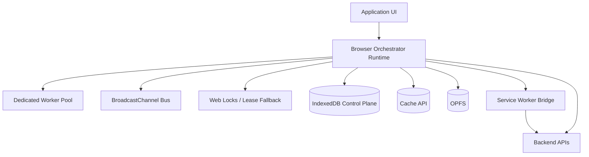
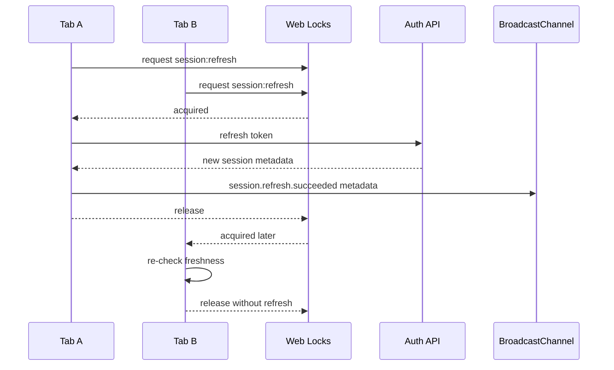
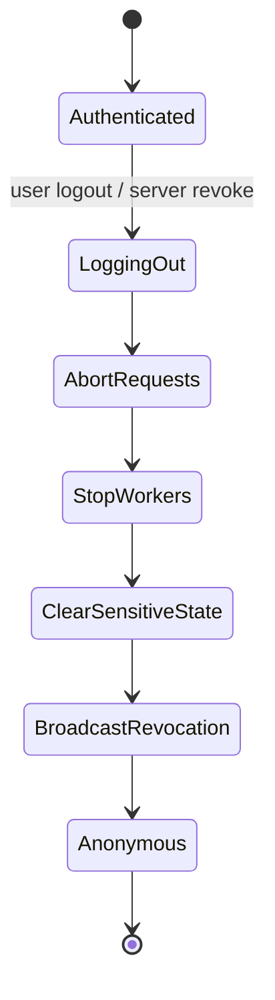
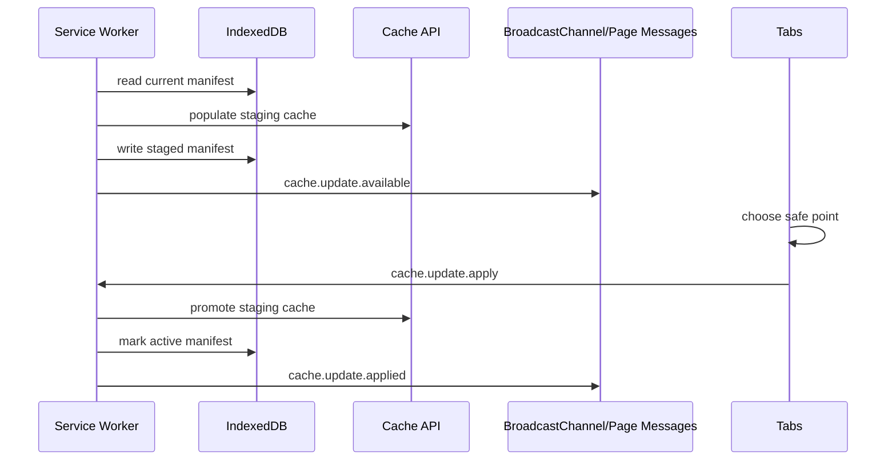
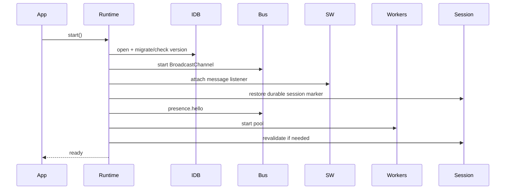
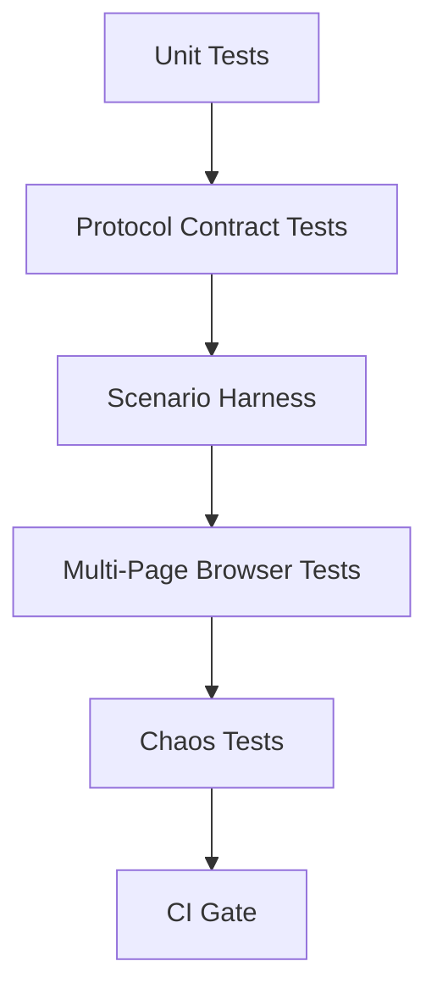
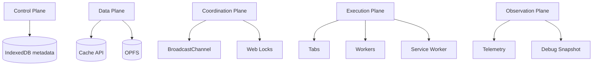

# Part 071 — Build From Scratch: Browser Orchestration Runtime

Kita sudah membahas API, protocol, lifecycle, storage, locks, Service Worker, worker pool, observability, testing, dan threat model. Sekarang kita akan membangun satu runtime kecil dari nol.

Bukan framework besar. Bukan library generik untuk semua aplikasi. Ini adalah **reference implementation** yang sengaja dibuat eksplisit supaya kamu paham bentuk sistemnya.

Target runtime:

1. Setiap tab punya identitas stabil untuk lifecycle tab tersebut.
2. Tab bisa saling memberi sinyal tanpa menyimpan rahasia di channel broadcast.
3. Hanya satu tab/worker menjalankan pekerjaan global tertentu.
4. Token refresh tidak storm.
5. Logout/revocation menyebar ke semua context.
6. Dedicated Worker menjalankan compute berat dengan queue, timeout, cancellation, dan stale guard.
7. Service Worker dipakai sebagai network/cache/update coordinator, bukan tempat menyimpan business secret.
8. IndexedDB menjadi control-plane durable store.
9. OPFS/Cache API menjadi data-plane store saat payload besar.
10. Semua event penting punya trace metadata.
11. Runtime bisa dites secara deterministic.

Prinsip penting:

> Browser orchestration runtime bukan sekadar kumpulan helper API. Ia adalah sistem terdistribusi kecil dengan transport unreliable, process lifecycle tidak stabil, storage bisa berubah versi, dan user bisa membuka banyak eksekutor untuk sesi yang sama.

---

## 1. Runtime Scope

Kita akan membangun modul bernama `browser-orchestrator`.

Runtime ini tidak mengambil alih UI framework. Ia berdiri di bawah React/Vue/Svelte/plain app sebagai infrastructure layer.



Boundary:

| Layer | Responsibility | Bukan Responsibility |
|---|---|---|
| UI app | Render, user interaction, domain command | Cross-tab ownership, low-level worker lifecycle |
| Runtime | Coordination, messaging, session state, locks, queues | Rendering business screen |
| Worker pool | CPU-heavy deterministic task | Secret ownership, DOM access |
| Service Worker | Fetch/cache/update coordination | Primary session reducer |
| IndexedDB | Durable control-plane state | Secure vault untuk token sensitif |
| BroadcastChannel | Volatile signal bus | Durable log, trusted identity, secret transport |
| Web Locks | Same-origin mutual exclusion | Distributed lock across devices/server |

---

## 2. Folder Structure

Kita mulai dari struktur yang maintainable.

```txt
src/
  orchestrator/
    index.ts
    runtime.ts
    config.ts

    identity/
      runtime-id.ts
      tab-id.ts
      generation.ts

    protocol/
      envelope.ts
      kinds.ts
      errors.ts
      validation.ts
      version.ts

    bus/
      bus.ts
      broadcast-channel-bus.ts
      in-memory-bus.ts

    locks/
      lock-client.ts
      web-locks-client.ts
      idb-lease-lock-client.ts

    storage/
      idb.ts
      schema.ts
      repositories.ts
      migrations.ts

    presence/
      presence-runtime.ts
      presence-store.ts
      heartbeat.ts

    session/
      session-state.ts
      session-reducer.ts
      token-refresh-coordinator.ts
      logout-coordinator.ts

    workers/
      worker-pool.ts
      worker-client.ts
      worker-protocol.ts
      worker-entry.ts
      task-queue.ts

    sw/
      service-worker-bridge.ts
      service-worker-messages.ts
      cache-update-coordinator.ts

    offline/
      outbox.ts
      replay-coordinator.ts
      idempotency.ts

    observability/
      telemetry.ts
      trace.ts
      debug-snapshot.ts

    lifecycle/
      page-lifecycle.ts
      shutdown.ts

    testing/
      fake-bus.ts
      fake-locks.ts
      fake-clock.ts
      scenario-harness.ts
```

Aturan desain:

1. Semua transport lewat interface.
2. Semua clock lewat injectable clock.
3. Semua ID generation lewat injectable ID generator.
4. Semua message divalidasi di boundary.
5. Semua side effect global lewat coordinator.
6. Semua pekerjaan yang bisa duplicate harus punya idempotency key atau fencing token.

---

## 3. Configuration Contract

Runtime harus eksplisit tentang policy. Jangan menyebarkan angka magic di banyak file.

```ts
export type OrchestratorConfig = {
  appId: string;
  appVersion: string;
  protocolVersion: number;
  environment: "dev" | "staging" | "prod";

  channels: {
    broadcastName: string;
  };

  presence: {
    heartbeatMs: number;
    ttlMs: number;
    suspectAfterMs: number;
  };

  locks: {
    namespace: string;
    defaultTimeoutMs: number;
    useIdbLeaseFallback: boolean;
  };

  workers: {
    enabled: boolean;
    maxWorkers: number;
    maxQueueSize: number;
    defaultTaskTimeoutMs: number;
    maxPayloadBytesBeforeTransfer: number;
  };

  session: {
    refreshSkewMs: number;
    refreshTimeoutMs: number;
    maxRefreshRetry: number;
  };

  offline: {
    replayBatchSize: number;
    replayLockTtlMs: number;
    maxAttempts: number;
  };

  observability: {
    sampleRate: number;
    debugEnabled: boolean;
    redactPayloads: boolean;
  };
};
```

Default production-ish:

```ts
export const defaultConfig: OrchestratorConfig = {
  appId: "case-platform",
  appVersion: "2026.07.08",
  protocolVersion: 1,
  environment: "prod",

  channels: {
    broadcastName: "case-platform:orchestrator:v1",
  },

  presence: {
    heartbeatMs: 5_000,
    suspectAfterMs: 15_000,
    ttlMs: 30_000,
  },

  locks: {
    namespace: "case-platform",
    defaultTimeoutMs: 10_000,
    useIdbLeaseFallback: true,
  },

  workers: {
    enabled: true,
    maxWorkers: Math.max(1, Math.min(4, navigator.hardwareConcurrency ?? 2)),
    maxQueueSize: 100,
    defaultTaskTimeoutMs: 30_000,
    maxPayloadBytesBeforeTransfer: 256 * 1024,
  },

  session: {
    refreshSkewMs: 60_000,
    refreshTimeoutMs: 12_000,
    maxRefreshRetry: 1,
  },

  offline: {
    replayBatchSize: 10,
    replayLockTtlMs: 30_000,
    maxAttempts: 8,
  },

  observability: {
    sampleRate: 1,
    debugEnabled: false,
    redactPayloads: true,
  },
};
```

Mental model:

- angka default harus conservative;
- runtime harus bisa degrade;
- policy harus bisa diubah tanpa mengubah protocol core;
- production incident biasanya butuh tuning cepat.

---

## 4. Runtime Identity

Kita butuh beberapa ID berbeda. Jangan campur.

| ID | Scope | Persist? | Dipakai untuk |
|---|---|---:|---|
| `tabId` | satu page lifetime | tidak | presence, ownership candidate |
| `connectionId` | satu channel connection | tidak | reconnect detection |
| `runtimeId` | satu boot runtime | tidak | trace |
| `sessionId` | auth session | tergantung app | session transition |
| `generation` | leadership/worker/session epoch | ya/semi-ya | stale guard |
| `traceId` | satu workflow | tidak | observability |
| `correlationId` | satu request/response | tidak | RPC |

```ts
export type RuntimeIdentity = {
  tabId: string;
  connectionId: string;
  runtimeId: string;
  bootTime: number;
};

export function createRuntimeIdentity(now = performance.now()): RuntimeIdentity {
  return {
    tabId: crypto.randomUUID(),
    connectionId: crypto.randomUUID(),
    runtimeId: crypto.randomUUID(),
    bootTime: now,
  };
}
```

Kenapa `tabId` tidak disimpan di `localStorage`?

Karena copy tab/restore/bfcache dapat membuat semantics ambigu. Untuk runtime orchestration, lebih aman menganggap setiap boot page sebagai eksekutor baru. Bila domain butuh stable tab identity lintas reload, buat identity layer terpisah dengan generation token.

---

## 5. Envelope Protocol

Transport browser tidak memberi protocol bisnis. Kita buat sendiri.

```ts
export type MessageScope =
  | "presence"
  | "session"
  | "worker"
  | "offline"
  | "cache"
  | "debug";

export type Envelope<TKind extends string = string, TPayload = unknown> = {
  protocolVersion: number;
  appId: string;
  appVersion: string;

  kind: TKind;
  scope: MessageScope;

  messageId: string;
  correlationId?: string;
  causationId?: string;
  traceId: string;

  sender: {
    tabId: string;
    connectionId: string;
    runtimeId: string;
    role: "tab" | "worker" | "shared-worker" | "service-worker";
  };

  target?: {
    tabId?: string;
    role?: string;
  };

  issuedAt: number;
  expiresAt?: number;
  generation?: number;
  idempotencyKey?: string;

  payload: TPayload;
};
```

Rules:

1. Setiap message punya `messageId`.
2. Request/response punya `correlationId`.
3. Workflow punya `traceId`.
4. Message boleh expired.
5. Message yang menyentuh state global harus membawa generation/fencing token.
6. Payload tidak boleh membawa secret kecuali channel dan receiver benar-benar private serta threat model mengizinkan.

Validation minimal:

```ts
export function isEnvelope(value: unknown): value is Envelope {
  if (!value || typeof value !== "object") return false;
  const record = value as Record<string, unknown>;

  return (
    typeof record.protocolVersion === "number" &&
    typeof record.appId === "string" &&
    typeof record.kind === "string" &&
    typeof record.scope === "string" &&
    typeof record.messageId === "string" &&
    typeof record.traceId === "string" &&
    typeof record.issuedAt === "number" &&
    typeof record.sender === "object"
  );
}
```

Production runtime sebaiknya memakai schema validator yang jelas, misalnya Zod/Valibot/io-ts, tetapi prinsipnya sama: validate at boundary.

---

## 6. Bus Interface

Kita mulai dari interface agar testable.

```ts
export type Unsubscribe = () => void;

export type BusHandler = (message: Envelope) => void;

export interface MessageBus {
  start(): void;
  publish(message: Envelope, transfer?: Transferable[]): void;
  subscribe(handler: BusHandler): Unsubscribe;
  close(): void;
}
```

BroadcastChannel implementation:

```ts
export class BroadcastChannelBus implements MessageBus {
  private channel?: BroadcastChannel;
  private handlers = new Set<BusHandler>();

  constructor(private readonly channelName: string) {}

  start(): void {
    if (this.channel) return;

    const channel = new BroadcastChannel(this.channelName);
    channel.onmessage = (event) => {
      const data = event.data;
      if (!isEnvelope(data)) return;
      for (const handler of this.handlers) handler(data);
    };

    channel.onmessageerror = () => {
      // telemetry: deserialization failure
    };

    this.channel = channel;
  }

  publish(message: Envelope): void {
    if (!this.channel) throw new Error("BroadcastChannelBus is not started");
    this.channel.postMessage(message);
  }

  subscribe(handler: BusHandler): Unsubscribe {
    this.handlers.add(handler);
    return () => this.handlers.delete(handler);
  }

  close(): void {
    this.channel?.close();
    this.channel = undefined;
    this.handlers.clear();
  }
}
```

Catatan penting:

- BroadcastChannel tidak mengirim message ke object channel yang sama yang melakukan `postMessage`, tetapi context lain dengan channel sama akan menerima.
- Jangan jadikan BroadcastChannel sebagai source of truth.
- Jangan mengirim access token/refresh token lewat BroadcastChannel.
- Selalu `close()` saat runtime shutdown.

---

## 7. Trace and Telemetry

Sebelum logic kompleks, pasang trace dulu. Kalau tidak, debugging multi-tab akan menyakitkan.

```ts
export type TelemetryEvent = {
  name: string;
  level: "debug" | "info" | "warn" | "error";
  traceId?: string;
  tabId?: string;
  runtimeId?: string;
  fields?: Record<string, unknown>;
  at: number;
};

export interface TelemetrySink {
  emit(event: TelemetryEvent): void;
}

export class ConsoleTelemetrySink implements TelemetrySink {
  emit(event: TelemetryEvent): void {
    if (event.level === "debug") return;
    console[event.level === "error" ? "error" : event.level](
      `[orchestrator] ${event.name}`,
      event,
    );
  }
}
```

Trace helper:

```ts
export function newTraceId(): string {
  return crypto.randomUUID();
}

export function childTrace(parent?: string): string {
  return parent ?? newTraceId();
}
```

Minimum telemetry dimensions:

| Dimension | Alasan |
|---|---|
| `tabId` | tahu tab mana yang bertindak |
| `runtimeId` | bedakan reload/runtime restart |
| `connectionId` | detect reconnect |
| `traceId` | ikat workflow lintas channel |
| `messageId` | dedupe/debug message |
| `lockName` | debug contention |
| `generation` | debug stale effect |
| `queueDepth` | debug overload |
| `appVersion` | debug rolling deploy |

---

## 8. Lock Client

Web Locks digunakan bila tersedia. Fallback IndexedDB lease dipakai hanya saat perlu degrade.

```ts
export type LockOptions = {
  timeoutMs?: number;
  ifAvailable?: boolean;
  signal?: AbortSignal;
};

export interface LockClient {
  withLock<T>(
    name: string,
    options: LockOptions,
    callback: (lock: { name: string; acquiredAt: number }) => Promise<T>,
  ): Promise<T | undefined>;
}
```

Web Locks implementation:

```ts
export class WebLocksClient implements LockClient {
  constructor(private readonly namespace: string) {}

  async withLock<T>(
    name: string,
    options: LockOptions,
    callback: (lock: { name: string; acquiredAt: number }) => Promise<T>,
  ): Promise<T | undefined> {
    if (!("locks" in navigator)) {
      throw new Error("Web Locks API is not available");
    }

    const fullName = `${this.namespace}:${name}`;
    const controller = new AbortController();
    const timeout = window.setTimeout(
      () => controller.abort(new DOMException("Lock timeout", "AbortError")),
      options.timeoutMs ?? 10_000,
    );

    if (options.signal) {
      options.signal.addEventListener("abort", () => controller.abort(options.signal?.reason), {
        once: true,
      });
    }

    try {
      return await navigator.locks.request(
        fullName,
        {
          mode: "exclusive",
          ifAvailable: options.ifAvailable,
          signal: controller.signal,
        },
        async (lock) => {
          if (!lock) return undefined;
          return callback({ name: fullName, acquiredAt: performance.now() });
        },
      );
    } finally {
      window.clearTimeout(timeout);
    }
  }
}
```

Lock rules:

1. Lock callback harus pendek atau punya heartbeat internal.
2. Jangan await user interaction di dalam lock.
3. Jangan pegang lock sambil menunggu event yang bisa hilang.
4. Global side effect tetap butuh fencing token bila receiver bisa menerima efek stale.
5. Lock name harus resource-scoped, bukan satu lock raksasa untuk semua hal.

Contoh lock names:

```txt
session:refresh
session:logout
outbox:replay
cache:promote:assets-v42
migration:idb:v12
notification:suppress:case-assigned
```

---

## 9. IndexedDB Control Plane

Kita gunakan IndexedDB untuk metadata durable.

Object store minimal:

| Store | Key | Isi |
|---|---|---|
| `meta` | `key` | app version, schema marker, last cleanup |
| `presence` | `tabId` | last heartbeat snapshot |
| `session_events` | auto/sequence | session transition durable marker |
| `outbox` | `idempotencyKey` | offline command pending/retrying/done |
| `dedupe` | `key` | seen message/result marker |
| `locks` | `name` | fallback lease record |
| `debug_events` | auto/sequence | sampled debug event ring |

Schema:

```ts
export const DB_NAME = "case-platform-orchestrator";
export const DB_VERSION = 1;

export function openOrchestratorDb(): Promise<IDBDatabase> {
  return new Promise((resolve, reject) => {
    const request = indexedDB.open(DB_NAME, DB_VERSION);

    request.onupgradeneeded = () => {
      const db = request.result;

      if (!db.objectStoreNames.contains("meta")) {
        db.createObjectStore("meta", { keyPath: "key" });
      }

      if (!db.objectStoreNames.contains("presence")) {
        db.createObjectStore("presence", { keyPath: "tabId" });
      }

      if (!db.objectStoreNames.contains("session_events")) {
        const store = db.createObjectStore("session_events", {
          keyPath: "seq",
          autoIncrement: true,
        });
        store.createIndex("by_session", "sessionId");
      }

      if (!db.objectStoreNames.contains("outbox")) {
        const store = db.createObjectStore("outbox", { keyPath: "idempotencyKey" });
        store.createIndex("by_status", "status");
        store.createIndex("by_nextAttemptAt", "nextAttemptAt");
      }

      if (!db.objectStoreNames.contains("dedupe")) {
        db.createObjectStore("dedupe", { keyPath: "key" });
      }

      if (!db.objectStoreNames.contains("locks")) {
        db.createObjectStore("locks", { keyPath: "name" });
      }

      if (!db.objectStoreNames.contains("debug_events")) {
        db.createObjectStore("debug_events", { keyPath: "seq", autoIncrement: true });
      }
    };

    request.onsuccess = () => {
      const db = request.result;

      db.onversionchange = () => {
        db.close();
        window.dispatchEvent(new CustomEvent("orchestrator:idb-versionchange"));
      };

      db.onclose = () => {
        window.dispatchEvent(new CustomEvent("orchestrator:idb-close"));
      };

      resolve(db);
    };

    request.onerror = () => reject(request.error);
    request.onblocked = () => {
      window.dispatchEvent(new CustomEvent("orchestrator:idb-blocked"));
    };
  });
}
```

Rule penting:

- satu transaction untuk satu invariant;
- jangan simpan object graph raksasa;
- payload besar pakai OPFS/Cache dan simpan reference di IndexedDB;
- migration harus sadar multi-tab;
- jangan buka connection terlalu banyak tanpa lifecycle strategy.

---

## 10. Presence Runtime

Presence bukan kebenaran absolut. Presence adalah suspicion model.

```ts
export type PresenceRecord = {
  tabId: string;
  connectionId: string;
  runtimeId: string;
  appVersion: string;
  visible: boolean;
  focused: boolean;
  lastSeenAt: number;
  status: "alive" | "suspect" | "expired";
};
```

Protocol kinds:

```ts
export type PresenceKind =
  | "presence.hello"
  | "presence.heartbeat"
  | "presence.bye"
  | "presence.query"
  | "presence.snapshot";
```

Runtime:

```ts
export class PresenceRuntime {
  private timer?: number;
  private visible = document.visibilityState === "visible";
  private focused = document.hasFocus();

  constructor(
    private readonly identity: RuntimeIdentity,
    private readonly config: OrchestratorConfig,
    private readonly bus: MessageBus,
    private readonly telemetry: TelemetrySink,
  ) {}

  start(): void {
    this.bus.subscribe((message) => this.onMessage(message));
    window.addEventListener("focus", this.onFocus);
    window.addEventListener("blur", this.onBlur);
    document.addEventListener("visibilitychange", this.onVisibilityChange);
    window.addEventListener("pagehide", this.onPageHide);

    this.publish("presence.hello");
    this.timer = window.setInterval(
      () => this.publish("presence.heartbeat"),
      this.config.presence.heartbeatMs,
    );
  }

  stop(): void {
    this.publish("presence.bye");
    if (this.timer) window.clearInterval(this.timer);
    window.removeEventListener("focus", this.onFocus);
    window.removeEventListener("blur", this.onBlur);
    document.removeEventListener("visibilitychange", this.onVisibilityChange);
    window.removeEventListener("pagehide", this.onPageHide);
  }

  private publish(kind: PresenceKind): void {
    const now = Date.now();
    this.bus.publish({
      protocolVersion: this.config.protocolVersion,
      appId: this.config.appId,
      appVersion: this.config.appVersion,
      kind,
      scope: "presence",
      messageId: crypto.randomUUID(),
      traceId: crypto.randomUUID(),
      sender: {
        tabId: this.identity.tabId,
        connectionId: this.identity.connectionId,
        runtimeId: this.identity.runtimeId,
        role: "tab",
      },
      issuedAt: now,
      expiresAt: now + this.config.presence.ttlMs,
      payload: {
        visible: this.visible,
        focused: this.focused,
      },
    });
  }

  private onMessage(message: Envelope): void {
    if (message.scope !== "presence") return;
    if (message.sender.tabId === this.identity.tabId) return;

    this.telemetry.emit({
      name: "presence.message.received",
      level: "debug",
      traceId: message.traceId,
      tabId: this.identity.tabId,
      runtimeId: this.identity.runtimeId,
      at: Date.now(),
      fields: {
        kind: message.kind,
        remoteTabId: message.sender.tabId,
      },
    });
  }

  private onFocus = () => {
    this.focused = true;
    this.publish("presence.heartbeat");
  };

  private onBlur = () => {
    this.focused = false;
    this.publish("presence.heartbeat");
  };

  private onVisibilityChange = () => {
    this.visible = document.visibilityState === "visible";
    this.publish("presence.heartbeat");
  };

  private onPageHide = () => {
    this.publish("presence.bye");
  };
}
```

Production additions:

- write self heartbeat snapshot to IndexedDB;
- sweep expired records;
- expose `getPresenceSnapshot()`;
- expose `onPresenceChanged()`;
- treat `BYE` as optimization, not guarantee;
- do not elect leader purely from presence without lock/lease.

---

## 11. Session State Reducer

Session state harus dimodelkan sebagai state machine.

```ts
export type SessionState =
  | { status: "unknown" }
  | { status: "anonymous"; generation: number }
  | { status: "authenticated"; sessionId: string; userId: string; expiresAt: number; generation: number }
  | { status: "refreshing"; sessionId: string; previousGeneration: number }
  | { status: "revoked"; reason: string; generation: number }
  | { status: "logging_out"; sessionId?: string; generation: number };
```

Events:

```ts
export type SessionEvent =
  | { type: "session.restored"; sessionId: string; userId: string; expiresAt: number; generation: number }
  | { type: "session.refresh.started"; sessionId: string; generation: number }
  | { type: "session.refresh.succeeded"; sessionId: string; expiresAt: number; generation: number }
  | { type: "session.refresh.failed"; reason: string; generation: number }
  | { type: "session.revoked"; reason: string; generation: number }
  | { type: "session.logout.started"; generation: number }
  | { type: "session.logout.completed"; generation: number };
```

Reducer:

```ts
export function reduceSession(state: SessionState, event: SessionEvent): SessionState {
  const currentGeneration = "generation" in state ? state.generation : 0;

  if (event.generation < currentGeneration) {
    return state;
  }

  switch (event.type) {
    case "session.restored":
      return {
        status: "authenticated",
        sessionId: event.sessionId,
        userId: event.userId,
        expiresAt: event.expiresAt,
        generation: event.generation,
      };

    case "session.refresh.started":
      if (state.status !== "authenticated") return state;
      return {
        status: "refreshing",
        sessionId: event.sessionId,
        previousGeneration: state.generation,
      };

    case "session.refresh.succeeded":
      return {
        status: "authenticated",
        sessionId: event.sessionId,
        userId: state.status === "authenticated" ? state.userId : "unknown",
        expiresAt: event.expiresAt,
        generation: event.generation,
      };

    case "session.refresh.failed":
      return {
        status: "revoked",
        reason: event.reason,
        generation: event.generation,
      };

    case "session.revoked":
      return {
        status: "revoked",
        reason: event.reason,
        generation: event.generation,
      };

    case "session.logout.started":
      return {
        status: "logging_out",
        generation: event.generation,
      };

    case "session.logout.completed":
      return {
        status: "anonymous",
        generation: event.generation,
      };
  }
}
```

Invariant:

1. Session transition harus monotonic.
2. Stale refresh response tidak boleh menghidupkan session yang sudah logout.
3. Revocation menang atas refresh.
4. Logout harus abort in-flight protected request.
5. Broadcast hanya metadata transition, bukan token rahasia.

---

## 12. Token Refresh Coordinator

Problem: user membuka 6 tab, semua mendeteksi token hampir expired, semua refresh bersamaan. Dengan refresh token rotation, ini bisa memutus session.

Design:



Implementation skeleton:

```ts
export class TokenRefreshCoordinator {
  constructor(
    private readonly lockClient: LockClient,
    private readonly bus: MessageBus,
    private readonly getSession: () => SessionState,
    private readonly persistEvent: (event: SessionEvent) => Promise<void>,
    private readonly applyEvent: (event: SessionEvent) => void,
    private readonly refreshFromServer: () => Promise<{ sessionId: string; expiresAt: number; generation: number }>,
    private readonly config: OrchestratorConfig,
  ) {}

  async refreshIfNeeded(reason: "startup" | "timer" | "401" | "visible"): Promise<void> {
    const before = this.getSession();
    if (!this.shouldRefresh(before)) return;

    await this.lockClient.withLock(
      "session:refresh",
      { timeoutMs: this.config.session.refreshTimeoutMs },
      async () => {
        const current = this.getSession();
        if (!this.shouldRefresh(current)) return;
        if (current.status !== "authenticated") return;

        const startGeneration = current.generation + 1;
        await this.commitAndBroadcast({
          type: "session.refresh.started",
          sessionId: current.sessionId,
          generation: startGeneration,
        });

        try {
          const result = await this.refreshFromServer();

          const latest = this.getSession();
          if ("generation" in latest && latest.generation > startGeneration) {
            return;
          }

          await this.commitAndBroadcast({
            type: "session.refresh.succeeded",
            sessionId: result.sessionId,
            expiresAt: result.expiresAt,
            generation: result.generation,
          });
        } catch (error) {
          await this.commitAndBroadcast({
            type: "session.refresh.failed",
            reason: error instanceof Error ? error.message : "unknown",
            generation: startGeneration + 1,
          });
        }
      },
    );
  }

  private shouldRefresh(state: SessionState): boolean {
    if (state.status !== "authenticated") return false;
    return Date.now() >= state.expiresAt - this.config.session.refreshSkewMs;
  }

  private async commitAndBroadcast(event: SessionEvent): Promise<void> {
    await this.persistEvent(event);
    this.applyEvent(event);

    this.bus.publish({
      protocolVersion: this.config.protocolVersion,
      appId: this.config.appId,
      appVersion: this.config.appVersion,
      kind: event.type,
      scope: "session",
      messageId: crypto.randomUUID(),
      traceId: crypto.randomUUID(),
      sender: {
        tabId: "current-tab", // inject real identity in production implementation
        connectionId: "current-connection",
        runtimeId: "current-runtime",
        role: "tab",
      },
      issuedAt: Date.now(),
      generation: "generation" in event ? event.generation : undefined,
      payload: event,
    });
  }
}
```

Production improvement:

- inject identity instead of placeholder;
- make token storage policy explicit;
- make protected fetch read current session just-in-time;
- treat 401 as signal to reconcile, not blindly refresh forever;
- abort stale protected requests on logout/revocation;
- record refresh attempt metrics.

---

## 13. Logout Coordinator

Logout harus menjadi transaction, bukan cuma `removeItem("token")`.



Skeleton:

```ts
export class LogoutCoordinator {
  constructor(
    private readonly lockClient: LockClient,
    private readonly bus: MessageBus,
    private readonly abortProtectedRequests: () => void,
    private readonly stopWorkers: () => Promise<void>,
    private readonly clearSensitiveState: () => Promise<void>,
    private readonly persistEvent: (event: SessionEvent) => Promise<void>,
    private readonly applyEvent: (event: SessionEvent) => void,
    private readonly config: OrchestratorConfig,
    private readonly identity: RuntimeIdentity,
  ) {}

  async logout(reason: string): Promise<void> {
    await this.lockClient.withLock("session:logout", { timeoutMs: 10_000 }, async () => {
      const generation = Date.now();

      await this.commitAndBroadcast({
        type: "session.logout.started",
        generation,
      });

      this.abortProtectedRequests();
      await this.stopWorkers();
      await this.clearSensitiveState();

      await this.commitAndBroadcast({
        type: "session.logout.completed",
        generation: generation + 1,
      });
    });
  }

  async onRemoteRevocation(event: SessionEvent): Promise<void> {
    if (event.type !== "session.revoked" && event.type !== "session.logout.started") return;
    this.abortProtectedRequests();
    await this.stopWorkers();
    await this.clearSensitiveState();
    this.applyEvent(event);
  }

  private async commitAndBroadcast(event: SessionEvent): Promise<void> {
    await this.persistEvent(event);
    this.applyEvent(event);

    this.bus.publish({
      protocolVersion: this.config.protocolVersion,
      appId: this.config.appId,
      appVersion: this.config.appVersion,
      kind: event.type,
      scope: "session",
      messageId: crypto.randomUUID(),
      traceId: crypto.randomUUID(),
      sender: {
        tabId: this.identity.tabId,
        connectionId: this.identity.connectionId,
        runtimeId: this.identity.runtimeId,
        role: "tab",
      },
      issuedAt: Date.now(),
      generation: event.generation,
      payload: event,
    });
  }
}
```

Cleanup order matters:

1. Mark transition first.
2. Abort in-flight requests.
3. Stop workers that may hold stale state.
4. Clear sensitive memory/storage/cache.
5. Broadcast metadata.
6. Redirect UI only after local cleanup has started.

---

## 14. Protected Fetch Adapter

Protected fetch harus membaca session saat request akan dikirim, bukan saat function dibuat.

```ts
export class ProtectedFetch {
  private controllers = new Set<AbortController>();

  constructor(
    private readonly getSession: () => SessionState,
    private readonly refreshCoordinator: TokenRefreshCoordinator,
  ) {}

  async request(input: RequestInfo, init: RequestInit = {}): Promise<Response> {
    await this.refreshCoordinator.refreshIfNeeded("timer");

    const session = this.getSession();
    if (session.status !== "authenticated") {
      throw new Error("Not authenticated");
    }

    const controller = new AbortController();
    this.controllers.add(controller);

    try {
      const response = await fetch(input, {
        ...init,
        signal: controller.signal,
        headers: {
          ...Object.fromEntries(new Headers(init.headers).entries()),
          "X-Session-Generation": String(session.generation),
        },
      });

      if (response.status === 401) {
        await this.refreshCoordinator.refreshIfNeeded("401");
        // caller decides whether to retry; do not infinite-loop here
      }

      return response;
    } finally {
      this.controllers.delete(controller);
    }
  }

  abortAll(reason = "session-transition"): void {
    for (const controller of this.controllers) {
      controller.abort(reason);
    }
    this.controllers.clear();
  }
}
```

Invariant:

- protected request tidak boleh outlive logout;
- retry harus bounded;
- stale response harus dicek terhadap session generation;
- 401 bukan selalu “token expired”; bisa revocation/permission/tenant mismatch.

---

## 15. Worker Pool Runtime

Worker pool harus bounded. `postMessage` bukan queue dengan backpressure.

Task contract:

```ts
export type WorkerTaskKind =
  | "csv.parse"
  | "search.index"
  | "document.diff"
  | "rule.evaluate"
  | "payload.compress";

export type WorkerTask = {
  taskId: string;
  kind: WorkerTaskKind;
  traceId: string;
  createdAt: number;
  deadlineAt: number;
  generation: number;
  payload: unknown;
  transfer?: Transferable[];
};

export type WorkerTaskResult =
  | { ok: true; taskId: string; generation: number; result: unknown }
  | { ok: false; taskId: string; generation: number; error: { code: string; message: string } };
```

Pool skeleton:

```ts
export class WorkerPool {
  private workers: Worker[] = [];
  private queue: WorkerTask[] = [];
  private pending = new Map<string, {
    resolve: (value: unknown) => void;
    reject: (error: unknown) => void;
    timeout: number;
    generation: number;
  }>();

  private nextWorker = 0;
  private generation = 1;

  constructor(
    private readonly config: OrchestratorConfig,
    private readonly telemetry: TelemetrySink,
  ) {}

  start(): void {
    if (!this.config.workers.enabled) return;
    for (let i = 0; i < this.config.workers.maxWorkers; i++) {
      this.spawnWorker(i);
    }
  }

  execute<T>(kind: WorkerTaskKind, payload: unknown, options?: { timeoutMs?: number; transfer?: Transferable[] }): Promise<T> {
    if (this.queue.length + this.pending.size >= this.config.workers.maxQueueSize) {
      return Promise.reject(new Error("Worker pool overloaded"));
    }

    const now = Date.now();
    const task: WorkerTask = {
      taskId: crypto.randomUUID(),
      kind,
      traceId: crypto.randomUUID(),
      createdAt: now,
      deadlineAt: now + (options?.timeoutMs ?? this.config.workers.defaultTaskTimeoutMs),
      generation: this.generation,
      payload,
      transfer: options?.transfer,
    };

    return new Promise<T>((resolve, reject) => {
      const timeout = window.setTimeout(() => {
        this.pending.delete(task.taskId);
        reject(new Error(`Worker task timed out: ${task.kind}`));
      }, options?.timeoutMs ?? this.config.workers.defaultTaskTimeoutMs);

      this.pending.set(task.taskId, {
        resolve: resolve as (value: unknown) => void,
        reject,
        timeout,
        generation: task.generation,
      });

      this.dispatch(task);
    });
  }

  async stop(): Promise<void> {
    this.generation++;

    for (const pending of this.pending.values()) {
      window.clearTimeout(pending.timeout);
      pending.reject(new Error("Worker pool stopped"));
    }
    this.pending.clear();
    this.queue = [];

    for (const worker of this.workers) {
      worker.terminate();
    }
    this.workers = [];
  }

  private spawnWorker(index: number): void {
    const worker = new Worker(new URL("./worker-entry.ts", import.meta.url), {
      type: "module",
      name: `orchestrator-worker-${index}`,
    });

    worker.onmessage = (event: MessageEvent<WorkerTaskResult>) => this.onWorkerResult(event.data);
    worker.onerror = (event) => {
      this.telemetry.emit({
        name: "worker.error",
        level: "error",
        at: Date.now(),
        fields: { message: event.message, filename: event.filename, lineno: event.lineno },
      });
      worker.terminate();
      this.spawnWorker(index);
    };

    worker.onmessageerror = () => {
      this.telemetry.emit({ name: "worker.messageerror", level: "error", at: Date.now() });
    };

    this.workers[index] = worker;
  }

  private dispatch(task: WorkerTask): void {
    const worker = this.workers[this.nextWorker % this.workers.length];
    this.nextWorker++;
    worker.postMessage(task, task.transfer ?? []);
  }

  private onWorkerResult(result: WorkerTaskResult): void {
    const pending = this.pending.get(result.taskId);
    if (!pending) return;

    if (result.generation !== pending.generation) {
      return;
    }

    window.clearTimeout(pending.timeout);
    this.pending.delete(result.taskId);

    if (result.ok) pending.resolve(result.result);
    else pending.reject(new Error(result.error.message));
  }
}
```

Worker entry:

```ts
self.onmessage = async (event: MessageEvent<WorkerTask>) => {
  const task = event.data;

  if (Date.now() > task.deadlineAt) {
    self.postMessage({
      ok: false,
      taskId: task.taskId,
      generation: task.generation,
      error: { code: "deadline_exceeded", message: "Task expired before execution" },
    } satisfies WorkerTaskResult);
    return;
  }

  try {
    const result = await executeTask(task);
    self.postMessage({
      ok: true,
      taskId: task.taskId,
      generation: task.generation,
      result,
    } satisfies WorkerTaskResult);
  } catch (error) {
    self.postMessage({
      ok: false,
      taskId: task.taskId,
      generation: task.generation,
      error: {
        code: "task_failed",
        message: error instanceof Error ? error.message : "unknown",
      },
    } satisfies WorkerTaskResult);
  }
};

async function executeTask(task: WorkerTask): Promise<unknown> {
  switch (task.kind) {
    case "csv.parse":
      return parseCsv(task.payload);
    case "search.index":
      return buildIndex(task.payload);
    case "document.diff":
      return diffDocuments(task.payload);
    case "rule.evaluate":
      return evaluateRules(task.payload);
    case "payload.compress":
      return compressPayload(task.payload);
    default:
      throw new Error(`Unknown task kind: ${(task as WorkerTask).kind}`);
  }
}
```

Production warnings:

- `terminate()` is immediate; pending tasks must be rejected by owner.
- Worker result can arrive after caller no longer cares; generation guards are mandatory.
- Payload copy can dominate compute; transfer `ArrayBuffer` when ownership can move.
- Worker pool size must respect device concurrency and memory budget.

---

## 16. Service Worker Bridge

The page runtime needs a thin bridge.

```ts
export class ServiceWorkerBridge {
  private handlers = new Set<(message: Envelope) => void>();

  constructor(
    private readonly config: OrchestratorConfig,
    private readonly identity: RuntimeIdentity,
    private readonly telemetry: TelemetrySink,
  ) {}

  start(): void {
    if (!("serviceWorker" in navigator)) return;

    navigator.serviceWorker.addEventListener("message", (event) => {
      const data = event.data;
      if (!isEnvelope(data)) return;
      for (const handler of this.handlers) handler(data);
    });

    navigator.serviceWorker.addEventListener("controllerchange", () => {
      this.telemetry.emit({
        name: "service_worker.controllerchange",
        level: "info",
        tabId: this.identity.tabId,
        runtimeId: this.identity.runtimeId,
        at: Date.now(),
      });
    });
  }

  subscribe(handler: (message: Envelope) => void): Unsubscribe {
    this.handlers.add(handler);
    return () => this.handlers.delete(handler);
  }

  post(kind: string, scope: MessageScope, payload: unknown): void {
    const controller = navigator.serviceWorker?.controller;
    if (!controller) return;

    controller.postMessage({
      protocolVersion: this.config.protocolVersion,
      appId: this.config.appId,
      appVersion: this.config.appVersion,
      kind,
      scope,
      messageId: crypto.randomUUID(),
      traceId: crypto.randomUUID(),
      sender: {
        tabId: this.identity.tabId,
        connectionId: this.identity.connectionId,
        runtimeId: this.identity.runtimeId,
        role: "tab",
      },
      issuedAt: Date.now(),
      payload,
    } satisfies Envelope);
  }
}
```

Service Worker side minimal:

```ts
self.addEventListener("message", (event) => {
  const data = event.data;
  if (!data || typeof data !== "object") return;

  if (data.kind === "client.ready") {
    event.waitUntil(broadcastToClients("sw.client-ack", { ok: true }));
  }
});

async function broadcastToClients(kind: string, payload: unknown): Promise<void> {
  const clientsList = await self.clients.matchAll({
    type: "window",
    includeUncontrolled: true,
  });

  for (const client of clientsList) {
    client.postMessage({
      protocolVersion: 1,
      appId: "case-platform",
      appVersion: "from-sw-build",
      kind,
      scope: "cache",
      messageId: crypto.randomUUID(),
      traceId: crypto.randomUUID(),
      sender: {
        tabId: "service-worker",
        connectionId: "service-worker",
        runtimeId: "service-worker",
        role: "service-worker",
      },
      issuedAt: Date.now(),
      payload,
    });
  }
}
```

Do not overload Service Worker:

- do not keep long-running business session reducer there;
- do not assume it is always alive;
- do not store raw secrets in global variables;
- do not force update without app-level safe point;
- do not make cache update invisible to active tabs.

---

## 17. Offline Outbox

Outbox record:

```ts
export type OutboxRecord = {
  idempotencyKey: string;
  commandType: string;
  status: "pending" | "claimed" | "sending" | "acked" | "failed" | "dead";
  payloadRef?: string;
  payloadInline?: unknown;
  createdAt: number;
  updatedAt: number;
  nextAttemptAt: number;
  attempts: number;
  claimedBy?: string;
  claimExpiresAt?: number;
  sessionGeneration: number;
  dependencyKeys?: string[];
};
```

Replay coordinator:

```ts
export class ReplayCoordinator {
  constructor(
    private readonly lockClient: LockClient,
    private readonly listDueRecords: () => Promise<OutboxRecord[]>,
    private readonly markSending: (key: string) => Promise<void>,
    private readonly markAcked: (key: string) => Promise<void>,
    private readonly markRetry: (key: string, reason: string) => Promise<void>,
    private readonly sendCommand: (record: OutboxRecord) => Promise<Response>,
    private readonly getSession: () => SessionState,
    private readonly config: OrchestratorConfig,
  ) {}

  async replay(reason: "online" | "startup" | "sync" | "manual"): Promise<void> {
    await this.lockClient.withLock(
      "outbox:replay",
      { timeoutMs: this.config.offline.replayLockTtlMs },
      async () => {
        const session = this.getSession();
        if (session.status !== "authenticated") return;

        const records = await this.listDueRecords();
        for (const record of records.slice(0, this.config.offline.replayBatchSize)) {
          if (record.sessionGeneration > session.generation) continue;

          try {
            await this.markSending(record.idempotencyKey);
            const response = await this.sendCommand(record);

            if (response.ok || response.status === 409) {
              await this.markAcked(record.idempotencyKey);
            } else if (response.status === 401 || response.status === 403) {
              await this.markRetry(record.idempotencyKey, `auth:${response.status}`);
              break;
            } else {
              await this.markRetry(record.idempotencyKey, `http:${response.status}`);
            }
          } catch (error) {
            await this.markRetry(
              record.idempotencyKey,
              error instanceof Error ? error.message : "unknown",
            );
          }
        }
      },
    );
  }
}
```

Important semantics:

- `acked` means receiver accepted/deduped command;
- network timeout means unknown outcome, not failure;
- retry must carry same idempotency key;
- dependency graph prevents replaying child mutation before parent mutation;
- auth transition pauses replay;
- logout/revocation should either discard or quarantine session-bound outbox records depending domain.

---

## 18. Cache Update Coordinator

Cache update is a versioned artifact promotion problem.

```ts
export type CacheManifest = {
  version: string;
  assets: Array<{
    url: string;
    revision: string;
    integrity?: string;
  }>;
  createdAt: number;
};
```

Update flow:



Runtime principle:

- download can happen in background;
- promotion should happen at safe point;
- old tabs may still run old JS;
- cache cleanup must not delete assets still needed by currently controlled clients;
- update UX should be explicit for business-critical apps.

---

## 19. Main Runtime Composition

Now compose.

```ts
export class BrowserOrchestratorRuntime {
  readonly identity = createRuntimeIdentity();

  private readonly telemetry: TelemetrySink;
  private readonly bus: MessageBus;
  private readonly locks: LockClient;
  private readonly presence: PresenceRuntime;
  private readonly workerPool: WorkerPool;
  private readonly swBridge: ServiceWorkerBridge;

  private started = false;

  constructor(private readonly config: OrchestratorConfig) {
    this.telemetry = new ConsoleTelemetrySink();
    this.bus = new BroadcastChannelBus(config.channels.broadcastName);
    this.locks = new WebLocksClient(config.locks.namespace);
    this.presence = new PresenceRuntime(this.identity, config, this.bus, this.telemetry);
    this.workerPool = new WorkerPool(config, this.telemetry);
    this.swBridge = new ServiceWorkerBridge(config, this.identity, this.telemetry);
  }

  async start(): Promise<void> {
    if (this.started) return;
    this.started = true;

    this.telemetry.emit({
      name: "runtime.starting",
      level: "info",
      tabId: this.identity.tabId,
      runtimeId: this.identity.runtimeId,
      at: Date.now(),
      fields: { appVersion: this.config.appVersion },
    });

    this.bus.start();
    this.swBridge.start();
    this.presence.start();
    this.workerPool.start();

    this.bus.subscribe((message) => this.routeMessage(message));

    window.addEventListener("pagehide", () => this.onPageHide());
    document.addEventListener("visibilitychange", () => this.onVisibilityChange());

    this.swBridge.post("client.ready", "debug", {
      tabId: this.identity.tabId,
      appVersion: this.config.appVersion,
    });

    this.telemetry.emit({
      name: "runtime.started",
      level: "info",
      tabId: this.identity.tabId,
      runtimeId: this.identity.runtimeId,
      at: Date.now(),
    });
  }

  async stop(): Promise<void> {
    if (!this.started) return;
    this.started = false;

    this.presence.stop();
    await this.workerPool.stop();
    this.bus.close();

    this.telemetry.emit({
      name: "runtime.stopped",
      level: "info",
      tabId: this.identity.tabId,
      runtimeId: this.identity.runtimeId,
      at: Date.now(),
    });
  }

  async compute<T>(kind: WorkerTaskKind, payload: unknown): Promise<T> {
    return this.workerPool.execute<T>(kind, payload);
  }

  private routeMessage(message: Envelope): void {
    if (message.appId !== this.config.appId) return;
    if (message.protocolVersion !== this.config.protocolVersion) return;
    if (message.sender.runtimeId === this.identity.runtimeId) return;
    if (message.expiresAt && Date.now() > message.expiresAt) return;

    switch (message.scope) {
      case "presence":
        return;
      case "session":
        return this.onSessionMessage(message);
      case "offline":
        return this.onOfflineMessage(message);
      case "cache":
        return this.onCacheMessage(message);
      case "debug":
        return this.onDebugMessage(message);
      case "worker":
        return;
    }
  }

  private onSessionMessage(message: Envelope): void {
    // validate payload as SessionEvent, apply reducer, trigger cleanup if needed
  }

  private onOfflineMessage(message: Envelope): void {
    // trigger replay attempt or outbox snapshot refresh
  }

  private onCacheMessage(message: Envelope): void {
    // notify UI about cache update / stale bundle / safe reload
  }

  private onDebugMessage(message: Envelope): void {
    // maybe respond to snapshot request if debug enabled
  }

  private onVisibilityChange(): void {
    if (document.visibilityState === "visible") {
      // reconcile session, outbox, cache update, presence snapshot
    }
  }

  private onPageHide(): void {
    // best-effort flush small telemetry / BYE handled by presence
  }
}
```

App usage:

```ts
const orchestrator = new BrowserOrchestratorRuntime(defaultConfig);
await orchestrator.start();

const parsed = await orchestrator.compute("csv.parse", fileBuffer);
```

---

## 20. Startup Sequence

Startup must be ordered.



Boot phases:

| Phase | Blocking? | Failure policy |
|---|---:|---|
| Config validation | yes | fail fast |
| IndexedDB open | usually yes | degraded mode or fatal depending app |
| Bus start | yes | fallback bus or degraded |
| Session restore | yes for protected apps | unauthenticated/reconcile |
| Worker pool start | no | main-thread fallback or disable features |
| SW bridge attach | no | app still works without offline/cache bridge |
| Presence hello | no | best effort |
| Outbox replay | no | background attempt |

Startup anti-pattern:

```ts
// Bad: UI renders authenticated state before session reconciliation.
renderApp();
orchestrator.start();
```

Better:

```ts
await orchestrator.start();
renderApp();
```

Or render shell only until session runtime is ready.

---

## 21. Shutdown Sequence

Shutdown cannot be fully reliable, but we still implement best-effort cleanup.

Events to consider:

- explicit app shutdown;
- user logout;
- pagehide;
- visibility hidden;
- worker fatal error;
- IDB versionchange;
- Service Worker controllerchange;
- before deploy reload prompt.

Best effort:

```ts
window.addEventListener("pagehide", () => {
  try {
    orchestrator.stop();
  } catch {
    // do not block navigation
  }
});
```

But do not depend on shutdown for correctness. Correctness comes from:

- TTL;
- lease expiry;
- generation token;
- idempotency key;
- startup reconciliation;
- receiver-side stale rejection.

---

## 22. Debug Snapshot

Every production runtime needs snapshot.

```ts
export type DebugSnapshot = {
  identity: RuntimeIdentity;
  appVersion: string;
  protocolVersion: number;
  document: {
    visibilityState: DocumentVisibilityState;
    focused: boolean;
  };
  bus: {
    channelName: string;
  };
  workers: {
    count: number;
    pending: number;
    queueDepth: number;
    generation: number;
  };
  session: SessionState;
  locks?: unknown;
  outbox?: {
    pending: number;
    retrying: number;
    dead: number;
  };
};
```

Expose only in dev/debug mode:

```ts
if (config.observability.debugEnabled) {
  Object.assign(window, {
    __ORCHESTRATOR__: {
      snapshot: () => orchestrator.getDebugSnapshot(),
      stop: () => orchestrator.stop(),
    },
  });
}
```

Never expose raw tokens or sensitive payloads in debug snapshot.

---

## 23. Testing the Runtime

Test layers:



Fake bus:

```ts
export class InMemoryBus implements MessageBus {
  private handlers = new Set<BusHandler>();
  start(): void {}
  publish(message: Envelope): void {
    queueMicrotask(() => {
      for (const handler of this.handlers) handler(message);
    });
  }
  subscribe(handler: BusHandler): Unsubscribe {
    this.handlers.add(handler);
    return () => this.handlers.delete(handler);
  }
  close(): void {
    this.handlers.clear();
  }
}
```

Fake lock:

```ts
export class FakeLockClient implements LockClient {
  private locked = new Set<string>();

  async withLock<T>(
    name: string,
    options: LockOptions,
    callback: (lock: { name: string; acquiredAt: number }) => Promise<T>,
  ): Promise<T | undefined> {
    if (this.locked.has(name)) {
      if (options.ifAvailable) return undefined;
      throw new Error(`Fake lock contention: ${name}`);
    }

    this.locked.add(name);
    try {
      return await callback({ name, acquiredAt: performance.now() });
    } finally {
      this.locked.delete(name);
    }
  }
}
```

Scenario tests:

| Scenario | Expected invariant |
|---|---|
| 5 tabs request refresh | exactly one network refresh attempt |
| leader tab closes mid replay | another tab eventually replays remaining records |
| logout during worker task | worker result ignored/rejected |
| cache update while old tab open | no deleted active assets |
| IDB migration blocked | old tab receives upgrade prompt or closes DB |
| BroadcastChannel duplicate | reducer idempotent |
| stale session refresh success arrives after logout | ignored |

---

## 24. Failure Injection Hooks

Make chaos possible from day one.

```ts
export type ChaosHooks = {
  dropMessage?: (message: Envelope) => boolean;
  delayMessageMs?: (message: Envelope) => number;
  failLockAcquire?: (name: string) => boolean;
  failWorkerTask?: (kind: WorkerTaskKind) => boolean;
  delayWorkerTaskMs?: (kind: WorkerTaskKind) => number;
  failIdbWrite?: (store: string) => boolean;
};
```

Use only in test/dev builds.

Do not ship uncontrolled chaos hooks to production. If you ship production-safe chaos, gate it with server-side experiment config, user cohort, and hard safety boundaries.

---

## 25. Hardening Checklist for This Runtime

Before calling this production-ready:

- [ ] all messages validate schema;
- [ ] all messages have trace metadata;
- [ ] BroadcastChannel never carries token secrets;
- [ ] every global side effect has lock/lease ownership;
- [ ] every stale side effect has generation/fencing guard;
- [ ] token refresh is single-flight cross-tab;
- [ ] logout aborts protected requests;
- [ ] workers reject pending tasks on termination;
- [ ] worker payload has size/transfer policy;
- [ ] IDB versionchange handled;
- [ ] IDB blocked upgrade has UX/runbook;
- [ ] outbox retry uses idempotency key;
- [ ] offline replay has bounded batch;
- [ ] Service Worker update has safe point;
- [ ] cache promotion is versioned;
- [ ] observability redacts sensitive data;
- [ ] debug snapshot excludes secrets;
- [ ] multi-tab Playwright tests exist;
- [ ] chaos tests cover stale/duplicate/lost messages;
- [ ] deployment smoke test validates worker MIME/path/CSP;
- [ ] compatibility fallback is explicit.

---

## 26. What This Runtime Still Does Not Solve

Be honest about boundary.

It does not solve:

1. Server-side idempotency.
2. Cross-device coordination.
3. True distributed consensus.
4. Secure storage against full XSS compromise.
5. Browser eviction guarantees.
6. Infinite background execution.
7. Exactly-once delivery.
8. Perfect lifecycle cleanup.
9. All browser/WebView compatibility issues.
10. Business conflict semantics.

It gives you:

- structured local ownership;
- safer multi-tab behavior;
- bounded worker execution;
- durable control-plane recovery;
- stale effect rejection;
- observable failure modes;
- testing harness for browser concurrency.

That is the right target.

---

## 27. Mental Model Recap

A serious browser orchestration runtime has five planes.



| Plane | Primitive | Rule |
|---|---|---|
| Control | IndexedDB | transactional metadata |
| Data | Cache/OPFS/ArrayBuffer | large payload by reference/ownership |
| Coordination | BroadcastChannel/Web Locks | signal + ownership |
| Execution | Tabs/Workers/Service Worker | bounded lifecycle |
| Observation | trace/metrics/debug snapshot | no blind concurrency |

---

## 28. Final Takeaway

The implementation above is intentionally small enough to understand but serious enough to become a real internal platform component.

The most important shift is this:

> Do not design browser apps as one JavaScript process. Design them as a dynamic group of unreliable local actors sharing an origin, storage, network, and user session.

Once you think that way, APIs like BroadcastChannel, MessagePort, Web Locks, IndexedDB, Service Worker, Dedicated Worker, SharedWorker, OPFS, Cache API, SharedArrayBuffer, and Atomics stop being random browser features. They become building blocks for a local distributed runtime.

---

## References

- MDN — Broadcast Channel API: https://developer.mozilla.org/en-US/docs/Web/API/Broadcast_Channel_API
- MDN — BroadcastChannel `messageerror`: https://developer.mozilla.org/en-US/docs/Web/API/BroadcastChannel/messageerror_event
- MDN — Web Locks API: https://developer.mozilla.org/en-US/docs/Web/API/Web_Locks_API
- MDN — `LockManager.request()`: https://developer.mozilla.org/en-US/docs/Web/API/LockManager/request
- MDN — IndexedDB API: https://developer.mozilla.org/en-US/docs/Web/API/IndexedDB_API
- MDN — Web Workers API: https://developer.mozilla.org/en-US/docs/Web/API/Web_Workers_API
- MDN — Worker `postMessage()`: https://developer.mozilla.org/en-US/docs/Web/API/Worker/postMessage
- MDN — Service Worker API: https://developer.mozilla.org/en-US/docs/Web/API/Service_Worker_API
- MDN — Clients `matchAll()`: https://developer.mozilla.org/en-US/docs/Web/API/Clients/matchAll
- MDN — CacheStorage: https://developer.mozilla.org/en-US/docs/Web/API/CacheStorage
- MDN — OPFS: https://developer.mozilla.org/en-US/docs/Web/API/File_System_API/Origin_private_file_system
- MDN — Page Visibility API: https://developer.mozilla.org/en-US/docs/Web/API/Page_Visibility_API
