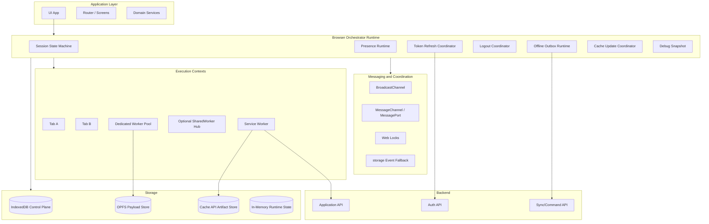
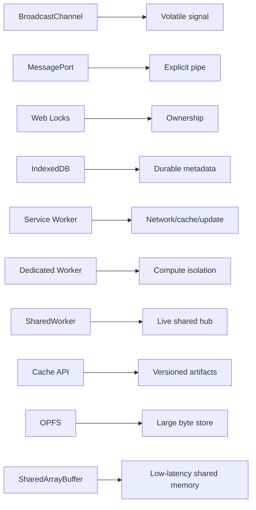
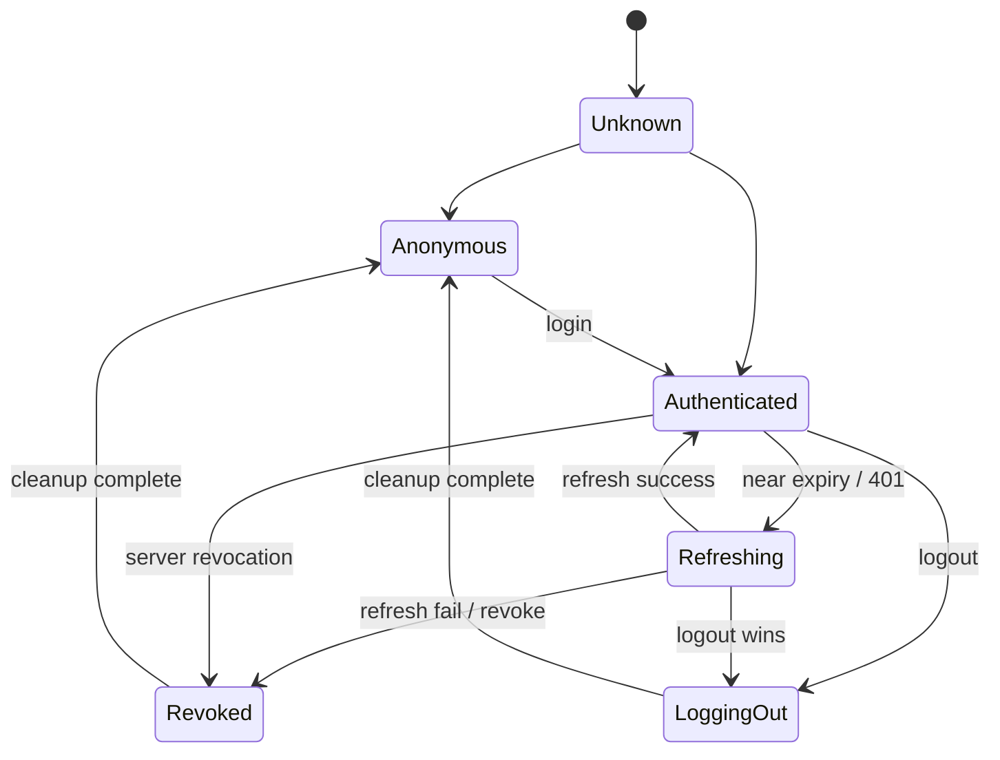
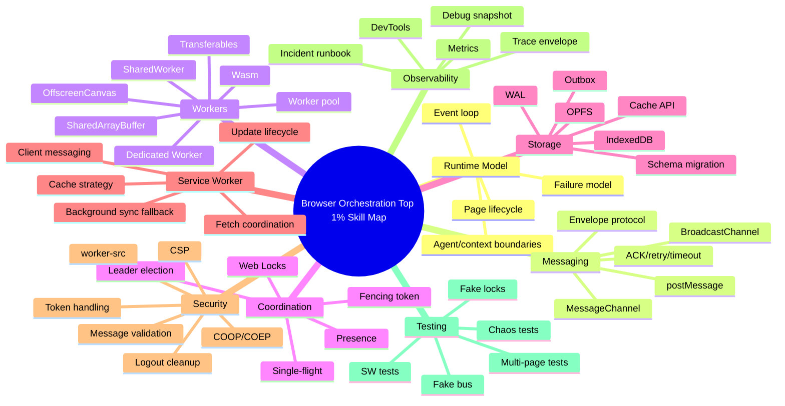

# Part 072 — Production Checklist, Decision Matrix, and Final Skill Map

Ini adalah bagian terakhir dari series.

Kita tidak akan menambah API baru. Kita akan merapikan seluruh materi menjadi decision matrix, checklist, maturity model, dan skill map. Tujuannya sederhana: setelah membaca 71 part sebelumnya, kamu harus bisa mengambil keputusan desain dengan cepat dan defensible.

Seorang engineer top-tier bukan hanya tahu `new Worker()` atau `new BroadcastChannel()`. Ia bisa menjawab:

- siapa owner side effect ini?
- state mana yang durable dan mana yang volatile?
- apa yang terjadi bila tab freeze di tengah workflow?
- apa yang terjadi bila worker crash setelah partial progress?
- apakah message ini boleh duplicate?
- apakah stale response bisa merusak session?
- bagaimana cara membuktikan sistem ini aman lewat test?
- bagaimana cara debug incident di production?

Itulah fokus final map ini.

---

## 1. Complete System Map



This is the operating model:

1. UI talks to runtime, not directly to raw browser coordination APIs.
2. Runtime owns lifecycle and cross-tab rules.
3. Workers execute bounded compute.
4. Service Worker coordinates network/cache/update.
5. IndexedDB stores durable control state.
6. BroadcastChannel signals changes.
7. Web Locks elect/serialize local owners.
8. Server still owns real business correctness.

---

## 2. The Core Invariants

If you remember only one section, remember this.

| Invariant | Meaning |
|---|---|
| No secret broadcast | BroadcastChannel/storage event must not carry auth secrets. |
| No global side effect without ownership | Refresh, logout, replay, cache promotion, migration need lock/lease/owner. |
| No trust in cleanup | Tab close/freeze/crash may skip cleanup; recovery must rely on TTL/generation/reconciliation. |
| No state transition without generation | Session/cache/worker/outbox transitions need monotonic epoch or equivalent stale guard. |
| No retry without idempotency | Network retry and offline replay need stable idempotency key. |
| No worker without backpressure | Worker pool must have bounded queue, timeout, cancellation, and payload policy. |
| No cache update without versioning | Cache names/manifests must be versioned and promoted safely. |
| No migration without multi-tab policy | IndexedDB upgrades can be blocked by old open tabs. |
| No production orchestration without observability | Trace/message/lock/queue/session metrics are mandatory. |
| No correctness from BroadcastChannel alone | BroadcastChannel is signal, not durable store, not lock, not authority. |

---

## 3. API Decision Matrix

Use this when deciding primitive.

| Need | Prefer | Maybe | Avoid |
|---|---|---|---|
| Send volatile signal to same-origin tabs | BroadcastChannel | storage event fallback | IndexedDB polling only |
| Private request-response pipe | MessageChannel / MessagePort | direct Worker postMessage | BroadcastChannel RPC for sensitive data |
| CPU-heavy per-tab work | Dedicated Worker | worker pool | main thread long task |
| Shared live hub across tabs | SharedWorker | BroadcastChannel + IDB | Service Worker as always-on hub |
| Network/cache interception | Service Worker | page fetch wrapper | SharedWorker |
| Cross-tab mutual exclusion | Web Locks | IndexedDB lease fallback | localStorage claim without fencing |
| Durable metadata | IndexedDB | server state | localStorage for complex state |
| Large binary payload | OPFS / transferable ArrayBuffer | IndexedDB blob reference | huge structured clone object |
| Static/API response artifact cache | Cache API | OPFS for custom blob layout | localStorage |
| Offline command replay | IndexedDB outbox + Web Locks | Background Sync trigger | in-memory queue |
| Render-heavy canvas | OffscreenCanvas in worker | main-thread canvas with chunking | DOM-heavy worker fantasy |
| Shared memory low-latency data plane | SharedArrayBuffer + Atomics | transferable buffers | JSON message loop |
| Update all tabs about logout | Broadcast metadata + durable marker | storage event fallback | token broadcast |
| Prevent notification duplicates | active-tab arbitration + dedupe store | Service Worker visibility/focus check | each tab shows independently |

---

## 4. API Capability Map



Decision heuristic:

- If the data must survive reload, do not rely on BroadcastChannel.
- If the operation must not duplicate, do not rely on presence alone.
- If the payload is huge, do not structured-clone object graphs casually.
- If the work touches DOM, it cannot run in normal worker.
- If the work needs background network/cache coordination, consider Service Worker.
- If the work needs true server-side correctness, do not pretend browser locks are enough.

---

## 5. Lifecycle Checklist

Browser lifecycle is hostile to naive code.

| Event/State | What to do | What not to assume |
|---|---|---|
| `visibilitychange` to hidden | pause non-critical work, flush small telemetry, reduce heartbeat | page will definitely unload |
| visible/focus restore | reconcile session, presence, cache update, outbox, stale data | local memory is current |
| `pagehide` | best-effort BYE/shutdown | async cleanup will finish |
| bfcache restore | revalidate runtime generation/session/cache | page was freshly loaded |
| frozen/discarded | recover on next visible/startup | timers kept running accurately |
| tab closed | expire via TTL/lease | BYE message was sent |
| worker terminated | reject pending tasks, restart if safe | worker finished current operation |
| Service Worker controllerchange | reconcile app/SW version | old/new worker share same state |
| IDB versionchange | close old connection or prompt reload | migration can always proceed immediately |

Production rule:

> Cleanup is optimization. Reconciliation is correctness.

---

## 6. Message Protocol Checklist

Every message family should answer these questions.

| Question | Required answer |
|---|---|
| What is the message kind? | stable string enum |
| Is it command, event, query, or response? | explicit category |
| Is it durable? | yes/no |
| Can it duplicate? | yes/no + dedupe strategy |
| Can it arrive late? | yes + expiration/generation guard |
| Can it reorder? | yes + sequence/generation guard |
| Does it contain secret? | preferably no; if yes, justify private channel |
| Does it need ACK? | yes/no |
| Does it need retry? | yes/no + timeout |
| Does it need idempotency key? | yes for side effects |
| What is the version compatibility story? | schema/protocol version |
| How is it observed? | traceId/messageId/telemetry fields |

Envelope minimum:

```ts
{
  protocolVersion,
  appId,
  appVersion,
  kind,
  scope,
  messageId,
  traceId,
  sender,
  issuedAt,
  expiresAt,
  generation,
  idempotencyKey,
  payload
}
```

Anti-patterns:

- raw object broadcast without kind/version;
- treating `message` event as trusted;
- no `messageerror` handling;
- using local clock as business ordering authority;
- sending object instances and expecting prototypes/methods to survive structured clone;
- no expiry for event-like messages;
- no stale guard for responses.

---

## 7. Worker Checklist

Before introducing worker, ask whether it improves the actual bottleneck.

| Area | Checklist |
|---|---|
| Workload | CPU-bound or blocking enough to justify worker |
| Ownership | main thread owns UI, worker owns computation only |
| Payload | clone/transfer/shared memory decision made |
| Queue | bounded queue and max in-flight count |
| Cancellation | queued and running task behavior defined |
| Timeout | every task has deadline |
| Error | error DTO, worker `error`, `messageerror`, poison task policy |
| Restart | generation token and pending rejection |
| Memory | payload size budget, buffer reuse, cleanup |
| Observability | queue depth, task latency, failure code, payload size |
| Deployment | module worker path, CSP, MIME, sourcemap, CDN path tested |

Worker is good for:

- parsing large CSV/JSON;
- building search index;
- diffing large documents;
- compression/decompression;
- image/canvas processing;
- Wasm compute;
- rule evaluation;
- crypto/hash workloads via WebCrypto/Wasm/native APIs where appropriate.

Worker is not magic for:

- DOM operations;
- network latency;
- bad state model;
- too many small tasks with high message overhead;
- memory explosion from clone-heavy payload;
- cross-tab correctness by itself.

---

## 8. Worker Pool Decision Matrix

| Situation | Use one worker | Use pool | Avoid worker |
|---|---:|---:|---:|
| Single large parse | yes | maybe | no |
| Many independent CPU tasks | maybe | yes | no |
| Ordered stream processing | yes | maybe with partitioning | no |
| Huge shared memory pipeline | yes with SAB | maybe advanced | no |
| UI-only data formatting small list | no | no | yes |
| Network calls only | no | no | usually yes |
| DOM measurement/rendering | no | no | yes, unless OffscreenCanvas case |
| Wasm heavy compute | yes | yes | no |

Sizing heuristic:

```txt
poolSize = min(4, max(1, hardwareConcurrency - 1))
```

But real sizing must consider:

- device class;
- memory pressure;
- workload duration;
- main-thread pressure;
- other tabs from same app;
- browser throttling;
- battery/thermal constraints.

---

## 9. Cross-Tab Coordination Checklist

| Concern | Correct pattern |
|---|---|
| Presence | heartbeat + TTL + lifecycle reconciliation |
| Leader election | Web Locks, or IndexedDB lease fallback with fencing |
| Single-flight request | lock + result handoff + stale guard |
| Token refresh | lock + re-check freshness inside lock + metadata broadcast |
| Logout | durable revocation marker + abort + cleanup + broadcast |
| Notification suppression | dedupe key + active surface policy + TTL store |
| Offline replay | durable outbox + idempotency + single owner |
| Cache promotion | versioned manifest + safe point + SW/client broadcast |
| Migration | version gate + blocked handling + user prompt/reload policy |
| Shared worker hub | connection registry + heartbeat + reconnect/resubscribe |

Golden rule:

> A tab can claim intent. A lock/lease establishes local ownership. A generation/fencing token protects receivers from stale owners.

---

## 10. Auth and Session Checklist

Auth/session is where multi-tab orchestration becomes security-critical.

Required:

- [ ] no refresh token in BroadcastChannel payload;
- [ ] no token in localStorage for high-security contexts unless threat model explicitly accepts it;
- [ ] refresh is single-flight across tabs;
- [ ] refresh result is fenced by session generation;
- [ ] logout is durable before cleanup;
- [ ] protected requests can be aborted;
- [ ] 401 retry is bounded;
- [ ] revocation wins over refresh;
- [ ] bfcache restore revalidates session;
- [ ] worker tasks do not keep stale secret/session context;
- [ ] Service Worker does not become hidden auth authority unless deliberately designed;
- [ ] tenant switch invalidates relevant projections/cache/outbox;
- [ ] all session transitions observable.

Session state machine:



---

## 11. Storage Checklist

| Storage | Use for | Avoid for |
|---|---|---|
| Memory | hot runtime state | durable truth |
| `sessionStorage` | tab-scoped ephemeral hints | cross-tab global session truth |
| `localStorage` | tiny compatibility signal/legacy fallback | secrets, large data, complex transaction |
| IndexedDB | durable metadata, outbox, projection, dedupe | huge hot byte streams without design |
| Cache API | request/response artifacts, app shell, API cache | arbitrary mutable database semantics |
| OPFS | large files, staged payload, worker-heavy byte data | metadata querying |
| Cookies | server auth/session mechanism | client orchestration state |

Rules:

1. Control-plane metadata goes to IndexedDB.
2. Data-plane large payload goes to OPFS/Cache or transferables.
3. Durable state must have schema version.
4. Migration must handle open tabs.
5. Cleanup must be scoped by session/tenant/version.
6. Quota/eviction must be treated as real failure.
7. Sensitive data requires explicit retention policy.

---

## 12. Offline and Replay Checklist

| Concern | Required design |
|---|---|
| Command identity | idempotency key generated before first attempt |
| Unknown outcome | retry same idempotency key, reconcile if necessary |
| Ordering | dependency graph or aggregate sequence |
| Ownership | Web Lock/lease around replay loop |
| Auth | pause/reconcile on 401/403/session transition |
| Conflict | store conflict state; do not silently overwrite |
| Payload | payloadRef for large data |
| Retry | exponential backoff + max attempts + dead-letter |
| Observability | attempts, age, last error, owner, batch latency |
| Cleanup | compact acked/dead records according to policy |

Delivery semantics map:

| Desired phrase | Reality |
|---|---|
| exactly once | not available end-to-end from browser alone |
| at most once | possible, but may lose operation |
| at least once | possible with durable retry, but duplicates possible |
| effectively once | idempotency + dedupe + reconciliation |

---

## 13. Service Worker Checklist

Service Worker is powerful but not a daemon.

Required:

- [ ] app handles first load with no controller;
- [ ] `controllerchange` handled;
- [ ] update flow has safe point;
- [ ] `skipWaiting`/`clients.claim` policy is deliberate;
- [ ] cache names are versioned;
- [ ] cache cleanup avoids deleting assets needed by old clients;
- [ ] SW messages are schema-validated;
- [ ] `clients.matchAll()` broadcast is filtered/scoped;
- [ ] network strategy is per request class;
- [ ] auth-sensitive response cache policy is strict;
- [ ] offline fallback is intentional;
- [ ] Background Sync has fallback;
- [ ] SW lifecycle is tested in real browser;
- [ ] DevTools/Application panel debugging runbook exists.

Do not use Service Worker as:

- permanent background thread;
- hidden global session brain without lifecycle recovery;
- arbitrary compute worker;
- blind cache-everything proxy;
- secret store.

---

## 14. Security Checklist

Threat model must include XSS and compromised dependencies. Browser-local orchestration cannot fully protect against same-origin arbitrary script execution.

Required:

- [ ] CSP with appropriate `script-src`, `worker-src`, `connect-src`;
- [ ] no sensitive token in BroadcastChannel/storage event;
- [ ] message schema validation at every boundary;
- [ ] sender metadata treated as claim, not trusted identity;
- [ ] MessagePort treated as capability;
- [ ] worker scripts pinned to trusted origin/build path;
- [ ] Service Worker registration scope reviewed;
- [ ] Cache API does not store private responses accidentally;
- [ ] IndexedDB/OPFS retention policy documented;
- [ ] logout clears sensitive local state;
- [ ] `Clear-Site-Data` use evaluated for emergency cleanup;
- [ ] cross-origin isolation headers tested if using SharedArrayBuffer;
- [ ] COOP/COEP impact on popups/OAuth/third-party embeds tested;
- [ ] debug snapshot redacts payload/secrets;
- [ ] telemetry redacts user data and tokens.

Risk framing:

| Threat | Mitigation |
|---|---|
| XSS reads same-origin storage | minimize secret storage, CSP, Trusted Types, server-side session strategy |
| Message spoofing | schema validation, generation, authorization check at receiver |
| Token broadcast leak | never broadcast token |
| Stale worker effect | generation/fencing token |
| Service Worker cache poisoning | integrity/versioned manifest, trusted source, cache validation |
| Cross-tab logout missed | durable revocation marker + startup/visible reconciliation |
| Over-broad SW scope | narrow registration scope |
| Debug data leak | redaction + gated debug mode |

---

## 15. Performance Checklist

Budgets should be explicit.

| Budget | Example threshold |
|---|---:|
| Main-thread task | avoid 50ms+ long tasks |
| Broadcast payload | keep small; send references for large data |
| Worker queue depth | bounded per feature |
| Worker task timeout | per task class |
| Structured clone payload | measure before scaling |
| IndexedDB transaction duration | short, scoped |
| Cache promotion | staged, lock-protected |
| OPFS write | chunked/staged |
| Session refresh | single-flight and low retry |
| Outbox replay | small batches |
| Telemetry | sampled and redacted |

Performance smell list:

- JSON stringify/parse large payload repeatedly;
- broadcasting full state snapshot on every change;
- cloning huge object graph into worker;
- too many workers on low-core device;
- IndexedDB transaction open while waiting network;
- Service Worker caching private API responses without policy;
- worker progress events flooding main thread;
- message protocol without payload size metrics;
- retry storms after network recovery;
- cache cleanup during active usage.

---

## 16. Observability Checklist

Minimum metrics:

| Metric | Why |
|---|---|
| runtime starts/stops | lifecycle visibility |
| tab count/presence | multi-tab context |
| message count by kind | protocol pressure |
| message validation failures | compatibility/security |
| `messageerror` count | clone/deserialization issues |
| lock wait time | contention |
| lock hold time | long owner bug |
| worker queue depth | overload |
| worker task latency/failure | compute health |
| session refresh attempts | auth storm detection |
| logout propagation latency | security cleanup |
| outbox pending age | sync health |
| cache version active/staged | update health |
| IDB blocked/versionchange | migration issue |
| Service Worker controllerchange | update lifecycle |

Debug snapshot must include:

- tab/runtime identity;
- app/protocol version;
- visibility/focus;
- session state redacted;
- worker queue status;
- lock status if queryable;
- outbox summary;
- cache version summary;
- last critical errors.

---

## 17. Testing Checklist

Test categories:

| Category | Example |
|---|---|
| Unit | reducer ignores stale generation |
| Contract | invalid message rejected |
| Transport fake | duplicate/lost/reordered message |
| Worker | timeout rejects pending task |
| Multi-page | 5 tabs trigger one refresh |
| Service Worker | update available message reaches clients |
| IndexedDB | migration blocked by old connection |
| Offline | replay recovers after owner crash |
| Security | token not present in broadcast/debug logs |
| Performance | no long task during import flow |
| Chaos | leader dies mid-lock / replay resumes |

Essential multi-tab tests:

1. Open three tabs, all boot same user, presence converges.
2. All tabs request token refresh, only one backend refresh occurs.
3. Logout in one tab, all tabs abort protected request and transition to anonymous/revoked.
4. Worker task result arrives after logout, result is ignored.
5. Offline command enqueued in two tabs with same idempotency key, only one effective command is sent.
6. Cache update arrives while old tab is active, app prompts safe reload instead of deleting active asset.
7. IndexedDB upgrade blocked by old tab, old tab receives versionchange/prompt.
8. BroadcastChannel message duplicated, reducer remains idempotent.
9. Tab owner crashes during outbox replay, another owner resumes after lease expiry.
10. bfcache restore revalidates session/cache state.

---

## 18. Deployment Checklist

Build/deploy pitfalls are real.

Required:

- [ ] Worker script path works under production base URL;
- [ ] module worker uses correct `type: "module"` where needed;
- [ ] worker script served with correct MIME;
- [ ] CSP `worker-src` allows worker origin;
- [ ] source maps available to debugging policy;
- [ ] Service Worker file is not incorrectly cached by CDN;
- [ ] Service Worker scope is correct;
- [ ] cache version includes build hash;
- [ ] rollback plan handles old cache/SW state;
- [ ] IndexedDB schema version compatible with rolling deploy;
- [ ] app version included in messages;
- [ ] old and new tabs compatibility window defined;
- [ ] cross-origin isolation headers tested if needed;
- [ ] OAuth/popup/third-party embeds tested if COOP/COEP enabled;
- [ ] mobile/WebView compatibility tested if supported;
- [ ] private/incognito behavior tested;
- [ ] storage quota failure tested.

Smoke tests after deploy:

```txt
1. Load app fresh.
2. Open second tab.
3. Confirm BroadcastChannel communication.
4. Run worker task.
5. Run protected fetch.
6. Trigger token refresh simulation.
7. Trigger logout in one tab.
8. Verify all tabs clean session.
9. Confirm Service Worker controller/version.
10. Confirm cache manifest version.
11. Confirm IndexedDB version.
12. Confirm no CSP violation.
```

---

## 19. Incident Runbooks

### 19.1 Refresh Storm

Symptoms:

- many `/refresh` calls per user;
- token rotation failures;
- sudden logout across tabs;
- 401 retry spike.

Check:

- Web Locks availability;
- lock name mismatch across app versions;
- refresh freshness re-check inside lock;
- stale generation handling;
- BroadcastChannel message validation failure;
- old bundle compatibility.

Immediate mitigation:

- increase refresh skew jitter;
- disable automatic 401 retry loop;
- force reload old tabs if needed;
- server-side dedupe refresh if possible.

### 19.2 Worker Memory Explosion

Symptoms:

- tab killed/discarded;
- import/search freezes;
- OOM on low-memory devices.

Check:

- structured clone payload size;
- object graph shape;
- transferables used correctly;
- queue depth;
- worker count;
- result size;
- progress event frequency.

Immediate mitigation:

- lower max worker count;
- lower queue size;
- chunk payload;
- switch to transfer/reference;
- disable feature for low-memory devices.

### 19.3 Cache Update Breaks App

Symptoms:

- old HTML loads new JS or reverse;
- chunk 404;
- repeated reload prompt;
- Service Worker stuck waiting.

Check:

- CDN cache headers for SW file;
- cache manifest active/staged;
- old clients count;
- `skipWaiting` policy;
- cleanup deleting old chunks;
- build hash mismatch.

Immediate mitigation:

- stop aggressive cleanup;
- serve previous assets longer;
- prompt safe reload;
- unregister/reset SW only as last resort.

### 19.4 IDB Migration Blocked

Symptoms:

- app stuck loading;
- `blocked` event;
- some old tabs open;
- new version cannot start.

Check:

- old DB connections not closing on `versionchange`;
- long-running transactions;
- app version compatibility;
- migration running too early.

Immediate mitigation:

- show reload-all-tabs prompt;
- close DB on versionchange;
- lazy migrate record-level data;
- delay destructive migration.

### 19.5 Logout Not Propagating

Symptoms:

- one tab logged out, another still authenticated;
- protected request after logout;
- stale worker result updates UI.

Check:

- durable revocation marker;
- BroadcastChannel health;
- session generation comparison;
- bfcache restore reconciliation;
- protected fetch abort registry;
- worker generation guard.

Immediate mitigation:

- force session revalidate on visible/focus;
- server reject stale session generation;
- clear local state on next startup;
- add temporary polling of revocation marker if channel unreliable.

---

## 20. Maturity Model

| Level | Capability |
|---:|---|
| 0 | Single-tab happy path, no worker, no cross-tab awareness |
| 1 | Basic worker usage for heavy task |
| 2 | BroadcastChannel logout/cache invalidation signal |
| 3 | Typed message envelope and schema validation |
| 4 | Presence + heartbeat + lifecycle reconciliation |
| 5 | Web Locks for refresh/replay/cache/migration ownership |
| 6 | Durable IndexedDB control plane + idempotent outbox |
| 7 | Worker pool with bounded queue/cancellation/observability |
| 8 | Service Worker cache/update orchestration with safe point |
| 9 | Chaos-tested multi-tab runtime with security threat model |
| 10 | Internal platform-grade orchestration runtime with SLO/runbook |

A top-tier implementation is not “uses every API”. A top-tier implementation uses fewer primitives, but with clear invariants and failure recovery.

---

## 21. Skill Map



---

## 22. What You Should Be Able to Design Now

After this series, you should be able to design:

1. Multi-tab auth refresh without refresh storm.
2. Multi-tab logout/revocation propagation.
3. Browser-side worker pool with bounded execution.
4. Large file import pipeline using worker + transferables/OPFS.
5. Offline outbox with idempotent replay.
6. Cache update flow with Service Worker and safe reload.
7. SharedWorker hub for live coordination.
8. Browser-local event sourcing/projection model.
9. IndexedDB migration strategy across open tabs.
10. Cross-tab notification suppression.
11. Service Worker client broadcast protocol.
12. Web Locks leader election with fencing.
13. SharedArrayBuffer ring buffer for low-latency worker pipeline.
14. Debug/observability system for multi-context frontend.
15. Chaos test suite for browser orchestration.

---

## 23. Interview-Level Questions You Can Now Answer

Use these as self-check.

### Architecture

1. Why is a browser app with multiple tabs similar to a distributed system?
2. Why is BroadcastChannel not enough for leader election?
3. Why does Web Locks still need fencing tokens for some workflows?
4. When would you use SharedWorker over BroadcastChannel?
5. When would you avoid Service Worker?

### Reliability

6. What happens if a leader tab dies mid-task?
7. How do you prevent stale worker results from updating UI?
8. How do you design token refresh with refresh token rotation?
9. Why is exactly-once delivery unrealistic from browser alone?
10. How do you recover outbox replay after crash?

### Performance

11. How do you decide clone vs transfer vs shared memory?
12. Why can worker pool make performance worse?
13. What metrics would you collect for worker task health?
14. How do you avoid long tasks during large import?
15. How does BroadcastChannel fanout affect performance?

### Security

16. Why should tokens not be broadcast?
17. How does XSS affect browser-local orchestration security?
18. What does CSP `worker-src` protect?
19. What breaks when enabling COOP/COEP?
20. How do you design logout cleanup defensibly?

### Operations

21. How do you debug Service Worker update stuck in waiting?
22. How do you detect IDB migration blocked by old tab?
23. How do you test multi-tab refresh single-flight?
24. How do you reproduce a race condition deterministically?
25. What does a useful debug snapshot include?

---

## 24. Final Exercises

These are intentionally implementation-heavy.

### Exercise 1 — Token Refresh Coordinator

Build:

- BroadcastChannel session bus;
- Web Locks refresh lock;
- session reducer with generation;
- fake auth API with refresh token rotation;
- Playwright test opening 5 tabs.

Invariant:

```txt
For one expiry window, backend refresh endpoint is called at most once per session generation.
```

### Exercise 2 — Offline Outbox

Build:

- IndexedDB outbox;
- idempotency key generator;
- replay lock;
- retry/backoff;
- fake network unknown outcome;
- conflict state.

Invariant:

```txt
Every acknowledged command is marked acked exactly once locally, but network attempts may be more than once.
```

### Exercise 3 — Worker Import Pipeline

Build:

- CSV parser worker;
- transferable ArrayBuffer path;
- bounded queue;
- progress throttling;
- cancellation;
- stale generation guard.

Invariant:

```txt
Canceling import prevents stale result from mutating current UI state.
```

### Exercise 4 — Cache Update Safe Point

Build:

- versioned cache manifest;
- Service Worker update notification;
- tab safe reload prompt;
- old cache cleanup only after safe point.

Invariant:

```txt
No active tab references a deleted asset version.
```

### Exercise 5 — Chaos Harness

Inject:

- duplicate messages;
- delayed messages;
- owner tab crash;
- worker crash;
- IDB blocked migration;
- Service Worker controllerchange;
- network timeout.

Invariant:

```txt
System eventually reconciles without accepting stale session/cache/outbox effects.
```

---

## 25. Final Design Heuristics

Use these in real architecture reviews.

1. Prefer explicit ownership over hope.
2. Prefer durable markers over cleanup assumptions.
3. Prefer small signals over large broadcasts.
4. Prefer idempotent receiver over perfect sender.
5. Prefer generation/fencing over timestamp guessing.
6. Prefer bounded queues over unbounded responsiveness debt.
7. Prefer versioned artifacts over mutable caches.
8. Prefer schema validation over trusting same-origin scripts.
9. Prefer safe reload over invisible dangerous update.
10. Prefer measurable budgets over “it feels fast”.
11. Prefer chaos tests over anecdotal confidence.
12. Prefer server-side correctness for business-critical effects.

---

## 26. Common Wrong Conclusions

### “Same-origin means safe.”

Wrong. Same-origin means browser allows access. It does not mean every same-origin script is trustworthy or every message is legitimate.

### “BroadcastChannel solves multi-tab state.”

Wrong. It solves volatile signaling. State consistency still needs reducer, storage, idempotency, generation, and reconciliation.

### “Web Locks gives me distributed consensus.”

Wrong. It gives same-origin local mutual exclusion. It does not coordinate across devices, browsers, users, or backend systems.

### “Service Worker is a background daemon.”

Wrong. It is event-driven and lifecycle-managed by the browser. Design for wake/sleep/restart.

### “Worker means faster.”

Wrong. Worker means off-main-thread execution. Data movement, memory, scheduling, and queue policy decide whether it is faster.

### “Exactly once is required.”

Usually wrong framing. What you need is idempotency, dedupe, reconciliation, and clear unknown-outcome handling.

---

## 27. How to Explain This to a Team

When introducing this architecture internally, do not start with APIs. Start with failure modes.

A good pitch:

> Our frontend is not a single runtime anymore. Users open multiple tabs. Workers run in separate contexts. Service Worker can update independently. Storage is shared and versioned. Network can fail after side effects. Therefore we need a small orchestration layer with message protocol, ownership, durable markers, generation guards, and observability.

Then show three concrete incidents the runtime prevents:

1. Refresh token rotation storm.
2. Duplicate offline replay.
3. Stale logout/session state across tabs.

Then show the minimal architecture:

- BroadcastChannel for signal;
- Web Locks for local ownership;
- IndexedDB for durable metadata;
- Dedicated Worker for compute;
- Service Worker for cache/network/update;
- trace envelope for observability.

That is enough to get buy-in.

---

## 28. Final Production Readiness Gate

Before shipping a serious multi-tab/worker system, require this gate.

### Architecture Gate

- [ ] Runtime boundaries documented.
- [ ] Ownership model documented.
- [ ] State machine documented.
- [ ] Failure model documented.
- [ ] Compatibility matrix documented.

### Security Gate

- [ ] Threat model reviewed.
- [ ] Token/storage policy reviewed.
- [ ] CSP/worker-src reviewed.
- [ ] Debug/telemetry redaction reviewed.
- [ ] Logout cleanup reviewed.

### Reliability Gate

- [ ] Idempotency keys for side-effecting commands.
- [ ] Generation/fencing for stale effects.
- [ ] Lock/lease around global jobs.
- [ ] Recovery path for tab/worker/SW crash.
- [ ] IDB migration blocked handling.

### Performance Gate

- [ ] Worker queue bounded.
- [ ] Payload movement budget measured.
- [ ] Long task budget tested.
- [ ] Cache/OPFS/IDB operations measured.
- [ ] Multi-tab resource usage tested.

### Observability Gate

- [ ] Trace ID propagation.
- [ ] Message metrics.
- [ ] Lock metrics.
- [ ] Worker metrics.
- [ ] Session/outbox/cache metrics.
- [ ] Debug snapshot.

### Testing Gate

- [ ] Unit tests.
- [ ] Protocol contract tests.
- [ ] Multi-tab browser tests.
- [ ] Service Worker tests.
- [ ] Chaos tests.
- [ ] Deployment smoke tests.

---

## 29. Closing Synthesis

The browser has become a serious application runtime. But it is not a server process. It is not stable, not single-threaded in the way people casually assume, and not globally coordinated by default.

A top-level mental model:

```txt
Browser App = local cluster of unreliable actors
              + shared origin storage
              + volatile message channels
              + browser-managed lifecycle
              + network/server authority
              + user-driven navigation/visibility
```

From that model, the design follows naturally:

- use workers for bounded execution;
- use BroadcastChannel for volatile notification;
- use MessagePort for explicit capability channels;
- use Web Locks for local ownership;
- use IndexedDB for durable control state;
- use Cache API/OPFS for data-plane artifacts;
- use Service Worker for network/cache/update events;
- use generation/idempotency/fencing for correctness;
- use observability and chaos tests to prove behavior.

This is the difference between demo-level frontend and production-grade browser systems engineering.

---

## 30. Series Completion

Series ini selesai di sini.

Total:

```txt
Part 001 sampai Part 072
```

Final coverage:

- browser as distributed runtime;
- execution context map;
- main thread vs worker;
- event loop and agent clusters;
- origin/security model;
- page lifecycle;
- failure model;
- message protocols;
- Dedicated Worker;
- SharedWorker;
- Service Worker;
- BroadcastChannel;
- MessageChannel;
- Web Locks;
- leader election;
- fencing token;
- single-flight requests;
- token refresh orchestration;
- logout/revocation;
- IndexedDB;
- OPFS;
- Cache API;
- event sourcing;
- WAL;
- offline queue;
- conflict resolution;
- delivery semantics;
- schema migration;
- SharedArrayBuffer;
- Atomics;
- OffscreenCanvas;
- WebAssembly;
- scheduling;
- performance budgeting;
- observability;
- debugging;
- testing;
- chaos engineering;
- security threat model;
- reference architecture;
- build-from-scratch runtime;
- final production checklist.

You now have the map, the primitives, the failure model, and the implementation direction.

The next leap is not reading more APIs. The next leap is building a small runtime, breaking it deliberately, measuring it, and tightening the invariants until it behaves under ugly real browser conditions.

---

## References

- MDN — Broadcast Channel API: https://developer.mozilla.org/en-US/docs/Web/API/Broadcast_Channel_API
- MDN — BroadcastChannel `close()`: https://developer.mozilla.org/en-US/docs/Web/API/BroadcastChannel/close
- MDN — BroadcastChannel `messageerror`: https://developer.mozilla.org/en-US/docs/Web/API/BroadcastChannel/messageerror_event
- MDN — Channel Messaging API: https://developer.mozilla.org/en-US/docs/Web/API/Channel_Messaging_API
- MDN — Web Workers API: https://developer.mozilla.org/en-US/docs/Web/API/Web_Workers_API
- MDN — Worker `postMessage()`: https://developer.mozilla.org/en-US/docs/Web/API/Worker/postMessage
- MDN — Web Locks API: https://developer.mozilla.org/en-US/docs/Web/API/Web_Locks_API
- MDN — `LockManager.request()`: https://developer.mozilla.org/en-US/docs/Web/API/LockManager/request
- MDN — IndexedDB API: https://developer.mozilla.org/en-US/docs/Web/API/IndexedDB_API
- MDN — Service Worker API: https://developer.mozilla.org/en-US/docs/Web/API/Service_Worker_API
- MDN — Clients `matchAll()`: https://developer.mozilla.org/en-US/docs/Web/API/Clients/matchAll
- MDN — CacheStorage: https://developer.mozilla.org/en-US/docs/Web/API/CacheStorage
- MDN — OPFS: https://developer.mozilla.org/en-US/docs/Web/API/File_System_API/Origin_private_file_system
- MDN — Page Visibility API: https://developer.mozilla.org/en-US/docs/Web/API/Page_Visibility_API
- MDN — SharedArrayBuffer: https://developer.mozilla.org/en-US/docs/Web/JavaScript/Reference/Global_Objects/SharedArrayBuffer
- MDN — Atomics: https://developer.mozilla.org/en-US/docs/Web/JavaScript/Reference/Global_Objects/Atomics
- MDN — OffscreenCanvas: https://developer.mozilla.org/en-US/docs/Web/API/OffscreenCanvas
- MDN — WebAssembly JavaScript API: https://developer.mozilla.org/en-US/docs/WebAssembly/Reference/JavaScript_interface
- Chrome Developers — Page Lifecycle API: https://developer.chrome.com/docs/web-platform/page-lifecycle-api
- Chrome DevTools — Application panel: https://developer.chrome.com/docs/devtools/application
- W3C Service Workers: https://www.w3.org/TR/service-workers/
