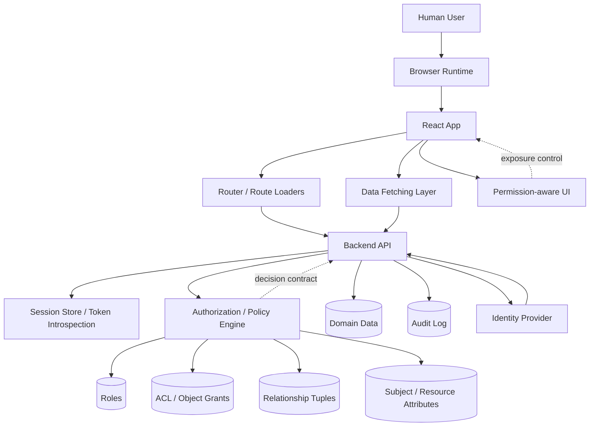
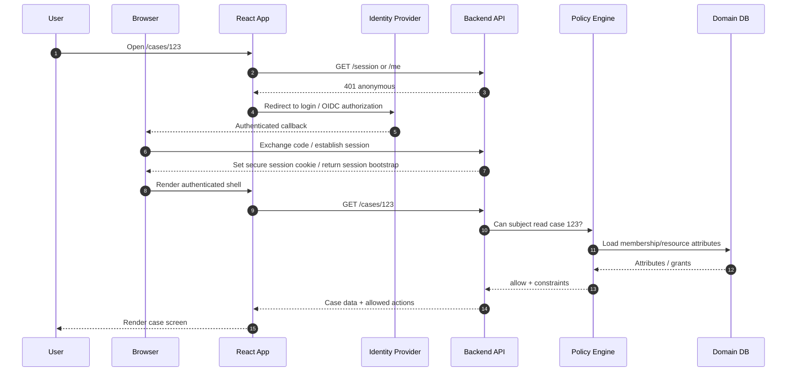
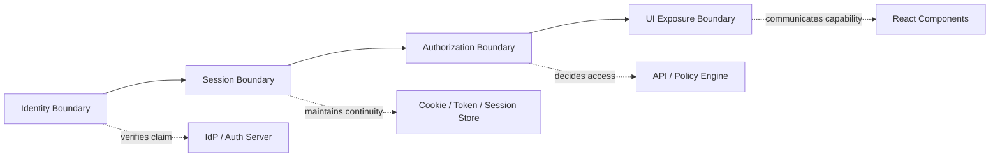
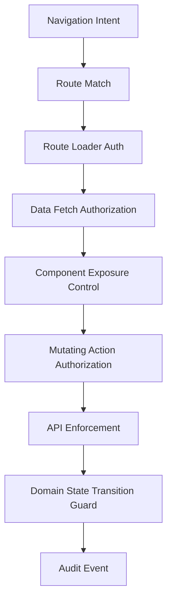
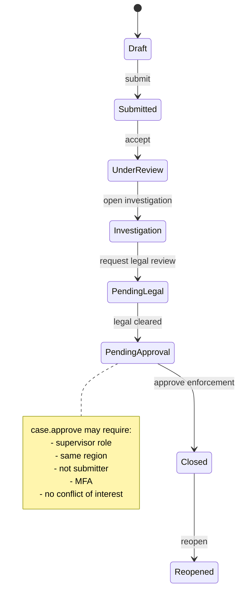
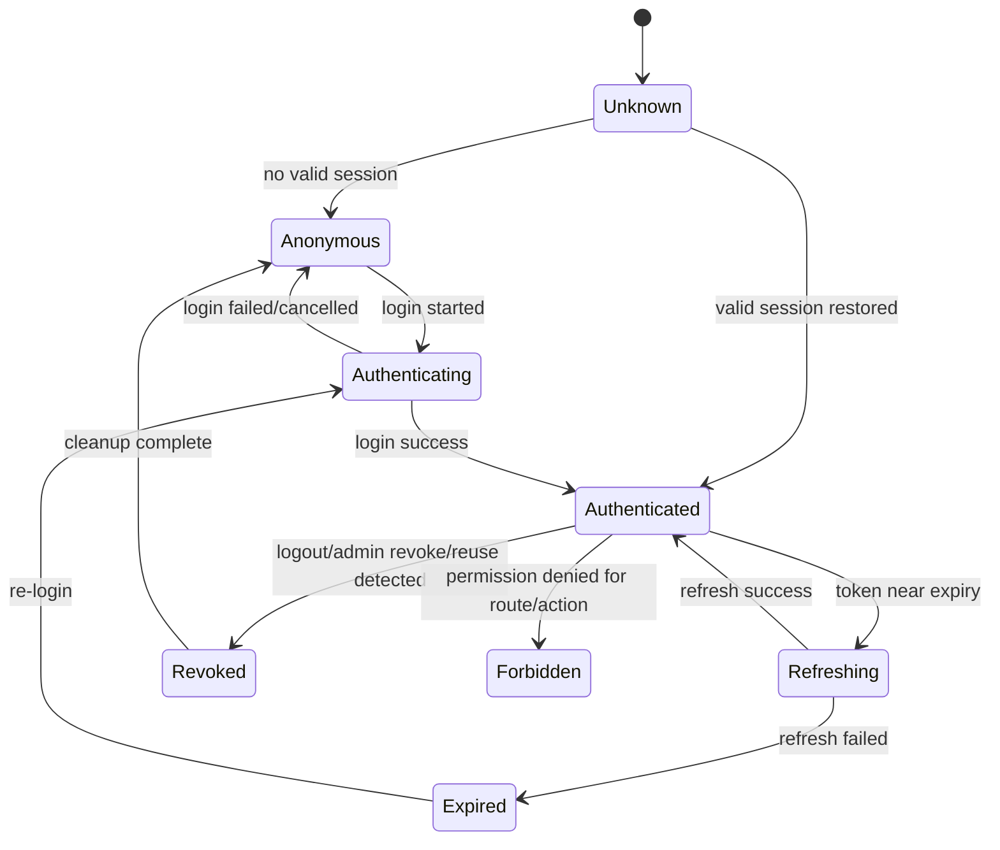

# Part 001 — Auth Is Not Login

React authentication yang matang tidak dimulai dari `LoginPage`, `ProtectedRoute`, atau `localStorage.setItem("token", token)`.

Itu hanya permukaan.

Sistem auth yang benar dimulai dari pertanyaan yang jauh lebih dasar:

> Pada setiap momen, siapa aktor yang sedang berinteraksi, bagaimana kita tahu itu benar, apa sesi yang sedang aktif, resource apa yang sedang disentuh, aksi apa yang diminta, konteks apa yang berlaku, dan siapa yang benar-benar berhak memberi keputusan?

Kalau jawaban kita hanya `isLoggedIn === true`, sistem belum punya model auth. Sistem baru punya flag UI.

Part ini membangun fondasi mental model. Kita belum mengejar integrasi Auth0, Clerk, Cognito, NextAuth/Auth.js, Supabase, Firebase, WorkOS, Keycloak, atau IdP lain. Kita akan mulai dari primitive. Seperti membangun storage engine dari nol, kita tidak mulai dari SQL. Kita mulai dari halaman, log, index, recovery, dan invariant. Untuk auth React, primitive-nya adalah identity, session, token/cookie, authorization decision, permission snapshot, route/data boundary, dan enforcement boundary.

---

## 1. Masalah utama: banyak aplikasi React menganggap auth sebagai state component

Versi paling umum dari auth React biasanya seperti ini:

```tsx
function ProtectedRoute({ children }: { children: React.ReactNode }) {
  const token = localStorage.getItem("token");

  if (!token) {
    return <Navigate to="/login" />;
  }

  return <>{children}</>;
}
```

Untuk demo, ini terlihat cukup. Untuk production, ini terlalu miskin.

Ada beberapa asumsi tersembunyi:

1. Kalau token ada, user pasti valid.
2. Kalau user valid, user boleh melihat page.
3. Kalau page terlihat, data di dalamnya aman.
4. Kalau tombol disembunyikan, aksi sudah dicegah.
5. Kalau role di frontend adalah `admin`, user benar-benar admin.
6. Kalau user logout di satu tab, tab lain otomatis aman.
7. Kalau token belum expired, permission pasti masih benar.
8. Kalau request gagal 401, cukup redirect ke login.
9. Kalau request gagal 403, cukup tampilkan toast.
10. Kalau UI tidak menampilkan link, user tidak bisa akses URL langsung.

Semua asumsi itu sering salah.

Auth dalam aplikasi React bukan sekadar memutuskan apakah component boleh dirender. Auth adalah sistem koordinasi antara browser, React runtime, router, data fetching layer, API, identity provider, session store, policy engine, audit log, dan user experience.

---

## 2. Definisi kerja: auth adalah rangkaian keputusan, bukan satu kejadian

Untuk seri ini, kita gunakan pemisahan berikut.

| Concern | Pertanyaan utama | Contoh |
|---|---|---|
| Identity | Siapa entitas ini di sistem kita? | User ID, account ID, employee ID, tenant membership. |
| Authentication | Bagaimana kita memverifikasi klaim identitas itu? | Password, SSO, passkey, MFA, OIDC login. |
| Session | Bagaimana aplikasi mengingat hasil authentication pada request berikutnya? | Cookie session, access token, refresh token, BFF session. |
| Authorization | Apa yang boleh dilakukan oleh subject terhadap resource dalam konteks tertentu? | `case.approve`, `invoice.refund`, `user.invite`. |
| Permission/ACL | Model data yang digunakan untuk menghasilkan authorization decision. | Role, permission, attribute, relationship, object grant. |
| UI Exposure Control | Apa yang pantas ditampilkan agar user tidak diarahkan ke aksi yang pasti gagal? | Hide button, disable action, read-only field, filtered menu. |
| Enforcement | Boundary yang benar-benar menolak operasi ilegal. | API, backend service, database policy, policy engine. |
| Auditability | Bagaimana sistem membuktikan siapa melakukan apa, kapan, dan berdasarkan decision apa? | Audit event, denial reason, policy version, session ID. |

Satu kalimat penting:

> React boleh membantu user memahami aksesnya, tetapi React tidak boleh menjadi sumber kebenaran akses.

Frontend dapat melakukan exposure control. Backend harus melakukan enforcement.

---

## 3. Diagram besar: auth sebagai sistem, bukan hook



Perhatikan dua garis berbeda:

- UI melakukan **exposure control**.
- API/policy layer melakukan **decision enforcement**.

Kalau keduanya dicampur, bug authorization biasanya muncul dalam bentuk:

- tombol sudah disembunyikan, tetapi endpoint masih bisa dipanggil;
- route sudah diguard, tetapi loader/fetch masih mengambil data sensitif;
- role di JWT sudah berubah, tetapi tab lama masih menampilkan privilege lama;
- menu tenant A masih muncul setelah user pindah tenant B;
- user bisa mengubah resource ID di URL dan melihat resource milik orang lain.

---

## 4. Model request: setiap request adalah klaim baru

Aplikasi React sering terasa stateful. HTTP request tetap harus diperlakukan sebagai klaim baru.

Ketika user menekan tombol `Approve Case`, frontend mengirim request:

```http
POST /api/cases/CASE-123/approve
```

Request itu membawa beberapa sinyal:

- session identifier atau access token;
- subject yang diasosiasikan dengan session/token;
- resource target: `CASE-123`;
- action: `approve`;
- tenant/org context;
- request metadata: IP, user-agent, trace ID, CSRF token, correlation ID;
- body payload;
- possibly idempotency key.

Backend tidak boleh berpikir:

> Tombol approve hanya muncul untuk supervisor, jadi request ini pasti valid.

Backend harus berpikir:

> Request ini mengklaim subject tertentu ingin melakukan action tertentu terhadap resource tertentu dalam context tertentu. Saya harus verifikasi session, load resource, evaluasi policy, validasi state transition, lalu baru mutate.

---

## 5. Sequence normal: login sampai data access



Hal yang penting: React menerima data setelah backend mengevaluasi akses. React bisa menerima `allowedActions` untuk UX, tetapi tidak memberi izin final.

---

## 6. Kesalahan desain: `isAuthenticated` sebagai pusat semesta

Kode berikut tampak rapi, tetapi modelnya lemah:

```tsx
type AuthContextValue = {
  isAuthenticated: boolean;
  user: User | null;
  role: "admin" | "manager" | "user" | null;
};
```

Masalahnya bukan TypeScript. Masalahnya adalah domain model.

### 6.1 `isAuthenticated` terlalu kasar

`isAuthenticated === true` tidak menjawab:

- session masih valid atau sedang refresh?
- user sudah melewati MFA atau belum?
- session revoked atau belum tersinkron?
- tenant mana yang aktif?
- apakah membership tenant tersebut masih aktif?
- apakah permission snapshot sudah dimuat?
- apakah user boleh melihat resource ini?
- apakah user boleh melakukan action ini sekarang?

### 6.2 `role` terlalu global

`role: "admin"` biasanya membuat desain cepat rusak.

Pertanyaan yang tidak terjawab:

- admin untuk tenant mana?
- admin untuk modul apa?
- admin global atau project admin?
- admin masih boleh approve case yang ia buat sendiri?
- admin boleh export data PII?
- admin boleh bypass four-eyes approval?
- admin boleh melihat draft investigation yang belum assigned?

Role berguna sebagai input permission. Role tidak cukup sebagai authorization decision.

### 6.3 `user` sering dicampur dengan identity, profile, account, dan membership

Object `user` sering menjadi tempat semua hal:

```ts
const user = {
  id: "u_123",
  email: "ana@example.com",
  name: "Ana",
  role: "admin",
  tenantId: "tenant_1",
  permissions: ["case:read", "case:approve"]
};
```

Ini nyaman untuk demo. Untuk sistem kompleks, ini rawan.

Kita perlu membedakan:

- **identity**: siapa subjeknya;
- **profile**: informasi display;
- **account**: record internal aplikasi;
- **membership**: hubungan account dengan tenant/org/project;
- **role**: grouping permission;
- **permission decision**: hasil evaluasi untuk action/resource/context;
- **session**: continuity auth dalam browser.

---

## 7. Model yang lebih sehat: auth state machine

Daripada boolean, gunakan state machine.

```ts
type AuthState =
  | { status: "unknown" }
  | { status: "anonymous" }
  | { status: "authenticating"; returnTo?: string }
  | { status: "authenticated"; session: Session; principal: Principal }
  | { status: "refreshing"; session: Session; principal: Principal }
  | { status: "expired"; reason: "idle_timeout" | "absolute_timeout" | "token_expired" }
  | { status: "revoked"; reason: "logout" | "admin_revoked" | "reuse_detected" }
  | { status: "forbidden"; reason: string }
  | { status: "degraded"; reason: "idp_unavailable" | "permission_service_unavailable" };
```

Kenapa ini lebih baik?

Karena UI bisa membedakan:

- belum tahu session (`unknown`);
- memang anonymous;
- sedang login;
- sudah authenticated;
- sedang refresh;
- expired;
- revoked;
- authenticated tetapi forbidden;
- service dependency sedang degraded.

Auth yang baik bukan hanya mencegah akses ilegal. Auth yang baik juga membuat failure mode bisa dipahami, diuji, dan dipulihkan.

---

## 8. Authorization decision bukan boolean polos

Boolean `true/false` sering terlalu miskin.

```ts
type PermissionDecision =
  | {
      effect: "allow";
      action: string;
      resource: ResourceRef;
      constraints?: Record<string, unknown>;
      reason?: string;
      evaluatedAt: string;
      policyVersion: string;
    }
  | {
      effect: "deny";
      action: string;
      resource: ResourceRef;
      reason: string;
      evaluatedAt: string;
      policyVersion: string;
    }
  | {
      effect: "unknown";
      action: string;
      resource: ResourceRef;
      reason: "not_loaded" | "network_error" | "stale";
    };
```

Dalam UI, `unknown` tidak boleh diam-diam dianggap `allow`. Ini invariant penting.

```tsx
function ApproveButton({ caseId }: { caseId: string }) {
  const decision = useCan("case.approve", { type: "case", id: caseId });

  if (decision.effect === "unknown") {
    return <Button disabled>Checking access…</Button>;
  }

  if (decision.effect === "deny") {
    return (
      <Tooltip content={decision.reason}>
        <Button disabled>Approve</Button>
      </Tooltip>
    );
  }

  return <Button>Approve</Button>;
}
```

Namun sekali lagi: ini exposure control. API tetap harus menolak request ilegal.

---

## 9. Empat boundary auth di aplikasi React

Kita akan memakai empat boundary sepanjang seri ini.



### 9.1 Identity boundary

Menjawab: “Siapa ini?”

Di sistem modern, identity bisa berasal dari:

- username/password;
- magic link;
- SSO OIDC;
- SAML federation;
- passkey/WebAuthn;
- social login;
- service account;
- delegated identity;
- impersonation session.

React biasanya tidak memverifikasi password, passkey, atau IdP assertion. React mengarahkan flow, menerima callback, dan melakukan bootstrap state. Verification serius terjadi di authorization server/backend.

### 9.2 Session boundary

Menjawab: “Bagaimana kita mengingat login ini?”

Session bisa berupa:

- server-side session dengan cookie identifier;
- JWT access token;
- opaque access token;
- refresh token rotation;
- BFF-managed session;
- device session;
- IdP session;
- application session.

Session bukan sekadar token. Session punya lifecycle: created, active, idle, refreshed, expired, revoked, suspicious, terminated.

### 9.3 Authorization boundary

Menjawab: “Boleh melakukan apa?”

Decision harus memperhatikan:

- subject;
- action;
- resource;
- resource owner;
- tenant;
- membership;
- role;
- relationship;
- resource state;
- business process state;
- time;
- device/session assurance;
- policy version;
- emergency override;
- segregation-of-duty rule.

### 9.4 UI exposure boundary

Menjawab: “Apa yang sebaiknya user lihat?”

UI exposure control penting untuk UX, bukan untuk security final.

Contoh:

- hide menu yang tidak relevan;
- disable tombol dengan reason;
- render field read-only;
- tampilkan “request access”;
- cegah user masuk flow yang pasti gagal;
- hindari leaking metadata sensitif.

---

## 10. Invariant sistem auth React

Invariant adalah aturan yang harus tetap benar walaupun sistem berubah, fitur bertambah, user membuka banyak tab, token expired, backend lambat, atau permission berubah.

### Invariant 1 — Frontend tidak pernah memberi akses final

React boleh bertanya, menyimpan snapshot, dan menampilkan UI. React tidak boleh menjadi satu-satunya tempat check permission.

Buruk:

```tsx
if (user.role === "admin") {
  await api.deleteUser(userId);
}
```

Lebih baik:

```tsx
const decision = useCan("user.delete", { type: "user", id: userId });

if (decision.effect !== "allow") {
  return;
}

await api.deleteUser(userId); // API tetap check ulang
```

Di backend:

```ts
app.delete("/users/:id", requireSession, async (req, res) => {
  const target = await userRepo.find(req.params.id);

  const decision = await policy.can({
    subject: req.session.subject,
    action: "user.delete",
    resource: target,
    context: req.requestContext,
  });

  if (decision.effect !== "allow") {
    return res.status(403).json({ error: "forbidden", reason: decision.reason });
  }

  await userRepo.delete(target.id);
  return res.status(204).send();
});
```

### Invariant 2 — Unknown permission harus deny-by-default di UI

Kalau permission belum dimuat, UI tidak boleh mengasumsikan allow.

```tsx
if (permission.status === "loading") {
  return <Button disabled>Loading access…</Button>;
}
```

Jangan melakukan ini:

```tsx
if (!permission.denied) {
  return <DangerousAction />;
}
```

Nilai `undefined` sering menjadi celah UX dan security-adjacent bugs.

### Invariant 3 — Authorization berlaku pada setiap request

OWASP Authorization Cheat Sheet menekankan permission harus divalidasi pada setiap request, tidak peduli request berasal dari AJAX, server-side, atau sumber lain. Ini berarti route guard dan button guard tidak cukup. Endpoint tetap harus enforce.

### Invariant 4 — Permission selalu memiliki konteks

Permission tanpa konteks hampir selalu terlalu kasar.

Bandingkan:

```ts
"case.approve"
```

versus:

```ts
can({
  subject: currentUser,
  action: "case.approve",
  resource: case123,
  context: {
    tenantId: "t_001",
    caseState: "submitted",
    assignedTeamId: "team_enforcement",
    requestTime: "2026-07-07T08:20:00+07:00",
    assuranceLevel: "mfa",
  },
});
```

Aksi yang sama bisa allow atau deny tergantung resource state.

### Invariant 5 — Session dan permission bisa berubah tanpa reload

User bisa:

- logout dari tab lain;
- dihapus dari tenant;
- rolenya berubah;
- password reset;
- refresh token reuse detected;
- IdP session revoked;
- admin force logout;
- membership expired;
- emergency access dicabut.

UI harus punya strategi invalidation.

### Invariant 6 — Token bukan sumber kebenaran domain permission

JWT claims bisa membantu. Tetapi jangan menjadikan JWT di browser sebagai authority final untuk permission kompleks.

Masalah umum:

- token stale sampai expiry;
- permission terlalu banyak dimasukkan ke token;
- token terlalu besar;
- role berubah tetapi token lama masih dipakai;
- frontend decode token lalu menganggap claim pasti cukup untuk authorize.

Token adalah artefak transport/session. Policy tetap dievaluasi di boundary yang tepat.

### Invariant 7 — UI harus jujur terhadap user

Auth UX yang buruk membuat user tidak percaya sistem.

Contoh buruk:

- tombol hilang tanpa alasan;
- user diarahkan login padahal sebenarnya forbidden;
- session expired tapi form data hilang;
- “Something went wrong” untuk 403;
- redirect loop ketika session invalid;
- page berkedip menampilkan data sensitif sebelum redirect.

UI harus membedakan anonymous, expired, forbidden, dan degraded.

---

## 11. Decision table awal

| Kondisi | Status yang benar | UI yang benar | Backend behavior |
|---|---|---|---|
| Belum tahu session | `unknown` | Splash/skeleton netral | Tidak fetch data sensitif. |
| Tidak login | `anonymous` | Login prompt | 401 untuk protected resource. |
| Login sedang berjalan | `authenticating` | Loading + prevent double redirect | Validate callback/state. |
| Session valid | `authenticated` | Render app shell | Validate per request. |
| Token sedang refresh | `refreshing` | Allow safe reads atau hold mutating action | Queue/retry request terkontrol. |
| Session expired | `expired` | Re-login, preserve intent | 401 dengan reason. |
| Session revoked | `revoked` | Force logout + clear state | Reject token/session. |
| Authenticated tapi tidak berhak | `forbidden` | 403 page atau disabled action | 403 dengan reason aman. |
| Permission belum dimuat | `permission_unknown` | Disable/hide action by default | Backend tetap enforce. |
| Permission service down | `degraded` | Limited mode | Fail closed untuk sensitive operations. |

---

## 12. React auth bukan satu context besar

Banyak codebase membuat satu `AuthContext` yang berisi semua hal:

```tsx
const AuthContext = createContext({
  user: null,
  token: null,
  permissions: [],
  login: async () => {},
  logout: async () => {},
  hasRole: () => false,
  hasPermission: () => false,
});
```

Ini cepat nyaman, lalu cepat menjadi pusat coupling.

Desain yang lebih scalable memisahkan beberapa layer:

```txt
src/auth/
  auth-state.ts        # state machine dan transitions
  auth-client.ts       # login/logout/session bootstrap API
  session-manager.ts   # refresh, expiry, cross-tab coordination
  principal.ts         # identity/principal model
  permission-client.ts # permission snapshot atau decision API
  policy.ts            # client-side helper, bukan enforcement final
  AuthProvider.tsx     # React adapter
  useAuth.ts           # auth state hook
  useSession.ts        # session lifecycle hook
  useCan.ts            # permission decision hook
  route-guards.ts      # loader/action guard integration
  api-client.ts        # request wrapper, 401/403 handling
```

Prinsipnya: core auth logic sebaiknya bisa diuji tanpa React.

React hanya adapter UI.

---

## 13. Minimal domain model awal

Kita akan pakai tipe awal berikut sepanjang seri, lalu refine di part berikutnya.

```ts
type SubjectId = string;
type TenantId = string;
type ResourceId = string;

type Principal = {
  subjectId: SubjectId;
  accountId: string;
  displayName: string;
  primaryEmail?: string;
  activeTenantId?: TenantId;
  assuranceLevel: "anonymous" | "password" | "mfa" | "phishing_resistant";
};

type Session = {
  id: string;
  createdAt: string;
  expiresAt: string;
  idleExpiresAt?: string;
  refreshedAt?: string;
  deviceId?: string;
};

type ResourceRef = {
  type: string;
  id?: ResourceId;
  tenantId?: TenantId;
};

type Action = string;

type AuthorizationRequest = {
  subject: Principal;
  action: Action;
  resource: ResourceRef;
  context: {
    tenantId?: TenantId;
    requestTime: string;
    routeId?: string;
    assuranceLevel: Principal["assuranceLevel"];
  };
};
```

Beberapa keputusan desain:

- `Principal` bukan sekadar `User`.
- `Session` dipisah dari identity.
- `ResourceRef` bisa menunjuk class resource atau instance resource.
- `Action` adalah capability, bukan nama tombol.
- `AuthorizationRequest` membawa context eksplisit.

---

## 14. Protected route hanya salah satu layer

Protected route berguna untuk coarse-grained navigation.

Contoh:

- `/login` untuk anonymous;
- `/dashboard` untuk authenticated;
- `/admin` untuk admin-like capability;
- `/cases/:id` untuk user dengan akses case.

Tetapi protected route tidak cukup karena data bisa bocor dari beberapa tempat:

1. loader/fetch berjalan sebelum guard component;
2. component child melakukan query sendiri;
3. browser cache menyimpan response;
4. prefetch mengambil data sebelum user masuk page;
5. API endpoint tidak enforce permission;
6. GraphQL query mengembalikan field yang tidak seharusnya;
7. URL resource ID bisa ditebak;
8. menu disembunyikan tapi direct URL tetap bisa diakses.

Auth guard harus hadir di beberapa level:



---

## 15. Contoh: Case Management yang terlihat sederhana tapi auth-nya kompleks

Misalkan aplikasi punya page:

```txt
/cases/:caseId
```

Actions:

- view case;
- edit case;
- assign investigator;
- request evidence;
- approve enforcement action;
- close case;
- export PDF;
- view confidential notes;
- add internal comment;
- send external notice.

Role:

- intake officer;
- investigator;
- supervisor;
- legal reviewer;
- enforcement manager;
- read-only auditor;
- system administrator.

Resource state:

- draft;
- submitted;
- under review;
- investigation;
- pending legal;
- pending approval;
- closed;
- reopened.

Tambahkan aturan:

- investigator tidak boleh approve case yang dia submit sendiri;
- supervisor hanya boleh approve case dalam region-nya;
- legal reviewer bisa melihat confidential notes hanya setelah case masuk `pending legal`;
- auditor read-only boleh melihat closed cases, tetapi tidak boleh melihat PII tertentu;
- admin bisa mengelola user, tetapi tidak otomatis boleh membaca semua case confidential;
- emergency access harus menghasilkan audit reason;
- export PDF butuh step-up MFA;
- action tertentu butuh four-eyes approval.

Sekarang jelas kenapa `role === "admin"` tidak cukup.

---

## 16. Auth dalam React harus mengikuti domain lifecycle

Frontend sering memodelkan auth terpisah dari domain. Padahal authorization sering bergantung pada domain state.



Permission tidak bisa diputuskan hanya dari user. Permission sering merupakan fungsi dari:

```ts
permission = f(subject, action, resource, resourceState, relationship, tenant, environment)
```

React harus menerima dan merepresentasikan hasil decision itu secara jujur.

---

## 17. Threat model pertama untuk React auth

Kita belum masuk detail security hardening, tetapi sejak Part 001 kita harus punya daftar ancaman.

| Threat | Bentuk di React app | Dampak |
|---|---|---|
| XSS | Script injection membaca token atau melakukan action sebagai user | Account takeover atau unauthorized action. |
| CSRF | Browser mengirim cookie otomatis ke API | Mutasi tanpa niat user. |
| Token leakage | Token tersimpan di localStorage, URL, log, analytics | Token replay. |
| Stale privilege | Role berubah tetapi UI/session lama masih allow | Unauthorized access window. |
| Forced browsing | User mengetik URL protected secara langsung | Data/function exposure kalau server lemah. |
| IDOR/BOLA | User mengganti ID resource di URL/API | Akses object milik orang lain. |
| Open redirect | Return URL tidak divalidasi | Phishing/session flow abuse. |
| Cache leakage | Sensitive response tersimpan di browser/CDN | Data exposure setelah logout atau antar user. |
| Multi-tab desync | Logout di tab A, tab B masih aktif | Confusing UX dan stale requests. |
| Permission drift | Frontend permission map tidak sama dengan backend policy | False allow/false deny. |

Mental model penting:

> Threat model menentukan architecture. Architecture menentukan code shape. Code shape menentukan bug class yang mungkin muncul.

---

## 18. 401, 403, dan auth UX

Banyak aplikasi memperlakukan semua error auth sebagai “logout user”. Itu salah.

| Status | Makna praktis | UI response |
|---|---|---|
| 401 Unauthorized | Request tidak punya authentication valid | Login ulang, refresh session, atau anonymous prompt. |
| 403 Forbidden | User terautentikasi tetapi tidak berhak | Tampilkan forbidden/reason/request access. |
| 404 Not Found | Bisa benar-benar tidak ada atau sengaja menyembunyikan resource | Jangan bocorkan existence kalau domain menuntut. |
| 409 Conflict | Auth ok, tetapi state transition tidak valid | Refresh data dan jelaskan konflik. |
| 419/440 custom | Session expired/timeout pada beberapa platform | Re-login dengan preserve intent. |
| 429 Too Many Requests | Abuse/rate limit | Cooldown, jangan retry storm. |

Jangan otomatis redirect ke login untuk 403. User sudah login. Masalahnya bukan identity, tetapi authorization.

---

## 19. Route guard vs data guard vs action guard

Kita akan gunakan tiga guard utama.

### 19.1 Route guard

Menjawab apakah user boleh memasuki area umum.

```ts
requireAuthenticated();
```

Cocok untuk:

- dashboard;
- account settings;
- app shell;
- admin section coarse access.

### 19.2 Data guard

Menjawab apakah user boleh membaca data tertentu.

```ts
canReadCase(caseId);
```

Cocok untuk:

- loader `/cases/:id`;
- table result;
- detail panel;
- GraphQL field;
- file preview.

### 19.3 Action guard

Menjawab apakah user boleh melakukan mutasi tertentu.

```ts
canApproveCase(caseId);
```

Cocok untuk:

- form submit;
- batch action;
- state transition;
- export;
- delete;
- impersonate;
- invite user.

Action guard lebih penting daripada button guard.

---

## 20. Permission-aware UI bukan security theater kalau kontraknya benar

Ada pernyataan umum:

> Jangan lakukan permission check di frontend karena tidak aman.

Pernyataan ini setengah benar dan setengah menyesatkan.

Yang benar:

- frontend check tidak cukup untuk enforcement;
- semua operasi harus divalidasi di server;
- user bisa memodifikasi JavaScript/browser state.

Yang menyesatkan:

- frontend tidak perlu tahu permission;
- semua tombol boleh ditampilkan dan biarkan backend menolak;
- UX permission tidak penting.

Sistem yang baik melakukan keduanya:

1. backend enforce;
2. frontend communicate capability.

Permission-aware UI berguna untuk:

- mengurangi error yang bisa diprediksi;
- menjelaskan alasan akses ditolak;
- mengarahkan request access;
- mencegah user membuang waktu;
- membuat workflow lebih jelas;
- membantu audit UX.

---

## 21. Contract awal antara backend dan frontend

Ada beberapa pola contract.

### 21.1 Coarse permission snapshot

```json
{
  "principal": {
    "subjectId": "sub_123",
    "displayName": "Ana",
    "activeTenantId": "tenant_1"
  },
  "permissions": [
    "case.read",
    "case.create",
    "case.comment",
    "user.invite"
  ]
}
```

Kelebihan:

- sederhana;
- cepat;
- cocok untuk global UI.

Kekurangan:

- tidak cukup untuk object-level permission;
- mudah stale;
- tidak memberi reason/constraint.

### 21.2 Resource-scoped allowed actions

```json
{
  "case": {
    "id": "CASE-123",
    "status": "pending_approval",
    "title": "Potential violation report"
  },
  "allowedActions": [
    "case.read",
    "case.comment",
    "case.export"
  ],
  "deniedActions": [
    {
      "action": "case.approve",
      "reason": "You cannot approve a case you submitted."
    }
  ]
}
```

Kelebihan:

- sangat cocok untuk detail page;
- UI bisa menampilkan reason;
- backend bisa menghitung berdasarkan state/resource.

Kekurangan:

- perlu desain konsisten;
- response bisa membesar;
- invalidation lebih kompleks.

### 21.3 Decision endpoint

```http
POST /api/authorization/decisions
Content-Type: application/json

{
  "checks": [
    { "action": "case.approve", "resource": { "type": "case", "id": "CASE-123" } },
    { "action": "case.close", "resource": { "type": "case", "id": "CASE-123" } }
  ]
}
```

Response:

```json
{
  "decisions": [
    {
      "action": "case.approve",
      "effect": "deny",
      "reason": "Requires supervisor role and MFA.",
      "policyVersion": "2026-07-01.4"
    },
    {
      "action": "case.close",
      "effect": "allow",
      "policyVersion": "2026-07-01.4"
    }
  ]
}
```

Kelebihan:

- flexible;
- cocok untuk complex UI;
- bisa batch.

Kekurangan:

- latency;
- caching/invalidation;
- bisa bocor jika reason terlalu detail.

---

## 22. Auth architecture smell list

Kalau menemukan salah satu hal ini di codebase, itu bukan otomatis fatal, tetapi harus direview.

### Smell 1 — `localStorage` sebagai session authority

```ts
const user = JSON.parse(localStorage.getItem("user")!);
```

Masalah:

- mudah stale;
- bisa dimodifikasi user;
- rentan XSS exposure jika menyimpan token;
- tidak otomatis sinkron dengan server revocation.

### Smell 2 — hardcoded role check di component

```tsx
{user.role === "admin" && <DeleteButton />}
```

Masalah:

- role semantics tersebar;
- sulit audit;
- sulit migrasi ke permission model;
- tidak mempertimbangkan resource context.

### Smell 3 — redirect semua error ke `/login`

```ts
if (error.status === 401 || error.status === 403) {
  navigate("/login");
}
```

Masalah:

- 403 bukan masalah login;
- user bisa masuk redirect loop;
- denial reason hilang;
- audit/debugging buruk.

### Smell 4 — UI melakukan fetch sensitive data lalu menyembunyikan field

```tsx
const caseData = await api.getCase(id);

return user.role === "auditor"
  ? <RedactedCaseView data={caseData} />
  : <FullCaseView data={caseData} />;
```

Kalau auditor tidak boleh menerima PII, backend tidak boleh mengirim PII.

### Smell 5 — permission dimuat sekali saat login dan tidak pernah diperbarui

Permission adalah data yang bisa berubah. Treat as cache, not truth.

---

## 23. Cara berpikir production: auth sebagai lifecycle

Auth lifecycle minimal:



Setiap transition harus punya konsekuensi:

| Transition | Side effect |
|---|---|
| `Unknown -> Authenticated` | Load principal, active tenant, permission bootstrap. |
| `Unknown -> Anonymous` | Clear sensitive cache. |
| `Anonymous -> Authenticating` | Store safe return intent. |
| `Authenticating -> Authenticated` | Regenerate session/establish session. |
| `Authenticated -> Refreshing` | Pause or queue sensitive requests. |
| `Refreshing -> Expired` | Clear session state, preserve unsaved work if possible. |
| `Authenticated -> Revoked` | Broadcast logout to tabs, purge caches. |
| `Authenticated -> Forbidden` | Keep session, show access denial. |

---

## 24. Testing mindset sejak awal

Kalau model auth hanya boolean, test juga dangkal.

Test yang perlu ada:

1. anonymous user membuka protected route;
2. authenticated user membuka route tanpa permission;
3. authenticated user membuka resource milik tenant lain;
4. permission berubah saat tab terbuka;
5. token expired saat form submit;
6. refresh token request race dari banyak tab;
7. logout di satu tab membersihkan tab lain;
8. 401 tidak selalu sama dengan 403;
9. forbidden action tidak mengirim mutasi;
10. API tetap menolak mutasi walaupun tombol dipaksa aktif.

Kita akan membangun test harness di part lanjutan. Untuk sekarang, cukup pegang prinsip: auth yang tidak bisa dites secara deterministik biasanya belum dimodelkan dengan benar.

---

## 25. Checklist Part 001

Gunakan checklist ini saat membaca codebase React auth.

### Model

- [ ] Apakah `isAuthenticated` bukan satu-satunya state?
- [ ] Apakah session dipisahkan dari identity/profile?
- [ ] Apakah permission dipisahkan dari role?
- [ ] Apakah ada representasi `unknown`, `expired`, `revoked`, dan `forbidden`?
- [ ] Apakah active tenant/org eksplisit?

### Enforcement

- [ ] Apakah semua endpoint melakukan server-side authorization?
- [ ] Apakah object-level permission dicek di backend?
- [ ] Apakah mutating action dicek ulang di backend?
- [ ] Apakah UI guard tidak dianggap security boundary?

### UI

- [ ] Apakah forbidden dibedakan dari anonymous?
- [ ] Apakah permission loading fail-closed?
- [ ] Apakah disabled action punya reason?
- [ ] Apakah sensitive data tidak sempat flash sebelum redirect?
- [ ] Apakah logout membersihkan cache dan multi-tab state?

### Operations

- [ ] Apakah auth failure bisa diobservasi?
- [ ] Apakah denial punya correlation ID?
- [ ] Apakah session revocation bisa dipropagasikan?
- [ ] Apakah permission drift bisa dideteksi?

---

## 26. Latihan: refactor mental model

Ambil kode auth sederhana berikut:

```tsx
const token = localStorage.getItem("token");
const user = JSON.parse(localStorage.getItem("user") ?? "null");

if (!token) return <Login />;

return user.role === "admin" ? <AdminApp /> : <UserApp />;
```

Refactor konsepnya menjadi:

1. session bootstrap dari server;
2. explicit auth state machine;
3. principal model;
4. active tenant;
5. permission snapshot atau decision API;
6. route/data/action guard;
7. API enforcement;
8. cache invalidation on logout/role change.

Jangan mulai dari library. Mulai dari invariant.

---

## 27. Ringkasan mental model

React auth bukan login form.

React auth adalah cara frontend berpartisipasi dalam sistem security yang lebih luas:

- mengarahkan user melalui authentication flow;
- mem-bootstrap session state;
- merepresentasikan identity secara terbatas;
- mengambil permission/capability contract;
- mencegah UI mengarahkan user ke aksi yang tidak boleh;
- membedakan anonymous, expired, forbidden, revoked, dan degraded;
- membersihkan cache dan state saat session berubah;
- tidak pernah menjadi enforcement boundary final.

Kalimat yang harus diingat:

> Frontend boleh membuat akses terlihat, tetapi backend harus membuat akses benar.

---

## 28. Referensi utama

- OWASP Authentication Cheat Sheet — definisi dan praktik authentication: `https://cheatsheetseries.owasp.org/cheatsheets/Authentication_Cheat_Sheet.html`
- OWASP Session Management Cheat Sheet — session ID/token sebagai pengikat authenticated user dengan traffic dan access control: `https://cheatsheetseries.owasp.org/cheatsheets/Session_Management_Cheat_Sheet.html`
- OWASP Authorization Cheat Sheet — validasi permission pada setiap request dan prinsip access control: `https://cheatsheetseries.owasp.org/cheatsheets/Authorization_Cheat_Sheet.html`
- RFC 9700 OAuth 2.0 Security Best Current Practice — threat model dan praktik OAuth 2.0 modern: `https://www.rfc-editor.org/rfc/rfc9700.html`
- OAuth 2.0 for Browser-Based Applications draft — threat model aplikasi browser OAuth: `https://datatracker.ietf.org/doc/draft-ietf-oauth-browser-based-apps/`
- React Router Data Loading — loader data sebelum route component digunakan: `https://reactrouter.com/start/data/data-loading`
