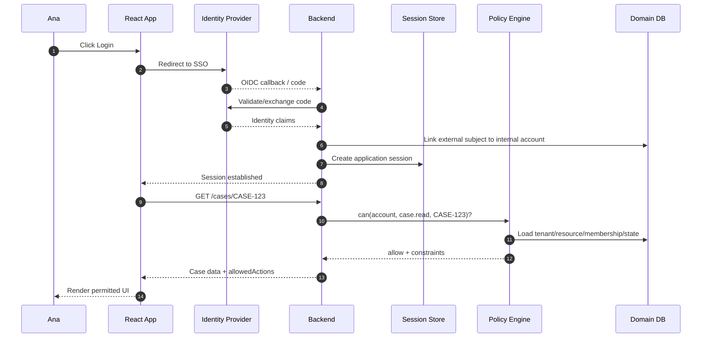
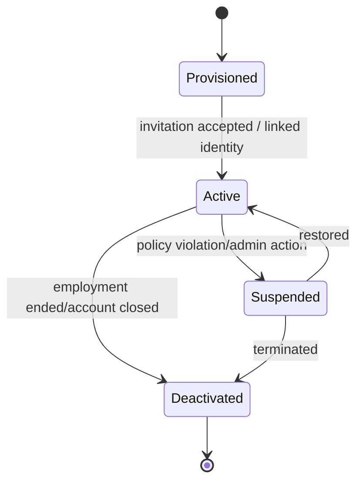
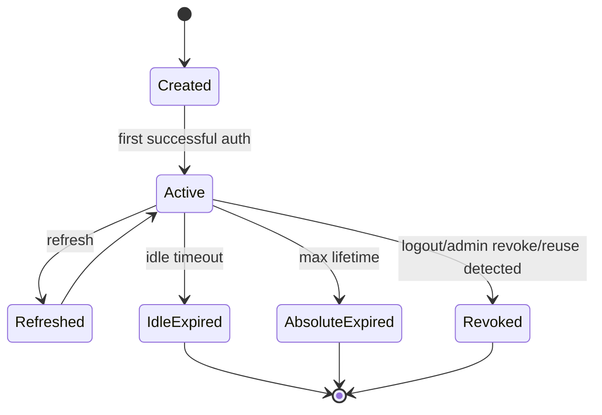
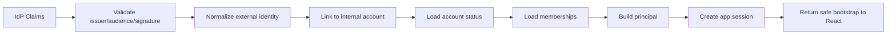
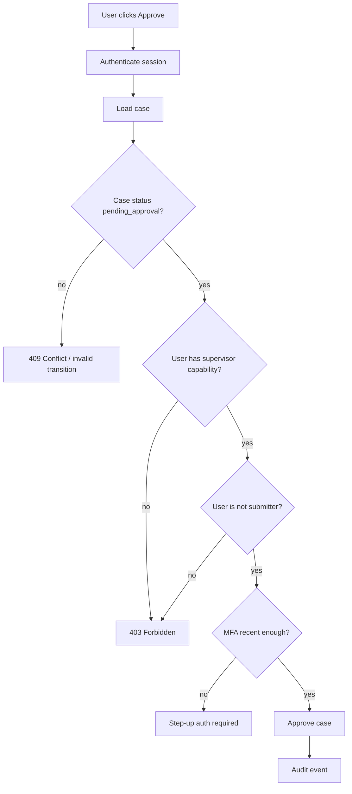

# Part 002 — Authentication vs Authorization vs Identity

Part 001 membangun tesis utama: auth bukan login. Sekarang kita pecah istilah yang paling sering dicampur: authentication, authorization, identity, account, user, principal, session, token, role, permission, scope, claim, tenant, dan membership.

Ini bukan debat terminologi. Di sistem production, istilah yang kabur berubah menjadi bug.

Contoh bug karena istilah kabur:

- `user.role === "admin"` memberi akses lintas tenant;
- JWT `scope` dipakai sebagai permission domain aplikasi;
- email dipakai sebagai stable user ID;
- profile dari IdP dianggap account internal;
- authenticated user dianggap otomatis authorized;
- logout aplikasi dianggap sama dengan logout IdP;
- role global dipakai untuk resource-level workflow;
- permission cache tidak dibersihkan saat tenant switch;
- session valid tetapi membership tenant sudah revoked.

Tujuan part ini: setelah membaca, kamu harus bisa melihat objek auth bukan sebagai blob `user`, tetapi sebagai model berlapis.

---

## 1. Satu flow, banyak konsep

Bayangkan Ana membuka aplikasi case management:

1. Ana menekan `Login with Company SSO`.
2. Identity Provider memverifikasi Ana lewat password + MFA.
3. Backend menerima OIDC callback dan membuat application session.
4. Backend menemukan bahwa subject IdP `00uabc123` terhubung ke account internal `acct_789`.
5. Account itu punya membership pada tenant `REGULATOR-JKT` sebagai `senior_investigator`.
6. Ana membuka `/cases/CASE-123`.
7. Backend mengecek apakah `acct_789` boleh membaca case tersebut.
8. Backend mengirim case data yang sudah difilter dan `allowedActions`.
9. React menampilkan tombol yang sesuai.
10. Ana menekan `Approve`.
11. Backend mengecek lagi permission action `case.approve`, termasuk state case, role, region, conflict-of-interest, dan MFA assurance.

Kalau ditulis sebagai diagram:



Dalam flow ini ada banyak konsep:

- authentication terjadi di IdP/backend;
- identity claims datang dari IdP;
- account internal di-load dari database aplikasi;
- session dibuat oleh backend;
- authorization dievaluasi oleh policy layer;
- React hanya mengonsumsi state dan decision contract.

Kalau semua disimpan dalam `user`, desain kehilangan presisi.

---

## 2. Authentication: membuktikan klaim identitas

Authentication menjawab:

> Apakah entitas ini benar-benar siapa yang ia klaim?

OWASP mendefinisikan authentication sebagai proses memverifikasi bahwa individu, entitas, atau website adalah seperti yang diklaim, dengan menentukan validitas satu atau lebih authenticator seperti password, biometric, atau security token.

Di aplikasi React, authentication bisa muncul sebagai:

- username/password form;
- magic link;
- social login;
- OIDC authorization code with PKCE;
- enterprise SSO;
- passkey/WebAuthn;
- MFA challenge;
- step-up authentication sebelum action sensitif;
- re-authentication setelah idle timeout.

### 2.1 React jarang menjadi verifier final

React bisa mengumpulkan input atau mengarahkan flow, tetapi React tidak boleh menjadi verifier final.

Buruk:

```tsx
if (password === "admin123") {
  setIsAuthenticated(true);
}
```

Jelas ini contoh ekstrem. Tetapi versi production yang lebih halus juga berbahaya:

```tsx
const decoded = decodeJwt(token);
setUser(decoded);
setIsAuthenticated(true);
```

Decode bukan validate. Dan validate token di browser pun bukan pengganti session/policy server.

### 2.2 Authentication menghasilkan confidence, bukan permission

Setelah authentication berhasil, sistem tahu bahwa subject tertentu telah diverifikasi dengan metode tertentu.

Tetapi belum tentu subject itu boleh melakukan apa pun.

Contoh:

- user berhasil login tetapi account disabled;
- user berhasil SSO tetapi belum punya membership tenant;
- user berhasil MFA tetapi tidak punya permission approve;
- user login sebagai contractor tetapi contract expired;
- user login dari device yang tidak memenuhi policy;
- user login tetapi resource berada di region lain.

Authentication adalah input. Authorization adalah decision.

---

## 3. Identity: representasi siapa subjek di sistem

Identity menjawab:

> Siapa entitas ini dalam namespace tertentu?

Identity tidak selalu sama dengan user record aplikasi.

Contoh identity dari IdP:

```json
{
  "iss": "https://idp.company.example",
  "sub": "00uabc123",
  "email": "ana@company.example",
  "name": "Ana Wijaya"
}
```

Contoh account internal:

```json
{
  "accountId": "acct_789",
  "externalIdentities": [
    {
      "provider": "company-sso",
      "issuer": "https://idp.company.example",
      "subject": "00uabc123"
    }
  ],
  "status": "active",
  "createdAt": "2025-02-10T10:12:00+07:00"
}
```

Keduanya tidak sama.

### 3.1 External identity vs internal account

| Konsep | Dimiliki oleh | Stabilitas | Digunakan untuk |
|---|---|---|---|
| External identity | IdP | Stabil dalam issuer tertentu, tetapi bisa berubah tergantung provider | Federation/login mapping. |
| Internal account | Aplikasi | Harus stabil untuk domain aplikasi | Ownership, audit, authorization, preferences. |
| Profile | IdP atau aplikasi | Bisa berubah | Display name, avatar, email. |
| Membership | Aplikasi/domain | Bisa berubah | Tenant/org/project access. |

Jangan jadikan email sebagai primary key authorization. Email bisa berubah, bisa didaur ulang, bisa memiliki case-sensitivity/normalization issue, dan tidak selalu unik lintas provider.

Gunakan stable internal account ID untuk domain authorization.

---

## 4. Authorization: memutuskan akses

Authorization menjawab:

> Apakah subject boleh melakukan action terhadap resource dalam context ini?

Formula yang akan kita pakai:

```txt
decision = can(subject, action, resource, context)
```

Contoh:

```ts
can({
  subject: { accountId: "acct_789" },
  action: "case.approve",
  resource: { type: "case", id: "CASE-123" },
  context: {
    tenantId: "REGULATOR-JKT",
    assuranceLevel: "mfa",
    requestTime: "2026-07-07T09:00:00+07:00",
  },
});
```

Authorization bukan:

```ts
user.role === "admin"
```

Itu hanya salah satu kemungkinan input untuk authorization.

### 4.1 Subject

Subject adalah aktor yang meminta akses.

Subject bisa berupa:

- human user;
- service account;
- background worker;
- API client;
- admin impersonating another user;
- delegated actor;
- organization;
- device;
- anonymous visitor.

Di React app, subject biasanya human user, tetapi sistem enterprise sering butuh delegated subject.

Contoh:

```ts
type Subject =
  | { kind: "user"; accountId: string }
  | { kind: "service"; serviceAccountId: string }
  | {
      kind: "impersonation";
      actorAccountId: string;
      effectiveAccountId: string;
      reason: string;
    };
```

Impersonation tidak boleh direpresentasikan sebagai “ganti user saja”. Actor dan effective subject harus tetap terlihat untuk audit dan UI.

### 4.2 Action

Action adalah capability domain, bukan label tombol.

Buruk:

```ts
"showApproveButton"
```

Lebih baik:

```ts
"case.approve"
```

Lebih spesifik jika perlu:

```ts
"case.approve.enforcementRecommendation"
"case.export.redactedPdf"
"case.export.fullEvidenceBundle"
```

Action harus stabil, testable, dan domain-oriented.

### 4.3 Resource

Resource adalah target akses.

```ts
type ResourceRef =
  | { type: "case"; id: string }
  | { type: "case.comment"; id: string; parentCaseId: string }
  | { type: "tenant"; id: string }
  | { type: "user"; id: string }
  | { type: "report"; id: string };
```

Resource tidak selalu object tunggal. Kadang resource adalah collection:

```ts
{ type: "case.collection", tenantId: "REGULATOR-JKT" }
```

Authorization untuk list query berbeda dengan authorization untuk object detail. List query sering butuh filter, bukan boolean.

### 4.4 Context

Context adalah informasi tambahan yang mempengaruhi decision.

Contoh:

- tenant aktif;
- region;
- resource state;
- time;
- assurance level;
- network zone;
- device trust;
- emergency mode;
- purpose of access;
- request origin;
- workflow step;
- conflict-of-interest flag.

Context sering menjadi pembeda antara sistem auth sederhana dan sistem auth yang benar-benar enterprise-grade.

---

## 5. Session: continuity setelah authentication

Session menjawab:

> Bagaimana sistem menghubungkan request berikutnya dengan authentication yang sudah terjadi?

OWASP Session Management menjelaskan session ID/token sebagai pengikat authenticated user session dengan HTTP traffic dan access control yang ditegakkan aplikasi.

Session bisa berbentuk:

- cookie berisi session ID;
- cookie berisi encrypted session;
- access token bearer;
- access token + refresh token;
- BFF session;
- mTLS-bound token;
- device-bound session.

### 5.1 Session bukan identity

Session adalah instance login.

Satu account bisa punya banyak session:

```txt
Account acct_789
  ├─ session s_1: Chrome laptop office
  ├─ session s_2: Safari phone
  └─ session s_3: Firefox home
```

Logout satu session tidak selalu berarti logout semua session. Password reset mungkin harus revoke semua. Admin force logout mungkin target session tertentu atau semua session user.

### 5.2 Session bukan permission

Session valid tidak berarti semua permission valid.

Permission bisa berubah saat session masih aktif:

- role dicabut;
- tenant membership expired;
- resource reassigned;
- case state berubah;
- policy version berubah;
- emergency access expired.

Karena itu permission snapshot perlu TTL/invalidation, dan backend harus check ulang.

---

## 6. Token: artefak transport, bukan domain model

Token sering membuat frontend auth tampak sederhana:

```ts
localStorage.setItem("access_token", token);
```

Tetapi token adalah artefak transport/security protocol, bukan domain model aplikasi.

### 6.1 ID token

Dalam OIDC, ID token merepresentasikan authentication event dan identity claims untuk client/relying party. ID token bukan token untuk memanggil API resource server.

Frontend sering salah memakai ID token sebagai access token.

### 6.2 Access token

Access token dipakai untuk mengakses resource server/API. Access token punya audience dan scope. Resource server yang harus memvalidasi access token.

### 6.3 Refresh token

Refresh token dipakai untuk mendapatkan access token baru. Di browser-based app, refresh token harus diperlakukan sangat hati-hati: rotation, reuse detection, lifetime, storage, dan threat model XSS sangat penting.

### 6.4 Token claims bukan permission final

JWT bisa berisi claims seperti:

```json
{
  "sub": "00uabc123",
  "scope": "openid profile email api:read",
  "tenant": "REGULATOR-JKT",
  "roles": ["senior_investigator"]
}
```

Claims ini bisa membantu bootstrap. Tetapi untuk domain authorization yang kompleks, claims sering tidak cukup.

Masalah:

- stale sampai token expiry;
- tidak tahu current resource state;
- tidak tahu conflict-of-interest terbaru;
- tidak tahu object-level grant terbaru;
- tidak tahu policy version terbaru;
- tidak tahu tenant switch jika token terlalu global.

Gunakan claims sebagai input, bukan sebagai keputusan final.

---

## 7. Role, permission, scope, claim, entitlement: jangan dicampur

Ini area yang sering rusak.

### 7.1 Role

Role adalah grouping responsibility atau grouping permission.

Contoh:

```txt
senior_investigator
legal_reviewer
tenant_admin
read_only_auditor
```

Role bagus untuk administrasi manusia. Role buruk jika dipakai sebagai satu-satunya decision.

### 7.2 Permission

Permission adalah capability untuk action tertentu.

```txt
case.read
case.comment
case.assign
case.approve
case.export.redacted
case.export.full
user.invite
user.disable
tenant.settings.update
```

Permission lebih dekat ke UI dan API contract.

### 7.3 Scope

Scope dalam OAuth adalah delegated access boundary untuk client/API. Scope bukan selalu sama dengan permission domain aplikasi.

Contoh OAuth scope:

```txt
openid profile email api:read api:write
```

Contoh domain permission:

```txt
case.approve
case.viewConfidentialNotes
case.exportEvidenceBundle
```

Jangan otomatis memetakan `api:write` ke semua write action di domain.

### 7.4 Claim

Claim adalah statement tentang subject/token.

Contoh:

```json
{
  "email_verified": true,
  "acr": "urn:mfa",
  "department": "enforcement"
}
```

Claim bisa menjadi attribute dalam ABAC, tetapi bukan decision final.

### 7.5 Entitlement

Entitlement biasanya berarti hak akses atau paket kemampuan yang diberikan kepada user/org, sering di SaaS/commercial domain.

Contoh:

```txt
feature.advanced_reporting
plan.enterprise_audit_log
quota.case_export_per_day=100
```

Entitlement bisa beririsan dengan feature flag dan permission, tetapi tujuannya beda.

---

## 8. Tabel perbedaan inti

| Istilah | Menjawab | Contoh | Kesalahan umum |
|---|---|---|---|
| Authentication | Apakah klaim identity valid? | Password+MFA, OIDC login | Menganggap login sukses berarti boleh akses semua. |
| Identity | Siapa subject dalam namespace tertentu? | IdP `sub`, internal account ID | Pakai email sebagai ID stabil. |
| Session | Bagaimana login diingat? | Cookie session, access token | Menganggap session valid berarti permission valid. |
| Authorization | Boleh melakukan apa? | `can(case.approve, CASE-123)` | Role check global. |
| Role | Grup responsibility/permission | `tenant_admin` | Role explosion, role dipakai tanpa context. |
| Permission | Capability granular | `case.export.full` | Permission terlalu global tanpa resource. |
| Scope | Delegated OAuth/API access | `api:read` | Disamakan dengan domain permission. |
| Claim | Pernyataan tentang subject/token | `email_verified`, `acr` | Dipercaya tanpa memahami issuer/audience/staleness. |
| ACL | Grant pada object | User X viewer pada doc Y | Tidak menangani inheritance/revocation. |
| Tenant Membership | Hubungan account dengan org/tenant | owner/member/auditor | Tenant switch dianggap hanya UI filter. |

---

## 9. Principal: object yang sebaiknya dikonsumsi React

Daripada memberi React semua raw identity/account/session info, lebih baik berikan `Principal` yang sudah dipetakan.

```ts
type Principal = {
  subjectId: string;
  accountId: string;
  displayName: string;
  primaryEmail?: string;
  activeTenant?: {
    tenantId: string;
    displayName: string;
    membershipId: string;
    membershipStatus: "active" | "suspended" | "expired";
  };
  assurance: {
    level: "anonymous" | "password" | "mfa" | "phishing_resistant";
    authenticatedAt?: string;
    methods?: string[];
  };
};
```

`Principal` adalah representation yang aman dan cukup untuk frontend. Tidak semua IdP claims perlu diekspos ke React.

Prinsip:

> React butuh principal yang berguna untuk UX dan request context, bukan seluruh identity dossier.

---

## 10. Account lifecycle vs session lifecycle

Account lifecycle:



Session lifecycle:



Keduanya berbeda.

- Account suspended harus membuat session tidak boleh dipakai lagi.
- Session expired tidak berarti account disabled.
- Logout session tidak menghapus account.
- Password reset bisa revoke sessions tetapi account tetap active.

React harus merespons keduanya secara berbeda.

---

## 11. Tenant, organization, workspace, project

Multi-tenant auth adalah sumber bug besar.

Istilah bisa berbeda:

- tenant;
- organization;
- workspace;
- account group;
- agency;
- regulator office;
- project;
- team.

Yang penting: active context harus eksplisit.

```ts
type TenantContext = {
  activeTenantId: string;
  membershipId: string;
  tenantRole?: string;
  region?: string;
  dataResidency?: string;
};
```

### 11.1 Tenant switch bukan cosmetic action

Tenant switch harus memicu:

- permission cache invalidation;
- query cache invalidation;
- route revalidation;
- active resource reset jika resource bukan milik tenant baru;
- audit context update;
- possibly session context update;
- UI shell rebuild.

Buruk:

```ts
setActiveTenantId(tenantId);
```

Lebih benar:

```ts
await auth.switchTenant(tenantId);
queryClient.clear();
router.revalidate();
audit.setContext({ tenantId });
```

Tenant switch adalah auth event, bukan dropdown biasa.

---

## 12. Membership sebagai authorization input

Membership adalah hubungan account dengan tenant/org/project.

```ts
type Membership = {
  membershipId: string;
  accountId: string;
  tenantId: string;
  status: "active" | "suspended" | "expired";
  roles: string[];
  attributes: {
    region?: string;
    department?: string;
    clearance?: "public" | "internal" | "confidential";
  };
};
```

Authorization sering tidak langsung menggunakan account, tetapi membership.

Contoh:

```ts
can({
  subject: { accountId: "acct_789", membershipId: "mem_456" },
  action: "case.approve",
  resource: { type: "case", id: "CASE-123", tenantId: "REGULATOR-JKT" },
  context: { activeTenantId: "REGULATOR-JKT" },
});
```

Jika membership suspended, session masih bisa valid tetapi akses tenant harus ditolak.

---

## 13. React state design: pisahkan lima hal

Dalam React, jangan campur semua menjadi satu `user`.

Pisahkan minimal:

1. auth state;
2. session state;
3. principal;
4. active tenant context;
5. permission/capability state.

Contoh:

```ts
type AuthStore = {
  auth: AuthState;
  session: Session | null;
  principal: Principal | null;
  activeTenant: TenantContext | null;
  permissionSnapshot: PermissionSnapshot | null;
};
```

Tetapi interface konsumsi UI boleh sederhana:

```ts
const { status, principal } = useAuth();
const tenant = useActiveTenant();
const canApprove = useCan("case.approve", { type: "case", id: caseId });
```

Internal model boleh kaya. API hook harus ergonomis.

---

## 14. Authentication result vs authorization result

Authentication result:

```ts
type AuthenticationResult = {
  status: "success";
  subject: {
    issuer: string;
    externalSubjectId: string;
  };
  authenticatedAt: string;
  assuranceLevel: "password" | "mfa" | "phishing_resistant";
};
```

Authorization result:

```ts
type AuthorizationResult = {
  effect: "allow" | "deny";
  action: string;
  resource: ResourceRef;
  reason?: string;
  constraints?: Record<string, unknown>;
  evaluatedAt: string;
  policyVersion: string;
};
```

Jangan menggabungkan keduanya menjadi:

```ts
type LoginResult = {
  token: string;
  user: User;
  permissions: string[];
};
```

Itu boleh sebagai bootstrap response sederhana, tetapi jangan jadikan mental model utama.

---

## 15. Claims mapping pipeline

Saat menggunakan OIDC/SSO, claims eksternal harus dipetakan ke model internal.



Mapping yang buruk:

```ts
const user = decodedToken;
```

Mapping yang lebih sehat:

```ts
const externalIdentity = await validateOidcClaims(idToken);
const account = await accountRepository.findByExternalIdentity(externalIdentity);
const memberships = await membershipRepository.findActiveByAccount(account.id);
const principal = principalFactory.from(account, memberships, externalIdentity.assurance);
const session = await sessionService.create(principal);
```

React menerima principal yang sudah aman dan minimal.

---

## 16. Scope OAuth vs permission aplikasi

Misalkan access token punya scope:

```txt
api:read api:write
```

Itu biasanya berarti client boleh memanggil kategori API tertentu. Bukan berarti user boleh approve semua case.

Backend bisa melakukan dua lapis check:

```ts
assertTokenHasScope(token, "api:write");

const decision = await policy.can({
  subject,
  action: "case.approve",
  resource: caseResource,
  context,
});

if (decision.effect !== "allow") {
  throw new ForbiddenError(decision.reason);
}
```

Scope menjawab: client/token ini punya delegated API access?

Permission menjawab: subject ini boleh melakukan action domain ini terhadap resource ini?

---

## 17. RBAC, ABAC, ReBAC, ACL secara singkat

Detailnya akan dibahas di phase authorization modelling. Untuk Part 002, pahami perbedaan dasarnya.

### 17.1 RBAC — Role-Based Access Control

Decision berdasarkan role.

```txt
role senior_investigator has permission case.comment
role supervisor has permission case.approve
```

Bagus untuk administrasi. Lemah untuk context/resource kompleks jika berdiri sendiri.

### 17.2 ABAC — Attribute-Based Access Control

Decision berdasarkan attribute subject/resource/environment.

```txt
allow if subject.region == resource.region
and subject.clearance >= resource.classification
and resource.status == "pending_approval"
```

Bagus untuk rule kompleks. Butuh governance agar policy tidak liar.

### 17.3 ReBAC — Relationship-Based Access Control

Decision berdasarkan relationship graph.

```txt
user Ana is investigator on CASE-123
user Budi is supervisor of team that owns CASE-123
```

Bagus untuk collaboration dan object hierarchy.

### 17.4 ACL — Access Control List

Grant langsung pada object.

```txt
CASE-123:
  Ana: viewer
  Budi: editor
  LegalTeam: reviewer
```

Bagus untuk object sharing. Perlu strategi inheritance, revocation, dan scale.

Dalam sistem nyata, model sering hybrid.

---

## 18. Authorization sebagai fungsi state machine domain

Authorization sering harus mempertimbangkan state transition.



Perhatikan bahwa tidak semua denial adalah 403.

- Jika session invalid: 401.
- Jika authenticated tapi tidak punya capability: 403.
- Jika case state berubah: 409.
- Jika butuh MFA: step-up challenge.
- Jika resource tidak ada atau disembunyikan: 404.

React harus bisa menampilkan UX yang sesuai.

---

## 19. Permission response yang berguna untuk UI

UI sering butuh lebih dari allowed/denied.

```ts
type Capability = {
  action: string;
  effect: "allow" | "deny";
  reasonCode?: string;
  reasonText?: string;
  constraints?: {
    requiresMfa?: boolean;
    maxExportRows?: number;
    redactionLevel?: "none" | "partial" | "full";
  };
};
```

Contoh response:

```json
{
  "resource": { "type": "case", "id": "CASE-123" },
  "capabilities": [
    {
      "action": "case.comment",
      "effect": "allow"
    },
    {
      "action": "case.approve",
      "effect": "deny",
      "reasonCode": "SUBMITTER_CANNOT_APPROVE",
      "reasonText": "You cannot approve a case you submitted."
    },
    {
      "action": "case.export.full",
      "effect": "allow",
      "constraints": {
        "requiresMfa": true,
        "maxExportRows": 5000
      }
    }
  ]
}
```

React bisa menggunakan ini untuk:

- render action;
- disable action;
- show reason;
- trigger step-up auth;
- adjust UI constraint.

Tetapi action submit tetap harus dicek backend.

---

## 20. Identity assurance: login tidak selalu sama kuat

Tidak semua authentication event punya tingkat assurance yang sama.

Contoh level praktis:

| Assurance | Contoh | Cocok untuk |
|---|---|---|
| Anonymous | Belum login | Public page. |
| Password | Password saja | Basic account access. |
| MFA | Password + second factor | Sensitive view/action. |
| Phishing-resistant | Passkey/WebAuthn/security key | High-risk admin/financial/regulatory action. |

UI perlu memahami saat action butuh step-up.

```tsx
const decision = useCan("case.export.full", { type: "case", id: caseId });

if (decision.effect === "allow" && decision.constraints?.requiresMfa) {
  return <Button onClick={startStepUp}>Verify again to export</Button>;
}
```

Authentication assurance adalah input authorization.

---

## 21. Auth bugs yang berasal dari istilah salah

### Bug 1 — Email sebagai identity key

```ts
const user = await users.findByEmail(claims.email);
```

Masalah:

- email bisa berubah;
- provider bisa mengirim email belum verified;
- email bisa reusable;
- normalization berbeda;
- beberapa identities bisa punya email sama di environment berbeda.

Lebih baik mapping berdasarkan issuer + subject.

```ts
const user = await users.findByExternalIdentity({
  issuer: claims.iss,
  subject: claims.sub,
});
```

### Bug 2 — Role global pada multi-tenant app

```ts
if (user.role === "admin") allow();
```

Masalah: admin tenant A menjadi admin tenant B.

Lebih baik:

```ts
const membership = await memberships.find(user.accountId, activeTenantId);
if (membership.roles.includes("tenant_admin")) allow();
```

Tetap perlu resource/context check.

### Bug 3 — Permission disimpan dalam JWT terlalu lama

Role dicabut pukul 10:00, token baru expired pukul 11:00. Selama satu jam UI/backend yang hanya percaya JWT claim bisa memberikan akses lama.

Solusi tergantung architecture:

- short-lived access token;
- introspection;
- session version;
- permission version;
- token revocation;
- backend policy lookup;
- event-driven cache invalidation.

### Bug 4 — Scope dianggap permission

```ts
if (token.scope.includes("api:write")) {
  approveCase();
}
```

`api:write` terlalu luas. Domain action tetap harus dicek.

### Bug 5 — Logout hanya clear local state

```ts
setUser(null);
localStorage.clear();
```

Masalah:

- server session masih valid;
- refresh token belum revoked;
- tab lain masih aktif;
- query cache masih menyimpan data;
- service worker/cache mungkin masih punya response;
- IdP session masih ada.

Logout adalah distributed cleanup.

---

## 22. React implementation boundary: siapa bertanggung jawab apa?

| Layer | Tanggung jawab | Tidak boleh |
|---|---|---|
| Auth Provider | Menyediakan auth state untuk React tree | Menjadi policy engine final. |
| Session Manager | Refresh, expiry, logout propagation | Menyimpan token secara sembarangan. |
| API Client | Attach credential, handle 401/403 | Mengubah 403 menjadi login otomatis. |
| Router Guard | Coarse auth dan loader redirect | Menganggap route guard cukup. |
| Permission Hook | Exposure control dan UX | Memberi izin final terhadap mutation. |
| Backend API | Session validation dan enforcement | Percaya role dari body/frontend. |
| Policy Engine | Decision berdasarkan subject/action/resource/context | Mengembalikan reason sensitif sembarangan. |
| Audit Layer | Merekam event penting | Menyimpan token/secret di log. |

---

## 23. Contract bootstrap yang sehat

Endpoint `/session` atau `/me` sering menjadi pusat bootstrap.

Contoh response yang lebih sehat:

```json
{
  "auth": {
    "status": "authenticated",
    "sessionId": "sess_abc",
    "expiresAt": "2026-07-07T17:00:00+07:00",
    "idleExpiresAt": "2026-07-07T10:30:00+07:00"
  },
  "principal": {
    "subjectId": "sub_123",
    "accountId": "acct_789",
    "displayName": "Ana Wijaya",
    "primaryEmail": "ana@company.example",
    "assurance": {
      "level": "mfa",
      "authenticatedAt": "2026-07-07T09:00:00+07:00"
    }
  },
  "activeTenant": {
    "tenantId": "REGULATOR-JKT",
    "displayName": "Jakarta Enforcement Office",
    "membershipId": "mem_456",
    "roles": ["senior_investigator"]
  },
  "globalCapabilities": [
    "case.create",
    "case.search",
    "user.invite.request"
  ]
}
```

Hal yang sengaja tidak dikirim:

- raw refresh token;
- seluruh IdP claims;
- secrets;
- permissions lintas tenant yang tidak aktif;
- internal policy internals;
- sensitive audit metadata.

---

## 24. Authorization untuk list berbeda dari detail

Detail check:

```txt
Can Ana read CASE-123?
```

List check:

```txt
Which cases can Ana see?
```

List authorization sering berupa filter, bukan boolean.

```ts
type CaseVisibilityFilter = {
  tenantId: string;
  allowedRegions: string[];
  allowedClassifications: string[];
  assignedTeamIds?: string[];
};
```

Backend menerjemahkan filter itu ke query database.

React tidak boleh mengambil semua case lalu filter di client jika data yang tidak boleh dilihat ikut terkirim.

Buruk:

```tsx
const allCases = await api.getAllCases();
const visibleCases = allCases.filter(canViewCaseInFrontend);
```

Lebih baik:

```tsx
const visibleCases = await api.searchCases({ q, filters });
```

Backend menerapkan authorization filter.

---

## 25. Denial reason: informatif tapi aman

UI yang baik memberi alasan. Tetapi alasan tidak boleh membocorkan informasi sensitif.

Contoh aman:

```txt
You do not have permission to view this case.
```

Contoh mungkin aman untuk internal app:

```txt
Only supervisors in the assigned region can approve this case.
```

Contoh berisiko:

```txt
You cannot view this case because it belongs to the Anti-Corruption Investigation Unit and contains witness identity data.
```

Denial reason harus didesain berdasarkan sensitivity domain.

Pattern:

```ts
type DenialReason = {
  code: string;
  safeMessage: string;
  supportReference?: string;
};
```

Audit log boleh menyimpan reason detail. UI mungkin hanya menampilkan safe message.

---

## 26. Testing vocabulary

Setelah istilah jelas, test juga lebih jelas.

### Authentication tests

- invalid credentials rejected;
- MFA required for certain account;
- callback validates state/nonce;
- expired session returns 401;
- revoked session returns 401.

### Identity mapping tests

- issuer+subject maps to correct account;
- email change does not create duplicate account;
- disabled account cannot create session;
- unlinked external identity requires provisioning flow.

### Authorization tests

- user without membership denied tenant resource;
- tenant admin A denied tenant B;
- investigator cannot approve own case;
- auditor receives redacted data;
- MFA required for full export;
- object grant revoked means future request denied.

### React UI tests

- anonymous sees login prompt;
- forbidden route shows 403, not login;
- unknown permission disables action;
- denied action shows safe reason;
- tenant switch clears stale permission;
- logout clears query cache.

---

## 27. Practical naming convention

Naming matters. Gunakan nama yang memaksa presisi.

### Avoid

```ts
user
isLoggedIn
isAdmin
tokenData
authData
canAccess
```

### Prefer

```ts
principal
session
activeTenant
membership
permissionSnapshot
authorizationDecision
assuranceLevel
requireAuthenticatedSession
requireCapability
canPerformAction
```

`isAdmin` mungkin tetap boleh untuk UI lokal yang sangat terbatas, tetapi jangan jadikan policy primitive.

---

## 28. Mini architecture: type-level separation

```ts
type ExternalIdentity = {
  provider: "oidc" | "saml" | "password" | "passkey";
  issuer?: string;
  subject: string;
  email?: string;
  emailVerified?: boolean;
};

type Account = {
  accountId: string;
  status: "active" | "suspended" | "deactivated";
  createdAt: string;
};

type Profile = {
  displayName: string;
  avatarUrl?: string;
  locale?: string;
};

type Membership = {
  membershipId: string;
  accountId: string;
  tenantId: string;
  status: "active" | "suspended" | "expired";
  roles: string[];
};

type Session = {
  sessionId: string;
  accountId: string;
  createdAt: string;
  expiresAt: string;
  assuranceLevel: "password" | "mfa" | "phishing_resistant";
};

type Principal = {
  accountId: string;
  subjectId: string;
  profile: Profile;
  activeMembership?: Membership;
  assuranceLevel: Session["assuranceLevel"];
};
```

Dengan pemisahan ini, kita bisa menjawab pertanyaan secara presisi:

- identity berubah? update `ExternalIdentity` mapping;
- profile berubah? update `Profile`;
- user suspended? update `Account.status`;
- tenant access dicabut? update `Membership.status`;
- session expired? update `Session`;
- permission denied? hasil `AuthorizationDecision`.

---

## 29. Checklist Part 002

Gunakan checklist ini untuk mereview auth model.

### Identity

- [ ] Apakah external identity dipisah dari internal account?
- [ ] Apakah mapping memakai issuer + subject, bukan email saja?
- [ ] Apakah profile tidak dipakai sebagai source of truth authorization?
- [ ] Apakah account status diperiksa saat session dibuat/direstore?

### Authentication

- [ ] Apakah authentication menghasilkan assurance level?
- [ ] Apakah MFA/step-up dibedakan dari login biasa?
- [ ] Apakah React tidak menjadi verifier final?
- [ ] Apakah callback/redirect flow divalidasi server-side?

### Session

- [ ] Apakah session lifecycle dipisah dari account lifecycle?
- [ ] Apakah logout/revocation jelas?
- [ ] Apakah session valid tidak otomatis berarti permission valid?
- [ ] Apakah multi-device/multi-tab dipertimbangkan?

### Authorization

- [ ] Apakah authorization memakai subject/action/resource/context?
- [ ] Apakah role hanya input, bukan decision final?
- [ ] Apakah tenant/membership eksplisit?
- [ ] Apakah list authorization tidak dilakukan dengan client-side filtering atas data sensitif?
- [ ] Apakah permission reason aman untuk UI?

### React

- [ ] Apakah `user` tidak menjadi blob semua informasi?
- [ ] Apakah `useAuth`, `useSession`, `useActiveTenant`, dan `useCan` punya boundary jelas?
- [ ] Apakah 401 dan 403 dibedakan?
- [ ] Apakah tenant switch menghapus stale cache?

---

## 30. Latihan desain

Ambil object sederhana:

```ts
type User = {
  id: string;
  email: string;
  name: string;
  role: "admin" | "manager" | "user";
  permissions: string[];
  token: string;
};
```

Pecah menjadi:

1. `ExternalIdentity`;
2. `Account`;
3. `Profile`;
4. `Membership`;
5. `Session`;
6. `Principal`;
7. `PermissionSnapshot`;
8. `AuthorizationDecision`.

Lalu jawab:

- field mana yang boleh dikirim ke React?
- field mana yang hanya boleh ada di backend?
- field mana yang boleh dicache?
- field mana yang harus invalidated saat tenant switch?
- field mana yang harus masuk audit log?

Kalau pertanyaan ini sulit dijawab, model auth masih terlalu kabur.

---

## 31. Ringkasan mental model

Authentication membuktikan klaim identity. Identity menjelaskan siapa subject dalam namespace tertentu. Account adalah representasi internal aplikasi. Session menjaga continuity setelah authentication. Authorization memutuskan apakah subject boleh melakukan action terhadap resource dalam context tertentu. Role, scope, claim, permission, ACL, dan entitlement adalah input/model yang berbeda; jangan dicampur.

Untuk React engineer, kesimpulan praktisnya:

- jangan desain auth di sekitar `user` blob;
- jangan desain authorization di sekitar `isAdmin`;
- jangan treat token sebagai domain model;
- jangan treat authenticated sebagai authorized;
- jangan treat tenant switch sebagai filter UI;
- jangan treat permission snapshot sebagai truth permanen;
- buat boundary yang jelas antara identity, session, principal, membership, permission, dan decision.

Kalimat yang harus diingat:

> Login tells the system who is speaking. Authorization decides whether that speaker may do this action to this resource now.

---

## 32. Referensi utama

- OWASP Authentication Cheat Sheet — definisi authentication dan praktik login/authenticator: `https://cheatsheetseries.owasp.org/cheatsheets/Authentication_Cheat_Sheet.html`
- OWASP Authorization Cheat Sheet — access control dan validasi authorization per request: `https://cheatsheetseries.owasp.org/cheatsheets/Authorization_Cheat_Sheet.html`
- OWASP Session Management Cheat Sheet — session lifecycle dan session identifier: `https://cheatsheetseries.owasp.org/cheatsheets/Session_Management_Cheat_Sheet.html`
- OWASP OAuth2 Cheat Sheet — OAuth 2.0 dan OIDC sebagai identity layer di atas OAuth: `https://cheatsheetseries.owasp.org/cheatsheets/OAuth2_Cheat_Sheet.html`
- RFC 9700 OAuth 2.0 Security Best Current Practice: `https://www.rfc-editor.org/rfc/rfc9700.html`
- NIST SP 800-63B Digital Identity Guidelines — authenticator assurance dan lifecycle authenticator: `https://pages.nist.gov/800-63-3/sp800-63b.html`
