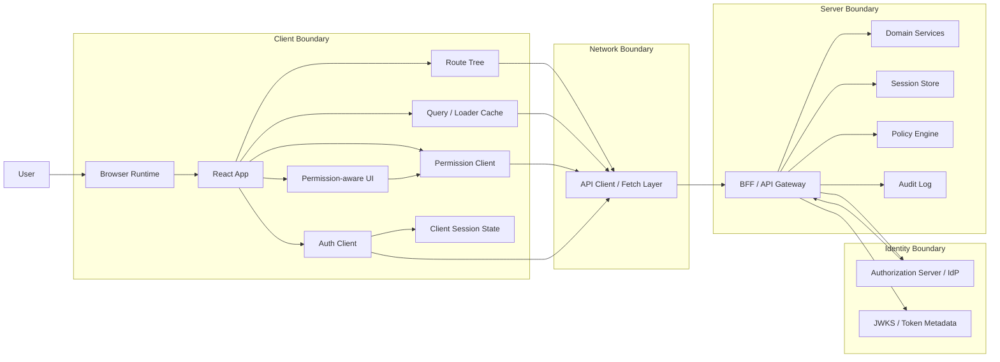
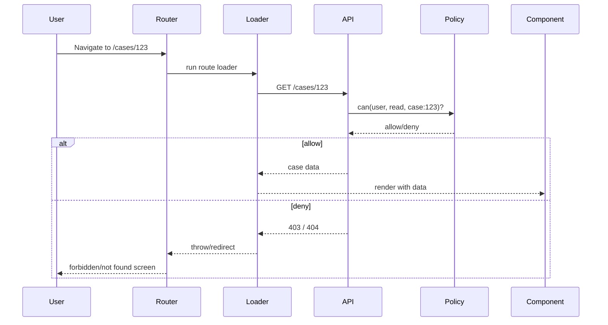
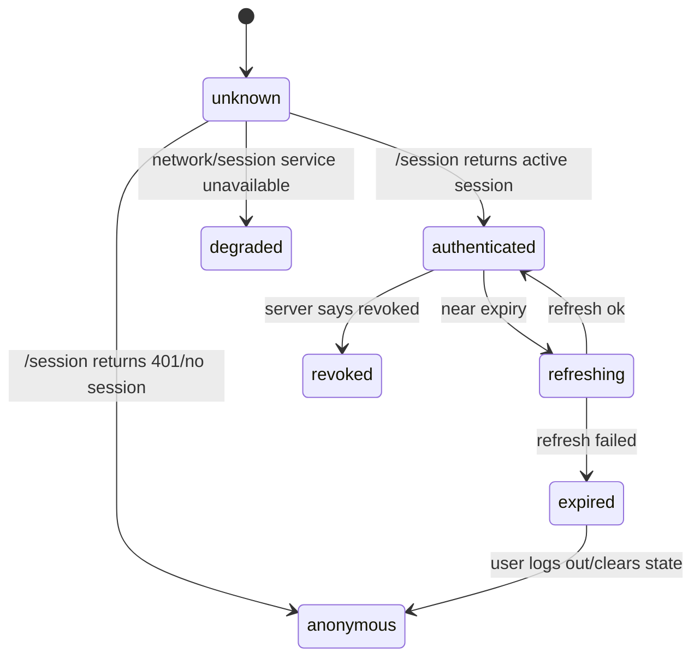
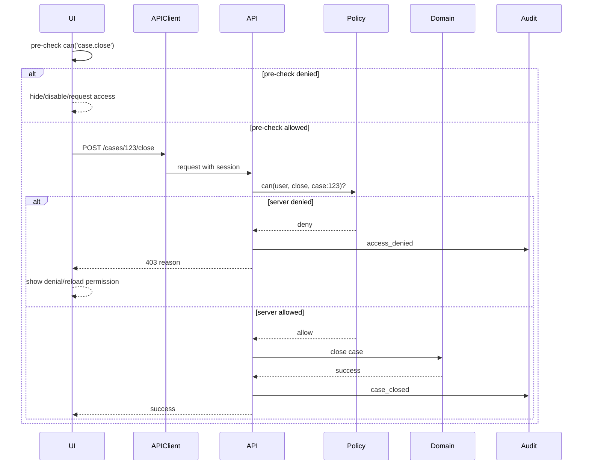
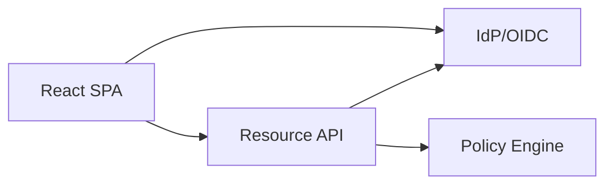
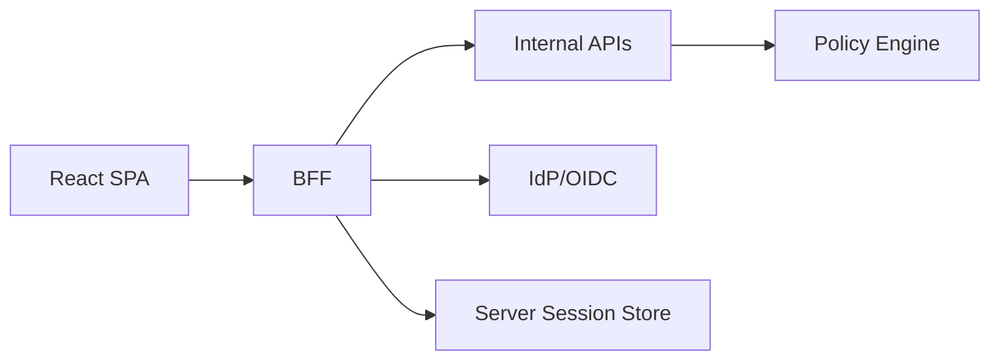
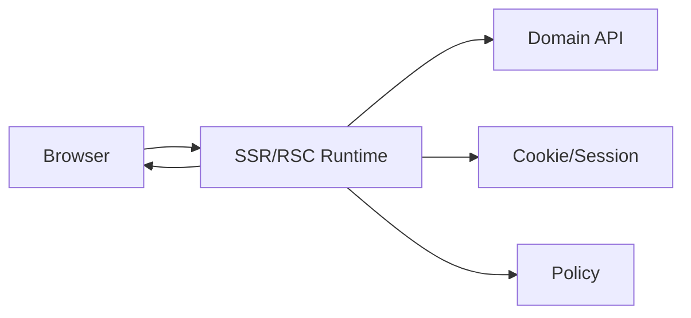
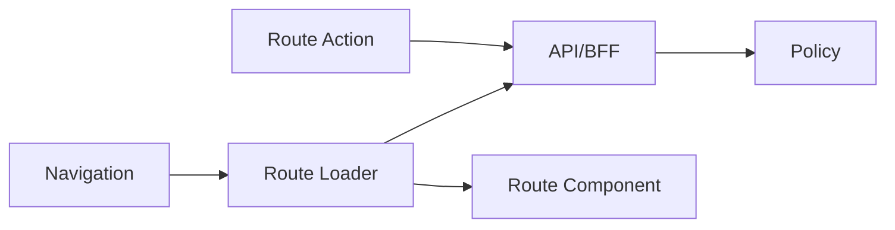
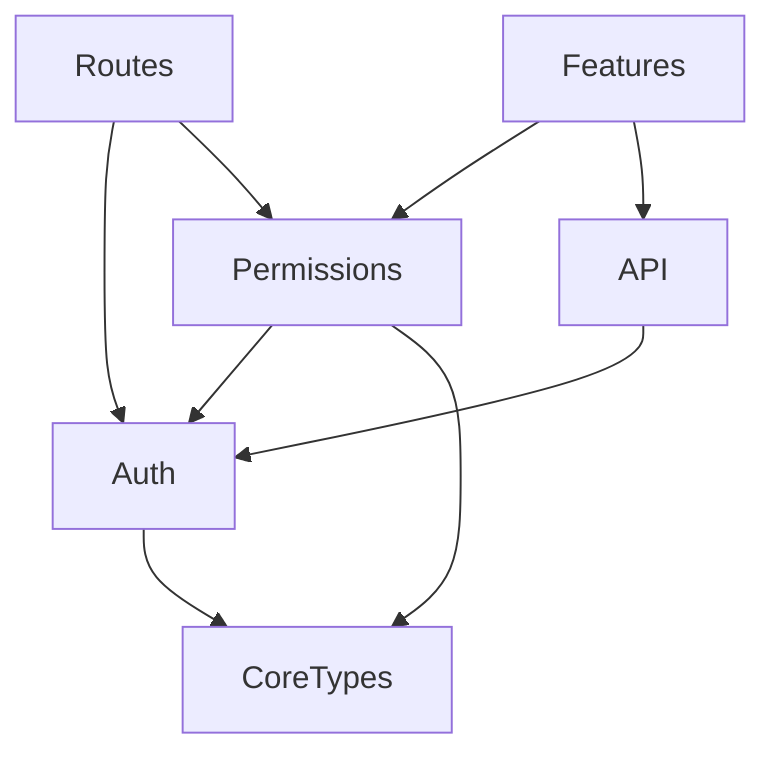

# React Auth Architecture Map

Auth di React bukan satu komponen. Bukan juga satu hook. Bukan `ProtectedRoute`. React auth production-grade adalah rangkaian boundary yang menghubungkan browser, React tree, router, data loader, API client, backend, identity provider, policy model, session store, audit log, dan incident response.

Jika kita salah menempatkan boundary, sistem akan terlihat aman di UI tetapi bolong di resource layer. Jika kita salah menempatkan state, sistem akan terlihat cepat tetapi gagal saat token expired, role berubah, tenant berpindah, atau satu tab logout sementara tab lain masih aktif.

Part ini membuat peta besar. Bukan untuk menghafal tool. Tujuannya agar setiap implementasi auth bisa dibaca seperti sistem: siapa yang dipercaya, siapa yang tidak, state apa yang boleh hidup di browser, keputusan apa yang wajib dilakukan server, dan transisi apa yang harus eksplisit.

> Core idea: React boleh membantu user memahami apa yang bisa dia lakukan. React tidak boleh menjadi tempat terakhir yang menentukan apakah user benar-benar boleh melakukannya.

---

## 1. Peta besar: auth sebagai sistem lintas boundary

Lihat arsitektur ini sebagai pipeline.



Peta ini sengaja memisahkan beberapa hal yang sering dicampur:

1. **Identity provider** membuktikan identitas atau menerbitkan token.
2. **Session layer** menjaga kontinuitas interaksi setelah login.
3. **React auth client** menyimpan state untuk rendering dan navigasi.
4. **Router/data layer** menentukan apakah halaman boleh dimuat.
5. **Permission client** membantu UI menampilkan aksi yang relevan.
6. **Backend/policy engine** membuat keputusan otoritatif.
7. **Audit layer** mencatat keputusan penting dan perubahan akses.

Kesalahan umum adalah membuat `user.role` di React menjadi pusat kebenaran. Itu terlihat praktis, tetapi sebenarnya menempatkan authority di runtime yang sepenuhnya berada di bawah kontrol user.

---

## 2. Boundary utama dalam React auth

### 2.1 Browser boundary

Browser adalah runtime yang tidak bisa dipercaya sepenuhnya. User bisa membuka DevTools, mengubah local storage, memodifikasi request, menjalankan script melalui XSS, memasang extension, menyalin token, atau me-replay request.

Artinya, browser boleh menyimpan **state representasional**, bukan authority final.

Contoh state yang wajar di browser:

- `isAuthenticated` untuk memilih layout sementara.
- `currentUser` untuk menampilkan avatar/nama.
- `currentTenantId` untuk konteks kerja.
- `allowedActions` untuk menyembunyikan tombol yang tidak relevan.
- `authStatus` untuk membedakan `loading`, `authenticated`, `expired`, `forbidden`.

Contoh state yang tidak boleh dianggap otoritatif:

- `role: 'admin'` dari local storage.
- hasil decode JWT di client sebagai sumber final permission.
- flag `canDeleteCase: true` yang dipakai tanpa validasi server.
- route metadata yang dianggap cukup untuk melindungi data.

### 2.2 React tree boundary

React tree adalah boundary komposisi. Ia bagus untuk membungkus provider, layout, suspense, error boundary, dan component-level permission. Ia buruk sebagai security enforcement final.

React tree menjawab pertanyaan:

- Layout mana yang harus ditampilkan?
- Apakah user sedang login, expired, atau perlu re-auth?
- Apakah tombol tertentu sebaiknya terlihat?
- Apakah field tertentu readonly?
- Apakah halaman perlu redirect sebelum user melihat screen?

React tree tidak boleh menjadi satu-satunya tempat yang menjawab:

- Apakah request `DELETE /cases/123` boleh dieksekusi?
- Apakah user boleh melihat object `123`?
- Apakah tenant A boleh mengakses resource tenant B?
- Apakah role yang baru saja dicabut masih aktif?

### 2.3 Router/data boundary

Router adalah boundary penting karena route memutuskan **kapan data dimuat**. Pada React Router Data/Framework Mode, loader/action berjalan sebelum component mendapat data. Ini membuat auth dapat dilakukan sebelum render, bukan setelah UI sudah terlanjur mount.

React Router mendukung data loading melalui `loader`/`clientLoader`, dan middleware untuk menjalankan logic sebelum/atau sesudah response generation pada matched path. Ini relevan untuk auth karena authentication, logging, error handling, dan preprocessing dapat ditempatkan di boundary yang reusable.

Pola mentalnya:



Komponen baru dirender setelah boundary data memberikan keputusan yang cukup. Ini mengurangi flash of protected content dan mengurangi coupling auth ke komponen UI.

### 2.4 API client boundary

API client adalah chokepoint teknis untuk request dari React ke server. Ia mengatur:

- penambahan `Authorization` header jika memakai bearer token;
- cookie credential mode jika memakai cookie session;
- refresh token queue;
- retry untuk request yang gagal karena expiry;
- mapping `401`, `403`, `419`, `440`, dan network error;
- correlation ID;
- cache invalidation saat login/logout/role change.

Tetapi API client tetap bukan authority. Ia hanya transport coordinator.

Salah:

```ts
// Salah: API client mengambil keputusan bisnis final.
if (!auth.user.roles.includes('admin')) {
  throw new Error('Forbidden');
}
return fetch('/api/admin/users');
```

Lebih sehat:

```ts
// Client boleh melakukan pre-check untuk UX,
// tetapi server tetap wajib memutuskan.
if (!permissions.can('user.manage')) {
  return { kind: 'client-prevented', reason: 'missing-permission' };
}

const response = await api.get('/api/admin/users');
return response;
```

### 2.5 Server/session boundary

Server/session boundary mengikat request dengan authenticated principal. OWASP Session Management menjelaskan bahwa session ID atau token mengikat authenticated user session dengan HTTP traffic dan access controls yang diterapkan web application.

Di boundary ini, sistem menjawab:

- request ini milik session siapa?
- session masih aktif atau sudah dicabut?
- token valid untuk audience/issuer yang benar?
- session terikat tenant/device/org apa?
- apakah session butuh step-up authentication?
- apakah ada reuse/replay/suspicious behavior?

### 2.6 Policy boundary

Policy boundary adalah tempat keputusan authorization dibuat secara konsisten. Bentuknya bisa sederhana atau kompleks:

- hardcoded permission check di service;
- role-permission table;
- policy-as-code;
- policy-as-data;
- ACL per object;
- ABAC;
- ReBAC/Zanzibar-style relationship tuples.

React boleh mengonsumsi hasil keputusan policy dalam bentuk projection, misalnya:

```json
{
  "resource": "case:CASE-123",
  "allowedActions": ["case.read", "case.comment"],
  "deniedActions": {
    "case.close": {
      "reason": "requires_supervisor_assignment"
    }
  }
}
```

Namun projection ini tetap cacheable view, bukan enforcement final.

---

## 3. Komponen arsitektur yang perlu ada

### 3.1 AuthClient

`AuthClient` adalah adapter antara React dan session/token mechanism. Tugasnya bukan membuat keputusan authorization, tetapi mengelola lifecycle session di client.

Tanggung jawab:

- bootstrap session dari `/session` atau `/me`;
- expose state machine auth;
- men-trigger login/logout;
- koordinasi refresh;
- memberi event `login`, `logout`, `session-expired`, `session-restored`, `session-revoked`;
- membersihkan cache sensitif saat logout;
- sinkronisasi cross-tab.

Contoh state minimal:

```ts
export type AuthStatus =
  | 'unknown'
  | 'anonymous'
  | 'authenticating'
  | 'authenticated'
  | 'refreshing'
  | 'expired'
  | 'revoked'
  | 'forbidden'
  | 'degraded';

export type AuthSnapshot = {
  status: AuthStatus;
  user: CurrentUser | null;
  tenant: CurrentTenant | null;
  session: {
    id?: string;
    expiresAt?: string;
    refreshedAt?: string;
    assuranceLevel?: 'password' | 'mfa' | 'webauthn';
  } | null;
};
```

State ini sengaja eksplisit. `boolean isAuthenticated` tidak cukup untuk sistem serius.

### 3.2 AuthProvider

`AuthProvider` menghubungkan `AuthClient` dengan React tree.

Tanggung jawab:

- menyediakan `useAuth()`;
- menghindari duplicated bootstrap request;
- menahan render saat state belum diketahui;
- mengatur cleanup pada logout;
- menghubungkan auth event dengan query cache/router.

Contoh shape:

```tsx
export function AuthProvider({ children }: { children: React.ReactNode }) {
  const auth = useAuthClient();

  if (auth.status === 'unknown') {
    return <AppBootstrapScreen />;
  }

  return (
    <AuthContext.Provider value={auth}>
      {children}
    </AuthContext.Provider>
  );
}
```

Tetapi hati-hati: `AuthProvider` bukan pelindung resource. Ia hanya membuat state auth tersedia.

### 3.3 PermissionClient

`PermissionClient` adalah client-side projection dari policy. Ia menjawab pertanyaan UI:

- tombol ini ditampilkan atau tidak?
- action ini disabled atau tidak?
- field ini readonly atau editable?
- apakah user perlu request access?
- apa reason untuk denial?

Interface yang sehat:

```ts
export type PermissionDecision =
  | { allowed: true; source: 'snapshot' | 'server'; expiresAt?: string }
  | { allowed: false; reason: string; recoverable?: boolean };

export interface PermissionClient {
  can(action: string, resource?: ResourceRef, context?: Record<string, unknown>): PermissionDecision;
  allowedActions(resource: ResourceRef): string[];
  invalidate(reason: 'tenant-switch' | 'role-change' | 'session-refresh' | 'logout'): void;
}
```

Perhatikan `source` dan `expiresAt`. Permission di client sering stale. Desain yang matang tidak berpura-pura permission projection selalu benar.

### 3.4 ApiClient

API client mengelola transport dan error normalization.

```ts
export type ApiError =
  | { kind: 'unauthenticated'; status: 401; loginUrl?: string }
  | { kind: 'forbidden'; status: 403; reason?: string }
  | { kind: 'notFound'; status: 404 }
  | { kind: 'sessionExpired'; status: 419 | 440 }
  | { kind: 'network'; retryable: boolean }
  | { kind: 'server'; status: number };
```

Auth architecture yang baik tidak membiarkan setiap component menginterpretasi status code sendiri-sendiri.

### 3.5 RouteAuthBoundary

Route boundary memutuskan akses route sebelum component tree utama berjalan.

Contoh konseptual:

```ts
export async function requireAuthenticated(request: Request) {
  const session = await getClientSession(request);

  if (!session.authenticated) {
    throw redirect(`/login?returnTo=${safeReturnTo(request.url)}`);
  }

  return session;
}

export async function requirePermission(
  request: Request,
  action: string,
  resource: ResourceRef,
) {
  const session = await requireAuthenticated(request);
  const decision = await authz.check(session.user, action, resource);

  if (!decision.allowed) {
    throw forbidden(decision.reason);
  }

  return { session, decision };
}
```

Di SPA murni, function ini mungkin berjalan di client dan tetap harus memanggil server untuk data sensitif. Di SSR/BFF, function ini bisa benar-benar berada di server boundary.

### 3.6 Audit boundary

Audit bukan afterthought. Untuk sistem enterprise/regulatory, auth tanpa audit sulit dipertahankan.

Audit event minimal:

- login success/failure;
- logout;
- session revoked;
- token reuse detected;
- tenant switched;
- role/permission changed;
- access denied;
- impersonation started/ended;
- step-up requested/satisfied;
- sensitive action performed.

Jangan menaruh audit final di React. React boleh mengirim telemetry, tetapi audit keamanan harus dibuat di server saat keputusan authoritative terjadi.

---

## 4. Data flow utama

### 4.1 App bootstrap

Saat app pertama dibuka, jangan langsung menganggap user anonymous atau authenticated. State awal yang benar adalah `unknown`.



Bootstrap yang baik menjawab:

- Apakah session ada?
- Apakah session masih aktif?
- Siapa user saat ini?
- Tenant/org aktif apa?
- Permission snapshot awal apa?
- Apakah ada forced password reset/MFA/step-up requirement?

Jangan bootstrap dari local storage saja. Local storage bisa dipakai sebagai cache non-authoritative, tetapi session restore tetap perlu konfirmasi server untuk aplikasi sensitif.

### 4.2 Route navigation

Saat user pindah route, ada tiga level check:

1. **Public route**: tidak butuh session.
2. **Authenticated route**: butuh session aktif.
3. **Authorized route**: butuh permission terhadap resource/action.

```ts
export const routes = [
  {
    path: '/login',
    handle: { auth: 'public' },
  },
  {
    path: '/dashboard',
    handle: { auth: 'authenticated' },
    loader: dashboardLoader,
  },
  {
    path: '/cases/:caseId',
    handle: {
      auth: 'authorized',
      action: 'case.read',
      resource: ({ params }) => ({ type: 'case', id: params.caseId }),
    },
    loader: caseLoader,
  },
];
```

Metadata route membantu konsistensi, tetapi loader/API tetap harus enforce resource access.

### 4.3 Mutation flow

Mutation adalah tempat banyak bug authorization muncul.

Contoh: tombol `Close Case` disembunyikan dari reviewer biasa. Tetapi user bisa tetap memanggil endpoint `POST /cases/123/close` dari DevTools.

Flow yang benar:



Frontend pre-check meningkatkan UX. Server check menjaga integritas.

### 4.4 Token/session refresh flow

Refresh adalah distributed concurrency problem. Banyak tab bisa mencoba refresh bersamaan. Banyak request bisa gagal 401 bersamaan. User bisa logout di tab lain.

Minimal architecture:

- satu refresh in-flight per browser context;
- request lain menunggu hasil refresh;
- refresh failure membersihkan session;
- refresh success memutar token/session metadata;
- cross-tab broadcast untuk login/logout/refresh;
- cache invalidation jika permission snapshot berubah.

```ts
let refreshPromise: Promise<AuthSnapshot> | null = null;

export async function refreshOnce() {
  if (!refreshPromise) {
    refreshPromise = authClient.refresh().finally(() => {
      refreshPromise = null;
    });
  }
  return refreshPromise;
}
```

Kode di atas belum lengkap, tetapi menunjukkan invariant: jangan membuat refresh storm.

### 4.5 Tenant switch flow

Multi-tenant auth tidak cukup dengan `currentTenantId` di UI.

Tenant switch harus:

1. memvalidasi membership user di tenant target;
2. menerbitkan session context baru atau permission snapshot baru;
3. membatalkan cache tenant lama;
4. membatalkan request in-flight jika perlu;
5. mengganti route jika resource saat ini tidak valid di tenant baru;
6. mencatat audit event.

Bug umum:

```ts
localStorage.setItem('tenantId', selectedTenantId);
window.location.reload();
```

Ini bukan tenant switch yang aman. Ini hanya mengganti preferensi UI.

---

## 5. Trust model

Tabel ini adalah cara cepat membaca authority.

| Komponen | Bisa dipercaya untuk | Tidak bisa dipercaya untuk |
|---|---|---|
| React component | Rendering, UX, exposure control | Final authorization decision |
| Route guard client-side | Navigasi dan redirect UX | Melindungi endpoint/API |
| Local storage | Cache non-sensitive, preference | Role/session/permission final |
| Decoded JWT di client | Display claim non-sensitive, expiry hint | Signature validation final, permission final |
| API client | Transport, retry, error mapping | Keputusan bisnis final |
| BFF/API | Session validation, authorization enforcement | Semua policy jika service downstream bypassable |
| Domain service | Resource-level invariant | UI visibility |
| Policy engine | Decision consistency | Data mutation tanpa domain invariant |
| Audit log | Evidence trail | Real-time UI state |

Rule sederhana:

> Jika user bisa mengubah komponen itu, jangan jadikan komponen itu sumber kebenaran authority.

---

## 6. Mode arsitektur React auth

### 6.1 SPA direct-to-API



Kelebihan:

- sederhana untuk deploy static app;
- cocok untuk API-first architecture;
- provider OIDC mudah diintegrasikan.

Risiko:

- token exposure di browser;
- refresh token handling lebih sulit;
- CORS lebih kompleks;
- logout/revocation UX rawan stale;
- perlu disiplin tinggi terhadap XSS.

Cocok jika:

- aplikasi tidak terlalu high-risk;
- token hanya disimpan memory;
- backend memvalidasi token dengan benar;
- permission tetap server-side;
- CSP/XSS mitigation serius.

### 6.2 SPA with BFF



Kelebihan:

- token bisa disembunyikan dari browser;
- session bisa memakai httpOnly cookie;
- API internal lebih sederhana;
- central auth/session handling;
- lebih mudah untuk enterprise/regulatory.

Biaya:

- perlu service tambahan;
- perlu scaling session/BFF;
- perlu desain CSRF;
- latency tambahan;
- deployment lebih kompleks dibanding static SPA murni.

Cocok jika:

- data sensitif;
- multi-tenant;
- enterprise SSO;
- audit kuat;
- refresh token harus dijaga server-side.

### 6.3 SSR/React Server Components



Kelebihan:

- auth bisa dilakukan sebelum HTML dikirim;
- sensitive data tidak perlu masuk client bundle;
- cookie/session lebih natural;
- SEO dan first-load bisa lebih baik.

Risiko:

- hydration mismatch;
- accidental data leakage dari server component ke client component;
- caching salah bisa fatal;
- runtime split Node/Edge/Browser lebih kompleks.

Cocok jika:

- app memakai Next.js/App Router atau framework sejenis;
- data sensitif perlu server-first rendering;
- team mampu mengelola cache dan boundary server/client.

### 6.4 React Router Data Mode / Framework Mode



Kelebihan:

- auth bisa dilakukan di loader/action;
- data dan route permission lebih dekat;
- redirect/error boundary lebih rapi;
- cocok untuk nested route authorization.

Risiko:

- jika loader berjalan client-side, enforcement tetap harus server-side;
- caching/revalidation harus dirancang;
- route metadata bisa menjadi false sense of security.

---

## 7. Decision matrix

| Pertanyaan | Implikasi arsitektur |
|---|---|
| Apakah app memproses data sensitif? | Pertimbangkan BFF/SSR, cookie httpOnly, server-side session. |
| Apakah perlu SSO enterprise? | Pisahkan IdP integration dari React UI; buat auth adapter. |
| Apakah multi-tenant? | Tenant harus bagian dari session/authorization context, bukan preference UI saja. |
| Apakah permission object-level? | Jangan cukup RBAC di client; butuh server policy/resource check. |
| Apakah role bisa berubah saat session aktif? | Permission snapshot butuh invalidation/revalidation. |
| Apakah ada realtime/WebSocket? | Channel auth dan disconnect semantics perlu desain khusus. |
| Apakah ada audit/regulatory requirement? | Audit event harus di server saat decision/mutation terjadi. |
| Apakah app offline-capable? | Stale permission harus dianggap terbatas; queueing mutation perlu policy. |
| Apakah tim kecil dan app low-risk? | Simpel boleh, tetapi tetap enforce di API. |
| Apakah app public internet high-risk? | Threat model XSS/CSRF/token leakage wajib eksplisit. |

---

## 8. Folder architecture yang sehat

Contoh struktur untuk SPA/React Router app:

```txt
src/
  app/
    router.tsx
    providers.tsx
  auth/
    auth-client.ts
    auth-context.tsx
    auth-events.ts
    auth-state.ts
    session-bootstrap.ts
    session-refresh.ts
    cross-tab-session.ts
  permissions/
    permission-client.ts
    permission-types.ts
    permission-context.tsx
    use-can.ts
    can-component.tsx
  api/
    api-client.ts
    api-errors.ts
    auth-interceptor.ts
    correlation.ts
  routes/
    require-authenticated.ts
    require-permission.ts
    route-auth-metadata.ts
  features/
    cases/
      case-routes.tsx
      case-loaders.ts
      case-actions.ts
      case-permissions.ts
      components/
  telemetry/
    auth-telemetry.ts
    audit-client-events.ts
```

Yang penting bukan foldernya, tetapi dependency direction.

Dependency yang sehat:



Hindari dependency circular seperti:

- `AuthProvider` import semua feature module;
- `api-client` membaca React context langsung;
- domain component decode JWT sendiri;
- setiap feature mendefinisikan role check sendiri;
- router guard mengandung business rule resource-level yang berbeda dari backend.

---

## 9. API contract yang harus disiapkan

React auth architecture membutuhkan backend contract yang jelas. Tanpa itu, frontend akan mengarang auth state sendiri.

### 9.1 `/session`

Tujuan: bootstrap session.

```json
{
  "authenticated": true,
  "user": {
    "id": "usr_123",
    "displayName": "Ari",
    "email": "ari@example.com"
  },
  "tenant": {
    "id": "ten_abc",
    "name": "Acme"
  },
  "session": {
    "expiresAt": "2026-07-08T12:00:00Z",
    "assuranceLevel": "mfa"
  }
}
```

### 9.2 `/permissions/snapshot`

Tujuan: projection untuk UI.

```json
{
  "version": "permv_2026_07_08_001",
  "expiresAt": "2026-07-08T12:05:00Z",
  "global": [
    "case.create",
    "case.search"
  ],
  "resources": {
    "case:CASE-123": {
      "allowedActions": ["case.read", "case.comment"],
      "deniedActions": {
        "case.close": {
          "reason": "not_assigned_supervisor",
          "recoverable": true
        }
      }
    }
  }
}
```

### 9.3 Domain response with allowed actions

Untuk object-level UI, backend bisa mengembalikan allowed actions bersama resource.

```json
{
  "case": {
    "id": "CASE-123",
    "status": "UNDER_REVIEW",
    "title": "License violation"
  },
  "authorization": {
    "allowedActions": ["case.read", "case.comment", "case.assign"],
    "policyVersion": "permv_2026_07_08_001"
  }
}
```

Ini lebih kuat daripada frontend menebak dari role.

### 9.4 Problem details for denial

```json
{
  "type": "https://example.com/problems/forbidden",
  "title": "Forbidden",
  "status": 403,
  "code": "MISSING_PERMISSION",
  "requiredAction": "case.close",
  "reason": "not_assigned_supervisor",
  "requestAccessUrl": "/access-requests/new?resource=case:CASE-123&action=case.close"
}
```

Dengan contract seperti ini, UI bisa tetap informatif tanpa menjadi sumber authority.

---

## 10. Failure modelling

Auth architecture matang bukan yang hanya menangani happy path. Yang penting adalah failure path.

### 10.1 Session unknown terlalu lama

Masalah:

- `/session` lambat;
- app blank terlalu lama;
- user refresh browser di deep link.

Mitigasi:

- bootstrap timeout;
- degraded state;
- retry eksplisit;
- skeleton yang tidak menampilkan data sensitif;
- observability untuk session bootstrap latency.

### 10.2 Token expired saat mutation

Masalah:

- user submit form;
- token expired;
- refresh berjalan;
- mutation di-retry;
- server bisa menerima double-submit.

Mitigasi:

- idempotency key untuk mutation penting;
- refresh queue;
- retry hanya untuk safe cases;
- disable submit saat retry ambiguous;
- domain service idempotent.

### 10.3 Permission berubah saat tab aktif

Masalah:

- admin mencabut role;
- user masih melihat tombol;
- user klik action;
- server reject;
- UI terlihat membingungkan.

Mitigasi:

- permission snapshot TTL pendek;
- invalidation event jika ada realtime channel;
- server returns 403 with reason;
- UI refresh permission after 403;
- audit denial.

### 10.4 Tenant mismatch

Masalah:

- tab A tenant 1;
- tab B switch tenant 2;
- query cache masih menyimpan tenant 1;
- route sekarang mengirim request dengan context tenant 2 tetapi resource tenant 1.

Mitigasi:

- tenant scope di query key;
- clear cache on tenant switch;
- server validates tenant/resource relation;
- route redirect jika resource tidak valid untuk tenant aktif.

### 10.5 IdP outage

Masalah:

- user sudah login;
- refresh butuh IdP;
- IdP down;
- app tidak tahu apakah harus logout.

Mitigasi:

- grace period jika policy memperbolehkan;
- degraded authenticated state;
- clear UX message;
- no sensitive mutation jika assurance tidak valid;
- incident banner.

---

## 11. Invariant arsitektur

Gunakan invariant berikut saat review desain.

1. **Unknown is not authenticated.** State awal bukan `true` atau `false`, tetapi `unknown`.
2. **UI permission is advisory.** Permission di React adalah UX projection, bukan keputusan final.
3. **Every server request revalidates authority.** Backend tidak boleh percaya bahwa route guard sudah berjalan.
4. **Session and permission have lifecycle.** Expiry, refresh, revocation, role change, tenant switch harus eksplisit.
5. **Sensitive data is loaded after auth boundary.** Jangan render/meng-cache data sebelum session/resource authorization jelas.
6. **Cache is scoped by identity and tenant.** Query cache tanpa identity/tenant scope adalah leak waiting to happen.
7. **Logout clears more than auth state.** Cache, in-flight request, permission snapshot, broadcast state harus dibersihkan.
8. **Authorization denial is observable.** 403 penting untuk security dan UX, bukan sekadar error generik.
9. **Frontend never invents resource access.** Allowed actions harus berasal dari server/policy projection atau pre-check non-authoritative.
10. **Policy drift is normal.** Desain UI harus siap menerima server denial meskipun pre-check mengira allowed.

---

## 12. Anti-pattern catalog

### Anti-pattern 1: Auth as boolean

```ts
const isLoggedIn = Boolean(localStorage.getItem('token'));
```

Masalah: token bisa expired, revoked, milik tenant lain, malformed, atau dicuri. Boolean ini tidak punya lifecycle.

Lebih baik:

```ts
const session = await authClient.bootstrap();
// status: unknown | anonymous | authenticated | expired | revoked | degraded
```

### Anti-pattern 2: Role check tersebar

```tsx
{user.role === 'admin' && <DeleteButton />}
```

Masalah: role semantics bocor ke UI dan sulit dimigrasi saat permission berubah.

Lebih baik:

```tsx
<Can action="case.delete" resource={caseRef}>
  <DeleteButton />
</Can>
```

### Anti-pattern 3: Protected route sebagai satu-satunya security

```tsx
<Route path="/admin" element={<AdminOnly><AdminPage /></AdminOnly>} />
```

Masalah: endpoint `/api/admin/*` tetap bisa dipanggil langsung.

Lebih baik: route guard untuk UX, server authorization untuk enforcement.

### Anti-pattern 4: Decode JWT sebagai permission engine

```ts
const claims = jwtDecode(token);
return claims.roles.includes('admin');
```

Masalah: client decode bukan server validation, roles bisa stale, dan object-level permission tidak terselesaikan.

Lebih baik: server returns permission snapshot untuk UI, server enforce final decision.

### Anti-pattern 5: Cache tidak scoped

```ts
useQuery(['case', caseId], () => fetchCase(caseId));
```

Jika app multi-user/multi-tenant dan cache tidak dibersihkan saat identity/tenant berubah, data bisa bocor antar context.

Lebih baik:

```ts
useQuery(['tenant', tenantId, 'case', caseId], () => fetchCase(caseId));
```

Dan clear cache saat logout/tenant switch.

---

## 13. Architecture review questions

Gunakan pertanyaan ini sebelum implementasi.

### Identity/session

- Dari mana React tahu session aktif?
- Apa yang terjadi jika `/session` lambat atau gagal?
- Apakah state awal `unknown` ditangani?
- Bagaimana session expired saat user submit form?
- Bagaimana logout di satu tab mempengaruhi tab lain?

### Token/cookie

- Apakah token bisa diakses JavaScript?
- Jika cookie dipakai, bagaimana CSRF ditangani?
- Jika bearer token dipakai, bagaimana XSS risk diturunkan?
- Apakah refresh bisa race antar request/tab?
- Bagaimana session revocation dipropagasikan?

### Authorization

- Di mana keputusan final dibuat?
- Apakah setiap endpoint melakukan check?
- Apakah object-level authorization ada?
- Apa yang terjadi saat role dicabut di tengah session?
- Apakah permission cache punya TTL/version?

### React/router

- Apakah sensitive data dimuat sebelum auth check?
- Apakah loader/action memanggil auth boundary?
- Apakah route metadata sinkron dengan backend policy?
- Bagaimana UI membedakan 401, 403, 404?
- Apakah return URL aman dari open redirect?

### Operations

- Apakah access denied diaudit?
- Apakah refresh failure dimonitor?
- Apakah redirect loop terdeteksi?
- Apakah permission regression punya test?
- Apakah ada runbook untuk bad auth deploy?

---

## 14. Minimal target architecture untuk seri ini

Untuk materi selanjutnya, kita akan memakai target mental architecture berikut:

```mermaid
flowchart TD
    subgraph ReactApp[React Application]
        Router[Router / Loaders / Actions]
        AuthProvider[AuthProvider]
        PermissionProvider[PermissionProvider]
        ApiClient[API Client]
        QueryCache[Data Cache]
        UI[Permission-aware UI]
    end

    subgraph Backend[Backend / BFF]
        SessionEndpoint[/session]
        PermissionEndpoint[/permissions]
        DomainAPI[Domain APIs]
        Authz[Policy Decision]
        Audit[Audit]
    end

    AuthProvider --> SessionEndpoint
    PermissionProvider --> PermissionEndpoint
    Router --> ApiClient
    UI --> PermissionProvider
    ApiClient --> DomainAPI
    DomainAPI --> Authz
    DomainAPI --> Audit
    Authz --> Audit
    QueryCache --> ApiClient
```

Kita akan terus menjaga prinsip ini:

- React mengelola state dan exposure.
- Router mengelola pre-render/data boundary.
- API client mengelola transport.
- Backend mengelola enforcement.
- Policy engine mengelola decision consistency.
- Audit mengelola evidence.

---

## 15. What to remember

React auth architecture yang kuat tidak dimulai dari library. Ia dimulai dari boundary.

Pertanyaan paling penting bukan “pakai Auth0, Clerk, Cognito, atau custom?” Pertanyaan paling penting adalah:

1. Di mana session dibuktikan?
2. Di mana resource access diputuskan?
3. Di mana permission projection dibuat?
4. Di mana stale state diinvalidasi?
5. Di mana denial diaudit?
6. Di mana React hanya membantu UX, bukan berpura-pura menjadi security layer?

Jika enam pertanyaan ini jelas, library apa pun bisa dipasang secara lebih aman. Jika enam pertanyaan ini kabur, library terbaik pun hanya menjadi lapisan kosmetik di atas model yang lemah.

---

## References

- OWASP Authorization Cheat Sheet — authorization should be validated correctly on every request: https://cheatsheetseries.owasp.org/cheatsheets/Authorization_Cheat_Sheet.html
- OWASP Session Management Cheat Sheet — session ID/token binds authenticated session to HTTP traffic and access controls: https://cheatsheetseries.owasp.org/cheatsheets/Session_Management_Cheat_Sheet.html
- RFC 9700 — Best Current Practice for OAuth 2.0 Security: https://www.rfc-editor.org/rfc/rfc9700.html
- React Router Data Loading: https://reactrouter.com/start/framework/data-loading
- React Router Middleware: https://reactrouter.com/how-to/middleware
