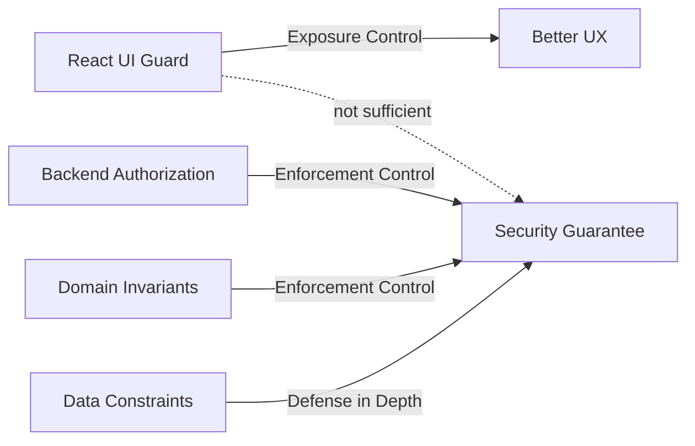
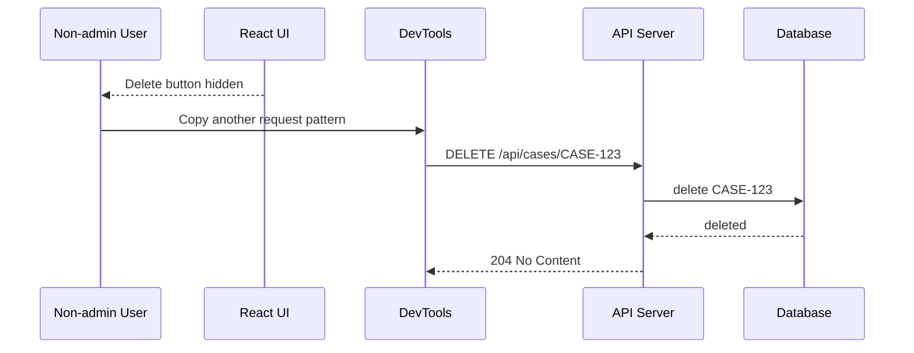
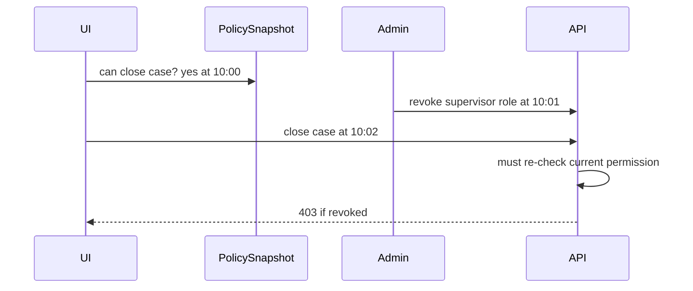

# Frontend Is Not the Enforcement Boundary

Ini salah satu prinsip paling mahal jika dipelajari terlambat:

> Frontend boleh menyembunyikan, menonaktifkan, mengarahkan, dan menjelaskan. Frontend tidak boleh menjadi satu-satunya pihak yang mencegah aksi terlarang.

Dalam React, kita mudah tertipu oleh ilusi kontrol. Kita membuat `ProtectedRoute`. Kita menyembunyikan tombol `Delete`. Kita menonaktifkan menu `Admin`. Kita mengecek `user.role === 'admin'`. UI terlihat aman. Tetapi user tidak berinteraksi dengan sistem hanya lewat tombol. User bisa memanggil endpoint langsung, mengubah JavaScript state, replay request, mengganti ID resource, atau mengirim request dari luar browser.

Frontend adalah exposure boundary. Backend adalah enforcement boundary.

Part ini membedah perbedaan itu sampai operasional: attack path, desain API, UI contract, failure mode, testing, dan review checklist.

---

## 1. Definisi: exposure control vs enforcement control

### Exposure control

Exposure control adalah semua mekanisme yang membuat UI hanya menampilkan hal yang relevan bagi user.

Contoh:

- menu admin tidak muncul untuk non-admin;
- tombol `Close Case` disabled jika user bukan supervisor;
- field `riskScore` readonly untuk reviewer;
- route `/settings/billing` redirect jika user tidak punya permission;
- command palette tidak menampilkan action yang tidak tersedia;
- table row hanya menampilkan action yang allowed untuk row tersebut.

Exposure control penting untuk UX, clarity, dan mengurangi accidental misuse. Tetapi exposure control bukan security guarantee.

### Enforcement control

Enforcement control adalah mekanisme yang benar-benar memblokir request/action yang tidak sah pada boundary yang tidak bisa dimodifikasi user.

Contoh:

- API memvalidasi session pada setiap request;
- API memeriksa `can(user, action, resource, context)` sebelum mutasi;
- domain service memastikan state transition valid;
- storage layer memakai tenant constraint;
- policy engine mengembalikan allow/deny;
- audit log mencatat denial dan sensitive action.

Enforcement control harus berada di server/resource boundary.



---

## 2. Kenapa frontend tidak bisa jadi enforcement boundary

Karena frontend berjalan di lingkungan yang dikontrol user.

User bisa:

1. Membuka DevTools dan mengubah state React.
2. Mengubah local storage/session storage.
3. Mengubah request lewat browser extension/proxy.
4. Memanggil API langsung dengan `curl`, Postman, script, atau console.
5. Menyalin request dari Network tab dan mengganti payload.
6. Mengubah resource ID di URL.
7. Menggunakan versi lama bundle JS yang masih punya route/action lama.
8. Memanfaatkan cache/stale permission.
9. Mengeksploitasi XSS untuk menjalankan action atas nama user.
10. Mengirim request dari halaman lain jika CSRF tidak ditangani pada cookie auth.

Jika sistem hanya aman selama user menekan tombol normal, sistem belum aman.

---

## 3. Attack path sederhana

Misal UI menyembunyikan tombol delete.

```tsx
function CaseActions({ caseId, user }: Props) {
  return (
    <>
      {user.role === 'admin' && (
        <button onClick={() => deleteCase(caseId)}>Delete Case</button>
      )}
    </>
  );
}
```

Endpoint backend:

```ts
app.delete('/api/cases/:caseId', async (req, res) => {
  await caseRepository.delete(req.params.caseId);
  res.status(204).end();
});
```

Serangan:



UI guard bekerja. Security tetap gagal.

Fix-nya bukan hanya memperbaiki React. Fix-nya adalah memindahkan enforcement ke API/domain.

```ts
app.delete('/api/cases/:caseId', async (req, res) => {
  const session = await requireSession(req);
  const caseRecord = await caseRepository.findById(req.params.caseId);

  if (!caseRecord) {
    return res.status(404).json({ code: 'CASE_NOT_FOUND' });
  }

  const decision = await authz.can(session.user, 'case.delete', {
    type: 'case',
    id: caseRecord.id,
    tenantId: caseRecord.tenantId,
    status: caseRecord.status,
  });

  if (!decision.allowed) {
    await audit.accessDenied({
      userId: session.user.id,
      action: 'case.delete',
      resource: `case:${caseRecord.id}`,
      reason: decision.reason,
    });

    return res.status(403).json({
      code: 'MISSING_PERMISSION',
      reason: decision.reason,
    });
  }

  await caseService.deleteCase(caseRecord.id, { actor: session.user });
  res.status(204).end();
});
```

React tetap boleh menyembunyikan tombol, tetapi API tidak mempercayai React.

---

## 4. The direct request test

Setiap authorization design harus lulus tes ini:

> Jika seluruh React app dihapus dan attacker hanya memanggil API langsung, apakah resource tetap aman?

Jika jawabannya “tidak”, maka security boundary salah tempat.

Gunakan direct request test pada semua aksi:

| Aksi | Test |
|---|---|
| Read object | Bisakah user membaca object tenant lain dengan mengganti ID? |
| Update object | Bisakah user mengubah field yang tidak ditampilkan di form? |
| Delete object | Bisakah user delete lewat request manual meskipun tombol hidden? |
| State transition | Bisakah user melompati workflow state? |
| Export file | Bisakah user download file dengan URL lama/signed URL bocor? |
| Admin action | Bisakah user akses endpoint admin tanpa route admin? |
| Bulk action | Bisakah payload berisi item yang user tidak boleh akses? |
| Impersonation | Bisakah user menyetel `impersonatedUserId` di payload? |
| Tenant switch | Bisakah user menyetel `tenantId` ke tenant lain? |

React guard tidak relevan dalam test ini. Itu sengaja.

---

## 5. Frontend checks tetap berguna

Jangan salah tafsir. “Frontend bukan enforcement boundary” bukan berarti frontend checks tidak penting.

Frontend checks berguna untuk:

- mengurangi noise di UI;
- mengarahkan user ke flow yang valid;
- mencegah accidental action;
- memberi reason sebelum user mencoba aksi;
- mengurangi request yang pasti gagal;
- membuat workflow lebih cepat;
- menjaga mental model user;
- menunjukkan access request path;
- mengurangi support ticket;
- membantu progressive disclosure.

Masalah muncul ketika frontend check dipakai sebagai satu-satunya check.

Pola yang sehat:

```tsx
function CloseCaseButton({ caseRef }: { caseRef: ResourceRef }) {
  const decision = useCan('case.close', caseRef);
  const closeCase = useCloseCaseMutation();

  if (!decision.allowed) {
    return (
      <AccessDeniedHint
        reason={decision.reason}
        action="case.close"
        resource={caseRef}
      />
    );
  }

  return (
    <button
      onClick={() => closeCase.mutate({ caseId: caseRef.id })}
      disabled={closeCase.isPending}
    >
      Close Case
    </button>
  );
}
```

Backend tetap:

```ts
await requirePermission(user, 'case.close', caseRef);
await caseWorkflow.close(caseRef.id, { actor: user });
```

Frontend check = helpful pre-check. Backend check = authoritative decision.

---

## 6. Authorization harus dekat dengan resource dan action

Role check di route terlalu kasar.

Contoh lemah:

```ts
if (user.role !== 'manager') {
  throw forbidden();
}
await updateCase(caseId, payload);
```

Pertanyaan yang belum dijawab:

- Manager tenant mana?
- Case milik tenant mana?
- Case status apa?
- Field apa yang diubah?
- Apakah user assigned ke case ini?
- Apakah action ini butuh step-up auth?
- Apakah workflow memperbolehkan transition ini?

Authorization yang matang berbentuk tuple:

```txt
can(subject, action, resource, context) -> decision
```

Contoh:

```ts
const decision = await authz.can(
  { type: 'user', id: session.user.id },
  'case.close',
  {
    type: 'case',
    id: caseRecord.id,
    tenantId: caseRecord.tenantId,
    status: caseRecord.status,
    assignedSupervisorId: caseRecord.assignedSupervisorId,
  },
  {
    sessionAssuranceLevel: session.assuranceLevel,
    requestIp: req.ip,
    time: clock.now(),
  },
);
```

Frontend bisa menerima hasilnya sebagai projection:

```json
{
  "action": "case.close",
  "allowed": false,
  "reason": "case_not_assigned_to_current_supervisor",
  "recoverable": true
}
```

Tetapi sumber keputusan tetap server.

---

## 7. Boundary matrix

Gunakan matrix ini untuk menempatkan logic.

| Logic | React UI | Router/Loader | API/BFF | Domain Service | Database |
|---|---:|---:|---:|---:|---:|
| Hide menu | Yes | Optional | No | No | No |
| Redirect unauthenticated user | Yes | Yes | Yes for API | No | No |
| Validate session | No final | Optional | Yes | Optional | No |
| Check object permission | Pre-check only | Optional pre-check | Yes | Yes | Optional constraint |
| Enforce tenant isolation | No | No final | Yes | Yes | Yes if possible |
| Validate state transition | No | No | Yes | Yes | Constraint if possible |
| Filter sensitive fields | No final | No final | Yes | Yes | Query-level support |
| Audit access denied | Telemetry only | Telemetry only | Yes | Yes | No |
| Revoke session | Trigger only | No | Yes | Yes | Session store |
| Step-up required | Display prompt | Redirect/prompt | Yes | Yes | No |

Rule:

- React can **predict**.
- Router can **pre-gate**.
- API/domain must **decide**.
- Database can **constrain**.

---

## 8. Common failure modes

### 8.1 Hidden button, open endpoint

UI hides action but endpoint accepts request. This is the classic frontend-only authorization bug.

Fix:

- enforce permission on endpoint;
- add automated negative tests;
- audit access denial;
- never trust hidden UI.

### 8.2 Disabled field, payload still accepted

Form disables `status`, but attacker sends it manually.

```tsx
<input name="status" disabled value={case.status} />
```

Payload attack:

```json
{
  "title": "Updated title",
  "status": "CLOSED"
}
```

Fix server-side allowlist:

```ts
const allowedPatch = pick(req.body, ['title', 'description']);
await caseService.updateEditableFields(caseId, allowedPatch, { actor: user });
```

Do not trust disabled fields. Disabled is UI behavior, not policy.

### 8.3 Route protected, API unprotected

Route `/admin/users` guarded, but API `/api/users` not guarded.

Fix:

- API authorization independent from route;
- admin endpoints require permission;
- route guard merely improves navigation UX.

### 8.4 Client-side tenant ID trusted

Frontend sends:

```json
{ "tenantId": "tenant_b", "name": "New Case" }
```

Server inserts into `tenant_b` because payload says so.

Fix:

- tenant context derived from validated session/path membership;
- payload tenant ignored or cross-checked;
- database constraints enforce tenant ownership.

### 8.5 Bulk action partial authorization

User selects 100 cases. UI only shows selectable rows, but attacker submits extra IDs.

Bad:

```ts
await caseService.bulkClose(req.body.caseIds);
```

Better:

```ts
const results = [];

for (const caseId of req.body.caseIds) {
  const caseRecord = await caseRepository.findById(caseId);
  const decision = await authz.can(user, 'case.close', caseRecord);

  if (!decision.allowed) {
    results.push({ caseId, status: 'denied', reason: decision.reason });
    continue;
  }

  await caseService.close(caseRecord.id, { actor: user });
  results.push({ caseId, status: 'closed' });
}

return res.json({ results });
```

Bulk action authorization harus per resource, bukan hanya satu check global.

### 8.6 Stale permission after role change

User membuka tab pagi hari. Admin mencabut role siang hari. UI masih memiliki permission snapshot lama.

Fix:

- server check every request;
- snapshot TTL/version;
- permission invalidation on 403;
- event/realtime invalidation jika perlu;
- forced session refresh/revocation untuk high-risk change.

---

## 9. HTTP semantics: 401, 403, 404

Auth UI harus membedakan status code. Jika semua error dijadikan “Something went wrong”, UX dan security observability buruk.

### 401 Unauthorized

Makna praktis: request tidak punya authentication yang valid.

React response:

- redirect login;
- refresh session jika mungkin;
- clear auth state jika refresh gagal;
- preserve safe return URL.

### 403 Forbidden

Makna praktis: user terautentikasi, tetapi tidak punya akses.

React response:

- tampilkan forbidden state;
- tampilkan reason jika aman;
- tawarkan request access jika recoverable;
- refresh permission snapshot;
- jangan auto-login loop.

### 404 Not Found

Kadang resource memang tidak ada. Kadang server sengaja menyamarkan forbidden sebagai not found untuk mencegah resource enumeration.

React response:

- tampilkan not found;
- jangan leak “resource exists but forbidden” jika server memilih concealment;
- log correlation ID untuk support.

### 419/440 Session Expired

Bukan standar HTTP universal, tetapi sering dipakai framework untuk session timeout/expired.

React response:

- prompt re-auth;
- preserve unsaved work jika aman;
- jangan retry mutation non-idempotent sembarangan.

---

## 10. Permission contract untuk UI tanpa memindahkan authority

Frontend membutuhkan informasi permission agar UX baik. Tetapi informasi itu harus didesain sebagai projection, bukan final authority.

### 10.1 Global permissions

```json
{
  "permissions": [
    "case.create",
    "case.search",
    "report.view"
  ]
}
```

Cocok untuk menu dan fitur umum. Tidak cukup untuk object-level access.

### 10.2 Resource-level allowed actions

```json
{
  "case": {
    "id": "CASE-123",
    "status": "UNDER_REVIEW"
  },
  "authorization": {
    "allowedActions": [
      "case.read",
      "case.comment",
      "case.assign"
    ],
    "deniedActions": {
      "case.close": {
        "reason": "requires_supervisor_assignment",
        "recoverable": true
      }
    },
    "policyVersion": "policy_2026_07_08_001"
  }
}
```

Ini membuat UI kaya tanpa menebak.

### 10.3 Server still validates

Saat user menekan `case.assign`, backend tetap melakukan:

```ts
await requirePermission(user, 'case.assign', caseRecord);
```

Projection hanya memperbaiki UX, bukan mengganti enforcement.

---

## 11. Route guards: useful, but limited

Route guard berguna untuk menghindari user masuk ke screen yang jelas tidak relevan.

Contoh:

```tsx
function RequireAuthenticated({ children }: { children: React.ReactNode }) {
  const auth = useAuth();

  if (auth.status === 'unknown') return <BootstrapScreen />;
  if (auth.status === 'anonymous') return <Navigate to="/login" replace />;
  if (auth.status === 'expired') return <SessionExpiredScreen />;

  return children;
}
```

Ini bagus. Tapi tidak cukup.

Kenapa?

- user bisa memanggil API langsung;
- route guard tidak melindungi data API;
- guard bisa dilewati oleh stale bundle/state;
- nested route bisa lupa guard;
- guard tidak menyelesaikan object-level authorization;
- guard bisa berjalan setelah sensitive component sudah mount jika desain salah.

Route guard terbaik adalah UX and orchestration tool. Enforcement tetap di server.

---

## 12. Server-side authorization pattern

### 12.1 Endpoint-level guard

```ts
app.get('/api/admin/users', requireSession, requirePermission('user.search'), handler);
```

Baik untuk permission global.

### 12.2 Resource-level guard

```ts
app.get('/api/cases/:caseId', requireSession, async (req, res) => {
  const caseRecord = await caseRepository.findById(req.params.caseId);

  if (!caseRecord) {
    return res.status(404).end();
  }

  await requireResourcePermission(req.user, 'case.read', caseRecord);

  res.json(toCaseDto(caseRecord));
});
```

Lebih penting untuk data sensitif.

### 12.3 Domain invariant

Authorization bukan hanya “boleh endpoint”. Domain state juga harus valid.

```ts
async function closeCase(caseRecord: CaseRecord, actor: User) {
  if (caseRecord.status !== 'UNDER_REVIEW') {
    throw new DomainError('CASE_NOT_CLOSABLE_FROM_CURRENT_STATE');
  }

  if (caseRecord.assignedSupervisorId !== actor.id) {
    throw new ForbiddenError('ONLY_ASSIGNED_SUPERVISOR_CAN_CLOSE');
  }

  return caseRepository.updateStatus(caseRecord.id, 'CLOSED');
}
```

Policy dan domain invariant saling melengkapi. Policy menjawab “actor boleh?”. Domain menjawab “state transition valid?”.

### 12.4 Data-layer constraint

Untuk tenant isolation, database constraint/query scoping bisa menjadi defense-in-depth.

```sql
SELECT *
FROM cases
WHERE id = :case_id
  AND tenant_id = :tenant_id_from_session;
```

Jangan query berdasarkan `case_id` saja lalu berharap frontend tidak pernah mengirim ID tenant lain.

---

## 13. UI patterns yang aman

### 13.1 Hide vs disable vs explain

Tidak semua denial harus disembunyikan.

| UI Strategy | Cocok untuk | Risiko |
|---|---|---|
| Hide | fitur tidak relevan sama sekali | user bingung jika seharusnya tahu fitur ada |
| Disable | aksi terlihat tapi belum eligible | perlu reason jelas |
| Explain | user perlu tahu jalan pemulihan | jangan leak info sensitif |
| Request access | permission recoverable | workflow harus diaudit |
| Show forbidden page | route/resource denied | jangan reveal resource jika concealment diperlukan |

### 13.2 `Can` component

```tsx
<Can
  action="case.close"
  resource={{ type: 'case', id: case.id }}
  fallback={<DisabledAction reason="Only assigned supervisors can close this case." />}
>
  <CloseCaseButton caseId={case.id} />
</Can>
```

`Can` bukan security boundary. Namanya boleh `Can`, tetapi mental modelnya adalah `CanRenderHelpfulUI`.

### 13.3 Permission-aware button

```tsx
type AuthorizedButtonProps = {
  action: string;
  resource?: ResourceRef;
  onAuthorizedClick: () => void;
  children: React.ReactNode;
};

function AuthorizedButton(props: AuthorizedButtonProps) {
  const decision = useCan(props.action, props.resource);

  if (!decision.allowed) {
    return (
      <button disabled title={decision.reason ?? 'Not allowed'}>
        {props.children}
      </button>
    );
  }

  return <button onClick={props.onAuthorizedClick}>{props.children}</button>;
}
```

Komponen ini memperbaiki UI consistency. Endpoint tetap harus enforce.

---

## 14. Handling server denial gracefully

Karena client permission bisa stale, server denial adalah normal case, bukan unexpected exception.

```ts
try {
  await closeCase(caseId);
  toast.success('Case closed');
} catch (error) {
  if (isForbidden(error)) {
    permissionClient.invalidate('server-denied');
    toast.error(error.reason ?? 'You no longer have permission to close this case.');
    return;
  }

  throw error;
}
```

Jangan membuat UI dengan asumsi: “Kalau tombol muncul, server pasti allow.”

Yang benar: “Tombol muncul karena snapshot terakhir allow. Server tetap bisa deny karena policy lebih baru atau context berubah.”

---

## 15. TOCTOU: time-of-check to time-of-use

TOCTOU terjadi ketika check dan use dipisahkan oleh waktu/context.

Flow:

1. UI check permission jam 10:00.
2. User membuka form.
3. Admin mencabut role jam 10:01.
4. User submit jam 10:02.
5. Jika server tidak check ulang, aksi ilegal lolos.



Mitigasi:

- check di server saat use;
- permission snapshot punya version/TTL;
- invalidate permission saat 403;
- optimistic UI harus siap rollback;
- action penting pakai step-up/re-auth jika perlu.

---

## 16. Testing strategy

### 16.1 Unit test permission projection

```ts
it('does not render close button for reviewer', () => {
  render(<CaseActions case={caseUnderReview} />, {
    permissions: deny('case.close'),
  });

  expect(screen.queryByRole('button', { name: /close/i })).not.toBeInTheDocument();
});
```

Ini test UX, bukan security.

### 16.2 API negative test

```ts
it('rejects close case when user is not assigned supervisor', async () => {
  const user = await seedUser({ role: 'reviewer' });
  const caseRecord = await seedCase({ status: 'UNDER_REVIEW' });

  const response = await request(app)
    .post(`/api/cases/${caseRecord.id}/close`)
    .set(authHeader(user));

  expect(response.status).toBe(403);
});
```

Ini security-relevant.

### 16.3 Direct request e2e

E2E bukan hanya klik UI. Tambahkan test yang memanggil network layer langsung.

```ts
test('non-admin cannot call admin endpoint directly', async ({ request }) => {
  const nonAdmin = await loginAs('reviewer');

  const response = await request.delete('/api/admin/users/usr_123', {
    headers: nonAdmin.headers,
  });

  expect(response.status()).toBe(403);
});
```

### 16.4 Payload tampering test

```ts
it('ignores forbidden fields in update payload', async () => {
  const user = await seedUser({ permissions: ['case.update_title'] });
  const caseRecord = await seedCase({ status: 'OPEN' });

  const response = await request(app)
    .patch(`/api/cases/${caseRecord.id}`)
    .set(authHeader(user))
    .send({ title: 'New title', status: 'CLOSED' });

  expect(response.status).toBe(200);

  const updated = await caseRepository.findById(caseRecord.id);
  expect(updated.title).toBe('New title');
  expect(updated.status).toBe('OPEN');
});
```

---

## 17. Code review checklist

Gunakan checklist ini untuk PR auth/permission.

### Frontend

- Apakah permission check di UI hanya diperlakukan sebagai exposure control?
- Apakah UI siap menerima 403 meskipun pre-check allowed?
- Apakah 401 dan 403 dibedakan?
- Apakah sensitive data tidak dirender sebelum auth/data boundary?
- Apakah route guard tidak diklaim sebagai security boundary?
- Apakah permission tidak diambil dari hardcoded role tersebar?
- Apakah tenant/user/session change membersihkan cache?

### Backend

- Apakah setiap endpoint punya session validation?
- Apakah setiap sensitive action punya authorization check?
- Apakah object-level authorization dilakukan dengan resource actual dari database?
- Apakah tenant isolation berasal dari session/server context?
- Apakah payload tampering dicegah dengan allowlist?
- Apakah bulk action mengecek tiap resource?
- Apakah denial diaudit?
- Apakah mutation punya domain invariant?

### Contract

- Apakah permission projection punya TTL/version?
- Apakah denial response punya code/reason yang aman?
- Apakah UI punya path untuk request access jika denial recoverable?
- Apakah 404 concealment policy jelas?
- Apakah correlation ID tersedia untuk debugging?

---

## 18. Practical rule: duplicate checks intentionally

Banyak engineer takut “duplicated logic”. Dalam authorization, beberapa duplikasi itu sengaja.

Frontend check:

```txt
Should the user see/attempt this action?
```

Backend check:

```txt
Is this action allowed now, for this subject, on this resource, in this context?
```

Domain invariant:

```txt
Is this state transition valid regardless of caller?
```

Database constraint:

```txt
Can invalid data be persisted even if application code has a bug?
```

Ini bukan duplikasi buruk. Ini defense-in-depth dengan tanggung jawab berbeda.

Yang harus dihindari adalah **semantic drift**: frontend, API, dan domain memiliki definisi permission berbeda tanpa contract.

Solusinya:

- permission names shared as typed contract;
- backend owns policy;
- frontend consumes projection;
- tests cover denial matrix;
- ADR menjelaskan source of truth.

---

## 19. What good looks like

Sistem yang sehat memiliki pola berikut:

1. UI menampilkan action berdasarkan `allowedActions` dari server/policy projection.
2. User melakukan action.
3. API mengambil session dari token/cookie yang valid.
4. API mengambil resource actual dari database.
5. API/policy memutuskan allow/deny berdasarkan user, action, resource, context.
6. Domain service memvalidasi state transition.
7. Database query/constraint menjaga tenant/resource boundary.
8. Audit mencatat sensitive decision/action.
9. UI menerima success/403/401/404 dan bereaksi eksplisit.
10. Cache permission/data diinvalidasi saat session/tenant/policy berubah.

Tidak ada bagian dari flow ini yang membutuhkan kepercayaan final pada React state.

---

## 20. What to remember

Kalimat yang harus diingat:

> Jika hanya React yang mencegah aksi, aksi itu belum benar-benar dicegah.

Frontend checks tetap diperlukan. Tapi perannya adalah UX, exposure control, dan pre-flight guidance. Enforcement harus berada di server/resource boundary, diulang per request, dekat dengan action dan resource, dan tercatat secara audit-friendly.

Untuk software sederhana, prinsip ini terasa “berlebihan”. Untuk sistem enterprise, multi-tenant, financial, healthcare, legal, regulatory, enforcement lifecycle, atau case management, prinsip ini adalah baseline.

Part berikutnya akan masuk ke threat model browser: origin, cookies, storage, XSS, CSRF, token leakage, browser extension, dan mengapa pilihan “token di localStorage vs cookie httpOnly” tidak bisa dijawab tanpa threat model.

---

## References

- OWASP Authorization Cheat Sheet — validate permissions on every request and design deny-by-default authorization: https://cheatsheetseries.owasp.org/cheatsheets/Authorization_Cheat_Sheet.html
- OWASP Session Management Cheat Sheet — session token binds authenticated session to HTTP traffic and access controls: https://cheatsheetseries.owasp.org/cheatsheets/Session_Management_Cheat_Sheet.html
- OWASP Cross-Site Request Forgery Prevention Cheat Sheet: https://cheatsheetseries.owasp.org/cheatsheets/Cross-Site_Request_Forgery_Prevention_Cheat_Sheet.html
- OWASP Cross Site Scripting Prevention Cheat Sheet: https://cheatsheetseries.owasp.org/cheatsheets/Cross_Site_Scripting_Prevention_Cheat_Sheet.html
- RFC 9700 — Best Current Practice for OAuth 2.0 Security: https://www.rfc-editor.org/rfc/rfc9700.html
