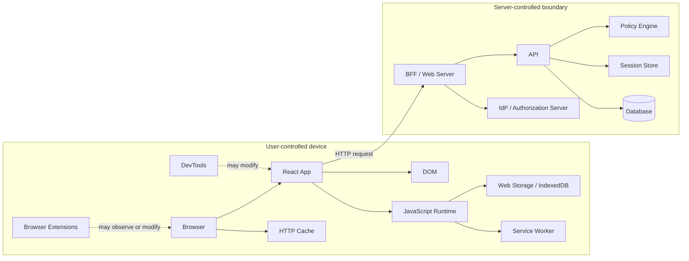
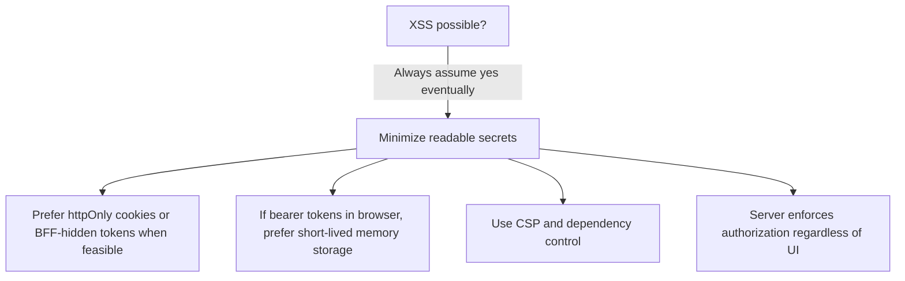
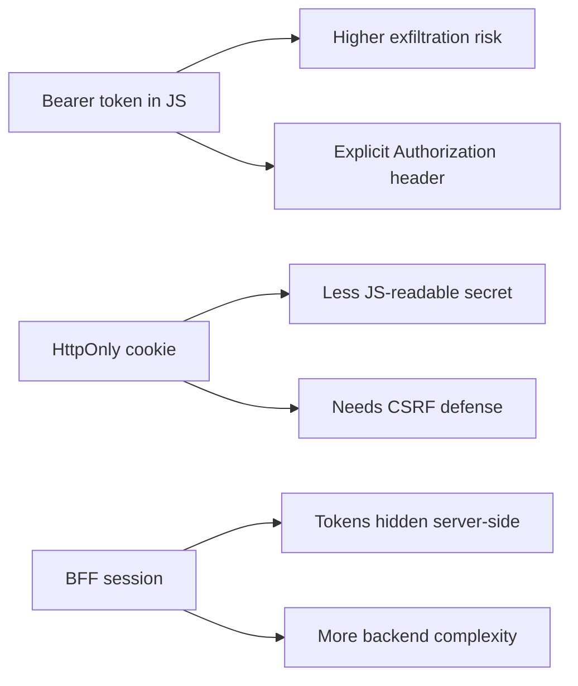
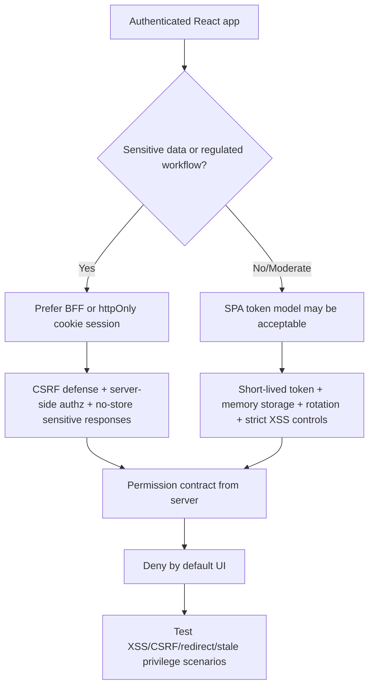

# Browser Threat Model for React Auth

React auth yang kuat dimulai dari pertanyaan yang tidak nyaman:

> Apa yang masih aman ketika JavaScript, DOM, URL, cache, tab lain, browser extension, network retry, dan user sendiri tidak bisa diperlakukan sebagai trusted boundary?

Banyak implementasi auth frontend gagal bukan karena engineer tidak tahu React. Mereka gagal karena salah menempatkan trust. Mereka menganggap browser sebagai ruang privat aplikasi. Padahal browser adalah shared runtime: satu origin punya storage, tab bisa banyak, extension bisa mengamati, script pihak ketiga bisa masuk, URL bisa disalin, cache bisa bertahan, dan user bisa memodifikasi state client.

Part ini bukan katalog serangan secara akademik. Ini adalah model kerja untuk mengambil keputusan desain React auth: cookie atau token, localStorage atau memory, guarded route atau loader, redirect URL boleh disimpan di mana, kapan permission boleh di-cache, bagaimana logout harus menyebar, dan kenapa frontend tidak boleh menjadi enforcement boundary.

---

## 1. Prinsip utama

Browser bukan musuh. Browser adalah runtime yang harus diasumsikan punya banyak jalur observasi dan manipulasi.

Mental model yang sehat:

```txt
Browser is user-controlled.
JavaScript is mutable.
DOM is observable.
Storage is reachable by code in the origin.
Network requests can be replayed.
URLs leak easily.
Cookies are automatically attached.
Frontend state is not evidence.
```

Dari sini kita dapat aturan desain:

1. **Jangan taruh security guarantee di UI state.**
2. **Jangan menyimpan secret di storage yang bisa dibaca JavaScript jika bisa dihindari.**
3. **Jangan menganggap route guard sama dengan authorization.**
4. **Jangan menganggap JWT claim yang didecode client sebagai keputusan akses.**
5. **Jangan membuat redirect flow yang percaya penuh pada URL dari user.**
6. **Jangan membuat permission cache tanpa invalidation strategy.**
7. **Jangan membuat logout hanya sebagai `setUser(null)`.**

Threat model browser bukan paranoia. Ini engineering hygiene.

---

## 2. Boundary map: apa yang trusted dan tidak

React app berjalan di sisi yang dikontrol user. Backend, authorization server, policy engine, dan data store berada di boundary yang lebih bisa dipercaya karena user tidak bisa memodifikasi kode runtime-nya secara langsung.



Hal pentingnya:

| Area | Bisa dipercaya sebagai security boundary? | Catatan |
|---|---:|---|
| React state | Tidak | User/extension/script bisa memodifikasi runtime client. |
| DOM | Tidak | DOM bisa dibaca dan dimanipulasi oleh script dalam origin. |
| localStorage/sessionStorage | Tidak untuk secret | Bisa dibaca JavaScript dalam origin. XSS berarti storage readable. |
| Memory JS | Lemah, tapi lebih baik dari persistent readable storage | Tetap bisa diakses oleh XSS, tapi tidak persistent by default. |
| httpOnly cookie | Lebih kuat untuk confidentiality dari JavaScript | Tidak bisa dibaca JS, tetapi otomatis terkirim, jadi perlu CSRF defense. |
| Backend API | Ya, jika request-level auth benar | Harus memvalidasi session dan authorization setiap request. |
| Policy engine | Ya, jika tidak menerima context palsu dari client | Context sensitif harus dihitung server-side. |
| Database constraint | Defense-in-depth | Tenant constraint, row-level policy, uniqueness, state transition. |

Browser threat model bukan hanya tentang token theft. Ia tentang seluruh aliran bukti: siapa user, session mana, tenant mana, action apa, resource apa, context apa, dan apakah keputusan akses berasal dari pihak yang benar.

---

## 3. Asset yang harus dilindungi

Sebelum bicara ancaman, identifikasi asset. Dalam React auth, asset bukan hanya password atau token.

| Asset | Kenapa sensitif | Risiko utama |
|---|---|---|
| Session cookie | Mengikat browser dengan session server | CSRF, session riding, cookie scope salah, fixation. |
| Access token | Bearer credential untuk API | Exfiltration, replay, logging, leak via storage. |
| Refresh token | Credential jangka lebih panjang untuk session continuity | Exfiltration, reuse, race, infinite session. |
| ID token | Bukti identity dari OIDC flow | Misuse sebagai access token, claim overtrust. |
| CSRF token | Bukti request berasal dari UI sah | Leak via XSS/log/referrer jika salah desain. |
| Authorization claim | Role/scope/permission snapshot | Stale privilege, overclaim, client-side overtrust. |
| Tenant/org selection | Menentukan data boundary | Cross-tenant leakage, confused deputy. |
| Return URL | Menentukan redirect setelah login | Open redirect, phishing, token/code leakage. |
| User profile/PII | Data pribadi | DOM/log/analytics/cache leakage. |
| Audit context | Bukti tindakan/security event | Forged actor, missing denial, weak investigation trail. |

Design rule:

> Jangan hanya bertanya “di mana token disimpan?”. Bertanya juga “asset apa yang bisa diubah, dibaca, direplay, atau dibuat stale oleh client?”.

---

## 4. Threat: XSS adalah code execution di origin

Cross-site scripting sering direduksi menjadi “script alert”. Untuk auth, XSS berarti attacker menjalankan kode dalam origin aplikasi. Jika attacker bisa menjalankan JavaScript di origin yang sama, maka mereka bisa melakukan banyak hal yang user bisa lakukan dari UI.

Dampak XSS terhadap React auth:

1. Membaca token dari `localStorage`, `sessionStorage`, IndexedDB, atau variabel global.
2. Mengirim request atas nama user menggunakan credential yang tersedia di browser.
3. Membaca data sensitif dari DOM, React-rendered HTML, atau API response yang sudah ada di memory.
4. Mengubah UI agar user melakukan aksi tertentu.
5. Membajak callback auth, state transisi, atau redirect.
6. Mencuri CSRF token jika token bisa dibaca JavaScript.
7. Mengubah permission state client agar user melihat/memicu flow tertentu.
8. Mengirim data ke endpoint attacker.

Perhatikan perbedaannya:

| Storage/transport | Jika XSS terjadi | Risiko |
|---|---|---|
| Token di localStorage | Bisa dibaca dan dikirim keluar | Credential exfiltration. |
| Token di sessionStorage | Bisa dibaca oleh script pada tab tersebut | Masih exfiltratable. |
| Token di memory | Bisa dipakai/dicari selama runtime | Lebih rendah persistensi, bukan imun. |
| httpOnly cookie | Tidak bisa dibaca JS | Tetapi request bisa tetap dikirim oleh script. |
| CSRF token di DOM | Bisa dibaca JS | XSS dapat mengalahkan CSRF defense. |

Karena itu, httpOnly cookie mengurangi risiko **token theft by JavaScript**, tetapi tidak menghentikan **session riding by injected JavaScript**. Dengan XSS, attacker mungkin tidak perlu mencuri token; mereka cukup memanggil API dari origin korban.

### React-specific XSS surface

React melakukan escaping terhadap text interpolation secara default, tetapi aplikasi React tetap bisa membuka XSS melalui jalur lain:

- `dangerouslySetInnerHTML`;
- rendering markdown/HTML tanpa sanitizer kuat;
- URL injection pada `href`, redirect, iframe, embed;
- third-party script dan tag manager;
- compromised dependency;
- DOM API manual di luar React;
- template string yang membangun HTML;
- rich text editor;
- microfrontend dari tim/vendor berbeda;
- browser extension atau injected script environment.

Contoh anti-pattern:

```tsx
function Announcement({ html }: { html: string }) {
  return <div dangerouslySetInnerHTML={{ __html: html }} />;
}
```

Masalahnya bukan sekadar `dangerouslySetInnerHTML`. Masalahnya adalah `html` tidak punya trust contract. Apakah dari admin? CMS? vendor? user-generated content? Apakah sudah disanitasi server-side? Apakah sanitizer mengizinkan URL berbahaya? Apakah CSP menahan kerusakan jika sanitizer gagal?

Versi yang lebih sehat:

```tsx
import DOMPurify from 'dompurify';

function Announcement({ html }: { html: string }) {
  const safeHtml = DOMPurify.sanitize(html, {
    USE_PROFILES: { html: true },
  });

  return <div dangerouslySetInnerHTML={{ __html: safeHtml }} />;
}
```

Tetapi sanitizer tetap bukan lisensi untuk sembarang HTML. Untuk area authenticated app, pertimbangkan:

- batasi format ke markdown subset;
- render ke komponen, bukan raw HTML;
- gunakan allowlist tag/attribute;
- jangan izinkan inline event handler;
- jangan izinkan arbitrary script/embed;
- terapkan CSP;
- jangan simpan secret readable di origin.

### Decision consequence

XSS mengubah keputusan token storage:



Jika aplikasi Anda sangat sensitif, jangan mendesain seolah XSS tidak akan pernah terjadi. Desainlah agar blast radius XSS lebih kecil.

---

## 5. Threat: CSRF adalah browser mengirim credential otomatis

CSRF terjadi ketika attacker membuat browser user mengirim request ke aplikasi Anda dengan credential user yang otomatis attached, terutama cookie.

Masalahnya: browser memang didesain untuk mengirim cookie sesuai domain/path/SameSite rules. Jika session Anda berbasis cookie, request dari luar situs bisa membawa cookie tergantung konfigurasi dan konteks request.

CSRF berbeda dari XSS:

| Aspek | XSS | CSRF |
|---|---|---|
| Attacker menjalankan JS di origin aplikasi? | Ya | Tidak perlu |
| Bisa membaca response aplikasi? | Biasanya bisa jika same-origin | Umumnya tidak karena SOP/CORS |
| Credential dicuri? | Bisa | Tidak harus |
| Request memakai credential korban? | Ya | Ya, lewat browser auto-attach cookie |
| Defense utama | Output encoding, sanitization, CSP, dependency control | SameSite, CSRF token, Origin/Referer check, custom headers, re-auth untuk aksi sensitif |

Untuk React app dengan cookie session, pertahanan umum:

1. `SameSite=Lax` atau `Strict` jika kompatibel dengan flow.
2. CSRF token untuk mutating request.
3. Verifikasi `Origin`/`Referer` untuk request sensitif.
4. Custom request header untuk API call yang tidak bisa dikirim simple form biasa.
5. Re-auth/user interaction untuk high-risk action.
6. Tidak memakai `GET` untuk mutasi.
7. Tidak membuka CORS dengan credential secara longgar.

Contoh request mutasi yang lebih sehat:

```ts
await fetch('/api/cases/CASE-123/close', {
  method: 'POST',
  credentials: 'include',
  headers: {
    'Content-Type': 'application/json',
    'X-CSRF-Token': csrfToken,
  },
  body: JSON.stringify({ reason }),
});
```

Server tetap harus memvalidasi:

```txt
request has authenticated session
AND method is safe/mutating as expected
AND CSRF token is valid for this session
AND Origin/Referer is trusted when available
AND user is authorized for close_case on CASE-123
AND domain state transition is valid
```

Hal yang sering salah:

```txt
Cookie auth + SameSite=None + Access-Control-Allow-Origin:* + credentials include + no CSRF token
```

Itu bukan “modern auth”. Itu mengundang request forgery dan cross-origin confusion.

---

## 6. Threat: token leakage lewat URL

URL adalah tempat buruk untuk secret.

URL bisa muncul di:

- browser history;
- server access logs;
- analytics;
- screenshot;
- referrer header;
- crash report;
- shared link;
- proxy log;
- browser extension;
- monitoring tool.

Karena itu flow modern tidak boleh mengirim access token lewat fragment/URL query untuk aplikasi browser. Authorization Code with PKCE menggantikan model lama yang menaruh token langsung di browser redirect.

Return URL juga termasuk asset. Contoh bug:

```txt
/login?returnTo=https://evil.example/phishing
```

Setelah login, aplikasi redirect user ke domain attacker. Jika flow juga membawa code/token/state yang salah diperlakukan, risikonya makin besar.

Desain lebih aman:

```ts
const allowedReturnTo = normalizeInternalReturnTo(searchParams.get('returnTo'));

function normalizeInternalReturnTo(value: string | null): string {
  if (!value) return '/';

  try {
    const url = new URL(value, window.location.origin);

    if (url.origin !== window.location.origin) {
      return '/';
    }

    if (!url.pathname.startsWith('/app')) {
      return '/app';
    }

    return `${url.pathname}${url.search}${url.hash}`;
  } catch {
    return '/';
  }
}
```

Rule:

> Return URL harus internal, dinormalisasi, dibatasi, dan tidak boleh mengandung credential.

---

## 7. Threat: localStorage dan persistent readable storage

`localStorage` nyaman karena persistent dan mudah. Justru itu masalahnya.

Karakteristik `localStorage`:

- readable oleh JavaScript dalam origin;
- persistent setelah tab/browser ditutup;
- shared across tabs pada origin yang sama;
- sering ikut terbaca oleh debugging snippet, injected script, dan vulnerable dependency;
- tidak punya flag seperti `HttpOnly`;
- mudah dipakai berlebihan sebagai “mini database” auth.

Anti-pattern klasik:

```ts
localStorage.setItem('access_token', token);
localStorage.setItem('refresh_token', refreshToken);
localStorage.setItem('permissions', JSON.stringify(permissions));
```

Masalahnya berbeda-beda:

| Data | Masalah |
|---|---|
| Access token | Bisa diekstrak oleh XSS dan direplay. |
| Refresh token | Blast radius lebih besar karena bisa mint access token baru. |
| Permissions | Stale, bisa dimodifikasi, sering disalahgunakan sebagai authority. |
| User profile | PII leak dan stale identity. |

Alternatif bergantung arsitektur:

| Kebutuhan | Opsi lebih sehat |
|---|---|
| SPA murni dengan OAuth | Access token short-lived di memory, refresh rotation jika didukung dan threat model diterima. |
| App sensitif | BFF menyimpan token server-side, browser hanya punya httpOnly session cookie. |
| SSR/RSC app | Session dibaca server-side dari cookie; data sensitif tidak dikirim ke client kecuali perlu. |
| Permission UI | Ambil `/me/permissions` atau allowed actions dari API; cache singkat dan invalidatable. |

Rule praktis:

> Jika value memberi kemampuan akses, jangan jadikan localStorage sebagai rumah permanen value itu.

---

## 8. Threat: cookie scope dan automatic credential

Cookie lebih kuat untuk menyembunyikan session identifier dari JavaScript jika memakai `HttpOnly`, tetapi cookie punya risiko sendiri.

Cookie dikirim otomatis oleh browser sesuai aturan domain/path/security. Salah konfigurasi bisa memperluas blast radius.

Checklist cookie auth:

```txt
Set-Cookie: __Host-session=<opaque>; Path=/; Secure; HttpOnly; SameSite=Lax
```

Preferensi umum:

| Attribute | Tujuan |
|---|---|
| `Secure` | Cookie hanya dikirim lewat HTTPS. |
| `HttpOnly` | JavaScript tidak bisa membaca cookie. |
| `SameSite` | Mengurangi cross-site sending. |
| `Path` | Membatasi path pengiriman cookie. |
| No broad `Domain` jika tidak perlu | Mengurangi subdomain exposure. |
| `__Host-` prefix | Membantu memastikan cookie host-only, Secure, Path=/. |

Risiko cookie:

1. CSRF jika mutating endpoint tidak dilindungi.
2. Session fixation jika session tidak diregenerasi setelah login.
3. Cookie shadowing/subdomain issue jika domain terlalu luas.
4. Logout tidak merevoke session server-side.
5. Cookie lifetime terlalu panjang tanpa rotation.
6. Cookie dikirim ke endpoint yang tidak butuh credential karena path terlalu luas.

Cookie vs token bukan debat ideologis. Ini trade-off:



Decision yang dewasa selalu menyebut threat yang ditukar, bukan hanya “lebih secure”.

---

## 9. Threat: browser cache dan back button leakage

Authenticated UI sering mengandung data sensitif. Setelah logout, user bisa menekan back button dan melihat halaman lama dari memory/cache. Ini bukan selalu data breach server-side, tetapi tetap bisa menjadi leakage di device shared.

Surface:

- HTTP cache;
- bfcache/back-forward cache;
- service worker cache;
- React query cache;
- browser memory;
- persisted Redux/Zustand store;
- screenshots atau OS app switcher;
- downloaded files;
- generated object URLs.

Untuk halaman sangat sensitif:

```http
Cache-Control: no-store
Pragma: no-cache
```

Di client:

```ts
queryClient.clear();
authStore.reset();
sessionStorage.clear();
revokeObjectUrls();
navigate('/login', { replace: true });
```

Tetapi ini bukan pengganti server revocation. Logout perlu dua sisi:

1. **Client cleanup**: hapus local state, cache, subscriptions, tabs.
2. **Server invalidation**: session/token tidak lagi diterima.

Jika logout hanya client cleanup, attacker yang punya token/cookie lama masih bisa memanggil API sampai expiry.

---

## 10. Threat: service worker sebagai hidden auth participant

Service worker dapat mengintercept request, mengelola cache, dan tetap hidup di luar lifecycle React component. Ini membuatnya powerful sekaligus risk surface.

Pertanyaan desain:

- Apakah service worker meng-cache response authenticated?
- Apakah ia menambahkan Authorization header?
- Apakah logout membersihkan cache service worker?
- Apakah service worker masih melayani data lama setelah session expired?
- Bagaimana update service worker saat ada perubahan auth protocol?

Anti-pattern:

```ts
// Service worker caches everything, including authenticated API responses.
self.addEventListener('fetch', (event) => {
  event.respondWith(caches.open('app').then(cache => cache.match(event.request) || fetch(event.request)));
});
```

Versi lebih hati-hati:

```ts
const isAuthenticatedApi = (request: Request) => {
  const url = new URL(request.url);
  return url.origin === self.location.origin && url.pathname.startsWith('/api/');
};

self.addEventListener('fetch', (event) => {
  if (isAuthenticatedApi(event.request)) {
    event.respondWith(fetch(event.request));
    return;
  }

  // Cache static assets only.
});
```

Rule:

> Cache static assets aggressively. Treat authenticated data as no-store unless you have a specific, reviewed offline model.

---

## 11. Threat: tab, concurrency, and session race

React auth sering diuji di satu tab. Production user membuka banyak tab.

Race yang umum:

1. Tab A refresh token.
2. Tab B juga refresh token dengan refresh token lama.
3. Provider memakai rotation dan mendeteksi reuse.
4. Semua session dianggap compromised.
5. User logout mendadak di semua tab.

Atau:

1. Tab A logout.
2. Tab B masih punya memory state authenticated.
3. Tab B melakukan mutation.
4. API menolak 401/403.
5. UI bingung karena state client belum sinkron.

Desain perlu cross-tab coordination:

```ts
const channel = new BroadcastChannel('auth');

export function broadcastLogout(reason: string) {
  channel.postMessage({ type: 'logout', reason, at: Date.now() });
}

channel.onmessage = (event) => {
  if (event.data?.type === 'logout') {
    authStore.reset();
    queryClient.clear();
    navigateToLogin({ reason: event.data.reason });
  }
};
```

Untuk refresh, pakai lock agar hanya satu tab refresh pada waktu yang sama. Detail implementasi akan dibahas di Part 014 dan Part 018.

---

## 12. Threat: CORS confusion

CORS bukan authorization. CORS adalah browser-enforced sharing policy. Server API tidak boleh berkata, “aman karena CORS membatasi siapa yang bisa akses”. Non-browser client tidak tunduk pada CORS. Backend tetap harus memvalidasi authentication dan authorization.

Konfigurasi yang berisiko:

```http
Access-Control-Allow-Origin: *
Access-Control-Allow-Credentials: true
```

Untuk credentialed request, origin harus spesifik dan deliberate.

React mental model:

| Salah paham | Koreksi |
|---|---|
| CORS melindungi API dari semua client | CORS hanya mekanisme browser. API tetap harus auth. |
| Kalau origin tidak di-allow, attacker tidak bisa memanggil API | Attacker bisa pakai server-side script/curl; yang dibatasi adalah browser read/send credential behavior. |
| CORS error berarti security bekerja | Bisa juga konfigurasi rusak. Jangan jadikan CORS sebagai access control. |
| Preflight sama dengan authorization | Preflight bukan domain policy decision. |

---

## 13. Threat: browser extension dan compromised client environment

Browser extension tertentu bisa membaca/menulis halaman, memodifikasi DOM, mengamati input, atau menginjeksi script tergantung permission. Aplikasi web tidak bisa sepenuhnya melindungi diri dari environment yang sudah compromised.

Yang bisa dilakukan:

- minimalkan secret readable di JS;
- gunakan re-auth/step-up untuk aksi sensitif;
- tampilkan session/device activity;
- audit high-risk action;
- deteksi anomali di backend;
- jangan mengirim data sensitif ke client sebelum perlu;
- jangan menganggap “hidden input” atau “disabled button” sebagai protection.

Untuk aplikasi regulated/high-risk, perlakukan client compromise sebagai skenario incident, bukan sekadar bug UI.

---

## 14. Threat: confused deputy di multi-tenant app

Multi-tenant React app punya satu threat besar: user authenticated dengan benar tetapi request dieksekusi dalam tenant/resource context yang salah.

Contoh:

```http
POST /api/tenant/acme/cases/CASE-123/close
Authorization: Bearer <valid-token-for-user>
```

Pertanyaan server:

```txt
Is the user authenticated?
Is the user member of tenant acme?
Is CASE-123 owned by tenant acme?
Can user close cases in tenant acme?
Can CASE-123 be closed in its current state?
```

Jangan percaya tenant dari UI begitu saja:

```ts
// Weak if backend trusts this blindly.
headers: {
  'X-Tenant-Id': selectedTenantId,
}
```

Header boleh menjadi selector, bukan proof. Backend harus memverifikasi membership dan resource ownership.

Di frontend, tenant switch harus membersihkan cache:

```ts
async function switchTenant(nextTenantId: string) {
  authStore.setTenantSwitching(true);
  queryClient.clear();
  await sessionApi.switchTenant(nextTenantId);
  await authStore.reloadSession();
  authStore.setTenantSwitching(false);
}
```

Jika tidak, data tenant A bisa tampil saat tenant B sudah aktif.

---

## 15. Threat matrix untuk desain React auth

Gunakan matrix ini saat memilih arsitektur.

| Threat | Token-in-localStorage SPA | Memory-token SPA | httpOnly cookie SPA | BFF |
|---|---:|---:|---:|---:|
| XSS token exfiltration | Tinggi | Sedang | Rendah untuk token/session read | Rendah untuk token read |
| XSS session riding | Tinggi | Tinggi | Tinggi | Tinggi |
| CSRF | Rendah jika no cookie credential | Rendah jika no cookie credential | Perlu defense kuat | Perlu defense kuat |
| Refresh race | Tinggi jika refresh token di browser | Sedang/tinggi | Tergantung model | Lebih terkendali server-side |
| Operational complexity | Rendah | Sedang | Sedang | Lebih tinggi |
| SSR compatibility | Lemah | Lemah/sedang | Baik | Baik |
| Token visibility to JS | Tinggi | Sedang | Rendah | Rendah |
| Mobile/native reuse | Mudah | Mudah | Lebih web-specific | Perlu API strategy |

Tidak ada kolom “sempurna”. Pilihan benar adalah pilihan yang threat-nya Anda pahami, mitigasinya Anda implementasikan, dan failure mode-nya Anda test.

---

## 16. Design checklist: browser threat model review

Sebelum approve React auth design, tanyakan:

### Secret and credential

- Credential apa yang ada di browser?
- Apakah credential bisa dibaca JavaScript?
- Apakah credential persistent setelah browser restart?
- Apakah refresh token pernah masuk ke browser?
- Apakah token masuk URL, log, analytics, atau error report?

### Session lifecycle

- Bagaimana session di-bootstrap?
- Bagaimana expiry dideteksi?
- Bagaimana refresh dilakukan?
- Bagaimana refresh race antar tab dicegah?
- Bagaimana logout menyebar ke tab lain?
- Apakah logout merevoke server-side session?

### Request protection

- Apakah semua API memvalidasi auth pada setiap request?
- Apakah mutating endpoint dilindungi dari CSRF jika memakai cookie?
- Apakah CORS spesifik dan tidak dijadikan authorization?
- Apakah request membawa tenant/resource context yang diverifikasi server?

### UI and data exposure

- Apakah sensitive page memakai cache control yang benar?
- Apakah React query/cache/store dibersihkan saat logout/tenant switch?
- Apakah permission unknown state default-nya deny?
- Apakah forbidden data pernah di-fetch lalu hanya disembunyikan?

### Redirect and callback

- Apakah return URL hanya internal?
- Apakah callback route memvalidasi `state` dan `nonce`?
- Apakah redirect URI exact match?
- Apakah flow tahan terhadap redirect loop?

### XSS blast radius

- Apakah ada raw HTML rendering?
- Apakah third-party scripts diperlukan dan dibatasi?
- Apakah CSP dirancang?
- Apakah dependency auth SDK diperlakukan sebagai trusted code?
- Apakah token readable diminimalkan?

---

## 17. Pattern: browser threat model as architecture input

Jangan mulai desain dari library:

```txt
Which auth library should we use?
```

Mulai dari threat model:

```txt
What are we protecting?
Who can attack it?
What can be read, modified, replayed, or made stale?
Where is the enforcement boundary?
How do we recover when assumptions fail?
```

Kemudian baru pilih:

- cookie vs token;
- BFF vs pure SPA;
- local memory vs persistent storage;
- OAuth provider integration;
- React Router guard location;
- permission contract;
- test strategy;
- observability/audit event.

Diagram keputusan kasar:



---

## 18. Common flawed assumptions

### “React escapes output, so XSS is solved.”

React reduces many interpolation risks. It does not secure raw HTML, unsafe URLs, third-party scripts, compromised dependencies, or logic bugs.

### “We use JWT, so backend does not need session state.”

JWT can reduce lookup needs, but revocation, privilege changes, tenant switch, and incident response often require server-side state or short expiry plus introspection strategy.

### “We hide the button, so user cannot do it.”

A hidden button only changes UI exposure. API must still enforce authorization.

### “CORS protects the API.”

CORS governs browser cross-origin behavior. It is not domain authorization.

### “CSRF token is enough.”

XSS can often read CSRF token if available to JavaScript. CSRF defense must sit alongside XSS prevention, SameSite, Origin checks, and authorization.

### “Logout means clearing localStorage.”

Logout means server-side invalidation, local state cleanup, cache cleanup, tab propagation, and sometimes IdP logout.

### “Permissions can be cached forever because role rarely changes.”

Privilege revocation is a security event. Stale permission is not just UX delay; it can become unauthorized access.

---

## 19. Practical baseline for production React auth

A conservative baseline:

1. Prefer BFF or httpOnly cookie for high-sensitivity apps.
2. If using bearer tokens in browser, keep access token short-lived and avoid localStorage for long-lived credentials.
3. Treat refresh token in browser as high-risk and require rotation/reuse detection.
4. Use Authorization Code with PKCE for OAuth/OIDC browser flows.
5. Validate `state`, `nonce`, issuer, audience, redirect URI, and token purpose in the right component.
6. Use CSRF protection for cookie-authenticated mutating requests.
7. Deny-by-default while auth/permission state is unknown.
8. Fetch permission/allowed action from server; never trust client-derived role as enforcement.
9. Clear caches on logout, tenant switch, role change, and session expiry.
10. Add observability for 401/403 spikes, refresh failures, redirect loops, and denied sensitive actions.

This baseline is not universal law. It is a starting point that makes dangerous assumptions explicit.

---

## 20. Source notes

The security posture in this part aligns with these public references:

- OWASP HTML5 Security Cheat Sheet recommends avoiding sensitive information in localStorage where authentication would be assumed.
- OWASP CSRF Prevention Cheat Sheet covers SameSite cookies, Origin/Referer verification, custom headers, and notes that XSS can defeat CSRF mitigations.
- OWASP Session Management Cheat Sheet discusses session identifiers and sensitive session properties.
- RFC 9700 documents current OAuth 2.0 security best practices and deprecates insecure modes of operation.

---

## 21. Summary

Browser threat modelling turns React auth from guesswork into engineering.

The important takeaways:

1. Browser state is not evidence.
2. JavaScript-readable credential has XSS exfiltration risk.
3. Cookie credential has CSRF/session-riding risk.
4. URL is hostile to secrets.
5. Route guard is not authorization.
6. Permission cache must expire or be invalidated.
7. Logout is not local state reset.
8. Multi-tab and multi-tenant behavior are part of auth correctness.
9. Backend enforcement is mandatory.
10. Frontend design should minimize blast radius when browser assumptions fail.

Next, we turn this threat model into something more operational: **auth system invariants**. Invariants are the rules that should remain true no matter which library, framework, provider, or token format you use.
