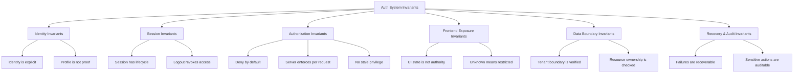
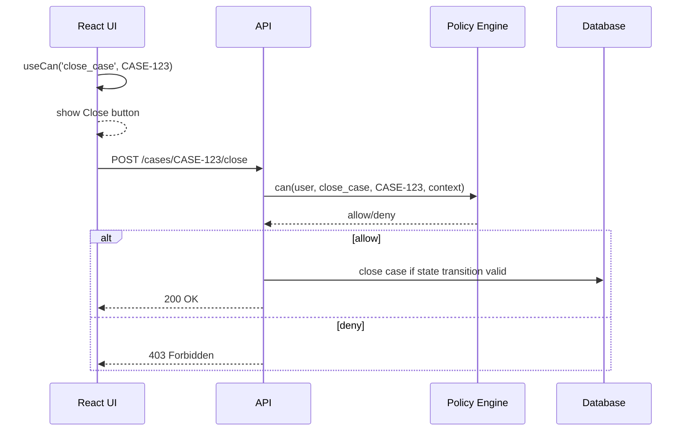
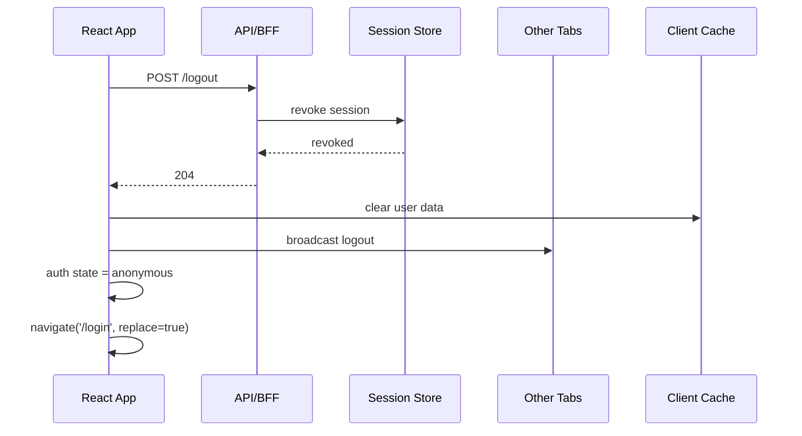
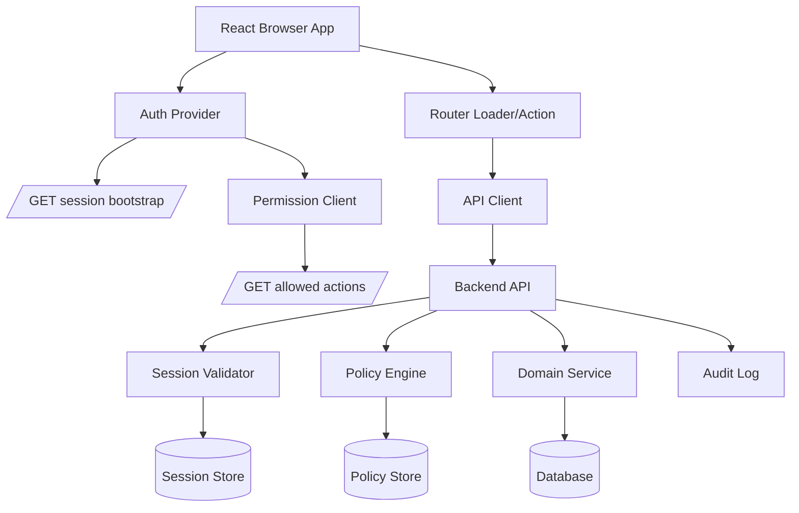

# Auth System Invariants

Sistem auth yang kuat tidak dibangun dari kumpulan snippet. Ia dibangun dari invariant.

Invariant adalah aturan yang harus selalu benar, terlepas dari UI sedang loading, token hampir expired, user membuka tiga tab, role baru saja dicabut, network lambat, IdP error, cache stale, atau React component belum hydrate.

Contoh invariant:

```txt
If permission is unknown, the UI must not expose sensitive action.
If session is expired, mutating requests must not be replayed silently forever.
If user changes tenant, cached data from previous tenant must not be displayed as current tenant data.
If frontend says allowed but backend says denied, backend wins.
```

Part ini membangun daftar invariant yang akan menjadi fondasi seluruh seri. Jika nanti kita memilih cookie, token, BFF, OAuth provider, React Router loader, permission hook, atau policy engine, semua pilihan itu harus diuji terhadap invariant ini.

---

## 1. Kenapa invariant lebih penting dari pattern

Pattern menjawab:

```txt
Bagaimana biasanya orang membuatnya?
```

Invariant menjawab:

```txt
Apa yang tidak boleh rusak?
```

Di auth, pertanyaan kedua lebih penting.

Pattern bisa berubah:

- SPA token auth;
- cookie session;
- BFF;
- server component;
- React Router loader;
- framework middleware;
- OAuth SDK;
- custom policy engine.

Tetapi invariant harus stabil:

- user tidak boleh melihat data tenant lain;
- permission yang dicabut tidak boleh terus dipakai tanpa batas;
- akses terlarang harus ditolak di server;
- token untuk satu audience tidak boleh dipakai untuk audience lain;
- logout harus menghentikan akses, bukan hanya mengganti tampilan;
- unknown auth state tidak boleh dianggap allowed.

Pikirkan invariant seperti constraint database. Aplikasi boleh punya banyak query path, tetapi constraint tetap menjaga kebenaran data. Sistem auth boleh punya banyak UI path, tetapi invariant menjaga kebenaran akses.

---

## 2. Invariant map



Gunakan map ini sebagai checklist desain, PR review, incident analysis, dan test planning.

---

## 3. Invariant #1: Unknown auth state must not be allowed

Auth state punya fase. Pada fase bootstrap, frontend belum tahu apakah user authenticated. Pada fase refresh, frontend belum tahu apakah session masih valid. Pada fase permission load, frontend belum tahu action apa yang allowed.

Invariant:

```txt
Unknown must not be treated as allowed.
```

Anti-pattern:

```tsx
function AdminButton() {
  const { user } = useAuth();

  if (!user) return null;

  return <button>Delete User</button>;
}
```

Masalahnya: `user` ada tidak berarti punya permission. Bahkan `user.role` ada pun belum tentu fresh, server-verified, atau resource-specific.

Lebih sehat:

```tsx
function AdminButton({ targetUserId }: { targetUserId: string }) {
  const decision = useCan('delete_user', { type: 'user', id: targetUserId });

  if (decision.status === 'loading') {
    return null;
  }

  if (decision.status === 'denied') {
    return null;
  }

  return <button>Delete User</button>;
}
```

Untuk action sensitif, default-nya bukan “show until proven denied”. Default-nya “hide/disable until proven allowed”.

State table:

| State | UI sensitive action | Data fetch | Mutation |
|---|---|---|---|
| `unknown` | Hide/disable | Hold or fetch minimal bootstrap only | Block |
| `anonymous` | Hide | Public data only | Block unless public action |
| `authenticated` but permissions unknown | Hide/disable sensitive action | Fetch data allowed by route/session | Block resource-specific mutation |
| `authorized` | Show allowed action | Fetch authorized data | Permit request; server still checks |
| `denied` | Hide/disabled with reason | Do not fetch forbidden detail | Block |

The invariant is simple: **unknown is not allow**.

---

## 4. Invariant #2: Frontend state is not authority

React state is a rendering input. It is not proof.

This is not authority:

```ts
const user = {
  id: 'u_123',
  role: 'admin',
  permissions: ['case.close'],
};
```

This is also not authority:

```ts
const decoded = jwtDecode(accessToken);
```

This is still not authority:

```ts
const isAdmin = localStorage.getItem('role') === 'admin';
```

Client state can help decide what to render. It must not be the final access decision.

Invariant:

```txt
Frontend state may optimize UX, but backend authorization decides access.
```

Practical implication:



Frontend `allow` is a UX hint. Backend `allow` is enforcement.

---

## 5. Invariant #3: Authorization must be checked at the resource boundary

Checking authorization at page entry is not enough.

Bad model:

```txt
User can open /cases => user can mutate any case from that page
```

Better model:

```txt
Every resource action has its own authorization decision.
```

Example:

```txt
can(user, 'case.read', case)
can(user, 'case.assign', case)
can(user, 'case.close', case)
can(user, 'case.export', case)
can(user, 'case.delete_attachment', attachment)
```

Why? Because authorization is often resource-specific and state-specific.

A user may:

- read open cases but not closed cases;
- edit draft reports but not submitted reports;
- close cases only in assigned region;
- export only anonymized data;
- see case metadata but not evidence files;
- approve escalation only if not the original submitter;
- act in tenant A but not tenant B.

Invariant:

```txt
Authorization is not route-level only. It must be enforced per action and resource.
```

Frontend should therefore ask for capabilities close to the resource:

```json
{
  "case": {
    "id": "CASE-123",
    "status": "UNDER_REVIEW",
    "allowedActions": ["comment", "assign", "escalate"],
    "deniedActions": {
      "close": "Case must pass supervisor review before closure"
    }
  }
}
```

This contract is superior to sending only:

```json
{
  "role": "reviewer"
}
```

Role is too coarse. Allowed action is closer to the real decision.

---

## 6. Invariant #4: Deny by default

Deny-by-default means no permission is implied just because code forgot to check.

Bad policy posture:

```ts
function can(user: User, action: string) {
  if (user.role === 'admin') return true;
  if (action === 'case.read') return true;

  // Oops: default allow
  return true;
}
```

Correct posture:

```ts
function can(user: User, action: string, resource: Resource): Decision {
  const rule = findRule(user, action, resource);

  if (!rule) {
    return { allowed: false, reason: 'No matching permission rule' };
  }

  return evaluate(rule, user, resource);
}
```

Deny-by-default should appear in multiple layers:

| Layer | Deny-by-default expression |
|---|---|
| Router | Unknown session redirects/blocks protected route. |
| Component | Unknown permission hides sensitive action. |
| API | Missing permission returns 403. |
| Domain service | Invalid state transition rejected. |
| Database | Tenant/resource constraint prevents cross-boundary access. |
| Policy engine | No rule means deny. |

Deny-by-default is boring until the day a new endpoint ships without explicit policy. Then it becomes the thing that saves you.

---

## 7. Invariant #5: No stale privilege without a bounded risk window

Privilege changes happen:

- user removed from organization;
- role downgraded;
- temporary access expired;
- case assignment changed;
- tenant suspended;
- session revoked;
- admin toggled feature access;
- policy changed;
- account compromised.

If frontend caches permissions forever, revoked privilege can continue to appear in UI. If backend trusts long-lived JWT claims without revocation strategy, revoked privilege can continue to work.

Invariant:

```txt
Stale privilege must have a bounded, intentional risk window.
```

Bounded risk window means the team can answer:

```txt
If permission is revoked at 10:00, what is the latest time the user can still use it?
```

Possible answers:

| Strategy | Risk window |
|---|---:|
| Server-side session lookup every request | Near immediate, depending cache. |
| Short-lived access token, no introspection | Until token expiry. |
| Long-lived JWT with embedded roles | Potentially long and dangerous. |
| Permission ETag/revalidation | Until next revalidation or push invalidation. |
| WebSocket/SSE permission invalidation | Near real-time if connected. |
| Force logout/session revocation | Immediate if checked server-side. |

Frontend design:

```ts
function onPermissionVersionChanged(nextVersion: string) {
  if (authStore.permissionVersion !== nextVersion) {
    queryClient.invalidateQueries({ queryKey: ['permissions'] });
    queryClient.invalidateQueries({ queryKey: ['me'] });
    authStore.setPermissionVersion(nextVersion);
  }
}
```

Backend design:

```txt
Access token contains user id and session id.
API checks session status and permission version for sensitive actions.
Permission changes increment user's permission version.
Old version can be denied or forced to revalidate.
```

The invariant is not “never cache”. The invariant is “never cache without expiry/invalidation semantics”.

---

## 8. Invariant #6: Token purpose must be explicit

A token is not just “a token”.

Different token types have different purposes:

| Token | Purpose | Should React use it as? |
|---|---|---|
| ID token | Proves authentication event/identity claims to client | Display/bootstrap identity with caution; not API authorization. |
| Access token | Authorizes access to resource server | API credential for intended audience. |
| Refresh token | Obtains new access token | Session continuity credential; high sensitivity. |
| CSRF token | Binds mutating request to legitimate browser/UI flow | Request forgery mitigation, not identity proof. |
| Session ID | Opaque handle to server-side session | Browser session continuity. |

Invariant:

```txt
A token must only be accepted for its intended purpose, issuer, audience, subject, and lifecycle.
```

Anti-pattern:

```ts
// ID token sent to API as if it were an access token.
fetch('/api/cases', {
  headers: {
    Authorization: `Bearer ${idToken}`,
  },
});
```

Anti-pattern:

```ts
// Client decodes access token and treats scope as final authorization.
const { scope } = jwtDecode(accessToken);
const canDelete = scope.includes('delete:anything');
```

Correct posture:

```txt
Client may use token metadata for UX timing.
Resource server validates token purpose, issuer, audience, expiry, signature/introspection, and policy.
```

Token purpose confusion creates subtle vulnerabilities because everything “looks authenticated”.

---

## 9. Invariant #7: Session lifecycle must be explicit

A session has lifecycle. It is not simply `user != null`.

Useful auth states:

```txt
anonymous
bootstrapping
authenticating
authenticated
refreshing
expired
revoked
forbidden
degraded
logging_out
```

A robust client models these states explicitly:

```ts
type AuthState =
  | { status: 'anonymous' }
  | { status: 'bootstrapping' }
  | { status: 'authenticating'; returnTo?: string }
  | { status: 'authenticated'; user: User; session: SessionSnapshot }
  | { status: 'refreshing'; user: User; session: SessionSnapshot }
  | { status: 'expired'; reason: 'idle_timeout' | 'absolute_timeout' | 'token_expired' }
  | { status: 'revoked'; reason: string }
  | { status: 'degraded'; user?: User; reason: string }
  | { status: 'logging_out' };
```

Invariant:

```txt
Session transitions must be explicit, observable, and recoverable.
```

Why this matters:

| Hidden transition | Typical bug |
|---|---|
| Token expires during mutation | Infinite retry or duplicate mutation. |
| Session revoked in another tab | UI still shows sensitive actions. |
| IdP unavailable | App loops between login and callback. |
| Permission denied after optimistic UI | UI shows success then backend denies. |
| Bootstrap endpoint fails | App assumes anonymous and logs user out incorrectly. |

State machine details will be expanded in Part 007.

---

## 10. Invariant #8: Logout must invalidate authority, not just UI

Logout is often implemented as:

```ts
localStorage.removeItem('token');
setUser(null);
navigate('/login');
```

That is not logout. That is local UI cleanup.

Invariant:

```txt
After logout, old credentials must no longer authorize new server-side actions, within the declared revocation semantics.
```

A serious logout includes:

1. Stop accepting session/token server-side, or ensure expiry window is short and explicit.
2. Clear client auth state.
3. Clear data caches.
4. Notify other tabs.
5. Close realtime connections.
6. Remove sensitive in-memory data where feasible.
7. Navigate with `replace` to avoid accidental back navigation.
8. Optionally trigger IdP logout if product semantics require global sign-out.
9. Audit logout event when meaningful.

Sequence:



If using long-lived stateless JWT without revocation, be honest: logout does not fully invalidate authority until token expiry. That may be acceptable for low-risk apps and short expiry. It is not acceptable to pretend otherwise.

---

## 11. Invariant #9: Tenant boundary must be server-verified

Multi-tenant systems fail when tenant is treated as UI preference instead of authorization context.

Invariant:

```txt
Every tenant-scoped request must verify user membership, resource tenant ownership, and action permission server-side.
```

Bad assumption:

```txt
The selected tenant in React state is correct, so backend can trust X-Tenant-Id.
```

Better model:

```txt
X-Tenant-Id is a selector.
Server verifies it against authenticated subject and resource.
```

Server-side checks:

```txt
session.user_id exists
AND session.active_tenant_id == request.tenant_id OR user can switch to request.tenant_id
AND resource.tenant_id == request.tenant_id
AND user has action permission in request.tenant_id
AND domain state allows the action
```

Frontend obligations:

- clear cache on tenant switch;
- namespace query keys by tenant;
- avoid rendering stale tenant data;
- display active tenant clearly;
- avoid storing tenant-specific permission globally;
- ensure tabs agree on active tenant or explicitly isolate them.

TanStack Query key example:

```ts
const tenantId = useActiveTenantId();

useQuery({
  queryKey: ['tenant', tenantId, 'cases', filters],
  queryFn: () => caseApi.listCases({ tenantId, filters }),
});
```

Without tenant in the key, cached data can cross-contaminate UI.

---

## 12. Invariant #10: Permission model must match domain actions

If your domain has actions like:

```txt
assign case
escalate case
close case
reopen case
export evidence
approve enforcement action
override automated decision
view restricted note
```

Then permission should not be only:

```txt
admin
user
manager
```

Role may be assignment mechanism. It is not enough as the UI and domain contract.

Invariant:

```txt
Authorization vocabulary should be expressed in domain actions, not only UI pages or broad roles.
```

Bad permission names:

```txt
canSeeButton1
adminPageAccess
superUser
caseScreenEnabled
```

Better permission names:

```txt
case.read
case.comment
case.assign
case.escalate
case.close
evidence.export
note.read_restricted
decision.override
```

Why it matters:

| Bad vocabulary | Failure |
|---|---|
| Page-based permission | User can open page but should not perform row action. |
| Button-based permission | Backend has no domain meaning. |
| Broad role | Role explosion or overprivilege. |
| UI-only capability | API cannot audit meaningful action. |

Frontend should render based on domain capabilities, not component names.

---

## 13. Invariant #11: Authorization decision needs context

Authorization is not only subject and action. It also depends on resource and environment.

Formal-ish shape:

```ts
type AuthorizationRequest = {
  subject: Subject;
  action: string;
  resource: ResourceRef;
  context: {
    tenantId: string;
    time?: string;
    ipRisk?: 'low' | 'medium' | 'high';
    assuranceLevel?: 'pwd' | 'mfa' | 'step_up';
    caseState?: string;
    assignment?: string;
  };
};
```

Invariant:

```txt
A permission decision must include the context needed to make the decision correctly.
```

Example:

```txt
User can close a case only if:
- user is supervisor in tenant;
- case is under review;
- case belongs to user's region;
- user is not the original investigator;
- MFA step-up completed within last 10 minutes;
- no active legal hold blocks closure.
```

A frontend boolean cannot represent this well:

```json
{ "canCloseCase": true }
```

Better contract:

```json
{
  "action": "case.close",
  "allowed": false,
  "reason": "STEP_UP_REQUIRED",
  "requirements": [
    { "type": "mfa", "maxAgeSeconds": 600 }
  ]
}
```

This allows UI to explain and recover, not merely hide.

---

## 14. Invariant #12: Sensitive action needs replay and double-submit protection

Auth is not only “is this user allowed?”. Mutating actions also need correctness under retry, refresh, and user impatience.

Scenario:

1. User clicks `Close Case`.
2. Access token expires.
3. Client refreshes token.
4. Client retries request.
5. User clicks again because UI is pending.
6. Two close requests hit backend.

Invariant:

```txt
Sensitive mutating actions must be safe under retry, duplicate submit, and auth refresh.
```

Frontend mitigation:

```tsx
<button disabled={mutation.isPending} onClick={() => closeCase.mutate(caseId)}>
  {mutation.isPending ? 'Closing...' : 'Close Case'}
</button>
```

Backend mitigation:

```http
Idempotency-Key: close-case-CASE-123-<uuid>
```

Domain mitigation:

```txt
Close transition is valid only from UNDER_REVIEW to CLOSED.
Second close attempt becomes no-op or conflict, not duplicate side effect.
```

Auth refresh should not blindly replay non-idempotent requests unless the request is designed to be safely retried.

---

## 15. Invariant #13: Auth failures must be typed

Many apps collapse all auth failures into “go login”. That causes loops and bad UX.

Different failures need different handling:

| Failure | HTTP-ish signal | UX response |
|---|---:|---|
| No session | 401 | Redirect/login prompt. |
| Expired session | 401 / 419 / 440 | Re-auth, preserve intent if safe. |
| Revoked session | 401 | Clear state, explain signed out. |
| Authenticated but forbidden | 403 | Show access denied/request access. |
| Step-up required | 403/401 with challenge | Prompt MFA/re-auth. |
| Tenant forbidden | 403 | Switch tenant or show no access. |
| CSRF invalid | 403 | Refresh page/session, do not retry blindly. |
| Policy service unavailable | 503/degraded | Safe deny or degraded read-only. |

Invariant:

```txt
Auth failures must be distinguishable enough for safe recovery.
```

Do not do this globally:

```ts
if (response.status === 401 || response.status === 403) {
  window.location.href = '/login';
}
```

403 is not “not logged in”. It is often “logged in but not allowed”. Treating it as login can create redirect loops and hide authorization bugs.

A better response body:

```json
{
  "error": "forbidden",
  "code": "MISSING_PERMISSION",
  "action": "case.close",
  "resource": "CASE-123",
  "requestId": "req_abc123",
  "message": "You do not have permission to close this case."
}
```

---

## 16. Invariant #14: Auth decisions should be auditable when risk is high

Not every UI render needs audit. But sensitive actions and denials often do.

Invariant:

```txt
High-risk authorization decisions and sensitive actions must leave enough evidence for investigation.
```

Audit-worthy events:

- login success/failure;
- logout;
- session revoked;
- MFA challenge completed;
- tenant switch;
- permission grant/revoke;
- access request approval;
- impersonation start/stop;
- sensitive export;
- denied high-risk action;
- policy override;
- role change;
- suspicious refresh token reuse.

Do not rely on frontend logs as audit source. Frontend can supplement telemetry, but authoritative audit should be server-side.

Useful audit shape:

```json
{
  "eventType": "AUTHZ_DENIED",
  "actorUserId": "u_123",
  "tenantId": "t_456",
  "action": "case.close",
  "resourceType": "case",
  "resourceId": "CASE-123",
  "decision": "deny",
  "reason": "MISSING_PERMISSION",
  "sessionId": "s_789",
  "requestId": "req_abc",
  "occurredAt": "2026-07-08T10:15:30Z"
}
```

Privacy note: audit must be useful without leaking unnecessary PII.

---

## 17. Invariant #15: Policy change must be deployable safely

Permissions are product behavior. Changing policy can break workflows or overgrant access.

Invariant:

```txt
Policy changes must be reviewable, testable, observable, and reversible.
```

For serious systems, policy change needs:

- diff preview;
- affected users/resources estimate;
- test matrix;
- rollout plan;
- audit trail;
- rollback path;
- monitoring for 403/allow spike;
- admin UX that prevents accidental broad grants.

Example diff preview:

```txt
Policy change: role Supervisor gains case.reopen
Affected tenants: 14
Affected users: 87
Affected resource types: case
High-risk action: yes
Requires approval: yes
```

Frontend admin console should not let an admin blindly grant powerful permissions without context.

---

## 18. Invariant #16: Auth UX must not leak sensitive facts unnecessarily

Authentication and authorization errors can leak information.

Examples:

| UI message | Potential leak |
|---|---|
| “Email does not exist” | User enumeration. |
| “Case CASE-123 belongs to another tenant” | Resource existence and tenant relationship. |
| “Alice revoked your access” | Internal actor leak. |
| “You are not assigned to Enforcement Region 7” | Internal org structure. |

Invariant:

```txt
Auth UI should provide useful recovery without unnecessary information disclosure.
```

Balanced messages:

```txt
We couldn't sign you in with those credentials.
```

```txt
You don't have access to this case or it no longer exists.
```

```txt
You need additional approval to perform this action.
```

For internal enterprise apps, you can expose more detail if the user already has a legitimate relationship to the resource. But make that a deliberate product/security decision, not accidental string design.

---

## 19. Invariant #17: Client-side permission must be explainable

Users need to know why something is unavailable. Engineers need to know why UI rendered a certain way. Support needs to debug access issues.

Invariant:

```txt
Permission UI should be explainable without becoming the enforcement source.
```

Weak model:

```ts
const canClose = permissions.includes('case.close');
```

Better model:

```ts
type PermissionDecision =
  | { allowed: true; source: 'server'; evaluatedAt: string }
  | {
      allowed: false;
      reason:
        | 'MISSING_PERMISSION'
        | 'WRONG_CASE_STATE'
        | 'STEP_UP_REQUIRED'
        | 'TENANT_ACCESS_DENIED'
        | 'POLICY_UNAVAILABLE';
      source: 'server';
      evaluatedAt: string;
    };
```

This enables UI like:

```tsx
if (!decision.allowed && decision.reason === 'STEP_UP_REQUIRED') {
  return <button onClick={startStepUp}>Verify again to close case</button>;
}
```

Instead of:

```tsx
return null;
```

Null is sometimes right. But for workflows, explanation matters.

---

## 20. Invariant #18: Auth data must be minimally exposed

React apps often overfetch `/me`:

```json
{
  "id": "u_123",
  "email": "...",
  "fullProfile": { },
  "roles": [ ],
  "allPermissions": [ ],
  "allTenants": [ ],
  "internalFlags": [ ],
  "lastLoginIp": "...",
  "riskScore": 87
}
```

Why is all of that in the browser? Every field has exposure cost.

Invariant:

```txt
The browser should receive only identity/session/permission data needed for current UX.
```

Better bootstrap shape:

```json
{
  "user": {
    "id": "u_123",
    "displayName": "Rina",
    "email": "rina@example.com"
  },
  "session": {
    "expiresAt": "2026-07-08T11:00:00Z",
    "assuranceLevel": "mfa"
  },
  "tenant": {
    "id": "t_456",
    "name": "Acme"
  }
}
```

Fetch detailed permission/resource data only when needed.

---

## 21. Invariant #19: Security controls must be testable

An invariant that cannot be tested becomes folklore.

For each invariant, define tests:

| Invariant | Test example |
|---|---|
| Unknown is not allow | Render component with permission loading; assert button absent. |
| Frontend not authority | Modify client permission mock to allow; API still returns 403. |
| Deny by default | Unknown action returns deny. |
| No stale privilege | Revoke permission; next sensitive action denied. |
| Tenant verified | Request tenant A resource under tenant B; API denies. |
| Logout invalidates authority | Logout then replay old request; API rejects. |
| Token purpose explicit | Send ID token to API; API rejects. |
| Auth failures typed | 403 does not redirect to login. |
| Cache cleared | Logout removes protected query data. |

Test naming should express invariant:

```txt
it('does not render close action while permission is unknown')
it('denies close_case on server even when client says allowed')
it('clears tenant-scoped query cache when tenant changes')
it('does not retry non-idempotent mutation after auth refresh without idempotency key')
```

This turns security review into executable behavior.

---

## 22. Auth invariant checklist

Use this as a compact review list.

### Identity

- Identity is explicit: subject, account, profile, tenant, and membership are not conflated.
- Profile data is not treated as proof of authorization.
- Token purpose is explicit.
- ID token is not used as API access token.

### Session

- Session lifecycle is explicit.
- Expiry and refresh behavior are deterministic.
- Logout revokes server-side authority or has an explicit bounded expiry window.
- Multi-tab logout is handled.
- Session bootstrap does not expose unnecessary data.

### Authorization

- Default is deny.
- Backend enforces per request.
- Resource-level decisions exist for sensitive actions.
- Policy vocabulary maps to domain actions.
- Permission cache has expiry/invalidation.
- Stale privilege risk window is known.

### Frontend

- Unknown permission state does not render sensitive action.
- UI hiding is not treated as security enforcement.
- 401 and 403 are handled differently.
- Return URL is validated.
- Auth state is modeled, not scattered booleans.

### Data boundary

- Tenant is verified server-side.
- Query cache is tenant-scoped.
- Sensitive data is not overfetched.
- Cache is cleared on logout and tenant switch.

### Operations

- Sensitive actions are audited server-side.
- Denials have request IDs.
- Policy changes are testable and reversible.
- Incident response can revoke sessions or permissions.

---

## 23. Minimal invariant-driven architecture

A practical architecture that honors these invariants:



Responsibilities:

| Component | Responsibility |
|---|---|
| Auth Provider | Model session state and expose safe hooks. |
| Permission Client | Fetch server-derived permissions/allowed actions. |
| Router Loader/Action | Block unauthenticated route/data access before render/mutation. |
| API Client | Attach credential, handle typed auth failures, avoid unsafe replay. |
| Backend API | Validate session and enforce authorization per request. |
| Policy Engine | Evaluate subject/action/resource/context. |
| Domain Service | Enforce state transition and business invariants. |
| Audit Log | Record sensitive actions and important denials. |

No single component owns “auth”. Auth is a chain of invariants across components.

---

## 24. Common anti-invariants

These are design smells that directly violate the invariants.

### `isAdmin` everywhere

```tsx
{user.role === 'admin' && <DeleteButton />}
```

Problem: role logic scattered, not resource-specific, hard to audit, easy to drift.

### `permissions` from localStorage

```ts
const permissions = JSON.parse(localStorage.getItem('permissions') ?? '[]');
```

Problem: stale, mutable, readable, not authoritative.

### 403 means login

```ts
if (status === 403) redirect('/login');
```

Problem: hides authorization failures and can create loops.

### All permissions in JWT

```json
{
  "permissions": ["*"]
}
```

Problem: hard revocation, token bloat, stale privilege.

### UI-only tenant selection

```ts
api.get('/cases', { headers: { 'X-Tenant-Id': tenantIdFromReactState } })
```

Problem: tenant selector is not proof. Backend must verify.

### Logout without revocation

```ts
setUser(null)
```

Problem: old credential may still authorize API calls.

### Permission unknown rendered as allowed

```tsx
if (loading) return <DangerousAction />;
```

Problem: fail-open UI.

---

## 25. How to use these invariants in real engineering work

### During architecture design

Ask:

```txt
Which invariant does this design satisfy?
Which invariant does it weaken?
What is the bounded risk window?
How do we test it?
How do we recover when it fails?
```

### During PR review

Look for:

- role checks in components;
- localStorage permissions;
- missing 403 handling;
- API calls without resource-level auth;
- tenant missing from query key;
- unsafe retry after refresh;
- raw redirect URL;
- sensitive data in `/me`;
- logout only clearing client state.

### During incident review

Ask:

```txt
Which invariant was violated?
Was the invariant undocumented, untested, or bypassed?
Was the failure frontend-only, backend-only, or cross-boundary?
How do we make the invariant executable next time?
```

This makes incident learning structural instead of blame-oriented.

---

## 26. Source notes

The invariant posture in this part is consistent with established security guidance:

- OWASP Authorization guidance emphasizes server-side authorization, least privilege, deny-by-default thinking, and validating permissions on every request.
- OWASP Session Management guidance treats session identifiers and session lifecycle as security-critical.
- OWASP CSRF guidance separates cookie/session risks from authorization and highlights layered defenses for mutating requests.
- OAuth 2.0 Security Best Current Practice RFC 9700 reinforces modern OAuth threat modelling, token handling, and deprecation of less secure flows.

---

## 27. Summary

React auth becomes manageable when reduced to invariant preservation.

Core invariants:

1. Unknown auth/permission state is not allowed.
2. Frontend state is not authority.
3. Authorization is checked at resource/action boundary.
4. Default is deny.
5. Stale privilege has bounded risk window.
6. Token purpose is explicit.
7. Session lifecycle is explicit.
8. Logout invalidates authority, not just UI.
9. Tenant boundary is server-verified.
10. Permission vocabulary maps to domain actions.
11. Authorization decision includes context.
12. Sensitive mutation is safe under retry.
13. Auth failures are typed.
14. Sensitive decisions are auditable.
15. Policy changes are safely deployable.
16. Auth UX avoids unnecessary leakage.
17. Client-side permission is explainable.
18. Auth data is minimally exposed.
19. Security controls are testable.

Next part turns these invariants into a concrete **auth state machine**. That state machine will become the backbone for session bootstrap, refresh, logout, revoked sessions, forbidden states, and degraded auth behavior.
