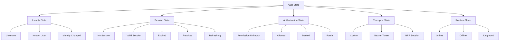
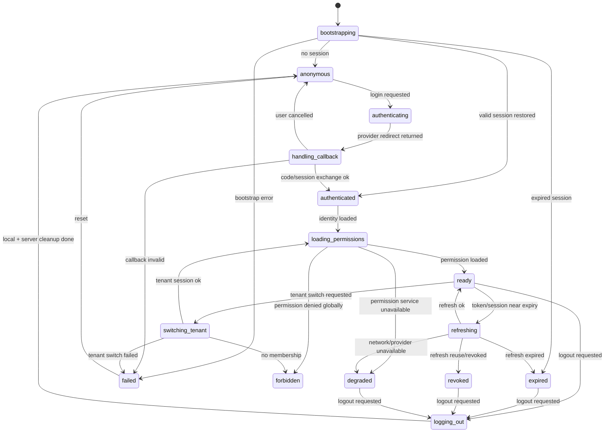
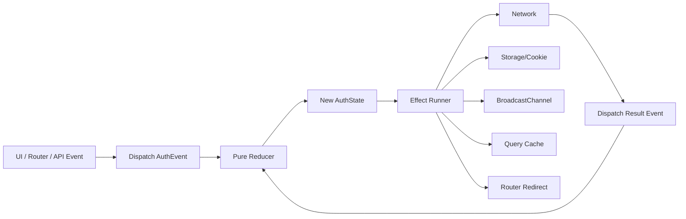
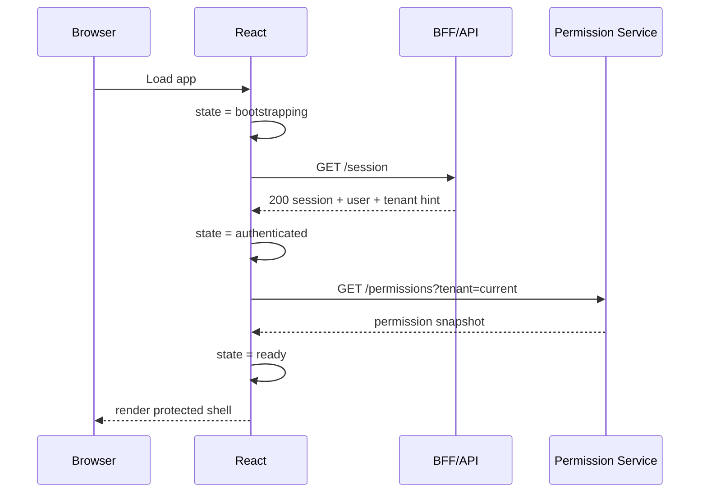
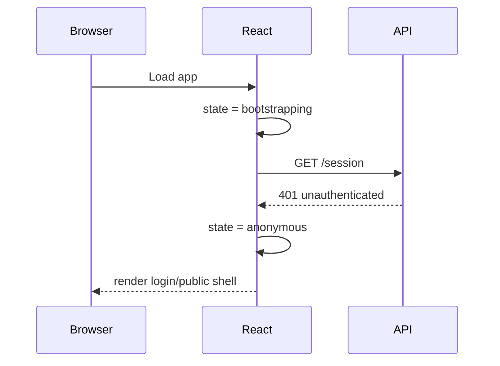
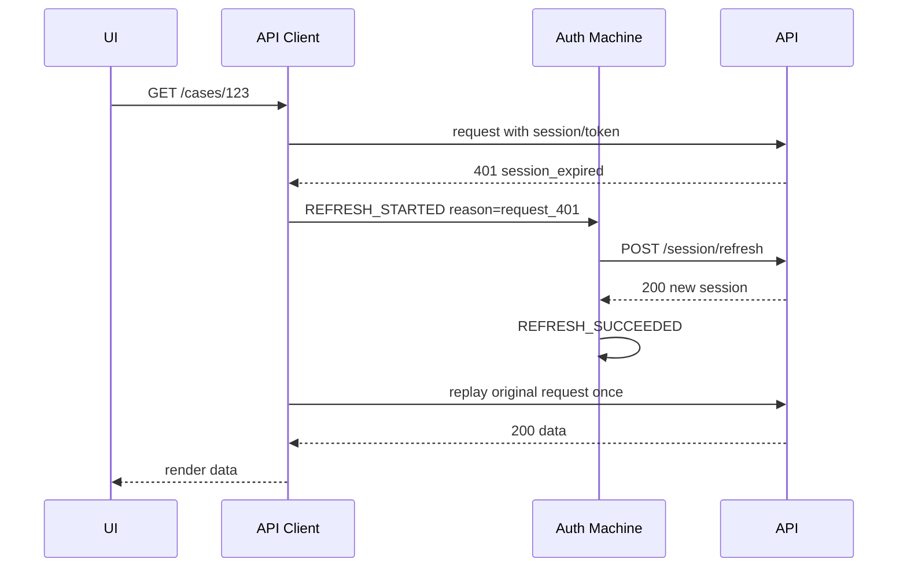
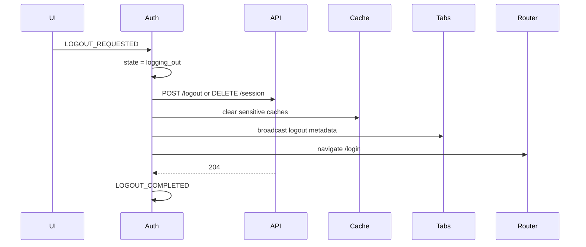
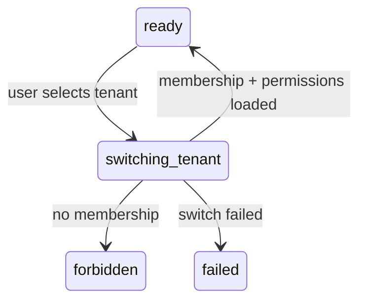

# Auth State Machine

Auth di React sering gagal bukan karena developer tidak tahu cara membuat login form. Ia gagal karena sistem auth diperlakukan sebagai beberapa boolean yang tidak punya kontrak.

Biasanya bentuknya seperti ini:

```tsx
const { user, isLoading, isAuthenticated } = useAuth();
```

Lalu setelah beberapa minggu, state bertambah:

```tsx
const {
  user,
  token,
  isLoading,
  isAuthenticated,
  isRefreshing,
  isExpired,
  isLoggingOut,
  error,
} = useAuth();
```

Kemudian muncul bug:

- user sudah logout di tab lain, tapi tab ini masih menampilkan dashboard;
- token sedang refresh, tetapi request lama direplay dua kali;
- `isAuthenticated === true`, tetapi permission belum dimuat;
- callback OAuth gagal, tetapi UI kembali ke halaman sebelumnya seolah-olah login berhasil;
- role user dicabut, tapi button destructive masih terlihat sampai reload;
- network lambat membuat UI menampilkan layar protected sebelum bootstrap selesai;
- 401 diperlakukan sama dengan 403;
- logout hanya menghapus state React, bukan mencabut session server.

Masalahnya bukan di React. Masalahnya adalah model state yang tidak eksplisit.

Part ini membangun auth sebagai **state machine**: daftar state yang mungkin, event yang boleh mengubah state, transisi yang valid, side effect yang dikontrol, dan invariant yang harus selalu benar.

---

## 1. Prinsip utama

Auth state machine menjawab tiga pertanyaan:

```txt
1. Sistem sedang berada di state apa?
2. Event apa yang boleh terjadi dari state itu?
3. Setelah event terjadi, state berikutnya apa dan side effect apa yang boleh dijalankan?
```

Tanpa state machine, auth cenderung menjadi boolean soup.

```txt
Boolean soup:
- isLoading
- isLoggedIn
- hasToken
- isRefreshing
- isExpired
- isForbidden
- isLoggingOut
- hasError
```

Boolean soup mudah menghasilkan kombinasi mustahil:

```txt
isLoading = true
isAuthenticated = true
isExpired = true
isRefreshing = false
user = null
error = null
```

State machine membuat kombinasi mustahil menjadi tidak representable.

```txt
state = "authenticated"
session = {...}
permissions = {...}
```

atau:

```txt
state = "refreshing"
previousSession = {...}
refreshStartedAt = ...
```

atau:

```txt
state = "anonymous"
reason = "no_session"
```

Dalam sistem auth production, representasi state yang benar adalah bagian dari security design.

---

## 2. Mental model: auth bukan satu state

Auth memiliki beberapa lapisan state.



Tetapi React application tidak boleh membocorkan semua kompleksitas ini ke semua component. Kita butuh state machine yang cukup kaya untuk benar, tetapi cukup sederhana untuk digunakan.

Rule praktis:

```txt
Auth state machine internal boleh detail.
Public auth API harus kecil, stabil, dan typed.
```

---

## 3. State utama yang akan kita gunakan

Untuk React app production, minimal state machine yang sehat biasanya memiliki state berikut.

```txt
bootstrapping
anonymous
authenticating
handling_callback
authenticated
loading_permissions
ready
refreshing
expired
revoked
forbidden
switching_tenant
logging_out
degraded
failed
```

Tidak semua aplikasi butuh semua state. Tetapi jika aplikasi punya OAuth/OIDC, multi-tab, tenant, permission, refresh token, dan protected data route, state-state ini akan muncul cepat atau lambat.

Lebih baik kita beri nama eksplisit sejak awal.

---

## 4. Diagram state machine dasar



Perhatikan dua hal:

1. `authenticated` belum tentu `ready`.
2. `ready` belum tentu tetap valid selamanya.

`authenticated` hanya berarti identitas/session berhasil dibuktikan. Untuk menampilkan aplikasi secara aman, sering kali kita masih butuh permission, tenant context, dan initial user profile yang benar.

---

## 5. Kenapa `authenticated` dan `authorized` harus dipisah

Kesalahan umum:

```tsx
if (!isAuthenticated) {
  return <LoginPage />;
}

return <AdminPage />;
```

Ini mencampur dua pertanyaan:

```txt
Authentication: apakah user punya session valid?
Authorization: apakah user boleh membuka resource/action ini?
```

State machine yang lebih sehat:

```txt
anonymous         -> belum login
bootstrapping     -> belum tahu
authenticated     -> session valid, permission belum tentu siap
ready             -> session valid + auth context minimal siap
forbidden         -> session valid, akses tidak diizinkan
```

Dengan pemisahan ini, UI bisa membedakan:

```txt
401 unauthenticated -> login/re-auth
403 forbidden       -> show no-access/request-access
unknown             -> restrict or loading, never allow
```

Pemisahan ini juga membuat audit lebih jelas. “User tidak login” dan “user login tetapi tidak punya permission” adalah dua event berbeda.

---

## 6. Typed state: jangan mulai dari boolean

Dalam TypeScript, gunakan discriminated union.

```ts
type AuthState =
  | {
      tag: 'bootstrapping';
      startedAt: number;
    }
  | {
      tag: 'anonymous';
      reason: 'no_session' | 'logout' | 'session_expired' | 'callback_cancelled';
    }
  | {
      tag: 'authenticating';
      provider: 'oidc' | 'password' | 'sso';
      returnTo?: string;
    }
  | {
      tag: 'handling_callback';
      provider: 'oidc';
      returnTo?: string;
    }
  | {
      tag: 'authenticated';
      session: AuthSession;
      user: AuthUser;
    }
  | {
      tag: 'loading_permissions';
      session: AuthSession;
      user: AuthUser;
      tenantId?: string;
    }
  | {
      tag: 'ready';
      session: AuthSession;
      user: AuthUser;
      tenant: TenantContext;
      permissions: PermissionSnapshot;
    }
  | {
      tag: 'refreshing';
      previous: ReadyAuthState;
      refreshStartedAt: number;
      reason: 'scheduled' | 'request_401' | 'visibility_resume' | 'manual';
    }
  | {
      tag: 'expired';
      previousUser?: AuthUser;
      expiredAt?: number;
    }
  | {
      tag: 'revoked';
      previousUser?: AuthUser;
      reason: 'server_revoked' | 'refresh_reuse_detected' | 'device_revoked' | 'password_changed';
    }
  | {
      tag: 'forbidden';
      user: AuthUser;
      tenant?: TenantContext;
      reason: ForbiddenReason;
    }
  | {
      tag: 'switching_tenant';
      previous: ReadyAuthState;
      targetTenantId: string;
    }
  | {
      tag: 'logging_out';
      previous?: AuthState;
      reason: 'user_requested' | 'session_expired' | 'security_event' | 'forced';
    }
  | {
      tag: 'degraded';
      previous?: ReadyAuthState;
      reason: 'network_unavailable' | 'permission_service_unavailable' | 'identity_provider_unavailable';
      recoverable: boolean;
    }
  | {
      tag: 'failed';
      error: AuthError;
      recoverable: boolean;
    };
```

Support type:

```ts
type AuthSession = {
  sessionId: string;
  issuedAt: number;
  expiresAt: number;
  refreshAfter?: number;
  authTime?: number;
  assuranceLevel?: 'low' | 'medium' | 'high';
};

type AuthUser = {
  id: string;
  displayName: string;
  email?: string;
};

type TenantContext = {
  id: string;
  slug: string;
  displayName: string;
};

type PermissionSnapshot = {
  version: string;
  loadedAt: number;
  tenantId?: string;
  actions: Record<string, PermissionDecision>;
};

type PermissionDecision =
  | { allowed: true; reason?: string }
  | { allowed: false; reason: string };

type ReadyAuthState = Extract<AuthState, { tag: 'ready' }>;

type ForbiddenReason =
  | 'missing_permission'
  | 'tenant_membership_required'
  | 'account_suspended'
  | 'step_up_required'
  | 'resource_not_accessible';

type AuthError = {
  code: string;
  message: string;
  cause?: unknown;
};
```

Tujuan typing ini bukan “TypeScript fancy”. Tujuannya adalah membuat state invalid tidak bisa direpresentasikan.

Misalnya, `ready` selalu punya `session`, `user`, `tenant`, dan `permissions`. Component yang butuh permission tidak perlu menebak apakah permission sudah dimuat.

---

## 7. Public API jangan membocorkan semua state

Internal state boleh kaya. Tetapi API ke component harus ringkas.

```ts
type AuthView =
  | {
      status: 'unknown';
      canRenderProtectedShell: false;
    }
  | {
      status: 'anonymous';
      canRenderProtectedShell: false;
      login: (options?: LoginOptions) => Promise<void>;
    }
  | {
      status: 'ready';
      canRenderProtectedShell: true;
      user: AuthUser;
      tenant: TenantContext;
      can: CanFunction;
      logout: () => Promise<void>;
    }
  | {
      status: 'forbidden';
      canRenderProtectedShell: false;
      reason: ForbiddenReason;
      logout: () => Promise<void>;
    }
  | {
      status: 'recoverable_error';
      canRenderProtectedShell: false;
      retry: () => Promise<void>;
      logout: () => Promise<void>;
    };
```

Jangan semua component tahu `refreshing`, `handling_callback`, atau `switching_tenant`, kecuali memang perlu.

Pattern sehat:

```txt
Internal state machine detail.
Public view model sederhana.
Route boundary memakai internal detail.
Leaf component memakai public view model.
```

---

## 8. Event lebih penting dari setter

Anti-pattern:

```ts
setIsAuthenticated(true);
setUser(user);
setToken(token);
setIsLoading(false);
```

Setter bebas membuat state tidak konsisten.

State machine memakai event:

```ts
type AuthEvent =
  | { type: 'BOOTSTRAP_STARTED'; now: number }
  | { type: 'BOOTSTRAP_NO_SESSION' }
  | { type: 'BOOTSTRAP_SESSION_FOUND'; session: AuthSession; user: AuthUser }
  | { type: 'LOGIN_REQUESTED'; provider: 'oidc' | 'password' | 'sso'; returnTo?: string }
  | { type: 'CALLBACK_STARTED'; returnTo?: string }
  | { type: 'CALLBACK_SUCCEEDED'; session: AuthSession; user: AuthUser }
  | { type: 'CALLBACK_FAILED'; error: AuthError }
  | { type: 'PERMISSIONS_LOAD_STARTED'; tenantId?: string }
  | { type: 'PERMISSIONS_LOADED'; tenant: TenantContext; permissions: PermissionSnapshot }
  | { type: 'PERMISSIONS_DENIED'; reason: ForbiddenReason }
  | { type: 'REFRESH_STARTED'; now: number; reason: ReadyAuthState['tag'] extends never ? never : 'scheduled' | 'request_401' | 'visibility_resume' | 'manual' }
  | { type: 'REFRESH_SUCCEEDED'; session: AuthSession; permissions?: PermissionSnapshot }
  | { type: 'REFRESH_EXPIRED'; expiredAt?: number }
  | { type: 'SESSION_REVOKED'; reason: Extract<AuthState, { tag: 'revoked' }>['reason'] }
  | { type: 'TENANT_SWITCH_REQUESTED'; targetTenantId: string }
  | { type: 'TENANT_SWITCH_SUCCEEDED'; session: AuthSession; tenant: TenantContext; permissions: PermissionSnapshot }
  | { type: 'TENANT_SWITCH_FORBIDDEN'; reason: ForbiddenReason }
  | { type: 'LOGOUT_REQUESTED'; reason: Extract<AuthState, { tag: 'logging_out' }>['reason'] }
  | { type: 'LOGOUT_COMPLETED' }
  | { type: 'RECOVERABLE_FAILURE'; reason: Extract<AuthState, { tag: 'degraded' }>['reason'] }
  | { type: 'FAILURE'; error: AuthError; recoverable: boolean }
  | { type: 'RESET' };
```

Event memberi sistem bahasa yang sama dengan audit log, metrics, dan test case.

---

## 9. Reducer: transisi murni, side effect di luar

State transition harus bisa dites tanpa network.

```ts
function authReducer(state: AuthState, event: AuthEvent): AuthState {
  switch (state.tag) {
    case 'bootstrapping': {
      switch (event.type) {
        case 'BOOTSTRAP_NO_SESSION':
          return { tag: 'anonymous', reason: 'no_session' };

        case 'BOOTSTRAP_SESSION_FOUND':
          return {
            tag: 'authenticated',
            session: event.session,
            user: event.user,
          };

        case 'FAILURE':
          return {
            tag: 'failed',
            error: event.error,
            recoverable: event.recoverable,
          };

        default:
          return state;
      }
    }

    case 'anonymous': {
      if (event.type === 'LOGIN_REQUESTED') {
        return {
          tag: 'authenticating',
          provider: event.provider,
          returnTo: event.returnTo,
        };
      }
      return state;
    }

    case 'authenticating': {
      if (event.type === 'CALLBACK_STARTED') {
        return {
          tag: 'handling_callback',
          provider: 'oidc',
          returnTo: event.returnTo ?? state.returnTo,
        };
      }
      return state;
    }

    case 'handling_callback': {
      switch (event.type) {
        case 'CALLBACK_SUCCEEDED':
          return {
            tag: 'authenticated',
            session: event.session,
            user: event.user,
          };

        case 'CALLBACK_FAILED':
          return {
            tag: 'failed',
            error: event.error,
            recoverable: true,
          };

        default:
          return state;
      }
    }

    case 'authenticated': {
      if (event.type === 'PERMISSIONS_LOAD_STARTED') {
        return {
          tag: 'loading_permissions',
          session: state.session,
          user: state.user,
          tenantId: event.tenantId,
        };
      }
      return state;
    }

    case 'loading_permissions': {
      switch (event.type) {
        case 'PERMISSIONS_LOADED':
          return {
            tag: 'ready',
            session: state.session,
            user: state.user,
            tenant: event.tenant,
            permissions: event.permissions,
          };

        case 'PERMISSIONS_DENIED':
          return {
            tag: 'forbidden',
            user: state.user,
            reason: event.reason,
          };

        case 'RECOVERABLE_FAILURE':
          return {
            tag: 'degraded',
            reason: event.reason,
            recoverable: true,
          };

        default:
          return state;
      }
    }

    case 'ready': {
      switch (event.type) {
        case 'REFRESH_STARTED':
          return {
            tag: 'refreshing',
            previous: state,
            refreshStartedAt: event.now,
            reason: event.reason,
          };

        case 'TENANT_SWITCH_REQUESTED':
          return {
            tag: 'switching_tenant',
            previous: state,
            targetTenantId: event.targetTenantId,
          };

        case 'LOGOUT_REQUESTED':
          return {
            tag: 'logging_out',
            previous: state,
            reason: event.reason,
          };

        case 'SESSION_REVOKED':
          return {
            tag: 'revoked',
            previousUser: state.user,
            reason: event.reason,
          };

        default:
          return state;
      }
    }

    case 'refreshing': {
      switch (event.type) {
        case 'REFRESH_SUCCEEDED':
          return {
            tag: 'ready',
            ...state.previous,
            session: event.session,
            permissions: event.permissions ?? state.previous.permissions,
          };

        case 'REFRESH_EXPIRED':
          return {
            tag: 'expired',
            previousUser: state.previous.user,
            expiredAt: event.expiredAt,
          };

        case 'SESSION_REVOKED':
          return {
            tag: 'revoked',
            previousUser: state.previous.user,
            reason: event.reason,
          };

        case 'RECOVERABLE_FAILURE':
          return {
            tag: 'degraded',
            previous: state.previous,
            reason: event.reason,
            recoverable: true,
          };

        default:
          return state;
      }
    }

    case 'switching_tenant': {
      switch (event.type) {
        case 'TENANT_SWITCH_SUCCEEDED':
          return {
            tag: 'ready',
            session: event.session,
            user: state.previous.user,
            tenant: event.tenant,
            permissions: event.permissions,
          };

        case 'TENANT_SWITCH_FORBIDDEN':
          return {
            tag: 'forbidden',
            user: state.previous.user,
            tenant: state.previous.tenant,
            reason: event.reason,
          };

        default:
          return state;
      }
    }

    case 'logging_out': {
      if (event.type === 'LOGOUT_COMPLETED') {
        return { tag: 'anonymous', reason: 'logout' };
      }
      return state;
    }

    case 'expired':
    case 'revoked':
    case 'forbidden':
    case 'degraded':
    case 'failed': {
      if (event.type === 'LOGOUT_REQUESTED') {
        return {
          tag: 'logging_out',
          previous: state,
          reason: event.reason,
        };
      }

      if (event.type === 'RESET') {
        return { tag: 'anonymous', reason: 'no_session' };
      }

      return state;
    }
  }
}
```

Beberapa detail sengaja dibuat eksplisit:

- `ready -> refreshing` menyimpan `previous` agar UI bisa membuat keputusan apakah boleh tetap render atau harus freeze.
- `refreshing -> ready` mengganti session, tetapi permission boleh tetap dipakai hanya jika contract backend menjamin permission tidak berubah karena refresh.
- `SESSION_REVOKED` bisa datang dari state `ready` atau `refreshing`.
- `expired`, `revoked`, `forbidden`, `failed`, dan `degraded` tidak otomatis menjadi `anonymous`. Itu penting agar UI bisa memberi recovery yang benar.

---

## 10. Transition table

Gunakan tabel ini sebagai review checklist.

| Current State | Event | Next State | Catatan |
|---|---|---|---|
| `bootstrapping` | no session | `anonymous` | Safe. Jangan render protected shell. |
| `bootstrapping` | session found | `authenticated` | Belum tentu permission siap. |
| `authenticated` | load permissions | `loading_permissions` | Jangan expose sensitive action. |
| `loading_permissions` | loaded | `ready` | Protected app boleh render. |
| `loading_permissions` | denied | `forbidden` | User valid, akses tidak valid. |
| `ready` | refresh start | `refreshing` | Hindari refresh paralel. |
| `refreshing` | success | `ready` | Replace session atomically. |
| `refreshing` | expired | `expired` | Re-auth diperlukan. |
| `refreshing` | revoked | `revoked` | Security-sensitive path. |
| `ready` | tenant switch | `switching_tenant` | Clear tenant-scoped cache. |
| `switching_tenant` | success | `ready` | Permission snapshot harus tenant-specific. |
| `switching_tenant` | forbidden | `forbidden` | Jangan fallback ke tenant lama seolah sukses. |
| `ready` | logout | `logging_out` | Stop request, clear cache, revoke if needed. |
| `logging_out` | completed | `anonymous` | Baru aman kembali ke login screen. |

Tabel transisi adalah dokumen desain. Kalau ada bug auth, biasanya ada transisi yang tidak terdefinisi atau dibiarkan implicit.

---

## 11. Side effect map

Reducer harus murni. Side effect dijalankan oleh command layer.



Contoh effect map:

| State entered | Side effect |
|---|---|
| `bootstrapping` | Call `/session` or inspect server-provided bootstrap data. |
| `authenticating` | Redirect to IdP or call credential login endpoint. |
| `handling_callback` | Exchange code/session with backend; validate state/nonce server-side where applicable. |
| `loading_permissions` | Fetch `/me`, `/permissions`, tenant context. |
| `refreshing` | Run refresh with single-flight lock. |
| `switching_tenant` | Call tenant switch endpoint; clear tenant-scoped cache. |
| `logging_out` | Revoke server session, clear local state, broadcast logout, clear cache, redirect. |
| `revoked` | Stop API replay; show forced logout/security message. |

Jangan menaruh network call di reducer. Reducer yang punya side effect sulit dites dan sulit diaudit.

---

## 12. Bootstrap flow

Bootstrap adalah fase paling rawan flash-of-protected-content.

Bad pattern:

```tsx
function App() {
  const user = readUserFromLocalStorage();

  return user ? <Dashboard /> : <Login />;
}
```

Masalah:

- localStorage bisa stale;
- user object bukan session proof;
- permission belum diverifikasi;
- tenant context belum dipastikan;
- browser cache bisa menyimpan data lama;
- UI protected bisa render sebelum server check.

Bootstrap yang lebih sehat:



Jika `/session` mengembalikan 401:



Invariant:

```txt
Protected shell tidak boleh render sebelum bootstrap menghasilkan ready atau route-specific authorization selesai.
```

---

## 13. Authenticated tidak otomatis ready

Banyak aplikasi gagal di sini.

```txt
authenticated = identity/session valid
ready = identity/session valid + context minimal untuk menjalankan app aman
```

Contoh context minimal:

- current tenant sudah dipilih;
- membership tenant sudah verified;
- permission snapshot sudah dimuat;
- user status tidak suspended;
- required MFA/step-up status cukup untuk route yang diminta;
- profile state tidak butuh mandatory onboarding sebelum masuk app;
- initial cache tidak membawa data tenant lama.

Maka state path sehat:

```txt
bootstrapping -> authenticated -> loading_permissions -> ready
```

Bukan:

```txt
bootstrapping -> authenticated -> render everything
```

---

## 14. Refresh flow

Refresh adalah distributed race problem.

Hal yang bisa terjadi:

- access token expired saat 5 request berjalan paralel;
- dua tab mencoba refresh bersamaan;
- refresh berhasil tetapi permission sebenarnya berubah;
- refresh token reuse terdeteksi;
- network timeout tetapi request asli menunggu;
- user logout saat refresh sedang berlangsung;
- backend mengembalikan 401 untuk session expired dan 403 untuk permission denied;
- refresh loop tidak pernah berhenti.

State machine membantu membuat refresh eksplisit.



Rule:

```txt
Replay original request at most once after a successful refresh.
```

Jika masih 401 setelah refresh sukses, jangan refresh lagi secara infinite. Masuk ke `expired`, `revoked`, atau `failed` sesuai response.

---

## 15. Single-flight refresh

Refresh harus single-flight dalam satu runtime.

Bad pattern:

```ts
api.interceptors.response.use(undefined, async (error) => {
  if (error.status === 401) {
    await refresh();
    return api.request(error.config);
  }
  throw error;
});
```

Jika 20 request menerima 401, akan ada 20 refresh call.

Lebih sehat:

```ts
let refreshPromise: Promise<void> | null = null;

async function refreshOnce(reason: RefreshReason): Promise<void> {
  if (!refreshPromise) {
    refreshPromise = performRefresh(reason).finally(() => {
      refreshPromise = null;
    });
  }

  return refreshPromise;
}
```

Dengan state machine:

```ts
async function performRefresh(reason: RefreshReason) {
  const state = authStore.getState();

  if (state.tag !== 'ready') {
    throw new Error(`Cannot refresh from state ${state.tag}`);
  }

  authStore.dispatch({
    type: 'REFRESH_STARTED',
    now: Date.now(),
    reason,
  });

  try {
    const result = await sessionApi.refresh();

    authStore.dispatch({
      type: 'REFRESH_SUCCEEDED',
      session: result.session,
      permissions: result.permissions,
    });
  } catch (error) {
    const classified = classifyRefreshError(error);

    switch (classified.kind) {
      case 'expired':
        authStore.dispatch({ type: 'REFRESH_EXPIRED', expiredAt: Date.now() });
        break;

      case 'revoked':
        authStore.dispatch({ type: 'SESSION_REVOKED', reason: classified.reason });
        break;

      case 'recoverable':
        authStore.dispatch({ type: 'RECOVERABLE_FAILURE', reason: classified.reason });
        break;

      default:
        authStore.dispatch({
          type: 'FAILURE',
          error: classified.error,
          recoverable: false,
        });
    }
  }
}
```

Single-flight lint rule mental:

```txt
There must be one refresh owner.
All other requests wait or fail explicitly.
```

---

## 16. Refresh and multi-tab

Multi-tab akan dibahas lebih dalam pada Part 018, tetapi state machine harus disiapkan sejak sekarang.

Problem:

```txt
Tab A refreshes session.
Tab B still has old token/session state.
Tab C logs out.
Tab A still replays request after logout.
```

State machine harus menerima event eksternal:

```ts
type CrossTabAuthEvent =
  | { type: 'REMOTE_LOGOUT'; at: number }
  | { type: 'REMOTE_SESSION_REFRESHED'; at: number }
  | { type: 'REMOTE_SESSION_REVOKED'; at: number; reason: string }
  | { type: 'REMOTE_TENANT_SWITCHED'; at: number; tenantId: string };
```

Mapping:

| Remote event | Local action |
|---|---|
| `REMOTE_LOGOUT` | Stop request, clear local cache, transition to `anonymous` or `logging_out`. |
| `REMOTE_SESSION_REFRESHED` | Re-bootstrap or fetch current session. Jangan blindly copy secret token antar tab. |
| `REMOTE_SESSION_REVOKED` | Transition to `revoked`. |
| `REMOTE_TENANT_SWITCHED` | Clear tenant-scoped cache and revalidate. |

Jangan broadcast sensitive token melalui `BroadcastChannel` atau `localStorage` event. Broadcast event metadata, bukan credential.

---

## 17. Logout flow

Logout bukan sekadar:

```ts
localStorage.removeItem('token');
setUser(null);
```

Logout adalah state transition dengan side effects.



Invariant logout:

```txt
After logout is requested, new protected requests must not be started using the previous session.
```

Artinya, begitu state masuk `logging_out`, API client harus menolak request protected baru.

```ts
function assertCanStartProtectedRequest(state: AuthState) {
  if (state.tag !== 'ready' && state.tag !== 'refreshing') {
    throw new AuthClientError('auth_not_ready');
  }

  if (state.tag === 'refreshing') {
    // Depends on app policy. Usually wait for refresh owner.
    throw new AuthClientError('auth_refresh_in_progress');
  }
}
```

---

## 18. Forbidden bukan expired

403 dan 401 tidak boleh dicampur.

```txt
401 -> authentication/session problem
403 -> authorization problem
```

Jika 403 diperlakukan sebagai expired, user akan dipaksa login ulang untuk masalah permission. Itu buruk untuk UX dan observability.

Jika 401 diperlakukan sebagai forbidden, user tidak diberi recovery untuk re-auth.

Mapping sehat:

| HTTP / API result | State implication | UI |
|---|---|---|
| 401 `session_missing` | `anonymous` | Login. |
| 401 `session_expired` | `expired` or `refreshing` | Refresh/re-auth. |
| 401 `session_revoked` | `revoked` | Forced logout/security message. |
| 403 `missing_permission` | `forbidden` | No access/request access. |
| 403 `tenant_membership_required` | `forbidden` | Tenant switch/request membership. |
| 403 `step_up_required` | route-specific step-up state | MFA/re-auth. |
| 404 for hidden resource | route-level not found | Avoid resource enumeration. |

State machine harus menerima error semantics yang cukup jelas dari backend. Jika backend hanya mengembalikan `error`, frontend akan menebak.

---

## 19. Permission loading as state

Permission loading harus eksplisit karena UI exposure bergantung padanya.

Anti-pattern:

```tsx
function DeleteButton() {
  const { user } = useAuth();

  if (user?.role === 'admin') {
    return <button>Delete</button>;
  }

  return null;
}
```

Lebih sehat:

```tsx
function DeleteCaseButton({ caseId }: { caseId: string }) {
  const decision = useCan('case.delete', { type: 'case', id: caseId });

  if (decision.status === 'unknown') {
    return null;
  }

  if (!decision.allowed) {
    return null;
  }

  return <button>Delete case</button>;
}
```

Tetapi `useCan` sendiri harus bergantung pada state machine.

```ts
function canFromState(
  state: AuthState,
  action: string,
  resource: PermissionResource,
): PermissionDecision & { status: 'known' | 'unknown' } {
  if (state.tag !== 'ready') {
    return {
      status: 'unknown',
      allowed: false,
      reason: 'auth_not_ready',
    };
  }

  return evaluatePermission(state.permissions, action, resource);
}
```

Invariant:

```txt
Permission unknown must not render as allowed.
```

---

## 20. Tenant switch state

Multi-tenant auth sering rusak karena tenant dianggap filter UI, bukan security context.

Tenant switch harus menjadi state transition.



Saat tenant switch:

- block tenant-scoped mutations;
- clear tenant-scoped query cache;
- cancel in-flight tenant-scoped requests;
- fetch new membership/permission snapshot;
- update route if URL contains tenant slug/id;
- audit tenant switch if relevant;
- never display previous tenant data as current tenant data.

Example:

```ts
async function switchTenant(targetTenantId: string) {
  const state = authStore.getState();

  if (state.tag !== 'ready') {
    throw new Error('Cannot switch tenant unless auth is ready');
  }

  authStore.dispatch({ type: 'TENANT_SWITCH_REQUESTED', targetTenantId });
  queryClient.cancelQueries({ predicate: isTenantScopedQuery });
  queryClient.removeQueries({ predicate: isTenantScopedQuery });

  try {
    const result = await sessionApi.switchTenant(targetTenantId);

    authStore.dispatch({
      type: 'TENANT_SWITCH_SUCCEEDED',
      session: result.session,
      tenant: result.tenant,
      permissions: result.permissions,
    });
  } catch (error) {
    const classified = classifyTenantSwitchError(error);

    if (classified.kind === 'forbidden') {
      authStore.dispatch({
        type: 'TENANT_SWITCH_FORBIDDEN',
        reason: classified.reason,
      });
      return;
    }

    authStore.dispatch({
      type: 'FAILURE',
      error: classified.error,
      recoverable: true,
    });
  }
}
```

---

## 21. Degraded state

Production auth harus punya degraded state.

Contoh:

- IdP unavailable;
- permission service timeout;
- network offline;
- BFF intermittent failure;
- `/session` endpoint lambat;
- refresh endpoint timeout.

Tidak semua failure berarti logout.

```txt
expired/revoked = session validity problem
degraded = dependency/runtime problem
```

Contoh policy:

| Failure | Degraded allowed? | Reason |
|---|---:|---|
| Permission service unavailable before app ready | No sensitive action | Unknown permission must deny. |
| Refresh timeout while existing session still within grace | Maybe read-only mode | Depends on backend contract. |
| IdP unavailable during login | Public/login error | User not authenticated. |
| Audit service unavailable for destructive action | Maybe block action | Depends on compliance requirement. |
| Network offline with stale cached data | Read-only offline shell | Mutations blocked. |

Degraded state harus eksplisit agar tidak berubah menjadi “catch all error”.

---

## 22. Route integration

React Router Data/Framework Mode membuat auth bisa diperiksa sebelum component render. Itu lebih sehat dibanding guard yang hanya berjalan setelah route component mount.

Contoh konseptual loader:

```ts
export async function protectedLoader({ request }: LoaderFunctionArgs) {
  const session = await authServer.requireSession(request);

  if (!session) {
    throw redirect(`/login?returnTo=${encodeURIComponent(new URL(request.url).pathname)}`);
  }

  const decision = await policy.can(session.userId, 'case.read', {
    type: 'case',
    id: params.caseId,
  });

  if (!decision.allowed) {
    throw new Response('Forbidden', { status: 403 });
  }

  return { session, decision };
}
```

Untuk SPA murni, loader client-side tetap tidak menjadi security boundary. Tetapi loader tetap berguna sebagai **early exposure boundary**:

```txt
Client loader prevents accidental UI/data exposure.
Server/API still enforces real authorization.
```

---

## 23. React integration pattern

Minimal store:

```ts
type Listener = () => void;

class AuthStore {
  private state: AuthState = { tag: 'bootstrapping', startedAt: Date.now() };
  private listeners = new Set<Listener>();

  getState = () => this.state;

  subscribe = (listener: Listener) => {
    this.listeners.add(listener);
    return () => this.listeners.delete(listener);
  };

  dispatch = (event: AuthEvent) => {
    const next = authReducer(this.state, event);

    if (next !== this.state) {
      this.state = next;
      for (const listener of this.listeners) listener();
    }
  };
}

export const authStore = new AuthStore();
```

Hook dengan `useSyncExternalStore`:

```ts
import { useSyncExternalStore } from 'react';

export function useAuthState(): AuthState {
  return useSyncExternalStore(
    authStore.subscribe,
    authStore.getState,
    authStore.getState,
  );
}
```

View selector:

```ts
export function useAuthView(): AuthView {
  const state = useAuthState();

  switch (state.tag) {
    case 'bootstrapping':
    case 'authenticating':
    case 'handling_callback':
    case 'loading_permissions':
    case 'refreshing':
    case 'switching_tenant':
    case 'logging_out':
      return {
        status: 'unknown',
        canRenderProtectedShell: false,
      };

    case 'anonymous':
      return {
        status: 'anonymous',
        canRenderProtectedShell: false,
        login,
      };

    case 'ready':
      return {
        status: 'ready',
        canRenderProtectedShell: true,
        user: state.user,
        tenant: state.tenant,
        can: makeCan(state.permissions),
        logout,
      };

    case 'forbidden':
      return {
        status: 'forbidden',
        canRenderProtectedShell: false,
        reason: state.reason,
        logout,
      };

    case 'expired':
    case 'revoked':
    case 'degraded':
    case 'failed':
      return {
        status: 'recoverable_error',
        canRenderProtectedShell: false,
        retry: bootstrap,
        logout,
      };
  }
}
```

Perhatikan policy ini mungkin terlalu konservatif untuk beberapa app. Misalnya saat `refreshing`, beberapa app tetap render shell lama. Itu boleh, asalkan sensitive mutation diblok dan data stale diberi status jelas.

---

## 24. App shell rendering policy

Tentukan rendering policy per state.

| State | Protected shell? | Sensitive action? | Data fetch? |
|---|---:|---:|---:|
| `bootstrapping` | No | No | Session bootstrap only |
| `anonymous` | No | No | Public only |
| `authenticating` | No | No | Auth redirect only |
| `handling_callback` | No | No | Callback exchange only |
| `authenticated` | No | No | Permission/session context only |
| `loading_permissions` | No | No | Permission fetch only |
| `ready` | Yes | Based on permission | Yes |
| `refreshing` | Maybe stale shell | Usually no new mutation | Wait/retry policy |
| `expired` | No | No | Re-auth only |
| `revoked` | No | No | Logout/security flow only |
| `forbidden` | No protected resource | No | Access request maybe |
| `switching_tenant` | Maybe neutral shell | No | Tenant context only |
| `logging_out` | No | No | Logout cleanup only |
| `degraded` | Maybe read-only | No or limited | Depends on policy |
| `failed` | No | No | Retry/reset only |

Tabel ini harus diputuskan oleh tim. Jangan biarkan setiap component memutuskan sendiri.

---

## 25. API client policy

API client harus membaca state machine, bukan local variable token acak.

```ts
async function authorizedFetch(input: RequestInfo, init?: RequestInit) {
  const state = authStore.getState();

  if (state.tag === 'anonymous' || state.tag === 'expired' || state.tag === 'revoked') {
    throw new AuthClientError('unauthenticated');
  }

  if (state.tag === 'logging_out') {
    throw new AuthClientError('logout_in_progress');
  }

  if (state.tag === 'bootstrapping' || state.tag === 'loading_permissions') {
    throw new AuthClientError('auth_not_ready');
  }

  if (state.tag === 'refreshing') {
    await waitUntilRefreshSettled();
    return authorizedFetch(input, init);
  }

  if (state.tag !== 'ready') {
    throw new AuthClientError(`invalid_auth_state:${state.tag}`);
  }

  const response = await fetch(input, {
    ...init,
    credentials: 'include',
  });

  if (response.status === 401) {
    await refreshOnce('request_401');
    return fetch(input, {
      ...init,
      credentials: 'include',
    });
  }

  return response;
}
```

Untuk cookie session, `credentials: 'include'` mungkin perlu tergantung same-origin/cross-origin design. Untuk bearer token, header injection terjadi di boundary ini. Namun pattern utamanya sama: API client harus tunduk pada auth state machine.

---

## 26. Jangan menyimpan derived state secara sembarangan

Misalnya:

```ts
const isAdmin = user.roles.includes('admin');
```

Kalau `isAdmin` disimpan di banyak tempat, permission drift akan terjadi.

Lebih sehat:

```ts
const decision = can('case.delete', { type: 'case', id: caseId });
```

Derived booleans boleh dibuat sebagai selector, bukan sebagai state permanen.

```ts
function selectIsReady(state: AuthState): state is ReadyAuthState {
  return state.tag === 'ready';
}

function selectCurrentUser(state: AuthState): AuthUser | null {
  return state.tag === 'ready' ? state.user : null;
}
```

Rule:

```txt
Store facts and snapshots. Derive convenience booleans.
```

---

## 27. Race condition catalog

Beberapa race yang harus dites:

| Race | Risiko | State machine defense |
|---|---|---|
| Bootstrap vs route render | Protected flash | `bootstrapping` blocks protected shell. |
| Refresh vs logout | Request replay after logout | `logging_out` blocks replay. |
| Multi request 401 | Refresh storm | Single-flight refresh. |
| Tenant switch vs in-flight data | Cross-tenant display | Cancel/clear tenant-scoped cache. |
| Permission changed vs cached UI | Stale privilege | Permission version + invalidation. |
| Callback duplicate | Code exchange replay | `handling_callback` idempotency + backend validation. |
| User closes tab during logout | Server session remains | Server expiry/revocation; best effort local cleanup. |
| Offline during refresh | Infinite retry | `degraded` with bounded retry. |
| Back button after logout | Sensitive cached page | Cache-control + client clear + no protected shell. |

State machine tidak menghapus semua race. Ia membuat race terlihat dan dapat dites.

---

## 28. Testing transition

Test reducer seperti test parser atau database engine. Tidak perlu browser.

```ts
describe('authReducer', () => {
  it('does not become ready directly from bootstrapping without permissions', () => {
    const initial: AuthState = { tag: 'bootstrapping', startedAt: 1 };

    const next = authReducer(initial, {
      type: 'BOOTSTRAP_SESSION_FOUND',
      session: fakeSession(),
      user: fakeUser(),
    });

    expect(next.tag).toBe('authenticated');
  });

  it('moves from ready to refreshing on scheduled refresh', () => {
    const ready = fakeReadyState();

    const next = authReducer(ready, {
      type: 'REFRESH_STARTED',
      now: 100,
      reason: 'scheduled',
    });

    expect(next.tag).toBe('refreshing');
  });

  it('does not allow protected app shell during unknown states', () => {
    const states: AuthState[] = [
      { tag: 'bootstrapping', startedAt: 1 },
      { tag: 'anonymous', reason: 'no_session' },
      { tag: 'expired' },
      { tag: 'revoked', reason: 'server_revoked' },
    ];

    for (const state of states) {
      expect(toAuthView(state).canRenderProtectedShell).toBe(false);
    }
  });
});
```

Test matrix minimal:

| Test | Expected |
|---|---|
| no session bootstrap | `anonymous` |
| valid session bootstrap | `authenticated`, not `ready` |
| permission loaded | `ready` |
| permission denied | `forbidden` |
| refresh success | `ready` with new session |
| refresh expired | `expired` |
| refresh revoked | `revoked` |
| logout from ready | `logging_out -> anonymous` |
| tenant switch success | `ready` with new tenant and permission snapshot |
| tenant switch denied | `forbidden` |

---

## 29. Observability

State transitions harus bisa diamati.

Log event aman:

```json
{
  "event": "auth_state_transition",
  "from": "ready",
  "to": "refreshing",
  "reason": "scheduled",
  "tenantId": "tnt_123",
  "sessionAgeMs": 1200000,
  "correlationId": "req_abc"
}
```

Jangan log:

- access token;
- refresh token;
- authorization code;
- full cookie;
- raw ID token;
- password;
- MFA code;
- secret recovery code.

Metrics yang berguna:

```txt
auth.bootstrap.success.count
auth.bootstrap.failure.count
auth.refresh.started.count
auth.refresh.success.count
auth.refresh.failure.count
auth.refresh.singleflight.waiters
auth.logout.started.count
auth.logout.completed.count
auth.forbidden.count
auth.revoked.count
auth.degraded.count
auth.redirect_loop.detected.count
```

State machine membuat metrics lebih berarti karena event vocabulary stabil.

---

## 30. Anti-pattern catalog

### Anti-pattern: `isAuthenticated` dari localStorage

```tsx
const isAuthenticated = Boolean(localStorage.getItem('token'));
```

Masalah:

- token bisa expired;
- token bisa revoked;
- localStorage bisa stale;
- permission tidak diketahui;
- token existence bukan authorization.

### Anti-pattern: redirect loop tanpa state

```tsx
if (!user) navigate('/login');
if (user) navigate('/dashboard');
```

Tanpa state `bootstrapping`, `handling_callback`, dan `anonymous`, login/callback bisa saling redirect.

### Anti-pattern: refresh di setiap request failure

```ts
if (status === 401) refresh();
```

Tanpa single-flight dan max replay, ini bisa menjadi refresh storm.

### Anti-pattern: forbidden memaksa logout

```ts
if (status === 403) logout();
```

403 bukan bukti session invalid. Ia bukti access denied.

### Anti-pattern: role boolean tersebar

```tsx
const isAdmin = user.role === 'admin';
```

Ini tidak cukup untuk resource-specific, tenant-specific, state-specific permission.

---

## 31. Practical design checklist

Sebelum membangun auth provider, jawab pertanyaan ini:

```txt
1. Apa state awal aplikasi?
2. Apa yang terjadi saat session tidak ada?
3. Apa yang terjadi saat session expired?
4. Apa yang terjadi saat session revoked?
5. Apa perbedaan authenticated dan ready?
6. Kapan permission dimuat?
7. Apa policy saat permission unknown?
8. Apa policy saat refresh sedang berjalan?
9. Berapa kali request boleh direplay setelah refresh?
10. Apa yang terjadi jika user logout saat request masih berjalan?
11. Apa yang terjadi jika user membuka dua tab?
12. Apa yang terjadi jika tenant berubah?
13. Apa yang terjadi jika backend mengembalikan 403?
14. Apa yang terjadi jika IdP unavailable?
15. State transition mana yang diaudit?
```

Kalau tim tidak bisa menjawab ini, implementasi auth akan bergantung pada kebetulan.

---

## 32. Reference architecture kecil

```mermaid
flowchart TD
    UI[React Components] --> View[Auth View Model]
    View --> Store[Auth Store]
    Store --> Reducer[Pure Reducer]
    Store --> Effects[Effect Runner]

    Router[Router Loaders/Actions] --> Store
    APIClient[API Client] --> Store
    Effects --> SessionAPI[/session API]
    Effects --> PermissionAPI[/permissions API]
    Effects --> Broadcast[Cross-tab Events]
    Effects --> Cache[Query Cache]

    PermissionAPI --> Policy[Policy Engine]
    SessionAPI --> SessionStore[Session Store]
```

Layer responsibility:

| Layer | Responsibility |
|---|---|
| Component | Render based on view model/permission decision. |
| Auth view model | Hide internal state complexity. |
| Auth store | Hold state and dispatch event. |
| Reducer | Pure transition. |
| Effect runner | Network/storage/router/broadcast/cache side effects. |
| API client | Enforce request policy, refresh coordination. |
| Router | Prevent protected render before auth decision. |
| Backend | Real enforcement boundary. |

---

## 33. Final mental model

Auth state machine bukan overengineering. Ia adalah cara membuat sistem auth punya bentuk.

Tanpa state machine, auth menjadi kumpulan patch:

```txt
if token missing -> login
if 401 -> refresh
if refresh fail -> logout
if role admin -> show button
if callback -> set user
```

Dengan state machine, auth menjadi sistem:

```txt
state + event -> next state + controlled side effects
```

Untuk React apps kompleks, ini perbedaan antara auth yang “jalan di demo” dan auth yang bisa bertahan di production.

---

## 34. Ringkasan

Part ini membangun fondasi state machine untuk React auth:

- jangan mulai dari boolean soup;
- bedakan `authenticated` dan `ready`;
- permission loading adalah state eksplisit;
- refresh harus single-flight dan bounded replay;
- logout adalah distributed cleanup flow;
- 401 dan 403 punya arti berbeda;
- tenant switch harus membersihkan context dan cache;
- degraded state harus eksplisit;
- route/data boundary harus memakai state machine;
- transition harus bisa dites tanpa browser;
- event vocabulary bisa dipakai untuk observability.

Part berikutnya membahas taxonomy kegagalan auth. Tujuannya: setiap failure punya nama, penyebab, recovery, UX, HTTP mapping, dan observability yang jelas.

---

## References

- OWASP Authentication Cheat Sheet: https://cheatsheetseries.owasp.org/cheatsheets/Authentication_Cheat_Sheet.html
- OWASP Session Management Cheat Sheet: https://cheatsheetseries.owasp.org/cheatsheets/Session_Management_Cheat_Sheet.html
- OWASP Authorization Cheat Sheet: https://cheatsheetseries.owasp.org/cheatsheets/Authorization_Cheat_Sheet.html
- OAuth 2.0 Security Best Current Practice, RFC 9700: https://www.rfc-editor.org/rfc/rfc9700.html
- OAuth 2.0 for Browser-Based Applications draft: https://datatracker.ietf.org/doc/html/draft-ietf-oauth-browser-based-apps
- React Router Data Loading: https://reactrouter.com/start/framework/data-loading
- React Router Middleware: https://reactrouter.com/how-to/middleware
