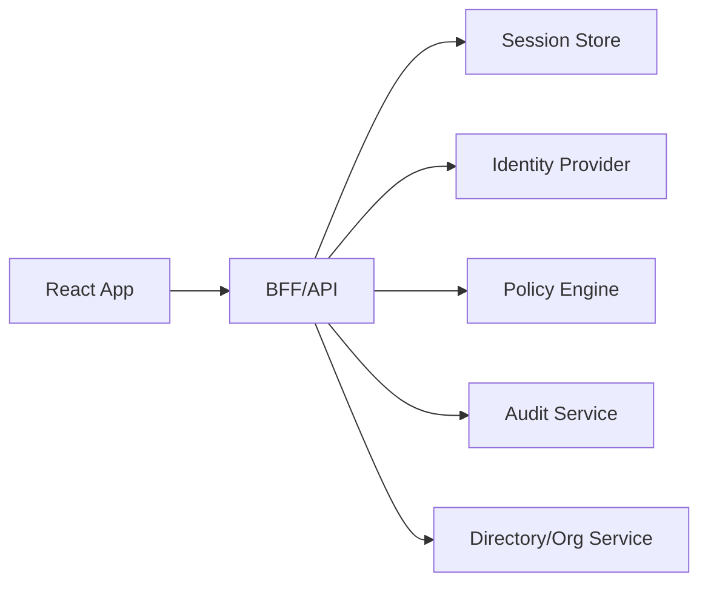

# Auth Failure Taxonomy

Auth failure yang tidak diberi nama akan berubah menjadi bug acak.

Di banyak React app, hampir semua kegagalan auth dipaksa masuk ke satu bucket:

```txt
Something went wrong.
```

atau:

```txt
Please login again.
```

Akibatnya:

- user login ulang padahal masalahnya 403 permission;
- user melihat “no access” padahal session expired;
- refresh token reuse dianggap network error;
- tenant mismatch terlihat seperti data kosong;
- provider SSO down dianggap credential salah;
- callback OAuth invalid tidak diaudit sebagai potensi serangan;
- frontend tidak tahu harus retry, redirect, logout, request access, atau freeze UI;
- metrics tidak bisa membedakan bug UX dari security incident.

Part ini membangun taxonomy kegagalan auth untuk React application. Tujuannya bukan membuat error enum yang panjang. Tujuannya membuat failure bisa dipahami, dirutekan, diuji, dan dioperasikan.

---

## 1. Prinsip utama

Setiap auth failure harus punya enam properti:

```txt
1. Class      -> jenis kegagalan apa?
2. Stage      -> terjadi di tahap mana?
3. Actor      -> user, browser, IdP, API, policy engine, attacker, operator?
4. Recovery   -> apa langkah aman berikutnya?
5. Severity   -> UX issue, access issue, security signal, incident?
6. Evidence   -> apa yang harus dicatat untuk debugging/audit?
```

Tanpa ini, frontend akan menebak.

Contoh:

```txt
HTTP 401
```

Belum cukup.

Bisa berarti:

- session tidak ada;
- session expired;
- refresh token expired;
- session revoked;
- cookie tidak terkirim;
- clock skew;
- CSRF defense menolak request;
- BFF tidak bisa membaca session store;
- token audience salah;
- user berubah password di device lain;
- organization memaksa re-auth.

Setiap penyebab membutuhkan response berbeda.

---

## 2. Failure taxonomy map

```mermaid
flowchart TD
    A[Auth Failure] --> B[Authentication Failure]
    A --> C[Session Failure]
    A --> D[OAuth/OIDC Failure]
    A --> E[Authorization Failure]
    A --> F[Identity/Profile Failure]
    A --> G[Tenant Failure]
    A --> H[Transport/Browser Failure]
    A --> I[Dependency Failure]
    A --> J[Security Signal]

    B --> B1[Invalid Credentials]
    B --> B2[MFA Failed]
    B --> B3[Account Locked]

    C --> C1[Missing Session]
    C --> C2[Expired Session]
    C --> C3[Revoked Session]
    C --> C4[Refresh Reuse]

    D --> D1[State Mismatch]
    D --> D2[Nonce Mismatch]
    D --> D3[Code Exchange Failed]
    D --> D4[Provider Error]

    E --> E1[Missing Permission]
    E --> E2[Resource Denied]
    E --> E3[Action Not Allowed]

    F --> F1[Profile Incomplete]
    F --> F2[Email Unverified]
    F --> F3[Account Suspended]

    G --> G1[Tenant Missing]
    G --> G2[Membership Required]
    G --> G3[Tenant Mismatch]

    H --> H1[Cookie Blocked]
    H --> H2[CORS]
    H --> H3[Offline]

    I --> I1[IdP Down]
    I --> I2[Policy Service Down]
    I --> I3[Session Store Down]

    J --> J1[Replay Detected]
    J --> J2[Open Redirect Attempt]
    J --> J3[Suspicious Token]
```



Taxonomy ini akan menjadi bahasa bersama antara frontend, backend, security, support, dan product.

---

## 3. Error envelope contract

Frontend tidak perlu seluruh detail internal backend. Tetapi frontend butuh error contract yang cukup spesifik.

Contoh response shape:

```json
{
  "error": {
    "code": "session_expired",
    "category": "session",
    "message": "Your session has expired.",
    "recoverability": "reauth_required",
    "severity": "normal",
    "correlationId": "req_01J...",
    "details": {
      "reauthUrl": "/login",
      "returnToAllowed": true
    }
  }
}
```

Frontend membutuhkan `code`, `category`, `recoverability`, dan `correlationId`. `message` boleh dipakai untuk fallback, tetapi UI production biasanya memetakan message sendiri.

TypeScript:

```ts
type AuthErrorCategory =
  | 'authentication'
  | 'session'
  | 'oauth_callback'
  | 'authorization'
  | 'identity'
  | 'tenant'
  | 'transport'
  | 'dependency'
  | 'security_signal'
  | 'unknown';

type Recoverability =
  | 'retry_safe'
  | 'retry_after_delay'
  | 'reauth_required'
  | 'step_up_required'
  | 'request_access'
  | 'logout_required'
  | 'contact_admin'
  | 'blocked_security'
  | 'not_recoverable_in_ui';

type AuthErrorSeverity =
  | 'info'
  | 'normal'
  | 'warning'
  | 'security_sensitive'
  | 'incident';

type AuthErrorEnvelope = {
  code: string;
  category: AuthErrorCategory;
  message: string;
  recoverability: Recoverability;
  severity: AuthErrorSeverity;
  correlationId?: string;
  details?: Record<string, unknown>;
};
```

Rule:

```txt
Frontend should not infer security meaning from free-text message.
```

---

## 4. HTTP status is not enough

HTTP status membantu, tetapi tidak cukup.

| HTTP | Generic meaning | Auth-specific ambiguity |
|---:|---|---|
| 400 | Bad request | Invalid OAuth callback, malformed return URL, invalid tenant switch. |
| 401 | Unauthenticated | Missing, expired, revoked, malformed, wrong audience, cookie missing. |
| 403 | Forbidden | Missing permission, suspended account, tenant denied, step-up required. |
| 404 | Not found | Truly missing or intentionally hidden due to authorization. |
| 409 | Conflict | Session version conflict, permission version changed, tenant switch race. |
| 419/440 | Session expired | Non-standard but often used by frameworks/products. |
| 422 | Validation | Credential policy, profile incomplete, impossible state transition. |
| 429 | Too many requests | Login throttling, MFA attempts, refresh abuse. |
| 500 | Server error | Session store, policy engine, IdP integration failure. |
| 503 | Unavailable | IdP/policy/session dependency down. |

Frontend harus menggunakan combination:

```txt
HTTP status + stable error code + endpoint context + current auth state
```

Contoh:

```ts
function classifyAuthHttpError(response: Response, body?: AuthErrorEnvelope): ClassifiedAuthFailure {
  if (body?.code) {
    return classifyByCode(body);
  }

  if (response.status === 401) {
    return { kind: 'session_unknown', recoverability: 'reauth_required' };
  }

  if (response.status === 403) {
    return { kind: 'authorization_denied', recoverability: 'request_access' };
  }

  if (response.status === 429) {
    return { kind: 'rate_limited', recoverability: 'retry_after_delay' };
  }

  if (response.status >= 500) {
    return { kind: 'dependency_or_server_failure', recoverability: 'retry_after_delay' };
  }

  return { kind: 'unknown', recoverability: 'not_recoverable_in_ui' };
}
```

---

## 5. Authentication failure

Authentication failure terjadi saat user membuktikan identitasnya.

Contoh:

| Code | Meaning | UI response | Security note |
|---|---|---|---|
| `invalid_credentials` | Identifier/password tidak cocok | Generic login failure | Hindari user enumeration. |
| `mfa_required` | Credential benar, MFA dibutuhkan | Show MFA challenge | Jangan expose terlalu banyak detail. |
| `mfa_failed` | MFA salah | Retry with limit | Rate limit. |
| `account_locked` | Account lockout policy aktif | Contact support/admin | Jangan leak detail ke attacker. |
| `password_expired` | Password harus diganti | Password change flow | Bukan session failure. |
| `email_unverified` | Email belum verified | Verification flow | Bisa login-limited. |
| `passkey_challenge_failed` | WebAuthn ceremony gagal | Retry ceremony | Bisa karena device/platform. |
| `identity_provider_required` | Org harus login via SSO | Redirect SSO | Org discovery diperlukan. |

Important UI rule:

```txt
Login form error should be helpful without becoming an account enumeration oracle.
```

Bad:

```txt
No account exists for alice@example.com.
```

Better:

```txt
The email or password is incorrect.
```

Untuk enterprise SSO, boleh ada UX lebih spesifik setelah org discovery aman, misalnya “Use your company SSO”. Tetapi jangan membocorkan membership sensitif sembarangan.

---

## 6. Session failure

Session failure terjadi setelah authentication pernah berhasil, tetapi continuity bermasalah.

| Code | Meaning | State transition | Recovery |
|---|---|---|---|
| `session_missing` | Tidak ada session/cookie/token | `anonymous` | Login. |
| `session_expired` | Session/access token expired | `refreshing` or `expired` | Refresh or re-auth. |
| `refresh_token_expired` | Refresh tidak bisa dipakai | `expired` | Re-auth. |
| `session_revoked` | Server mencabut session | `revoked` | Forced logout/re-auth. |
| `refresh_token_reuse_detected` | Reuse token terdeteksi | `revoked` | Security logout, audit. |
| `session_version_mismatch` | Session berubah di device/tab lain | re-bootstrap | Reload auth context. |
| `device_revoked` | Device/session tertentu dicabut | `revoked` | Re-auth. |
| `password_changed` | Password change invalidates session | `revoked` | Re-auth. |
| `cookie_missing` | Cookie tidak terkirim | `anonymous` or `failed` | Browser/settings/domain fix. |
| `csrf_token_invalid` | CSRF defense menolak request | `failed` or security signal | Reload/retry only if safe. |

Perhatikan `session_expired` dan `session_revoked` berbeda.

```txt
Expired = normal lifecycle.
Revoked = explicit invalidation/security/admin/user action.
```

UI untuk expired:

```txt
Your session expired. Please sign in again.
```

UI untuk revoked:

```txt
Your session ended. Please sign in again.
```

Untuk security-sensitive revocation, jangan beri detail berlebihan ke browser. Detail penuh masuk audit/server log.

---

## 7. OAuth/OIDC callback failure

OAuth/OIDC callback adalah salah satu area paling rawan karena melibatkan redirect, transient state, code exchange, provider, dan browser history.

| Code | Meaning | Severity | Recovery |
|---|---|---:|---|
| `oauth_state_missing` | `state` tidak ada | security-sensitive | Restart login. |
| `oauth_state_mismatch` | `state` tidak cocok | security-sensitive | Block, restart login, audit. |
| `oauth_nonce_mismatch` | ID token nonce tidak valid | security-sensitive | Block, audit. |
| `oauth_code_missing` | Callback tanpa code | normal/warning | Restart login. |
| `oauth_code_exchange_failed` | Backend gagal exchange code | normal/warning | Retry/restart login. |
| `oauth_code_already_used` | Code replay/duplicate callback | warning/security | Restart login, audit. |
| `oauth_redirect_uri_mismatch` | Redirect URI tidak cocok | config/security | Block, operator fix. |
| `oauth_provider_error` | Provider mengembalikan error | normal | Show provider message class. |
| `oauth_user_cancelled` | User membatalkan consent/login | info | Return to login. |
| `oauth_org_not_allowed` | Org/domain tidak diizinkan | forbidden | Contact admin/request access. |

Callback handler harus punya state eksplisit:

```txt
authenticating -> handling_callback -> authenticated/loading_permissions/failed
```

Jangan callback langsung membuat `isAuthenticated = true` sebelum exchange/validation selesai.

Callback failure UI:

```tsx
function CallbackError({ error }: { error: AuthErrorEnvelope }) {
  switch (error.code) {
    case 'oauth_state_mismatch':
    case 'oauth_nonce_mismatch':
      return <SecuritySensitiveLoginError />;

    case 'oauth_user_cancelled':
      return <LoginCancelled />;

    case 'oauth_provider_error':
      return <ProviderLoginError correlationId={error.correlationId} />;

    default:
      return <GenericLoginRecovery correlationId={error.correlationId} />;
  }
}
```

---

## 8. Authorization failure

Authorization failure terjadi saat user authenticated, tetapi tidak diizinkan melakukan action/resource tertentu.

| Code | Meaning | UI response | Security note |
|---|---|---|---|
| `missing_permission` | User tidak punya permission | Hide/disable/request access | Server tetap enforce. |
| `resource_not_accessible` | Resource tidak boleh diakses | 403/404 depending policy | Hindari enumeration. |
| `action_not_allowed_in_state` | Action tidak valid untuk lifecycle resource | Explain current state | State-based auth. |
| `field_read_denied` | Field tertentu tidak boleh dilihat | Omit/mask field | Jangan kirim field jika tidak boleh. |
| `field_write_denied` | Field tidak boleh diedit | Read-only/hidden | Server validates. |
| `tenant_membership_required` | User bukan member tenant | Tenant access flow | Tenant isolation critical. |
| `step_up_required` | Action butuh assurance lebih tinggi | MFA/re-auth | Bukan generic forbidden. |
| `approval_required` | Butuh approval workflow | Request approval | Domain policy. |
| `delegation_required` | Acting user tidak punya delegation | Explain delegation | Audit subject vs actor. |

Frontend rule:

```txt
Authorization failure should not clear session.
```

Kecuali backend menyatakan account/session revoked, 403 tidak boleh otomatis logout.

---

## 9. 403 vs 404 untuk resource authorization

Untuk resource yang sensitif, backend kadang mengembalikan 404 agar attacker tidak tahu resource ada.

Frontend harus siap dengan dua mode:

```txt
403 = resource exists but access denied, if product wants explicit access UX.
404 = not found or hidden, if existence itself is sensitive.
```

Decision matrix:

| Resource type | Prefer | Reason |
|---|---|---|
| Public-ish internal resource | 403 | User bisa request access. |
| Highly sensitive case/investigation | 404 or generic denied | Existence may be sensitive. |
| User-owned object | 404 for non-owned | Prevent enumeration. |
| Admin console route | 403 | User knows feature exists, lacks role. |
| Collaboration document | 403/request access | Access request UX useful. |

React UI jangan menganggap semua 404 berarti data hilang. Untuk route protected, 404 bisa menjadi authorization shape.

---

## 10. Identity/profile failure

Identity bukan hanya user ID. Ada status identitas yang mempengaruhi app.

| Code | Meaning | UI |
|---|---|---|
| `profile_incomplete` | User harus melengkapi profile | Onboarding gate. |
| `email_unverified` | Email belum verified | Verification prompt. |
| `phone_verification_required` | Phone needed for compliance/MFA | Verification flow. |
| `account_suspended` | Account disabled/suspended | Block with support/admin path. |
| `account_pending_approval` | Waiting approval | Pending screen. |
| `terms_acceptance_required` | Must accept terms | Terms gate. |
| `privacy_consent_required` | Consent required | Consent flow. |
| `identity_link_required` | Account linking required | Link account flow. |

Jangan campur semua ini dengan authorization.

```txt
profile_incomplete != missing_permission
account_suspended != session_expired
email_unverified != unauthenticated
```

State machine boleh punya route-level gates:

```txt
authenticated -> identity_gate -> loading_permissions -> ready
```

Atau identity gate bisa menjadi bagian dari `loading_permissions` result. Yang penting: error code-nya jelas.

---

## 11. Tenant failure

Untuk SaaS dan case management platform, tenant failure adalah class tersendiri.

| Code | Meaning | Recovery |
|---|---|---|
| `tenant_missing` | No active tenant selected | Tenant picker. |
| `tenant_not_found` | Tenant slug/id invalid | 404/tenant picker. |
| `tenant_membership_required` | User bukan member | Request membership/contact admin. |
| `tenant_suspended` | Tenant disabled | Support/admin. |
| `tenant_mismatch` | Request tenant != session tenant | Clear cache/re-bootstrap/security log. |
| `tenant_switch_failed` | Switch endpoint gagal | Retry. |
| `tenant_context_stale` | Client context version lama | Re-fetch context. |
| `cross_tenant_cache_detected` | Client hampir menampilkan data tenant salah | Clear cache, audit client bug. |

Tenant mismatch adalah high-risk.

Contoh bug:

```txt
URL: /tenant/acme/cases/123
Session active tenant: globex
Cached query key: ['case', '123']
```

Query key tidak memasukkan tenant. UI bisa menampilkan case tenant lama pada tenant baru.

Query key sehat:

```ts
const caseQueryKey = ['tenant', tenantId, 'case', caseId] as const;
```

Failure response sehat:

```json
{
  "error": {
    "code": "tenant_mismatch",
    "category": "tenant",
    "recoverability": "retry_safe",
    "severity": "security_sensitive",
    "correlationId": "req_abc"
  }
}
```

Frontend response:

- cancel in-flight tenant-scoped request;
- clear tenant-scoped cache;
- re-bootstrap session/tenant context;
- do not render old data as current tenant;
- log client-side diagnostic without sensitive data.

---

## 12. Permission freshness failure

Permission bukan hanya allowed/denied. Ia punya freshness.

| Code | Meaning | Recovery |
|---|---|---|
| `permission_snapshot_stale` | Client permission version lama | Re-fetch permissions. |
| `permission_version_conflict` | Mutation memakai permission version lama | Re-fetch and retry only if safe. |
| `role_changed` | Role updated since session/bootstrap | Re-bootstrap permissions. |
| `grant_revoked` | Object grant revoked | Remove action/data. |
| `policy_version_changed` | Policy engine version changed | Re-evaluate. |

Contoh optimistic mutation:

```ts
async function deleteCase(caseId: string) {
  const decision = can('case.delete', { type: 'case', id: caseId });

  if (!decision.allowed) {
    throw new ForbiddenInUiError(decision.reason);
  }

  const response = await api.delete(`/cases/${caseId}`, {
    headers: {
      'X-Permission-Snapshot-Version': permissions.version,
    },
  });

  if (response.status === 409) {
    await reloadPermissions();
    throw new PermissionChangedError();
  }
}
```

Rule:

```txt
Permission allowed in UI is only a prediction. Server decision is final.
```

---

## 13. Transport/browser failure

Browser environment bisa membuat auth gagal tanpa ada masalah di credential atau permission.

| Code | Meaning | Common cause | Recovery |
|---|---|---|---|
| `cookie_blocked` | Cookie tidak tersimpan/dikirim | Third-party cookie, SameSite, domain, browser setting | Explain or fallback architecture. |
| `cors_rejected` | Browser menolak response | CORS config | Operator fix. |
| `csrf_token_missing` | CSRF token hilang | stale page, missing bootstrap, blocked cookie | Reload/retry safe. |
| `csrf_token_invalid` | CSRF mismatch | stale token, attack, multi-tab | Reload, audit if repeated. |
| `network_offline` | Browser offline | connectivity | Offline/read-only. |
| `request_timeout` | Timeout | network/dependency | Retry with backoff. |
| `storage_unavailable` | Storage not available | private mode, quota, policy | Memory-only/degraded. |
| `broadcast_unavailable` | Cross-tab sync unavailable | old browser/restricted env | Poll/re-bootstrap. |
| `service_worker_stale` | SW serving stale app/session | bad SW cache | Update/reload. |

Frontend harus membedakan:

```txt
Auth denied by server
vs
Browser could not carry auth material correctly
```

Cookie problem example:

```txt
Login succeeds, redirect returns, /session says 401 because cookie was not stored.
```

Jangan tampilkan “wrong password”. Ini bukan authentication failure.

---

## 14. Dependency failure

Auth punya banyak dependency.



Dependency failure harus terlihat sebagai dependency failure, bukan user fault.

| Code | Dependency | UI response |
|---|---|---|
| `identity_provider_unavailable` | IdP | Login temporarily unavailable. |
| `session_store_unavailable` | Session DB/cache | Cannot restore session; retry. |
| `policy_service_unavailable` | Permission service | Block sensitive actions, retry. |
| `directory_service_unavailable` | Org/profile | Degraded profile/tenant lookup. |
| `audit_service_unavailable` | Audit | Possibly block sensitive write. |
| `key_service_unavailable` | JWKS/KMS | Cannot verify token, fail closed. |

Security rule:

```txt
If a dependency required for safe authorization is unavailable, fail closed for protected action.
```

Product may allow read-only degraded mode only when data already loaded and compliance allows it.

---

## 15. Security signal failure

Beberapa “failure” bukan sekadar UX. Ia adalah signal security.

| Code | Meaning | Frontend behavior |
|---|---|---|
| `refresh_token_reuse_detected` | Possible token theft/replay | Stop, forced logout, generic message. |
| `oauth_state_mismatch` | Possible CSRF/login injection | Block, restart login. |
| `oauth_nonce_mismatch` | Possible token substitution/replay | Block. |
| `token_audience_invalid` | Token for wrong API | Block, log correlation. |
| `token_issuer_invalid` | Wrong issuer | Block. |
| `session_binding_mismatch` | Session/device binding changed | Re-auth. |
| `impossible_travel_detected` | Risk engine signal | Step-up/re-auth. |
| `open_redirect_attempt` | Malicious return URL | Drop return URL, audit. |
| `suspicious_tenant_switch` | Tenant switch anomaly | Block/step-up. |

Frontend should not show attacker-friendly detail.

Bad:

```txt
OAuth state mismatch. Expected xyz but got abc.
```

Better:

```txt
We could not complete sign-in safely. Please try again.
```

With correlation ID:

```txt
Reference: req_abc123
```

---

## 16. Recovery matrix

Recovery should be deterministic.

| Recoverability | Meaning | UI action |
|---|---|---|
| `retry_safe` | Same operation can be retried safely | Retry button/auto retry with limit. |
| `retry_after_delay` | Retry but with backoff | Toast/banner, backoff. |
| `reauth_required` | User must authenticate again | Redirect login with safe returnTo. |
| `step_up_required` | More assurance needed | MFA/re-auth challenge. |
| `request_access` | User lacks permission | Request access/contact admin. |
| `logout_required` | Session must end | Forced logout cleanup. |
| `contact_admin` | User cannot self-recover | Admin/support path. |
| `blocked_security` | Potential attack/security issue | Block flow, generic message. |
| `not_recoverable_in_ui` | Operator/code/config issue | Error page + correlation ID. |

Do not design recovery from scratch in every component. Centralize mapping.

```ts
function recoveryFor(error: AuthErrorEnvelope): RecoveryAction {
  switch (error.recoverability) {
    case 'retry_safe':
      return { type: 'retry' };

    case 'retry_after_delay':
      return { type: 'retry_with_backoff' };

    case 'reauth_required':
      return { type: 'redirect_login', returnTo: safeCurrentPath() };

    case 'step_up_required':
      return { type: 'start_step_up' };

    case 'request_access':
      return { type: 'show_request_access' };

    case 'logout_required':
      return { type: 'force_logout' };

    case 'contact_admin':
      return { type: 'show_contact_admin' };

    case 'blocked_security':
      return { type: 'block_with_generic_security_message' };

    case 'not_recoverable_in_ui':
      return { type: 'show_error_boundary' };
  }
}
```

---

## 17. UI mapping

Different failures deserve different surfaces.

| Failure class | UI surface |
|---|---|
| Invalid login credential | Inline form error. |
| MFA failed | Inline challenge error. |
| Session expired | Full-page or modal re-auth. |
| Session revoked | Full-page forced sign-in. |
| Permission denied | No-access page or disabled action with reason. |
| Field permission denied | Mask/omit/read-only. |
| Tenant mismatch | Clear shell/reload tenant context. |
| OAuth callback failed | Callback error page. |
| Dependency outage | Error boundary/degraded banner. |
| Security signal | Generic safe block with correlation ID. |

Avoid using toast for critical auth failure. Toasts disappear. Session revoked, forbidden route, tenant mismatch, and callback failures need stable UI.

---

## 18. Error boundary strategy

Auth error boundary should distinguish route-level failure.

```tsx
export function AuthRouteErrorBoundary() {
  const error = useRouteError();
  const classified = classifyRouteError(error);

  switch (classified.kind) {
    case 'unauthenticated':
      return <RedirectToLogin returnTo={classified.returnTo} />;

    case 'session_expired':
      return <SessionExpiredScreen />;

    case 'forbidden':
      return <NoAccessScreen reason={classified.reason} />;

    case 'tenant_mismatch':
      return <TenantRecoveryScreen />;

    case 'dependency_unavailable':
      return <TemporaryUnavailableScreen correlationId={classified.correlationId} />;

    default:
      return <UnexpectedAuthError correlationId={classified.correlationId} />;
  }
}
```

Component-level permission failure should usually not throw route boundary. Route-level authorization failure should.

```txt
Route denied -> route error boundary.
Button denied -> render absent/disabled/request-access.
Mutation denied -> mutation error UI + permission refresh.
```

---

## 19. API endpoint failure semantics

Different endpoint classes should return different auth semantics.

| Endpoint | Auth failure expectation |
|---|---|
| `GET /session` | 200 session or 401 no/expired session. |
| `POST /session/refresh` | 200 refreshed or 401/403 revoked/expired/reuse. |
| `DELETE /session` | Idempotent 204 even if already gone. |
| `GET /me` | 200 user or 401. |
| `GET /permissions` | 200 snapshot, 403 tenant/account forbidden, 503 dependency. |
| `GET /resource/:id` | 200, 401, 403/404 depending policy. |
| `POST /resource/:id/action` | 200/204, 401, 403, 409 permission/resource state conflict. |
| `POST /tenant/switch` | 200 context, 403 membership, 404 tenant hidden, 409 stale. |
| OAuth callback exchange | 200 session, 400 invalid callback, 403 org denied, 503 provider. |

Endpoint semantics should be documented. Frontend cannot classify correctly if backend returns random status codes.

---

## 20. Mutating request failure

Mutation failures deserve special handling.

Example:

```txt
User clicks Approve Case.
UI predicted allowed.
Server returns 403 action_not_allowed_in_state.
```

Possible cause:

- another user changed case state;
- permission changed;
- stale UI;
- user lost role;
- backend state machine rejected transition;
- action requires step-up.

Frontend response:

1. Stop optimistic UI.
2. Roll back local state.
3. Re-fetch resource and permission snapshot.
4. Show specific reason if safe.
5. Do not retry automatically unless server says retry-safe.

Example:

```ts
onError(error, variables, context) {
  const authFailure = classifyAuthFailure(error);

  if (authFailure?.code === 'action_not_allowed_in_state') {
    rollback(context);
    queryClient.invalidateQueries({ queryKey: ['case', variables.caseId] });
    queryClient.invalidateQueries({ queryKey: ['permissions'] });
    showActionNoLongerAvailable();
    return;
  }

  if (authFailure?.recoverability === 'step_up_required') {
    startStepUpFlow({ returnToAction: variables });
    return;
  }

  throw error;
}
```

---

## 21. Auth failure and cache invalidation

Auth failure often means cache must change.

| Failure | Cache action |
|---|---|
| `session_expired` | Pause protected queries; maybe keep non-sensitive cache until re-auth policy decides. |
| `session_revoked` | Clear sensitive cache immediately. |
| `logout_required` | Clear all user/tenant-scoped cache. |
| `tenant_mismatch` | Clear tenant-scoped cache. |
| `permission_snapshot_stale` | Invalidate permission and affected resource queries. |
| `grant_revoked` | Remove or re-fetch affected resource. |
| `account_suspended` | Clear protected cache; show blocked state. |
| `policy_service_unavailable` | Mark permission unknown; fail closed for actions. |

Never let cached permission mask backend denial.

```txt
Cache is an optimization, not an authority.
```

---

## 22. Auth failure and redirect

Redirect is dangerous if mixed with untrusted return URL.

Error recovery may include:

```txt
redirect to login with returnTo
```

But `returnTo` must be internal and validated.

```ts
function safeReturnTo(raw: string | null, origin: string): string {
  if (!raw) return '/';

  try {
    const url = new URL(raw, origin);

    if (url.origin !== origin) return '/';
    if (!url.pathname.startsWith('/')) return '/';
    if (url.pathname.startsWith('//')) return '/';

    return `${url.pathname}${url.search}${url.hash}`;
  } catch {
    return '/';
  }
}
```

Failure class `open_redirect_attempt` should drop the return URL, not try to “fix” it.

---

## 23. Auth failure and audit

Not every auth failure is audit-worthy. But some are.

| Event | Audit? | Why |
|---|---:|---|
| Login success | Yes | Identity access trail. |
| Invalid password | Usually aggregate/rate-limit | Abuse detection. |
| MFA failed repeatedly | Yes/security | Account protection. |
| Session expired | Usually metric, not audit | Normal lifecycle. |
| Session revoked | Yes | Security/admin/user action. |
| Refresh token reuse | Yes/security | Possible compromise. |
| OAuth state mismatch | Yes/security | Possible CSRF/login injection. |
| Permission denied for sensitive resource | Often yes | Access attempt trail. |
| Tenant mismatch | Yes/security | Isolation risk. |
| Open redirect attempt | Yes/security | Attack signal. |
| Policy service unavailable | Operational event | Incident/debugging. |

Frontend audit should be limited. Server is better positioned to audit authoritative events. Frontend can send telemetry for client-only signals, but should avoid sending secrets.

---

## 24. Observability schema

Client-side event example:

```json
{
  "event": "auth_failure_observed",
  "category": "authorization",
  "code": "missing_permission",
  "recoverability": "request_access",
  "surface": "route_loader",
  "routeId": "case-detail",
  "tenantId": "tnt_123",
  "correlationId": "req_abc",
  "authState": "ready"
}
```

Do not log:

- token values;
- authorization code;
- full callback URL if it contains sensitive parameters;
- password/MFA code;
- full cookie;
- raw ID token claims unless explicitly reviewed;
- sensitive resource content.

Useful metrics:

```txt
auth.failure.count{category,code,surface}
auth.failure.recovery.count{recoverability}
auth.session.expired.count
auth.session.revoked.count
auth.oauth.callback_failed.count{code}
auth.authorization.denied.count{action,resourceType}
auth.tenant.mismatch.count
auth.security_signal.count{code}
auth.dependency.unavailable.count{dependency}
```

---

## 25. Classification function

Centralize classification.

```ts
type ClassifiedAuthFailure = {
  code: string;
  category: AuthErrorCategory;
  recoverability: Recoverability;
  severity: AuthErrorSeverity;
  transition?: AuthEvent;
  cacheAction?: 'none' | 'clear_user' | 'clear_tenant' | 'invalidate_permissions';
  uiSurface: 'inline' | 'modal' | 'route_error' | 'full_page' | 'silent_metric';
};

function classifyAuthFailure(error: unknown): ClassifiedAuthFailure {
  const envelope = parseAuthErrorEnvelope(error);

  if (!envelope) {
    return {
      code: 'unknown_auth_error',
      category: 'unknown',
      recoverability: 'not_recoverable_in_ui',
      severity: 'warning',
      cacheAction: 'none',
      uiSurface: 'route_error',
    };
  }

  switch (envelope.code) {
    case 'session_expired':
      return {
        code: envelope.code,
        category: 'session',
        recoverability: 'reauth_required',
        severity: 'normal',
        transition: { type: 'REFRESH_EXPIRED', expiredAt: Date.now() },
        cacheAction: 'none',
        uiSurface: 'full_page',
      };

    case 'session_revoked':
      return {
        code: envelope.code,
        category: 'session',
        recoverability: 'logout_required',
        severity: 'security_sensitive',
        transition: { type: 'SESSION_REVOKED', reason: 'server_revoked' },
        cacheAction: 'clear_user',
        uiSurface: 'full_page',
      };

    case 'missing_permission':
      return {
        code: envelope.code,
        category: 'authorization',
        recoverability: 'request_access',
        severity: 'normal',
        cacheAction: 'none',
        uiSurface: 'route_error',
      };

    case 'tenant_mismatch':
      return {
        code: envelope.code,
        category: 'tenant',
        recoverability: 'retry_safe',
        severity: 'security_sensitive',
        cacheAction: 'clear_tenant',
        uiSurface: 'full_page',
      };

    case 'permission_snapshot_stale':
      return {
        code: envelope.code,
        category: 'authorization',
        recoverability: 'retry_safe',
        severity: 'normal',
        cacheAction: 'invalidate_permissions',
        uiSurface: 'inline',
      };

    case 'oauth_state_mismatch':
      return {
        code: envelope.code,
        category: 'oauth_callback',
        recoverability: 'blocked_security',
        severity: 'security_sensitive',
        cacheAction: 'clear_user',
        uiSurface: 'full_page',
      };

    default:
      return {
        code: envelope.code,
        category: envelope.category,
        recoverability: envelope.recoverability,
        severity: envelope.severity,
        cacheAction: 'none',
        uiSurface: 'route_error',
      };
  }
}
```

Klasifikasi ini bukan hanya untuk UI. Ia menghubungkan error ke state machine, cache policy, dan telemetry.

---

## 26. State machine mapping

Auth failure harus mengubah state dengan jelas.

| Failure | Auth state event |
|---|---|
| `session_missing` | `BOOTSTRAP_NO_SESSION` or `RESET` |
| `session_expired` | `REFRESH_EXPIRED` |
| `session_revoked` | `SESSION_REVOKED` |
| `refresh_token_reuse_detected` | `SESSION_REVOKED` with security reason |
| `oauth_state_mismatch` | `CALLBACK_FAILED` with security error |
| `missing_permission` | Route-level forbidden or `PERMISSIONS_DENIED` |
| `tenant_membership_required` | `TENANT_SWITCH_FORBIDDEN` or `PERMISSIONS_DENIED` |
| `policy_service_unavailable` | `RECOVERABLE_FAILURE` degraded |
| `identity_provider_unavailable` | `FAILURE` during login or degraded login |
| `network_offline` | `RECOVERABLE_FAILURE` degraded |

No floating auth error.

```txt
Every auth failure must either become state, route error, mutation error, or telemetry-only event.
```

---

## 27. Example: route loader failure

Conceptual route loader:

```ts
export async function caseLoader({ request, params }: LoaderFunctionArgs) {
  const session = await requireSession(request);

  if (!session) {
    throw jsonAuthError(401, {
      code: 'session_missing',
      category: 'session',
      recoverability: 'reauth_required',
      severity: 'normal',
    });
  }

  const decision = await can(session, 'case.read', {
    type: 'case',
    id: params.caseId!,
  });

  if (!decision.allowed) {
    throw jsonAuthError(decision.hideExistence ? 404 : 403, {
      code: decision.code,
      category: 'authorization',
      recoverability: decision.requestable ? 'request_access' : 'contact_admin',
      severity: 'normal',
    });
  }

  return loadCase(params.caseId!);
}
```

Boundary behavior:

```tsx
function CaseRouteBoundary() {
  const error = useRouteError();
  const failure = classifyAuthFailure(error);

  if (failure.code === 'session_missing') {
    return <LoginRedirect />;
  }

  if (failure.category === 'authorization') {
    return <NoAccess resource="case" />;
  }

  return <RouteError correlationId={getCorrelationId(error)} />;
}
```

---

## 28. Example: mutation failure

```tsx
function ApproveCaseButton({ caseId }: { caseId: string }) {
  const mutation = useMutation({
    mutationFn: () => approveCase(caseId),
    onError(error) {
      const failure = classifyAuthFailure(error);

      if (failure.code === 'step_up_required') {
        startStepUp({ action: 'case.approve', resourceId: caseId });
        return;
      }

      if (failure.code === 'action_not_allowed_in_state') {
        queryClient.invalidateQueries({ queryKey: ['case', caseId] });
        showToast('This case can no longer be approved.');
        return;
      }

      if (failure.category === 'authorization') {
        queryClient.invalidateQueries({ queryKey: ['permissions'] });
        showNoAccessDialog();
        return;
      }

      throw error;
    },
  });

  return <button onClick={() => mutation.mutate()}>Approve</button>;
}
```

Do not automatically replay mutating requests after auth failure unless the action is idempotent and the backend explicitly supports it.

---

## 29. Common anti-patterns

### Anti-pattern: all 401 means logout

```ts
if (response.status === 401) logout();
```

Better:

```txt
401 session_expired -> refresh or re-auth
401 session_revoked -> forced logout
401 cookie_missing -> browser/config recovery
401 token_audience_invalid -> security/config failure
```

### Anti-pattern: all 403 means hide page silently

Silently hiding can make support impossible.

Better:

```txt
Route-level 403 -> no access page with request/access path when safe.
Component-level denial -> hidden/disabled with reason when useful.
Mutation-level 403 -> rollback + refresh permission/resource.
```

### Anti-pattern: OAuth callback failure returns to dashboard

Callback failure must not fall through to previous app state.

### Anti-pattern: network failure treated as auth failure

Network timeout does not prove user is logged out.

### Anti-pattern: token decode failure in frontend becomes “not admin”

Token decode failure is not permission denial. It is invalid auth material or implementation mismatch.

### Anti-pattern: backend returns plain text error

Frontend cannot build safe UX or telemetry from `Forbidden` alone.

---

## 30. Failure review checklist

Untuk setiap auth failure, pastikan ada jawaban:

```txt
1. Apa stable error code-nya?
2. Apa category-nya?
3. Apa HTTP status yang sesuai?
4. Apakah frontend boleh retry?
5. Apakah user perlu login ulang?
6. Apakah user bisa request access?
7. Apakah cache harus dibersihkan?
8. Apakah permission harus di-refresh?
9. Apakah session harus dicabut?
10. Apakah event ini perlu audit?
11. Apakah message aman dari enumeration/leak?
12. Apakah correlation ID tersedia?
13. Apakah route/component/mutation punya UI berbeda?
14. Apakah test case sudah ada?
15. Apakah failure ini security signal?
```

Jika error tidak bisa dijawab dengan checklist ini, taxonomy belum cukup matang.

---

## 31. Testing failure taxonomy

Test bukan hanya happy path.

Minimal test matrix:

| Scenario | Expected |
|---|---|
| `/session` returns `session_missing` | anonymous/login. |
| API returns `session_expired` | refresh/re-auth path. |
| refresh returns `session_revoked` | revoked state + clear cache. |
| refresh returns `refresh_token_reuse_detected` | security-sensitive forced logout. |
| route loader returns `missing_permission` | no-access route boundary. |
| mutation returns `permission_snapshot_stale` | invalidate permission and show retry. |
| callback returns `oauth_state_mismatch` | block login, generic safe message. |
| tenant switch returns `tenant_membership_required` | forbidden/request access. |
| API returns `policy_service_unavailable` | degraded/fail closed. |
| browser offline during refresh | degraded, bounded retry. |

Example unit test:

```ts
describe('classifyAuthFailure', () => {
  it('classifies session revocation as logout required and cache clearing', () => {
    const failure = classifyAuthFailure(makeError({
      code: 'session_revoked',
      category: 'session',
      recoverability: 'logout_required',
      severity: 'security_sensitive',
    }));

    expect(failure.recoverability).toBe('logout_required');
    expect(failure.cacheAction).toBe('clear_user');
    expect(failure.severity).toBe('security_sensitive');
  });

  it('does not treat forbidden as unauthenticated', () => {
    const failure = classifyAuthFailure(makeError({
      code: 'missing_permission',
      category: 'authorization',
      recoverability: 'request_access',
      severity: 'normal',
    }));

    expect(failure.category).toBe('authorization');
    expect(failure.recoverability).not.toBe('reauth_required');
  });
});
```

---

## 32. Production readiness signal

Auth failure handling dianggap matang jika:

- 401/403/404/409/429/503 punya meaning konsisten;
- backend mengirim stable error code;
- frontend punya central classifier;
- session failure mengubah auth state machine;
- authorization failure tidak otomatis logout;
- permission stale menginvalidate permission cache;
- tenant mismatch membersihkan tenant-scoped cache;
- OAuth callback failure tidak pernah silently ignored;
- security-sensitive failure tidak menampilkan detail teknis;
- correlation ID terlihat di UI error page;
- metrics membedakan failure category;
- tests mencakup failure matrix;
- support bisa menelusuri error dari correlation ID;
- sensitive data tidak masuk log client.

---

## 33. Ringkasan Phase 1

Sampai Part 008, kita sudah membangun foundation:

```txt
Part 001 -> Auth is not login.
Part 002 -> Authentication, authorization, identity adalah concern berbeda.
Part 003 -> React auth architecture map.
Part 004 -> Frontend bukan enforcement boundary.
Part 005 -> Browser threat model.
Part 006 -> Auth system invariants.
Part 007 -> Auth state machine.
Part 008 -> Auth failure taxonomy.
```

Phase 1 belum membahas implementasi OAuth/OIDC, cookie/token, React Router detail, RBAC/ABAC/ReBAC, atau permission-aware component secara penuh. Itu sengaja. Tanpa foundation ini, implementasi lanjut hanya menjadi kumpulan snippet yang terlihat benar tetapi rapuh.

Mulai Part 009, kita masuk Phase 2: Browser, Session, Token, Cookie.

---

## 34. Final mental model

Auth failure harus diperlakukan seperti failure dalam distributed system.

Ia punya:

- source;
- boundary;
- state transition;
- retry policy;
- cache impact;
- user recovery;
- audit implication;
- security severity.

Jika semua failure hanya menjadi `error: true`, React app akan gagal secara tidak deterministik.

Jika failure diberi taxonomy, sistem menjadi bisa dipahami:

```txt
failure -> classified -> state transition -> recovery -> telemetry -> test
```

Itulah perbedaan antara auth yang sekadar bisa login dan auth yang production-grade.

---

## References

- OWASP Authentication Cheat Sheet: https://cheatsheetseries.owasp.org/cheatsheets/Authentication_Cheat_Sheet.html
- OWASP Session Management Cheat Sheet: https://cheatsheetseries.owasp.org/cheatsheets/Session_Management_Cheat_Sheet.html
- OWASP Authorization Cheat Sheet: https://cheatsheetseries.owasp.org/cheatsheets/Authorization_Cheat_Sheet.html
- OWASP Cross-Site Request Forgery Prevention Cheat Sheet: https://cheatsheetseries.owasp.org/cheatsheets/Cross-Site_Request_Forgery_Prevention_Cheat_Sheet.html
- OAuth 2.0 Security Best Current Practice, RFC 9700: https://www.rfc-editor.org/rfc/rfc9700.html
- OAuth 2.0 for Browser-Based Applications draft: https://datatracker.ietf.org/doc/html/draft-ietf-oauth-browser-based-apps
- React Router Data Loading: https://reactrouter.com/start/framework/data-loading
- React Router Middleware: https://reactrouter.com/how-to/middleware
