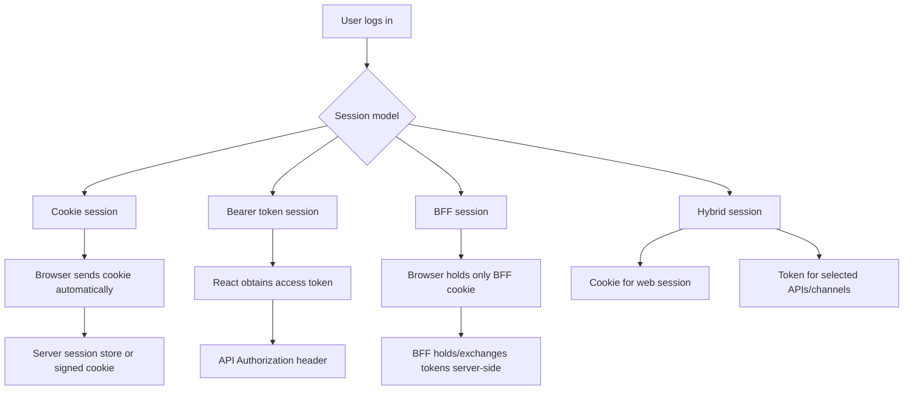
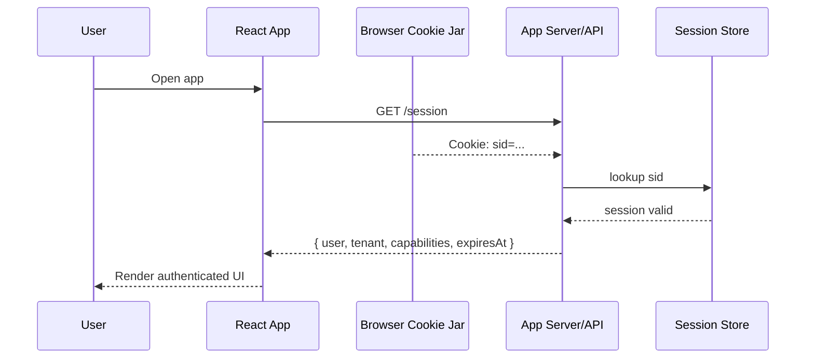
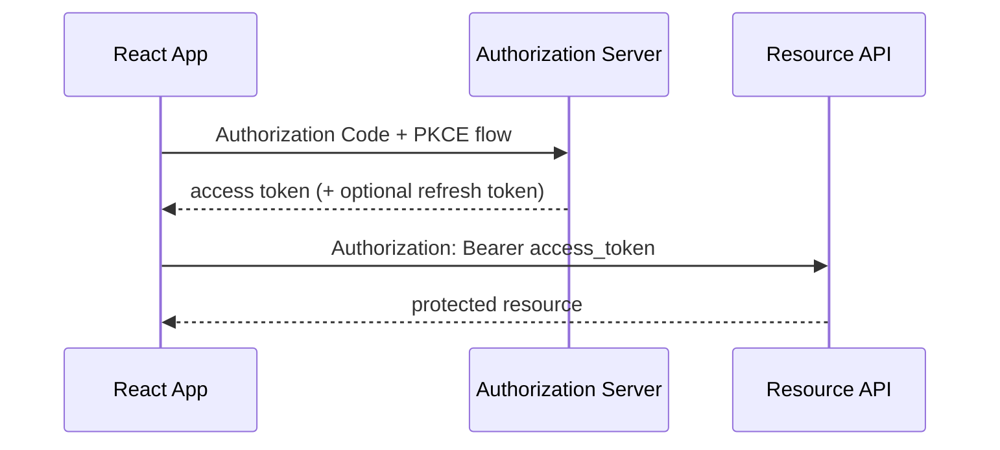
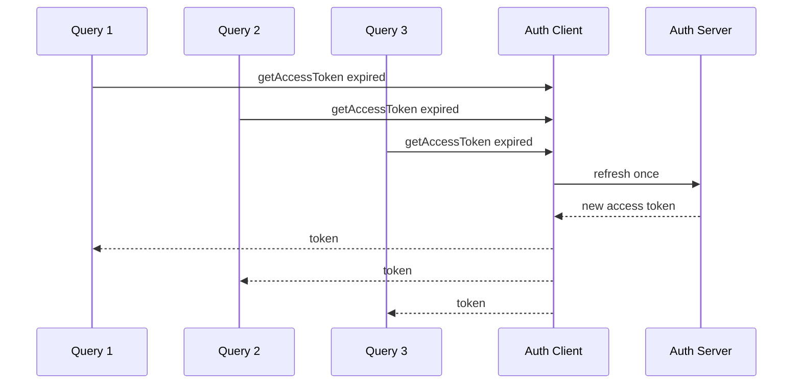
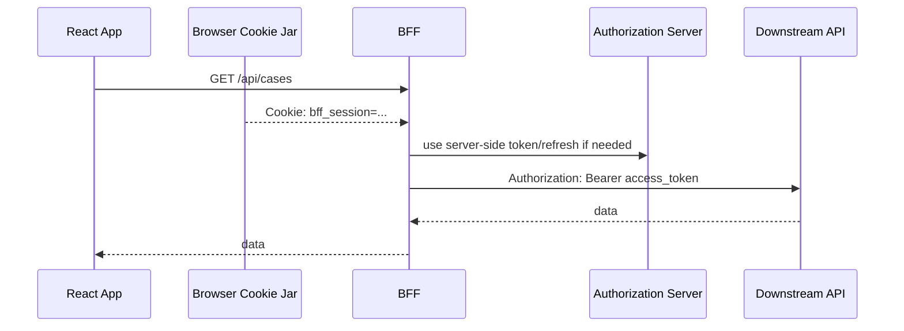
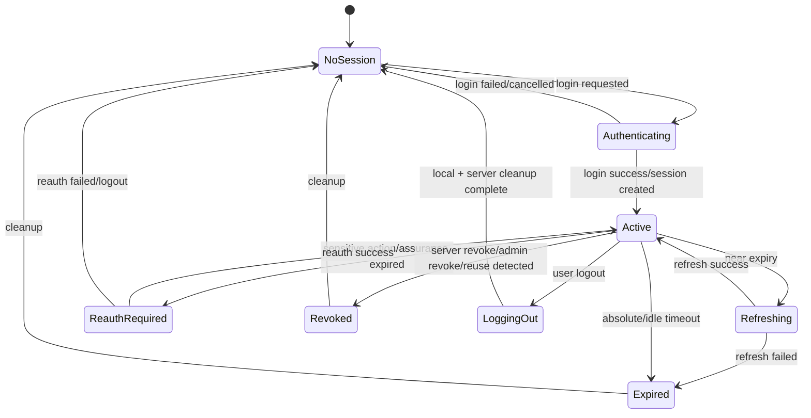

# Session Models for React Apps

Login hanya kejadian sesaat.

Session adalah cara sistem mengingat user setelah login.

Di React app, banyak bug auth muncul bukan karena login form salah, tetapi karena session model tidak pernah dipilih dengan sadar. Tim mengambil satu SDK, menyimpan token, membuat `AuthProvider`, lalu mulai menambal masalah:

- refresh token race;
- logout tidak menyebar ke tab lain;
- user masih melihat menu admin setelah role dicabut;
- API mengembalikan 401 tetapi UI menganggap network error;
- SSR render sebagai anonymous, client hydrate sebagai authenticated;
- cookie tidak terkirim karena SameSite/domain/CORS;
- token bocor ke log, analytics, atau URL;
- permission cache tidak invalid saat tenant switch;
- refresh storm ketika access token expired serentak;
- user dianggap login oleh React state, tapi server sudah revoke session.

Part ini membahas session model sebagai keputusan arsitektur.

Kita tidak mulai dari pertanyaan:

```txt
Pakai localStorage atau cookie?
```

Pertanyaan yang benar:

```txt
Apa bentuk continuity credential kita?
Siapa yang boleh membacanya?
Di boundary mana ia diverifikasi?
Bagaimana ia dirotasi, direvoke, disinkronkan, dan diaudit?
Apa yang React boleh percaya, dan apa yang hanya boleh React tampilkan?
```

---

## 1. Definisi session dalam React app

Session adalah hubungan sementara antara browser instance dan security subject yang sudah diautentikasi.

```txt
Session = authenticated continuity between requests
```

Session bukan:

- `user` object di React context;
- JWT payload yang didecode di client;
- boolean `isAuthenticated`;
- record profile;
- role list;
- item di localStorage;
- cookie semata;
- access token semata.

Hal-hal itu hanya representasi atau mekanisme pendukung.

Session yang sehat punya minimal lima dimensi:

| Dimensi | Pertanyaan |
|---|---|
| Identity binding | Session ini mewakili subject siapa? |
| Transport | Credential dikirim lewat cookie, header, atau BFF exchange? |
| Storage | Credential berada di browser storage, memory, cookie jar, atau server? |
| Lifecycle | Kapan dibuat, di-refresh, direvoke, expired, dan dibersihkan? |
| Authority | Siapa yang memutuskan session valid: frontend, API, BFF, IdP, session store? |

React biasanya hanya bertanggung jawab pada **session view**, bukan session authority.

```txt
Session authority  -> server / IdP / BFF / session store
Session view       -> React representation used for rendering and orchestration
```

Jika React state dianggap authority, maka bug auth akan muncul dalam bentuk:

```tsx
if (auth.user?.role === "admin") {
  return <AdminPanel />;
}
```

Kode itu mungkin berguna untuk UI exposure, tetapi tidak cukup untuk enforcement.

---

## 2. Empat keluarga session model

Untuk React apps, session model production biasanya jatuh ke salah satu dari empat keluarga:

```txt
1. Cookie session
2. Bearer token session
3. Backend-for-Frontend session
4. Hybrid session
```

Tidak ada model yang universal terbaik. Yang ada adalah kesesuaian terhadap threat model, domain topology, API topology, SSR requirement, IdP constraint, compliance, dan kemampuan operasional tim.



---

## 3. Model A: Cookie session

Cookie session adalah model klasik web application.

Browser menyimpan cookie. Cookie dikirim otomatis ke server sesuai domain, path, Secure, SameSite, dan cookie policy. Server memakai cookie itu untuk mencari atau memverifikasi session.



### 3.1 Variants

Cookie session punya beberapa variant:

| Variant | Cara kerja | Catatan |
|---|---|---|
| Server-side session ID | Cookie berisi random session id; data session ada di server store | Mudah revoke; butuh shared/session store |
| Signed cookie | Cookie berisi signed payload | Tidak butuh lookup untuk sebagian kasus; revoke lebih sulit |
| Encrypted cookie | Cookie berisi encrypted payload | Data terlindungi dari client read, tapi size/rotation/revoke tetap isu |
| Split cookie | Cookie terpisah untuk session, CSRF, preference, tenant | Perlu naming dan scoping disiplin |

Untuk aplikasi enterprise/regulatory, server-side session ID sering lebih mudah diaudit dan direvoke.

### 3.2 Cookie attributes minimum

Cookie session production harus diperlakukan sebagai credential. OWASP Session Management merekomendasikan penggunaan atribut seperti `Secure`, `HttpOnly`, dan `SameSite`; OWASP juga menekankan agar session cookie secara eksplisit mengatur SameSite dan tidak bergantung pada default browser.

Contoh header konseptual:

```http
Set-Cookie: __Host-app_session=opaque_random_id; Path=/; Secure; HttpOnly; SameSite=Lax
```

`__Host-` prefix berguna ketika syaratnya dipenuhi: cookie harus `Secure`, tidak boleh punya `Domain`, dan `Path=/`. Ini membantu mengurangi risiko cookie injection dari subdomain.

### 3.3 Kekuatan cookie session

Cookie session bagus ketika:

- React app dan API berada pada same-site atau domain yang bisa dikontrol;
- ingin credential tidak bisa dibaca JavaScript;
- butuh server-side revocation yang kuat;
- butuh SSR/BFF/server-rendering;
- ingin menghindari token berada di localStorage/sessionStorage;
- app dominan web browser, bukan multi-client API ecosystem;
- organisasi mampu mengelola CSRF defense dengan benar.

### 3.4 Kelemahan cookie session

Cookie session bukan otomatis aman. Risiko utamanya bergeser.

| Risiko | Penjelasan | Mitigasi |
|---|---|---|
| CSRF | Browser mengirim cookie otomatis pada request yang memenuhi cookie policy | SameSite, CSRF token, Origin/Referer check, user interaction for sensitive action |
| Subdomain confusion | Cookie domain terlalu luas | Host-only cookie, `__Host-` prefix, domain scoping |
| Cookie not sent | SameSite/domain/CORS salah | Contract test dan environment parity |
| Session fixation | Session id tidak diganti setelah login | Regenerate session after authentication |
| Server store dependency | Session lookup perlu Redis/DB | HA, TTL, eviction policy, observability |
| Logout inconsistency | Cookie clear tapi server session masih valid, atau sebaliknya | Server revoke + client clear + event propagation |

### 3.5 React responsibilities dalam cookie session

Dalam cookie session, React biasanya tidak membaca credential. React melakukan:

```txt
1. Bootstrap session view dari /session atau /me
2. Render berdasarkan session view
3. Menangani 401/403/419 secara typed
4. Meminta server logout endpoint
5. Membersihkan client cache setelah logout
6. Sinkronisasi multi-tab via BroadcastChannel/storage event
7. Revalidate session ketika visibility/focus/navigation tertentu
```

React tidak melakukan:

```txt
1. Membaca session cookie HttpOnly
2. Memverifikasi session ID
3. Menentukan session masih valid berdasarkan state lokal saja
4. Mengotorisasi mutasi hanya dari component guard
```

### 3.6 Minimal React bootstrap

```tsx
export type SessionView =
  | { status: "anonymous" }
  | {
      status: "authenticated";
      user: { id: string; displayName: string };
      tenant: { id: string; name: string };
      capabilities: string[];
      expiresAt: string;
    };

export async function fetchSession(): Promise<SessionView> {
  const res = await fetch("/api/session", {
    method: "GET",
    credentials: "include",
    headers: { Accept: "application/json" },
  });

  if (res.status === 401) return { status: "anonymous" };

  if (!res.ok) {
    throw new Error(`Session bootstrap failed: ${res.status}`);
  }

  return res.json();
}
```

Perhatikan: React tidak membaca cookie. React hanya membaca server-projected session view.

### 3.7 Server contract untuk cookie session

Endpoint session harus mengembalikan state yang cukup untuk UI, tetapi tidak membocorkan credential.

```http
GET /api/session
```

Response authenticated:

```json
{
  "status": "authenticated",
  "user": {
    "id": "usr_123",
    "displayName": "Ari"
  },
  "tenant": {
    "id": "tnt_456",
    "name": "Acme Corp"
  },
  "capabilities": [
    "case:read",
    "case:create",
    "case:assign"
  ],
  "session": {
    "expiresAt": "2026-07-08T11:20:00Z",
    "reauthRequiredAt": null,
    "assuranceLevel": "aal1"
  }
}
```

Response anonymous:

```json
{
  "status": "anonymous"
}
```

Response degraded:

```json
{
  "status": "degraded",
  "reason": "policy_engine_unavailable",
  "safeCapabilities": []
}
```

Jangan kirim:

```txt
- raw session id
- refresh token
- access token yang tidak perlu
- internal role graph mentah
- secret claim
- provider token
```

---

## 4. Model B: Bearer token session

Bearer token session adalah model umum pada SPA yang memanggil API dengan `Authorization: Bearer <access_token>`.



Bearer token berarti siapa pun yang memegang token dapat menggunakannya, kecuali token dibatasi dengan mekanisme tambahan seperti proof-of-possession/sender-constraining.

### 4.1 Token types

| Token | Purpose | Should React use it as? |
|---|---|---|
| Access token | Authorization to call resource server | Credential untuk API, bukan user profile authority |
| ID token | Authentication assertion for client | Bukti login ke client, bukan API credential |
| Refresh token | Obtain new access token | High-value credential, harus diperlakukan sangat sensitif |

Masalah besar muncul ketika semua token diperlakukan sama:

```tsx
// Anti-pattern
const user = JSON.parse(atob(accessToken.split('.')[1]));
const isAdmin = user.role === 'admin';
```

Ini mencampur credential transport, identity projection, dan authorization decision.

### 4.2 Storage options untuk token

| Storage | XSS exposure | Persistence | Operational notes |
|---|---:|---:|---|
| Memory only | Lebih rendah dari localStorage, tapi XSS tetap bisa act-as-user selama runtime | Hilang saat reload | Butuh silent restore/refresh strategy |
| sessionStorage | Terbaca JS | Per tab | Lebih terbatas, tetap XSS-sensitive |
| localStorage | Terbaca JS | Persist across browser restart | Umumnya tidak ideal untuk high-value tokens |
| IndexedDB | Terbaca JS | Persist | Lebih kompleks, tetap JS-accessible |
| HttpOnly cookie | Tidak terbaca JS | Persist sesuai cookie | Lebih cocok untuk session/BFF, perlu CSRF model |

OWASP HTML5 Security secara eksplisit memperingatkan agar data sensitif tidak disimpan di localStorage, dan token session termasuk kategori high-value credential.

### 4.3 Kekuatan bearer token session

Bearer token session cocok ketika:

- API resource server terpisah dari app server;
- arsitektur OAuth/OIDC sudah matang;
- API perlu dipakai oleh banyak client type;
- authorization server menerbitkan access token untuk resource audience tertentu;
- access token pendek umurnya;
- refresh token rotation dan reuse detection tersedia;
- client library menangani PKCE, state, nonce, dan token lifecycle dengan benar.

### 4.4 Kelemahan bearer token session

| Risiko | Penjelasan | Dampak |
|---|---|---|
| XSS token theft | Token di JS-accessible storage bisa dicuri | Account/API compromise sampai token expired/revoked |
| Refresh race | Banyak request mencoba refresh bersamaan | Token reuse false positive atau refresh storm |
| Token overclaiming | JWT berisi terlalu banyak data/role | Stale privilege dan data exposure |
| Revocation delay | Stateless JWT valid sampai expiry | Role revoke tidak segera efektif |
| Audience confusion | Access token untuk API A dipakai ke API B | Confused deputy / improper validation |
| Frontend overtrust | React decode claims untuk authorization | UI dan API drift |

### 4.5 React responsibilities dalam bearer token session

React/Auth client harus:

```txt
1. Menyimpan access token sesingkat mungkin dan seaman mungkin
2. Menambahkan Authorization header hanya ke trusted API origin
3. Menghindari token masuk log, URL, analytics, error report
4. Menangani 401 dengan refresh queue, bukan refresh paralel liar
5. Menangani refresh failure sebagai state transition, bukan random error
6. Menghapus token/cache saat logout atau revocation
7. Memisahkan user profile dari token payload
8. Meminta permission projection dari backend/policy API
```

### 4.6 Minimal token injection boundary

```ts
const TRUSTED_API_ORIGIN = "https://api.example.com";

export async function apiFetch(input: string, init: RequestInit = {}) {
  const url = new URL(input, TRUSTED_API_ORIGIN);

  if (url.origin !== TRUSTED_API_ORIGIN) {
    throw new Error("Refusing to attach token to untrusted origin");
  }

  const token = await authClient.getAccessToken();

  const headers = new Headers(init.headers);
  headers.set("Accept", "application/json");

  if (token) {
    headers.set("Authorization", `Bearer ${token}`);
  }

  return fetch(url, {
    ...init,
    headers,
  });
}
```

Yang penting bukan wrapper-nya. Yang penting adalah token hanya keluar melalui boundary yang dikontrol.

### 4.7 Refresh queue

Tanpa refresh queue, lima request paralel dapat menyebabkan lima refresh request.



Implementation sketch:

```ts
let refreshPromise: Promise<string | null> | null = null;

async function getFreshAccessToken(): Promise<string | null> {
  if (!isExpired(currentAccessToken)) {
    return currentAccessToken.value;
  }

  refreshPromise ??= refreshAccessToken()
    .then((token) => {
      currentAccessToken = token;
      return token.value;
    })
    .finally(() => {
      refreshPromise = null;
    });

  return refreshPromise;
}
```

Pada multi-tab, lock ini harus dinaikkan dari memory lock menjadi cross-tab coordination. Itu dibahas khusus di Part 018.

---

## 5. Model C: Backend-for-Frontend session

BFF session memindahkan token handling dari browser JavaScript ke server yang dikhususkan untuk frontend.

Browser memegang cookie session ke BFF. BFF memegang atau menukar token server-side untuk memanggil downstream API.



### 5.1 Kekuatan BFF

BFF kuat karena:

- access token tidak berada di JavaScript runtime;
- refresh token tidak berada di browser storage;
- browser hanya berinteraksi dengan same-site BFF;
- CORS complexity berkurang;
- SSR dan data loading lebih natural;
- policy projection bisa disatukan di server boundary;
- audit dan request correlation lebih kuat;
- downstream token exchange bisa dikendalikan server-side.

### 5.2 Kelemahan BFF

BFF bukan gratis.

| Cost | Penjelasan |
|---|---|
| Infrastructure | Perlu server/proxy layer tambahan |
| Latency | Tambahan hop jika tidak didesain baik |
| Scaling | Session store/token cache harus highly available |
| Coupling | Frontend dan BFF contract harus dijaga |
| CSRF | Cookie ke BFF tetap butuh CSRF model |
| Complexity | Downstream API errors harus dipetakan dengan benar ke UI |

### 5.3 BFF contract yang sehat

BFF tidak seharusnya menjadi dumb proxy total. Ia adalah security adapter untuk frontend.

Tanggung jawab BFF:

```txt
1. Authenticate browser session
2. Attach downstream API tokens server-side
3. Enforce coarse app/session policy
4. Normalize auth errors for React
5. Project safe session/permission view
6. Avoid leaking downstream token to browser
7. Provide audit/correlation ID
8. Handle logout/revocation/token refresh server-side
```

Tanggung jawab React:

```txt
1. Call same-origin BFF endpoints
2. Bootstrap session from BFF
3. Render according to projected capabilities
4. Handle typed auth failures
5. Clear client caches on logout/session change
6. Never expect downstream API token
```

### 5.4 BFF session state

Server-side BFF state bisa berisi:

```json
{
  "sessionId": "sid_opaque",
  "subjectId": "usr_123",
  "tenantId": "tnt_456",
  "idpSessionId": "idp_sid_abc",
  "accessTokens": {
    "case-api": {
      "ciphertext": "...",
      "expiresAt": "2026-07-08T11:00:00Z"
    }
  },
  "refreshTokenRef": "vault_ref_789",
  "createdAt": "2026-07-08T10:00:00Z",
  "lastSeenAt": "2026-07-08T10:30:00Z",
  "revokedAt": null
}
```

React hanya melihat projection:

```json
{
  "status": "authenticated",
  "user": { "id": "usr_123", "displayName": "Ari" },
  "tenant": { "id": "tnt_456", "name": "Acme" },
  "capabilities": ["case:read", "case:update"],
  "session": {
    "expiresAt": "2026-07-08T18:00:00+07:00",
    "reauthRequired": false
  }
}
```

---

## 6. Model D: Hybrid session

Hybrid session menggabungkan lebih dari satu mekanisme.

Contoh:

```txt
- HttpOnly cookie untuk web app session
- Short-lived access token in memory untuk WebSocket handshake
- Signed URL untuk file download
- ID token hanya untuk initial login assertion
- BFF token exchange untuk downstream APIs
```

Hybrid sering muncul di sistem nyata karena kebutuhan tidak homogen.

### 6.1 Hybrid yang sehat

Hybrid sehat jika setiap credential punya purpose jelas:

| Credential | Purpose | Scope | Lifetime | Reader |
|---|---|---|---|---|
| `app_session` cookie | Web session to BFF | app.example.com | 8h idle/absolute | Browser cookie jar + BFF |
| API access token | Downstream API call | case-api | 5m | BFF only |
| WebSocket ticket | Channel connect | one channel | 60s | Browser JS temporarily |
| Signed file URL | Download one file | one object | 2m | Browser navigation/fetch |
| CSRF token | Mutating request protection | BFF | session-bound | Browser JS/meta/cookie pattern |

### 6.2 Hybrid yang buruk

Hybrid buruk jika semua mekanisme saling tumpang tindih:

```txt
- cookie session ada
- access token juga disimpan localStorage
- React decode JWT untuk role
- API percaya cookie di beberapa endpoint dan bearer di endpoint lain
- logout hanya clear localStorage
- refresh token ada di browser dan server
- permission dari /me beda dari token claim
```

Ini bukan hybrid architecture. Ini inconsistent architecture.

### 6.3 Rule untuk hybrid

```txt
One credential, one purpose, one owner, one lifecycle.
```

Jika satu credential dipakai untuk semua hal, blast radius melebar.

Jika satu purpose ditangani banyak credential, state drift muncul.

---

## 7. Session lifecycle

Session model apa pun harus menjawab lifecycle berikut:



### 7.1 Creation

Session creation terjadi setelah authentication berhasil.

Rules:

```txt
1. Generate/regenerate session identifier after authentication
2. Bind session to subject and tenant/org context if applicable
3. Store minimal security state server-side
4. Set cookie/token with constrained scope and lifetime
5. Audit session creation
```

### 7.2 Bootstrap

Bootstrap adalah proses React mengetahui session view awal.

```txt
App loaded -> fetch /session -> choose render state
```

Jangan langsung menganggap anonymous sebelum bootstrap selesai.

```tsx
type AuthBootstrapState =
  | { status: "checking" }
  | { status: "anonymous" }
  | { status: "authenticated"; session: SessionView }
  | { status: "degraded"; reason: string };
```

Render policy:

| Bootstrap state | UI behavior |
|---|---|
| checking | App shell minimal / skeleton, no sensitive data |
| anonymous | Public routes, login CTA |
| authenticated | Authorized app shell |
| degraded | Safe fallback, no privileged actions |

### 7.3 Refresh

Refresh strategy berbeda per model.

| Model | Refresh actor | Notes |
|---|---|---|
| Cookie server session | Server extends session on activity or explicit refresh | Beware sliding session without absolute timeout |
| Bearer token | Browser auth client requests new access token | Needs refresh queue and rotation safety |
| BFF | BFF refreshes downstream token server-side | Browser only sees session still valid/expired |
| Hybrid | Multiple actors | Needs clear ownership per credential |

### 7.4 Revocation

Revocation harus punya path eksplisit.

Revocation sources:

```txt
- user logout
- admin force logout
- password reset
- MFA reset
- suspicious activity
- refresh token reuse detection
- role/tenant membership removal
- account disabled
- device/session removal
- IdP session revoked
```

React harus bisa menerima sinyal revocation:

```txt
1. API returns typed 401 session_revoked
2. /session returns anonymous/revoked
3. SSE/WebSocket event tells session revoked
4. BroadcastChannel from another tab after logout
5. Focus/revalidation detects revoked session
```

### 7.5 Expiry

Expiry bukan cuma `exp` claim.

Jenis expiry:

| Expiry | Meaning |
|---|---|
| Access token expiry | API credential no longer accepted |
| Refresh token expiry | Cannot obtain new access token |
| Idle timeout | No activity for duration |
| Absolute timeout | Session max age reached |
| Reauth timeout | Sensitive operation requires new authentication |
| Permission cache TTL | Capability projection must be refreshed |
| Signed URL expiry | One object access no longer valid |

---

## 8. Session view vs permission view

Session menjawab:

```txt
Siapa user ini dan apakah continuity masih valid?
```

Permission view menjawab:

```txt
Apa yang user boleh lakukan terhadap resource/context tertentu?
```

Jangan gabungkan semua menjadi satu `User` object besar.

Bad shape:

```ts
type User = {
  id: string;
  name: string;
  role: "admin" | "manager" | "agent";
  token: string;
  permissions: string[];
  tenantId: string;
  isLoggedIn: boolean;
};
```

Better shape:

```ts
type SessionView = {
  status: "authenticated";
  subject: SubjectRef;
  tenant: TenantRef;
  assurance: AssuranceState;
  expiresAt: string;
};

type PermissionView = {
  version: string;
  subjectId: string;
  tenantId: string;
  globalCapabilities: string[];
  resourceHints?: Record<string, string[]>;
  expiresAt: string;
};
```

Separation ini penting karena session mungkin masih valid, tetapi permission berubah.

Contoh:

```txt
10:00 User login as Case Officer
10:20 Admin revokes approve permission
10:21 Session remains active
10:21 Permission view must be invalidated/refetched
```

Jika permission disimpan hanya dalam token claim dengan umur 1 jam, user bisa melihat UI approve selama 40 menit berikutnya. API harus tetap menolak, tetapi UX dan security expectation menjadi buruk.

---

## 9. Domain topology matters

Session model sangat dipengaruhi domain topology.

### 9.1 Same-origin

```txt
https://app.example.com
https://app.example.com/api
```

Biasanya paling sederhana untuk cookie/BFF.

### 9.2 Same-site subdomain

```txt
https://app.example.com
https://api.example.com
```

Masih satu site, tetapi cookie domain, CORS, SameSite, dan CSRF harus dipikirkan.

### 9.3 Cross-site

```txt
https://app.example.com
https://api.vendor-api.com
```

Cookie menjadi lebih sulit. Bearer token atau BFF proxy sering lebih cocok.

### 9.4 Multi-tenant custom domain

```txt
https://acme.yourapp.com
https://globex.yourapp.com
https://cases.acme.com
```

Session model harus menjawab:

```txt
- Apakah session cross-tenant atau tenant-scoped?
- Apakah tenant switch membutuhkan revalidation?
- Bagaimana cookie domain diset?
- Bagaimana mencegah tenant confusion?
- Apakah custom domain bisa set cookie yang sama?
```

Untuk regulated SaaS, tenant context sebaiknya menjadi bagian eksplisit dari server-side session dan authorization request.

---

## 10. API topology matters

### 10.1 Single backend

```txt
React -> App API
```

Cookie/BFF mudah.

### 10.2 Multiple backend APIs

```txt
React -> Case API
React -> User API
React -> Billing API
React -> File API
```

Bearer token atau BFF token exchange perlu audience/scope jelas.

### 10.3 Microservices behind gateway

```txt
React -> Gateway/BFF -> services
```

Frontend sebaiknya tidak tahu semua service token. Gateway/BFF memproyeksikan capability contract.

### 10.4 Direct third-party API

```txt
React -> Third-party API
```

Jika access token harus berada di browser, risk assessment harus eksplisit. Pertimbangkan broker/BFF jika token bernilai tinggi.

---

## 11. Failure modes by model

### 11.1 Cookie session failure modes

| Failure | Symptom | Root cause | Safe UI response |
|---|---|---|---|
| Cookie missing | `/session` returns 401 | expired, cleared, wrong domain | anonymous/login |
| Cookie not sent cross-site | Works local, fails prod | SameSite/CORS/domain | typed config error + telemetry |
| CSRF rejected | Mutation returns 403/419 | missing token/origin mismatch | reload CSRF/session, show safe error |
| Session store unavailable | `/session` 503 | Redis/DB outage | degraded state, avoid destructive actions |
| Revoked session | API returns `session_revoked` | admin/security action | force logout, clear cache |

### 11.2 Bearer token failure modes

| Failure | Symptom | Root cause | Safe UI response |
|---|---|---|---|
| Access token expired | API 401 | normal expiry | refresh once, replay safe requests |
| Refresh token expired | refresh fails | session ended | logout/login |
| Refresh token reuse | refresh fails with security signal | race or theft | revoke session, audit, logout all tabs |
| Audience mismatch | API 401/403 | wrong token for API | bug report, no retry loop |
| Token missing | API 401 | bootstrap lost memory token | restore/relogin |

### 11.3 BFF failure modes

| Failure | Symptom | Root cause | Safe UI response |
|---|---|---|---|
| BFF session expired | `/session` 401 | idle/absolute timeout | login |
| Downstream token refresh fails | API via BFF returns 401 mapped | IdP/token issue | reauth or degraded |
| BFF/API mapping bug | UI gets wrong 403/500 | adapter bug | typed error + correlation ID |
| CSRF rejected | mutation fails | missing/invalid CSRF | refresh page/session, do not retry destructive blindly |

---

## 12. Decision matrix

| Constraint | Cookie session | Bearer token | BFF session | Hybrid |
|---|---:|---:|---:|---:|
| Token hidden from JS | High | Low/Medium | High | Depends |
| CSRF complexity | Medium/High | Low/Medium | Medium/High | Depends |
| XSS credential theft risk | Lower for HttpOnly cookie | Higher if JS-readable token | Lower for downstream tokens | Depends |
| SSR/RSC friendly | High | Medium | High | High |
| Multi-API ecosystem | Medium | High | High via BFF | High |
| Mobile/native reuse | Low | High | Medium | High |
| Revocation control | High with server store | Medium unless introspection/short TTL | High | Depends |
| Operational simplicity | Medium | Medium initially, hard later | Medium/High | Low if unmanaged |
| CORS complexity | Low same-origin | Medium/High | Low if same-origin BFF | Depends |
| Enterprise compliance | High | Depends | High | High if disciplined |

---

## 13. Recommended architecture by scenario

### 13.1 Internal admin dashboard

Recommended:

```txt
BFF session or cookie session
```

Reasons:

- browser-only app;
- sensitive admin actions;
- revocation matters;
- audit matters;
- server-side policy projection useful;
- no need to expose API tokens to JavaScript.

### 13.2 Public consumer SPA with separate API

Recommended:

```txt
Authorization Code + PKCE with short-lived access token,
ideally memory storage, refresh token rotation if issued,
or BFF if risk and budget justify it.
```

Reasons:

- OAuth/OIDC provider integration common;
- API may be cross-origin;
- UX may need reload resilience;
- threat model must explicitly address XSS and refresh rotation.

### 13.3 Enterprise SaaS with SSO and tenant isolation

Recommended:

```txt
BFF or server-side session + policy projection
```

Reasons:

- SSO complexity;
- tenant context;
- org membership changes;
- audit and admin actions;
- permission invalidation;
- step-up authentication.

### 13.4 Regulated case management platform

Recommended:

```txt
BFF + server-side session store + policy engine projection + typed audit events
```

Reasons:

- object-level authorization;
- state-based permission;
- escalation workflows;
- defensibility;
- user journey reconstruction;
- no stale privilege tolerance for critical actions.

### 13.5 Static marketing app with simple account area

Recommended:

```txt
Hosted auth provider SDK or cookie/BFF depending on account sensitivity
```

Reasons:

- lower app complexity;
- outsourcing auth operations may be reasonable;
- still avoid frontend-only enforcement.

---

## 14. Session model smell catalog

### Smell 1: React boolean as session authority

```tsx
if (localStorage.getItem("token")) {
  setIsAuthenticated(true);
}
```

Masalah:

- token mungkin expired;
- token mungkin revoked;
- token mungkin milik tenant lama;
- token mungkin corrupt;
- backend mungkin tidak menerima.

Better:

```txt
Bootstrap from server/auth client and verify current session state.
```

### Smell 2: Token payload drives navigation

```tsx
const role = decodeJwt(token).role;
return role === "admin" ? <AdminRoutes /> : <UserRoutes />;
```

Masalah:

- claim stale;
- role bukan permission;
- decode bukan validation;
- API tetap harus enforce;
- tenant context bisa salah.

Better:

```txt
Use server-projected capabilities and revalidate on changes.
```

### Smell 3: Logout only clears localStorage

```ts
localStorage.removeItem("access_token");
```

Masalah:

- refresh token/server session mungkin masih valid;
- tab lain tetap authenticated;
- server tidak audit logout;
- BFF cookie mungkin masih ada.

Better:

```txt
Call logout endpoint, revoke server-side state, clear client cache, broadcast logout.
```

### Smell 4: Cookie session without CSRF model

Cookie HttpOnly melindungi dari JavaScript read. Ia tidak otomatis melindungi dari browser sending cookie on unwanted request.

Better:

```txt
SameSite + CSRF token/origin check for mutating operations.
```

### Smell 5: Refresh logic in every API call

Jika setiap request punya logic refresh sendiri, race dan retry storm tinggal menunggu waktu.

Better:

```txt
Central auth client with single-flight refresh and typed failure handling.
```

---

## 15. Implementation blueprint

Blueprint ini framework-agnostic. Bisa dipakai di Vite SPA, React Router, Next.js client boundary, atau app dengan BFF.

```txt
src/auth/
  auth-client.ts
  auth-state.ts
  session-api.ts
  permission-api.ts
  auth-events.ts
  auth-errors.ts
  AuthProvider.tsx
  useSession.ts
  useCan.ts
  logout.ts
```

### 15.1 Auth state

```ts
export type AuthState =
  | { kind: "unknown" }
  | { kind: "anonymous" }
  | { kind: "authenticated"; session: SessionView; permissions: PermissionView }
  | { kind: "refreshing"; previous: SessionView }
  | { kind: "reauth-required"; session: SessionView; reason: string }
  | { kind: "expired"; reason: string }
  | { kind: "revoked"; reason: string }
  | { kind: "degraded"; reason: string };
```

### 15.2 Session API

```ts
export interface SessionApi {
  bootstrap(): Promise<SessionBootstrapResult>;
  refresh?(): Promise<SessionBootstrapResult>;
  logout(): Promise<void>;
}
```

Cookie/BFF implementation:

```ts
export const cookieSessionApi: SessionApi = {
  async bootstrap() {
    const res = await fetch("/api/session", { credentials: "include" });
    return parseSessionResponse(res);
  },

  async logout() {
    await fetch("/api/logout", {
      method: "POST",
      credentials: "include",
      headers: { "X-CSRF-Token": getCsrfToken() },
    });
  },
};
```

Bearer token implementation:

```ts
export const tokenSessionApi: SessionApi = {
  async bootstrap() {
    const token = await tokenStore.restore();
    if (!token) return { kind: "anonymous" };

    const session = await fetchSessionWithBearer(token);
    return { kind: "authenticated", session };
  },

  async refresh() {
    const token = await tokenClient.refreshSingleFlight();
    const session = await fetchSessionWithBearer(token);
    return { kind: "authenticated", session };
  },

  async logout() {
    await tokenClient.revokeIfPossible();
    tokenStore.clear();
  },
};
```

### 15.3 AuthProvider rule

`AuthProvider` boleh mengorkestrasi state, tetapi jangan membuat policy decision yang tidak bisa diverifikasi backend.

```tsx
export function AuthProvider({ children }: { children: React.ReactNode }) {
  const [state, setState] = React.useState<AuthState>({ kind: "unknown" });

  React.useEffect(() => {
    let cancelled = false;

    sessionApi.bootstrap().then(
      (result) => {
        if (!cancelled) setState(toAuthState(result));
      },
      (error) => {
        if (!cancelled) setState(toDegradedState(error));
      }
    );

    return () => {
      cancelled = true;
    };
  }, []);

  return <AuthContext.Provider value={state}>{children}</AuthContext.Provider>;
}
```

---

## 16. Session testing matrix

Minimal matrix:

| Case | Expected |
|---|---|
| No credential | anonymous |
| Valid credential | authenticated |
| Expired access token + valid refresh | authenticated after refresh |
| Expired refresh | anonymous/expired |
| Revoked server session | revoked then logout |
| Cookie missing due domain | anonymous + telemetry |
| Permission changed mid-session | permission revalidated |
| Logout in tab A | tab B becomes anonymous |
| API 401 during mutation | no silent destructive replay unless safe |
| API 403 | no login redirect; show no-access/request-access |
| Session store outage | degraded, no privileged actions |

Testing must include not just happy path login, but transitions.

---

## 17. Production readiness checklist

Sebuah session model belum production-ready sebelum jawaban berikut jelas:

```txt
[ ] Di mana continuity credential berada?
[ ] Apakah JavaScript bisa membacanya?
[ ] Jika credential bocor, berapa blast radius dan lifetime?
[ ] Bagaimana session dibuat dan diregenerasi setelah login?
[ ] Bagaimana refresh dilakukan tanpa race?
[ ] Bagaimana logout membersihkan server state dan client state?
[ ] Bagaimana revocation dikirim ke React?
[ ] Bagaimana permission invalidated tanpa logout?
[ ] Bagaimana multi-tab disinkronkan?
[ ] Bagaimana 401, 403, 419, dan degraded dibedakan?
[ ] Bagaimana cookie attributes dikonfigurasi per environment?
[ ] Bagaimana token tidak bocor ke log/URL/analytics?
[ ] Bagaimana session events diaudit?
[ ] Bagaimana incident forced logout dilakukan?
```

---

## 18. Mental model final

Session model bukan pilihan library.

Session model adalah jawaban terhadap empat pertanyaan:

```txt
1. What proves continuity?
2. Who can read that proof?
3. Who validates that proof?
4. How does that proof die?
```

React auth yang matang tidak mencoba membuat browser menjadi security authority. React membangun **safe session view** untuk rendering dan orchestration, sementara server/BFF/IdP/session store memegang authority.

Jika hanya mengingat satu hal dari part ini, ingat ini:

```txt
React may remember the session view.
React must not become the session authority.
```

---

## References

- OWASP Session Management Cheat Sheet: https://cheatsheetseries.owasp.org/cheatsheets/Session_Management_Cheat_Sheet.html
- OWASP HTML5 Security Cheat Sheet: https://cheatsheetseries.owasp.org/cheatsheets/HTML5_Security_Cheat_Sheet.html
- OWASP Cross-Site Request Forgery Prevention Cheat Sheet: https://cheatsheetseries.owasp.org/cheatsheets/Cross-Site_Request_Forgery_Prevention_Cheat_Sheet.html
- RFC 9700, Best Current Practice for OAuth 2.0 Security: https://www.rfc-editor.org/info/rfc9700
- OAuth 2.0 for Browser-Based Applications draft: https://datatracker.ietf.org/doc/html/draft-ietf-oauth-browser-based-apps
- MDN Set-Cookie Header: https://developer.mozilla.org/en-US/docs/Web/HTTP/Reference/Headers/Set-Cookie
