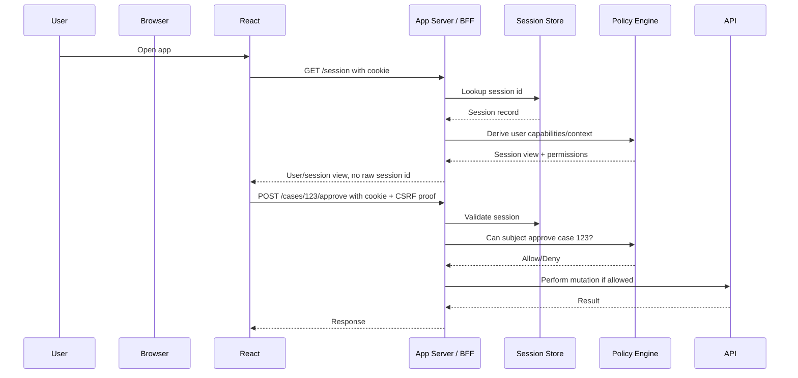
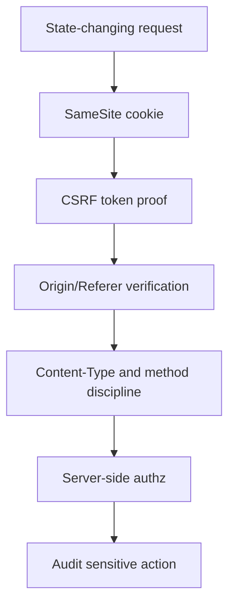
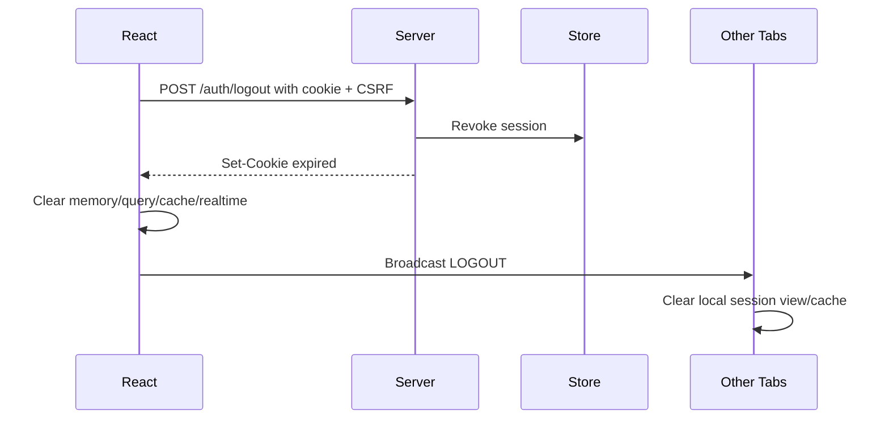
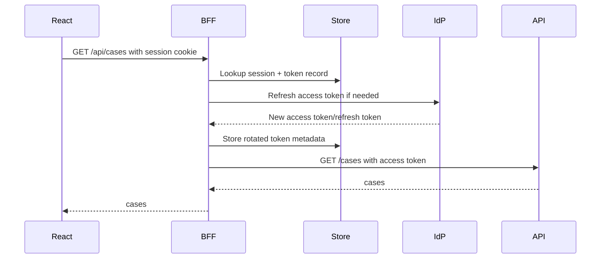

# HTTP-only Cookie Auth

HTTP-only cookie auth adalah salah satu pola paling kuat untuk React app yang butuh security, revocation, auditability, dan operational control.

Tetapi pola ini sering salah dipahami.

Kalimat yang benar:

```txt
HttpOnly cookie can prevent normal JavaScript from reading the session credential.
```

Kalimat yang salah:

```txt
HttpOnly cookie makes the app secure.
```

HttpOnly bukan sistem auth.
HttpOnly bukan CSRF defense lengkap.
HttpOnly bukan authorization.
HttpOnly bukan session lifecycle.
HttpOnly bukan revocation policy.

HttpOnly hanyalah satu atribut cookie yang memperbaiki satu boundary:

```txt
JavaScript tidak bisa membaca cookie value melalui document.cookie.
```

Part ini membangun desain cookie auth yang benar untuk React apps.

---

## 1. Mental model

Dalam HTTP-only cookie auth, React tidak memegang credential utama.



The browser stores the session cookie.
React reads a **session view**, not the session credential.
Server remains the authority.

```txt
Cookie = transport/session handle
/session = session view
/permissions = capability view
API/server = enforcement boundary
React = exposure and orchestration layer
```

---

## 2. What the cookie should contain

For high-value apps, prefer an **opaque session id** in the cookie.

```http
Set-Cookie: __Host-session=sid_7fj29...; Path=/; Secure; HttpOnly; SameSite=Lax
```

The server maps session id to server-side record:

```txt
session_id -> {
  user_id,
  account_id,
  tenant_memberships,
  authentication_time,
  mfa_level,
  issued_at,
  idle_expires_at,
  absolute_expires_at,
  revoked_at,
  device_id,
  risk_flags,
  current_refresh_token_family,
  last_seen_at
}
```

This gives you:

```txt
- revocation,
- idle timeout,
- absolute timeout,
- device/session list,
- suspicious session detection,
- forced logout,
- auditability,
- permission re-evaluation,
- tenant scoping.
```

### 2.1 Why opaque session id beats stuffing everything into cookie

Avoid putting large auth state directly in cookie:

```txt
- roles,
- permissions,
- tenant list,
- feature access,
- PII,
- internal risk state,
- workflow state.
```

Reasons:

```txt
1. Cookie is sent on matching requests, increasing request size.
2. Claims become stale unless refreshed carefully.
3. Revocation is harder if server does not keep state.
4. Sensitive data can leak through logs/proxies if mishandled.
5. Authorization still must be checked server-side.
6. Cookie size limits become operational constraint.
```

A signed/encrypted cookie can be valid for some architectures, but it trades server lookup for stale-state and revocation complexity. For regulatory or enterprise authorization, opaque server-side session is usually easier to reason about.

---

## 3. Cookie attributes baseline

A production session cookie baseline:

```http
Set-Cookie: __Host-session=<opaque-session-id>; Path=/; Secure; HttpOnly; SameSite=Lax; Max-Age=1800
```

For persistent “remember this device” style sessions, do not simply make the main session cookie long-lived. Use a separate, carefully rotated, server-side remembered-device/session-renewal mechanism.

### 3.1 `HttpOnly`

`HttpOnly` prevents normal JavaScript access:

```ts
// Cookie with HttpOnly will not be visible here.
console.log(document.cookie);
```

Benefit:

```txt
XSS cannot trivially read and exfiltrate the session id as a string.
```

Limit:

```txt
XSS can still perform actions through the authenticated browser.
```

If attacker can run JavaScript in your origin, they can call:

```ts
fetch("/api/admin/users/123/disable", {
  method: "POST",
  credentials: "include",
  headers: {
    "Content-Type": "application/json",
    "X-CSRF-Token": await csrfTokenProvider.get()
  },
  body: JSON.stringify({ reason: "compromised" })
});
```

Therefore:

```txt
HttpOnly reduces credential theft.
It does not remove the need for XSS prevention and action-level authorization.
```

### 3.2 `Secure`

`Secure` means cookie is sent only over HTTPS, with special localhost behavior in modern browsers.

```http
Set-Cookie: __Host-session=abc; Secure; HttpOnly; Path=/; SameSite=Lax
```

Without `Secure`, session cookie can be exposed over plaintext HTTP in certain configurations.

Baseline:

```txt
Session cookies must be Secure outside local development.
```

### 3.3 `SameSite`

`SameSite` controls whether cookies are sent with cross-site requests.

Common values:

| Value | Behavior | Typical use |
|---|---|---|
| `Strict` | Most restrictive; cookie generally not sent on cross-site navigation | High-security apps with limited external entry flows |
| `Lax` | Sent on same-site requests and some top-level navigations | Common default for first-party web apps |
| `None` | Sent in cross-site contexts, requires `Secure` | Embedded/third-party/cross-site flows |

`SameSite` helps reduce CSRF, but it is not a universal replacement for CSRF tokens or origin checks.

### 3.4 `Path`

`Path` limits which request paths receive the cookie.

For `__Host-` cookies, `Path=/` is required.

Path scoping is not a strong security boundary by itself, because any application running on the same origin can often trigger requests to paths on that origin. But it is still useful for reducing accidental cookie transmission.

### 3.5 `Domain`

Avoid broad Domain unless required.

Bad for high-value session cookies:

```http
Set-Cookie: session=abc; Domain=.example.com; Path=/; Secure; HttpOnly; SameSite=Lax
```

This shares cookie across subdomains.

If `legacy.example.com`, `blog.example.com`, or `preview.example.com` are weaker, the session blast radius increases.

Prefer host-only cookie:

```http
Set-Cookie: __Host-session=abc; Path=/; Secure; HttpOnly; SameSite=Lax
```

No `Domain` attribute.

### 3.6 `Max-Age` and `Expires`

Use explicit lifetime semantics:

```http
Set-Cookie: __Host-session=abc; Path=/; Secure; HttpOnly; SameSite=Lax; Max-Age=1800
```

But remember:

```txt
Cookie expiry is client-side storage behavior.
Server session expiry is authoritative.
```

Server must reject expired session even if browser still sends cookie.

---

## 4. Cookie prefix strategy

For session cookies, prefer `__Host-` where possible.

```http
Set-Cookie: __Host-session=<sid>; Path=/; Secure; HttpOnly; SameSite=Lax
```

Why this is useful:

```txt
- no Domain attribute allowed,
- host-only binding,
- requires Secure,
- requires Path=/,
- reduces subdomain cookie injection risk.
```

Modern cookie specs and MDN also describe `__Http-` and `__Host-Http-` style prefixes, where supported semantics prove cookie was set with `Set-Cookie` and `HttpOnly`. Browser support and deployment details should be checked before relying on newer prefixes as hard requirements. `__Host-` remains a widely recognized baseline for host-bound secure cookies.

---

## 5. Basic server flow

### 5.1 Login

```mermaid
sequenceDiagram
    participant React
    participant Server
    participant IdP
    participant Store

    React->>Server: POST /auth/login or start OIDC flow
    Server->>IdP: Verify credentials / exchange code
    IdP-->>Server: Identity assertion / tokens
    Server->>Store: Create session record
    Store-->>Server: session id
    Server-->>React: Set-Cookie: __Host-session=...; HttpOnly
    React->>Server: GET /session
    Server-->>React: session view
```

Example Express-like pseudocode:

```ts
app.post("/auth/login", async (req, res) => {
  const result = await authenticate(req.body);

  if (!result.ok) {
    await audit("login.failed", { reason: result.reason });
    return res.status(401).json({ code: "INVALID_CREDENTIALS" });
  }

  const session = await sessionStore.create({
    userId: result.user.id,
    authTime: new Date(),
    mfaLevel: result.mfaLevel,
    userAgent: req.get("user-agent"),
    ipHash: hashIp(req.ip),
    idleExpiresAt: minutesFromNow(30),
    absoluteExpiresAt: hoursFromNow(12)
  });

  res.cookie("__Host-session", session.id, {
    httpOnly: true,
    secure: true,
    sameSite: "lax",
    path: "/",
    maxAge: 30 * 60 * 1000
  });

  await audit("login.succeeded", { userId: result.user.id, sessionId: session.id });

  res.status(204).end();
});
```

### 5.2 Session bootstrap

React should not decode cookie.

React should ask server:

```ts
export async function fetchSession(): Promise<SessionView> {
  const response = await fetch("/session", {
    method: "GET",
    credentials: "include",
    headers: { "Accept": "application/json" }
  });

  if (response.status === 401) {
    return { status: "anonymous" };
  }

  if (!response.ok) {
    throw new Error("Failed to fetch session");
  }

  return response.json();
}
```

Session response should be a view:

```json
{
  "status": "authenticated",
  "user": {
    "id": "usr_123",
    "displayName": "Ari",
    "email": "ari@example.com"
  },
  "tenant": {
    "id": "tenant_456",
    "name": "Acme Regulated Ops"
  },
  "assurance": {
    "mfa": true,
    "level": "aal2"
  },
  "expiresAt": "2026-07-08T10:30:00.000Z",
  "permissionsVersion": "perm_v19"
}
```

Do not return:

```json
{
  "sessionId": "sid_secret",
  "refreshToken": "rt_secret",
  "allInternalRiskFlags": ["..."],
  "allTenantsIncludingSuspended": ["..."]
}
```

### 5.3 Authenticated API call

```ts
await fetch("/api/cases/123", {
  credentials: "include",
  headers: { "Accept": "application/json" }
});
```

For mutations:

```ts
await fetch("/api/cases/123/approve", {
  method: "POST",
  credentials: "include",
  headers: {
    "Content-Type": "application/json",
    "X-CSRF-Token": csrfToken
  },
  body: JSON.stringify({ comment: "Reviewed and approved." })
});
```

---

## 6. CSRF defense is not optional

Cookie auth changes dominant risk.

With bearer token in Authorization header:

```txt
Browser does not automatically attach token to cross-site form/image/script request.
```

With cookie auth:

```txt
Browser may automatically attach cookie to matching requests.
```

Therefore state-changing endpoints need CSRF defense.

### 6.1 Defense layers

Use layers, not one trick.



### 6.2 SameSite

Set `SameSite=Lax` or `Strict` where possible.

```http
Set-Cookie: __Host-session=<sid>; Path=/; Secure; HttpOnly; SameSite=Lax
```

`Lax` is often a pragmatic default for first-party web apps.

`Strict` can break flows where user arrives from external links and expects to remain logged in on initial navigation.

`None` should be reserved for cross-site/embedded use cases and must use `Secure`.

### 6.3 CSRF token pattern

A common pattern:

1. Server issues HttpOnly session cookie.
2. Server also exposes a CSRF token endpoint or non-HttpOnly CSRF cookie.
3. React reads CSRF token and sends it in a custom header for unsafe methods.
4. Server validates token is bound to session-specific data.

Example:

```ts
async function csrfFetch(input: RequestInfo, init: RequestInit = {}) {
  const method = (init.method ?? "GET").toUpperCase();
  const headers = new Headers(init.headers);

  if (!["GET", "HEAD", "OPTIONS"].includes(method)) {
    headers.set("X-CSRF-Token", await csrfTokenProvider.get());
  }

  return fetch(input, {
    ...init,
    credentials: "include",
    headers
  });
}
```

Server validation must be real. Do not merely check that header exists.

Bad:

```ts
if (!req.header("X-CSRF-Token")) {
  return res.status(403).end();
}
```

Better:

```ts
const valid = await csrf.verify({
  sessionId: req.session.id,
  token: req.header("X-CSRF-Token"),
  method: req.method,
  path: req.path
});

if (!valid) {
  await audit("csrf.rejected", {
    sessionId: req.session.id,
    path: req.path,
    method: req.method
  });

  return res.status(403).json({ code: "CSRF_INVALID" });
}
```

OWASP recommends binding CSRF tokens to session-specific data; HMAC-based signed double-submit is preferred over naive double-submit when using that pattern.

### 6.4 Origin and Referer verification

For state-changing requests, validate `Origin` where available:

```ts
function verifyOrigin(req: Request): boolean {
  const origin = req.headers.get("origin");

  if (!origin) {
    // Depending on endpoint and browser/client support, either reject
    // or fall back to Referer verification with caution.
    return false;
  }

  return origin === "https://app.example.com";
}
```

This is useful defense-in-depth.

Do not rely on CORS alone as CSRF defense.

CORS controls whether a browser exposes response to a cross-origin script. It does not by itself mean an unwanted state-changing request was never sent.

---

## 7. React integration pattern

A clean React cookie-auth integration has these pieces:

```txt
- SessionProvider
- useSession()
- csrfFetch/client wrapper
- route loader/auth guard
- permission store
- logout orchestrator
- query cache invalidation
- cross-tab logout propagation
```

### 7.1 Session provider

```tsx
import { createContext, useContext, useEffect, useMemo, useState } from "react";

type SessionState =
  | { status: "loading" }
  | { status: "anonymous" }
  | { status: "authenticated"; session: SessionView }
  | { status: "error"; error: Error };

const SessionContext = createContext<SessionState>({ status: "loading" });

export function SessionProvider({ children }: { children: React.ReactNode }) {
  const [state, setState] = useState<SessionState>({ status: "loading" });

  useEffect(() => {
    let cancelled = false;

    fetchSession()
      .then(session => {
        if (cancelled) return;
        setState(session.status === "authenticated"
          ? { status: "authenticated", session }
          : { status: "anonymous" }
        );
      })
      .catch(error => {
        if (!cancelled) setState({ status: "error", error });
      });

    return () => {
      cancelled = true;
    };
  }, []);

  return (
    <SessionContext.Provider value={state}>
      {children}
    </SessionContext.Provider>
  );
}

export function useSession() {
  return useContext(SessionContext);
}
```

For React Router Data/Framework mode, prefer loader-level auth for route data. Component provider is still useful for UI, but not sufficient as the only boundary.

### 7.2 Fetch wrapper

```ts
type ApiError = {
  code: string;
  message?: string;
};

export async function apiFetch<T>(input: RequestInfo, init: RequestInit = {}): Promise<T> {
  const method = (init.method ?? "GET").toUpperCase();
  const headers = new Headers(init.headers);

  headers.set("Accept", "application/json");

  if (!["GET", "HEAD", "OPTIONS"].includes(method)) {
    headers.set("X-CSRF-Token", await csrfTokenProvider.get());
  }

  const response = await fetch(input, {
    ...init,
    credentials: "include",
    headers
  });

  if (response.status === 401) {
    authEvents.emit({ type: "SESSION_EXPIRED" });
    throw new AuthError("SESSION_EXPIRED");
  }

  if (response.status === 403) {
    const body = await response.json().catch(() => null) as ApiError | null;
    throw new ForbiddenError(body?.code ?? "FORBIDDEN");
  }

  if (!response.ok) {
    throw new HttpError(response.status);
  }

  return response.json();
}
```

### 7.3 Do not read cookies in React

Bad:

```ts
const session = getCookie("session");
```

If the session cookie is HttpOnly, this will not work. That is the point.

React should call `/session`.

```ts
const session = await fetchSession();
```

---

## 8. Logout flow

Logout must terminate both server session and client state.



Server:

```ts
app.post("/auth/logout", requireSession, requireCsrf, async (req, res) => {
  await sessionStore.revoke(req.session.id, {
    reason: "user_logout",
    actorUserId: req.session.userId
  });

  res.clearCookie("__Host-session", {
    path: "/",
    secure: true,
    httpOnly: true,
    sameSite: "lax"
  });

  await audit("logout.succeeded", {
    userId: req.session.userId,
    sessionId: req.session.id
  });

  res.status(204).end();
});
```

Client:

```ts
export async function logout() {
  try {
    await apiFetch<void>("/auth/logout", { method: "POST" });
  } finally {
    authStore.clear();
    permissionStore.clear();
    queryClient.clear();
    realtime.close("logout");
    broadcastAuthEvent({ type: "LOGOUT" });
    router.navigate("/login", { replace: true });
  }
}
```

### 8.1 Back button after logout

After logout, browser back button must not reveal sensitive data.

Defense:

```txt
- clear client query/cache on logout,
- no persistent sensitive cache,
- server cache-control for authenticated pages/API,
- route loaders re-check session,
- sensitive screens render from current session state, not stale props.
```

For authenticated API responses:

```http
Cache-Control: no-store
```

For some data, more nuanced cache strategy may be acceptable, but regulated data should default to no-store unless reviewed.

---

## 9. Session renewal and refresh

Cookie auth can mean several things:

```txt
1. Traditional server session with idle timeout.
2. BFF holding OAuth tokens server-side.
3. Cookie containing encrypted session payload.
4. Cookie referencing session + refresh token family server-side.
```

React should not care which internal strategy is used.

React cares about session view:

```json
{
  "status": "authenticated",
  "expiresAt": "2026-07-08T10:30:00Z",
  "renewable": true
}
```

### 9.1 Sliding session

Server can extend idle expiry when request is active.

Be careful:

```txt
- do not extend on every asset request,
- do not extend for background polling forever,
- respect absolute timeout,
- audit renewal anomalies,
- throttle Set-Cookie churn.
```

Example:

```ts
async function maybeRenewSession(req, res, session) {
  const now = Date.now();
  const renewAfterMs = 5 * 60 * 1000;

  if (now - session.lastRenewedAt.getTime() < renewAfterMs) return;
  if (now > session.absoluteExpiresAt.getTime()) return;

  const renewed = await sessionStore.renew(session.id, {
    idleExpiresAt: minutesFromNow(30)
  });

  res.cookie("__Host-session", renewed.id, cookieOptions());
}
```

### 9.2 BFF token refresh

If BFF stores OAuth refresh token server-side:



React never sees access/refresh token.

This reduces browser token exposure and centralizes refresh rotation handling.

---

## 10. 401 vs 403 behavior

Cookie auth apps often mishandle errors.

### 10.1 401 Unauthorized

Meaning:

```txt
No valid authenticated session for this request.
```

Client action:

```txt
- transition to anonymous/expired,
- clear sensitive caches,
- redirect to login when appropriate,
- preserve safe return URL,
- stop background activity.
```

### 10.2 403 Forbidden

Meaning:

```txt
Session may be valid, but action/resource is not allowed.
```

Client action:

```txt
- do not blindly logout,
- show forbidden/error state,
- refresh permission view if needed,
- expose reason/request-access path if product supports it.
```

Example:

```ts
if (error instanceof AuthError && error.code === "SESSION_EXPIRED") {
  clearSensitiveClientState();
  navigate(`/login?returnTo=${encodeURIComponent(currentSafePath())}`);
}

if (error instanceof ForbiddenError) {
  permissionStore.invalidate();
  showForbiddenBoundary(error.reason);
}
```

---

## 11. CORS and credentials

If React app and API are same-origin, cookie auth is simpler.

```txt
https://app.example.com
https://app.example.com/api
```

Request:

```ts
fetch("/api/me", { credentials: "include" });
```

If cross-origin:

```txt
https://app.example.com
https://api.example.com
```

Then server must intentionally configure CORS and cookie scope.

Client:

```ts
fetch("https://api.example.com/me", {
  credentials: "include"
});
```

Server response must not use wildcard origin with credentials:

```http
Access-Control-Allow-Origin: https://app.example.com
Access-Control-Allow-Credentials: true
Vary: Origin
```

Cookie may need domain/scoping decisions, but broad `.example.com` cookies should be reviewed carefully.

### 11.1 Same-site vs same-origin

Important distinction:

```txt
same-origin = scheme + host + port
same-site = registrable domain concept + schemeful site rules
```

`app.example.com` and `api.example.com` are different origins but may be same-site.

This matters for:

```txt
- CORS,
- cookie SameSite behavior,
- CSRF risk,
- subdomain trust.
```

Do not treat same-site as equally trusted by default. A weak subdomain can still be a risk.

---

## 12. Multi-tenant cookie auth

A common mistake in SaaS apps:

```txt
Session proves user identity, therefore tenant access is assumed.
```

Wrong.

Session proves a user is authenticated.

Tenant access must be resolved and checked per request.

Bad:

```ts
const tenantId = req.header("X-Tenant-Id");
const userId = req.session.userId;

// Directly query tenant data using client-provided tenantId.
```

Better:

```ts
const tenantId = parseTenant(req);
const membership = await tenantMemberships.findActive({
  userId: req.session.userId,
  tenantId
});

if (!membership) {
  return res.status(403).json({ code: "TENANT_ACCESS_DENIED" });
}
```

### 12.1 Tenant switch

React can keep last selected tenant as hint.

But server validates:

```ts
app.post("/session/tenant", requireSession, requireCsrf, async (req, res) => {
  const tenantId = req.body.tenantId;

  const membership = await memberships.requireActive({
    userId: req.session.userId,
    tenantId
  });

  await sessionStore.update(req.session.id, {
    activeTenantId: membership.tenantId,
    permissionsVersion: await permissions.versionFor(req.session.userId, tenantId)
  });

  await audit("tenant.switched", {
    userId: req.session.userId,
    tenantId
  });

  res.status(204).end();
});
```

Cookie does not need to include tenant id unless there is a clear reason. Prefer session store field.

---

## 13. API topology choices

### 13.1 Same-origin app server

```txt
Browser -> app.example.com -> API handlers
```

Best for:

```txt
- simple deployment,
- SSR/React Router framework modes,
- cookie auth,
- low CORS complexity.
```

### 13.2 BFF

```txt
Browser -> app.example.com/BFF -> internal APIs
```

Best for:

```txt
- OAuth tokens hidden from browser,
- complex API topology,
- server-side session revocation,
- regulated apps,
- audit and policy centralization.
```

### 13.3 Direct cross-origin API

```txt
Browser -> api.example.com
```

Possible, but requires careful:

```txt
- CORS,
- cookie domain/samesite,
- CSRF,
- preflight behavior,
- origin allowlist,
- API gateway security.
```

### 13.4 Third-party API from browser

```txt
Browser -> vendor API
```

Avoid putting high-value tokens in browser for this unless explicitly designed. Prefer backend token mediation.

---

## 14. Common implementation mistakes

### Mistake 1: HttpOnly cookie plus no CSRF

```txt
The session id is safe from JS theft.
But mutation endpoints are exposed to CSRF/session riding.
```

Fix:

```txt
SameSite + CSRF token + Origin verification + server authz.
```

### Mistake 2: storing user JSON in localStorage beside cookie

```ts
localStorage.setItem("user", JSON.stringify(user));
```

This creates stale identity and privacy risk.

Fix:

```txt
Fetch /session on bootstrap.
Cache in memory.
Clear on logout/session expiry.
```

### Mistake 3: using cookie payload as authorization source

```txt
Cookie says role=admin, so allow admin action.
```

Even signed cookies can go stale.

Fix:

```txt
Evaluate policy server-side against current source of truth.
```

### Mistake 4: broad Domain cookie

```http
Set-Cookie: session=abc; Domain=.example.com
```

Fix:

```http
Set-Cookie: __Host-session=abc; Path=/; Secure; HttpOnly; SameSite=Lax
```

When broad domain is unavoidable, do an explicit subdomain threat review.

### Mistake 5: frontend assumes logged-in because `/session` once succeeded

Session can be revoked after bootstrap.

Fix:

```txt
Treat every API 401 as authoritative.
Clear local state.
Stop background work.
Re-login.
```

### Mistake 6: no server-side logout

Client clears state, but server session remains valid.

Fix:

```txt
POST /auth/logout revokes session and expires cookie.
```

### Mistake 7: no cache cleanup

Cookie is gone, but React Query/Apollo/persisted cache still holds sensitive data.

Fix:

```txt
Clear auth store, permission store, query cache, realtime connections, and sensitive persisted cache.
```

---

## 15. Security headers and cache headers

Cookie auth should be paired with browser hardening.

Recommended baseline:

```http
Strict-Transport-Security: max-age=31536000; includeSubDomains
X-Content-Type-Options: nosniff
Referrer-Policy: no-referrer
Content-Security-Policy: default-src 'self'; frame-ancestors 'none'; base-uri 'self'
```

For authenticated sensitive API responses:

```http
Cache-Control: no-store
```

For pages with sensitive content:

```http
Cache-Control: no-store
```

Do not blindly apply `includeSubDomains` HSTS if you do not control all subdomains and HTTPS readiness. That is an operational decision.

---

## 16. Production-grade session record

A minimal session table:

```sql
CREATE TABLE user_sessions (
  id TEXT PRIMARY KEY,
  user_id TEXT NOT NULL,
  active_tenant_id TEXT NULL,
  auth_time TIMESTAMP NOT NULL,
  mfa_level TEXT NOT NULL,
  issued_at TIMESTAMP NOT NULL,
  last_seen_at TIMESTAMP NOT NULL,
  idle_expires_at TIMESTAMP NOT NULL,
  absolute_expires_at TIMESTAMP NOT NULL,
  revoked_at TIMESTAMP NULL,
  revoked_reason TEXT NULL,
  user_agent_hash TEXT NULL,
  ip_hash TEXT NULL,
  permissions_version TEXT NULL,
  created_at TIMESTAMP NOT NULL,
  updated_at TIMESTAMP NOT NULL
);

CREATE INDEX idx_user_sessions_user_active
ON user_sessions (user_id, revoked_at, idle_expires_at);
```

Session validation:

```ts
async function requireSession(req, res, next) {
  const sid = req.cookies["__Host-session"];

  if (!sid) {
    return res.status(401).json({ code: "SESSION_MISSING" });
  }

  const session = await sessionStore.find(sid);

  if (!session) {
    return res.status(401).json({ code: "SESSION_UNKNOWN" });
  }

  const now = new Date();

  if (session.revokedAt) {
    return res.status(401).json({ code: "SESSION_REVOKED" });
  }

  if (session.idleExpiresAt <= now) {
    return res.status(401).json({ code: "SESSION_IDLE_EXPIRED" });
  }

  if (session.absoluteExpiresAt <= now) {
    return res.status(401).json({ code: "SESSION_ABSOLUTE_EXPIRED" });
  }

  req.session = session;
  next();
}
```

---

## 17. Permission integration

Cookie session establishes subject.

Permission engine decides action.

```ts
app.post("/api/cases/:caseId/approve", requireSession, requireCsrf, async (req, res) => {
  const caseRecord = await cases.findById(req.params.caseId);

  if (!caseRecord) {
    return res.status(404).json({ code: "CASE_NOT_FOUND" });
  }

  const decision = await policy.can({
    subject: { userId: req.session.userId },
    action: "case.approve",
    resource: {
      type: "case",
      id: caseRecord.id,
      tenantId: caseRecord.tenantId,
      state: caseRecord.state
    },
    context: {
      sessionId: req.session.id,
      mfaLevel: req.session.mfaLevel,
      activeTenantId: req.session.activeTenantId
    }
  });

  if (!decision.allow) {
    await audit("case.approve.denied", {
      userId: req.session.userId,
      caseId: caseRecord.id,
      reason: decision.reason
    });

    return res.status(403).json({
      code: "FORBIDDEN",
      reason: decision.reason
    });
  }

  const result = await cases.approve(caseRecord.id, {
    actorUserId: req.session.userId
  });

  await audit("case.approved", {
    userId: req.session.userId,
    caseId: caseRecord.id
  });

  res.json(result);
});
```

Notice:

```txt
- session cookie identifies session,
- server loads resource,
- server evaluates policy,
- React cannot grant itself permission.
```

---

## 18. Testing cookie auth

### 18.1 Server tests

Test cases:

```txt
[ ] missing cookie returns 401
[ ] unknown session id returns 401
[ ] revoked session returns 401
[ ] idle expired session returns 401
[ ] absolute expired session returns 401
[ ] valid session allows /session
[ ] valid session but missing CSRF rejects mutation
[ ] invalid CSRF rejects mutation
[ ] valid session but forbidden resource returns 403
[ ] logout revokes session and clears cookie
```

### 18.2 Browser/E2E tests

Test cases:

```txt
[ ] session restored after reload
[ ] session not readable via document.cookie
[ ] logout clears UI and cache
[ ] back button after logout does not show sensitive data
[ ] another tab receives logout signal
[ ] 401 during background polling stops polling
[ ] 403 does not logout user
[ ] tenant switch refreshes permission view
```

### 18.3 Security tests

Test cases:

```txt
[ ] CSRF form post without token rejected
[ ] cross-origin fetch without proper origin rejected
[ ] open redirect in return URL rejected
[ ] cookie has Secure/HttpOnly/SameSite/Path attributes
[ ] no session id appears in JS-readable storage
[ ] no session id appears in logs/client errors
```

---

## 19. Operational observability

Track metrics:

```txt
- session creation rate
- login success/failure rate
- session renewal rate
- session revoked count
- idle expiry count
- absolute expiry count
- CSRF rejection count
- 401 by reason
- 403 by resource/action
- logout success/failure
- session lookup latency
- session store error rate
```

Example structured audit event:

```json
{
  "event": "auth.session.revoked",
  "sessionIdHash": "sha256:...",
  "userId": "usr_123",
  "reason": "password_changed",
  "actor": "system",
  "at": "2026-07-08T10:00:00Z"
}
```

Do not log raw session ids.

Log hashed/correlated identifiers where needed.

---

## 20. Design decision matrix

| Requirement | Cookie auth fit? | Notes |
|---|---:|---|
| Hide credential from JS | Strong | Use HttpOnly |
| Server-side revocation | Strong | Use opaque session store |
| SSR/BFF | Strong | Natural fit |
| Direct browser-to-third-party API | Weak/Medium | Usually need token/BFF mediation |
| Cross-site embedded app | Complex | SameSite=None; Secure; third-party cookie constraints; consider CHIPS/partitioned cookies |
| Offline API access | Weak | Cookie session depends on server reachability |
| Fine-grained permission | Strong | Server policy checks per request |
| Low backend complexity | Medium/Weak | Needs session store/CSRF/logout handling |
| XSS token theft prevention | Stronger than JS token storage | Still must prevent XSS-as-user |
| CSRF resistance by default | Medium | Needs deliberate defenses |

---

## 21. Recommended default for serious React apps

For enterprise, SaaS, regulated workflow, financial, healthcare, internal admin, or case management systems:

```txt
Use an opaque session id in a __Host- HttpOnly Secure SameSite cookie.
Keep access/refresh tokens server-side in BFF/session store.
Expose /session and /permissions as explicit contracts.
Use CSRF defense for unsafe methods.
Enforce authorization server-side on every resource/action.
Clear all sensitive client state on logout/expiry.
Instrument session lifecycle and denial reasons.
```

That design is not fashionable because it is old.

It is strong because it has clear trust boundaries.

---

## 22. Summary

HTTP-only cookie auth is not “just cookies”.

It is an architecture:

```txt
Browser stores an HttpOnly cookie.
Server maps cookie to session.
React fetches session view.
Server validates session on each request.
Server evaluates authorization on each action/resource.
CSRF defenses protect unsafe cookie-authenticated requests.
Logout revokes server session and clears client state.
Observability tracks lifecycle and failure modes.
```

The key invariant:

```txt
React never needs to know the session secret.
```

That one decision reduces token exfiltration risk and gives the backend control over revocation, expiry, tenant context, audit, and policy evaluation.

But cookie auth must be complete:

```txt
HttpOnly without CSRF defense is incomplete.
Cookie without server-side revocation is incomplete.
Session without authorization is incomplete.
Logout without cache cleanup is incomplete.
/session without typed failure handling is incomplete.
```

A top-tier implementation is not defined by the presence of `HttpOnly`.

It is defined by the consistency of its lifecycle, boundaries, and failure behavior.

---

## References

- OWASP Session Management Cheat Sheet — session identifiers, cookie attributes, expiration, renewal, invalidation.
- OWASP Cross-Site Request Forgery Prevention Cheat Sheet — SameSite, synchronizer token, signed double-submit, Origin/Referer verification.
- MDN Web Docs — `Set-Cookie`, `HttpOnly`, `Secure`, `SameSite`, cookie prefixes, `Partitioned` cookies.
- OAuth 2.0 Security Best Current Practice, RFC 9700.
- OAuth 2.0 for Browser-Based Applications guidance.
