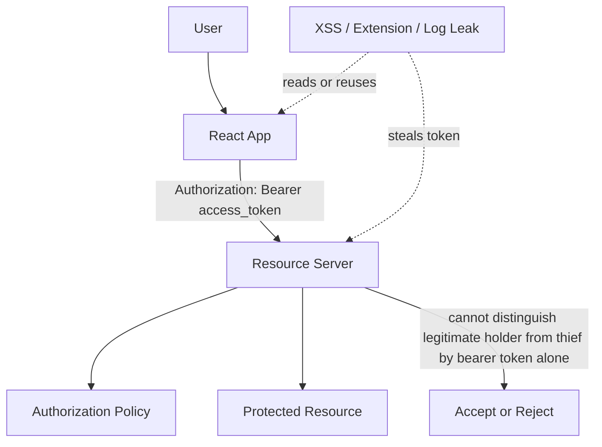
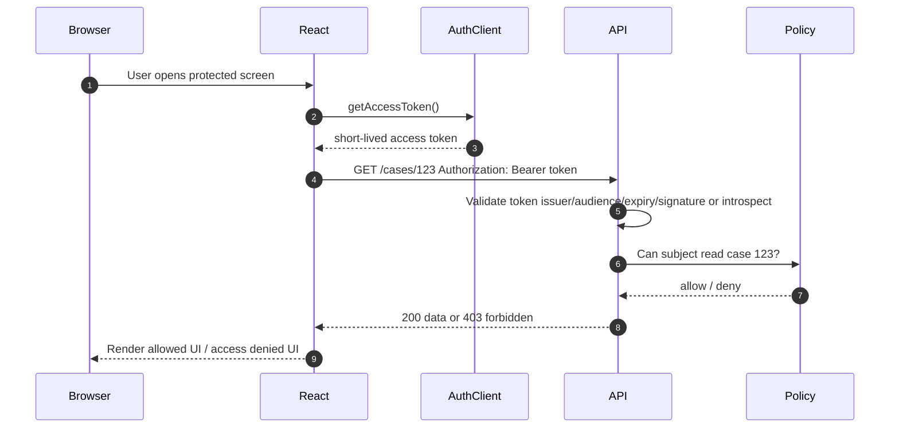
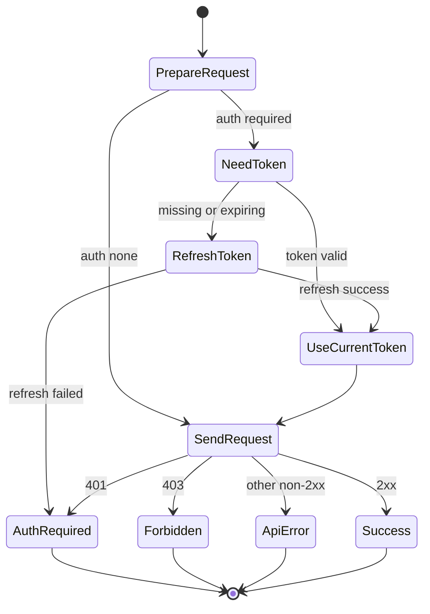
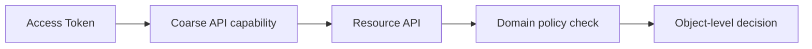
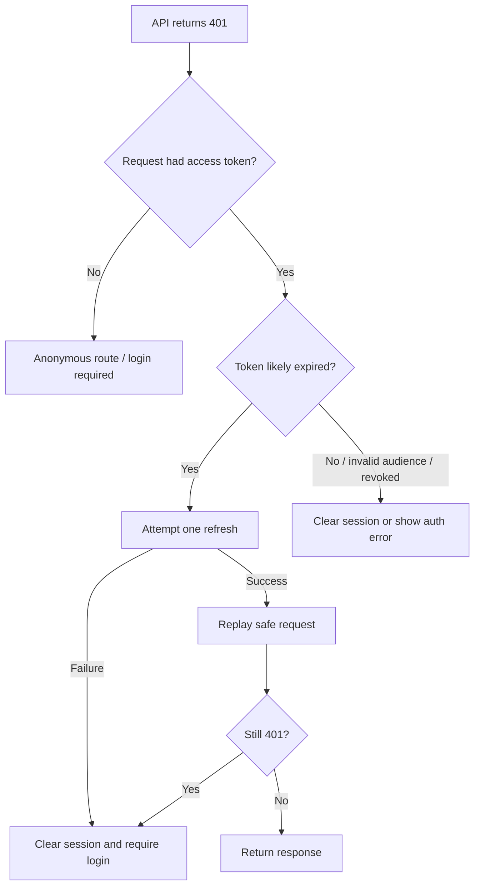
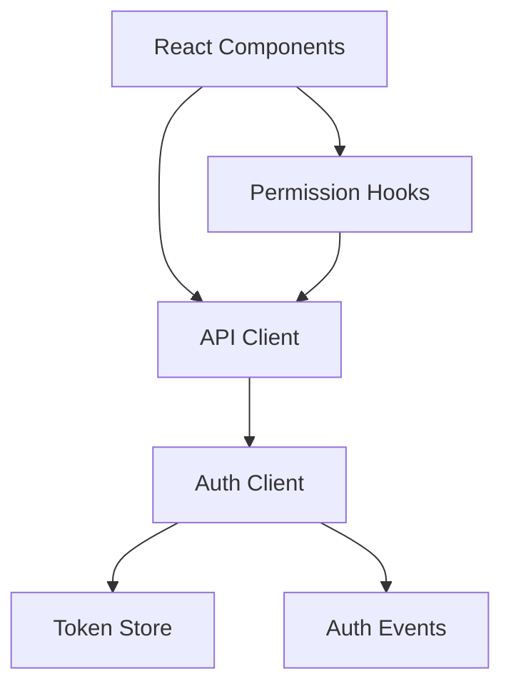

# Part 013 — Bearer Token Auth in React

Bearer token auth looks simple:

```ts
await fetch('/api/cases', {
  headers: {
    Authorization: `Bearer ${accessToken}`,
  },
});
```

That line is not the design. That line is only the last inch of a much larger system.

A bearer token means: **whoever possesses this token can use it**. There is no built-in proof that the caller is the original legitimate user. If the token is stolen, copied, logged, cached, leaked through a browser extension, or read by injected JavaScript, the resource server cannot tell the difference unless the system adds extra controls.

In a React app, bearer token auth is acceptable only when you understand the blast radius:

- token theft risk,
- XSS risk,
- token lifetime,
- refresh strategy,
- audience/scope minimization,
- memory/storage policy,
- API client retry behavior,
- logout and revocation semantics,
- multi-tab behavior,
- observability.

This part is about designing that boundary deliberately.

---

## 1. The core mental model

A bearer token is not a session object in your React tree. It is a **capability**.

A capability says:

> The holder of this artifact can perform the actions encoded or associated with the artifact until it expires or is revoked.

That means the critical question is not only:

> Where do I store the token?

The real question is:

> What can happen if this token is observed, copied, replayed, delayed, logged, reused from another tab, used after logout, or sent to the wrong API?



A React app should treat an access token like a loaded credential, not like ordinary application state.

---

## 2. Token vocabulary that must stay precise

Do not casually mix these tokens.

| Token | Primary purpose | Should React read it? | Common mistake |
|---|---|---:|---|
| Access token | Authorize calls to resource server | Sometimes, if architecture requires bearer auth | Treating it as user profile or long-lived session |
| ID token | Prove authentication event to client/relying party | Sometimes, depending on OIDC client flow | Sending it to APIs as an access token |
| Refresh token | Obtain new access tokens | Avoid exposing to JS when possible | Storing long-lived refresh token in `localStorage` |
| CSRF token | Prove same-site/user-intended mutation for cookie auth | Yes, if double-submit/header model | Confusing it with access token |
| Session id | Server-side session lookup key | Ideally only in `HttpOnly` cookie | Reading it in JavaScript |

The most dangerous confusion is this:

```ts
// Bad mental model
const user = jwtDecode(accessToken);
if (user.role === 'admin') showAdminUI();
```

Decoded claims may be useful as a hint, but the frontend does not become the authorization authority just because it can decode a JWT.

A better mental model:

```ts
// Better mental model
const session = await authClient.getSession();
const permissions = await permissionClient.getAllowedActions({ resource: 'case', id: caseId });

if (permissions.includes('case.approve')) {
  showApproveButton();
}
```

Even then, the server must still enforce `case.approve` when the mutation arrives.

---

## 3. Where bearer token auth fits

Bearer token auth fits when:

1. the frontend must call APIs directly,
2. the APIs expect `Authorization` headers,
3. the app is not using a full BFF/session-cookie model,
4. token lifetime is short,
5. refresh is controlled,
6. sensitive authorization remains server-side,
7. the app can tolerate browser exposure risk.

It is especially common in:

- SPAs calling resource APIs,
- React Native and mobile-adjacent web architectures,
- internal dashboards using an enterprise IdP,
- apps with multiple API origins,
- GraphQL clients,
- service-to-frontend API gateways.

It is less attractive when:

- the app handles highly sensitive data,
- XSS impact must be minimized aggressively,
- you already control a backend near the frontend,
- SSR/RSC/BFF is available,
- centralized session revocation is critical,
- you need strong browser containment.

For many high-sensitivity browser apps, the safer architecture is often:

```txt
Browser -> Same-site BFF cookie session -> Backend/API
```

rather than:

```txt
Browser JS -> Bearer token -> API
```

Bearer token auth is not “wrong”. It is a trade-off that must be owned.

---

## 4. Minimal bearer token request flow



Important: token validation and authorization decision are different steps.

Token validation answers:

> Is this token structurally valid, issued by the trusted issuer, meant for this API, and unexpired?

Authorization answers:

> Is this subject allowed to do this action on this resource in this context?

A valid token can still produce `403 Forbidden`.

---

## 5. Access token storage options

For bearer token auth in browser React, the usual options are:

| Storage | JS readable? | Survives reload? | XSS exposure | Operational notes |
|---|---:|---:|---:|---|
| Memory variable | Yes | No | Usable by injected JS during page lifetime | Best default for JS-held access token |
| React state/context | Yes | No | Same as memory, plus accidental rerender/debug exposure | Avoid putting raw token in broad context |
| `sessionStorage` | Yes | Yes, per tab | Readable by injected JS | Still sensitive; sometimes used for reload survival |
| `localStorage` | Yes | Yes, persistent | High risk | Avoid for sensitive auth tokens |
| IndexedDB | Yes | Yes | Readable by injected JS | Not safer than other JS-accessible stores for XSS |
| `HttpOnly` cookie | No | Yes | Not directly readable by JS | Works for cookie/BFF model, not direct Authorization header |

The best JS-accessible place for an access token is usually **memory**, combined with short lifetime and a controlled refresh mechanism.

Memory does not make XSS safe. It only reduces persistence and easy exfiltration after the page is closed.

---

## 6. Avoid broad token propagation through React

A common anti-pattern is putting raw tokens into global React context:

```tsx
// Anti-pattern: every component can reach the raw token.
<AuthContext.Provider value={{ user, accessToken, refreshToken }}>
  {children}
</AuthContext.Provider>
```

This expands the token’s accidental exposure surface:

- devtools inspection,
- logs inside random components,
- third-party component misuse,
- unnecessary dependency arrays,
- debugging middleware,
- copied state snapshots,
- error boundary dumps.

Prefer exposing operations instead of raw credentials:

```tsx
type AuthContextValue = {
  status: 'anonymous' | 'authenticated' | 'refreshing' | 'expired';
  user: SessionUser | null;
  getAccessToken: () => Promise<string>;
  logout: () => Promise<void>;
};
```

Even better: do not let most components call `getAccessToken()` directly. Put token injection inside a small API client module.

```tsx
<AuthProvider>
  <ApiClientProvider>
    <App />
  </ApiClientProvider>
</AuthProvider>
```

The raw token should live behind a narrow boundary.

---

## 7. Token injection belongs in the API client boundary

Do not sprinkle `Authorization` headers across pages and components.

Bad:

```tsx
function CasePage() {
  const { accessToken } = useAuth();

  useEffect(() => {
    fetch(`/api/cases/${caseId}`, {
      headers: { Authorization: `Bearer ${accessToken}` },
    });
  }, [accessToken, caseId]);
}
```

This causes repeated mistakes:

- missing token on some calls,
- stale token captured in closures,
- inconsistent 401 handling,
- accidental logging,
- inconsistent retry behavior,
- token exposure throughout the component tree.

Better:

```ts
type ApiRequestOptions = RequestInit & {
  auth?: 'required' | 'optional' | 'none';
};

export function createApiClient(auth: AuthClient) {
  async function request<T>(url: string, options: ApiRequestOptions = {}): Promise<T> {
    const authMode = options.auth ?? 'required';
    const headers = new Headers(options.headers);

    if (authMode === 'required') {
      const token = await auth.getAccessToken();
      headers.set('Authorization', `Bearer ${token}`);
    }

    const response = await fetch(url, {
      ...options,
      headers,
    });

    if (response.status === 401) {
      throw new AuthRequiredError('Authentication required');
    }

    if (response.status === 403) {
      throw new ForbiddenError('Authenticated but not authorized');
    }

    if (!response.ok) {
      throw await toApiError(response);
    }

    return response.json() as Promise<T>;
  }

  return { request };
}
```

The component asks for domain data. The API boundary handles credentials.

---

## 8. Interceptors are useful, but dangerous

Axios/fetch interceptors often become a hidden auth framework.

They are useful for:

- injecting access tokens,
- normalizing `401` / `403`,
- adding correlation IDs,
- centralizing refresh,
- standardizing error conversion.

They become dangerous when they:

- retry every failed request blindly,
- refresh concurrently from many tabs,
- replay non-idempotent mutations,
- swallow authorization errors,
- redirect from deep infrastructure code,
- create infinite loops,
- log headers,
- mutate global state unpredictably.

A safe interceptor follows a few rules.

```ts
const NO_RETRY_STATUSES = new Set([400, 403, 404, 409, 422]);
const AUTH_RETRY_STATUSES = new Set([401]);

function isSafeToReplay(method: string): boolean {
  return ['GET', 'HEAD', 'OPTIONS'].includes(method.toUpperCase());
}
```

For mutations, do not automatically replay unless the operation is explicitly idempotent.

```ts
type RequestReplayPolicy =
  | { replay: 'never' }
  | { replay: 'safe-methods-only' }
  | { replay: 'idempotent-with-key'; idempotencyKey: string };
```

A refresh handler should be single-flight:

```ts
class TokenManager {
  private accessToken: string | null = null;
  private refreshPromise: Promise<string> | null = null;

  async getAccessToken(): Promise<string> {
    if (this.accessToken && !this.isExpiringSoon(this.accessToken)) {
      return this.accessToken;
    }

    if (!this.refreshPromise) {
      this.refreshPromise = this.refreshAccessToken()
        .finally(() => {
          this.refreshPromise = null;
        });
    }

    return this.refreshPromise;
  }

  private async refreshAccessToken(): Promise<string> {
    const response = await fetch('/auth/refresh', {
      method: 'POST',
      credentials: 'include',
    });

    if (!response.ok) {
      this.accessToken = null;
      throw new AuthRequiredError('Unable to refresh access token');
    }

    const body = await response.json() as { accessToken: string };
    this.accessToken = body.accessToken;
    return body.accessToken;
  }

  private isExpiringSoon(token: string): boolean {
    const expMs = readExpClaim(token) * 1000;
    return Date.now() > expMs - 30_000;
  }
}
```

Single-flight means: one refresh request is in flight per runtime; other callers wait for the same promise.

---

## 9. Request lifecycle under bearer auth

A production request lifecycle should be explicit.



Never collapse `401` and `403`.

- `401 Unauthorized`: caller is not authenticated or token is invalid/expired.
- `403 Forbidden`: caller is authenticated but not allowed.

If the app treats both as “go to login”, users get bad loops and security debugging becomes painful.

---

## 10. Bearer token does not solve authorization

A common mistake:

```tsx
if (accessToken) {
  renderAdminPanel();
}
```

That means only:

> The app has some credential-like string.

It does not mean:

- token is valid,
- token is meant for this API,
- user is still active,
- user has the right tenant membership,
- user can access this resource,
- user can perform this action.

A safer UI pattern:

```tsx
function ApproveCaseButton({ caseId }: { caseId: string }) {
  const permission = usePermission({
    action: 'case.approve',
    resource: { type: 'case', id: caseId },
  });

  if (permission.status === 'loading') {
    return <Button disabled>Checking…</Button>;
  }

  if (!permission.allowed) {
    return <Tooltip content={permission.reason ?? 'You do not have access'}>
      <span>
        <Button disabled>Approve</Button>
      </span>
    </Tooltip>;
  }

  return <Button onClick={() => approveCase(caseId)}>Approve</Button>;
}
```

The server still checks `case.approve` when `approveCase()` is called.

---

## 11. Token purpose: audience, scope, issuer

A resource server should not accept a token just because it is signed.

It should validate:

| Check | Reason |
|---|---|
| Issuer | Token came from trusted authorization server |
| Audience | Token was minted for this API, not another service |
| Expiry | Token is still within lifetime |
| Not-before | Token is not used before valid time |
| Signature / introspection | Token has integrity or is known by authorization server |
| Scope / permissions | Token grants relevant coarse capability |
| Subject | Token maps to a valid principal |
| Tenant/org | Token is valid for the tenant boundary being accessed |
| Revocation/session state | Token is not part of invalidated session when supported |

Frontend engineers must understand these checks because API behavior determines frontend failure states.

If the API only says “401”, React cannot tell whether the user:

- logged out,
- has an expired token,
- used a token for the wrong audience,
- lost tenant membership,
- hit a bad deployment,
- is blocked by clock skew.

A good API error contract matters.

```json
{
  "error": "token_expired",
  "message": "Access token expired",
  "requestId": "req_abc123",
  "recoverable": true
}
```

Do not expose sensitive internals, but expose enough classification for correct UX and debugging.

---

## 12. Scope is not the same as domain permission

OAuth scopes are usually coarse grants such as:

```txt
cases:read cases:write profile:read
```

Domain permissions are often contextual:

```txt
case.approve when user is assigned supervisor and case.state == SUBMITTED
case.reopen when case.state == CLOSED and user has regional override
case.view when user belongs to same tenant and classification <= clearance
```

Do not overload access token scopes with every object-level rule. If you encode every domain permission into the token, you create:

- huge tokens,
- stale privilege,
- difficult revocation,
- role explosion,
- cache invalidation pain,
- sensitive policy exposure.

Use scopes for coarse API access. Use server-side policy for contextual resource access.



---

## 13. In-memory token holder pattern

Keep token handling out of React components.

```ts
type AccessToken = string;

type TokenSnapshot = {
  token: AccessToken | null;
  expiresAt: number | null;
};

export class AccessTokenStore {
  private snapshot: TokenSnapshot = {
    token: null,
    expiresAt: null,
  };

  getSnapshot(): TokenSnapshot {
    return this.snapshot;
  }

  setToken(token: AccessToken, expiresAt: number): void {
    this.snapshot = { token, expiresAt };
  }

  clear(): void {
    this.snapshot = { token: null, expiresAt: null };
  }

  hasUsableToken(now = Date.now(), leewayMs = 30_000): boolean {
    if (!this.snapshot.token || !this.snapshot.expiresAt) return false;
    return now < this.snapshot.expiresAt - leewayMs;
  }
}
```

This class is intentionally boring. That is good. Auth token state should be boring, small, and auditable.

Now wrap behavior around it:

```ts
export class BearerAuthClient {
  private refreshInFlight: Promise<string> | null = null;

  constructor(private readonly tokenStore: AccessTokenStore) {}

  async getAccessToken(): Promise<string> {
    if (this.tokenStore.hasUsableToken()) {
      const token = this.tokenStore.getSnapshot().token;
      if (token) return token;
    }

    return this.refreshOnce();
  }

  clear(): void {
    this.tokenStore.clear();
  }

  private async refreshOnce(): Promise<string> {
    if (!this.refreshInFlight) {
      this.refreshInFlight = this.refresh()
        .finally(() => {
          this.refreshInFlight = null;
        });
    }

    return this.refreshInFlight;
  }

  private async refresh(): Promise<string> {
    const response = await fetch('/auth/refresh', {
      method: 'POST',
      credentials: 'include',
      headers: {
        'Accept': 'application/json',
      },
    });

    if (!response.ok) {
      this.tokenStore.clear();
      throw new AuthRequiredError('Refresh failed');
    }

    const body = await response.json() as {
      accessToken: string;
      expiresAt: number;
    };

    this.tokenStore.setToken(body.accessToken, body.expiresAt);
    return body.accessToken;
  }
}
```

This pattern assumes refresh is done via a safer boundary such as an `HttpOnly` refresh cookie or BFF. If the refresh token itself is held by JavaScript, the blast radius is higher and Part 014 becomes mandatory reading.

---

## 14. Avoid token logging

Token leakage often happens through boring paths:

- console logs,
- error reports,
- request debugging,
- analytics events,
- server access logs,
- CDN logs,
- browser devtools screenshots,
- issue tracker attachments,
- copied curl commands,
- crash dumps.

Never do this:

```ts
console.debug('request headers', headers);
```

Use redaction by default.

```ts
function redactHeaders(headers: Headers): Record<string, string> {
  const output: Record<string, string> = {};

  headers.forEach((value, key) => {
    if (key.toLowerCase() === 'authorization') {
      output[key] = 'Bearer <redacted>';
    } else {
      output[key] = value;
    }
  });

  return output;
}
```

Error objects should not carry raw request headers unless your observability pipeline guarantees redaction.

---

## 15. Request replay and idempotency

Refreshing a token after `401` is tempting:

```txt
request -> 401 -> refresh -> retry request
```

This is safe for many reads. It can be dangerous for writes.

Example failure:

1. User clicks “Approve case”.
2. API receives request and performs mutation.
3. Response path fails or token expiry is misclassified.
4. Client refreshes and retries.
5. Mutation executes twice.

Safe design:

- prefer proactive refresh before sending critical mutation,
- use idempotency keys for mutation replay,
- avoid automatic replay of unknown writes,
- classify server errors carefully,
- make domain commands idempotent when possible.

```ts
async function approveCase(caseId: string): Promise<void> {
  const idempotencyKey = crypto.randomUUID();

  await api.request(`/api/cases/${caseId}/approve`, {
    method: 'POST',
    headers: {
      'Idempotency-Key': idempotencyKey,
    },
    body: JSON.stringify({}),
    auth: 'required',
    // The API client may replay this only because it has an idempotency key.
    replayPolicy: { replay: 'idempotent-with-key', idempotencyKey },
  } as ApiRequestOptions & { replayPolicy: RequestReplayPolicy });
}
```

For regulatory or enforcement lifecycle systems, idempotency is not an optimization. It is audit integrity.

---

## 16. CORS is not authorization

If your API accepts bearer tokens from browsers, you will see CORS configuration.

Do not confuse these:

| Mechanism | What it does | What it does not do |
|---|---|---|
| CORS | Controls which browser origins can read responses | Does not prove user permission |
| Bearer token | Carries credential/capability | Does not protect against XSS holder misuse |
| CSRF token | Helps protect cookie-auth mutations | Does not authorize resource access |
| SameSite cookie | Controls cross-site cookie sending | Does not validate domain permission |
| Authorization policy | Decides subject/action/resource/context | Does not solve transport leakage by itself |

Bad idea:

```txt
Only our frontend origin can call the API, so authorization is fine.
```

CORS is a browser enforcement mechanism. Non-browser clients can still send requests. Your API must validate token and permission.

---

## 17. Bearer token and GraphQL

GraphQL makes bearer token auth look clean:

```ts
const link = setContext(async (_, { headers }) => {
  const token = await auth.getAccessToken();
  return {
    headers: {
      ...headers,
      Authorization: `Bearer ${token}`,
    },
  };
});
```

The auth risk is not header injection. The risk is field-level exposure and partial authorization.

Example:

```graphql
query CaseScreen($id: ID!) {
  case(id: $id) {
    id
    title
    complainantName
    enforcementNotes
    allowedActions
  }
}
```

The API must decide whether the user can see `enforcementNotes`. The frontend must not assume that a screen-level token is sufficient for every field.

Recommended response shape:

```graphql
type Case {
  id: ID!
  title: String!
  complainantName: String
  enforcementNotes: String
  allowedActions: [CaseAction!]!
}
```

The absence of a field should be distinguishable from a loading bug when necessary. For sensitive fields, prefer explicit capability-driven rendering rather than accidental null handling.

---

## 18. Bearer token and service workers

Service workers can intercept requests and add headers. That can centralize token injection, but it also introduces complexity:

- service worker lifecycle is independent from React lifecycle,
- stale service worker may hold old auth logic,
- logout must clear service worker-managed state,
- token messages between page and worker can leak,
- debugging is harder,
- multi-tab behavior becomes more subtle.

Do not store long-lived tokens in a service worker and call it “secure”. It is still JavaScript-controlled runtime within the origin.

Use service workers for auth only when you have a specific architecture reason and a testable lifecycle model.

---

## 19. Cache control for bearer-authenticated responses

Bearer-authenticated responses often include sensitive data.

The frontend should expect APIs to set appropriate cache headers, especially for user-specific data.

```http
Cache-Control: no-store
Vary: Authorization
```

`Vary: Authorization` matters when shared caches are involved. `no-store` matters for sensitive personal or regulated data.

Frontend engineers should know this because leaked data through caching often appears as a frontend bug:

- back button shows old protected screen after logout,
- browser cache restores sensitive response,
- CDN serves data across users,
- service worker cache returns data after session expiry.

Never cache authenticated API responses in service worker Cache Storage unless the data classification and invalidation model are explicit.

---

## 20. Expiry strategy

Access tokens should usually be short-lived.

But “short-lived” is a trade-off:

| Very short token | Longer token |
|---|---|
| Lower theft window | Fewer refreshes |
| More refresh traffic | Better offline-ish tolerance |
| More race conditions | Higher stale privilege risk |
| More clock skew sensitivity | Longer blast radius |

Common production strategy:

- short-lived access token,
- refresh token/session with stronger containment,
- proactive refresh before expiry,
- absolute session lifetime,
- revocation on suspicious behavior,
- permission refresh on role/tenant change.

The frontend should not wait for every request to fail with `401`. Proactive refresh improves UX and reduces retry storms.

```ts
const REFRESH_LEEWAY_MS = 60_000;

function shouldRefresh(expiresAt: number, now = Date.now()): boolean {
  return now >= expiresAt - REFRESH_LEEWAY_MS;
}
```

Do not refresh too early in every tab. That creates background load and token churn. Coordinate tabs or refresh only on demand.

---

## 21. Multi-tab behavior

With bearer access tokens in memory, every tab has its own memory.

That produces tricky behavior:

| Event | Problem |
|---|---|
| User logs in on Tab A | Tab B may still think anonymous |
| User logs out on Tab A | Tab B may keep old access token in memory |
| Token expires in all tabs | All tabs may refresh simultaneously |
| Refresh token rotates | One tab may invalidate another tab's refresh attempt |
| Role changes | Tabs may render stale allowed actions |

Use cross-tab coordination:

```ts
const channel = new BroadcastChannel('auth');

type AuthMessage =
  | { type: 'login' }
  | { type: 'logout' }
  | { type: 'token-refreshed'; expiresAt: number }
  | { type: 'permissions-changed' };

export function publishAuthMessage(message: AuthMessage) {
  channel.postMessage(message);
}

export function subscribeAuthMessages(handler: (message: AuthMessage) => void) {
  channel.onmessage = event => handler(event.data as AuthMessage);
}
```

On logout, every tab clears in-memory tokens immediately.

```ts
subscribeAuthMessages(message => {
  if (message.type === 'logout') {
    authClient.clear();
    queryClient.clear();
    router.navigate('/login');
  }
});
```

BroadcastChannel is coordination, not security. An XSS payload can also send messages. Treat messages as hints and revalidate against the server.

---

## 22. Handling `401` correctly

A good `401` handling path:



Rules:

1. refresh at most once per failed request,
2. never infinite-loop refresh,
3. do not refresh on `403`,
4. do not replay unsafe mutations without idempotency,
5. clear local auth state on unrecoverable auth failure,
6. preserve user intent only when redirect URL is safe.

---

## 23. Handling `403` correctly

`403` means the user is authenticated but not authorized.

Do not silently log out.

Bad:

```ts
if (response.status === 403) {
  logout();
}
```

Better:

```ts
if (response.status === 403) {
  throw new ForbiddenError({
    message: 'You do not have permission to perform this action.',
    requestId: response.headers.get('x-request-id'),
  });
}
```

UI recovery depends on context:

| Context | Response |
|---|---|
| Protected page | Show access denied page |
| Button action | Show inline permission error |
| Data field | Hide or show redacted state |
| Tenant mismatch | Offer org switch if valid |
| Permission changed mid-session | Refresh permission cache |

`403` should become product behavior, not infrastructure confusion.

---

## 24. Bearer token auth with TanStack Query

TanStack Query should not own tokens. It should use an API client that owns token injection.

```ts
export function useCase(caseId: string) {
  const api = useApiClient();

  return useQuery({
    queryKey: ['case', caseId],
    queryFn: () => api.request<CaseDto>(`/api/cases/${caseId}`),
    retry(failureCount, error) {
      if (error instanceof AuthRequiredError) return false;
      if (error instanceof ForbiddenError) return false;
      return failureCount < 2;
    },
  });
}
```

On logout:

```ts
await auth.logout();
queryClient.clear();
router.navigate('/login');
```

On permission change:

```ts
queryClient.invalidateQueries({ queryKey: ['permissions'] });
queryClient.invalidateQueries({ queryKey: ['case'] });
```

Do not let cached data survive identity changes.

---

## 25. Data leakage through React error states

A common subtle bug:

```tsx
function CaseScreen() {
  const { data, error } = useCase(caseId);

  if (error) return <ErrorPanel error={error} />;
  return <CaseDetails case={data} />;
}
```

If `ErrorPanel` serializes request config, it may leak headers.

Safer error type:

```ts
type SafeApiError = {
  status: number;
  code: string;
  message: string;
  requestId?: string;
};
```

Never pass raw `Response`, raw request headers, raw Axios config, or raw token-bearing error objects into generic UI.

---

## 26. Token freshness vs permission freshness

Access token freshness and permission freshness are different.

Example:

- access token expires in 10 minutes,
- user role is removed now,
- frontend still has token,
- token still validates,
- server must deny the action immediately or near-immediately.

If permissions are encoded entirely inside the access token, revocation latency equals token lifetime unless the server also checks live state or token revocation.

For high-risk permissions:

- keep access tokens short,
- check permission server-side at request time,
- use permission version/session version,
- invalidate permission cache on role changes,
- force re-auth/step-up for sensitive actions.

A useful pattern:

```json
{
  "sub": "user_123",
  "aud": "case-api",
  "scope": "cases:read cases:write",
  "session_version": 42,
  "tenant_id": "tenant_a",
  "exp": 1783500000
}
```

The API can compare `session_version` or permission version with server-side state for revocation-sensitive systems.

---

## 27. Bearer token checklist

Before shipping bearer token auth in React, answer these:

### Token containment

- Where is the access token stored?
- Can JavaScript read it?
- Does it survive reload?
- Does it survive logout?
- Can it be logged by accident?
- Is it exposed to third-party scripts?

### Token semantics

- What is the issuer?
- What is the audience?
- What scopes are included?
- What is the lifetime?
- What happens on revocation?
- Is the token JWT or opaque?
- Who validates it?

### API behavior

- What produces `401`?
- What produces `403`?
- Is retry safe?
- Are mutations idempotent?
- Are authorization failures typed?
- Are request IDs exposed safely?

### Frontend behavior

- Is token injection centralized?
- Are raw tokens kept out of components?
- Are query caches cleared on logout?
- Are permission caches invalidated on role changes?
- Are multi-tab events handled?
- Are redirect loops prevented?

### Security controls

- Is XSS mitigated with CSP and safe rendering?
- Are tokens redacted from logs?
- Are access tokens short-lived?
- Is refresh controlled and single-flight?
- Is logout propagated across tabs?
- Are sensitive responses `no-store`?

---

## 28. Production anti-patterns

### Anti-pattern: `localStorage` as session database

```ts
localStorage.setItem('access_token', accessToken);
localStorage.setItem('refresh_token', refreshToken);
```

This makes token theft persistence easy after any XSS. It also encourages every component and utility to read tokens directly.

### Anti-pattern: JWT decode as authorization

```ts
const { role } = jwtDecode(token);
return role === 'admin';
```

This ignores resource, tenant, state, revocation, and server-side policy.

### Anti-pattern: refresh on every error

```ts
if (!response.ok) {
  await refresh();
  return retry();
}
```

This can hide bugs, replay mutations, and create retry storms.

### Anti-pattern: logout only clears UI

```ts
setUser(null);
```

Logout must clear tokens, caches, cross-tab state, and server session/refresh state when applicable.

### Anti-pattern: one token for everything

Using the same token for multiple APIs increases blast radius and makes audience validation meaningless.

---

## 29. Reference implementation shape

A clean React bearer auth architecture has these modules:

```txt
src/auth/
  auth-client.ts          // login/logout/session/refresh operations
  token-store.ts          // in-memory token snapshot
  auth-provider.tsx       // exposes safe auth status, not raw tokens
  auth-errors.ts          // typed auth errors
  auth-events.ts          // BroadcastChannel coordination

src/api/
  api-client.ts           // injects Authorization header
  api-errors.ts           // converts HTTP errors to safe domain errors
  replay-policy.ts        // controls retry/replay rules

src/permissions/
  permission-client.ts    // fetches allowed actions
  use-permission.ts       // UI exposure hook
```

The dependency direction should be:



Components do not own tokens. API client does not own UI navigation. Auth client does not own domain permission. Each boundary stays small.

---

## 30. What to remember

Bearer token auth in React is not just `Authorization: Bearer`.

The serious version is:

1. keep raw tokens behind a narrow boundary,
2. prefer memory for JS-held access tokens,
3. keep access tokens short-lived,
4. never store long-lived refresh tokens casually in JS storage,
5. centralize token injection in API client,
6. separate `401` from `403`,
7. avoid unsafe mutation replay,
8. clear caches on identity/session changes,
9. handle multi-tab behavior deliberately,
10. never confuse token presence with authorization.

Bearer token auth is a capability distribution problem. React is only the runtime carrying one copy of that capability. Design accordingly.

---

## References

- RFC 9700 — Best Current Practice for OAuth 2.0 Security
- IETF OAuth 2.0 for Browser-Based Applications draft
- MDN — Authorization HTTP header
- OWASP HTML5 Security Cheat Sheet
- OWASP Session Management Cheat Sheet
- OWASP Authorization Cheat Sheet
