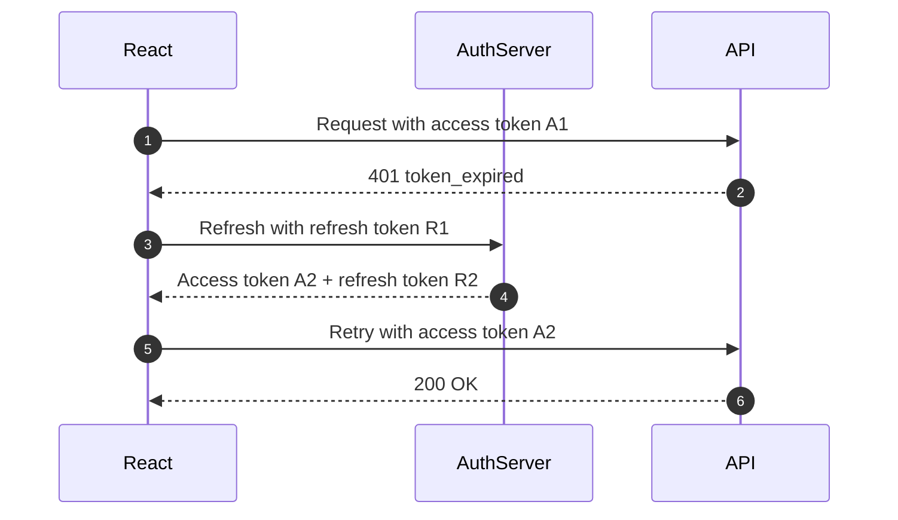
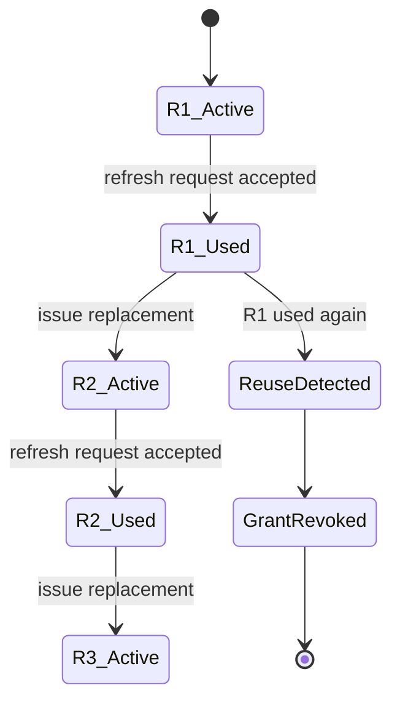
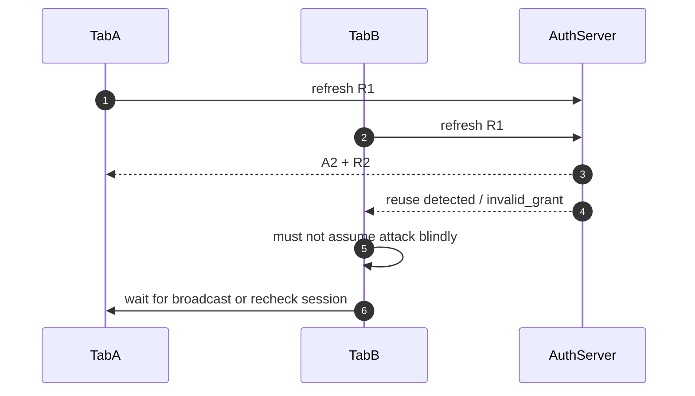
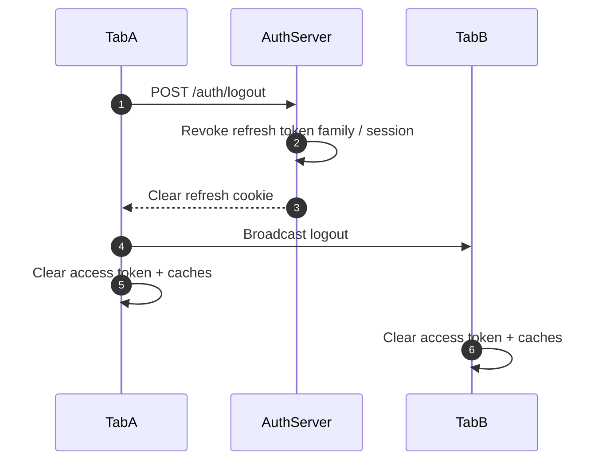
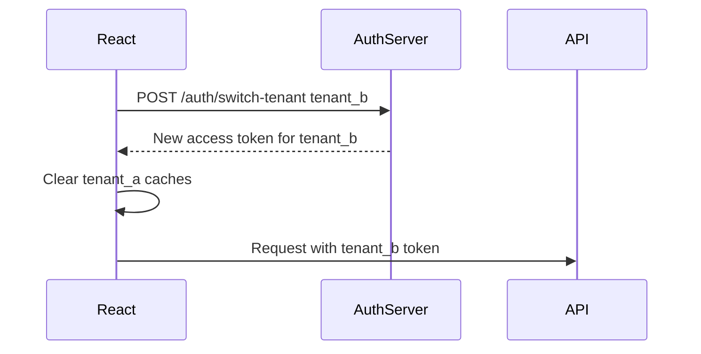

# Part 014 — Refresh Token Rotation

Refresh token rotation is one of those topics that looks simple in diagrams and becomes messy in production.

The naive model:

```txt
access token expired -> use refresh token -> get new access token
```

The real model:

```txt
access token expired
-> one browser tab refreshes
-> another tab refreshes at the same time
-> network timeout hides whether refresh succeeded
-> old refresh token may now be invalid
-> a stolen refresh token may be replayed later
-> server must detect reuse
-> client must not loop forever
-> all tabs must converge to one session truth
```

Refresh token rotation is not merely a UX convenience. It is part of your replay detection, session continuity, and incident response model.

---

## 1. Why refresh tokens exist

Access tokens should be short-lived because they are bearer credentials. Short lifetime limits damage if an access token leaks.

But users do not want to log in every few minutes. Refresh tokens solve this by letting the client obtain new access tokens without a full login.



The dangerous part is `R1`. A refresh token usually has a longer useful lifetime than an access token. If it is stolen and remains valid, the attacker can keep minting new access tokens.

Rotation reduces that risk.

---

## 2. What refresh token rotation means

Refresh token rotation means:

1. client uses refresh token `R1`,
2. authorization server validates `R1`,
3. server invalidates `R1`,
4. server issues new refresh token `R2`,
5. client must use `R2` next time,
6. if `R1` appears again, server treats it as suspicious reuse.



The server tracks a **token family** or **grant lineage**. Reuse of an already-used refresh token is a signal that either:

- the client retried after a network ambiguity,
- two tabs raced,
- the token was stolen,
- a buggy client sent stale credentials,
- a malicious actor replayed old credentials.

Your design must distinguish recoverable races from suspicious replay as much as possible.

---

## 3. Token family mental model

A rotated refresh token is not an isolated value. It belongs to a family.

```txt
Grant G1
  R1 -> R2 -> R3 -> R4 -> R5
```

At any moment, usually only the latest token is active.

A minimal server-side model:

```txt
refresh_token_id
family_id
grant_id
subject_id
client_id
tenant_id
status: active | used | revoked | reused
issued_at
used_at
expires_at
replaced_by_token_id
```

A family-level model:

```txt
family_id
grant_id
subject_id
client_id
status: active | revoked | compromised
absolute_expires_at
last_rotated_at
revoked_at
revocation_reason
```

Why family matters: if an old token is reused, many providers revoke the whole family/grant because they cannot know whether the legitimate client or attacker currently has the latest token.

---

## 4. Rotation is replay detection, not magic protection

Rotation does not prevent the first malicious use of a stolen refresh token.

If attacker steals `R3` and uses it before the legitimate client:

```txt
Attacker: R3 -> gets R4
Legitimate client: R3 -> reuse detected
```

The server detects a problem only when the second party uses the already-consumed token.

If the attacker steals the latest token and keeps using it while the legitimate app is inactive, detection may be delayed.

So rotation must be combined with:

- short access token lifetime,
- bounded refresh token lifetime,
- inactivity timeout,
- absolute session lifetime,
- secure storage strategy,
- reuse detection,
- anomaly logging,
- forced re-auth on suspicious events,
- device/session management.

---

## 5. The browser-specific problem

Browser apps are hostile to refresh token simplicity.

A React app can be open in multiple tabs. Each tab may:

- have its own memory token,
- wake from sleep,
- retry old requests,
- see stale expiry,
- refresh simultaneously,
- lose network during refresh,
- be restored from bfcache,
- continue after logout in another tab.

This makes rotation harder than backend-only refresh.



If your client does not coordinate tabs, rotation can create self-inflicted session revocation.

---

## 6. Recommended high-level architecture

For high-sensitivity React apps, prefer one of these:

### Option A — BFF refresh boundary

```txt
Browser JS
  -> same-site BFF session cookie
  -> BFF holds/uses refresh token server-side
  -> API receives access token from BFF or internal session
```

Pros:

- refresh token not exposed to JavaScript,
- easier server-side rotation,
- better logging and revocation,
- simpler browser state.

Cons:

- requires backend near frontend,
- more infrastructure,
- CORS/cookie/domain design still matters.

### Option B — HttpOnly refresh cookie + in-memory access token

```txt
Browser JS stores access token in memory
Refresh endpoint uses HttpOnly refresh cookie
Server rotates refresh token
Client receives new short-lived access token
```

Pros:

- access token can be sent in Authorization header,
- refresh token not directly readable by JS,
- practical for many SPAs.

Cons:

- refresh endpoint needs CSRF protection,
- browser still has XSS risk for access token use,
- cross-tab coordination needed.

### Option C — JS-held refresh token

```txt
Browser JS stores access token and refresh token
Refresh token rotation happens from JS
```

Pros:

- simple API integration,
- no cookie/session dependency.

Cons:

- high XSS blast radius,
- persistent storage risk,
- harder incident containment,
- should be avoided for sensitive browser apps unless constraints force it and mitigations are strong.

---

## 7. Refresh endpoint contract

A refresh endpoint should be boring and strict.

Example cookie-based refresh:

```http
POST /auth/refresh HTTP/1.1
Cookie: __Host-refresh=...
X-CSRF-Token: ...
Accept: application/json
```

Response:

```json
{
  "accessToken": "eyJ...",
  "accessTokenExpiresAt": 1783500000000,
  "session": {
    "id": "sess_123",
    "subjectId": "user_123",
    "tenantId": "tenant_a",
    "expiresAt": 1783507200000
  }
}
```

For cookie-based refresh, the new refresh token is usually set as a new `HttpOnly` cookie:

```http
Set-Cookie: __Host-refresh=...; Path=/; Secure; HttpOnly; SameSite=Lax
```

The response body should not include the refresh token if the chosen architecture is `HttpOnly` refresh cookie.

---

## 8. Server-side rotation must be atomic

The most important server implementation detail: rotation must be atomic.

Bad conceptual logic:

```txt
read token R1
if active:
  create R2
  mark R1 used
```

Two concurrent requests can both see `R1` as active unless you lock or use conditional update.

Safer conceptual logic:

```sql
BEGIN;

SELECT *
FROM refresh_tokens
WHERE token_hash = :hash
FOR UPDATE;

-- validate token status, expiry, family status

UPDATE refresh_tokens
SET status = 'used', used_at = now()
WHERE token_hash = :hash
  AND status = 'active';

INSERT INTO refresh_tokens (..., status, family_id, previous_token_id)
VALUES (..., 'active', :family_id, :old_token_id);

COMMIT;
```

Alternatively, use a conditional update first:

```sql
UPDATE refresh_tokens
SET status = 'used', used_at = now()
WHERE token_hash = :hash
  AND status = 'active'
  AND expires_at > now();
```

Then require exactly one row to be updated. If zero rows are updated, the token is invalid, expired, already used, or revoked.

Do not store raw refresh tokens. Store a cryptographic hash.

---

## 9. Hash refresh tokens at rest

Refresh tokens are credentials. Treat them like passwords or API keys.

Server storage should use:

- high-entropy random token values,
- hash at rest,
- constant-time comparison where applicable,
- token prefix/key id only for lookup if needed,
- separate secret/pepper where appropriate,
- audit trail for use/reuse/revocation.

Example conceptual token format:

```txt
rt_live_<public_id>.<secret_random_value>
```

Store:

```txt
public_id
hash(secret_random_value)
family_id
status
expires_at
```

The `public_id` helps find the row; the secret proves possession.

Never log the raw token.

---

## 10. Reuse detection strategy

When a used refresh token appears again, the server has choices.

| Strategy | Behavior | Trade-off |
|---|---|---|
| Strict family revocation | Revoke entire family immediately | Strong security, can punish benign races |
| Grace window | Allow limited duplicate within tiny window | Better UX, more complex, weakens signal |
| Latest-token recovery | Tell client to recheck session if another tab refreshed | Useful with same-device coordination |
| Risk-based response | Combine IP/device/session signal | Better precision, more operational complexity |

Security-sensitive default: revoke family and require re-authentication.

But browser multi-tab apps need careful client-side single-flight and cross-tab coordination to avoid triggering strict reuse detection accidentally.

---

## 11. Client-side single-flight refresh

Within one tab/runtime, only one refresh should happen at a time.

```ts
class RefreshCoordinator {
  private refreshInFlight: Promise<RefreshResult> | null = null;

  constructor(private readonly refreshFn: () => Promise<RefreshResult>) {}

  refreshOnce(): Promise<RefreshResult> {
    if (!this.refreshInFlight) {
      this.refreshInFlight = this.refreshFn()
        .finally(() => {
          this.refreshInFlight = null;
        });
    }

    return this.refreshInFlight;
  }
}
```

Every caller waits for the same promise:

```ts
async function getAccessToken(): Promise<string> {
  if (tokenStore.hasUsableToken()) {
    return tokenStore.requireToken();
  }

  const result = await refreshCoordinator.refreshOnce();
  tokenStore.setAccessToken(result.accessToken, result.accessTokenExpiresAt);
  return result.accessToken;
}
```

This prevents ten components from sending ten refresh requests during page bootstrap.

---

## 12. Cross-tab refresh lock

Single-flight inside one tab is not enough. You also need cross-tab coordination.

There is no perfect primitive, but a practical approach combines:

- `BroadcastChannel` for notifications,
- short-lived lock in `localStorage` for coordination metadata,
- server-side tolerance for ambiguity,
- rechecking session after conflict.

Important: the lock is not a security boundary. It is only a concurrency hint.

```ts
type RefreshLock = {
  owner: string;
  expiresAt: number;
};

const TAB_ID = crypto.randomUUID();
const LOCK_KEY = 'auth.refresh.lock';
const LOCK_TTL_MS = 10_000;

function tryAcquireRefreshLock(now = Date.now()): boolean {
  const raw = localStorage.getItem(LOCK_KEY);
  const current = raw ? JSON.parse(raw) as RefreshLock : null;

  if (current && current.expiresAt > now && current.owner !== TAB_ID) {
    return false;
  }

  const next: RefreshLock = {
    owner: TAB_ID,
    expiresAt: now + LOCK_TTL_MS,
  };

  localStorage.setItem(LOCK_KEY, JSON.stringify(next));

  const verify = JSON.parse(localStorage.getItem(LOCK_KEY) ?? 'null') as RefreshLock | null;
  return verify?.owner === TAB_ID;
}

function releaseRefreshLock(): void {
  const raw = localStorage.getItem(LOCK_KEY);
  const current = raw ? JSON.parse(raw) as RefreshLock : null;

  if (current?.owner === TAB_ID) {
    localStorage.removeItem(LOCK_KEY);
  }
}
```

Then:

```ts
async function refreshWithCrossTabLock(): Promise<RefreshResult> {
  if (tryAcquireRefreshLock()) {
    try {
      const result = await refreshFromServer();
      authChannel.postMessage({
        type: 'refresh-success',
        accessTokenExpiresAt: result.accessTokenExpiresAt,
      });
      return result;
    } finally {
      releaseRefreshLock();
    }
  }

  return waitForOtherTabRefreshOrTimeout();
}
```

For `HttpOnly` refresh cookies, another tab cannot receive the new refresh token directly, but it can learn that refresh succeeded and call `/auth/session` or use its own refresh path after cookies update.

---

## 13. Broadcast refresh result safely

Do not broadcast refresh tokens.

Usually do not broadcast access tokens either unless your architecture accepts that same-origin tabs can share in-memory access tokens. A safer model is to broadcast an event, then let each tab re-bootstrap.

```ts
type AuthChannelMessage =
  | { type: 'refresh-started'; owner: string }
  | { type: 'refresh-succeeded'; at: number }
  | { type: 'refresh-failed'; reason: 'expired' | 'revoked' | 'network' }
  | { type: 'logout' };
```

On success:

```ts
authChannel.postMessage({
  type: 'refresh-succeeded',
  at: Date.now(),
});
```

Other tabs:

```ts
authChannel.onmessage = async event => {
  const message = event.data as AuthChannelMessage;

  if (message.type === 'refresh-succeeded') {
    await sessionClient.bootstrap();
  }

  if (message.type === 'logout') {
    authClient.clearLocalState();
  }
};
```

This favors convergence over token sharing.

---

## 14. Network ambiguity problem

The hardest refresh bug is not obvious failure. It is ambiguous failure.

Scenario:

1. Client sends refresh token `R1`.
2. Server accepts `R1`, invalidates it, issues `R2`.
3. Network drops before client receives response.
4. Client still thinks it has `R1`.
5. Client retries with `R1`.
6. Server sees reused token.

Strict reuse detection may revoke the family even though no attacker exists.

Possible mitigations:

- server returns idempotent refresh result for the same request id within a tiny window,
- client sends a refresh attempt id,
- server stores last successful rotation response envelope briefly,
- client does not blindly retry refresh on network error,
- client rechecks `/auth/session` before retrying,
- BFF performs refresh server-side where network ambiguity is easier to handle.

Example request id:

```http
POST /auth/refresh
X-Refresh-Attempt-Id: 1d6cd537-0b9f-43b0-8d51-7c8c516d56dd
```

Server stores:

```txt
token_id: R1
attempt_id: 1d6cd537...
result: issued R2/access A2
expires_for_replay_until: now + 30s
```

This is advanced and must be designed carefully. It can reduce false-positive reuse detection but can also weaken replay detection if implemented loosely.

---

## 15. Refresh retry rules

A React auth client should have strict retry rules.

| Failure | Retry? | Client behavior |
|---|---:|---|
| Network timeout | Maybe once with caution | Prefer session recheck or wait; avoid repeated refresh replay |
| `invalid_grant` | No | Clear auth state, require login |
| `reuse_detected` | No | Clear state, show session security message |
| `expired_refresh_token` | No | Require login |
| `temporarily_unavailable` | Maybe | Backoff and show degraded state |
| `429` | Later | Backoff, do not storm |
| `5xx` | Maybe limited | Backoff; preserve current state only if safe |

Never run an unbounded loop:

```ts
while (true) {
  try {
    return await refresh();
  } catch {
    // no
  }
}
```

Use bounded retry with typed failure:

```ts
async function refreshWithRetry(): Promise<RefreshResult> {
  try {
    return await refreshFromServer();
  } catch (error) {
    if (!isTransientRefreshError(error)) {
      throw error;
    }

    await delay(500 + Math.random() * 500);

    // One cautious retry at most.
    return refreshFromServer();
  }
}
```

---

## 16. Refresh token expiry models

There are two separate lifetimes:

1. inactivity lifetime,
2. absolute lifetime.

```mermaid
gantt
  title Refresh Token Lifetime Model
  dateFormat  X
  axisFormat %s
  section Session
  Absolute lifetime        :0, 100
  section Activity
  R1 active                :0, 20
  R2 active                :20, 40
  R3 active                :40, 60
  R4 active                :60, 80
```



### Inactivity lifetime

The session remains alive if the user/app refreshes periodically.

Example:

```txt
Refresh token expires if unused for 30 minutes.
```

### Absolute lifetime

The session ends after a maximum duration regardless of activity.

Example:

```txt
Refresh token family expires after 12 hours.
```

Do not let rotation extend a session forever unless the business explicitly accepts that risk.

---

## 17. Sliding sessions can become immortal sessions

A sliding session extends on activity.

That is convenient, but dangerous if unlimited:

```txt
Every refresh gives a new refresh token valid for 30 more days.
```

This can create practical immortality.

Better:

```txt
Initial grant absolute lifetime: 12 hours
Rotated refresh token inactivity lifetime: 30 minutes
New refresh token never extends beyond grant absolute_expires_at
```

Server response can expose this clearly:

```json
{
  "accessTokenExpiresAt": 1783500000000,
  "sessionExpiresAt": 1783507200000,
  "reauthRequiredAt": 1783507200000
}
```

The frontend can warn users before hard expiry.

---

## 18. Refresh token rotation with route loaders

In React Router Data/Framework Mode or SSR-like routing, refresh can happen before render.

Conceptual loader:

```ts
export async function protectedLoader({ request }: LoaderFunctionArgs) {
  const session = await auth.getSessionFromRequest(request);

  if (!session.authenticated) {
    throw redirect(`/login?returnTo=${safeReturnTo(request.url)}`);
  }

  if (session.accessTokenExpiringSoon) {
    await auth.refreshSession(request);
  }

  return loadProtectedData(session);
}
```

In a pure SPA, the loader may call a browser auth client. In BFF/SSR, the loader/server can refresh using cookies. The important rule is the same: avoid rendering sensitive UI based on expired or unknown auth state.

---

## 19. Refresh and CSRF

If refresh uses an `HttpOnly` cookie, the browser may send that cookie automatically. That means refresh endpoint can be CSRF-relevant.

Defenses can include:

- `SameSite=Lax` or `Strict` where compatible,
- CSRF token for refresh/mutation endpoints,
- origin/referer validation,
- non-simple request with custom header,
- strict CORS,
- no state-changing behavior on `GET`,
- re-auth for high-risk actions.

Example:

```http
POST /auth/refresh
X-CSRF-Token: <csrf-token>
```

Even if refresh only returns an access token to the attacker's unreadable cross-site response, do not casually ignore CSRF. The endpoint can extend session lifetime or rotate server state.

---

## 20. Refresh and logout

Logout must revoke refresh state, not just delete access token memory.



Client behavior:

```ts
async function logout(): Promise<void> {
  try {
    await fetch('/auth/logout', {
      method: 'POST',
      credentials: 'include',
      headers: { 'X-CSRF-Token': csrfTokenStore.require() },
    });
  } finally {
    tokenStore.clear();
    queryClient.clear();
    authChannel.postMessage({ type: 'logout' });
    router.navigate('/login');
  }
}
```

The `finally` is intentional. Even if server logout fails due to network, local credentials should be cleared.

But the server session may still exist. The UI should not claim global logout succeeded if the server revoke failed. For high-risk systems, show a precise message and retry server revoke when possible.

---

## 21. Refresh and permission changes

A refreshed access token may include updated coarse claims, but do not rely on refresh alone for permission correctness.

Scenarios:

| Event | Required reaction |
|---|---|
| Role removed | Invalidate permissions immediately or near-immediately |
| Tenant membership changed | Clear tenant-scoped caches |
| Account disabled | Refresh should fail or API should reject |
| Sensitive permission granted | Possibly require re-auth/step-up |
| Policy changed | Re-evaluate allowed actions |

If the frontend caches permissions separately, refresh success should not imply permissions are still valid.

```ts
authEvents.on('token-refreshed', () => {
  queryClient.invalidateQueries({ queryKey: ['session'] });
  queryClient.invalidateQueries({ queryKey: ['permissions'] });
});
```

For complex systems, include a permission version:

```json
{
  "session": {
    "id": "sess_123",
    "permissionVersion": 81
  }
}
```

If the client sees a changed permission version, it clears permission-sensitive caches.

---

## 22. Refresh and tenant switching

Multi-tenant apps need extra care.

A refresh token may be:

- user-scoped across tenants,
- tenant-scoped,
- organization-scoped,
- client-app-scoped.

Do not assume.

If access tokens include `tenant_id`, then tenant switch usually requires a new access token.



On tenant switch:

- clear old tenant data,
- clear permission cache,
- clear route data,
- refresh navigation/menu,
- invalidate background polling,
- update audit context.

Never use a token for tenant A to access tenant B resources just because the user has both memberships.

---

## 23. Refresh security event taxonomy

Refresh failures should be typed.

```ts
type RefreshFailureCode =
  | 'refresh_token_expired'
  | 'refresh_token_reused'
  | 'refresh_token_revoked'
  | 'session_revoked'
  | 'account_disabled'
  | 'client_mismatch'
  | 'tenant_mismatch'
  | 'csrf_failed'
  | 'network_error'
  | 'temporarily_unavailable';
```

Each maps to different UX:

| Code | UX |
|---|---|
| `refresh_token_expired` | Ask user to log in again |
| `refresh_token_reused` | Security warning + login |
| `session_revoked` | Explain session ended |
| `account_disabled` | Show account contact path |
| `csrf_failed` | Reload session shell or error |
| `network_error` | Retry/backoff/degraded state |
| `temporarily_unavailable` | Show service issue, avoid logout unless required |

Typed failure prevents auth bugs from becoming generic “something went wrong”.

---

## 24. Observability for rotation

Metrics to track:

- refresh success rate,
- refresh failure rate by reason,
- refresh token reuse detection count,
- concurrent refresh attempts per session,
- refresh latency,
- refresh storm events,
- invalid_grant rate after deploy,
- logout revocation failure rate,
- sessions revoked due to reuse,
- average access token age at refresh.

Logs should include:

```json
{
  "event": "refresh_token_reuse_detected",
  "subjectId": "user_123",
  "clientId": "react-web",
  "sessionId": "sess_123",
  "familyId": "rtf_456",
  "tokenId": "rti_old",
  "requestId": "req_789",
  "ipHash": "...",
  "userAgentHash": "...",
  "occurredAt": "2026-07-08T10:00:00Z"
}
```

Do not log raw tokens.

For regulated systems, refresh events are part of session auditability. They help prove whether access after a role change was possible, blocked, or stale.

---

## 25. Frontend auth event log

A small local event log helps debugging without leaking secrets.

```ts
type LocalAuthEvent = {
  type:
    | 'session_bootstrap_started'
    | 'session_bootstrap_succeeded'
    | 'access_token_expiring'
    | 'refresh_started'
    | 'refresh_succeeded'
    | 'refresh_failed'
    | 'logout_started'
    | 'logout_completed';
  at: number;
  requestId?: string;
  reason?: string;
};
```

Keep it in memory. Redact aggressively. Expose it only in debug builds or support tooling.

This helps answer:

- Did the app refresh before the failing request?
- Did two tabs refresh at once?
- Did logout broadcast arrive?
- Did session bootstrap race with route loading?
- Did permission cache survive identity change?

---

## 26. Testing refresh rotation

Test the state machine, not only the happy path.

### Unit tests

- access token valid: no refresh,
- access token expiring: refresh once,
- concurrent calls: one refresh request,
- refresh fails: token store cleared,
- `403` does not trigger refresh,
- unsafe mutation is not replayed without idempotency.

### Integration tests

- server rotates refresh token,
- old refresh token rejected,
- token family revoked on reuse,
- logout revokes family,
- absolute session lifetime enforced,
- inactive session expires.

### Browser tests

- two tabs refresh at the same time,
- logout in one tab clears another tab,
- tab restored after sleep revalidates session,
- network failure during refresh does not loop,
- role change invalidates permissions.

Example test idea:

```ts
it('deduplicates concurrent refresh calls', async () => {
  const refreshSpy = vi.fn(async () => ({
    accessToken: 'A2',
    accessTokenExpiresAt: Date.now() + 300_000,
  }));

  const coordinator = new RefreshCoordinator(refreshSpy);

  const [a, b, c] = await Promise.all([
    coordinator.refreshOnce(),
    coordinator.refreshOnce(),
    coordinator.refreshOnce(),
  ]);

  expect(refreshSpy).toHaveBeenCalledTimes(1);
  expect(a.accessToken).toBe('A2');
  expect(b.accessToken).toBe('A2');
  expect(c.accessToken).toBe('A2');
});
```

---

## 27. Server contract tests

Server-side rotation should have contract tests like:

```txt
Given active refresh token R1
When R1 is used
Then R1 becomes used
And R2 is issued
And only R2 is active
```

```txt
Given R1 was already used and R2 is active
When R1 is used again
Then family is marked compromised
And R2 is revoked
And future refresh with R2 fails
```

```txt
Given two concurrent refresh requests use R1
When both execute
Then exactly one succeeds
And the other receives typed invalid/reuse response
And server state remains consistent
```

Concurrency tests are mandatory. Rotation bugs often hide under normal unit tests.

---

## 28. React implementation skeleton

A practical client shape:

```ts
export class RotatingSessionClient {
  private accessTokenStore = new AccessTokenStore();
  private refreshCoordinator: RefreshCoordinator;

  constructor(private readonly transport: AuthTransport) {
    this.refreshCoordinator = new RefreshCoordinator(() => this.refresh());
  }

  async getAccessToken(): Promise<string> {
    if (this.accessTokenStore.hasUsableToken()) {
      return this.accessTokenStore.requireToken();
    }

    const result = await this.refreshCoordinator.refreshOnce();
    this.applyRefreshResult(result);
    return result.accessToken;
  }

  async bootstrap(): Promise<SessionSnapshot> {
    const session = await this.transport.getSession();

    if (!session.authenticated) {
      this.accessTokenStore.clear();
      return { status: 'anonymous' };
    }

    if (session.accessToken) {
      this.accessTokenStore.setToken(
        session.accessToken,
        session.accessTokenExpiresAt,
      );
    }

    return { status: 'authenticated', user: session.user };
  }

  async logout(): Promise<void> {
    try {
      await this.transport.logout();
    } finally {
      this.accessTokenStore.clear();
      authChannel.postMessage({ type: 'logout' });
    }
  }

  private async refresh(): Promise<RefreshResult> {
    const result = await this.transport.refresh();
    return result;
  }

  private applyRefreshResult(result: RefreshResult): void {
    this.accessTokenStore.setToken(
      result.accessToken,
      result.accessTokenExpiresAt,
    );
    authChannel.postMessage({ type: 'refresh-succeeded', at: Date.now() });
  }
}
```

Transport is separated so the app can support:

- cookie refresh,
- BFF refresh,
- OAuth SDK refresh,
- test doubles.

```ts
export interface AuthTransport {
  getSession(): Promise<SessionResponse>;
  refresh(): Promise<RefreshResult>;
  logout(): Promise<void>;
}
```

---

## 29. Refresh token rotation anti-patterns

### Anti-pattern: store refresh token in localStorage

```ts
localStorage.setItem('refresh_token', refreshToken);
```

This creates long-lived credential exposure to XSS and browser extension risk.

### Anti-pattern: refresh from every failed request

```ts
if (response.status === 401) {
  await refresh();
  return fetchAgain();
}
```

Without deduplication and replay policy, this causes storms and duplicate mutations.

### Anti-pattern: ignore multi-tab

If every tab refreshes independently, rotation will produce false reuse detection or session churn.

### Anti-pattern: infinite sliding lifetime

Rotating forever without absolute expiry creates an effectively permanent browser credential.

### Anti-pattern: logout only clears access token

Refresh token/session remains valid server-side, so session can come back after reload.

### Anti-pattern: treating reuse as normal expiry

`reuse_detected` should be a security event, not a generic “please log in again” with no audit.

---

## 30. Decision checklist

Before implementing refresh token rotation, answer these:

### Architecture

- Is the refresh token held by server/BFF, `HttpOnly` cookie, or JavaScript?
- Is the refresh endpoint same-site or cross-site?
- Does refresh require CSRF protection?
- Does the app support multiple tabs?
- Does SSR/loader code refresh before render?

### Server state

- Are refresh tokens hashed at rest?
- Is rotation atomic?
- Is token family tracked?
- What happens on reuse?
- Is there absolute session lifetime?
- Is there inactivity timeout?
- Is logout revocation guaranteed?

### Client behavior

- Is refresh single-flight in one tab?
- Is refresh coordinated across tabs?
- Are refresh retries bounded?
- Are unsafe requests replayed?
- Are query caches cleared on logout?
- Are permission caches invalidated after refresh/role changes?

### Observability

- Are reuse events logged?
- Are refresh failures typed?
- Can support debug refresh loops without seeing tokens?
- Are request IDs correlated across frontend/auth/API?
- Are refresh storms detectable?

---

## 31. What to remember

Refresh token rotation is a session continuity protocol with replay detection.

The key points:

1. every refresh token is single-use,
2. new refresh replaces old refresh,
3. reuse is a security signal,
4. server rotation must be atomic,
5. refresh tokens should be hashed at rest,
6. browser tabs must coordinate,
7. refresh retry must be bounded,
8. logout must revoke refresh state,
9. absolute session lifetime prevents immortal sessions,
10. permission freshness is separate from token freshness.

A React app that handles rotation well feels boring to users. That boring UX is the result of explicit concurrency control, strict server state, and failure modeling.

---

## References

- RFC 9700 — Best Current Practice for OAuth 2.0 Security
- IETF OAuth 2.0 for Browser-Based Applications draft
- OWASP Session Management Cheat Sheet
- OWASP Cross-Site Request Forgery Prevention Cheat Sheet
- Auth0 Refresh Token Rotation documentation
