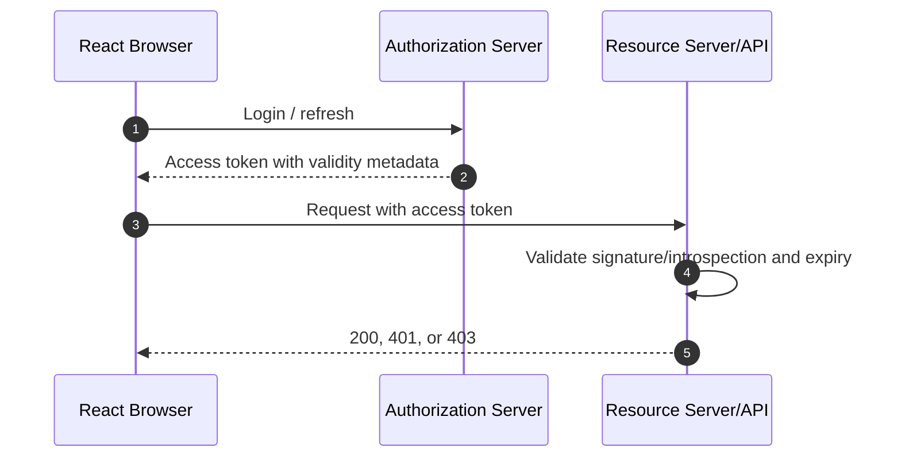
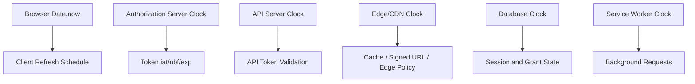
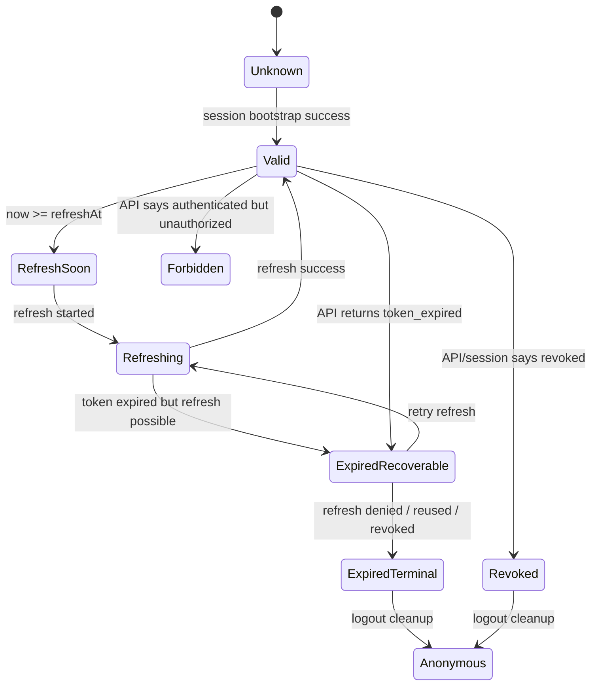
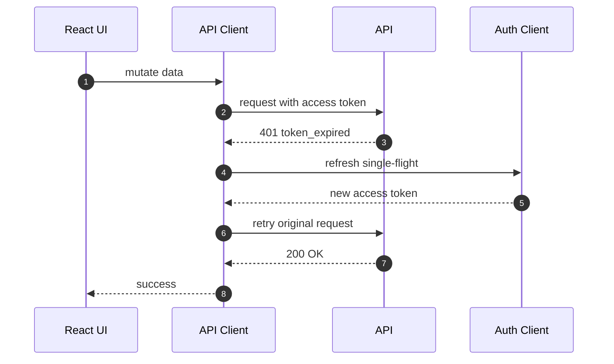
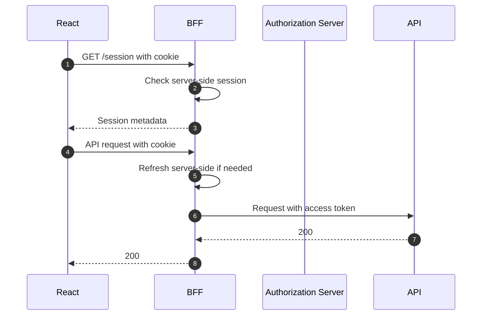

# Part 015 — Token Expiry and Clock Skew

Token expiry looks like a field on a token.

In production, it is a distributed-systems problem.

A React app does not live in one clock. It lives between:

- the browser clock,
- the authorization server clock,
- one or more API server clocks,
- CDN or edge clocks,
- service worker cache state,
- multiple browser tabs,
- background/foreground browser scheduling,
- mobile sleep/wake behavior,
- network retries,
- user inactivity,
- permission updates,
- logout/revocation events.

That means token expiry is not only about checking `Date.now() > exp`. It is about designing a system where identity, session, authorization, cache, retry, and user experience converge safely even when time is slightly wrong.

The core rule:

```txt
The client may estimate expiry for UX and refresh timing.
The server must enforce expiry for security.
```

A React app can use token expiry to avoid obviously doomed requests. It must not treat local expiry calculation as authoritative security enforcement.

---

## 1. The wrong mental model

The common beginner model:

```txt
JWT has exp.
React checks exp.
If expired, redirect to login.
```

This model is incomplete.

It misses:

- server-side validation,
- clock skew,
- refresh race conditions,
- tab coordination,
- permission changes before token expiry,
- revocation before token expiry,
- long-running forms,
- optimistic mutations,
- stale data caches,
- SSR/client mismatch,
- background browser throttling,
- retry storms after mass expiry.

The better model:

```txt
Token expiry is one signal in a session lifecycle state machine.
```

The token has a validity window. The session has a lifecycle. The authorization grant has a revocation state. The user has current membership and permission state. The UI has cached projections of those facts.

Those things are related, but they are not the same.

---

## 2. Expiry is a contract between issuer and verifier

A token is issued by one party and consumed by another party.



The important enforcement happens at the API/resource server.

React may know that the access token is about to expire. React may proactively refresh. React may show a countdown before session timeout. React may stop sending a token that is clearly expired.

But the API must still validate expiry because the browser is attacker-controlled from the server's perspective.

A malicious user can:

- edit JavaScript state,
- patch runtime functions,
- send requests outside the browser,
- replay old tokens,
- bypass route guards,
- construct raw HTTP requests,
- lie about current time.

So the expiry check that matters must be server-side.

---

## 3. The vocabulary of time in auth systems

Auth systems usually contain several different lifetimes.

Do not collapse them into one variable named `expiresAt`.

| Lifetime | Meaning | Who enforces it | Common representation |
|---|---|---|---|
| Access token lifetime | How long the access token may be accepted by an API | Resource server/API | JWT `exp`, introspection response, opaque token metadata |
| Refresh token lifetime | How long refresh can continue | Authorization server | DB state, refresh token family state |
| Idle session timeout | Session ends after inactivity | Session server/BFF/Auth server | `lastSeenAt`, rolling cookie, server session |
| Absolute session timeout | Session ends no matter how active the user is | Session server/Auth server | `sessionExpiresAt` |
| ID token lifetime | How long ID token claims are considered fresh by relying party | Client/server depending on architecture | OIDC ID token `exp`, `auth_time` |
| Permission cache TTL | How long client/server may cache authorization projection | Client/API/policy layer | `permissionsVersion`, TTL, ETag |
| CSRF token lifetime | How long CSRF token remains usable | Backend | Session-bound token metadata |
| Signed URL lifetime | How long object URL may access file/blob | Object store/CDN/API | URL query signature expiration |
| Re-auth freshness | How recent authentication must be for sensitive action | Backend/Auth server | `auth_time`, ACR/AMR, step-up result |

Each lifetime answers a different question.

```txt
Can this API accept this credential?
Can this browser obtain a new credential?
Is this user still logged in?
Are these permissions still current?
Is this sensitive action sufficiently fresh?
```

If you use one timestamp for all of those, you will eventually produce either a security bug or a terrible user experience.

---

## 4. JWT time claims: `exp`, `nbf`, `iat`

A JWT commonly includes NumericDate-based claims such as:

```json
{
  "iss": "https://auth.example.com",
  "aud": "https://api.example.com",
  "sub": "user_123",
  "iat": 1783480000,
  "nbf": 1783480000,
  "exp": 1783480900
}
```

The three time claims are conceptually different.

| Claim | Meaning | Common use |
|---|---|---|
| `exp` | Expiration time. On or after this time, token must not be accepted. | Hard upper bound for token acceptance. |
| `nbf` | Not-before time. Before this time, token must not be accepted. | Future activation, clock coordination, delayed validity. |
| `iat` | Issued-at time. When token was issued. | Age calculation, debugging, replay heuristics. |

Practical nuance:

- `exp` is usually mandatory for access tokens in sane production systems.
- `nbf` is less common but matters when clocks or staged activation are involved.
- `iat` is useful but should not become a fragile strict equality check.
- A tiny allowed skew may be reasonable server-side.
- A huge allowed skew turns expiry into theatre.

In React, these claims are usually only hints. The browser can decode a JWT to schedule refresh, but the API must validate the claims independently.

---

## 5. Opaque token expiry

Opaque tokens do not reveal claims to the client.

```txt
eyJhbGciOi...     -> structured JWT-like credential
2YotnFZFEjr1zCsicMWpAA -> opaque reference credential
```

With opaque access tokens, React cannot decode `exp` from the token value. That is often a feature, not a problem.

The authorization server or BFF can return explicit session metadata:

```json
{
  "authenticated": true,
  "user": {
    "id": "user_123",
    "displayName": "Ari"
  },
  "session": {
    "accessExpiresAt": "2026-07-08T04:15:00.000Z",
    "refreshExpiresAt": "2026-07-15T04:00:00.000Z",
    "serverTime": "2026-07-08T04:00:02.120Z"
  }
}
```

The client does not need to inspect the credential itself. It needs enough metadata to make UX decisions.

This is usually cleaner:

```txt
Credential stays opaque.
Session metadata is explicit.
UI state is derived from server response.
```

---

## 6. The clock domains

The phrase "current time" is ambiguous.



You need to know which clock is authoritative for which decision.

| Decision | Authoritative clock |
|---|---|
| Is token expired for API access? | API/resource server clock, usually aligned to auth server. |
| Should browser refresh soon? | Browser estimate adjusted by server time. |
| Is refresh token valid? | Authorization/session server clock. |
| Is session idle timeout exceeded? | Session server clock. |
| Is cached permission projection stale? | Server version/ETag plus TTL. |
| Has signed URL expired? | Signing verifier/object store/CDN clock. |

Never build a system that requires the browser clock to be correct for security.

---

## 7. Clock skew: what it is and why it breaks auth

Clock skew is the difference between clocks that are expected to agree.

Example:

```txt
Auth server time:    10:00:00
API server time:     10:00:03
Browser time:        09:57:20
```

A token issued at auth server time `10:00:00` with `nbf=10:00:00` might be rejected by an API whose clock is behind. A token that the browser thinks is still valid might already be expired according to the API.

The common failure modes:

| Skew direction | Failure |
|---|---|
| Browser behind server | Browser sends token it believes valid; API returns expired. |
| Browser ahead of server | Browser refreshes too early; may create unnecessary refresh load. |
| API behind auth server | API may reject `nbf` token as not yet valid. |
| API ahead of auth server | API may expire token early. |
| Edge ahead/behind API | Signed URLs or cached auth decisions behave inconsistently. |

Clock skew is normal. Your design should tolerate small skew. It should not normalize large skew as acceptable.

---

## 8. Leeway: useful but dangerous

Leeway is a small tolerance window used during token time validation.

Example:

```txt
Accept token if now < exp + 30 seconds
Accept token if now >= nbf - 30 seconds
```

Leeway exists because distributed clocks are imperfect.

But leeway is not free.

If your access token lifetime is 5 minutes and your leeway is 5 minutes, you doubled the effective lifetime.

A reasonable mental model:

```txt
Leeway compensates for clock error.
It must not compensate for bad lifecycle design.
```

Client-side refresh threshold is different from server-side validation leeway.

| Concept | Purpose | Example |
|---|---|---|
| Server validation leeway | Avoid rejecting valid token due to tiny clock skew | 30 seconds |
| Client refresh threshold | Refresh before token expires to avoid failed request | 60 to 120 seconds |
| Client jitter | Avoid all clients refreshing at exactly same time | random 0 to 30 seconds |

Do not use one magic number for all three.

---

## 9. Server time offset in React

A strong React auth client should estimate server time.

When the app calls `/session`, the server should include its current time:

```json
{
  "authenticated": true,
  "serverTime": "2026-07-08T04:00:00.000Z",
  "accessExpiresAt": "2026-07-08T04:10:00.000Z"
}
```

The client can calculate an offset:

```ts
export type ClockSnapshot = {
  receivedAtClientMs: number;
  serverTimeMs: number;
};

export function createServerClock(snapshot: ClockSnapshot) {
  const offsetMs = snapshot.serverTimeMs - snapshot.receivedAtClientMs;

  return {
    nowMs() {
      return Date.now() + offsetMs;
    },
    offsetMs,
  };
}
```

This is not security enforcement. It is refresh scheduling hygiene.

Why it helps:

- users with wrong laptop clocks still get sane refresh behavior,
- proactive refresh is based on server reality,
- countdown UI is less misleading,
- debug logs can compare client and server time.

You still handle API `401` because the estimate can be wrong.

---

## 10. Expiry state machine

Expiry should be modeled as states, not scattered `if` checks.



This separates different outcomes:

- expired access token but refresh possible,
- expired refresh token,
- revoked session,
- invalid token,
- forbidden action,
- unknown session state.

Those should not all become `logout()`.

---

## 11. Proactive refresh

Proactive refresh means refreshing before access token expiry.

Without proactive refresh, the user is more likely to hit an expired token during interaction:

```txt
User fills long form for 12 minutes.
Access token expired at minute 10.
User clicks submit.
Mutation fails.
```

Proactive refresh avoids many obvious failures.

The basic algorithm:

```ts
type ExpiryPlan = {
  accessExpiresAtMs: number;
  refreshThresholdMs: number;
  jitterMs: number;
  minimumDelayMs: number;
};

export function computeNextRefreshDelayMs(plan: ExpiryPlan, nowMs: number) {
  const refreshAt = plan.accessExpiresAtMs - plan.refreshThresholdMs - plan.jitterMs;
  return Math.max(plan.minimumDelayMs, refreshAt - nowMs);
}
```

Example:

```txt
accessExpiresAt = 10:10:00
refreshThreshold = 90 seconds
jitter = 17 seconds
refreshAt = 10:08:13
```

The user sees continuous session. The API sees fewer expired-token requests. Your logs see fewer avoidable 401s.

But proactive refresh is not enough. Browser timers can be delayed.

Reasons timers do not fire exactly when you expect:

- inactive tabs are throttled,
- laptop sleeps,
- browser suspends background pages,
- mobile OS freezes the tab,
- long JavaScript tasks block the event loop,
- page crashes and restores,
- user manually changes time.

So proactive refresh must be paired with reactive recovery.

---

## 12. Reactive refresh

Reactive refresh means the API returns an auth failure and the client attempts to recover.



Reactive refresh requires strict guardrails.

Rules:

1. Retry only when failure is recoverable.
2. Retry only once per request unless explicitly safe.
3. Do not retry non-idempotent mutations blindly.
4. Use idempotency keys for risky mutations.
5. Do not refresh on `403`.
6. Do not infinite-loop on `401`.
7. Centralize this in the API client, not every component.

Bad code:

```ts
if (response.status === 401) {
  await refresh();
  return fetch(input, init);
}
```

Better shape:

```ts
type AuthFailureCode =
  | 'token_expired'
  | 'token_invalid'
  | 'session_revoked'
  | 'refresh_required'
  | 'mfa_required';

type RequestAuthPolicy = {
  canRetryAfterRefresh: boolean;
  idempotencyKey?: string;
  alreadyRetried?: boolean;
};

export async function requestWithAuth(input: RequestInfo, init: RequestInit & {
  authPolicy?: RequestAuthPolicy;
}) {
  const first = await fetch(input, init);

  if (first.status !== 401) return first;

  const failure = await parseAuthFailure(first);
  const policy = init.authPolicy ?? { canRetryAfterRefresh: true };

  if (failure.code !== 'token_expired') return first;
  if (!policy.canRetryAfterRefresh) return first;
  if (policy.alreadyRetried) return first;

  await authClient.refreshSingleFlight();

  return fetch(input, {
    ...init,
    authPolicy: {
      ...policy,
      alreadyRetried: true,
    },
  });
}
```

The exact implementation depends on cookie vs bearer token. The invariant is the same: one controlled recovery path.

---

## 13. Single-flight refresh

If ten requests fail with `401 token_expired`, you do not want ten refresh calls.

You want one refresh call and nine waiters.

```ts
class RefreshCoordinator {
  private inFlight: Promise<void> | null = null;

  refreshOnce(runRefresh: () => Promise<void>) {
    if (!this.inFlight) {
      this.inFlight = runRefresh().finally(() => {
        this.inFlight = null;
      });
    }

    return this.inFlight;
  }
}
```

Usage:

```ts
const refreshCoordinator = new RefreshCoordinator();

async function refreshSingleFlight() {
  return refreshCoordinator.refreshOnce(async () => {
    const result = await fetch('/auth/refresh', {
      method: 'POST',
      credentials: 'include',
    });

    if (!result.ok) {
      throw await parseAuthFailure(result);
    }

    await sessionStore.reload();
  });
}
```

This solves same-tab duplicate refreshes.

It does not solve multi-tab refreshes by itself.

---

## 14. Multi-tab expiry coordination

A user may open your app in five tabs.

At 10:08:13, all tabs may decide it is time to refresh.

If you use refresh token rotation, this can create serious trouble:

```txt
Tab A uses R1 and gets R2.
Tab B still has R1 and also tries refresh.
Server sees R1 reuse.
Server may revoke token family.
User is logged out everywhere.
```

You need coordination.

Common browser mechanisms:

| Mechanism | Useful for |
|---|---|
| `BroadcastChannel` | Notify tabs of refresh success, logout, session update. |
| `localStorage` event | Fallback cross-tab signaling. Be careful not to store tokens. |
| Web Locks API | Cross-tab mutual exclusion where supported. |
| BFF server session | Avoid exposing refresh token to tabs; server centralizes rotation. |

A simple event shape:

```ts
type AuthTabEvent =
  | { type: 'refresh_started'; at: string; tabId: string }
  | { type: 'refresh_completed'; at: string; tabId: string }
  | { type: 'refresh_failed'; at: string; tabId: string; reason: string }
  | { type: 'logout'; at: string; reason: string }
  | { type: 'session_reloaded'; at: string; version: string };
```

A tab that hears `refresh_completed` should reload session state instead of running another refresh.

---

## 15. The BFF simplification

A Backend-for-Frontend can simplify browser expiry.



The browser no longer manages refresh token rotation directly. It holds an HTTP-only cookie. The BFF holds or obtains access tokens server-side.

Benefits:

- refresh token hidden from JavaScript,
- rotation race handled server-side,
- token expiry hidden behind BFF,
- frontend receives simpler session metadata,
- revocation and logout can be centralized.

Costs:

- more backend complexity,
- API proxying,
- CSRF defense if cookie-authenticated,
- scaling/session-store design,
- observability across BFF and API.

For high-risk enterprise apps, BFF often produces cleaner failure boundaries than pure browser token management.

---

## 16. Token expiry is not permission expiry

A token can be valid while permissions are stale.

Example:

```txt
10:00 access token issued with role admin
10:03 user's admin role removed
10:10 access token expires
```

If the API trusts only token claims until `10:10`, the user may retain admin power for seven extra minutes.

Sometimes that is acceptable. Sometimes it is not.

The decision depends on domain risk.

For low-risk UI hints:

```txt
Access token contains coarse scope.
Permission changes apply when token refreshes.
```

For high-risk regulated actions:

```txt
API checks current policy/resource state at request time.
Token identity only proves subject/client/session.
Authorization is evaluated against current data.
```

React should treat token claims as identity/session hints, not final object-level permission.

Better API response:

```json
{
  "user": { "id": "user_123" },
  "tenant": { "id": "tenant_456" },
  "permissions": {
    "version": "permv_901",
    "expiresAt": "2026-07-08T04:02:00.000Z",
    "actions": ["case.read", "case.assign"]
  }
}
```

Now permission projection has its own version and expiry.

---

## 17. Cache invalidation on expiry

Token expiry affects caches.

If user logs out or session expires, the app must clear sensitive cached data.

Caches to consider:

- React state,
- TanStack Query cache,
- Apollo cache,
- SWR cache,
- Redux/Zustand/Jotai stores,
- router loader data,
- service worker caches,
- IndexedDB,
- memory-level API client cache,
- form drafts containing sensitive data,
- object URLs,
- downloaded blobs,
- local logs/analytics breadcrumbs.

Minimal logout cleanup shape:

```ts
export async function clearAuthenticatedClientState() {
  queryClient.clear();
  apolloClient.clearStore();
  authStore.reset();
  permissionStore.reset();
  routeDataStore.reset();
  revokeObjectUrls();
  clearSensitiveFormDrafts();
}
```

Do not leave the previous user's data visible after auth state becomes anonymous.

This matters especially on shared machines and tenant-switch scenarios.

---

## 18. Long-running forms

Long forms are where expiry bugs become user pain.

A common failure:

1. user opens edit form,
2. token expires while typing,
3. user clicks Save,
4. request fails with `401`,
5. app redirects to login,
6. user loses work.

Better behavior:

```txt
Before risky submit:
  if token is near expiry:
    refresh first
  submit after refresh
  if refresh fails:
    preserve draft and show re-auth flow
```

Example:

```ts
async function submitCaseUpdate(input: CaseUpdateInput) {
  await authClient.ensureFreshAccess({
    minimumValidityMs: 120_000,
    reason: 'case_update_submit',
  });

  return api.updateCase(input, {
    idempotencyKey: crypto.randomUUID(),
  });
}
```

Important distinction:

- Refresh before submit improves UX.
- Server still checks permission and token validity on submit.

---

## 19. Sensitive action freshness

Some actions require recent authentication, not merely an unexpired access token.

Examples:

- changing password,
- modifying MFA,
- exporting sensitive data,
- granting admin role,
- approving high-value transaction,
- deleting a regulated case record,
- enabling impersonation,
- changing tenant security settings.

The access token may be valid, but the authentication event may be too old.

Useful model:

```txt
access token validity answers: can this credential call API?
auth freshness answers: did the user authenticate recently enough for this action?
```

API response:

```json
{
  "error": "mfa_required",
  "reason": "This action requires recent MFA verification.",
  "challenge": {
    "type": "step_up",
    "requiredAcr": "urn:example:acr:mfa",
    "returnTo": "/settings/security"
  }
}
```

React should treat this as a state transition, not a generic error.

---

## 20. SSR and hydration expiry mismatch

Server-rendered React introduces another clock boundary.

Example:

```txt
Server rendered page at 10:09:58.
Access token expires at 10:10:00.
Browser hydrates at 10:10:02.
Client immediately sees expired session.
```

If not designed, the user sees:

- authenticated page flash,
- hydration mismatch,
- immediate redirect,
- duplicate refresh,
- inconsistent cache state.

Safer pattern:

```txt
Server render should include session metadata.
Client hydration should reconcile metadata with serverTime.
Near-expiry sessions should refresh before rendering sensitive interactive UI.
```

Do not assume SSR eliminates auth race conditions. It only moves some of them to a different boundary.

---

## 21. Edge and CDN expiry hazards

Authenticated apps often interact with edge systems:

- CDN caching,
- signed URLs,
- image optimization,
- route middleware,
- edge functions,
- object storage links.

Expiry bugs appear when edge validity differs from API validity.

Example:

```txt
API session expired.
Signed download URL remains valid for 30 minutes.
User logs out.
File link in browser history still works.
```

For sensitive files, signed URL lifetime should be short and scoped.

Better file access pattern:

```txt
React requests file access.
API checks current authorization.
API returns short-lived signed URL.
Browser downloads.
URL expires quickly.
```

For highly sensitive content, proxy the download through an authorization-checking endpoint instead of issuing long-lived direct URLs.

---

## 22. Error taxonomy for expiry

Do not return only `401 Unauthorized` with no machine-readable reason.

A precise response lets React recover correctly.

Example shape:

```json
{
  "error": {
    "code": "token_expired",
    "message": "Access token expired.",
    "recoverable": true,
    "recommendedAction": "refresh"
  }
}
```

Useful codes:

| Code | HTTP | Meaning | React action |
|---|---:|---|---|
| `token_expired` | 401 | Access token expired | Refresh once, retry if safe. |
| `token_invalid` | 401 | Token malformed, bad signature, wrong audience | Stop retrying, reload session/logout. |
| `token_not_yet_valid` | 401 | `nbf` not reached or clock issue | Reload session, maybe retry after tiny delay. |
| `session_expired` | 401 | Session cannot continue | Clear auth state, show login. |
| `session_revoked` | 401 | Server revoked session | Clear state, show revoked-session message. |
| `refresh_reuse_detected` | 401 | Rotated refresh token reused | Global logout, security messaging. |
| `mfa_required` | 401 or 403 | Step-up required | Start challenge flow. |
| `insufficient_scope` | 403 | Token lacks coarse scope | Do not refresh; show forbidden/request access. |
| `permission_denied` | 403 | Current subject cannot perform action | Do not refresh; show reason. |

The API contract should tell the client whether refresh is plausible.

---

## 23. Avoiding retry storms

Mass expiry can create traffic spikes.

Example:

```txt
10,000 users receive 10-minute access tokens at 09:00.
At 09:10, many clients refresh together.
Then many failed API calls retry together.
```

Use jitter.

```ts
function randomJitterMs(maxMs: number) {
  return Math.floor(Math.random() * maxMs);
}

const refreshThresholdMs = 90_000;
const jitterMs = randomJitterMs(30_000);
```

Also:

- refresh before expiry,
- single-flight refresh in tab,
- cross-tab coordination,
- exponential backoff for transient refresh failures,
- circuit-breaker behavior for auth server outage,
- do not retry every request independently,
- surface degraded auth state instead of spinning forever.

A refresh storm is a self-inflicted outage.

---

## 24. API client implementation pattern

A production-grade auth-aware API client needs a small internal protocol.

```ts
type AuthSession = {
  status: 'anonymous' | 'authenticated' | 'refreshing' | 'expired' | 'revoked';
  accessExpiresAtMs?: number;
  refreshExpiresAtMs?: number;
  serverClockOffsetMs?: number;
  version?: string;
};

type EnsureFreshOptions = {
  minimumValidityMs: number;
  reason: string;
};

class AuthClient {
  private session: AuthSession = { status: 'anonymous' };
  private refreshCoordinator = new RefreshCoordinator();

  getEstimatedServerNowMs() {
    return Date.now() + (this.session.serverClockOffsetMs ?? 0);
  }

  isAccessFresh(minimumValidityMs: number) {
    if (this.session.status !== 'authenticated') return false;
    if (!this.session.accessExpiresAtMs) return true; // cookie-only opaque sessions may not expose it

    const now = this.getEstimatedServerNowMs();
    return this.session.accessExpiresAtMs - now >= minimumValidityMs;
  }

  async ensureFreshAccess(options: EnsureFreshOptions) {
    if (this.isAccessFresh(options.minimumValidityMs)) return;

    await this.refreshCoordinator.refreshOnce(async () => {
      if (this.isAccessFresh(options.minimumValidityMs)) return;
      await this.refresh(options.reason);
    });
  }

  private async refresh(reason: string) {
    this.session = { ...this.session, status: 'refreshing' };

    const response = await fetch('/auth/refresh', {
      method: 'POST',
      credentials: 'include',
      headers: {
        'X-Refresh-Reason': reason,
      },
    });

    if (!response.ok) {
      const failure = await parseAuthFailure(response);
      this.session = mapRefreshFailureToSession(failure);
      throw failure;
    }

    const next = await response.json();
    this.session = normalizeSession(next);
  }
}
```

The key is not the exact class. The key is that refresh is explicit, stateful, observable, and constrained.

---

## 25. React hook shape

Components should not parse tokens or schedule timers directly.

They should consume auth state and commands.

```ts
type UseAuthSessionResult = {
  status: 'loading' | 'anonymous' | 'authenticated' | 'refreshing' | 'expired' | 'revoked';
  user?: { id: string; displayName: string };
  accessExpiresAt?: Date;
  ensureFreshAccess(options: EnsureFreshOptions): Promise<void>;
  logout(reason?: string): Promise<void>;
};

export function useAuthSession(): UseAuthSessionResult {
  return useContext(AuthSessionContext);
}
```

Usage:

```tsx
function ExportButton() {
  const auth = useAuthSession();

  async function onExport() {
    await auth.ensureFreshAccess({
      minimumValidityMs: 120_000,
      reason: 'export_cases',
    });

    await exportCases();
  }

  return <button onClick={onExport}>Export</button>;
}
```

The button does not know where tokens live. It asks for a capability: fresh enough session for this operation.

---

## 26. Router loader integration

Auth should happen before protected data loads.

For React Router Data/Framework style apps, a loader can ensure session validity before requesting protected data.

```ts
export async function protectedCaseLoader({ params }: LoaderFunctionArgs) {
  await authClient.ensureFreshAccess({
    minimumValidityMs: 60_000,
    reason: 'case_loader',
  });

  const response = await api.get(`/cases/${params.caseId}`);

  if (response.status === 403) {
    throw new Response('Forbidden', { status: 403 });
  }

  return response.json();
}
```

This avoids rendering a protected screen only to discover later that the session cannot read its data.

But loaders must still handle reactive failures. `ensureFreshAccess` is an optimization, not a guarantee.

---

## 27. Monitoring expiry behavior

You cannot improve what you cannot see.

Useful metrics:

| Metric | Why it matters |
|---|---|
| `auth.refresh.success.rate` | Refresh health. |
| `auth.refresh.failure.rate` | Token/session issue. |
| `auth.refresh.reuse_detected.count` | Potential compromise or race bug. |
| `api.401.token_expired.count` | Proactive refresh quality. |
| `api.401.token_invalid.count` | Bad clients, attack, key mismatch. |
| `api.403.permission_denied.count` | Authorization usage and user friction. |
| `auth.client.clock_offset_ms` | Detect wrong client clocks. |
| `auth.refresh.latency_ms` | UX and storm indicator. |
| `auth.redirect_loop.count` | Broken state machine. |
| `auth.session.expired_while_active.count` | Bad idle/refresh design. |

Log safely:

```json
{
  "event": "auth.refresh_failed",
  "reason": "token_expired",
  "sessionIdHash": "sha256:...",
  "userId": "user_123",
  "tenantId": "tenant_456",
  "clientClockOffsetMs": -142000,
  "requestId": "req_abc",
  "tabId": "tab_789"
}
```

Never log raw tokens.

---

## 28. Testing expiry and clock skew

Auth expiry bugs are easy to miss if tests use only happy-path login.

Test cases:

| Scenario | Expected behavior |
|---|---|
| Access token valid for more than threshold | Request proceeds without refresh. |
| Access token near expiry | Client refreshes before request. |
| Access token expired, refresh valid | Client refreshes and retries safe request once. |
| Access token expired, refresh expired | Client transitions to anonymous/expired. |
| API returns `403` | Client does not refresh. |
| API returns `401 token_invalid` | Client does not infinite loop. |
| Two requests hit expiry simultaneously | One refresh, both requests recover. |
| Five tabs refresh simultaneously | One effective refresh or safe convergence. |
| Browser clock ahead by 5 minutes | Client still behaves using serverTime offset. |
| Browser sleeps past expiry | First interaction recovers or reauths cleanly. |
| Permission revoked before token expiry | API denies current action. |
| Logout in one tab | Other tabs clear state. |

Use fake timers, MSW, and deterministic server responses.

Example unit test idea:

```ts
it('refreshes once for concurrent expired requests', async () => {
  server.use(
    http.get('/api/a', () => HttpResponse.json({ code: 'token_expired' }, { status: 401 })),
    http.get('/api/b', () => HttpResponse.json({ code: 'token_expired' }, { status: 401 })),
    http.post('/auth/refresh', refreshSpyResolver),
  );

  await Promise.all([
    api.get('/api/a'),
    api.get('/api/b'),
  ]);

  expect(refreshSpy).toHaveBeenCalledTimes(1);
});
```

The point is not merely testing code. It is proving lifecycle invariants.

---

## 29. Anti-pattern catalog

### Anti-pattern: `exp` decode equals authentication

```ts
const authenticated = decodeJwt(token).exp > Date.now() / 1000;
```

Why it is wrong:

- token may have bad signature,
- wrong audience,
- wrong issuer,
- revoked grant,
- stale permission,
- wrong tenant,
- browser clock may be wrong.

Use `/session` or server validation as the authority.

### Anti-pattern: refresh on every `401`

Not all `401` failures are expiry.

Refreshing on invalid tokens, revoked sessions, or MFA challenges creates loops and hides incidents.

### Anti-pattern: refresh every request

This defeats token lifetime design and creates unnecessary load.

### Anti-pattern: huge access token lifetime

A 24-hour bearer access token is often a poor substitute for proper refresh/session design.

### Anti-pattern: no jitter

Large customer tenants logging in at the same time can create synchronized expiry waves.

### Anti-pattern: permission encoded only in long-lived token

If permissions must change quickly, do not rely only on token expiry.

### Anti-pattern: redirect to login on every auth error

You will destroy user work and make debugging harder.

Distinguish expired, revoked, forbidden, step-up, and transient outage.

---

## 30. Production checklist

Before shipping token expiry handling, verify:

- Access token lifetime is intentionally short enough for risk profile.
- Refresh token/session lifetime is separate from access token lifetime.
- Server validates token expiry, issuer, audience, signature/introspection result.
- Client uses expiry only for scheduling and UX.
- Server validation leeway is small and deliberate.
- Client refresh threshold is separate from server leeway.
- Refresh has jitter.
- Refresh is single-flight within one tab.
- Multi-tab behavior is coordinated.
- `401` and `403` are not conflated.
- API returns machine-readable auth failure codes.
- Mutations are not blindly replayed after refresh.
- Idempotency keys exist for dangerous retries.
- Logout clears authenticated caches.
- Tenant switch clears tenant-scoped caches.
- Permission changes do not rely solely on long-lived token expiry when risk is high.
- Clock offset is measured from server time.
- Observability covers refresh success/failure, expired-token 401s, reuse detection, and redirect loops.
- Tests simulate expiry, skew, concurrency, tab coordination, browser sleep, and permission revocation.

---

## 31. The invariant

The invariant for this part:

```txt
Token expiry is enforced by the server, estimated by the client, and recovered through an explicit session lifecycle state machine.
```

When that invariant holds, expiry becomes predictable.

When it does not, your app becomes a pile of accidental redirects, lost form submissions, stale permissions, retry loops, and mystery logouts.

In the next part, we will step back and ask a related architectural question: should the access token be a JWT at all, or should it be opaque?

---

## References

- RFC 7519 — JSON Web Token: https://datatracker.ietf.org/doc/html/rfc7519
- RFC 9700 — Best Current Practice for OAuth 2.0 Security: https://datatracker.ietf.org/doc/rfc9700/
- RFC 9068 — JWT Profile for OAuth 2.0 Access Tokens: https://datatracker.ietf.org/doc/html/rfc9068
- RFC 7662 — OAuth 2.0 Token Introspection: https://datatracker.ietf.org/doc/html/rfc7662
- OWASP Session Management Cheat Sheet: https://cheatsheetseries.owasp.org/cheatsheets/Session_Management_Cheat_Sheet.html
- OWASP Authorization Cheat Sheet: https://cheatsheetseries.owasp.org/cheatsheets/Authorization_Cheat_Sheet.html
