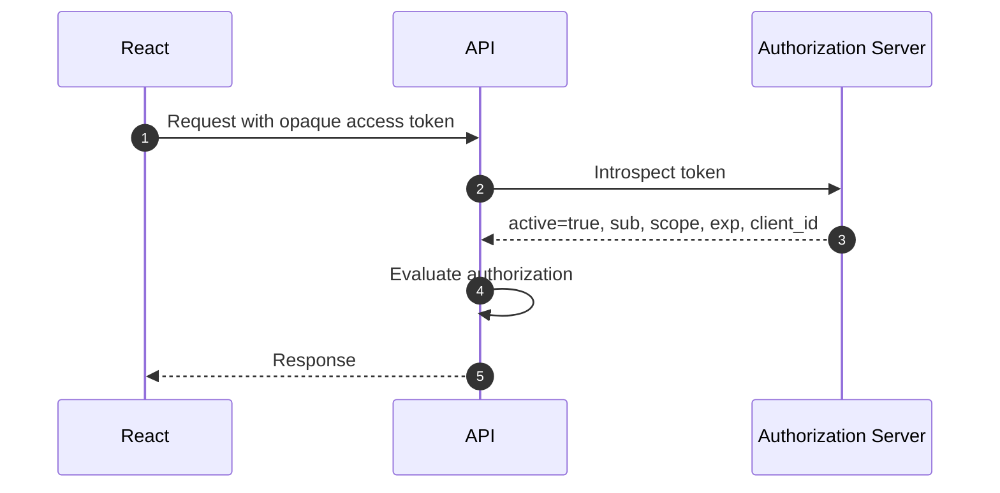
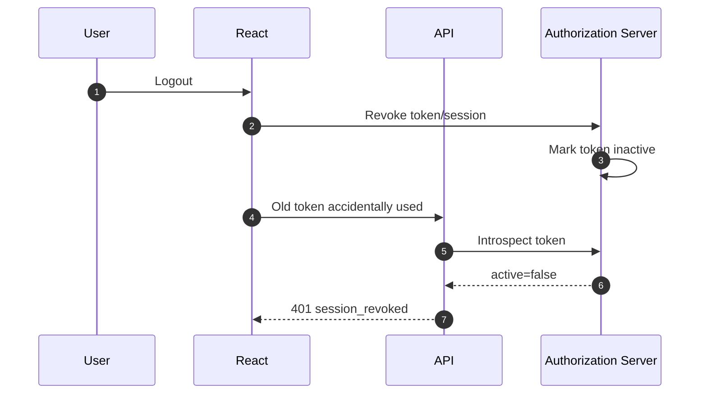
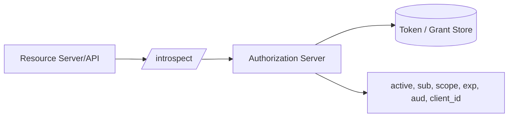
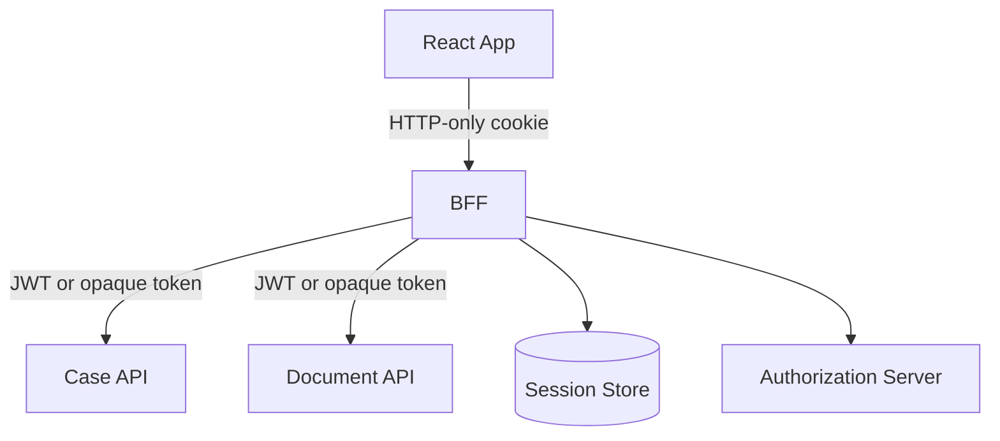
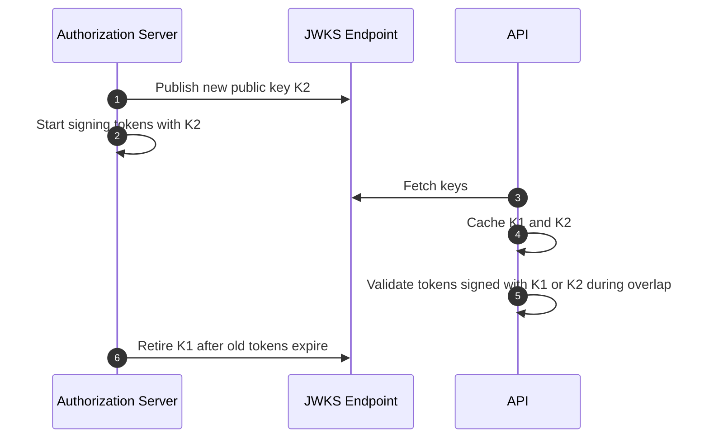
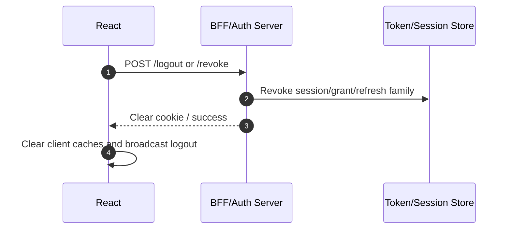

# Part 016 — JWT vs Opaque Token

JWT versus opaque token is one of the most misunderstood auth decisions in frontend engineering.

The common shallow debate:

```txt
JWT is stateless.
Opaque token is stateful.
JWT scales better.
Opaque token revokes better.
```

That is not enough.

The real decision touches:

- token audience,
- resource server topology,
- revocation requirements,
- claim freshness,
- key management,
- API latency budget,
- data minimization,
- frontend exposure risk,
- BFF architecture,
- tenant isolation,
- permission model,
- operational maturity,
- incident response.

Most React engineers should not start by asking:

```txt
Should I use JWT?
```

They should ask:

```txt
Which party must validate this credential?
How fresh must authorization be?
What happens when access is revoked?
What information should never reach the browser?
```

Only after answering those questions does the token format become meaningful.

---

## 1. Token format is not the auth model

A token is a credential.

Its format determines how it is validated and what information it carries. It does not magically solve authentication or authorization.

```txt
JWT token      -> structured credential with claims
Opaque token   -> reference credential whose meaning is stored elsewhere
```

Both can be secure. Both can be dangerous.

A bad JWT design can leak PII, over-trust stale roles, and be impossible to revoke quickly.

A bad opaque-token design can overload introspection, create single points of failure, and hide bugs behind central state.

The question is not which token is "modern". The question is which failure mode your architecture can safely operate.

---

## 2. What a JWT is

A JSON Web Token is a compact, URL-safe token format composed of three base64url-encoded parts:

```txt
header.payload.signature
```

Conceptually:

```json
{
  "header": {
    "typ": "at+jwt",
    "alg": "RS256",
    "kid": "key_2026_07"
  },
  "payload": {
    "iss": "https://auth.example.com",
    "sub": "user_123",
    "aud": "https://api.example.com",
    "client_id": "react-web-client",
    "exp": 1783480900,
    "iat": 1783480000,
    "jti": "token_abc",
    "scope": "case:read case:write"
  },
  "signature": "..."
}
```

In practice, the token is one string.

The resource server can validate a signed JWT by checking:

- the signature,
- issuer,
- audience,
- expiration,
- not-before time,
- token type/profile,
- algorithm constraints,
- key validity,
- required claims,
- optional revocation/jti policy,
- domain authorization outside the token.

The resource server does not need to call the authorization server on every request if it has the right public keys and validation rules.

That is the main appeal of JWT access tokens.

---

## 3. What an opaque token is

An opaque token is a credential whose contents are not meaningful to the holder or resource server without lookup.

Example:

```txt
2YotnFZFEjr1zCsicMWpAA
```

The API cannot decode it. The API validates it by calling an introspection endpoint or checking a shared session/token store.



The introspection response might look like:

```json
{
  "active": true,
  "iss": "https://auth.example.com",
  "sub": "user_123",
  "aud": "https://api.example.com",
  "client_id": "react-web-client",
  "scope": "case:read case:write",
  "exp": 1783480900
}
```

The token value itself is only a reference.

This makes revocation and central control easier, but it introduces runtime dependency on the authorization server or token store.

---

## 4. JWT and opaque token side by side

| Dimension | JWT access token | Opaque access token |
|---|---|---|
| Token content | Claims embedded in token | Meaning stored server-side |
| API validation | Local cryptographic validation | Introspection/store lookup |
| Runtime dependency | JWKS/key cache, no per-request auth-server call | Auth server/token store usually needed |
| Revocation speed | Harder unless short TTL, denylist, introspection, or policy check | Easier because server can mark inactive |
| Claim freshness | Claims stale until token expiry | Can be fresh at introspection time |
| Token size | Often larger | Usually small |
| Data leakage risk | Higher if claims contain sensitive data | Lower token self-disclosure |
| Debuggability | Easier to inspect, sometimes too easy | Requires server tooling |
| Cross-service scaling | Good when validation rules are mature | Needs scalable introspection/cache |
| Best fit | Many APIs, low-latency validation, bounded stale claims | High-control systems, revocation-heavy domains, BFF/session architectures |

Neither option removes the need for server-side authorization.

A valid token means the credential is acceptable. It does not mean every action is allowed.

---

## 5. The biggest frontend mistake

The biggest mistake is using token format as frontend authorization logic.

Bad:

```ts
const token = localStorage.getItem('access_token');
const claims = decodeJwt(token!);

if (claims.role === 'admin') {
  showAdminButton();
}
```

This is wrong for several reasons:

- decoding is not validation,
- the token may be expired,
- the token may have wrong audience,
- the token may be stale,
- the role may have changed,
- object-level permission is not captured,
- UI hiding is not enforcement,
- localStorage increases XSS exposure,
- a user can call the API directly.

Better:

```ts
const permissions = await sessionApi.getPermissionProjection();

if (permissions.can('case.approve', caseId)) {
  showApproveButton();
}
```

And still:

```txt
API must check case.approve on submit.
```

Client-side permission is an exposure-control projection, not final enforcement.

---

## 6. JWT is not automatically stateless

People say JWT is stateless because an API can validate it locally.

That is only partly true.

A JWT system still often needs state for:

- user account status,
- session revocation,
- refresh token family,
- key rotation metadata,
- tenant membership,
- permission changes,
- compromised token denylist,
- device/session management,
- audit trail,
- logout semantics,
- step-up authentication state.

If your product requires immediate role revocation, then a JWT containing old role claims is not enough.

You either:

- shorten JWT lifetime,
- introspect JWTs anyway,
- maintain a token revocation list,
- check permission version at request time,
- avoid embedding volatile authorization claims,
- use opaque tokens/BFF for high-control surfaces.

The token may be stateless. Your auth system is not.

---

## 7. Opaque token is not automatically safe

Opaque tokens hide claims from the browser, but they do not guarantee safety.

Bad opaque token architecture can fail through:

- weak random token generation,
- long-lived bearer token leakage,
- missing revocation endpoint,
- introspection endpoint exposure,
- poor introspection caching,
- missing audience validation,
- central authorization server outage,
- no rate limiting,
- no token binding/sender constraint,
- no audit trail,
- confused deputy between APIs.

An opaque token is still a bearer credential unless sender-constrained.

If stolen, whoever holds it may use it until it expires or is revoked.

---

## 8. Access token versus ID token

React apps often confuse ID tokens and access tokens.

| Token | Purpose | Audience | Should API accept it? |
|---|---|---|---|
| ID token | Proves authentication event and identity claims to the client/relying party | Client application | No, not as API authorization credential. |
| Access token | Grants access to protected resources | Resource server/API | Yes, if valid for that API. |
| Refresh token | Obtains new access tokens | Authorization server/client boundary | No, never send to API. |

If an API accepts an ID token as if it were an access token, it may bypass intended audience and scope boundaries.

For React engineers, the practical rule:

```txt
ID token tells the app who authenticated.
Access token lets the app call an API.
Permission response tells UI what to expose.
API policy decides what is allowed.
```

Do not collapse those into one token.

---

## 9. JWT access token profile

OAuth itself historically did not force access tokens to be JWTs. The JWT access token profile standardizes what a JWT-formatted OAuth access token should look like for interoperability.

A sane JWT access token should include enough claims for a resource server to validate that:

- the token was issued by the expected issuer,
- the token is intended for this API,
- the token is currently within its validity window,
- the token belongs to a specific subject/client,
- the token represents specific scopes or authorization context,
- the token type is not confused with an ID token or another JWT type.

Typical claims:

| Claim | Purpose |
|---|---|
| `iss` | Issuer. Which authorization server issued the token. |
| `sub` | Subject. Usually user or service principal. |
| `aud` | Audience. Which API/resource server should accept it. |
| `exp` | Expiration time. |
| `iat` | Issued-at time. |
| `nbf` | Not-before time if used. |
| `jti` | Token identifier for tracking/revocation/debugging. |
| `client_id` | OAuth client that obtained the token. |
| `scope` or `scp` | Coarse granted scopes. |
| `tenant_id` or similar | Tenant context, if your domain requires it. |

Do not blindly trust provider-specific claim names across systems. Normalize at the server boundary.

---

## 10. Signature validation is not enough

JWT validation is a checklist, not one function call.

Minimal server-side validation:

```ts
import { createRemoteJWKSet, jwtVerify } from 'jose';

const jwks = createRemoteJWKSet(new URL('https://auth.example.com/.well-known/jwks.json'));

export async function verifyAccessToken(token: string) {
  const { payload, protectedHeader } = await jwtVerify(token, jwks, {
    issuer: 'https://auth.example.com',
    audience: 'https://api.example.com',
    algorithms: ['RS256'],
    typ: 'at+jwt',
  });

  return {
    subject: String(payload.sub),
    clientId: String(payload.client_id),
    scopes: parseScopes(payload.scope),
    tokenId: String(payload.jti ?? ''),
    tenantId: String(payload.tenant_id ?? ''),
    header: protectedHeader,
  };
}
```

The server should also decide:

- what algorithms are allowed,
- how JWKS is cached,
- how key rotation is handled,
- whether `jti` denylist is checked,
- whether token type is enforced,
- how audience is matched,
- whether tenant claim is required,
- what claim names are provider-specific,
- how missing claims fail.

A JWT library can verify cryptography. It cannot understand your domain model.

---

## 11. JWT security pitfalls

JWTs have sharp edges.

Important pitfalls:

| Pitfall | Explanation |
|---|---|
| Algorithm confusion | Server accepts unexpected algorithm or mixes symmetric/asymmetric validation incorrectly. |
| `none` algorithm acceptance | Server accepts unsigned token. Modern libraries usually protect this, but misconfiguration still matters. |
| Missing audience validation | Token for another API is accepted. |
| Missing issuer validation | Token from another issuer is accepted. |
| Key confusion | Wrong JWKS or wrong tenant key is used. |
| Unsafe `kid` handling | Header-controlled key lookup becomes injection or file/URL lookup bug. |
| Overstuffed claims | PII and volatile permissions leak into browser and logs. |
| Long expiry | Stolen token remains useful too long. |
| Role-in-token only | Role changes do not take effect until expiry. |
| Decoding without validation | UI or backend trusts unverified payload. |
| Token type confusion | ID token accepted as access token. |

React engineers do not always implement server validation, but they must understand these pitfalls because frontend architecture choices influence token exposure and provider configuration.

---

## 12. Revocation semantics

Revocation is where JWT versus opaque token trade-offs become concrete.

### With opaque tokens

The token is a reference. The authorization server can mark it inactive.



Immediate revocation is easier because every validation can consult server state.

### With JWTs

The API can validate locally, so the authorization server cannot automatically stop every API from accepting already-issued JWTs unless the APIs check extra state.

Options:

| Strategy | Trade-off |
|---|---|
| Short access token TTL | Simple, but revocation delay equals remaining TTL. |
| `jti` denylist | Immediate-ish revocation but adds lookup/state. |
| Session version claim | API checks current session/permission version. |
| Introspection for JWT | Loses some stateless benefit but gains central control. |
| Sender-constrained token | Reduces stolen token usefulness but does not replace revocation. |
| BFF hides tokens | Browser cannot replay access token directly. |

There is no magic revocation. There is only an explicit consistency model.

---

## 13. Token introspection

Token introspection lets a protected resource ask the authorization server whether a token is active and what metadata it represents.



A resource server can use introspection for opaque tokens and sometimes for JWTs when immediate central validation is required.

Operational questions:

- Is introspection called on every request?
- Is the result cached?
- How long can it be cached?
- What happens if the introspection endpoint is down?
- Does fail-closed break all traffic?
- Does fail-open create security exposure?
- How is the resource server authenticated to introspection endpoint?
- Are scopes and audiences validated after introspection?

Common pattern:

```txt
Opaque token + introspection cache TTL of a few seconds
```

This gives revocation latency of roughly cache TTL plus propagation time.

If your regulatory model needs near-immediate revocation, document the exact bound.

---

## 14. Data minimization

JWTs are easy to inspect. That tempts teams to put too much inside them.

Bad payload:

```json
{
  "sub": "user_123",
  "email": "ari@example.com",
  "fullName": "Ari Example",
  "department": "Investigations",
  "roles": ["admin", "senior_investigator"],
  "permissions": ["case.read", "case.write", "case.delete", "case.approve"],
  "tenantName": "Sensitive Regulator Name",
  "managerEmail": "manager@example.com",
  "lastLoginIp": "203.0.113.10"
}
```

Problems:

- leaks PII to browser/devtools/logs,
- increases token size,
- creates stale permission snapshots,
- exposes internal structure,
- may appear in monitoring headers,
- makes claims hard to evolve,
- increases blast radius if copied.

Better payload:

```json
{
  "iss": "https://auth.example.com",
  "sub": "user_123",
  "aud": "https://api.example.com",
  "client_id": "react-web-client",
  "tenant_id": "tenant_456",
  "scope": "case-api",
  "exp": 1783480900,
  "iat": 1783480000,
  "jti": "token_abc"
}
```

Then fetch profile and permission projection through controlled APIs.

```txt
Token proves a compact authorization grant.
APIs fetch current domain data when needed.
```

---

## 15. Claim freshness and permission drift

Embedding permission into JWT means accepting staleness until expiry.

Example:

```json
{
  "sub": "user_123",
  "role": "case_supervisor",
  "exp": "10 minutes from now"
}
```

If the user loses supervisor role one minute later, every API that trusts only the role claim may allow supervisor actions for up to nine more minutes.

Ways to reduce drift:

1. Make access token lifetime very short.
2. Avoid volatile roles in token.
3. Include only coarse scopes.
4. Check current permission in API on sensitive actions.
5. Include `permission_version` and validate against server state.
6. Use introspection or opaque tokens for high-control surfaces.
7. Push revocation events to API caches.

In regulated case-management style systems, object-level and state-dependent authorization should not rely solely on JWT role claims.

A token may say:

```txt
subject user_123 is authenticated and may call case API
```

The API must still decide:

```txt
Can user_123 approve this specific case in its current lifecycle state?
```

---

## 16. Audience design

Audience is one of the most important claims.

Bad design:

```json
{
  "aud": "all-apis"
}
```

This makes tokens broadly replayable across services.

Better:

```json
{
  "aud": "https://case-api.example.com"
}
```

Or for multiple explicit audiences:

```json
{
  "aud": [
    "https://case-api.example.com",
    "https://document-api.example.com"
  ]
}
```

But be careful: every extra audience expands where a stolen token can be used.

React architecture implication:

- Do not ask for access tokens for APIs the current screen does not need.
- Avoid one mega-token for every backend.
- Prefer BFF mediation if frontend would otherwise juggle many access tokens.
- Match token audience to resource server boundary.

Audience is blast-radius control.

---

## 17. Scope is not domain authorization

OAuth scopes are coarse grants. They are useful, but they are usually not enough for business authorization.

Scope example:

```txt
case:write
```

Domain authorization question:

```txt
Can this investigator edit case C-2026-991 while it is in state PendingReview, assigned to another unit, under legal hold, in tenant T?
```

Those are different levels.

A good model:

```txt
Token scope: may call case write endpoint category.
Domain policy: may mutate this resource in this context.
```

API check:

```ts
const principal = await authenticateAccessToken(request);

if (!principal.scopes.has('case:write')) {
  throw insufficientScope();
}

const decision = await policy.can(principal, 'case.update', {
  caseId,
  tenantId,
  currentState,
  assignedUnit,
  legalHold,
});

if (!decision.allowed) {
  throw forbidden(decision.reason);
}
```

React should mirror this as permission projection, but never replace it.

---

## 18. BFF pattern and token format

In a BFF architecture, the React app may never see an access token.



This changes the JWT versus opaque question.

The browser-facing session can be:

```txt
HTTP-only opaque session cookie
```

The BFF-to-API token can be:

```txt
JWT access token for internal APIs
```

Or:

```txt
opaque access token introspected by APIs
```

The public browser boundary and internal service boundary do not need the same token format.

This is often the best of both worlds:

- browser gets minimal credential exposure,
- APIs get structured tokens or introspection as needed,
- refresh token stays server-side,
- revocation can be handled centrally,
- frontend complexity drops.

---

## 19. JWT in browser memory

If you do use JWT access tokens in React, prefer memory over persistent browser storage for high-risk apps.

Memory storage reduces persistence after tab close but does not solve XSS.

XSS can still read memory by executing in the page.

```txt
localStorage token: vulnerable to XSS and persistent after tab close.
memory token: vulnerable to active XSS but less persistent.
HTTP-only cookie: hidden from JS but requires CSRF defense.
BFF cookie: often cleaner for enterprise web apps.
```

Do not choose JWT because it is convenient to decode in the UI.

Choose it because your resource servers need local validation and your revocation/freshness model can tolerate the trade-off.

---

## 20. Opaque token with React

If React receives opaque access tokens, the frontend cannot decode user identity or expiry from the token.

That is fine.

Use explicit session endpoints:

```http
GET /session
```

Response:

```json
{
  "authenticated": true,
  "serverTime": "2026-07-08T04:00:00.000Z",
  "user": {
    "id": "user_123",
    "displayName": "Ari"
  },
  "tenant": {
    "id": "tenant_456",
    "name": "Regulatory Unit A"
  },
  "session": {
    "accessExpiresAt": "2026-07-08T04:10:00.000Z",
    "absoluteExpiresAt": "2026-07-08T12:00:00.000Z"
  },
  "permissions": {
    "version": "permv_901",
    "actions": ["case.read", "case.assign"]
  }
}
```

Do not make the token itself your frontend data model.

Session/profile/permission are API resources. Treat them as such.

---

## 21. Key rotation for JWT systems

JWT validation depends on keys.

Key rotation introduces operational complexity:



Rules:

- APIs must cache JWKS but refresh safely on unknown `kid`.
- Key overlap must exceed maximum token lifetime plus cache uncertainty.
- Do not fetch arbitrary URLs from token headers.
- Do not let `kid` choose files or SQL queries directly.
- Pin issuer and JWKS location by configuration.
- Alert on repeated unknown `kid` values.

JWTs reduce per-request authorization-server calls, but they add key lifecycle responsibility.

---

## 22. Introspection caching for opaque systems

Opaque token validation can become a bottleneck if every API call introspects synchronously.

A common solution is a short-lived introspection cache.

```ts
type IntrospectionCacheEntry = {
  active: boolean;
  subject?: string;
  scopes?: string[];
  audience?: string[];
  expiresAtMs: number;
  cacheUntilMs: number;
};
```

Cache TTL should be bounded by:

```txt
minimum(token remaining lifetime, acceptable revocation delay, operational cache limit)
```

Example:

```txt
Token expires in 5 minutes.
Regulatory revocation SLA says access removal within 30 seconds.
Introspection cache TTL should be less than or equal to 30 seconds, often less.
```

If revocation must be near-immediate, caching must be very short or event-driven.

The more you cache, the more your opaque system behaves like a short-lived self-contained token.

---

## 23. Token revocation endpoint

OAuth token revocation lets a client tell the authorization server that a token is no longer needed.

Logout should not mean only:

```ts
localStorage.removeItem('token');
```

That clears the browser copy. It does not necessarily invalidate the server-side grant.

Better logout flow:



For JWT access tokens, revocation often affects refresh/session state immediately, while already-issued access tokens may remain valid until expiry unless resource servers check a denylist or session version.

Document that behavior.

---

## 24. Decision framework

Use this decision matrix as a starting point.

| Requirement | Prefer JWT | Prefer opaque/BFF |
|---|---|---|
| Many resource servers need low-latency local validation | Yes | Maybe with cache, but more operational load |
| Immediate revocation matters | Needs extra state | Strong fit |
| Token should not reveal claims to browser | No, unless encrypted and still exposed as credential | Strong fit |
| Permission model changes often | Avoid volatile claims or check server-side | Strong fit |
| Mostly server-rendered/BFF app | Internal JWT may still fit | Strong fit for browser session |
| Third-party API ecosystem | JWT profile can help interoperability | Opaque may require introspection agreement |
| Very small token/header size required | Maybe not | Strong fit |
| Offline local validation required by resource server | Strong fit | Weak fit |
| Key management maturity is low | Risky | Operational state still needed, but fewer JWT-specific pitfalls |
| Centralized policy control | Possible with checks | Strong fit |

Do not read the table mechanically. Use it to expose trade-offs.

---

## 25. Recommended architecture patterns

### Pattern A: High-risk enterprise React app

```txt
Browser: HTTP-only session cookie
BFF: server-side session and refresh token
Internal APIs: JWT or opaque access token
Authorization: API evaluates current domain policy
```

Good for:

- regulated systems,
- complex case management,
- multi-tenant SaaS,
- role revocation sensitivity,
- audit-heavy products.

### Pattern B: SPA with API and short-lived access token

```txt
Browser: access token in memory
Refresh: rotation with strong coordination
API: validates JWT access token
Authorization: policy check per resource/action
```

Good when:

- you cannot run a BFF,
- token lifetime is short,
- refresh flow is robust,
- APIs need local validation,
- frontend team understands browser threat model.

### Pattern C: Opaque token with introspection

```txt
Browser or BFF: opaque access token
API: introspects token or checks gateway result
Authorization: API/gateway/policy layer evaluates current state
```

Good when:

- central control matters,
- revocation must propagate quickly,
- token claim leakage must be minimized,
- resource servers can tolerate introspection/cache dependency.

### Pattern D: API gateway validates token, services authorize domain action

```txt
Gateway: validates JWT/opaque token
Service: receives normalized principal
Service: checks business authorization
```

Good when:

- many services need consistent authentication,
- services still own object-level permission,
- gateway does not become a fake authorization oracle.

Bad when:

- services blindly trust gateway scopes for all business decisions.

---

## 26. Frontend API contract

The frontend should not need to know token format.

Good React auth contract:

```ts
type AuthSession = {
  status: 'anonymous' | 'authenticated' | 'refreshing' | 'expired' | 'revoked';
  user?: {
    id: string;
    displayName: string;
  };
  tenant?: {
    id: string;
    name: string;
  };
  permissions?: PermissionProjection;
  session?: {
    accessExpiresAt?: string;
    absoluteExpiresAt?: string;
    version: string;
  };
};
```

Notice what is missing:

```txt
raw token as UI domain model
```

Your UI needs session facts, user display data, tenant context, and permission projection. It does not need to parse credential internals.

Even if you use JWT, keep parsing in an auth client boundary.

---

## 27. API principal contract

Server-side code should normalize token validation result into a principal.

```ts
type Principal = {
  subjectId: string;
  clientId: string;
  tenantId?: string;
  scopes: Set<string>;
  tokenId?: string;
  sessionId?: string;
  authTime?: Date;
  assuranceLevel?: string;
};
```

Then domain authorization uses `Principal`, not raw token claims.

```ts
const principal = await authenticate(request);

const decision = await policy.can(principal, 'case.approve', {
  caseId,
  tenantId: params.tenantId,
});

if (!decision.allowed) {
  throw forbidden(decision.reason);
}
```

This isolates token format from business policy.

That isolation is valuable because you may later migrate from JWT to opaque, opaque to JWT, SPA to BFF, or provider A to provider B.

---

## 28. Migration: localStorage JWT to safer architecture

Many React apps start with:

```txt
JWT in localStorage
Decode token in UI
Role checks in components
API validates token only loosely
```

Migration path:

1. Stop using decoded token as permission source.
2. Add `/session` endpoint returning user/session/permission projection.
3. Move token storage from localStorage to memory or HTTP-only cookie/BFF.
4. Shorten access token lifetime.
5. Add refresh rotation or server-side session renewal.
6. Validate `iss`, `aud`, `exp`, token type, and algorithm server-side.
7. Move object-level authorization into APIs.
8. Add logout revocation.
9. Add cache cleanup on logout/session expiry.
10. Add tests for stale roles, tenant switch, expired token, and direct API call.

Do not try to fix everything by replacing a library. The architecture must change.

---

## 29. Testing JWT versus opaque behavior

Test the properties you depend on.

### JWT tests

- expired token rejected,
- wrong issuer rejected,
- wrong audience rejected,
- wrong algorithm rejected,
- unknown `kid` handled safely,
- key rotation overlap works,
- ID token rejected by API,
- stale role claim does not bypass current policy,
- logout prevents refresh even if access token remains until expiry,
- token with missing tenant claim rejected for tenant-scoped endpoint.

### Opaque token tests

- inactive token rejected,
- introspection failure behavior is explicit,
- introspection cache TTL honors revocation SLA,
- wrong audience rejected after introspection,
- token metadata normalized into principal,
- revocation endpoint invalidates grant/session,
- introspection endpoint requires API authentication,
- rate limiting prevents introspection abuse.

### React tests

- UI does not decode token for authorization,
- `/session` drives auth state,
- permission projection controls exposure only,
- API denial still handled even when UI showed button,
- logout clears cached authenticated data,
- token format can change without rewriting components.

---

## 30. Anti-pattern catalog

### Anti-pattern: JWT because "stateless scales"

JWT validation can scale, but the full auth system still has state.

If you need revocation, permission freshness, tenant membership, and audit, you still need server-side state.

### Anti-pattern: opaque token because "JWT is insecure"

JWT is not inherently insecure. Bad JWT validation and bad claim design are insecure.

### Anti-pattern: putting authorization policy in token claims

Claims can support authorization. They should not replace resource-aware domain policy.

### Anti-pattern: one token for all APIs

Broad audience increases replay blast radius.

### Anti-pattern: accepting whatever the IdP returns

Normalize and validate token profile at your boundary.

### Anti-pattern: frontend depends on provider-specific token claim shape

This makes provider migration expensive and encourages frontend authorization mistakes.

### Anti-pattern: logout equals deleting client token only

Server-side grants and refresh tokens must be revoked or expired intentionally.

---

## 31. The practical recommendation

For high-value React web applications, especially enterprise, regulated, or multi-tenant apps, a strong default is:

```txt
Browser-facing credential: HTTP-only, Secure, SameSite cookie
Browser-visible session data: /session endpoint
Permission data: explicit permission projection API
Refresh token: server-side/BFF when possible
API access token: JWT or opaque based on resource-server needs
Authorization: server-side per action/resource/context
```

This avoids making the browser token format the center of your design.

For simpler SPAs, JWT access tokens can work if:

- tokens are short-lived,
- refresh is robust,
- storage is carefully chosen,
- APIs validate correctly,
- authorization is server-side,
- frontend does not decode tokens for real permission decisions,
- revocation delay is acceptable and documented.

---

## 32. The invariant

The invariant for this part:

```txt
JWT and opaque tokens are credential formats, not authorization strategies.
```

JWT optimizes local validation and claim portability.

Opaque tokens optimize central control and data minimization.

React should be insulated from both. Components should work with session and permission contracts, not raw credential internals.

In the next part, we will look directly at client-side token decoding: when it is acceptable, when it is dangerous, and why decoding is never authorization.

---

## References

- RFC 7519 — JSON Web Token: https://datatracker.ietf.org/doc/html/rfc7519
- RFC 8725 — JSON Web Token Best Current Practices: https://www.rfc-editor.org/info/rfc8725/
- RFC 9068 — JWT Profile for OAuth 2.0 Access Tokens: https://datatracker.ietf.org/doc/html/rfc9068
- RFC 7662 — OAuth 2.0 Token Introspection: https://datatracker.ietf.org/doc/html/rfc7662
- RFC 7009 — OAuth 2.0 Token Revocation: https://datatracker.ietf.org/doc/html/rfc7009
- RFC 9700 — Best Current Practice for OAuth 2.0 Security: https://datatracker.ietf.org/doc/rfc9700/
- OWASP Authorization Cheat Sheet: https://cheatsheetseries.owasp.org/cheatsheets/Authorization_Cheat_Sheet.html
- OWASP Session Management Cheat Sheet: https://cheatsheetseries.owasp.org/cheatsheets/Session_Management_Cheat_Sheet.html
