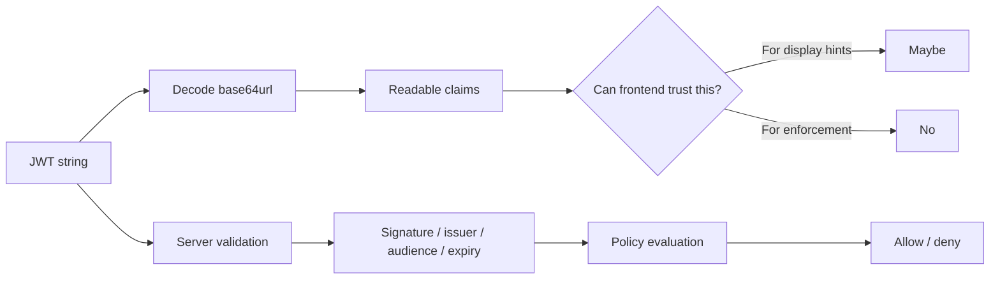
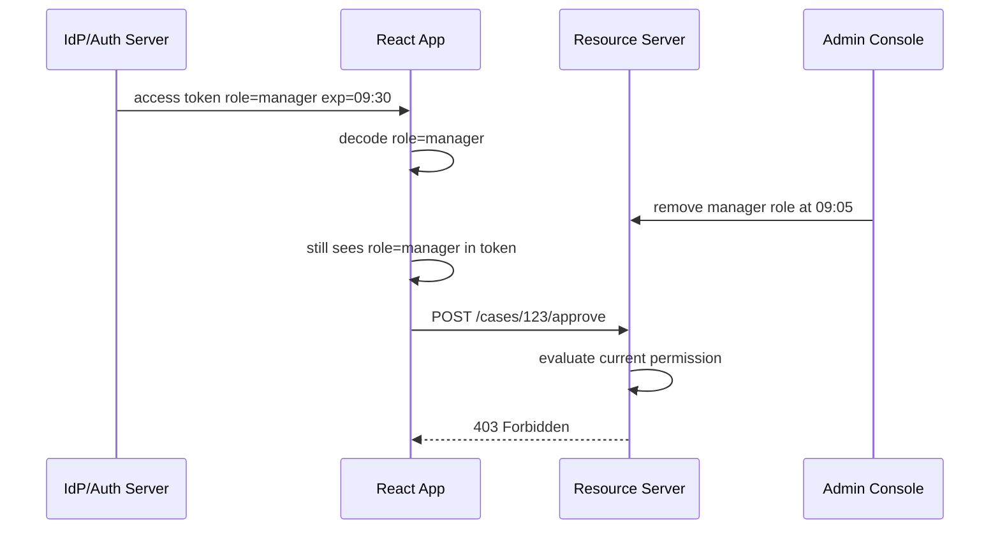

# Part 017 — Client-side Token Decoding

Client-side token decoding is useful.

Client-side token decoding is also one of the easiest ways to accidentally build a fake authorization system.

The mistake usually starts innocently:

```ts
const token = localStorage.getItem("access_token");
const payload = jwtDecode(token);

if (payload.role === "admin") {
  showAdminButton();
}
```

Then the app grows.

The decoded role controls menus. The decoded tenant controls active workspace. The decoded scopes control action buttons. The decoded expiry controls refresh. The decoded profile controls audit context. Eventually, half the frontend behaves as if a decoded token is the source of truth.

That is the boundary failure.

A decoded token is not an authorization decision.

It is only a parsed representation of a credential that was issued at some earlier time for some audience under some policy.

The browser may read it. The browser may use it for convenience. The browser must not become the authority that decides whether protected actions are allowed.

This part builds the mental model and implementation discipline for decoding tokens in React without lying to yourself about security.

---

## 1. The core distinction

There are three separate operations that engineers often collapse into one:

```txt
Decode     -> parse token structure
Validate   -> prove token integrity and acceptability
Authorize  -> decide whether a subject may perform an action on a resource
```

They are not equivalent.



Decoding answers:

```txt
What does this token say?
```

Validation answers:

```txt
Was this token legitimately issued, still acceptable, and intended for this recipient?
```

Authorization answers:

```txt
Given current state, may this subject perform this action on this resource?
```

React can decode. React generally should not validate access tokens as an authority. React must not enforce authorization for protected resources.

---

## 2. What token decoding actually does

A JWT has three base64url-encoded parts:

```txt
header.payload.signature
```

A basic decode operation reads the header and payload.

```ts
import { jwtDecode } from "jwt-decode";

type AccessTokenClaims = {
  iss?: string;
  sub?: string;
  aud?: string | string[];
  exp?: number;
  iat?: number;
  nbf?: number;
  scope?: string;
  tenant_id?: string;
  org_id?: string;
};

export function decodeAccessTokenUnsafe(token: string): AccessTokenClaims | null {
  try {
    return jwtDecode<AccessTokenClaims>(token);
  } catch {
    return null;
  }
}
```

The function name intentionally includes `Unsafe`.

That does not mean decoding is always bad. It means the output should not be treated as proven authority merely because parsing succeeded.

A malicious or corrupted token can still decode.

```txt
Decode success != valid token
Decode success != active session
Decode success != current permission
Decode success != allowed action
```

The browser can inspect the text. The server decides whether the credential is acceptable.

---

## 3. Safe use cases for client-side decoding

Client-side decoding is acceptable when the result is used as a hint, optimization, or UX convenience.

### 3.1 Reading expiry for proactive refresh

The frontend may decode `exp` to schedule proactive refresh.

```ts
type RefreshPlan =
  | { kind: "refresh-at"; epochMs: number }
  | { kind: "refresh-now" }
  | { kind: "unknown" };

export function planRefreshFromDecodedExp(
  claims: { exp?: number } | null,
  options: {
    serverTimeOffsetMs: number;
    refreshBeforeMs: number;
  }
): RefreshPlan {
  if (!claims?.exp) return { kind: "unknown" };

  const serverNowMs = Date.now() + options.serverTimeOffsetMs;
  const expiresAtMs = claims.exp * 1000;
  const refreshAtMs = expiresAtMs - options.refreshBeforeMs;

  if (refreshAtMs <= serverNowMs) {
    return { kind: "refresh-now" };
  }

  return { kind: "refresh-at", epochMs: refreshAtMs };
}
```

But this is only scheduling.

The server still has the final say.

A token may be revoked before `exp`. A token may be rejected because of audience mismatch. The session may be disabled. The tenant membership may have changed.

So the correct invariant is:

```txt
Decoded expiry may trigger refresh early.
Server response remains authoritative.
```

### 3.2 Showing non-sensitive display hints

The frontend may decode low-risk display hints such as:

```txt
preferred_username
picture
locale
name
```

Even then, prefer `/me` or `/session` for production UIs because token claims can be stale and may contain more information than the UI should depend on.

A decoded display claim should be treated like cached profile data:

```txt
Useful for reducing flicker.
Not authoritative for business logic.
```

### 3.3 Debug panels in non-production environments

Token decoding is useful in dev tools, diagnostics, and test harnesses.

```tsx
export function DevTokenInspector({ token }: { token: string | null }) {
  if (process.env.NODE_ENV === "production") return null;
  if (!token) return null;

  const claims = decodeAccessTokenUnsafe(token);

  return (
    <details>
      <summary>Decoded token claims</summary>
      <pre>{JSON.stringify(redactClaims(claims), null, 2)}</pre>
    </details>
  );
}

function redactClaims(claims: unknown) {
  if (!claims || typeof claims !== "object") return claims;

  const copy = { ...(claims as Record<string, unknown>) };
  delete copy.email;
  delete copy.phone_number;
  delete copy.address;
  return copy;
}
```

Keep diagnostic output behind environment gates. Do not leak tokens or sensitive claims into logs, analytics, monitoring breadcrumbs, screenshots, or bug report payloads.

### 3.4 UX preflight hints

The frontend may use decoded claims to avoid obviously impossible UI states.

Example:

```txt
If token says tenant_id = A,
avoid immediately rendering tenant B layout while /session is loading.
```

But the UI must still reconcile with server session state.

```txt
Decoded claim -> provisional state
/session response -> committed state
```

---

## 4. Dangerous use cases

### 4.1 Authorization based on decoded roles

This is the classic bug.

```tsx
function DeleteCaseButton({ caseId }: { caseId: string }) {
  const token = useAccessToken();
  const claims = token ? jwtDecode<{ role?: string }>(token) : null;

  if (claims?.role !== "admin") return null;

  return <button onClick={() => deleteCase(caseId)}>Delete</button>;
}
```

This code has multiple problems:

- `role` may be stale.
- `role` may not apply to this tenant.
- `role` may not apply to this specific resource.
- `role` may represent identity provider role, not application role.
- Hiding the button does not protect the API.
- Showing the button does not guarantee the mutation will succeed.

The better model:

```tsx
function DeleteCaseButton({ caseId }: { caseId: string }) {
  const permission = useCan({ action: "case.delete", resource: { type: "case", id: caseId } });

  if (permission.status === "loading") return null;
  if (!permission.allowed) return null;

  return <button onClick={() => deleteCase(caseId)}>Delete</button>;
}
```

And the API still checks:

```txt
DELETE /cases/:caseId
  -> authenticate request
  -> resolve subject
  -> load case
  -> verify tenant boundary
  -> evaluate policy case.delete
  -> write audit event
  -> delete or deny
```

Frontend permission is exposure control. Backend policy is enforcement.

### 4.2 Treating decoded `scope` as application permission

OAuth `scope` is often misunderstood.

A token with:

```txt
scope = "read:cases write:cases"
```

may only mean that the token is allowed to request those API categories. It does not necessarily mean the current user can edit this exact case.

Application authorization may depend on:

```txt
subject.role
subject.tenant
case.owner
case.status
case.confidentiality
case.assignedTeam
case.region
currentTime
approvalState
regulatoryHold
```

A scope can be part of authorization input. It is not the whole decision.

### 4.3 Decoding ID token as application session authority

An ID token tells the client about authentication performed by the identity provider.

It is not automatically an application session.

Wrong model:

```txt
ID token exists -> user is logged into my app -> user may access resources
```

Better model:

```txt
ID token or auth code proves identity flow completed.
Application server establishes app session.
Application session controls app access.
```

In a BFF model, React may never need to see ID tokens or access tokens. It asks:

```txt
GET /session
```

and receives an application-specific session projection:

```json
{
  "authenticated": true,
  "user": {
    "id": "usr_123",
    "displayName": "Ari"
  },
  "activeTenant": {
    "id": "tenant_456",
    "name": "Regulatory Ops"
  },
  "assurance": {
    "level": "mfa",
    "expiresAt": "2026-07-08T09:30:00Z"
  }
}
```

### 4.4 Using decoded tenant claim as tenant enforcement

Tenant claims are useful. They are not sufficient.

```txt
Token tenant_id = tenant_a
Request URL = /tenants/tenant_b/cases/123
```

The server must reject tenant mismatch.

The frontend may use `tenant_id` to select default workspace, but tenant boundary must be enforced server-side on every resource access.

### 4.5 Logging decoded claims casually

Decoded claims often contain:

- user identifiers,
- email,
- tenant identifiers,
- group membership,
- roles,
- identity provider information,
- authentication time,
- sometimes accidental PII.

Do not log decoded tokens as debugging convenience.

```ts
// Bad
console.log("claims", jwtDecode(token));

// Less bad, still dev-only
logger.debug("token_exp", { exp: claims.exp, aud: claims.aud });
```

Even better: log server-side correlation IDs and session event IDs, not raw token content.

---

## 5. Trust boundary table

| Token claim | Frontend may use for | Frontend must not use for |
|---|---|---|
| `exp` | Refresh scheduling, session countdown hint | Deciding server acceptance |
| `iat` | Debugging age, stale-token warning | Trusting freshness without server |
| `nbf` | Avoid using obviously not-yet-valid token | Final validation |
| `iss` | Diagnostics, expected provider hint | Accepting token issuer as valid |
| `aud` | Diagnostics, API mismatch warning | Proving intended audience |
| `sub` | Provisional identity key | Access control by itself |
| `email` | Temporary display hint | Stable identity key or authorization |
| `scope` | Capability hint | Resource-level permission decision |
| `role` | UI hint only if server contract allows | Enforcement or business-critical action |
| `tenant_id` | Default active tenant hint | Tenant isolation enforcement |
| `groups` | Avoid if possible; may be too large/stale | Fine-grained authorization |

The strongest frontend pattern is not:

```txt
Decode more claims.
```

It is:

```txt
Ask the backend for the exact projection the frontend needs.
```

---

## 6. Prefer session projection over raw token claims

A React app usually needs an application-specific view of the session:

```ts
type SessionProjection =
  | {
      status: "anonymous";
    }
  | {
      status: "authenticated";
      user: {
        id: string;
        displayName: string;
        avatarUrl?: string;
      };
      activeTenant: {
        id: string;
        name: string;
      };
      assurance: {
        level: "password" | "mfa" | "phishing-resistant";
        stepUpRequiredFor: string[];
      };
      expiresAt: string;
    };
```

This projection is better than exposing the token payload directly because it can be:

- minimized,
- normalized,
- redacted,
- tenant-aware,
- application-specific,
- versioned,
- easier to test,
- safer to evolve.

Example endpoint:

```http
GET /session
```

Response:

```json
{
  "status": "authenticated",
  "user": {
    "id": "usr_123",
    "displayName": "Maya Putri"
  },
  "activeTenant": {
    "id": "tnt_001",
    "name": "Financial Conduct"
  },
  "assurance": {
    "level": "mfa",
    "stepUpRequiredFor": ["payment.approve", "case.delete"]
  },
  "expiresAt": "2026-07-08T09:30:00Z"
}
```

React consumes this as auth state.

The token remains a transport credential.

---

## 7. A production-friendly token decoding boundary

If your architecture still exposes an access token to React, isolate token decoding behind a small boundary.

Do not let random components import `jwtDecode`.

```txt
Bad:
  Any component can decode and branch on claims.

Better:
  Only auth/session module can decode.
  It exposes safe derived values.
```

```mermaid
flowchart TD
  A[Access Token] --> B[auth/tokenClaims.ts]
  B --> C[deriveExpiryPlan]
  B --> D[deriveDiagnostics]
  B --> E[deriveProvisionalTenantHint]

  C --> F[Session Manager]
  D --> G[Dev Diagnostics]
  E --> H[Bootstrap UI]

  B -. blocked .-> I[Business Components]
  I -. must use .-> J[/session and /permissions]
```

Implementation:

```ts
// auth/tokenClaims.ts
import { jwtDecode } from "jwt-decode";

export type RawJwtClaims = {
  iss?: string;
  sub?: string;
  aud?: string | string[];
  exp?: number;
  iat?: number;
  nbf?: number;
  scope?: string;
  tenant_id?: string;
};

export type TokenDiagnostics = {
  issuer?: string;
  audience?: string | string[];
  expiresAt?: string;
  issuedAt?: string;
  tenantHint?: string;
};

export function decodeClaimsForAuthModuleOnly(token: string): RawJwtClaims | null {
  try {
    return jwtDecode<RawJwtClaims>(token);
  } catch {
    return null;
  }
}

export function toTokenDiagnostics(claims: RawJwtClaims | null): TokenDiagnostics {
  return {
    issuer: claims?.iss,
    audience: claims?.aud,
    expiresAt: claims?.exp ? new Date(claims.exp * 1000).toISOString() : undefined,
    issuedAt: claims?.iat ? new Date(claims.iat * 1000).toISOString() : undefined,
    tenantHint: claims?.tenant_id,
  };
}
```

Add linting discipline:

```txt
Rule:
  jwtDecode may only be imported inside src/auth/**
```

Example ESLint restriction:

```js
// eslint.config.js
export default [
  {
    rules: {
      "no-restricted-imports": [
        "error",
        {
          paths: [
            {
              name: "jwt-decode",
              message: "Decode tokens only inside src/auth. Use session and permission APIs in components.",
            },
          ],
        },
      ],
    },
  },
];
```

Then override for `src/auth/**` if needed.

---

## 8. Typed claim parsing is still not validation

TypeScript helps prevent shape mistakes. It does not prove trust.

```ts
import { z } from "zod";

const AccessTokenClaimSchema = z.object({
  iss: z.string().optional(),
  sub: z.string().optional(),
  aud: z.union([z.string(), z.array(z.string())]).optional(),
  exp: z.number().int().positive().optional(),
  iat: z.number().int().positive().optional(),
  nbf: z.number().int().positive().optional(),
  scope: z.string().optional(),
  tenant_id: z.string().optional(),
});

export function parseDecodedClaims(value: unknown) {
  const result = AccessTokenClaimSchema.safeParse(value);
  return result.success ? result.data : null;
}
```

This proves only:

```txt
The decoded object has the expected shape.
```

It does not prove:

```txt
The token signature is valid.
The issuer is trusted.
The audience matches.
The token is unexpired.
The session is active.
The user still has permission.
```

Schema validation is input hygiene, not security authority.

---

## 9. Stale claims are the normal case

A JWT claim is a snapshot.

Even when legitimately issued, it can become stale.

Example timeline:



This is not an edge case. It is normal.

Roles change. Tenants change. Cases change state. Assignments move. Approval windows close. Regulatory holds appear. Access can be revoked before token expiry.

Therefore:

```txt
Token claims are not fresh enough for fine-grained authorization.
```

For high-risk actions, use a fresh server-side permission check.

---

## 10. Claim freshness by decision type

| Decision type | Can use decoded token? | Better source |
|---|---:|---|
| Show display name while bootstrapping | Yes, as hint | `/session` |
| Schedule access token refresh | Yes, as hint | Server response still authoritative |
| Decide if user is authenticated | Not alone | `/session`, successful server-authenticated request |
| Decide visible menu items | Maybe as temporary skeleton hint | `/permissions` or route loader data |
| Decide resource action allowed | No | Server policy decision |
| Decide tenant access | No | Server tenant membership check |
| Decide admin operation | No | Server policy + audit + step-up if needed |
| Decide field-level access | No | Server-provided form schema/field permissions |
| Decide impersonation allowed | No | Server policy + audit + explicit session state |

A useful heuristic:

```txt
If a wrong answer creates only a temporary visual glitch, decoded claims may be acceptable.
If a wrong answer exposes sensitive data or enables mutation, decoded claims are not acceptable.
```

---

## 11. The “decoded token as auth context” trap

Many React apps put decoded claims directly into context:

```tsx
<AuthContext.Provider value={{ user: jwtDecode(token) }}>
  {children}
</AuthContext.Provider>
```

This is convenient and dangerous.

The context becomes polluted with transport-level data:

```txt
AuthContext.user.role
AuthContext.user.groups
AuthContext.user.scope
AuthContext.user.tenant_id
AuthContext.user.email
```

Components start branching on claims. Authorization logic spreads everywhere. Refactoring becomes expensive.

Better context shape:

```ts
type AuthContextValue = {
  session: SessionProjection;
  refreshSession: () => Promise<void>;
  logout: () => Promise<void>;
};
```

Permission belongs in a separate boundary:

```ts
type PermissionContextValue = {
  can: (input: PermissionInput) => PermissionDecision;
  refreshPermissions: () => Promise<void>;
};
```

The raw token should not be the domain model.

---

## 12. Good React auth context design

```tsx
import { createContext, useContext } from "react";

export type AuthSession =
  | { status: "loading" }
  | { status: "anonymous" }
  | {
      status: "authenticated";
      user: {
        id: string;
        displayName: string;
      };
      activeTenant: {
        id: string;
        name: string;
      };
      expiresAt: string;
    }
  | { status: "expired" }
  | { status: "error"; recoverable: boolean };

type AuthContextValue = {
  session: AuthSession;
  refresh: () => Promise<void>;
  logout: () => Promise<void>;
};

const AuthContext = createContext<AuthContextValue | null>(null);

export function useAuth() {
  const value = useContext(AuthContext);
  if (!value) throw new Error("useAuth must be used inside AuthProvider");
  return value;
}
```

Notice what is not included:

```txt
raw token
raw decoded claims
role string from JWT
permission decision based on JWT
```

This forces business components to depend on app-level session and permission contracts.

---

## 13. Token decoding and route protection

Route protection should not be:

```tsx
const claims = jwtDecode(token);
return claims.exp > Date.now() / 1000 ? <Outlet /> : <Navigate to="/login" />;
```

That can create subtle bugs:

- token looks unexpired but session was revoked,
- token has valid shape but wrong audience,
- token exists but backend rejects it,
- token belongs to a different tenant,
- decoded value causes route to render sensitive UI before server bootstrap.

Better data-router model:

```ts
export async function protectedLoader({ request }: LoaderFunctionArgs) {
  const session = await getSessionFromServer(request);

  if (session.status === "anonymous") {
    throw redirect(`/login?returnTo=${encodeURIComponent(new URL(request.url).pathname)}`);
  }

  if (session.status !== "authenticated") {
    throw new Response("Session unavailable", { status: 503 });
  }

  return { session };
}
```

In a pure SPA, the equivalent is still server-backed bootstrap:

```ts
async function restoreSession(): Promise<AuthSession> {
  const response = await fetch("/session", {
    credentials: "include",
    headers: { Accept: "application/json" },
  });

  if (response.status === 401) return { status: "anonymous" };
  if (!response.ok) return { status: "error", recoverable: true };

  return response.json();
}
```

Decode only as a supplement, not as the gate.

---

## 14. Token decoding and permission UI

A safe permission architecture separates three concepts:

```txt
Session identity    -> Who is interacting with the app?
Permission contract -> What actions should UI expose?
Enforcement policy  -> What does the backend allow now?
```

Frontend permission contract example:

```json
{
  "resource": {
    "type": "case",
    "id": "case_123"
  },
  "actions": {
    "case.view": {
      "allowed": true
    },
    "case.assign": {
      "allowed": false,
      "reason": "CASE_LOCKED"
    },
    "case.close": {
      "allowed": false,
      "reason": "REQUIRES_SUPERVISOR_REVIEW"
    }
  }
}
```

React usage:

```tsx
function CaseActions({ caseId }: { caseId: string }) {
  const permissions = useCasePermissions(caseId);

  if (permissions.status !== "ready") return null;

  return (
    <ActionBar>
      {permissions.can("case.assign") && <AssignButton caseId={caseId} />}
      {permissions.can("case.close") && <CloseCaseButton caseId={caseId} />}
    </ActionBar>
  );
}
```

This is better than reading:

```txt
jwt.role
jwt.scope
jwt.groups
```

because the server can account for current resource state.

---

## 15. Do not put authorization into token decoding helpers

Avoid helpers like this:

```ts
export function isAdmin(token: string): boolean {
  const claims = jwtDecode<{ role?: string }>(token);
  return claims.role === "admin";
}
```

That utility will spread across the codebase.

Prefer naming that makes unsafe use obvious:

```ts
export function getTokenExpiryHint(token: string): Date | null;
export function getTokenDiagnostics(token: string): TokenDiagnostics;
export function getProvisionalTenantHint(token: string): string | null;
```

Avoid names like:

```txt
isLoggedIn
isAdmin
hasScope
canEdit
canDelete
canApprove
```

Those names imply authority.

---

## 16. Handling malformed tokens

Token parsing can fail.

Malformed token handling must not crash the whole app.

```ts
type DecodeResult<T> =
  | { ok: true; claims: T }
  | { ok: false; reason: "missing" | "malformed" };

export function safeDecodeToken<T>(token: string | null): DecodeResult<T> {
  if (!token) return { ok: false, reason: "missing" };

  try {
    return { ok: true, claims: jwtDecode<T>(token) };
  } catch {
    return { ok: false, reason: "malformed" };
  }
}
```

A malformed access token should usually lead to session recovery:

```txt
Malformed token
  -> clear in-memory token
  -> attempt session refresh if refresh channel exists
  -> otherwise mark session anonymous/expired
  -> do not render protected data
```

Do not show raw parse errors to end users.

---

## 17. Token decoding and security-sensitive UX

Some UX decisions are themselves security-sensitive.

Examples:

- showing admin menus,
- showing tenant switcher entries,
- showing case details,
- enabling approval buttons,
- showing confidential fields,
- selecting active organization,
- deciding whether step-up authentication is required.

For these, prefer server projection.

```txt
Security-sensitive UI should be backed by server-issued UI authorization data.
```

This does not make the frontend an enforcement boundary. It simply prevents unnecessary exposure and misleading affordances.

---

## 18. Access token should not be your frontend database

A common anti-pattern is stuffing everything into JWT claims:

```json
{
  "sub": "usr_123",
  "email": "maya@example.com",
  "roles": ["admin", "case_manager", "auditor"],
  "groups": ["group_a", "group_b", "group_c"],
  "permissions": [
    "case.create",
    "case.update",
    "case.delete",
    "case.assign",
    "report.export",
    "tenant.manage"
  ],
  "tenants": ["tenant_a", "tenant_b", "tenant_c"]
}
```

This creates problems:

- token becomes large,
- claims become stale,
- sensitive relationship data leaks to browser,
- permission changes require token refresh,
- resource-level auth cannot fit cleanly,
- revocation is harder,
- UI starts depending on token internals,
- identity provider schema leaks into app architecture.

Better:

```txt
Token carries minimal credential claims.
/session returns minimal session projection.
/permissions returns app-specific permission decisions.
Resource APIs enforce current policy.
```

---

## 19. Minimal token claim philosophy

For browser-exposed tokens, prefer minimality.

Useful claims:

```txt
iss
sub
aud
exp
iat
nbf
jti or token id when appropriate
scope if using OAuth resource scopes
```

Be careful with:

```txt
email
phone
name
picture
tenant list
group list
role list
permission list
regulatory attributes
case assignment data
```

Claims are easy to add and hard to remove once frontend code depends on them.

Treat every claim as an API contract.

---

## 20. Testing client-side decoding discipline

Test the boundary, not just the parser.

### 20.1 Parser tests

```ts
it("returns null for malformed token", () => {
  expect(decodeAccessTokenUnsafe("not-a-jwt")).toBeNull();
});
```

### 20.2 Expiry planning tests

```ts
it("plans proactive refresh before token expiry", () => {
  const claims = { exp: 1000 };

  const plan = planRefreshFromDecodedExp(claims, {
    serverTimeOffsetMs: 0,
    refreshBeforeMs: 30_000,
  });

  expect(plan.kind).toBe("refresh-at");
});
```

### 20.3 Import boundary tests

Use linting or static analysis to prevent `jwtDecode` in business components.

```txt
src/auth/**        allowed
src/components/**  forbidden
src/features/**    forbidden except auth diagnostics
```

### 20.4 Authorization regression tests

Ensure decoded role does not control critical action visibility directly.

```txt
Given token role=admin
And server permission says case.delete=false
Then Delete button is hidden or disabled
And DELETE /cases/:id still returns 403
```

---

## 21. Review checklist

Use this checklist in PR review.

```txt
Client-side token decoding checklist:

[ ] Is token decoding isolated inside auth/session infrastructure?
[ ] Are business components prevented from importing jwtDecode directly?
[ ] Is decoded data used only as hint, diagnostic, or refresh scheduling input?
[ ] Are role/scope/group claims not used as enforcement authority?
[ ] Are tenant claims not used to enforce tenant boundary?
[ ] Is /session or equivalent used for committed session state?
[ ] Is /permissions or loader data used for security-sensitive UI exposure?
[ ] Does backend still authorize every protected read/write?
[ ] Are decoded claims excluded from logs, analytics, and error breadcrumbs?
[ ] Are malformed tokens handled without rendering protected content?
[ ] Are stale-claim scenarios tested?
[ ] Is token payload minimal and free of unnecessary PII?
```

---

## 22. Mental model summary

Token decoding is like reading a signed badge through a window.

You can see what the badge says. You may use that to route the person to the right desk. But you do not let them open the vault just because the text on the badge says `admin`.

The secure model is:

```txt
Decode for hints.
Validate at trust boundary.
Authorize at resource boundary.
Audit at mutation boundary.
```

React should understand tokens. It should not worship them.

