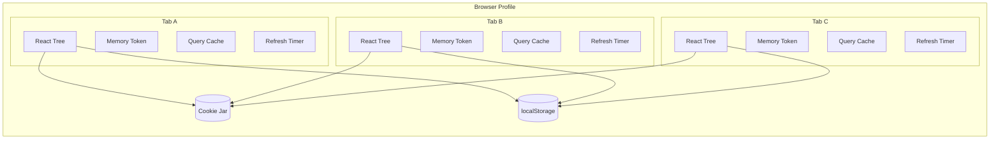
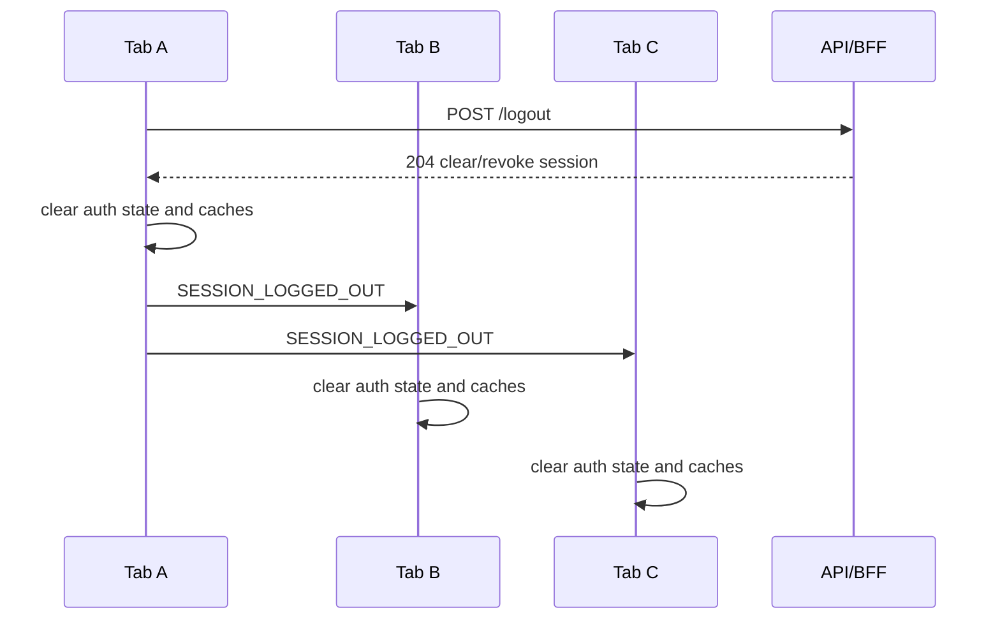
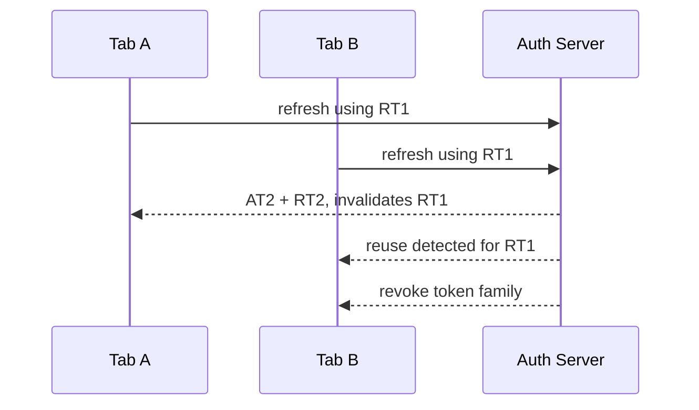

# Part 018 — Cross-tab Session Coordination

A user does not run your React app once.

They run it in tabs.

```txt
Tab A: case detail
Tab B: admin console
Tab C: reports
Tab D: profile settings
```

Those tabs share the same human, same browser profile, same origin, often the same cookie, and sometimes the same token family.

But each tab has its own JavaScript runtime.

That means each tab has its own:

- memory state,
- React tree,
- query cache,
- timers,
- in-flight requests,
- auth bootstrap lifecycle,
- refresh logic,
- stale permission cache,
- UI exposure decisions.

Without coordination, auth becomes inconsistent.

The user logs out in Tab A, but Tab B still shows confidential data. Tab C refreshes a token while Tab D also refreshes, causing token reuse detection to revoke the whole session. Tab A switches tenant, but Tab B submits a mutation under the old tenant. Tab C receives `401` and starts a login redirect while Tab D already recovered the session.

This is not a React problem. It is a distributed systems problem inside one browser profile.

The goal of cross-tab session coordination is not to make tabs share all state. The goal is to preserve auth invariants across independent runtimes.

---

## 1. The real problem

The browser gives you separate execution contexts.



Shared browser storage does not imply shared React state.

Each tab can be wrong independently.

The hard cases are:

```txt
logout propagation
session expiry propagation
token refresh locking
token reuse prevention
session recovery after 401
permission invalidation
tenant switch propagation
sensitive cache cleanup
redirect storm prevention
```

---

## 2. Auth invariants across tabs

Before choosing APIs, define invariants.

```txt
Invariant 1:
If one tab logs out, every tab must stop exposing authenticated UI quickly.

Invariant 2:
If token/session refresh is single-use, only one tab may refresh at a time.

Invariant 3:
If session state becomes unknown, protected data must not continue rendering as if authenticated.

Invariant 4:
If active tenant changes, stale tenant-scoped caches must be invalidated.

Invariant 5:
If a tab receives definitive session revocation, it must not be overridden by stale success from another tab.

Invariant 6:
Cross-tab messages are hints; the server remains authoritative.
```

That last invariant matters.

A cross-tab event is not a security boundary. It is a coordination mechanism.

---

## 3. Coordination tools available in browsers

Common options:

| Mechanism | Good for | Weakness |
|---|---|---|
| `BroadcastChannel` | Same-origin tab/window/worker messaging | Not durable; unavailable in some constrained contexts |
| `storage` event | Logout signal, fallback communication | Event does not fire in same window that made change; awkward payload model |
| Shared cookie | Server-side session continuity | HttpOnly cookie cannot be read by JS; no direct event on change |
| IndexedDB | Durable coordination, locks, metadata | More complexity; still exposed to JS if XSS exists |
| Service Worker | Central network coordination | Operationally complex; lifecycle surprises |
| Server push/SSE/WebSocket | Server-driven revocation | Needs backend support and reconnect handling |
| Polling `/session` | Simple authoritative reconciliation | Latency and load trade-off |

For most apps, start with:

```txt
BroadcastChannel primary
storage event fallback
server reconciliation always
```

---

## 4. BroadcastChannel mental model

`BroadcastChannel` allows same-origin browsing contexts to send messages to each other.

```ts
const channel = new BroadcastChannel("auth");

channel.postMessage({
  type: "logout",
  reason: "user_clicked_logout",
  at: Date.now(),
});

channel.onmessage = (event) => {
  console.log(event.data);
};
```

Model it as an event bus with weak guarantees:

```txt
It is useful.
It is not durable.
It does not replace server session checks.
It should carry no secrets.
It should carry event facts, not tokens.
```

Never broadcast tokens.

```ts
// Bad
channel.postMessage({ type: "token", accessToken });
```

Broadcast state transitions:

```ts
// Good
channel.postMessage({
  type: "SESSION_LOGGED_OUT",
  sessionVersion: "sv_2026_07_08_001",
  reason: "user_initiated",
  occurredAt: new Date().toISOString(),
});
```

---

## 5. Auth event schema

Do not send random strings across tabs.

Define a versioned event protocol.

```ts
export type AuthBroadcastEvent =
  | {
      version: 1;
      type: "SESSION_LOGGED_OUT";
      reason: "user_initiated" | "server_revoked" | "expired";
      sessionVersion?: string;
      occurredAt: string;
    }
  | {
      version: 1;
      type: "SESSION_REFRESHED";
      sessionVersion: string;
      expiresAt: string;
      occurredAt: string;
    }
  | {
      version: 1;
      type: "SESSION_UNKNOWN";
      reason: "network_error" | "refresh_failed" | "malformed_token";
      occurredAt: string;
    }
  | {
      version: 1;
      type: "TENANT_SWITCHED";
      tenantId: string;
      sessionVersion: string;
      occurredAt: string;
    }
  | {
      version: 1;
      type: "PERMISSIONS_INVALIDATED";
      scope: "global" | "tenant" | "resource";
      tenantId?: string;
      resourceType?: string;
      resourceId?: string;
      occurredAt: string;
    };
```

Validate incoming messages.

```ts
export function isAuthBroadcastEvent(value: unknown): value is AuthBroadcastEvent {
  if (!value || typeof value !== "object") return false;
  const event = value as { version?: unknown; type?: unknown; occurredAt?: unknown };
  return event.version === 1 && typeof event.type === "string" && typeof event.occurredAt === "string";
}
```

Do not assume all same-origin messages are well-formed. Bugs, old app versions, browser extensions, test fixtures, and compromised scripts can send garbage.

---

## 6. A small cross-tab auth bus

```ts
// auth/crossTabAuthBus.ts
export type AuthEventHandler = (event: AuthBroadcastEvent) => void;

export class CrossTabAuthBus {
  private channel: BroadcastChannel | null = null;
  private handlers = new Set<AuthEventHandler>();

  constructor(private readonly channelName = "app:auth") {
    if (typeof BroadcastChannel !== "undefined") {
      this.channel = new BroadcastChannel(channelName);
      this.channel.onmessage = (message) => {
        if (isAuthBroadcastEvent(message.data)) {
          this.emitLocal(message.data);
        }
      };
    }

    window.addEventListener("storage", this.onStorageEvent);
  }

  subscribe(handler: AuthEventHandler) {
    this.handlers.add(handler);
    return () => this.handlers.delete(handler);
  }

  publish(event: AuthBroadcastEvent) {
    // Deliver to this tab too. BroadcastChannel does not need to be relied on
    // for local delivery semantics.
    this.emitLocal(event);

    this.channel?.postMessage(event);

    // Fallback for browsers/contexts where BroadcastChannel is not available.
    localStorage.setItem("app:auth:event", JSON.stringify({ ...event, nonce: crypto.randomUUID() }));
    localStorage.removeItem("app:auth:event");
  }

  close() {
    this.channel?.close();
    window.removeEventListener("storage", this.onStorageEvent);
    this.handlers.clear();
  }

  private emitLocal(event: AuthBroadcastEvent) {
    for (const handler of this.handlers) {
      handler(event);
    }
  }

  private onStorageEvent = (event: StorageEvent) => {
    if (event.key !== "app:auth:event" || !event.newValue) return;

    try {
      const parsed = JSON.parse(event.newValue);
      if (isAuthBroadcastEvent(parsed)) {
        this.emitLocal(parsed);
      }
    } catch {
      // Ignore malformed cross-tab fallback event.
    }
  };
}
```

Important details:

- Messages contain no tokens.
- Local tab receives the event directly.
- Other tabs receive via `BroadcastChannel` or storage fallback.
- Storage fallback uses a nonce so repeated events are observable.
- Incoming messages are validated.
- `close()` cleans up listeners.

---

## 7. Logout propagation

Logout is the first cross-tab feature to implement.

Wrong behavior:

```txt
Tab A logs out.
Tab B keeps showing case detail until user clicks something.
```

Better behavior:



Implementation:

```ts
async function logout() {
  try {
    await fetch("/logout", {
      method: "POST",
      credentials: "include",
      headers: {
        "X-CSRF-Token": getCsrfToken(),
      },
    });
  } finally {
    clearLocalAuthState();
    queryClient.clear();

    authBus.publish({
      version: 1,
      type: "SESSION_LOGGED_OUT",
      reason: "user_initiated",
      occurredAt: new Date().toISOString(),
    });
  }
}
```

Subscriber:

```ts
authBus.subscribe((event) => {
  if (event.type !== "SESSION_LOGGED_OUT") return;

  clearLocalAuthState();
  queryClient.clear();
  router.navigate("/login", { replace: true });
});
```

Do not wait for the user to interact with the stale tab.

---

## 8. Sensitive cache cleanup

Logout propagation must clear more than auth context.

Clear:

```txt
React Query / TanStack Query cache
Apollo cache
Redux entity cache
Zustand persisted slices
in-memory permission cache
route loader data where possible
form drafts containing sensitive data
preview object URLs
file upload state
background polling loops
WebSocket/SSE subscriptions
```

Example:

```ts
function clearAuthenticatedRuntimeState() {
  authStore.setAnonymous();
  permissionStore.clear();
  queryClient.clear();
  apolloClient.clearStore();
  closeRealtimeConnections();
  cancelBackgroundJobs();
}
```

Do not keep sensitive data in memory just because the token is gone.

The invariant is:

```txt
After logout event is processed, authenticated UI and authenticated data are gone from the tab runtime.
```

---

## 9. Refresh token rotation and multi-tab races

Refresh token rotation creates a classic race.



If your refresh token is single-use, multiple tabs cannot refresh independently.

You need a refresh coordination strategy.

Options:

```txt
Best: BFF/cookie session hides refresh from browser.
Good: one-tab refresh lock with server reconciliation.
Risky: every tab refreshes independently.
```

If possible, prefer BFF session. The browser sends a cookie; the BFF handles refresh server-side.

If your SPA must handle refresh, implement a cross-tab refresh lock.

---

## 10. Refresh lock requirements

A lock must handle:

- one active refresher,
- lock expiry if refresher tab crashes,
- result propagation,
- failure propagation,
- clock skew tolerance,
- stale lock cleanup,
- no token broadcast,
- recovery via `/session` or refresh endpoint.

Do not store refresh tokens in the lock.

The lock says:

```txt
Someone is refreshing. Wait and reconcile.
```

It does not say:

```txt
Here is the token.
```

---

## 11. Simple localStorage refresh lock

This is a pragmatic lock, not a perfect distributed lock.

```ts
type RefreshLock = {
  ownerId: string;
  expiresAt: number;
};

const TAB_ID = crypto.randomUUID();
const LOCK_KEY = "app:auth:refresh-lock";
const LOCK_TTL_MS = 15_000;

function readLock(): RefreshLock | null {
  const raw = localStorage.getItem(LOCK_KEY);
  if (!raw) return null;

  try {
    return JSON.parse(raw) as RefreshLock;
  } catch {
    return null;
  }
}

function tryAcquireRefreshLock(): boolean {
  const now = Date.now();
  const current = readLock();

  if (current && current.expiresAt > now && current.ownerId !== TAB_ID) {
    return false;
  }

  const next: RefreshLock = {
    ownerId: TAB_ID,
    expiresAt: now + LOCK_TTL_MS,
  };

  localStorage.setItem(LOCK_KEY, JSON.stringify(next));

  const afterWrite = readLock();
  return afterWrite?.ownerId === TAB_ID;
}

function releaseRefreshLock() {
  const current = readLock();
  if (current?.ownerId === TAB_ID) {
    localStorage.removeItem(LOCK_KEY);
  }
}
```

This lock reduces races. It does not eliminate all concurrency edge cases.

The server still must handle refresh token reuse safely.

---

## 12. Single-flight refresh across tabs

```ts
export async function refreshSessionCoordinated(): Promise<void> {
  if (tryAcquireRefreshLock()) {
    try {
      const session = await refreshSessionWithServer();

      authBus.publish({
        version: 1,
        type: "SESSION_REFRESHED",
        sessionVersion: session.sessionVersion,
        expiresAt: session.expiresAt,
        occurredAt: new Date().toISOString(),
      });
    } catch (error) {
      authBus.publish({
        version: 1,
        type: "SESSION_UNKNOWN",
        reason: "refresh_failed",
        occurredAt: new Date().toISOString(),
      });
      throw error;
    } finally {
      releaseRefreshLock();
    }

    return;
  }

  await waitForRefreshResultOrTimeout();
  await reconcileSessionFromServer();
}
```

Waiting tab:

```ts
function waitForRefreshResultOrTimeout(timeoutMs = 12_000): Promise<void> {
  return new Promise((resolve) => {
    const timer = window.setTimeout(() => {
      unsubscribe();
      resolve();
    }, timeoutMs);

    const unsubscribe = authBus.subscribe((event) => {
      if (event.type === "SESSION_REFRESHED" || event.type === "SESSION_LOGGED_OUT" || event.type === "SESSION_UNKNOWN") {
        window.clearTimeout(timer);
        unsubscribe();
        resolve();
      }
    });
  });
}
```

Important:

```txt
After waiting, reconcile with server.
Do not assume the event payload itself proves session validity.
```

---

## 13. Session versioning

Use session versions to avoid stale events overriding newer state.

```ts
type SessionState = {
  status: "anonymous" | "authenticated" | "unknown";
  sessionVersion?: string;
  expiresAt?: string;
};
```

When receiving an event:

```ts
function applyAuthEvent(current: SessionState, event: AuthBroadcastEvent): SessionState {
  if (event.type === "SESSION_LOGGED_OUT") {
    return { status: "anonymous" };
  }

  if (event.type === "SESSION_UNKNOWN") {
    if (current.status === "authenticated") {
      return { ...current, status: "unknown" };
    }
    return current;
  }

  if (event.type === "SESSION_REFRESHED") {
    if (current.status === "anonymous") {
      return current;
    }

    return {
      status: "authenticated",
      sessionVersion: event.sessionVersion,
      expiresAt: event.expiresAt,
    };
  }

  return current;
}
```

For stronger ordering, use server-issued monotonically increasing session version or `updatedAt` timestamp.

Client timestamps are helpful but not authoritative.

---

## 14. Tenant switch propagation

Tenant switch is nearly as important as logout.

Wrong behavior:

```txt
Tab A switches from Tenant A to Tenant B.
Tab B still submits mutation using Tenant A cache while cookie/session now points to Tenant B.
```

This can cause confused-deputy bugs and bad UX.

Tenant switch should be modeled as a session-affecting event.

```ts
async function switchTenant(tenantId: string) {
  const session = await fetchJson("/session/tenant", {
    method: "POST",
    body: JSON.stringify({ tenantId }),
  });

  clearTenantScopedState();

  authBus.publish({
    version: 1,
    type: "TENANT_SWITCHED",
    tenantId,
    sessionVersion: session.sessionVersion,
    occurredAt: new Date().toISOString(),
  });
}
```

Subscriber:

```ts
authBus.subscribe((event) => {
  if (event.type !== "TENANT_SWITCHED") return;

  clearTenantScopedState();
  permissionStore.invalidateTenant(event.tenantId);
  queryClient.invalidateQueries({ predicate: isTenantScopedQuery });
  router.revalidate();
});
```

Design rule:

```txt
Tenant switch invalidates tenant-scoped data, permissions, routes, and forms.
```

---

## 15. Permission invalidation

Permissions change while tabs are open.

Examples:

- admin removes user from role,
- case is reassigned,
- case enters locked state,
- temporary access expires,
- approval window closes,
- regulatory hold is applied,
- user completes step-up authentication,
- tenant membership changes.

You do not need to broadcast every permission detail.

Broadcast invalidation facts:

```ts
authBus.publish({
  version: 1,
  type: "PERMISSIONS_INVALIDATED",
  scope: "tenant",
  tenantId: "tenant_123",
  occurredAt: new Date().toISOString(),
});
```

Each tab then refetches relevant permission data.

```ts
authBus.subscribe((event) => {
  if (event.type !== "PERMISSIONS_INVALIDATED") return;

  permissionStore.invalidate(event);
  queryClient.invalidateQueries({ queryKey: ["permissions"] });
});
```

Again:

```txt
Broadcast invalidation.
Fetch authority from server.
```

---

## 16. Handling 401 and 403 across tabs

A tab receives `401`.

What now?

Bad behavior:

```txt
Every tab starts refresh.
Every tab redirects to login.
Every tab clears state independently.
```

Better behavior:

```txt
One tab coordinates refresh.
Other tabs wait.
If refresh succeeds, all reconcile.
If refresh fails definitively, all logout/expire.
```

API client sketch:

```ts
async function authenticatedFetch(input: RequestInfo, init?: RequestInit) {
  const response = await fetch(input, { ...init, credentials: "include" });

  if (response.status !== 401) {
    return response;
  }

  const recovered = await tryRecoverSession();

  if (!recovered) {
    authBus.publish({
      version: 1,
      type: "SESSION_LOGGED_OUT",
      reason: "expired",
      occurredAt: new Date().toISOString(),
    });

    return response;
  }

  return fetch(input, { ...init, credentials: "include" });
}
```

For `403`, do not refresh by default.

```txt
401 -> authentication/session problem
403 -> authorization problem
```

A `403` may trigger permission invalidation, not token refresh.

```ts
if (response.status === 403) {
  authBus.publish({
    version: 1,
    type: "PERMISSIONS_INVALIDATED",
    scope: "global",
    occurredAt: new Date().toISOString(),
  });
}
```

---

## 17. Redirect storm prevention

Multiple tabs can create redirect storms.

Example:

```txt
Tab A gets 401 -> redirects to /login
Tab B gets 401 -> redirects to /login
Tab C gets 401 -> redirects to /login
Login callback runs in one tab
Other tabs keep redirecting with stale returnTo
```

Mitigation:

- centralize redirect decisions,
- use session recovery first,
- broadcast `SESSION_UNKNOWN` before redirect,
- mark login in progress,
- avoid redirecting hidden tabs aggressively,
- after login callback, broadcast `SESSION_REFRESHED` or `SESSION_RESTORED`,
- sanitize return URLs.

Simple login-in-progress marker:

```ts
type LoginMarker = {
  ownerId: string;
  startedAt: number;
  returnTo: string;
};
```

But do not overbuild unless you observe the problem. For many apps, clearing state and redirecting the active tab is enough.

---

## 18. Hidden tabs and visibility

A hidden tab should often be less aggressive.

```ts
function isVisibleTab() {
  return document.visibilityState === "visible";
}
```

Policy:

```txt
Visible tab:
  may attempt immediate refresh/recovery.

Hidden tab:
  may mark session unknown and wait for focus or broadcast event.
```

On focus:

```ts
window.addEventListener("visibilitychange", () => {
  if (document.visibilityState === "visible") {
    reconcileSessionFromServer();
  }
});
```

This reduces refresh storms and stale UI.

---

## 19. Reconciliation beats trust in local messages

Every cross-tab event should eventually converge through the server.

```txt
Broadcast event -> local transition -> server reconciliation
```

Example:

```ts
async function reconcileSessionFromServer() {
  const response = await fetch("/session", {
    credentials: "include",
    headers: { Accept: "application/json" },
  });

  if (response.status === 401) {
    clearAuthenticatedRuntimeState();
    return { status: "anonymous" as const };
  }

  if (!response.ok) {
    markSessionUnknown();
    return { status: "unknown" as const };
  }

  const session = await response.json();
  commitSession(session);
  return session;
}
```

Why?

Because events can be missed. Tabs can sleep. Browser APIs can be unavailable. Old app versions can send old event shapes. The server is the source of truth.

---

## 20. Security notes

### 20.1 Do not broadcast credentials

Never broadcast:

```txt
access token
refresh token
ID token
session id
CSRF token
password
MFA code
authorization code
PKCE verifier
```

Broadcast only facts:

```txt
session logged out
session refreshed
session unknown
tenant switched
permissions invalidated
```

### 20.2 Same-origin does not mean safe-from-XSS

`BroadcastChannel` and `localStorage` are same-origin mechanisms. If your origin has XSS, attacker-controlled script can participate.

Therefore messages must not grant authority.

A malicious script sending:

```json
{ "type": "SESSION_REFRESHED" }
```

must not grant access. It may trigger reconciliation. The server still decides.

### 20.3 Use HttpOnly cookies where possible

If using BFF/cookie session, JavaScript does not need refresh tokens. Cross-tab coordination becomes simpler:

```txt
logout propagation
cache cleanup
session reconciliation
permission invalidation
```

The BFF handles token refresh behind the server boundary.

### 20.4 Clear durable client state carefully

If you persist app state, ensure logout clears authenticated slices.

```ts
persistedStore.clearAuthenticatedSlices();
```

Do not accidentally keep:

- previous user profile,
- last tenant data,
- cached case list,
- permission map,
- draft sensitive form values.

---

## 21. Testing cross-tab coordination

### 21.1 Unit test event reducer

```ts
it("logout event moves authenticated session to anonymous", () => {
  const current = {
    status: "authenticated" as const,
    sessionVersion: "sv1",
    expiresAt: "2026-07-08T10:00:00Z",
  };

  const next = applyAuthEvent(current, {
    version: 1,
    type: "SESSION_LOGGED_OUT",
    reason: "user_initiated",
    occurredAt: "2026-07-08T09:00:00Z",
  });

  expect(next.status).toBe("anonymous");
});
```

### 21.2 Integration test bus behavior

Mock `BroadcastChannel`.

```ts
it("publishes logout to subscribers", () => {
  const bus = new CrossTabAuthBus("test:auth");
  const handler = vi.fn();

  bus.subscribe(handler);

  bus.publish({
    version: 1,
    type: "SESSION_LOGGED_OUT",
    reason: "user_initiated",
    occurredAt: new Date().toISOString(),
  });

  expect(handler).toHaveBeenCalled();

  bus.close();
});
```

### 21.3 E2E test with two tabs

Test critical flows:

```txt
Given two tabs are authenticated
When user logs out in Tab A
Then Tab B clears authenticated UI
And Tab B cannot submit protected mutation
```

```txt
Given two tabs are near token expiry
When both issue API requests
Then only one refresh occurs
And both tabs recover or expire consistently
```

```txt
Given two tabs are open in Tenant A
When Tab A switches to Tenant B
Then Tab B invalidates Tenant A scoped data
And refetches current session before mutation
```

---

## 22. Operational signals

Track metrics:

```txt
cross_tab_logout_events_received
cross_tab_refresh_lock_acquired
cross_tab_refresh_lock_waited
cross_tab_refresh_lock_timeout
session_reconciliation_success
session_reconciliation_failure
refresh_reuse_detected
multi_tab_redirect_suppressed
permission_invalidation_received
```

Do not send user identifiers or token content unnecessarily.

Useful debug metadata:

```txt
tab_id hash
session_version
event_type
elapsed_ms
visible/hidden
route category
```

This helps diagnose refresh storms and stale UI bugs.

---

## 23. Implementation checklist

```txt
Cross-tab session coordination checklist:

[ ] Is logout broadcast to all same-origin tabs?
[ ] Does each tab clear auth state, permission cache, query cache, and realtime connections on logout?
[ ] Are tokens never sent through BroadcastChannel or localStorage events?
[ ] Is BroadcastChannel wrapped behind a typed auth bus?
[ ] Is there a storage event fallback if needed?
[ ] Are incoming cross-tab messages validated?
[ ] Is refresh single-flight across tabs when browser-managed refresh exists?
[ ] Does refresh lock have an expiry?
[ ] Do waiting tabs reconcile from server after refresh event?
[ ] Is 401 handled differently from 403?
[ ] Does tenant switch invalidate tenant-scoped data in all tabs?
[ ] Do hidden tabs avoid aggressive refresh loops?
[ ] Does focus/visibility trigger session reconciliation?
[ ] Are stale events prevented from overriding definitive logout?
[ ] Are cross-tab flows covered by tests?
[ ] Are refresh storms observable in production metrics?
```

---

## 24. Mental model summary

Cross-tab auth is coordination among independent runtimes.

Each tab is a node. The browser is the shared environment. Cookies and storage are shared infrastructure. The server is the authority.

The safe pattern is:

```txt
Broadcast facts, not secrets.
Coordinate refresh, do not share tokens.
Invalidate caches, do not trust stale UI.
Reconcile with server, do not trust local messages.
Fail closed for protected data.
```

If one tab knows the session is gone, every tab should behave as if the session is gone.

If one tab is refreshing, other tabs should not stampede.

If one tab changes tenant or permissions, other tabs should stop pretending their cached view is current.

React auth becomes robust when every tab follows the same state machine and treats server reconciliation as the final convergence point.

