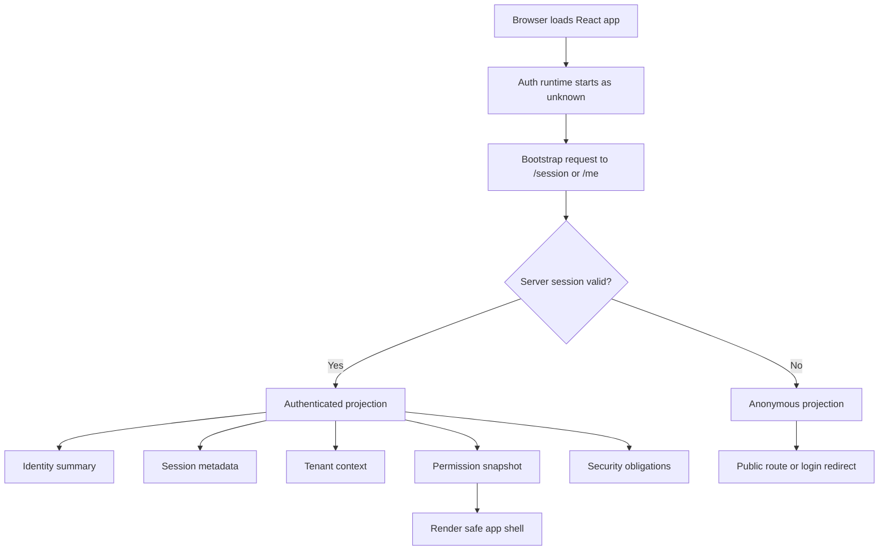
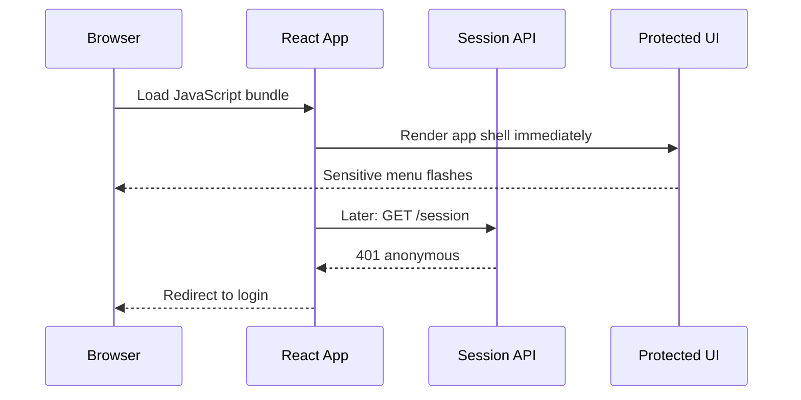
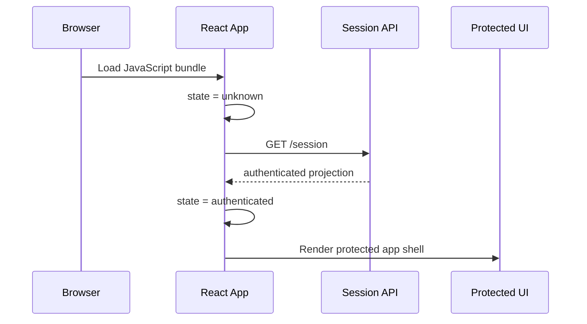
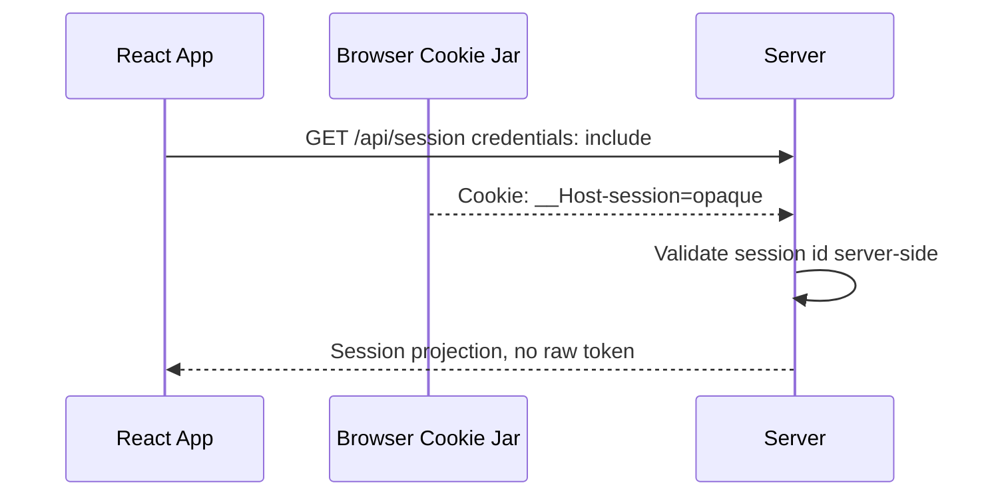
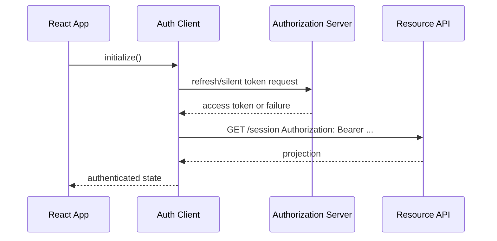
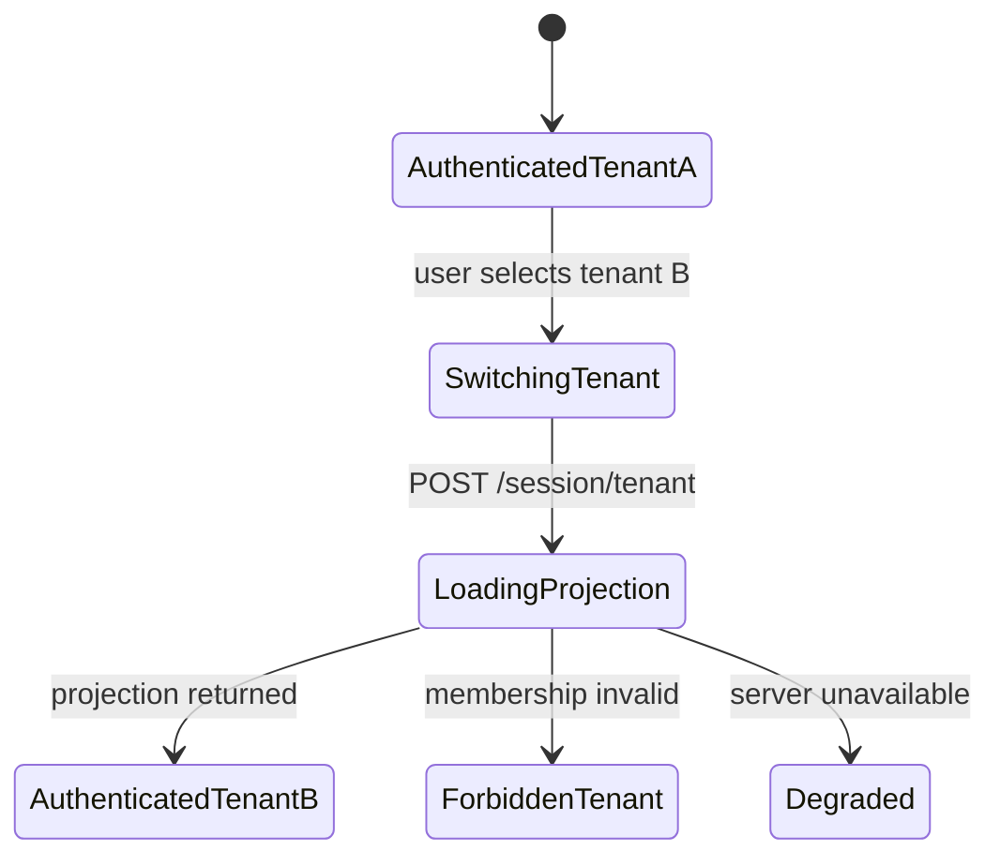
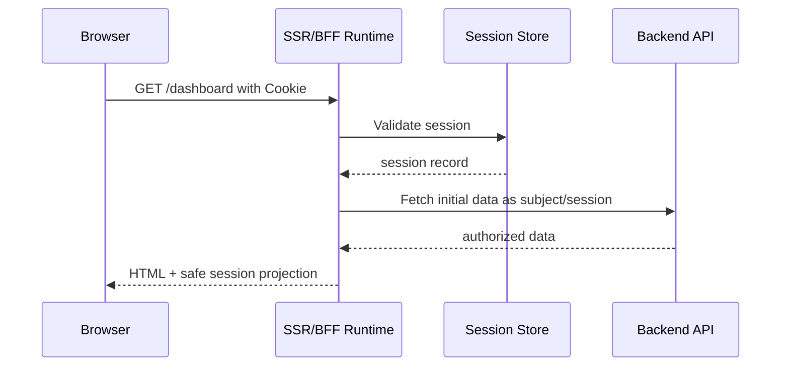

# Part 019 — Session Bootstrap

Aplikasi React yang serius tidak boleh memulai hidupnya dengan pertanyaan dangkal: "apakah ada token?".

Pertanyaan yang benar adalah:

> Pada saat aplikasi pertama kali dibuka, sumber otoritatif mana yang menentukan siapa user ini, session apa yang masih valid, tenant mana yang aktif, permission snapshot mana yang boleh dipakai, dan apa yang harus dilakukan ketika jawaban itu belum diketahui?

Itulah **session bootstrap**.

Session bootstrap adalah fase awal ketika React app membangun **runtime auth projection** dari server/session authority. Ia bukan sekadar `getUser()`. Ia adalah proses menyelaraskan browser state, server session, route intent, cache client, permission contract, tenant context, dan failure state sebelum UI sensitif dirender.

Kalau bootstrap salah, bug auth akan muncul sebagai gejala acak:

- halaman protected sempat muncul lalu hilang;
- sidebar menunjukkan menu admin sebelum permission selesai dimuat;
- user sudah logout di tab lain tapi tab ini masih bisa melihat data cache;
- React Query menampilkan data lama dari user sebelumnya;
- route loader memanggil API sebelum session diketahui;
- refresh token gagal tapi UI tetap terlihat authenticated;
- tenant switch membuat cache tenant lama muncul di tenant baru;
- error network diperlakukan sama seperti anonymous user;
- app masuk redirect loop antara `/login` dan `/dashboard`.

Bootstrap adalah tempat kita mencegah semua itu.

---

## 1. Mental model

Session bootstrap bukan validasi di frontend. Frontend tidak membuktikan session; frontend **meminta projection** dari server.



The client asks:

- who is this browser currently acting as?
- is the session still valid?
- what tenant/account/org context is active?
- what safe identity fields may be shown?
- what coarse permission/capability projection may be used by UI?
- does this session need reauthentication, MFA, password reset, consent, or policy acknowledgement?
- is the session degraded due to network, IdP, or policy backend failure?

The server answers with a **bounded projection**, not an authority transfer.

A good bootstrap response is not:

```json
{
  "token": "...",
  "jwtClaims": { "role": "admin" }
}
```

A better bootstrap response is:

```json
{
  "state": "authenticated",
  "user": {
    "id": "usr_123",
    "displayName": "Ayu Santoso",
    "email": "ayu@example.com"
  },
  "session": {
    "id": "sess_789",
    "expiresAt": "2026-07-07T10:40:00Z",
    "renewAfter": "2026-07-07T10:25:00Z",
    "assuranceLevel": "aal2"
  },
  "tenant": {
    "id": "org_456",
    "slug": "acme",
    "displayName": "Acme Corp"
  },
  "permissions": {
    "version": "permv_2026_07_07_001",
    "actions": [
      "case:read",
      "case:comment",
      "case:assign"
    ]
  },
  "obligations": []
}
```

Even then, the UI projection is still not enforcement. The server must still authorize every sensitive operation.

---

## 2. Why bootstrap exists

React apps have a timing problem.

The browser can render UI faster than the app can know whether the session is valid. That creates a dangerous gap:



This is the classic **auth flash**.

A high-quality bootstrap design makes sensitive UI wait for an explicit state:



The difference is not cosmetic. It is a security and correctness boundary.

---

## 3. Bootstrap states

Do not use a boolean like this:

```ts
const isAuthenticated = Boolean(user);
```

That loses critical states.

Use an explicit union:

```ts
type AuthBootstrapState =
  | { tag: "unknown" }
  | { tag: "loading"; reason: "initial" | "revalidate" }
  | { tag: "anonymous"; reason: "no-session" | "expired" | "logged-out" }
  | { tag: "authenticated"; projection: SessionProjection }
  | { tag: "reauth-required"; projection: SessionProjection; reason: ReauthReason }
  | { tag: "degraded"; lastKnown?: SessionProjection; reason: DegradedReason }
  | { tag: "failed"; error: BootstrapError };
```

Why so many states?

Because auth is not binary.

| State | Meaning | Render rule |
|---|---|---|
| `unknown` | App has not started bootstrap yet | Render nothing sensitive |
| `loading` | Bootstrap in progress | Render safe shell/splash only |
| `anonymous` | Server says no valid session | Public route or login redirect |
| `authenticated` | Server confirms valid session | Render app according to permissions |
| `reauth-required` | Session exists but assurance is insufficient | Show reauth/challenge flow |
| `degraded` | Server/session cannot be confirmed due to temporary failure | Render limited safe UI only |
| `failed` | Bootstrap failed in a non-recoverable way | Error boundary/retry/logout |

This is where many React auth bugs start: developers collapse `unknown`, `anonymous`, and `failed` into `false`.

That is a modelling error.

---

## 4. `/me` vs `/session`

Most applications start with an endpoint named `/me`. That can work, but the name often encourages a profile-centric response.

For serious systems, prefer thinking in terms of `/session`.

### `/me`

Usually answers:

```txt
Who is the current user?
```

Common response:

```json
{
  "id": "usr_123",
  "name": "Ayu",
  "email": "ayu@example.com"
}
```

Useful, but incomplete.

### `/session`

Answers:

```txt
What is the current authenticated runtime context of this browser request?
```

A better response includes:

- auth state;
- identity summary;
- session metadata;
- active tenant/org/account;
- coarse permissions/capabilities;
- reauth/MFA obligations;
- policy version;
- cache/version metadata;
- safe user preferences needed at startup;
- server time.

Example:

```ts
type SessionProjection = {
  user: {
    id: string;
    displayName: string;
    email?: string;
    avatarUrl?: string;
  };
  session: {
    id: string;
    issuedAt: string;
    expiresAt: string;
    renewAfter?: string;
    assuranceLevel: "anonymous" | "aal1" | "aal2" | "aal3";
  };
  tenant?: {
    id: string;
    slug: string;
    displayName: string;
    membershipId: string;
  };
  permissions: {
    version: string;
    actions: string[];
    resources?: Record<string, string[]>;
  };
  obligations: Array<
    | { type: "mfa_required"; reason: string }
    | { type: "password_reset_required"; reason: string }
    | { type: "terms_acceptance_required"; version: string }
    | { type: "reauth_required"; action?: string }
  >;
  serverTime: string;
};
```

The projection should be small enough to bootstrap fast, but rich enough to prevent follow-up waterfalls for basic app shell decisions.

---

## 5. What not to put in bootstrap

Bootstrap is tempting. People put everything there.

Do not.

A bootstrap response should not become a mega-dashboard payload.

Avoid including:

- full user profile with sensitive PII;
- all organization memberships if not needed at startup;
- all object-level permissions for thousands of resources;
- access token if using cookie/BFF auth;
- raw IdP token claims that the client does not need;
- internal security flags that help attackers tune behavior;
- feature flag payloads that reveal unreleased sensitive features;
- arbitrary admin metadata;
- large navigation tree with sensitive hidden route names;
- audit data;
- entitlements for unrelated tenants.

A bootstrap projection should be:

- minimal;
- explicit;
- cache-safe;
- versioned;
- tenant-scoped;
- safe to expose to JavaScript;
- insufficient for bypassing server authorization.

---

## 6. Bootstrap as a contract

Treat `/session` as a public contract between frontend and backend teams.

It deserves versioning.

```ts
type SessionResponseV1 =
  | {
      version: 1;
      state: "anonymous";
      reason: "no_session" | "expired" | "revoked";
      serverTime: string;
    }
  | {
      version: 1;
      state: "authenticated";
      data: SessionProjection;
    }
  | {
      version: 1;
      state: "reauth_required";
      data: SessionProjection;
      challenge: {
        type: "mfa" | "password" | "webauthn";
        continuationUrl: string;
      };
    };
```

A versioned response prevents frontend teams from guessing shape changes.

The endpoint should also define:

- status code semantics;
- cache headers;
- whether anonymous is `200` or `401`;
- whether network failure permits degraded rendering;
- how permission version changes are communicated;
- whether tenant context can be missing;
- how reauth obligations are represented.

---

## 7. Status code design

There are two common designs.

### Design A — `/session` returns `200` with explicit state

```http
HTTP/1.1 200 OK
Cache-Control: no-store
Content-Type: application/json

{
  "version": 1,
  "state": "anonymous",
  "reason": "no_session",
  "serverTime": "2026-07-07T10:00:00Z"
}
```

Pros:

- easier client logic;
- anonymous is a valid app state;
- avoids treating expected state as exceptional;
- easier to render public apps with optional login.

Cons:

- teams may forget that protected APIs should still return `401`;
- monitoring must distinguish anonymous bootstrap from successful authenticated bootstrap.

### Design B — `/session` returns `401` when no session

```http
HTTP/1.1 401 Unauthorized
Cache-Control: no-store
Content-Type: application/json

{
  "error": "no_session"
}
```

Pros:

- conventional HTTP semantics;
- consistent with protected APIs;
- easy to detect auth failure in generic API clients.

Cons:

- anonymous bootstrap becomes an error path;
- generic interceptors may redirect too early;
- public pages with optional session become harder.

Both can be valid. Choose one deliberately. Document it.

For many React apps, I prefer **Design A for `/session` only**, while keeping protected resource endpoints strict with `401`/`403`.

---

## 8. Cache headers

Bootstrap responses contain auth-sensitive projection data. They should not be stored by shared caches.

Baseline:

```http
Cache-Control: no-store
Pragma: no-cache
Vary: Cookie, Authorization
```

For cookie-based apps, `Vary: Cookie` prevents cache confusion. For bearer token apps, `Vary: Authorization` matters when intermediaries are involved.

If using a BFF, also ensure CDN/reverse proxy config does not cache `/session` accidentally.

### Important distinction

`no-store` protects the HTTP response from being stored by caches that respect it. It does not automatically clear data already copied into:

- React state;
- query cache;
- Redux/Zustand store;
- local/session storage;
- IndexedDB;
- service worker cache;
- browser history DOM snapshots;
- logs/analytics.

Client cleanup is still required on logout and user switch.

---

## 9. Bootstrap in cookie session apps

Cookie session bootstrap is usually simple:

```ts
async function fetchSession(): Promise<SessionResponseV1> {
  const res = await fetch("/api/session", {
    method: "GET",
    credentials: "include",
    headers: {
      Accept: "application/json",
    },
  });

  if (!res.ok) {
    throw new Error(`Session bootstrap failed: ${res.status}`);
  }

  return res.json();
}
```

The browser sends HTTP-only cookies automatically. JavaScript cannot read them, which is the point.

But the client can still receive the projection.



Do not return the raw session id.

Do not return refresh token.

Do not return unnecessary IdP claims.

---

## 10. Bootstrap in bearer token apps

Bearer token apps are trickier because JavaScript often has to attach an access token.

If the token is in memory only, bootstrap has two phases:

1. restore/refresh token if possible;
2. call `/session` or `/me` with access token.



If refresh fails, do not fake authentication from a decoded stale token.

A decoded token can help show diagnostics. It cannot prove active session.

---

## 11. Bootstrap and React Router loaders

If the app uses React Router Data or Framework Mode, bootstrap should happen before protected route data loaders fetch sensitive data.

Bad:

```ts
export async function dashboardLoader() {
  const cases = await fetch("/api/cases").then((r) => r.json());
  return { cases };
}
```

Better:

```ts
import { redirect } from "react-router";

export async function requireSession(request: Request) {
  const session = await getSessionProjection(request);

  if (session.state === "anonymous") {
    const url = new URL(request.url);
    throw redirect(`/login?returnTo=${encodeURIComponent(url.pathname)}`);
  }

  if (session.state === "reauth_required") {
    throw redirect(`/reauth?returnTo=${encodeURIComponent(new URL(request.url).pathname)}`);
  }

  if (session.state !== "authenticated") {
    throw new Response("Session unavailable", { status: 503 });
  }

  return session.data;
}

export async function dashboardLoader({ request }: { request: Request }) {
  const session = await requireSession(request);

  const cases = await fetchCases({
    tenantId: session.tenant?.id,
    subjectId: session.user.id,
  });

  return { session, cases };
}
```

This pattern makes auth a data boundary, not just a component boundary.

---

## 12. Bootstrap and app shell composition

A common React shape:

```tsx
export function AppRoot() {
  return (
    <AuthProvider>
      <RouterProvider router={router} />
    </AuthProvider>
  );
}
```

This works, but the provider must not expose a fake default user.

Bad:

```ts
const AuthContext = createContext({
  user: null,
  isAuthenticated: false,
});
```

Better:

```ts
type AuthContextValue = {
  state: AuthBootstrapState;
  refreshSession: () => Promise<void>;
  logout: () => Promise<void>;
  can: (action: string, resource?: unknown) => PermissionResult;
};

const AuthContext = createContext<AuthContextValue | null>(null);
```

Then force consumers to handle unknown state:

```tsx
function AuthGate({ children }: { children: React.ReactNode }) {
  const auth = useAuth();

  switch (auth.state.tag) {
    case "unknown":
    case "loading":
      return <SafeStartupScreen />;

    case "anonymous":
      return <LoginRedirect />;

    case "reauth-required":
      return <ReauthRequired reason={auth.state.reason} />;

    case "degraded":
      return <DegradedAuthScreen retry={auth.refreshSession} />;

    case "failed":
      return <AuthFatalError error={auth.state.error} />;

    case "authenticated":
      return <>{children}</>;
  }
}
```

The goal is not to make UI verbose. The goal is to make impossible states impossible to ignore.

---

## 13. Splash screen vs skeleton vs public shell

Bootstrap UX has three common options.

### Option 1 — Full startup splash

Best for strongly protected apps.

```txt
[Loading secure workspace...]
```

Pros:

- no sensitive UI flash;
- simple mental model;
- good for enterprise/admin/case-management apps.

Cons:

- slower perceived startup;
- poor for mostly public sites.

### Option 2 — Public shell first

Best for public apps where auth is optional.

Render:

- public header;
- neutral skeleton;
- no user menu;
- no tenant selector;
- no protected navigation;
- no cached user data.

Then hydrate session-specific UI when bootstrap resolves.

### Option 3 — Route-level bootstrap

Best for large apps with mixed public/protected routes.

Public routes do not block on session. Protected routes require session in loader.

This is usually the best architecture when using React Router Data Mode or framework routers.

---

## 14. Degraded bootstrap

Network failure is not the same as anonymous.

```ts
type BootstrapError =
  | { type: "network_unreachable" }
  | { type: "server_unavailable"; status: 503 }
  | { type: "invalid_response" }
  | { type: "csrf_required" }
  | { type: "clock_skew_too_large" }
  | { type: "unknown" };
```

If `/session` fails because the network is down, redirecting to `/login` may be wrong. The user may still be authenticated, but the app cannot confirm it.

A regulated or admin app should usually fail closed:

```txt
We could not verify your session. Retry when the connection is available.
```

A low-risk productivity app may show a limited read-only cached shell if:

- cached data is not sensitive;
- cache is tenant/user scoped;
- user was previously authenticated recently;
- no mutation is allowed;
- all protected actions are disabled;
- the UI clearly marks offline/degraded mode.

Never allow mutation based on stale unverified session state.

---

## 15. Tenant-scoped bootstrap

For SaaS apps, bootstrap is not complete until active tenant is known.

Bad:

```ts
const currentTenantId = localStorage.getItem("tenantId");
```

Better:

```json
{
  "state": "authenticated",
  "data": {
    "user": { "id": "usr_123" },
    "tenant": {
      "id": "org_456",
      "membershipId": "mem_789",
      "roleSummary": "case_manager"
    },
    "permissions": {
      "version": "permv_org_456_20260707",
      "actions": ["case:read", "case:assign"]
    }
  }
}
```

Tenant context should be server-confirmed.

A client-side tenant preference can be used as a request hint, but the server must verify membership and return the effective tenant.

### Tenant switch bootstrap

Tenant switching should be treated as a new bootstrap event:



On tenant switch:

- cancel in-flight requests from previous tenant;
- clear tenant-scoped query cache;
- request new projection from server;
- update route state;
- re-render navigation from new permission snapshot;
- log audit event if needed;
- avoid mixing old tenant data into new tenant UI.

---

## 16. Permission bootstrap

There are three common permission bootstrap strategies.

### Strategy A — Coarse action list

```json
{
  "permissions": {
    "actions": ["case:read", "case:create", "case:assign"]
  }
}
```

Good for:

- navigation;
- page-level access;
- feature exposure;
- common buttons.

Weak for:

- object-level authorization;
- row-level actions;
- contextual policy.

### Strategy B — Capability map

```json
{
  "capabilities": {
    "cases": {
      "list": true,
      "create": true,
      "export": false
    },
    "users": {
      "invite": false
    }
  }
}
```

Good for UI ergonomics.

Risk: can become frontend-coupled policy unless carefully versioned.

### Strategy C — Policy query endpoint

Bootstrap returns minimal info, then UI asks:

```http
POST /api/authorization/check
```

```json
{
  "checks": [
    { "action": "case:assign", "resource": "case_123" },
    { "action": "case:close", "resource": "case_123" }
  ]
}
```

Good for fine-grained apps.

Risk: more latency, more batching complexity.

### Recommended hybrid

For most enterprise React apps:

- bootstrap returns coarse permissions for layout/navigation;
- resource fetches return `allowedActions` for each object;
- mutations are always authorized server-side;
- special screens use batch authorization checks.

---

## 17. Bootstrap and data cache

Auth bootstrap must own cache lifecycle.

When session changes, clear or partition cache.

```ts
async function onSessionProjectionChanged(
  previous: SessionProjection | null,
  next: SessionProjection | null,
  queryClient: QueryClient,
) {
  const previousKey = previous
    ? `${previous.user.id}:${previous.tenant?.id ?? "none"}:${previous.permissions.version}`
    : null;

  const nextKey = next
    ? `${next.user.id}:${next.tenant?.id ?? "none"}:${next.permissions.version}`
    : null;

  if (previousKey !== nextKey) {
    await queryClient.cancelQueries();
    queryClient.clear();
  }
}
```

Do not reuse query cache across:

- login;
- logout;
- user switch;
- tenant switch;
- impersonation start/end;
- permission version change;
- assurance level change;
- role/membership update.

For a safer design, include auth context in query keys:

```ts
function authScopedQueryKey(session: SessionProjection, key: readonly unknown[]) {
  return [
    "auth",
    session.user.id,
    session.tenant?.id ?? "global",
    session.permissions.version,
    ...key,
  ] as const;
}
```

This prevents accidental cross-user or cross-tenant cache reuse.

---

## 18. Bootstrap in SSR/BFF architecture

In BFF/SSR apps, bootstrap may run on the server before HTML is rendered.



This reduces auth flash, but introduces a new risk: accidentally serializing sensitive data into the client payload.

Only serialize what the client needs.

Server-only values must remain server-only:

- raw session id;
- refresh token;
- access token if BFF hides it;
- internal risk score;
- raw IdP claims;
- authorization engine debug traces;
- internal tenant membership graph;
- policy evaluator internals.

---

## 19. Bootstrap race conditions

### Race 1 — route loads before session

Fix: route loader requires session before protected data fetch.

### Race 2 — session expires during bootstrap

Fix: server returns anonymous/expired; client redirects or reauths. Do not keep stale decoded token.

### Race 3 — refresh and bootstrap happen concurrently

Fix: single-flight session manager.

```ts
class BootstrapCoordinator {
  private inFlight: Promise<SessionResponseV1> | null = null;

  bootstrap() {
    if (!this.inFlight) {
      this.inFlight = fetchSession().finally(() => {
        this.inFlight = null;
      });
    }

    return this.inFlight;
  }
}
```

### Race 4 — logout while bootstrap is in flight

Fix: abort signal + session generation.

```ts
let generation = 0;

async function bootstrapWithGeneration(signal: AbortSignal) {
  const currentGeneration = generation;
  const response = await fetchSessionWithAbort(signal);

  if (currentGeneration !== generation) {
    return { ignored: true as const };
  }

  return { ignored: false as const, response };
}

function markSessionChanged() {
  generation += 1;
}
```

### Race 5 — tenant switch while bootstrap is in flight

Fix: tenant switch increments generation, cancels old queries, and starts a new projection request.

---

## 20. Implementation blueprint

### Step 1 — Define response types

```ts
export type AnonymousSession = {
  version: 1;
  state: "anonymous";
  reason: "no_session" | "expired" | "revoked" | "logged_out";
  serverTime: string;
};

export type AuthenticatedSession = {
  version: 1;
  state: "authenticated";
  data: SessionProjection;
};

export type ReauthRequiredSession = {
  version: 1;
  state: "reauth_required";
  data: SessionProjection;
  challenge: {
    type: "password" | "mfa" | "webauthn";
    continuationUrl: string;
  };
};

export type SessionResponseV1 =
  | AnonymousSession
  | AuthenticatedSession
  | ReauthRequiredSession;
```

### Step 2 — Validate response shape

In production, use a schema library or strict decoder. Do not trust JSON shape blindly.

```ts
function assertSessionResponse(value: unknown): asserts value is SessionResponseV1 {
  if (!value || typeof value !== "object") {
    throw new Error("Invalid session response");
  }

  const candidate = value as { version?: unknown; state?: unknown };

  if (candidate.version !== 1) {
    throw new Error("Unsupported session response version");
  }

  if (
    candidate.state !== "anonymous" &&
    candidate.state !== "authenticated" &&
    candidate.state !== "reauth_required"
  ) {
    throw new Error("Unknown session state");
  }
}
```

### Step 3 — Fetch bootstrap projection

```ts
export async function requestSession(signal?: AbortSignal): Promise<SessionResponseV1> {
  const response = await fetch("/api/session", {
    method: "GET",
    credentials: "include",
    headers: {
      Accept: "application/json",
    },
    signal,
  });

  if (response.status >= 500) {
    throw new Error("session_server_unavailable");
  }

  if (!response.ok) {
    throw new Error(`session_bootstrap_failed_${response.status}`);
  }

  const body: unknown = await response.json();
  assertSessionResponse(body);
  return body;
}
```

### Step 4 — Convert wire response into UI state

```ts
function toAuthState(response: SessionResponseV1): AuthBootstrapState {
  switch (response.state) {
    case "anonymous":
      return { tag: "anonymous", reason: response.reason === "no_session" ? "no-session" : response.reason };

    case "authenticated":
      return { tag: "authenticated", projection: response.data };

    case "reauth_required":
      return {
        tag: "reauth-required",
        projection: response.data,
        reason: { type: response.challenge.type },
      };
  }
}
```

### Step 5 — Provide auth runtime

```tsx
export function AuthProvider({ children }: { children: React.ReactNode }) {
  const [state, setState] = React.useState<AuthBootstrapState>({ tag: "unknown" });
  const abortRef = React.useRef<AbortController | null>(null);

  const refreshSession = React.useCallback(async () => {
    abortRef.current?.abort();
    const abort = new AbortController();
    abortRef.current = abort;

    setState({ tag: "loading", reason: "revalidate" });

    try {
      const response = await requestSession(abort.signal);
      setState(toAuthState(response));
    } catch (error) {
      if (abort.signal.aborted) return;

      setState({
        tag: "degraded",
        reason: { type: "network_or_server_failure" },
      });
    }
  }, []);

  React.useEffect(() => {
    void refreshSession();

    return () => {
      abortRef.current?.abort();
    };
  }, [refreshSession]);

  const value = React.useMemo(
    () => ({ state, refreshSession }),
    [state, refreshSession],
  );

  return <AuthContext.Provider value={value}>{children}</AuthContext.Provider>;
}
```

This is a skeleton, not a complete framework. The important part is the state model and authority boundary.

---

## 21. Bootstrap and service workers

Service workers complicate auth because they can cache responses, intercept requests, and outlive the page.

If a React app uses a service worker:

- do not cache `/session`;
- do not cache protected API responses without strict user/tenant partitioning;
- clear protected caches on logout;
- handle session change messages from the page;
- avoid serving stale protected pages after logout;
- consider bypassing service worker for auth endpoints.

Example fetch rule:

```ts
self.addEventListener("fetch", (event) => {
  const url = new URL(event.request.url);

  if (url.pathname.startsWith("/api/session")) {
    return; // let network handle it
  }

  if (url.pathname.startsWith("/api/secure")) {
    return; // avoid caching sensitive API by default
  }
});
```

A service worker is a runtime. Treat it as part of auth architecture, not a build artifact.

---

## 22. Bootstrap security review checklist

Use this checklist during PR/design review.

### State modelling

- Does the app distinguish unknown, anonymous, authenticated, degraded, and reauth-required?
- Is sensitive UI hidden during unknown/loading state?
- Are network failures not treated as logout unless server confirms it?
- Are fatal bootstrap errors visible and diagnosable?

### Server contract

- Does `/session` validate the session server-side?
- Does it return minimal projection?
- Are cache headers set to `no-store`?
- Is tenant context server-confirmed?
- Is permission projection versioned?
- Are obligations explicit?

### React integration

- Do protected route loaders wait for session?
- Are protected data fetches blocked until bootstrap resolves?
- Is query cache cleared on user/tenant/permission change?
- Are in-flight requests cancelled during logout/switch?
- Are route redirects loop-safe?

### Security

- Are raw tokens excluded from bootstrap unless explicitly required?
- Is decoded JWT never used as authorization proof?
- Are sensitive claims not serialized into the client?
- Are service worker caches controlled?
- Are logs/analytics prevented from capturing sensitive projection data?

---

## 23. Testing matrix

Test bootstrap as a state machine.

| Scenario | Expected result |
|---|---|
| Fresh anonymous browser opens public route | Public shell renders; no protected data fetch |
| Fresh anonymous browser opens protected route | Redirect to login with safe return URL |
| Valid session opens protected route | Session projection loads before protected data |
| `/session` returns expired | Anonymous/expired state; cache cleared |
| `/session` returns reauth required | Reauth UI shown; protected mutation blocked |
| `/session` returns 503 | Degraded/fail-closed state, not fake logout |
| Bootstrap request is slow | Safe startup screen only |
| Logout occurs during bootstrap | Bootstrap response ignored |
| Tenant switch during bootstrap | Old projection ignored; old cache cleared |
| Permission version changes | Permission cache/query cache invalidated |
| Service worker enabled | `/session` never served from stale cache |

---

## 24. Operational signals

Track bootstrap quality in production.

Useful metrics:

- `session.bootstrap.success.count`
- `session.bootstrap.anonymous.count`
- `session.bootstrap.reauth_required.count`
- `session.bootstrap.degraded.count`
- `session.bootstrap.duration.ms`
- `session.bootstrap.redirect_loop.count`
- `session.bootstrap.invalid_response.count`
- `session.bootstrap.permission_version_changed.count`
- `session.bootstrap.tenant_mismatch.count`

Useful logs:

```json
{
  "event": "session_bootstrap_completed",
  "state": "authenticated",
  "session_id_hash": "sha256:...",
  "user_id": "usr_123",
  "tenant_id": "org_456",
  "permission_version": "permv_20260707_001",
  "duration_ms": 82,
  "request_id": "req_abc"
}
```

Do not log raw tokens, raw cookies, or full sensitive profile data.

---

## 25. Common anti-patterns

### Anti-pattern: `!!localStorage.token`

This checks storage, not session validity.

### Anti-pattern: default user object

```ts
const defaultUser = { role: "guest" };
```

This often hides unknown state and creates confusing role checks.

### Anti-pattern: render first, verify later

This causes auth flash and data exposure.

### Anti-pattern: bootstrap returns everything

This bloats startup and leaks unnecessary data.

### Anti-pattern: anonymous = network error

This causes logout during outage.

### Anti-pattern: permission projection never expires

This causes stale privilege after role change.

### Anti-pattern: one global cache for all users

This causes cross-user and cross-tenant data leaks.

---

## 26. Design rule

A good React session bootstrap satisfies this invariant:

> Before any protected UI or data is shown, the app has either received a current server-confirmed session projection, deliberately rendered a safe anonymous/public state, or entered a fail-closed degraded state.

That is the entire point.

Session bootstrap is not there to make login feel nice. It is there to remove ambiguity from app startup.

When ambiguity remains, React will render it.

And when React renders auth ambiguity, users eventually see things they should not see.

---

## 27. Sources and further reading

- OWASP Session Management Cheat Sheet — session lifecycle, timeout, session ID handling, and server-side enforcement: https://cheatsheetseries.owasp.org/cheatsheets/Session_Management_Cheat_Sheet.html
- OWASP Authentication Cheat Sheet — authentication lifecycle and reauthentication considerations: https://cheatsheetseries.owasp.org/cheatsheets/Authentication_Cheat_Sheet.html
- OAuth 2.0 for Browser-Based Applications draft — browser-based OAuth threat model and recommendations: https://datatracker.ietf.org/doc/html/draft-ietf-oauth-browser-based-apps
- RFC 9700 — Best Current Practice for OAuth 2.0 Security: https://www.rfc-editor.org/info/rfc9700
- MDN Fetch API credentials option: https://developer.mozilla.org/en-US/docs/Web/API/Request/credentials
- MDN Cache-Control: https://developer.mozilla.org/en-US/docs/Web/HTTP/Headers/Cache-Control
