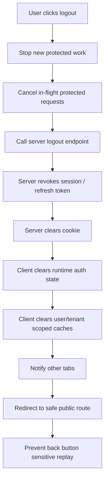
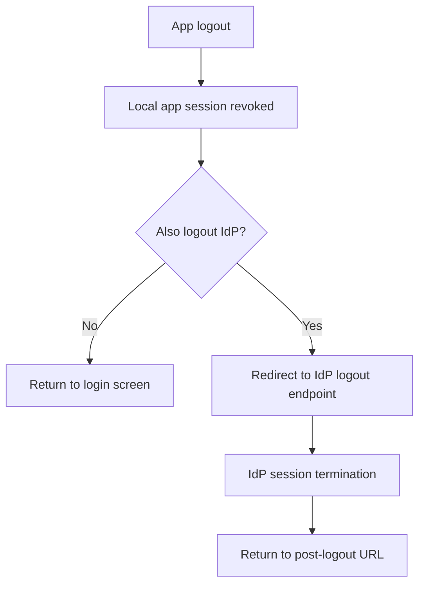
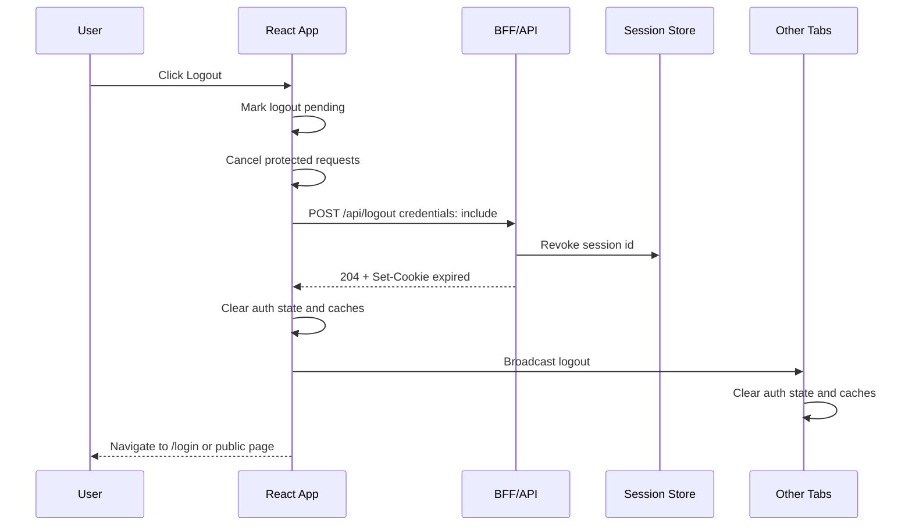
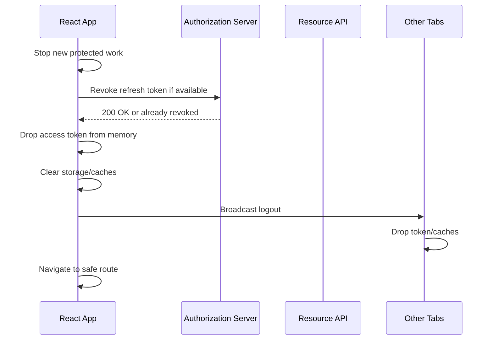
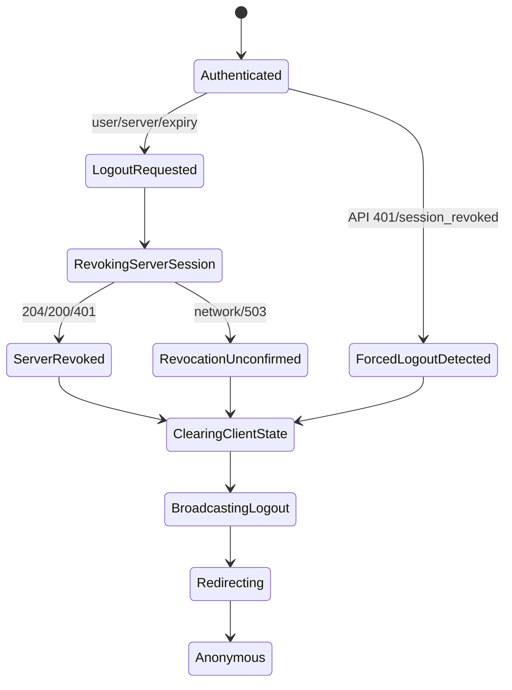

# Part 020 — Logout Is a Distributed System Problem

Logout terlihat sederhana.

```tsx
<button onClick={() => localStorage.removeItem("token")}>Logout</button>
```

Itu bukan logout. Itu hanya menghapus satu key dari satu storage di satu tab.

Logout yang benar adalah koordinasi banyak state yang tersebar:

- browser memory;
- cookie jar;
- HTTP-only session cookie;
- access token;
- refresh token;
- server session store;
- authorization server session;
- IdP SSO session;
- React state;
- router state;
- query cache;
- service worker cache;
- IndexedDB/localStorage/sessionStorage;
- other tabs;
- in-flight requests;
- browser back-forward cache;
- CDN/proxy cache;
- mobile/webview container;
- audit trail;
- user expectations.

Logout is not a button. Logout is a **distributed invalidation protocol**.

The goal is not merely "make the UI show login". The goal is:

> After logout, the browser must no longer be able to use the previous session to perform authenticated actions, protected UI must not display stale sensitive data, other same-origin app contexts must converge to anonymous state, and the server must have an auditable record of session termination.

That sentence is long because the problem is real.

---

## 1. Mental model



This is the **local application logout** path.

SSO/global logout adds another layer:



Local app logout and IdP logout are not the same thing.

A user may log out of your app but remain logged in at the identity provider. The next login may be silent because the IdP SSO session still exists. That is not necessarily a bug, but it must be intentional and clearly communicated.

---

## 2. Logout invariants

A production logout design should satisfy these invariants.

### Invariant 1 — Server-side authority is revoked

Client cleanup alone is insufficient.

If a session id or refresh token remains valid server-side, an attacker or another tab may continue using it.

### Invariant 2 — Client state converges to anonymous

Every local runtime should eventually agree:

- current tab;
- other tabs;
- iframes under same app origin;
- service worker-controlled pages;
- in-memory stores;
- query caches.

### Invariant 3 — Protected data is not shown after logout

Logout must clear or isolate user/tenant-scoped data.

### Invariant 4 — Logout is idempotent

Calling logout twice should be safe.

### Invariant 5 — Logout is auditable

Security teams need to know whether a session ended by user action, expiry, admin revocation, risk engine, password reset, or suspected compromise.

### Invariant 6 — Failure state is explicit

If the server cannot be reached, the UI can clear local state, but it must not pretend server revocation succeeded unless it has proof.

---

## 3. Types of logout

Logout is overloaded. Split the cases.

| Type | Meaning | Example |
|---|---|---|
| Local UI logout | Clear current React runtime only | Rarely sufficient |
| App session logout | Revoke this app session | Normal app logout |
| All-device logout | Revoke all sessions for this user/app | Password change, account compromise |
| Tenant-scoped exit | Exit active tenant context but keep user session | Switch organization/workspace |
| Impersonation exit | End admin impersonation but keep admin session | Support/admin console |
| IdP logout | End identity provider SSO session | Enterprise SSO logout |
| Forced logout | Server/admin/risk revokes session | Incident/risk response |
| Expiry logout | Session expires by idle/absolute timeout | Normal lifecycle |

Do not implement all of these with the same button and same copy.

Different logout types have different blast radius.

---

## 4. The wrong logout designs

### Wrong design 1 — client-only logout

```ts
function logout() {
  localStorage.removeItem("access_token");
  navigate("/login");
}
```

If the refresh token remains valid, this is cosmetic.

### Wrong design 2 — server-only logout

```ts
await fetch("/logout", { method: "POST" });
```

If React Query cache still contains sensitive data, the user may press back and see protected content.

### Wrong design 3 — logout as GET

```html
<a href="/logout">Logout</a>
```

Logout changes state. Use `POST`. Protect it from CSRF where applicable.

### Wrong design 4 — clear current tab only

Other tabs continue acting authenticated.

### Wrong design 5 — redirect before revocation completes

If the request is aborted on navigation, server revocation may never happen.

### Wrong design 6 — treat IdP logout as app logout

An app can be logged out while IdP session remains. The opposite can also be temporarily true.

---

## 5. Logout sequence for cookie session apps

A cookie/BFF logout sequence:



Server response:

```http
HTTP/1.1 204 No Content
Set-Cookie: __Host-session=; Max-Age=0; Path=/; Secure; HttpOnly; SameSite=Lax
Cache-Control: no-store
```

If using a CSRF token, send it according to your CSRF design.

```ts
async function logoutCookieSession(csrfToken: string) {
  const response = await fetch("/api/logout", {
    method: "POST",
    credentials: "include",
    headers: {
      "X-CSRF-Token": csrfToken,
    },
  });

  if (!response.ok && response.status !== 401) {
    throw new Error(`Logout failed: ${response.status}`);
  }
}
```

Treat `401` during logout as success-like for UX: the session is already gone.

---

## 6. Logout sequence for bearer token apps

Bearer token apps may need to revoke refresh tokens.



If refresh token is HTTP-only cookie backed by a BFF, the client may only call the BFF logout endpoint.

If refresh token is held by JavaScript, the token is already exposed to the JS runtime. Logout can remove it, but XSS may have stolen it before logout. This is one reason browser-based token storage requires serious threat modelling.

---

## 7. Server-side logout responsibilities

The server should do more than clear a cookie.

Server logout should:

- identify current session securely;
- revoke session record or refresh token family;
- rotate/invalidate server-side CSRF token if bound to session;
- clear session cookie with matching `Path`, `Domain`, `Secure`, `SameSite` attributes;
- record audit event;
- return cache-safe response;
- tolerate already-expired/already-revoked session;
- avoid leaking whether a user id exists;
- optionally revoke all device sessions for high-risk flows;
- optionally notify downstream systems if session revocation affects realtime channels.

Pseudo server logic:

```ts
async function logout(request: Request): Promise<Response> {
  const sessionId = readSessionCookie(request);
  const requestId = getRequestId(request);

  if (sessionId) {
    const session = await sessionStore.findById(hash(sessionId));

    if (session && session.status === "active") {
      await sessionStore.revoke(session.id, {
        reason: "user_logout",
        revokedAt: new Date(),
        requestId,
      });

      await auditLog.write({
        type: "session.logout",
        sessionId: session.id,
        userId: session.userId,
        tenantId: session.tenantId,
        reason: "user_logout",
        requestId,
      });
    }
  }

  return new Response(null, {
    status: 204,
    headers: {
      "Set-Cookie": expireSessionCookie(),
      "Cache-Control": "no-store",
    },
  });
}
```

Idempotency matters. If the session is already gone, logout should still return a safe response.

---

## 8. Client-side logout coordinator

A strong React logout flow has a coordinator.

```ts
type LogoutReason =
  | "user_clicked_logout"
  | "session_expired"
  | "server_revoked"
  | "password_changed"
  | "tenant_membership_removed"
  | "impersonation_ended"
  | "security_incident";

type LogoutOptions = {
  reason: LogoutReason;
  redirectTo?: string;
  globalIdpLogout?: boolean;
};
```

Coordinator shape:

```ts
class LogoutCoordinator {
  private inFlight: Promise<void> | null = null;

  constructor(
    private readonly deps: {
      revokeServerSession: () => Promise<void>;
      clearAuthState: () => void;
      clearQueryCache: () => void;
      clearLocalStores: () => void;
      cancelRequests: () => void;
      broadcast: (message: AuthBroadcastMessage) => void;
      navigate: (to: string) => void;
    },
  ) {}

  logout(options: LogoutOptions): Promise<void> {
    if (this.inFlight) return this.inFlight;

    this.inFlight = this.execute(options).finally(() => {
      this.inFlight = null;
    });

    return this.inFlight;
  }

  private async execute(options: LogoutOptions) {
    this.deps.cancelRequests();

    try {
      await this.deps.revokeServerSession();
    } finally {
      this.deps.clearAuthState();
      this.deps.clearQueryCache();
      this.deps.clearLocalStores();
      this.deps.broadcast({ type: "logout", reason: options.reason });
      this.deps.navigate(options.redirectTo ?? "/login");
    }
  }
}
```

The `finally` block is deliberate: even if the network fails, local state should not remain authenticated after the user chose logout.

But the app should still log/observe that server revocation was not confirmed.

---

## 9. In-flight requests

Logout must cancel protected requests where possible.

Without cancellation:

1. user clicks logout;
2. request A is still in flight;
3. app clears auth state;
4. request A returns protected data;
5. cache writes old data after logout.

Use abort controllers or request generation.

```ts
class RequestGeneration {
  private generation = 0;

  next() {
    this.generation += 1;
  }

  current() {
    return this.generation;
  }
}

const requestGeneration = new RequestGeneration();

async function authScopedFetch(input: RequestInfo, init?: RequestInit) {
  const generationAtStart = requestGeneration.current();
  const response = await fetch(input, init);

  if (generationAtStart !== requestGeneration.current()) {
    throw new Error("stale_request_after_auth_change");
  }

  return response;
}

function onLogoutStarted() {
  requestGeneration.next();
}
```

React Query, SWR, Apollo, Relay, and custom stores need similar protection.

---

## 10. Cache cleanup

Logout must clear:

- auth context;
- query cache;
- mutation queue;
- Redux/Zustand/Jotai/Recoil state containing user data;
- route loader data if framework supports revalidation/reset;
- localStorage/sessionStorage keys used by the app;
- IndexedDB if it contains protected user data;
- service worker caches;
- in-memory permission cache;
- websocket subscriptions;
- analytics user identity.

Example:

```ts
async function clearClientUserState(queryClient: QueryClient) {
  await queryClient.cancelQueries();
  queryClient.clear();

  sessionStorage.removeItem("activeTenantHint");
  localStorage.removeItem("lastWorkspace");

  resetAuthStore();
  resetPermissionStore();
  resetNavigationStore();
  resetAnalyticsIdentity();
}
```

Be careful with localStorage keys. Do not wipe unrelated app preferences unless that is intended.

Better: namespace sensitive keys.

```txt
app:auth:*
app:tenant:*
app:user-cache:*
```

---

## 11. Clear-Site-Data

The `Clear-Site-Data` response header can ask the browser to clear data associated with the origin, such as cookies, storage, and cache.

Example:

```http
Clear-Site-Data: "cache", "cookies", "storage"
```

This can be useful for high-risk logout or account switching, but use it carefully.

Potential issues:

- it can clear more than your app-specific keys;
- `"cookies"` may affect other cookies scoped to the same registrable domain depending on browser behavior and cookie scope;
- it can remove preferences that users expected to keep;
- browser support/behavior must be tested;
- it does not replace server-side revocation.

A practical strategy:

- normal logout: app-specific cleanup + session cookie expiry + server revocation;
- high-risk logout/security incident: consider `Clear-Site-Data` after product/security review;
- multi-app domain: be extremely careful with broad clearing.

---

## 12. Multi-tab logout

From Part 018, logout must be broadcast.

```ts
type AuthBroadcastMessage =
  | { type: "logout"; reason: LogoutReason; occurredAt: string }
  | { type: "session_revoked"; reason: string; occurredAt: string }
  | { type: "tenant_changed"; tenantId: string; occurredAt: string };

const channel = new BroadcastChannel("auth");

export function broadcastLogout(reason: LogoutReason) {
  channel.postMessage({
    type: "logout",
    reason,
    occurredAt: new Date().toISOString(),
  } satisfies AuthBroadcastMessage);
}

channel.addEventListener("message", (event) => {
  const message = event.data as AuthBroadcastMessage;

  if (message.type === "logout" || message.type === "session_revoked") {
    void localLogoutCleanup(message.reason as LogoutReason);
  }
});
```

Other tabs should not call server logout again blindly. They should converge locally. The first tab already asked the server to revoke the session. Additional tabs can re-check `/session` if needed.

---

## 13. Back button after logout

The browser back button is not a security boundary, but stale UI after logout is a serious user trust problem.

Mitigations:

- protected pages use `Cache-Control: no-store` for HTML/API responses;
- client state and query cache are cleared;
- route guards revalidate session on protected route entry;
- service worker does not serve protected pages from cache;
- app handles `pageshow` event when restored from back-forward cache.

Example:

```ts
window.addEventListener("pageshow", (event) => {
  if (event.persisted) {
    void authRuntime.refreshSession();
  }
});
```

If a page is restored from bfcache, React may not fully remount. Revalidate auth-sensitive state.

---

## 14. WebSocket and realtime logout

If the app uses realtime channels, logout must close them.

```ts
function onLogoutRealtimeCleanup() {
  websocketClient.unsubscribeAll();
  websocketClient.close({ reason: "logout" });
  sseClient.close();
}
```

Server-side, session revocation should also invalidate channel authorization.

Otherwise:

- UI may logout;
- HTTP requests stop;
- websocket still receives protected events.

That is a real data leak.

---

## 15. Logout and permissions

A logout caused by permission change has different UX than user-clicked logout.

Example causes:

- user removed from tenant;
- role downgraded;
- admin revoked session;
- password changed;
- risk engine detected token reuse;
- refresh token family compromised;
- account disabled.

Do not show generic "you logged out" for all of these.

Use reason-aware copy:

```ts
function logoutMessage(reason: LogoutReason) {
  switch (reason) {
    case "user_clicked_logout":
      return "You have been signed out.";
    case "session_expired":
      return "Your session expired. Please sign in again.";
    case "tenant_membership_removed":
      return "Your access to this workspace changed. Please sign in again.";
    case "security_incident":
      return "For your security, this session was ended. Please sign in again.";
    default:
      return "Please sign in again.";
  }
}
```

Security copy must be accurate without oversharing internals.

---

## 16. IdP and SSO logout

Enterprise apps often confuse three sessions:


Logging out of the React app may clear A and B, but C may remain.

That means after logout, clicking login again may immediately authenticate through SSO.

This can be desirable:

- fast enterprise login;
- app-specific logout only;
- shared IdP session across many apps.

It can be surprising:

- user thinks they fully signed out;
- shared workstation risk;
- high-security apps requiring full IdP logout.

Design copy and controls clearly:

- "Sign out of this app"
- "Sign out of all company apps" if global logout is supported
- "Switch account"
- "End impersonation"

OIDC logout specifics are intentionally deferred to the OAuth/OIDC phase, but the architectural point belongs here: local logout and identity-provider logout are separate protocols.

---

## 17. Logout during network failure

What if the user clicks logout while offline?

You cannot confirm server revocation.

Possible strategy:

1. clear local auth state immediately;
2. mark server revocation as unconfirmed;
3. stop protected UI;
4. when connectivity returns, do not silently restore old session;
5. optionally attempt best-effort revocation if refresh token/session is still available in a safe server-side component;
6. show conservative message.

Client-side bearer apps have a hard problem: if the only copy of refresh token is in JavaScript and you delete it while offline, you may lose ability to revoke it. This is one reason server-held refresh token/BFF designs are often cleaner.

For high-risk systems, logout should require server acknowledgement when possible, but the UI must still fail closed locally.

---

## 18. Forced logout

Forced logout occurs when the server ends the session outside user action.

Examples:

- admin revokes session;
- password changed;
- refresh token reuse detected;
- account disabled;
- tenant membership removed;
- policy version invalidates current session;
- session absolute timeout reached.

Client detection mechanisms:

- API returns `401` with reason code;
- `/session` revalidation returns anonymous/revoked;
- websocket event notifies revocation;
- polling/session heartbeat detects revocation;
- refresh request fails with known error.

Handle with the same logout coordinator, but reason differs.

```ts
async function handleAuthApiFailure(response: Response) {
  if (response.status !== 401) return;

  const reason = response.headers.get("X-Auth-Reason");

  if (reason === "session_revoked") {
    await logoutCoordinator.logout({
      reason: "server_revoked",
      redirectTo: "/login?reason=session_revoked",
    });
  }
}
```

Avoid putting sensitive details in headers or body. Use coarse reason codes.

---

## 19. Logout endpoint contract

A good contract:

```http
POST /api/logout
Cookie: __Host-session=...
X-CSRF-Token: ...
```

Possible responses:

| Status | Meaning | Client behavior |
|---|---|---|
| `204` | Session revoked/cleared | Clear local state, redirect |
| `200` | Same, with body | Clear local state, maybe use redirect hint |
| `401` | Already anonymous | Treat as success-like |
| `403` | CSRF/invalid request | Clear local state? Show error? Depends on threat model |
| `503` | Server unavailable | Clear local state, mark revocation unconfirmed |

Response body if needed:

```json
{
  "state": "logged_out",
  "reason": "user_logout",
  "postLogoutRedirect": "/login"
}
```

Do not rely entirely on server-provided redirect unless it is constrained to internal safe URLs.

---

## 20. Logout and CSRF

Cookie-based logout changes server state, so CSRF matters.

A cross-site attacker should not be able to silently log users out if that creates harm. Logout CSRF is often less severe than transaction CSRF, but it can still be used for harassment, workflow disruption, or login CSRF chains.

For cookie-authenticated apps:

- use `POST`, not `GET`;
- use SameSite cookies where appropriate;
- use CSRF token for state-changing requests;
- verify Origin/Referer for sensitive flows;
- avoid JSONP/form-compatible logout endpoints;
- require user interaction for high-risk all-device logout.

For app logout, UX and security should both be considered. Do not overcomplicate low-risk local logout, but do not create a GET endpoint that any image tag can trigger.

---

## 21. Logout state machine



Notice that even revocation-unconfirmed goes to client cleanup. After the user requests logout, the local runtime should not stay authenticated.

---

## 22. Implementation blueprint

### Auth runtime API

```ts
export interface AuthRuntime {
  state: AuthBootstrapState;
  bootstrap(): Promise<void>;
  logout(options?: Partial<LogoutOptions>): Promise<void>;
  handleSessionRevoked(reason: string): Promise<void>;
}
```

### Logout implementation

```ts
export function createLogout(deps: {
  queryClient: QueryClient;
  navigate: (to: string, options?: { replace?: boolean }) => void;
  setAuthState: (state: AuthBootstrapState) => void;
  abortProtectedRequests: () => void;
  closeRealtime: () => void;
  broadcastLogout: (reason: LogoutReason) => void;
}) {
  let inFlight: Promise<void> | null = null;

  return function logout(options: LogoutOptions = { reason: "user_clicked_logout" }) {
    if (inFlight) return inFlight;

    inFlight = (async () => {
      deps.setAuthState({ tag: "loading", reason: "revalidate" });
      deps.abortProtectedRequests();
      deps.closeRealtime();

      let serverRevocationConfirmed = false;

      try {
        const response = await fetch("/api/logout", {
          method: "POST",
          credentials: "include",
          headers: {
            Accept: "application/json",
          },
        });

        serverRevocationConfirmed = response.ok || response.status === 401;
      } catch {
        serverRevocationConfirmed = false;
      } finally {
        await deps.queryClient.cancelQueries();
        deps.queryClient.clear();

        clearAppScopedStorage();
        deps.setAuthState({
          tag: "anonymous",
          reason: serverRevocationConfirmed ? "logged-out" : "logged-out",
        });

        deps.broadcastLogout(options.reason);
        deps.navigate(options.redirectTo ?? "/login", { replace: true });
      }
    })().finally(() => {
      inFlight = null;
    });

    return inFlight;
  };
}
```

The example keeps local behavior simple. A production system should also emit telemetry when revocation is unconfirmed.

---

## 23. Storage cleanup pattern

```ts
const SENSITIVE_PREFIXES = [
  "app:auth:",
  "app:user-cache:",
  "app:tenant:",
  "app:permissions:",
];

function clearAppScopedStorage() {
  for (const storage of [localStorage, sessionStorage]) {
    for (const key of Object.keys(storage)) {
      if (SENSITIVE_PREFIXES.some((prefix) => key.startsWith(prefix))) {
        storage.removeItem(key);
      }
    }
  }
}
```

Avoid `localStorage.clear()` unless your app owns the entire origin and product accepts the blast radius.

---

## 24. Service worker cleanup

Page:

```ts
async function clearServiceWorkerCaches() {
  if (!navigator.serviceWorker.controller) return;

  navigator.serviceWorker.controller.postMessage({
    type: "auth/logout",
  });
}
```

Service worker:

```ts
self.addEventListener("message", (event) => {
  if (event.data?.type !== "auth/logout") return;

  event.waitUntil(
    caches.keys().then((keys) =>
      Promise.all(
        keys
          .filter((key) => key.startsWith("protected-"))
          .map((key) => caches.delete(key)),
      ),
    ),
  );
});
```

Better yet: do not cache protected responses unless you have a strong reason and strict partitioning.

---

## 25. Logout UX

Good logout UX is boring and precise.

Rules:

- disable logout button while logout is in progress;
- prevent double-click storms;
- use `replace` navigation so back does not return to protected route state;
- show reason-aware messages;
- distinguish "session expired" from "you signed out";
- avoid revealing security incident internals;
- for global logout, explain scope clearly;
- for failed server revocation, fail closed and ask user to sign in again;
- for shared devices, recommend closing browser only where relevant.

Example copy:

```txt
You have been signed out of this workspace.
```

For SSO local logout:

```txt
You have been signed out of this app. Your company SSO session may still be active.
```

For security-driven logout:

```txt
For your security, this session was ended. Please sign in again.
```

---

## 26. Testing matrix

| Scenario | Expected result |
|---|---|
| User clicks logout with valid session | Server revokes, cookie cleared, cache cleared, redirect |
| User clicks logout twice | Single effective flow, no errors |
| Logout endpoint returns `401` | Treat as success-like; clear local state |
| Logout endpoint returns `503` | Clear local state, mark revocation unconfirmed in telemetry |
| In-flight API returns after logout | Response ignored; cache not repopulated |
| Other tab is open | Other tab receives logout and clears state |
| Back button after logout | Protected data not shown; route revalidates |
| Service worker enabled | Protected caches cleared/not served |
| WebSocket active | Connection closed and server stops events |
| Tenant switch then logout | Tenant-scoped cache cleared correctly |
| Impersonation logout | Ends impersonation without losing admin session if designed so |
| IdP SSO still active | App copy does not claim global sign-out unless performed |
| Password change elsewhere | Forced logout reason shown correctly |

---

## 27. Observability

Track logout as an auth lifecycle event.

Metrics:

- `auth.logout.requested.count`
- `auth.logout.server_revoked.count`
- `auth.logout.server_unconfirmed.count`
- `auth.logout.duration.ms`
- `auth.logout.broadcast.sent.count`
- `auth.logout.broadcast.received.count`
- `auth.logout.cache_clear.duration.ms`
- `auth.logout.stale_request_ignored.count`
- `auth.logout.back_button_revalidation.count`

Audit event:

```json
{
  "event": "session.logout",
  "reason": "user_logout",
  "session_id_hash": "sha256:...",
  "user_id": "usr_123",
  "tenant_id": "org_456",
  "ip_hash": "sha256:...",
  "user_agent_hash": "sha256:...",
  "request_id": "req_abc",
  "occurred_at": "2026-07-07T10:00:00Z"
}
```

Do not log raw cookies, tokens, refresh tokens, or full user agent/IP if privacy policy forbids it.

---

## 28. Incident response perspective

Logout infrastructure is also incident response infrastructure.

When a refresh token family compromise is detected, the system may need to:

- revoke token family;
- force logout all affected sessions;
- notify active tabs via realtime if possible;
- force reauthentication;
- invalidate permission/session projections;
- clear caches;
- produce audit trace;
- show safe user messaging.

If logout is implemented as `localStorage.removeItem`, you have no reliable incident response lever.

---

## 29. Production checklist

Before shipping logout:

- Server revokes current session or refresh token family.
- Server clears cookie with matching attributes.
- Logout is `POST`, not `GET`.
- CSRF protection is considered for cookie auth.
- Client cancels in-flight protected requests.
- Client clears user/tenant-scoped caches.
- Client clears permission state.
- Client closes realtime channels.
- Other tabs receive logout signal.
- Protected routes revalidate after back/restore.
- Service worker does not serve stale protected data.
- Logout is idempotent.
- `401` during logout is handled safely.
- Network failure during logout fails closed locally.
- IdP/global logout semantics are explicit.
- Audit event is recorded server-side.
- Telemetry distinguishes confirmed vs unconfirmed revocation.

---

## 30. Design rule

A good logout implementation follows this rule:

> Logout is complete only when server authority is revoked or known to be unreachable, local protected state is cleared, all active browser contexts converge to anonymous/degraded state, and stale protected data cannot be reintroduced by cache, back navigation, service workers, or in-flight requests.

That is why logout is a distributed systems problem.

The button is the easy part.

The hard part is making every copy of authenticated state disappear or become useless.

---

## 31. End of Phase 2

This part completes **Phase 2 — Browser, Session, Token, Cookie**.

You now have the core session lifecycle foundation:

- session models;
- token vs cookie decision framework;
- browser storage threat model;
- HTTP-only cookie auth;
- bearer token auth;
- refresh token rotation;
- expiry and clock skew;
- JWT vs opaque tokens;
- client-side token decoding;
- cross-tab coordination;
- session bootstrap;
- logout as distributed invalidation.

The next phase moves into **OAuth 2.0, OIDC, SSO, MFA, passkeys, and provider integration**.

---

## 32. Sources and further reading

- OWASP Session Management Cheat Sheet — session lifecycle, timeout, logout, server-side session handling: https://cheatsheetseries.owasp.org/cheatsheets/Session_Management_Cheat_Sheet.html
- OWASP Cross-Site Request Forgery Prevention Cheat Sheet — CSRF defenses for state-changing requests: https://cheatsheetseries.owasp.org/cheatsheets/Cross-Site_Request_Forgery_Prevention_Cheat_Sheet.html
- OWASP Authentication Cheat Sheet — secure authentication and reauthentication guidance: https://cheatsheetseries.owasp.org/cheatsheets/Authentication_Cheat_Sheet.html
- RFC 7009 — OAuth 2.0 Token Revocation: https://datatracker.ietf.org/doc/html/rfc7009
- RFC 9700 — Best Current Practice for OAuth 2.0 Security: https://www.rfc-editor.org/info/rfc9700
- OAuth 2.0 for Browser-Based Applications draft: https://datatracker.ietf.org/doc/html/draft-ietf-oauth-browser-based-apps
- MDN Clear-Site-Data header: https://developer.mozilla.org/en-US/docs/Web/HTTP/Reference/Headers/Clear-Site-Data
- MDN BroadcastChannel API: https://developer.mozilla.org/en-US/docs/Web/API/Broadcast_Channel_API
- MDN Cache-Control: https://developer.mozilla.org/en-US/docs/Web/HTTP/Headers/Cache-Control
