# Part 021 — OAuth/OIDC Mental Model

OAuth/OIDC sering diajarkan sebagai flow diagram login.

Itu terlalu kecil.

Untuk React app production, OAuth/OIDC harus dipahami sebagai **delegated authorization + federated identity protocol family** yang berjalan melewati browser yang tidak sepenuhnya dipercaya.

Jika mental model salah, implementasi akan terlihat benar tetapi rusak di boundary paling penting:

- access token dipakai sebagai bukti login;
- ID token dipakai untuk call API;
- decoded JWT dipakai sebagai authorization decision;
- `client_secret` ditaruh di frontend;
- `state` dianggap opsional;
- redirect URL dibiarkan fleksibel;
- scope dianggap permission bisnis;
- `localStorage` dijadikan token vault;
- frontend route guard dianggap enforcement boundary;
- logout dianggap cukup dengan menghapus token di browser.

OAuth/OIDC bukan magic auth SDK. OAuth/OIDC adalah protocol surface. React app hanya salah satu peserta di dalam sistem.

Kita mulai dari modelnya.

---

## 1. Satu kalimat yang harus diingat

> OAuth answers: "Can this client obtain delegated access to a protected resource?" OIDC adds: "Who is the authenticated end-user, according to the identity provider?"

OAuth 2.0 sendiri bukan protokol login. OAuth adalah framework authorization. OpenID Connect menambahkan identity layer di atas OAuth 2.0 agar client bisa mendapatkan ID Token berisi claim autentikasi end-user.

Dalam aplikasi React, ini berarti:

- OAuth access token bukan user profile;
- OIDC ID token bukan API credential umum;
- refresh token bukan state UI;
- scope bukan permission bisnis lengkap;
- browser bukan secure backend;
- React component bukan policy enforcement point final.

Jika aplikasi butuh "Login with Company SSO", yang biasanya terjadi adalah **OIDC sign-in flow** yang memakai OAuth 2.0 authorization code flow untuk menghasilkan ID token, access token, dan kadang refresh token.

---

## 2. Actor model

OAuth/OIDC punya banyak aktor. Nama aktor penting karena setiap aktor punya trust boundary berbeda.

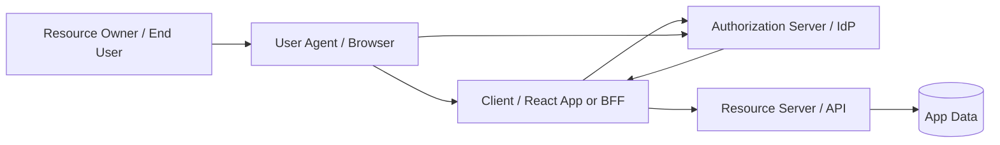

### Resource Owner / End User

User adalah pihak yang memiliki atau mengontrol akses terhadap resource.

Dalam SaaS multi-tenant, user saja tidak cukup. User biasanya memiliki konteks:

```ts
interface PrincipalContext {
  userId: string;
  tenantId: string;
  membershipId: string;
  actorType: "human" | "service" | "admin_impersonation";
  assuranceLevel: "low" | "password" | "mfa" | "phishing_resistant";
}
```

OAuth memberi cara bagi client untuk memperoleh delegated access. Aplikasi domain tetap harus menentukan apakah user ini boleh melakukan action tertentu pada resource tertentu.

### User Agent / Browser

Browser adalah transport dan runtime.

Browser bisa:

- membuka authorization endpoint;
- membawa cookie IdP;
- menjalankan React;
- menyimpan memory state;
- melakukan redirect;
- mengirim request API;
- menjalankan script pihak ketiga;
- memiliki extension;
- terkena XSS;
- punya banyak tab;
- menyimpan cache;
- mempertahankan back-forward cache.

Browser tidak boleh dianggap sama dengan backend. Browser adalah participant yang berguna tetapi hostile enough.

### Client

Client adalah aplikasi yang meminta token dari authorization server.

Dalam arsitektur React, "client" bisa berarti beberapa hal:

| Architecture | OAuth client secara praktis | Credential safety |
|---|---|---|
| Pure SPA | Browser React app | Public client, tidak bisa menyimpan secret |
| SPA + BFF | Backend-for-Frontend | Confidential client jika secret disimpan server-side |
| SSR app | Server runtime | Bisa confidential jika token tidak diekspos ke browser |
| Native/webview hybrid | Installed app | Public client, PKCE wajib |

Kesalahan umum: mengira `client_id` adalah secret.

`client_id` bukan secret. Pada SPA, semua yang dikirim ke browser dapat dilihat user. Jika sistem keamanan bergantung pada `client_secret` di JavaScript bundle, sistem itu sudah rusak.

### Authorization Server

Authorization Server adalah pihak yang:

- mengautentikasi user;
- menampilkan consent atau policy screen jika perlu;
- memvalidasi redirect URI;
- menerbitkan authorization code;
- menukar authorization code dengan token;
- menerbitkan access token, ID token, refresh token;
- melakukan token revocation/introspection jika didukung;
- mengelola session IdP.

Dalam banyak organisasi, authorization server juga disebut IdP, meskipun secara ketat IdP adalah identity provider. Produk seperti Auth0, Okta, Entra ID, Cognito, Keycloak, WorkOS, Clerk, dan provider internal biasanya menggabungkan banyak peran.

### Resource Server

Resource Server adalah API yang dilindungi.

Resource server harus:

- memvalidasi access token;
- memeriksa issuer;
- memeriksa audience;
- memeriksa expiry;
- memeriksa signature atau introspection result;
- memeriksa scope teknis jika relevan;
- melakukan authorization domain-level;
- menolak request tanpa bergantung pada UI.

React app boleh menyembunyikan tombol `Delete`, tetapi resource server tetap harus menolak `DELETE /cases/:id` jika user tidak berhak.

### Relying Party

Dalam OIDC, client sering disebut Relying Party karena ia bergantung pada OpenID Provider untuk pernyataan identity.

Relying Party menerima ID Token, lalu membangun session aplikasi.

Important distinction:

```txt
OIDC Provider authenticated the user.
Your app still owns the app session and app authorization model.
```

---

## 3. Protocol map: OAuth vs OIDC

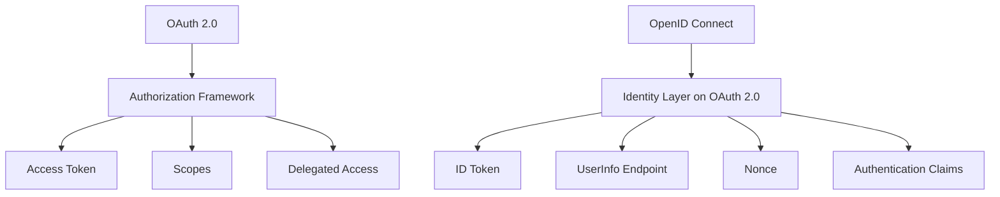

OAuth gives the client a way to access protected resources.

OIDC gives the client a standard way to learn who the user is.

Do not collapse these two.

### OAuth output

OAuth output is typically:

```json
{
  "access_token": "...",
  "token_type": "Bearer",
  "expires_in": 3600,
  "scope": "read:cases write:notes",
  "refresh_token": "..."
}
```

This is about access.

### OIDC output

OIDC adds:

```json
{
  "id_token": "eyJ...",
  "access_token": "...",
  "token_type": "Bearer",
  "expires_in": 3600
}
```

The ID Token is about authentication event and identity claims.

---

## 4. Token purpose model

A strong React auth design starts with token purpose.

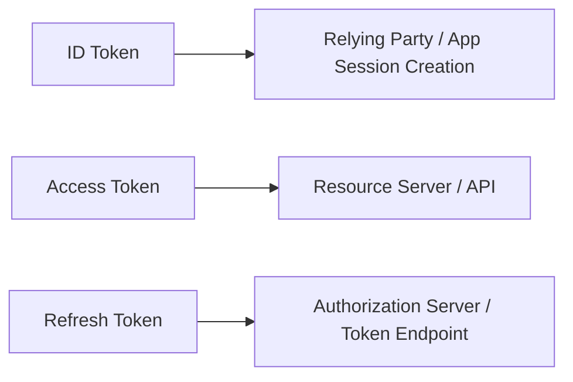

| Token | Consumer | Purpose | Frontend misuse |
|---|---|---|---|
| ID Token | Client/Relying Party | Prove authentication event and identity claims to client | Calling APIs with it |
| Access Token | Resource server/API | Access protected resource | Treating it as user profile or UI authorization source |
| Refresh Token | Authorization server/token endpoint | Obtain new access token | Storing casually, sharing across tabs without rotation control |
| Authorization Code | Token endpoint | One-time exchange for tokens | Exposing/reusing/logging it |

### ID Token is not your app session

ID Token can help create an app session.

It is not the same as the app session.

Your app session needs its own lifecycle:

- app-specific expiry;
- tenant context;
- permissions projection;
- logout/revocation;
- audit trail;
- risk signals;
- impersonation state;
- state-based authorization.

### Access Token is not your permission model

Access token may contain scopes.

But scopes are usually coarse API delegation constraints, not full domain permission model.

A regulatory case management app may need decisions like:

```ts
can(user, "approve_enforcement_action", caseFile, {
  currentCaseState: "LEGAL_REVIEW",
  userRegion: "WEST",
  caseRegion: "WEST",
  conflictOfInterest: false,
  temporaryAssignmentExpiresAt: "2026-07-10T00:00:00Z",
});
```

That decision does not fit cleanly inside OAuth scope strings.

Scope may say `cases:write`; domain authorization still decides which case, which action, which state, which tenant, which condition.

---

## 5. The browser redirect model

OAuth/OIDC browser login is a redirect protocol.

That means the application loses control for a while.

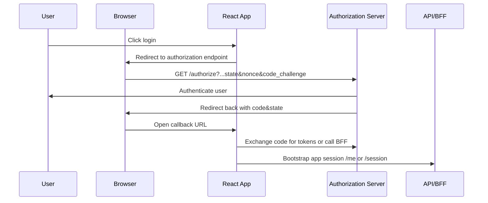

A redirect protocol needs correlation.

The request before redirect and the callback after redirect must be linked safely.

That is why `state`, `nonce`, PKCE verifier, and exact redirect URI matter.

---

## 6. State, nonce, PKCE: different jobs

Many implementations treat `state`, `nonce`, and PKCE as interchangeable.

They are not.

| Mechanism | Protects against | Used by |
|---|---|---|
| `state` | CSRF against the authorization response, login CSRF, wrong transaction callback | Client/RP |
| `nonce` | ID token replay/substitution in OIDC | Client/RP validating ID token |
| PKCE | Authorization code interception | Token endpoint + client |
| Exact redirect URI | Code delivery to wrong destination / open redirect abuse | Authorization server |

### State

`state` binds the callback to an authorization request initiated by the same client session.

It should be unpredictable and transaction-specific.

It may also reference local transaction metadata:

```ts
interface AuthTransaction {
  state: string;
  nonce: string;
  codeVerifier: string;
  returnTo: string;
  createdAt: number;
  provider: "okta" | "auth0" | "entra" | "internal";
}
```

Do not use raw `returnTo` as `state`.

### Nonce

`nonce` binds the ID Token to the authentication request.

In OIDC, the ID Token should contain the nonce value originally sent by the client. The client validates that it matches.

### PKCE

PKCE binds the authorization code to the client instance that initiated the flow.

The app sends a code challenge at authorization time, then later proves knowledge of the original code verifier at token exchange time.

If an attacker intercepts the authorization code but does not have the verifier, token exchange fails.

---

## 7. Public client vs confidential client

This is one of the most important distinctions for React.

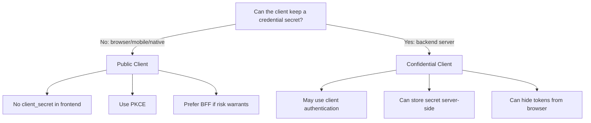

### Browser React app is public

A browser-delivered React bundle cannot keep secrets.

Anything shipped to the browser can be inspected.

Therefore:

```txt
client_secret in .env for Vite/React ≠ secret
```

If it appears in the bundle, it is public.

### BFF can be confidential

A backend-for-frontend can hold a client secret and tokens server-side.

The browser only receives an HTTP-only app session cookie.

This changes the threat model:

- tokens are not exposed to JavaScript;
- API calls go through BFF or same-site backend;
- CSRF must be handled carefully;
- server session lifecycle becomes central;
- SSR/data loading can rely on server-side auth.

---

## 8. Where React fits

React should not own the protocol.

React should own:

- route intent;
- login trigger;
- callback screen UX;
- session bootstrap state;
- permission-aware UI;
- cache invalidation;
- cross-tab session coordination;
- recovery from auth failures.

React should not be the final authority for:

- token validation;
- signature verification;
- access to protected resources;
- tenant isolation;
- domain authorization;
- audit trail;
- revocation state.

A good boundary looks like this:

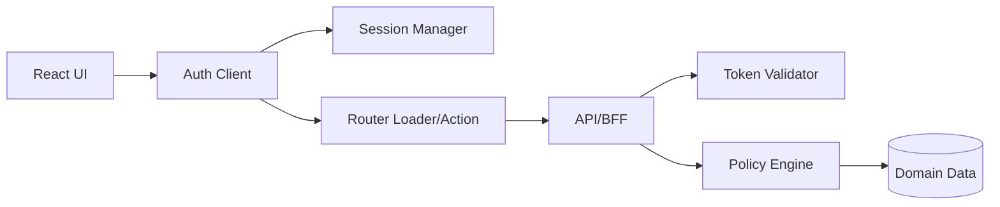

React has a local projection of auth state. The server has authority.

---

## 9. Auth projection pattern

Your React app should not pass raw tokens everywhere.

Expose an auth projection.

```ts
export type AuthProjection =
  | {
      status: "unknown";
    }
  | {
      status: "anonymous";
    }
  | {
      status: "authenticated";
      user: {
        id: string;
        displayName: string;
        email?: string;
      };
      tenant: {
        id: string;
        name: string;
      };
      assuranceLevel: "password" | "mfa" | "phishing_resistant";
      permissionsVersion: string;
    }
  | {
      status: "degraded";
      reason: "session_check_failed" | "permission_projection_failed";
    };
```

This projection is not an authority.

It is a UI contract.

It answers:

- what should the app render?
- should the user see navigation?
- should the app show a re-auth prompt?
- should protected queries be enabled?
- should caches be invalidated?

It does not answer final resource authorization.

---

## 10. OAuth scope vs business permission

OAuth scope and business permission overlap but are not identical.

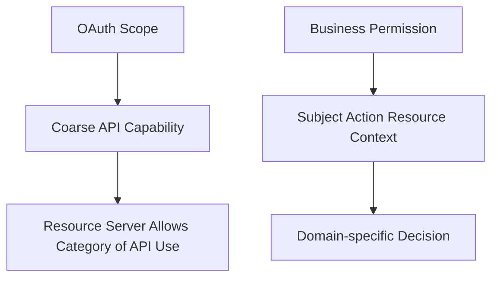

Example:

```txt
scope: cases:write
```

This might mean the client is allowed to call write endpoints in the cases API.

But it does not answer:

- Can Alice edit case 123?
- Can Alice edit it while it is under legal review?
- Can Alice edit it after assignment expired?
- Can Alice edit only public fields but not enforcement recommendation?
- Can Alice edit it when she belongs to a different region?
- Can Alice edit it while impersonating another user?

Business permission should be modelled separately.

A useful permission request shape:

```ts
interface AuthorizationQuery {
  subject: {
    userId: string;
    tenantId: string;
    actorType: "human" | "service" | "impersonation";
  };
  action: "case.update" | "case.approve" | "note.create";
  resource: {
    type: "case";
    id: string;
  };
  context: {
    caseState: string;
    requestTime: string;
    ipRisk?: "low" | "medium" | "high";
  };
}
```

OAuth can constrain the client. Policy engine authorizes the domain action.

---

## 11. Common OAuth/OIDC mistakes in React apps

### Mistake 1 — Using ID token as API access token

Wrong:

```ts
fetch("/api/cases", {
  headers: {
    Authorization: `Bearer ${idToken}`,
  },
});
```

ID Token is for the client/RP. API should receive access token intended for that API, or a server-side session credential if using BFF.

### Mistake 2 — Decoding JWT as authorization

Wrong:

```ts
const claims = decodeJwt(accessToken);
const canDelete = claims.roles.includes("admin");
```

Client-side decode may be useful for display/debugging. It is not server-side validation and not final authorization.

### Mistake 3 — Shipping client secret to browser

Wrong:

```ts
const tokenResponse = await fetch("https://idp.example.com/oauth/token", {
  method: "POST",
  body: new URLSearchParams({
    grant_type: "authorization_code",
    client_id: import.meta.env.VITE_CLIENT_ID,
    client_secret: import.meta.env.VITE_CLIENT_SECRET,
    code,
  }),
});
```

If the secret is in frontend env and shipped to browser, it is not secret.

### Mistake 4 — Treating redirect URI as flexible

Wrong:

```txt
https://app.example.com/auth/callback/*
```

Redirect URI should be exact or tightly controlled. Loose redirect matching creates token/code delivery risk.

### Mistake 5 — Storing refresh token casually

Wrong:

```ts
localStorage.setItem("refresh_token", refreshToken);
```

This creates persistent theft impact under XSS. If a SPA must use refresh tokens, rotation, reuse detection, storage choice, token lifetime, and threat model must be explicit. BFF often reduces risk.

### Mistake 6 — Confusing SSO session with app session

User can still be logged in at the IdP after app logout.

That may produce immediate re-login.

This does not necessarily mean local logout failed. It means global IdP session remains active.

### Mistake 7 — Using role claim as tenant authorization

Wrong:

```ts
if (claims.role === "admin") showTenantAdminPanel();
```

Admin of which tenant?

Role claims without tenant/resource scope are dangerous in multi-tenant systems.

---

## 12. Protocol-level boundaries and application-level boundaries

OAuth/OIDC boundaries:

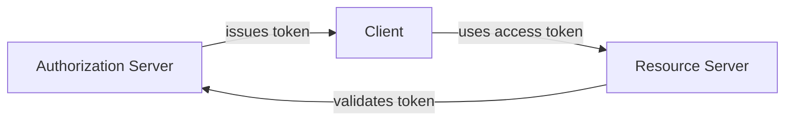

Application boundaries:

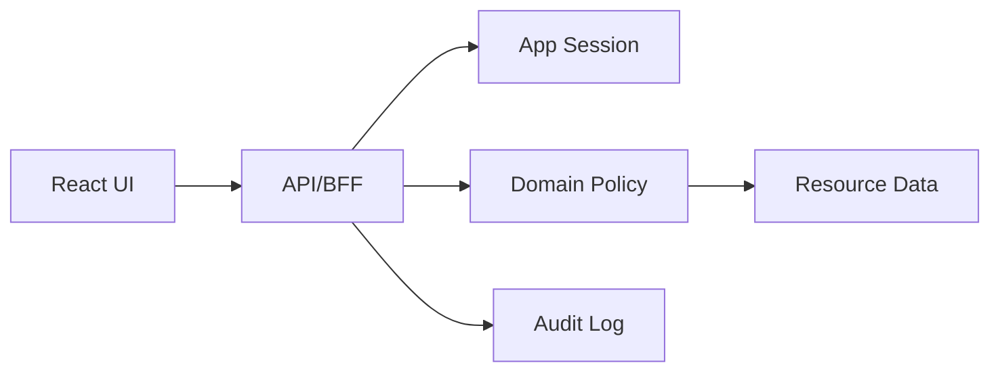

The first diagram is not enough.

The second diagram is where domain security lives.

OAuth can prove the request came with a valid delegated credential. Your app still needs to decide whether the actor may perform this operation now.

---

## 13. React auth provider responsibilities

A React `AuthProvider` should provide a stable local auth interface.

It should not leak protocol complexity into every component.

```ts
interface AuthClient {
  getSnapshot(): AuthProjection;
  subscribe(listener: () => void): () => void;
  login(options?: { returnTo?: string; prompt?: "login" | "none" }): Promise<void>;
  logout(options?: { global?: boolean }): Promise<void>;
  refreshSession(reason: "startup" | "expiry" | "manual" | "visibility"): Promise<void>;
}
```

Then components consume projection:

```tsx
function HeaderUserMenu() {
  const auth = useAuth();

  if (auth.status === "unknown") return <HeaderSkeleton />;
  if (auth.status === "anonymous") return <LoginButton />;
  if (auth.status === "degraded") return <SessionWarning reason={auth.reason} />;

  return <UserMenu user={auth.user} tenant={auth.tenant} />;
}
```

Notice what is missing: no raw access token in component props.

---

## 14. Login intent and return URL

OAuth/OIDC redirects interrupt user flow.

React must preserve intent safely.

```ts
interface LoginIntent {
  returnTo: string;
  reason: "initial_login" | "session_expired" | "step_up_required";
  createdAt: number;
}
```

But return URL is attacker-controllable if accepted from query string.

Safe validation:

```ts
export function normalizeInternalReturnTo(input: string | null): string {
  if (!input) return "/";

  try {
    const url = new URL(input, window.location.origin);

    if (url.origin !== window.location.origin) return "/";

    const path = `${url.pathname}${url.search}${url.hash}`;

    if (!path.startsWith("/")) return "/";
    if (path.startsWith("//")) return "/";
    if (path.startsWith("/auth/callback")) return "/";
    if (path.startsWith("/logout")) return "/";

    return path;
  } catch {
    return "/";
  }
}
```

Never blindly redirect to an arbitrary URL from `returnTo`, `redirect`, or `next`.

---

## 15. Tenant-aware OAuth/OIDC

Enterprise SaaS often routes login by organization.

Examples:

- user enters email;
- app discovers organization;
- organization has configured IdP;
- app starts OIDC flow with correct provider/connection;
- callback maps external identity to internal membership.

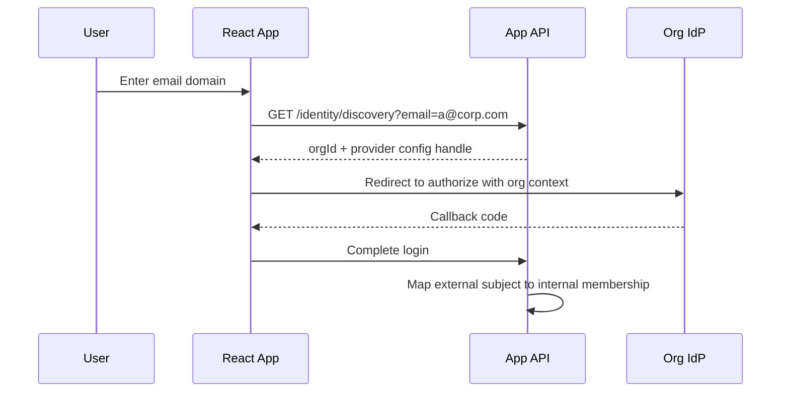

Key invariant:

> External identity subject is not automatically internal authorization.

The app must map:

```txt
issuer + subject + tenant/org binding -> internal principal + membership + policy context
```

Never authorize solely on email domain.

Email domain is discovery input, not proof of authorization.

---

## 16. Subject mapping

OIDC gives identity claims. Your app needs account linking rules.

Bad mapping:

```txt
email -> user
```

Better mapping:

```txt
issuer + subject -> external identity
external identity + tenant membership -> app principal
```

A robust model:

```ts
interface ExternalIdentity {
  issuer: string;
  subject: string;
  provider: "oidc" | "saml" | "password";
  email?: string;
  emailVerified?: boolean;
}

interface AppPrincipal {
  userId: string;
  tenantMemberships: Array<{
    tenantId: string;
    membershipId: string;
    status: "active" | "suspended" | "invited";
  }>;
}
```

Email can change. Subject should be stable within issuer. The pair `issuer + subject` is usually the safer identity key.

---

## 17. Assurance level

Not every login is equal.

A user authenticated with password-only may be allowed to view dashboard but not approve enforcement action.

Model assurance explicitly:

```ts
type AssuranceLevel =
  | "anonymous"
  | "password"
  | "mfa"
  | "phishing_resistant";

interface SensitiveActionRequirement {
  action: string;
  minimumAssurance: AssuranceLevel;
  maxAgeSeconds?: number;
}
```

Then UI can express step-up:

```tsx
function ApproveButton({ caseId }: { caseId: string }) {
  const permission = useCan("case.approve", { type: "case", id: caseId });

  if (permission.status === "requires_step_up") {
    return <button onClick={() => startStepUp({ returnTo: location.href })}>Verify again</button>;
  }

  return <button disabled={!permission.allowed}>Approve</button>;
}
```

But server must enforce the same requirement.

---

## 18. Consent is not authorization to your domain object

OAuth consent often means:

```txt
Do you allow this client to access these API scopes?
```

It does not mean:

```txt
Do you allow this user to approve case 123 in tenant ACME?
```

Consent is about delegated client access. Domain authorization is about business rules.

Do not confuse consent screen with app permission screen.

---

## 19. OIDC discovery and metadata

OIDC providers expose metadata, often via well-known configuration.

React apps and BFFs use metadata to discover:

- authorization endpoint;
- token endpoint;
- JWKS URI;
- issuer;
- supported response types;
- supported scopes;
- supported signing algorithms.

In pure SPA, be careful with dynamic provider discovery. If the app accepts arbitrary issuer URLs from untrusted input, it can become vulnerable to mix-up or malicious provider problems.

Provider configuration should be controlled by server-side trusted configuration for enterprise apps.

---

## 20. Token validation responsibility

Who validates what?

| Item | Browser React | BFF/API | Authorization Server |
|---|---:|---:|---:|
| `state` match | Yes | Sometimes | No |
| PKCE verifier | Sends/proves | Can proxy/prove | Validates |
| ID token signature | Prefer server/BFF; SPA SDK may validate | Yes if receiving | Issues |
| Access token signature/introspection | No final authority | Yes | Issues/introspects |
| App permission | UI projection only | Yes | No, unless policy integrated |
| Session revocation | Observes | Enforces | May enforce IdP token/session |

A pure SPA SDK may validate ID token client-side for OIDC requirements. But resource authorization still belongs server-side.

---

## 21. Failure modes unique to OAuth/OIDC

| Failure | Symptom | Root issue | React handling |
|---|---|---|---|
| Redirect loop | User bounces login/callback repeatedly | Bad session bootstrap or return URL | Loop guard, transaction cleanup |
| Login CSRF | User becomes logged into attacker-chosen account | Missing/bad state binding | Strict state transaction |
| Code interception | Code stolen before token exchange | Missing PKCE | Use S256 PKCE |
| Token audience mismatch | API rejects token | Wrong audience/resource | Clear provider/API contract |
| Stale permission | UI shows action after role revoked | Permission projection cached too long | Revalidate on 403/session version change |
| Tenant confusion | User sees wrong org | Weak org binding | Tenant-scoped session and API enforcement |
| Silent re-login after logout | User appears logged in again | IdP session remains | Distinguish local vs global logout |
| Callback replay | Reused authorization code | Bad transaction cleanup/server validation | Single-use code, clear transaction |

---

## 22. A realistic React + BFF OIDC architecture

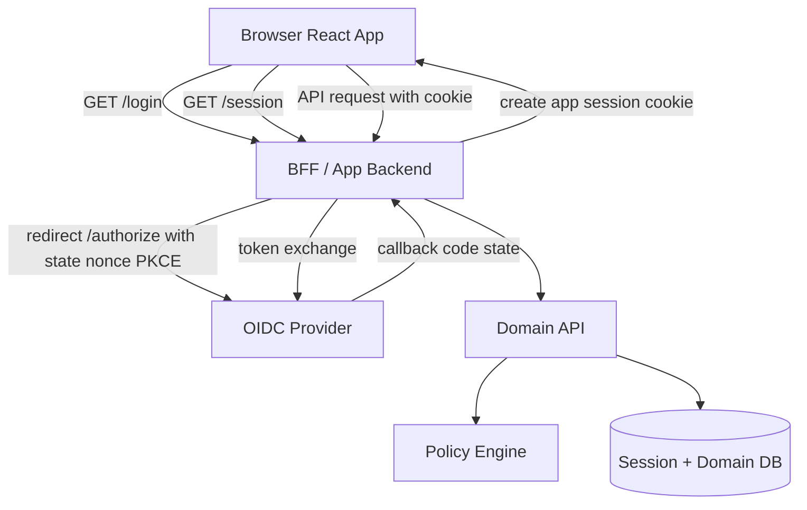

Benefits:

- tokens not exposed to JS;
- server can validate ID token and manage session;
- HTTP-only cookie represents app session;
- policy enforcement remains server-side;
- React sees projection, not protocol secrets.

Costs:

- BFF complexity;
- CSRF protection;
- session store and scaling;
- server deployment path;
- edge/runtime cookie nuances.

---

## 23. A realistic pure SPA OIDC architecture

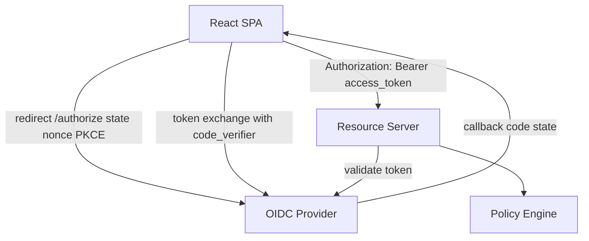

Benefits:

- simpler deployment;
- no BFF;
- direct API access;
- common in public API ecosystems.

Costs:

- token exposure to browser runtime;
- refresh token storage problem;
- XSS blast radius;
- more careful SDK/session handling;
- harder SSR/auth data loading story.

This can be acceptable for some apps, but the risk model must be explicit.

---

## 24. Decision matrix

| Requirement | Prefer |
|---|---|
| High-value enterprise SaaS | BFF or server-mediated session |
| Strict token secrecy from JS | BFF |
| Public API integration with many clients | OAuth access token model |
| Heavy SSR/RSC/server data loading | Server session/BFF |
| Static SPA with low-risk data | SPA + authorization code + PKCE may be acceptable |
| Long-lived sessions | Cookie/BFF or carefully rotated refresh token design |
| Strong audit and revocation | Server session with centralized state |
| Multi-tenant complex authorization | Server-side policy engine with frontend permission projection |

---

## 25. Minimal vocabulary you must use precisely

| Term | Precise meaning |
|---|---|
| Authentication | Establishing who the user is |
| Authorization | Deciding what an actor may do |
| OAuth Client | Application requesting delegated access |
| Public Client | Client that cannot keep credentials secret |
| Confidential Client | Client that can keep credentials secret |
| Authorization Server | Issues authorization codes/tokens |
| Resource Server | API serving protected resource |
| OpenID Provider | OIDC identity provider |
| Relying Party | OIDC client relying on identity claims |
| ID Token | OIDC token for client authentication context |
| Access Token | Credential for resource server |
| Refresh Token | Credential for renewing access token |
| Scope | Delegated access dimension, usually coarse |
| Permission | Domain-specific allow/deny decision |
| Claim | Statement about subject/authentication/token |
| Audience | Intended recipient of token |
| Issuer | Authority that issued token |
| Redirect URI | Registered callback destination |
| State | Client transaction correlation value |
| Nonce | OIDC replay/substitution protection value |
| PKCE | Proof binding authorization code to original client instance |

---

## 26. Implementation rule: separate protocol adapter from app auth model

Do not let provider SDK objects leak everywhere.

Bad shape:

```ts
const { user, getAccessTokenSilently, logout } = useAuth0();
```

Used directly across hundreds of components.

Better:

```ts
interface IdentityProviderAdapter {
  startLogin(input: LoginInput): Promise<void>;
  handleCallback(url: URL): Promise<ProviderCallbackResult>;
  startLogout(input: LogoutInput): Promise<void>;
}

interface AppAuthSessionService {
  bootstrap(): Promise<AuthProjection>;
  refresh(): Promise<AuthProjection>;
  logout(): Promise<void>;
}
```

Then React consumes your app interface:

```ts
interface AppAuthContextValue {
  auth: AuthProjection;
  login: (input?: LoginInput) => Promise<void>;
  logout: () => Promise<void>;
  refresh: () => Promise<void>;
}
```

Provider migration becomes possible.

Authorization model stays yours.

---

## 27. Provider SDKs: use them, but do not worship them

Auth SDKs are useful.

They usually handle:

- PKCE generation;
- transaction storage;
- callback parsing;
- token refresh;
- provider-specific quirks;
- silent auth features;
- logout URL construction.

But SDK does not know your domain:

- tenant isolation;
- case state transitions;
- escalation rules;
- temporary assignment;
- field-level permission;
- impersonation audit;
- regulatory defensibility.

Use SDKs at the protocol edge. Keep your app auth and authorization model explicit.

---

## 28. Security invariants for OAuth/OIDC in React

Use these invariants in design review.

1. **No frontend secret invariant**  
   Anything in browser bundle is public.

2. **Token purpose invariant**  
   ID token, access token, refresh token, and app session are not interchangeable.

3. **Stateful transaction invariant**  
   Every callback must match a locally initiated transaction.

4. **PKCE invariant**  
   Browser/public clients must use Authorization Code with PKCE, not implicit flow.

5. **Exact redirect invariant**  
   Redirect URI must be tightly registered and validated.

6. **Audience invariant**  
   API accepts only access tokens intended for that API.

7. **Issuer invariant**  
   Tokens from unexpected issuer are rejected.

8. **Deny-by-default invariant**  
   Unknown auth/permission state must not render privileged UI.

9. **Server enforcement invariant**  
   API/BFF must authorize every protected operation.

10. **Tenant binding invariant**  
    Tenant context is verified server-side for every tenant-scoped operation.

---

## 29. Review checklist

Ask these questions before approving OAuth/OIDC implementation:

- Is this a public or confidential OAuth client?
- Where is the token exchange performed?
- Is any client secret shipped to the browser?
- Is Authorization Code with PKCE used?
- Is implicit flow avoided?
- Is `state` generated, stored, validated, and cleared?
- Is `nonce` used for OIDC ID token validation?
- Are redirect URIs exact and safe?
- Are return URLs normalized to internal paths?
- Is access token audience checked by API?
- Is issuer checked?
- Is ID token kept out of API calls?
- Is refresh token rotation/reuse detection handled if refresh tokens are used?
- Is app session separate from IdP session?
- Does logout revoke server-side authority?
- Is tenant membership resolved server-side?
- Is email treated as mutable claim, not primary authority?
- Are permissions fetched from app API/policy layer?
- Does frontend default to deny while auth is unknown?
- Are 401, 403, step-up, expired, and revoked states distinct?

---

## 30. Summary

OAuth/OIDC in React is not a login widget.

It is a boundary contract between:

- browser runtime;
- React app;
- authorization server;
- identity provider;
- BFF/API;
- resource server;
- policy engine;
- session store;
- audit system.

The mental model:

```txt
OAuth constrains delegated access.
OIDC establishes identity claims for the client.
Your app owns session lifecycle and domain authorization.
React renders a projection.
Server enforces authority.
```

That is the baseline for the rest of Phase 3.

Next part: implement the modern browser flow, **Authorization Code with PKCE**, step by step.

---

## References

- RFC 9700 — Best Current Practice for OAuth 2.0 Security
- RFC 7636 — Proof Key for Code Exchange by OAuth Public Clients
- OpenID Connect Core 1.0
- OAuth 2.0 for Browser-Based Applications draft
- OWASP OAuth2 Cheat Sheet
- OWASP Authorization Cheat Sheet
