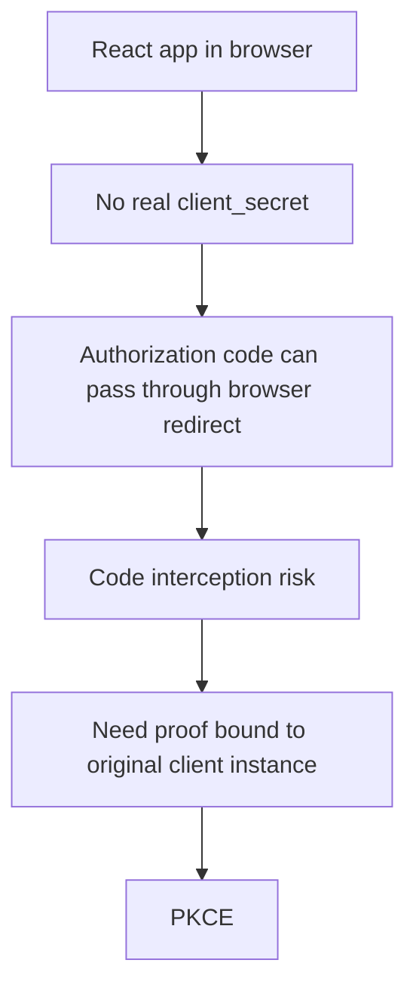
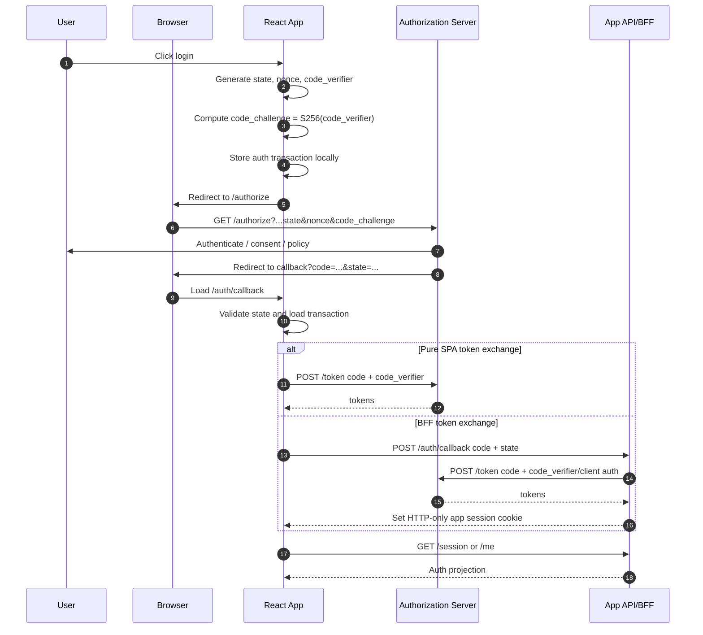
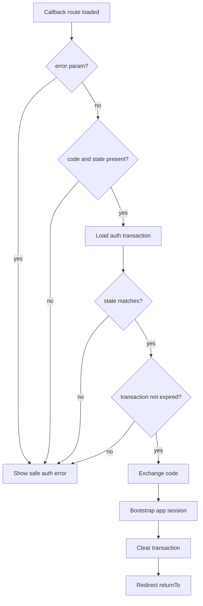
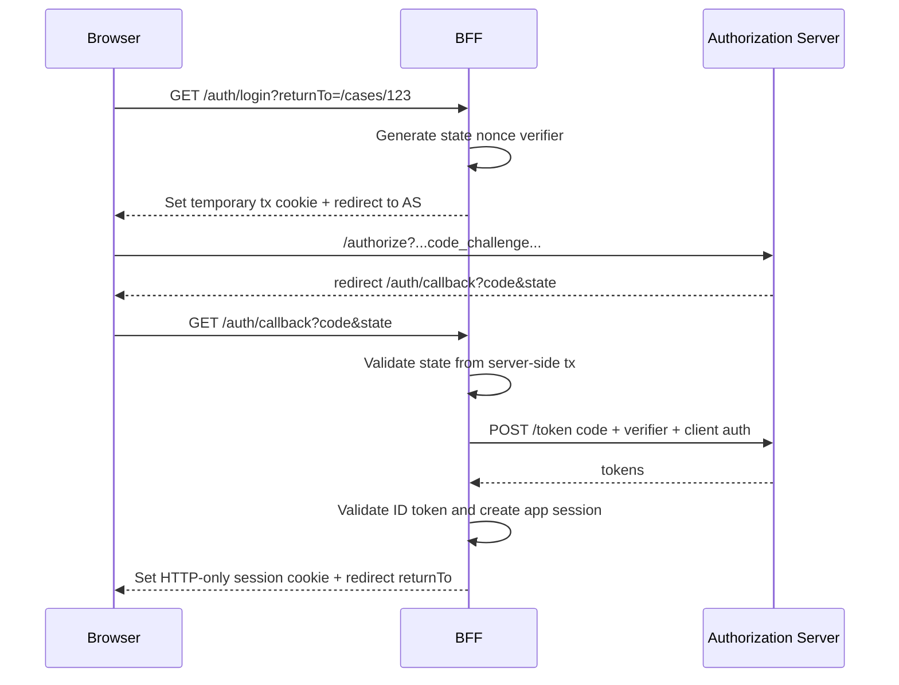

# Part 022 — Authorization Code with PKCE

Authorization Code with PKCE adalah default modern untuk React/browser OAuth/OIDC flows.

Bukan karena flow ini terlihat lebih enterprise.

Karena browser client adalah public client. Ia tidak bisa menyimpan client secret. PKCE menambahkan proof bahwa client instance yang menukar authorization code adalah client instance yang memulai authorization request.

Tanpa PKCE, authorization code yang bocor atau diintercept bisa ditukar oleh pihak lain.

Dengan PKCE, authorization code saja tidak cukup. Token endpoint juga membutuhkan `code_verifier` asli.

---

## 1. Problem yang diselesaikan PKCE

Authorization Code flow klasik awalnya cocok untuk server-side confidential client.

Server bisa menyimpan `client_secret`, menerima authorization code, lalu menukarnya di token endpoint dengan client authentication.

Browser SPA tidak bisa melakukan itu dengan aman.



PKCE menambahkan dua nilai:

```txt
code_verifier  = high-entropy random secret generated by client
code_challenge = transformed verifier, usually BASE64URL(SHA256(verifier))
```

Authorization request membawa `code_challenge`.

Token request membawa `code_verifier`.

Authorization server memverifikasi bahwa verifier cocok dengan challenge.

---

## 2. Flow lengkap



The important part: the browser redirect only returns an authorization code, not tokens.

---

## 3. Parameters in authorization request

A typical OIDC authorization request:

```txt
GET https://idp.example.com/oauth2/v1/authorize?
  response_type=code&
  client_id=react_app&
  redirect_uri=https%3A%2F%2Fapp.example.com%2Fauth%2Fcallback&
  scope=openid%20profile%20email%20offline_access&
  state=V0NY...&
  nonce=9Gq...&
  code_challenge=jvH...&
  code_challenge_method=S256&
  audience=https%3A%2F%2Fapi.example.com
```

| Parameter | Required? | Purpose |
|---|---:|---|
| `response_type=code` | Yes | Use authorization code flow |
| `client_id` | Yes | Public identifier of client |
| `redirect_uri` | Yes | Registered callback URL |
| `scope` | Yes | OAuth/OIDC scopes requested |
| `state` | Strongly required | Correlate callback to request and prevent CSRF |
| `nonce` | OIDC | Bind ID token to auth request |
| `code_challenge` | PKCE | Public challenge derived from verifier |
| `code_challenge_method=S256` | PKCE | Use SHA-256 based challenge |
| `audience` / `resource` | Provider-dependent | Request token for specific API/resource |

Do not build these as string concatenation.

Use `URL` and `URLSearchParams`.

---

## 4. Generating PKCE values in browser

Use Web Crypto.

```ts
function base64UrlEncode(bytes: ArrayBuffer): string {
  const array = new Uint8Array(bytes);
  let binary = "";

  for (const byte of array) {
    binary += String.fromCharCode(byte);
  }

  return btoa(binary)
    .replace(/\+/g, "-")
    .replace(/\//g, "_")
    .replace(/=+$/, "");
}

export function generateRandomBase64Url(byteLength = 32): string {
  const bytes = new Uint8Array(byteLength);
  crypto.getRandomValues(bytes);
  return base64UrlEncode(bytes.buffer);
}

export async function createPkcePair(): Promise<{
  codeVerifier: string;
  codeChallenge: string;
}> {
  const codeVerifier = generateRandomBase64Url(32);
  const digest = await crypto.subtle.digest(
    "SHA-256",
    new TextEncoder().encode(codeVerifier),
  );

  return {
    codeVerifier,
    codeChallenge: base64UrlEncode(digest),
  };
}
```

Use `S256`. Do not use `plain` unless forced by a legacy provider.

---

## 5. Auth transaction storage

Before redirect, store transaction data.

```ts
interface AuthTransaction {
  state: string;
  nonce: string;
  codeVerifier: string;
  returnTo: string;
  provider: "default" | "enterprise_sso";
  createdAt: number;
}
```

The transaction must be:

- unpredictable;
- bound to the current login attempt;
- short-lived;
- cleared after callback;
- not reused;
- not shared accidentally across tenants/providers;
- resilient to duplicate callback handling.

For browser-only apps, `sessionStorage` is common for auth transaction state because it is scoped to the tab. That reduces cross-tab confusion compared to `localStorage`.

But remember:

> Storage choice does not make XSS safe. If attacker script runs in your origin, browser storage is accessible except HTTP-only cookies.

For BFF designs, the server can store the transaction keyed by a temporary HTTP-only cookie.

---

## 6. Building the authorization URL

```ts
interface AuthorizationUrlInput {
  authorizationEndpoint: string;
  clientId: string;
  redirectUri: string;
  scope: string[];
  state: string;
  nonce?: string;
  codeChallenge: string;
  audience?: string;
  returnTo?: string;
}

export function buildAuthorizationUrl(input: AuthorizationUrlInput): string {
  const url = new URL(input.authorizationEndpoint);

  url.searchParams.set("response_type", "code");
  url.searchParams.set("client_id", input.clientId);
  url.searchParams.set("redirect_uri", input.redirectUri);
  url.searchParams.set("scope", input.scope.join(" "));
  url.searchParams.set("state", input.state);
  url.searchParams.set("code_challenge", input.codeChallenge);
  url.searchParams.set("code_challenge_method", "S256");

  if (input.nonce) {
    url.searchParams.set("nonce", input.nonce);
  }

  if (input.audience) {
    url.searchParams.set("audience", input.audience);
  }

  return url.toString();
}
```

The function is boring. That is good.

Security code should be boring and explicit.

---

## 7. Starting login

```ts
const AUTH_TRANSACTION_KEY = "auth:transaction:v1";

function saveAuthTransaction(tx: AuthTransaction): void {
  sessionStorage.setItem(AUTH_TRANSACTION_KEY, JSON.stringify(tx));
}

export async function startLogin(returnToInput?: string): Promise<void> {
  const { codeVerifier, codeChallenge } = await createPkcePair();

  const tx: AuthTransaction = {
    state: generateRandomBase64Url(32),
    nonce: generateRandomBase64Url(32),
    codeVerifier,
    returnTo: normalizeInternalReturnTo(returnToInput ?? window.location.pathname),
    provider: "default",
    createdAt: Date.now(),
  };

  saveAuthTransaction(tx);

  const authorizationUrl = buildAuthorizationUrl({
    authorizationEndpoint: "https://idp.example.com/oauth2/v1/authorize",
    clientId: "react_app",
    redirectUri: `${window.location.origin}/auth/callback`,
    scope: ["openid", "profile", "email"],
    state: tx.state,
    nonce: tx.nonce,
    codeChallenge,
    audience: "https://api.example.com",
  });

  window.location.assign(authorizationUrl);
}
```

This is the pure browser shape. In BFF architecture, `startLogin` may simply navigate to your own backend endpoint:

```ts
export function startLoginViaBff(returnTo = window.location.pathname): void {
  const safeReturnTo = normalizeInternalReturnTo(returnTo);
  window.location.assign(`/auth/login?returnTo=${encodeURIComponent(safeReturnTo)}`);
}
```

Then the BFF creates state/nonce/PKCE server-side.

---

## 8. Callback handling: core invariants

When `/auth/callback?code=...&state=...` loads:

1. parse query params;
2. check for OAuth error response;
3. require `code`;
4. require `state`;
5. load transaction;
6. compare state using exact match;
7. check transaction age;
8. exchange code;
9. validate ID token if OIDC;
10. create/restore app session;
11. clear transaction;
12. redirect to safe `returnTo`;
13. avoid rendering protected app before bootstrap.



---

## 9. Callback handler: pure SPA example

```ts
interface TokenResponse {
  access_token: string;
  token_type: "Bearer";
  expires_in: number;
  id_token?: string;
  refresh_token?: string;
  scope?: string;
}

async function exchangeCodeForTokens(input: {
  tokenEndpoint: string;
  clientId: string;
  redirectUri: string;
  code: string;
  codeVerifier: string;
}): Promise<TokenResponse> {
  const body = new URLSearchParams();
  body.set("grant_type", "authorization_code");
  body.set("client_id", input.clientId);
  body.set("redirect_uri", input.redirectUri);
  body.set("code", input.code);
  body.set("code_verifier", input.codeVerifier);

  const response = await fetch(input.tokenEndpoint, {
    method: "POST",
    headers: {
      "Content-Type": "application/x-www-form-urlencoded",
    },
    body,
  });

  if (!response.ok) {
    throw new Error(`Token exchange failed: ${response.status}`);
  }

  return response.json();
}
```

Important: no `client_secret` here.

The client is public.

---

## 10. Callback route with React Router loader

Auth callback is often better handled before rendering the main app.

```ts
import { redirect, type LoaderFunctionArgs } from "react-router";

export async function authCallbackLoader({ request }: LoaderFunctionArgs) {
  const url = new URL(request.url);
  const error = url.searchParams.get("error");
  const errorDescription = url.searchParams.get("error_description");

  if (error) {
    throw new Response(errorDescription ?? error, { status: 400 });
  }

  const code = url.searchParams.get("code");
  const returnedState = url.searchParams.get("state");

  if (!code || !returnedState) {
    throw new Response("Missing authorization code or state", { status: 400 });
  }

  const tx = loadAuthTransaction();

  if (!tx || tx.state !== returnedState) {
    clearAuthTransaction();
    throw new Response("Invalid authorization transaction", { status: 400 });
  }

  if (Date.now() - tx.createdAt > 5 * 60 * 1000) {
    clearAuthTransaction();
    throw new Response("Authorization transaction expired", { status: 400 });
  }

  try {
    const tokens = await exchangeCodeForTokens({
      tokenEndpoint: "https://idp.example.com/oauth2/v1/token",
      clientId: "react_app",
      redirectUri: `${window.location.origin}/auth/callback`,
      code,
      codeVerifier: tx.codeVerifier,
    });

    await authRuntime.completeLogin({
      tokens,
      expectedNonce: tx.nonce,
    });

    clearAuthTransaction();

    return redirect(tx.returnTo);
  } catch (error) {
    clearAuthTransaction();
    throw error;
  }
}
```

In SSR/server loaders, do not use `window`. The callback should be handled server-side or passed through a route action depending on framework.

---

## 11. Callback handling via BFF

In higher-security apps, React should not exchange code directly with the IdP.

Instead:



React sees only:

```ts
window.location.assign("/auth/login?returnTo=/cases/123");
```

After callback, React bootstraps:

```ts
const session = await fetch("/session", {
  credentials: "include",
}).then((r) => r.json());
```

Benefits:

- no access token in JavaScript;
- no refresh token in browser storage;
- stronger server-side validation;
- easier revocation/audit;
- clear session cookie lifecycle.

Costs:

- CSRF defense required;
- BFF availability matters;
- session store design;
- more backend code.

---

## 12. Token response handling

Do not scatter token response handling across app.

Centralize it.

```ts
interface CompleteLoginInput {
  tokens: TokenResponse;
  expectedNonce: string;
}

class AuthRuntime {
  async completeLogin(input: CompleteLoginInput): Promise<void> {
    if (input.tokens.token_type !== "Bearer") {
      throw new Error("Unsupported token type");
    }

    if (!input.tokens.access_token) {
      throw new Error("Missing access token");
    }

    if (input.tokens.id_token) {
      await this.validateIdTokenClientSideEnoughForProjection({
        idToken: input.tokens.id_token,
        expectedNonce: input.expectedNonce,
      });
    }

    this.tokenStore.setAccessToken({
      value: input.tokens.access_token,
      expiresAt: Date.now() + input.tokens.expires_in * 1000,
    });

    if (input.tokens.refresh_token) {
      await this.refreshTokenStore.store(input.tokens.refresh_token);
    }

    await this.bootstrapSession("login_callback");
  }
}
```

In a pure SPA, be careful with refresh token persistence.

In BFF, token response handling belongs server-side.

---

## 13. ID token validation in React apps

In OIDC, ID token validation matters.

Pure browser SDKs often perform validation internally.

Validation includes concepts like:

- issuer;
- audience/client id;
- expiry;
- signature against provider JWKS;
- nonce;
- token algorithm constraints.

A React engineer should know what is being validated even if using SDK.

Do not write a naive validator like this:

```ts
const claims = JSON.parse(atob(idToken.split(".")[1]));
if (claims.email) setUser(claims.email);
```

That is decoding, not validation.

If you are not prepared to implement correct OIDC validation, use a mature SDK or BFF-side validation.

---

## 14. State validation is non-negotiable

A bad callback handler:

```ts
const code = new URLSearchParams(location.search).get("code");
await exchangeCodeForTokens({ code });
```

This accepts any code delivered to the callback URL.

A correct handler must match state:

```ts
if (!transaction || transaction.state !== returnedState) {
  clearAuthTransaction();
  throw new Error("Invalid authorization state");
}
```

State validation prevents the app from accepting a callback that was not initiated by that browser transaction.

---

## 15. PKCE is not CSRF state

PKCE and state solve different problems.

Do not remove `state` because you have PKCE.

```txt
PKCE: proves token exchanger knows original verifier.
state: proves callback belongs to client-initiated authorization transaction.
nonce: binds ID token to OIDC request.
```

Use all appropriate mechanisms.

---

## 16. Avoid callback data leakage

The callback URL contains sensitive one-time material.

Even if authorization code is not a token, treat it carefully.

Do:

- use HTTPS;
- keep callback route minimal;
- avoid loading analytics scripts on callback page;
- avoid logging full callback URL;
- clear query string after handling;
- redirect to safe internal path;
- avoid putting code in error telemetry;
- avoid service worker caching callback response.

A callback component should render almost nothing:

```tsx
export function AuthCallbackPage() {
  return (
    <main aria-busy="true">
      <h1>Completing sign in...</h1>
      <p>Please wait while we finish your secure sign-in.</p>
    </main>
  );
}
```

The loader/action does the real work.

---

## 17. Error response handling

Authorization server may redirect back with error:

```txt
/auth/callback?error=access_denied&error_description=User%20cancelled&state=...
```

Treat expected errors differently from suspicious errors.

```ts
type AuthCallbackError =
  | { type: "user_cancelled" }
  | { type: "provider_error"; code: string; description?: string }
  | { type: "invalid_transaction" }
  | { type: "expired_transaction" }
  | { type: "token_exchange_failed" }
  | { type: "session_bootstrap_failed" };
```

Do not show raw provider error descriptions without escaping/sanitization.

Do not log secrets.

---

## 18. Redirect loop prevention

OAuth callbacks often create loops when bootstrap fails.

Example bug:

1. protected route sees anonymous;
2. redirects to login;
3. callback gets code;
4. token exchange succeeds;
5. `/session` fails due cookie/SameSite/CORS bug;
6. app thinks anonymous;
7. redirects to login again.

Add loop guards.

```ts
interface AuthLoopGuard {
  loginStartedAt: number;
  callbackCompletedAt?: number;
  loginAttemptCount: number;
}
```

If login attempts exceed threshold in short window, stop and show diagnostic page.

```ts
if (guard.loginAttemptCount >= 3) {
  throw new Response("Sign-in loop detected", { status: 500 });
}
```

Production auth UX must fail clearly, not spin forever.

---

## 19. Transaction expiry

Auth transactions should expire quickly.

Example:

```ts
const AUTH_TRANSACTION_TTL_MS = 5 * 60 * 1000;

function assertTransactionFresh(tx: AuthTransaction): void {
  const age = Date.now() - tx.createdAt;

  if (age < 0 || age > AUTH_TRANSACTION_TTL_MS) {
    throw new Error("Authorization transaction expired");
  }
}
```

Do not allow stale `code_verifier` and `state` to survive indefinitely.

---

## 20. Multiple login attempts and tabs

Users can click login in multiple tabs.

Possible outcomes:

- tab A transaction overwritten by tab B;
- callback returns to tab A but transaction belongs to tab B;
- one tab completes login, another still waits;
- logout in one tab happens during callback in another.

Use tab-scoped transaction storage where possible.

`sessionStorage` is usually better than `localStorage` for a single tab transaction.

For cross-tab session convergence after completion, use BroadcastChannel.

```ts
const authChannel = new BroadcastChannel("auth");

authChannel.postMessage({
  type: "login_completed",
  at: Date.now(),
});
```

Other tabs should re-bootstrap session, not blindly trust the message payload.

---

## 21. Pure SPA token storage after PKCE

PKCE protects code exchange.

It does not solve token storage.

After token exchange, a SPA still has tokens in browser runtime.

Options:

| Storage | Benefit | Risk |
|---|---|---|
| Memory | Lower persistence | Lost on reload, needs bootstrap/refresh strategy |
| sessionStorage | Tab-scoped persistence | Accessible to XSS |
| localStorage | Survives restart | Persistent XSS theft blast radius |
| HTTP-only cookie via BFF | Hidden from JS | Needs server/BFF and CSRF defense |

A mature design separates:

```txt
PKCE = safe code exchange for public client
Token storage = separate browser threat model problem
Authorization = separate server policy problem
```

---

## 22. BFF token exchange endpoint design

If React sends callback code to BFF:

```http
POST /auth/oidc/callback
Content-Type: application/json

{
  "code": "...",
  "state": "..."
}
```

The BFF should:

- load transaction by server-side cookie/session;
- validate returned state;
- check transaction age;
- use stored code verifier;
- exchange code with authorization server;
- validate ID token;
- map external identity to internal principal;
- create app session;
- clear transaction;
- set HTTP-only session cookie;
- return minimal bootstrap result or redirect.

Do not let React send `code_verifier` if BFF owns the transaction. Keep verifier server-side.

---

## 23. Provider-specific quirks

Real providers vary.

You may encounter:

- `audience` parameter vs `resource` parameter;
- refresh token only with `offline_access`;
- rotating refresh tokens only for certain app types;
- exact redirect URI rules;
- custom organization/connection parameters;
- tenant-specific issuer URLs;
- third-party cookie limitations for silent auth;
- different logout endpoint behavior;
- userinfo endpoint claim differences.

Do not bury quirks in components.

Create provider adapter:

```ts
interface OAuthProviderConfig {
  issuer: string;
  authorizationEndpoint: string;
  tokenEndpoint: string;
  clientId: string;
  redirectUri: string;
  scopes: string[];
  audience?: string;
  extraAuthorizeParams?: Record<string, string>;
}
```

Then keep app auth API stable.

---

## 24. Step-up authentication with authorization code flow

Sensitive action may require stronger assurance.

Example:

```ts
startLogin({
  returnTo: "/cases/123/approve",
  prompt: "login",
  acrValues: "urn:example:mfa",
});
```

Provider support varies, but the mental model is stable:

1. server denies action with `step_up_required`;
2. React redirects user to re-auth/step-up;
3. callback completes;
4. app session assurance level increases;
5. original action is retried or user returns to page;
6. server re-checks action with new assurance.

Do not treat step-up as UI-only.

---

## 25. Silent authentication caveat

Some SDKs support silent authentication via hidden iframe or refresh token rotation.

Modern browser privacy restrictions make silent iframe approaches less reliable, especially when third-party cookies are blocked.

Design your UX for explicit recovery:

- session expired screen;
- "continue" button;
- return URL preservation;
- no infinite silent retry;
- clear error if provider session unavailable.

Silent auth is an optimization, not a correctness foundation.

---

## 26. Testing matrix

### Unit tests

| Case | Expected result |
|---|---|
| state mismatch | reject callback and clear transaction |
| missing code | reject callback |
| missing state | reject callback |
| expired transaction | reject and clear |
| OAuth error response | safe error path |
| invalid returnTo external URL | normalize to `/` |
| duplicate callback | second attempt fails safely |
| token endpoint 400 | clear transaction and show recovery |

### Integration tests

| Case | Expected result |
|---|---|
| login success | session projection loaded |
| user cancels login | user sees login cancelled state |
| API rejects token audience | app shows auth configuration error |
| refresh token unavailable | app uses explicit re-login |
| IdP downtime | app does not redirect-loop |

### E2E tests

| Case | Expected result |
|---|---|
| protected deep link login | returns to original internal page |
| malicious `returnTo=https://evil.com` | returns to safe default |
| multiple tabs login/logout | tabs converge after session event |
| session expires during callback | clear error and retry path |
| tenant SSO login | maps to correct tenant membership |

---

## 27. Observability

Track OAuth flow as a distributed transaction.

Useful events:

```ts
type AuthEvent =
  | { type: "login_started"; txId: string; provider: string }
  | { type: "callback_received"; txId?: string; hasCode: boolean; hasState: boolean }
  | { type: "state_validation_failed"; reason: string }
  | { type: "token_exchange_started"; provider: string }
  | { type: "token_exchange_failed"; status?: number; errorCode?: string }
  | { type: "session_created"; userId: string; tenantId?: string }
  | { type: "login_completed"; durationMs: number }
  | { type: "login_loop_detected"; attempts: number };
```

Never log:

- authorization code;
- access token;
- refresh token;
- ID token;
- code verifier;
- full callback URL;
- raw provider error containing sensitive details.

Log correlation IDs instead.

---

## 28. Security checklist

Before shipping Authorization Code with PKCE:

- Authorization Code flow is used, not implicit flow.
- `code_challenge_method=S256` is used.
- `code_verifier` is high entropy.
- `state` is generated per transaction.
- `state` is validated on callback.
- `nonce` is used and validated for OIDC.
- Redirect URI is exact and registered.
- Return URL is internal-only.
- Callback route does not load unnecessary third-party scripts.
- Code/token/verifier are not logged.
- Transaction expires quickly.
- Transaction is cleared after success/failure.
- Duplicate callback fails safely.
- Token exchange does not use browser-shipped client secret.
- API validates access token audience and issuer.
- React does not use ID token as API token.
- Token storage strategy is explicit.
- Logout/revocation is designed separately.
- 401/403/step-up/expired states are distinct.
- Login loop detection exists.

---

## 29. Reference implementation shape

A clean folder structure:

```txt
src/auth/
  oauth/
    providerConfig.ts
    pkce.ts
    transactionStore.ts
    buildAuthorizationUrl.ts
    callbackHandler.ts
  runtime/
    AuthRuntime.ts
    tokenStore.ts
    sessionBootstrap.ts
    authEvents.ts
  react/
    AuthProvider.tsx
    useAuth.ts
    AuthCallbackPage.tsx
  router/
    authCallbackLoader.ts
    requireAuthLoader.ts
```

Keep OAuth protocol code isolated from React component tree.

React should consume stable auth projection, not provider internals.

---

## 30. Summary

Authorization Code with PKCE gives browser/public clients a safer way to complete OAuth/OIDC login without relying on a client secret.

But PKCE is not the whole auth system.

```txt
PKCE protects authorization code exchange.
state protects callback transaction integrity.
nonce protects OIDC ID token binding.
redirect URI controls where code may be delivered.
server/API authorization controls actual resource access.
```

A production React app needs all of them.

Next part: why **Implicit Flow is legacy** and why modern browser apps should not design around token-in-URL flows.

---

## References

- RFC 7636 — Proof Key for Code Exchange by OAuth Public Clients
- RFC 9700 — Best Current Practice for OAuth 2.0 Security
- OpenID Connect Core 1.0
- OAuth 2.0 for Browser-Based Applications draft
- OWASP OAuth2 Cheat Sheet
