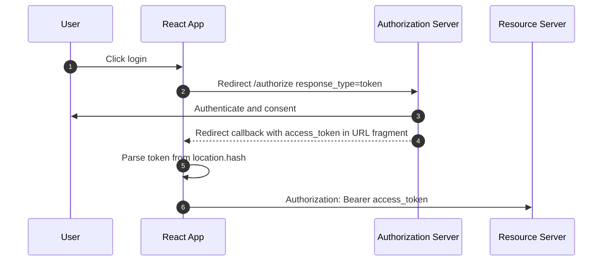
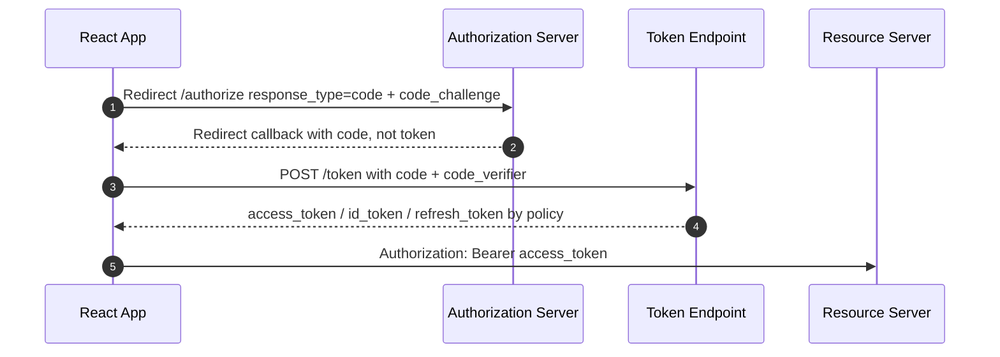
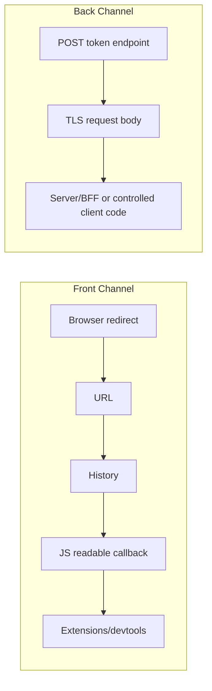
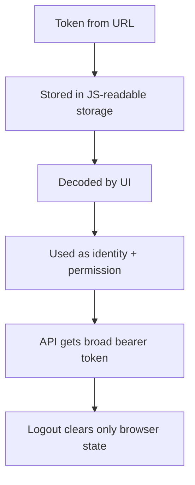
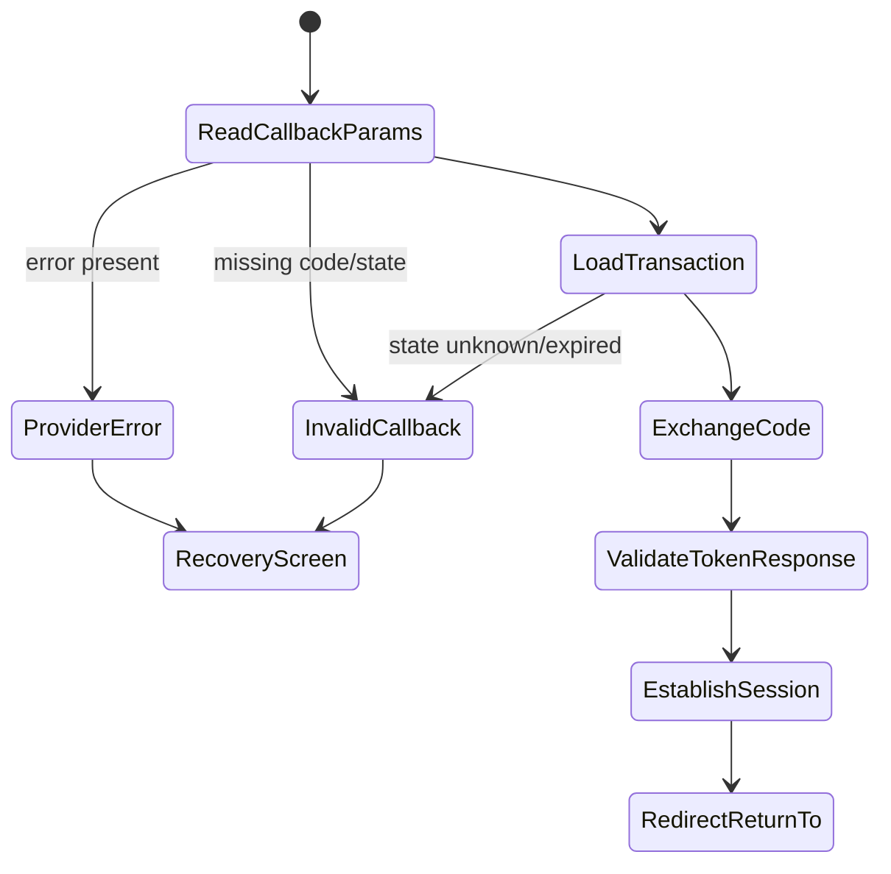
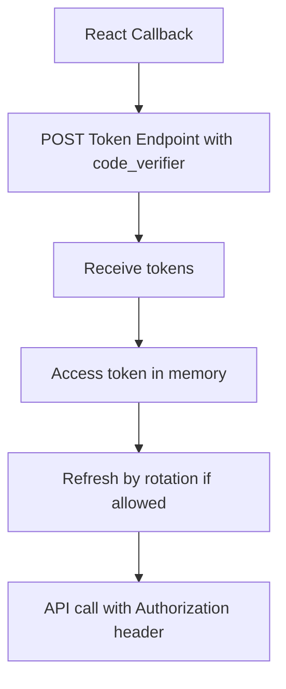
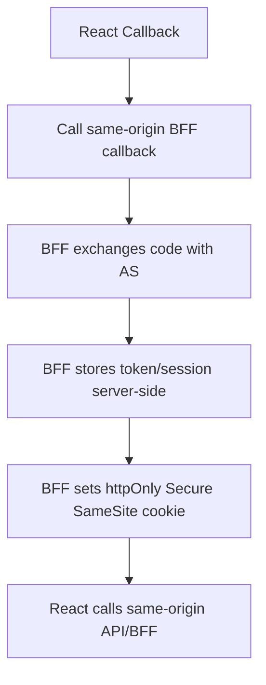
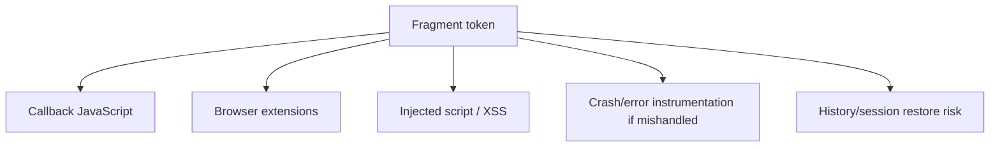

# Part 023 — Why Implicit Flow Is Legacy

Implicit Flow dulu populer untuk SPA.

Bukan karena desainnya paling aman.

Karena pada masa awal OAuth 2.0, browser app sulit melakukan token exchange secara aman dan praktis: CORS belum sematang sekarang, browser SPA tidak punya backend, dan public client tidak bisa menyimpan `client_secret`.

Implicit Flow mengambil jalan pintas: token dikirim langsung lewat browser redirect.

Masalahnya: browser redirect adalah **front channel**.

Front channel bukan jalur privat untuk credential.

Hari ini, untuk React/browser apps, default modern adalah **Authorization Code with PKCE**, bukan Implicit Flow.

---

## 1. Inti masalah

Implicit Flow mengirim access token langsung pada authorization response.

Biasanya lewat URL fragment:

```txt
https://app.example.com/callback#access_token=...&token_type=Bearer&expires_in=3600&state=...
```

Atau pada varian tertentu, token muncul di response mode lain.

React app membaca token dari URL, menyimpannya, lalu memakai token untuk API.



Masalah desainnya sederhana:

> Access token muncul di environment yang paling sulit dikontrol: browser URL, JavaScript runtime, history, extension surface, logs, crash reports, analytics, dan callback handling code.

Authorization Code with PKCE mengganti model itu:



Authorization code masih lewat browser, tetapi code itu **belum token**. Ia harus ditukar dengan `code_verifier` yang tidak dikirim pada authorization request.

---

## 2. Front channel vs back channel

Untuk memahami kenapa Implicit Flow legacy, jangan mulai dari OAuth grant name.

Mulai dari jalur data.



Front channel cocok untuk:

- membawa authorization code;
- membawa `state`;
- membawa error code;
- mengembalikan user ke app.

Front channel buruk untuk:

- access token;
- refresh token;
- long-lived credential;
- high-privilege credential;
- data rahasia;
- permission artifact yang bisa langsung dipakai.

Back channel lebih cocok untuk token exchange karena request dikirim langsung ke token endpoint, bukan disisipkan sebagai URL redirect result.

Pada BFF architecture, back channel berada sepenuhnya di server.

Pada pure SPA, token endpoint masih dipanggil dari browser, tetapi PKCE mengikat authorization code ke client instance yang memulai flow.

---

## 3. Kenapa Implicit Flow pernah ada

OAuth 2.0 awalnya punya beberapa grant:

- Authorization Code;
- Implicit;
- Resource Owner Password Credentials;
- Client Credentials.

Implicit Flow dibuat untuk public clients yang tidak bisa menjaga client secret, terutama browser-based apps.

Pada saat itu:

- browser CORS support belum sematang sekarang;
- SPA belum punya pola BFF yang umum;
- token endpoint dari browser belum selalu praktis;
- banyak IdP dan SDK mengoptimalkan login cepat, bukan threat model jangka panjang.

Jadi Implicit Flow bukan “jahat dari awal”.

Ia adalah kompromi historis.

Tetapi kompromi itu tidak lagi sesuai untuk sistem modern.

---

## 4. Apa yang benar-benar legacy

Yang legacy bukan hanya `response_type=token`.

Yang legacy adalah seluruh kebiasaan desain berikut:

```txt
redirect contains token
browser parses token from URL
token stored in localStorage
UI decodes JWT and derives role
API trusts broad scopes
auth failure handled by global redirect loop
logout clears only localStorage
```

Implicit Flow sering datang bersama pola-pola ini.

Bahkan ketika flow sudah diganti ke Authorization Code with PKCE, sebagian app masih membawa mental model implicit:

- token dianggap state UI;
- JWT dianggap source of truth frontend;
- access token dianggap identity token;
- token expiry dianggap masalah timer;
- role claim dipakai untuk authorization UI dan backend;
- logout dianggap `localStorage.removeItem()`.

Migrasi yang benar bukan sekadar mengubah grant type.

Migrasi yang benar adalah mengubah auth architecture.

---

## 5. Attack surface Implicit Flow

### 5.1 Token muncul di URL artifact

URL adalah permukaan besar.

Walaupun URL fragment tidak dikirim ke server dalam HTTP request, ia tetap berada di browser runtime dan callback page.

Risiko praktis:

- token terbaca oleh JavaScript jika callback page terkena XSS;
- token bisa ikut terekam oleh monitoring SDK jika app salah instrumentasi;
- token bisa muncul di browser extension surface;
- token bisa bertahan dalam history/session restore;
- token bisa bocor saat callback code melakukan redirect yang salah;
- token bisa terambil oleh script third-party yang berjalan di origin yang sama.

Rule sederhana:

> Jangan taruh bearer credential pada tempat yang secara desain mudah dibaca oleh browser code.

### 5.2 Token langsung usable

Access token adalah bearer credential.

Siapa pun yang memegangnya dapat menggunakannya sampai token itu expired atau dicabut, kecuali ada sender-constrained token atau mekanisme binding lain.

Pada Implicit Flow:

```txt
intercepted access_token -> call API
```

Pada Authorization Code with PKCE:

```txt
intercepted code -> cannot exchange without code_verifier
```

PKCE tidak membuat browser bebas risiko.

Tetapi PKCE menghilangkan satu kelas masalah besar: authorization code interception menjadi jauh lebih sulit dieksploitasi.

### 5.3 Tidak ada token endpoint control

Implicit Flow melewati token endpoint untuk access token issuance ke client.

Akibatnya, beberapa kontrol sulit diterapkan secara bersih:

- token exchange policy;
- stricter client authentication alternatives;
- sender constraint;
- refresh token policy;
- telemetry token endpoint;
- abnormal exchange detection;
- code-to-token binding;
- reuse detection style semantics.

Token endpoint adalah tempat natural untuk melakukan banyak kontrol keamanan.

Implicit Flow mengurangi peran titik kontrol itu.

### 5.4 Silent renew via iframe makin rapuh

Banyak SPA lama memakai implicit flow dengan silent renew:

```txt
hidden iframe -> /authorize prompt=none -> callback with token -> parent receives token
```

Masalahnya:

- bergantung pada third-party cookie behavior;
- sering rusak pada browser privacy changes;
- susah diamankan;
- rawan redirect loop;
- sulit diobservasi;
- punya UX failure yang membingungkan.

Pola modern lebih baik memakai:

- BFF session renewal;
- refresh token rotation untuk browser apps jika provider mendukung dan risikonya diterima;
- short-lived access token dengan explicit re-auth;
- session bootstrap dari server.

### 5.5 Token substitution dan mix-up risk

Implicit-style callback sering lemah pada validasi:

- `state` tidak dicek ketat;
- issuer tidak diverifikasi;
- audience tidak dicek;
- `nonce` tidak dicek;
- callback menerima token dari provider yang salah;
- return URL tidak divalidasi.

Serangan modern OAuth sering bukan “mencuri password”.

Sering kali bentuknya:

- membuat client menerima response dari authorization server yang salah;
- mengganti token/code;
- memanfaatkan redirect URI yang longgar;
- memanfaatkan app yang bingung antara ID token dan access token;
- memanfaatkan state/nonce yang tidak diikat ke transaksi.

---

## 6. Standards direction

Arah standar modern jelas:

- browser-based apps sebaiknya memakai Authorization Code with PKCE;
- Implicit Flow tidak lagi direkomendasikan sebagai best practice;
- token sebaiknya dikeluarkan dari token endpoint, bukan langsung di authorization response;
- public clients tidak boleh mengandalkan client secret;
- refresh token untuk browser harus diperlakukan sangat hati-hati, biasanya dengan rotation dan reuse detection;
- redirect URI matching harus ketat;
- `state` dan `nonce` harus dipakai sesuai tujuan.

Ini bukan opini framework.

Ini arah security practice OAuth modern.

---

## 7. Cara mengenali app masih implicit-minded

Cari tanda ini di codebase:

```ts
window.location.hash.includes('access_token')
```

```ts
new URLSearchParams(window.location.hash.substring(1)).get('access_token')
```

```ts
localStorage.setItem('access_token', token)
```

```ts
const role = jwtDecode(token).role
```

```ts
if (user.role === 'admin') {
  showAdminButton()
}
```

```ts
axios.interceptors.response.use(undefined, error => {
  if (error.response.status === 401) {
    window.location.href = '/login'
  }
})
```

Masalahnya bukan hanya satu baris.

Masalahnya adalah sistem berpikir:



Kalau pola ini ada, migrasi ke PKCE harus disertai redesign session, permission, logout, and API boundary.

---

## 8. Migration map: Implicit to Authorization Code with PKCE

### 8.1 Inventory

Buat inventory dulu.

```txt
Auth provider:
  - issuer
  - tenant/domain
  - app/client id
  - allowed callback URLs
  - allowed logout URLs
  - grant types enabled

Frontend:
  - callback route
  - token storage
  - token decode locations
  - API client injection
  - route guards
  - permission checks
  - logout logic

Backend/API:
  - expected token audience
  - accepted issuer
  - scope/permission checks
  - token validation library
  - CORS config
  - CSRF config if cookie/BFF
```

Tanpa inventory, migrasi auth mudah terlihat berhasil tetapi meninggalkan policy hole.

### 8.2 Change grant type

Ubah dari:

```txt
response_type=token id_token
```

Menjadi:

```txt
response_type=code
code_challenge=<S256(code_verifier)>
code_challenge_method=S256
```

Untuk OIDC, request tetap membawa:

```txt
scope=openid profile email ...
state=<transaction-state>
nonce=<oidc-nonce>
```

### 8.3 Add transaction storage

React app perlu menyimpan transaksi login sementara:

```ts
export type AuthTransaction = {
  state: string
  nonce: string
  codeVerifier: string
  returnTo: string
  createdAt: number
  issuer: string
}
```

Storage transaksi harus:

- pendek umurnya;
- scoped per login attempt;
- tidak berisi token;
- dibersihkan setelah callback;
- tidak disimpan permanen tanpa alasan.

### 8.4 Implement callback exchange

Callback menerima `code` dan `state`.

```ts
export async function handleOAuthCallback(url: URL) {
  const code = url.searchParams.get('code')
  const returnedState = url.searchParams.get('state')
  const error = url.searchParams.get('error')

  if (error) {
    throw new OAuthCallbackError(error, url.searchParams.get('error_description'))
  }

  if (!code || !returnedState) {
    throw new InvalidCallbackError('Missing code or state')
  }

  const tx = await authTransactionStore.get(returnedState)

  if (!tx) {
    throw new InvalidCallbackError('Unknown or expired auth transaction')
  }

  const tokenResponse = await tokenEndpoint.exchangeCode({
    code,
    codeVerifier: tx.codeVerifier,
    redirectUri: oauthConfig.redirectUri,
    clientId: oauthConfig.clientId,
  })

  await authTransactionStore.delete(returnedState)

  return tokenResponse
}
```

In real production, pure SPA and BFF differ.

Pure SPA calls token endpoint from browser.

BFF calls token endpoint from server and sets secure session cookie.

### 8.5 Remove URL token parsing

Delete callback code that reads:

```ts
location.hash
```

Delete token-in-fragment handling.

Callback should accept `code`, `state`, `error`, and sometimes provider-specific params.

### 8.6 Remove localStorage token dependency

Migrasi token storage:

Option A — BFF preferred for many enterprise apps:

```txt
browser has httpOnly session cookie
BFF stores or manages tokens server-side
React calls same-origin BFF/API
```

Option B — pure SPA:

```txt
access token in memory
refresh token only if provider supports secure rotation and app accepts risk
session restored by auth provider/session endpoint
```

Option C — temporary compatibility:

```txt
short period dual-mode login
new sessions use code+PKCE
old implicit sessions expire naturally
no long-lived localStorage token carryover
```

### 8.7 Update API validation

Backend should verify:

- issuer;
- audience;
- signature or introspection;
- expiry;
- token type/purpose;
- scopes or permissions;
- tenant/resource membership.

Do not loosen backend validation to make migration easier.

### 8.8 Roll out by cohort

Auth migration should use staged rollout:

```txt
1. deploy callback that rejects token fragment but handles code
2. enable code+PKCE for internal users
3. monitor callback errors and token exchange failures
4. migrate small cohort
5. expire old implicit sessions
6. disable implicit grant in provider
7. remove legacy parsing code
```

---

## 9. React callback route design

A good callback route is boring.

It should not render app shell with sensitive menus.

It should not fetch business data.

It should not decode token to decide role.

It should do one transaction.



Example with React Router loader style:

```ts
export async function oauthCallbackLoader({ request }: LoaderFunctionArgs) {
  const url = new URL(request.url)

  try {
    const result = await authClient.completeLogin(url)

    return redirect(safeReturnTo(result.returnTo))
  } catch (error) {
    const authError = normalizeOAuthCallbackError(error)

    await authClient.clearTransientLoginState()

    throw new Response(authError.publicMessage, {
      status: authError.httpStatus,
    })
  }
}
```

Key rules:

- validate `state` before exchange;
- use exact redirect URI;
- delete transaction after use;
- sanitize return URL;
- clear callback URL from browser history if needed;
- separate provider error from local validation error;
- log safely without token/code values;
- never render decoded claims as proof of access.

---

## 10. Handling legacy callback URLs

Many apps have old redirect URLs still registered:

```txt
https://app.example.com/auth/callback
https://app.example.com/callback
https://app.example.com/silent-renew.html
https://app.example.com/oauth2/callback
```

Do not keep broad redirect URI allowlists forever.

Use a decommission plan:

```txt
Phase A: observe traffic to old callbacks
Phase B: show safe migration error for old implicit fragments
Phase C: remove old silent renew iframe route
Phase D: remove old provider registration
Phase E: delete code path
```

A safe legacy callback can do:

```ts
export function LegacyImplicitCallback() {
  useEffect(() => {
    const hasTokenFragment = window.location.hash.includes('access_token')

    if (hasTokenFragment) {
      authTelemetry.record('legacy_implicit_callback_seen')
      authClient.clearAllLocalAuthArtifacts()
      window.location.replace('/login?reason=auth-flow-upgraded')
    }
  }, [])

  return <AuthRecoveryScreen reason="legacy-auth-flow" />
}
```

Do not silently import old token into the new session model unless you have a deliberate migration token exchange strategy.

---

## 11. Common migration bugs

### Bug 1 — `state` is optional

Wrong:

```ts
if (stateFromUrl && stateFromStorage !== stateFromUrl) {
  throw new Error('bad state')
}
```

Correct:

```ts
if (!stateFromUrl) throw new Error('missing state')
if (!tx) throw new Error('unknown state')
if (tx.state !== stateFromUrl) throw new Error('state mismatch')
```

`state` must be mandatory.

### Bug 2 — return URL stored as full external URL

Wrong:

```ts
returnTo = url.searchParams.get('returnTo') ?? '/'
```

Correct:

```ts
export function safeReturnTo(value: string | null): string {
  if (!value) return '/'

  try {
    const parsed = new URL(value, window.location.origin)

    if (parsed.origin !== window.location.origin) return '/'

    return parsed.pathname + parsed.search + parsed.hash
  } catch {
    return '/'
  }
}
```

### Bug 3 — code verifier stored too long

`code_verifier` is not a refresh secret, but it is still security-sensitive transaction material.

It should expire quickly.

```ts
const MAX_TX_AGE_MS = 5 * 60 * 1000

export function isTransactionExpired(tx: AuthTransaction, now = Date.now()) {
  return now - tx.createdAt > MAX_TX_AGE_MS
}
```

### Bug 4 — token response trusted without token purpose checks

Wrong:

```ts
const claims = jwtDecode(tokenResponse.access_token)
setUser(claims)
```

Better:

```ts
await sessionBootstrap.loadProjection()
```

For React UI, use a server-controlled session projection:

```ts
type SessionProjection = {
  status: 'authenticated'
  user: {
    id: string
    displayName: string
    email?: string
  }
  tenant: {
    id: string
    slug: string
  }
  permissionsVersion: string
}
```

### Bug 5 — disabling implicit only in frontend

You must disable implicit grant in the authorization server/app registration too.

Frontend code cleanup is not enough.

---

## 12. Token response handling: pure SPA vs BFF

### Pure SPA



Properties:

- simple deployment;
- still exposes access token to JS memory;
- careful XSS defense required;
- refresh token in browser is sensitive;
- logout must coordinate multi-tab and provider state.

### BFF



Properties:

- browser does not handle OAuth tokens directly;
- cookie/CSRF design becomes central;
- BFF operational complexity increases;
- works well with SSR and regulated apps;
- server can enforce session policy centrally.

Decision rule:

```txt
If app is enterprise/regulatory/multi-tenant/high-risk and you control backend,
prefer BFF/session-cookie architecture.

If app is public SPA with lower risk and no backend,
use code+PKCE carefully with memory token and hardened XSS posture.
```

---

## 13. Why “we use HTTPS” does not save Implicit Flow

HTTPS protects network transit.

It does not remove token from:

- browser URL processing;
- JavaScript runtime;
- callback page code;
- extension APIs;
- browser history/session restore;
- frontend error logging;
- bad redirect logic;
- XSS in same origin;
- third-party script compromise.

Transport security is necessary.

It is not sufficient.

---

## 14. Why “token is only in fragment” is not enough

A common defense of Implicit Flow:

> URL fragment is not sent to the server, so it is safe.

This is incomplete.

The threat is not only web server access logs.

The threat is that bearer credential becomes readable by the browser environment.



A bearer token in a fragment is still a bearer token in the browser.

---

## 15. Permission impact

Implicit Flow often encourages overstuffed tokens:

```json
{
  "sub": "user_123",
  "email": "a@example.com",
  "role": "admin",
  "permissions": ["case:create", "case:approve", "case:delete"],
  "tenant_id": "tenant_1"
}
```

Then frontend does:

```ts
const permissions = jwtDecode(accessToken).permissions
```

This is fragile:

- role/permission claims become stale;
- token size grows;
- permission revocation waits for token expiry;
- frontend starts treating token as policy DB;
- tenant switch becomes dangerous;
- backend may accidentally trust client-side projection.

Better:

```txt
Access token proves client can call API audience.
API/server resolves fresh authorization for resource/action.
Frontend receives permission projection from trusted API.
Projection has version and expiry semantics.
```

---

## 16. Testing migration from Implicit Flow

### 16.1 Callback tests

Test cases:

```txt
callback with code and valid state -> success
callback with code and missing state -> reject
callback with code and wrong state -> reject
callback with error=access_denied -> recovery UI
callback with access_token fragment -> legacy recovery + clear state
callback with external returnTo -> redirect to /
callback with expired transaction -> reject
callback replay using same state -> reject
```

Example:

```ts
it('rejects legacy implicit token fragments', async () => {
  const result = await callbackHandler.handle(
    new URL('https://app.example.com/callback#access_token=abc&state=s1')
  )

  expect(result.kind).toBe('legacy_implicit_rejected')
})
```

### 16.2 Provider config tests

At minimum, verify configuration drift:

```txt
implicit grant disabled
authorization code grant enabled
PKCE required for public client
redirect URIs exact and minimal
logout URLs exact and minimal
refresh token rotation enabled if refresh tokens used
allowed origins minimal
```

### 16.3 API tests

Verify backend rejects wrong token type and audience:

```txt
ID token used as API bearer -> reject
access token with wrong audience -> reject
expired access token -> reject
access token from wrong issuer -> reject
token with broad scope but no resource permission -> reject
```

---

## 17. Observability during migration

Instrument events:

```txt
auth.login.start
auth.callback.code.received
auth.callback.state.missing
auth.callback.state.mismatch
auth.callback.legacy_implicit_seen
auth.token_exchange.success
auth.token_exchange.failure
auth.session.bootstrap.success
auth.session.bootstrap.failure
auth.redirect_loop.detected
auth.provider.config_mismatch
```

Do not log:

- access token;
- ID token;
- refresh token;
- authorization code;
- code verifier;
- full callback URL;
- full Authorization header.

Safe log example:

```json
{
  "event": "auth.callback.state_mismatch",
  "provider": "corp-idp",
  "client_id_hash": "sha256:...",
  "redirect_path": "/oauth/callback",
  "has_code": true,
  "has_state": true,
  "transaction_found": false,
  "correlation_id": "req_123"
}
```

---

## 18. Production checklist

Before disabling Implicit Flow:

```txt
[ ] code+PKCE works for normal login
[ ] code+PKCE works after browser refresh on callback
[ ] callback rejects missing/unknown state
[ ] callback rejects legacy access_token fragment
[ ] return URL is internal-only
[ ] token exchange errors have recovery UI
[ ] old localStorage tokens are cleared
[ ] API rejects ID token as bearer credential
[ ] API validates access token issuer/audience/expiry
[ ] logout clears new session model
[ ] multi-tab logout works
[ ] refresh flow is defined or intentionally absent
[ ] old silent renew route is removed or safely deprecated
[ ] provider implicit grant disabled
[ ] redirect URI allowlist minimized
[ ] logs do not contain token/code/verifier
[ ] security review signed off
```

---

## 19. Anti-pattern catalog

### Anti-pattern: “PKCE but still localStorage forever”

PKCE protects the authorization code exchange.

It does not make long-lived localStorage tokens safe.

### Anti-pattern: “Implicit only for internal admins”

Admins are higher value targets.

Do not give them weaker flow.

### Anti-pattern: “Decode access token to get role”

Access token is for resource server.

Frontend should use a session/permission projection, not infer authority from token claims.

### Anti-pattern: “Silent renew iframe as permanent architecture”

It is brittle and privacy-hostile.

Use modern session renewal strategy.

### Anti-pattern: “Disable implicit later”

Leaving implicit enabled in provider config preserves attack surface even after frontend migration.

---

## 20. Mental model summary

Implicit Flow is legacy because it sends usable credential through the browser redirect channel.

Authorization Code with PKCE is better because it sends a temporary code through the redirect channel and requires a verifier during token exchange.

But the deeper lesson is this:

> React auth design should minimize credential exposure, keep token purpose explicit, treat browser state as untrusted projection, and enforce authorization server-side.

Do not migrate from implicit to PKCE while keeping implicit architecture.

Change the architecture.

---

## 21. References

- RFC 9700 — Best Current Practice for OAuth 2.0 Security.
- OAuth 2.0 for Browser-Based Applications — IETF OAuth Working Group draft.
- RFC 7636 — Proof Key for Code Exchange by OAuth Public Clients.
- OpenID Connect Core 1.0.
- OWASP Session Management Cheat Sheet.
- OWASP OAuth2 Cheat Sheet.
- OWASP Cross-Site Request Forgery Prevention Cheat Sheet.
