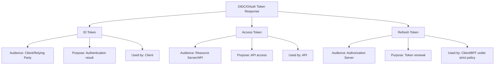
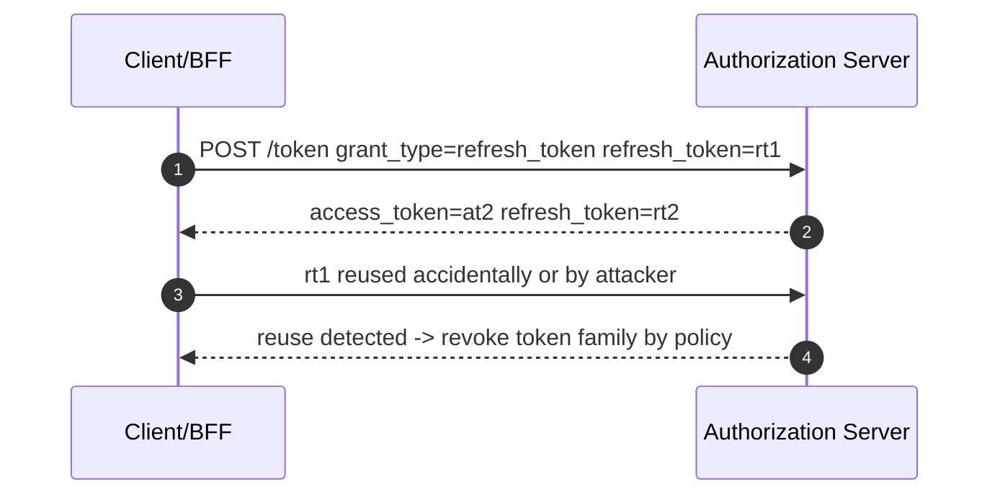
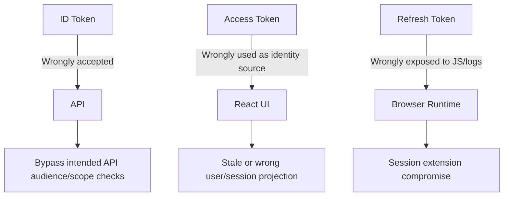
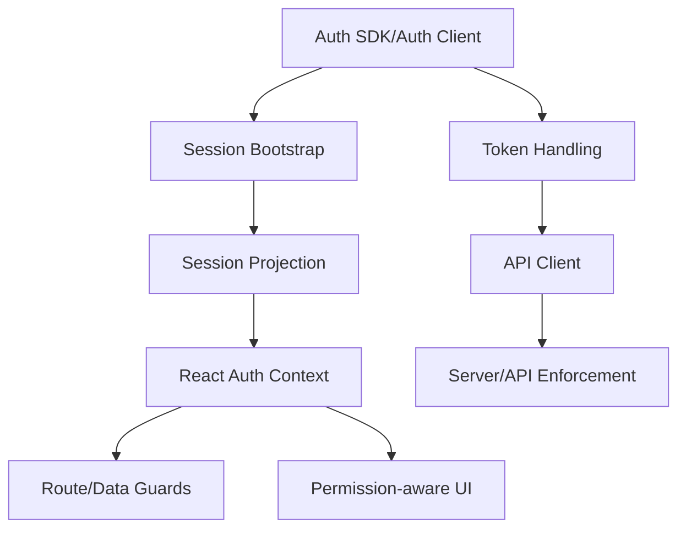
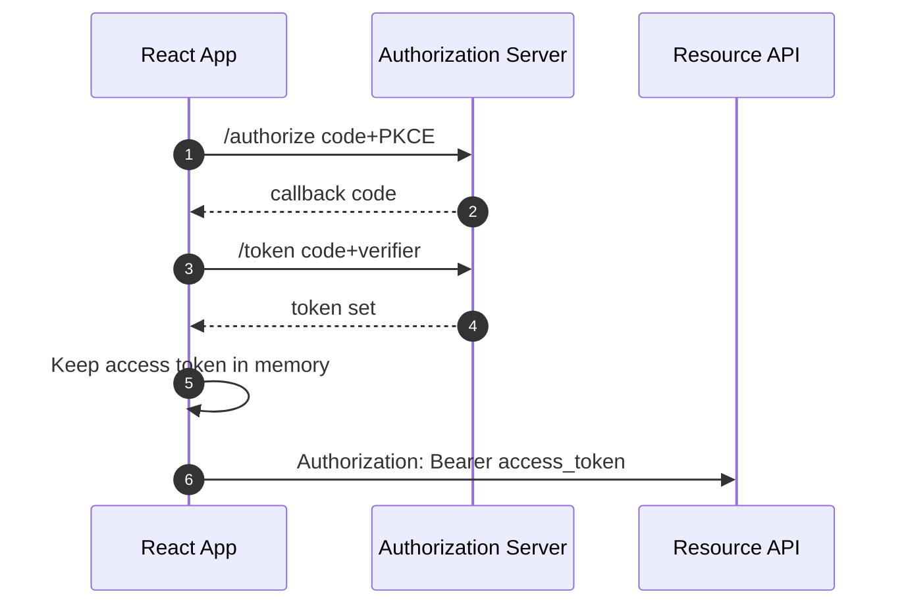
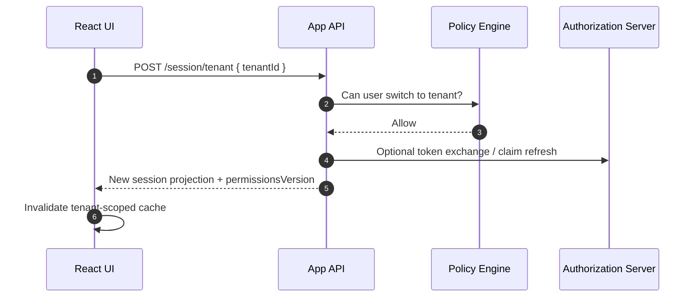

# Part 024 — ID Token, Access Token, Refresh Token

React engineers sering melihat tiga token ini sebagai “token login”.

Itu framing yang salah.

Ketiganya punya tujuan berbeda:

```txt
ID Token      -> tells the client about authentication result
Access Token  -> authorizes access to a resource server/API
Refresh Token -> obtains new tokens without interactive login
```

Kalau tujuan token dicampur, sistem auth mulai bocor di tempat yang tidak terlihat:

- API menerima ID token sebagai bearer credential;
- frontend memakai access token sebagai profile source;
- role claim pada JWT dipakai sebagai authorization final;
- refresh token disimpan seperti preference biasa;
- logout hanya membersihkan token di browser;
- tenant switch tidak memaksa token/session refresh.

Pada sistem production, token bukan string.

Token adalah **security artifact with purpose, audience, lifetime, holder, and validation rules**.

---

## 1. Token taxonomy



Do not start with token format.

Start with recipient.

```txt
Who is supposed to consume this token?
What does that recipient validate?
What must that recipient never infer?
```

---

## 2. ID Token

ID Token is an OIDC concept.

It represents the result of an authentication event for the client.

It usually contains claims such as:

```json
{
  "iss": "https://idp.example.com/",
  "sub": "user_123",
  "aud": "react-client-id",
  "exp": 1790000000,
  "iat": 1789996400,
  "auth_time": 1789996300,
  "nonce": "n-0S6_WzA2Mj",
  "amr": ["pwd", "mfa"],
  "acr": "urn:example:loa:2"
}
```

ID Token answers:

```txt
Which identity did the Authorization Server authenticate for this client?
When did authentication happen?
What authentication context was used?
Was this response bound to my OIDC request via nonce?
```

ID Token does **not** answer:

```txt
Can this user approve case #123?
Can this user call Billing API?
Can this user edit this tenant resource?
Is this permission still current?
```

### 2.1 Audience of ID Token

The audience of an ID Token is the client, usually your OAuth/OIDC client ID.

That means:

```txt
ID token aud = React client / relying party
```

Not:

```txt
ID token aud = your API
```

If an API accepts an ID Token as an access credential, the API is confused about token purpose.

That is token confusion.

### 2.2 What React may use ID Token for

React/auth client may use ID Token to:

- complete OIDC authentication;
- validate nonce if doing client-side validation;
- establish an authenticated client session;
- extract minimal display identity when appropriate;
- send ID token to BFF callback if the BFF is responsible for validation;
- debug authentication context safely without logging token value.

React should not use ID Token to:

- call resource APIs;
- decide business permissions;
- infer tenant membership finality;
- bypass `/me` or `/session` projection;
- authorize buttons/actions;
- persist long-lived user profile without refresh.

### 2.3 Authentication context claims

Important OIDC claims:

| Claim | Meaning | React usage |
|---|---|---|
| `iss` | Issuer | Verify expected IdP/tenant issuer. |
| `sub` | Subject identifier | Stable identity key, not display name. |
| `aud` | Audience | Must match client ID. |
| `exp` | Expiration | Token no longer valid after this time. |
| `iat` | Issued at | Diagnostics and validation. |
| `nonce` | Request binding | Prevent replay/substitution in OIDC auth response. |
| `auth_time` | When user authenticated | Step-up/re-auth decisions. |
| `amr` | Authentication methods | Example: password, MFA, passkey. |
| `acr` | Authentication context class | Assurance level semantics. |

Claims are useful.

But useful is not the same as authoritative for app permission.

---

## 3. Access Token

Access Token is an OAuth concept.

It is presented to a Resource Server/API.

```http
GET /api/cases/123 HTTP/1.1
Host: api.example.com
Authorization: Bearer eyJhbGciOi...
```

Access Token answers:

```txt
Is this client/request authorized to access this API audience under these token-level grants?
```

Then the API must still answer:

```txt
Can this subject perform this action on this specific resource in this tenant and state?
```

Those are not the same question.

### 3.1 Access token is not a user profile

Wrong:

```ts
const user = jwtDecode(accessToken)
setCurrentUser({
  id: user.sub,
  email: user.email,
  role: user.role,
})
```

Better:

```ts
const session = await api.get('/session')
setSessionProjection(session)
```

Why?

Because access token is for API consumption.

It may be opaque.

It may omit profile claims.

It may use API-specific subject mapping.

It may have scopes that are not business permissions.

It may be encrypted or non-JWT.

Frontend code that assumes access token shape couples UI to authorization server internals.

### 3.2 Scope is not permission

OAuth scope is often coarse-grained delegated authority.

Example:

```txt
scope = cases:read cases:write
```

Business permission is often contextual:

```txt
subject: user_123
action: approve
resource: case_987
context:
  tenant: tenant_a
  caseState: UNDER_REVIEW
  assignment: current_user_is_reviewer
  amount: 120000
  conflictOfInterest: false
```

Do not collapse this into:

```ts
if (scope.includes('cases:write')) showApproveButton()
```

Better:

```ts
can('case.approve', caseResource)
```

Where the result comes from server-derived permission projection or server decision endpoint.

### 3.3 Access token validation belongs to API

Resource server validates:

- issuer;
- audience;
- expiry;
- signature or introspection active state;
- token type/purpose;
- scopes/grants;
- tenant boundary;
- subject mapping;
- resource-level permission.

React does not validate access token for the API.

React may manage possession and renewal.

The API validates authority.

---

## 4. Refresh Token

Refresh Token is a credential used to obtain new tokens.

It is usually sent to the Authorization Server token endpoint.

It is more sensitive than an access token because it can extend a session.



Refresh token answers:

```txt
Can this client obtain a fresh access token without interactive authentication?
```

Refresh token does not answer:

```txt
Who is the user profile?
What permissions does user have?
Can user access this resource?
```

### 4.1 Browser refresh token risk

A refresh token in browser is high risk because browser JavaScript environment is exposed to XSS.

Modern providers may allow refresh tokens for browser apps with protections such as:

- refresh token rotation;
- reuse detection;
- short absolute lifetime;
- inactivity timeout;
- sender constraints where available;
- reduced scopes;
- anomaly detection.

But do not treat this as free.

For high-risk apps, BFF with httpOnly session cookie often gives a cleaner boundary.

### 4.2 Refresh token rotation mental model

Refresh token rotation is not “extend expiry”.

It is a replay detection mechanism.

```txt
rt1 -> used once -> rt2 issued, rt1 invalidated
rt2 -> used once -> rt3 issued, rt2 invalidated
reusing rt1 -> suspicious reuse -> revoke family or require re-auth
```

Client implications:

- refresh must be single-flight;
- tabs need coordination;
- network ambiguity must be handled carefully;
- old refresh token must be replaced atomically;
- refresh failure must not cause infinite retry storm.

---

## 5. Token purpose matrix

| Property | ID Token | Access Token | Refresh Token |
|---|---|---|---|
| Protocol | OIDC | OAuth 2.0 | OAuth 2.0 |
| Primary recipient | Client/Relying Party | Resource Server/API | Authorization Server |
| Main purpose | Authentication result | API access | Token renewal |
| Usually bearer? | Often JWT | Bearer or sender-constrained | Credential/secret |
| Should API accept it? | No | Yes, if valid for API | No |
| Should React use for UI profile? | Limited/minimal | No | No |
| Should React use for permission? | No | No final decision | No |
| Typical lifetime | Short | Short | Longer but controlled |
| Validation by | Client/BFF/Auth SDK | API/Resource Server | Authorization Server |
| Storage concern | Sensitive | Sensitive | Highly sensitive |

---

## 6. Token confusion

Token confusion happens when a component accepts a token intended for another component.



Examples:

### 6.1 API accepts ID token

Wrong API middleware:

```ts
function authenticate(req: Request) {
  const token = extractBearer(req)
  const claims = verifyJwt(token)

  // BAD: only checks issuer/signature/exp
  return { subject: claims.sub }
}
```

Better:

```ts
function authenticateApiRequest(req: Request) {
  const token = extractBearer(req)
  const claims = verifyJwt(token)

  assertIssuer(claims.iss, expectedIssuer)
  assertAudience(claims.aud, expectedApiAudience)
  assertTokenUse(claims, 'access_token')
  assertNotExpired(claims.exp)

  return mapAccessTokenSubject(claims)
}
```

### 6.2 React treats access token claims as permissions

Wrong:

```ts
const claims = jwtDecode(accessToken)
return claims.permissions.includes('invoice.approve')
```

Better:

```ts
const decision = await permissions.can({
  action: 'invoice.approve',
  resource: { type: 'invoice', id: invoiceId },
})
```

Or use server-provided projection:

```ts
type AllowedAction = {
  action: string
  allowed: boolean
  reason?: string
  constraint?: {
    until?: string
    maxAmount?: number
  }
}
```

### 6.3 Refresh token logged

Wrong:

```ts
logger.error('refresh failed', { refreshToken, error })
```

Correct:

```ts
logger.error('refresh failed', {
  errorCode: normalize(error).code,
  sessionIdHash,
  tokenFamilyIdHash,
  correlationId,
})
```

---

## 7. React architecture contract

A clean React auth architecture separates token handling from app authorization.



Rules:

```txt
Auth client may handle tokens.
API client may attach access token.
Session endpoint returns user/session projection.
Permission endpoint returns capability projection/decision.
Components consume projection/decision, not raw tokens.
```

### 7.1 TypeScript branded token types

Prevent accidental token confusion with nominal/branded types.

```ts
type Brand<T, B extends string> = T & { readonly __brand: B }

export type IdToken = Brand<string, 'IdToken'>
export type AccessToken = Brand<string, 'AccessToken'>
export type RefreshToken = Brand<string, 'RefreshToken'>

export type TokenSet = {
  idToken?: IdToken
  accessToken: AccessToken
  refreshToken?: RefreshToken
  expiresAt: number
}
```

API client should not accept generic string:

```ts
export class ApiClient {
  constructor(private readonly getAccessToken: () => Promise<AccessToken>) {}

  async request(input: RequestInfo, init: RequestInit = {}) {
    const token = await this.getAccessToken()

    return fetch(input, {
      ...init,
      headers: {
        ...init.headers,
        Authorization: `Bearer ${token}`,
      },
    })
  }
}
```

Session bootstrap should not take access token claims as user object:

```ts
export async function loadSessionProjection(): Promise<SessionProjection> {
  const res = await fetch('/api/session', {
    credentials: 'include',
  })

  if (res.status === 401) return { status: 'anonymous' }
  if (!res.ok) return { status: 'degraded', reason: 'session_unavailable' }

  return res.json()
}
```

---

## 8. Session projection is not token claims

A session projection is application-specific.

Example:

```ts
export type SessionProjection =
  | { status: 'unknown' }
  | { status: 'anonymous' }
  | {
      status: 'authenticated'
      user: {
        id: string
        displayName: string
        email?: string
      }
      tenant: {
        id: string
        slug: string
        displayName: string
      }
      assurance: {
        level: 'low' | 'medium' | 'high'
        methods: string[]
        authenticatedAt: string
      }
      permissionsVersion: string
      sessionVersion: string
    }
  | { status: 'degraded'; reason: string }
```

This projection can be derived from:

- ID token;
- userinfo endpoint;
- internal identity mapping;
- membership database;
- tenant assignment;
- policy engine;
- session store;
- risk engine.

The React app should not care which internal source produced it.

It should care about stable contract.

---

## 9. BFF token handling

In BFF architecture, browser does not receive OAuth tokens.

```mermaid
sequenceDiagram
    autonumber
    participant Browser
    participant BFF
    participant AS as Authorization Server
    participant API as Resource API

    Browser->>BFF: GET /auth/callback?code=...
    BFF->>AS: POST /token code + verifier
    AS-->>BFF: id_token/access_token/refresh_token
    BFF->>BFF: Validate/store token set or session reference
    BFF-->>Browser: Set-Cookie: __Host-session=...; HttpOnly; Secure; SameSite=Lax
    Browser->>BFF: GET /api/session with cookie
    BFF-->>Browser: Session projection
    Browser->>BFF: GET /api/cases
    BFF->>API: Authorization: Bearer access_token or internal auth
```

BFF responsibilities:

- validate ID token;
- manage access token lifecycle;
- store refresh token securely;
- rotate refresh token safely;
- set secure session cookie;
- protect state-changing endpoints against CSRF;
- expose session/permission projection to React;
- prevent token leakage to browser logs and responses.

React responsibilities:

- call same-origin BFF;
- use session projection;
- handle 401/403/degraded states;
- coordinate logout UI;
- not ask for raw tokens.

---

## 10. Pure SPA token handling

In pure SPA architecture, browser receives tokens.



Pure SPA responsibilities:

- use code+PKCE;
- avoid implicit flow;
- avoid long-lived localStorage token pattern;
- use in-memory access token where feasible;
- coordinate refresh across tabs;
- clear tokens on logout;
- harden against XSS;
- keep permission decision server-backed;
- avoid token claim coupling.

Risk statement:

> Pure SPA token handling can be acceptable in some contexts, but it should be a deliberate risk decision, not default inertia.

---

## 11. Validation responsibilities

### 11.1 Client/BFF validating ID Token

Validate:

```txt
signature
issuer
client audience
expiration
issued-at / not-before where applicable
nonce
authorized party if present
algorithm expectations
key rotation via JWKS
```

Do not accept:

```txt
wrong issuer
wrong audience
missing nonce for OIDC auth response
expired token
disallowed algorithm
unexpected tenant issuer
```

### 11.2 API validating Access Token

Validate:

```txt
signature or introspection active state
issuer
audience = API
expiration
scope/token grants
token type/purpose where available
subject mapping
tenant/resource access
```

Do not accept:

```txt
ID token
access token for different API
expired token
token from wrong issuer
token without required grant
valid token but subject lacks resource permission
```

### 11.3 Authorization Server validating Refresh Token

Validate:

```txt
token exists or can be verified
token family active
client binding
token not reused if rotation is enabled
absolute lifetime
idle lifetime
revocation state
risk/anomaly context
```

Do not accept:

```txt
reused rotated token
revoked token
token for different client
token outside lifetime
token after password reset/session revocation if policy requires invalidation
```

---

## 12. Token lifetime design

General direction:

```txt
ID Token: short, enough for auth result/session establishment
Access Token: short, minimize replay window
Refresh Token: controlled, rotated, revocable, monitored
Session Projection: short/cacheable with version semantics
Permission Projection: versioned and invalidatable
```

Avoid:

```txt
access token valid for days
permission claims valid for hours in access token
refresh token without rotation in browser
no server-side revocation path
logout that does not revoke server session/token family
```

---

## 13. Tenant-aware token handling

Multi-tenant apps add another dimension.

Bad pattern:

```ts
const tenantId = jwtDecode(accessToken).tenant_id
setCurrentTenant(tenantId)
```

Better:

```ts
const session = await getSession()
const tenants = await getAvailableTenants()
const currentTenant = await switchTenant(tenantId)
```

Tenant switch may require:

- new access token with tenant-specific audience/scope;
- new session projection;
- permission cache invalidation;
- route revalidation;
- clearing tenant-scoped query cache;
- audit event;
- authorization check on server.



---

## 14. Step-up authentication and token claims

Sensitive actions may require recent or stronger authentication.

Examples:

- approve high-value transaction;
- export sensitive case data;
- change user role;
- create API key;
- disable MFA;
- impersonate user;
- delete regulated record.

ID Token may include `auth_time`, `amr`, or `acr`.

But frontend should not independently decide final approval.

Better flow:

```txt
User clicks sensitive action
Frontend calls API
API returns step_up_required with required assurance
Frontend starts OIDC re-auth with prompt/login/max_age/acr_values as appropriate
Callback completes
Session assurance updates
Frontend retries action or returns to workflow
API verifies assurance server-side
```

Example UI contract:

```ts
type ForbiddenResponse =
  | {
      code: 'permission_denied'
      reason: string
    }
  | {
      code: 'step_up_required'
      requiredAssurance: 'mfa_recent'
      returnTo: string
    }
```

---

## 15. UserInfo endpoint vs ID Token vs session endpoint

OIDC provides a UserInfo endpoint.

But app architecture still needs clarity.

| Source | Good for | Risk |
|---|---|---|
| ID Token | Auth result and basic identity claims | Can become stale or overused. |
| UserInfo endpoint | Standard profile claims | Not app-specific permission/membership model. |
| `/session` endpoint | App-specific session projection | Must be designed and secured by app. |
| `/permissions` endpoint | App-specific capability projection | Must avoid overexposure and stale grants. |

For serious apps, React should usually bootstrap from app-owned `/session`, not directly treat provider claims as app session truth.

---

## 16. API examples

### 16.1 Session endpoint

```http
GET /api/session HTTP/1.1
Cookie: __Host-session=...
```

Response:

```json
{
  "status": "authenticated",
  "user": {
    "id": "usr_123",
    "displayName": "Ayu Pratama",
    "email": "ayu@example.com"
  },
  "tenant": {
    "id": "ten_001",
    "slug": "acme",
    "displayName": "Acme Corp"
  },
  "assurance": {
    "level": "high",
    "methods": ["pwd", "webauthn"],
    "authenticatedAt": "2026-07-07T09:00:00+07:00"
  },
  "permissionsVersion": "permv_452",
  "sessionVersion": "sessv_912"
}
```

### 16.2 Permissions endpoint

```http
POST /api/authorization/check HTTP/1.1
Content-Type: application/json
Cookie: __Host-session=...
```

```json
{
  "checks": [
    {
      "action": "case.approve",
      "resource": {
        "type": "case",
        "id": "case_123"
      }
    }
  ]
}
```

Response:

```json
{
  "decisions": [
    {
      "action": "case.approve",
      "resource": {
        "type": "case",
        "id": "case_123"
      },
      "allowed": false,
      "reason": "case_not_assigned_to_current_reviewer"
    }
  ],
  "permissionsVersion": "permv_452"
}
```

Notice: token claims are not the UI permission contract.

---

## 17. Token storage decision

### ID Token

Store only as long as needed.

In BFF, browser may never receive it.

In SPA, auth SDK may keep it in memory/cache according to policy.

Do not log or use as API bearer.

### Access Token

Prefer short-lived.

In SPA, memory storage is often safer than persistent JS-readable storage.

In BFF, keep it server-side.

Do not expose to components unnecessarily.

### Refresh Token

Prefer server-side/BFF storage for high-risk apps.

If used in browser, require a deliberate policy:

```txt
rotation enabled
reuse detection enabled
absolute lifetime limited
idle lifetime limited
XSS posture reviewed
logs scrubbed
multi-tab refresh lock implemented
logout revokes token family
```

---

## 18. React implementation boundary

Avoid this:

```ts
const AuthContext = createContext<{
  idToken: string | null
  accessToken: string | null
  refreshToken: string | null
  claims: any
}>({
  idToken: null,
  accessToken: null,
  refreshToken: null,
  claims: null,
})
```

This leaks token concerns everywhere.

Prefer this:

```ts
export type AuthContextValue = {
  session: SessionProjection
  login: (options?: LoginOptions) => Promise<void>
  logout: () => Promise<void>
  refreshSession: () => Promise<void>
}
```

And keep token logic private:

```ts
class AuthTokenManager {
  private tokenSet: TokenSet | null = null

  async getAccessToken(): Promise<AccessToken> {
    if (!this.tokenSet) throw new NotAuthenticatedError()
    if (isExpiringSoon(this.tokenSet.expiresAt)) {
      await this.refreshSingleFlight()
    }
    return this.tokenSet.accessToken
  }
}
```

Components should not receive raw tokens.

---

## 19. Failure modes

| Failure | Symptom | Correct reaction |
|---|---|---|
| ID token expired | Callback/session validation fails | Re-auth or recover. |
| Access token expired | API returns 401 | Refresh or re-auth. |
| Refresh token reused | Token family revoked | Force logout and alert/risk event. |
| ID token used at API | API rejects | Fix client/API confusion. |
| Access token wrong audience | API rejects | Fix provider/API config. |
| Permission claim stale | UI shows wrong action | Use permission projection/versioning. |
| Tenant claim stale | Cross-tenant data risk | Server tenant authorization and cache invalidation. |
| Token logged | Credential incident | Revoke, rotate, investigate logs. |

---

## 20. Testing matrix

### 20.1 Token purpose tests

```txt
ID token cannot call API
Access token with wrong audience cannot call API
Access token cannot bootstrap identity if /session unavailable
Refresh token cannot be sent to resource API
Expired access token triggers refresh/re-auth
Expired ID token cannot establish new session
```

### 20.2 React boundary tests

```txt
components do not receive raw token
AuthContext exposes session projection only
API client receives access token through private token manager
permission UI uses can()/projection, not decoded JWT
logout clears session projection and token manager
```

### 20.3 Multi-tenant tests

```txt
tenant switch invalidates permission cache
old tenant access token cannot access new tenant resource
session projection tenant matches route tenant
server rejects resource access across tenant boundary
```

### 20.4 Step-up tests

```txt
sensitive action without recent MFA -> step_up_required
step-up callback updates assurance
API verifies assurance server-side
frontend does not bypass by editing local state
```

---

## 21. Review questions

Use these in design review:

```txt
Which component consumes ID Token?
Which component consumes Access Token?
Which component consumes Refresh Token?
Can API accidentally accept ID Token?
Can React components access raw tokens?
Where are tokens stored?
How are tokens cleared on logout?
How are tokens revoked server-side?
How are token claims mapped to app identity?
Where is resource-level authorization enforced?
How are permission changes invalidated?
How is tenant switch handled?
What is logged during token failure?
```

If the team cannot answer these precisely, the auth design is not ready.

---

## 22. Mental model summary

ID Token is for the client.

Access Token is for the API.

Refresh Token is for the Authorization Server.

React components should mostly see none of them.

React should consume session and permission projections.

The API should validate access tokens and enforce resource authorization.

The Authorization Server should control refresh token lifecycle.

The BFF/session layer, when present, should hide token complexity from the browser.

The invariant:

> Token purpose must remain explicit across every boundary.

Once token purpose becomes blurry, auth bugs become inevitable.

---

## 23. References

- OpenID Connect Core 1.0.
- RFC 6749 — The OAuth 2.0 Authorization Framework.
- RFC 6750 — The OAuth 2.0 Authorization Framework: Bearer Token Usage.
- RFC 7519 — JSON Web Token.
- RFC 7636 — Proof Key for Code Exchange by OAuth Public Clients.
- RFC 7662 — OAuth 2.0 Token Introspection.
- RFC 9700 — Best Current Practice for OAuth 2.0 Security.
- OAuth 2.0 for Browser-Based Applications — IETF OAuth Working Group draft.
- OWASP Session Management Cheat Sheet.
- OWASP Authorization Cheat Sheet.
