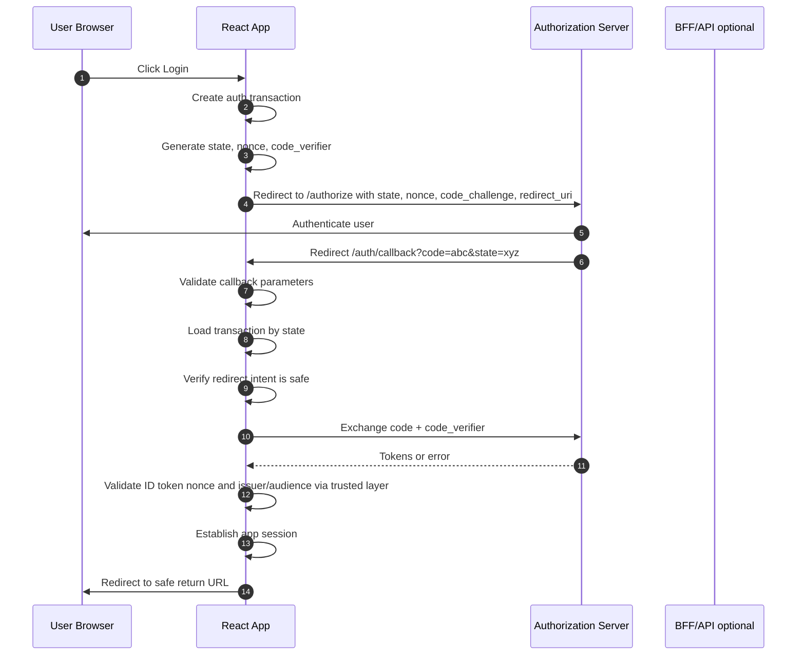
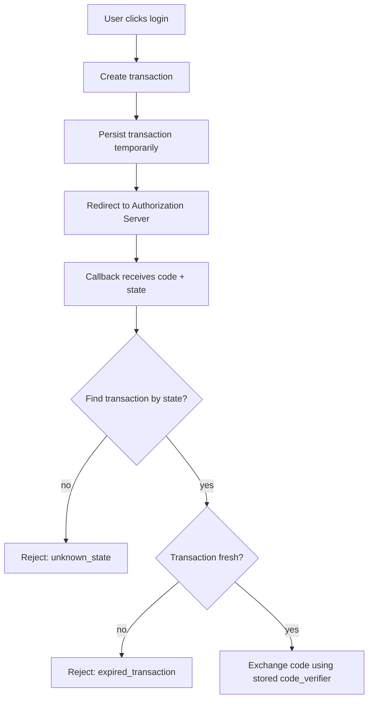
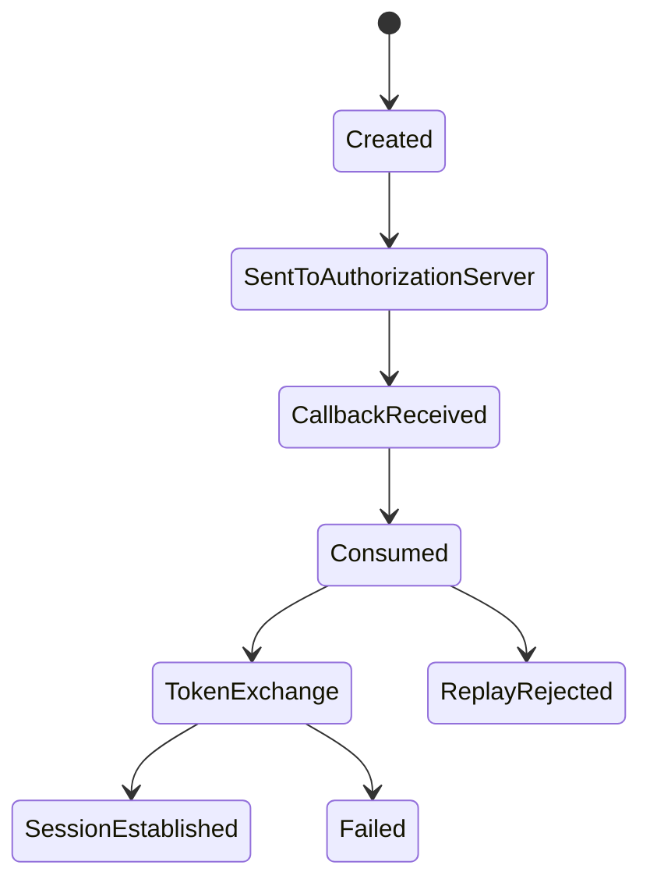
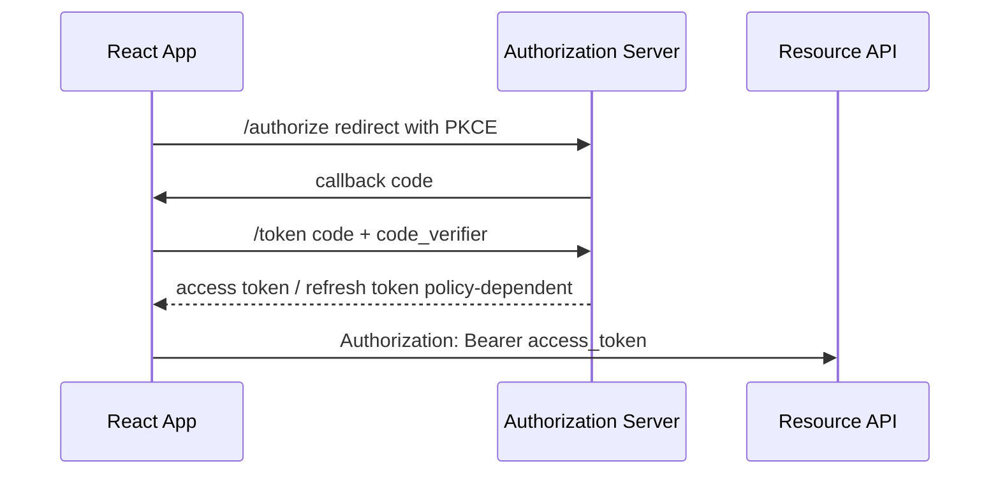
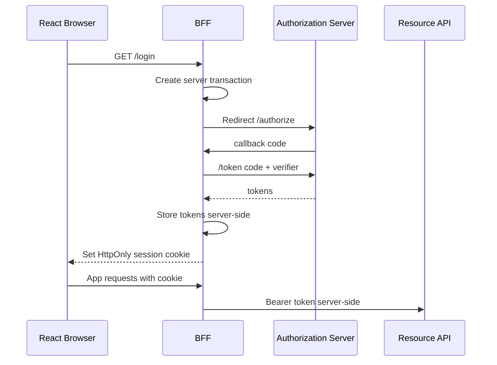

# Part 025 — Callback Route Hardening

OAuth/OIDC callback route terlihat seperti route kecil:

```txt
/auth/callback?code=...&state=...
```

Tetapi dari sudut security, route ini adalah salah satu boundary paling sensitif di seluruh React app.

Callback route menerima hasil redirect dari Authorization Server. Di titik ini aplikasi harus menjawab beberapa pertanyaan dengan presisi:

```txt
Apakah response ini berasal dari login flow yang memang kita mulai?
Apakah response ini ditujukan untuk client dan redirect URI yang benar?
Apakah authorization code ini masih fresh dan belum pernah dipakai?
Apakah nonce pada ID token cocok dengan request awal?
Apakah return URL aman dan internal?
Apakah error dari IdP bisa dipulihkan tanpa redirect loop?
```

Kalau callback route longgar, serangan tidak selalu terlihat seperti XSS atau SQL injection. Sering bentuknya lebih halus:

- login CSRF;
- authorization code injection;
- open redirect;
- redirect URI manipulation;
- token substitution;
- stale transaction reuse;
- identity/session confusion;
- return URL poisoning;
- callback replay;
- silent redirect loop.

Callback route bukan halaman UI biasa.

Callback route adalah **protocol boundary**.

---

## 1. Mental model

Authorization Code with PKCE punya dua sisi:

```txt
Outbound authorization request
Inbound authorization response
```

Outbound side membuat transaction.

Inbound side harus membuktikan bahwa response yang datang benar-benar pasangan transaction tersebut.



The callback must be boring.

A secure callback does not “try to be helpful”. It rejects ambiguity.

---

## 2. What the callback receives

A successful authorization response commonly includes:

```txt
code=<authorization_code>
state=<opaque_client_state>
```

An error response can include:

```txt
error=access_denied
error_description=...
state=<opaque_client_state>
```

Depending on provider and response mode, parameters may arrive in query, form POST, or fragment. For Authorization Code flow, avoid fragment-based handling for the code path. Code flow normally returns parameters through the query component or form post depending on configuration.

React engineers must not parse callback parameters casually.

Bad:

```ts
const code = new URLSearchParams(location.search).get('code')!;
const state = new URLSearchParams(location.search).get('state')!;
await exchange(code, state);
```

Better:

```ts
type CallbackParams =
  | { kind: 'success'; code: string; state: string }
  | { kind: 'oauth_error'; error: string; errorDescription?: string; state?: string }
  | { kind: 'invalid'; reason: string };

function parseCallbackUrl(url: URL): CallbackParams {
  const params = url.searchParams;

  const code = params.get('code');
  const state = params.get('state');
  const error = params.get('error');
  const errorDescription = params.get('error_description') ?? undefined;

  if (error) {
    return { kind: 'oauth_error', error, errorDescription, state: state ?? undefined };
  }

  if (!code) return { kind: 'invalid', reason: 'missing_code' };
  if (!state) return { kind: 'invalid', reason: 'missing_state' };

  return { kind: 'success', code, state };
}
```

The parser should preserve error structure. Do not collapse everything into `login failed` too early. Auth recovery depends on failure class.

---

## 3. The auth transaction

Callback hardening starts before redirect.

When the app initiates login, it must create a short-lived auth transaction.

```ts
type AuthTransaction = {
  state: string;
  nonce: string;
  codeVerifier: string;
  codeChallenge: string;
  redirectUri: string;
  clientId: string;
  issuer: string;
  createdAt: number;
  expiresAt: number;
  returnTo: string;
  requestedScopes: string[];
  tenantHint?: string;
  prompt?: 'login' | 'none' | 'consent' | 'select_account';
};
```

This transaction is the callback's evidence.

Without it, the callback is blind.



Transaction storage should be temporary and scoped.

Common options:

| Storage | Good for | Risk |
|---|---|---|
| memory | same-tab login continuation | lost after reload/redirect in some setups |
| `sessionStorage` | login transaction across redirect in same tab | accessible to JS if XSS exists |
| server-side transaction store/BFF | strongest for confidential/BFF flow | operational state needed |
| short-lived encrypted/signed cookie | redirect survival with server validation | cookie scope/CSRF considerations |

For browser-only SPA, transaction state is often kept in `sessionStorage` because the page unloads during redirect. For BFF, prefer server-side transaction storage bound to a secure cookie.

The important part is not the specific storage API.

The important part is: **callback must not accept a response without a matching transaction.**

---

## 4. `state` is not a return URL

Many broken auth systems use `state` like this:

```txt
state=/admin/users
```

That is wrong.

`state` should be an unguessable correlation value. It can point to transaction data, but it should not be treated as a raw return URL.

Better:

```txt
state=random_256_bit_value
transaction[state].returnTo = /admin/users
```

Bad:

```ts
const state = new URLSearchParams(location.search).get('state');
navigate(state ?? '/');
```

This turns `state` into an open redirect primitive if an attacker can inject or influence it.

Better:

```ts
const transaction = await transactionStore.consume(state);
const returnTo = sanitizeInternalReturnTo(transaction.returnTo);
navigate(returnTo, { replace: true });
```

`state` has two jobs:

```txt
1. Correlate authorization response with request.
2. Protect against CSRF-style unsolicited authorization responses.
```

It is not the navigation destination.

---

## 5. `nonce` binds ID token to the request

In OIDC, `nonce` protects the client from accepting an ID token that is not tied to the authentication request it initiated.

A simplified request:

```txt
GET /authorize?
  response_type=code&
  client_id=react-client&
  redirect_uri=https%3A%2F%2Fapp.example.com%2Fauth%2Fcallback&
  scope=openid%20profile%20email&
  state=s_abc&
  nonce=n_xyz&
  code_challenge=...&
  code_challenge_method=S256
```

Later, after code exchange, ID token must include the expected nonce:

```json
{
  "iss": "https://idp.example.com/",
  "sub": "user_123",
  "aud": "react-client",
  "exp": 1790000000,
  "iat": 1789996400,
  "nonce": "n_xyz"
}
```

React app code should not treat nonce validation as optional decoration.

```ts
function assertNonce(idTokenClaims: { nonce?: string }, expectedNonce: string) {
  if (!idTokenClaims.nonce || idTokenClaims.nonce !== expectedNonce) {
    throw new AuthProtocolError('nonce_mismatch');
  }
}
```

In a BFF architecture, ID token validation should happen server-side. The browser gets an application session projection, not raw token validation responsibility.

---

## 6. PKCE transaction binding

PKCE binds the authorization code exchange to the client instance that started the request.

The app generates:

```txt
code_verifier  -> high-entropy secret kept by client
code_challenge -> derived value sent in authorization request
```

At token exchange:

```txt
POST /token
  grant_type=authorization_code
  code=...
  redirect_uri=...
  client_id=...
  code_verifier=original_verifier
```

The Authorization Server checks that the verifier matches the original challenge.

From React's perspective, the callback must recover the exact `code_verifier` from the auth transaction associated with `state`.

Bad:

```ts
const codeVerifier = localStorage.getItem('latest_code_verifier');
```

This is race-prone if multiple login attempts happen.

Better:

```ts
const transaction = await transactionStore.consume(state);
await tokenEndpoint.exchange({
  code,
  codeVerifier: transaction.codeVerifier,
  redirectUri: transaction.redirectUri,
});
```

Bind everything by transaction.

Do not use global mutable `latestLogin` state for protocol artifacts.

---

## 7. Redirect URI exactness

Redirect URI must be boringly exact.

Bad mindset:

```txt
Any URL under app.example.com is fine.
```

Better mindset:

```txt
Only the registered callback URI is valid.
```

For example:

```txt
https://app.example.com/auth/callback
```

Avoid accepting variants without clear reason:

```txt
https://app.example.com/auth/callback/
https://app.example.com/auth/callback?returnTo=/admin
https://app.example.com/anything?next=/auth/callback
https://app.example.com/redirect?url=/auth/callback
```

React apps often have client-side routes. That does not mean callback route should be flexible.

If you need environment-specific redirect URIs, register each exact environment:

```txt
https://app.example.com/auth/callback
https://staging-app.example.com/auth/callback
http://localhost:5173/auth/callback
```

Do not let user input decide callback URI.

---

## 8. Open redirect defense

Open redirect is not just a phishing issue in OAuth.

In OAuth/OIDC, open redirect can help attackers exfiltrate authorization codes or tokens by bouncing through a trusted domain.

Bad:

```ts
app.get('/redirect', (req, res) => {
  res.redirect(String(req.query.url));
});
```

Bad React equivalent:

```ts
const next = new URLSearchParams(location.search).get('next');
window.location.assign(next ?? '/');
```

Safe return URL handling should be intentionally narrow.

```ts
type SafeReturnTo = string & { readonly brand: unique symbol };

function sanitizeInternalReturnTo(input: unknown): SafeReturnTo {
  if (typeof input !== 'string') return '/' as SafeReturnTo;

  // Reject absolute URLs and protocol-relative URLs.
  if (/^[a-zA-Z][a-zA-Z0-9+.-]*:/.test(input)) return '/' as SafeReturnTo;
  if (input.startsWith('//')) return '/' as SafeReturnTo;

  // Require app-internal absolute path.
  if (!input.startsWith('/')) return '/' as SafeReturnTo;

  // Avoid callback/login/logout loops.
  const blockedPrefixes = ['/auth/callback', '/login', '/logout'];
  if (blockedPrefixes.some((prefix) => input.startsWith(prefix))) {
    return '/' as SafeReturnTo;
  }

  return input as SafeReturnTo;
}
```

This approach rejects:

```txt
https://evil.example.com
//evil.example.com
javascript:alert(1)
/auth/callback?code=...
/login?returnTo=/login
```

And accepts:

```txt
/cases/123
/admin/users?tab=active
/org/acme/projects
```

Return URL validation should be centralized. Do not repeat ad-hoc checks across login, callback, logout, invitation, and access-request flows.

---

## 9. Callback must consume transaction once

A callback transaction should be single-use.

Bad:

```ts
const tx = transactionStore.get(state);
// Exchange code.
// Leave tx in storage.
```

Better:

```ts
const tx = await transactionStore.consume(state);
```

`consume()` should remove the transaction before or atomically during processing.

Why?

Because callback replay must not produce unpredictable side effects.



In browser storage, atomicity is limited. You can still approximate safe semantics:

```ts
class SessionStorageTransactionStore {
  private prefix = 'auth.tx.';

  create(tx: AuthTransaction): void {
    sessionStorage.setItem(this.prefix + tx.state, JSON.stringify(tx));
  }

  consume(state: string): AuthTransaction | null {
    const key = this.prefix + state;
    const raw = sessionStorage.getItem(key);
    if (!raw) return null;
    sessionStorage.removeItem(key);
    return JSON.parse(raw) as AuthTransaction;
  }
}
```

For BFF/server-side flows, use database/cache atomic delete or transaction semantics.

---

## 10. Expire transactions aggressively

Auth transactions are short-lived.

A reasonable default is minutes, not hours.

```ts
const TRANSACTION_TTL_MS = 5 * 60 * 1000;

function createTransaction(): AuthTransaction {
  const now = Date.now();

  return {
    state: randomBase64Url(32),
    nonce: randomBase64Url(32),
    codeVerifier: randomBase64Url(64),
    codeChallenge: '',
    redirectUri: `${window.location.origin}/auth/callback`,
    clientId: 'react-client',
    issuer: 'https://idp.example.com/',
    requestedScopes: ['openid', 'profile', 'email'],
    createdAt: now,
    expiresAt: now + TRANSACTION_TTL_MS,
    returnTo: sanitizeInternalReturnTo(window.location.pathname + window.location.search),
  };
}
```

Validation:

```ts
function assertTransactionFresh(tx: AuthTransaction, now = Date.now()) {
  if (now > tx.expiresAt) {
    throw new AuthProtocolError('expired_auth_transaction');
  }
}
```

Expired transaction behavior should be deterministic:

```txt
show recoverable login error -> clear transaction residue -> restart login if user chooses
```

Do not silently restart login from callback on every failure. That creates redirect loops.

---

## 11. Callback error handling

OAuth errors are not all equal.

Examples:

| Error | Meaning | UX |
|---|---|---|
| `access_denied` | user denied consent or IdP policy denied login | show recoverable message |
| `login_required` | silent login failed | interactive login option |
| `interaction_required` | user interaction needed | redirect to login with prompt |
| `temporarily_unavailable` | AS unavailable | retry later, do not loop |
| `invalid_request` | malformed request | log protocol bug |

React callback should distinguish user-cancelled, provider failure, protocol failure, and security rejection.

```ts
type CallbackFailureKind =
  | 'user_cancelled'
  | 'interaction_required'
  | 'provider_unavailable'
  | 'protocol_error'
  | 'security_rejection'
  | 'unknown';

function classifyOAuthError(error: string): CallbackFailureKind {
  switch (error) {
    case 'access_denied':
      return 'user_cancelled';
    case 'login_required':
    case 'interaction_required':
      return 'interaction_required';
    case 'temporarily_unavailable':
    case 'server_error':
      return 'provider_unavailable';
    case 'invalid_request':
    case 'invalid_scope':
    case 'unauthorized_client':
      return 'protocol_error';
    default:
      return 'unknown';
  }
}
```

Avoid logging raw callback URL because it may contain authorization code.

Bad:

```ts
logger.error('callback failed', { url: window.location.href });
```

Better:

```ts
logger.warn('oauth_callback_failed', {
  kind,
  hasState: Boolean(state),
  error,
  correlationId,
});
```

---

## 12. Code exchange: browser vs BFF

There are two common designs.

### Browser-only exchange



The browser receives tokens. This means XSS impact is more severe, and refresh token handling must follow browser-based OAuth guidance.

### BFF exchange



The browser receives an app session cookie, not OAuth tokens. This usually reduces token exposure but increases BFF operational responsibility.

Callback hardening applies to both. Only the storage and exchange location differ.

---

## 13. Callback handler shape in React Router Data Mode

A callback route should be handled before sensitive UI renders.

Example route:

```tsx
import { redirect, type LoaderFunctionArgs } from 'react-router';

export async function oauthCallbackLoader({ request }: LoaderFunctionArgs) {
  const url = new URL(request.url);
  const parsed = parseCallbackUrl(url);

  if (parsed.kind === 'invalid') {
    throw new Response('Invalid OAuth callback', { status: 400 });
  }

  if (parsed.kind === 'oauth_error') {
    return redirect(
      `/login/error?kind=${encodeURIComponent(classifyOAuthError(parsed.error))}`,
    );
  }

  const result = await authClient.completeRedirectCallback({
    code: parsed.code,
    state: parsed.state,
  });

  return redirect(result.returnTo);
}
```

The callback component can be minimal:

```tsx
export function OAuthCallbackPage() {
  return (
    <main aria-live="polite">
      <h1>Completing sign in…</h1>
      <p>Please wait while we finish your session.</p>
    </main>
  );
}
```

The important work is in the loader/action or BFF endpoint, not in `useEffect` after rendering.

Bad:

```tsx
function Callback() {
  useEffect(() => {
    completeCallback(window.location.href);
  }, []);

  return <Spinner />;
}
```

Why bad?

- work runs after render;
- can run twice in React Strict Mode development;
- errors become client-side UI state instead of route failure;
- sensitive code may remain longer in URL;
- route might flash app shell before auth is established.

---

## 14. Clean the URL

After callback processing, remove `code` and `state` from the visible URL.

With loader redirect:

```txt
/auth/callback?code=...&state=... -> /original/page
```

With client-side processing:

```ts
window.history.replaceState(null, '', '/auth/callback/complete');
```

Do this only after you have captured the parameters.

Never leave authorization code in browser history longer than necessary.

Also avoid analytics capture on callback route.

```txt
Do not send full callback URL to analytics, error tracker, session replay, or referrer logs.
```

For callback route, analytics should either be disabled or event-only:

```ts
analytics.track('oauth_callback_started', {
  provider: 'workos',
  hasCode: true,
  hasState: true,
});
```

No raw `code`. No raw `state`. No full URL.

---

## 15. Callback route and Content Security Policy

Callback route should be boring HTML.

Avoid third-party scripts on callback route.

Avoid loading marketing tags, session replay, A/B testing, chat widgets, or analytics with full URL visibility.

Reason:

```txt
callback URL may temporarily contain security-sensitive protocol artifacts
```

A good production setup can use stricter policy for auth routes:

```txt
/auth/* -> no third-party scripts, no session replay, no external embeds
/app/*  -> normal application CSP
```

If route-specific CSP is not practical in SPA hosting, disable third-party initialization when path starts with `/auth/callback`.

```ts
const isAuthProtocolRoute = window.location.pathname.startsWith('/auth/');

if (!isAuthProtocolRoute) {
  startAnalytics();
  startSessionReplay();
}
```

---

## 16. Multi-login race

Users can start multiple login attempts:

```txt
Tab A: login with Google
Tab B: login with enterprise SSO
Tab A callback returns later
```

If app stores only one global transaction, callbacks can cross wires.

Bad:

```txt
sessionStorage.currentAuthTransaction = {...}
```

Better:

```txt
sessionStorage.auth.tx.<stateA> = {...}
sessionStorage.auth.tx.<stateB> = {...}
```

Each callback must select transaction by `state`.

Then decide policy:

| Situation | Policy |
|---|---|
| same tab repeated login | latest may replace older transaction if explicit |
| different tabs login same provider | allow independent transactions |
| callback for consumed state | reject replay |
| callback for expired state | show recoverable expired login |
| callback while already authenticated | resolve with explicit policy, not accidental overwrite |

Already-authenticated callback requires care.

```txt
If current session user != callback user, do not silently switch identity without clear intent.
```

This is how identity confusion enters enterprise apps.

---

## 17. Tenant-aware callback

Enterprise SaaS login often depends on tenant/org.

Examples:

```txt
/acme/login
/login?org=acme
sso.acme.example.com
```

Never trust tenant from callback URL alone.

Transaction should remember tenant intent:

```ts
type AuthTransaction = {
  state: string;
  tenantHint?: string;
  issuer: string;
  returnTo: string;
  // ...
};
```

After token exchange/session establishment, verify membership server-side:

```txt
Authenticated identity user_123 belongs to tenant acme?
Session tenant = tenant from verified membership, not just URL hint.
```

Tenant hint can route user to the right IdP.

Tenant hint is not authorization.

---

## 18. Callback and invitation flows

Invitation links commonly combine identity and navigation:

```txt
/invite/accept?token=invite_abc
```

If user is unauthenticated, app redirects to login and returns after callback.

Bad transaction return value:

```txt
returnTo=https://app.example.com/invite/accept?token=invite_abc
```

Better:

```txt
returnTo=/invite/accept?token_ref=server_ref_or_nonce
```

Invitation token may be sensitive. Avoid storing long-lived invite token directly in `state`, analytics, or broad storage.

Safer shape:

```txt
1. User opens invite link.
2. Server stores invite intent under short-lived nonce.
3. Auth transaction stores returnTo=/invite/continue?intent=<nonce>.
4. Callback completes login.
5. App continues invite using nonce.
6. Server validates invite token and authenticated user.
```

This is not always necessary for low-risk invites, but regulated workflows should separate auth protocol state from business tokens.

---

## 19. Callback handler implementation skeleton

Below is a browser-side skeleton. In production, you may move token exchange and validation into BFF.

```ts
class AuthProtocolError extends Error {
  constructor(public code: string) {
    super(code);
  }
}

type CompleteCallbackInput = {
  code: string;
  state: string;
};

type CompleteCallbackResult = {
  returnTo: string;
};

class OAuthCallbackService {
  constructor(
    private readonly txStore: TransactionStore,
    private readonly tokenClient: TokenClient,
    private readonly session: SessionClient,
  ) {}

  async complete(input: CompleteCallbackInput): Promise<CompleteCallbackResult> {
    const tx = this.txStore.consume(input.state);

    if (!tx) {
      throw new AuthProtocolError('unknown_or_replayed_state');
    }

    assertTransactionFresh(tx);

    const tokenResponse = await this.tokenClient.exchangeAuthorizationCode({
      code: input.code,
      codeVerifier: tx.codeVerifier,
      redirectUri: tx.redirectUri,
    });

    if (tokenResponse.idTokenClaims) {
      assertNonce(tokenResponse.idTokenClaims, tx.nonce);
    }

    await this.session.establish(tokenResponse);

    return {
      returnTo: sanitizeInternalReturnTo(tx.returnTo),
    };
  }
}
```

Notice what this service does not do:

- it does not trust callback `state` as return URL;
- it does not use global `latestCodeVerifier`;
- it does not ignore nonce;
- it does not leave transaction reusable;
- it does not log raw token/callback URL;
- it does not silently redirect to arbitrary URL.

---

## 20. BFF callback endpoint skeleton

For BFF:

```ts
app.get('/auth/callback', async (req, res) => {
  const parsed = parseCallbackRequest(req);

  if (parsed.kind === 'invalid') {
    return res.status(400).send('Invalid callback');
  }

  if (parsed.kind === 'oauth_error') {
    return res.redirect(`/login/error?kind=${classifyOAuthError(parsed.error)}`);
  }

  const tx = await authTransactionStore.consume(parsed.state);
  if (!tx) {
    return res.status(400).send('Unknown or replayed login state');
  }

  if (Date.now() > tx.expiresAt) {
    return res.redirect('/login/error?kind=expired_login');
  }

  const tokens = await oidcClient.exchangeCode({
    code: parsed.code,
    codeVerifier: tx.codeVerifier,
    redirectUri: tx.redirectUri,
  });

  await oidcClient.validateIdToken(tokens.idToken, {
    expectedNonce: tx.nonce,
    expectedAudience: tx.clientId,
    expectedIssuer: tx.issuer,
  });

  const appSession = await sessionService.createFromTokens(tokens, {
    tenantHint: tx.tenantHint,
  });

  res.cookie('__Host-app_session', appSession.id, {
    httpOnly: true,
    secure: true,
    sameSite: 'lax',
    path: '/',
  });

  res.redirect(sanitizeInternalReturnTo(tx.returnTo));
});
```

BFF makes callback hardening easier because:

- transaction can be server-side;
- token exchange happens outside browser JS;
- tokens can be stored server-side;
- browser receives only application cookie/session projection.

But BFF does not remove need for strict redirect validation.

---

## 21. Callback route UX

Callback page should avoid complex UI.

Recommended states:

```txt
Completing sign in...
Sign in could not be completed.
Your login link expired. Please try again.
You cancelled sign in.
```

Avoid:

```txt
JWT validation failed: nonce mismatch for aud react-client-prod
```

Security-sensitive errors should be useful to engineers through logs, not to attackers through UI.

UX copy should be calm, deterministic, and action-oriented.

```tsx
export function LoginExpired() {
  return (
    <main>
      <h1>Sign in expired</h1>
      <p>Your sign-in attempt took too long or was already used.</p>
      <a href="/login">Start sign in again</a>
    </main>
  );
}
```

---

## 22. Callback observability

You need metrics around callback behavior.

Useful events:

```txt
auth.callback.started
auth.callback.missing_state
auth.callback.unknown_state
auth.callback.expired_transaction
auth.callback.oauth_error
auth.callback.token_exchange_failed
auth.callback.nonce_mismatch
auth.callback.success
auth.callback.return_url_rejected
```

Never attach:

```txt
raw code
raw token
raw callback URL
full state value if state is sensitive
```

Safe dimensions:

```txt
provider
client_id hash/environment
error class
has_state boolean
has_code boolean
transaction_age_bucket
return_to_class: internal/blocked/root
correlation_id
```

The goal is to detect protocol health without creating credential leakage.

---

## 23. Common anti-patterns

### Anti-pattern 1: using callback `state` as destination

```ts
navigate(new URLSearchParams(location.search).get('state') ?? '/');
```

Consequence: open redirect and session confusion.

### Anti-pattern 2: no state validation

```ts
await exchange(code);
```

Consequence: unsolicited authorization responses can be accepted.

### Anti-pattern 3: global PKCE verifier

```ts
localStorage.setItem('code_verifier', verifier);
```

Consequence: multi-login race and verifier confusion.

### Anti-pattern 4: callback processing in `useEffect`

```tsx
useEffect(() => completeCallback(), []);
```

Consequence: duplicate execution, delayed failure, rendered app shell before auth boundary.

### Anti-pattern 5: full URL logging

```ts
captureException(error, { url: location.href });
```

Consequence: authorization code leaks to logs/analytics.

### Anti-pattern 6: accepting arbitrary return URL

```ts
window.location.href = params.get('returnTo') ?? '/';
```

Consequence: open redirect.

### Anti-pattern 7: silent identity switch

```txt
Already logged in as Alice, callback establishes session as Bob without explicit transition.
```

Consequence: user confusion and audit ambiguity.

---

## 24. Checklist

Callback route hardening checklist:

```txt
[ ] Callback route is registered as exact redirect URI.
[ ] Authorization request includes high-entropy state.
[ ] OIDC request includes nonce.
[ ] PKCE uses S256.
[ ] Transaction is keyed by state, not global latest login.
[ ] Transaction stores code_verifier, nonce, returnTo, redirectUri, issuer, clientId.
[ ] Transaction expires quickly.
[ ] Transaction is consumed once.
[ ] Unknown/replayed state is rejected.
[ ] Expired transaction is rejected deterministically.
[ ] Callback parser handles success and OAuth error response separately.
[ ] ID token nonce is verified by trusted layer.
[ ] Return URL is internal-only and sanitized.
[ ] Auth callback URL is not logged.
[ ] Analytics/session replay are disabled or sanitized on callback route.
[ ] Callback clears code/state from visible URL via redirect/replace.
[ ] Multi-tab/multiple login attempts are safe.
[ ] Already-authenticated callback has explicit policy.
[ ] Tenant hint is verified server-side before tenant session is established.
[ ] Errors map to typed, recoverable UX.
```

---

## 25. Design review questions

Ask these before approving OAuth/OIDC callback implementation:

```txt
What is the exact registered redirect URI per environment?
Where is auth transaction stored?
How is transaction keyed?
How long can transaction live?
Is state opaque and unguessable?
Is nonce used and verified?
Where does token exchange happen?
Does the browser ever receive refresh token?
How is returnTo validated?
Can returnTo point to another origin?
What happens if callback is replayed?
What happens if user starts login in two tabs?
What happens if callback returns after user logs out?
What data reaches logs, analytics, Sentry, or session replay?
Can callback route render sensitive app shell before auth completes?
```

If the answer is “the SDK handles it”, still verify the observable behavior. SDKs reduce implementation burden. They do not remove architecture responsibility.

---

## 26. Minimal invariant set

For a production React app, the callback route must preserve these invariants:

```txt
Invariant 1: No callback response is accepted without matching state.
Invariant 2: No ID token is accepted without expected nonce.
Invariant 3: No authorization code is exchanged without the transaction's code_verifier.
Invariant 4: No return URL from untrusted input can escape the app origin.
Invariant 5: No callback transaction can be used twice.
Invariant 6: No raw protocol artifact is logged or sent to analytics.
Invariant 7: No identity switch occurs implicitly without explicit transition policy.
```

If you remember only one thing from this part:

```txt
OAuth callback is not a page.
It is the point where your app proves that the browser response belongs to a login transaction it initiated.
```

---

## References

- RFC 9700 — Best Current Practice for OAuth 2.0 Security: https://datatracker.ietf.org/doc/html/rfc9700
- RFC 7636 — Proof Key for Code Exchange by OAuth Public Clients: https://datatracker.ietf.org/doc/html/rfc7636
- RFC 6749 — The OAuth 2.0 Authorization Framework: https://datatracker.ietf.org/doc/html/rfc6749
- OpenID Connect Core 1.0: https://openid.net/specs/openid-connect-core-1_0.html
- OWASP OAuth2 Cheat Sheet: https://cheatsheetseries.owasp.org/cheatsheets/OAuth2_Cheat_Sheet.html
- OWASP Unvalidated Redirects and Forwards Cheat Sheet: https://cheatsheetseries.owasp.org/cheatsheets/Unvalidated_Redirects_and_Forwards_Cheat_Sheet.html
