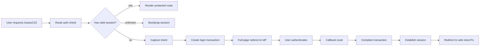
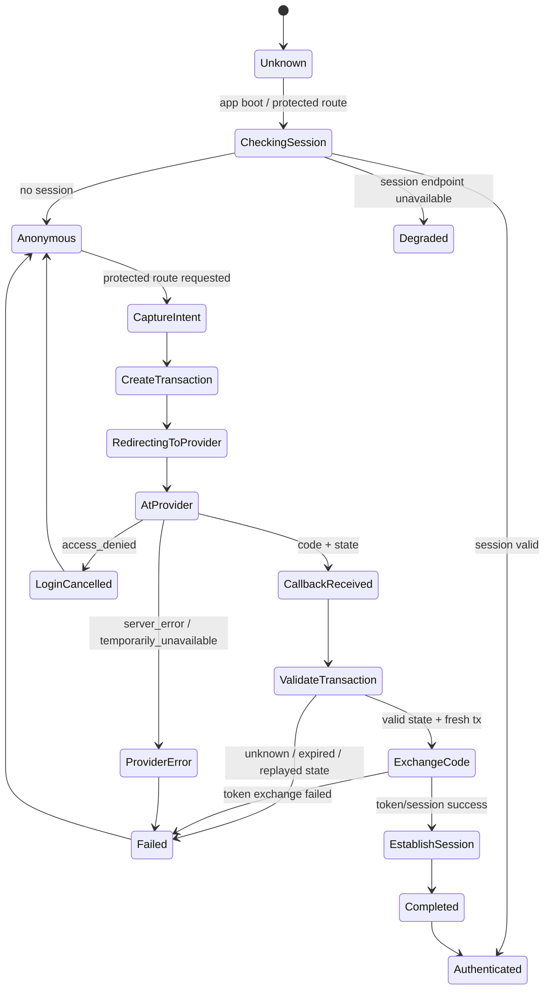
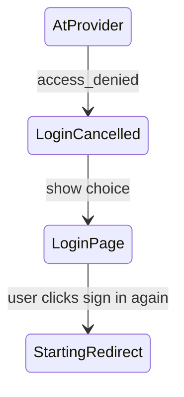
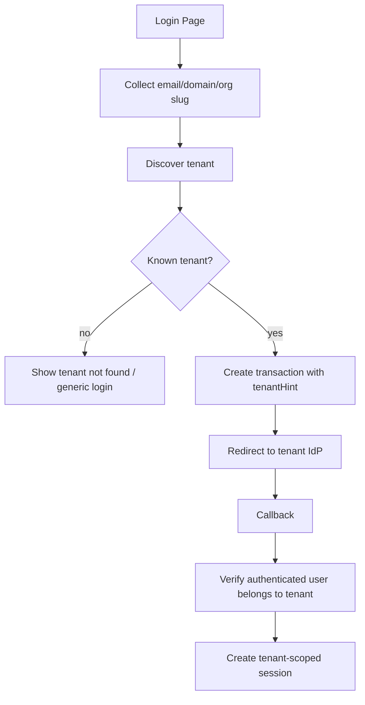
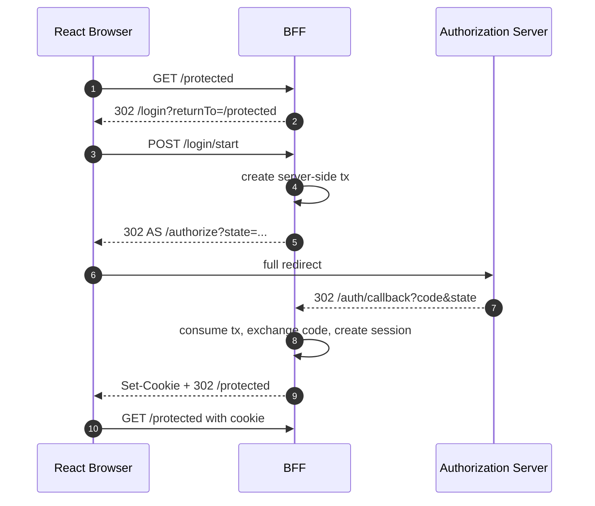

# Part 026 — Login Redirect State Machine

Login redirect looks simple:

```txt
If unauthenticated -> redirect to /login -> IdP -> callback -> original page
```

In production, that sentence hides a state machine.

If you do not model it, bugs appear as:

- redirect loops;
- lost deep link;
- user returns to wrong tenant;
- callback succeeds but app shell still says anonymous;
- refresh race starts login while session is being restored;
- user cancels IdP login and app immediately redirects back to IdP;
- stale `returnTo` sends user to `/auth/callback` or external URL;
- two tabs fight over session state;
- step-up authentication overwrites normal login flow;
- IdP outage causes infinite navigation churn.

The fix is not another `if (!user) navigate('/login')`.

The fix is to treat login redirect as a deterministic state machine.

---

## 1. The redirect problem

A React app has at least four navigation worlds:

```txt
1. User navigation inside app.
2. Client router navigation.
3. Full-page browser redirect to Authorization Server.
4. Full-page browser redirect back to callback route.
```

Auth redirect crosses all four.



The app must preserve user intent across a hostile boundary:

```txt
browser -> IdP -> browser -> app
```

That intent must be preserved without trusting arbitrary URL parameters.

---

## 2. States, not booleans

Bad auth redirect code usually starts with booleans:

```ts
if (!user) navigate('/login');
```

But login flow has more than authenticated/unauthenticated.

Use states:

```ts
type LoginFlowState =
  | { kind: 'idle' }
  | { kind: 'checking_session' }
  | { kind: 'needs_login'; returnTo: string; reason: 'no_session' | 'expired' }
  | { kind: 'starting_redirect'; transactionId: string }
  | { kind: 'at_provider'; transactionId: string }
  | { kind: 'handling_callback'; state: string }
  | { kind: 'establishing_session' }
  | { kind: 'completed'; returnTo: string }
  | { kind: 'cancelled' }
  | { kind: 'failed'; reason: LoginFailureReason };

type LoginFailureReason =
  | 'unknown_state'
  | 'expired_transaction'
  | 'oauth_error'
  | 'token_exchange_failed'
  | 'nonce_mismatch'
  | 'provider_unavailable'
  | 'unsafe_return_url'
  | 'redirect_loop_detected';
```

A state machine prevents accidental transitions.

```txt
checking_session -> needs_login -> starting_redirect -> at_provider -> handling_callback -> establishing_session -> completed
```

Not:

```txt
callback -> login -> callback -> login -> callback
```

---

## 3. Canonical state diagram



Each arrow should be intentional.

The biggest improvement in React auth design is often removing implicit transitions.

---

## 4. Pre-login intent

Pre-login intent answers:

```txt
Where was the user trying to go?
What action were they trying to perform?
What tenant/org context were they in?
Was this normal login or step-up auth?
```

Simple intent:

```ts
type LoginIntent = {
  kind: 'route';
  returnTo: string;
  createdAt: number;
};
```

Richer intent:

```ts
type LoginIntent = {
  kind: 'route' | 'step_up' | 'invite' | 'tenant_sso';
  returnTo: string;
  tenantHint?: string;
  requiredAcr?: string;
  requiredAction?: string;
  resourceRef?: string;
  createdAt: number;
  expiresAt: number;
};
```

Do not store sensitive business payload in intent if it will live in browser storage.

Good:

```txt
returnTo=/cases/123?tab=timeline
requiredAction=case.approve
resourceRef=case:123
```

Risky:

```txt
returnTo=/cases/123?draftDecision=full-confidential-content
```

Intent should describe continuation, not carry sensitive operation payload.

---

## 5. Return URL rules

A return URL is untrusted until normalized and validated.

Rules:

```txt
1. Must be an app-internal absolute path.
2. Must not be absolute external URL.
3. Must not be protocol-relative URL.
4. Must not target auth protocol routes.
5. Must not create login/logout/callback loop.
6. Should be length-limited.
7. Should be normalized before comparison.
```

Implementation:

```ts
type ReturnTo = string & { readonly brand: unique symbol };

const DEFAULT_RETURN_TO = '/' as ReturnTo;

function safeReturnTo(input: unknown): ReturnTo {
  if (typeof input !== 'string') return DEFAULT_RETURN_TO;
  if (input.length > 2048) return DEFAULT_RETURN_TO;

  const value = input.trim();

  if (!value.startsWith('/')) return DEFAULT_RETURN_TO;
  if (value.startsWith('//')) return DEFAULT_RETURN_TO;
  if (/^[a-zA-Z][a-zA-Z0-9+.-]*:/.test(value)) return DEFAULT_RETURN_TO;

  const blocked = [
    '/auth/callback',
    '/auth/logout',
    '/login',
    '/logout',
  ];

  if (blocked.some((prefix) => value === prefix || value.startsWith(`${prefix}?`))) {
    return DEFAULT_RETURN_TO;
  }

  return value as ReturnTo;
}
```

For high-risk apps, use route-name references instead of raw paths:

```ts
type RouteIntent =
  | { route: 'case_detail'; params: { caseId: string }; search?: { tab?: string } }
  | { route: 'project_dashboard'; params: { projectId: string } }
  | { route: 'home' };
```

Route references are less flexible but easier to validate.

---

## 6. Where to store intent

Options:

| Storage | Strength | Weakness |
|---|---|---|
| memory | low persistence, simple | lost across full redirect unless BFF controls flow |
| `sessionStorage` | survives redirect in same tab | readable by JS under XSS |
| short-lived server-side transaction | strong | requires BFF/state store |
| signed/encrypted cookie | survives redirect | careful cookie scope needed |
| URL param | easy | dangerous if used as authority |

For SPA:

```txt
Store opaque transaction by state in sessionStorage.
Store returnTo inside transaction after validation.
```

For BFF:

```txt
Store transaction server-side.
Bind it to a secure HttpOnly transaction cookie.
```

The anti-pattern is storing return URL as naked public authority:

```txt
/login?returnTo=https://evil.example.com
```

Even if you sanitize later, this tends to spread through codebase.

---

## 7. Route-level redirect decision

Protected routes should not immediately redirect while session state is unknown.

Bad:

```tsx
function ProtectedRoute({ children }: { children: React.ReactNode }) {
  const { user } = useAuth();

  if (!user) return <Navigate to="/login" replace />;

  return children;
}
```

This conflates:

```txt
unknown session
anonymous session
authenticated session
expired session
failed session bootstrap
```

Better:

```tsx
function ProtectedRoute({ children }: { children: React.ReactNode }) {
  const auth = useAuthState();
  const location = useLocation();

  if (auth.kind === 'unknown' || auth.kind === 'checking') {
    return <AuthBootstrapScreen />;
  }

  if (auth.kind === 'degraded') {
    return <AuthDegradedScreen retry={auth.retry} />;
  }

  if (auth.kind === 'anonymous') {
    return <Navigate to={buildLoginUrl(location)} replace />;
  }

  return children;
}
```

Best for data routers: decide before render.

```ts
export async function protectedLoader({ request }: LoaderFunctionArgs) {
  const session = await auth.getSession(request);

  if (session.kind === 'anonymous') {
    const url = new URL(request.url);
    throw redirect(`/login?returnTo=${encodeURIComponent(url.pathname + url.search)}`);
  }

  if (session.kind === 'degraded') {
    throw new Response('Auth temporarily unavailable', { status: 503 });
  }

  return session;
}
```

Then `/login` validates and stores returnTo inside auth transaction.

---

## 8. Login page should not always start redirect

A login page is not automatically the same as starting OAuth redirect.

Bad:

```tsx
function LoginPage() {
  useEffect(() => {
    startLoginRedirect();
  }, []);

  return null;
}
```

This causes loops and removes user recovery.

Better states:

```txt
/login                    -> show login choices
/login?returnTo=/cases/1  -> show login choices, preserve safe intent
/login/start              -> explicit redirect start action
```

Example:

```tsx
export function LoginPage() {
  const returnTo = safeReturnTo(new URLSearchParams(location.search).get('returnTo'));

  return (
    <main>
      <h1>Sign in</h1>
      <form method="post" action="/login/start">
        <input type="hidden" name="returnTo" value={returnTo} />
        <button type="submit">Continue with SSO</button>
      </form>
    </main>
  );
}
```

Why prefer explicit start?

- user can recover from provider outage;
- `access_denied` does not instantly restart login;
- multiple provider choices are possible;
- tenant/org discovery can happen before redirect;
- analytics can distinguish page view from redirect attempt.

---

## 9. Starting redirect

Start redirect action creates transaction and sends browser to Authorization Server.

```ts
export async function loginStartAction({ request }: ActionFunctionArgs) {
  const form = await request.formData();
  const returnTo = safeReturnTo(form.get('returnTo'));

  const tx = await authTransaction.create({
    returnTo,
    prompt: 'login',
  });

  throw redirect(buildAuthorizeUrl(tx));
}
```

`buildAuthorizeUrl` must be deterministic:

```ts
function buildAuthorizeUrl(tx: AuthTransaction): string {
  const url = new URL(`${tx.issuer}/authorize`);

  url.searchParams.set('response_type', 'code');
  url.searchParams.set('client_id', tx.clientId);
  url.searchParams.set('redirect_uri', tx.redirectUri);
  url.searchParams.set('scope', tx.requestedScopes.join(' '));
  url.searchParams.set('state', tx.state);
  url.searchParams.set('nonce', tx.nonce);
  url.searchParams.set('code_challenge', tx.codeChallenge);
  url.searchParams.set('code_challenge_method', 'S256');

  if (tx.prompt) url.searchParams.set('prompt', tx.prompt);
  if (tx.tenantHint) url.searchParams.set('organization', tx.tenantHint);

  return url.toString();
}
```

Do not let arbitrary query params pass through to Authorization Server.

Bad:

```ts
const authorizeUrl = `${issuer}/authorize?${window.location.search.slice(1)}`;
```

That allows parameter injection.

---

## 10. Loop prevention

Redirect loop examples:

```txt
/protected -> /login -> /auth/callback -> /protected -> /login -> ...
/login -> start redirect -> provider error -> /login -> start redirect -> ...
/callback invalid -> /login?returnTo=/callback -> /callback -> ...
```

Loop prevention needs explicit guardrails.

### Rule 1: never return to auth protocol routes

Already covered by `safeReturnTo`.

### Rule 2: track redirect attempt count per transaction or short window

```ts
type LoginAttemptWindow = {
  firstAttemptAt: number;
  attempts: number;
};

function assertNotRedirectStorm(window: LoginAttemptWindow) {
  const withinOneMinute = Date.now() - window.firstAttemptAt < 60_000;
  if (withinOneMinute && window.attempts >= 3) {
    throw new Error('redirect_loop_detected');
  }
}
```

### Rule 3: provider error does not auto-retry

```txt
provider_unavailable -> show error + retry button
```

Not:

```txt
provider_unavailable -> auto start login again
```

### Rule 4: session bootstrap failure is not anonymous

If `/session` times out, app should not immediately assume anonymous and redirect to login.

```txt
unknown/checking -> degraded
not -> anonymous
```

Otherwise transient backend failure becomes login storm.

---

## 11. Login cancellation

User can cancel at the provider.

A common response is:

```txt
/auth/callback?error=access_denied&state=...
```

This should usually become:

```txt
Login cancelled. You can try again.
```

Not:

```txt
redirect back to /login/start automatically
```

Cancellation is a terminal state until user chooses a new action.



This prevents loops and respects user intent.

---

## 12. Step-up authentication

Step-up authentication is not normal login.

Normal login intent:

```txt
User is anonymous and wants app session.
```

Step-up intent:

```txt
User is already authenticated but needs stronger assurance for sensitive action.
```

Example:

```txt
Approve enforcement action
Export regulated records
Change payment account
Invite admin user
```

State shape:

```ts
type StepUpIntent = {
  kind: 'step_up';
  returnTo: string;
  requiredAction: string;
  resourceRef: string;
  requiredAcr: string;
  createdAt: number;
  expiresAt: number;
};
```

Do not let step-up callback overwrite the base session without verification.

Correct continuation:

```txt
1. User clicks sensitive action.
2. Server says step_up_required with required assurance.
3. App starts step-up OIDC request with prompt/login/acr_values depending provider.
4. Callback verifies nonce/state.
5. Server updates session assurance or records recent authentication.
6. App retries original action or returns to action screen.
```

Do not store mutation payload in browser intent.

For sensitive operations, after step-up, re-check permission server-side.

---

## 13. Tenant and IdP discovery

Enterprise login often starts with tenant discovery:

```txt
User enters email -> app discovers org -> app redirects to correct IdP
```

State machine:



Critical rule:

```txt
Tenant discovery routes the login flow.
It does not authorize tenant access.
```

After callback, server must verify membership and tenant binding.

---

## 14. Already authenticated user hits `/login`

Define policy.

Options:

| Situation | Recommended behavior |
|---|---|
| authenticated user visits `/login` with no returnTo | redirect to home/dashboard |
| authenticated user visits `/login?returnTo=/protected` | redirect to safe returnTo if authorized or show 403 |
| authenticated user clicks “switch account” | explicit logout/switch flow |
| authenticated user needs step-up | start step-up, not normal login |

Implementation:

```ts
export async function loginLoader({ request }: LoaderFunctionArgs) {
  const session = await auth.getSession(request);
  const url = new URL(request.url);
  const returnTo = safeReturnTo(url.searchParams.get('returnTo'));

  if (session.kind === 'authenticated') {
    return redirect(returnTo);
  }

  return { returnTo };
}
```

But for multi-tenant apps, redirect to returnTo should validate tenant context and authorization. Avoid using a logged-in session from tenant A to open tenant B route silently.

---

## 15. Session restore before login redirect

On app boot, session is unknown.

Do not redirect to login until bootstrap resolves.

Bad:

```tsx
const user = auth.user;
if (!user) return <Navigate to="/login" />;
```

Better:

```tsx
switch (auth.kind) {
  case 'unknown':
  case 'checking':
    return <FullPageLoading label="Checking session" />;
  case 'anonymous':
    return <Navigate to={loginUrlFor(location)} replace />;
  case 'authenticated':
    return children;
  case 'degraded':
    return <RetryableAuthOutage />;
}
```

Unknown is not anonymous.

That one distinction prevents many redirect storms.

---

## 16. In-flight requests during login

When login starts, existing API requests may still be running.

Possible bugs:

```txt
API request returns 401 after login transaction starts -> app starts another login.
API request returns data after logout/login switch -> stale data enters new session.
Mutation continues after session expired -> confusing duplicate action.
```

Use abort/cancellation and auth epoch.

```ts
type AuthEpoch = number;

let authEpoch: AuthEpoch = 0;

function bumpAuthEpoch() {
  authEpoch += 1;
}

async function guardedFetch(input: RequestInfo, init?: RequestInit) {
  const epochAtStart = authEpoch;
  const response = await fetch(input, init);

  if (epochAtStart !== authEpoch) {
    throw new Error('auth_epoch_changed');
  }

  return response;
}
```

Bump epoch on:

```txt
login start
callback success
logout
tenant switch
permission refresh
session revoked
```

This prevents stale effects from previous identity/session leaking into the new state.

---

## 17. Multi-tab login coordination

Multi-tab behavior must be explicit.

Examples:

```txt
Tab A starts login.
Tab B is open on protected app.
Tab A completes login.
Tab B should bootstrap or receive session change event.
```

Use BroadcastChannel where available.

```ts
type AuthBroadcastEvent =
  | { type: 'login_started'; txState: string; at: number }
  | { type: 'login_completed'; at: number }
  | { type: 'login_failed'; reason: string; at: number }
  | { type: 'logout_completed'; at: number };

const channel = new BroadcastChannel('auth');

function publishAuthEvent(event: AuthBroadcastEvent) {
  channel.postMessage(event);
}

channel.onmessage = (message) => {
  const event = message.data as AuthBroadcastEvent;

  if (event.type === 'login_completed') {
    queryClient.clear();
    authClient.bootstrapSession();
  }
};
```

Do not share tokens through BroadcastChannel.

Share events only.

```txt
Good: login_completed
Bad: access_token=<token>
```

---

## 18. Cache and query invalidation

Login completion changes data authority.

After login callback success:

```txt
clear anonymous cache
clear previous user cache
bootstrap session projection
load permissions
navigate to returnTo
```

If using TanStack Query:

```ts
async function onLoginCompleted() {
  queryClient.clear();
  authStore.setState({ kind: 'checking' });
  const session = await sessionClient.getSession();
  authStore.setState(session);
}
```

Do not preserve query cache across identity switch unless cache keys include user/session/tenant scope.

Bad cache key:

```ts
['case', caseId]
```

Better:

```ts
['tenant', tenantId, 'user', userId, 'case', caseId]
```

For strict apps, clear all app data cache on login/logout/tenant switch.

---

## 19. BFF login redirect state machine

BFF simplifies some browser complexity.



In BFF, React can still manage UX, but BFF owns protocol correctness.

React responsibilities:

```txt
render login page
send explicit login start action
show callback/transition UI if needed
clear app cache on session change
handle degraded states
avoid leaking sensitive callback URL to client tooling
```

BFF responsibilities:

```txt
transaction store
PKCE verifier
code exchange
token validation
session cookie
return URL validation
logout and revocation
```

---

## 20. Failure taxonomy

Login redirect failure should be typed.

```ts
type LoginRedirectError =
  | { kind: 'unsafe_return_url' }
  | { kind: 'redirect_loop_detected' }
  | { kind: 'provider_error'; providerError: string }
  | { kind: 'user_cancelled' }
  | { kind: 'unknown_state' }
  | { kind: 'expired_transaction' }
  | { kind: 'token_exchange_failed' }
  | { kind: 'session_establishment_failed' }
  | { kind: 'tenant_membership_denied' }
  | { kind: 'step_up_failed' };
```

Map to UX:

| Error | UX |
|---|---|
| unsafe return URL | redirect home, log warning |
| redirect loop | stop auto-login, show recovery |
| provider error | show retry button |
| user cancelled | show login page with message |
| unknown state | show expired/invalid login |
| token exchange failed | show retry or support message |
| tenant denied | show tenant access denied |
| step-up failed | return to action with explanation |

Typed failure is operationally useful.

Generic failure hides auth architecture bugs.

---

## 21. Observability

Track these events:

```txt
auth.login.intent_captured
auth.login.start
auth.login.redirect_to_provider
auth.login.callback_received
auth.login.callback_completed
auth.login.cancelled
auth.login.failed
auth.login.loop_detected
auth.login.return_url_rejected
auth.login.session_established
auth.login.cache_cleared
auth.login.tenant_denied
```

Useful dimensions:

```txt
provider
tenant_hint_present
flow_kind: normal/step_up/invite/switch_account
return_to_class: home/internal/blocked
failure_kind
transaction_age_bucket
browser_tab_id if locally generated
correlation_id
```

Never log:

```txt
authorization code
access token
refresh token
ID token
raw full callback URL
sensitive business intent payload
```

---

## 22. Testing matrix

Test the state machine, not only happy path.

```txt
[ ] Anonymous user opens protected route -> login page with safe returnTo.
[ ] Unknown session waits for bootstrap, does not redirect immediately.
[ ] Valid login callback returns to original internal route.
[ ] returnTo external URL is rejected.
[ ] returnTo /auth/callback is rejected.
[ ] Callback missing state is rejected.
[ ] Callback unknown state is rejected.
[ ] Callback expired transaction is rejected.
[ ] Callback OAuth access_denied shows cancellation, no auto retry.
[ ] Provider server_error shows retry, no auto retry loop.
[ ] Replayed callback is rejected.
[ ] Two login attempts do not share PKCE verifier.
[ ] Already authenticated user visiting /login redirects safely.
[ ] Session bootstrap outage does not start login storm.
[ ] Login completion clears stale anonymous/previous-user cache.
[ ] Multi-tab login completion updates other tabs without sharing token.
[ ] Step-up flow does not overwrite normal login transaction accidentally.
[ ] Tenant hint is verified after callback.
```

E2E scenario:

```ts
test('does not redirect to external returnTo after login', async ({ page }) => {
  await page.goto('/login?returnTo=https://evil.example.com');
  await page.getByRole('button', { name: /continue with sso/i }).click();

  await completeMockOidcLogin(page);

  await expect(page).toHaveURL('/');
});
```

---

## 23. Reference reducer

A reducer helps enforce legal transitions.

```ts
type LoginEvent =
  | { type: 'SESSION_CHECK_STARTED' }
  | { type: 'SESSION_AUTHENTICATED' }
  | { type: 'SESSION_ANONYMOUS' }
  | { type: 'INTENT_CAPTURED'; returnTo: string }
  | { type: 'REDIRECT_STARTED'; transactionId: string }
  | { type: 'CALLBACK_RECEIVED'; state: string }
  | { type: 'SESSION_ESTABLISHED'; returnTo: string }
  | { type: 'LOGIN_CANCELLED' }
  | { type: 'LOGIN_FAILED'; reason: LoginFailureReason };

function loginReducer(state: LoginFlowState, event: LoginEvent): LoginFlowState {
  switch (state.kind) {
    case 'idle':
      if (event.type === 'SESSION_CHECK_STARTED') return { kind: 'checking_session' };
      break;

    case 'checking_session':
      if (event.type === 'SESSION_AUTHENTICATED') return { kind: 'completed', returnTo: '/' };
      if (event.type === 'SESSION_ANONYMOUS') return { kind: 'idle' };
      break;

    case 'needs_login':
      if (event.type === 'REDIRECT_STARTED') {
        return { kind: 'starting_redirect', transactionId: event.transactionId };
      }
      break;

    case 'starting_redirect':
      if (event.type === 'CALLBACK_RECEIVED') {
        return { kind: 'handling_callback', state: event.state };
      }
      break;

    case 'handling_callback':
      if (event.type === 'SESSION_ESTABLISHED') {
        return { kind: 'completed', returnTo: event.returnTo };
      }
      if (event.type === 'LOGIN_FAILED') {
        return { kind: 'failed', reason: event.reason };
      }
      break;
  }

  return state;
}
```

For real apps, you may not need a formal reducer. But the transition table should exist somewhere: code, tests, or ADR.

---

## 24. ADR template

Use this for auth redirect design review:

```md
# ADR: Login Redirect State Machine

## Context

Which React runtime are we using?
SPA, React Router Data Mode, Next.js, BFF, hybrid?

## Decision

Where is login intent stored?
Where is OAuth transaction stored?
Who performs code exchange?
How is returnTo validated?
What routes are blocked as returnTo?
How are provider errors handled?
How are redirect loops detected?

## Invariants

- Unknown session is not anonymous.
- State is opaque and transaction-bound.
- Return URL is internal-only.
- Callback transaction is single-use.
- Provider error does not auto-retry.
- Login completion clears identity-scoped cache.

## Consequences

Operational costs, UX trade-offs, test coverage, migration concerns.
```

---

## 25. Common anti-patterns

### Anti-pattern 1: protected route immediately redirects while session unknown

Consequence: login storm during slow session bootstrap.

### Anti-pattern 2: `/login` auto-starts redirect on mount

Consequence: cancellation and provider outage become loops.

### Anti-pattern 3: `returnTo` accepts external URL

Consequence: open redirect.

### Anti-pattern 4: `returnTo` allows `/auth/callback`

Consequence: callback/login loop.

### Anti-pattern 5: global login transaction

Consequence: multi-tab and multi-provider race.

### Anti-pattern 6: no typed failure

Consequence: every issue looks like “login failed”, impossible to debug.

### Anti-pattern 7: step-up uses normal login path without context

Consequence: sensitive action continuation becomes ambiguous.

### Anti-pattern 8: identity cache survives login switch

Consequence: previous user's data appears under new session.

---

## 26. Production checklist

```txt
[ ] Session bootstrap has explicit unknown/checking/degraded/anonymous/authenticated states.
[ ] Protected route does not redirect until session check resolves.
[ ] Login intent is captured before redirect.
[ ] returnTo is internal-only and sanitized.
[ ] Auth protocol routes are rejected as returnTo.
[ ] Login start is explicit or loop-safe.
[ ] Authorization request is built from allowlisted params.
[ ] Auth transaction is keyed by state.
[ ] Callback consumes transaction once.
[ ] Provider cancellation does not auto-retry.
[ ] Provider outage does not auto-retry indefinitely.
[ ] Redirect loop detection exists.
[ ] Login completion clears identity-scoped client cache.
[ ] Multi-tab login completion updates other tabs without token sharing.
[ ] Already-authenticated /login behavior is defined.
[ ] Account switch behavior is explicit.
[ ] Tenant discovery is not treated as authorization.
[ ] Step-up auth has separate intent model.
[ ] Login failures are typed and observable.
[ ] Raw protocol artifacts are never logged.
```

---

## 27. Final mental model

Login redirect is not navigation sugar.

It is a distributed state transition across browser, router, Authorization Server, callback route, session store, API, and cache.

The useful invariant is:

```txt
Every redirect must carry only a safe pointer to intent,
and every callback must prove it belongs to a transaction we created.
```

Once this is true, the React implementation becomes simpler:

```txt
unknown -> check session
anonymous -> capture intent
intent -> create transaction
transaction -> redirect
callback -> validate transaction
session -> clear cache
returnTo -> render authorized UI
```

That is the whole machine.

Everything else is implementation detail.

---

## References

- RFC 9700 — Best Current Practice for OAuth 2.0 Security: https://datatracker.ietf.org/doc/html/rfc9700
- RFC 6749 — OAuth 2.0 Authorization Framework: https://datatracker.ietf.org/doc/html/rfc6749
- RFC 7636 — PKCE: https://datatracker.ietf.org/doc/html/rfc7636
- OpenID Connect Core 1.0: https://openid.net/specs/openid-connect-core-1_0.html
- OWASP OAuth2 Cheat Sheet: https://cheatsheetseries.owasp.org/cheatsheets/OAuth2_Cheat_Sheet.html
- OWASP Unvalidated Redirects and Forwards Cheat Sheet: https://cheatsheetseries.owasp.org/cheatsheets/Unvalidated_Redirects_and_Forwards_Cheat_Sheet.html
- React Router Framework/Data APIs: https://reactrouter.com/
