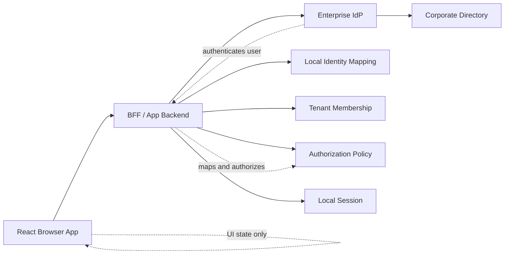
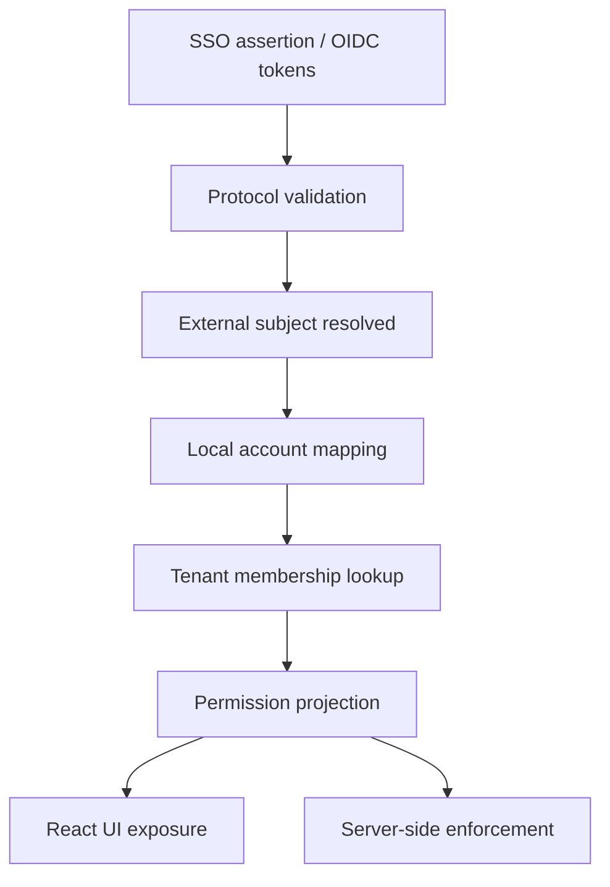
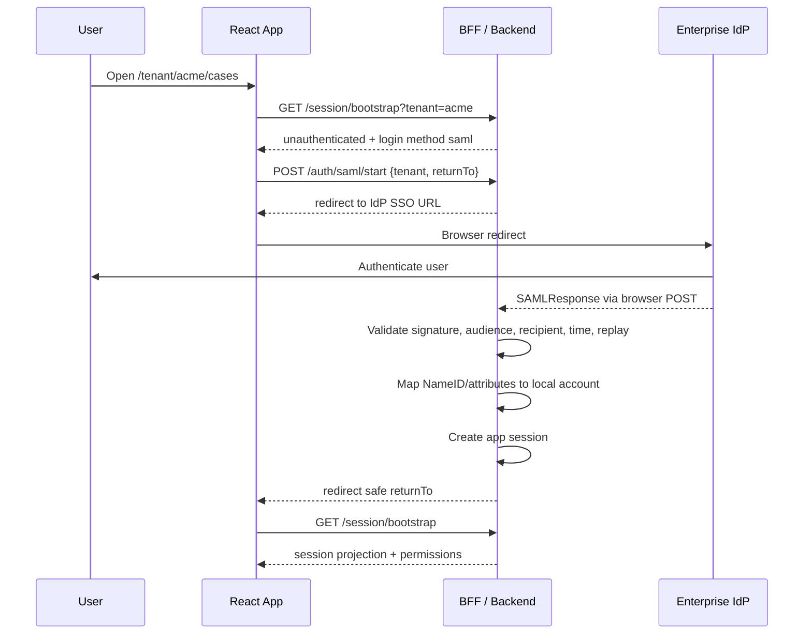
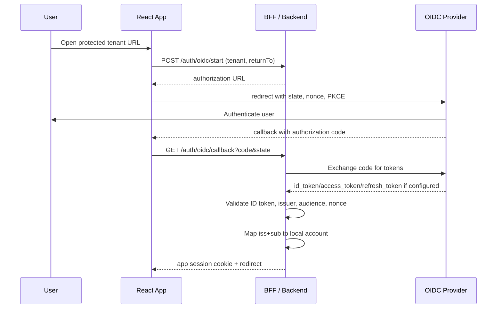
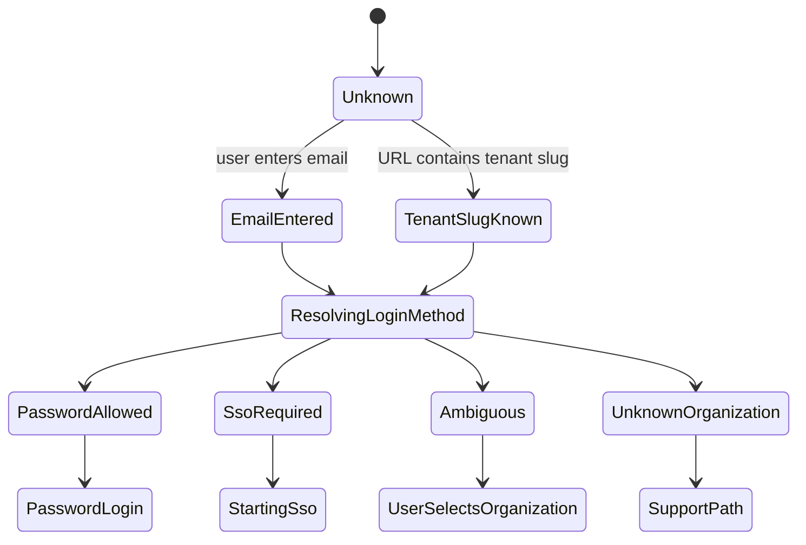
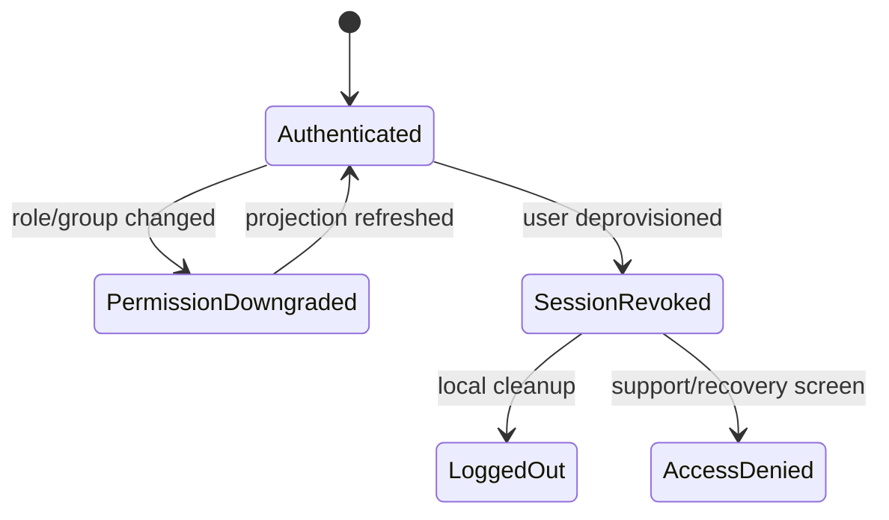
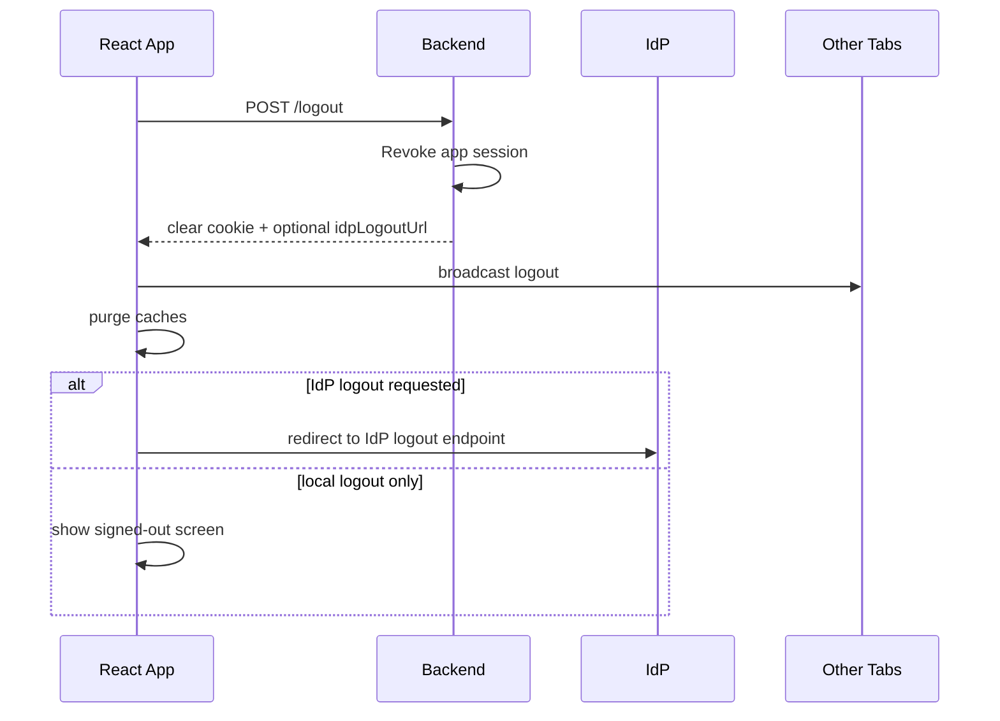

# Part 027 — SSO and Enterprise Identity

SSO is not “login with company account”.

SSO is a trust integration between your application and an external identity authority. Once that sentence becomes clear, the design changes.

In a small app, authentication often looks like this:

```txt
email + password -> user row -> session
```

In an enterprise app, authentication often looks like this:

```txt
user wants to access tenant -> app discovers organization -> app redirects to configured IdP -> IdP authenticates user -> app receives assertion/token -> app maps external identity to internal account -> app binds user to tenant -> app establishes local session -> app authorizes actions using local policy
```

The React app sits near the user experience, but the trust decision is not made by React. React orchestrates routing, intent preservation, provider selection, visible state, and error recovery. The backend/BFF verifies the protocol response, maps identity, provisions account state, and enforces access.

SSO becomes dangerous when a team treats it as a UI option:

```tsx
<LoginButton provider="saml" />
<LoginButton provider="google" />
<LoginButton provider="github" />
```

That is not architecture. That is a component catalog.

The real architecture question is:

> Given a user attempting to access a tenant-scoped resource, which identity provider is authoritative for that tenant, what assurance did it provide, which local subject does that external identity map to, and what local permissions should that subject receive now?

This part builds that model.

---

## 1. The enterprise identity boundary

Enterprise identity adds an external authority into your auth system.



The key point: enterprise SSO does not remove your local identity system. It adds a federation input into it.

You still need local concepts:

```txt
External identity:  IdP subject, NameID, OIDC sub, email, groups, domain.
Local account:      application user record.
Tenant membership:  user belongs to org/project/workspace.
Authorization:      what the local subject can do to local resources.
Session:            app-specific continuity after login.
Audit identity:     who did what, under which tenant and IdP context.
```

A common weak design is to collapse them:

```txt
email from IdP == app user == tenant member == admin
```

That shortcut creates account takeover, tenant confusion, privilege escalation, and audit defects.

---

## 2. SSO is not authorization

SSO answers:

```txt
Did an external identity provider authenticate this person?
```

It does not automatically answer:

```txt
Can this person approve case 123?
Can this person export regulated data?
Can this person administer tenant settings?
Can this person impersonate another user?
```

For a React engineer, this means the login success event must not be treated as a permission grant.

Bad mental model:

```txt
SSO success -> user is allowed into the tenant
```

Better mental model:

```txt
SSO success -> verified external subject
verified external subject -> local identity mapping
local identity mapping -> tenant membership resolution
tenant membership -> permission projection
permission projection -> UI exposure
server policy -> actual enforcement
```



React can show the outcome. React must not invent the outcome.

---

## 3. SAML vs OIDC from a React perspective

React usually should not directly process SAML assertions. SAML is XML-based, redirect/post oriented, and validation is server-side work.

OIDC is more naturally aligned with browser redirect flows, but token validation and session establishment should still be handled by a trusted backend whenever possible.

| Concern | SAML 2.0 | OIDC |
|---|---|---|
| Primary artifact | Assertion | ID Token + OAuth flow tokens |
| Common enterprise use | Workforce SSO | Modern workforce/customer identity |
| Browser role | Redirect and form POST carrier | Redirect participant / authorization code receiver |
| React should validate? | No | Usually no for production enforcement |
| Backend role | Validate assertion, map subject, create session | Validate code/token flow, map subject, create session |
| Identity key | NameID / attributes | `iss` + `sub` |
| Common pitfall | Trusting email as subject | Confusing ID token with access token |
| Metadata | XML metadata | Discovery document / JWKS |

The browser is a transport and UX surface. The server owns trust.

### SAML login shape



React never parses the assertion. It only moves through states.

### OIDC enterprise login shape



In a pure SPA, token handling may happen in the browser via a provider SDK. But even then, domain authorization still belongs behind the API boundary.

---

## 4. Enterprise SSO begins before login: organization discovery

A user clicks “Sign in with SSO”. Which IdP should they use?

There are several patterns.

### 4.1 Domain discovery

```txt
user enters email -> app extracts domain -> backend maps domain to organization -> redirect to org IdP
```

Example:

```txt
alice@acme.com -> acme.com -> tenant acme -> Okta IdP config
```

This is convenient, but domain discovery is not proof of membership.

The email domain can help select an IdP. It should not grant access.

Bad:

```ts
if (email.endsWith('@acme.com')) {
  grantTenantAccess('acme')
}
```

Better:

```txt
email domain -> IdP routing hint
IdP verified subject -> local membership lookup -> access decision
```

### 4.2 Tenant slug discovery

```txt
/acme/login -> use tenant acme SSO config
```

This is explicit and usually safer than domain-only discovery. It also supports multiple organizations sharing one email domain.

### 4.3 Home realm discovery

Some identity platforms support formal home realm discovery. The user provides an identifier, and the platform selects the appropriate identity provider.

React concern:

```txt
Do not build provider selection entirely client-side from hardcoded mappings.
```

The React app may render the discovery form, but the backend should return the authoritative login method.

```ts
export type LoginDiscoveryResult =
  | {
      kind: 'password_allowed';
      tenantId?: string;
    }
  | {
      kind: 'sso_required';
      tenantId: string;
      provider: 'saml' | 'oidc';
      displayName: string;
      startUrl: string;
    }
  | {
      kind: 'unknown_domain';
      supportMessage: string;
    };
```

### 4.4 Discovery state machine



The app should represent ambiguity explicitly. Do not silently guess.

---

## 5. IdP routing is tenant-scoped

Enterprise SSO configuration should be tenant-scoped, not global.

```txt
Tenant Acme:
  login methods:
    - SAML provider: acme-okta
  allowed domains:
    - acme.com
  JIT provisioning: true
  default role: employee
  group mapping: enabled

Tenant Globex:
  login methods:
    - OIDC provider: globex-entra
  allowed domains:
    - globex.com
  JIT provisioning: false
  group mapping: false
```

A single human can belong to multiple tenants. A single email can appear in multiple tenant contexts. A single IdP can serve multiple tenants. Therefore your local identity model cannot be “one email equals one tenant”.

A safer identity mapping key is provider-scoped:

```txt
external_identity_key = provider_id + external_subject
```

For OIDC:

```txt
external_identity_key = issuer + sub
```

For SAML:

```txt
external_identity_key = saml_provider_id + stable NameID or configured immutable attribute
```

Avoid email as the primary identity key. Email can change, be reused, be unverified in some contexts, or collide across providers.

---

## 6. The React contract for SSO discovery

The React app needs a simple contract. It should not know SAML metadata, OIDC endpoints, certificates, XML signatures, or JWKS details.

Example API:

```ts
export type AuthStartRequest = {
  tenantHint?: string;
  emailHint?: string;
  returnTo: string;
};

export type AuthStartResponse = {
  transactionId: string;
  providerType: 'saml' | 'oidc' | 'password' | 'passkey';
  redirectUrl?: string;
  formPostHtml?: never; // Prefer backend redirect handling, not raw HTML into React.
  expiresAt: string;
};
```

React flow:

```ts
async function startEnterpriseLogin(input: {
  tenantHint?: string;
  emailHint?: string;
  returnTo: string;
}) {
  const safeReturnTo = normalizeInternalReturnTo(input.returnTo);

  const response = await fetch('/api/auth/enterprise/start', {
    method: 'POST',
    credentials: 'include',
    headers: { 'Content-Type': 'application/json' },
    body: JSON.stringify({
      tenantHint: input.tenantHint,
      emailHint: input.emailHint,
      returnTo: safeReturnTo,
    }),
  });

  if (!response.ok) {
    throw new Error('Unable to start enterprise login');
  }

  const result: AuthStartResponse = await response.json();

  if (result.providerType === 'password') {
    return { kind: 'password_allowed' as const };
  }

  if (!result.redirectUrl) {
    throw new Error('SSO provider did not return a redirect URL');
  }

  window.location.assign(result.redirectUrl);
}
```

This preserves the important boundary:

```txt
React asks to start login.
Backend creates protocol transaction.
React redirects.
Backend completes protocol transaction.
React bootstraps local session projection.
```

---

## 7. Account linking

After SSO succeeds, you must decide how the external identity maps to an internal account.

There are four major patterns.

### 7.1 Pre-provisioned account

Admin creates the user before first login.

```txt
SSO subject must match existing invitation/account.
```

Pros:

- high control;
- good for regulated systems;
- explicit membership;
- minimal accidental access.

Cons:

- onboarding friction;
- admin workload;
- sync drift with corporate directory.

### 7.2 Just-in-time provisioning

First successful SSO login creates a local account/membership.

```txt
SSO success + tenant JIT enabled + allowed rule -> create local identity
```

Pros:

- smooth onboarding;
- good for large enterprise rollouts;
- less admin friction.

Cons:

- high risk if rules are weak;
- requires careful default permissions;
- deprovisioning must be solved separately.

JIT default should be low privilege.

```txt
First login should not imply admin.
First login should not imply broad data access.
First login should not bypass approval workflows.
```

### 7.3 Invitation-bound linking

User receives an invite. SSO login completes only if external subject matches the invitation rule.

```txt
invite -> login -> external identity -> link -> membership
```

This is often a good balance for enterprise SaaS.

### 7.4 Admin-confirmed linking

SSO login creates a pending identity. Tenant admin or support must approve linking.

This is slower, but valuable for high-risk systems.

---

## 8. Email claim is not identity

Email is useful. Email is not enough.

Risk cases:

```txt
1. Email changes at IdP.
2. Email is reused by an organization.
3. Email is not verified.
4. Same email appears from two different identity providers.
5. Personal Google account uses corporate-looking email.
6. Contractor loses company membership but local account remains active.
7. Tenant allows multiple domains with different policies.
```

A safer model:

```ts
export type ExternalIdentity = {
  providerId: string;
  protocol: 'saml' | 'oidc';
  issuer?: string;
  subject: string;
  email?: string;
  emailVerified?: boolean;
  displayName?: string;
  lastAuthenticatedAt: string;
  lastAssertionHash?: string;
};
```

Local user:

```ts
export type LocalUser = {
  id: string;
  primaryEmail: string;
  status: 'active' | 'suspended' | 'pending_link' | 'deprovisioned';
  identities: ExternalIdentity[];
};
```

Tenant membership:

```ts
export type TenantMembership = {
  tenantId: string;
  userId: string;
  status: 'active' | 'suspended' | 'pending_approval';
  roles: string[];
  source: 'manual' | 'jit' | 'scim' | 'group_mapping' | 'invitation';
  expiresAt?: string;
};
```

Notice the separation:

```txt
identity != user != membership != permission
```

That separation is what prevents SSO bugs from becoming authorization bugs.

---

## 9. Group claims and role mapping

Enterprise IdPs often send groups.

Example:

```json
{
  "groups": [
    "case-reviewers",
    "case-admins",
    "finance-export"
  ]
}
```

Temptation:

```ts
if (token.groups.includes('case-admins')) {
  user.role = 'admin';
}
```

This is often too naive.

Problems:

- group names are IdP-local;
- group claims can be truncated;
- group membership can change after session issue;
- groups may not map 1:1 to app permissions;
- groups may be tenant-specific;
- group updates may require SCIM or directory sync instead of login-time claims;
- app authorization needs resource context, not just group names.

Better model:

```txt
External groups -> tenant-scoped mapping -> local roles/grants -> permission projection -> server enforcement
```

```ts
export type GroupMappingRule = {
  tenantId: string;
  providerId: string;
  externalGroup: string;
  localRole: string;
  effect: 'grant' | 'revoke';
};
```

Mapping should be auditable.

```txt
On login:
  external group: case-admins
  mapped local role: tenant_case_admin
  rule id: rule_123
  tenant: acme
  source assertion: assertion hash abc...
```

React should display derived permissions, not raw trust in groups.

---

## 10. JIT provisioning invariants

If you support just-in-time provisioning, define invariants explicitly.

```txt
Invariant 1: JIT can create identity, but cannot grant high privilege by default.
Invariant 2: JIT is tenant-scoped.
Invariant 3: JIT requires a configured provider, not arbitrary social login.
Invariant 4: JIT checks provider subject, issuer/provider id, and configured tenant.
Invariant 5: JIT events are auditable.
Invariant 6: JIT must not reactivate suspended users unless explicitly allowed.
Invariant 7: JIT must not bypass invitation constraints.
```

Example backend policy:

```ts
type JitDecision =
  | { kind: 'create_membership'; defaultRole: 'member'; reason: string }
  | { kind: 'link_existing_user'; userId: string; reason: string }
  | { kind: 'deny'; reason: string };

function decideJitProvisioning(input: {
  tenant: Tenant;
  provider: EnterpriseProvider;
  externalIdentity: ExternalIdentity;
  matchedInvite?: Invite;
  existingUser?: LocalUser;
}): JitDecision {
  if (!input.tenant.jitProvisioningEnabled) {
    return { kind: 'deny', reason: 'JIT provisioning is disabled for tenant' };
  }

  if (!input.provider.enabled) {
    return { kind: 'deny', reason: 'Provider is disabled' };
  }

  if (input.existingUser?.status === 'suspended') {
    return { kind: 'deny', reason: 'Suspended local user cannot be reactivated by JIT' };
  }

  if (input.matchedInvite) {
    return {
      kind: 'create_membership',
      defaultRole: input.matchedInvite.defaultRole,
      reason: 'Matched active invitation',
    };
  }

  return {
    kind: 'create_membership',
    defaultRole: 'member',
    reason: 'Tenant JIT default membership',
  };
}
```

The exact policy depends on business risk. The important part is that the policy is explicit.

---

## 11. Deprovisioning is part of SSO

A dangerous assumption:

```txt
If the employee leaves the company, the IdP will stop them from logging in, so we are safe.
```

That only prevents future IdP authentication. It may not terminate existing app sessions. It may not remove cached permissions. It may not remove API tokens, service accounts, exports, delegated approvals, or offline jobs.

Deprovisioning channels:

```txt
1. Login-time check.
2. Session bootstrap check.
3. Short session lifetime.
4. SCIM user/group sync.
5. Admin suspension.
6. Back-channel revocation event.
7. Forced logout/session invalidation.
```

React concern:

```txt
The app must handle a user becoming deprovisioned while actively using the app.
```

That means:

- bootstrap can return `deprovisioned`;
- API calls can return `401` or `403` after a previously valid page rendered;
- permission queries can change;
- tabs must receive forced logout or privilege downgrade;
- forms must fail safely;
- cache must be purged.

State machine fragment:



---

## 12. Enterprise SSO and multi-tenancy

Multi-tenancy makes SSO much harder.

Questions you must answer:

```txt
1. Can the same user belong to multiple tenants?
2. Can each tenant have a different IdP?
3. Can one IdP serve multiple tenants?
4. Can one domain map to multiple tenants?
5. Can a user switch tenants without re-authentication?
6. Are permissions tenant-scoped or global?
7. Are sessions tenant-bound or user-bound?
8. Does tenant switch require permission refresh?
9. Does tenant switch require step-up?
10. Is audit written with tenant context?
```

React session projection should include active tenant context.

```ts
export type SessionProjection = {
  user: {
    id: string;
    displayName: string;
    primaryEmail: string;
  };
  activeTenant: {
    id: string;
    slug: string;
    displayName: string;
  };
  availableTenants: Array<{
    id: string;
    slug: string;
    displayName: string;
    loginMethod: 'sso' | 'password' | 'mixed';
  }>;
  authContext: {
    providerId: string;
    method: 'saml' | 'oidc' | 'password' | 'passkey';
    authenticatedAt: string;
    assuranceLevel?: string;
  };
  permissions: Record<string, boolean>;
};
```

Tenant switch should not be a local variable change.

Bad:

```ts
setActiveTenantId(nextTenantId);
```

Better:

```txt
POST /session/active-tenant
server checks membership
server updates session context
server returns new session projection
client invalidates tenant-scoped caches
client re-renders authorized UI
```

---

## 13. SSO logout is not simple logout

Enterprise logout has layers.

```txt
1. App local session logout.
2. IdP session logout.
3. Other app sessions using the same IdP.
4. Browser cookies/storage/cache.
5. Multi-tab propagation.
```

Most applications should guarantee local logout. IdP/global logout depends on provider support and product policy.

React UX should be honest:

```txt
You signed out of this application.
Your company SSO session may still be active.
```

Do not imply global logout unless you really performed it.

Logout flow:



---

## 14. React UI states for enterprise SSO

Do not reduce SSO UI to loading/success/error. Use operational states.

```ts
export type EnterpriseLoginState =
  | { kind: 'idle' }
  | { kind: 'discovering'; emailHint?: string; tenantHint?: string }
  | { kind: 'sso_required'; providerName: string; tenantName: string }
  | { kind: 'redirecting'; providerName: string }
  | { kind: 'callback_processing' }
  | { kind: 'link_pending'; supportMessage: string }
  | { kind: 'access_denied'; reason: string; requestAccessUrl?: string }
  | { kind: 'provider_misconfigured'; supportCode: string }
  | { kind: 'provider_unavailable'; retryAfter?: string }
  | { kind: 'authenticated' };
```

Why so many states?

Because enterprise auth fails in ways that normal password login does not:

```txt
- domain maps to multiple orgs;
- SAML certificate expired;
- IdP clock skew breaks assertion validity;
- user authenticated but has no tenant membership;
- group mapping removed required role;
- account is pending admin approval;
- tenant requires SSO but user tries password;
- IdP returns a different subject for same email;
- provider config is disabled during incident response.
```

Users and support teams need specific recovery paths.

---

## 15. Error taxonomy

| Error | Meaning | User response | Engineering response |
|---|---|---|---|
| `unknown_organization` | Domain/tenant not configured | Contact admin/support | Check discovery config |
| `sso_required` | Password disabled for tenant | Continue with SSO | Normal |
| `provider_unavailable` | IdP or network issue | Retry later/contact IT | Provider health check |
| `provider_misconfigured` | Metadata/cert/redirect invalid | Contact support | Tenant SSO config incident |
| `identity_not_linked` | External subject not linked | Request access/link account | Account linking workflow |
| `membership_missing` | User authenticated but not tenant member | Request access | Tenant admin approval |
| `membership_suspended` | Local membership disabled | Contact admin | Audit and support |
| `jit_denied` | JIT policy refused provisioning | Contact admin | Review JIT policy |
| `assurance_too_low` | Login succeeded but not enough assurance | Step-up required | Step-up integration |
| `tenant_mismatch` | Login returned identity for wrong tenant/provider | Restart login | Check routing and state binding |

Use typed errors. Avoid generic `Login failed`.

---

## 16. Security invariants for SSO

```txt
1. SSO success does not imply authorization.
2. Email claim is not the primary identity key.
3. IdP selection is tenant-scoped and server-owned.
4. SSO transaction is bound to state, returnTo, tenant, and provider.
5. SAML/OIDC validation is server-side.
6. JIT provisioning grants minimum privilege by default.
7. Local suspension overrides external authentication success.
8. Tenant switch refreshes permission projection.
9. Logout revokes local session even if IdP logout fails.
10. Audit logs record provider, subject, tenant, and decision reason.
```

These invariants are more important than the SDK you use.

---

## 17. Implementation pattern: enterprise login service boundary

Frontend module:

```ts
export class EnterpriseAuthClient {
  async discover(input: {
    email?: string;
    tenantSlug?: string;
  }): Promise<LoginDiscoveryResult> {
    const response = await fetch('/api/auth/discovery', {
      method: 'POST',
      credentials: 'include',
      headers: { 'Content-Type': 'application/json' },
      body: JSON.stringify(input),
    });

    if (!response.ok) {
      throw new Error('Unable to discover login method');
    }

    return response.json();
  }

  async startSso(input: {
    tenantId: string;
    returnTo: string;
  }): Promise<void> {
    const response = await fetch('/api/auth/sso/start', {
      method: 'POST',
      credentials: 'include',
      headers: { 'Content-Type': 'application/json' },
      body: JSON.stringify({
        tenantId: input.tenantId,
        returnTo: normalizeInternalReturnTo(input.returnTo),
      }),
    });

    if (!response.ok) {
      throw new Error('Unable to start SSO');
    }

    const result: { redirectUrl: string } = await response.json();
    window.location.assign(result.redirectUrl);
  }
}
```

The function looks simple because the security work is intentionally moved behind a backend boundary.

Backend responsibilities:

```txt
- select provider;
- create transaction;
- bind tenant/provider/returnTo/state/nonce/PKCE;
- redirect to IdP;
- validate response;
- map external subject;
- apply linking/JIT policy;
- create local session;
- return session projection;
- audit all decisions.
```

---

## 18. SSO and supportability

Enterprise SSO bugs often present as support tickets, not stack traces.

Useful support-safe diagnostics:

```txt
tenant: acme
provider type: saml
provider id: acme-okta
login transaction id: tx_123
error code: membership_missing
external subject hash: sha256:...
email claim: a***@acme.com
authenticated at: 2026-07-07T09:12:00Z
assertion age: 12s
correlation id: req_abc
```

Avoid exposing:

```txt
- raw SAML assertion;
- raw ID token;
- access token;
- refresh token;
- full group list if sensitive;
- private keys or certificates;
- unmasked PII in logs.
```

React can display a support code:

```tsx
function EnterpriseAuthError({ error }: { error: EnterpriseAuthError }) {
  return (
    <section>
      <h1>We could not complete SSO</h1>
      <p>{error.userMessage}</p>
      <p>Support code: {error.supportCode}</p>
    </section>
  );
}
```

---

## 19. Testing matrix

Test SSO as a system, not as a button.

| Scenario | Expected result |
|---|---|
| Known tenant with SAML provider | Redirect to tenant SAML IdP |
| Known tenant with OIDC provider | Redirect to tenant OIDC provider |
| Unknown email domain | Show support path, no guessed access |
| Domain maps to multiple tenants | Ask user to choose tenant or use tenant URL |
| Valid SSO but no local membership | Show access request / denied state |
| Suspended local user authenticates at IdP | Deny local session |
| SAML/OIDC response for wrong tenant | Reject transaction |
| Changed group mapping | Refresh permission projection |
| JIT disabled | Do not create membership |
| JIT enabled default | Create low-privilege membership |
| Tenant switch | Server validates membership and refreshes permissions |
| IdP outage | No redirect loop; clear recovery UI |
| Local logout with IdP session alive | App remains logged out until explicit login restart |

---

## 20. Practical design checklist

Before shipping enterprise SSO, answer these:

```txt
Identity
- What is the stable external subject key?
- Are email claims verified?
- Can the same email exist across providers?

Tenant
- How is IdP selected?
- Is provider config tenant-scoped?
- Can a tenant require SSO-only login?

Provisioning
- Is JIT enabled?
- What is the default role?
- Can suspended users be reactivated by login?

Authorization
- Are roles/groups mapped locally?
- Are permissions refreshed after login and tenant switch?
- Are server-side checks independent from UI state?

Session
- Is the local session independent from IdP session?
- What happens when membership changes mid-session?
- Is logout local, global, or both?

Audit
- Do logs include provider, external subject hash, tenant, decision reason?
- Can support debug without seeing raw tokens/assertions?
```

---

## 21. Mental model recap

SSO is a federation input, not your whole auth system.

The production pipeline is:

```txt
organization discovery
-> provider selection
-> protocol transaction
-> external authentication
-> server-side validation
-> identity mapping
-> local account resolution
-> tenant membership resolution
-> permission projection
-> local session establishment
-> React UI exposure
-> server-side authorization enforcement
-> audit trail
```

React participates in the experience, not the trust root.

When you design it this way, SSO becomes understandable, testable, supportable, and safe enough for enterprise systems.

---

## References

- OpenID Connect Core 1.0, OpenID Foundation.
- SAML 2.0 Technical Overview, OASIS.
- OWASP Authentication Cheat Sheet.
- OWASP Authorization Cheat Sheet.
- OWASP Session Management Cheat Sheet.
- RFC 9700 — OAuth 2.0 Security Best Current Practice.
