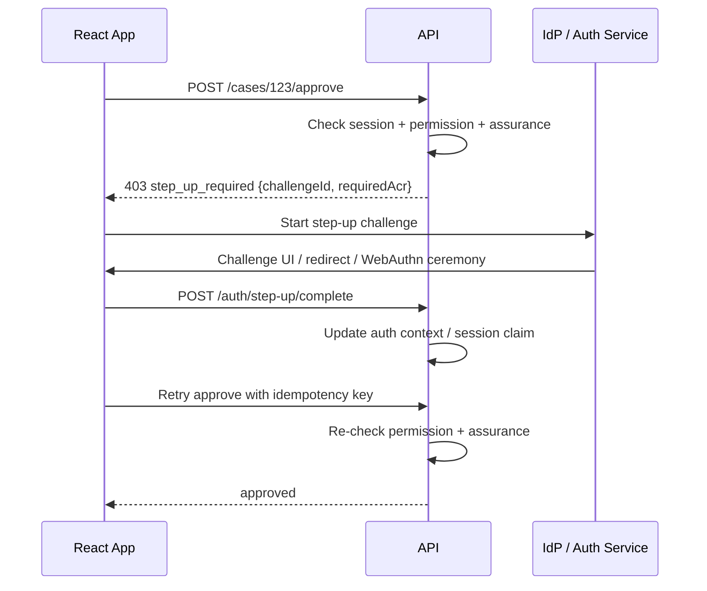
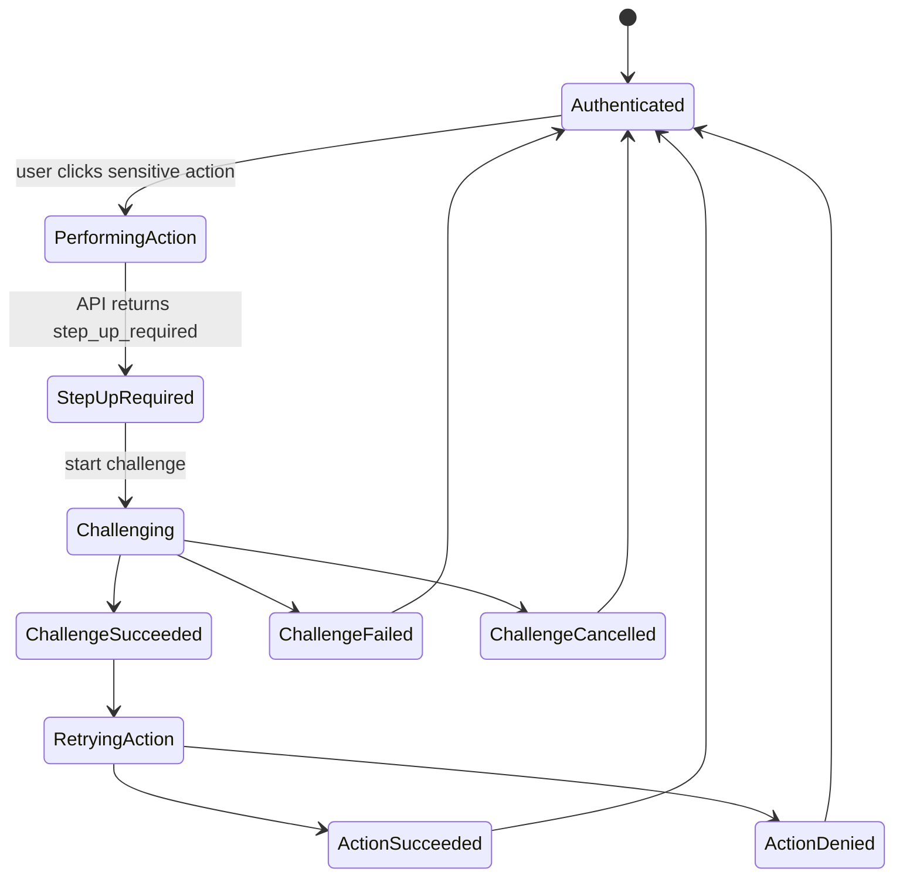
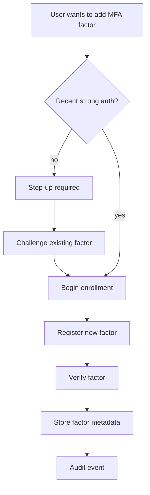

# Part 028 — MFA and Step-up Authentication

MFA is not “ask for OTP after password”.

That is one implementation shape. The real concept is stronger:

> The system requires stronger evidence of user presence, possession, inherence, or authentication freshness before allowing a riskier operation.

In React applications, MFA and step-up authentication usually fail for one of three reasons:

```txt
1. The frontend treats MFA as a page instead of an auth state.
2. The backend treats MFA success as global permanent trust.
3. Product treats every action as same risk.
```

A production system needs a better model:

```txt
normal login -> baseline session
sensitive action -> assurance check
assurance too low/stale -> step-up challenge
challenge success -> short-lived elevated auth context
action retry -> server authorizes action using updated context
audit -> record method, freshness, resource, decision
```

React's role is orchestration and UX. The server's role is enforcement.

---

## 1. Authentication assurance, not just factors

A “factor” is a type of evidence. Assurance is confidence in the authentication event.

Common factor categories:

```txt
Knowledge: something the user knows
  - password
  - PIN

Possession: something the user has
  - authenticator app
  - hardware security key
  - phone/device-bound credential

Inherence: something the user is
  - biometric unlock used locally by a platform authenticator
```

But assurance is also affected by:

```txt
- phishing resistance;
- authenticator binding;
- authenticator lifecycle;
- device compromise risk;
- recovery process strength;
- authentication age;
- session risk;
- transaction context;
- tenant policy.
```

A password plus SMS OTP is not the same assurance as a phishing-resistant passkey/security key. Treating them as identical creates false confidence.

---

## 2. Step-up authentication

Step-up authentication means:

```txt
The user already has a session, but a specific action requires stronger or fresher authentication.
```

Examples:

```txt
- export regulated data;
- approve enforcement action;
- change payment account;
- invite tenant administrator;
- create API token;
- view secret configuration;
- change MFA settings;
- impersonate another user;
- delete case evidence;
- submit final regulatory decision.
```

Normal auth says:

```txt
Who are you?
```

Step-up asks:

```txt
Are you still the authenticated user, and do you currently satisfy the assurance requirement for this action?
```



The action is not approved merely because step-up succeeded. The server re-checks authorization after step-up.

---

## 3. MFA is not authorization

MFA increases confidence that the session is controlled by the legitimate user.

It does not grant business permission.

Bad:

```txt
MFA success -> allow admin action
```

Correct:

```txt
MFA success -> authentication context updated
server authorization still checks subject, action, resource, tenant, state, policy, and assurance
```

Example:

```ts
type AuthContext = {
  userId: string;
  tenantId: string;
  authenticatedAt: string;
  methods: Array<'password' | 'totp' | 'webauthn' | 'sso'>;
  assuranceLevel: 'aal1' | 'aal2' | 'aal3' | 'custom_high';
  lastStepUpAt?: string;
};
```

Authorization input:

```ts
export type AuthorizationInput = {
  subject: { userId: string; tenantId: string };
  action: string;
  resource: { type: string; id: string; state?: string };
  context: {
    auth: AuthContext;
    ipRisk?: 'low' | 'medium' | 'high';
    deviceKnown?: boolean;
    requestTime: string;
  };
};
```

The policy can then say:

```txt
User needs permission cases.approve_final
AND case state must be ready_for_final_approval
AND tenant must match
AND assurance must be AAL2 or better
AND last step-up must be within 10 minutes
```

That is authorization with authentication context.

---

## 4. The React mental model

In React, step-up is not only a route. It is an interruptible flow that can happen while the user is in the middle of an action.



The frontend must preserve:

```txt
- original action intent;
- resource identity;
- idempotency key;
- return location;
- challenge id;
- user-visible reason;
- cancellation path.
```

But it must not preserve blind authority to execute the action. The server must re-check everything.

---

## 5. Action-first step-up pattern

There are two common patterns.

### 5.1 Pre-check pattern

React asks before action:

```txt
Can user perform this action now?
```

Server replies:

```json
{
  "allowed": false,
  "reason": "step_up_required",
  "requiredAssurance": "aal2",
  "challengeUrl": "/auth/step-up?intent=..."
}
```

Pros:

- smoother UI;
- explicit button messaging;
- fewer failed mutations.

Cons:

- pre-check can become stale;
- must still enforce on mutation;
- can leak action availability if not designed carefully.

### 5.2 Mutation-first pattern

React submits the action. Server interrupts:

```txt
403 step_up_required
```

Pros:

- server remains source of truth;
- simpler correctness;
- no stale pre-check problem.

Cons:

- UX needs careful retry handling;
- mutation must be idempotent;
- forms need state preservation.

In serious systems, use both:

```txt
pre-check for UX
mutation enforcement for correctness
```

---

## 6. API contract for step-up

Use a typed error. Do not overload generic `403`.

```ts
export type ApiError =
  | {
      code: 'unauthenticated';
      message: string;
    }
  | {
      code: 'forbidden';
      message: string;
      reason?: string;
    }
  | {
      code: 'step_up_required';
      message: string;
      challenge: {
        id: string;
        methods: Array<'totp' | 'webauthn' | 'idp_mfa' | 'password_reauth'>;
        requiredAssurance: 'aal2' | 'aal3' | 'tenant_high';
        expiresAt: string;
        retryAfterSuccess: boolean;
      };
    };
```

Example API handler boundary:

```ts
async function approveCase(request: Request) {
  const session = await requireSession(request);
  const caseRecord = await loadCase(request.params.caseId);

  const decision = await authorize({
    subject: session.subject,
    action: 'case.approve_final',
    resource: caseRecord,
    context: {
      auth: session.authContext,
      requestTime: new Date().toISOString(),
    },
  });

  if (decision.kind === 'step_up_required') {
    return json(
      {
        code: 'step_up_required',
        message: 'Additional verification is required before approving this case.',
        challenge: decision.challenge,
      },
      { status: 403 }
    );
  }

  if (decision.kind === 'deny') {
    return json({ code: 'forbidden', message: decision.reason }, { status: 403 });
  }

  return commitFinalApproval(caseRecord, session.subject);
}
```

Notice the order:

```txt
load session -> load resource -> authorize with auth context -> maybe step-up -> maybe deny -> maybe mutate
```

---

## 7. React implementation: step-up coordinator

The step-up coordinator is a small orchestration layer. It catches typed errors and resumes intent after success.

```ts
export type StepUpIntent<T> = {
  description: string;
  idempotencyKey: string;
  run: () => Promise<T>;
};

export async function runWithStepUp<T>(intent: StepUpIntent<T>): Promise<T> {
  try {
    return await intent.run();
  } catch (error) {
    if (!isStepUpRequired(error)) {
      throw error;
    }

    const completed = await openStepUpChallenge({
      challenge: error.challenge,
      intentDescription: intent.description,
    });

    if (!completed) {
      throw new Error('Step-up challenge was cancelled');
    }

    return intent.run();
  }
}
```

Usage:

```tsx
async function onApproveFinalDecision(caseId: string) {
  await runWithStepUp({
    description: 'Approve final case decision',
    idempotencyKey: crypto.randomUUID(),
    run: () =>
      approveFinalDecision({
        caseId,
        idempotencyKey,
      }),
  });
}
```

A more realistic version passes the idempotency key into `run`:

```ts
export async function runMutationWithStepUp<T>(input: {
  description: string;
  mutation: (ctx: { idempotencyKey: string }) => Promise<T>;
}): Promise<T> {
  const idempotencyKey = crypto.randomUUID();

  const run = () => input.mutation({ idempotencyKey });

  try {
    return await run();
  } catch (error) {
    if (!isStepUpRequired(error)) throw error;

    const ok = await openStepUpChallenge({
      challenge: error.challenge,
      intentDescription: input.description,
    });

    if (!ok) {
      throw new Error('Additional verification was cancelled');
    }

    return run();
  }
}
```

Important invariant:

```txt
The retry is safe only if the mutation is idempotent or server handles duplicate attempts correctly.
```

---

## 8. Step-up UX states

A serious step-up UX distinguishes these states:

```ts
export type StepUpState =
  | { kind: 'idle' }
  | { kind: 'required'; challengeId: string; reason: string }
  | { kind: 'starting'; challengeId: string }
  | { kind: 'challenging'; method: 'totp' | 'webauthn' | 'idp_mfa' | 'password_reauth' }
  | { kind: 'verifying'; challengeId: string }
  | { kind: 'succeeded'; completedAt: string }
  | { kind: 'failed'; reason: string; retryable: boolean }
  | { kind: 'cancelled' }
  | { kind: 'expired' };
```

Do not trap users.

A user must be able to cancel step-up and return to the previous safe state.

```txt
Cancel step-up != logout
Cancel step-up != action success
Cancel step-up == action not performed, user remains in baseline session if still valid
```

---

## 9. Freshness windows

Step-up should usually be short-lived.

Example policy:

```txt
View dashboard: baseline session enough
Edit profile: baseline session enough
Create API token: step-up within last 5 minutes
Change MFA factor: step-up within last 5 minutes
Export regulated data: step-up within last 10 minutes
Approve final enforcement decision: step-up within last 2 minutes
Impersonate user: step-up within last 2 minutes + admin permission
```

Backend helper:

```ts
function isFreshEnough(input: {
  lastStepUpAt?: string;
  now: string;
  maxAgeSeconds: number;
}): boolean {
  if (!input.lastStepUpAt) return false;

  const last = Date.parse(input.lastStepUpAt);
  const now = Date.parse(input.now);

  if (!Number.isFinite(last) || !Number.isFinite(now)) return false;

  return now - last <= input.maxAgeSeconds * 1000;
}
```

Do not trust client time for security. Server time decides.

React may display countdowns for UX, but server decides freshness.

---

## 10. `acr`, `amr`, `auth_time`, and `max_age`

OIDC has useful concepts for authentication context.

Useful claims/parameters:

```txt
acr: Authentication Context Class Reference.
amr: Authentication Methods References.
auth_time: time user authentication occurred.
max_age: request parameter requiring recent authentication.
prompt=login: force re-authentication prompt.
```

React should not invent these claims.

The application should receive a normalized backend projection:

```ts
export type NormalizedAuthAssurance = {
  authenticatedAt: string;
  methods: string[];
  assuranceLevel: string;
  stepUpCompletedAt?: string;
  source: 'local' | 'oidc' | 'saml' | 'webauthn' | 'password';
};
```

Why normalize?

Because different providers use different `acr`/`amr` conventions, and SAML deployments may expose authentication context differently.

React needs stable product semantics:

```txt
Can the user do this action now?
If not, what challenge should be shown?
```

Not raw provider-specific protocol details.

---

## 11. MFA enrollment vs MFA challenge

Separate two workflows:

```txt
MFA enrollment: user adds or configures a factor.
MFA challenge: user proves control of a factor.
```

Enrollment is more sensitive than normal challenge because it changes future authentication strength.

Enrollment should often require step-up first.



Do not let a compromised session silently replace MFA factors.

---

## 12. MFA recovery is part of security

Recovery is often the weakest link.

If recovery is easier than MFA, attackers use recovery.

Recovery options:

```txt
- backup codes;
- verified recovery email;
- admin reset;
- helpdesk flow;
- hardware key fallback;
- identity proofing;
- temporary bypass with expiry;
- tenant admin approval.
```

React UX should make recovery explicit and auditable.

Bad:

```txt
Can't access your code? Click here to disable MFA.
```

Better:

```txt
Can't access your authenticator?
Use a backup code, security key, or contact your organization admin.
```

Recovery invariants:

```txt
1. Recovery must be logged.
2. Recovery must not silently downgrade future auth.
3. Temporary bypass must expire.
4. Admin reset should require admin step-up.
5. Users should be notified about factor changes.
6. Factor replacement should require recent strong authentication when possible.
```

---

## 13. WebAuthn/passkeys boundary

WebAuthn/passkeys are not “React passwordless magic”.

React participates in browser ceremonies:

```txt
navigator.credentials.create()
navigator.credentials.get()
```

But the server owns:

```txt
- challenge generation;
- relying party ID;
- origin validation;
- credential public key storage;
- signature verification;
- counter/signature data checks where applicable;
- user handle mapping;
- policy decision.
```

Frontend shape:

```ts
async function startWebAuthnStepUp(challengeId: string) {
  const optionsResponse = await fetch(`/api/auth/webauthn/step-up/options`, {
    method: 'POST',
    credentials: 'include',
    headers: { 'Content-Type': 'application/json' },
    body: JSON.stringify({ challengeId }),
  });

  const options = await optionsResponse.json();

  const credential = await navigator.credentials.get({
    publicKey: options.publicKey,
  });

  await fetch(`/api/auth/webauthn/step-up/verify`, {
    method: 'POST',
    credentials: 'include',
    headers: { 'Content-Type': 'application/json' },
    body: JSON.stringify({ challengeId, credential }),
  });
}
```

The frontend transports challenge and response. It does not validate the cryptographic proof.

---

## 14. Risk-based step-up

Some systems step up only when risk changes.

Signals:

```txt
- new device;
- unusual location;
- impossible travel;
- high-value action;
- suspicious IP/reputation;
- recent password reset;
- admin role;
- dormant account suddenly active;
- tenant policy requiring stronger auth;
- resource sensitivity.
```

Risk-based auth must be explainable enough for support and audit.

A policy decision might look like:

```json
{
  "decision": "step_up_required",
  "reason": "high_value_action_and_stale_authentication",
  "requiredAssurance": "tenant_high",
  "allowedMethods": ["webauthn", "idp_mfa"],
  "maxAgeSeconds": 300
}
```

React can turn that into UX:

```txt
Additional verification is required because this action changes tenant security settings.
```

Do not expose sensitive risk signals such as fraud scores or detection rules directly to users.

---

## 15. Step-up and route loaders

Some routes should require stronger authentication before loading sensitive data.

Examples:

```txt
/settings/security
/admin/impersonation
/cases/:id/evidence-export
/billing/payment-methods
```

React Router Data Mode style:

```ts
export async function securitySettingsLoader() {
  const response = await fetch('/api/security-settings/bootstrap', {
    credentials: 'include',
  });

  if (response.status === 403) {
    const body = await response.json();

    if (body.code === 'step_up_required') {
      throw redirect(`/auth/step-up?challenge=${body.challenge.id}`);
    }
  }

  if (!response.ok) {
    throw response;
  }

  return response.json();
}
```

Route-level step-up protects data exposure. Action-level step-up protects mutations.

Use both where needed.

---

## 16. Step-up and forms

Long-running forms are a trap.

Scenario:

```txt
User opens final approval form.
User spends 45 minutes writing decision rationale.
User clicks submit.
Server requires step-up.
Challenge succeeds.
Original form state is lost.
```

Production handling:

```txt
- keep local draft state;
- use idempotency key;
- submit to server only after authorization;
- preserve form data across challenge;
- revalidate resource state after challenge;
- detect if resource changed while challenge was pending;
- show diff/refresh prompt if needed.
```

State-aware retry:

```ts
type SensitiveFormDraft = {
  resourceId: string;
  resourceVersion: number;
  formData: Record<string, unknown>;
  idempotencyKey: string;
};
```

Backend should reject stale resource version if the case changed while the user was in MFA.

```txt
Step-up freshness does not solve stale business state.
```

---

## 17. Multi-tab behavior

If step-up succeeds in one tab, should another tab become elevated?

There is no universal answer. Choose explicitly.

### Session-wide elevation

```txt
Step-up updates session auth context.
All tabs can benefit until freshness window expires.
```

Pros:

- convenient;
- simpler mental model for user.

Cons:

- wider blast radius;
- another tab can perform sensitive action during window.

### Intent-bound elevation

```txt
Step-up completes only a specific challenge/action.
Other tabs do not inherit broad elevation.
```

Pros:

- safer;
- better for high-risk actions.

Cons:

- more implementation complexity;
- users may repeat challenges.

For regulated or admin workflows, prefer intent-bound or very short-lived elevation.

Broadcast event example:

```ts
const channel = new BroadcastChannel('auth-events');

function publishStepUpCompleted(challengeId: string) {
  channel.postMessage({
    type: 'step_up_completed',
    challengeId,
    at: new Date().toISOString(),
  });
}
```

Do not broadcast secrets or raw tokens.

---

## 18. Session projection after step-up

After successful step-up, refresh the session projection.

```ts
export type SessionProjection = {
  user: { id: string; displayName: string };
  tenant: { id: string; slug: string };
  authContext: {
    authenticatedAt: string;
    assuranceLevel: string;
    methods: string[];
    lastStepUpAt?: string;
    elevatedUntil?: string;
  };
  permissions: Record<string, boolean>;
};
```

Why refresh?

Because the UI may need to change:

```txt
- sensitive buttons become enabled;
- security settings form becomes visible;
- export action becomes available;
- challenge banner disappears;
- countdown appears;
- cached permission decisions need invalidation.
```

But again: UI availability is not enforcement.

---

## 19. Common anti-patterns

### Anti-pattern 1: Client-only MFA flag

```ts
localStorage.setItem('mfaPassed', 'true');
```

This is not a security mechanism.

### Anti-pattern 2: Permanent elevation

```txt
User completed MFA once this year -> all sensitive actions allowed forever.
```

Freshness matters.

### Anti-pattern 3: Step-up without action re-check

```txt
403 step_up_required -> MFA success -> client performs local action
```

The server must re-authorize.

### Anti-pattern 4: MFA reset without MFA

```txt
Attacker steals session -> removes victim's MFA factor -> owns account
```

Factor management must be high assurance.

### Anti-pattern 5: Generic error message everywhere

```txt
Something went wrong.
```

For security-sensitive UX, typed states matter.

### Anti-pattern 6: Treat all MFA methods equally

SMS, TOTP, push, passkey, hardware key, and IdP MFA have different properties.

### Anti-pattern 7: No audit trail

A sensitive action without auth-context audit is hard to defend.

---

## 20. Audit events

Step-up should produce audit events.

```ts
export type StepUpAuditEvent = {
  type:
    | 'step_up_required'
    | 'step_up_started'
    | 'step_up_succeeded'
    | 'step_up_failed'
    | 'step_up_cancelled'
    | 'sensitive_action_authorized'
    | 'sensitive_action_denied';
  userId: string;
  tenantId: string;
  challengeId?: string;
  action?: string;
  resourceType?: string;
  resourceId?: string;
  method?: string;
  assuranceLevel?: string;
  authenticatedAt?: string;
  reason?: string;
  requestId: string;
  occurredAt: string;
};
```

For regulated workflows, record:

```txt
- action attempted;
- resource identity;
- old/new resource state if relevant;
- authentication method used;
- freshness window;
- policy rule that required step-up;
- final authorization decision;
- correlation id.
```

Do not log secrets, OTP codes, WebAuthn responses, raw tokens, or recovery codes.

---

## 21. Testing matrix

| Scenario | Expected result |
|---|---|
| Sensitive action with fresh assurance | Action proceeds |
| Sensitive action with stale auth | `step_up_required` |
| User cancels challenge | Action not performed; baseline session remains |
| Challenge succeeds | Session/auth context refreshed |
| Challenge succeeds but permission removed | Action denied |
| Challenge succeeds but resource changed | Action rejected or revalidated |
| Duplicate retry after challenge | Idempotency prevents duplicate mutation |
| Expired challenge | New challenge required |
| Wrong tenant challenge | Reject completion |
| MFA factor removed in another tab | Challenge fails or session refreshed |
| Suspended user completes challenge | Local authorization still denies |
| Route loader sensitive data | Redirect/challenge before data exposure |
| Step-up event broadcast | Other tabs refresh projection without receiving secrets |
| Provider MFA outage | Recoverable error, no infinite loop |

---

## 22. Design checklist

```txt
Policy
- Which actions require step-up?
- What assurance level is required?
- How fresh must authentication be?
- Is elevation session-wide or intent-bound?

Backend
- Are sensitive actions enforced server-side?
- Does the server re-check authorization after step-up?
- Are challenges tenant-bound and action-bound?
- Are challenge IDs unguessable and short-lived?
- Are retries idempotent?

Frontend
- Can the user cancel step-up safely?
- Is form state preserved?
- Are typed errors handled?
- Are route-level and action-level challenges distinct?
- Are caches invalidated after step-up?

Security
- Can a stolen session add/remove MFA factors?
- Are recovery flows at least as protected as login?
- Are strong methods preferred for admin workflows?
- Are sensitive risk signals hidden?

Audit
- Is step-up recorded?
- Is final authorization recorded?
- Can support debug without seeing secrets?
```

---

## 23. Mental model recap

MFA strengthens authentication. Step-up applies that strength at the point of risk.

The production pipeline is:

```txt
user has baseline session
-> user attempts sensitive action
-> server evaluates permission + resource + auth context
-> server requires stronger/fresher auth if needed
-> React orchestrates challenge
-> auth service verifies challenge
-> session/auth context is updated or challenge token is issued
-> original action is retried with idempotency
-> server re-checks authorization
-> action succeeds or fails
-> audit records the chain
```

The critical rule:

```txt
Step-up is not a bypass around authorization.
Step-up is an input into authorization.
```

Once that model is clear, React MFA implementation becomes much more reliable: fewer redirect hacks, fewer stale UI bugs, fewer privilege mistakes, and stronger evidence when the system is audited.

---

## References

- NIST SP 800-63B — Digital Identity Guidelines: Authentication and Lifecycle Management.
- OWASP Multifactor Authentication Cheat Sheet.
- OpenID Connect Core 1.0.
- OWASP Authentication Cheat Sheet.
- OWASP Session Management Cheat Sheet.
- WebAuthn Level 3, W3C.
