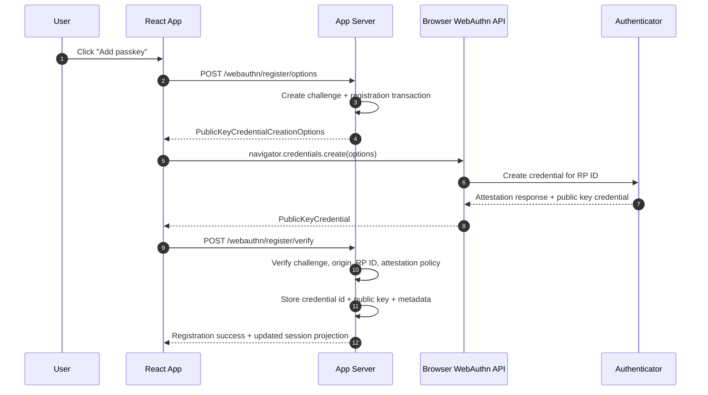
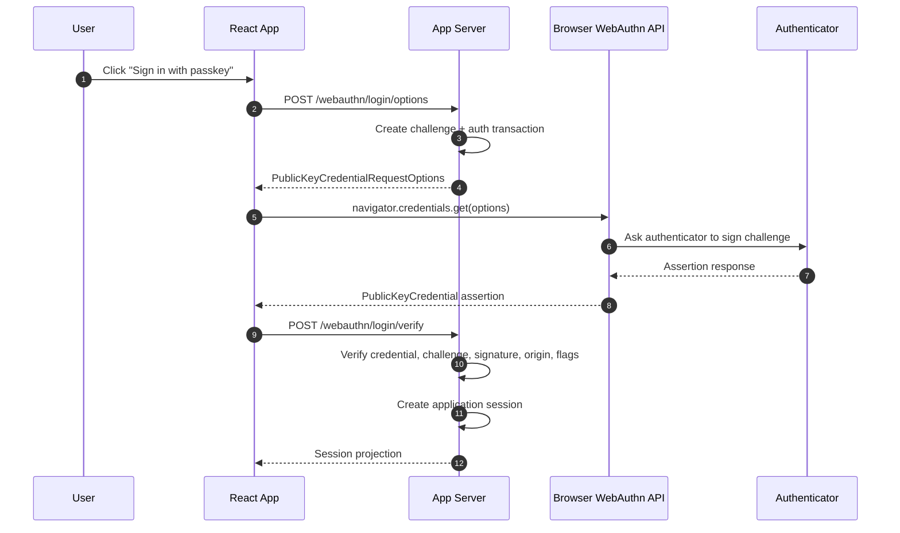
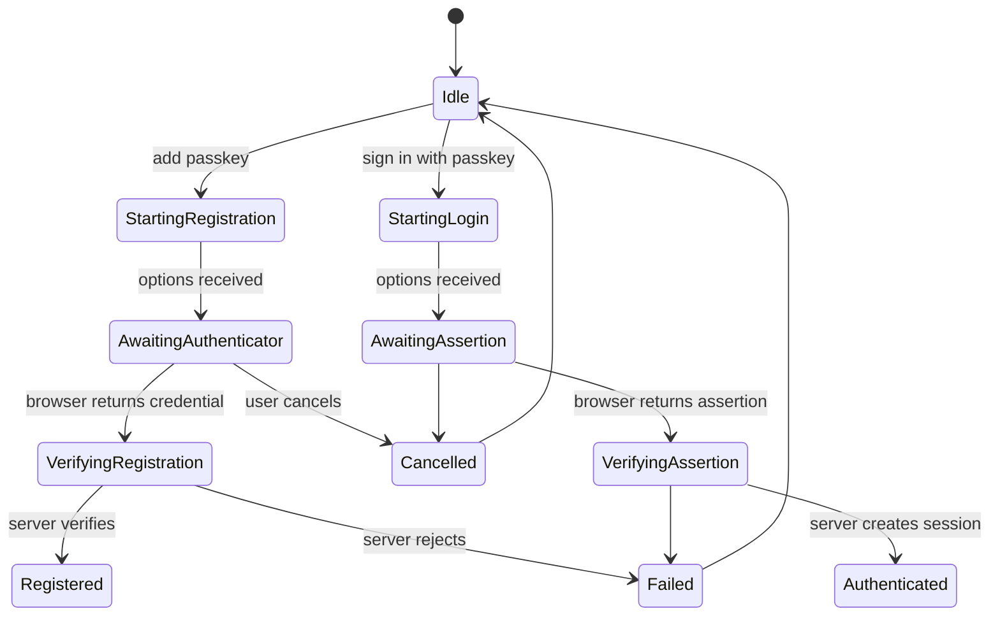
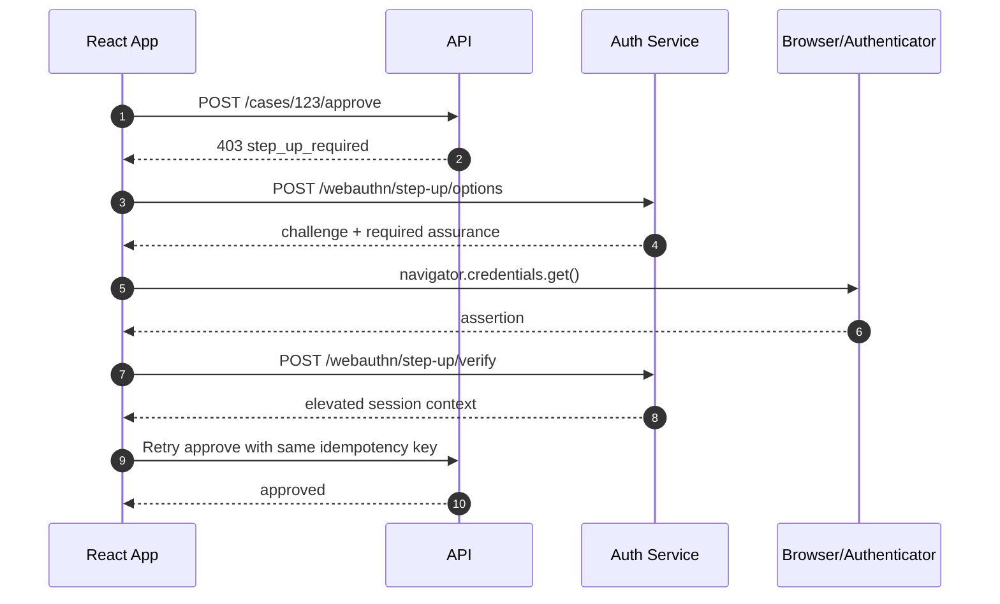

# Part 029 — Passkeys/WebAuthn for React Engineers

Passkeys are not “a nicer login button”.

They are a different authentication primitive:

```txt
password login:
  user proves knowledge of a shared secret
  server compares or verifies secret-derived material
  phishing can trick the user into sending the secret elsewhere

passkey/WebAuthn login:
  authenticator signs a server challenge using a private key
  server verifies the signature using the stored public key
  credential is scoped to a relying party / origin boundary
  no reusable shared secret is typed into a fake site
```

That difference matters.

React engineers often see only this layer:

```tsx
await navigator.credentials.get(...)
```

But production WebAuthn is a protocol-shaped system. The browser API is only the ceremony surface. The hard parts are:

```txt
- challenge generation;
- origin and RP ID scoping;
- credential storage;
- signature verification;
- user verification policy;
- account recovery;
- multi-device behavior;
- fallback auth;
- step-up semantics;
- auditability;
- enterprise support;
- testability.
```

React does not verify WebAuthn. React orchestrates it.

The server verifies it.

---

## 1. The first invariant

The most important invariant:

```txt
A WebAuthn result received by React is not authentication success.

It is a signed assertion that must be verified by the server.
```

A correct React app treats WebAuthn like this:

```txt
1. Ask server for a challenge.
2. Ask browser/authenticator to create or sign with a credential.
3. Send result to server.
4. Server verifies cryptographic and policy constraints.
5. Server creates or upgrades the app session.
6. React updates session projection from trusted server state.
```

Never this:

```txt
navigator.credentials.get() succeeded
therefore user is logged in
```

That is equivalent to treating “the UI looked successful” as a security decision.

---

## 2. Mental model: a WebAuthn ceremony

WebAuthn has two main ceremonies:

```txt
registration ceremony:
  create a new credential for a user account

authentication ceremony:
  prove possession/control of a registered credential
```

The important actors:

```txt
Relying Party (RP)
  Your application / server-side identity system.

Browser
  The mediator. It enforces origin/RP constraints and talks to authenticators.

Authenticator
  Device or security key that creates and uses private keys.

Credential
  Public/private key pair scoped to the RP.

Challenge
  Fresh server-generated random value signed by the authenticator.

RP ID
  Domain scope for credentials, usually example.com or a registrable domain.

Origin
  Full scheme + host + port, such as https://app.example.com.

User handle
  Stable opaque user identifier used by the authenticator and RP.
```

The useful simplification:

```txt
registration stores a public key
login proves control of the matching private key
```

But do not oversimplify too far. The server must also check origin, RP ID hash, challenge, flags, counters when applicable, credential id, user binding, and policy requirements.

---

## 3. Registration sequence



React owns the experience. The server owns the truth.

---

## 4. Authentication sequence



The output of WebAuthn login should normally be your normal app session:

```txt
Set-Cookie: __Host-app_session=opaque; HttpOnly; Secure; SameSite=Lax; Path=/
```

or a BFF/session projection response.

Do not make the React app operate directly on raw WebAuthn details longer than necessary.

---

## 5. Passkey vs WebAuthn vs FIDO2

Practical terms:

```txt
WebAuthn
  W3C browser API and web-facing authentication protocol surface.

CTAP
  Client-to-Authenticator Protocol used between client platform/browser and authenticator.

FIDO2
  Broader standard family including WebAuthn and CTAP.

Passkey
  User-facing term for a FIDO/WebAuthn credential, commonly discoverable and often synced.
```

For React engineers, the important boundary is:

```txt
React talks to the browser's WebAuthn API.
The browser talks to the authenticator.
The server verifies the ceremony.
```

---

## 6. What React is responsible for

React responsibilities:

```txt
- triggering registration/login ceremonies;
- rendering secure UX and recovery paths;
- calling server option endpoints;
- converting binary fields to/from transport-safe format;
- handling browser errors carefully;
- preventing double ceremony submissions;
- integrating result with session bootstrap;
- clearing stale login transaction UI;
- supporting conditional UI where appropriate;
- showing realistic recovery guidance;
- logging safe telemetry.
```

React is not responsible for:

```txt
- generating final authentication truth;
- verifying signatures;
- validating authenticator data;
- deciding credential trust alone;
- storing passkey private keys;
- trusting browser-returned JSON as proof;
- replacing backend authorization.
```

A good rule:

```txt
React may say: "the ceremony completed locally"
Server must say: "authentication succeeded"
```

---

## 7. Server responsibilities

Server responsibilities during registration:

```txt
- generate cryptographically strong challenge;
- bind challenge to user/session/transaction;
- set RP ID and origin policy;
- decide user verification requirement;
- verify attestation response;
- extract and store credential public key;
- store credential id;
- store user handle binding;
- store credential metadata;
- prevent duplicate credential registration;
- audit credential enrollment.
```

Server responsibilities during authentication:

```txt
- verify challenge freshness and single-use property;
- find credential by credential id;
- verify RP ID hash;
- verify origin;
- verify signature over authenticator data + client data hash;
- verify user presence/user verification flags according to policy;
- check signature counter when applicable;
- check credential status and account status;
- create or upgrade session;
- audit success/failure.
```

Most applications should use a mature server-side WebAuthn library rather than implementing signature verification from scratch. The goal here is not to reimplement crypto. The goal is to know where the security boundary lives and what contract React must honor.

---

## 8. Data model

A minimal credential table:

```sql
create table user_webauthn_credentials (
  id uuid primary key,
  user_id uuid not null,
  credential_id bytea not null unique,
  public_key_cose bytea not null,
  sign_count bigint not null default 0,
  transports text[] not null default '{}',
  backup_eligible boolean,
  backup_state boolean,
  user_verified_required boolean not null default true,
  nickname text,
  created_at timestamptz not null,
  last_used_at timestamptz,
  disabled_at timestamptz,
  disabled_reason text
);
```

A registration transaction table/cache:

```sql
create table webauthn_registration_transactions (
  id uuid primary key,
  user_id uuid not null,
  challenge_hash bytea not null,
  rp_id text not null,
  origin text not null,
  expires_at timestamptz not null,
  consumed_at timestamptz
);
```

An authentication transaction table/cache:

```sql
create table webauthn_authentication_transactions (
  id uuid primary key,
  challenge_hash bytea not null,
  login_hint text,
  tenant_id uuid,
  required_assurance text,
  expires_at timestamptz not null,
  consumed_at timestamptz
);
```

Challenges should be short-lived and single-use.

---

## 9. Transport DTOs for React

The browser WebAuthn API uses binary data. JSON APIs need transport-safe encoding.

Use base64url for binary fields.

Example DTOs:

```ts
type Base64Url = string;

type RegisterOptionsDto = {
  transactionId: string;
  publicKey: {
    challenge: Base64Url;
    rp: {
      id: string;
      name: string;
    };
    user: {
      id: Base64Url;
      name: string;
      displayName: string;
    };
    pubKeyCredParams: Array<{
      type: 'public-key';
      alg: number;
    }>;
    timeout?: number;
    attestation?: AttestationConveyancePreference;
    authenticatorSelection?: AuthenticatorSelectionCriteria;
    excludeCredentials?: Array<{
      type: 'public-key';
      id: Base64Url;
      transports?: AuthenticatorTransport[];
    }>;
  };
};

type LoginOptionsDto = {
  transactionId: string;
  publicKey: {
    challenge: Base64Url;
    timeout?: number;
    rpId?: string;
    allowCredentials?: Array<{
      type: 'public-key';
      id: Base64Url;
      transports?: AuthenticatorTransport[];
    }>;
    userVerification?: UserVerificationRequirement;
  };
};
```

Keep DTOs explicit. Do not pass arbitrary server JSON straight into `navigator.credentials.create()` without conversion and validation at your app boundary.

---

## 10. Binary conversion helpers

```ts
export function base64UrlToArrayBuffer(value: string): ArrayBuffer {
  const base64 = value.replace(/-/g, '+').replace(/_/g, '/');
  const padded = base64.padEnd(Math.ceil(base64.length / 4) * 4, '=');
  const binary = atob(padded);
  const bytes = new Uint8Array(binary.length);

  for (let i = 0; i < binary.length; i++) {
    bytes[i] = binary.charCodeAt(i);
  }

  return bytes.buffer;
}

export function arrayBufferToBase64Url(buffer: ArrayBuffer): string {
  const bytes = new Uint8Array(buffer);
  let binary = '';

  for (const byte of bytes) {
    binary += String.fromCharCode(byte);
  }

  return btoa(binary)
    .replace(/\+/g, '-')
    .replace(/\//g, '_')
    .replace(/=+$/g, '');
}
```

For large buffers, avoid string concatenation loops. For typical WebAuthn payloads, this is acceptable. In a shared platform SDK, use a well-tested utility.

---

## 11. Registration in React

```ts
type RegisterPasskeyResult = {
  credentialId: string;
  sessionVersion: number;
};

export async function registerPasskey(): Promise<RegisterPasskeyResult> {
  const optionsResponse = await fetch('/api/webauthn/register/options', {
    method: 'POST',
    credentials: 'include',
    headers: { 'content-type': 'application/json' }
  });

  if (!optionsResponse.ok) {
    throw new Error('Unable to start passkey registration');
  }

  const dto: RegisterOptionsDto = await optionsResponse.json();

  const publicKey: PublicKeyCredentialCreationOptions = {
    ...dto.publicKey,
    challenge: base64UrlToArrayBuffer(dto.publicKey.challenge),
    user: {
      ...dto.publicKey.user,
      id: base64UrlToArrayBuffer(dto.publicKey.user.id)
    },
    excludeCredentials: dto.publicKey.excludeCredentials?.map((credential) => ({
      ...credential,
      id: base64UrlToArrayBuffer(credential.id)
    }))
  };

  const credential = await navigator.credentials.create({ publicKey });

  if (!credential || credential.type !== 'public-key') {
    throw new Error('Passkey registration was cancelled or unsupported');
  }

  const publicKeyCredential = credential as PublicKeyCredential;
  const response = publicKeyCredential.response as AuthenticatorAttestationResponse;

  const verifyResponse = await fetch('/api/webauthn/register/verify', {
    method: 'POST',
    credentials: 'include',
    headers: { 'content-type': 'application/json' },
    body: JSON.stringify({
      transactionId: dto.transactionId,
      id: publicKeyCredential.id,
      rawId: arrayBufferToBase64Url(publicKeyCredential.rawId),
      type: publicKeyCredential.type,
      response: {
        clientDataJSON: arrayBufferToBase64Url(response.clientDataJSON),
        attestationObject: arrayBufferToBase64Url(response.attestationObject),
        transports: response.getTransports?.() ?? []
      }
    })
  });

  if (!verifyResponse.ok) {
    throw new Error('Passkey registration could not be verified');
  }

  return verifyResponse.json();
}
```

The important security point is not the helper code. The important point is the direction of trust:

```txt
React receives ceremony result
React sends it to server
server verifies
server returns updated trusted state
```

---

## 12. Authentication in React

```ts
type SessionProjection = {
  status: 'authenticated';
  user: {
    id: string;
    displayName: string;
  };
  assurance: {
    level: 'baseline' | 'phishing_resistant';
    authenticatedAt: string;
    method: 'passkey';
  };
};

export async function loginWithPasskey(): Promise<SessionProjection> {
  const optionsResponse = await fetch('/api/webauthn/login/options', {
    method: 'POST',
    credentials: 'include',
    headers: { 'content-type': 'application/json' }
  });

  if (!optionsResponse.ok) {
    throw new Error('Unable to start passkey login');
  }

  const dto: LoginOptionsDto = await optionsResponse.json();

  const publicKey: PublicKeyCredentialRequestOptions = {
    ...dto.publicKey,
    challenge: base64UrlToArrayBuffer(dto.publicKey.challenge),
    allowCredentials: dto.publicKey.allowCredentials?.map((credential) => ({
      ...credential,
      id: base64UrlToArrayBuffer(credential.id)
    }))
  };

  const credential = await navigator.credentials.get({ publicKey });

  if (!credential || credential.type !== 'public-key') {
    throw new Error('Passkey login was cancelled or unsupported');
  }

  const publicKeyCredential = credential as PublicKeyCredential;
  const response = publicKeyCredential.response as AuthenticatorAssertionResponse;

  const verifyResponse = await fetch('/api/webauthn/login/verify', {
    method: 'POST',
    credentials: 'include',
    headers: { 'content-type': 'application/json' },
    body: JSON.stringify({
      transactionId: dto.transactionId,
      id: publicKeyCredential.id,
      rawId: arrayBufferToBase64Url(publicKeyCredential.rawId),
      type: publicKeyCredential.type,
      response: {
        clientDataJSON: arrayBufferToBase64Url(response.clientDataJSON),
        authenticatorData: arrayBufferToBase64Url(response.authenticatorData),
        signature: arrayBufferToBase64Url(response.signature),
        userHandle: response.userHandle
          ? arrayBufferToBase64Url(response.userHandle)
          : null
      }
    })
  });

  if (!verifyResponse.ok) {
    throw new Error('Passkey login failed verification');
  }

  return verifyResponse.json();
}
```

This function should usually feed a session store:

```ts
const session = await loginWithPasskey();
authStore.replaceSession(session);
queryClient.clear();
queryClient.invalidateQueries({ queryKey: ['session'] });
```

---

## 13. Passkey state machine



A state machine helps prevent common UI bugs:

```txt
- double-click starts two ceremonies;
- cancelled ceremony shows scary error;
- verification failure still updates UI as logged in;
- stale challenge is reused;
- login button remains disabled after browser error;
- step-up flow loses original action intent.
```

---

## 14. Error taxonomy

Do not turn every passkey failure into “Something went wrong”.

Useful categories:

```ts
type PasskeyErrorKind =
  | 'unsupported_browser'
  | 'not_available'
  | 'user_cancelled'
  | 'timeout'
  | 'challenge_expired'
  | 'credential_not_found'
  | 'credential_already_registered'
  | 'verification_failed'
  | 'account_locked'
  | 'tenant_mismatch'
  | 'network_failure'
  | 'server_unavailable';
```

Map them carefully:

```txt
user_cancelled:
  Do not show alarming security copy.
  Let user retry.

timeout:
  Explain the prompt expired.
  Let user retry.

credential_not_found:
  Offer another sign-in method or account recovery.

verification_failed:
  Do not expose cryptographic details.
  Log server reason safely.

account_locked:
  Route to support/recovery flow.
```

Security-sensitive errors should be useful to legitimate users without creating enumeration or probing leaks.

---

## 15. Discoverable credentials and conditional UI

Passkeys are often discoverable credentials. That means the browser/authenticator can help select the account without the app first specifying a credential id.

Login can be:

```txt
username-first:
  user enters email
  server returns allowCredentials for that account
  browser asks authenticator for one of those credentials

passkey-first:
  server returns challenge without account-specific allowCredentials
  authenticator returns userHandle
  server identifies account from credential/userHandle

conditional UI:
  browser may surface passkey suggestions inline in a username field
```

Design impact:

```txt
username-first:
  simpler account routing
  easier tenant discovery
  weaker passwordless magic

passkey-first:
  smoother UX
  requires careful account discovery and tenant binding

conditional UI:
  best UX when supported
  still needs fallback login
```

React should detect capability, but capability detection must not become the only path.

Example:

```ts
export async function canUseConditionalPasskeyUi(): Promise<boolean> {
  return Boolean(
    window.PublicKeyCredential &&
      'isConditionalMediationAvailable' in PublicKeyCredential &&
      (await PublicKeyCredential.isConditionalMediationAvailable())
  );
}
```

Use progressive enhancement:

```txt
Passkey available -> show passkey-first or conditional UI
Not available -> show normal login or SSO
Error/cancel -> keep safe fallback
```

---

## 16. User verification is not application authorization

WebAuthn may indicate user presence and user verification.

But this does not answer:

```txt
Can this user approve this case?
Can this user export tenant data?
Can this user modify this ACL?
Can this user impersonate another user?
```

Those are authorization decisions.

Correct model:

```txt
WebAuthn authentication result:
  establishes identity/session/assurance

Authorization engine:
  decides subject/action/resource/context
```

Example session projection:

```json
{
  "status": "authenticated",
  "user": {
    "id": "usr_123"
  },
  "assurance": {
    "level": "phishing_resistant",
    "method": "passkey",
    "authenticatedAt": "2026-07-07T12:00:00Z"
  },
  "tenant": {
    "id": "tenant_abc"
  },
  "permissionsVersion": 42
}
```

The permission engine may use assurance as context:

```ts
can(user, 'case.approve', caseFile, {
  assuranceLevel: session.assurance.level,
  authenticationAgeSeconds: secondsSince(session.assurance.authenticatedAt),
  tenantId: session.tenant.id
});
```

But assurance is one input, not the whole decision.

---

## 17. Passkeys as step-up authentication

Passkeys are excellent for step-up when a sensitive action needs phishing-resistant proof.

Examples:

```txt
- export regulated data;
- approve enforcement action;
- change bank account;
- change MFA settings;
- generate API key;
- impersonate user;
- change organization SSO configuration;
- delete tenant;
- grant admin role.
```

Step-up flow:



Important invariants:

```txt
- step-up must be action-bound or short-lived;
- original action intent must not be lost;
- retry must be idempotent;
- server must re-authorize after step-up;
- frontend must not bypass server decision;
- audit must record step-up method and action.
```

---

## 18. Recovery is the real security boundary

Passkeys are phishing-resistant. Recovery flows often are not.

Common recovery paths:

```txt
- email magic link;
- SMS OTP;
- support-assisted recovery;
- backup codes;
- admin reset;
- enterprise IdP reset;
- additional registered passkey;
- hardware key fallback;
- account recovery contact.
```

The effective security of passkeys is limited by the weakest recovery path.

Bad design:

```txt
Login requires passkey.
Recovery only requires email inbox access.
Admin role can be recovered by low-assurance support process.
```

Better design:

```txt
Recovery strength depends on account risk.
Privileged accounts require stronger recovery.
Admin recovery creates audit and maybe waiting period.
New passkey enrollment after recovery is restricted.
High-risk action after recovery requires additional review.
```

React must make recovery explicit:

```txt
- show registered devices/passkeys;
- let users add more than one credential;
- require recent auth before deleting a credential;
- warn before removing last strong credential;
- show audit history for credential changes;
- provide support-safe recovery workflow.
```

---

## 19. Device-bound vs synced credentials

Passkeys may be:

```txt
Device-bound:
  private key stays on one authenticator/security key/device.
  stronger hardware possession semantics.
  worse device-loss UX.

Synced:
  credential material is synchronized by a platform/passkey provider.
  better availability and adoption.
  trust shifts partly to the platform/passkey provider ecosystem.
```

Do not present this as universally good or bad.

Decision depends on context:

```txt
Consumer app:
  synced passkeys usually improve adoption and recovery.

Enterprise SaaS:
  support both platform passkeys and hardware keys.

Regulated admin operations:
  may require device-bound or managed authenticators.

High-risk internal tools:
  combine SSO, device posture, WebAuthn, and policy.
```

React UI should not overpromise:

```txt
"Use a passkey" is user-friendly.
"This is impossible to lose or compromise" is false.
```

---

## 20. Attestation: be careful

Attestation can provide information about the authenticator model/provenance. Many apps do not need strict attestation.

Common choices:

```txt
attestation: 'none'
  Common for consumer apps.
  Less friction.

attestation: 'direct' or enterprise attestation policies
  Useful where the organization must enforce hardware authenticator class.
  More operational complexity and privacy considerations.
```

Do not require attestation just because it sounds more secure.

Ask:

```txt
- Do we have a real policy that depends on authenticator model?
- Can support handle enrollment failures?
- Do we understand privacy impact?
- Do we have an allowlist process?
- What happens when authenticators change?
```

For many React apps, user verification and recovery policy matter more than attestation.

---

## 21. Multi-tenant passkey design

Multi-tenant systems need more care.

Questions:

```txt
Is one user identity shared across tenants?
Can the same credential sign into multiple organizations?
Does organization SSO override passkey login?
Can tenant admins require passkeys?
Can tenants disable passkeys?
Can passkeys be used for step-up inside a tenant?
```

Bad model:

```txt
credential_id -> user_id
user chooses tenant after login
permission cache survives tenant switch
```

Better model:

```txt
credential_id -> global user identity
session -> selected tenant membership
permission projection -> tenant-scoped
step-up -> tenant/action scoped when necessary
```

Example session:

```json
{
  "userId": "usr_123",
  "credentialId": "cred_789",
  "selectedTenantId": "tenant_a",
  "memberships": ["tenant_a", "tenant_b"],
  "assurance": {
    "method": "passkey",
    "level": "phishing_resistant"
  }
}
```

Tenant switch must invalidate tenant-scoped queries and permissions.

---

## 22. UX patterns that work

Good enrollment UX:

```txt
- explain what a passkey is in one sentence;
- show device/browser support gracefully;
- let user name the passkey;
- recommend adding a backup passkey;
- show when the passkey was last used;
- require recent auth before deleting passkey;
- prevent accidental deletion of last strong method.
```

Good login UX:

```txt
- offer passkey when available;
- do not trap user if passkey prompt fails;
- support account switching;
- preserve return URL safely;
- avoid infinite retry prompts;
- separate "cancelled" from "failed";
- provide SSO/password/recovery fallback according to policy.
```

Good step-up UX:

```txt
- explain why stronger verification is needed;
- preserve the original action;
- retry automatically only when safe;
- show clear expiry for elevated state when relevant;
- audit without exposing sensitive internals.
```

---

## 23. React hook boundary

A useful hook should hide browser ceremony details from product components.

```ts
type PasskeyStatus =
  | { state: 'idle' }
  | { state: 'starting' }
  | { state: 'awaiting_authenticator' }
  | { state: 'verifying' }
  | { state: 'succeeded' }
  | { state: 'failed'; error: PasskeyErrorKind };

type UsePasskeyAuth = {
  status: PasskeyStatus;
  register: () => Promise<void>;
  login: () => Promise<void>;
  stepUp: (intent: StepUpIntent) => Promise<void>;
  isSupported: boolean | null;
};
```

Example usage:

```tsx
function PasskeyLoginButton() {
  const passkeys = usePasskeyAuth();

  if (passkeys.isSupported === false) {
    return null;
  }

  return (
    <button
      type="button"
      disabled={passkeys.status.state !== 'idle'}
      onClick={() => passkeys.login()}
    >
      Sign in with passkey
    </button>
  );
}
```

Product components should not know about `clientDataJSON`, `authenticatorData`, or COSE keys.

---

## 24. Step-up intent object

Do not perform step-up as a generic global mode when the operation is sensitive. Bind it to intent.

```ts
type StepUpIntent = {
  action: 'case.approve' | 'api_key.create' | 'user.impersonate';
  resourceType: 'case' | 'api_key' | 'user';
  resourceId: string;
  idempotencyKey: string;
  returnTo: string;
};
```

The server can create a challenge tied to that intent:

```json
{
  "transactionId": "txn_123",
  "challenge": "...",
  "requiredAssurance": "phishing_resistant",
  "intent": {
    "action": "case.approve",
    "resourceType": "case",
    "resourceId": "case_123"
  },
  "expiresInSeconds": 120
}
```

After success, the backend still checks:

```txt
same user
same tenant
same action
same resource
fresh assurance
permission still granted
resource state still allows action
```

This prevents “step-up once, do anything” escalation.

---

## 25. Security anti-patterns

Avoid these:

```txt
1. Treating navigator.credentials.get success as logged in.
2. Verifying WebAuthn in the frontend.
3. Reusing challenges.
4. Long-lived registration/login transactions.
5. Not binding challenge to user/session/tenant/intent.
6. Allowing passkey delete without recent auth.
7. Having weak recovery for high-privilege accounts.
8. Hiding all fallback paths behind vague error states.
9. Assuming passkeys replace authorization.
10. Assuming passkeys remove the need for audit logs.
11. Storing user identity from WebAuthn response without server lookup.
12. Not handling account switching and tenant mismatch.
13. Exposing raw verification failure details to users.
14. Adding passkeys but leaving password reset as the weakest path.
15. Ignoring device-loss and support operations.
```

---

## 26. Testing strategy

Test at four layers.

### Codec tests

```txt
- base64url to ArrayBuffer;
- ArrayBuffer to base64url;
- empty/invalid payloads;
- roundtrip correctness.
```

### Hook/state tests

```txt
- idle -> starting -> awaiting_authenticator -> verifying -> success;
- user cancellation;
- browser unsupported;
- server challenge expired;
- verification rejected;
- duplicate click;
- step-up retry.
```

### Server contract tests

```txt
- registration challenge single-use;
- login challenge single-use;
- origin mismatch rejected;
- RP ID mismatch rejected;
- user verification requirement enforced;
- credential disabled rejected;
- tenant mismatch rejected;
- replay rejected.
```

### E2E tests

Use browser automation support for virtual authenticators where available.

Test flows:

```txt
- add passkey;
- login with passkey;
- cancel prompt;
- delete passkey;
- step-up for sensitive action;
- recovery path;
- unsupported browser fallback;
- multi-account/tenant switch;
- logout after passkey login.
```

---

## 27. Observability

Log safe events:

```txt
passkey.registration.started
passkey.registration.verified
passkey.registration.failed
passkey.authentication.started
passkey.authentication.verified
passkey.authentication.failed
passkey.step_up.required
passkey.step_up.verified
passkey.credential.disabled
passkey.credential.deleted
```

Do not log:

```txt
- raw credential id unless hashed/tokenized;
- raw challenge;
- raw attestation object;
- clientDataJSON;
- signature;
- PII-rich browser details.
```

Useful metrics:

```txt
- registration success rate;
- login success rate;
- cancellation rate;
- unsupported browser rate;
- fallback usage rate;
- recovery initiation rate;
- step-up success rate;
- verification failure rate by reason category;
- credential deletion rate;
- last-passkey deletion attempts.
```

High verification failure after deploy usually means:

```txt
- broken encoding conversion;
- wrong RP ID;
- wrong origin;
- challenge storage bug;
- proxy/domain change;
- clock/expiry config issue;
- server library upgrade mismatch.
```

---

## 28. Reference architecture

```mermaid
flowchart TD
    UI[React Auth UI] --> Hook[usePasskeyAuth]
    Hook --> Codec[Base64url/Binary Codec]
    Hook --> API[Passkey API Client]
    API --> Options[Server: Options Endpoints]
    API --> Verify[Server: Verify Endpoints]
    Options --> Txn[(Challenge Transaction Store)]
    Verify --> Txn
    Verify --> Creds[(Credential Store)]
    Verify --> Session[Session Service]
    Session --> Cookie[HttpOnly App Session Cookie]
    Session --> Projection[/session Projection]
    Projection --> AuthStore[React Auth Store]
    AuthStore --> Router[Router/Data Loaders]
    AuthStore --> Permission[Permission UI]
```

The clean boundary:

```txt
React passkey module:
  ceremony orchestration

Auth API:
  challenge and verification

Session service:
  durable app session

Permission service:
  authorization decisions
```

---

## 29. Production checklist

Before shipping passkeys:

```txt
Registration
  [ ] Challenge is cryptographically random.
  [ ] Challenge is short-lived.
  [ ] Challenge is single-use.
  [ ] Challenge is bound to user/session.
  [ ] Duplicate credential registration is handled.
  [ ] Credential deletion requires recent auth.
  [ ] Last strong credential deletion is controlled.

Authentication
  [ ] Server verifies origin.
  [ ] Server verifies RP ID.
  [ ] Server verifies signature.
  [ ] Server verifies challenge.
  [ ] Server verifies user verification according to policy.
  [ ] Disabled credentials cannot authenticate.
  [ ] Login creates normal app session.

React
  [ ] Browser unsupported path exists.
  [ ] User cancellation is not treated as system failure.
  [ ] Double-click cannot start competing ceremonies.
  [ ] Session projection is refreshed after success.
  [ ] Tenant-scoped caches are invalidated.
  [ ] Step-up preserves action intent.

Recovery
  [ ] Recovery strength matches account risk.
  [ ] High-privilege recovery is audited.
  [ ] Users can enroll backup credentials.
  [ ] Support flow cannot silently bypass strong auth.

Operations
  [ ] Metrics exist for success/failure/cancel.
  [ ] Safe audit events exist.
  [ ] Runbook exists for RP ID/origin misconfiguration.
  [ ] Runbook exists for provider/browser compatibility incident.
```

---

## 30. Key takeaways

Passkeys are powerful because they change the authentication primitive from shared secret to scoped public-key challenge response.

But the React mental model must stay disciplined:

```txt
React does ceremony orchestration.
Browser mediates authenticator interaction.
Authenticator signs server challenge.
Server verifies authentication.
Session service creates trusted app session.
Authorization engine decides access.
```

Do not let “passwordless” marketing erase the architecture.

A passkey can prove a stronger login event. It does not automatically solve tenant isolation, object-level authorization, access requests, audit, recovery, or permission revocation.

The top-level design rule:

```txt
Use passkeys to strengthen authentication.
Use server-side authorization to control access.
Use React to make the flow understandable, safe, and recoverable.
```

---

## References

- W3C — Web Authentication: An API for accessing Public Key Credentials Level 3.
- FIDO Alliance — Passkeys.
- MDN — Web Authentication API.
- OWASP Authentication Cheat Sheet.
- OWASP Multifactor Authentication Cheat Sheet.
- NIST SP 800-63B — Digital Identity Guidelines: Authentication and Lifecycle Management.
