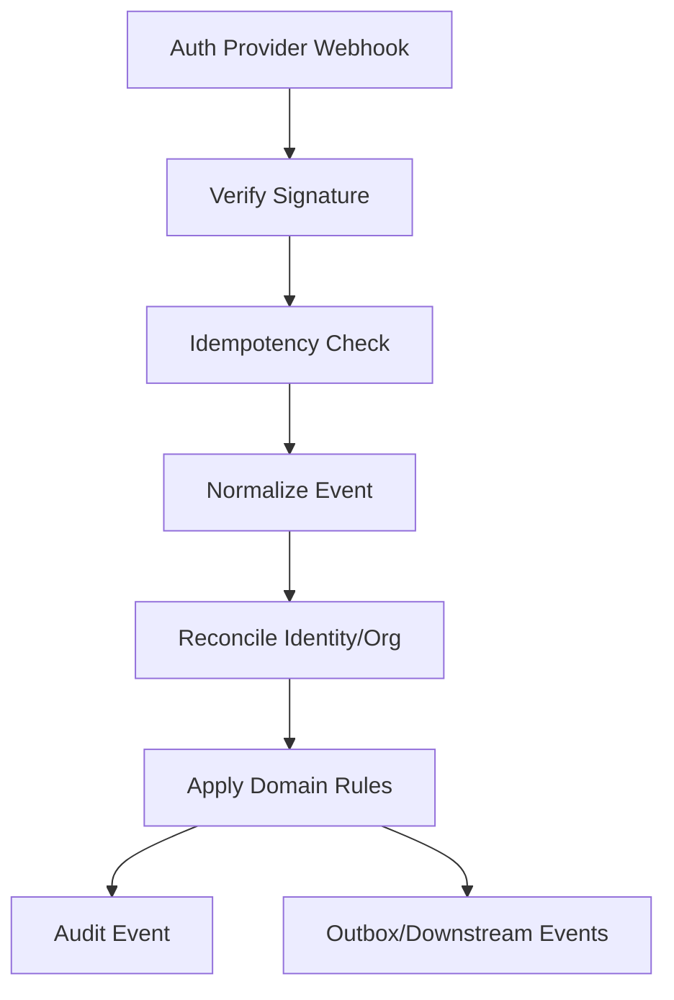
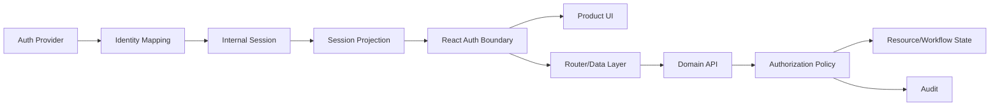

# Part 030 — Auth Provider Integration Patterns

An auth provider integration is not a package install.

It is an architectural dependency.

A provider can give you:

```txt
- hosted login;
- OAuth/OIDC flows;
- passwordless login;
- passkeys;
- MFA;
- user management;
- organization management;
- SSO/SAML;
- directory sync;
- session management;
- webhooks;
- audit events;
- SDKs;
- claims;
- sometimes roles/permissions.
```

But your application still owns:

```txt
- product authorization;
- tenant isolation;
- resource-level access;
- workflow state transitions;
- audit meaning;
- incident response;
- regulatory defensibility;
- domain-specific user journeys.
```

The core mistake is treating an auth provider as the entire security model.

A provider can authenticate a user. It may help manage identity. It may provide organization membership and coarse roles. It does not magically know whether an investigator can approve a case, whether a reviewer can see sealed evidence, or whether a temporary grant expired after escalation.

---

## 1. The provider boundary

Use this invariant:

```txt
An auth provider is an identity/session supplier.
The application is still the authorization authority for domain actions.
```

Provider output:

```txt
user id
session id
token
claims
organization id
membership info
MFA/assurance hints
authentication event
```

Application decision:

```txt
subject can action on resource under context?
```

Do not collapse these two.

Bad code:

```tsx
if (user.publicMetadata.role === 'admin') {
  return <DeleteTenantButton />;
}
```

Better code:

```tsx
const decision = useCan({
  action: 'tenant.delete',
  resource: { type: 'tenant', id: tenant.id }
});

return <DeleteTenantButton disabled={!decision.allowed} reason={decision.reason} />;
```

The provider may supply inputs. Your policy still decides.

---

## 2. Provider categories

Different tools solve different layers.

```txt
Identity Provider / CIAM
  Handles user login, sessions, social login, MFA, user lifecycle.
  Examples: Auth0, Amazon Cognito, Firebase Auth, Supabase Auth.

React-first user management platform
  Provides prebuilt React components, hooks, sessions, organizations.
  Example: Clerk.

Enterprise identity platform
  Focuses on SSO, SAML, directory sync, enterprise org lifecycle.
  Example: WorkOS.

Application authorization system
  Decides fine-grained permissions.
  Examples: custom policy engine, OPA-style systems, Zanzibar/OpenFGA-style systems.
```

These categories can overlap. Do not rely on marketing category names. Inspect actual boundaries:

```txt
- Who owns login UX?
- Who owns session cookie?
- Who owns token verification?
- Who owns organization membership?
- Who owns permission decisions?
- Who owns audit events?
- Who owns user deletion/export?
- Who owns incident response?
```

---

## 3. Integration shapes

There are five common shapes.

### Shape A — Pure SPA SDK

```txt
React app -> provider SDK -> provider hosted login -> access token -> API
```

Pros:

```txt
- fastest integration;
- simple for prototypes;
- good SDK ergonomics;
- hosted login reduces custom auth UI risk.
```

Cons:

```txt
- token handling lives in browser;
- harder to hide tokens from JavaScript;
- API must validate provider tokens directly;
- provider SDK often leaks through app code;
- SSR/BFF migration can be harder later.
```

Good for:

```txt
- early-stage SPA;
- low/medium risk internal app;
- simple API architecture;
- apps where provider token is the accepted API credential.
```

Be careful for:

```txt
- regulated apps;
- high-risk tenant isolation;
- complex object-level authorization;
- multiple APIs with different audiences;
- strong revocation requirements.
```

---

### Shape B — SPA with BFF session

```txt
React app -> BFF -> provider OAuth/OIDC -> BFF app session -> APIs
```

Pros:

```txt
- tokens can stay server-side;
- browser uses HttpOnly app session cookie;
- app can normalize provider identity;
- easier to centralize auth/session policy;
- API sees internal session/subject context.
```

Cons:

```txt
- BFF adds operational complexity;
- CSRF protection becomes important;
- BFF must manage token refresh/revocation;
- more backend code.
```

Good for:

```txt
- production SaaS;
- regulated systems;
- complex multi-tenant apps;
- SSR/data-loader apps;
- enterprise SSO;
- apps with sensitive data.
```

This is often the cleanest long-term architecture for serious React apps.

---

### Shape C — Framework/server SDK integration

```txt
React framework route/server code -> provider server SDK -> app session/projection
```

Examples:

```txt
- Next.js App Router with server-side session helpers;
- React Router framework/data mode with server loaders;
- TanStack Start-style server functions;
- Remix-like server route modules.
```

Pros:

```txt
- auth can happen before render;
- less client-side flash/leak;
- better SSR integration;
- can centralize session projection.
```

Cons:

```txt
- framework coupling;
- runtime constraints: Node vs Edge vs browser;
- provider helpers may hide important details;
- migration between frameworks may be expensive.
```

Good for:

```txt
- SSR apps;
- route-loader-first apps;
- apps with server-rendered sensitive data;
- strong UX requirements during bootstrap.
```

---

### Shape D — Hosted enterprise SSO

```txt
tenant domain/org discovery -> enterprise IdP -> provider broker -> app session
```

Pros:

```txt
- enterprise customer requirement;
- centralizes SAML/OIDC complexity;
- supports IdP-initiated and SP-initiated flows;
- enables directory sync and lifecycle management.
```

Cons:

```txt
- tenant routing complexity;
- JIT provisioning edge cases;
- deprovisioning delay risks;
- group/role mapping drift;
- customer-specific debugging.
```

Good for:

```txt
- B2B SaaS;
- enterprise sales motion;
- customers with Okta/Entra/Google Workspace/etc.;
- domain-based org discovery.
```

---

### Shape E — Provider authentication + internal authorization

```txt
provider authenticates identity
app maps identity to internal subject
app authorization engine decides permissions
```

This is the target shape for complex apps.

```mermaid
flowchart TD
    Browser[React App] --> AuthProvider[Auth Provider]
    AuthProvider --> Callback[App Callback/BFF]
    Callback --> IdentityMap[(Identity Mapping)]
    IdentityMap --> AppSession[Internal App Session]
    AppSession --> SessionAPI[/session]
    SessionAPI --> ReactAuth[React Auth Store]
    ReactAuth --> Router[Route/Data Guards]
    ReactAuth --> PermissionUI[Permission-aware UI]
    API[Domain API] --> Policy[Authorization Engine]
    Policy --> ResourceDB[(Domain Resources)]
```

Provider identity is input. Internal authorization is the decision system.

---

## 4. Never leak provider SDK everywhere

A common React anti-pattern:

```tsx
import { useAuth0 } from '@auth0/auth0-react';
import { useUser } from '@clerk/react';
import { Auth } from 'aws-amplify';
```

spread across hundreds of components.

This creates provider lock-in at the worst possible layer: product UI.

Better:

```txt
provider SDK -> auth adapter -> app auth store -> product hooks/components
```

Product code imports your boundary:

```ts
const session = useSession();
const decision = useCan({ action: 'case.approve', resource: caseRef });
const authActions = useAuthActions();
```

It does not import provider SDK directly.

---

## 5. Provider adapter interface

Define an application-owned interface.

```ts
export type AuthStatus =
  | 'unknown'
  | 'anonymous'
  | 'authenticated'
  | 'refreshing'
  | 'expired'
  | 'forbidden'
  | 'degraded';

export type SessionProjection = {
  status: AuthStatus;
  user?: {
    id: string;
    displayName: string;
    email?: string;
    avatarUrl?: string;
  };
  tenant?: {
    id: string;
    slug: string;
    displayName: string;
  };
  assurance?: {
    level: 'baseline' | 'mfa' | 'phishing_resistant';
    method?: string;
    authenticatedAt?: string;
  };
  permissionsVersion?: number;
  sessionVersion?: number;
};

export interface AuthAdapter {
  bootstrap(): Promise<SessionProjection>;
  login(input?: LoginInput): Promise<void>;
  logout(input?: LogoutInput): Promise<void>;
  refresh?(): Promise<SessionProjection>;
  getAccessToken?(input?: TokenRequest): Promise<string>;
  switchTenant?(tenantId: string): Promise<SessionProjection>;
}
```

Provider-specific code lives behind the adapter:

```txt
Auth0Adapter
ClerkAdapter
CognitoAdapter
WorkOSBffAdapter
SupabaseAdapter
CustomOidcAdapter
```

Your React app uses only:

```txt
AuthProvider
useSession
useAuthActions
useCan
```

---

## 6. Session projection API

Even when a provider has a React hook, serious apps should expose an app-owned session projection:

```http
GET /api/session
```

Example response:

```json
{
  "status": "authenticated",
  "user": {
    "id": "usr_01H",
    "displayName": "Ari",
    "email": "ari@example.com"
  },
  "tenant": {
    "id": "tenant_01",
    "slug": "acme",
    "displayName": "Acme Corp"
  },
  "assurance": {
    "level": "mfa",
    "method": "webauthn",
    "authenticatedAt": "2026-07-07T10:00:00Z"
  },
  "permissionsVersion": 81,
  "sessionVersion": 12
}
```

Why this matters:

```txt
- normalizes provider differences;
- hides token details;
- supports BFF and SPA modes;
- supports multi-tenant session;
- gives React stable shape;
- allows migration between providers;
- allows internal user id separate from provider user id;
- prevents product code from depending on raw claims.
```

---

## 7. Identity mapping

Provider user id is not always your domain user id.

Use identity mapping:

```sql
create table external_identities (
  id uuid primary key,
  provider text not null,
  provider_subject text not null,
  user_id uuid not null,
  email text,
  email_verified boolean,
  created_at timestamptz not null,
  last_seen_at timestamptz,
  unique (provider, provider_subject)
);
```

Why:

```txt
- migration between providers;
- account linking;
- enterprise SSO + passwordless fallback;
- social login linking;
- user deletion/export;
- audit continuity;
- support tooling;
- internal authorization stability.
```

Bad design:

```txt
Every domain table stores auth0|abc123 as user_id.
```

Better:

```txt
Domain tables store internal user uuid.
External identities map provider subjects to internal users.
```

---

## 8. Organization and tenant mapping

Provider organization is not automatically your tenant.

You need a mapping:

```sql
create table external_organizations (
  id uuid primary key,
  provider text not null,
  provider_org_id text not null,
  tenant_id uuid not null,
  created_at timestamptz not null,
  unique (provider, provider_org_id)
);
```

Why:

```txt
- tenant lifecycle may differ from provider org lifecycle;
- one enterprise customer may map to multiple tenants;
- internal tenant state may include billing, jurisdiction, data residency;
- provider org membership may be only one input to app access;
- tenant deletion/suspension must be app-controlled.
```

React should receive selected tenant from your app session projection, not infer it from random token claims alone.

---

## 9. Hosted UI vs embedded UI

### Hosted UI

```txt
User leaves app -> provider login page -> callback -> app
```

Pros:

```txt
- provider handles sensitive login UI;
- less password/passkey/MFA implementation burden;
- easier protocol correctness;
- often better security updates;
- supports SSO/MFA features faster.
```

Cons:

```txt
- branding/UX constraints;
- redirect complexity;
- callback hardening required;
- local development setup;
- customer-specific IdP debugging still exists.
```

### Embedded UI

```txt
Login form/components rendered inside your React app
```

Pros:

```txt
- deeper UX control;
- smoother product flow;
- component-level customization.
```

Cons:

```txt
- more security responsibility;
- harder to keep up with auth feature changes;
- more attack surface;
- more SDK coupling;
- risk of recreating password/MFA mistakes.
```

Default recommendation for serious systems:

```txt
Use hosted/provider-managed login where possible.
Use app-owned authorization and session projection after login.
```

---

## 10. Token strategy with providers

Common options:

```txt
Provider token directly to API
  React obtains provider access token.
  API validates provider issuer/audience/signature.

Provider token exchanged for app session
  BFF/server receives provider callback.
  Server maps identity.
  Server creates internal session.

Provider token exchanged for internal token
  API gateway/auth service exchanges external token for internal token.
  Internal services trust internal issuer.
```

For complex systems, avoid spreading provider token validation across every domain service.

Better:

```txt
provider token -> identity boundary -> internal subject/session -> policy decision
```

Why:

```txt
- one place to handle provider changes;
- one place to map identities;
- one place to enforce tenant/account state;
- one place to revoke app sessions;
- cleaner audit logs;
- less claim-coupling in domain services.
```

---

## 11. Claims are not permission models

Provider claims are useful, but dangerous when overused.

Examples:

```json
{
  "sub": "auth0|abc",
  "email": "ari@example.com",
  "org_id": "org_123",
  "roles": ["admin"]
}
```

This is not enough for complex authorization.

Questions claims often cannot answer:

```txt
- Admin of what tenant?
- Admin over which resource type?
- Is the resource sealed?
- Is the case in a state that allows update?
- Was access granted temporarily?
- Has approval conflict-of-interest rule triggered?
- Does this action require step-up?
- Did membership change after token issuance?
```

Claims are session inputs. Permissions are decisions.

Use claims for:

```txt
- identity bootstrap;
- organization hint;
- assurance hints;
- coarse feature eligibility;
- token audience/scope validation.
```

Use app authorization for:

```txt
- domain actions;
- resource access;
- tenant isolation;
- workflow transitions;
- escalation;
- approval authority;
- audit-defensible decisions.
```

---

## 12. Provider-specific integration notes

This is not a vendor ranking. It is a boundary analysis.

### Auth0-style integration

Typical strengths:

```txt
- OAuth/OIDC/CIAM depth;
- hosted Universal Login;
- React SPA SDK;
- rules/actions/extensibility;
- enterprise federation options;
- mature token ecosystem.
```

Boundary advice:

```txt
- keep Auth0 SDK behind adapter;
- avoid spreading getAccessTokenSilently everywhere;
- validate audience and issuer in API/BFF;
- map Auth0 subject to internal user id;
- avoid treating Auth0 roles as full domain policy;
- use Universal Login/callback hardening correctly.
```

### Clerk-style integration

Typical strengths:

```txt
- React-first developer experience;
- prebuilt UI components;
- user/session hooks;
- organization support;
- framework-specific helpers;
- fast product integration.
```

Boundary advice:

```txt
- do not let UI components define security model;
- wrap Clerk hooks in app-owned hooks;
- map Clerk user/org ids to internal ids;
- decide which metadata is authoritative;
- keep domain permissions outside product components;
- verify server-side auth in loaders/API routes.
```

### WorkOS-style integration

Typical strengths:

```txt
- enterprise SSO;
- directory sync;
- organization/customer identity workflows;
- audit/event-oriented enterprise needs;
- enterprise readiness.
```

Boundary advice:

```txt
- model org discovery explicitly;
- treat directory groups as inputs, not final permissions;
- build reconciliation and deprovisioning workflows;
- support customer-specific debugging;
- keep tenant mapping stable internally;
- design JIT provisioning carefully.
```

### Cognito-style integration

Typical strengths:

```txt
- AWS-native identity service;
- user pools;
- hosted UI/managed login;
- federation;
- integration with AWS services;
- Amplify UI patterns.
```

Boundary advice:

```txt
- avoid coupling every app layer to Amplify abstractions;
- decide early whether Cognito tokens are API credentials or exchanged;
- model groups/claims as coarse inputs;
- be explicit about app clients, callback URLs, token lifetimes;
- test hosted UI and IdP flows per environment.
```

### Supabase/Firebase-style integration

Typical strengths:

```txt
- fast full-stack app setup;
- auth tightly integrated with data layer;
- realtime/storage/database ecosystem;
- good for product velocity.
```

Boundary advice:

```txt
- never rely only on frontend checks;
- enforce row/resource policies server-side;
- be explicit about custom claims and refresh timing;
- avoid mixing feature flags, billing, and permissions in raw client metadata;
- treat storage/download permissions as first-class authorization.
```

---

## 13. Decision matrix

```txt
Use Pure SPA SDK when:
  - app risk is modest;
  - API can validate provider token cleanly;
  - no complex SSR/BFF needs;
  - fast integration is more important than long-term abstraction.

Use BFF when:
  - you handle sensitive data;
  - tokens should not be exposed to JS;
  - you need server-side session control;
  - you have complex tenant/resource authorization;
  - you need SSR/data-loader auth.

Use hosted enterprise SSO when:
  - B2B customers require SAML/OIDC federation;
  - org discovery matters;
  - directory sync/deprovisioning matters;
  - enterprise support is a product feature.

Use internal authorization engine when:
  - access depends on resource state;
  - roles are insufficient;
  - permissions are temporary/contextual;
  - audit defensibility matters;
  - object-level access is complex.
```

A mature architecture often combines all four:

```txt
provider hosted login
+ BFF/internal session
+ enterprise SSO support
+ internal authorization engine
```

---

## 14. Lock-in surface

Provider lock-in is not just “we imported an SDK”.

Lock-in surfaces:

```txt
- user id format stored in domain tables;
- organization id stored as tenant id;
- raw token claims used in product logic;
- provider roles used as domain permissions;
- provider SDK hooks imported everywhere;
- provider-specific UI components used deeply;
- provider webhook payloads written directly into domain state;
- provider session model assumed by API;
- callback URLs and environment structure hardcoded;
- audit logs depend on provider event names only;
- tests mock provider internals instead of app contracts.
```

Reduce lock-in by owning:

```txt
- internal user id;
- internal tenant id;
- session projection;
- permission contract;
- audit event vocabulary;
- auth adapter interface;
- identity mapping table;
- webhook normalization layer.
```

Do not abstract everything prematurely. Abstract the surfaces that would damage your architecture if they leak.

---

## 15. Webhooks and identity synchronization

Providers often emit events:

```txt
user.created
user.updated
user.deleted
organization.created
organization.updated
membership.created
membership.deleted
session.created
mfa.enabled
```

Do not apply webhook payloads blindly.

A robust webhook pipeline:



Important rules:

```txt
- verify webhook signature;
- make processing idempotent;
- tolerate out-of-order events;
- reconcile from provider API when needed;
- do not delete domain users immediately without policy;
- separate identity disabled from data deletion;
- audit membership and role changes;
- invalidate sessions/permissions when relevant.
```

---

## 16. JIT provisioning

Just-in-time provisioning means creating the internal user/membership when the external identity first logs in.

Good for:

```txt
- enterprise SSO onboarding;
- reducing manual admin work;
- domain-based tenant routing;
- initial membership sync.
```

Risks:

```txt
- wrong tenant assignment;
- email domain takeover assumptions;
- stale IdP group mapping;
- creating user without required app profile;
- privilege assignment before approval;
- audit gaps.
```

Safer JIT model:

```txt
1. external identity authenticates;
2. app maps external org/domain to tenant;
3. app creates internal user in pending/active state;
4. app creates membership with least privilege;
5. app runs group/role mapping policy;
6. app records provisioning audit event;
7. app returns session projection.
```

Do not let “user exists in IdP” automatically mean “user can access every domain object”.

---

## 17. Deprovisioning and permission drift

The dangerous case:

```txt
User removed from enterprise IdP group.
Provider updates membership.
App token/session still contains old role.
Frontend keeps showing admin UI.
API still accepts stale permission.
```

Controls:

```txt
- short-lived app sessions or permission versions;
- webhook-driven permission invalidation;
- server-side membership checks for sensitive actions;
- background reconciliation;
- forced logout/session revoke for critical changes;
- tenant-scoped cache busting;
- audit events for deprovisioning.
```

React implications:

```txt
- session projection must include version fields;
- query caches must reset on tenant/permission changes;
- UI must handle permission disappearance mid-flow;
- long forms must revalidate before submit;
- access denied must be recoverable and explainable.
```

---

## 18. Multi-provider architecture

Some products need multiple auth sources:

```txt
- passwordless for small customers;
- enterprise SSO for large customers;
- admin break-glass login;
- support impersonation;
- service account / machine auth;
- migration from old provider to new provider.
```

Use an identity broker layer:

```txt
external provider subject -> internal identity -> session -> authorization
```

Example:

```sql
provider      provider_subject       internal_user_id
auth0         auth0|abc              usr_123
workos        profile_789            usr_123
legacy        550e8400-e29b          usr_123
```

React does not need to know which provider authenticated the user except for UX copy and account settings.

Session projection may include:

```json
{
  "authSource": "enterprise_sso",
  "authProvider": "workos",
  "assurance": {
    "level": "mfa"
  }
}
```

But product authorization should not branch on provider name unless policy explicitly requires it.

---

## 19. Provider outage model

Auth provider outages happen. Your system should have a defined degradation model.

Questions:

```txt
- Can already-authenticated sessions continue?
- Can users refresh sessions?
- Can users log in?
- Can admins access break-glass path?
- Can permission checks continue if provider org API is unavailable?
- What does React show?
- What gets audited?
```

Recommended shape:

```txt
Existing app session valid:
  continue until normal expiry unless risk policy says otherwise.

New login requires provider:
  show login unavailable/degraded state.

Permission check requires internal policy:
  continue from internal state.

Provider profile/org sync unavailable:
  show degraded admin/user-management UI.

Sensitive account settings:
  disable or require retry.
```

React state should distinguish:

```txt
anonymous
authenticated
degraded_authenticated
provider_unavailable
session_refresh_failed
```

Do not force logout all users merely because provider profile API is temporarily unavailable unless you have a specific security reason.

---

## 20. Environment and callback management

Every environment needs precise config:

```txt
local dev
preview branch
staging
production
customer-specific domains
regional domains
```

Config checklist:

```txt
- allowed callback URLs;
- allowed logout URLs;
- allowed web origins;
- CORS origins;
- cookie domain;
- SameSite policy;
- tenant custom domains;
- issuer/audience;
- client id;
- client secret storage;
- signing key rotation;
- webhook endpoint and secret;
- environment-specific test users.
```

Bad practice:

```txt
Allow http://localhost:3000 and https://*.example.com everywhere.
```

Better:

```txt
Explicit environment-specific allowlists.
Infrastructure-managed config.
Automated drift check.
```

---

## 21. React composition pattern

```tsx
export function AppProviders({ children }: { children: React.ReactNode }) {
  return (
    <ProviderSdkBoundary>
      <AuthProvider adapter={authAdapter}>
        <PermissionProvider>
          <QueryClientProvider client={queryClient}>
            {children}
          </QueryClientProvider>
        </PermissionProvider>
      </AuthProvider>
    </ProviderSdkBoundary>
  );
}
```

But product components use only app hooks:

```tsx
function CaseApprovalPanel({ caseId }: { caseId: string }) {
  const session = useSession();
  const approval = useCan({
    action: 'case.approve',
    resource: { type: 'case', id: caseId }
  });

  if (session.status !== 'authenticated') {
    return <LoginRequired />;
  }

  return (
    <button disabled={!approval.allowed}>
      Approve case
    </button>
  );
}
```

No provider-specific imports.

No role string checks.

No raw claims in product UI.

---

## 22. Server-side verification boundary

For every API request:

```txt
1. Verify app session or provider token.
2. Map external subject to internal subject.
3. Check account/session/tenant status.
4. Resolve resource.
5. Run authorization policy.
6. Execute action.
7. Audit if relevant.
```

Example middleware shape:

```ts
type RequestContext = {
  subject: {
    userId: string;
    externalIdentities: Array<{
      provider: string;
      subject: string;
    }>;
  };
  tenant: {
    id: string;
  };
  session: {
    id: string;
    assuranceLevel: 'baseline' | 'mfa' | 'phishing_resistant';
  };
};
```

The domain handler receives internal context, not raw provider SDK state.

---

## 23. Provider roles vs app permissions

Provider roles are acceptable for coarse access, such as:

```txt
- can access admin portal;
- belongs to organization;
- support user;
- billing manager;
- beta feature cohort.
```

Provider roles are usually insufficient for:

```txt
- object-level permissions;
- workflow-state permissions;
- temporary delegations;
- conflict-of-interest rules;
- jurisdiction-specific access;
- cross-tenant resource sharing;
- regulated audit decisions;
- row/field-level permission.
```

A safe model:

```txt
provider role/group -> imported as attribute/grant source
app policy -> final decision
```

Example:

```txt
IdP group: acme-case-reviewers
maps to app grant: reviewer on tenant Acme
policy decides: reviewer can approve only if case.state == pending_review and no conflict exists
```

---

## 24. Migration strategy

Provider migrations are painful when provider details leak.

Prepare early:

```txt
- internal user ids;
- external identity table;
- app-owned session projection;
- adapter interface;
- permission contract;
- normalized audit events;
- webhook normalization;
- isolated callback handling.
```

Migration phases:

```txt
Phase 1: introduce identity mapping while old provider still runs.
Phase 2: introduce app-owned /session projection.
Phase 3: stop reading raw provider claims in product code.
Phase 4: add second provider behind same adapter.
Phase 5: migrate users/orgs gradually.
Phase 6: keep old provider subject as external identity record.
Phase 7: remove old SDK imports.
```

Test for:

```txt
- user keeps same internal id;
- audit continuity remains;
- permissions unchanged;
- active sessions handled safely;
- account recovery works;
- webhooks do not double-provision;
- tenant mapping remains stable.
```

---

## 25. Testing provider integrations

Do not make all auth tests depend on live provider behavior.

Use layers:

```txt
Unit tests:
  adapter maps provider response to SessionProjection.

Contract tests:
  /session shape remains stable.
  callback handles expected provider payloads.
  webhook verification/replay/idempotency works.

Integration tests:
  provider test tenant/client.
  login/callback/logout in staging.
  SSO customer sandbox.

E2E tests:
  seeded users and tenants.
  permission matrix.
  auth failure paths.
```

Mock at your app boundary:

```ts
const fakeSession: SessionProjection = {
  status: 'authenticated',
  user: { id: 'usr_test', displayName: 'Test User' },
  tenant: { id: 'tenant_test', slug: 'test', displayName: 'Test Tenant' },
  assurance: { level: 'mfa' },
  permissionsVersion: 1,
  sessionVersion: 1
};
```

Do not mock provider internals in product component tests.

---

## 26. Security review checklist

Ask these before approving a provider integration:

```txt
Identity
  [ ] Do we map provider subject to internal user id?
  [ ] Do we handle account linking safely?
  [ ] Do we handle user deletion/disable separately from data deletion?

Session
  [ ] Who owns the browser session?
  [ ] Are tokens exposed to JavaScript?
  [ ] How does logout work across provider/app/API?
  [ ] How are sessions revoked?

Authorization
  [ ] Are provider roles only inputs?
  [ ] Is final authorization server-side?
  [ ] Is tenant isolation enforced by backend?
  [ ] Are permission caches invalidated on membership change?

SSO / Enterprise
  [ ] How does org discovery work?
  [ ] How does JIT provisioning work?
  [ ] How does deprovisioning work?
  [ ] How are IdP groups mapped?

React
  [ ] Is provider SDK isolated?
  [ ] Are product components provider-agnostic?
  [ ] Are loading/degraded states explicit?
  [ ] Are redirects safe?

Operations
  [ ] Are webhooks verified and idempotent?
  [ ] Are audit events normalized?
  [ ] Is there an outage runbook?
  [ ] Is config managed per environment?
```

---

## 27. Architecture decision record template

Use ADRs for auth provider decisions.

```md
# ADR: Auth Provider Integration Strategy

## Context

We need authentication for <app/system>. Requirements:

- user login
- MFA
- SSO
- organizations
- session management
- tenant isolation
- permission model
- audit
- compliance/regulatory needs

## Decision

We will use <provider> for <identity/session capabilities>.
We will use <internal system> for <domain authorization>.
The React app will depend on <app-owned auth adapter>, not provider SDK directly.

## Architecture

- Login UI:
- Callback handling:
- Session owner:
- Token storage:
- Internal user id mapping:
- Tenant mapping:
- Permission source:
- Webhook handling:
- Logout/revocation:

## Consequences

Positive:

- ...

Negative:

- ...

Risks:

- ...

Mitigations:

- ...

## Reversibility

- What would be required to migrate providers?
- Which data model choices reduce migration risk?
```

Auth provider choices are hard to reverse. Write the decision down.

---

## 28. Reference implementation shape

```txt
src/auth/
  AuthProvider.tsx
  authStore.ts
  useSession.ts
  useAuthActions.ts
  authAdapter.ts
  providerAdapters/
    auth0Adapter.ts
    clerkAdapter.ts
    cognitoAdapter.ts
    bffAdapter.ts
  permissions/
    useCan.ts
    PermissionProvider.tsx
    permissionClient.ts
```

Server:

```txt
server/auth/
  callbackHandler.ts
  sessionService.ts
  identityMapping.ts
  providerClients/
  webhookHandlers/
  sessionProjection.ts

server/authorization/
  policyEngine.ts
  permissionProjection.ts
  decisionAudit.ts
```

Keep provider-specific code small and boring.

The rest of your app should speak your domain language:

```txt
user
session
tenant
membership
permission
decision
audit event
```

not provider-specific language.

---

## 29. Final mental model



The provider answers:

```txt
Who authenticated?
How did they authenticate?
What external org/session context exists?
```

The app answers:

```txt
Who is this in our domain?
Which tenant are they operating in?
What are they allowed to do?
Why was access granted or denied?
How is the decision audited?
```

That separation is the difference between “we installed auth” and “we designed an authorization-capable identity architecture”.

---

## 30. Key takeaways

Do not choose an auth provider by asking only:

```txt
How fast can we add login?
```

Ask:

```txt
Where is the trust boundary?
Who owns the session?
Where are tokens stored?
How do we map identity?
How do we model tenants?
Where is authorization enforced?
How do we migrate later?
How do we audit decisions?
How does the system fail?
```

Provider SDKs are useful. Hosted login is useful. Prebuilt components are useful.

But serious React auth architecture requires an app-owned boundary:

```txt
provider -> adapter -> internal session projection -> authorization contract -> product UI
```

Use providers to avoid rebuilding commodity identity infrastructure.

Do not outsource your domain authorization model by accident.

---

## Phase 3 completion

This part closes Phase 3: OAuth 2.0, OIDC, SSO, MFA, passkeys, and provider integration patterns.

At this point, the series has established:

```txt
- what OAuth/OIDC are and are not;
- why Authorization Code with PKCE is the modern browser flow;
- why Implicit Flow is legacy;
- how to distinguish ID/access/refresh tokens;
- how to harden callback routes;
- how to model login redirect as a state machine;
- how SSO and enterprise identity affect React architecture;
- how MFA and step-up authentication fit sensitive actions;
- how WebAuthn/passkeys change the auth primitive;
- how to integrate providers without surrendering app architecture.
```

Next phase: React Router, route protection, data loading, loader/action authorization, route metadata, auth error boundaries, and layout security.

---

## References

- Auth0 Docs — Auth0 React SDK for Single Page Apps.
- Clerk Docs — Clerk React SDK and React Router SDK.
- AWS Docs — Amazon Cognito user pools, managed login, and React/Amplify authentication patterns.
- WorkOS Docs — AuthKit, Hosted UI, Single Sign-On, Directory Sync, FGA, and API references.
- Supabase Docs — Auth and third-party auth provider integrations.
- OAuth 2.0 Security Best Current Practice — RFC 9700.
- OAuth 2.0 for Browser-Based Applications — IETF draft.
- OWASP Authentication, Session Management, Authorization, and CSRF Cheat Sheets.
