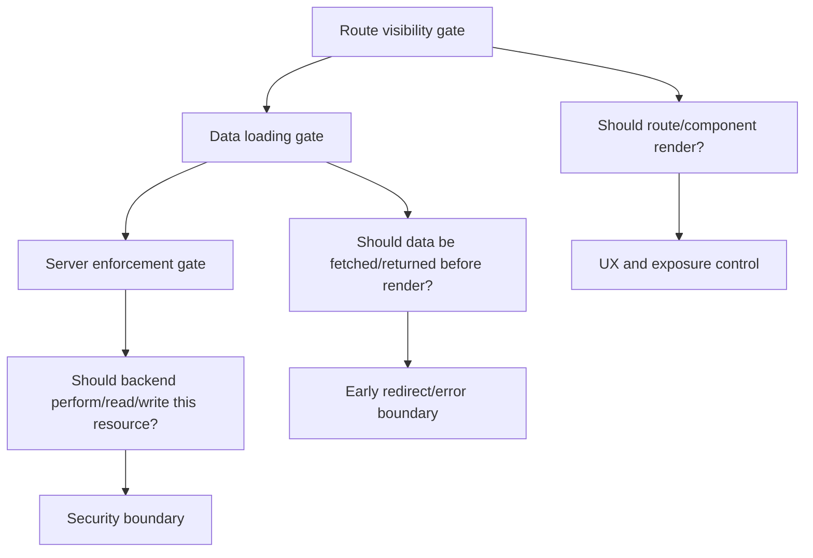
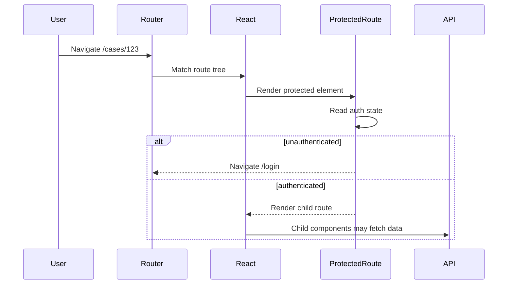
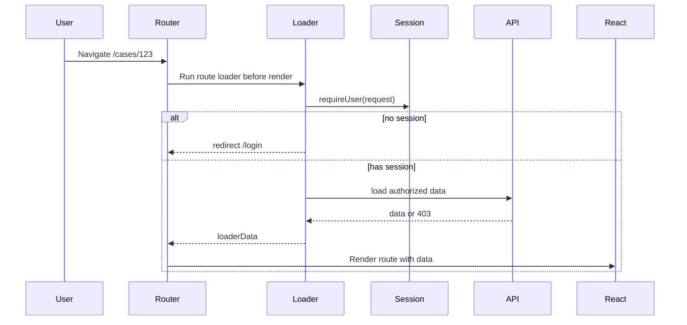
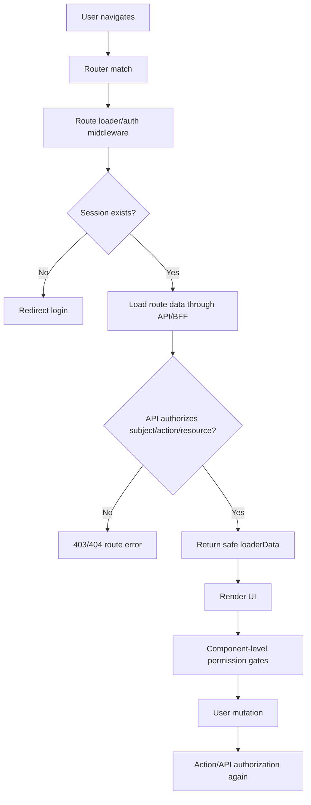

# Part 031 — Protected Routes Are Not Enough

Most React authentication tutorials teach this shape:

```tsx
function ProtectedRoute() {
  const { user } = useAuth();

  if (!user) {
    return <Navigate to="/login" replace />;
  }

  return <Outlet />;
}
```

That pattern is not useless.

It is just not the architecture.

A component-level protected route answers one narrow question:

```txt
Should this route element be rendered for the current client-side auth state?
```

A production auth system must answer a larger set of questions:

```txt
Can this request load this data?
Can this mutation execute?
Can this subject perform this action on this resource in this tenant?
Can stale auth state be trusted during navigation?
Can hidden UI state leak sensitive data before redirect?
Can a direct API call bypass the route guard?
Can a prefetch, loader, cache, or retry run before the guard decides?
Can a role change revoke access immediately enough?
Can the system explain and audit the denial?
```

A protected route is a render gate.

Authentication and authorization need request gates, data gates, mutation gates, and server-side enforcement gates.

---

## 1. The core mistake

The weak mental model:

```txt
If the user cannot see the page, the user cannot access the feature.
```

The correct mental model:

```txt
Visibility is not authority.
Rendering is not permission.
Navigation is not enforcement.
The browser is not the policy decision point.
```

The frontend can reduce accidental exposure. It can improve UX. It can guide users away from screens they cannot use. It can avoid showing irrelevant actions.

But it cannot be the final security boundary because the user controls the browser runtime.

They can:

```txt
- call APIs directly;
- modify local state;
- replay requests;
- inspect bundles;
- bypass route components;
- race navigation and data loading;
- use stale cached data;
- alter query parameters and resource ids;
- execute JavaScript through XSS if the app is vulnerable;
- use DevTools, scripts, extensions, or custom HTTP clients.
```

So the protected route must be demoted from "security mechanism" to "UX and exposure-control mechanism".

The server remains the enforcement boundary.

---

## 2. Three different gates people accidentally collapse

A React auth design needs at least three layers.



### Route visibility gate

This is the classic protected route.

It decides whether a route element should render.

Good for:

```txt
- hiding authenticated-only pages from anonymous users;
- avoiding confusing screens;
- redirecting users to login;
- showing correct layout shell;
- reducing accidental data exposure;
- maintaining a coherent navigation experience.
```

Not sufficient for:

```txt
- protecting backend data;
- preventing direct API calls;
- enforcing object-level authorization;
- preventing mutation;
- enforcing tenant isolation;
- preventing stale permission use;
- auditing access decisions.
```

### Data loading gate

This decides whether the route should load data before the component renders.

With React Router Data/Framework mode, this usually belongs in `loader` and `action` functions.

Good for:

```txt
- avoiding sensitive data flash;
- redirecting before route UI renders;
- returning 401/403 route errors;
- ensuring data and route auth state are consistent;
- precomputing permitted actions;
- coordinating pending UI and revalidation.
```

Still not sufficient if it only exists in the frontend bundle.

### Server enforcement gate

This is the real security boundary.

It decides per request:

```txt
subject + action + resource + context => allow | deny
```

This gate must exist on every backend endpoint, including:

```txt
- REST reads;
- REST mutations;
- GraphQL queries;
- GraphQL mutations;
- file downloads;
- signed URL issuance;
- background job triggers;
- websocket channel subscription;
- bulk actions;
- export endpoints;
- admin endpoints;
- internal BFF endpoints.
```

OWASP's authorization guidance is explicit about the principle: permissions should be validated on every request, independent of whether the request came from AJAX, server-side code, or another source.

---

## 3. The protected route timing problem

A component guard runs after the router has matched the route and React has begun rendering the relevant tree.

That is already late.

Simplified flow:



The guard only controls its child render.

It does not automatically control:

```txt
- fetches started outside the guarded subtree;
- query caches hydrated before the guard;
- route loaders already triggered by the router;
- preloaded data;
- service worker cache;
- background polling;
- stale React Query/TanStack Query data;
- server-rendered markup;
- assets and route modules already downloaded;
- direct API calls.
```

A loader-level gate moves the decision earlier:



This still does not replace backend enforcement. It merely prevents the component from rendering with missing or unauthorized data.

---

## 4. The classic anti-pattern

A common implementation:

```tsx
function RequireAuth({ children }: { children: React.ReactNode }) {
  const { user, isLoading } = useAuth();

  if (isLoading) return <FullPageSpinner />;
  if (!user) return <Navigate to="/login" replace />;

  return <>{children}</>;
}

function AppRoutes() {
  return (
    <Routes>
      <Route path="/login" element={<LoginPage />} />
      <Route
        path="/cases/:caseId"
        element={
          <RequireAuth>
            <CasePage />
          </RequireAuth>
        }
      />
    </Routes>
  );
}
```

This is acceptable for a small UI-only guard.

But the real problem often hides inside `CasePage`:

```tsx
function CasePage() {
  const { caseId } = useParams();
  const query = useQuery({
    queryKey: ["case", caseId],
    queryFn: () => fetchJson(`/api/cases/${caseId}`),
  });

  return <CaseDetails data={query.data} />;
}
```

Now ask:

```txt
What happens if the API does not enforce object-level access?
What happens if cached data from a previous user remains in memory?
What happens if /api/cases/:caseId trusts the frontend route guard?
What happens if a user changes caseId in the URL?
What happens if role changes while the tab is open?
What happens if auth state is "loading" but stale data is already rendered?
```

The protected route only knows `user exists`.

It does not know whether the user can read `case:123`.

---

## 5. Authentication guard vs authorization guard

Most `ProtectedRoute` examples check authentication only.

```tsx
if (!user) return <Navigate to="/login" />;
```

But many protected pages need authorization:

```txt
Can this user view this tenant?
Can this user read this case?
Can this user edit this case?
Can this user approve this transition?
Can this user see sealed fields?
Can this user export the data?
```

Authentication answers:

```txt
Who is the user?
```

Authorization answers:

```txt
What can this user do to this resource under this context?
```

A protected route that only checks `isAuthenticated` is a lobby guard, not a domain authorization gate.

For example:

```tsx
function RequireRole({ role, children }: Props) {
  const { user } = useAuth();

  if (!user) return <Navigate to="/login" />;
  if (!user.roles.includes(role)) return <Forbidden />;

  return <>{children}</>;
}
```

This is also weak when used as the only check.

Why?

Because roles are often coarse. Domain authorization is often resource-sensitive.

```txt
admin of tenant A != admin of tenant B
case reviewer != reviewer of this case
manager role != can approve this transition now
editor role != can edit after record is locked
support role != can impersonate without audit and justification
```

A route guard can help with broad route eligibility.

Object-level authorization belongs close to the data and mutation boundary.

---

## 6. What protected routes are good for

Do not throw the pattern away.

Use it for the right job.

Protected routes are good for:

```txt
- user experience routing;
- authenticated layout selection;
- avoiding obvious unauthorized screen exposure;
- anonymous vs authenticated route groups;
- preserving return URL intent;
- showing login/onboarding/setup flows;
- coarse navigation filtering;
- reducing accidental data fetching;
- centralizing "must be logged in" behavior.
```

Protected routes are not good for:

```txt
- final authorization;
- object-level permission;
- tenant isolation;
- mutation approval;
- audit-grade decisioning;
- revocation enforcement;
- hiding secrets;
- protecting API data;
- proving compliance.
```

The pattern is a presentation boundary.

Treating it as a policy enforcement point is the bug.

---

## 7. Route protection taxonomy

A mature React app often uses several guard types.

| Guard type | Layer | Purpose | Security boundary? |
|---|---|---:|---:|
| Anonymous-only guard | Route/UI | Prevent logged-in users from seeing login/register | No |
| Authenticated guard | Route/UI or loader | Require any valid session | Partial UX boundary |
| Onboarding guard | Route/data | Require account setup completion | No, unless server enforces too |
| Tenant guard | Loader/API | Require selected tenant membership | Server must enforce |
| Permission guard | Loader/API/UI | Require action/resource permission | Server must enforce |
| Step-up guard | Route/action/API | Require fresh MFA/re-auth | Server must enforce |
| Feature flag gate | UI/config | Release control | No; not authorization |
| Ownership guard | API/domain | User owns resource or relation | Yes, server/domain boundary |
| Workflow-state guard | API/domain | Action allowed in current state | Yes, server/domain boundary |

A route can have multiple gates:

```txt
/cases/:caseId/approve
  - authenticated user required
  - tenant membership required
  - case readable by user
  - approve action allowed
  - case state must be REVIEWED
  - MFA freshness required for high-risk approval
  - server must audit allow/deny
```

A single `ProtectedRoute` cannot faithfully model that.

---

## 8. A better route-level shape

Use a route loader to authenticate before render.

Example in React Router Data/Framework style:

```ts
// auth.server.ts or auth.client.ts depending on architecture
export type SessionUser = {
  id: string;
  tenantId: string;
  displayName: string;
  permissionsVersion: number;
};

export async function getSessionUser(request: Request): Promise<SessionUser | null> {
  const response = await fetch("/api/session", {
    headers: {
      cookie: request.headers.get("cookie") ?? "",
    },
  });

  if (response.status === 401) return null;
  if (!response.ok) throw new Response("Session check failed", { status: 503 });

  return response.json();
}

export async function requireUser(request: Request): Promise<SessionUser> {
  const user = await getSessionUser(request);

  if (!user) {
    const url = new URL(request.url);
    const returnTo = encodeURIComponent(url.pathname + url.search);
    throw redirect(`/login?returnTo=${returnTo}`);
  }

  return user;
}
```

Then use it in a loader:

```ts
export async function loader({ request, params }: Route.LoaderArgs) {
  const user = await requireUser(request);

  const caseResponse = await fetchCaseForUser({
    caseId: params.caseId,
    user,
    request,
  });

  if (caseResponse.status === 403) {
    throw new Response("Forbidden", { status: 403 });
  }

  if (caseResponse.status === 404) {
    throw new Response("Not Found", { status: 404 });
  }

  if (!caseResponse.ok) {
    throw new Response("Could not load case", { status: 502 });
  }

  return {
    user,
    case: await caseResponse.json(),
  };
}
```

This improves timing.

But notice the function name `fetchCaseForUser`.

The API still must verify `user` can read that case. The loader is not the final authority unless it runs inside your trusted server/BFF and calls trusted domain logic.

---

## 9. The backend still needs per-request enforcement

The API must not say:

```txt
The React route is protected, so this endpoint is safe.
```

The API must say:

```txt
Every request is hostile until authenticated and authorized here.
```

A backend endpoint shape:

```ts
type Decision =
  | { allowed: true }
  | { allowed: false; reason: "NO_SESSION" | "NO_TENANT" | "NO_PERMISSION" | "STATE_DENIED" };

async function canReadCase(subject: Subject, caseId: string): Promise<Decision> {
  const record = await caseRepository.findCaseAccessProjection(caseId);

  if (!record) {
    // Often return 404 for resources the user cannot know exist.
    return { allowed: false, reason: "NO_PERMISSION" };
  }

  if (record.tenantId !== subject.tenantId) {
    return { allowed: false, reason: "NO_TENANT" };
  }

  if (subject.permissions.includes("case:read:any")) {
    return { allowed: true };
  }

  if (record.assignedUserIds.includes(subject.id)) {
    return { allowed: true };
  }

  return { allowed: false, reason: "NO_PERMISSION" };
}

app.get("/api/cases/:caseId", async (req, res) => {
  const subject = await requireSubject(req);
  const decision = await canReadCase(subject, req.params.caseId);

  if (!decision.allowed) {
    auditAccessDenied({
      subjectId: subject.id,
      action: "case.read",
      resourceId: req.params.caseId,
      reason: decision.reason,
    });

    return res.status(404).json({ error: "Not found" });
  }

  const data = await caseRepository.getCase(req.params.caseId);
  return res.json(data);
});
```

For regulated systems, the authorization decision is usually more than a boolean. It has:

```txt
- subject;
- action;
- resource;
- tenant;
- workflow state;
- reason;
- policy version;
- evidence used;
- audit correlation id;
- timestamp;
- enforcement point.
```

The frontend can consume a simplified projection.

It should not invent the decision.

---

## 10. Data flash is the practical symptom

A visible bug often reveals the deeper architecture bug.

Data flash examples:

```txt
- User logs out, presses back, sees previous sensitive page for a moment.
- User switches tenant, old tenant data remains in table until refetch completes.
- User loses permission, but stale cached admin buttons remain visible.
- Loader redirects to login, but component-level query briefly renders old data.
- Suspense fallback hides the redirect loop but cached data remains in memory.
```

This happens when the app has no clear rule for unknown auth state.

A safer rendering rule:

```txt
Auth state unknown => render no sensitive data.
Permission unknown => render no privileged action.
Tenant switch in progress => clear tenant-scoped cache before showing new tenant UI.
Logout started => cancel in-flight requests and purge sensitive caches before navigation.
```

Deny-by-default is not just a backend rule. It is also a UI rendering discipline.

---

## 11. Unknown auth state is not authenticated

Many apps accidentally treat loading as allowed.

Bad:

```tsx
if (!user && !isLoading) return <Navigate to="/login" />;
return <Outlet />;
```

This means:

```txt
While loading, render protected content.
```

Better:

```tsx
function AuthenticatedOutlet() {
  const auth = useAuthSnapshot();

  switch (auth.status) {
    case "unknown":
    case "checking":
      return <AuthShellSkeleton />;

    case "anonymous":
      return <Navigate to="/login" replace />;

    case "authenticated":
      return <Outlet />;

    case "expired":
      return <Navigate to="/login?reason=expired" replace />;

    case "degraded":
      return <DegradedAuthExperience />;
  }
}
```

The invariant:

```txt
Unknown is not allow.
```

Unknown is a separate state.

---

## 12. Protected routes and query caches

Protected routes often fail because data libraries continue to hold sensitive data.

Example problem:

```tsx
const queryClient = new QueryClient();

function logout() {
  authClient.logout();
  navigate("/login");
}
```

Missing:

```txt
- cancel queries;
- clear authenticated query cache;
- remove tenant-scoped data;
- stop background polling;
- broadcast logout to other tabs;
- invalidate permission projection;
- clear optimistic mutations;
- reset websocket subscriptions.
```

Better shape:

```ts
async function logout() {
  authEvents.emit({ type: "logout:start" });

  await queryClient.cancelQueries();
  queryClient.removeQueries({ predicate: isSensitiveQuery });

  realtimeClient.disconnect("logout");
  await authClient.logout();

  authEvents.emit({ type: "logout:complete" });
  router.navigate("/login", { replace: true });
}
```

A route guard cannot clean up every data subsystem unless the architecture gives it hooks to do so.

---

## 13. Route modules and bundle exposure

A protected route does not hide frontend code.

Even with code splitting, route modules may be discoverable and downloadable by someone who can access the app assets.

Do not put secrets in route modules.

Never rely on route protection to hide:

```txt
- API secrets;
- internal service tokens;
- private keys;
- hidden endpoints;
- privileged algorithms;
- admin-only business rules that are sensitive by themselves;
- tenant data;
- audit evidence;
- signed URL secrets.
```

Frontend code is delivered to an untrusted device.

Code splitting helps performance. It is not a confidentiality boundary.

---

## 14. A practical layered design

Use this shape:



There are repeated checks.

That is not duplication.

That is defense in depth at different layers.

```txt
Route layer: should we enter this experience?
Data layer: should we load this screen's data?
UI layer: what should be visible and usable?
Mutation layer: should this state change execute?
API/domain layer: final enforcement and audit.
```

---

## 15. The correct role of frontend permission checks

Frontend permission checks should be treated as a projection of server authority.

Good:

```ts
type CasePermissionProjection = {
  resource: { type: "case"; id: string };
  allowedActions: Array<
    | "case.view"
    | "case.comment"
    | "case.assign"
    | "case.approve"
    | "case.close"
  >;
  deniedReasons?: Partial<Record<string, string>>;
  version: number;
};
```

The UI uses it:

```tsx
function CaseActions({ permissions }: Props) {
  return (
    <ActionBar>
      <Button disabled={!permissions.allowedActions.includes("case.comment")}>
        Comment
      </Button>

      {permissions.allowedActions.includes("case.approve") ? (
        <Button variant="primary">Approve</Button>
      ) : null}
    </ActionBar>
  );
}
```

The server still checks again when the user clicks Approve.

```txt
The projection improves UX.
The backend decision enforces security.
```

---

## 16. Common failure modes

### Failure mode 1 — direct API bypass

Route is protected, API is not.

```txt
GET /api/admin/users
```

Attacker bypasses React and calls endpoint directly.

Fix:

```txt
Backend authorization on every endpoint.
```

### Failure mode 2 — object id tampering

Route checks `user.role === "reviewer"`.

User changes:

```txt
/cases/123 -> /cases/999
```

API returns case 999 because it only checked user is logged in.

Fix:

```txt
Object-level authorization: user can read this specific case.
```

### Failure mode 3 — stale role after permission change

User has admin role in token. Admin role is revoked. Existing tab still shows admin UI.

Fix:

```txt
Short-lived projection, permission version, server-side enforcement, cache invalidation, session refresh, revocation events where necessary.
```

### Failure mode 4 — tenant switch bleed

User switches from Tenant A to Tenant B. React keeps Tenant A query cache visible.

Fix:

```txt
Tenant-scoped query keys, cache purge on tenant switch, server tenant validation.
```

### Failure mode 5 — redirect loop

Protected route sees unknown state as anonymous. Login route sees stale authenticated state. Router bounces forever.

Fix:

```txt
Explicit auth state machine and transition guards.
```

### Failure mode 6 — mutation hidden but endpoint open

Delete button hidden. API still allows DELETE.

Fix:

```txt
Mutation authorization in action/API/domain service.
```

### Failure mode 7 — auth provider role trusted directly

Provider claim says `role=admin`. App grants all admin actions in all tenants.

Fix:

```txt
Map external identity to internal subject and app-owned permissions.
```

---

## 17. Loader auth pattern

A minimal loader guard:

```ts
import { redirect } from "react-router";

export async function requireAuthenticatedLoader({ request }: Route.LoaderArgs) {
  const session = await getSession(request);

  if (!session) {
    const url = new URL(request.url);
    throw redirect(`/login?returnTo=${encodeURIComponent(url.pathname + url.search)}`);
  }

  return session;
}
```

A domain loader guard:

```ts
export async function loader({ request, params }: Route.LoaderArgs) {
  const session = await requireAuthenticatedLoader({ request } as Route.LoaderArgs);

  const response = await fetch(`/api/cases/${params.caseId}/screen`, {
    headers: await authHeadersFor(request),
  });

  if (response.status === 401) {
    throw redirect(`/login?returnTo=${new URL(request.url).pathname}`);
  }

  if (response.status === 403) {
    throw new Response("Forbidden", { status: 403 });
  }

  if (response.status === 404) {
    throw new Response("Not found", { status: 404 });
  }

  if (!response.ok) {
    throw new Response("Upstream failure", { status: 502 });
  }

  return response.json();
}
```

This creates a route-level invariant:

```txt
The route component only receives data that passed the route's loading policy.
```

Not enough alone, but far better than fetching inside a component after a render guard.

---

## 18. Action auth pattern

Reads are not the only risk.

Mutations must be guarded too.

```ts
export async function action({ request, params }: Route.ActionArgs) {
  await requireAuthenticatedLoader({ request } as Route.LoaderArgs);

  const formData = await request.formData();
  const intent = formData.get("intent");

  if (intent === "approve") {
    const response = await fetch(`/api/cases/${params.caseId}/approve`, {
      method: "POST",
      headers: await authHeadersFor(request),
      body: JSON.stringify({
        comment: formData.get("comment"),
      }),
    });

    if (response.status === 403) {
      return { ok: false, reason: "You cannot approve this case." };
    }

    if (!response.ok) {
      throw new Response("Approval failed", { status: response.status });
    }

    return redirect(`/cases/${params.caseId}`);
  }

  throw new Response("Unknown intent", { status: 400 });
}
```

Still, the endpoint `/api/cases/:caseId/approve` must enforce the rule.

The route action improves UX and control flow. The API enforces security.

---

## 19. UI guard pattern that does not pretend to be security

Use explicit naming.

Bad name:

```tsx
<SecureButton permission="case.approve" />
```

Better name:

```tsx
<PermissionAwareButton action="case.approve" />
```

Or:

```tsx
<ExposureGate action="case.approve" resource={caseRef}>
  <ApproveButton />
</ExposureGate>
```

Why naming matters:

```txt
SecureButton implies security is enforced in the component.
PermissionAwareButton implies the component adapts to a permission projection.
```

A good implementation:

```tsx
type ExposureGateProps = {
  action: string;
  resource?: { type: string; id: string };
  fallback?: React.ReactNode;
  children: React.ReactNode;
};

function ExposureGate({ action, resource, fallback = null, children }: ExposureGateProps) {
  const decision = usePermissionProjection(action, resource);

  if (decision.status === "unknown") return fallback;
  if (!decision.allowed) return fallback;

  return <>{children}</>;
}
```

The component is honest.

It gates exposure.

It does not enforce the backend.

---

## 20. When 404 is better than 403

For resource reads, returning `403 Forbidden` may leak that the resource exists.

Example:

```txt
GET /api/cases/SECRET-CASE-ID
```

A response of `403` tells the caller:

```txt
This case exists, but you cannot access it.
```

A response of `404` can be safer when existence itself is sensitive.

Use a domain-specific rule:

```txt
No permission to know resource exists => 404
Permission to know resource exists but not perform action => 403
Unauthenticated => 401
Session expired/re-auth required => 401 or 403 with step-up reason, depending on API convention
```

The frontend should not decide this alone.

The server should return a safe denial contract.

---

## 21. Testing protected routes properly

Do not only test:

```txt
anonymous user gets redirected to /login
```

Test the real matrix.

| Scenario | Expected behavior |
|---|---|
| Auth state unknown | No sensitive data renders |
| Anonymous navigation to protected page | Redirect login with safe returnTo |
| Authenticated user lacking object access | 404/403 route error, no data flash |
| User role revoked while page open | privileged UI disappears, mutation denied server-side |
| Tenant switch | old tenant cache cleared before new tenant UI |
| Logout in another tab | current tab leaves protected route and clears cache |
| Direct API call without session | 401 |
| Direct API call with wrong tenant | 404/403 |
| Hidden button endpoint call | backend denies |
| Loader fetch fails 401 after stale session | re-auth flow starts without loop |

Example component-level test:

```tsx
it("does not render protected content while auth state is unknown", () => {
  render(
    <AuthProvider initialState={{ status: "unknown" }}>
      <AuthenticatedOutlet />
    </AuthProvider>
  );

  expect(screen.queryByText(/case details/i)).not.toBeInTheDocument();
});
```

Example API test:

```ts
it("denies direct case read even if frontend would hide the route", async () => {
  const response = await request(app)
    .get("/api/cases/case-b")
    .set("Authorization", tokenFor({ userId: "reviewer-a" }));

  expect([403, 404]).toContain(response.status);
});
```

The API test is more important than the route test.

---

## 22. Migration path from component guards

You do not have to rewrite everything at once.

Use a staged migration:

### Stage 1 — rename the mental model

Call existing guards what they are:

```txt
RouteExposureGuard
AuthenticatedLayoutGuard
PermissionAwareRenderGate
```

This prevents future engineers from assuming they are security boundaries.

### Stage 2 — move session bootstrap upward

Create a root session loader or app bootstrap:

```txt
root route -> /session -> auth snapshot -> child routes
```

### Stage 3 — move route data fetching into loaders where possible

Instead of:

```txt
component renders -> useEffect/useQuery fetches sensitive data
```

Move toward:

```txt
loader authenticates -> loader requests authorized screen data -> component renders safe data
```

### Stage 4 — introduce server permission contracts

Return allowed actions with resource data:

```json
{
  "case": { "id": "case_123", "status": "REVIEWED" },
  "permissions": {
    "allowedActions": ["case.comment", "case.approve"]
  }
}
```

### Stage 5 — enforce every mutation server-side

Audit each endpoint:

```txt
Who is the subject?
What is the action?
What is the resource?
What context matters?
Where is the decision made?
What happens on deny?
Is it audited?
```

### Stage 6 — clean caches on auth transitions

Centralize login/logout/tenant-switch effects.

---

## 23. The engineering invariant

Use this as a design review line:

```txt
A React route guard may prevent a component from rendering.
It must never be the only thing preventing data access or mutation.
```

A stronger version:

```txt
No backend endpoint may rely on the existence of a frontend protected route as proof of authorization.
```

And the UI version:

```txt
No sensitive data should render while auth, tenant, or permission state is unknown.
```

---

## 24. Review checklist

Before approving a protected route implementation, ask:

```txt
[ ] Is the guard checking authentication, authorization, or both?
[ ] Is unknown auth state fail-closed?
[ ] Does sensitive data load before the guard resolves?
[ ] Are route loaders/actions enforcing early redirect or route error?
[ ] Does the backend enforce the same or stronger rule?
[ ] Are object ids authorized server-side?
[ ] Are tenant ids verified server-side?
[ ] Are mutations authorized independently of hidden/disabled UI?
[ ] Are query caches cleared on logout and tenant switch?
[ ] Are stale permissions invalidated after role/grant changes?
[ ] Does the app avoid data flash during session restore?
[ ] Does direct API access fail correctly?
[ ] Is denial response safe: 401, 403, or 404?
[ ] Is the denial observable and auditable?
[ ] Are redirect targets validated to prevent open redirect?
```

---

## 25. Summary

Protected routes are useful.

They are just not enough.

They operate at render time, inside a browser runtime controlled by the user. They can improve navigation and reduce accidental exposure, but they cannot prove authorization.

A production React auth architecture needs layered gates:

```txt
component guard       -> UX and exposure control
route loader/action   -> pre-render and mutation flow control
API/BFF enforcement   -> request-level security boundary
domain policy engine  -> subject/action/resource/context decision
audit system          -> evidence and accountability
```

The goal is not to remove protected routes.

The goal is to stop lying about what they protect.

---

## References

- React Router — Picking a Mode: https://reactrouter.com/start/modes
- React Router — Data Loading: https://reactrouter.com/start/framework/data-loading
- React Router — Middleware: https://reactrouter.com/how-to/middleware
- OWASP Authorization Cheat Sheet: https://cheatsheetseries.owasp.org/cheatsheets/Authorization_Cheat_Sheet.html
- OWASP Session Management Cheat Sheet: https://cheatsheetseries.owasp.org/cheatsheets/Session_Management_Cheat_Sheet.html
