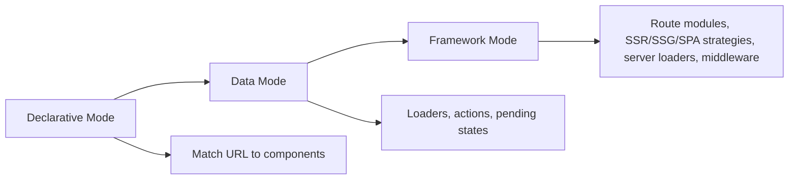
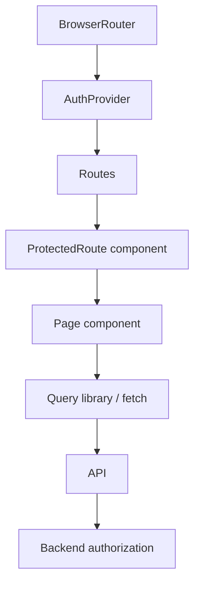
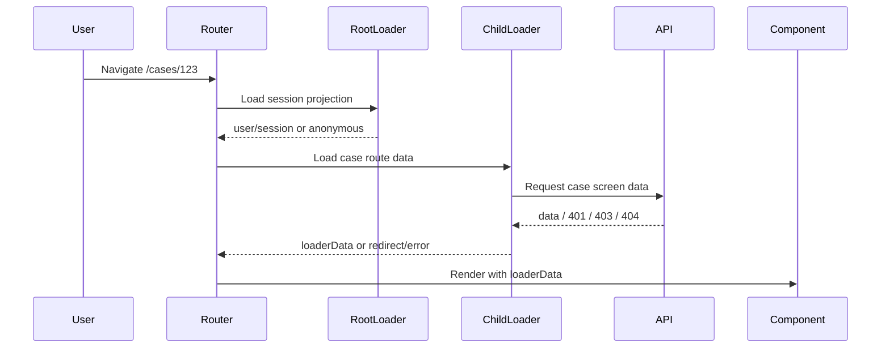
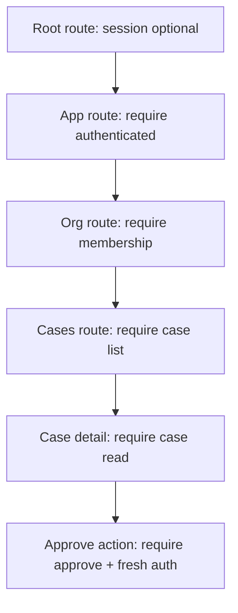
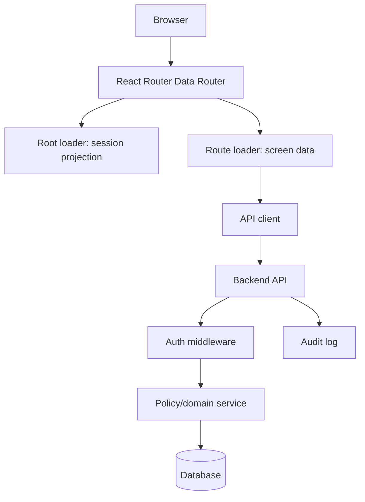
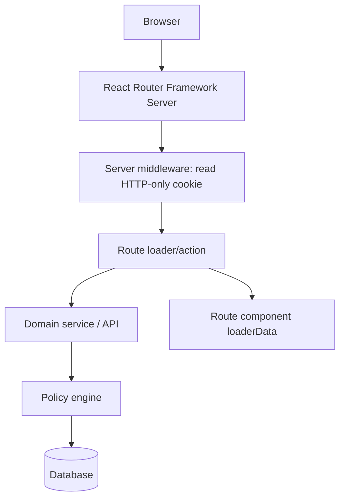
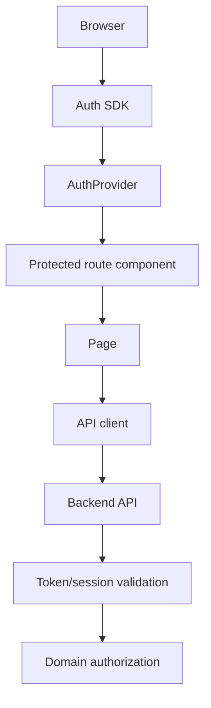

# Part 032 — React Router Auth Architecture

React Router auth architecture depends on which router mode you use.

Do not design auth as if every React Router app has the same lifecycle.

React Router has three primary modes:

```txt
Declarative Mode
Data Mode
Framework Mode
```

The modes are additive.



Auth changes dramatically as you move from component-first routing to data-first routing.

The key question is not:

```txt
How do I protect a route?
```

The better question:

```txt
At which point in the navigation/data/mutation lifecycle should authentication and authorization be decided?
```

---

## 1. The mode changes the auth boundary

A simplified comparison:

| Mode | Primary route unit | Data lifecycle | Best auth boundary |
|---|---|---|---|
| Declarative | React components | Usually component effects/query library | App bootstrap + component guards + API enforcement |
| Data | Route objects | `loader` and `action` before render/mutation result | Loader/action guard + API enforcement |
| Framework | Route modules | Server/client loaders, actions, middleware, SSR options | Middleware + route module loader/action + API/domain enforcement |

The mistake is copying a Declarative Mode protected route pattern into a Data/Framework app and ignoring loaders/actions.

In Data/Framework mode, route data can be loaded before the component renders.

So auth should also move before render.

---

## 2. Declarative Mode architecture

Declarative Mode is component-first.

Example:

```tsx
import { BrowserRouter, Routes, Route } from "react-router";

ReactDOM.createRoot(root).render(
  <BrowserRouter>
    <App />
  </BrowserRouter>
);
```

Typical architecture:



This mode is common in SPAs where data fetching is handled by a library such as TanStack Query, Apollo, Relay, SWR, custom fetch wrappers, or local-first replication.

### What Declarative Mode can do well

```txt
- simple authenticated layouts;
- anonymous-only login/register routes;
- UI shell selection;
- return URL handling;
- permission-aware component exposure;
- query invalidation on auth transitions;
- app-level session bootstrap;
- provider SDK integration.
```

### What it cannot do by itself

```txt
- pre-render data authorization through route loaders;
- server-side route module auth;
- automatic action-level mutation auth;
- SSR-safe session access;
- route-level data redirect before component render.
```

### Declarative Mode invariant

```txt
Since route auth happens during render, API enforcement must be especially strong.
```

That does not mean Declarative Mode is insecure.

It means the app must be honest about where security lives.

---

## 3. Declarative Mode reference shape

Use a root auth bootstrap.

```tsx
function App() {
  return (
    <AuthProvider>
      <SessionBootstrap>
        <RouterTree />
      </SessionBootstrap>
    </AuthProvider>
  );
}
```

The bootstrap should produce an explicit state machine:

```ts
type AuthState =
  | { status: "unknown" }
  | { status: "checking" }
  | { status: "anonymous" }
  | { status: "authenticated"; user: SessionUser }
  | { status: "expired" }
  | { status: "degraded"; reason: string };
```

The guard should fail closed:

```tsx
function RequireAuthenticated() {
  const auth = useAuthState();
  const location = useLocation();

  if (auth.status === "unknown" || auth.status === "checking") {
    return <AuthShellSkeleton />;
  }

  if (auth.status === "anonymous" || auth.status === "expired") {
    const returnTo = encodeURIComponent(location.pathname + location.search);
    return <Navigate to={`/login?returnTo=${returnTo}`} replace />;
  }

  if (auth.status === "degraded") {
    return <AuthDegradedScreen reason={auth.reason} />;
  }

  return <Outlet />;
}
```

Then routes:

```tsx
<Routes>
  <Route path="/login" element={<LoginPage />} />

  <Route element={<RequireAuthenticated />}>
    <Route element={<AppLayout />}>
      <Route path="/dashboard" element={<DashboardPage />} />
      <Route path="/cases/:caseId" element={<CasePage />} />
    </Route>
  </Route>
</Routes>
```

Data fetching still needs careful design:

```tsx
function CasePage() {
  const { caseId } = useParams();
  const auth = useAuthenticatedAuthState();

  const query = useQuery({
    queryKey: ["tenant", auth.user.tenantId, "case", caseId],
    enabled: auth.status === "authenticated",
    queryFn: () => api.getCase(caseId!),
  });

  if (query.status === "pending") return <CaseSkeleton />;
  if (query.error instanceof ForbiddenError) return <Forbidden />;

  return <CaseScreen data={query.data} />;
}
```

Important details:

```txt
- query key includes tenant;
- query is disabled until authenticated;
- API client handles 401/403 distinctly;
- logout clears sensitive queries;
- tenant switch clears tenant-scoped queries;
- backend enforces case access.
```

---

## 4. Data Mode architecture

Data Mode moves route configuration outside React rendering.

Example shape:

```tsx
import { createBrowserRouter, RouterProvider } from "react-router";

const router = createBrowserRouter([
  {
    path: "/",
    Component: RootLayout,
    loader: rootLoader,
    children: [
      {
        path: "cases/:caseId",
        Component: CaseRoute,
        loader: caseLoader,
        action: caseAction,
      },
    ],
  },
]);

ReactDOM.createRoot(root).render(<RouterProvider router={router} />);
```

React Router's Data Mode adds data loading, actions, pending states, and related APIs through route objects.

That means auth can be part of route loading and mutation flow.



### Data Mode invariant

```txt
A protected data route should not render before its loader has established the required auth state.
```

This is a much stronger lifecycle than component-only guards.

---

## 5. Root session loader

A root loader can establish the app's session projection.

```ts
export async function rootLoader({ request }: Route.LoaderArgs) {
  const session = await readSessionProjection(request);

  return {
    session,
    now: Date.now(),
  };
}
```

Root layout:

```tsx
export function RootLayout({ loaderData }: Route.ComponentProps) {
  return (
    <AuthProvider initialSession={loaderData.session}>
      <AppShell />
    </AuthProvider>
  );
}
```

But be careful.

A root loader that returns a user object is not enough to authorize child routes.

It only establishes identity/session projection.

Child routes still need their own domain checks.

---

## 6. `requireUser` helper

A reusable helper keeps loader auth consistent.

```ts
import { redirect } from "react-router";

export async function requireUser(request: Request): Promise<SessionUser> {
  const session = await readSessionProjection(request);

  if (!session.user) {
    const url = new URL(request.url);
    const returnTo = url.pathname + url.search;

    throw redirect(`/login?returnTo=${encodeURIComponent(returnTo)}`);
  }

  return session.user;
}
```

Use it in loaders:

```ts
export async function caseLoader({ request, params }: Route.LoaderArgs) {
  const user = await requireUser(request);

  const screen = await caseApi.getCaseScreen({
    caseId: required(params.caseId),
    request,
    user,
  });

  return screen;
}
```

Use it in actions:

```ts
export async function caseAction({ request, params }: Route.ActionArgs) {
  const user = await requireUser(request);
  const form = await request.formData();

  switch (form.get("intent")) {
    case "approve":
      return approveCaseAction({ request, params, user, form });
    case "comment":
      return commentCaseAction({ request, params, user, form });
    default:
      throw new Response("Unknown intent", { status: 400 });
  }
}
```

The helper gives consistency.

The API/domain layer still enforces the decision.

---

## 7. Permission guard in loaders

A loader can require coarse permission before asking for route data.

```ts
export async function requirePermission(
  request: Request,
  input: {
    action: string;
    resource?: { type: string; id: string };
  }
): Promise<PermissionDecision> {
  const response = await fetch("/api/permissions/check", {
    method: "POST",
    headers: await authHeaders(request),
    body: JSON.stringify(input),
  });

  if (response.status === 401) {
    throw redirect(`/login?returnTo=${encodeURIComponent(new URL(request.url).pathname)}`);
  }

  if (response.status === 403) {
    throw new Response("Forbidden", { status: 403 });
  }

  if (!response.ok) {
    throw new Response("Permission service unavailable", { status: 503 });
  }

  return response.json();
}
```

Example route loader:

```ts
export async function loader({ request, params }: Route.LoaderArgs) {
  await requireUser(request);

  await requirePermission(request, {
    action: "case.view",
    resource: { type: "case", id: required(params.caseId) },
  });

  return caseApi.getCaseScreen(required(params.caseId), request);
}
```

In high-scale systems, avoid doubling network calls for permission and data if the data endpoint can return a screen projection with permissions.

Better screen endpoint:

```json
{
  "case": {
    "id": "case_123",
    "title": "...",
    "status": "REVIEWED"
  },
  "permissions": {
    "allowedActions": ["case.comment", "case.approve"],
    "version": 42
  }
}
```

One server endpoint can enforce read access and return a UI permission projection.

---

## 8. Framework Mode architecture

Framework Mode wraps Data Mode with route modules, type-safe route APIs, code splitting, and SPA/SSR/static rendering strategies.

It is the most powerful mode for auth architecture because it lets you move more logic to server route modules and middleware.

A conceptual route module:

```ts
// app/routes/cases.$caseId.tsx
import type { Route } from "./+types/cases.$caseId";

export async function loader({ request, params, context }: Route.LoaderArgs) {
  const user = context.get(userContext);
  return caseService.getScreen({
    subject: user,
    caseId: params.caseId,
  });
}

export async function action({ request, params, context }: Route.ActionArgs) {
  const user = context.get(userContext);
  const form = await request.formData();

  return caseService.handleAction({
    subject: user,
    caseId: params.caseId,
    form,
  });
}

export default function CaseRoute({ loaderData }: Route.ComponentProps) {
  return <CaseScreen screen={loaderData} />;
}
```

Now auth can be established once by middleware and shared with loaders/actions.

---

## 9. Middleware architecture

React Router middleware can run before and after response generation for a matched path and supports patterns such as authentication, logging, error handling, and data preprocessing.

A simplified server middleware shape:

```ts
import { createContext, redirect } from "react-router";
import type { User } from "~/domain/auth";

export const userContext = createContext<User | null>(null);

async function authMiddleware({ request, context }: Route.MiddlewareArgs) {
  const user = await getUserFromSession(request);

  if (!user) {
    throw redirect("/login");
  }

  context.set(userContext, user);
}

export const middleware: Route.MiddlewareFunction[] = [authMiddleware];
```

Then a loader can read from context:

```ts
export async function loader({ context, params }: Route.LoaderArgs) {
  const user = context.get(userContext);

  if (!user) {
    throw new Response("Unauthorized", { status: 401 });
  }

  return caseService.getScreen({
    subject: user,
    caseId: params.caseId,
  });
}
```

Important:

```txt
Middleware can centralize authentication.
It should not hide resource-specific authorization inside a vague global check.
```

Use middleware for common auth context.

Use route/domain logic for action/resource decisions.

---

## 10. Parent/child route auth

React Router's nested route model maps well to nested auth requirements.

Example:

```txt
/                      root: session optional
/app                  authenticated app layout
/app/org/:orgId        tenant membership required
/app/org/:orgId/cases  case list permission required
/app/org/:orgId/cases/:caseId case read permission required
/app/org/:orgId/cases/:caseId/approve approve permission + step-up required
```

Conceptual tree:



Do not put every check at the root.

The root does not know the resource id yet.

Do not put every check in the leaf either.

Parent routes can establish common context like session and tenant.

A good structure:

```txt
root loader       -> session projection, CSRF token, app config
app loader        -> require authenticated user
org loader        -> require tenant membership, set tenant context
case loader       -> require case read, return case screen projection
case action       -> require specific mutation permission
```

---

## 11. Route metadata for permission declarations

Route metadata can make requirements visible.

Example route handle:

```ts
type AuthRequirement =
  | { kind: "public" }
  | { kind: "anonymousOnly" }
  | { kind: "authenticated" }
  | { kind: "permission"; action: string; resourceParam?: string }
  | { kind: "stepUp"; action: string; maxAgeSeconds: number };

export const handle = {
  auth: {
    kind: "permission",
    action: "case.view",
    resourceParam: "caseId",
  } satisfies AuthRequirement,
};
```

This metadata is useful for:

```txt
- documentation;
- menu filtering;
- design review;
- test matrix generation;
- analytics;
- central middleware decisions;
- static linting;
- route map audit.
```

But metadata alone is not enforcement.

It must be wired to loaders/actions/server policy.

---

## 12. Auth layouts

An auth layout is a route group with shared auth assumptions.

Example groups:

```txt
PublicLayout
AnonymousOnlyLayout
AuthenticatedLayout
TenantLayout
AdminLayout
StepUpLayout
```

Declarative example:

```tsx
<Route element={<AuthenticatedLayout />}> 
  <Route path="dashboard" element={<DashboardPage />} />
</Route>
```

Data/Framework example:

```ts
export async function authenticatedLayoutLoader({ request }: Route.LoaderArgs) {
  return {
    user: await requireUser(request),
  };
}
```

The layout should only assume what it proves.

```txt
AuthenticatedLayout proves: user has a session.
TenantLayout proves: user is a member of selected tenant.
AdminLayout proves: user has some admin-level route eligibility.
CaseRoute proves: user can access this case.
```

Do not let `AdminLayout` imply every admin action is allowed.

---

## 13. Login and return URL architecture

Return URL is part of route auth architecture.

Bad:

```ts
throw redirect(`/login?returnTo=${request.url}`);
```

This can create open redirect risk if later code trusts arbitrary URLs.

Better:

```ts
export function safeReturnTo(request: Request): string {
  const url = new URL(request.url);
  return url.pathname + url.search;
}

export function redirectToLogin(request: Request): Response {
  return redirect(`/login?returnTo=${encodeURIComponent(safeReturnTo(request))}`);
}
```

On login success:

```ts
function resolveReturnTo(value: string | null): string {
  if (!value) return "/dashboard";

  try {
    const url = new URL(value, window.location.origin);

    if (url.origin !== window.location.origin) {
      return "/dashboard";
    }

    return url.pathname + url.search + url.hash;
  } catch {
    return "/dashboard";
  }
}
```

The invariant:

```txt
returnTo is an internal path, never an arbitrary absolute destination.
```

---

## 14. Revalidation after auth transitions

React Router data routes can revalidate data after actions and navigations.

Auth transitions should trigger deliberate revalidation or cache clearing.

Events requiring revalidation:

```txt
- login success;
- logout;
- token refresh after long idle;
- role/permission version change;
- tenant switch;
- MFA step-up completion;
- impersonation start/end;
- session restored after degraded state;
- provider profile updated;
- organization membership changed.
```

Example:

```tsx
function AuthTransitionBridge() {
  const revalidator = useRevalidator();

  useEffect(() => {
    return authClient.subscribe((event) => {
      if (event.type === "login:complete") {
        revalidator.revalidate();
      }

      if (event.type === "permission:changed") {
        revalidator.revalidate();
      }
    });
  }, [revalidator]);

  return null;
}
```

Do not blindly revalidate everything in large apps.

Prefer scoped invalidation when using query libraries.

---

## 15. Error boundary architecture

Auth failures should not be collapsed into a generic error page.

You need typed route error handling.

```tsx
export function ErrorBoundary() {
  const error = useRouteError();

  if (isRouteErrorResponse(error)) {
    switch (error.status) {
      case 401:
        return <SessionExpired />;
      case 403:
        return <Forbidden />;
      case 404:
        return <NotFound />;
      case 419:
        return <SessionExpired />;
      default:
        return <RouteFailure status={error.status} />;
    }
  }

  return <UnexpectedFailure />;
}
```

Why typed errors matter:

```txt
401 means authenticate again.
403 means authenticated but not allowed.
404 may intentionally hide resource existence.
419/440 often represents expired session in some stacks.
503 means auth/session dependency degraded.
```

Different failures need different UX and telemetry.

---

## 16. Declarative vs Data vs Framework: decision matrix

| Constraint | Prefer |
|---|---|
| Small SPA, external API, query library already owns data | Declarative or Data |
| Need loader/action control before render | Data |
| Need SSR, route modules, server loaders, middleware | Framework |
| Need BFF cookie session and server-only token handling | Framework or custom BFF with Data |
| Need gradual migration from older BrowserRouter app | Declarative then Data islands |
| Need strict route-level auth before component render | Data or Framework |
| Need centralized route middleware | Framework/Data with middleware support |
| Need static marketing + authenticated app split | Framework or hybrid |
| Need regulated audit and complex permission | Any mode can work, but server/domain enforcement is mandatory |

Mode is an implementation decision.

Security invariants are non-negotiable.

---

## 17. Architecture pattern: SPA with Data Mode and API enforcement



Use when:

```txt
- frontend and backend are separately deployed;
- API is the enforcement boundary;
- session may be cookie or bearer token;
- route loaders provide UX timing but not final security;
- SSR is not required or is handled elsewhere.
```

Key practices:

```txt
- root loader loads session projection;
- leaf loader loads resource screen projection;
- API enforces all access;
- route error boundary handles 401/403/404;
- UI permission gates use server-provided allowedActions;
- logout clears route/query caches.
```

---

## 18. Architecture pattern: Framework Mode with BFF/session cookie



Use when:

```txt
- you want HTTP-only cookie sessions;
- you want to hide tokens from browser JavaScript;
- you want SSR or server loaders;
- you want route-level middleware;
- you want the frontend route module to call server-only APIs;
- you want stronger control over data-before-render.
```

Key practices:

```txt
- auth middleware reads session cookie;
- middleware sets typed user context;
- loaders/actions call domain services using context subject;
- domain services enforce resource/action policy;
- components receive safe loaderData only;
- session refresh and cookie mutation are handled server-side.
```

---

## 19. Architecture pattern: Declarative SPA with external auth provider



Use when:

```txt
- app is a traditional SPA;
- auth provider SDK runs in browser;
- backend validates access tokens;
- data fetching stays in component/query layer;
- SSR is not needed;
- complexity is moderate.
```

Hard requirements:

```txt
- do not store long-lived secrets in browser;
- backend validates token issuer/audience/signature/expiry;
- backend enforces resource authorization;
- UI treats token claims as hints, not final permission;
- cache cleared on logout/tenant switch;
- unknown auth state fails closed.
```

---

## 20. Auth context shape

Keep auth context small and explicit.

Bad:

```ts
type AuthContextValue = any;
```

Better:

```ts
type AuthContextValue = {
  state: AuthState;
  login: (options?: { returnTo?: string }) => Promise<void>;
  logout: () => Promise<void>;
  refresh: () => Promise<void>;
  switchTenant: (tenantId: string) => Promise<void>;
};
```

Do not put every permission check into a global context if permissions are resource-specific.

Bad:

```ts
const auth = {
  user,
  isAdmin,
  canEdit,
  canDelete,
  canApprove,
};
```

Better:

```ts
function useCan(action: string, resource?: ResourceRef): PermissionDecision {
  return usePermissionProjection(action, resource);
}
```

Auth context identifies the subject.

Permission hooks evaluate projected capability for a specific action/resource/context.

---

## 21. Route-level permission projection

A loader can return screen-scoped permission data.

```ts
type CaseScreenLoaderData = {
  subject: {
    id: string;
    tenantId: string;
    displayName: string;
  };
  case: {
    id: string;
    status: "DRAFT" | "REVIEWED" | "APPROVED" | "CLOSED";
    title: string;
  };
  permissions: {
    resource: { type: "case"; id: string };
    allowedActions: string[];
    deniedReasons: Record<string, string>;
    version: number;
  };
};
```

Component:

```tsx
export default function CaseRoute({ loaderData }: Route.ComponentProps) {
  return (
    <PermissionProjectionProvider value={loaderData.permissions}>
      <CaseHeader case={loaderData.case} />
      <CaseActions />
      <CaseTimeline />
    </PermissionProjectionProvider>
  );
}
```

Action button:

```tsx
function ApproveButton() {
  const decision = useCan("case.approve");

  if (!decision.allowed) {
    return (
      <Button disabled title={decision.reason ?? "You cannot approve this case"}>
        Approve
      </Button>
    );
  }

  return <Button type="submit" name="intent" value="approve">Approve</Button>;
}
```

This makes UI authorization consistent within the screen.

Again, the action endpoint must check the permission on submit.

---

## 22. Avoid global role checks in route definitions

This is seductive:

```ts
{
  path: "admin",
  element: <RequireRole role="admin" />,
  children: [...]
}
```

But global role checks often become incorrect.

Problems:

```txt
- role names drift from business capabilities;
- tenant-specific roles get treated globally;
- resource-level rules cannot be represented;
- workflow state is ignored;
- temporary grants are ignored;
- support/impersonation flows bypass assumptions;
- provider roles leak into domain rules.
```

Prefer capability declarations:

```ts
{
  path: "cases/:caseId/approve",
  handle: {
    auth: {
      kind: "permission",
      action: "case.approve",
      resourceParam: "caseId",
    },
  },
  loader: approveRouteLoader,
  action: approveRouteAction,
}
```

Then implement the permission in domain policy, not in route metadata alone.

---

## 23. Network concurrency and auth

Routing, fetching, and auth refresh can race.

Cases:

```txt
- user navigates while token refresh is in flight;
- two loaders receive 401 simultaneously;
- logout happens while loader request is pending;
- tenant switch happens while old tenant loader completes;
- role change event arrives while mutation is optimistic;
- user double-submits a form while session is being renewed.
```

Design rules:

```txt
- refresh must be single-flight;
- logout cancels protected requests;
- tenant switch increments a tenant epoch;
- loader results must match current session/tenant epoch before applying;
- mutation endpoints must be idempotent where possible;
- 401 handling must not create infinite refresh loops;
- revalidation should be bounded.
```

A simple epoch guard:

```ts
let authEpoch = 0;

export function incrementAuthEpoch() {
  authEpoch += 1;
}

export async function guardedLoad<T>(load: () => Promise<T>): Promise<T> {
  const startedAt = authEpoch;
  const result = await load();

  if (startedAt !== authEpoch) {
    throw new Response("Stale auth result", { status: 409 });
  }

  return result;
}
```

In production, this often lives in the auth/session manager, not in every route.

---

## 24. Route auth testing matrix

Test the router lifecycle, not only the rendered page.

| Test | Declarative | Data | Framework |
|---|---:|---:|---:|
| Anonymous protected navigation redirects | Yes | Yes | Yes |
| Loader does not call sensitive API when anonymous | N/A or query-level | Yes | Yes |
| Action denies mutation when permission missing | API/action | Yes | Yes |
| Middleware sets user context | N/A | If used | Yes |
| 401 route error maps to session expired UX | Yes | Yes | Yes |
| 403 route error maps to forbidden UX | Yes | Yes | Yes |
| Return URL is internal-only | Yes | Yes | Yes |
| Logout clears route/query state | Yes | Yes | Yes |
| Tenant switch clears old tenant data | Yes | Yes | Yes |
| Direct API bypass denied | Backend | Backend | Backend |

Example Data Mode loader test:

```ts
it("redirects anonymous users before loading case screen", async () => {
  mockSession(null);

  await expect(
    caseLoader({ request: new Request("https://app.test/cases/case_1"), params: { caseId: "case_1" } } as any)
  ).rejects.toMatchObject({ status: 302 });

  expect(caseApi.getCaseScreen).not.toHaveBeenCalled();
});
```

Example action test:

```ts
it("does not trust hidden UI for approval", async () => {
  mockSession({ userId: "user_1", tenantId: "tenant_a" });
  mockPolicyDecision({ allowed: false, reason: "MISSING_PERMISSION" });

  const form = new FormData();
  form.set("intent", "approve");

  const response = await caseAction({
    request: new Request("https://app.test/cases/case_1", { method: "POST", body: form }),
    params: { caseId: "case_1" },
  } as any);

  expect(response.status).toBe(403);
});
```

---

## 25. Production readiness checklist

For a React Router auth architecture, verify:

```txt
[ ] Router mode is explicit: Declarative, Data, or Framework.
[ ] Session bootstrap is explicit and typed.
[ ] Unknown auth state fails closed.
[ ] Login route is anonymous-aware and avoids redirect loops.
[ ] Return URL is internal-only.
[ ] Root/session loader does not over-authorize child resources.
[ ] Leaf routes authorize resource access through API/domain layer.
[ ] Actions authorize mutations independently of UI visibility.
[ ] Error boundaries distinguish 401, 403, 404, expired, degraded.
[ ] Query/cache state is cleared on logout and tenant switch.
[ ] Route metadata documents auth requirements.
[ ] Metadata is connected to enforcement, not decorative.
[ ] Backend verifies session/token on every request.
[ ] Backend authorizes subject/action/resource/context.
[ ] Permission projection versioning exists for stale-role handling.
[ ] MFA/step-up routes encode authentication freshness requirements.
[ ] Observability captures redirect loops and auth denial rates.
[ ] Tests cover direct API bypass and stale auth state.
```

---

## 26. Summary

React Router auth architecture is lifecycle design.

Declarative Mode puts auth mostly in components and app bootstrap. That can work, but backend enforcement and cache discipline become critical.

Data Mode gives you loaders and actions, so authentication and route data decisions can happen before render and during mutation flow.

Framework Mode adds route modules, server/client boundaries, middleware, and SSR/static strategies, making it suitable for BFF/session-cookie architectures and stronger route-level auth composition.

The invariant across all modes:

```txt
The router can improve when and how auth decisions affect UI.
The backend/domain layer still decides whether the request is allowed.
```

Choose the mode based on lifecycle needs.

Keep the enforcement boundary honest.

---

## References

- React Router — Picking a Mode: https://reactrouter.com/start/modes
- React Router — Data Loading: https://reactrouter.com/start/framework/data-loading
- React Router — Middleware: https://reactrouter.com/how-to/middleware
- OWASP Authorization Cheat Sheet: https://cheatsheetseries.owasp.org/cheatsheets/Authorization_Cheat_Sheet.html
- OWASP Session Management Cheat Sheet: https://cheatsheetseries.owasp.org/cheatsheets/Session_Management_Cheat_Sheet.html
