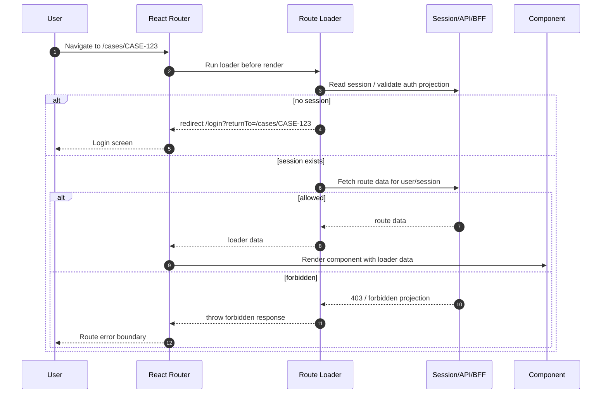
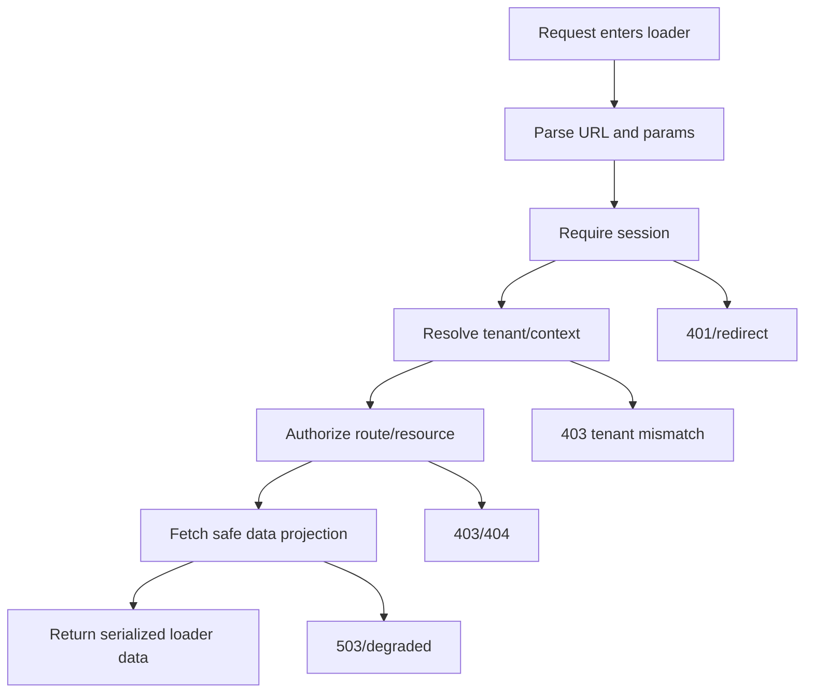

# Part 033 — Loader-level Authentication

A React route is not only a component.

In a modern data router, a route is also a data boundary.

That changes auth.

If the route can load data before the component renders, then authentication should also happen before the component renders.

The old mental model says:

```txt
User navigates -> Component renders -> useEffect fetches data -> guard redirects if unauthenticated
```

The stronger model says:

```txt
User navigates -> loader authenticates -> loader authorizes route data -> component renders only allowed projection
```

That is the core of loader-level authentication.

It does not make the frontend the final security boundary.

It does something narrower and important:

```txt
It prevents unauthorized route data and route UI from becoming part of the render lifecycle.
```

That is a huge difference.

A component guard can hide a screen after the screen has already started existing.

A loader guard can stop the screen before it exists.

---

## 1. The problem loader-level auth solves

A typical component guard works like this:

```tsx
function ProtectedRoute({ children }: { children: React.ReactNode }) {
  const { user, loading } = useAuth();

  if (loading) return <FullPageSpinner />;
  if (!user) return <Navigate to="/login" replace />;

  return children;
}
```

This is useful in Declarative Mode.

But in Data/Framework Mode, it is incomplete.

Why?

Because data loading may happen before or outside the component render path.

A route may define:

```ts
export async function loader({ request, params }: Route.LoaderArgs) {
  return getCase(params.caseId);
}
```

If auth is only inside the component, the loader may already have fetched sensitive data.

The component guard is late.

The stronger boundary is:

```ts
export async function loader({ request, params }: Route.LoaderArgs) {
  const session = await requireSession(request);
  return getCaseForUser(session.userId, params.caseId);
}
```

The security invariant:

```txt
No private route data is loaded until the request has an authenticated session.
```

The UX invariant:

```txt
The user should not see a private screen flash before redirect or denial.
```

The architecture invariant:

```txt
The loader may enforce route access, but the API/domain layer must still enforce resource access.
```

Loader-level auth is not the final lock.

It is the first gate in the route lifecycle.

---

## 2. Route lifecycle with loader-level auth

The basic flow:



Important details:

1. The loader runs before the component gets data.
2. The loader can redirect before private UI exists.
3. The loader can throw typed responses for error boundaries.
4. The loader can return a safe, route-specific session projection.
5. The backend still decides whether the user can access the actual resource.

The loader should not become a second full backend.

It should coordinate authentication and route-level access.

---

## 3. Loader-level authentication vs loader-level authorization

Keep these separate.

Authentication answers:

```txt
Is there a valid session for this request?
```

Authorization answers:

```txt
Can this subject perform this action on this resource in this context?
```

A loader may need both.

Example:

```ts
export async function loader({ request, params }: Route.LoaderArgs) {
  const session = await requireSession(request);

  const caseSummary = await casesApi.getCaseSummary({
    caseId: requireParam(params.caseId),
    actor: session.actor,
  });

  return {
    session: projectSessionForRoute(session),
    case: caseSummary,
  };
}
```

But do not mix the semantics.

Bad naming:

```ts
const isAuthenticated = user.role === "admin";
```

Better:

```ts
const session = await requireSession(request);
const decision = await authorize(session.actor, "case.read", { caseId });
```

The distinction matters because unauthenticated and forbidden states should behave differently.

| State | Meaning | Common response | UX |
|---|---|---|---|
| Anonymous | No valid session | Redirect to login or `401` | Login prompt |
| Authenticated but forbidden | Valid session, insufficient permission | `403` | Access denied screen |
| Authenticated but stale | Session exists but projection is outdated | Revalidate/session refresh | Retry or reload |
| Authenticated but tenant mismatch | Valid identity, wrong tenant context | `403` or tenant switch prompt | Org switch/help |
| Degraded | Auth/session dependency partially unavailable | `503`/safe degraded projection | Retry/backoff |

A route that redirects every `403` to login creates user confusion and can hide real authorization bugs.

A route that displays `403` for anonymous users leaks less but harms UX.

Design it deliberately.

---

## 4. Loader-level auth does not replace server enforcement

This point must be repeated because it is the most common failure.

A loader is part of the application route lifecycle.

It is not necessarily the final resource boundary.

For example:

```ts
export async function loader({ request, params }: Route.LoaderArgs) {
  const session = await requireSession(request);

  // This is good, but not enough by itself.
  requirePermission(session, "case.read");

  // The API must still verify object-level access.
  return api.get(`/cases/${params.caseId}`, {
    headers: sessionHeaders(session),
  });
}
```

Why?

Because an attacker can call the API directly.

Because a stale browser bundle can call an older endpoint.

Because a misconfigured route can skip the loader.

Because background jobs, mobile clients, scripts, and integrations may hit the same resource.

The invariant:

```txt
Every resource request must be authorized at the resource boundary, even if the route loader already checked access.
```

The loader improves UX, data minimization, and routing correctness.

The server protects the resource.

Both are needed.

---

## 5. Minimal loader guard pattern

Start with a tiny primitive.

```ts
// app/auth/session.server.ts
export type AuthenticatedSession = {
  userId: string;
  tenantId: string;
  sessionId: string;
  assuranceLevel: "aal1" | "aal2" | "aal3";
  permissionsVersion: number;
};

export class UnauthenticatedError extends Error {
  readonly code = "UNAUTHENTICATED";
}

export async function getSession(request: Request): Promise<AuthenticatedSession | null> {
  const response = await fetch(`${process.env.API_ORIGIN}/session`, {
    method: "GET",
    headers: {
      cookie: request.headers.get("cookie") ?? "",
      "x-requested-by": "react-router-loader",
    },
  });

  if (response.status === 401) return null;
  if (!response.ok) throw new Response("Session check failed", { status: 503 });

  return response.json();
}

export async function requireSession(request: Request): Promise<AuthenticatedSession> {
  const session = await getSession(request);
  if (!session) throw new UnauthenticatedError();
  return session;
}
```

Then convert domain errors into route responses:

```ts
// app/auth/route-auth.ts
import { redirect } from "react-router";
import { requireSession, UnauthenticatedError } from "./session.server";

export async function requireRouteSession(request: Request) {
  try {
    return await requireSession(request);
  } catch (error) {
    if (error instanceof UnauthenticatedError) {
      const returnTo = safeReturnTo(new URL(request.url));
      throw redirect(`/login?returnTo=${encodeURIComponent(returnTo)}`);
    }

    throw error;
  }
}

function safeReturnTo(url: URL): string {
  return `${url.pathname}${url.search}${url.hash}`;
}
```

Usage:

```ts
// routes/cases.$caseId.tsx
export async function loader({ request, params }: Route.LoaderArgs) {
  const session = await requireRouteSession(request);
  const caseId = requireParam(params.caseId, "caseId");

  const caseView = await getCaseView({
    actor: session,
    caseId,
  });

  return {
    case: caseView,
    viewer: projectViewer(session),
  };
}
```

The component does not fetch before knowing auth state.

```tsx
export default function CaseRoute({ loaderData }: Route.ComponentProps) {
  return <CaseScreen case={loaderData.case} viewer={loaderData.viewer} />;
}
```

The component can still render permission-aware UI.

But it is no longer responsible for deciding whether route data exists.

---

## 6. Root loader session bootstrap

Many apps need session state globally.

Do not make every component independently ask:

```txt
Who am I?
```

Use a root loader or root route boundary.

```ts
// root.tsx
export async function loader({ request }: Route.LoaderArgs) {
  const session = await getSession(request);

  return {
    viewer: session ? projectViewer(session) : null,
    authState: session ? "authenticated" : "anonymous",
  };
}
```

Then child routes can use root data for UI composition.

But be careful.

Root session bootstrap is not sufficient for private child data.

Bad:

```ts
export async function childLoader({ params }: Route.LoaderArgs) {
  // Assumes root loader already authenticated.
  return getSensitiveData(params.id);
}
```

Better:

```ts
export async function childLoader({ request, params }: Route.LoaderArgs) {
  const session = await requireRouteSession(request);
  return getSensitiveDataForActor(session, params.id);
}
```

The root loader is a projection cache.

The child loader is a route access boundary.

The resource API remains the final enforcement boundary.

---

## 7. Session projection returned from loaders

Never return raw session internals to route components.

Bad loader data:

```json
{
  "accessToken": "eyJ...",
  "refreshToken": "...",
  "sessionId": "sess_123",
  "allClaims": { "...": "..." }
}
```

Better loader data:

```ts
type ViewerProjection = {
  id: string;
  displayName: string;
  tenantId: string;
  tenantName: string;
  assuranceLevel: "aal1" | "aal2" | "aal3";
  permissionsVersion: number;
};
```

A loader should return data the UI needs, not credentials.

```ts
function projectViewer(session: AuthenticatedSession): ViewerProjection {
  return {
    id: session.userId,
    displayName: session.displayName,
    tenantId: session.tenantId,
    tenantName: session.tenantName,
    assuranceLevel: session.assuranceLevel,
    permissionsVersion: session.permissionsVersion,
  };
}
```

The rule:

```txt
Loader data is render data. Credentials are not render data.
```

If a component can read it, injected JavaScript can read it.

If DevTools can show it, support logs or analytics may accidentally capture it.

Do not serialize secrets into the React route tree.

---

## 8. Redirecting safely from loaders

Authentication redirects are common.

They are also dangerous when return URLs are not controlled.

Bad:

```ts
throw redirect(`/login?returnTo=${new URL(request.url).searchParams.get("returnTo")}`);
```

This can preserve or amplify an attacker-controlled target.

Better:

```ts
export function getSafeInternalReturnTo(request: Request): string {
  const url = new URL(request.url);
  return `${url.pathname}${url.search}${url.hash}`;
}

export function redirectToLogin(request: Request): never {
  const returnTo = getSafeInternalReturnTo(request);
  throw redirect(`/login?returnTo=${encodeURIComponent(returnTo)}`);
}
```

When later consuming `returnTo`, validate it again.

```ts
export function normalizeReturnTo(input: string | null): string {
  if (!input) return "/";

  try {
    // Force same-origin parsing.
    const parsed = new URL(input, "https://app.internal.invalid");

    if (parsed.origin !== "https://app.internal.invalid") return "/";
    if (!parsed.pathname.startsWith("/")) return "/";
    if (parsed.pathname.startsWith("//")) return "/";
    if (parsed.pathname === "/login" || parsed.pathname === "/callback") return "/";

    return `${parsed.pathname}${parsed.search}${parsed.hash}`;
  } catch {
    return "/";
  }
}
```

Use an allowlist for sensitive apps.

```ts
const RETURN_TO_ALLOWLIST = [
  /^\/dashboard(?:\/|$)/,
  /^\/cases(?:\/|$)/,
  /^\/settings(?:\/|$)/,
];

export function allowlistedReturnTo(value: string): string {
  return RETURN_TO_ALLOWLIST.some((pattern) => pattern.test(value)) ? value : "/";
}
```

Redirect handling is part of auth security.

A correct loader can still be undermined by a bad return URL pipeline.

---

## 9. Loader auth with BFF/cookie sessions

BFF/cookie sessions are often the strongest fit for React apps that need SSR, high security, and low token exposure.

The loader should call the BFF with the incoming cookie.

```ts
export async function getSessionFromBff(request: Request) {
  const response = await fetch(`${process.env.BFF_ORIGIN}/api/session`, {
    method: "GET",
    headers: {
      cookie: request.headers.get("cookie") ?? "",
      accept: "application/json",
    },
  });

  if (response.status === 401) return null;
  if (response.status === 403) throw new Response("Forbidden", { status: 403 });
  if (!response.ok) throw new Response("Session unavailable", { status: 503 });

  return response.json();
}
```

In a server-capable router, this keeps credentials off the browser JavaScript layer.

In a pure SPA, the browser still calls `/api/session`, but the cookie can remain HTTP-only.

```ts
export async function getSessionInBrowser() {
  const response = await fetch("/api/session", {
    method: "GET",
    credentials: "include",
    headers: {
      accept: "application/json",
    },
  });

  if (response.status === 401) return null;
  if (!response.ok) throw new Error("Unable to load session");
  return response.json();
}
```

The design goal:

```txt
The route needs an authenticated projection; it does not need direct token access.
```

---

## 10. Loader auth with bearer tokens

If your architecture uses bearer tokens, keep tokens out of serialized loader data.

A common shape:

```ts
export async function loader({ request, params }: Route.LoaderArgs) {
  const token = await getAccessTokenForRequest(request);
  if (!token) throw redirectToLogin(request);

  const response = await fetch(`${API_ORIGIN}/cases/${params.caseId}`, {
    headers: {
      authorization: `Bearer ${token}`,
      accept: "application/json",
    },
  });

  return mapApiResponse(response);
}
```

The component receives only resource data.

```tsx
export default function CaseRoute({ loaderData }: Route.ComponentProps) {
  return <CaseView case={loaderData.case} />;
}
```

Do not do this:

```ts
return {
  accessToken: token,
  case: await response.json(),
};
```

The token is not UI data.

For pure browser SPA token auth, route loaders may run in the browser.

That means they have the same token exposure profile as your client runtime.

If the token is in memory, loader code can access it.

If XSS exists, attacker-controlled JavaScript in the same origin may also trigger requests.

So the auth architecture must still prioritize XSS prevention, short-lived access tokens, rotation, and server enforcement.

---

## 11. Route groups and inherited authentication

Most apps have route groups:

```txt
/public
/auth
/app
/app/cases
/app/admin
/app/settings
```

Use layout routes to express auth boundaries.

```ts
export async function authenticatedLayoutLoader({ request }: Route.LoaderArgs) {
  const session = await requireRouteSession(request);

  return {
    viewer: projectViewer(session),
  };
}
```

Route tree:

```txt
root
├── public layout
│   ├── /login
│   └── /forgot-password
└── authenticated layout
    ├── /dashboard
    ├── /cases/:caseId
    └── /settings
```

Mermaid view:

```mermaid
flowchart TD
    Root[Root Loader: optional session projection]
    Root --> Public[Public Layout]
    Root --> App[Authenticated Layout Loader: require session]
    Public --> Login[/login]
    Public --> Forgot[/forgot-password]
    App --> Dashboard[/dashboard]
    App --> Case[/cases/:caseId loader]
    App --> Settings[/settings loader]
```

The authenticated layout establishes a coarse boundary.

Child loaders still validate resource-specific access.

```ts
export async function caseLoader({ request, params }: Route.LoaderArgs) {
  const session = await requireRouteSession(request);
  const caseId = requireParam(params.caseId, "caseId");

  return getCasePage({
    actor: session,
    caseId,
  });
}
```

Why repeat `requireRouteSession` in child loaders?

Because route trees evolve.

Because loaders can be reused.

Because code splitting and lazy routes make implicit inheritance easy to break.

Because explicit auth dependencies are easier to review.

Do not rely on visual nesting alone as the only auth guarantee.

---

## 12. Error boundary design for loader auth

A loader can redirect, return data, or throw an error/response.

Use that deliberately.

Recommended mapping:

| Condition | Loader behavior | UI boundary |
|---|---|---|
| Anonymous user entering private route | Redirect to login | Login page |
| Authenticated but no route permission | Throw `403` | Access denied route boundary |
| Session expired but refresh possible | Refresh/session revalidate then retry | Pending UI |
| Session revoked | Redirect to login with reason | Login page with neutral message |
| Auth service unavailable | Throw `503` | Retry screen |
| Resource not found or not visible | Often `404` | Not found boundary |
| Tenant mismatch | `403` or tenant switch prompt | Tenant switch/help screen |

Example:

```tsx
export function ErrorBoundary({ error }: Route.ErrorBoundaryProps) {
  if (isRouteErrorResponse(error)) {
    if (error.status === 403) {
      return <AccessDenied />;
    }

    if (error.status === 404) {
      return <NotFound />;
    }

    if (error.status === 503) {
      return <TemporaryAuthOutage />;
    }
  }

  return <UnexpectedRouteError error={error} />;
}
```

Do not collapse all auth errors into login.

That destroys debuggability.

It also creates loops:

```txt
403 -> login -> callback -> same route -> 403 -> login -> callback -> ...
```

Typed failures protect both security and UX.

---

## 13. Avoiding data flash and cache leaks

Data flash happens when sensitive data briefly renders before auth state catches up.

Component guard architecture is vulnerable:

```txt
Old private component renders from stale query cache -> auth hook discovers logout -> redirect
```

Loader-level auth reduces this because route data should not load without session.

But stale client caches still exist.

Examples:

```txt
TanStack Query cache
Apollo cache
React Router loader cache
browser HTTP cache
service worker cache
in-memory stores
```

Logout and session invalidation must clear or partition these caches.

A route loader should not read private data from a global cache without checking session context.

Bad:

```ts
export async function loader({ params }: Route.LoaderArgs) {
  return queryClient.getQueryData(["case", params.caseId])
    ?? queryClient.fetchQuery({ queryKey: ["case", params.caseId], queryFn: loadCase });
}
```

Better:

```ts
export async function loader({ request, params }: Route.LoaderArgs) {
  const session = await requireRouteSession(request);

  const queryKey = [
    "tenant",
    session.tenantId,
    "viewer",
    session.userId,
    "case",
    params.caseId,
  ];

  return queryClient.fetchQuery({
    queryKey,
    queryFn: () => loadCaseForSession(session, params.caseId),
  });
}
```

Cache keys should include the authorization context that affects visibility.

At minimum:

```txt
tenant id
viewer id or subject id
permission version when relevant
resource id
data projection shape
```

Otherwise user A can accidentally see user B's stale route data after account switching.

---

## 14. Loader auth and revalidation

Auth changes require route data revalidation.

Examples:

```txt
login completed
logout completed
session refreshed
role changed
tenant switched
permissions version changed
MFA step-up completed
impersonation started/stopped
```

If route data depends on auth state, auth state transitions must invalidate route data.

A simplified event pipeline:

```ts
type AuthEvent =
  | { type: "login.completed" }
  | { type: "logout.completed" }
  | { type: "session.refreshed" }
  | { type: "permissions.changed"; version: number }
  | { type: "tenant.changed"; tenantId: string };
```

In a React Router app, use navigation/revalidation intentionally.

```tsx
function AuthRevalidator() {
  const revalidator = useRevalidator();

  useEffect(() => {
    return authEvents.subscribe((event) => {
      if (
        event.type === "login.completed" ||
        event.type === "session.refreshed" ||
        event.type === "permissions.changed" ||
        event.type === "tenant.changed"
      ) {
        revalidator.revalidate();
      }
    });
  }, [revalidator]);

  return null;
}
```

But avoid revalidation storms.

```ts
const revalidateAuthSensitiveRoutes = debounce(() => {
  revalidator.revalidate();
}, 100);
```

A mature auth system has both:

```txt
Immediate invalidation for high-risk events: logout, revocation, tenant switch.
Debounced revalidation for low-risk projection changes: display name update, preference changes.
```

Authorization changes deserve fast propagation.

Profile changes do not.

---

## 15. Loader auth and tenant context

Multi-tenant React apps need tenant-aware auth from the loader boundary.

Never infer tenant access from the URL alone.

Bad:

```ts
const tenantId = params.tenantId;
return loadTenantDashboard(tenantId);
```

Better:

```ts
export async function tenantLoader({ request, params }: Route.LoaderArgs) {
  const session = await requireRouteSession(request);
  const tenantSlug = requireParam(params.tenantSlug, "tenantSlug");

  const tenantContext = await resolveTenantContext({
    actor: session,
    tenantSlug,
  });

  if (!tenantContext.allowed) {
    throw new Response("Forbidden", { status: 403 });
  }

  return {
    tenant: tenantContext.tenantProjection,
    viewer: projectViewerForTenant(session, tenantContext),
  };
}
```

Important tenant invariants:

```txt
The session has a current tenant or allowed tenant set.
The route tenant must match or be switchable by the actor.
Permission checks are tenant-scoped.
Caches are tenant-scoped.
Audit events include tenant context.
```

Tenant context is not just display state.

It is an authorization dimension.

---

## 16. Loader auth and assurance level

Some routes require a stronger authentication assurance level.

Examples:

```txt
billing settings
API key management
changing email/password
exporting sensitive data
approving enforcement action
admin impersonation
```

The loader can require step-up.

```ts
export async function sensitiveLoader({ request }: Route.LoaderArgs) {
  const session = await requireRouteSession(request);

  if (session.assuranceLevel !== "aal2" && session.assuranceLevel !== "aal3") {
    const returnTo = getSafeInternalReturnTo(request);
    throw redirect(`/step-up?returnTo=${encodeURIComponent(returnTo)}`);
  }

  return loadSensitivePage(session);
}
```

Do not represent this as plain role permission.

This is not:

```txt
Can user access settings?
```

It is:

```txt
Has the user recently authenticated with sufficient assurance for this sensitive operation?
```

The difference matters.

A user may have permission but need fresh authentication.

A loader-level step-up check prevents sensitive UI from rendering in a low-assurance state.

---

## 17. Loader auth with resource prefetching

React apps often prefetch data for faster navigation.

Prefetch changes the threat model.

If a link to a private route is visible, the router may preload data before a click.

The invariant remains:

```txt
Prefetch must be subject to the same auth checks as navigation.
```

Do not create a separate unauthenticated prefetch endpoint that leaks summaries.

Bad:

```ts
GET /cases/:id/preview
// returns title and parties without object-level authorization
```

Better:

```ts
GET /cases/:id/preview
// same actor/resource authorization, smaller projection
```

Prefetch projections can be smaller.

They cannot be less authorized.

Also consider timing leaks.

If a route prefetch behaves differently for visible vs invisible objects, users may infer existence.

For high-risk domains, use uniform `404` for hidden/not-found resources where appropriate.

---

## 18. Loader auth and SSR/RSC-style boundaries

In server-capable React Router setups, loaders may run on the server.

This is useful because:

```txt
cookies can be read server-side
HTTP-only credentials do not enter browser JavaScript
private data can be filtered before serialization
redirects happen before HTML is streamed
```

But serialization remains a boundary.

Anything returned from the loader can reach the client.

So do not return:

```txt
raw tokens
raw claims bag
internal session id
full policy graph
internal audit data
secret feature flags
```

Return projection only.

```ts
type AccountSettingsLoaderData = {
  viewer: ViewerProjection;
  account: AccountProjection;
  allowedActions: Array<"account.update" | "account.delete" | "billing.manage">;
};
```

A server loader reduces token exposure.

It does not eliminate data exposure from serialized loader data.

---

## 19. Loader auth with streaming/deferred data

Some frameworks support deferred/streamed route data.

Be careful with auth ordering.

Bad mental model:

```txt
Return shell now; check auth inside deferred promise later.
```

The shell might reveal private layout, object names, or metadata.

Better:

```ts
export async function loader({ request, params }: Route.LoaderArgs) {
  const session = await requireRouteSession(request);
  const resourceAccess = await requireCaseAccess(session, params.caseId);

  return {
    shell: resourceAccess.safeShellProjection,
    timeline: loadTimelineDeferred(session, params.caseId),
  };
}
```

Auth before deferred loading.

A safe pattern:

```txt
Authenticate session synchronously before returning anything.
Authorize route/resource shell before rendering layout.
Defer only already-authorized expensive data.
Ensure deferred promise uses the same actor/resource context.
Handle deferred 401/403 without exposing stale shell state.
```

Do not use streaming to bypass the auth boundary for speed.

---

## 20. Loader auth and route metadata

Route metadata can declare auth requirements.

```ts
export const handle = {
  auth: {
    requireSession: true,
    requiredPermission: "case.read",
  },
};
```

Then a shared helper can enforce it.

```ts
export async function authenticatedLoader<T>(
  args: Route.LoaderArgs,
  config: {
    permission?: string;
    load: (ctx: { session: AuthenticatedSession }) => Promise<T>;
  },
) {
  const session = await requireRouteSession(args.request);

  if (config.permission) {
    await requirePermission(session, config.permission);
  }

  return config.load({ session });
}
```

Usage:

```ts
export async function loader(args: Route.LoaderArgs) {
  return authenticatedLoader(args, {
    permission: "case.read",
    load: async ({ session }) => {
      return loadCaseRoute(session, requireParam(args.params.caseId, "caseId"));
    },
  });
}
```

Route metadata is powerful for consistency.

But avoid treating string metadata as the whole policy system.

It is a route-level declaration.

Object-level authorization still needs resource context.

---

## 21. The loader pipeline pattern

A strong loader follows a pipeline.



In code:

```ts
export async function loader({ request, params }: Route.LoaderArgs) {
  const input = parseCaseRouteInput(params);
  const session = await requireRouteSession(request);
  const tenant = await requireTenantContext(session, input.tenantSlug);
  const decision = await authorize(session, "case.read", {
    tenantId: tenant.id,
    caseId: input.caseId,
  });

  if (!decision.allowed) {
    throw authorizationDenied(decision);
  }

  const data = await loadCaseProjection({
    actor: session,
    tenant,
    caseId: input.caseId,
  });

  return {
    viewer: projectViewer(session, tenant),
    case: data,
    allowedActions: decision.allowedActions,
  };
}
```

This pipeline is easy to review.

Each step has one responsibility.

Each failure maps to a typed state.

---

## 22. Anti-pattern: loader does auth by decoding JWT in the browser

A frequent mistake:

```ts
export async function loader() {
  const token = localStorage.getItem("access_token");
  const claims = jwtDecode(token!);

  if (claims.role !== "admin") {
    throw new Response("Forbidden", { status: 403 });
  }

  return loadAdminData();
}
```

Problems:

```txt
localStorage token is exposed to XSS.
Decoded claims are not validation.
Role claim may be stale.
Admin data API may not enforce authorization.
The loader can be bypassed by direct API call.
```

Better:

```ts
export async function loader({ request }: Route.LoaderArgs) {
  const session = await requireRouteSession(request);

  return api.getAdminDashboard({
    actor: session,
  });
}
```

The server validates token/session and policy.

The frontend only receives the dashboard projection.

---

## 23. Anti-pattern: public loader with private component

Another common failure:

```ts
export async function loader({ params }: Route.LoaderArgs) {
  return loadCase(params.caseId);
}

export default function Route() {
  return (
    <ProtectedRoute>
      <CasePage />
    </ProtectedRoute>
  );
}
```

This is worse than no loader.

The private data loading is public.

The component guard gives a false sense of safety.

Correct the boundary:

```ts
export async function loader({ request, params }: Route.LoaderArgs) {
  const session = await requireRouteSession(request);
  return loadCaseForSession(session, params.caseId);
}

export default function Route({ loaderData }: Route.ComponentProps) {
  return <CasePage case={loaderData.case} />;
}
```

Guard before load.

Not after render.

---

## 24. Anti-pattern: auth check only at parent layout

A parent authenticated layout is useful.

But this is risky:

```ts
// /app layout checks auth
export async function loader({ request }: Route.LoaderArgs) {
  await requireRouteSession(request);
  return null;
}

// /app/admin/users trusts parent
export async function loader() {
  return loadAllUsers();
}
```

The child loader should declare its own requirement:

```ts
export async function loader({ request }: Route.LoaderArgs) {
  const session = await requireRouteSession(request);
  await requirePermission(session, "user.admin.read");
  return loadAdminUsers(session);
}
```

Use parent layout for shared bootstrap.

Use child loaders for route-specific and resource-specific access.

---

## 25. Anti-pattern: loader catches everything and redirects to login

Bad:

```ts
try {
  return await loadPrivateData();
} catch {
  throw redirect("/login");
}
```

This converts every failure into authentication failure.

Examples hidden by this bug:

```txt
API outage
403 authorization failure
404 not found
validation bug
tenant mismatch
rate limit
bad deploy
```

Better:

```ts
export function mapAuthRouteError(error: unknown, request: Request): never {
  if (isUnauthenticated(error)) {
    throw redirectToLogin(request);
  }

  if (isForbidden(error)) {
    throw new Response("Forbidden", { status: 403 });
  }

  if (isNotFound(error)) {
    throw new Response("Not Found", { status: 404 });
  }

  if (isAuthUnavailable(error)) {
    throw new Response("Authentication service unavailable", { status: 503 });
  }

  throw error;
}
```

Error taxonomy is part of auth architecture.

---

## 26. Loader-level auth for regulated workflows

In regulated case-management systems, route access often depends on workflow state.

Example:

```txt
A case reviewer can view draft evidence.
An investigator can edit evidence before submission.
A supervisor can approve only after completeness checks pass.
A user cannot approve their own escalated case.
```

Loader-level auth must include workflow context.

```ts
export async function evidenceLoader({ request, params }: Route.LoaderArgs) {
  const session = await requireRouteSession(request);
  const caseId = requireParam(params.caseId, "caseId");

  const evidenceContext = await loadEvidenceContextForAuthorization(caseId);

  const decision = await authorize(session.actor, "evidence.read", {
    caseId,
    caseState: evidenceContext.caseState,
    assignedTeamId: evidenceContext.assignedTeamId,
    sensitivity: evidenceContext.sensitivity,
  });

  if (!decision.allowed) {
    throw new Response("Forbidden", { status: 403 });
  }

  return loadEvidenceProjection({
    actor: session.actor,
    caseId,
    projection: decision.projection,
  });
}
```

Notice the two-step pattern:

```txt
Load minimal authorization context.
Authorize.
Load full route projection.
```

This avoids loading full sensitive data before authorization.

---

## 27. Minimal authorization context vs full resource data

Sometimes you need resource attributes to authorize.

But loading the whole resource before authorization can leak internally or increase blast radius.

Use minimal authorization context.

```ts
type CaseAuthorizationContext = {
  caseId: string;
  tenantId: string;
  state: "draft" | "submitted" | "under_review" | "closed";
  ownerUserId: string;
  assignedTeamId: string | null;
  sensitivity: "normal" | "restricted";
};
```

Then:

```ts
const authzContext = await loadCaseAuthorizationContext(caseId);
const decision = await authorize(actor, "case.read", authzContext);

if (!decision.allowed) {
  throw new Response("Not Found", { status: 404 });
}

const caseView = await loadCaseView(caseId, decision.projection);
```

Why `404` instead of `403` sometimes?

In some systems, revealing that an object exists is itself a leak.

Use a policy decision:

```ts
type AuthorizationDecision =
  | { allowed: true; projection: string[] }
  | { allowed: false; denialMode: "forbidden" | "not_found"; reasonCode: string };
```

Then map it consistently.

---

## 28. Loader auth and observability

Log the boundary, not secrets.

Useful loader auth events:

```txt
route.auth.session.missing
route.auth.session.valid
route.auth.session.expired
route.auth.redirect.login
route.auth.denied
route.auth.tenant_mismatch
route.auth.step_up_required
route.auth.degraded
```

Fields:

```ts
type RouteAuthLog = {
  event: string;
  routeId: string;
  pathname: string;
  userId?: string;
  tenantId?: string;
  sessionIdHash?: string;
  permission?: string;
  resourceType?: string;
  resourceIdHash?: string;
  decision?: "allow" | "deny" | "redirect" | "degraded";
  reasonCode?: string;
  correlationId: string;
};
```

Avoid logging:

```txt
access tokens
refresh tokens
full cookies
raw ID token claims
PII-heavy profile payloads
secret policy data
```

Auth loader observability helps debug:

```txt
redirect loops
unexpected 403 spikes
tenant switch bugs
permission cache drift
session outage
IdP callback failures
```

A route auth bug without observability becomes guesswork.

---

## 29. Testing loader-level authentication

Test loaders as pure request handlers.

Example helper:

```ts
function makeRequest(path: string, init?: RequestInit) {
  return new Request(`https://app.example.com${path}`, init);
}
```

Test unauthenticated redirect:

```ts
it("redirects anonymous users to login", async () => {
  await expect(
    loader({
      request: makeRequest("/cases/CASE-1"),
      params: { caseId: "CASE-1" },
      context: {},
    }),
  ).rejects.toMatchObject({ status: 302 });
});
```

Test authenticated data:

```ts
it("loads case data for authenticated user", async () => {
  mockSession({ userId: "user_1", tenantId: "tenant_1" });
  mockCaseAccess({ caseId: "CASE-1", allowed: true });

  const result = await loader({
    request: makeRequest("/cases/CASE-1", {
      headers: { cookie: "sid=test" },
    }),
    params: { caseId: "CASE-1" },
    context: {},
  });

  expect(result.case.id).toBe("CASE-1");
});
```

Test forbidden resource:

```ts
it("throws 403 when user is authenticated but forbidden", async () => {
  mockSession({ userId: "user_1", tenantId: "tenant_1" });
  mockCaseAccess({ caseId: "CASE-2", allowed: false });

  await expect(
    loader({
      request: makeRequest("/cases/CASE-2", {
        headers: { cookie: "sid=test" },
      }),
      params: { caseId: "CASE-2" },
      context: {},
    }),
  ).rejects.toMatchObject({ status: 403 });
});
```

Test matrix:

| Scenario | Expected result |
|---|---|
| No cookie/session | Redirect login |
| Expired session refreshable | Refresh or redirect depending architecture |
| Revoked session | Redirect login with neutral reason |
| Valid session, missing permission | `403` or `404` based on policy |
| Wrong tenant | `403`/tenant switch |
| Auth service down | `503` degraded screen |
| Open redirect attempt | Return URL normalized to `/` |
| Permission version changed | Revalidate loader data |

Testing loaders directly is one of the highest ROI auth test investments.

---

## 30. Loader-level auth checklist

Use this in review.

```txt
[ ] Private route data is never loaded before session check.
[ ] Route loader returns projection, not credentials.
[ ] Anonymous, forbidden, expired, revoked, tenant mismatch, and degraded states are distinct.
[ ] Login redirect uses safe internal returnTo only.
[ ] Parent layout auth is not the only child route protection.
[ ] Resource API/domain layer still enforces authorization.
[ ] Cache keys include relevant auth context.
[ ] Auth changes trigger route data revalidation.
[ ] Tenant context is verified, not inferred from URL.
[ ] Step-up routes check assurance/freshness before rendering sensitive UI.
[ ] Deferred/streamed data is authorized before any private shell is returned.
[ ] Loader errors map to route error boundaries predictably.
[ ] Loader auth events are observable without logging secrets.
[ ] Loader tests cover redirect, allow, deny, tenant mismatch, outage, and returnTo abuse.
```

---

## 31. The main lesson

Loader-level authentication is about moving auth earlier in the route lifecycle.

Not after render.

Not after `useEffect`.

Not after sensitive data has entered a cache.

Before route data.

Before private screen composition.

Before user intent becomes a side effect.

The correct model:

```txt
Route loaders decide whether a private route can produce a private data projection.
Backend/domain APIs decide whether the actor can access the actual resource.
React components render only the safe projection they are given.
```

That separation is what makes React auth scalable.

It keeps UI fast.

It keeps security enforceable.

It keeps failure states understandable.

And it prevents the most dangerous mistake in frontend auth:

```txt
confusing late UI hiding with early access control.
```

---

## References

- React Router Documentation — Data Loading: https://reactrouter.com/start/framework/data-loading
- React Router Documentation — Actions: https://reactrouter.com/start/framework/actions
- React Router Documentation — Picking a Mode: https://reactrouter.com/start/modes
- React Router Documentation — Middleware: https://reactrouter.com/how-to/middleware
- OWASP Authorization Cheat Sheet: https://cheatsheetseries.owasp.org/cheatsheets/Authorization_Cheat_Sheet.html
- OWASP Session Management Cheat Sheet: https://cheatsheetseries.owasp.org/cheatsheets/Session_Management_Cheat_Sheet.html
- OWASP Unvalidated Redirects and Forwards Cheat Sheet: https://cheatsheetseries.owasp.org/cheatsheets/Unvalidated_Redirects_and_Forwards_Cheat_Sheet.html
