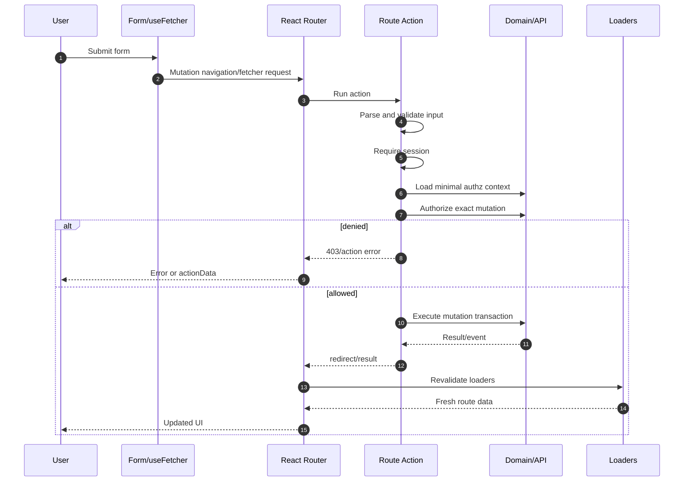
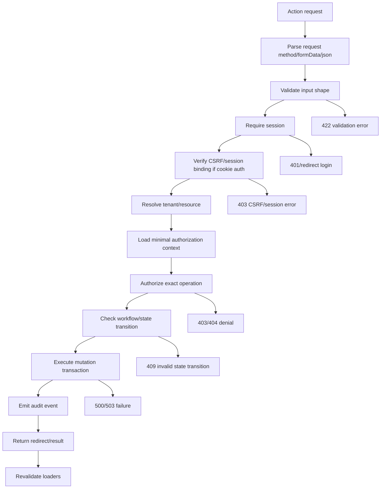
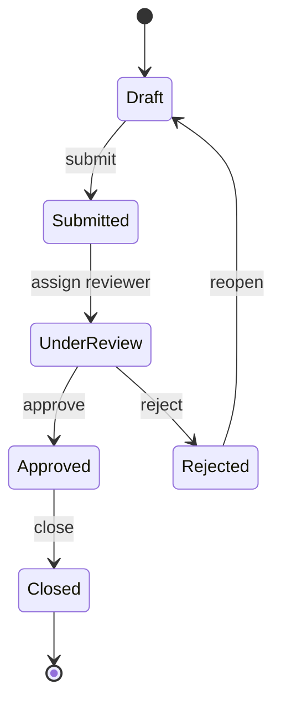

# Part 034 — Action-level Authorization

Reading data is risky.

Writing data is dangerous.

A route `loader` answers:

```txt
Can this route produce this data projection for this actor?
```

A route `action` must answer a stronger question:

```txt
Can this actor perform this mutation on this resource, with this exact input, in this current state, under this tenant/session context?
```

That is action-level authorization.

A React form submit is not just UI.

It is a state transition request.

If the action is wrong, the user may not merely see the wrong data.

They may change the system incorrectly.

That is why action auth must be stricter than route visibility.

---

## 1. The core invariant

A button may be hidden.

A route may be protected.

A form may be disabled.

None of that authorizes the mutation.

The invariant:

```txt
Every mutating action must re-authenticate the request context and re-authorize the exact operation before changing state.
```

Not the screen.

Not the role label.

Not the fact that the submit button was visible.

The operation.

With its concrete values.

Example:

```txt
Subject: user_123
Action: case.approve
Resource: case_987
Context:
  tenant: tenant_abc
  caseState: under_review
  assignedSupervisor: user_123
  submitter: user_456
  assuranceLevel: aal2
  requestMethod: POST
  idempotencyKey: idem_001
```

A real authorization decision needs that shape.

---

## 2. Why route access is not enough

Suppose the user can view `/cases/CASE-1`.

That does not imply they can:

```txt
edit the case
approve the case
close the case
assign the case to another user
delete evidence
export the case file
change its sensitivity
```

A route is a screen.

An action is a transition.

The permission model should distinguish them.

```txt
case.read
case.comment.create
case.evidence.upload
case.assign
case.approve
case.close
case.export
```

Bad design:

```ts
if (user.canViewCase) {
  await approveCase(caseId);
}
```

Better:

```ts
await requirePermission(actor, "case.approve", {
  caseId,
  tenantId,
  currentState: case.state,
  submitterUserId: case.submitterUserId,
});
```

Reading permission is not writing permission.

Page access is not mutation access.

---

## 3. React Router action lifecycle

In React Router Framework/Data patterns, route actions handle mutations.

A simplified lifecycle:



The important part:

```txt
Input validation, authentication, authorization, and domain transition all happen before write commit.
```

Not after optimistic UI.

Not only in the component.

Not only at page load.

---

## 4. Minimal action pipeline

A mature action has a pipeline.



The order matters.

Validate before expensive work.

Authenticate before user-specific access.

CSRF-check before cookie-authenticated mutation.

Authorize before state transition.

Audit after decision and after commit as appropriate.

Revalidate after mutation.

---

## 5. Basic action example

```ts
// routes/cases.$caseId.assign.tsx
export async function action({ request, params }: Route.ActionArgs) {
  assertMethod(request, "POST");

  const input = await parseAssignCaseForm(request);
  const session = await requireRouteSession(request);
  await verifyCsrfIfNeeded(request, session);

  const caseId = requireParam(params.caseId, "caseId");

  const authzContext = await loadCaseAuthorizationContext(caseId);

  const decision = await authorize(session.actor, "case.assign", {
    ...authzContext,
    assigneeUserId: input.assigneeUserId,
  });

  if (!decision.allowed) {
    throw authorizationDenied(decision);
  }

  const result = await assignCase({
    actor: session.actor,
    caseId,
    assigneeUserId: input.assigneeUserId,
    idempotencyKey: input.idempotencyKey,
  });

  await auditCaseAssigned({
    actor: session.actor,
    caseId,
    assigneeUserId: input.assigneeUserId,
    result,
  });

  return redirect(`/cases/${caseId}`);
}
```

The component that renders the form is not trusted.

```tsx
export function AssignCaseForm({ caseId, allowedActions }: Props) {
  const canAssign = allowedActions.includes("case.assign");

  if (!canAssign) return null;

  return (
    <Form method="post" action={`/cases/${caseId}/assign`}>
      <AssigneePicker name="assigneeUserId" />
      <input type="hidden" name="idempotencyKey" value={crypto.randomUUID()} />
      <button type="submit">Assign case</button>
    </Form>
  );
}
```

The UI improves usability.

The action enforces security.

---

## 6. Input validation is not authorization

Input validation answers:

```txt
Is this input structurally acceptable?
```

Authorization answers:

```txt
Is this actor allowed to perform this operation with this input?
```

Example:

```ts
const schema = z.object({
  assigneeUserId: z.string().min(1),
});
```

This confirms `assigneeUserId` looks like a string.

It does not prove:

```txt
the assignee exists
the assignee belongs to the same tenant
the actor can assign to that assignee
the case is assignable in its current state
the actor is not assigning to a forbidden team
```

Do both.

```ts
const input = schema.parse(Object.fromEntries(await request.formData()));

const decision = await authorize(actor, "case.assign", {
  caseId,
  assigneeUserId: input.assigneeUserId,
  currentState: case.state,
  tenantId: case.tenantId,
});
```

A valid input can still be unauthorized.

An authorized actor can still send invalid input.

Do not collapse these concerns.

---

## 7. Authentication in actions

Actions must require a fresh enough session for the mutation.

```ts
const session = await requireRouteSession(request);
```

But some actions need more:

```ts
await requireAssurance(session, "aal2");
await requireRecentAuthentication(session, { maxAgeMinutes: 10 });
```

Sensitive actions:

```txt
change password
change email
manage MFA
create API key
export sensitive data
approve regulatory decision
admin impersonation
change billing account
invite privileged user
```

Example:

```ts
export async function action({ request }: Route.ActionArgs) {
  const session = await requireRouteSession(request);

  if (!hasRecentStrongAuth(session, { maxAgeMinutes: 10, minAal: "aal2" })) {
    const returnTo = getSafeInternalReturnTo(request);
    throw redirect(`/step-up?returnTo=${encodeURIComponent(returnTo)}`);
  }

  return rotateApiKey(session.actor);
}
```

A user may have permission and still need step-up.

Permission answers access.

Assurance answers confidence in current authentication.

---

## 8. Authorization must include concrete arguments

Bad:

```ts
await requirePermission(actor, "case.assign");
await assignCase(caseId, assigneeUserId);
```

This asks only:

```txt
Can this actor assign some case to someone?
```

The real question:

```txt
Can this actor assign this case to this assignee now?
```

Better:

```ts
await requirePermission(actor, "case.assign", {
  caseId,
  assigneeUserId,
  tenantId: case.tenantId,
  caseState: case.state,
  actorTeamIds: actor.teamIds,
  assigneeTeamIds: assignee.teamIds,
});
```

Argument-level authorization prevents:

```txt
assigning across tenants
assigning restricted cases to unauthorized users
approving your own submission
changing role to a higher privilege than you can grant
editing fields you are not allowed to edit
exporting more records than your scope allows
```

The rule:

```txt
Authorize the actual mutation, not the generic capability label.
```

---

## 9. Object-level authorization in actions

Most broken access control bugs are object-level.

The user has some permission.

But not for this object.

Example:

```ts
POST /cases/CASE-123/close
```

The action must verify:

```txt
CASE-123 exists
CASE-123 belongs to this tenant
actor can access CASE-123
actor can close CASE-123
CASE-123 is in a closeable state
actor satisfies separation-of-duty constraints
```

Pattern:

```ts
const context = await loadCaseAuthorizationContext(caseId);

if (!context) {
  throw new Response("Not Found", { status: 404 });
}

const decision = await authorize(actor, "case.close", context);

if (!decision.allowed) {
  throw authorizationDenied(decision);
}
```

Do not trust `caseId` because it came from a link your UI generated.

Any user can alter an ID in a URL, hidden input, or request body.

The server action must treat all identifiers as attacker-controlled input.

---

## 10. Field-level authorization in actions

Forms often allow partial updates.

Example:

```json
{
  "title": "New title",
  "sensitivity": "restricted",
  "assignedTeamId": "team_9"
}
```

A user may be allowed to edit `title` but not `sensitivity`.

Do not perform field-level authorization in the UI only.

Bad:

```tsx
{canEditSensitivity && <SensitivitySelect name="sensitivity" />}
```

An attacker can still send:

```http
POST /cases/CASE-1/edit
sensitivity=restricted
```

Server action pattern:

```ts
type EditableCasePatch = {
  title?: string;
  summary?: string;
  sensitivity?: "normal" | "restricted";
  assignedTeamId?: string;
};

function filterAuthorizedPatch(
  actor: Actor,
  patch: EditableCasePatch,
  context: CaseAuthorizationContext,
): EditableCasePatch {
  const allowed: EditableCasePatch = {};

  if ("title" in patch && can(actor, "case.title.update", context)) {
    allowed.title = patch.title;
  }

  if ("summary" in patch && can(actor, "case.summary.update", context)) {
    allowed.summary = patch.summary;
  }

  if ("sensitivity" in patch && can(actor, "case.sensitivity.update", context)) {
    allowed.sensitivity = patch.sensitivity;
  }

  if ("assignedTeamId" in patch && can(actor, "case.assign_team", context)) {
    allowed.assignedTeamId = patch.assignedTeamId;
  }

  return allowed;
}
```

Then choose denial semantics.

Option A: reject if unauthorized fields are present.

```ts
if (Object.keys(allowed).length !== Object.keys(patch).length) {
  throw new Response("Forbidden field update", { status: 403 });
}
```

Option B: ignore unauthorized fields.

This is usually dangerous because it hides tampering.

For security-sensitive systems, prefer explicit rejection and audit.

---

## 11. Workflow/state-machine authorization

Action authorization often depends on current workflow state.

Example case lifecycle:



An action must validate both permission and legal transition.

```ts
const transition = {
  from: caseRecord.state,
  event: "approve",
  to: "approved",
};

if (!isLegalTransition(transition)) {
  throw new Response("Invalid state transition", { status: 409 });
}

await requirePermission(actor, "case.approve", {
  caseId,
  fromState: caseRecord.state,
  assignedReviewerId: caseRecord.assignedReviewerId,
  submitterUserId: caseRecord.submitterUserId,
});
```

Authorization and state transition are different checks.

| Check | Question | Failure |
|---|---|---|
| Input validation | Is the request shaped correctly? | `422` |
| Authentication | Who is making the request? | `401`/redirect |
| Authorization | Is actor allowed to do this? | `403`/`404` |
| State transition | Is the operation valid now? | `409` |
| Business invariant | Would this violate domain rule? | `409`/domain error |

A user may be allowed to approve cases but not this case now.

---

## 12. Separation of duties

Regulated systems often require separation of duties.

Examples:

```txt
Submitter cannot approve their own case.
Investigator cannot close enforcement action they initiated.
Admin cannot grant a role higher than their delegated authority.
Reviewer cannot review evidence they uploaded.
```

This cannot be solved by static route roles.

It depends on resource history and actor relationship.

```ts
const decision = await authorize(actor, "case.approve", {
  caseId,
  submitterUserId: caseRecord.submitterUserId,
  reviewerUserId: caseRecord.reviewerUserId,
  actorUserId: actor.userId,
  priorActions: await loadRelevantCaseActors(caseId),
});

if (!decision.allowed) {
  await auditDeniedAction({
    actor,
    action: "case.approve",
    caseId,
    reasonCode: decision.reasonCode,
  });

  throw new Response("Forbidden", { status: 403 });
}
```

The UI can explain:

```txt
You cannot approve this case because you submitted it.
```

But the action must enforce it.

---

## 13. CSRF in action-level auth

If your app uses cookie-based authentication, the browser may attach cookies automatically to requests.

That creates CSRF risk for mutating actions.

For actions, ask:

```txt
Can a malicious third-party site cause the user's browser to submit this mutation with their cookies?
```

Mitigations commonly include:

```txt
SameSite cookie configuration
CSRF token tied to the user's session
custom request headers for AJAX/API requests
Origin/Referer verification for sensitive endpoints
requiring non-simple requests where appropriate
re-authentication for highly sensitive operations
```

Example CSRF verification:

```ts
export async function verifyCsrfIfNeeded(request: Request, session: AuthenticatedSession) {
  if (!usesCookieSession(session)) return;

  const method = request.method.toUpperCase();
  if (method === "GET" || method === "HEAD" || method === "OPTIONS") return;

  const formData = await request.clone().formData().catch(() => null);
  const submitted =
    request.headers.get("x-csrf-token") ??
    formData?.get("csrfToken")?.toString() ??
    null;

  if (!submitted) {
    throw new Response("CSRF token missing", { status: 403 });
  }

  const valid = await verifySessionBoundCsrfToken(session.sessionId, submitted);

  if (!valid) {
    throw new Response("CSRF token invalid", { status: 403 });
  }
}
```

In React forms:

```tsx
<Form method="post">
  <input type="hidden" name="csrfToken" value={csrfToken} />
  <button type="submit">Save</button>
</Form>
```

For fetcher/API requests:

```ts
await fetch("/api/cases/CASE-1/close", {
  method: "POST",
  credentials: "include",
  headers: {
    "content-type": "application/json",
    "x-csrf-token": csrfToken,
  },
  body: JSON.stringify({ reason }),
});
```

CSRF protection is not a substitute for authorization.

It proves the request likely came through your app context.

It does not prove the user is allowed to perform the operation.

Do both.

---

## 14. Method enforcement

Actions should reject unexpected methods.

```ts
function assertMethod(request: Request, expected: "POST" | "PUT" | "PATCH" | "DELETE") {
  if (request.method.toUpperCase() !== expected) {
    throw new Response("Method Not Allowed", {
      status: 405,
      headers: {
        allow: expected,
      },
    });
  }
}
```

This matters because accidental support for multiple methods weakens review.

A destructive action should not accept `GET`.

A browser, crawler, prefetcher, or malicious link should not trigger mutation.

Keep safe methods safe.

```txt
GET loads.
POST/PATCH/PUT/DELETE mutate.
```

Then enforce CSRF/authz on mutating methods.

---

## 15. `Form` vs `fetcher` authorization

React Router forms and fetchers are different UX mechanisms.

They are not different security levels.

A `<Form>` may trigger navigation.

A `fetcher.Form` may mutate without navigation.

Both reach actions.

Both require action-level authorization.

```tsx
const fetcher = useFetcher();

return (
  <fetcher.Form method="post" action={`/cases/${caseId}/comment`}>
    <textarea name="body" />
    <button type="submit">Comment</button>
  </fetcher.Form>
);
```

The action:

```ts
export async function action({ request, params }: Route.ActionArgs) {
  const session = await requireRouteSession(request);
  await verifyCsrfIfNeeded(request, session);

  const input = await parseCommentInput(request);
  const caseId = requireParam(params.caseId, "caseId");

  await requirePermission(session.actor, "case.comment.create", {
    caseId,
    bodyLength: input.body.length,
  });

  return createComment({ actor: session.actor, caseId, body: input.body });
}
```

Do not authorize based on whether the request came from `Form` or `fetcher`.

Authorize the mutation.

---

## 16. Action result design

After authorization and mutation, the action can:

```txt
return structured action data
redirect
throw response
return validation errors
return domain conflict
```

Use response type intentionally.

| Result | Use when |
|---|---|
| Redirect | Mutation changes route destination or canonical URL |
| Action data | Same screen should display result/errors |
| `422` | Input validation failed |
| `401`/redirect | Session missing/expired |
| `403` | Authenticated but forbidden |
| `404` | Resource absent or hidden |
| `409` | Valid request but invalid current workflow/version |
| `503` | Dependency unavailable |

Example:

```ts
if (!validation.success) {
  return data(
    { ok: false, errors: validation.errors },
    { status: 422 },
  );
}
```

For forbidden:

```ts
if (!decision.allowed) {
  throw new Response("Forbidden", { status: 403 });
}
```

For successful mutation:

```ts
return redirect(`/cases/${caseId}?updated=assignment`);
```

Do not return `200 OK` for denied mutations.

Security failures should be visible to tests and observability.

---

## 17. Revalidation after action

After actions, route data must be refreshed.

Otherwise the UI may show stale permissions or stale resource state.

Examples:

```txt
Case assigned -> allowed actions changed.
Case approved -> workflow state changed.
Role granted -> navigation/sidebar changed.
Tenant switched -> almost all route data invalid.
MFA completed -> sensitive action becomes available.
Comment created -> timeline updates.
```

In React Router, route data revalidation after actions is a major architecture advantage.

But you still need correct cache boundaries.

If using a query cache:

```ts
await queryClient.invalidateQueries({
  queryKey: ["tenant", tenantId, "case", caseId],
});
```

If using loader data:

```txt
Let action completion trigger relevant loader revalidation.
```

If using external client stores:

```ts
authEvents.publish({
  type: "resource.changed",
  resourceType: "case",
  resourceId: caseId,
});
```

The action is where the app knows the mutation happened.

Use that point to invalidate stale projections.

---

## 18. Optimistic UI and authorization

Optimistic UI can make an app feel fast.

It can also lie.

Bad optimistic flow:

```txt
User clicks approve.
UI immediately marks case approved.
Server denies.
UI silently keeps approved state.
```

Better optimistic flow:

```txt
Optimistically mark pending.
Submit action.
If allowed and committed, revalidate canonical state.
If denied, roll back and show reason.
If conflict, reload current state and explain.
```

Example state model:

```ts
type MutationState =
  | { status: "idle" }
  | { status: "pending"; optimisticLabel: string }
  | { status: "committed" }
  | { status: "denied"; reasonCode: string }
  | { status: "conflict"; currentState: string };
```

UI:

```tsx
if (fetcher.state !== "idle") {
  return <PendingApprovalBanner />;
}

if (fetcher.data?.status === "denied") {
  return <AccessDeniedInline reason={fetcher.data.reasonCode} />;
}
```

Do not make optimistic state canonical.

The action result and revalidated loader data are canonical.

---

## 19. Idempotency for action retries

Actions can be retried.

Why?

```txt
network timeout
browser retry
user double-click
service worker replay
mobile unstable network
reverse proxy retry
```

Mutations should use idempotency where duplicate execution is harmful.

Examples:

```txt
payment submission
case approval
file upload finalization
invitation creation
role grant
export generation
```

Pattern:

```tsx
<input type="hidden" name="idempotencyKey" value={idempotencyKey} />
```

Action:

```ts
const input = await parseActionInput(request);

const result = await withIdempotency(
  {
    key: input.idempotencyKey,
    actorId: session.userId,
    operation: "case.approve",
    resourceId: caseId,
  },
  () => approveCaseTransaction({ actor: session.actor, caseId }),
);
```

Idempotency key must be scoped.

```txt
actor/session
operation
resource
tenant
reasonable expiry
```

Do not let one user's idempotency key affect another user's action.

---

## 20. Concurrency and stale action forms

A form can become stale.

Example:

```txt
User opens case in Draft.
Another user submits it.
First user still sees Submit button.
First user submits stale form.
```

Action must check current state.

```ts
const caseRecord = await loadCaseForUpdate(caseId);

if (caseRecord.version !== input.expectedVersion) {
  throw new Response("Case changed; reload required", { status: 409 });
}

if (caseRecord.state !== "draft") {
  throw new Response("Case is no longer draft", { status: 409 });
}
```

UI can include version:

```tsx
<input type="hidden" name="expectedVersion" value={caseRecord.version} />
```

But version is not trusted either.

It is a concurrency precondition.

The server compares it against canonical state.

Action-level authorization should be performed against the current state at commit time.

---

## 21. Transaction boundary

Authorization and mutation should be close to the transaction boundary.

Bad:

```ts
const decision = await authorize(actor, "case.approve", context);
await sleep(5000);
await approveCase(caseId);
```

Between decision and commit, state may change.

Better:

```ts
await db.transaction(async (tx) => {
  const caseRecord = await tx.cases.findForUpdate(caseId);

  const decision = await authorize(actor, "case.approve", {
    caseId,
    state: caseRecord.state,
    submitterUserId: caseRecord.submitterUserId,
    tenantId: caseRecord.tenantId,
  });

  if (!decision.allowed) {
    throw new ForbiddenError(decision.reasonCode);
  }

  if (caseRecord.state !== "under_review") {
    throw new ConflictError("invalid_state");
  }

  await tx.cases.update(caseId, {
    state: "approved",
    approvedBy: actor.userId,
    approvedAt: new Date(),
  });

  await tx.audit.insert({
    action: "case.approve",
    actorId: actor.userId,
    caseId,
    tenantId: caseRecord.tenantId,
  });
});
```

For high-value transitions, check authorization inside the same transaction or near the locked read.

Otherwise you authorize an old world and commit into a new one.

---

## 22. Client actions vs server actions

Some router modes distinguish server-side `action` from browser-side `clientAction`.

Security rule:

```txt
A browser-side client action cannot be the final authorization boundary for a mutation.
```

A `clientAction` may:

```txt
prepare client-side data
perform optimistic update
call an API
coordinate local cache
handle UI-specific submission flow
```

But the API/server must authorize the mutation.

Bad:

```ts
export async function clientAction({ request }: Route.ClientActionArgs) {
  const user = authStore.getUser();

  if (user.role !== "admin") {
    return { ok: false };
  }

  localDatabase.deleteUser(await request.formData());
}
```

Better:

```ts
export async function clientAction({ request }: Route.ClientActionArgs) {
  const formData = await request.formData();

  const response = await fetch("/api/admin/users/delete", {
    method: "POST",
    credentials: "include",
    body: formData,
    headers: {
      "x-csrf-token": getCsrfToken(),
    },
  });

  return mapMutationResponse(response);
}
```

Then `/api/admin/users/delete` enforces auth.

Client actions are UX orchestration.

Server actions/API endpoints are enforcement boundaries.

---

## 23. Safe permission-aware form rendering

The loader can return allowed actions.

```ts
return {
  case: caseView,
  allowedActions: ["case.comment.create", "case.assign"],
};
```

The component can render accordingly.

```tsx
function CaseActions({ allowedActions }: { allowedActions: string[] }) {
  return (
    <menu>
      {allowedActions.includes("case.comment.create") && <CommentForm />}
      {allowedActions.includes("case.assign") && <AssignButton />}
      {allowedActions.includes("case.approve") && <ApproveButton />}
    </menu>
  );
}
```

This is good UX.

But the action must repeat the decision.

Why repeat?

```txt
Allowed actions may be stale.
User may craft request manually.
Resource state may change.
Permissions may change.
Tenant may switch.
Form may be replayed.
```

Rendering permission is a hint.

Action authorization is enforcement.

---

## 24. Denial response design

A denied action needs a product decision.

Possible surfaces:

```txt
Full route error boundary
Inline form error
Toast
Redirect to access denied page
Silent no-op is discouraged
```

Use reason codes, not raw policy internals.

```ts
type DenialReasonCode =
  | "missing_permission"
  | "wrong_tenant"
  | "resource_not_visible"
  | "invalid_state"
  | "separation_of_duties"
  | "step_up_required"
  | "session_revoked";
```

Action:

```ts
if (!decision.allowed) {
  return data(
    {
      ok: false,
      status: "denied",
      reasonCode: decision.reasonCode,
    },
    { status: 403 },
  );
}
```

UI:

```tsx
if (fetcher.data?.status === "denied") {
  return <PermissionDeniedMessage reasonCode={fetcher.data.reasonCode} />;
}
```

Be careful with explanation depth.

Helpful:

```txt
You cannot approve this case because you submitted it.
```

Too revealing:

```txt
You cannot approve this case because confidential witness evidence was attached by team INT-7 under sealed memo 492.
```

Denial UX is part of information disclosure control.

---

## 25. Auditing actions

Mutations should produce audit events.

For auth-sensitive actions, audit both allow and deny when appropriate.

```ts
type ActionAuditEvent = {
  eventType: "case.approve.attempted" | "case.approve.succeeded" | "case.approve.denied";
  actorId: string;
  tenantId: string;
  resourceType: "case";
  resourceId: string;
  decision: "allow" | "deny";
  reasonCode?: string;
  sessionIdHash: string;
  requestId: string;
  idempotencyKey?: string;
  occurredAt: string;
};
```

Do not log secrets.

Do not log full form payloads if they contain sensitive data.

Do log enough to reconstruct:

```txt
who attempted what
on which resource
under which tenant/session
what decision happened
why at a policy-code level
whether state changed
```

For regulated systems, action audit is not optional plumbing.

It is part of defensibility.

---

## 26. Example: approving a case

This example combines the important pieces.

```ts
export async function action({ request, params }: Route.ActionArgs) {
  assertMethod(request, "POST");

  const session = await requireRouteSession(request);
  await verifyCsrfIfNeeded(request, session);
  await requireAssurance(session, "aal2");

  const caseId = requireParam(params.caseId, "caseId");
  const input = await parseApproveInput(request);

  try {
    await approveCaseUseCase({
      actor: session.actor,
      caseId,
      expectedVersion: input.expectedVersion,
      decisionNote: input.decisionNote,
      idempotencyKey: input.idempotencyKey,
      requestId: getRequestId(request),
    });

    return redirect(`/cases/${caseId}?event=approved`);
  } catch (error) {
    if (error instanceof ForbiddenError) {
      return data(
        { ok: false, status: "denied", reasonCode: error.reasonCode },
        { status: 403 },
      );
    }

    if (error instanceof ConflictError) {
      return data(
        { ok: false, status: "conflict", reasonCode: error.reasonCode },
        { status: 409 },
      );
    }

    if (error instanceof ValidationError) {
      return data(
        { ok: false, status: "invalid", errors: error.flatten() },
        { status: 422 },
      );
    }

    throw error;
  }
}
```

Use case:

```ts
async function approveCaseUseCase(command: {
  actor: Actor;
  caseId: string;
  expectedVersion: number;
  decisionNote: string;
  idempotencyKey: string;
  requestId: string;
}) {
  return db.transaction(async (tx) => {
    const caseRecord = await tx.cases.findForUpdate(command.caseId);

    if (!caseRecord) {
      throw new NotFoundError("case_not_found");
    }

    if (caseRecord.version !== command.expectedVersion) {
      throw new ConflictError("version_changed");
    }

    if (caseRecord.state !== "under_review") {
      throw new ConflictError("invalid_state");
    }

    const decision = await authorize(command.actor, "case.approve", {
      caseId: caseRecord.id,
      tenantId: caseRecord.tenantId,
      state: caseRecord.state,
      submitterUserId: caseRecord.submitterUserId,
      assignedReviewerId: caseRecord.assignedReviewerId,
    });

    if (!decision.allowed) {
      await tx.audit.insert({
        eventType: "case.approve.denied",
        actorId: command.actor.userId,
        caseId: caseRecord.id,
        tenantId: caseRecord.tenantId,
        reasonCode: decision.reasonCode,
        requestId: command.requestId,
      });

      throw new ForbiddenError(decision.reasonCode);
    }

    await tx.cases.update(caseRecord.id, {
      state: "approved",
      approvedBy: command.actor.userId,
      approvedAt: new Date(),
      decisionNote: command.decisionNote,
      version: caseRecord.version + 1,
    });

    await tx.audit.insert({
      eventType: "case.approve.succeeded",
      actorId: command.actor.userId,
      caseId: caseRecord.id,
      tenantId: caseRecord.tenantId,
      requestId: command.requestId,
    });
  });
}
```

Notice the structure:

```txt
route action handles HTTP/form concerns
use case handles domain transaction
authorization happens near current resource state
audit records decision and mutation
```

That separation scales.

---

## 27. Example: role grant action

Role and permission management is especially dangerous.

Bad:

```ts
await requirePermission(actor, "role.manage");
await grantRole(targetUserId, roleId);
```

Better:

```ts
const grantContext = await loadRoleGrantContext({
  actorUserId: actor.userId,
  targetUserId,
  roleId,
  tenantId,
});

const decision = await authorize(actor, "role.grant", grantContext);
```

Context should include:

```txt
target user's tenant membership
role privilege level
actor's delegated admin scope
whether role is grantable
whether actor can manage target user
whether grant requires approval
whether grant is temporary
```

Implementation:

```ts
export async function grantRoleAction({ request }: Route.ActionArgs) {
  const session = await requireRouteSession(request);
  await verifyCsrfIfNeeded(request, session);
  await requireAssurance(session, "aal2");

  const input = await parseGrantRoleInput(request);

  const context = await loadRoleGrantContext({
    actor: session.actor,
    tenantId: input.tenantId,
    targetUserId: input.targetUserId,
    roleId: input.roleId,
  });

  const decision = await authorize(session.actor, "role.grant", context);

  if (!decision.allowed) {
    throw authorizationDenied(decision);
  }

  await grantRole({
    actor: session.actor,
    tenantId: input.tenantId,
    targetUserId: input.targetUserId,
    roleId: input.roleId,
    expiresAt: input.expiresAt,
  });

  return redirect(`/admin/users/${input.targetUserId}`);
}
```

Role grant is a mutation that changes future authorization decisions.

Treat it as high-risk.

---

## 28. Bulk action authorization

Bulk actions are subtle.

Example:

```txt
Close selected cases: CASE-1, CASE-2, CASE-3
```

The user may be allowed to close some but not all.

You need a policy:

```txt
All-or-nothing: deny if any selected item is not allowed.
Partial success: apply allowed, report denied.
Pre-filter: UI only allows eligible rows, action still verifies.
Approval workflow: create request for denied/high-risk rows.
```

All-or-nothing example:

```ts
const contexts = await loadCaseAuthorizationContexts(input.caseIds);

const decisions = await Promise.all(
  contexts.map((ctx) => authorize(actor, "case.close", ctx)),
);

const denied = decisions.filter((decision) => !decision.allowed);

if (denied.length > 0) {
  return data(
    {
      ok: false,
      status: "denied",
      deniedCount: denied.length,
      reasonCode: "some_items_not_allowed",
    },
    { status: 403 },
  );
}

await closeCasesTransaction(input.caseIds, actor);
```

Partial success example:

```ts
const allowedIds = contexts
  .filter((ctx, index) => decisions[index].allowed)
  .map((ctx) => ctx.caseId);

const deniedIds = contexts
  .filter((ctx, index) => !decisions[index].allowed)
  .map((ctx) => ctx.caseId);
```

Be careful with information disclosure.

Do not reveal metadata for resources the actor cannot see.

For regulated workflows, all-or-nothing is often easier to reason about and audit.

---

## 29. Avoiding confused deputy in actions

A confused deputy occurs when a privileged component/service performs an action on behalf of a user without properly checking the user's authority for the concrete target.

In React apps, a common shape is:

```txt
Frontend admin screen can call internal BFF endpoint.
BFF has powerful backend credentials.
BFF performs mutation without checking actor/resource policy.
```

Bad:

```ts
// BFF endpoint
await internalAdminApi.deleteUser(userId);
```

Better:

```ts
const decision = await authorize(actor, "user.delete", {
  targetUserId: userId,
  tenantId,
  actorDelegationScope: actor.delegationScope,
});

if (!decision.allowed) throw new ForbiddenError(decision.reasonCode);

await internalAdminApi.deleteUser({
  actor,
  targetUserId: userId,
  tenantId,
});
```

The BFF must not turn route access into backend superpowers.

Every privileged downstream call should carry actor context or an authorization decision.

---

## 30. Testing action-level authorization

Action tests should cover more than happy path.

Test matrix:

| Scenario | Expected |
|---|---|
| Anonymous mutation | Redirect login or `401` |
| Missing CSRF token under cookie auth | `403` |
| Invalid input | `422` |
| Authenticated but missing permission | `403` |
| Wrong tenant | `403`/`404` |
| Resource hidden | `404` or configured denial mode |
| Stale version | `409` |
| Illegal workflow transition | `409` |
| Separation-of-duties violation | `403` |
| Step-up required | Redirect step-up |
| Duplicate idempotency key | Same result/no duplicate side effect |
| Successful mutation | Redirect/result and revalidation |
| Downstream outage | `503`/safe failure |

Example unauthenticated test:

```ts
it("does not allow anonymous approval", async () => {
  const request = makeFormRequest("/cases/CASE-1/approve", {
    method: "POST",
    body: { decisionNote: "Looks complete" },
  });

  await expect(
    action({ request, params: { caseId: "CASE-1" }, context: {} }),
  ).rejects.toMatchObject({ status: 302 });
});
```

Example forbidden test:

```ts
it("denies approval when actor submitted the case", async () => {
  mockSession({ userId: "user_submitter", tenantId: "tenant_1", assuranceLevel: "aal2" });
  mockCase({ id: "CASE-1", submitterUserId: "user_submitter", state: "under_review" });

  const request = makeFormRequest("/cases/CASE-1/approve", {
    method: "POST",
    cookie: "sid=test",
    csrfToken: "valid",
    body: {
      expectedVersion: "7",
      decisionNote: "Approved",
      idempotencyKey: "idem_1",
    },
  });

  const response = await action({
    request,
    params: { caseId: "CASE-1" },
    context: {},
  });

  expect(response.status).toBe(403);
  expect(await response.json()).toMatchObject({
    status: "denied",
    reasonCode: "separation_of_duties",
  });
});
```

Example stale version test:

```ts
it("returns 409 for stale form submission", async () => {
  mockSession({ userId: "reviewer_1", tenantId: "tenant_1", assuranceLevel: "aal2" });
  mockCase({ id: "CASE-1", version: 8, state: "under_review" });

  const response = await action({
    request: makeFormRequest("/cases/CASE-1/approve", {
      method: "POST",
      cookie: "sid=test",
      csrfToken: "valid",
      body: {
        expectedVersion: "7",
        decisionNote: "Approved",
        idempotencyKey: "idem_2",
      },
    }),
    params: { caseId: "CASE-1" },
    context: {},
  });

  expect(response.status).toBe(409);
});
```

Action tests should prove that hidden buttons are irrelevant.

The request itself must be denied.

---

## 31. Action-level authorization checklist

Use this in review.

```txt
[ ] Every mutation action requires session/authentication.
[ ] Cookie-authenticated mutations have CSRF protection.
[ ] The action validates input before domain mutation.
[ ] Input validation is separate from authorization.
[ ] Authorization includes concrete resource, input, tenant, and workflow context.
[ ] Object-level authorization is enforced server-side.
[ ] Field-level authorization is enforced server-side for partial updates.
[ ] State transition legality is checked against current state.
[ ] Sensitive actions require step-up/recent authentication where appropriate.
[ ] Idempotency is used for retry-sensitive mutations.
[ ] Concurrency/version conflicts return `409` or equivalent.
[ ] UI allowedActions are treated as hints, not enforcement.
[ ] Client actions are not final enforcement boundaries.
[ ] Downstream privileged calls include actor context or checked decision.
[ ] Denied actions return typed errors/reason codes without leaking sensitive data.
[ ] Successful actions trigger revalidation/invalidation of stale route data.
[ ] Mutations emit audit events without logging secrets.
[ ] Tests cover anonymous, CSRF, invalid input, forbidden, stale state, tenant mismatch, and success.
```

---

## 32. The main lesson

Action-level authorization is where React auth becomes serious.

It is easy to protect a route.

It is harder to protect a state transition.

A mature React app treats every form submit, fetcher mutation, button action, and client-triggered API call as a request to change domain state.

The action must ask:

```txt
Who is the actor?
What exact operation are they attempting?
Which resource and tenant does it affect?
What input values change the meaning of the operation?
What is the current workflow state?
Is the actor allowed now?
Is the request fresh, intentional, and non-forged?
How will this be audited and revalidated?
```

That is the difference between UI-level permission and system-level authorization.

A hidden button improves experience.

An action guard protects the system.

---

## References

- React Router Documentation — Actions: https://reactrouter.com/start/framework/actions
- React Router Documentation — Data Loading: https://reactrouter.com/start/framework/data-loading
- React Router Documentation — Pending UI: https://reactrouter.com/start/framework/pending-ui
- OWASP Authorization Cheat Sheet: https://cheatsheetseries.owasp.org/cheatsheets/Authorization_Cheat_Sheet.html
- OWASP Cross-Site Request Forgery Prevention Cheat Sheet: https://cheatsheetseries.owasp.org/cheatsheets/Cross-Site_Request_Forgery_Prevention_Cheat_Sheet.html
- OWASP Session Management Cheat Sheet: https://cheatsheetseries.owasp.org/cheatsheets/Session_Management_Cheat_Sheet.html
- OWASP REST Security Cheat Sheet: https://cheatsheetseries.owasp.org/cheatsheets/REST_Security_Cheat_Sheet.html
