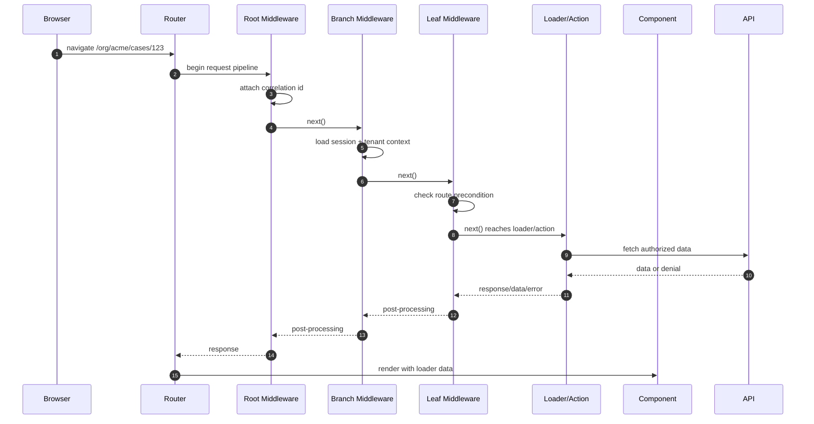
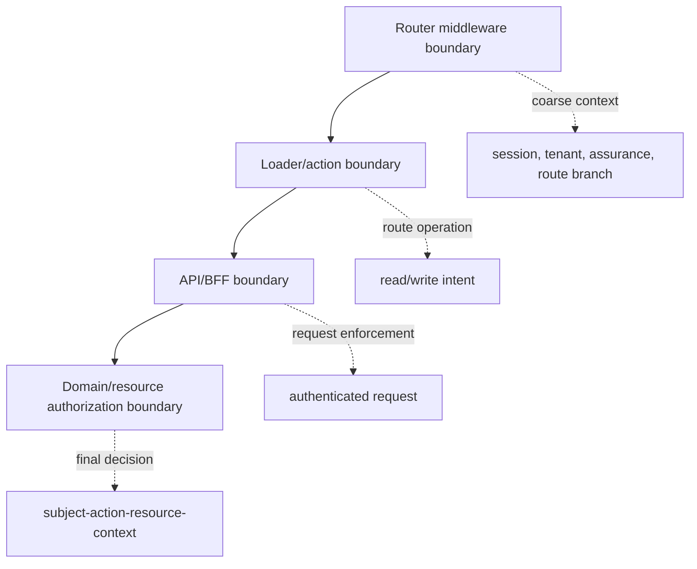
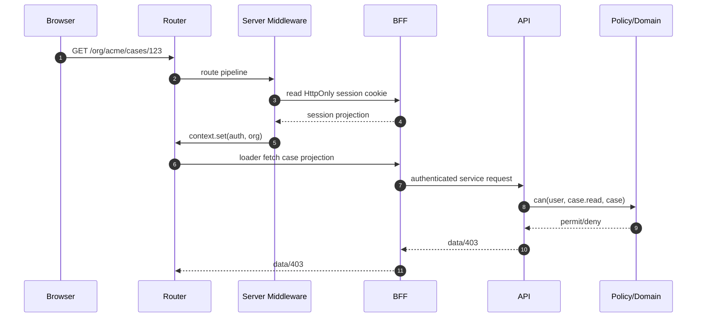

# Part 035 — Router Middleware Auth

A route guard protects a component.

A loader guard protects route data.

An action guard protects a mutation.

Middleware protects the **routing pipeline**.

That distinction matters.

Middleware is not magic. It does not make frontend authorization authoritative. It does not replace backend access control. It does not make a hidden route secure.

What it gives you is a single place to run cross-cutting auth logic before route-specific loaders/actions execute and after a response has been produced.

That makes it useful for:

- session loading
- auth context injection
- coarse route boundary checks
- tenant context resolution
- step-up preconditions
- logging and correlation
- redirect normalization
- denial shaping
- cache-control headers
- shared loader/action context

The correct mental model:

```txt
Middleware is the routing pipeline's policy plumbing.
It is not the system's final policy authority.
```

React Router middleware is especially useful because auth is rarely local to one route.

Authentication state often affects a whole branch:

```txt
/app/*
/admin/*
/org/:orgId/*
/cases/:caseId/*
/settings/billing/*
```

Without middleware, each loader/action tends to repeat the same session bootstrap, redirect, tenant parsing, and audit setup.

That repetition creates a quiet failure mode:

```txt
Most routes are protected.
One forgotten route is not.
```

Middleware gives you a place to make the common case hard to forget.

---

## 1. The routing pipeline mental model

For auth, think of a route navigation as a request pipeline:



Middleware gives you a pre/post shape:

```txt
before route handler
  run next middleware
    run next middleware
      run loader/action
    after child response
  after branch response
```

That is why middleware is useful for shared auth context.

A parent route can resolve the session once.

A child loader can read it without doing session bootstrap again.

---

## 2. Middleware is a boundary, not the boundary

Middleware is a useful boundary.

But it is not the only boundary.

There are at least four auth boundaries in a React application:



Middleware can answer:

```txt
Is there a valid session projection for this route branch?
Is this route branch allowed for anonymous users?
Is this tenant selection syntactically valid?
Does this route require MFA freshness?
Which actor context should loaders/actions receive?
```

Middleware must not pretend to answer:

```txt
Can this user approve case 123 in state UNDER_REVIEW?
Can this user update this field but not that field?
Can this user download this object version?
Can this user execute this transition after another reviewer acted?
```

Those are resource/action decisions.

They require fresh backend/domain context.

---

## 3. The minimum useful auth middleware

A minimal middleware does three things:

1. reads session from the request/runtime
2. fails closed if required session is absent
3. places a typed auth context where loaders/actions can read it

Example shape:

```ts
// auth-context.ts
import { createContext } from "react-router";

export type AuthContext = {
  status: "anonymous" | "authenticated";
  actor?: {
    userId: string;
    accountId: string;
    displayName: string;
  };
  session?: {
    id: string;
    expiresAt: string;
    assuranceLevel: "aal1" | "aal2" | "aal3";
  };
};

export const authContext = createContext<AuthContext>({
  status: "anonymous",
});
```

```ts
// middleware/auth.server.ts
import { redirect } from "react-router";
import { authContext } from "~/auth-context";
import { readSessionFromRequest } from "~/session.server";
import { safeLoginRedirect } from "~/safe-redirect.server";

export async function requireUserMiddleware({ request, context }, next) {
  const session = await readSessionFromRequest(request);

  if (!session) {
    throw redirect(safeLoginRedirect(request));
  }

  context.set(authContext, {
    status: "authenticated",
    actor: {
      userId: session.userId,
      accountId: session.accountId,
      displayName: session.displayName,
    },
    session: {
      id: session.id,
      expiresAt: session.expiresAt,
      assuranceLevel: session.assuranceLevel,
    },
  });

  return next();
}
```

A loader then reads context instead of repeating session parsing:

```ts
// routes/app.dashboard.tsx
import { authContext } from "~/auth-context";

export async function loader({ context }) {
  const auth = context.get(authContext);

  if (auth.status !== "authenticated") {
    throw new Response("Unauthorized", { status: 401 });
  }

  return {
    userName: auth.actor.displayName,
  };
}
```

This pattern is not about fewer lines.

It is about fewer forgotten checks.

---

## 4. Route branch middleware

Auth naturally follows route branches.

Example:

```txt
/
  public routes
/app
  authenticated user required
/org/:orgId
  authenticated user + tenant membership required
/admin
  authenticated user + admin capability required
```

A branch can attach middleware once:

```ts
// routes/app.tsx
import { requireUserMiddleware } from "~/middleware/auth.server";

export const middleware = [requireUserMiddleware];
```

For an org branch:

```ts
// routes/org.$orgId.tsx
import { requireUserMiddleware } from "~/middleware/auth.server";
import { resolveOrgMiddleware } from "~/middleware/org.server";

export const middleware = [
  requireUserMiddleware,
  resolveOrgMiddleware,
];
```

For admin:

```ts
// routes/admin.tsx
import { requireUserMiddleware } from "~/middleware/auth.server";
import { requireCapabilityMiddleware } from "~/middleware/capability.server";

export const middleware = [
  requireUserMiddleware,
  requireCapabilityMiddleware("admin.console.read"),
];
```

The important design rule:

```txt
Parent middleware should establish context.
Child middleware may narrow context.
Leaf loaders/actions must still authorize resource operations.
```

---

## 5. Context layering

Good middleware produces layered context.

Do not put everything into `user`.

Auth context should be factored:

```txt
request context
  correlation id
  request url
  client hints

session context
  session id
  actor id
  assurance level
  expiry

identity context
  user id
  account id
  display name
  email verification state

organization context
  tenant id
  membership id
  selected role summary

permission projection
  coarse capabilities
  feature exposure hints

route policy context
  required auth state
  required assurance
  required tenant
```

Example:

```ts
export const requestContext = createContext<RequestContext>();
export const sessionContext = createContext<SessionContext | null>(null);
export const orgContext = createContext<OrgContext | null>(null);
export const routePolicyContext = createContext<RoutePolicyContext>();
```

Why split it?

Because not every route needs every field.

Because session and tenant have different lifecycles.

Because permission projection is not identity.

Because a domain object authorization decision should receive exactly the facts it needs.

---

## 6. Auth middleware as policy plumbing

Middleware can enforce route-level policy when policy is static enough to attach to the route branch.

Example route policy:

```ts
type RoutePolicy = {
  allowAnonymous?: boolean;
  requireUser?: boolean;
  requireTenant?: boolean;
  requireAssurance?: "aal1" | "aal2" | "aal3";
  requireCapabilities?: string[];
};
```

Attach policy to route handle:

```ts
export const handle = {
  auth: {
    requireUser: true,
    requireTenant: true,
    requireCapabilities: ["case.read"],
  } satisfies RoutePolicy,
};
```

Middleware can collect matched policies and apply them before loader/action work.

Pseudo-shape:

```ts
export async function routePolicyMiddleware(args, next) {
  const policies = collectMatchedRoutePolicies(args.matches);
  const effective = mergePolicies(policies);

  const auth = args.context.get(authContext);

  if (effective.requireUser && auth.status !== "authenticated") {
    throw redirect(loginUrl(args.request));
  }

  if (effective.requireTenant) {
    const org = args.context.get(orgContext);
    if (!org) throw new Response("Tenant required", { status: 403 });
  }

  if (effective.requireAssurance) {
    requireAssurance(auth, effective.requireAssurance);
  }

  return next();
}
```

This is valuable.

But it is still coarse.

The route says:

```txt
This branch requires capability case.read.
```

The loader still must ask:

```txt
Can this actor read this exact case in this exact tenant at this exact time?
```

---

## 7. Route policy merging

Route policy merging must be monotonic.

A child route may add requirements.

It should not silently weaken parent requirements.

Bad merge:

```ts
const effective = { ...parentPolicy, ...childPolicy };
```

Why bad?

Because child can accidentally set:

```ts
{ requireUser: false }
```

and weaken the branch.

Better:

```ts
type EffectivePolicy = {
  requireUser: boolean;
  requireTenant: boolean;
  requireAssurance: "none" | "aal1" | "aal2" | "aal3";
  capabilities: Set<string>;
};

const assuranceRank = {
  none: 0,
  aal1: 1,
  aal2: 2,
  aal3: 3,
} as const;

function maxAssurance(a: EffectivePolicy["requireAssurance"], b: EffectivePolicy["requireAssurance"]) {
  return assuranceRank[a] >= assuranceRank[b] ? a : b;
}

function mergePolicyChain(policies: RoutePolicy[]): EffectivePolicy {
  return policies.reduce<EffectivePolicy>(
    (acc, p) => ({
      requireUser: acc.requireUser || Boolean(p.requireUser),
      requireTenant: acc.requireTenant || Boolean(p.requireTenant),
      requireAssurance: maxAssurance(acc.requireAssurance, p.requireAssurance ?? "none"),
      capabilities: new Set([
        ...acc.capabilities,
        ...(p.requireCapabilities ?? []),
      ]),
    }),
    {
      requireUser: false,
      requireTenant: false,
      requireAssurance: "none",
      capabilities: new Set(),
    }
  );
}
```

Invariant:

```txt
Policy merge can only maintain or increase required access level.
```

---

## 8. Auth middleware for tenant context

Multi-tenant auth fails when tenant context is treated as UI state.

A URL like this is untrusted:

```txt
/org/acme/cases/123
```

The `orgId` path param is not proof of membership.

Middleware can resolve the tenant context:

```ts
export const orgContext = createContext<{
  orgId: string;
  orgSlug: string;
  membershipId: string;
  membershipStatus: "active" | "suspended";
} | null>(null);
```

```ts
export async function resolveOrgMiddleware({ request, params, context }, next) {
  const auth = context.get(authContext);

  if (auth.status !== "authenticated") {
    throw redirect(loginUrl(request));
  }

  const orgSlug = params.orgId;
  if (!orgSlug) {
    throw new Response("Organization required", { status: 400 });
  }

  const membership = await findActiveMembership({
    userId: auth.actor.userId,
    orgSlug,
  });

  if (!membership) {
    throw new Response("Forbidden", { status: 403 });
  }

  context.set(orgContext, {
    orgId: membership.orgId,
    orgSlug,
    membershipId: membership.id,
    membershipStatus: membership.status,
  });

  return next();
}
```

This middleware authorizes membership in the route branch.

It does not authorize every resource inside the organization.

A case loader still checks the case:

```ts
export async function loader({ params, context }) {
  const auth = context.get(authContext);
  const org = context.get(orgContext);

  const caseRecord = await loadCase(params.caseId);

  await assertCan(auth.actor, "case.read", caseRecord, {
    orgId: org.orgId,
  });

  return toCaseView(caseRecord);
}
```

---

## 9. Middleware for step-up auth

Some routes require stronger authentication freshness.

Examples:

```txt
/change-password
/billing/payment-methods
/admin/impersonate
/cases/:caseId/escalate
/security/api-keys
```

Middleware can detect the branch requirement:

```ts
export const handle = {
  auth: {
    requireUser: true,
    requireAssurance: "aal2",
  },
};
```

Then redirect to step-up:

```ts
function requireAssurance(auth: AuthContext, required: AssuranceLevel, request: Request) {
  if (auth.status !== "authenticated") {
    throw redirect(loginUrl(request));
  }

  if (rank(auth.session.assuranceLevel) < rank(required)) {
    throw redirect(stepUpUrl(request, required));
  }
}
```

A step-up redirect must preserve intent safely.

It must not preserve arbitrary external return URLs.

That becomes Part 036.

---

## 10. Middleware and anonymous routes

Not every route should require login.

Common categories:

```txt
Public route        /login, /signup, /docs, /pricing
Guest-only route    /login when already authenticated redirects to /app
Authenticated route /app/*
Tenant route        /org/:orgId/*
Privileged route    /admin/*
Step-up route       /billing/*, /security/*
```

A single `requireUser` middleware is not enough.

You need route policy.

Example:

```ts
type AuthMode =
  | "public"
  | "guest-only"
  | "authenticated"
  | "tenant"
  | "privileged";
```

```ts
export async function authModeMiddleware({ request, context, matches }, next) {
  const policy = getEffectiveAuthPolicy(matches);
  const session = await readSessionFromRequest(request);

  if (policy.mode === "public") {
    context.set(authContext, projectSession(session));
    return next();
  }

  if (policy.mode === "guest-only" && session) {
    throw redirect(defaultAfterLoginUrl(session));
  }

  if (!session) {
    throw redirect(loginUrl(request));
  }

  context.set(authContext, projectSession(session));
  return next();
}
```

Guest-only routes are a common source of redirect loops.

Example bug:

```txt
/login requires anonymous
root middleware redirects anonymous to /login
/login middleware redirects authenticated to /app
session bootstrap is stale
browser bounces forever
```

Fix with explicit states:

```txt
unknown -> bootstrap -> anonymous/authenticated/degraded
```

Never redirect while auth state is unknown unless you are in server middleware with reliable request session information.

---

## 11. Client middleware vs server middleware

In framework/server contexts, middleware may have access to the HTTP request, cookies, headers, and server-only session store.

In browser/client data mode, middleware runs in a JavaScript runtime that is already inside the browser trust boundary.

That changes what it can safely do.

```txt
Server middleware can:
  read HttpOnly cookies
  validate server session
  set response headers
  avoid exposing token material
  redirect before HTML/data response

Client middleware can:
  use in-memory auth state
  coordinate route transitions
  prevent data loader execution in the client router
  shape navigation UX
  broadcast logout effects

Client middleware cannot:
  read HttpOnly cookies directly
  prove session validity by itself
  enforce backend authorization
  protect API endpoints from direct calls
```

Decision rule:

```txt
Use server middleware for authority.
Use client middleware for routing consistency and UX containment.
```

---

## 12. Middleware with BFF

In a BFF architecture, middleware becomes cleaner.

React does not need access tokens.

The browser sends cookies to the BFF.

BFF middleware resolves the session.

Route loaders/actions call same-origin BFF endpoints.



Middleware solves routing state.

The BFF/API still solves data authority.

---

## 13. Middleware and error shaping

Auth failures should be typed.

Do not collapse everything into:

```txt
redirect /login
```

That loses information.

Failure categories:

```txt
401 unauthenticated
403 authenticated but forbidden
419/440 session expired
423 account locked/suspended
428 step-up required
451 legal/compliance block
```

Middleware can normalize these failures into route outcomes.

Example:

```ts
class StepUpRequired extends Error {
  constructor(public required: AssuranceLevel, public returnTo: string) {
    super("Step-up authentication required");
  }
}

export async function authFailureMiddleware(args, next) {
  try {
    return await next();
  } catch (error) {
    if (error instanceof StepUpRequired) {
      throw redirect(stepUpUrl(args.request, error.required));
    }

    if (isSessionExpired(error)) {
      throw redirect(loginUrl(args.request, { reason: "expired" }));
    }

    throw error;
  }
}
```

The UI should know enough to explain the state:

```txt
You need to sign in again.
You are signed in, but you do not have access.
You need to verify with MFA before continuing.
Your account is suspended.
```

Security does not require vague UX.

Security requires not leaking sensitive detail to the wrong actor.

---

## 14. Middleware and cache-control

Authenticated route responses should avoid unsafe caching.

Middleware can add response headers after `next()`.

Example shape:

```ts
export async function authHeadersMiddleware(args, next) {
  const response = await next();
  const auth = args.context.get(authContext);

  if (auth.status === "authenticated") {
    response.headers.set("Cache-Control", "no-store");
    response.headers.set("Pragma", "no-cache");
  }

  return response;
}
```

Be careful:

```txt
Client-side route data cache is not the same as HTTP cache.
```

You also need to invalidate application caches on:

- logout
- tenant switch
- permission change
- session expiry
- forced revocation
- impersonation exit

Middleware can trigger revalidation.

It cannot automatically purge every in-memory cache unless you wire the data layer accordingly.

---

## 15. Middleware and observability

Auth middleware is a natural place to stamp the request with correlation and security context.

Minimal structured event:

```ts
type AuthNavigationEvent = {
  event: "route.auth_check";
  correlationId: string;
  routeId: string;
  pathPattern: string;
  authMode: string;
  actorId?: string;
  orgId?: string;
  outcome: "allow" | "redirect_login" | "deny" | "step_up";
  reason?: string;
  durationMs: number;
};
```

Do not log:

```txt
raw token
session cookie
password
MFA secret
full ID token
full access token
unmasked email if not necessary
sensitive object payload
```

Good auth logs answer:

```txt
What route branch was checked?
Which policy applied?
Was the actor anonymous/authenticated?
Which tenant context was selected?
What was the outcome?
Did this become a redirect loop?
```

They should not become a credential leak.

---

## 16. Middleware and redirect loops

Middleware can create redirect loops faster than any component guard.

Common loops:

```txt
/app -> /login -> /app -> /login
/login -> /callback -> /login -> /callback
/org/acme -> /select-org -> /org/acme
/step-up -> /step-up
```

Loop causes:

- session bootstrap inconsistency
- guest-only route redirects too early
- callback transaction not consumed
- invalid `returnTo`
- stale in-memory auth state
- multi-tab logout/login race
- server sees anonymous while client sees authenticated
- step-up route itself requires step-up

Add a redirect reason and counter:

```ts
function withRedirectGuard(url: URL, reason: string) {
  const count = Number(url.searchParams.get("authRedirectCount") ?? "0");

  if (count >= 3) {
    return "/auth/recover?reason=redirect-loop";
  }

  const next = new URL(url);
  next.searchParams.set("authRedirectCount", String(count + 1));
  next.searchParams.set("authReason", reason);
  return next.pathname + next.search;
}
```

Do not expose internals.

Do expose recoverability.

---

## 17. Middleware anti-patterns

### Anti-pattern: middleware checks role string and declares victory

```ts
if (user.role !== "admin") throw redirect("/403");
```

This is brittle.

Roles are coarse labels.

The real decision is capability and resource scoped:

```txt
Can this actor perform this action on this resource under this context?
```

### Anti-pattern: middleware fetches all permissions for every route

```txt
Every navigation triggers giant permission payload.
```

This creates latency and stale privilege risk.

Better:

```txt
Middleware loads coarse projection.
Loader/action performs resource-specific check.
```

### Anti-pattern: middleware trusts URL tenant

```ts
context.set(orgContext, { orgId: params.orgId });
```

Bad.

Path params are input.

Resolve membership.

### Anti-pattern: middleware redirects every error to login

A `403` is not a `401`.

A suspended account is not an anonymous user.

An expired session is not a missing permission.

### Anti-pattern: middleware hides backend authorization failure

If an API returns `403`, do not convert it into success with empty data unless the product explicitly models that as a safe projection.

Silent denial can hide incidents.

---

## 18. Good middleware file layout

A scalable layout:

```txt
src/
  auth/
    auth-context.ts
    auth-types.ts
    auth-policy.ts
    auth-errors.ts
  middleware/
    request-id.server.ts
    session.server.ts
    auth-mode.server.ts
    org.server.ts
    assurance.server.ts
    security-headers.server.ts
    audit.server.ts
  routes/
    app.tsx
    org.$orgId.tsx
    org.$orgId.cases.$caseId.tsx
```

Avoid:

```txt
src/utils/auth.ts
```

That file becomes an unreviewable dumping ground.

Auth code needs strong boundaries because bugs are not just functional bugs.

They are security bugs.

---

## 19. Reference composition

A production-like middleware chain:

```ts
export const middleware = [
  requestIdMiddleware,
  safeRedirectDefaultsMiddleware,
  optionalSessionMiddleware,
  routePolicyMiddleware,
  tenantContextMiddleware,
  assuranceMiddleware,
  authAuditMiddleware,
  securityHeadersMiddleware,
];
```

Each middleware should have one job.

```txt
requestIdMiddleware
  Creates correlation id.

optionalSessionMiddleware
  Reads session if present, does not force login.

routePolicyMiddleware
  Decides whether this branch requires auth.

tenantContextMiddleware
  Resolves selected org/tenant membership.

assuranceMiddleware
  Applies MFA/step-up route preconditions.

authAuditMiddleware
  Emits structured outcome.

securityHeadersMiddleware
  Adds response headers after next().
```

Do not mix all logic into one `authMiddleware`.

That seems simple until the first exception appears.

---

## 20. Testing middleware

Test middleware like a state machine.

Matrix:

| Scenario | Session | Route policy | Expected outcome |
|---|---|---|---|
| Public route | none | public | allow |
| Public route | valid | public | allow |
| Login route | valid | guest-only | redirect app |
| App route | none | authenticated | redirect login |
| App route | expired | authenticated | redirect login reason expired |
| Tenant route | valid no membership | tenant | 403 |
| Tenant route | valid membership | tenant | context set |
| Step-up route | aal1 | aal2 | redirect step-up |
| Step-up route | aal2 | aal2 | allow |
| Admin route | user without capability | privileged | 403 |

Test route policy merge:

```ts
expect(mergePolicyChain([
  { requireUser: true },
  { requireAssurance: "aal2" },
])).toEqual({
  requireUser: true,
  requireAssurance: "aal2",
});
```

Test that child routes cannot weaken parent policy:

```ts
expect(mergePolicyChain([
  { requireUser: true },
  { allowAnonymous: true },
]).requireUser).toBe(true);
```

Test redirect target safety.

That is Part 036.

---

## 21. Middleware review checklist

Ask these questions in review:

```txt
Does middleware fail closed?
Can child routes weaken parent requirements?
Is anonymous/public route policy explicit?
Are 401, 403, expired, step-up, and suspended states distinct?
Are return URLs validated?
Is tenant context resolved from membership, not trusted from URL?
Are backend API calls still authorized independently?
Are sensitive tokens excluded from logs?
Is cache invalidated on logout and tenant switch?
Can middleware cause redirect loops?
Are route policy tests present?
Is there a documented migration path for new route branches?
```

A good middleware system makes secure routing the default path.

It should still be boring.

Auth middleware that feels clever usually hides coupling.

---

## 22. Final mental model

Middleware sits between route matching and route execution.

Its job is not to know every domain rule.

Its job is to make the route pipeline carry the right security context to the places that do know domain rules.

```txt
Middleware authenticates and contextualizes navigation.
Loaders/actions authorize route operations.
APIs enforce request authorization.
Domain policy enforces resource authorization.
```

Use middleware to eliminate repetition.

Use it to make failure typed.

Use it to prevent route-level mistakes.

Do not use it to pretend the frontend is the security boundary.

---

## References

- React Router — Middleware: https://reactrouter.com/how-to/middleware
- React Router — Route Object: https://reactrouter.com/start/data/route-object
- React Router — redirect: https://reactrouter.com/api/utils/redirect
- OWASP Authorization Cheat Sheet: https://cheatsheetseries.owasp.org/cheatsheets/Authorization_Cheat_Sheet.html
- OWASP Unvalidated Redirects and Forwards Cheat Sheet: https://cheatsheetseries.owasp.org/cheatsheets/Unvalidated_Redirects_and_Forwards_Cheat_Sheet.html
