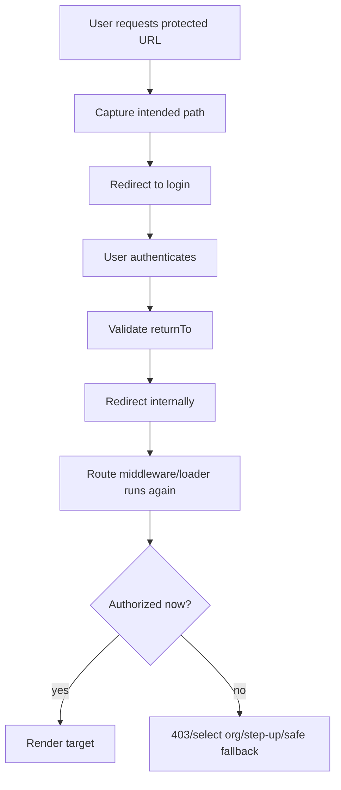
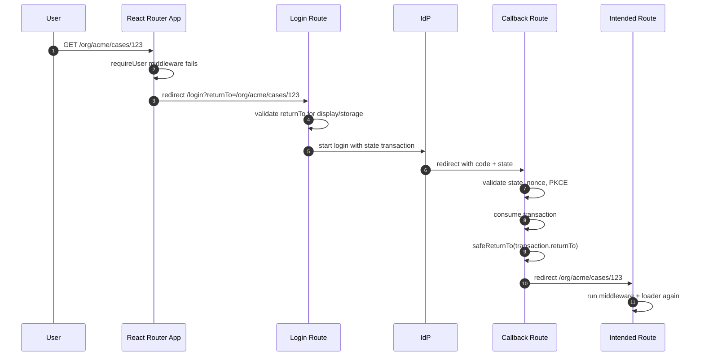

# Part 036 — Return URL and Open Redirect Defense

Login should feel continuous.

A user opens:

```txt
/org/acme/cases/123?tab=evidence
```

The app discovers the user is not authenticated.

The app sends them to login.

After login, the app should return them to the original place.

That is the product requirement.

The security problem hides inside one innocent parameter:

```txt
returnTo=/org/acme/cases/123?tab=evidence
```

If `returnTo` is not validated, an attacker can turn your trusted domain into a redirector:

```txt
https://app.example.com/login?returnTo=https://evil.example/phish
```

The user sees your domain first.

Then your app sends them to the attacker.

That is open redirect.

In auth systems, open redirect is worse than generic phishing.

It can become part of OAuth abuse, callback confusion, token leakage, login CSRF, step-up bypass chains, and support/social-engineering attacks.

So the rule is simple:

```txt
Post-auth redirect intent is untrusted input.
Treat it like input to a security-sensitive state machine.
```

---

## 1. Return URL is product intent, not authority

A return URL expresses user intent:

```txt
After authentication, attempt to continue here.
```

It does not prove that continuing is safe.

It does not prove access.

It does not prove tenant membership.

It does not prove that the route still exists.

It does not prove that the route is still valid after role/session changes.

After login, the app must re-run normal route auth.



The redirect target is only a pointer.

Authorization is still re-evaluated.

---

## 2. Open redirect in one line

Unsafe:

```ts
throw redirect(new URL(request.url).searchParams.get("returnTo") ?? "/app");
```

Why unsafe?

Because `returnTo` can be:

```txt
https://evil.example
//evil.example
/\\evil.example
/%2f%2fevil.example
https://app.example.com.evil.example
javascript:alert(1)
https:evil.example
/%5C%5Cevil.example
```

The exact behavior depends on parser, browser, framework, proxy, and decoding layer.

Do not build redirect security from string vibes.

Use a strict policy.

---

## 3. Safe redirect policy

For most React apps, the safest policy is:

```txt
Only allow same-origin relative paths that start with exactly one slash.
Reject protocol-relative URLs.
Reject backslash tricks.
Reject encoded slash/backslash ambiguity.
Reject control characters.
Reject login/callback/logout routes as return targets.
Fallback to a safe default.
```

That means allowed:

```txt
/app
/app/dashboard
/org/acme/cases/123?tab=evidence
/settings/security#sessions
```

Rejected:

```txt
https://evil.example
//evil.example
/login
/callback
/logout
/\evil.example
/%2f%2fevil.example
javascript:alert(1)
```

This policy is intentionally boring.

Boring redirect policy is good redirect policy.

---

## 4. Implement `safeReturnTo`

A practical implementation:

```ts
type SafeReturnOptions = {
  fallback: string;
  blockedPrefixes?: string[];
};

const DEFAULT_BLOCKED_PREFIXES = [
  "/login",
  "/logout",
  "/callback",
  "/auth/callback",
  "/auth/step-up",
];

export function safeReturnTo(
  rawValue: string | null | undefined,
  options: SafeReturnOptions = { fallback: "/app" }
): string {
  const fallback = normalizeFallback(options.fallback);
  const blockedPrefixes = options.blockedPrefixes ?? DEFAULT_BLOCKED_PREFIXES;

  if (!rawValue) return fallback;

  // Reject obvious parser ambiguity before URL construction.
  if (containsControlCharacter(rawValue)) return fallback;
  if (rawValue.includes("\\")) return fallback;

  let decodedOnce: string;
  try {
    decodedOnce = decodeURIComponent(rawValue);
  } catch {
    return fallback;
  }

  if (containsControlCharacter(decodedOnce)) return fallback;
  if (decodedOnce.includes("\\")) return fallback;

  // Must be root-relative but not protocol-relative.
  if (!decodedOnce.startsWith("/")) return fallback;
  if (decodedOnce.startsWith("//")) return fallback;

  // Avoid encoded protocol-relative tricks that become // after normalization.
  const lower = decodedOnce.toLowerCase();
  if (lower.startsWith("/%2f") || lower.startsWith("/%5c")) return fallback;

  let parsed: URL;
  try {
    parsed = new URL(decodedOnce, "https://app.example.invalid");
  } catch {
    return fallback;
  }

  if (parsed.origin !== "https://app.example.invalid") return fallback;

  const path = parsed.pathname;
  if (!path.startsWith("/") || path.startsWith("//")) return fallback;

  for (const prefix of blockedPrefixes) {
    if (path === prefix || path.startsWith(`${prefix}/`)) {
      return fallback;
    }
  }

  return `${parsed.pathname}${parsed.search}${parsed.hash}`;
}

function normalizeFallback(fallback: string) {
  if (!fallback.startsWith("/") || fallback.startsWith("//")) {
    return "/app";
  }
  return fallback;
}

function containsControlCharacter(value: string) {
  return /[\u0000-\u001F\u007F]/.test(value);
}
```

This function is defensive.

It does not try to support every possible URL.

It supports the URLs you actually need.

---

## 5. Why internal-only is usually the right default

Some teams want to support external redirect destinations.

Example:

```txt
After login, return to customer portal, docs site, or partner app.
```

Do not enable this casually.

External redirect support changes the threat model.

If you truly need it, use an explicit allowlist:

```ts
const ALLOWED_RETURN_ORIGINS = new Set([
  "https://docs.example.com",
  "https://support.example.com",
]);

export function safeExternalReturnTo(rawValue: string | null | undefined) {
  if (!rawValue) return "/app";

  let parsed: URL;
  try {
    parsed = new URL(rawValue);
  } catch {
    return "/app";
  }

  if (!ALLOWED_RETURN_ORIGINS.has(parsed.origin)) {
    return "/app";
  }

  if (parsed.protocol !== "https:") {
    return "/app";
  }

  return parsed.toString();
}
```

But be careful with allowlists.

Allowed domains can still contain unsafe paths.

For example:

```txt
https://docs.example.com/redirect?to=https://evil.example
```

If the allowed site has its own open redirect, your allowlist inherits its weakness.

Internal-only is often enough.

---

## 6. Login redirect sequence

A safe login flow:



Important:

The return target should be stored in the login transaction, not blindly trusted from the callback query.

Better:

```txt
login start captures safe returnTo
transaction id stored server-side or in protected transaction store
callback validates state
callback resolves returnTo from transaction
callback validates returnTo again
```

Never let callback do this:

```ts
const returnTo = url.searchParams.get("returnTo");
throw redirect(returnTo);
```

The callback route is already security-sensitive.

Do not add arbitrary redirect semantics to it.

---

## 7. OAuth callback and redirect confusion

OAuth/OIDC already has a `redirect_uri` parameter.

Your app may also have `returnTo`.

Do not confuse them.

```txt
redirect_uri
  OAuth protocol callback registered with the IdP.
  Example: https://app.example.com/auth/callback

returnTo
  Application-level post-login destination.
  Example: /org/acme/cases/123
```

`redirect_uri` must be exact/registered at the authorization server.

`returnTo` must be internal/safe at the application.

Bad design:

```txt
Use returnTo as OAuth redirect_uri.
```

This creates protocol confusion.

Correct design:

```txt
Authorization request uses fixed registered callback.
Application transaction stores safe returnTo separately.
```

---

## 8. Where to store return intent

Options:

| Storage | Use | Risk |
|---|---|---|
| Query string | Simple GET redirect | Tampering, leakage, needs validation every time |
| Server session | Best for BFF/server auth | Requires server-side transaction storage |
| HttpOnly transaction cookie | Useful for callback | Must bind to state/nonce/PKCE |
| sessionStorage | Common for SPA transaction | XSS-readable, tab-local, validate again |
| In-memory only | Low persistence | Lost on full redirect to IdP |

For OAuth/OIDC full-page redirect, in-memory alone is usually insufficient because navigation leaves the app.

Common safe pattern:

```txt
safeReturnTo -> transaction store -> state references transaction -> callback consumes transaction -> safeReturnTo again -> redirect
```

Transaction record:

```ts
type LoginTransaction = {
  id: string;
  state: string;
  nonce: string;
  codeVerifierHash: string;
  returnTo: string;
  createdAt: string;
  expiresAt: string;
  consumedAt?: string;
};
```

Single-use matters.

If transaction is replayed, reject it.

---

## 9. React Router redirects need validation too

React Router redirect utilities can navigate to URLs provided to them.

That is useful.

It also means applications must validate user-supplied redirect destinations.

Unsafe loader:

```ts
export async function loader({ request }) {
  const url = new URL(request.url);
  const next = url.searchParams.get("next");

  if (!await isLoggedIn(request)) {
    throw redirect(`/login?returnTo=${encodeURIComponent(next ?? "/app")}`);
  }

  throw redirect(next ?? "/app");
}
```

Safe loader:

```ts
export async function loader({ request }) {
  const url = new URL(request.url);
  const returnTo = safeReturnTo(url.searchParams.get("returnTo"), {
    fallback: "/app",
  });

  if (!await isLoggedIn(request)) {
    throw redirect(`/login?returnTo=${encodeURIComponent(returnTo)}`);
  }

  throw redirect(returnTo);
}
```

Use the safe value at every stage.

Never validate once and then later read the raw query again.

---

## 10. Login route special cases

If an authenticated user visits `/login`, what should happen?

Usually:

```txt
redirect to safe returnTo if provided, else /app
```

But avoid this bug:

```txt
/login?returnTo=/logout
```

or:

```txt
/login?returnTo=/auth/callback?code=fake
```

Guest-only routes need blocked return targets.

Example:

```ts
export async function loginLoader({ request }) {
  const session = await readSessionFromRequest(request);
  const url = new URL(request.url);

  const returnTo = safeReturnTo(url.searchParams.get("returnTo"), {
    fallback: "/app",
    blockedPrefixes: [
      "/login",
      "/logout",
      "/auth/callback",
      "/auth/step-up",
    ],
  });

  if (session) {
    throw redirect(returnTo);
  }

  return { returnTo };
}
```

The rendered login page can show:

```txt
After signing in, you will return to Cases.
```

But never render raw external URL as a trusted destination.

---

## 11. Step-up return paths

Step-up auth introduces a second return flow.

Example:

```txt
User is signed in at AAL1.
User opens /billing/payment-methods.
Route requires AAL2.
App redirects to /auth/step-up?returnTo=/billing/payment-methods.
After MFA/passkey, app returns.
```

Same rule:

```txt
Step-up returnTo is untrusted.
```

Additional rule:

```txt
Step-up should only return to routes that require or accept the upgraded assurance.
```

Avoid:

```txt
/auth/step-up?returnTo=/logout
/auth/step-up?returnTo=/login
/auth/step-up?returnTo=https://evil.example
/auth/step-up?returnTo=/auth/step-up
```

Use a different fallback:

```ts
const returnTo = safeReturnTo(raw, {
  fallback: "/security",
  blockedPrefixes: [
    "/login",
    "/logout",
    "/auth/callback",
    "/auth/step-up",
  ],
});
```

Then route middleware still re-checks assurance after redirect.

---

## 12. Tenant-aware return URLs

Multi-tenant apps need extra care.

Example:

```txt
/login?returnTo=/org/acme/admin/users
```

After login, user may not belong to `acme`.

Do not turn that into a confusing loop.

Correct flow:

```txt
validate return URL shape
authenticate
redirect internally
org middleware resolves membership
if no membership: show tenant access denied or org selector
```

Do not pre-authorize all tenant targets on login page.

The login page may not know the actor yet.

But after authentication, tenant middleware must verify membership.

If not allowed:

```txt
403 with access request option
or /select-org?reason=no-access-to-requested-org
```

Do not silently redirect to another tenant without explanation.

That creates audit and user confusion.

---

## 13. `replace` vs `push`

For login redirects, history behavior matters.

Usually you do not want the user to hit Back and land on the intermediate login/callback step.

Use replace semantics where appropriate:

```txt
protected target -> login -> IdP -> callback -> target
```

The callback-to-target redirect should usually replace.

The protected-target-to-login redirect may also replace.

But be deliberate.

History is part of auth UX.

Bad history can cause:

- back-button loops
- resubmitted callback URLs
- stale code/state pages
- user returning to forbidden transition

Good callback route behavior:

```txt
validate callback
consume transaction
clear URL-sensitive state
replace to safe returnTo
```

---

## 14. Redirect loop prevention

Return URL validation prevents external redirects.

It does not prevent internal loops.

Loop examples:

```txt
/login?returnTo=/login
/auth/step-up?returnTo=/auth/step-up
/logout?returnTo=/logout
/callback?returnTo=/callback
```

Blocked prefixes are the first defense.

Add loop guard for complex flows:

```ts
const REDIRECT_COUNT_PARAM = "_arc";

export function incrementRedirectCount(path: string) {
  const url = new URL(path, "https://app.example.invalid");
  const count = Number(url.searchParams.get(REDIRECT_COUNT_PARAM) ?? "0");

  if (count >= 3) {
    return "/auth/recover?reason=redirect-loop";
  }

  url.searchParams.set(REDIRECT_COUNT_PARAM, String(count + 1));
  return `${url.pathname}${url.search}${url.hash}`;
}
```

Do not use this as the only defense.

It is a recovery guard.

The real fix is correct state transition design.

---

## 15. Canonicalization pitfalls

URL validation fails when the application and browser disagree about what a URL means.

Pitfalls:

```txt
//evil.example               protocol-relative URL
/\\evil.example             backslash interpretation differences
/%2f%2fevil.example          encoded protocol-relative URL
/%5cevil.example             encoded backslash
https://example.com.evil     suffix confusion
https://evil@example.com     username confusion
https://example.com@evil     authority confusion
https://ｅxample.com          unicode confusable
/control-char                header splitting/log issues
```

For internal-only return paths, avoid most of this by rejecting everything except strict root-relative paths.

Do not parse arbitrary external destinations unless business requirements force you to.

---

## 16. Do not put secrets in return URLs

Return URLs travel through:

- browser history
- referrer headers
- logs
- analytics
- support screenshots
- crash reports
- reverse proxies
- monitoring tools

Never include:

```txt
token
code_verifier
authorization code
session id
password reset token
MFA challenge id
raw email verification token
```

Bad:

```txt
/login?returnTo=/callback?code=abc&state=xyz
```

Bad:

```txt
/login?returnTo=/reset-password?token=secret
```

If a route contains secrets, it should not be a return target.

Block it.

Use transaction IDs and server-side state.

---

## 17. Safe return DTO

Instead of passing arbitrary URL strings around, use a value object.

```ts
type SafeReturnTo = {
  kind: "safe-return-to";
  path: string;
};

export function parseSafeReturnTo(raw: string | null): SafeReturnTo {
  return {
    kind: "safe-return-to",
    path: safeReturnTo(raw, { fallback: "/app" }),
  };
}

export function redirectToSafeReturn(target: SafeReturnTo) {
  return redirect(target.path);
}
```

This seems small.

It prevents accidental raw string reuse.

A type can encode a security review decision:

```txt
This string has passed redirect policy.
```

Do not over-trust it across request boundaries.

But inside one handler, it improves clarity.

---

## 18. Testing open redirect defense

Tests should include malicious inputs.

```ts
describe("safeReturnTo", () => {
  it.each([
    [null, "/app"],
    ["", "/app"],
    ["/app", "/app"],
    ["/org/acme/cases/123?tab=evidence", "/org/acme/cases/123?tab=evidence"],
    ["https://evil.example", "/app"],
    ["//evil.example", "/app"],
    ["/\\evil.example", "/app"],
    ["/%2f%2fevil.example", "/app"],
    ["/%5C%5Cevil.example", "/app"],
    ["javascript:alert(1)", "/app"],
    ["/login", "/app"],
    ["/auth/callback", "/app"],
    ["/logout", "/app"],
  ])("maps %s to %s", (input, expected) => {
    expect(safeReturnTo(input, { fallback: "/app" })).toBe(expected);
  });
});
```

Add property-style tests if this helper is central.

Invariant:

```txt
safeReturnTo(input) must always return a string beginning with exactly one slash.
```

Test:

```ts
expect(result.startsWith("/")).toBe(true);
expect(result.startsWith("//")).toBe(false);
expect(result.includes("\\")).toBe(false);
```

---

## 19. Integration tests

Test the whole auth flow:

```txt
anonymous GET /app/settings
  -> redirect /login?returnTo=/app/settings
login success
  -> redirect /app/settings
settings loader runs with authenticated session
```

Test malicious flow:

```txt
GET /login?returnTo=https://evil.example
  -> renders login with sanitized returnTo /app
login success
  -> redirect /app
```

Test callback tampering:

```txt
callback URL includes returnTo=https://evil.example
transaction returnTo is /org/acme
callback ignores raw returnTo
redirects /org/acme
```

Test loop prevention:

```txt
/login?returnTo=/login
  -> fallback /app
```

Test tenant denial:

```txt
login?returnTo=/org/acme/admin
user belongs to beta, not acme
login success
redirect /org/acme/admin
org middleware returns 403/select-org
```

That last one is important.

The safe return URL helper should not erase authorization behavior.

It only prevents unsafe destinations.

---

## 20. Secure default fallback

Choose fallback intentionally.

Bad fallback:

```txt
/
```

Maybe okay for marketing site, but often not helpful.

Bad fallback:

```txt
/admin
```

Too privileged.

Bad fallback:

```txt
lastVisitedUrlFromLocalStorage
```

Untrusted and stale.

Good fallback:

```txt
/app
/dashboard
/select-org
/security
```

Depending on the flow:

| Flow | Fallback |
|---|---|
| Login | `/app` or `/select-org` |
| Step-up | `/security` or original safe privileged section |
| Logout | `/login` or public home |
| Tenant denied | `/select-org` |
| Callback transaction missing | `/auth/recover` |

Fallback is part of the state machine.

---

## 21. Logout return URL

Logout sometimes uses `returnTo` too.

Example:

```txt
/logout?returnTo=/login
```

The same open redirect rules apply.

But logout has extra constraints.

After logout, the user should not return to an authenticated route.

Bad:

```txt
/logout?returnTo=/app/settings
```

This causes:

```txt
logout -> /app/settings -> login -> maybe return loop
```

Use logout-specific policy:

```ts
export function safeLogoutReturnTo(raw: string | null | undefined) {
  return safeReturnTo(raw, {
    fallback: "/login",
    blockedPrefixes: [
      "/app",
      "/org",
      "/admin",
      "/auth/callback",
      "/auth/step-up",
      "/logout",
    ],
  });
}
```

Different flows deserve different policies.

Do not use one global `sanitizeUrl` for everything.

---

## 22. Access request return URL

Access request workflows often do this:

```txt
You do not have access.
Request access?
After approval, return here.
```

That return path is also untrusted.

Better store it as a safe internal path in the access request record:

```ts
type AccessRequest = {
  id: string;
  requestedBy: string;
  targetResourceType: "case" | "project" | "report";
  targetResourceId: string;
  requestedAction: string;
  safeReturnTo: string;
  status: "pending" | "approved" | "denied" | "expired";
};
```

After approval:

```txt
notify user -> open safeReturnTo -> route/loader re-authorizes access
```

Do not store arbitrary external URLs in approval workflows.

Approvals and redirects are both abuse surfaces.

---

## 23. Return URL and analytics

Analytics often captures full URLs.

That can leak:

```txt
/org/acme/cases/123?tab=evidence
```

Maybe acceptable.

But sometimes query contains sensitive fields.

Rules:

```txt
Do not log raw returnTo.
Log classification and route pattern.
Mask resource identifiers when needed.
Keep malicious rejected value out of normal app logs.
Send security event with sanitized reason.
```

Example event:

```ts
type RedirectValidationEvent = {
  event: "auth.return_to.validated";
  outcome: "accepted" | "rejected";
  reason?:
    | "external-url"
    | "protocol-relative"
    | "blocked-prefix"
    | "invalid-encoding"
    | "control-character";
  fallbackUsed: boolean;
  routePattern?: string;
};
```

Do not log the attacker's full payload unless it goes to a controlled security telemetry sink with safe retention and redaction.

---

## 24. Review checklist

Use this checklist in PR review:

```txt
Is every post-auth redirect target validated?
Are only same-origin internal relative paths allowed by default?
Are protocol-relative URLs rejected?
Are backslashes and encoded slash/backslash tricks rejected?
Are login/callback/logout/step-up routes blocked as return targets?
Is returnTo stored in a transaction rather than trusted from callback query?
Is OAuth redirect_uri separate from app returnTo?
Is the transaction single-use and expiration-bound?
Does the target route re-run normal auth after login?
Are tenant membership and resource permission checked after redirect?
Are redirect loops handled?
Are secrets excluded from return URLs?
Are malicious redirect test cases present?
Is fallback route safe for this flow?
```

If the answer to any of these is unclear, the redirect flow is not production-ready.

---

## 25. Final mental model

Return URLs are useful.

They preserve user intent.

But authentication flows are security-sensitive.

A login page, callback page, step-up page, and logout page should never behave like generic redirectors.

The invariant:

```txt
A return URL may influence where the app tries to continue.
It must never decide where the browser is allowed to go.
```

The app decides.

The policy decides.

The route middleware and loader/action re-check access.

The return URL only carries intent.

---

## References

- OWASP Unvalidated Redirects and Forwards Cheat Sheet: https://cheatsheetseries.owasp.org/cheatsheets/Unvalidated_Redirects_and_Forwards_Cheat_Sheet.html
- OWASP Open Redirect: https://owasp.org/www-community/attacks/open_redirect
- React Router — redirect: https://reactrouter.com/api/utils/redirect
- React Router — replace: https://reactrouter.com/api/utils/replace
- OpenID Connect Core 1.0: https://openid.net/specs/openid-connect-core-1_0.html
- OAuth 2.0 Security Best Current Practice, RFC 9700: https://www.rfc-editor.org/rfc/rfc9700.html
