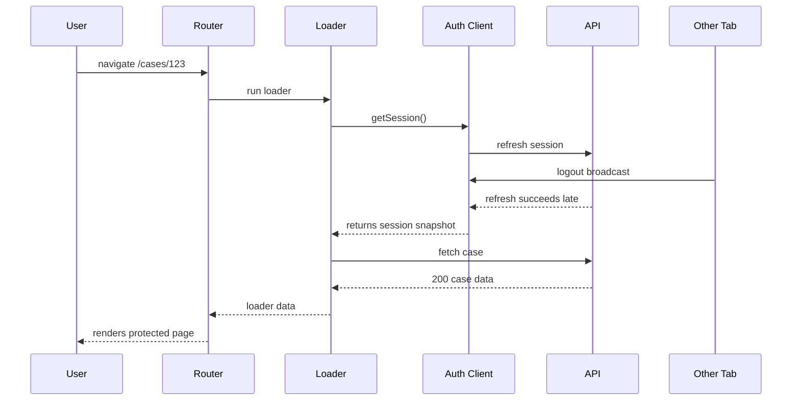
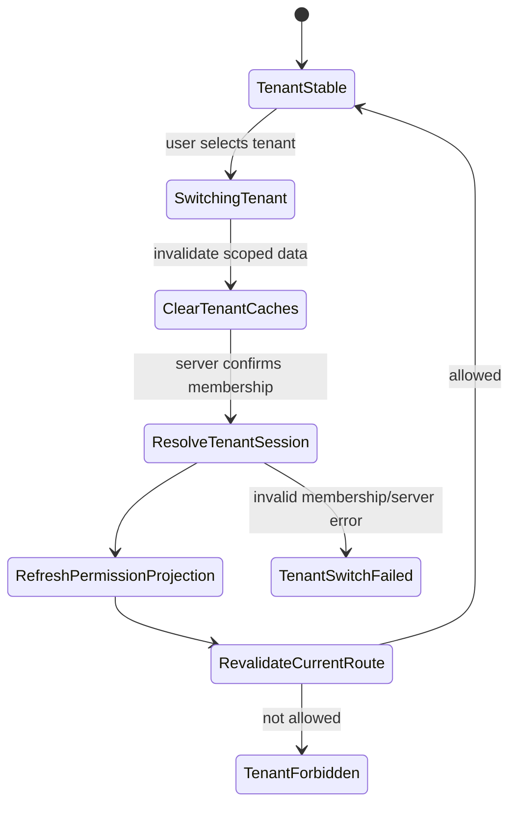

# Part 037 — Pending UI and Auth Race Conditions

Auth bugs rarely happen only in the happy path.

They happen while the app is moving.

A user clicks a protected route.

A loader starts.

The access token expires.

A refresh starts.

Another tab logs out.

The first loader returns after logout.

The UI renders stale protected data for one frame.

That is not a login bug.

That is a race condition.

React apps are concurrent systems because the browser is concurrent:

```txt
navigation can overlap refresh
refresh can overlap logout
logout can overlap in-flight requests
tenant switch can overlap route loading
permission change can overlap optimistic UI
multi-tab events can arrive while forms are submitting
```

The security lesson is simple:

```txt
Auth state must be versioned, cancellable, and revalidated across async boundaries.
```

Pending UI is not only a spinner.

Pending UI is the visible surface of your concurrency model.

---

## 1. The false mental model

Many React auth examples assume this:

```txt
user clicks route
check auth
render page
```

That is too linear.

Real apps look more like this:



The problem is not that any single operation is wrong.

The problem is that the late refresh result belongs to an old auth world.

You need a way to say:

```txt
This async result was created under auth epoch 12.
The current auth epoch is 13.
Discard it.
```

Without that, stale work can overwrite new truth.

---

## 2. Auth has an epoch

An **auth epoch** is a monotonically increasing version of the current security context.

It changes when any security-relevant fact changes:

```txt
login
logout
session refresh
session revocation
tenant switch
role/permission projection refresh
step-up completion
impersonation start/stop
forced re-auth
```

You can model it as:

```ts
export type AuthEpoch = number;

export type AuthSnapshot = {
  epoch: AuthEpoch;
  status:
    | "unknown"
    | "anonymous"
    | "authenticated"
    | "refreshing"
    | "expired"
    | "revoked"
    | "forbidden"
    | "degraded";
  userId?: string;
  tenantId?: string;
  sessionId?: string;
  permissionVersion?: string;
  assuranceLevel?: "none" | "aal1" | "aal2" | "aal3";
};
```

Then every async operation captures the epoch at start:

```ts
const startedAt = authStore.getSnapshot().epoch;
const data = await fetchSomething();

if (startedAt !== authStore.getSnapshot().epoch) {
  throw new StaleAuthResultError();
}

return data;
```

This is not about frontend security enforcement.

The server still enforces authorization.

The epoch protects the UI from rendering stale assumptions.

---

## 3. Pending UI is an auth state, not just navigation state

React Router exposes navigation state so the UI can react to loading/submitting/idle transitions.

That is useful.

But auth-aware pending UI needs more dimensions:

```txt
router navigation state
fetcher/action submission state
auth bootstrap state
refresh state
logout state
tenant switch state
permission refresh state
step-up state
```

A spinner that ignores these states lies.

For example:

```txt
"Loading case..."
```

is wrong when the real state is:

```txt
"Session expired; attempting secure resume..."
```

or:

```txt
"Switching organization; access will be rechecked..."
```

A useful pending model separates product wait from security wait.

```ts
export type PendingReason =
  | "route-loading"
  | "form-submitting"
  | "session-bootstrap"
  | "session-refresh"
  | "logout"
  | "tenant-switch"
  | "permission-refresh"
  | "step-up";
```

Then the UI can avoid unsafe optimism.

---

## 4. The core invariant

The core invariant for pending auth UI is:

```txt
Never render protected data produced under an invalidated auth snapshot.
```

This applies even when the server would have denied the next request.

Why?

Because the frontend may already have data in memory.

Caches are dangerous during auth transitions:

```txt
React Query cache
Apollo cache
loader data cache
browser memory
component state
form default values
optimistic mutation state
service worker cache
prefetched route modules/data
```

Logout does not automatically erase these.

Tenant switch does not automatically erase these.

Permission change does not automatically erase these.

Your app must treat auth transitions as cache boundary events.

---

## 5. Common race classes

### Race 1 — Loader returns after logout

Timeline:

```txt
T0 user opens /cases/123
T1 loader fetch starts
T2 user logs out in another tab
T3 loader returns case data
T4 router commits old loader data
```

Correct behavior:

```txt
Discard loader result if auth epoch changed.
Redirect/render logged-out state.
Clear sensitive caches.
```

---

### Race 2 — Refresh succeeds after logout

Timeline:

```txt
T0 access token expires
T1 refresh request starts
T2 user clicks logout
T3 logout clears session
T4 refresh response returns with new access token
T5 app stores token again
```

Correct behavior:

```txt
Logout wins.
A refresh response started before logout must not resurrect a session.
```

The rule:

```txt
Any response from before logout is stale by definition.
```

---

### Race 3 — Two tabs refresh at the same time

With refresh token rotation, this can be catastrophic if unmanaged.

Timeline:

```txt
Tab A uses refresh token R1
Tab B uses refresh token R1
Server rotates R1 -> R2 for Tab A
Server sees Tab B reuse R1
Server treats reuse as compromise
Session family revoked
```

Correct behavior:

```txt
Single-flight refresh per browser session.
Coordinate tabs with BroadcastChannel/storage lock.
All tabs consume the same refresh result.
```

This was covered deeper in Part 014 and Part 018.

Here, the routing consequence is:

```txt
All protected loaders must wait for the canonical refresh result.
```

---

### Race 4 — Tenant switch while route is loading

Timeline:

```txt
T0 user in tenant acme opens /cases/123
T1 loader starts with tenant acme
T2 user switches to tenant globex
T3 loader returns acme case
T4 UI shows acme data under globex shell
```

Correct behavior:

```txt
Tenant switch increments auth/security epoch.
All tenant-scoped requests capture tenant version.
Stale tenant result is discarded.
Tenant-specific caches are invalidated.
```

Tenant identity is part of security context.

Do not treat tenant as mere UI filter.

---

### Race 5 — Permission change while UI is optimistic

Timeline:

```txt
T0 user can approve case
T1 UI renders Approve button
T2 admin removes approve permission
T3 user clicks Approve from stale UI
T4 frontend sends approve mutation
```

Correct behavior:

```txt
Backend denies.
Frontend rolls back optimistic state.
Permission cache invalidates.
UI explains that permission changed.
Audit records denied attempt if appropriate.
```

Frontend permission hiding is convenience.

Server action authorization is authority.

---

### Race 6 — Action submission after session expiry

Timeline:

```txt
T0 form open for 30 minutes
T1 session expires
T2 user submits destructive action
T3 app refreshes session silently
T4 mutation succeeds without re-confirmation
```

Sometimes correct.

Sometimes dangerous.

For sensitive actions, the better rule is:

```txt
If the action requires fresh auth or step-up, do not silently refresh and execute.
Pause, re-authenticate, then ask the user to confirm intent if needed.
```

Auth freshness matters for high-impact actions.

---

### Race 7 — Route redirect loop during auth bootstrap

Timeline:

```txt
T0 app starts with auth status unknown
T1 ProtectedRoute sees no user
T2 redirect /login
T3 bootstrap completes authenticated
T4 login route redirects /app
T5 /app starts unknown again
```

Correct behavior:

```txt
Unknown is not anonymous.
Do not redirect from unknown unless route policy explicitly allows it.
Bootstrap before protected branch decision.
```

This is one of the most common auth UX bugs in React apps.

---

## 6. Unknown is not anonymous

A secure auth UI has at least three initial states:

```ts
export type SessionBootstrapState =
  | { kind: "unknown" }
  | { kind: "anonymous" }
  | { kind: "authenticated"; session: SessionProjection };
```

Bad guard:

```tsx
function ProtectedRoute({ children }: { children: React.ReactNode }) {
  const { user } = useAuth();
  return user ? children : <Navigate to="/login" />;
}
```

Why bad?

It collapses unknown into anonymous.

Better:

```tsx
function ProtectedRoute({ children }: { children: React.ReactNode }) {
  const auth = useAuthSnapshot();

  if (auth.status === "unknown") {
    return <SessionBootstrapScreen />;
  }

  if (auth.status === "anonymous") {
    return <Navigate to="/login" replace />;
  }

  if (auth.status === "authenticated") {
    return children;
  }

  return <AuthRecoveryScreen status={auth.status} />;
}
```

Best for Data/Framework Mode:

```ts
export async function loader({ request, context }: Route.LoaderArgs) {
  const session = await requireSession(request, context);
  return loadDashboard(session);
}
```

The component should not be the first place where auth becomes known.

---

## 7. Use request cancellation deliberately

Browser `fetch` supports `AbortSignal`.

React Router passes request objects into loaders/actions.

Use that signal.

Do not ignore it.

```ts
export async function loader({ request, context }: Route.LoaderArgs) {
  const session = await requireSession(request, context);

  const response = await fetch(`${context.apiBase}/cases`, {
    headers: {
      Authorization: `Bearer ${session.accessToken}`,
      "X-Tenant-Id": session.tenantId,
    },
    signal: request.signal,
  });

  return response.json();
}
```

Cancellation alone is not enough.

A request may finish before abort arrives.

So combine cancellation with epoch validation:

```ts
export async function authAwareLoader<T>(
  request: Request,
  run: (snapshot: AuthSnapshot) => Promise<T>,
) {
  const snapshot = authStore.getSnapshot();
  const result = await run(snapshot);

  if (request.signal.aborted) {
    throw new DOMException("Navigation aborted", "AbortError");
  }

  assertSameAuthEpoch(snapshot.epoch);
  return result;
}
```

Cancellation reduces wasted work.

Epoch validation prevents stale commit.

---

## 8. A minimal auth epoch store

You do not need a complex state manager to express the core idea.

```ts
type Listener = () => void;

class AuthStore {
  private snapshot: AuthSnapshot = { epoch: 0, status: "unknown" };
  private listeners = new Set<Listener>();

  getSnapshot() {
    return this.snapshot;
  }

  subscribe(listener: Listener) {
    this.listeners.add(listener);
    return () => this.listeners.delete(listener);
  }

  transition(next: Omit<AuthSnapshot, "epoch">) {
    this.snapshot = {
      ...next,
      epoch: this.snapshot.epoch + 1,
    };

    for (const listener of this.listeners) {
      listener();
    }
  }

  assertEpoch(epoch: number) {
    if (this.snapshot.epoch !== epoch) {
      throw new StaleAuthResultError({
        expected: epoch,
        actual: this.snapshot.epoch,
      });
    }
  }
}

export const authStore = new AuthStore();
```

Then use it around async auth work:

```ts
async function restoreSession() {
  const startedAt = authStore.getSnapshot().epoch;

  const response = await fetch("/api/session", {
    credentials: "include",
    headers: { Accept: "application/json" },
  });

  authStore.assertEpoch(startedAt);

  if (response.status === 401) {
    authStore.transition({ status: "anonymous" });
    return;
  }

  const session = await response.json();

  authStore.transition({
    status: "authenticated",
    userId: session.user.id,
    tenantId: session.tenant.id,
    sessionId: session.sessionId,
    permissionVersion: session.permissionVersion,
    assuranceLevel: session.assuranceLevel,
  });
}
```

You can refine this later with `useSyncExternalStore`, Zustand, Redux Toolkit, Jotai, XState, or your framework's server/session mechanism.

The invariant is more important than the library.

---

## 9. Logout must cancel and invalidate

Logout is not only:

```ts
setUser(null);
```

Logout should:

```txt
increment auth epoch
abort in-flight auth-scoped requests
clear sensitive client caches
broadcast logout to other tabs
call server logout/revocation
navigate to safe public page
prevent old refresh result from resurrecting session
```

A simplified logout controller:

```ts
class AuthRequestRegistry {
  private controllers = new Set<AbortController>();

  createSignal(parent?: AbortSignal) {
    const controller = new AbortController();
    this.controllers.add(controller);

    parent?.addEventListener("abort", () => controller.abort(parent.reason), {
      once: true,
    });

    controller.signal.addEventListener(
      "abort",
      () => this.controllers.delete(controller),
      { once: true },
    );

    return controller.signal;
  }

  abortAll(reason = "auth-context-changed") {
    for (const controller of this.controllers) {
      controller.abort(reason);
    }
    this.controllers.clear();
  }
}

export const authRequests = new AuthRequestRegistry();
```

Use it on logout:

```ts
export async function logout() {
  authStore.transition({ status: "anonymous" });
  authRequests.abortAll("logout");

  clearSensitiveCaches();
  broadcastAuthEvent({ type: "logout" });

  await fetch("/api/logout", {
    method: "POST",
    credentials: "include",
    headers: { "X-CSRF-Token": getCsrfToken() },
  }).catch(() => {
    // Network failure should not re-authenticate the UI.
    // The next server request must still be authoritative.
  });
}
```

Logout is a one-way local transition.

A failed logout request does not mean the UI should keep showing protected data.

It means the app may need a recovery banner:

```txt
You are signed out locally. Some server sessions may still be active. Please close shared devices or retry sign out if needed.
```

The precise message depends on your security model.

---

## 10. Refresh must be single-flight

Bad pattern:

```ts
api.interceptors.response.use(undefined, async error => {
  if (error.response?.status === 401) {
    await refreshToken();
    return api(error.config);
  }

  throw error;
});
```

Why bad?

It can create:

```txt
parallel refresh
infinite retry loops
retrying non-idempotent requests
refresh after logout
replay under wrong tenant
```

Better shape:

```ts
let refreshPromise: Promise<AuthSnapshot> | null = null;

export async function refreshSessionOnce() {
  if (refreshPromise) return refreshPromise;

  const startedAt = authStore.getSnapshot().epoch;

  refreshPromise = doRefreshSession()
    .then(snapshot => {
      authStore.assertEpoch(startedAt);
      authStore.transition({ ...snapshot, status: "authenticated" });
      return authStore.getSnapshot();
    })
    .finally(() => {
      refreshPromise = null;
    });

  return refreshPromise;
}
```

For multi-tab apps, local single-flight is not enough.

Coordinate across tabs as described in Part 018.

---

## 11. Retry only safe operations automatically

A `401` during a GET loader can often be handled as:

```txt
refresh once → retry once → if still 401, redirect/login
```

A `401` during a destructive mutation is different.

Do not blindly replay:

```txt
POST /cases/123/approve
DELETE /files/abc
POST /payments/submit
```

A safe retry policy requires:

```txt
idempotency key
same auth epoch
same tenant
same route/action intent
same request body hash if needed
explicit retry budget
server-side duplicate protection
```

Example action policy:

```ts
export async function action({ request, context }: Route.ActionArgs) {
  const session = await requireSession(request, context);
  const form = await request.formData();

  const intent = String(form.get("intent"));

  if (intent === "approve") {
    await requireFreshAuthorization(session, {
      action: "case.approve",
      resource: { type: "case", id: String(form.get("caseId")) },
      minimumAssurance: "aal2",
    });
  }

  return performMutationWithIdempotency(request, session);
}
```

Automatic retry is an engineering convenience.

For sensitive actions, convenience is not the priority.

---

## 12. Route pending UI should not leak target data

A common pattern:

```tsx
const navigation = useNavigation();

return (
  <>
    {navigation.state === "loading" && <GlobalSpinner />}
    <Outlet />
  </>
);
```

This keeps the previous route visible while the next route loads.

That is often fine.

But in auth-sensitive transitions, previous data might no longer be valid.

Examples:

```txt
user switches tenant but old tenant dashboard remains visible during loading
user logs out but old case details remain visible until redirect commits
user loses permission but stale table remains visible during revalidation
```

Use security-aware pending regions.

```tsx
function ProtectedLayout() {
  const auth = useAuthSnapshot();
  const navigation = useNavigation();

  const securityTransition =
    auth.status === "refreshing" ||
    auth.status === "unknown" ||
    auth.status === "revoked" ||
    auth.status === "expired";

  if (securityTransition) {
    return <SecureTransitionScreen status={auth.status} />;
  }

  return (
    <ProtectedShell dimmed={navigation.state !== "idle"}>
      <Outlet />
    </ProtectedShell>
  );
}
```

The key distinction:

```txt
product navigation pending → previous protected view may remain visible
security context pending → hide or freeze sensitive view
```

---

## 13. Tenant switch is a security transition

Treat tenant switch like logout/login-lite.

It changes:

```txt
resource namespace
permission projection
route availability
query cache keys
audit context
navigation menu
feature availability
```

A tenant switch flow:



Implementation shape:

```ts
export async function switchTenant(nextTenantId: string) {
  const previous = authStore.getSnapshot();

  authStore.transition({
    ...previous,
    status: "degraded",
    tenantId: nextTenantId,
  });

  authRequests.abortAll("tenant-switch");
  clearTenantScopedCaches(previous.tenantId);

  const response = await fetch("/api/session/tenant", {
    method: "POST",
    credentials: "include",
    headers: { "Content-Type": "application/json" },
    body: JSON.stringify({ tenantId: nextTenantId }),
  });

  if (!response.ok) {
    authStore.transition(previous);
    throw new TenantSwitchFailedError();
  }

  const projection = await response.json();

  authStore.transition({
    status: "authenticated",
    userId: projection.user.id,
    tenantId: projection.tenant.id,
    sessionId: projection.sessionId,
    permissionVersion: projection.permissionVersion,
    assuranceLevel: projection.assuranceLevel,
  });
}
```

In real code, preserve epoch carefully when rolling back.

The point is the same:

```txt
Tenant switch invalidates old tenant UI.
```

---

## 14. Permission refresh cannot be purely background

Suppose a permission projection updates every five minutes.

If it changes, the UI must react.

Possible results:

```txt
permission version unchanged → continue
permission version changed, current route still allowed → re-render controls
permission version changed, current route forbidden → route-level 403
permission version changed, current action no longer allowed → disable action and clear optimistic state
```

Do not only update buttons.

Revalidate route data too.

```ts
export function onPermissionProjectionChanged(nextVersion: string) {
  const current = authStore.getSnapshot();

  authStore.transition({
    ...current,
    permissionVersion: nextVersion,
  });

  clearPermissionSensitiveCaches();
  router.revalidate();
}
```

Permission version is part of cache key.

```ts
const queryKey = [
  "case",
  tenantId,
  caseId,
  permissionVersion,
];
```

That avoids rendering data under old authorization assumptions.

---

## 15. Avoid stale closure auth bugs

A stale closure bug:

```tsx
function ApproveButton({ caseId }: { caseId: string }) {
  const { token } = useAuth();

  async function approve() {
    await fetch(`/api/cases/${caseId}/approve`, {
      method: "POST",
      headers: { Authorization: `Bearer ${token}` },
    });
  }

  return <button onClick={approve}>Approve</button>;
}
```

The button captures whatever token existed at render time.

If the user refreshes session or switches tenant before clicking, the handler can use stale credentials.

Better:

```tsx
function ApproveButton({ caseId }: { caseId: string }) {
  const authClient = useAuthClient();

  async function approve() {
    const session = await authClient.requireFreshSession();

    await fetch(`/api/cases/${caseId}/approve`, {
      method: "POST",
      headers: {
        Authorization: `Bearer ${session.accessToken}`,
        "X-Tenant-Id": session.tenantId,
      },
    });
  }

  return <button onClick={approve}>Approve</button>;
}
```

Do not pass token strings deep into UI components.

Pass capability to ask for a fresh session at the boundary.

Even better, route `action` owns the mutation.

---

## 16. Fetchers need auth policy too

React Router fetchers can submit/load without navigating.

That is useful for forms, inline mutations, and background updates.

But fetchers create their own race surface.

Examples:

```txt
inline save continues after logout
background notification fetch runs under old tenant
a fetcher action retries after session refresh but user switched org
```

Pattern:

```tsx
function SaveDraftButton({ caseId }: { caseId: string }) {
  const fetcher = useFetcher();
  const auth = useAuthSnapshot();

  const disabled =
    fetcher.state !== "idle" ||
    auth.status !== "authenticated" ||
    !can(auth, "case.draft.save", { type: "case", id: caseId });

  return (
    <fetcher.Form method="post" action={`/cases/${caseId}/draft`}>
      <button disabled={disabled} name="intent" value="save-draft">
        {fetcher.state === "submitting" ? "Saving..." : "Save draft"}
      </button>
    </fetcher.Form>
  );
}
```

Server/action still checks.

UI only prevents obvious invalid submission and provides feedback.

---

## 17. Back button and bfcache

Browsers may preserve pages in the back-forward cache.

A user logs out, presses Back, and the browser may show a previously rendered authenticated page from memory.

Do not rely only on React state for this.

Mitigations:

```txt
clear sensitive caches on logout
use cache-control headers for authenticated documents/API responses
listen to pageshow with persisted=true for session revalidation
avoid putting sensitive data in public cacheable documents
server-enforce all follow-up API calls
```

Client-side handler:

```ts
window.addEventListener("pageshow", event => {
  if (event.persisted) {
    authStore.transition({ status: "unknown" });
    restoreSession().catch(() => {
      authStore.transition({ status: "anonymous" });
    });
  }
});
```

This is not sufficient alone.

It is one layer in a cache-control and session-revalidation strategy.

---

## 18. Service workers complicate auth pending state

If your app uses a service worker, it can accidentally serve stale authenticated responses.

Rules:

```txt
Do not cache authenticated API responses unless explicitly designed.
Include auth/session/tenant in cache strategy if unavoidable.
Purge caches on logout and tenant switch.
Bypass service worker for sensitive endpoints when practical.
Do not cache OAuth callback responses.
Do not cache session bootstrap response as public data.
```

Bad:

```ts
workbox.routing.registerRoute(
  ({ url }) => url.pathname.startsWith("/api/"),
  new workbox.strategies.CacheFirst(),
);
```

Better:

```txt
Authenticated API: network-only or short-lived private strategy.
Static assets: cache-first.
Public content: stale-while-revalidate.
Session/auth endpoints: network-only.
```

Auth pending bugs often hide in service worker layers because the React tree looks correct while the network layer is lying.

---

## 19. Pending UI should communicate the right failure mode

Do not show the same spinner for everything.

Use a small taxonomy:

```tsx
function SecureTransitionScreen({ status }: { status: AuthSnapshot["status"] }) {
  switch (status) {
    case "unknown":
      return <FullPageNotice title="Checking your session" />;
    case "refreshing":
      return <FullPageNotice title="Securely resuming your session" />;
    case "expired":
      return <FullPageNotice title="Your session expired" action="Sign in again" />;
    case "revoked":
      return <FullPageNotice title="Your session ended" action="Sign in" />;
    case "degraded":
      return <FullPageNotice title="Rechecking access" />;
    default:
      return <FullPageNotice title="Loading" />;
  }
}
```

The UX goal is not verbosity.

The goal is to prevent users from taking unsafe or confusing actions while security state is unsettled.

---

## 20. A practical auth-aware fetch wrapper

A simplified wrapper:

```ts
type AuthFetchOptions = RequestInit & {
  requireAuth?: boolean;
  retryOnRefresh?: boolean;
  tenantScoped?: boolean;
};

export async function authFetch(input: RequestInfo | URL, options: AuthFetchOptions = {}) {
  const snapshot = authStore.getSnapshot();
  const signal = authRequests.createSignal(options.signal);

  const headers = new Headers(options.headers);

  if (options.requireAuth) {
    if (snapshot.status !== "authenticated") {
      throw new NotAuthenticatedError();
    }

    headers.set("Authorization", `Bearer ${await getAccessTokenForCurrentEpoch(snapshot.epoch)}`);
  }

  if (options.tenantScoped && snapshot.tenantId) {
    headers.set("X-Tenant-Id", snapshot.tenantId);
  }

  const response = await fetch(input, {
    ...options,
    headers,
    signal,
    credentials: "include",
  });

  if (signal.aborted) {
    throw new DOMException("Request aborted", "AbortError");
  }

  authStore.assertEpoch(snapshot.epoch);

  if (response.status === 401 && options.retryOnRefresh) {
    await refreshSessionOnce();
    authStore.assertEpoch(snapshot.epoch + 1); // adapt to your transition model
    return authFetch(input, { ...options, retryOnRefresh: false });
  }

  return response;
}
```

This example is intentionally incomplete.

A real implementation must handle:

```txt
idempotency
request body replay safety
FormData/body stream replay limits
refresh errors
logout during retry
tenant switch during retry
problem+json error parsing
observability
```

The shape matters more than the exact code.

---

## 21. Suspense and deferred data

If using Suspense/deferred data, be careful.

Deferred data can resolve after the route shell has rendered.

That means auth epoch checks must also guard deferred promises.

```ts
export async function loader({ request }: Route.LoaderArgs) {
  const snapshot = authStore.getSnapshot();
  const session = await requireSession(request);

  return {
    summary: await loadSummary(session),
    details: loadDetails(session).then(details => {
      authStore.assertEpoch(snapshot.epoch);
      return details;
    }),
  };
}
```

If server-side, prefer passing a request-scoped session object into all deferred work.

Do not let deferred promises read global mutable auth state later.

---

## 22. Observability for auth races

You cannot fix what you cannot see.

Track these events:

```txt
auth.bootstrap.started
auth.bootstrap.completed
auth.refresh.started
auth.refresh.completed
auth.refresh.discarded_stale
auth.logout.local_completed
auth.logout.server_failed
auth.epoch.changed
auth.request.aborted
auth.request.discarded_stale
auth.tenant_switch.started
auth.tenant_switch.completed
auth.permission_projection.changed
router.auth_redirect.loop_detected
router.loader.stale_auth_result
router.action.auth_retry_blocked
```

Include safe dimensions:

```txt
route_id
status_code
reason_code
tenant_hash, not tenant name if sensitive
permission_version
session_age_bucket
epoch_delta
request_kind loader/action/fetcher/background
```

Do not log tokens.

Do not log full URLs if they may contain sensitive query parameters.

---

## 23. Testing race conditions

Race tests need control over time.

Use fake timers and controllable promises.

```ts
function deferred<T>() {
  let resolve!: (value: T) => void;
  let reject!: (error: unknown) => void;

  const promise = new Promise<T>((res, rej) => {
    resolve = res;
    reject = rej;
  });

  return { promise, resolve, reject };
}
```

Test logout wins over refresh:

```ts
it("does not resurrect session when refresh returns after logout", async () => {
  const refresh = deferred<SessionProjection>();

  server.use(
    http.post("/api/session/refresh", () => refresh.promise.then(HttpResponse.json)),
  );

  const refreshPromise = refreshSessionOnce();
  await logout();

  refresh.resolve(makeSessionProjection());

  await expect(refreshPromise).rejects.toThrow(StaleAuthResultError);
  expect(authStore.getSnapshot().status).toBe("anonymous");
});
```

Test loader result discarded after tenant switch:

```ts
it("does not commit loader data from previous tenant", async () => {
  const loadCase = deferred<CaseDto>();

  navigate("/org/acme/cases/1");
  await switchTenant("globex");

  loadCase.resolve(makeCase({ tenantId: "acme" }));

  expect(screen.queryByText("ACME case title")).not.toBeInTheDocument();
});
```

Test unknown does not redirect loop:

```ts
it("does not redirect while auth status is unknown", async () => {
  authStore.transition({ status: "unknown" });

  renderProtectedRoute();

  expect(screen.getByText(/checking your session/i)).toBeInTheDocument();
  expect(navigate).not.toHaveBeenCalledWith("/login", expect.anything());
});
```

---

## 24. Anti-pattern catalog

Avoid these:

```txt
Treating unknown as anonymous.
Passing token strings into arbitrary components.
Refreshing from every failing request independently.
Retrying POST/DELETE automatically after refresh without idempotency.
Leaving old tenant data visible during tenant switch.
Leaving old protected data visible during logout.
Using one generic spinner for auth bootstrap, refresh, logout, and route loading.
Ignoring AbortSignal in loaders/actions.
Trusting decoded JWT claims after permission/session change.
Using localStorage token updates without cross-tab coordination.
Not clearing query/Apollo/loader caches on logout.
Not versioning permission projection.
Assuming hidden buttons solve stale permission races.
Letting service worker cache authenticated API responses blindly.
```

Each one is a symptom of the same problem:

```txt
The UI has no explicit model of auth concurrency.
```

---

## 25. Review checklist

Use this checklist in code review:

```txt
Does the app distinguish unknown from anonymous?
Does every auth transition increment a version/epoch?
Can stale refresh responses resurrect a logged-out session?
Can stale loader data render after logout or tenant switch?
Are in-flight auth-scoped requests aborted on logout/tenant switch?
Are GET retries and mutation retries treated differently?
Are non-idempotent actions protected from automatic replay?
Are query/cache keys scoped by tenant and permission version where needed?
Does tenant switch clear old tenant UI/data?
Does permission refresh revalidate routes, not only buttons?
Does pending UI hide/freeze sensitive views during security transitions?
Are service worker caches safe for authenticated data?
Are multi-tab auth events handled?
Are race conditions tested with controlled timing?
Are stale auth results logged without leaking secrets?
```

---

## 26. Final mental model

Pending UI is not decoration.

It is the visible edge of your auth state machine.

A top-tier React auth implementation assumes:

```txt
requests return out of order
users click during transitions
tabs disagree temporarily
permissions change while screens are open
sessions expire during forms
logout races refresh
old data survives in memory unless explicitly cleared
```

So the design response is:

```txt
version auth state
cancel auth-scoped work
discard stale results
fail closed during uncertainty
separate product pending from security pending
revalidate at server boundaries
```

When that model is in place, pending UI stops being a spinner problem.

It becomes part of the security architecture.

---

## References

- React Router — Pending UI: https://reactrouter.com/start/framework/pending-ui
- React Router — `useNavigation`: https://reactrouter.com/api/hooks/useNavigation
- React Router — Data Loading: https://reactrouter.com/start/framework/data-loading
- React Router — Actions: https://reactrouter.com/start/framework/actions
- MDN — AbortController: https://developer.mozilla.org/en-US/docs/Web/API/AbortController
- MDN — Broadcast Channel API: https://developer.mozilla.org/en-US/docs/Web/API/Broadcast_Channel_API
- MDN — Window `pageshow` event: https://developer.mozilla.org/en-US/docs/Web/API/Window/pageshow_event
- OWASP Authorization Cheat Sheet: https://cheatsheetseries.owasp.org/cheatsheets/Authorization_Cheat_Sheet.html
