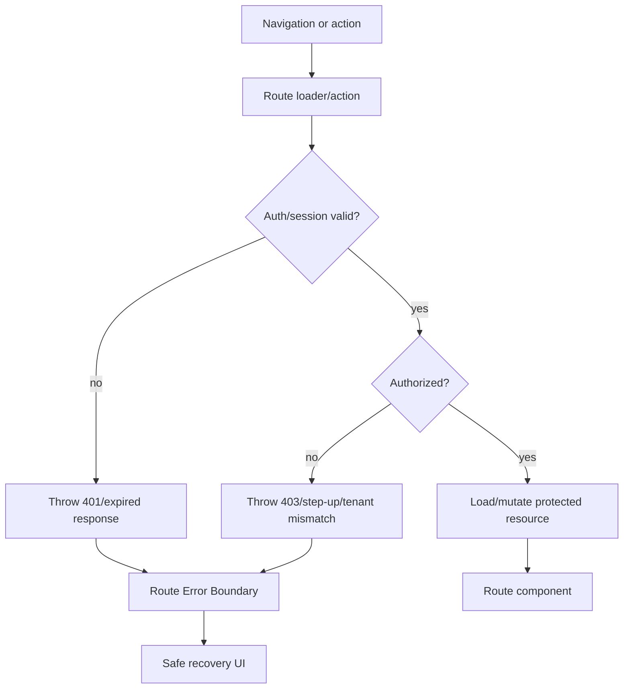
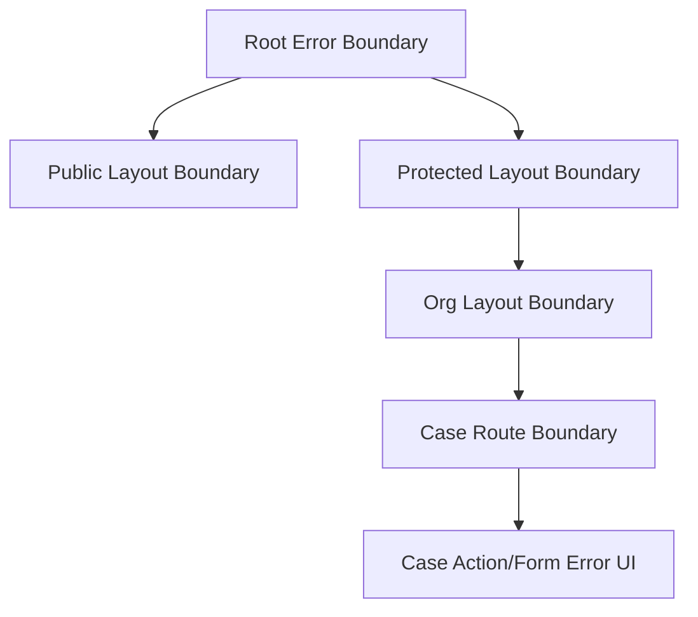
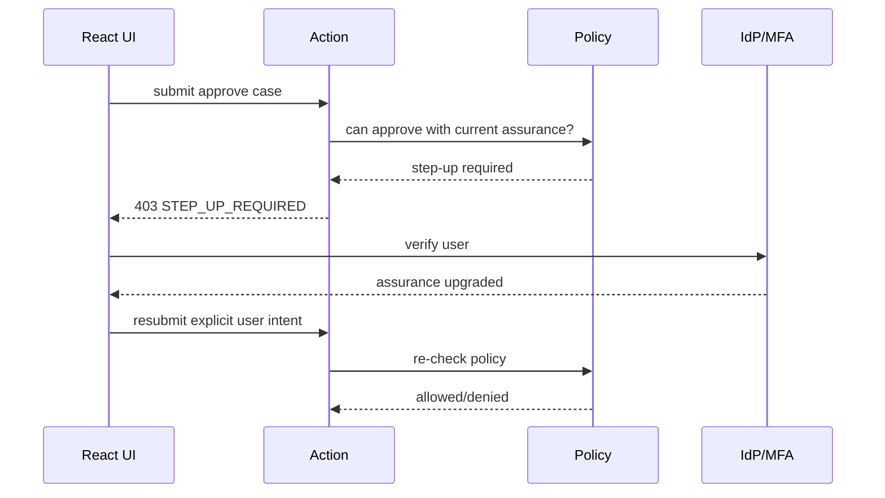

# Part 038 — Auth Error Boundaries

Auth failures need typed recovery.

Not every failure means "go to login".

A `401` means the request lacks valid authentication credentials.

A `403` means the server understood the request but refused to process it, usually because the authenticated user is not allowed to perform the action.

A session expiry means the user may need re-authentication.

A step-up requirement means the user is authenticated but not strongly enough for this action.

A tenant mismatch means the user may be in the wrong organization context.

A revoked session means the local UI must clear itself.

If the UI treats all of these as the same generic error, the app becomes confusing and unsafe.

The job of an auth error boundary is not to enforce authorization.

The job is to convert typed auth failure into safe recovery.

```txt
Server/API enforces.
Router/loaders/actions propagate typed failure.
Error boundary renders safe recovery.
```

---

## 1. Error boundary is not a security boundary

An error boundary does not protect data.

It runs after something failed.

If protected data was already leaked into the component tree, an error boundary cannot undo that.

So do not use this as your primary design:

```txt
try to render protected page
if it crashes or receives 403, show forbidden
```

Use this instead:

```txt
loader/action checks session and policy before protected data reaches component
if denied, throw typed response/error
a route error boundary renders recovery UI
```



Error boundaries are recovery boundaries.

Enforcement still happens before data or mutation.

---

## 2. The auth error taxonomy

A production React app needs a richer taxonomy than "error".

Minimum useful taxonomy:

```ts
export type AuthProblemCode =
  | "AUTH_REQUIRED"
  | "SESSION_EXPIRED"
  | "SESSION_REVOKED"
  | "TOKEN_REFRESH_FAILED"
  | "MFA_REQUIRED"
  | "STEP_UP_REQUIRED"
  | "FORBIDDEN"
  | "TENANT_REQUIRED"
  | "TENANT_FORBIDDEN"
  | "RESOURCE_FORBIDDEN"
  | "RESOURCE_NOT_FOUND_OR_FORBIDDEN"
  | "PERMISSION_CHANGED"
  | "ACCOUNT_SUSPENDED"
  | "ORG_SUSPENDED"
  | "IMPERSONATION_NOT_ALLOWED"
  | "CSRF_FAILED";
```

Do not expose all internal details to the user.

Do keep them as machine-readable reason codes.

The UI can map them to safe recovery.

---

## 3. HTTP status is necessary but insufficient

HTTP status tells you the broad class.

It does not fully describe product recovery.

### 401

Meaning:

```txt
The request lacks valid authentication credentials.
```

Possible recovery:

```txt
bootstrap session
refresh session
redirect to login
show expired session dialog
```

### 403

Meaning:

```txt
The user is authenticated or otherwise understood, but access is refused.
```

Possible recovery:

```txt
show forbidden
request access
switch tenant
perform step-up
contact admin
show read-only state
```

### 404

Sometimes resource truly does not exist.

Sometimes the server intentionally conceals whether a forbidden resource exists.

This is often safer for object-level authorization.

UI copy should avoid confirming existence:

```txt
We could not find this item, or you may not have access to it.
```

### 409 / 412

Useful for workflow/state conflicts:

```txt
case already approved
version conflict
resource state no longer allows this transition
permission snapshot changed
```

### 419 / 440

These are non-standard but common in some ecosystems for expired session/login timeout.

Prefer standard HTTP semantics plus machine-readable problem codes when you control the API.

---

## 4. Use typed problem responses

A good API does not return only:

```json
{ "error": "Forbidden" }
```

It returns a stable shape:

```json
{
  "type": "https://example.com/problems/auth/step-up-required",
  "title": "Additional verification required",
  "status": 403,
  "code": "STEP_UP_REQUIRED",
  "detail": "This action requires recent multi-factor verification.",
  "instance": "/cases/123/approve",
  "correlationId": "req_01J...",
  "requiredAssuranceLevel": "aal2"
}
```

For internal apps, even this may be too verbose for end users.

The important part is the stable code.

```ts
export type ProblemDetails = {
  type?: string;
  title: string;
  status: number;
  code: string;
  detail?: string;
  instance?: string;
  correlationId?: string;
  [key: string]: unknown;
};
```

Machine-readable error contracts keep your UI from guessing.

---

## 5. Throw responses from loaders/actions

Route loaders/actions should fail before rendering/mutating.

```ts
export async function loader({ request, params, context }: Route.LoaderArgs) {
  const session = await getSession(request, context);

  if (!session) {
    throw problemResponse({
      status: 401,
      code: "AUTH_REQUIRED",
      title: "Authentication required",
      redirectTo: safeReturnTo(request),
    });
  }

  const caseId = requireParam(params, "caseId");

  const decision = await context.policy.can(session.subject, "case.read", {
    type: "case",
    id: caseId,
    tenantId: session.tenantId,
  });

  if (!decision.allowed) {
    throw problemResponse({
      status: 403,
      code: decision.reasonCode ?? "RESOURCE_FORBIDDEN",
      title: "Access denied",
      correlationId: context.requestId,
    });
  }

  return context.cases.getCase(caseId, session);
}
```

Helper:

```ts
export function problemResponse(problem: ProblemDetails & { redirectTo?: string }) {
  return new Response(JSON.stringify(problem), {
    status: problem.status,
    headers: {
      "Content-Type": "application/problem+json",
      "Cache-Control": "no-store",
    },
  });
}
```

For auth failures, `Cache-Control: no-store` is usually the safe default.

---

## 6. Route error boundary in React Router

A route error boundary converts thrown route errors into UI.

```tsx
import {
  isRouteErrorResponse,
  useRouteError,
  useNavigate,
} from "react-router";

export function ErrorBoundary() {
  const error = useRouteError();

  if (isRouteErrorResponse(error)) {
    return <RouteProblemBoundary response={error} />;
  }

  return <UnexpectedRouteError error={error} />;
}
```

Then parse problem details:

```tsx
function RouteProblemBoundary({ response }: { response: Route.ErrorResponse }) {
  const problem = useParsedProblem(response);

  switch (problem.code) {
    case "AUTH_REQUIRED":
    case "SESSION_EXPIRED":
      return <LoginRecovery problem={problem} />;

    case "STEP_UP_REQUIRED":
    case "MFA_REQUIRED":
      return <StepUpRecovery problem={problem} />;

    case "TENANT_REQUIRED":
    case "TENANT_FORBIDDEN":
      return <TenantRecovery problem={problem} />;

    case "FORBIDDEN":
    case "RESOURCE_FORBIDDEN":
      return <ForbiddenRecovery problem={problem} />;

    case "RESOURCE_NOT_FOUND_OR_FORBIDDEN":
      return <NotFoundOrNoAccess problem={problem} />;

    default:
      return <GenericAuthProblem problem={problem} />;
  }
}
```

The boundary should not contain policy logic.

It contains recovery mapping.

---

## 7. Boundary placement matters

Use nested boundaries intentionally.

```txt
Root boundary
  handles unexpected app-wide failure

Public layout boundary
  handles login/callback/recovery failures

Protected layout boundary
  handles expired/revoked session and tenant switch

Resource route boundary
  handles resource forbidden/not-found/state conflict

Action-specific boundary or fetcher handler
  handles mutation failure with rollback
```

Diagram:



Do not route every auth failure to the root boundary.

A root-level forbidden page destroys local context.

For example, inside `/cases/123`, a field-level action denial should not necessarily replace the entire app shell.

---

## 8. 401 recovery

A `401` can mean several things:

```txt
anonymous user
session expired
refresh failed
session revoked
token invalid
auth server unavailable
```

Your UI should not guess from status alone.

Use `code`.

```tsx
function LoginRecovery({ problem }: { problem: ProblemDetails }) {
  const returnTo = getSafeReturnTo(problem);

  if (problem.code === "SESSION_EXPIRED") {
    return (
      <AuthNotice
        title="Your session expired"
        description="Sign in again to continue."
        actionLabel="Sign in"
        actionTo={`/login?returnTo=${encodeURIComponent(returnTo)}`}
      />
    );
  }

  if (problem.code === "SESSION_REVOKED") {
    return (
      <AuthNotice
        title="Your session ended"
        description="This may happen after sign-out, password change, or administrator action."
        actionLabel="Sign in"
        actionTo="/login"
      />
    );
  }

  return (
    <AuthNotice
      title="Sign in required"
      description="You need to sign in before opening this page."
      actionLabel="Sign in"
      actionTo={`/login?returnTo=${encodeURIComponent(returnTo)}`}
    />
  );
}
```

The `returnTo` must use the safe redirect logic from Part 036.

Never trust a redirect target just because it came from an error payload.

---

## 9. 403 recovery

A `403` is not a login prompt by default.

Re-authenticating usually will not help.

Bad UX:

```txt
403 → redirect /login
```

This causes loops and user confusion.

Better:

```tsx
function ForbiddenRecovery({ problem }: { problem: ProblemDetails }) {
  return (
    <AuthNotice
      title="You do not have access"
      description={safeForbiddenDescription(problem)}
      secondaryActionLabel="Request access"
      secondaryActionTo={buildAccessRequestUrl(problem)}
      tertiaryActionLabel="Go back"
      tertiaryActionTo=".."
    />
  );
}
```

The description should be safe:

```ts
function safeForbiddenDescription(problem: ProblemDetails) {
  switch (problem.code) {
    case "ACCOUNT_SUSPENDED":
      return "Your account cannot access this area. Contact your administrator.";
    case "ORG_SUSPENDED":
      return "This organization is currently unavailable.";
    case "RESOURCE_FORBIDDEN":
      return "You may need additional permission for this item.";
    default:
      return "Your current permissions do not allow this action.";
  }
}
```

Avoid leaking sensitive facts:

```txt
Bad: Case 123 exists but you are not on the Enforcement Legal Team.
Better: You may not have access to this item.
```

---

## 10. Step-up recovery

Step-up is not forbidden.

It means:

```txt
You are authenticated, but this operation requires stronger or fresher authentication.
```

Example:

```tsx
function StepUpRecovery({ problem }: { problem: ProblemDetails }) {
  const returnTo = getCurrentInternalPath();

  return (
    <AuthNotice
      title="Additional verification required"
      description="Verify again before continuing with this sensitive action."
      actionLabel="Verify now"
      actionTo={`/verify?returnTo=${encodeURIComponent(returnTo)}`}
    />
  );
}
```

Important:

```txt
After step-up, re-run the original loader/action authorization.
Do not assume the old action is still valid.
For destructive actions, consider asking user to confirm again.
```

Sequence:



Never let step-up become an authorization bypass.

---

## 11. Tenant recovery

Tenant errors are common in SaaS and enterprise apps.

Cases:

```txt
user has no active tenant
route tenant does not match session tenant
user is no longer member of tenant
tenant suspended
tenant requires SSO login
tenant policy requires stronger assurance
```

UI recovery:

```tsx
function TenantRecovery({ problem }: { problem: ProblemDetails }) {
  if (problem.code === "TENANT_REQUIRED") {
    return <TenantPicker title="Choose an organization to continue" />;
  }

  if (problem.code === "TENANT_FORBIDDEN") {
    return (
      <AuthNotice
        title="Organization access required"
        description="You may not belong to this organization, or your access may have changed."
        actionLabel="Switch organization"
        actionTo="/orgs"
      />
    );
  }

  return <GenericAuthProblem problem={problem} />;
}
```

Do not automatically switch tenants based only on URL.

The server must confirm membership and session context.

---

## 12. Not found or forbidden

For object-level authorization, it is often safer to avoid revealing whether a resource exists.

Use a combined problem code:

```txt
RESOURCE_NOT_FOUND_OR_FORBIDDEN
```

UI:

```tsx
function NotFoundOrNoAccess() {
  return (
    <AuthNotice
      title="Item unavailable"
      description="The item may not exist, may have moved, or you may not have access."
      actionLabel="Go to list"
      actionTo="../"
    />
  );
}
```

Backend decides when to conceal existence.

Frontend follows the contract.

---

## 13. Action errors are not always route errors

A route `action` can fail while the page should remain visible.

Example:

```txt
user opens case page
user clicks Approve
approval denied because permission changed
case page should remain visible
button/form should show error
```

Do not always replace the whole route.

Use action data/fetcher error state where appropriate.

```tsx
function ApprovalPanel({ caseId }: { caseId: string }) {
  const fetcher = useFetcher<ApprovalActionResult>();

  const problem = fetcher.data?.ok === false ? fetcher.data.problem : null;

  return (
    <fetcher.Form method="post" action={`/cases/${caseId}/approve`}>
      {problem && <InlineAuthProblem problem={problem} />}
      <button disabled={fetcher.state !== "idle"}>Approve</button>
    </fetcher.Form>
  );
}
```

Action response:

```ts
export async function action({ request, context }: Route.ActionArgs) {
  const session = await requireSession(request, context);
  const decision = await canApprove(request, session, context);

  if (!decision.allowed) {
    return json(
      {
        ok: false,
        problem: {
          status: 403,
          code: decision.reasonCode,
          title: "Approval not allowed",
        },
      },
      { status: 403 },
    );
  }

  await approveCase(request, session, context);
  return { ok: true };
}
```

Throwing is better when the whole route cannot continue.

Returning structured action data is better when the route is still valid but the operation failed.

---

## 14. A reusable AuthNotice component

Keep auth recovery UI consistent.

```tsx
export function AuthNotice(props: {
  title: string;
  description?: string;
  actionLabel?: string;
  actionTo?: string;
  secondaryActionLabel?: string;
  secondaryActionTo?: string;
  tertiaryActionLabel?: string;
  tertiaryActionTo?: string;
}) {
  return (
    <section role="alert" aria-live="polite" className="auth-notice">
      <h1>{props.title}</h1>
      {props.description && <p>{props.description}</p>}

      <div className="actions">
        {props.actionLabel && props.actionTo && (
          <Link to={props.actionTo}>{props.actionLabel}</Link>
        )}
        {props.secondaryActionLabel && props.secondaryActionTo && (
          <Link to={props.secondaryActionTo}>{props.secondaryActionLabel}</Link>
        )}
        {props.tertiaryActionLabel && props.tertiaryActionTo && (
          <Link to={props.tertiaryActionTo}>{props.tertiaryActionLabel}</Link>
        )}
      </div>
    </section>
  );
}
```

Why centralize?

```txt
consistent safe copy
consistent accessibility
consistent telemetry
consistent access request link
consistent support correlation ID display
consistent no-leak rules
```

---

## 15. Show correlation ID, not internals

For support and incident response, show a safe reference:

```tsx
function SupportReference({ correlationId }: { correlationId?: string }) {
  if (!correlationId) return null;

  return (
    <p className="support-reference">
      Reference: <code>{correlationId}</code>
    </p>
  );
}
```

Do not show:

```txt
policy expression
SQL query
internal group names
full JWT claims
stack trace
tenant database id
raw authorization graph path
```

Internal data belongs in logs with proper access controls.

User-facing recovery needs just enough information to act.

---

## 16. Error sanitization

React Router has server/client error handling behavior, but your security design should not depend on framework sanitization alone.

Sanitize at the source.

For expected auth failures, throw typed safe responses.

For unexpected exceptions, show generic recovery and log safely.

```tsx
function UnexpectedRouteError({ error }: { error: unknown }) {
  reportRouteError(error);

  return (
    <AuthNotice
      title="Something went wrong"
      description="Try again. If the problem continues, contact support."
      actionLabel="Reload"
      actionTo="."
    />
  );
}
```

Never render `String(error)` directly into user-facing UI for server-originated exceptions.

---

## 17. Auth boundary should clear unsafe local state

When a protected route fails with a terminal auth error, clear sensitive local state.

Examples:

```txt
SESSION_REVOKED
SESSION_EXPIRED after refresh failure
TENANT_FORBIDDEN for current tenant
ACCOUNT_SUSPENDED
ORG_SUSPENDED
```

Boundary side effect:

```tsx
function ProtectedLayoutErrorBoundary() {
  const error = useRouteError();
  const problem = parseProblem(error);

  useEffect(() => {
    if (isTerminalAuthProblem(problem)) {
      clearSensitiveCaches();
      notifyTabs({ type: "auth-terminal-error", code: problem.code });
    }
  }, [problem?.code]);

  return <AuthProblemScreen problem={problem} />;
}
```

Be careful with effects in boundaries.

They should perform cleanup, not hidden authorization decisions.

---

## 18. Cache-control for error responses

Auth error responses should generally not be cached by shared caches.

Use:

```http
Cache-Control: no-store
```

Especially for:

```txt
401
403
session bootstrap
permission projection
step-up challenge
OAuth callback result
```

A cached 403 can become a support nightmare.

A cached 401 can trap a user after login.

A cached permission projection can display stale controls.

---

## 19. Avoid redirect-only error handling

Redirects are useful but dangerous when overused.

Bad:

```txt
any auth error → /login
```

Problems:

```txt
403 loops to login
step-up intent lost
tenant context lost
access request path lost
error reason hidden from support
users repeatedly authenticate without gaining access
```

Better:

```txt
AUTH_REQUIRED → login with safe returnTo
SESSION_EXPIRED → login or refresh recovery
STEP_UP_REQUIRED → verification flow
FORBIDDEN → forbidden/access request screen
TENANT_REQUIRED → tenant picker
TENANT_FORBIDDEN → switch org/contact admin
RESOURCE_NOT_FOUND_OR_FORBIDDEN → unavailable page
```

Routing is recovery.

Recovery must be reason-aware.

---

## 20. Denied mutation UX

When a mutation is denied, do not pretend nothing happened.

Good denied mutation UX includes:

```txt
rollback optimistic change
show specific safe reason
refresh permission projection if reason suggests staleness
preserve user input if safe
provide access request path if appropriate
avoid resubmitting automatically
log denied action with correlation id
```

Example:

```tsx
function InlineAuthProblem({ problem }: { problem: ProblemDetails }) {
  switch (problem.code) {
    case "PERMISSION_CHANGED":
      return (
        <Alert tone="warning">
          Your access changed while this page was open. The page has been refreshed.
        </Alert>
      );
    case "STEP_UP_REQUIRED":
      return (
        <Alert tone="info">
          Verify again before completing this action.
        </Alert>
      );
    default:
      return (
        <Alert tone="danger">
          This action is not allowed with your current permissions.
        </Alert>
      );
  }
}
```

Do not show raw policy language.

---

## 21. Access request integration

A good 403 boundary often links to an access request flow.

But it must avoid granting based on user-controlled data.

Access request payload should be server-derived where possible:

```json
{
  "resourceType": "case",
  "resourceId": "123",
  "action": "case.approve",
  "denialCorrelationId": "req_01J..."
}
```

The server should reconstruct/validate the request from the denial event.

Do not trust a client saying:

```json
{ "requestedRole": "SuperAdmin" }
```

The UI can request.

The workflow decides.

---

## 22. Accessibility

Auth errors are high-friction moments.

Do not make them inaccessible.

Checklist:

```txt
Use semantic heading for error title.
Use role="alert" or aria-live for inline mutation errors.
Move focus to route-level error heading after navigation.
Preserve keyboard access to retry/login/request-access actions.
Avoid color-only denial indicators.
Do not trap focus unless using an intentional modal.
Keep copy clear and concise.
```

Auth recovery is part of product reliability.

---

## 23. Testing auth error boundaries

Test route-level 401:

```ts
it("renders login recovery for AUTH_REQUIRED", async () => {
  server.use(
    http.get("/api/cases/:id", () =>
      HttpResponse.json(
        { status: 401, code: "AUTH_REQUIRED", title: "Authentication required" },
        { status: 401, headers: { "Content-Type": "application/problem+json" } },
      ),
    ),
  );

  renderRouterAt("/cases/123");

  expect(await screen.findByRole("heading", { name: /sign in required/i })).toBeVisible();
});
```

Test 403 does not redirect to login:

```ts
it("does not send forbidden users to login", async () => {
  mockProblem("/api/cases/123", {
    status: 403,
    code: "RESOURCE_FORBIDDEN",
    title: "Access denied",
  });

  renderRouterAt("/cases/123");

  expect(await screen.findByText(/do not have access/i)).toBeVisible();
  expect(screen.queryByText(/sign in required/i)).not.toBeInTheDocument();
});
```

Test step-up recovery:

```ts
it("renders verification flow for STEP_UP_REQUIRED", async () => {
  mockProblem("/api/cases/123/approve", {
    status: 403,
    code: "STEP_UP_REQUIRED",
    title: "Additional verification required",
    requiredAssuranceLevel: "aal2",
  });

  renderApprovalPanel();
  await user.click(screen.getByRole("button", { name: /approve/i }));

  expect(await screen.findByText(/verify again/i)).toBeVisible();
});
```

Test no sensitive leakage:

```ts
it("does not render internal policy details", async () => {
  mockProblem("/api/cases/123", {
    status: 403,
    code: "RESOURCE_FORBIDDEN",
    title: "Access denied",
    internalPolicy: "case.approver && region.eu.enforcement.secret",
  });

  renderRouterAt("/cases/123");

  expect(screen.queryByText(/region\.eu\.enforcement\.secret/i)).not.toBeInTheDocument();
});
```

---

## 24. Observability

Log structured auth error events:

```txt
router.auth_error_rendered
router.auth_error_recovery_clicked
router.auth_error_unexpected
route.loader.auth_denied
route.action.auth_denied
session.expired_boundary_shown
step_up.boundary_shown
tenant.boundary_shown
access_request.started_from_denial
```

Include:

```txt
route_id
status
problem_code
correlation_id
request_kind loader/action/fetcher
session_state authenticated/anonymous/expired
permission_version
tenant_hash
recovery_action
```

Do not include:

```txt
raw token
full problem detail if it may contain sensitive internals
full URL with sensitive query parameters
PII beyond what support requires
```

Good observability helps find loops:

```txt
401 boundary → login → returnTo → 401 boundary → login
403 boundary → login → 403 boundary
step-up boundary → verify → stale action replay → step-up boundary
```

---

## 25. Anti-pattern catalog

Avoid these:

```txt
Mapping every auth error to /login.
Treating 403 as unauthenticated.
Rendering raw server error messages to users.
Putting policy internals in frontend error copy.
Using route error boundary as primary authorization control.
Throwing generic Error instead of typed response/problem.
Caching 401/403/session responses.
Losing returnTo during session expiry.
Blindly retrying denied mutations after refresh.
Replacing entire app shell for small inline action denial.
Not distinguishing not-found from forbidden when existence leakage matters.
Ignoring tenant mismatch as a first-class failure.
Showing access request for actions that can never be delegated.
Logging tokens or full JWT claims on error.
```

Most auth error bugs come from one mistake:

```txt
The app treats security failures as generic exceptions.
```

They are not generic.

They are domain-relevant state transitions.

---

## 26. Review checklist

Ask these questions in review:

```txt
Are 401, 403, step-up, tenant mismatch, and session expired distinct?
Do loaders/actions throw typed problem responses before protected data/mutation?
Does 403 avoid redirecting to login by default?
Are returnTo values validated before use?
Are error responses no-store where needed?
Does the UI avoid leaking resource existence when backend conceals it?
Does the boundary show safe recovery actions?
Are inline action denials handled without destroying valid route context?
Are terminal auth errors clearing sensitive caches?
Are correlation IDs shown safely?
Are unexpected errors sanitized?
Are boundaries placed at the right route depth?
Are access request links backed by server-validated denial records?
Are auth error boundary states tested?
```

---

## 27. Final mental model

Auth error boundaries are typed recovery surfaces.

They sit after enforcement but before user confusion.

A mature React auth system does not say:

```txt
Something went wrong.
```

It says, internally:

```txt
AUTH_REQUIRED → login recovery
SESSION_EXPIRED → re-auth recovery
STEP_UP_REQUIRED → verification recovery
TENANT_FORBIDDEN → tenant recovery
RESOURCE_FORBIDDEN → safe denial/access request
RESOURCE_NOT_FOUND_OR_FORBIDDEN → non-leaky unavailable state
PERMISSION_CHANGED → refresh/rollback state
```

Then it renders the minimum safe information the user needs.

That is the difference between error handling and auth architecture.

---

## References

- React Router — Error Boundaries: https://reactrouter.com/how-to/error-boundary
- React Router — Error Reporting: https://reactrouter.com/how-to/error-reporting
- React Router — `isRouteErrorResponse`: https://reactrouter.com/api/utils/isRouteErrorResponse
- React Router — Actions: https://reactrouter.com/start/framework/actions
- MDN — 401 Unauthorized: https://developer.mozilla.org/en-US/docs/Web/HTTP/Reference/Status/401
- MDN — 403 Forbidden: https://developer.mozilla.org/en-US/docs/Web/HTTP/Reference/Status/403
- MDN — HTTP response status codes: https://developer.mozilla.org/en-US/docs/Web/HTTP/Reference/Status
- RFC 9457 — Problem Details for HTTP APIs: https://www.rfc-editor.org/rfc/rfc9457.html
- OWASP Authorization Cheat Sheet: https://cheatsheetseries.owasp.org/cheatsheets/Authorization_Cheat_Sheet.html
