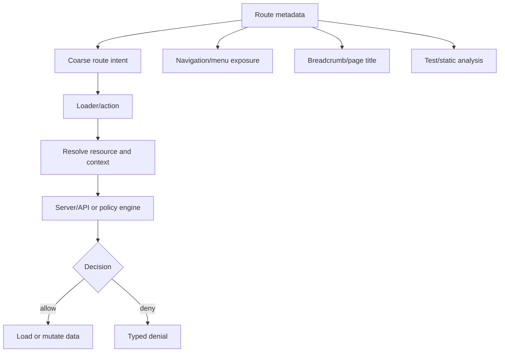
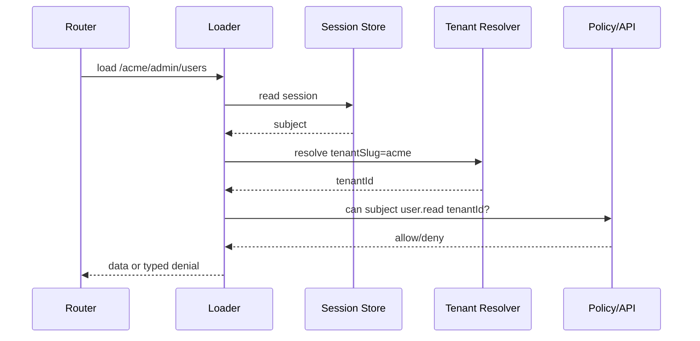

# Part 039 — Route Metadata Permissions

Route metadata is how a React app makes route-level intent explicit.

A route is not just a URL.

A route is a product surface.

A route usually implies:

- what layout is used,
- what data is needed,
- what navigation item should appear,
- what permission is required,
- what tenant or resource context must exist,
- what recovery should happen when access is denied,
- what audit event should be emitted,
- what action surfaces should be visible.

If those facts are scattered across components, loaders, sidebars, breadcrumbs, and action buttons, the auth model becomes implicit.

Implicit auth is hard to review.

Implicit auth is hard to test.

Implicit auth eventually drifts.

Route metadata gives the team a single place to declare route intent.

But route metadata has one hard rule:

```txt
Route metadata can describe required access.
It does not enforce access by itself.
```

The enforcement still belongs in the loader/action/API/server policy boundary.

Route metadata is a contract.

The contract is useful only when the runtime and tests consume it consistently.

---

## 1. The problem route metadata solves

In many React apps, authorization begins with code like this:

```tsx
<Route
  path="/admin/users"
  element={
    <ProtectedRoute roles={["admin"]}>
      <UsersPage />
    </ProtectedRoute>
  }
/>
```

Then the sidebar has separate logic:

```tsx
{user.role === "admin" && <NavLink to="/admin/users">Users</NavLink>}
```

Then the breadcrumb has another copy:

```tsx
if (pathname.startsWith("/admin")) return "Admin";
```

Then the loader has a partial check:

```ts
if (!session) throw redirect("/login");
```

Then the API enforces something else.

The system now has multiple access models:

```txt
Route tree model        role == admin
Sidebar model           role == admin
Breadcrumb model        pathname heuristic
Loader model            authenticated only
API model               maybe permission-based
```

This is not a security architecture.

This is accidental duplication.

The first job of route metadata is to make the route contract explicit:

```txt
/admin/users
  requires authenticated session
  requires tenant context
  requires permission user.read in current tenant
  appears in admin navigation only when visible
  uses AdminLayout
  denies with forbidden page, not redirect-to-login
```

Once declared, the contract can be consumed by:

- route loaders,
- route actions,
- middleware,
- navigation menus,
- breadcrumbs,
- page title generation,
- command palette,
- analytics/audit,
- tests,
- static checks,
- docs.

---

## 2. React Router route `handle` as metadata carrier

React Router exposes route metadata through `handle` and `useMatches()`.

A matched route hierarchy can carry arbitrary route-specific information.

That makes it natural to attach auth metadata to each route.

Example route object style:

```tsx
import { createBrowserRouter } from "react-router";
import { requireAuthLoader } from "./auth/require-auth-loader";
import { requirePermissionLoader } from "./auth/require-permission-loader";

export const router = createBrowserRouter([
  {
    id: "root",
    path: "/",
    Component: RootLayout,
    loader: rootSessionLoader,
    handle: {
      auth: {
        public: true,
      },
    },
    children: [
      {
        id: "dashboard",
        path: "dashboard",
        Component: DashboardPage,
        loader: requireAuthLoader(dashboardLoader),
        handle: {
          nav: {
            label: "Dashboard",
            section: "main",
          },
          auth: {
            requiresSession: true,
          },
        },
      },
      {
        id: "admin.users",
        path: "admin/users",
        Component: UsersPage,
        loader: requirePermissionLoader({
          action: "user.read",
          resource: "tenant",
        }, usersLoader),
        handle: {
          nav: {
            label: "Users",
            section: "admin",
          },
          auth: {
            requiresSession: true,
            requiresTenant: true,
            permissions: [
              {
                action: "user.read",
                resource: "tenant",
              },
            ],
          },
        },
      },
    ],
  },
]);
```

The important part is not the property name.

The important part is the invariant:

```txt
The route declares what it needs.
The loader/action enforces what it needs.
The UI derives exposure from the same declaration.
```

---

## 3. Metadata is a policy projection, not the whole policy

Route metadata should not become your entire authorization engine.

A route cannot fully decide object-level access.

This route can declare a coarse requirement:

```txt
Route: /cases/:caseId
Requirement: case.read
```

But the real authorization decision may depend on:

- the case id,
- the current tenant,
- the user's assignment,
- case state,
- confidentiality level,
- escalation status,
- delegation rules,
- regulatory hold,
- time-bound access,
- separation-of-duty constraints.

So route metadata should answer:

```txt
What kind of access does this route require?
```

The policy engine/server should answer:

```txt
Can this subject perform this action on this exact resource under this context?
```



Do not ask route metadata to do what only the resource boundary can do.

---

## 4. A useful route auth metadata shape

A production route auth schema should be explicit enough to be reviewed.

Avoid boolean-only metadata:

```ts
// Too weak
handle: {
  auth: true,
}
```

Prefer structured metadata:

```ts
export type AuthRouteMetadata =
  | {
      public: true;
      guestOnly?: boolean;
    }
  | {
      requiresSession: true;
      requiresTenant?: boolean;
      requiresMfa?: boolean;
      requiredAssuranceLevel?: "aal1" | "aal2" | "aal3";
      permissions?: PermissionRequirement[];
      denyMode?: "not-found" | "forbidden" | "login" | "step-up";
      audit?: {
        viewEvent?: string;
        denialEvent?: string;
      };
    };

export type PermissionRequirement = {
  action: PermissionAction;
  resource: ResourceKind;
  scope?: "global" | "tenant" | "resource";
  mode?: "all" | "any";
  reason?: string;
};

export type PermissionAction =
  | "dashboard.read"
  | "user.read"
  | "user.invite"
  | "case.read"
  | "case.update"
  | "case.escalate"
  | "report.export";

export type ResourceKind =
  | "global"
  | "tenant"
  | "user"
  | "case"
  | "report";
```

This shape allows several important distinctions:

```txt
public route                  anyone can access
requiresSession               authenticated user only
requiresTenant                authenticated user must be inside tenant context
requiresMfa                   session is valid but not strong enough yet
permissions                   route needs domain-level capability
requiredAssuranceLevel        sensitive route needs stronger auth event
scope                         global vs tenant vs resource-scoped action
mode                          any/all semantics for composite requirements
denyMode                      what UX recovery should be used
```

The schema should be boring.

Boring metadata is reviewable metadata.

---

## 5. Use typed route IDs

Route permission metadata becomes much more useful when routes have stable IDs.

Avoid relying only on URL strings.

URLs change.

Route IDs express product meaning.

```ts
export const routeIds = {
  root: "root",
  dashboard: "dashboard",
  adminUsers: "admin.users",
  caseDetail: "case.detail",
  caseEscalation: "case.escalation",
  reportsExport: "reports.export",
} as const;

export type AppRouteId = (typeof routeIds)[keyof typeof routeIds];
```

Then define route metadata records:

```ts
export type RouteSecurityRecord = {
  routeId: AppRouteId;
  auth: AuthRouteMetadata;
};
```

This makes tests easier:

```ts
const protectedRoutes = collectRoutes(router.routes)
  .filter((route) => route.handle?.auth?.requiresSession);

it.each(protectedRoutes)("%s has loader enforcement", (route) => {
  expect(route.loader).toBeDefined();
});
```

The point is not only type safety.

The point is architectural accountability.

Every route can be enumerated.

Every route can be reviewed.

Every route can be checked.

---

## 6. Inheritance: powerful but dangerous

Nested routes invite inherited metadata.

Example:

```txt
/app                  requires session
/app/admin            requires admin area permission
/app/admin/users      requires user.read
/app/admin/roles      requires role.read
```

A naive implementation may merge metadata automatically:

```ts
const effectiveAuth = mergeAuthMetadata(matches.map((m) => m.handle?.auth));
```

This is useful.

It is also dangerous.

Inheritance bugs often produce silent privilege widening.

Bad merge logic:

```ts
// Dangerous: child can accidentally erase parent requirement.
const merged = { ...parentAuth, ...childAuth };
```

If child route has:

```ts
handle: {
  auth: {
    permissions: [{ action: "user.read", resource: "tenant" }],
  },
}
```

and parent had:

```ts
handle: {
  auth: {
    requiresSession: true,
    requiresTenant: true,
  },
}
```

simple object overwrite may remove required session/tenant constraints.

Use monotonic merge semantics.

```ts
export function mergeAuthMetadata(items: Array<AuthRouteMetadata | undefined>) {
  const result = {
    public: false,
    requiresSession: false,
    requiresTenant: false,
    requiresMfa: false,
    permissions: [] as PermissionRequirement[],
    denyMode: undefined as AuthenticatedDenyMode | undefined,
  };

  for (const item of items) {
    if (!item) continue;

    if ("public" in item && item.public) {
      // Public should usually only be allowed at leaf or explicitly isolated.
      // Do not let public erase parent authenticated requirements implicitly.
      continue;
    }

    result.requiresSession = result.requiresSession || item.requiresSession === true;
    result.requiresTenant = result.requiresTenant || item.requiresTenant === true;
    result.requiresMfa = result.requiresMfa || item.requiresMfa === true;

    if (item.permissions) {
      result.permissions.push(...item.permissions);
    }

    result.denyMode = item.denyMode ?? result.denyMode;
  }

  return result;
}
```

Better rule:

```txt
Parent constraints can be strengthened by children.
Children cannot silently weaken parent constraints.
```

If a child needs to weaken access, require an explicit escape hatch:

```ts
handle: {
  auth: {
    public: true,
    overridesParentAuth: "explicit-public-child-route",
  },
}
```

That escape hatch should be rare and test-covered.

---

## 7. Route metadata and loader enforcement must agree

The most common failure is metadata drift.

Example:

```ts
handle: {
  auth: {
    requiresSession: true,
    permissions: [{ action: "report.export", resource: "tenant" }],
  },
},
loader: async () => {
  // BUG: only checks session, not permission
}
```

Or the opposite:

```ts
handle: {
  auth: {
    requiresSession: true,
  },
},
loader: async () => {
  // Actually requires report.export, but metadata forgot it.
}
```

Both are bad.

The first may expose unauthorized data.

The second may hide route/menu incorrectly and confuse users.

Use a wrapper that receives the same metadata:

```ts
export function secureLoader<T>(
  auth: AuthRouteMetadata,
  loader: (args: LoaderFunctionArgs & { auth: AuthContext }) => Promise<T>,
) {
  return async (args: LoaderFunctionArgs) => {
    const session = await readSession(args.request);
    const authContext = await enforceRouteAuth(auth, session, args);
    return loader({ ...args, auth: authContext });
  };
}
```

Then route declaration becomes harder to drift:

```ts
const usersAuth = {
  requiresSession: true,
  requiresTenant: true,
  permissions: [
    { action: "user.read", resource: "tenant", scope: "tenant" },
  ],
  denyMode: "forbidden",
} satisfies AuthRouteMetadata;

export const usersRoute = {
  id: "admin.users",
  path: "admin/users",
  loader: secureLoader(usersAuth, async ({ auth }) => {
    return api.users.list({ tenantId: auth.tenantId });
  }),
  Component: UsersPage,
  handle: {
    auth: usersAuth,
    nav: {
      label: "Users",
      section: "admin",
    },
  },
};
```

One object.

Two consumers.

Less drift.

---

## 8. Route metadata should not contain secrets

Never put secrets, tokens, or hidden policy internals in route metadata.

Route metadata may be bundled into client JavaScript.

This is fine:

```ts
handle: {
  auth: {
    permissions: [{ action: "report.export", resource: "tenant" }],
  },
}
```

This is not fine:

```ts
handle: {
  auth: {
    internalPolicyId: "policy-prod-tenant-super-secret",
    serviceToken: "...",
    hiddenAdminBypass: true,
  },
}
```

Treat route metadata as public design information.

The attacker can inspect it.

That should not matter.

Security must not depend on metadata being hidden.

---

## 9. Permission metadata should use domain capabilities, not raw roles

This is a common beginner mistake:

```ts
handle: {
  auth: {
    roles: ["admin"],
  },
}
```

It works until it does not.

Roles are bundles.

Routes need capabilities.

Prefer:

```ts
handle: {
  auth: {
    permissions: [
      { action: "user.read", resource: "tenant" },
    ],
  },
}
```

Then the backend can decide which roles, grants, relationships, or attributes provide that capability.

```txt
Route asks: user.read on tenant
Policy decides: owner/admin/support-delegate/group-membership/temporary grant
```

This keeps React away from role semantics.

React should not know all role mapping rules.

React only needs enough information to:

- request data safely,
- show/hide UI surfaces,
- explain denial,
- avoid obviously impossible actions.

---

## 10. Resource resolution in dynamic routes

Dynamic routes need special care.

Example:

```txt
/cases/:caseId
```

The route metadata can declare:

```ts
handle: {
  auth: {
    requiresSession: true,
    requiresTenant: true,
    permissions: [
      { action: "case.read", resource: "case", scope: "resource" },
    ],
  },
}
```

But it cannot authorize until `caseId` is resolved.

The loader must resolve the resource and call server-side policy:

```ts
export const caseDetailAuth = {
  requiresSession: true,
  requiresTenant: true,
  permissions: [
    { action: "case.read", resource: "case", scope: "resource" },
  ],
  denyMode: "not-found",
} satisfies AuthRouteMetadata;

export const loader = secureLoader(caseDetailAuth, async ({ params, auth }) => {
  const caseId = requireParam(params, "caseId");

  const response = await api.cases.getCase({
    tenantId: auth.tenantId,
    caseId,
  });

  // API must enforce object-level authorization.
  // The frontend only handles the result.
  return response;
});
```

Do not fetch the case first in a generic API without object-level authorization and then decide in React whether to show it.

That leaks data.

---

## 11. `denyMode`: forbidden vs not-found

Some routes should return `403 Forbidden`.

Some routes should hide existence with `404 Not Found` semantics.

This is not purely UX.

It is part of the information disclosure model.

Examples:

```txt
/admin/users              403 is fine; the admin area exists.
/cases/secret-case-id     404-like denial may be safer.
/invitations/token        invalid/expired generic response is safer.
```

Route metadata can declare the intended denial mode:

```ts
handle: {
  auth: {
    requiresSession: true,
    permissions: [
      { action: "case.read", resource: "case", scope: "resource" },
    ],
    denyMode: "not-found",
  },
}
```

The loader/API must still be the actual enforcement point.

The route metadata helps the error boundary choose safe UX:

```tsx
function AuthErrorBoundary() {
  const error = useRouteError();

  if (isProblem(error, "RESOURCE_NOT_FOUND_OR_FORBIDDEN")) {
    return <NotFoundLikePage />;
  }

  if (isProblem(error, "FORBIDDEN")) {
    return <ForbiddenPage />;
  }

  throw error;
}
```

---

## 12. Navigation from metadata

A route tree can derive navigation.

But navigation exposure is not authorization enforcement.

It is UX filtering.

```ts
export type NavMetadata = {
  label: string;
  section: "main" | "admin" | "settings";
  icon?: string;
  order?: number;
  hidden?: boolean;
};
```

Route:

```ts
handle: {
  nav: {
    label: "Users",
    section: "admin",
    order: 20,
  },
  auth: {
    requiresSession: true,
    requiresTenant: true,
    permissions: [
      { action: "user.read", resource: "tenant" },
    ],
  },
}
```

Navigation derivation:

```ts
export function buildVisibleNavItems(
  routes: AppRoute[],
  permissionSnapshot: PermissionSnapshot,
): NavItem[] {
  return flattenRoutes(routes)
    .filter((route) => route.handle?.nav && !route.handle.nav.hidden)
    .filter((route) => isRouteVisible(route.handle.auth, permissionSnapshot))
    .map((route) => ({
      to: route.fullPath,
      label: route.handle.nav.label,
      section: route.handle.nav.section,
      order: route.handle.nav.order ?? 0,
    }))
    .sort((a, b) => a.order - b.order);
}
```

Visibility function:

```ts
export function isRouteVisible(
  auth: AuthRouteMetadata | undefined,
  snapshot: PermissionSnapshot,
): boolean {
  if (!auth) return false;

  if ("public" in auth && auth.public) return true;

  if (auth.requiresSession && !snapshot.authenticated) return false;
  if (auth.requiresTenant && !snapshot.tenantId) return false;
  if (auth.requiresMfa && !snapshot.mfaSatisfied) return false;

  for (const requirement of auth.permissions ?? []) {
    if (!snapshot.can(requirement.action, requirement.resource)) {
      return false;
    }
  }

  return true;
}
```

This is acceptable because it is only exposure control.

The loader/API still enforces.

---

## 13. Breadcrumbs and page titles

Breadcrumbs often leak information.

Bad:

```tsx
<Breadcrumbs>
  <Link to="/cases">Cases</Link>
  <Link to={`/cases/${case.id}`}>{case.title}</Link>
</Breadcrumbs>
```

If `case.title` loads before authorization is established, the breadcrumb leaks sensitive resource identity.

Route metadata should separate static route label from resource label.

```ts
handle: {
  breadcrumb: {
    label: "Case Details",
    dynamicLabelFromLoaderData: true,
  },
  auth: caseDetailAuth,
}
```

Then render dynamic label only after authorized loader data exists:

```tsx
function Breadcrumbs() {
  const matches = useMatches();

  return (
    <nav aria-label="Breadcrumb">
      {matches
        .filter((match) => match.handle?.breadcrumb)
        .map((match) => {
          const crumb = match.handle.breadcrumb;
          const label =
            crumb.dynamicLabelFromLoaderData && isAuthorizedData(match.data)
              ? match.data.breadcrumbLabel
              : crumb.label;

          return <span key={match.id}>{label}</span>;
        })}
    </nav>
  );
}
```

Same principle applies to document title:

```txt
Before authorization: Case Details
After authorized data: Case #REG-2026-0042
Never before authorization: Confidential Investigation: Insider Fraud
```

---

## 14. Command palette and deep links

Command palettes are easy to forget.

They create alternative navigation paths.

If a route is hidden from the sidebar but still searchable in a command palette, the UI exposure model is inconsistent.

Route metadata should feed all navigation surfaces:

```txt
Sidebar
Top nav
Breadcrumbs
Command palette
Quick switcher
Search result shortcuts
Keyboard shortcuts
Mobile bottom tab
```

Use the same route visibility function for all of them.

```ts
const visibleRoutes = getVisibleRoutes({
  routes,
  permissionSnapshot,
  surface: "command-palette",
});
```

But never treat this as final security.

Users can still type the URL.

The loader/action/API must deny.

---

## 15. Route metadata and feature flags

Feature flags and permissions are not the same.

A route can require both:

```ts
handle: {
  flags: {
    required: ["new-report-export"],
  },
  auth: {
    requiresSession: true,
    permissions: [
      { action: "report.export", resource: "tenant" },
    ],
  },
}
```

Interpretation:

```txt
Feature flag: is this product capability released/enabled?
Permission: is this subject allowed to use it?
```

Do not replace permission checks with flags.

Do not replace release flags with permissions.

They answer different questions.

---

## 16. Route metadata and tenant context

Multi-tenant apps need route metadata to declare tenant assumptions.

Examples:

```txt
/login                         no tenant required
/orgs                          authenticated, no active tenant required
/:tenantSlug/dashboard          authenticated, tenant required
/:tenantSlug/admin/users        authenticated, tenant required, user.read
/support/tenants/:tenantId      support context, special audit requirements
```

Metadata:

```ts
handle: {
  auth: {
    requiresSession: true,
    requiresTenant: true,
    permissions: [
      { action: "dashboard.read", resource: "tenant" },
    ],
  },
  tenant: {
    source: "path-param",
    param: "tenantSlug",
    switchBehavior: "clear-route-caches",
  },
}
```

Tenant context must be resolved before permission checks.



Route metadata declares tenant dependency.

Server policy enforces tenant membership.

---

## 17. Route metadata for step-up requirements

Sensitive routes may require stronger authentication.

Example:

```ts
handle: {
  auth: {
    requiresSession: true,
    requiresTenant: true,
    requiredAssuranceLevel: "aal2",
    permissions: [
      { action: "billing.manage", resource: "tenant" },
    ],
    denyMode: "step-up",
  },
}
```

The loader should enforce both permission and assurance freshness:

```ts
async function enforceRouteAuth(auth: AuthRouteMetadata, session: Session) {
  if (auth.requiredAssuranceLevel && !sessionMeetsAal(session, auth.requiredAssuranceLevel)) {
    throw stepUpRequired({
      requiredAssuranceLevel: auth.requiredAssuranceLevel,
      returnTo: currentSafePath(),
    });
  }

  // then permission checks
}
```

Do not hide step-up routes completely if users have the underlying permission.

Often the correct UX is:

```txt
Visible action -> click -> step-up challenge -> return -> continue
```

Not:

```txt
Invisible forever because current session is not fresh enough
```

Visibility and executability are related but not identical.

---

## 18. Static analysis for route security

Once metadata is explicit, you can test your route tree.

Useful checks:

```txt
Every non-public route has auth metadata.
Every route with auth metadata has loader or inherited middleware enforcement.
Every route with action has action-level authorization metadata or explicit public mutation marker.
Every nav route has auth metadata.
Every route with resource path param has resource-scoped permission metadata.
Every admin route has tenant requirement unless explicitly global.
Every route with denyMode=not-found has error boundary capable of rendering not-found-like denial.
No route declares raw roles except migration-approved routes.
No route uses unsafe external return URL handling.
```

Example test:

```ts
describe("route security metadata", () => {
  const routes = flattenRoutes(appRoutes);

  it("requires explicit auth metadata on every route", () => {
    for (const route of routes) {
      expect(route.handle?.auth).toBeDefined();
    }
  });

  it("requires permission metadata for admin routes", () => {
    for (const route of routes.filter((r) => r.id?.startsWith("admin."))) {
      const auth = route.handle?.auth;
      expect(auth && "permissions" in auth && auth.permissions?.length).toBeTruthy();
    }
  });

  it("does not use raw roles in route metadata", () => {
    for (const route of routes) {
      expect(JSON.stringify(route.handle?.auth ?? {})).not.toContain('"roles"');
    }
  });
});
```

This is where route metadata pays off.

You can test architecture.

Not just components.

---

## 19. Generate a route access matrix

Route metadata can produce documentation automatically.

Example matrix:

| Route ID | Path | Session | Tenant | Permission | Deny Mode |
|---|---|---:|---:|---|---|
| `dashboard` | `/dashboard` | yes | optional | `dashboard.read` | forbidden |
| `admin.users` | `/admin/users` | yes | yes | `user.read` | forbidden |
| `case.detail` | `/cases/:caseId` | yes | yes | `case.read` | not-found |
| `reports.export` | `/reports/export` | yes | yes | `report.export` | forbidden |

This matrix helps architecture review.

It also helps product/security alignment:

```txt
Which routes are public?
Which routes require tenant context?
Which routes expose admin surfaces?
Which routes hide resource existence?
Which routes require MFA/step-up?
Which routes are missing ownership checks?
```

A strong auth system is inspectable.

---

## 20. Metadata-driven prefetching constraints

Modern routers and frameworks may prefetch route data or bundles.

Do not prefetch sensitive data for routes the user is not allowed to access.

Bundle prefetching is usually not a secret problem.

Data prefetching is.

Route metadata can guide prefetch decisions:

```ts
function canPrefetchRoute(route: AppRoute, snapshot: PermissionSnapshot): boolean {
  const auth = route.handle?.auth;

  if (!auth) return false;

  if ("public" in auth && auth.public) return true;

  if (!isRouteVisible(auth, snapshot)) return false;

  // Even when visible, avoid prefetching sensitive resource routes without explicit user intent.
  if (auth.permissions?.some((p) => p.scope === "resource")) {
    return false;
  }

  return true;
}
```

Rule of thumb:

```txt
Prefetch public/static surfaces freely.
Prefetch tenant dashboards carefully.
Do not prefetch sensitive object data just because a link exists.
```

---

## 21. Metadata and cache invalidation

Permission metadata helps determine which caches should be invalidated after auth changes.

Events:

```txt
login
logout
tenant switch
role changed
membership removed
MFA satisfied
session revoked
impersonation start/end
permission refresh
```

Cache invalidation strategy:

```ts
export function invalidateAuthSensitiveQueries(
  queryClient: QueryClient,
  event: AuthEvent,
) {
  switch (event.type) {
    case "logout":
    case "session-revoked":
      queryClient.clear();
      return;

    case "tenant-switched":
      queryClient.invalidateQueries({ queryKey: ["tenant"] });
      queryClient.removeQueries({ queryKey: ["case"] });
      return;

    case "permissions-changed":
      queryClient.invalidateQueries({ queryKey: ["permissions"] });
      queryClient.invalidateQueries({ queryKey: ["nav"] });
      return;
  }
}
```

Route metadata does not perform invalidation itself.

It helps identify the surfaces affected by authorization context changes.

---

## 22. Common anti-patterns

### Anti-pattern: route metadata as enforcement

```ts
if (route.handle.auth.permissions.includes("admin")) {
  renderPage();
}
```

This is UI logic.

It is not enforcement.

### Anti-pattern: raw role checks in routes

```ts
handle: {
  auth: { roles: ["admin"] }
}
```

This couples React to identity-provider or backend role packaging.

### Anti-pattern: public by omission

```ts
// No auth metadata means public.
```

Bad default.

Use explicit public metadata:

```ts
handle: {
  auth: { public: true }
}
```

### Anti-pattern: hiding routes but not denying loaders

```txt
Sidebar hides admin route.
User types /admin/users.
Loader returns data.
```

Classic broken access control.

### Anti-pattern: inconsistent permission naming

```txt
user.read
users:view
READ_USER
canViewUsers
admin.users.read
```

Normalize permission vocabulary.

Routes become reviewable only when permission names are stable.

---

## 23. A practical route metadata module structure

One maintainable structure:

```txt
src/
  auth/
    route-auth.ts
    permission-types.ts
    enforce-route-auth.ts
    route-security-tests.ts
  routes/
    app-routes.tsx
    route-handles.ts
    admin/
      users.route.tsx
      roles.route.tsx
    cases/
      case-detail.route.tsx
```

`permission-types.ts`:

```ts
export const permissions = {
  dashboardRead: "dashboard.read",
  userRead: "user.read",
  userInvite: "user.invite",
  caseRead: "case.read",
  caseUpdate: "case.update",
  caseEscalate: "case.escalate",
  reportExport: "report.export",
} as const;

export type Permission = (typeof permissions)[keyof typeof permissions];
```

`route-auth.ts`:

```ts
export function requirePermission(
  action: Permission,
  resource: ResourceKind,
  options: Partial<PermissionRequirement> = {},
): PermissionRequirement {
  return {
    action,
    resource,
    scope: options.scope ?? "tenant",
    mode: options.mode ?? "all",
    reason: options.reason,
  };
}
```

Route file:

```tsx
const auth = {
  requiresSession: true,
  requiresTenant: true,
  permissions: [requirePermission(permissions.userRead, "tenant")],
  denyMode: "forbidden",
} satisfies AuthRouteMetadata;

export const route = {
  id: "admin.users",
  path: "admin/users",
  loader: secureLoader(auth, loader),
  Component: UsersPage,
  handle: {
    auth,
    nav: {
      label: "Users",
      section: "admin",
      order: 20,
    },
  },
};
```

The auth object is now explicit, typed, reusable, testable.

---

## 24. Review checklist

Use this checklist in PR review:

```txt
[ ] Does every route have explicit auth metadata?
[ ] Is public access explicitly marked, not implied by omission?
[ ] Is route metadata capability-based, not raw-role-based?
[ ] Does the loader enforce the same or stronger requirement?
[ ] Does the action enforce mutation-specific authorization?
[ ] Are dynamic resource routes enforced by object-level API policy?
[ ] Does denyMode match information disclosure risk?
[ ] Are tenant assumptions declared and enforced?
[ ] Are step-up requirements explicit for sensitive routes?
[ ] Are sidebar, breadcrumb, command palette, and shortcuts derived from the same route metadata?
[ ] Are caches invalidated when auth context changes?
[ ] Are tests checking metadata/enforcement drift?
```

---

## 25. Mental model

Route metadata is a map.

A map is not a wall.

The wall is server-side authorization.

But without a map, engineers build doors inconsistently.

Good route metadata gives the frontend a shared language:

```txt
This route is public.
This route needs a session.
This route needs tenant context.
This route needs this capability.
This route hides resource existence on denial.
This route needs step-up.
This route appears in this navigation surface.
```

Then the system can align:

```txt
Router        knows when to redirect or throw typed denial.
Layout        knows what to expose.
Loader        knows what to enforce before data.
Action        knows what to enforce before mutation.
API           remains final authority.
Tests         know what invariants to verify.
Audit         knows what route intent was attempted.
```

That is the point.

Not prettier route config.

Architectural alignment.

---

## References

- React Router documentation: `handle` and `useMatches()` for route metadata access.
- React Router documentation: route modules, loaders, actions, error boundaries, and route objects.
- OWASP Authorization Cheat Sheet: validate permission on every request, deny-by-default, least privilege.
- OWASP Top 10 Broken Access Control: access should be granted only for particular capabilities, roles, or users.
- MDN HTTP status documentation for `401`, `403`, and cache-control behavior.
