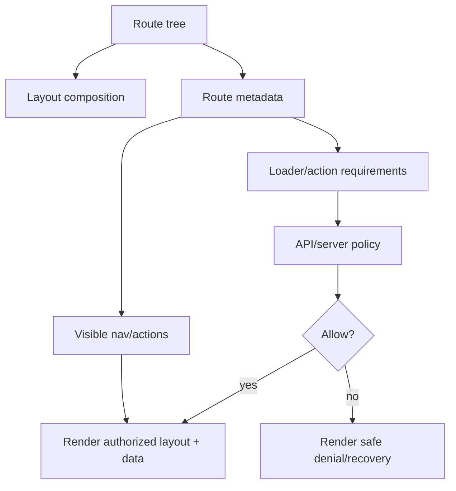
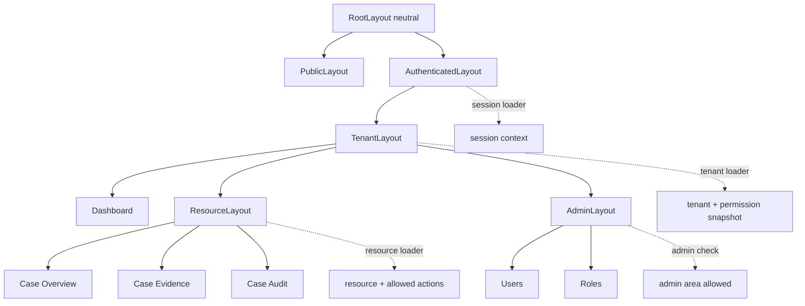

# Part 040 — Route-driven Layout Security

Layouts are security-relevant.

Not because layout components enforce authorization.

They do not.

Layouts are security-relevant because they decide which surfaces exist around protected data:

- sidebar entries,
- top navigation,
- breadcrumbs,
- tabs,
- command palette shortcuts,
- bulk action bars,
- resource headers,
- account switchers,
- tenant switchers,
- admin banners,
- impersonation banners,
- page-level actions,
- contextual menus.

If layout composition is not auth-aware, the app leaks intent, exposes impossible actions, creates confusing denial paths, or renders protected fragments during auth transitions.

Route-driven layout security means:

```txt
Route hierarchy defines layout structure.
Route metadata defines exposure intent.
Loader/action/API enforce access.
Layout consumes already-resolved auth context safely.
```

The layout is not the fortress.

The layout is the city map shown to the user.

A secure city map should not show doors the user cannot use as if they were available.

But the locks still need to exist.

---

## 1. Layout security is exposure control

A secure layout does three things:

```txt
1. It avoids showing surfaces the user cannot use.
2. It avoids rendering sensitive context before authorization is known.
3. It keeps navigation/action exposure consistent across the app.
```

It does not replace server-side checks.

Unsafe mental model:

```txt
If the menu item is hidden, the route is secure.
```

Correct mental model:

```txt
Hidden menu item reduces accidental exposure.
The route loader/action/API still deny direct access.
```



---

## 2. The layout leak problem

A common React app layout looks like this:

```tsx
function AppLayout() {
  return (
    <Shell>
      <Sidebar />
      <TopNav />
      <main>
        <Outlet />
      </main>
    </Shell>
  );
}
```

Then `Sidebar` does its own auth checks.

`TopNav` does another.

`Outlet` routes do another.

`PageHeader` does another.

This produces inconsistent security UX.

Example failure:

```txt
Sidebar hides Reports.
Command palette still shows Reports.
Direct URL opens Reports loader.
Page action hides Export.
Keyboard shortcut still triggers Export action.
API denies after optimistic UI says exported.
```

The layout did not create the core authorization bug.

But layout inconsistency made the product feel broken and increased attack surface visibility.

Route-driven layout security makes every exposure surface derive from the same route/action metadata and permission snapshot.

---

## 3. Nested routes as layout boundaries

React Router nested routes naturally model product structure:

```txt
/root
  /login
  /app
    /dashboard
    /cases
      /cases/:caseId
    /admin
      /admin/users
      /admin/roles
```

Each layout should represent a boundary:

```txt
RootLayout           global shell, theme, error boundary
PublicLayout         unauthenticated marketing/login surfaces
AuthenticatedLayout  session-required app shell
TenantLayout         tenant-scoped navigation/context
AdminLayout          admin-specific navigation and affordances
ResourceLayout       resource-specific header/tabs/actions
```

This is better than one mega-layout with many `if` statements.

```tsx
export const routes = [
  {
    id: "root",
    path: "/",
    Component: RootLayout,
    children: [
      {
        id: "public",
        Component: PublicLayout,
        children: [
          { id: "login", path: "login", Component: LoginPage },
        ],
      },
      {
        id: "app",
        path: "app",
        loader: authenticatedLayoutLoader,
        Component: AuthenticatedLayout,
        handle: {
          auth: { requiresSession: true },
        },
        children: [
          {
            id: "tenant",
            path: ":tenantSlug",
            loader: tenantLayoutLoader,
            Component: TenantLayout,
            handle: {
              auth: { requiresSession: true, requiresTenant: true },
            },
            children: [
              { id: "dashboard", path: "dashboard", Component: DashboardPage },
              {
                id: "admin",
                path: "admin",
                Component: AdminLayout,
                handle: {
                  auth: {
                    requiresSession: true,
                    requiresTenant: true,
                    permissions: [
                      { action: "admin.area.read", resource: "tenant" },
                    ],
                  },
                },
                children: [
                  { id: "admin.users", path: "users", Component: UsersPage },
                ],
              },
            ],
          },
        ],
      },
    ],
  },
];
```

Each parent layout narrows context.

```txt
AuthenticatedLayout guarantees: session known.
TenantLayout guarantees: tenant known.
AdminLayout guarantees: admin area authorized.
ResourceLayout guarantees: resource loaded/authorized.
```

That guarantee must come from loader/API enforcement, not from component hopes.

---

## 4. Parent layout loader as context gate

A layout route can own a loader.

That loader should establish the minimal context needed by child routes.

Example authenticated layout loader:

```ts
export async function authenticatedLayoutLoader({ request }: LoaderFunctionArgs) {
  const session = await readSession(request);

  if (!session) {
    throw redirect(toLoginWithSafeReturnTo(request.url));
  }

  return {
    subject: {
      id: session.subjectId,
      displayName: session.displayName,
      email: session.email,
    },
    authEpoch: session.authEpoch,
  };
}
```

Tenant layout loader:

```ts
export async function tenantLayoutLoader({ request, params }: LoaderFunctionArgs) {
  const session = await requireSession(request);
  const tenantSlug = requireParam(params, "tenantSlug");

  const tenant = await api.tenants.resolveAndAuthorize({
    subjectId: session.subjectId,
    tenantSlug,
    action: "tenant.enter",
  });

  return {
    tenant: {
      id: tenant.id,
      slug: tenant.slug,
      name: tenant.name,
    },
    permissions: tenant.permissionSnapshot,
  };
}
```

Child routes consume context:

```tsx
function TenantLayout() {
  const { tenant, permissions } = useLoaderData<typeof tenantLayoutLoader>();

  return (
    <TenantContext.Provider value={{ tenant, permissions }}>
      <TenantShell tenant={tenant}>
        <Outlet />
      </TenantShell>
    </TenantContext.Provider>
  );
}
```

This prevents every page from inventing its own tenant/auth bootstrap.

---

## 5. No protected layout before auth is known

A common visual bug:

```txt
User opens /app/admin/users.
App initially renders shell/sidebar.
Auth check runs asynchronously.
Admin links flash briefly.
Then app redirects to login/forbidden.
```

This is not always a data breach.

But it is still bad.

It reveals product structure and creates trust problems.

Secure approach:

```txt
Unknown auth state -> neutral loading/skeleton.
Known anonymous -> public/login layout.
Known authenticated -> authenticated layout.
Known forbidden -> denial layout.
```

Do not render the authenticated shell during unknown auth state.

```tsx
function RootAuthGate() {
  const session = useRootSession();

  switch (session.status) {
    case "unknown":
    case "checking":
      return <NeutralAppShellSkeleton />;

    case "anonymous":
      return <PublicLayout />;

    case "authenticated":
      return <AuthenticatedLayout />;

    case "revoked":
      return <SessionRevokedPage />;
  }
}
```

In React Router Data/Framework mode, prefer loader-level redirects/throws so the component does not render in the wrong state.

---

## 6. Layout composition and `Outlet` context

`Outlet` context is useful for passing layout-resolved values to child routes.

Example:

```tsx
export type TenantOutletContext = {
  tenant: TenantSummary;
  permissions: PermissionSnapshot;
  can: CanFunction;
};

export function TenantLayout() {
  const data = useLoaderData<typeof tenantLayoutLoader>();
  const can = createCan(data.permissions);

  return (
    <TenantShell tenant={data.tenant}>
      <Outlet context={{ tenant: data.tenant, permissions: data.permissions, can }} />
    </TenantShell>
  );
}

export function useTenantContext() {
  return useOutletContext<TenantOutletContext>();
}
```

This is clean.

But keep the boundary sharp:

```txt
Outlet context is a UI convenience.
It is not authoritative authorization.
```

A child action must still send the request to an API that enforces authorization.

The `can` function may hide a button.

It does not prove the mutation is allowed.

---

## 7. Sidebar derivation from route metadata

A secure sidebar should not duplicate access rules.

Bad:

```tsx
function Sidebar() {
  const { user } = useAuth();

  return (
    <nav>
      {user.role === "admin" && <Link to="/admin/users">Users</Link>}
      {user.permissions.includes("case.read") && <Link to="/cases">Cases</Link>}
      {featureFlags.reports && <Link to="/reports">Reports</Link>}
    </nav>
  );
}
```

Better:

```tsx
function Sidebar() {
  const { permissionSnapshot } = useTenantContext();
  const items = useMemo(
    () => buildVisibleNavItems(appRoutes, permissionSnapshot, { surface: "sidebar" }),
    [permissionSnapshot],
  );

  return (
    <nav aria-label="Main navigation">
      {items.map((item) => (
        <NavLink key={item.routeId} to={item.to}>
          {item.label}
        </NavLink>
      ))}
    </nav>
  );
}
```

The sidebar becomes a renderer.

The route tree becomes the declaration.

The permission snapshot becomes the current capability context.

---

## 8. Page header actions

Page header actions are often more sensitive than navigation links.

Example:

```txt
Case Detail page
  Edit case
  Escalate case
  Assign investigator
  Export evidence
  Close case
```

These actions are not route-level only.

They are often resource-state-dependent.

A route-level permission can declare coarse capability:

```ts
handle: {
  actions: [
    { id: "case.edit", action: "case.update", resource: "case" },
    { id: "case.escalate", action: "case.escalate", resource: "case" },
  ],
}
```

But final action visibility should come from resource loader data:

```ts
export type CaseDetailLoaderData = {
  case: CaseView;
  allowedActions: Array<
    | "case.update"
    | "case.escalate"
    | "case.assign"
    | "case.close"
  >;
};
```

Render:

```tsx
function CaseHeaderActions() {
  const { allowedActions } = useLoaderData<typeof caseDetailLoader>();

  return (
    <ActionBar>
      {allowedActions.includes("case.update") && <EditCaseButton />}
      {allowedActions.includes("case.escalate") && <EscalateCaseButton />}
      {allowedActions.includes("case.close") && <CloseCaseButton />}
    </ActionBar>
  );
}
```

Reason:

```txt
Route-level permission: user may generally update cases.
Resource-level allowedActions: user may update this case in this state now.
```

That distinction matters.

---

## 9. Tabs as authorization surfaces

Tabs are routes or subroutes in disguise.

Example:

```txt
/cases/:caseId/overview
/cases/:caseId/evidence
/cases/:caseId/audit
/cases/:caseId/permissions
```

Each tab may have different access rules.

Do not render all tabs blindly.

```ts
const caseTabs = [
  {
    id: "overview",
    to: "overview",
    label: "Overview",
    permission: "case.read",
  },
  {
    id: "evidence",
    to: "evidence",
    label: "Evidence",
    permission: "case.evidence.read",
  },
  {
    id: "audit",
    to: "audit",
    label: "Audit Trail",
    permission: "case.audit.read",
  },
  {
    id: "permissions",
    to: "permissions",
    label: "Access",
    permission: "case.permission.manage",
  },
] as const;
```

Use resource-specific allowed actions/permissions:

```tsx
function CaseTabs() {
  const { allowedActions } = useCaseContext();

  const visibleTabs = caseTabs.filter((tab) =>
    allowedActions.includes(tab.permission),
  );

  return (
    <nav aria-label="Case sections">
      {visibleTabs.map((tab) => (
        <NavLink key={tab.id} to={tab.to}>
          {tab.label}
        </NavLink>
      ))}
    </nav>
  );
}
```

Also enforce in each tab loader.

A hidden tab URL must still deny.

---

## 10. Breadcrumbs without sensitive leakage

Breadcrumbs are easy to overlook.

A breadcrumb can leak:

- customer name,
- case title,
- investigation subject,
- report name,
- confidential project code,
- internal admin section.

Safe breadcrumb rule:

```txt
Static route labels may render from metadata.
Dynamic resource labels render only from authorized loader data.
```

Example:

```tsx
function AppBreadcrumbs() {
  const matches = useMatches();

  return (
    <ol>
      {matches.flatMap((match) => {
        const breadcrumb = match.handle?.breadcrumb;
        if (!breadcrumb) return [];

        const label = resolveBreadcrumbLabel({
          breadcrumb,
          loaderData: match.data,
        });

        if (!label) return [];

        return <li key={match.id}>{label}</li>;
      })}
    </ol>
  );
}
```

`resolveBreadcrumbLabel` must be conservative:

```ts
function resolveBreadcrumbLabel(input: {
  breadcrumb: BreadcrumbMetadata;
  loaderData: unknown;
}) {
  if (input.breadcrumb.kind === "static") return input.breadcrumb.label;

  if (input.breadcrumb.kind === "resource") {
    if (!isAuthorizedResourceLoaderData(input.loaderData)) {
      return input.breadcrumb.fallbackLabel;
    }

    return input.breadcrumb.getLabel(input.loaderData);
  }
}
```

---

## 11. Command palette security

A command palette often becomes a hidden second router.

It can expose:

- admin routes,
- destructive actions,
- support tools,
- recently viewed confidential resources,
- tenant-specific commands.

Design command palette entries with explicit action metadata:

```ts
export type CommandDefinition = {
  id: string;
  label: string;
  kind: "navigation" | "action";
  routeId?: AppRouteId;
  permission?: PermissionRequirement;
  featureFlag?: string;
  dangerous?: boolean;
  requiresFreshSession?: boolean;
};
```

Build visible commands from route metadata and action permission data:

```ts
function getVisibleCommands(ctx: CommandContext): CommandDefinition[] {
  return allCommands.filter((command) => {
    if (command.featureFlag && !ctx.flags.enabled(command.featureFlag)) return false;
    if (command.permission && !ctx.can(command.permission.action, command.permission.resource)) return false;
    if (command.requiresFreshSession && !ctx.session.isFresh) return true; // visible but step-up on execute
    return true;
  });
}
```

Execution must still enforce:

```ts
async function executeCommand(command: CommandDefinition) {
  if (command.kind === "action") {
    // Server action/API must enforce.
    return submitCommandAction(command.id);
  }

  return navigate(command.routeId!);
}
```

Visibility is not authorization.

Execution must be checked.

---

## 12. Impersonation and support mode layout

Admin/support impersonation must be unmistakable.

A layout is the right place to show global impersonation state.

```tsx
function AuthenticatedLayout() {
  const { session } = useRootSessionData();

  return (
    <Shell>
      {session.impersonation && (
        <ImpersonationBanner
          actor={session.impersonation.actorDisplayName}
          subject={session.impersonation.subjectDisplayName}
          expiresAt={session.impersonation.expiresAt}
        />
      )}
      <Outlet />
    </Shell>
  );
}
```

But the layout must not merely show a banner.

The session and API must constrain access.

Impersonation layout requirements:

```txt
Visible persistent banner.
Explicit exit action.
Reduced permission set when appropriate.
Audit event on every sensitive action.
No silent tenant switching.
No support-only data mixed with customer-user data unless clearly marked.
Session expiry is short.
```

Route metadata can add extra audit flags:

```ts
handle: {
  auth: {
    requiresSession: true,
    permissions: [{ action: "case.read", resource: "case" }],
    audit: {
      viewEvent: "case.viewed",
      denialEvent: "case.view_denied",
    },
  },
  supportMode: {
    auditRequired: true,
    bannerRequired: true,
  },
}
```

---

## 13. Tenant switcher layout risks

Tenant switchers are high-risk UI.

A bad tenant switcher causes cache leaks.

Example failure:

```txt
User views Tenant A cases.
User switches to Tenant B.
UI shell updates tenant name.
Cached query still shows Tenant A cases.
```

Tenant switch must be treated as auth-context transition.

```ts
async function switchTenant(targetTenantId: string) {
  await api.session.switchTenant({ targetTenantId });

  authEvents.emit({
    type: "tenant-switched",
    targetTenantId,
  });

  queryClient.clear();
  router.revalidate();
  navigate(`/${targetTenantId}/dashboard`, { replace: true });
}
```

Layout should not keep tenant-specific state outside auth/cache invalidation discipline.

Bad:

```ts
const [selectedTenant, setSelectedTenant] = useState(lastTenantFromLocalStorage);
```

Better:

```txt
Tenant context comes from session/bootstrap/loader.
Tenant switch is server-confirmed.
Tenant-specific caches are invalidated.
Route is replaced to safe landing page.
```

---

## 14. Layout-level cache and browser back button

Authenticated layouts often cache data in memory.

Examples:

- nav item list,
- profile summary,
- tenant list,
- notification count,
- recent resources,
- permission snapshot.

On logout, session revocation, tenant switch, or permission change, these caches must be invalidated.

```ts
authEvents.on("logout", () => {
  queryClient.clear();
  clearInMemoryAuthState();
  clearRecentResourceCache();
  router.navigate("/login", { replace: true });
});
```

The browser back button may show a previously rendered page from memory or bfcache.

Use route loaders and revalidation to recover safely.

For sensitive apps, also consider HTTP cache headers on authenticated HTML/data responses:

```http
Cache-Control: no-store
```

Do not rely only on React state cleanup.

The browser has its own lifecycle.

---

## 15. Layout and suspense boundaries

Suspense can accidentally reveal layout before authorization context resolves.

Bad:

```tsx
<AuthenticatedShell>
  <Suspense fallback={<PageSkeleton />}>
    <ProtectedPage />
  </Suspense>
</AuthenticatedShell>
```

If `AuthenticatedShell` renders before the session is known, the protected shell appears too early.

Better:

```tsx
<SessionBoundary>
  <AuthenticatedShell>
    <Suspense fallback={<AuthorizedPageSkeleton />}>
      <ProtectedPage />
    </Suspense>
  </AuthenticatedShell>
</SessionBoundary>
```

Where `SessionBoundary` has already resolved:

```txt
anonymous -> login/public layout
authenticated -> authenticated shell
forbidden -> denial layout
unknown -> neutral shell
```

Skeletons should also be authorization-aware.

A skeleton can leak structure.

Example:

```txt
Showing skeleton rows for "High Risk Investigations" to users who cannot access that area leaks product/domain existence.
```

Prefer neutral skeletons until route auth is known.

---

## 16. Route-driven mobile layout

Mobile apps often have different navigation surfaces:

- bottom tabs,
- drawer menu,
- floating action button,
- condensed command menu.

Do not implement a separate auth model for mobile layout.

Use the same route metadata and permission snapshot.

```ts
const mobileTabs = buildVisibleNavItems(appRoutes, snapshot, {
  surface: "mobile-bottom-tabs",
}).slice(0, 5);
```

If a route is not suitable for mobile, that is a layout constraint, not authorization.

Represent it separately:

```ts
handle: {
  nav: {
    label: "Reports",
    section: "main",
    surfaces: ["desktop-sidebar", "command-palette"],
  },
  auth: {
    requiresSession: true,
    permissions: [{ action: "report.read", resource: "tenant" }],
  },
}
```

Do not hide a route on mobile because permission logic was accidentally omitted.

---

## 17. Layout and analytics/audit

Layouts are tempting places to track page views.

Be careful.

Do not emit sensitive analytics before authorization is known.

Bad:

```tsx
useEffect(() => {
  analytics.page("Case Detail", { caseId, title: case.title });
}, []);
```

Better:

```tsx
useEffect(() => {
  if (!isAuthorizedCaseData(data)) return;

  audit.view({
    event: "case.viewed",
    caseId: data.case.id,
    tenantId: data.case.tenantId,
  });
}, [data]);
```

Product analytics and security audit are not the same.

Route metadata can define both:

```ts
handle: {
  analytics: {
    pageName: "Case Detail",
    includeResourceLabel: false,
  },
  auth: {
    audit: {
      viewEvent: "case.viewed",
      denialEvent: "case.view_denied",
    },
  },
}
```

Keep PII out of analytics unless explicitly required and approved.

---

## 18. Layout failure taxonomy

Layout security bugs have recognizable patterns.

| Failure | Example | Consequence |
|---|---|---|
| Auth flash | Admin shell appears before session check | Product structure leak, poor trust |
| Nav drift | Sidebar hidden, command palette visible | Inconsistent exposure |
| Stale tenant cache | Tenant A data after switching to Tenant B | Cross-tenant leakage |
| Role duplication | Layout checks role, API checks permission | Drift, false allow/deny |
| Resource label leak | Breadcrumb renders confidential case title early | Sensitive disclosure |
| Action ghost | Disabled button calls action via shortcut | Confusing or unsafe mutation path |
| Skeleton leak | Forbidden section skeleton visible | Product/domain leakage |
| Impersonation ambiguity | No persistent banner | Audit/user trust risk |
| Step-up invisibility | Sensitive action hidden instead of challenge | Bad UX, support burden |
| Back-button leak | Protected page visible after logout | Sensitive data remanence |

A good layout architecture treats these as first-class failure modes.

---

## 19. A secure layout composition pattern

A practical composition:

```txt
RootLayout
  - global error boundary
  - neutral shell only
  - no auth-sensitive nav

PublicLayout
  - login/register/reset surfaces
  - no authenticated user data

AuthenticatedLayout
  - session loader required
  - user menu
  - logout
  - global auth event handling
  - impersonation banner

TenantLayout
  - tenant loader required
  - tenant switcher
  - tenant-scoped permission snapshot
  - sidebar derived from route metadata

ResourceLayout
  - resource loader required
  - resource-level allowedActions
  - tabs/action bar derived from loader data

AdminLayout
  - admin area permission required
  - admin-specific nav/actions
```

Mermaid view:



Each deeper layout gets stronger assumptions.

Each assumption is established by loader/API enforcement.

---

## 20. Concrete example: regulated case management layout

Imagine a regulatory case system.

Route tree:

```txt
/:tenantSlug/cases/:caseId
  overview
  evidence
  timeline
  audit
  permissions
```

Permissions:

```txt
case.read
case.evidence.read
case.timeline.read
case.audit.read
case.permission.manage
case.escalate
case.close
```

The case may be:

```txt
draft
open
under-review
escalated
closed
sealed
```

A user may be:

```txt
assigned investigator
case supervisor
tenant admin
external reviewer
support impersonator
read-only auditor
```

A route-level permission is not enough.

Use layout layering:

```ts
export async function caseResourceLayoutLoader(args: LoaderFunctionArgs) {
  const session = await requireSession(args.request);
  const tenant = await requireTenant(args.params.tenantSlug, session);
  const caseId = requireParam(args.params, "caseId");

  return api.cases.getAuthorizedCaseShell({
    tenantId: tenant.id,
    caseId,
    subjectId: session.subjectId,
  });
}
```

API response:

```ts
export type AuthorizedCaseShell = {
  case: {
    id: string;
    reference: string;
    title: string;
    state: "draft" | "open" | "under-review" | "escalated" | "closed" | "sealed";
    confidentiality: "normal" | "restricted" | "sealed";
  };
  allowedSections: Array<
    | "overview"
    | "evidence"
    | "timeline"
    | "audit"
    | "permissions"
  >;
  allowedActions: Array<
    | "case.update"
    | "case.escalate"
    | "case.close"
    | "case.assign"
  >;
  auditContext: {
    viewEventId: string;
    reasonRequiredForExport: boolean;
  };
};
```

Layout:

```tsx
function CaseResourceLayout() {
  const data = useLoaderData<typeof caseResourceLayoutLoader>();

  return (
    <CaseContext.Provider value={data}>
      <CaseHeader case={data.case} allowedActions={data.allowedActions} />
      <CaseTabs allowedSections={data.allowedSections} />
      <Outlet />
    </CaseContext.Provider>
  );
}
```

Each child tab still has its own loader:

```ts
export async function evidenceLoader(args: LoaderFunctionArgs) {
  const context = await requireAuthorizedCaseContext(args);

  return api.cases.getEvidence({
    tenantId: context.tenantId,
    caseId: context.caseId,
  });
}
```

The parent layout exposes allowed sections.

The child loader enforces section access.

That is correct duplication: exposure + enforcement.

---

## 21. SSR and route-driven layout security

With SSR/framework mode, layout security becomes more important.

Server-rendered HTML can contain protected layout fragments.

Rules:

```txt
Do not SSR authenticated shell unless session is known on the server.
Do not include protected navigation in public HTML.
Do not serialize excessive permission/profile data into hydration payload.
Do not stream sensitive child content before parent auth boundary resolves.
Use cache-control appropriate for authenticated HTML/data.
```

SSR-safe pattern:

```txt
Server request -> root loader reads session -> authenticated branch or public branch -> tenant loader resolves tenant -> render layout with allowed nav only
```

Unsafe pattern:

```txt
Render shell statically -> client checks auth -> hide/replace after hydration
```

The second pattern causes flash and potential HTML exposure.

---

## 22. Testing route-driven layout security

Test layout exposure as architecture, not only snapshots.

Useful tests:

```txt
Anonymous user does not see authenticated shell.
Authenticated non-admin does not see admin sidebar/command entries.
Direct admin URL returns forbidden before admin component renders.
Tenant switch clears previous tenant nav/data.
Breadcrumb dynamic labels do not render without authorized loader data.
Command palette uses same visibility logic as sidebar.
Mobile bottom tabs use same visibility logic as desktop nav.
Impersonation banner persists across nested routes.
Step-up actions are visible as challengeable, not silently missing.
Back button after logout does not preserve sensitive data after revalidation.
```

Example React Testing Library style:

```tsx
test("non-admin cannot see admin navigation", async () => {
  renderApp({
    route: "/acme/dashboard",
    session: authenticatedUser({ permissions: ["dashboard.read"] }),
  });

  expect(await screen.findByRole("navigation", { name: /main/i })).toBeInTheDocument();
  expect(screen.queryByRole("link", { name: /users/i })).not.toBeInTheDocument();
});
```

Direct URL test:

```tsx
test("direct admin URL denies before rendering admin layout", async () => {
  renderApp({
    route: "/acme/admin/users",
    session: authenticatedUser({ permissions: ["dashboard.read"] }),
  });

  expect(await screen.findByText(/you do not have access/i)).toBeInTheDocument();
  expect(screen.queryByText(/manage users/i)).not.toBeInTheDocument();
});
```

Command palette consistency:

```tsx
test("command palette and sidebar use same permission snapshot", async () => {
  renderApp({
    route: "/acme/dashboard",
    session: authenticatedUser({ permissions: ["dashboard.read"] }),
  });

  await user.keyboard("{Meta>}k{/Meta}");

  expect(screen.queryByRole("option", { name: /admin users/i })).not.toBeInTheDocument();
  expect(screen.queryByRole("link", { name: /users/i })).not.toBeInTheDocument();
});
```

---

## 23. Production checklist

Use this checklist for layout PRs:

```txt
[ ] Does the layout assume session only after loader/session bootstrap succeeds?
[ ] Does the layout avoid rendering authenticated shell in unknown auth state?
[ ] Are sidebar, tabs, breadcrumbs, command palette, shortcuts, and mobile nav derived from shared metadata/snapshot?
[ ] Are dynamic resource labels rendered only from authorized loader data?
[ ] Are action bars based on allowedActions or equivalent server-projected permission data?
[ ] Does every hidden action still have server-side authorization?
[ ] Does tenant switch clear route/data/query caches?
[ ] Does logout clear layout-level memory and cached sensitive data?
[ ] Does impersonation/support mode show persistent UI state?
[ ] Are SSR/hydration paths free from protected shell flash?
[ ] Do tests cover direct URL access, not only menu visibility?
[ ] Are analytics/audit events emitted only after authorized context exists?
```

---

## 24. Mental model

A layout is a projection of the current authorization context.

It should answer:

```txt
What should this user see around the page?
Which navigation paths are meaningful?
Which actions are available, challengeable, or denied?
Which tenant/resource context is active?
Which security mode is active: normal, step-up-needed, impersonation, degraded?
```

But the layout must not answer alone:

```txt
Is this mutation allowed?
Can this resource be read?
Can this user bypass policy?
```

Those answers belong to loaders/actions/API/policy enforcement.

The mature design is layered:

```txt
Route metadata       declares exposure intent.
Layout               renders consistent surfaces.
Loader/action         performs pre-render/pre-mutation checks.
API/policy engine     enforces exact resource/action/context access.
Audit/observability   records what happened.
Tests                 prove the layers do not drift.
```

That is route-driven layout security.

Not hiding buttons.

Not a bigger `ProtectedRoute`.

A coherent exposure model for a React application whose real enforcement lives at the resource boundary.

---

## References

- React Router documentation: nested routes, layout routes, route modules, loaders, actions, error boundaries, `handle`, and `useMatches()`.
- OWASP Authorization Cheat Sheet: deny-by-default, least privilege, validate permissions on every request.
- OWASP Top 10 Broken Access Control: risks caused by missing or inconsistent access control.
- MDN HTTP cache-control guidance and browser lifecycle considerations for authenticated pages.
