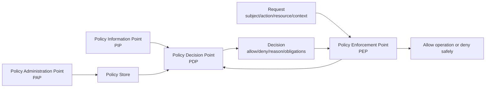
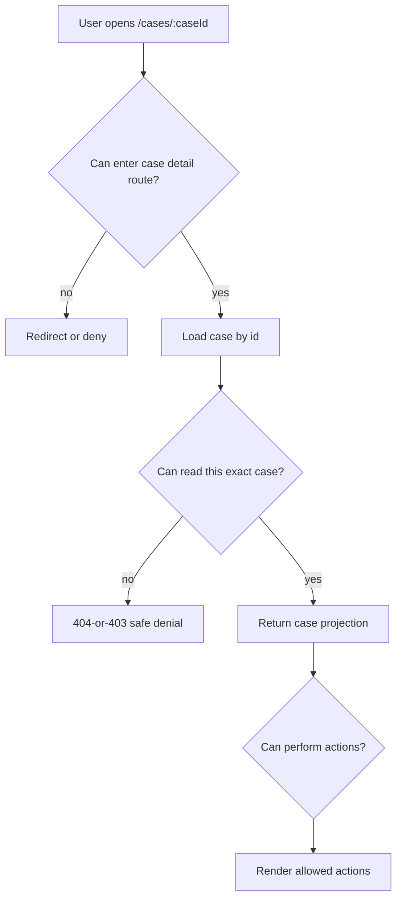
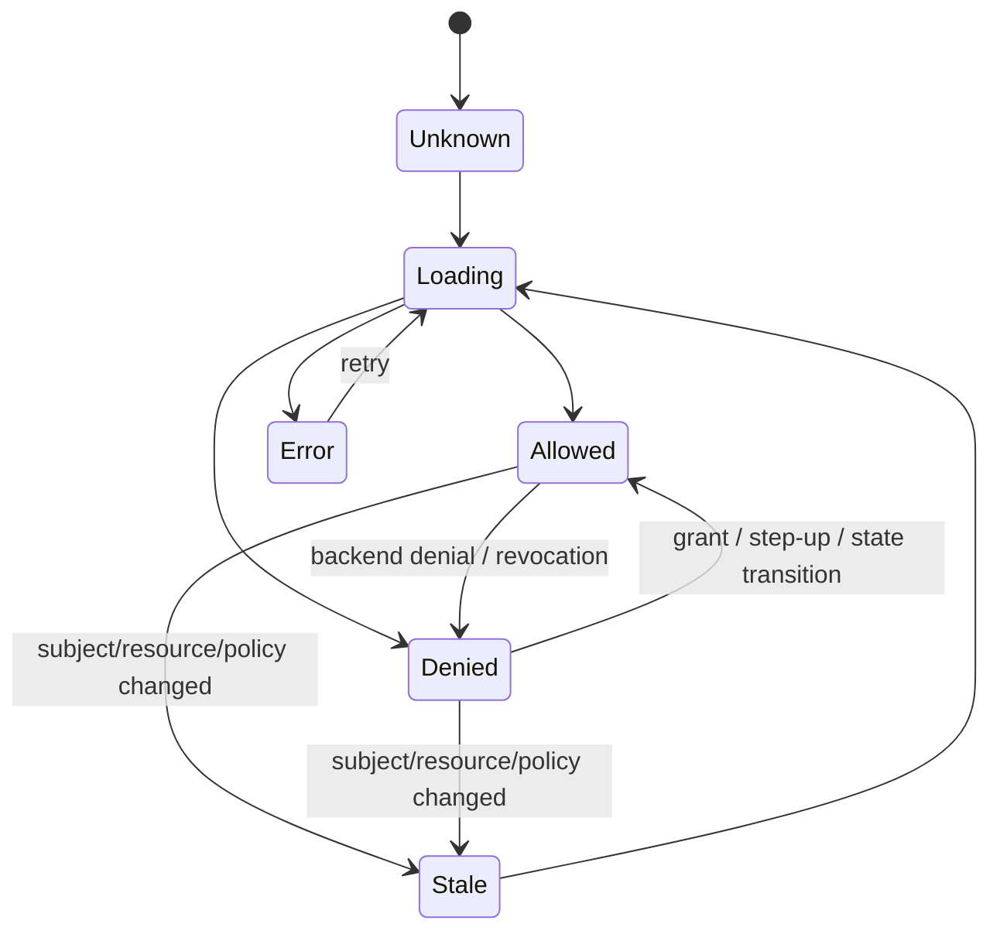

# Part 041 — Authorization Mental Model

Authentication answers:

```txt
Who is interacting with the system?
```

Authorization answers:

```txt
Given this authenticated or anonymous subject,
can this subject perform this action
on this resource
under this context
right now?
```

That extra `right now` matters.

Authorization is not a static label attached to a user.

Authorization is a decision.

And like every important decision in a production system, it needs:

- inputs,
- policy,
- a decision point,
- an enforcement point,
- an audit trail,
- denial semantics,
- test cases,
- operational visibility,
- failure behavior.

React is not the final enforcement boundary.

But React still needs a precise authorization model because it decides which surfaces are shown, which actions are enabled, which data loaders run, which error states appear, and how safely the product behaves when authorization changes while the user is already inside the app.

The mistake is not “doing authorization in React”.

The mistake is believing React authorization is enough.

---

## 1. The minimum useful model

The minimum authorization question is:

```txt
Can subject S perform action A on resource R in context C?
```

In code, that becomes:

```ts
can(subject, action, resource, context) => decision
```

Example:

```ts
can(
  { type: "user", id: "u_123", tenantId: "t_001" },
  "case.approve",
  { type: "case", id: "case_900", tenantId: "t_001", status: "UNDER_REVIEW" },
  { ipRisk: "low", assuranceLevel: 2, now: "2026-07-08T10:00:00+07:00" }
)
```

A weak app asks:

```txt
Is this user an admin?
```

A serious app asks:

```txt
Can this subject perform this action on this exact resource under this exact situation?
```

That is the difference between role display logic and authorization engineering.

---

## 2. Authorization is not one thing

Authorization appears in multiple shapes:

| Shape | Question | Example |
|---|---|---|
| Route authorization | Can the user enter this route? | Can open `/admin/users`? |
| Data authorization | Can the user read this dataset? | Can list enforcement cases? |
| Object authorization | Can the user access this object? | Can open case `C-123`? |
| Action authorization | Can the user do this operation? | Can approve, reject, assign? |
| Field authorization | Can the user see or edit this field? | Can edit penalty amount? |
| Workflow authorization | Can the user perform this transition now? | Can move `DRAFT → APPROVED`? |
| Tenant authorization | Is the subject allowed in this tenant/org/project? | Can act in tenant `acme`? |
| Delegated authorization | Is access granted through relationship? | Owner, manager, reviewer, assignee. |
| Step-up authorization | Is current authentication assurance sufficient? | Require MFA before payout. |
| Administrative authorization | Can the user change authorization itself? | Can grant admin role? |

A React app often touches all of them in the same screen.

A case detail page may need:

```txt
route: user may open case detail route
read: user may read this specific case
action: user may approve this case
field: user may see confidential notes
workflow: case may transition from UNDER_REVIEW to APPROVED
tenant: user and case belong to same tenant
step-up: approval over threshold requires MFA
```

If your frontend auth model only has `isAdmin`, it cannot represent the real system.

---

## 3. The authorization pipeline

A mature authorization system has four conceptual parts.



The names are less important than the separation.

| Concept | Meaning | In a React system |
|---|---|---|
| PAP | Where policy is authored/administered | Admin console, role editor, grant workflow. |
| PIP | Where attributes/relationships come from | User profile, org membership, resource metadata, workflow state. |
| PDP | Component that evaluates policy | Backend service, policy engine, API layer, BFF. |
| PEP | Component that enforces decision | API handler, route loader, action handler, middleware, backend service. |

React can consume decisions.

React can request decisions.

React can project decisions into UI.

React should not be the only PEP for real resources.

---

## 4. Frontend authorization is projection, not authority

Frontend authorization has a legitimate job:

```txt
Expose the product safely based on known decisions.
```

It should:

- hide irrelevant navigation,
- disable impossible actions,
- show permission reasons,
- route unauthenticated users to login,
- route authenticated-but-forbidden users to denial pages,
- prevent accidental invalid submissions,
- reduce support noise,
- keep the UI coherent while authorization is loading,
- avoid leaking protected content before decision is known.

It must not:

- be the only thing stopping access,
- infer object access from route params,
- trust decoded JWT claims as final permission,
- let hidden buttons define policy,
- treat roles as universal permissions,
- cache permission forever,
- allow frontend-only workflow transitions,
- skip server-side checks because a component already checked.

A useful rule:

```txt
React decides what the user sees.
The server decides what the user can do.
```

That rule is not perfect, because SSR/BFF loaders blur the line.

But the invariant remains:

```txt
Every resource read and write must pass an enforcement boundary outside the user's control.
```

---

## 5. Subject, action, resource, context

### 5.1 Subject

The subject is the actor.

Usually a user, but not always.

Examples:

```ts
type Subject =
  | { type: "anonymous" }
  | { type: "user"; id: string; tenantId: string; roles: string[] }
  | { type: "service"; id: string; scopes: string[] }
  | { type: "impersonated-user"; actorId: string; effectiveUserId: string; tenantId: string };
```

Subject is not equal to profile.

Profile data answers:

```txt
What is this user's display name, email, avatar, locale?
```

Authorization subject answers:

```txt
What principal is acting, under which tenant, with which authority and assurance?
```

Avoid mixing them.

A profile object is often too noisy and too stale for authorization.

### 5.2 Action

An action is the operation being requested.

Good actions are domain verbs:

```txt
case.read
case.create
case.assign
case.approve
case.reopen
case.close
case.comment.create
case.evidence.download
case.penalty.edit
user.invite
role.grant
```

Weak actions are UI verbs:

```txt
button.click
modal.open
tab.view
page.visit
```

UI verbs are useful for analytics.

They are not stable policy semantics.

A strong action vocabulary should be:

- domain-oriented,
- stable across UI redesigns,
- granular enough for real policy,
- not so granular that it creates unmanageable noise,
- shared between frontend, backend, tests, and documentation.

### 5.3 Resource

The resource is the target.

It may be:

```txt
a tenant,
a project,
a case,
a document,
a field,
a workflow transition,
a report,
a saved search,
a user account,
a role assignment,
a policy object.
```

A resource is not just an ID.

A resource often carries attributes relevant to authorization:

```ts
type CaseResource = {
  type: "case";
  id: string;
  tenantId: string;
  status: "DRAFT" | "UNDER_REVIEW" | "APPROVED" | "CLOSED";
  ownerUserId: string;
  assignedTeamId: string;
  confidentiality: "normal" | "restricted" | "sealed";
  penaltyAmount?: number;
};
```

If React only knows `caseId`, it cannot evaluate meaningful object/action permission locally.

That is fine.

React can request a decision from the server.

### 5.4 Context

Context is everything that matters but is not the subject/action/resource itself.

Examples:

```ts
type AuthorizationContext = {
  now: string;
  tenantId: string;
  requestId: string;
  assuranceLevel: 1 | 2 | 3;
  ipRisk?: "low" | "medium" | "high";
  deviceTrust?: "unknown" | "managed" | "trusted";
  sessionAgeSeconds?: number;
  reason?: "user_action" | "background_poll" | "preload";
};
```

Context prevents authorization from becoming a misleading static lookup.

Examples:

```txt
User can export data only during business hours.
User can approve payout only after MFA.
User can edit case only while status is DRAFT.
User can download evidence only from managed device.
User can invite users only inside current tenant.
```

React should not invent high-trust context.

But React may pass low-trust context as input if the server validates it.

---

## 6. Decision shape

A boolean is usually too small.

Bad decision contract:

```ts
type Decision = boolean;
```

Better decision contract:

```ts
type AuthorizationDecision =
  | {
      effect: "allow";
      decisionId: string;
      obligations?: AuthorizationObligation[];
      ttlSeconds?: number;
    }
  | {
      effect: "deny";
      decisionId: string;
      reason:
        | "not_authenticated"
        | "insufficient_permission"
        | "tenant_mismatch"
        | "resource_not_found_or_hidden"
        | "workflow_state_denied"
        | "step_up_required"
        | "policy_unavailable";
      messageKey: string;
      retry?: "login" | "step_up" | "request_access" | "never";
    };

type AuthorizationObligation =
  | { type: "mask_field"; field: string }
  | { type: "watermark_export" }
  | { type: "audit_reason_required" }
  | { type: "max_export_rows"; value: number };
```

Why richer decisions matter:

- React can render denial correctly.
- UX can distinguish login from forbidden from step-up.
- Audit logs can correlate UI and backend decisions.
- Tests can assert the reason, not just the boolean.
- Product can show request-access flows.
- Policies can add obligations without rewriting every screen.

But be careful.

Denial reasons can leak information.

For sensitive objects, the backend may intentionally return:

```txt
resource_not_found_or_hidden
```

instead of:

```txt
forbidden_because_case_is_sealed
```

The UI should support this without trying to be clever.

---

## 7. Deny-by-default is a runtime behavior

Deny-by-default is not a slogan.

It means:

```txt
When permission state is unknown, do not expose protected capability.
When policy service fails, do not allow sensitive action by default.
When resource context is missing, do not guess.
When tenant is ambiguous, do not proceed.
When a route has no policy metadata, do not assume public unless explicitly marked public.
```

In React, deny-by-default shows up as:

```tsx
function Can({ decision, children, fallback = null }: Props) {
  if (decision.status !== "ready") return fallback;
  if (decision.value.effect !== "allow") return fallback;
  return <>{children}</>;
}
```

The insecure version is:

```tsx
function Can({ loading, allowed, children }: Props) {
  if (loading) return <>{children}</>; // unsafe flash
  if (!allowed) return null;
  return <>{children}</>;
}
```

Unknown is not allowed.

Loading is not allowed.

Missing data is not allowed.

Policy failure is not allowed for sensitive actions.

---

## 8. Authorization is per request, not per page load

A common frontend mistake:

```txt
The page loaded, so all actions on the page are allowed.
```

That is false.

A page may be readable while some actions are forbidden.

Example:

```txt
case.read: allow
case.comment.create: allow
case.assign: deny
case.approve: deny because status is DRAFT
case.evidence.download: deny because confidentiality is restricted
```

Another mistake:

```txt
The user loaded the app with Manager role, so Manager permissions remain valid until logout.
```

Also false.

Permissions can change while the session is active.

Authorization is a moving decision.

Triggers that can invalidate permission:

- role revoked,
- user removed from tenant,
- resource status changed,
- object ownership changed,
- case assigned to another team,
- document sealed,
- step-up expired,
- session risk changed,
- policy deploy changed,
- feature moved from preview to restricted release,
- user is impersonating another subject.

React needs a permission invalidation story.

Not every decision needs to be live-updated every second.

But every sensitive write must be rechecked at enforcement time.

---

## 9. Route authorization vs resource authorization

Route authorization is coarse.

Resource authorization is precise.



A user may be allowed to open the `cases` route but not allowed to see every case.

In serious systems:

```txt
route access is necessary but not sufficient.
```

React Router loaders help because they allow route-level decisions before render.

But the loader still needs backend support for actual resource access.

A loader that fetches everything and filters in the browser is not secure.

---

## 10. Action authorization and workflow state

For write operations, the authorization question must include the operation and resource state.

Bad mutation endpoint:

```http
POST /cases/123/approve
Authorization: Bearer token
```

Backend check:

```txt
user.role == "manager"
```

That is not enough.

Better check:

```txt
subject is authenticated
subject belongs to tenant of case
subject can perform case.approve on this case
case.status == UNDER_REVIEW
subject is not the same user who created the case if separation-of-duty applies
current assurance level satisfies approval threshold
policy version is active
operation is idempotent or replay-safe
```

React's job:

- do not show approve button when obviously denied,
- explain why action is unavailable when safe,
- require step-up before submitting if policy says so,
- handle backend denial even if UI thought it was allowed,
- rollback optimistic UI,
- invalidate resource data after mutation,
- surface correlation ID for support.

Backend's job:

- enforce the real policy,
- validate workflow state,
- write audit event,
- handle race conditions transactionally.

---

## 11. Authorization granularity

Too coarse:

```txt
admin
user
viewer
```

Too fine:

```txt
case-detail-screen-header-left-export-button-hover-tooltip-open
```

Useful granularity:

```txt
case.read
case.create
case.update
case.assign
case.approve
case.close
case.comment.create
case.evidence.upload
case.evidence.download
case.penalty.edit
case.audit.read
```

A practical rule:

```txt
Model permissions around domain operations and data boundaries, not component names.
```

Ask:

- Would this action still exist if the UI changed?
- Does this action map to a backend operation?
- Does this action require separate audit?
- Could this action have different permission from similar actions?
- Does this action expose sensitive data?
- Does this action alter workflow state?

If yes, it probably deserves a permission/action.

---

## 12. Permission is not role

Role is a grouping mechanism.

Permission is a capability.

Decision is the result of evaluating subject/action/resource/context against policy.

```txt
role -> grants permissions
permission -> describes possible capability
decision -> says whether capability applies now
```

Example:

```txt
Role: Case Manager
Permission: case.approve
Decision: deny because case status is DRAFT
```

This distinction prevents a common bug:

```tsx
if (user.roles.includes("case_manager")) {
  return <ApproveButton />;
}
```

The user may be a case manager but still cannot approve this case.

The better question:

```tsx
const decision = useCan("case.approve", caseResource);
```

---

## 13. Scope is not app permission

OAuth scopes and app permissions overlap but are not identical.

An OAuth access token scope may say:

```txt
cases:write
```

That may only mean:

```txt
This client/token is allowed to call write APIs for cases in principle.
```

It does not necessarily mean:

```txt
This user can approve this exact case.
```

Scopes often describe API-level delegation.

Domain permissions describe business authorization.

A production system often needs both:

```txt
Token scope allows the API category.
Domain policy allows the exact operation.
```

Backend check:

```txt
access_token.aud == case-api
token.scope contains cases:write
subject can case.approve resource case_123 under context C
```

React should not turn OAuth scopes into product policy without explicit design.

---

## 14. Role-based, attribute-based, relationship-based, ACL

Different authorization models answer the same question using different inputs.

| Model | Main input | Good for | Weakness |
|---|---|---|---|
| RBAC | Roles assigned to users | Stable org/job functions | Role explosion, weak object-level nuance |
| ABAC | Attributes of subject/resource/context | Context-rich decisions | Policy complexity, attribute freshness |
| ReBAC | Relationships between subjects/resources | Collaboration, hierarchy, sharing | Requires relationship graph discipline |
| ACL | Explicit grants on object | Per-object sharing | Hard to manage at scale if uncontrolled |

Most real systems are hybrid.

Example:

```txt
RBAC: User is Case Manager.
ABAC: Case is in same region and amount below threshold.
ReBAC: User is assigned reviewer of this case.
ACL: User was explicitly granted read access to sealed evidence.
Workflow: Case is UNDER_REVIEW.
Step-up: MFA completed within last 10 minutes.
```

React should not care which model produced the decision.

React should care about the decision contract.

```ts
type PermissionProjection = {
  resourceId: string;
  allowedActions: string[];
  denied?: Record<string, { reason: string }>;
};
```

The policy engine can evolve behind this contract.

---

## 15. Permission projection

React rarely needs raw policy.

React usually needs projection.

Projection means:

```txt
A backend-owned representation of what this subject can see/do in this UI context.
```

Example response:

```json
{
  "case": {
    "id": "case_123",
    "status": "UNDER_REVIEW",
    "title": "Enforcement review",
    "confidentiality": "normal"
  },
  "permissions": {
    "case.read": { "effect": "allow" },
    "case.comment.create": { "effect": "allow" },
    "case.assign": {
      "effect": "deny",
      "reason": "insufficient_permission"
    },
    "case.approve": {
      "effect": "deny",
      "reason": "step_up_required",
      "retry": "step_up"
    }
  }
}
```

Benefits:

- avoids hardcoding policy in components,
- keeps UI coherent,
- supports per-resource decisions,
- gives denial reason,
- reduces duplicate decision calls,
- makes tests deterministic,
- allows backend policy evolution.

But projection has risks:

- it can become stale,
- it may overexpose denied action reasons,
- it may be too large,
- it may tempt teams to skip enforcement on mutation,
- it may need cache scoping by tenant/resource/user/session.

Projection is a UI input.

It is not an enforcement proof.

---

## 16. Decision freshness

Authorization data has a freshness requirement.

Not all decisions need the same TTL.

| Decision type | Example | Freshness expectation |
|---|---|---|
| Navigation exposure | Can see Admin menu | Can tolerate short cache |
| Read access | Can open this case | Should be checked at load time |
| Sensitive write | Can approve payout | Must be checked at submit time |
| Privilege admin | Can grant role | Must be checked immediately |
| Step-up | MFA freshness | Usually short TTL |
| Tenant membership | Can act in tenant | Should invalidate quickly on removal |

A useful frontend shape:

```ts
type DecisionEnvelope = {
  decision: AuthorizationDecision;
  evaluatedAt: string;
  policyVersion: string;
  subjectVersion: string;
  resourceVersion?: string;
  ttlSeconds?: number;
};
```

On role or tenant changes, invalidate permission queries.

On logout, purge all user/tenant-scoped permission state.

On mutation denial, do not keep trusting stale projection.

---

## 17. Tenant boundary is authorization input

In multi-tenant apps, tenant is not a theme setting.

Tenant is a security boundary.

Every authorization request should be tenant-aware.

Bad:

```ts
can(user, "case.read", { id: caseId }, {})
```

Better:

```ts
can(
  { id: userId, activeTenantId },
  "case.read",
  { type: "case", id: caseId, tenantId: caseTenantId },
  { tenantId: activeTenantId }
)
```

Tenant bugs often come from mismatch between:

- active tenant in UI,
- tenant in session,
- tenant in URL,
- tenant in resource,
- tenant in cache key,
- tenant in token claim,
- tenant in API path/header,
- tenant in policy decision.

React must scope caches by tenant.

```ts
queryKey: ["tenant", tenantId, "case", caseId]
```

Not:

```ts
queryKey: ["case", caseId]
```

Tenant switch must purge or invalidate:

- resource queries,
- permission queries,
- route loader data,
- form draft state if tenant-scoped,
- open modals/actions,
- WebSocket subscriptions,
- command palette entries.

---

## 18. Authorization errors are product states

Auth errors are not generic failures.

Different causes need different recovery:

| Cause | UI response |
|---|---|
| Not authenticated | Login, preserve safe return intent |
| Session expired | Re-authenticate, retry safe operation if possible |
| Forbidden | Explain lack of access or show generic denial |
| Step-up required | Start MFA/reauth flow |
| Tenant mismatch | Switch tenant or show no-access |
| Resource hidden | Show not found or limited no-access state |
| Workflow denied | Explain current state if safe |
| Policy service down | Fail closed for sensitive operations; degrade non-sensitive UI |

Do not reduce all failures to:

```txt
Something went wrong.
```

But do not reveal sensitive policy internals either.

Good denial copy is boring and precise:

```txt
You do not have access to approve this case.
```

Better when safe:

```txt
This case can only be approved after review is complete.
```

Unsafe:

```txt
You cannot approve this case because the sealed-evidence flag is active and only the internal anti-fraud team can access it.
```

---

## 19. Authorization as a state machine

A decision can move through states.



React components should not assume permission is permanently stable.

A robust component handles:

```txt
unknown
loading
allowed
denied
error
stale
```

Example:

```tsx
function ApproveCaseAction({ caseId }: { caseId: string }) {
  const decision = useCan("case.approve", { type: "case", id: caseId });

  if (decision.status === "loading" || decision.status === "unknown") {
    return null;
  }

  if (decision.status === "denied") {
    if (decision.reason === "step_up_required") {
      return <StepUpButton intent="case.approve" resourceId={caseId} />;
    }
    return <DisabledAction reason={decision.reason} />;
  }

  if (decision.status === "error") {
    return <DisabledAction reason="permission_unavailable" />;
  }

  return <ApproveButton caseId={caseId} />;
}
```

Again:

```txt
This improves UX.
It does not replace backend authorization.
```

---

## 20. Enforcement placement

Enforcement must exist where data or state changes happen.

| Layer | Enforces? | Why |
|---|---:|---|
| React component | No, only exposure | User controls browser runtime |
| React route loader in browser | Partial exposure | Still user-controlled if purely client-side |
| SSR/BFF loader | Yes for data it returns | Runs server-side and can withhold data |
| API handler | Yes | Owns resource read/write boundary |
| Domain service | Yes | Protects business operation across callers |
| Database row policy | Sometimes | Strong defense-in-depth for data access |
| Storage service/signed URL | Yes | Protects binary object access |
| Message consumer/job | Yes | Protects async operations |

The same operation may need multiple enforcement points.

Example file download:

```txt
React hides Download button.
API checks evidence.download.
API creates short-lived signed URL only if allowed.
Object storage enforces signed URL expiry.
Audit records download intent and issuance.
```

---

## 21. Authorization and caching

Caching authorization is dangerous when the cache key is incomplete.

Bad:

```ts
["permissions"]
```

Better:

```ts
[
  "permissions",
  subjectId,
  activeTenantId,
  resourceType,
  resourceId,
  policyVersion,
  subjectVersion
]
```

Cache invalidation triggers:

- login,
- logout,
- token refresh with changed claims,
- role assignment changed,
- tenant switch,
- resource status changed,
- step-up completed/expired,
- impersonation started/exited,
- policy version changed,
- backend returns 403 after UI allowed,
- account disabled.

A mature system exposes versions:

```json
{
  "subjectVersion": "user-memberships-v42",
  "policyVersion": "policy-2026-07-08.3",
  "tenantVersion": "tenant-acme-memberships-v19"
}
```

React can use these versions to invalidate authorization projections without hardcoding policy internals.

---

## 22. Authorization and audit

Authorization decisions should be auditable, especially denials and sensitive allows.

Audit event example:

```json
{
  "eventType": "authorization.decision",
  "decisionId": "dec_01H...",
  "effect": "deny",
  "reason": "workflow_state_denied",
  "subjectId": "u_123",
  "tenantId": "t_001",
  "action": "case.approve",
  "resourceType": "case",
  "resourceId": "case_900",
  "resourceVersion": "7",
  "policyVersion": "policy-2026-07-08.3",
  "requestId": "req_abc",
  "uiRoute": "/cases/case_900",
  "timestamp": "2026-07-08T10:00:00+07:00"
}
```

React should not log secrets or full token values.

But React can help observability by passing:

- request ID,
- route ID,
- action intent,
- UI component source,
- client build version,
- active tenant ID,
- correlation ID from backend error.

This makes production debugging possible without leaking credentials.

---

## 23. Test the model, not just the component

Authorization tests should cover the matrix.

Example matrix:

| Subject | Resource | Action | Context | Expected |
|---|---|---|---|---|
| anonymous | case | read | none | deny login |
| viewer | case same tenant | read | normal | allow |
| viewer | case same tenant | approve | normal | deny |
| manager | case same tenant draft | approve | normal | deny workflow |
| manager | case same tenant review | approve | MFA fresh | allow |
| manager | case other tenant | read | normal | deny tenant |
| admin impersonating viewer | role grant | normal | deny or constrained |

Do not only test happy paths.

Most authorization bugs live in negative cases.

Test categories:

```txt
anonymous
wrong tenant
wrong role
wrong resource state
wrong owner
revoked membership
stale permission cache
step-up expired
policy service unavailable
direct URL access
API call bypassing UI
optimistic UI rollback
```

---

## 24. Common anti-patterns

### Anti-pattern 1: Role check in component

```tsx
{user.role === "admin" && <DeleteUserButton />}
```

Problem:

```txt
Role is not action/resource/context decision.
```

Better:

```tsx
<Can action="user.delete" resource={targetUser}>
  <DeleteUserButton />
</Can>
```

### Anti-pattern 2: JWT claim as final permission

```tsx
if (decodedToken.permissions.includes("case.approve")) {
  approveCase(caseId);
}
```

Problem:

```txt
Claim may be stale, broad, or unrelated to object/workflow state.
```

Better:

```txt
Use claims as hints only.
Server still authorizes the mutation.
```

### Anti-pattern 3: Hidden button as enforcement

```txt
No approve button means no one can approve.
```

Problem:

```txt
User can call API directly.
```

Better:

```txt
UI exposure + API/domain enforcement + audit.
```

### Anti-pattern 4: Global permission cache

```ts
const permissions = await fetch("/me/permissions");
```

Problem:

```txt
Global permissions cannot answer object-specific questions.
```

Better:

```txt
Use global projection for navigation.
Use resource-specific projection for object/action decisions.
```

### Anti-pattern 5: Treating 403 as logout

Problem:

```txt
Forbidden is not unauthenticated.
```

Better:

```txt
401 -> authenticate.
403 -> deny/request access/tenant switch/step-up if indicated.
```

---

## 25. Reference TypeScript model

```ts
type Effect = "allow" | "deny";

type SubjectRef = {
  type: "user" | "service" | "anonymous" | "impersonated-user";
  id?: string;
  tenantId?: string;
  assuranceLevel?: 0 | 1 | 2 | 3;
};

type ResourceRef = {
  type: string;
  id?: string;
  tenantId?: string;
  attributes?: Record<string, unknown>;
};

type AuthzRequest = {
  subject: SubjectRef;
  action: string;
  resource: ResourceRef;
  context: {
    tenantId?: string;
    routeId?: string;
    requestId?: string;
    now?: string;
  };
};

type AuthzDecision =
  | {
      effect: "allow";
      decisionId: string;
      obligations?: Array<{ type: string; [key: string]: unknown }>;
      ttlSeconds?: number;
    }
  | {
      effect: "deny";
      decisionId: string;
      reason:
        | "not_authenticated"
        | "insufficient_permission"
        | "tenant_mismatch"
        | "resource_not_found_or_hidden"
        | "workflow_state_denied"
        | "step_up_required"
        | "policy_unavailable";
      retry?: "login" | "step_up" | "request_access" | "never";
      messageKey: string;
    };
```

This model is intentionally boring.

Boring authorization contracts are good.

They are easy to test.

---

## 26. Production checklist

Before shipping an authorization-sensitive React feature, ask:

```txt
[ ] What is the subject?
[ ] What is the action name?
[ ] What is the resource?
[ ] What context matters?
[ ] Which backend boundary enforces it?
[ ] What does React use for exposure control?
[ ] What happens while permission is unknown?
[ ] What happens if the decision is stale?
[ ] What happens if backend denies after UI allowed?
[ ] Is tenant included in cache keys?
[ ] Are denial reasons safe to show?
[ ] Is there a step-up path if needed?
[ ] Is the decision auditable?
[ ] Are negative cases tested?
[ ] Is permission invalidated on role/tenant/session changes?
```

If the answer is “the button is hidden”, the design is incomplete.

---

## 27. The mental compression

Keep this compact model in your head:

```txt
Authentication gives you a subject.
Authorization evaluates subject + action + resource + context.
Policy produces a decision.
React projects the decision into UI.
The server enforces the decision on data and mutation boundaries.
Every sensitive operation is deny-by-default, per-request, auditable, and tested.
```

That is the foundation for RBAC, ABAC, ReBAC, ACL, permission-aware components, route policy metadata, and state-based workflow authorization.

The next part zooms into RBAC.

But RBAC only makes sense after this model is clear.

A role is just one input.

It is not the decision.

---

## Sources

- OWASP Authorization Cheat Sheet — validate permissions on every request, deny-by-default, least privilege, auditability.
- OWASP Top 10 2021 A01 Broken Access Control — access control failures and principle of least privilege.
- NIST SP 800-162 — ABAC model using subject, object, operation, and environment attributes.
- NIST RBAC model publications — users, roles, permissions, sessions, hierarchies, and constraints.
