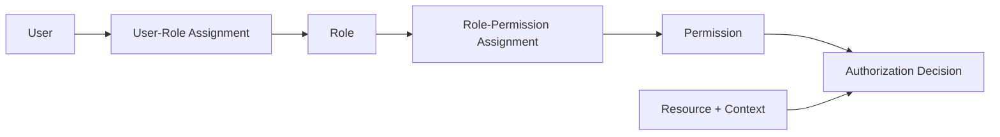
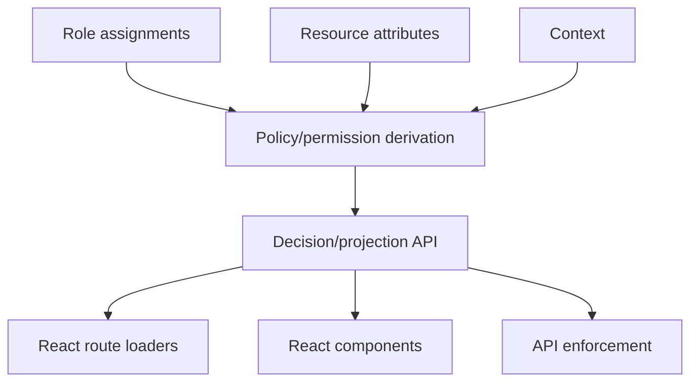
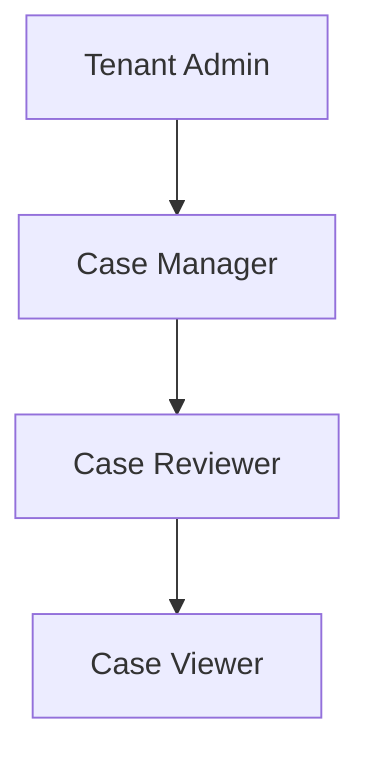
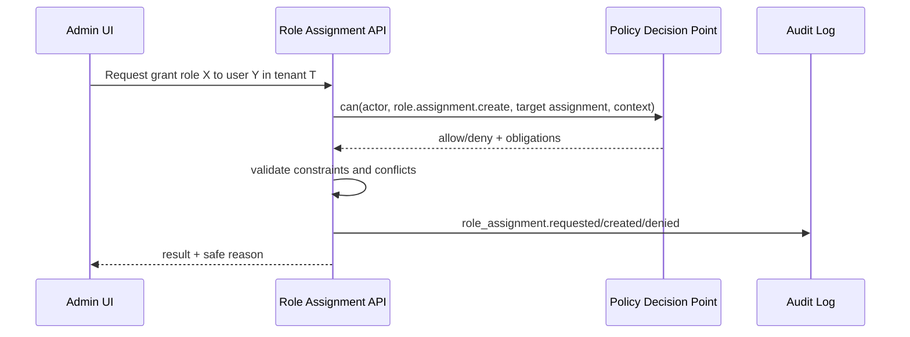

# Part 042 — RBAC in React Apps

RBAC is useful.

RBAC is also frequently abused.

The useful version:

```txt
Roles group permissions around stable responsibilities.
Users receive roles within a scope.
Permissions describe capabilities.
Authorization decisions still evaluate action/resource/context.
```

The abused version:

```tsx
if (user.role === "admin") {
  return <DangerousButton />;
}
```

That code is not automatically wrong because it is in React.

It is wrong because it collapses an authorization decision into a label check.

RBAC in a serious React app is not about sprinkling `isAdmin` checks across components.

It is about designing a clean contract between:

- backend role assignment,
- permission derivation,
- route/data authorization,
- UI exposure,
- tenant scope,
- cache invalidation,
- admin workflows,
- auditability,
- test matrices.

This part builds that model.

---

## 1. RBAC in one sentence

Role-Based Access Control assigns users to roles and grants permissions to roles.

```txt
user -> role -> permission
```

Then authorization uses those permissions as input.

A basic model:



Notice the last arrow.

Permission alone is not always the final answer.

A user may have `case.approve` in principle, but still be denied because:

- the case is not in the user's tenant,
- the case is not in the right workflow state,
- the user created the case and separation-of-duty applies,
- step-up authentication is required,
- the permission only applies to a region/team/project,
- the resource is sealed,
- the grant expired.

RBAC gives structure.

It does not remove the need for resource/context checks.

---

## 2. The canonical RBAC objects

A practical RBAC system has these concepts:

| Object | Meaning |
|---|---|
| User | Human account/principal. |
| Role | Named bundle of responsibility. |
| Permission | Capability to perform an action. |
| User-role assignment | Link between user and role. |
| Role-permission assignment | Link between role and permissions. |
| Session | Active subset of roles used in a login/session. |
| Scope | Boundary where assignment applies: tenant, org, project, region. |
| Constraint | Rule limiting assignment or activation. |

The `session` part is often ignored in web apps.

But it matters.

A user may have multiple roles but only activate some depending on tenant, workspace, or impersonation context.

Example:

```txt
User: Mira
Tenant A: Case Reviewer
Tenant B: Tenant Admin
Current active tenant: Tenant A
Effective roles: Case Reviewer
```

React must not treat all roles across all tenants as globally active.

---

## 3. Role is not identity

Bad model:

```ts
type User = {
  id: string;
  email: string;
  role: "admin" | "user";
};
```

This creates several problems:

- only one role,
- no tenant scope,
- no role version,
- no assignment expiry,
- no separation-of-duty constraints,
- no distinction between identity profile and authorization subject,
- hard migration when roles evolve.

Better:

```ts
type AuthenticatedSubject = {
  id: string;
  email: string;
  activeTenantId: string;
  effectiveRoles: Array<{
    roleKey: string;
    scope: { type: "tenant" | "project" | "region"; id: string };
    assignmentId: string;
    expiresAt?: string;
  }>;
  permissionVersion: string;
};
```

Even better, React often receives derived permissions instead of raw role internals:

```ts
type SessionProjection = {
  user: {
    id: string;
    displayName: string;
  };
  activeTenant: {
    id: string;
    name: string;
  };
  roles: Array<{
    key: string;
    label: string;
    scope: string;
  }>;
  permissions: Record<string, "allow" | "deny">;
  permissionVersion: string;
};
```

The UI may show roles.

The UI should usually decide actions through permissions/decisions.

---

## 4. The `user.role === admin` trap

This pattern spreads quickly:

```tsx
{user.role === "admin" && <AdminPanel />}
```

Then later:

```tsx
{(user.role === "admin" || user.role === "manager") && <ExportButton />}
```

Then:

```tsx
{(user.role === "admin" || user.role === "manager" || user.email.endsWith("@company.com")) && (
  <ExportButton />
)}
```

This is how authorization becomes archaeology.

Problems:

```txt
1. Role semantics are duplicated across components.
2. UI policy drifts from backend policy.
3. New roles require code search across the app.
4. Object-level rules cannot fit.
5. Tenant-scoped roles are mishandled.
6. Negative cases become hard to test.
7. Denial reasons are unavailable.
8. Product teams start asking for roles to solve feature toggles.
```

A better pattern:

```tsx
<Can action="report.export" resource={{ type: "report", id: reportId }}>
  <ExportButton />
</Can>
```

Or:

```tsx
const exportDecision = useCan("report.export", { type: "report", id: reportId });
```

Role remains a backend/admin concept.

Permission becomes the app contract.

Decision becomes the runtime truth.

---

## 5. RBAC belongs behind a permission contract

A React app should not need to know that `case.approve` comes from:

- `senior_case_reviewer`,
- `tenant_admin`,
- temporary emergency role,
- direct grant,
- role hierarchy,
- delegation,
- policy exception.

React needs to know:

```txt
Can this subject approve this case?
If not, why and what recovery exists?
```

A clean boundary:



Frontend contract:

```ts
type PermissionKey =
  | "case.read"
  | "case.create"
  | "case.assign"
  | "case.approve"
  | "case.close"
  | "case.comment.create"
  | "case.evidence.download"
  | "tenant.member.invite"
  | "role.assignment.manage";
```

Role definition remains backend-owned:

```json
{
  "roleKey": "case_reviewer",
  "label": "Case Reviewer",
  "permissions": [
    "case.read",
    "case.comment.create",
    "case.approve"
  ]
}
```

React consumes the resulting projection.

---

## 6. Permission naming

Permission names should be domain capabilities.

Bad:

```txt
showApproveButton
adminPageAccess
canClickBlueButton
modal.case.approve.visible
```

Good:

```txt
case.approve
case.assign
case.evidence.download
case.audit.read
user.invite
role.assignment.manage
report.export
```

A useful convention:

```txt
<resource>.<action>
<resource>.<subresource>.<action>
<domain>.<operation>
```

Examples:

```txt
case.read
case.update
case.penalty.edit
case.evidence.upload
case.evidence.download
case.audit.read
workflow.transition.approve
tenant.member.invite
tenant.sso.configure
role.assignment.create
role.assignment.delete
```

Do not overfit permission names to UI.

The UI will change.

The domain operation should survive.

---

## 7. Role design

Good roles represent stable responsibility.

Examples:

```txt
Tenant Admin
Case Reviewer
Case Manager
Evidence Uploader
Audit Viewer
Billing Admin
Support Agent
Read-only Analyst
```

Bad roles represent temporary UI desires:

```txt
CanSeeNewDashboard
ExportButtonUser
BlueThemeBetaAdmin
ApproveModalEnabled
```

Those are feature flags, experiments, or product configuration.

Not roles.

A role should answer:

```txt
What responsibility does this person have in the organization or workflow?
```

A permission should answer:

```txt
What operation can be performed?
```

A feature flag should answer:

```txt
Is this feature released or configured for this cohort/environment?
```

Do not merge them.

---

## 8. Role hierarchy

Role hierarchy lets one role inherit another.

Example:



This can reduce duplication.

But role hierarchy can also hide dangerous privilege.

If `Tenant Admin` inherits every operational permission, then tenant admins may accidentally gain business-action authority they should not have.

Example mistake:

```txt
Tenant Admin can manage users.
Case Manager can approve cases.
Tenant Admin inherits Case Manager.
Now tenant admin can approve cases.
```

That may violate separation of duties.

Safer design:

```txt
Administrative roles and operational roles are separate.
```

Example:

```txt
Tenant Admin: manage members, configure SSO, manage billing.
Case Manager: assign and approve cases.
Audit Viewer: read audit logs.
```

A person may hold multiple roles, but assignment is explicit and auditable.

---

## 9. Role scope

In SaaS and enterprise apps, role scope is mandatory.

A role assignment must say where it applies.

```ts
type RoleAssignment = {
  userId: string;
  roleKey: string;
  scope:
    | { type: "global" }
    | { type: "tenant"; tenantId: string }
    | { type: "project"; projectId: string }
    | { type: "case"; caseId: string };
  createdAt: string;
  createdBy: string;
  expiresAt?: string;
};
```

Without scope, React will leak permissions across contexts.

Bad cache key:

```ts
["me", "permissions"]
```

Better cache key:

```ts
["me", "permissions", activeTenantId, permissionVersion]
```

For project-scoped roles:

```ts
["project", projectId, "permissions", subjectId, permissionVersion]
```

A user can be:

```txt
Tenant Admin in Tenant A
Read-only Viewer in Tenant B
No member in Tenant C
```

One session.

Different effective roles per tenant.

React must derive UI from the active scope.

---

## 10. Constraints and separation of duties

RBAC becomes powerful when it includes constraints.

Examples:

```txt
A user cannot both create and approve the same case.
A user cannot grant themselves Tenant Admin.
A user cannot hold Billing Admin and Audit Suppressor.
A temporary role expires after 2 hours.
A support agent role requires active ticket context.
A high-risk approval requires MFA.
```

Types of constraints:

| Constraint | Meaning |
|---|---|
| Static separation of duties | User cannot be assigned conflicting roles. |
| Dynamic separation of duties | User cannot activate conflicting roles in same session/action. |
| Prerequisite role | Role requires another role or verified state. |
| Cardinality | Only N users can hold a role. |
| Temporal | Role expires or only applies during time window. |
| Contextual | Role applies only for a support ticket or tenant. |
| Self-service restriction | User cannot grant/revoke their own privileged role. |

React must not enforce these constraints alone.

But React must represent their effects.

Example denial:

```json
{
  "effect": "deny",
  "reason": "separation_of_duties",
  "messageKey": "case.approve.denied.creatorCannotApprove"
}
```

This lets UI give a precise, safe explanation.

---

## 11. RBAC and route metadata

Route metadata can declare required capability.

```ts
export const handle = {
  auth: {
    required: true,
    permission: "tenant.member.invite"
  }
};
```

But do not put role names in route metadata by default.

Weak:

```ts
export const handle = {
  roles: ["admin", "owner"]
};
```

Better:

```ts
export const handle = {
  authz: {
    action: "tenant.member.invite",
    resource: { type: "tenant", source: "activeTenant" }
  }
};
```

Why?

Because later, `tenant.member.invite` might be granted to:

- Tenant Admin,
- Owner,
- delegated HR Manager,
- temporary onboarding specialist,
- break-glass admin.

The route should not need to change.

Policy changes should happen in policy/role configuration, not in random route files.

---

## 12. RBAC and component-level UI

A permission-aware component should consume a decision.

```tsx
type CanProps = {
  action: PermissionKey;
  resource?: ResourceRef;
  children: React.ReactNode;
  fallback?: React.ReactNode;
};

function Can({ action, resource, children, fallback = null }: CanProps) {
  const decision = useCan(action, resource);

  if (decision.status !== "ready") return fallback;
  if (decision.value.effect !== "allow") return fallback;

  return <>{children}</>;
}
```

Usage:

```tsx
<Can action="case.approve" resource={{ type: "case", id: case.id }}>
  <ApproveCaseButton caseId={case.id} />
</Can>
```

For disabled actions with reasons:

```tsx
function PermissionedButton({ action, resource, children, ...buttonProps }: Props) {
  const decision = useCan(action, resource);

  if (decision.status !== "ready") {
    return null;
  }

  if (decision.value.effect === "deny") {
    return (
      <Button disabled title={mapReason(decision.value.reason)} {...buttonProps}>
        {children}
      </Button>
    );
  }

  return <Button {...buttonProps}>{children}</Button>;
}
```

Whether to hide or disable depends on product/security context.

Hide when:

```txt
the user should not know the capability exists,
the action is irrelevant,
it would leak sensitive workflow.
```

Disable when:

```txt
the action is visible but unavailable,
the user needs explanation,
request-access workflow exists,
workflow state explains availability.
```

---

## 13. Permission projection from `/session` or `/me`

For global/navigation permissions, a session endpoint may return projection.

```json
{
  "user": {
    "id": "u_123",
    "displayName": "Mira"
  },
  "activeTenant": {
    "id": "t_001",
    "name": "Acme"
  },
  "roles": [
    { "key": "case_reviewer", "label": "Case Reviewer", "scope": "tenant:t_001" }
  ],
  "permissions": {
    "case.list": "allow",
    "case.create": "deny",
    "tenant.member.invite": "deny"
  },
  "permissionVersion": "t_001-membership-v42"
}
```

This is useful for:

- sidebar,
- route coarse access,
- command palette,
- account menu,
- dashboard card visibility.

But resource-specific screens need resource-specific decisions.

Example:

```http
GET /api/cases/case_123
```

Response:

```json
{
  "case": {
    "id": "case_123",
    "status": "UNDER_REVIEW"
  },
  "permissions": {
    "case.read": { "effect": "allow" },
    "case.approve": { "effect": "allow" },
    "case.assign": {
      "effect": "deny",
      "reason": "insufficient_permission"
    }
  }
}
```

Do not use global role alone to decide per-case actions.

---

## 14. Admin UX for RBAC

RBAC is not just runtime checks.

It also needs administration.

A serious role admin UI should show:

```txt
role name and purpose
permissions included
scopes where role can be assigned
who currently has the role
who granted the role
when it was granted
when it expires
approval status
risk level
conflicting roles
blast radius preview
audit history
```

Before saving a role change, show a diff:

```txt
Added permissions:
+ case.approve
+ case.evidence.download

Removed permissions:
- case.comment.create

Affected users:
37 users across 4 tenants

High-risk change:
case.evidence.download exposes restricted files
```

Do not let admin users edit JSON blindly unless the organization is small and trusted.

Role editing is security-sensitive product design.

---

## 15. Role assignment workflow

Granting a role is itself an authorization-sensitive action.

Questions:

```txt
Who can grant this role?
Can they grant it in this tenant?
Can they grant it to themselves?
Does the role require approval?
Does the role expire?
Does the grant require MFA?
Does the user already have a conflicting role?
Is the target user eligible?
Is the grant audited?
```

Flow:



React should not directly mutate role state optimistically without backend confirmation.

A role grant is not a normal preference toggle.

---

## 16. Role explosion

Role explosion happens when every exception becomes a role.

Symptoms:

```txt
AdminEastRegionReadOnlyTemporaryExceptBilling
SeniorReviewerCanExportButNotApprove
ManagerWithoutEvidenceDownload
CaseReviewerLevel2BetaDashboard
```

Causes:

- using roles for object-specific access,
- using roles for feature flags,
- using roles for workflow state,
- using roles for temporary exceptions,
- no permission granularity,
- no scoped grants,
- no ABAC/ReBAC/ACL support.

Fixes:

```txt
1. Keep roles tied to stable responsibilities.
2. Add permission granularity.
3. Add scope to assignments.
4. Use ABAC for attribute/context rules.
5. Use ReBAC/ACL for collaboration/sharing.
6. Use feature flags for release configuration.
7. Use temporary grants for exceptions.
```

In React, role explosion appears as conditional sprawl.

```tsx
if (
  user.roles.includes("admin") ||
  user.roles.includes("admin_east") ||
  user.roles.includes("admin_east_readonly") ||
  user.roles.includes("support_level_2")
) {
  // nobody knows why this is here
}
```

Replace with:

```tsx
const canExport = useCan("report.export", reportResource);
```

---

## 17. RBAC and feature flags

Feature flags are not permissions.

Permission says:

```txt
This subject is allowed to perform this operation.
```

Feature flag says:

```txt
This feature is enabled for this environment/user/cohort/tenant.
```

Both may be required.

Example:

```txt
Feature flag: advanced_exports is enabled for tenant Acme.
Permission: user can report.export.
Resource policy: report contains no sealed data.
```

React condition:

```tsx
if (flags.advancedExports && decision.effect === "allow") {
  return <AdvancedExportButton />;
}
```

Backend condition:

```txt
flag enabled AND authorization allowed
```

Do not ship backend enforcement only as a frontend flag.

Do not grant access only because a flag is enabled.

---

## 18. RBAC and tenant switching

Tenant switch changes effective roles.

On tenant switch:

```txt
cancel in-flight tenant-scoped requests
clear route loader data
invalidate TanStack Query tenant keys
reload /session or /me projection
clear permission cache
close sensitive modals
reset selected rows/actions
unsubscribe from tenant WebSocket channels
navigate to safe tenant landing page
```

Example:

```ts
async function switchTenant(nextTenantId: string) {
  authzStore.clear();
  queryClient.cancelQueries();
  queryClient.removeQueries({ queryKey: ["tenant"] });

  await api.post("/session/active-tenant", { tenantId: nextTenantId });

  const session = await queryClient.fetchQuery({
    queryKey: ["session", nextTenantId],
    queryFn: fetchSession
  });

  router.navigate(`/${session.activeTenant.slug}/dashboard`, { replace: true });
}
```

The exact code depends on architecture.

The invariant does not:

```txt
Never reuse old tenant permission projection after tenant switch.
```

---

## 19. RBAC and impersonation

Impersonation changes effective subject.

A safe impersonation session needs:

```txt
actor user: the admin/support person
subject user: the person being impersonated
effective roles: constrained by impersonation policy
visible banner: always
exit action: always visible
audit: every action includes actor and subject
restriction: no sensitive self-service operations unless explicitly allowed
```

Example subject:

```ts
type ImpersonatedSubject = {
  type: "impersonated-user";
  actorUserId: string;
  effectiveUserId: string;
  tenantId: string;
  constraints: ["no_billing_changes", "no_role_grants"];
};
```

React must not show the app as if the admin simply became the user.

That hides accountability.

Every permission decision should know impersonation is active.

---

## 20. Cache invalidation for RBAC

Role changes must invalidate permission state.

Events:

```txt
role assigned
role revoked
role definition changed
role permission added/removed
membership removed
tenant switched
session refreshed with changed claims
impersonation started/exited
admin changed user's role in another tab
policy version changed
```

Possible mechanisms:

- short TTL on `/session`,
- permission version in session projection,
- server-sent invalidation event,
- WebSocket event,
- BroadcastChannel event between tabs,
- reload on 403 after stale allow,
- revalidate route loader after mutation.

React can maintain an authz epoch:

```ts
let authzEpoch = 0;

function bumpAuthzEpoch(reason: string) {
  authzEpoch += 1;
  queryClient.invalidateQueries({ queryKey: ["permissions"] });
  broadcast.postMessage({ type: "authz:changed", authzEpoch, reason });
}
```

Queries include the epoch:

```ts
["permissions", activeTenantId, authzEpoch]
```

Use carefully.

Do not let epoch become a substitute for server-side enforcement.

---

## 21. Migration from role checks to permission checks

Most legacy React apps start with role checks.

Migration path:

```txt
1. Inventory all role checks.
2. Group them by domain operation.
3. Name permissions for those operations.
4. Add backend permission projection.
5. Replace component role checks with useCan/Can.
6. Add backend enforcement if missing.
7. Add test matrix for each permission.
8. Remove dead role-specific UI conditionals.
9. Add lint/static checks to prevent new role checks.
```

Inventory example:

```bash
grep -R "role" src/
grep -R "isAdmin" src/
grep -R "roles.includes" src/
```

Migration mapping:

| Old check | New permission |
|---|---|
| `role === "admin"` around user invite | `tenant.member.invite` |
| `role === "manager"` around approve | `case.approve` |
| `role === "auditor"` around audit tab | `case.audit.read` |
| `role === "support"` around impersonation | `support.impersonate` |

Do not do a mechanical rename from role to permission.

Redesign around operations.

---

## 22. Testing RBAC in React

Test both projection and enforcement behavior.

Component matrix:

| Effective permissions | Expected UI |
|---|---|
| no `case.approve` | Approve button hidden/disabled |
| `case.approve` allowed | Approve button visible |
| `case.approve` denied step-up | Step-up prompt visible |
| permission loading | no protected flash |
| permission error | safe disabled/fallback |

Route matrix:

| Role/permission | Route | Expected |
|---|---|---|
| anonymous | `/admin/users` | login redirect |
| authenticated no permission | `/admin/users` | 403/no access |
| tenant admin | `/admin/users` | allow |
| tenant admin wrong tenant | `/tenant-b/admin/users` | deny |

Mutation matrix:

| UI thought | Backend result | Expected UI |
|---|---|---|
| allow | allow | success |
| allow | 403 stale permission | rollback + revalidate |
| loading | submit attempted | block or recheck |
| deny | user hacks request | backend denies |

Use fixtures that reflect real role assignments.

Bad test fixture:

```ts
const user = { role: "admin" };
```

Better:

```ts
const session = buildSession({
  activeTenantId: "t_001",
  roles: ["case_reviewer"],
  permissions: {
    "case.read": "allow",
    "case.approve": "allow",
    "tenant.member.invite": "deny"
  },
  permissionVersion: "v42"
});
```

---

## 23. Static guardrails

Prevent old patterns from returning.

Examples:

```txt
Disallow user.role checks outside authz adapter.
Disallow roles.includes in components.
Require permission key constants.
Require route metadata for protected route groups.
Require tests for new permissions.
Require backend enforcement reference in PR template.
```

ESLint custom rule idea:

```txt
no-direct-role-check-in-ui
```

Allowed:

```ts
// src/authz/roleDisplay.ts
formatRoleLabel(roleKey)
```

Disallowed:

```tsx
// src/features/cases/ApproveButton.tsx
user.roles.includes("case_manager")
```

Roles may still be displayed.

Roles should not be scattered as authorization logic.

---

## 24. Production checklist

Before using RBAC in a React feature, ask:

```txt
[ ] Is the role scoped to tenant/project/global?
[ ] Is the UI checking permission/decision instead of raw role?
[ ] Is the backend enforcing the same operation?
[ ] Is the permission name domain-oriented?
[ ] Does the decision include resource/context when needed?
[ ] Are role assignments auditable?
[ ] Are role changes invalidating permission cache?
[ ] Are separation-of-duty constraints represented?
[ ] Is impersonation handled explicitly?
[ ] Are denial states tested?
[ ] Are tenant switches clearing old projections?
[ ] Are admin role changes protected by MFA/approval if high risk?
[ ] Is role hierarchy intentional and reviewed?
[ ] Are feature flags separate from permissions?
```

If RBAC is not scoped, audited, invalidated, and tested, it is only a naming convention.

---

## 25. The mental compression

RBAC is a way to manage permissions.

It is not the whole authorization system.

Keep this model:

```txt
Users get roles within scopes.
Roles grant permissions.
Permissions describe capabilities.
Decisions evaluate permissions plus resource/context.
React consumes decisions for exposure.
Backend enforces decisions for reads/writes.
Role changes invalidate permission state.
Admin workflows audit every grant/revoke.
```

When RBAC is clean, React code becomes simpler.

Not because security became simple.

Because policy complexity moved to the right boundary.

The next parts will build on this:

```txt
permission-based UI,
ACL and object-level permission,
ABAC,
ReBAC/Zanzibar-style permissions,
policy as data vs policy as code,
frontend permission contracts.
```

RBAC is the first layer.

Do not make it carry every authorization problem.

---

## Sources

- NIST RBAC model publications — users, roles, permissions, sessions, hierarchies, and constraints.
- OWASP Authorization Cheat Sheet — deny-by-default, validate permissions on every request, least privilege, audit authorization events.
- OWASP Top 10 2021 A01 Broken Access Control — failures from missing/weak access control and violation of least privilege.
- NIST SP 800-162 — useful contrast with ABAC for context/attribute-driven decisions.
