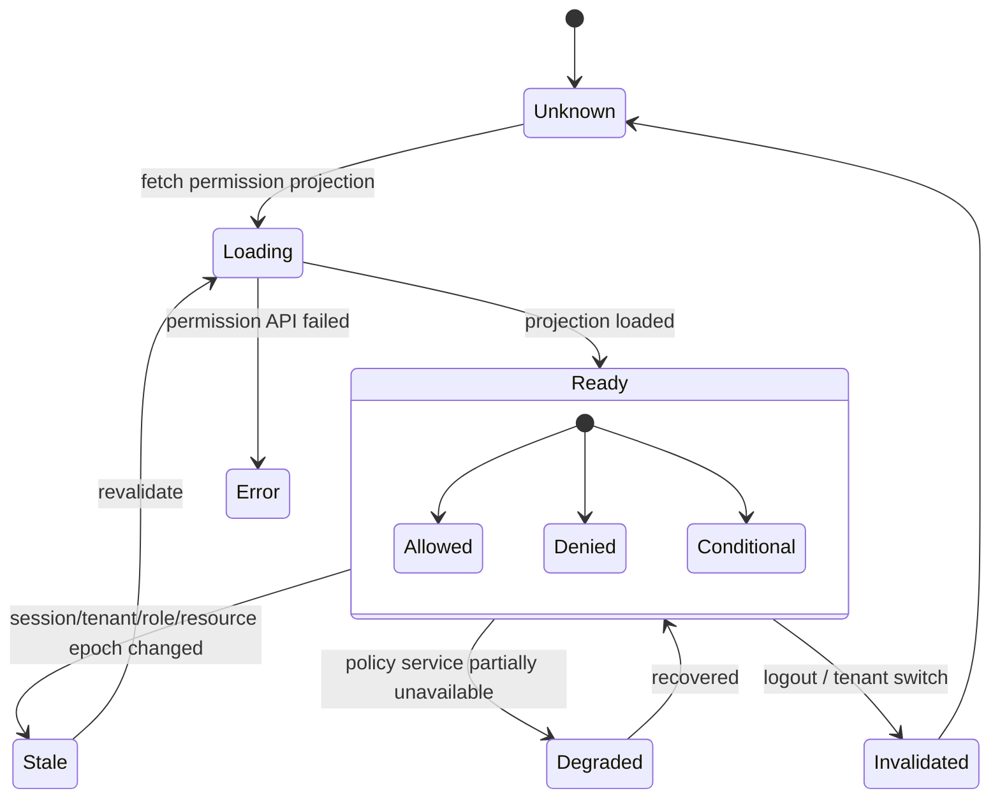
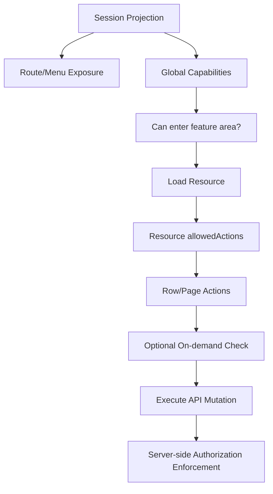

# Part 043 — Permission-based UI

A permission-based UI is not a secure system by itself.

It is a projection of a secure system.

The backend still enforces authorization. The API still checks every request. The policy engine still decides. The database still scopes data. The audit layer still records decisions.

React decides something narrower but still important:

```txt
Given the current auth projection,
what should the user be able to see, attempt, understand, and recover from?
```

A weak React app asks:

```ts
user.role === "admin"
```

A serious React app asks:

```ts
can("case.approve", caseResource)
can("case.assign", caseResource)
can("case.comment.create", caseResource)
can("case.penalty.edit", caseResource)
```

That difference looks small.

It is not.

Role checks couple UI behavior to organizational labels. Permission checks couple UI behavior to product capabilities.

Roles are about assignment.

Permissions are about capability.

React should render capabilities, not job titles.

---

## 1. The core rule

The first invariant:

```txt
Frontend permission logic controls exposure.
Backend authorization controls access.
```

Do not weaken that sentence.

A hidden button does not protect an endpoint.

A disabled menu item does not protect a resource.

A removed route does not protect data.

A React guard does not prevent a forged HTTP request.

But a good permission-based UI still matters because it prevents users from being invited into actions they cannot complete, reduces accidental violations, improves usability, reduces support noise, and makes authorization behavior explainable.

Think of permission-based UI as the product-facing surface of authorization.

Not the lock.

The signage, doors, disabled controls, warning labels, and guided paths.

The lock remains server-side.

---

## 2. What permission-based UI solves

Permission-based UI solves product exposure problems.

| Problem | Without permission-based UI | With permission-based UI |
|---|---|---|
| Hidden capability | Users see actions they cannot execute | Actions are hidden, disabled, or explained |
| Confusing denial | User clicks then gets unexplained `403` | UI explains why action is unavailable |
| Role coupling | UI checks `admin`, `manager`, `reviewer` everywhere | UI checks stable capabilities |
| Tenant leakage | Menu shows resources from wrong org | UI is scoped to active tenant/session projection |
| Stale permission | Old privilege stays visible after role change | Permission cache invalidates on session/tenant/role epoch |
| List actions | Every row shows same buttons | Row-level allowed actions drive rendering |
| Workflow confusion | Actions appear in invalid state | Resource state participates in permission decision |
| Bulk ambiguity | Bulk action appears even when some rows are ineligible | UI separates all/some/none eligibility |

A good UI does not only ask:

```txt
Can this user do X?
```

It also asks:

```txt
Should the user see X?
If not, should we hide it, disable it, or explain it?
Can the user request access?
Can this denial be remediated?
Is the denial due to role, state, tenant, ownership, policy, expiry, or assurance level?
```

The permission decision may be binary.

The product experience is not.

---

## 3. Permission vocabulary is a product API

Permissions are not implementation details.

They are a contract between product, backend, frontend, support, audit, and security.

A permission name should describe a capability in the domain.

Good:

```txt
case.read
case.create
case.assign
case.approve
case.reject
case.penalty.edit
case.evidence.upload
case.evidence.delete
case.audit.view
user.invite
user.role.assign
```

Weak:

```txt
admin
manager
canClickApproveButton
showAdminPanel
isCaseApprover
level3
superUser
```

The difference:

| Weak name | Why it fails | Better name |
|---|---|---|
| `admin` | Role, not capability | `user.manage`, `case.override`, `audit.view` |
| `canClickApproveButton` | UI-specific | `case.approve` |
| `showAdminPanel` | Navigation-specific | `admin.console.view` |
| `level3` | Meaning hidden in tribal knowledge | `case.penalty.approve_high_value` |
| `superUser` | Impossible to reason about | Explicit capabilities |

The permission namespace should be stable even when the UI changes.

A button might move from toolbar to command palette.

A page might split into tabs.

A workflow might become multi-step.

The permission remains a domain capability.

---

## 4. Permission naming rules

A practical naming shape:

```txt
<resource>.<action>
<resource>.<field>.<action>
<resource>.<subresource>.<action>
<domain>.<resource>.<action>
```

Examples:

```txt
case.read
case.update
case.assign
case.transition.approve
case.transition.reject
case.penalty.read
case.penalty.edit
case.evidence.upload
case.evidence.delete
case.audit.view
org.member.invite
org.member.remove
org.role.assign
```

Avoid UI verbs:

```txt
button.show
modal.open
tab.visible
link.click
```

Use domain verbs:

```txt
case.approve
case.assign
case.audit.view
```

UI elements consume permissions. They should not define them.

---

## 5. Capability shape: boolean is not enough

The simplest permission result is boolean:

```ts
const canApprove = can("case.approve", caseResource);
```

Useful, but too poor for serious systems.

A production decision often needs:

```ts
type PermissionDecision =
  | {
      allowed: true;
      reason?: string;
      source: "session" | "resource" | "policy";
      evaluatedAt: string;
    }
  | {
      allowed: false;
      reason: PermissionDenialReason;
      message: string;
      remediable: boolean;
      requestAccess?: {
        workflow: "access-request" | "step-up" | "tenant-switch";
        target: string;
      };
      evaluatedAt: string;
    };

type PermissionDenialReason =
  | "anonymous"
  | "session_expired"
  | "tenant_mismatch"
  | "missing_permission"
  | "resource_state"
  | "ownership_required"
  | "assurance_too_low"
  | "separation_of_duties"
  | "policy_temporarily_unavailable"
  | "unknown";
```

A boolean tells React whether to render.

A decision object tells React how to render.

For example:

| Decision | UI behavior |
|---|---|
| allowed | Enable action |
| missing permission | Hide or disable with explanation |
| resource state | Disable and show state-specific reason |
| assurance too low | Show action but trigger step-up auth |
| tenant mismatch | Redirect or show tenant switch prompt |
| session expired | Prompt re-auth |
| policy unavailable | Show degraded state, block mutation |

This is why permission contract design matters.

A permission-based UI is not only about `if` statements.

It is about mapping authorization decisions into safe product states.

---

## 6. The permission state machine

React permission state has more than two states.



The dangerous bug is treating `unknown` as `allowed`.

The safe default:

```txt
unknown => do not expose privileged actions
loading => do not expose privileged actions
error => do not expose privileged actions
stale => do not expose privileged actions until revalidated, unless explicitly safe read-only fallback
```

Deny-by-default in UI means:

```ts
function isAllowed(decision: PermissionDecision | undefined): boolean {
  return decision?.allowed === true;
}
```

Not:

```ts
// Dangerous: undefined becomes allowed.
function isAllowed(decision: PermissionDecision | undefined): boolean {
  return decision?.allowed !== false;
}
```

Unknown is not permission.

Unknown is absence of a trusted projection.

---

## 7. Where permissions come from

There are three common projection strategies.

### 7.1 Session-level permission projection

The session endpoint returns global or tenant-scoped capabilities:

```json
{
  "user": {
    "id": "u_123",
    "displayName": "Ari"
  },
  "tenant": {
    "id": "t_001",
    "slug": "acme"
  },
  "permissions": [
    "case.read",
    "case.create",
    "case.assign",
    "case.audit.view"
  ],
  "permissionEpoch": "perm_2026_07_08_001"
}
```

Good for:

- route/menu exposure,
- top-level navigation,
- broad feature capabilities,
- static capability checks.

Weak for:

- per-object access,
- workflow state checks,
- ownership-specific decisions,
- field-level decisions,
- row-level table actions.

### 7.2 Resource-level allowed actions

The API returns allowed actions beside each resource.

```json
{
  "id": "case_900",
  "status": "UNDER_REVIEW",
  "assigneeId": "u_123",
  "allowedActions": [
    "case.read",
    "case.comment.create",
    "case.transition.approve",
    "case.transition.reject"
  ]
}
```

Good for:

- detail pages,
- table rows,
- workflow action buttons,
- resource state dependent actions,
- object-level authorization projection.

Weak for:

- global navigation,
- command palette search,
- pre-route checks before resource load.

### 7.3 On-demand permission check

The client asks a permission API:

```http
POST /api/authorization/check
Content-Type: application/json

{
  "action": "case.transition.approve",
  "resource": {
    "type": "case",
    "id": "case_900"
  },
  "context": {
    "tenantId": "t_001"
  }
}
```

Response:

```json
{
  "allowed": false,
  "reason": "separation_of_duties",
  "message": "You cannot approve a case you investigated.",
  "remediable": false,
  "evaluatedAt": "2026-07-08T10:00:00+07:00"
}
```

Good for:

- expensive or conditional checks,
- step-up decisions,
- access request previews,
- admin consoles,
- bulk action eligibility.

Weak for:

- every button render if called naively,
- high-frequency table rendering,
- offline/degraded behavior.

Most serious apps use all three.

---

## 8. The projection hierarchy

A practical hierarchy:



React should not invent object-level permission from global permission.

This is a common bug:

```ts
// Wrong mental model.
const canApproveAnyCase = session.permissions.includes("case.approve");
```

Better:

```ts
const canEnterCaseReviewArea = session.permissions.includes("case.review.view");
const canApproveThisCase = case.allowedActions.includes("case.transition.approve");
```

Global permission answers:

```txt
Can this user generally access this capability area?
```

Resource permission answers:

```txt
Can this user do this action on this specific object now?
```

Do not collapse them.

---

## 9. A minimal permission store

A minimal client-side permission store should be boring.

Boring is good.

```ts
type Permission = string;

type AuthProjection = {
  user: {
    id: string;
    displayName: string;
  };
  tenant: {
    id: string;
    slug: string;
  };
  permissions: Permission[];
  permissionEpoch: string;
  sessionEpoch: string;
};

type PermissionStore = {
  status: "unknown" | "loading" | "ready" | "stale" | "error";
  projection?: AuthProjection;
};
```

Then derive a set:

```ts
function createPermissionSet(projection: AuthProjection | undefined): ReadonlySet<Permission> {
  return new Set(projection?.permissions ?? []);
}
```

And keep the permission check strict:

```ts
function hasPermission(
  projection: AuthProjection | undefined,
  permission: Permission
): boolean {
  if (!projection) return false;
  return projection.permissions.includes(permission);
}
```

Never encode fallback permission in the UI store.

Fallback belongs in policy, not in client-side convenience helpers.

---

## 10. Designing `can()`

A useful `can()` supports both global and resource-level checks.

```ts
type ResourceLike = {
  type: string;
  id?: string;
  tenantId?: string;
  allowedActions?: string[];
};

type CanInput = {
  action: string;
  resource?: ResourceLike;
};

type CanResult = {
  allowed: boolean;
  source: "session" | "resource" | "none";
  reason?: string;
};

function can(
  projection: AuthProjection | undefined,
  input: CanInput
): CanResult {
  if (!projection) {
    return {
      allowed: false,
      source: "none",
      reason: "permission_projection_missing",
    };
  }

  if (input.resource?.tenantId && input.resource.tenantId !== projection.tenant.id) {
    return {
      allowed: false,
      source: "none",
      reason: "tenant_mismatch",
    };
  }

  if (input.resource?.allowedActions) {
    return {
      allowed: input.resource.allowedActions.includes(input.action),
      source: "resource",
      reason: input.resource.allowedActions.includes(input.action)
        ? undefined
        : "resource_action_not_allowed",
    };
  }

  return {
    allowed: projection.permissions.includes(input.action),
    source: "session",
    reason: projection.permissions.includes(input.action)
      ? undefined
      : "session_permission_missing",
  };
}
```

This intentionally prioritizes resource-level allowed actions when present.

Why?

Because resource-level decisions are more specific.

If the session says the user can generally approve cases, but this case is already closed, assigned to another unit, or investigated by the same user, the resource decision should deny.

Specific beats broad.

---

## 11. `useCan()` should not hide too much

A hook is convenient:

```ts
function useCan(action: string, resource?: ResourceLike): CanResult {
  const projection = useAuthProjection();

  return useMemo(
    () => can(projection, { action, resource }),
    [projection?.permissionEpoch, projection?.tenant.id, action, resource?.id, resource?.allowedActions]
  );
}
```

But hooks become dangerous when they hide policy complexity.

Avoid this:

```ts
const canApprove = useCanApproveCase(caseId);
```

Unless `useCanApproveCase` is a very thin domain helper.

Prefer transparent capability checks:

```ts
const canApprove = useCan("case.transition.approve", case);
```

Domain-specific wrappers are fine when they improve readability:

```ts
function useCanApproveCase(caseRecord: CaseSummary) {
  return useCan("case.transition.approve", caseRecord);
}
```

But they should not secretly reconstruct authorization logic in React.

---

## 12. The `Can` component pattern

A declarative wrapper is useful for small areas.

```tsx
type CanProps = {
  action: string;
  resource?: ResourceLike;
  children: React.ReactNode;
  fallback?: React.ReactNode;
};

export function Can({ action, resource, children, fallback = null }: CanProps) {
  const decision = useCan(action, resource);

  if (!decision.allowed) return <>{fallback}</>;

  return <>{children}</>;
}
```

Usage:

```tsx
<Can action="case.transition.approve" resource={caseRecord}>
  <ApproveCaseButton caseId={caseRecord.id} />
</Can>
```

This pattern is good for:

- hiding optional actions,
- route sidebar items,
- toolbar buttons,
- small feature sections.

It is weaker for:

- complex disabled/explained states,
- bulk actions,
- form field-level decisions,
- transitions requiring step-up auth,
- cases where you need telemetry on denial.

For those, use the decision object directly.

---

## 13. Hide, disable, or explain?

This is product design, but it has security implications.

| UI treatment | Use when | Avoid when |
|---|---|---|
| Hide | User should not know capability exists, or action is irrelevant | Denial needs explanation or access request path |
| Disable | Capability exists but currently unavailable | It leaks sensitive existence or causes clutter |
| Explain | User can remediate or needs policy clarity | Reason reveals sensitive data |
| Redirect | Route not accessible or session invalid | User needs contextual denial page |
| Step-up | User has permission but current assurance is too low | Permission is actually missing |

Examples:

```txt
Hide “Delete tenant” from regular users.
Disable “Approve” on a closed case with reason “Closed cases cannot be approved.”
Show “Request access” for a report the user may legitimately need.
Trigger step-up auth for changing payout bank details.
Return 404-like not-found for objects whose existence must not be disclosed.
```

Do not blindly hide everything.

Do not blindly disable everything.

Do not explain everything.

The right behavior depends on whether the user is allowed to know the action/resource exists.

---

## 14. Permission-aware buttons

A serious button component should understand permission state.

```tsx
type AuthorizedButtonProps = {
  action: string;
  resource?: ResourceLike;
  children: React.ReactNode;
  onClick: () => void;
  denialMode?: "hide" | "disable" | "explain";
};

function AuthorizedButton({
  action,
  resource,
  children,
  onClick,
  denialMode = "disable",
}: AuthorizedButtonProps) {
  const decision = useCan(action, resource);

  if (!decision.allowed && denialMode === "hide") {
    return null;
  }

  if (!decision.allowed && denialMode === "explain") {
    return (
      <div>
        <button type="button" disabled>
          {children}
        </button>
        <p role="note">You do not have access to perform this action.</p>
      </div>
    );
  }

  return (
    <button type="button" disabled={!decision.allowed} onClick={onClick}>
      {children}
    </button>
  );
}
```

But do not stop there.

A production version should also support:

- pending permission projection,
- denial reason,
- access request workflow,
- step-up workflow,
- audit/telemetry event when a denied action is visible,
- accessible labels for disabled controls,
- tooltip only as enhancement, not sole explanation.

Disabled buttons can be inaccessible if the explanation exists only in a hover tooltip.

Security UX must still be accessible UX.

---

## 15. Permission-aware menus

Menus are easy to get wrong.

A naive menu:

```ts
const menu = [
  { label: "Dashboard", href: "/dashboard" },
  { label: "Users", href: "/admin/users", role: "admin" },
  { label: "Audit", href: "/audit", role: "admin" },
];
```

A capability menu:

```ts
type MenuItem = {
  label: string;
  href: string;
  permission?: string;
  children?: MenuItem[];
};

const menu: MenuItem[] = [
  { label: "Dashboard", href: "/dashboard" },
  { label: "Cases", href: "/cases", permission: "case.read" },
  { label: "Users", href: "/admin/users", permission: "user.manage" },
  { label: "Audit", href: "/audit", permission: "audit.view" },
];
```

Filter recursively:

```ts
function filterMenu(items: MenuItem[], projection: AuthProjection | undefined): MenuItem[] {
  return items
    .map((item) => {
      const children = item.children
        ? filterMenu(item.children, projection)
        : undefined;

      const allowed = !item.permission || hasPermission(projection, item.permission);

      if (!allowed && (!children || children.length === 0)) {
        return null;
      }

      return { ...item, children };
    })
    .filter((item): item is MenuItem => item !== null);
}
```

Important invariant:

```txt
Menu visibility must not be the only route protection.
```

Users can type URLs.

Tests can call routes.

Attackers can forge requests.

Navigation filtering is exposure control only.

---

## 16. Permission-aware route metadata

From Part 039, route metadata can declare required capability.

```ts
export const handle = {
  auth: {
    required: true,
    permission: "case.read",
  },
};
```

Then menu rendering, breadcrumb rendering, and route loader checks can use the same metadata.

```ts
type RouteAuthHandle = {
  auth?: {
    required?: boolean;
    permission?: string;
  };
};
```

But be careful.

Route-level permission is coarse.

It answers:

```txt
Can the user enter this area?
```

It does not answer:

```txt
Can the user approve this case?
Can the user edit this field?
Can the user delete this evidence file?
```

Use route permissions for entry.

Use resource allowed actions for object behavior.

Use server-side checks for actual access.

---

## 17. Row-level allowed actions

Tables expose permission problems quickly.

A naive table renders the same action buttons for every row.

```tsx
{cases.map((caseRecord) => (
  <tr key={caseRecord.id}>
    <td>{caseRecord.reference}</td>
    <td>
      <ApproveButton caseId={caseRecord.id} />
      <RejectButton caseId={caseRecord.id} />
    </td>
  </tr>
))}
```

A permission-aware table uses row-level allowed actions.

```tsx
{cases.map((caseRecord) => {
  const canApprove = can(projection, {
    action: "case.transition.approve",
    resource: caseRecord,
  });

  const canReject = can(projection, {
    action: "case.transition.reject",
    resource: caseRecord,
  });

  return (
    <tr key={caseRecord.id}>
      <td>{caseRecord.reference}</td>
      <td>{caseRecord.status}</td>
      <td>
        <button disabled={!canApprove.allowed}>Approve</button>
        <button disabled={!canReject.allowed}>Reject</button>
      </td>
    </tr>
  );
})}
```

The API response shape:

```ts
type CaseRow = {
  id: string;
  reference: string;
  status: "DRAFT" | "UNDER_REVIEW" | "APPROVED" | "REJECTED";
  tenantId: string;
  allowedActions: string[];
};
```

This avoids reconstructing resource-state policy in React.

React receives the projection.

The server remains the authority.

---

## 18. Bulk actions need three-state eligibility

Bulk actions are not boolean.

For selected rows, eligibility can be:

```txt
none eligible
some eligible
all eligible
unknown
```

Example:

```ts
type BulkEligibility = {
  eligibleIds: string[];
  ineligibleIds: string[];
  unknownIds: string[];
};

function computeBulkEligibility(
  selected: CaseRow[],
  action: string,
  projection: AuthProjection | undefined
): BulkEligibility {
  const result: BulkEligibility = {
    eligibleIds: [],
    ineligibleIds: [],
    unknownIds: [],
  };

  for (const item of selected) {
    if (!item.allowedActions) {
      result.unknownIds.push(item.id);
      continue;
    }

    const decision = can(projection, { action, resource: item });

    if (decision.allowed) result.eligibleIds.push(item.id);
    else result.ineligibleIds.push(item.id);
  }

  return result;
}
```

UI behavior:

| Eligibility | UI behavior |
|---|---|
| all eligible | Enable bulk action |
| some eligible | Allow action only on eligible rows, show summary |
| none eligible | Disable, explain why |
| unknown | Revalidate or require server preview |

Never assume all selected rows are eligible because the first one is.

Bulk authorization bugs are common because developers test the happy path with homogeneous rows.

Production data is not homogeneous.

---

## 19. Field-level permission

Field-level permission is where UI authorization becomes subtle.

A user might be able to read a case but not see:

- confidential informant name,
- penalty recommendation,
- internal notes,
- legal risk rating,
- audit-only metadata,
- personally identifiable information,
- sealed evidence.

A field projection can look like:

```json
{
  "id": "case_900",
  "reference": "CASE-2026-000900",
  "status": "UNDER_REVIEW",
  "fields": {
    "penaltyAmount": {
      "value": 5000000,
      "access": "read-write"
    },
    "internalNotes": {
      "access": "redacted",
      "reason": "internal_notes_permission_missing"
    }
  }
}
```

React should not fetch sensitive fields and merely hide them.

If the user cannot read a field, the API should not send the field value.

UI hiding after data arrival is exposure control too late.

The correct hierarchy:

```txt
Server filters sensitive data.
React renders the filtered projection.
```

---

## 20. Disabled is not secure

A disabled button prevents a normal click.

It does not prevent:

- direct API call,
- browser devtools mutation,
- replayed request,
- cURL request,
- automation script,
- malicious extension,
- stale client bundle.

This should be obvious, but many auth bugs start with:

```tsx
<button disabled={!isAdmin}>Delete</button>
```

and end with an endpoint that trusts the UI.

The server endpoint must still check:

```txt
Can this subject delete this exact resource under this context?
```

The UI check reduces user confusion.

The server check enforces policy.

---

## 21. Permission cache invalidation

A permission-based UI is only as correct as its invalidation model.

Permissions change when:

- user logs in,
- user logs out,
- session refreshes,
- tenant switches,
- role assignment changes,
- group membership changes,
- object ownership changes,
- workflow state changes,
- emergency access expires,
- impersonation starts or ends,
- policy version changes,
- access request is approved/revoked,
- resource data is reloaded.

Use epochs.

```ts
type AuthProjection = {
  sessionEpoch: string;
  permissionEpoch: string;
  tenantEpoch: string;
  policyEpoch?: string;
};
```

A query key can include the relevant epoch:

```ts
const queryKey = [
  "case",
  caseId,
  auth.tenant.id,
  auth.permissionEpoch,
  auth.policyEpoch,
];
```

When permission epoch changes:

```ts
queryClient.invalidateQueries({ queryKey: ["case"] });
queryClient.invalidateQueries({ queryKey: ["case-list"] });
queryClient.invalidateQueries({ queryKey: ["navigation"] });
```

When tenant changes:

```ts
queryClient.clear();
```

Tenant switch is not ordinary cache invalidation.

It is a trust boundary transition.

Clear aggressively.

---

## 22. Permission drift

Permission drift happens when different layers disagree.

Examples:

| Layer | Belief |
|---|---|
| React menu | User can enter `/cases/review` |
| Route loader | User cannot enter `/cases/review` |
| Resource API | User can read case |
| Action API | User cannot approve case |
| Audit policy | User should have step-up auth |

Some disagreement is legitimate.

For example, user can read a case but cannot approve it.

Dangerous disagreement is when the same permission means different things in different layers.

Avoid drift with:

- central permission constants,
- generated permission types from policy schema,
- route metadata tests,
- API contract tests,
- permission matrix fixtures,
- golden authorization decisions,
- audit sampling.

Do not copy string literals everywhere.

```ts
export const Permissions = {
  CaseRead: "case.read",
  CaseCreate: "case.create",
  CaseApprove: "case.transition.approve",
  CaseReject: "case.transition.reject",
  CasePenaltyEdit: "case.penalty.edit",
} as const;

export type Permission = (typeof Permissions)[keyof typeof Permissions];
```

This does not solve policy correctness.

It prevents typo-driven drift.

---

## 23. Permission contract versioning

Permission contracts evolve.

Old:

```txt
case.approve
```

New:

```txt
case.transition.approve_low_value
case.transition.approve_high_value
```

If you remove `case.approve` abruptly, old clients may break.

Use compatibility windows:

```json
{
  "permissionContractVersion": "2026-07-01",
  "permissions": [
    "case.transition.approve_low_value",
    "case.transition.approve_high_value"
  ],
  "deprecatedPermissions": [
    "case.approve"
  ]
}
```

Client strategy:

- prefer new permission,
- support old permission during migration if approved,
- log usage of deprecated permission,
- remove old usage after backend and frontend are aligned,
- include contract version in observability.

Authorization bugs often appear during migration, not initial implementation.

Treat permission schema as versioned API.

---

## 24. Permission-aware data fetching

If permission controls whether a query should run, encode that explicitly.

```ts
const canReadAudit = useCan("case.audit.view", caseRecord);

const auditQuery = useQuery({
  queryKey: ["case-audit", caseRecord.id, auth.permissionEpoch],
  queryFn: () => fetchCaseAudit(caseRecord.id),
  enabled: canReadAudit.allowed,
});
```

But still expect the server to deny.

```ts
async function fetchCaseAudit(caseId: string) {
  const response = await fetch(`/api/cases/${caseId}/audit`);

  if (response.status === 403) {
    throw new AuthzError("case.audit.view denied");
  }

  if (!response.ok) throw new Error("Failed to load audit");

  return response.json();
}
```

Client-side `enabled` prevents unnecessary calls.

It does not authorize the call.

---

## 25. Access request integration

Some denials should become workflows.

Example decision:

```json
{
  "allowed": false,
  "reason": "missing_permission",
  "message": "You need Case Reviewer access to approve this case.",
  "remediable": true,
  "requestAccess": {
    "workflow": "access-request",
    "target": "case.transition.approve",
    "resourceId": "case_900"
  }
}
```

UI:

```tsx
if (!decision.allowed && decision.requestAccess) {
  return (
    <AccessDeniedPanel
      message={decision.message}
      onRequestAccess={() => openAccessRequest(decision.requestAccess)}
    />
  );
}
```

But access request must not become privilege escalation by UI.

Server-side access request creation must check:

- who is requesting,
- what access is requested,
- for which tenant/resource,
- whether the request is allowed,
- who can approve,
- expiry and review requirements,
- separation of duties,
- audit trail.

React starts the workflow.

Policy governs it.

---

## 26. Step-up integration

Some denials are not missing permission.

They are missing assurance.

Example:

```json
{
  "allowed": false,
  "reason": "assurance_too_low",
  "message": "Please verify your identity again to continue.",
  "remediable": true,
  "requestAccess": {
    "workflow": "step-up",
    "target": "case.penalty.edit"
  }
}
```

The user has the permission, but the current authentication context is not strong or fresh enough.

React behavior:

```txt
show action -> on click -> start step-up -> return to intended action -> re-check -> execute
```

Do not model step-up as role.

Do not model it as a permanent permission.

It is a temporary authentication context upgrade.

---

## 27. Permission and feature flags

Feature flags and permissions are different.

| Concern | Feature flag | Permission |
|---|---|---|
| Purpose | Release control | Access control |
| Owner | Product/platform | Security/business policy |
| Unit | Cohort/environment/user segment | Subject/action/resource/context |
| Failure mode | Feature visible too early | Unauthorized access |
| Enforcement | Usually client/server config | Must be server-side enforcement |

Bad:

```ts
if (flags.newAdminPanel) {
  showAdminPanel();
}
```

Better:

```ts
if (flags.newAdminPanel && can("admin.console.view").allowed) {
  showAdminPanel();
}
```

A flag can expose a feature.

A permission controls who can use it.

Never use a feature flag as the only access control.

---

## 28. Permission and command palettes

Command palettes often bypass normal navigation menus.

If your app has a command palette, it must use the same permission projection as menus/routes/actions.

```ts
type Command = {
  id: string;
  label: string;
  run: () => void;
  permission?: string;
};

function filterCommands(commands: Command[], projection: AuthProjection | undefined) {
  return commands.filter((command) => {
    if (!command.permission) return true;
    return hasPermission(projection, command.permission);
  });
}
```

Also protect command execution.

Filtering the list is not enough if a command can be invoked by ID.

```ts
function runCommand(command: Command) {
  if (command.permission && !hasPermission(auth.projection, command.permission)) {
    throw new Error("Command denied");
  }

  command.run();
}
```

And the server still enforces the actual operation.

---

## 29. Permission-aware empty states

Empty states can leak authorization details.

Example:

```txt
No cases found.
```

Could mean:

- there are no cases,
- user cannot view cases,
- tenant mismatch,
- search filter excludes cases,
- data load failed,
- permission projection not ready.

Use typed states:

```tsx
if (!canReadCases.allowed) {
  return <NoAccess message="You do not have access to view cases." />;
}

if (query.isLoading) {
  return <CasesSkeleton />;
}

if (query.data.items.length === 0) {
  return <EmptyCases />;
}
```

For sensitive object existence, avoid confirming existence:

```txt
Case not found or you do not have access.
```

This is not always necessary.

Use it when object enumeration risk matters.

---

## 30. Permission-aware analytics

Do not leak permissions or sensitive denial reasons into third-party analytics.

Risky:

```ts
analytics.track("Permission denied", {
  userId,
  action: "case.audit.view",
  caseId,
  reason: "high_value_case_restricted_by_investigation_unit",
});
```

Safer:

```ts
internalTelemetry.record("authz.ui_denied", {
  action: "case.audit.view",
  resourceType: "case",
  reasonClass: "missing_permission",
  tenantId,
  correlationId,
});
```

Keep detailed authorization telemetry internal.

Audit and security logs are not marketing analytics.

---

## 31. Testing permission-based UI

Test the matrix, not the happy path.

Minimum cases:

| Scenario | Expected UI |
|---|---|
| permission projection unknown | privileged actions absent or skeleton |
| projection loading | no privileged flash |
| permission allowed | action visible/enabled |
| permission denied | action hidden/disabled/explained according to policy |
| tenant mismatch | no cross-tenant action |
| resource action denied | row/detail action unavailable |
| session permission allowed but resource denied | resource denial wins |
| permission epoch changes | UI invalidates/revalidates |
| logout in another tab | privileged UI disappears |
| role removed while page open | stale action blocked |
| server returns 403 despite UI allowed | UI recovers and invalidates projection |

Example unit test:

```tsx
it("does not render approve button while permission projection is unknown", () => {
  render(
    <AuthProjectionProvider value={{ status: "unknown" }}>
      <CaseToolbar caseRecord={caseUnderReview} />
    </AuthProjectionProvider>
  );

  expect(screen.queryByRole("button", { name: /approve/i })).not.toBeInTheDocument();
});
```

Example resource-specific test:

```tsx
it("uses resource allowedActions over broad session permission", () => {
  const projection = makeProjection({ permissions: ["case.transition.approve"] });
  const closedCase = makeCase({
    status: "APPROVED",
    allowedActions: ["case.read"],
  });

  render(
    <AuthProjectionProvider value={{ status: "ready", projection }}>
      <CaseToolbar caseRecord={closedCase} />
    </AuthProjectionProvider>
  );

  expect(screen.getByRole("button", { name: /approve/i })).toBeDisabled();
});
```

---

## 32. Contract tests with backend

Frontend tests are not enough.

Create a permission contract fixture:

```json
{
  "scenario": "reviewer_can_approve_case_under_review",
  "subject": "u_reviewer",
  "tenant": "t_001",
  "resource": "case_under_review_assigned_to_other_investigator",
  "expectedAllowedActions": [
    "case.read",
    "case.transition.approve",
    "case.transition.reject"
  ]
}
```

Use the same fixture to test:

- policy engine,
- API response projection,
- React rendering,
- route guard behavior,
- action submission result.

This prevents the classic bug:

```txt
Backend policy changed.
Frontend assumption did not.
```

---

## 33. Anti-pattern catalog

### Anti-pattern: role checks everywhere

```tsx
{user.role === "admin" && <DeleteUserButton />}
```

Problem:

- impossible to know what admin means,
- role names change,
- tenant scope missing,
- resource state missing,
- separation of duties missing,
- creates role explosion pressure.

Better:

```tsx
<Can action="user.delete" resource={targetUser}>
  <DeleteUserButton />
</Can>
```

### Anti-pattern: permission check only in menu

```txt
User cannot see menu item, so route must be safe.
```

Wrong.

Protect route loader and backend request.

### Anti-pattern: client derives object access from ID ownership

```ts
const canEdit = caseRecord.createdBy === user.id;
```

Maybe true for drafts.

Wrong as general authorization.

Ownership is only one input into policy.

### Anti-pattern: permissions from JWT as source of truth forever

JWT claims may be stale.

If permissions change, a long-lived token can overexpose UI unless revalidated.

Use short-lived projections, epochs, or server session checks.

### Anti-pattern: optimistic permission escalation

```ts
// User requested access, so show button immediately.
setCanApprove(true);
```

Requesting access is not receiving access.

Wait for approved grant and revalidated projection.

### Anti-pattern: showing hidden data then masking with CSS

```css
.secret {
  display: none;
}
```

If the data exists in DOM or JS memory, it is exposed to anyone who can inspect the client.

Server must not send data the user cannot read.

---

## 34. Implementation checklist

For a production React permission UI:

- [ ] Permission names are domain capabilities, not UI labels.
- [ ] UI checks permissions/capabilities, not raw roles.
- [ ] Unknown/loading permission state is deny-by-default.
- [ ] Route/menu exposure uses session-level projection.
- [ ] Row/detail actions use resource-level `allowedActions`.
- [ ] Server enforces authorization on every API request.
- [ ] Sensitive fields are filtered server-side, not merely hidden client-side.
- [ ] Permission projection has an epoch/version.
- [ ] Tenant switch clears scoped caches.
- [ ] Logout clears privileged UI across tabs.
- [ ] 403 from server invalidates or revalidates stale client projection.
- [ ] Bulk actions handle all/some/none/unknown eligibility.
- [ ] Denial reasons are typed and safe to expose.
- [ ] Access request and step-up flows are separate from permission grants.
- [ ] Permission strings are centralized or generated.
- [ ] UI tests cover allowed, denied, unknown, stale, tenant mismatch, and server denial.

---

## 35. Mental model to keep

Permission-based UI is not about hiding buttons.

It is about projecting authorization safely into product behavior.

The core model:

```txt
Backend policy decides.
API projects safe permission facts.
React renders based on those facts.
Every mutation is still checked server-side.
Every stale projection is treated as suspicious.
Every denial has a typed recovery path.
```

When this model is clean, React auth becomes boring.

And boring authorization UI is what you want in production.

---

## References

- OWASP Authorization Cheat Sheet — validate permissions on every request, deny-by-default guidance, least privilege.
- OWASP Top 10 Broken Access Control — access control failures, least privilege, deny-by-default, URL/state/request tampering risks.
- NIST RBAC model — role, user, permission assignment concepts that explain why roles should not leak directly into every UI condition.
