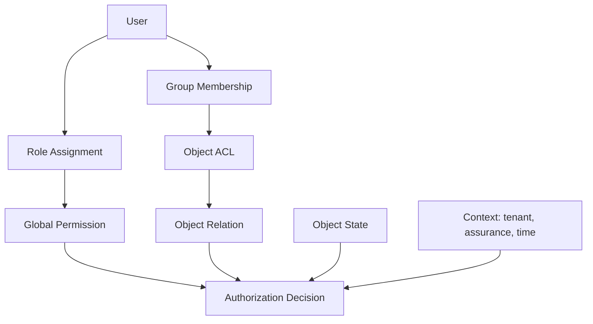
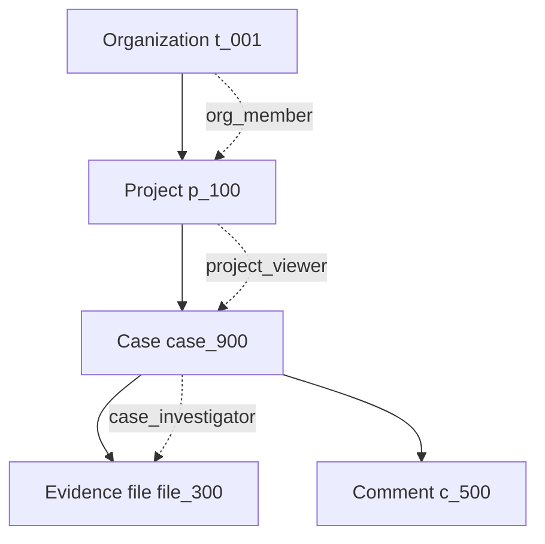
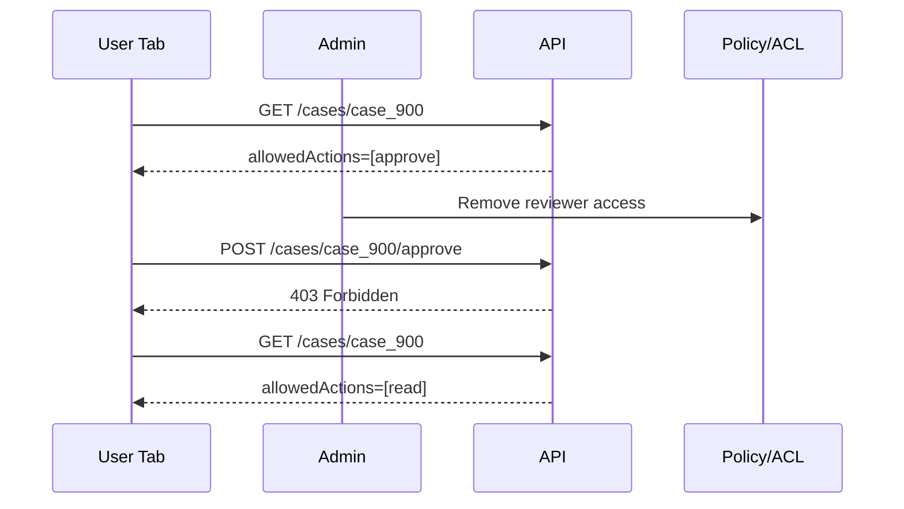

# Part 044 — ACL and Object-level Permission

Route-level authorization answers:

```txt
Can this subject enter this area of the application?
```

Object-level authorization answers:

```txt
Can this subject access this exact object?
```

Those are not the same question.

A user may be allowed to open `/cases` but not allowed to open `case_900`.

A user may be allowed to read `case_900` but not allowed to edit the penalty field.

A user may be allowed to comment on `case_900` but not approve it.

A user may be allowed to approve normal cases but not cases they investigated.

A user may be allowed to see a document listed but not download the sealed attachment.

This is where ACL and object-level permission become unavoidable.

If Part 043 was about capability projection, this part is about resource-specific permission.

---

## 1. The core mistake

A common React mistake:

```tsx
if (user.permissions.includes("case.read")) {
  return <CaseDetail caseId={params.caseId} />;
}
```

This checks whether the user can read cases in general.

It does not check whether the user can read this case.

The dangerous missing variable is the object.

Serious authorization asks:

```txt
Can subject S perform action A on object O in context C?
```

For example:

```txt
Can user u_123 read case case_900 in tenant t_001 right now?
```

Not:

```txt
Can user u_123 read cases?
```

Global permission is a coarse gate.

Object permission is the real gate.

---

## 2. ACL in plain terms

An ACL is an Access Control List.

It attaches access facts to an object.

Example:

```txt
case_900:
  owner: user:u_111
  investigator: user:u_222
  reviewer: group:g_case_reviewers
  viewer: org:t_001/legal
```

Then policy maps relationships to actions:

```txt
owner        -> read, edit, archive
investigator -> read, comment, upload_evidence
reviewer    -> read, approve, reject
viewer      -> read
```

The ACL itself may store principals and relations.

The policy decides what those relations mean.

Do not confuse:

```txt
ACL data = who is related to the object
Policy = what those relationships permit
Decision = result for a specific request
```

---

## 3. Why object-level permission matters in React

React renders objects.

Object pages.

Object rows.

Object cards.

Object tabs.

Object action menus.

Object files.

Object comments.

Object transitions.

Every object can carry a different permission shape.

Example list:

| Case | Status | User relation | Allowed actions |
|---|---|---|---|
| `CASE-001` | Draft | creator | read, edit, submit |
| `CASE-002` | Under review | reviewer | read, approve, reject |
| `CASE-003` | Under review | investigator | read, comment |
| `CASE-004` | Closed | auditor | read, audit.view |
| `CASE-005` | Sealed | none | none |

If React uses one global permission for all rows, it lies.

Rows need object-level projection.

---

## 4. ACL versus RBAC

RBAC assigns permissions through roles.

ACL assigns relationships or grants to objects.

They often work together.



Example:

```txt
User has role: Case Reviewer
Role grants: case.review.view, case.transition.approve
Case ACL says: reviewer includes group:g_review_team_7
User is member of group:g_review_team_7
Case status is UNDER_REVIEW
Decision: can approve this case
```

RBAC alone says the user may approve cases.

ACL says whether this case is within their review scope.

Workflow state says whether approval is currently valid.

All three matter.

---

## 5. Object-level authorization is where IDOR/BOLA appears

IDOR means Insecure Direct Object Reference.

BOLA means Broken Object Level Authorization.

The practical bug:

```http
GET /api/cases/case_900
```

Server checks only:

```txt
Is the user logged in?
```

or:

```txt
Does the user have case.read?
```

But fails to check:

```txt
Can this user read case_900?
```

React cannot fix this.

A user can change the URL, modify a request, replay a request, or call the API directly.

The server must enforce object-level authorization on every object request.

React's job is to avoid exposing unauthorized object links/actions and to handle denial safely.

---

## 6. Object-level permission query

The canonical question:

```ts
type AuthorizationQuery = {
  subject: {
    type: "user" | "service";
    id: string;
    tenantId: string;
  };
  action: string;
  resource: {
    type: string;
    id: string;
    tenantId: string;
  };
  context: {
    now: string;
    assuranceLevel: number;
    requestId: string;
  };
};
```

Example:

```json
{
  "subject": {
    "type": "user",
    "id": "u_123",
    "tenantId": "t_001"
  },
  "action": "case.transition.approve",
  "resource": {
    "type": "case",
    "id": "case_900",
    "tenantId": "t_001"
  },
  "context": {
    "now": "2026-07-08T10:00:00+07:00",
    "assuranceLevel": 2,
    "requestId": "req_abc"
  }
}
```

Decision:

```json
{
  "allowed": false,
  "reason": "separation_of_duties",
  "message": "You cannot approve a case you investigated.",
  "policyVersion": "authz-2026-07-01",
  "decisionId": "dec_789"
}
```

React should usually not send this entire query for every render.

But this is the mental model behind every object-level UI behavior.

---

## 7. ACL data model

A basic relational ACL table:

```sql
CREATE TABLE object_acl_grant (
  id              UUID PRIMARY KEY,
  tenant_id       UUID NOT NULL,
  object_type     TEXT NOT NULL,
  object_id       UUID NOT NULL,
  principal_type  TEXT NOT NULL, -- user, group, role, org, service
  principal_id    UUID NOT NULL,
  relation        TEXT NOT NULL, -- owner, viewer, editor, reviewer
  created_at      TIMESTAMPTZ NOT NULL,
  created_by      UUID NOT NULL,
  expires_at      TIMESTAMPTZ NULL
);

CREATE INDEX idx_acl_object
  ON object_acl_grant (tenant_id, object_type, object_id);

CREATE INDEX idx_acl_principal
  ON object_acl_grant (tenant_id, principal_type, principal_id);
```

Example rows:

| object | principal | relation |
|---|---|---|
| `case:case_900` | `user:u_123` | `investigator` |
| `case:case_900` | `group:g_legal_review` | `reviewer` |
| `case:case_900` | `org:t_001/compliance` | `viewer` |

This stores relationship facts.

A separate policy maps relation to action.

```txt
case.viewer       -> case.read
case.investigator -> case.read, case.comment.create, case.evidence.upload
case.reviewer     -> case.read, case.transition.approve, case.transition.reject
case.owner        -> case.read, case.update, case.archive
```

Do not hardcode this mapping in React.

React receives allowed actions.

---

## 8. Principal types

ACLs are more useful when they support several principal types.

| Principal type | Example | Meaning |
|---|---|---|
| User | `user:u_123` | Direct grant to one user |
| Group | `group:g_reviewers` | Grant through membership |
| Role | `role:case_reviewer` | Grant to role within tenant or scope |
| Org/unit | `org_unit:legal` | Grant to organizational unit |
| Tenant | `tenant:t_001` | Grant to all tenant members under constraints |
| Service | `service:reporting-worker` | Machine principal grant |
| Public/share token | `share:token_abc` | External/share-link grant, heavily constrained |

React mostly should not need to understand this graph.

The UI needs answers like:

```json
{
  "allowedActions": ["case.read", "case.comment.create"],
  "accessLevel": "commenter"
}
```

But admin UIs may need to render and edit ACL entries.

Then the distinction matters.

---

## 9. Ownership is not enough

Ownership is a relationship.

It is not a complete authorization system.

Bad:

```ts
const canEdit = caseRecord.ownerId === user.id;
```

Why this fails:

- owners may not edit after submission,
- delegated editors may edit without ownership,
- managers may override,
- owners may be suspended,
- tenant policy may freeze high-risk cases,
- legal hold may prevent mutation,
- separation of duties may block approval,
- emergency access may temporarily allow read,
- object state changes permission.

Better:

```ts
const canEdit = caseRecord.allowedActions.includes("case.update");
```

Ownership can be an input to backend policy.

It should not be the frontend policy.

---

## 10. Allow, deny, and precedence

ACLs can support explicit deny, but this increases complexity.

Simple allow-only model:

```txt
No matching allow => denied
```

This is easier to reason about.

Explicit deny model:

```txt
matching deny may override allow
```

This is useful for:

- legal hold,
- conflict of interest,
- sealed records,
- blocked user,
- emergency revocation,
- segregation of duties.

But if explicit deny exists, precedence must be unambiguous.

Example:

```txt
Explicit deny > temporary emergency allow > direct allow > group allow > inherited allow > default deny
```

React should not implement this precedence.

React should receive the final decision or projected allowed actions.

---

## 11. Inherited permissions

Objects often form hierarchies.

```txt
Organization
  Project
    Case
      Evidence File
      Comment
      Audit Event
```

Permission may inherit downward.



Example policy:

```txt
project.viewer -> case.read for cases in project
case.investigator -> evidence.upload on files in case
case.reviewer -> case.transition.approve on case
case.audit_viewer -> audit.read on audit events in case
```

Inheritance is powerful.

It is also a source of bugs.

Questions to answer:

- Does parent permission always imply child permission?
- Can child object override parent inheritance?
- Can sealed child object block inherited access?
- Is inheritance transitive through all levels?
- Is inherited access visible in access review UI?
- What happens when object moves to another parent?
- What caches are invalidated when parent ACL changes?

React should assume inherited permission can change when parent relationships change.

Use object permission epoch or resource version.

---

## 12. Object moves are authorization events

Moving an object can change who can access it.

Example:

```txt
Move case_900 from Project A to Project B.
```

If access is inherited from project, this operation changes authorization for every user whose access flows through the old or new project.

Treat move as security-sensitive.

Server must:

- check permission to remove from old parent,
- check permission to add to new parent,
- update ACL/inheritance indexes,
- invalidate object permission cache,
- audit old and new parent,
- avoid transient exposure during migration.

React must:

- not assume allowed actions survive move,
- re-fetch resource projection after move,
- clear stale row actions,
- revalidate breadcrumbs/navigation,
- handle `403` after stale move.

Object movement is not just data editing.

It is permission topology editing.

---

## 13. The frontend object contract

A good object response includes permission projection.

```ts
type CaseDetailDto = {
  id: string;
  tenantId: string;
  reference: string;
  status: "DRAFT" | "UNDER_REVIEW" | "APPROVED" | "REJECTED" | "CLOSED";
  version: number;
  permissionEpoch: string;
  access: {
    level: "none" | "viewer" | "commenter" | "editor" | "reviewer" | "owner";
    allowedActions: string[];
    deniedActions?: Array<{
      action: string;
      reason: string;
      message: string;
    }>;
  };
};
```

Then React uses:

```ts
function canOnCase(caseRecord: CaseDetailDto, action: string): boolean {
  return caseRecord.access.allowedActions.includes(action);
}
```

Example:

```tsx
function CaseActions({ caseRecord }: { caseRecord: CaseDetailDto }) {
  return (
    <div>
      {canOnCase(caseRecord, "case.comment.create") && (
        <AddCommentButton caseId={caseRecord.id} />
      )}

      {canOnCase(caseRecord, "case.transition.approve") && (
        <ApproveCaseButton caseId={caseRecord.id} />
      )}

      {canOnCase(caseRecord, "case.archive") && (
        <ArchiveCaseButton caseId={caseRecord.id} />
      )}
    </div>
  );
}
```

The UI does not know why the user is reviewer.

It only knows the safe projected actions.

---

## 14. List endpoint authorization

List endpoints have two jobs:

```txt
Return only objects the user can list.
Return per-object allowed actions for visible rows.
```

Example:

```json
{
  "items": [
    {
      "id": "case_001",
      "reference": "CASE-001",
      "status": "DRAFT",
      "allowedActions": ["case.read", "case.update", "case.submit"]
    },
    {
      "id": "case_002",
      "reference": "CASE-002",
      "status": "UNDER_REVIEW",
      "allowedActions": ["case.read", "case.transition.approve", "case.transition.reject"]
    },
    {
      "id": "case_003",
      "reference": "CASE-003",
      "status": "CLOSED",
      "allowedActions": ["case.read", "case.audit.view"]
    }
  ]
}
```

Do not return unauthorized objects and rely on React to filter them.

Bad:

```txt
API returns all cases.
React filters by tenant/user/role.
```

This leaks data through network, memory, devtools, logs, and bugs.

Server filters the set.

React renders the set.

---

## 15. Object detail endpoint authorization

Detail endpoint behavior depends on existence disclosure policy.

Option A: explicit denial.

```http
403 Forbidden
```

Use when the user is allowed to know the object exists but cannot access it.

Option B: not found or hidden.

```http
404 Not Found
```

Use when object existence itself is sensitive.

Option C: mixed message.

```txt
Not found or you do not have access.
```

Use when you want user-safe copy without confirming which condition happened.

React should not blindly show:

```txt
You are forbidden from case CASE-900.
```

unless it is safe to reveal that case exists.

---

## 16. Field and subresource ACL

Object-level read is not always enough.

A case may contain fields and subresources with separate access.

```txt
case_900
  summary: visible to viewers
  internal_notes: visible to investigators/reviewers
  penalty_amount: visible to penalty committee
  evidence_files: visible by classification
  audit_events: visible to auditors
```

Field/subresource response:

```json
{
  "id": "case_900",
  "summary": "...",
  "internalNotes": {
    "access": "redacted",
    "reason": "internal_notes_permission_missing"
  },
  "penaltyAmount": {
    "access": "read-write",
    "value": 5000000
  },
  "evidenceFiles": [
    {
      "id": "file_1",
      "name": "photo.jpg",
      "classification": "standard",
      "allowedActions": ["file.read", "file.download"]
    },
    {
      "id": "file_2",
      "name": "sealed.pdf",
      "classification": "sealed",
      "allowedActions": []
    }
  ]
}
```

Again:

```txt
Do not send sensitive field values if the user cannot read them.
```

React may render redaction.

The server performs redaction.

---

## 17. Share links and external ACL

Share links are ACL entries with a different threat model.

Example:

```txt
share:token_abc -> viewer on document:doc_123 until 2026-07-15
```

Additional constraints:

- expiry required,
- scope minimal,
- revocable,
- auditable,
- optionally password/passkey/MFA protected,
- optionally bound to email/domain,
- no privilege escalation,
- no inherited admin rights,
- download/print/copy controls if applicable,
- rate limiting.

React considerations:

- separate anonymous/share session from authenticated session,
- show share-access banner,
- avoid mixing share tenant with logged-in tenant state,
- handle revoked/expired link cleanly,
- do not store share token in long-lived localStorage,
- avoid leaking share token through referrer or logs.

Share links are not merely URLs.

They are bearer capabilities.

Treat them like credentials.

---

## 18. Temporary grants

Temporary object grants are common in case management.

Example:

```txt
Grant legal reviewer read access to case_900 for 72 hours.
```

ACL row:

```txt
principal: user:u_500
relation: temporary_viewer
object: case:case_900
expires_at: 2026-07-11T10:00:00+07:00
```

React should render expiry when relevant:

```txt
Temporary access expires in 2 days.
```

On expiry:

- server denies,
- session/object projection invalidates,
- UI removes actions,
- open tabs recover from `403`,
- audit records expiry-triggered loss of access if needed.

Do not rely on client timers to enforce expiry.

Client timers improve UX only.

Server time decides.

---

## 19. Bulk object authorization

Bulk operations should be previewed server-side when risk is high.

Client can do coarse eligibility from row projections.

Server should produce final preview.

Request:

```http
POST /api/cases/bulk/approve/preview
Content-Type: application/json

{
  "caseIds": ["case_001", "case_002", "case_003"]
}
```

Response:

```json
{
  "eligible": [
    { "id": "case_001" },
    { "id": "case_002" }
  ],
  "ineligible": [
    {
      "id": "case_003",
      "reason": "resource_state",
      "message": "Closed cases cannot be approved."
    }
  ]
}
```

Then execution:

```http
POST /api/cases/bulk/approve
Content-Type: application/json

{
  "caseIds": ["case_001", "case_002"],
  "previewToken": "bulk_preview_abc"
}
```

The server still rechecks on execution.

Preview improves UX.

Execution enforces policy.

---

## 20. ACL cache invalidation

Object-level permission changes when:

- ACL entry is added,
- ACL entry is removed,
- group membership changes,
- role assignment changes,
- parent ACL changes,
- object moves to another parent,
- object state changes,
- temporary grant expires,
- share link revoked,
- user suspended,
- tenant policy changes,
- legal hold applied,
- emergency access starts/ends.

Use resource-level version/epoch:

```ts
type ResourceAccessProjection = {
  resourceVersion: number;
  accessVersion: string;
  policyVersion: string;
  allowedActions: string[];
};
```

Query key:

```ts
[
  "case-detail",
  caseId,
  tenantId,
  auth.permissionEpoch,
  auth.policyEpoch,
]
```

When an action returns `403` despite UI showing allowed:

```txt
Assume projection is stale.
Invalidate object query.
Refresh session/resource permissions.
Show safe denial.
Do not retry mutation blindly.
```

---

## 21. Stale object permission race

A common race:



The client was not malicious.

It was stale.

Correct UI recovery:

- stop optimistic action,
- show denial message,
- revalidate resource,
- remove approve button,
- preserve unsaved safe data if possible,
- log stale-permission event internally.

Incorrect recovery:

- retry approve,
- show generic error forever,
- keep button enabled,
- assume server is wrong,
- update local UI as if approval succeeded.

Server denial beats client projection.

Always.

---

## 22. Object-level permission in route loaders

A detail route loader should check object access before rendering sensitive UI.

```ts
export async function loader({ params, request }: LoaderArgs) {
  const session = await requireSession(request);

  const response = await api.getCaseDetail({
    session,
    caseId: params.caseId,
  });

  if (response.status === 404) {
    throw new Response("Not found", { status: 404 });
  }

  if (response.status === 403) {
    throw new Response("Forbidden", { status: 403 });
  }

  return response.data;
}
```

The loader does not implement policy.

It calls an API/BFF that enforces policy.

The important property is timing:

```txt
Do not render object detail before object access is checked.
```

This prevents protected data flash.

---

## 23. Object-level permission in forms

Forms need object permission at multiple points.

```txt
Can read form?
Can edit form?
Can edit this field?
Can submit this transition?
Can still submit after resource changed?
```

Example:

```tsx
function CasePenaltyForm({ caseRecord }: { caseRecord: CaseDetailDto }) {
  const canEditPenalty = caseRecord.access.allowedActions.includes("case.penalty.edit");
  const canSubmit = caseRecord.access.allowedActions.includes("case.penalty.submit");

  return (
    <form method="post">
      <MoneyInput name="penaltyAmount" readOnly={!canEditPenalty} />
      <button type="submit" disabled={!canSubmit}>
        Submit penalty recommendation
      </button>
    </form>
  );
}
```

Server action must recheck:

```txt
Can subject edit penalty field on this case?
Can subject submit penalty transition now?
Is submitted resource version current?
```

Do not trust read-only fields.

HTML read-only is UX.

Server validation is enforcement.

---

## 24. Versioning and compare-and-set

Object-level actions should often include resource version.

Request:

```json
{
  "caseId": "case_900",
  "expectedVersion": 17,
  "decision": "approve"
}
```

Server checks:

```txt
Does case exist?
Can subject approve case?
Is case version still 17?
Is case status still UNDER_REVIEW?
Apply transition atomically.
```

If version changed:

```http
409 Conflict
```

Not all denials are authorization denials.

Sometimes the user was allowed, but the resource changed.

React should distinguish:

| Status | Meaning | UI recovery |
|---|---|---|
| 401 | Session/authentication issue | Re-auth |
| 403 | Permission denied | Revalidate permissions, show denial |
| 404 | Not found or hidden | Safe not-found |
| 409 | Resource state/version conflict | Reload, show changed state |
| 423/423-like | Locked/frozen resource | Show locked state |

Permission UI gets cleaner when server errors are typed.

---

## 25. Admin ACL editor

An ACL editor is security-sensitive UI.

It should show:

- current grants,
- principal type,
- relation,
- scope,
- inheritance source,
- expiry,
- who granted,
- when granted,
- last used if available,
- blast radius,
- preview of effective permissions,
- pending changes before save.

Bad ACL editor:

```txt
Add user -> choose role -> save
```

Better ACL editor:

```txt
Add principal -> choose relation -> preview effective access -> show inherited access -> require reason -> save -> audit
```

Preview example:

```json
{
  "principal": "user:u_500",
  "relation": "reviewer",
  "effectiveActions": [
    "case.read",
    "case.transition.approve",
    "case.transition.reject",
    "case.comment.create"
  ],
  "warnings": [
    "User investigated this case; approval will still be denied by separation-of-duties policy."
  ]
}
```

ACL editors should reveal that grants are not the whole decision.

A relation may grant reviewer capability, but another policy may still deny a specific action.

---

## 26. Access review UI

Object-level grants require review.

A useful access review screen answers:

```txt
Who can access this object?
Why?
Through which direct or inherited grant?
What actions can they perform?
When does access expire?
Who approved it?
When was it last used?
```

Example row:

| Principal | Source | Relation | Effective actions | Expiry |
|---|---|---|---|---|
| Ari | Direct grant | reviewer | read, approve, reject | none |
| Legal Team | Project inheritance | viewer | read | none |
| Dito | Temporary grant | viewer | read | 2026-07-11 |

This is not only admin convenience.

It is regulatory defensibility.

For sensitive systems, you need to explain access after the fact.

---

## 27. Audit events

Object-level authorization should produce audit events for sensitive decisions and grant changes.

Grant events:

```json
{
  "event": "acl.grant.created",
  "tenantId": "t_001",
  "object": "case:case_900",
  "principal": "user:u_500",
  "relation": "viewer",
  "createdBy": "user:u_admin",
  "reason": "legal_review",
  "expiresAt": "2026-07-11T10:00:00+07:00"
}
```

Decision events for high-risk actions:

```json
{
  "event": "authz.decision",
  "decision": "denied",
  "action": "case.transition.approve",
  "resource": "case:case_900",
  "subject": "user:u_123",
  "reason": "separation_of_duties",
  "policyVersion": "authz-2026-07-01",
  "requestId": "req_abc"
}
```

Do not emit every harmless UI check as audit noise.

But do record:

- grant changes,
- sensitive access,
- denied sensitive actions,
- emergency access,
- impersonated access,
- share-link access,
- admin access review changes.

---

## 28. React anti-patterns for object-level permission

### Anti-pattern: object ID in URL means access

```tsx
<CasePage caseId={params.caseId} />
```

The URL is untrusted input.

### Anti-pattern: list visibility implies detail visibility

```txt
If user saw row in list, user can open detail.
```

Maybe.

But access can change between list fetch and detail fetch.

Always check detail.

### Anti-pattern: global permission implies object action

```ts
session.permissions.includes("case.approve")
```

This ignores object state, assignment, ownership, and separation of duties.

### Anti-pattern: client-side filtering unauthorized rows

```ts
const visibleRows = allRows.filter(row => row.tenantId === user.tenantId);
```

Unauthorized rows already leaked.

### Anti-pattern: disabled field as enforcement

```tsx
<input disabled={!canEditPenalty} name="penalty" />
```

Attackers can submit any payload.

Server checks field-level permission.

### Anti-pattern: ACL editor without preview

Admins need to understand effective access before saving grants.

Otherwise they create accidental overexposure.

---

## 29. Testing object-level permission

Test object-specific combinations.

Minimum matrix:

| Scenario | Expected |
|---|---|
| user has global read but no object relation | detail denied |
| user has object viewer relation | read allowed, edit denied |
| user has object reviewer relation | approve shown only if workflow state allows |
| object state closed | transition actions denied |
| user is investigator and reviewer | separation-of-duties denial |
| group grant removed while page open | stale action denied and UI revalidates |
| object moved to different parent | inherited access recalculated |
| temporary grant expired | server denies; UI removes access |
| unauthorized object ID in URL | 404/403 according to disclosure policy |
| list row allowed actions differ per row | row actions render correctly |
| bulk action mixed eligibility | some/none/all behavior correct |
| field redacted | sensitive value absent from payload and DOM |

Unit test for row rendering:

```tsx
it("renders row actions from object allowedActions", () => {
  render(
    <CaseRowActions
      caseRecord={{
        id: "case_900",
        tenantId: "t_001",
        status: "UNDER_REVIEW",
        allowedActions: ["case.read", "case.comment.create"],
      }}
    />
  );

  expect(screen.getByRole("button", { name: /comment/i })).toBeEnabled();
  expect(screen.queryByRole("button", { name: /approve/i })).not.toBeInTheDocument();
});
```

Integration test for stale permission:

```ts
it("recovers when server denies an action that UI previously showed", async () => {
  server.use(
    http.get("/api/cases/case_900", () => JsonResponse.json({
      id: "case_900",
      allowedActions: ["case.read", "case.transition.approve"],
      permissionEpoch: "v1",
    })),
    http.post("/api/cases/case_900/approve", () => new Response(null, { status: 403 }))
  );

  render(<CaseDetailRoute caseId="case_900" />);

  await user.click(await screen.findByRole("button", { name: /approve/i }));

  expect(await screen.findByText(/no longer have access/i)).toBeInTheDocument();
});
```

---

## 30. Operational signals

Track object authorization signals internally.

Useful metrics:

- object detail `403` rate,
- object action `403` rate,
- stale projection denial rate,
- ACL grant creation/removal count,
- temporary grant expiry count,
- share-link access count,
- access review overdue count,
- bulk preview ineligible ratio,
- object move access recalculation failures,
- policy evaluation latency.

Useful logs:

- `authz.object.denied`,
- `authz.object.allowed_sensitive`,
- `acl.grant.created`,
- `acl.grant.revoked`,
- `acl.inheritance.changed`,
- `access_review.completed`,
- `share_link.revoked`,
- `temporary_access.expired`.

Do not put sensitive object data in client analytics.

Authorization telemetry belongs in internal security/audit channels.

---

## 31. Design checklist

For ACL/object-level permission in React:

- [ ] Route permission and object permission are separate concepts.
- [ ] Server filters unauthorized list rows.
- [ ] Server checks detail access for every object ID.
- [ ] Server checks every mutation/action request.
- [ ] Object responses include `allowedActions` or equivalent access projection.
- [ ] Sensitive fields are not sent when user cannot read them.
- [ ] Row actions use row-level permission, not global session permission.
- [ ] Detail actions use resource-level permission, not role checks.
- [ ] Bulk actions handle mixed eligibility.
- [ ] Client treats server `403` as authoritative and revalidates stale projection.
- [ ] Object move invalidates inherited permission.
- [ ] Temporary grants expire server-side.
- [ ] Share links are treated as bearer capabilities.
- [ ] ACL admin UI has preview, reason, expiry, and audit.
- [ ] Access review can explain effective access.
- [ ] Tests cover IDOR/BOLA-style object ID manipulation.

---

## 32. Mental model to keep

ACL is not “a list of users who can see a thing”.

It is part of a decision system.

The complete object-level authorization model is:

```txt
Subject identity
+ tenant boundary
+ global capability
+ object relationship
+ group/role membership
+ inherited grants
+ object state
+ field/subresource classification
+ context such as time, assurance, risk
+ policy version
= authorization decision
```

React should not recompute that equation.

React should consume a safe projection of the result.

The backend asks the full question.

The frontend renders the answer.

That is the clean boundary.

---

## References

- OWASP Authorization Cheat Sheet — permission checks must be performed on every request; deny-by-default and least privilege principles.
- OWASP Top 10 Broken Access Control — object-level authorization failures, parameter tampering, force browsing, and access control bypass risks.
- Google Zanzibar paper — large-scale ACL storage and evaluation model for object-level authorization across services.
- NIST RBAC model — role/user/permission assignment concepts that often combine with ACL-based resource grants.
