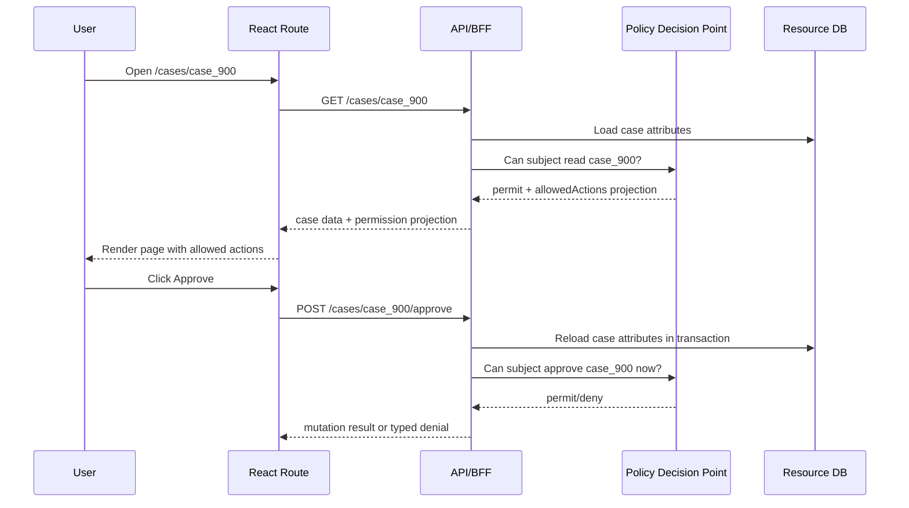
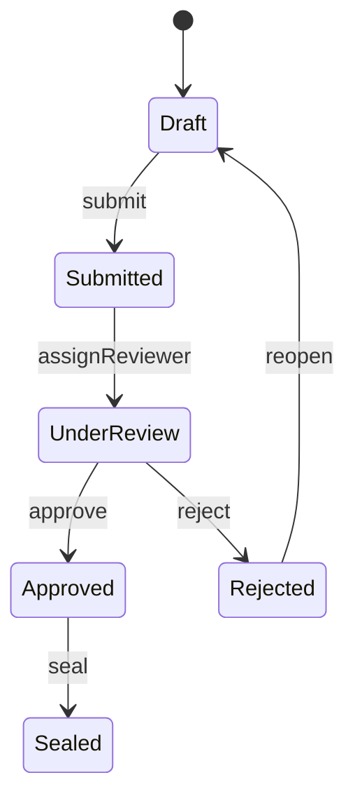

# Part 045 — ABAC for React Engineers

RBAC asks:

```txt
What role does the user have?
```

ACL asks:

```txt
What grants exist on this object?
```

ABAC asks:

```txt
What is true about the subject, the resource, the requested action, and the environment right now?
```

That difference matters.

In real systems, access is rarely decided by role alone.

A regulatory supervisor may edit a case only when the case is in `draft_review`.

A field officer may view evidence only when assigned to the region where the evidence was collected.

A support engineer may impersonate a customer only during an approved support window.

A finance approver may approve a refund only when the refund amount is below their approval limit.

A user may export data only when the tenant plan allows export and the session has a recent MFA challenge.

Those are not clean RBAC questions.

They are attribute questions.

ABAC is the model you reach for when the domain says:

```txt
Access depends on facts, not just names.
```

---

## 1. ABAC in one sentence

Attribute-Based Access Control is an authorization model where a decision is made by evaluating attributes of the subject, resource/object, action, and sometimes the environment against policy.

A decision shape looks like this:

```txt
permit if
  subject.department == resource.ownerDepartment
  and action == "approve"
  and resource.status == "pending_approval"
  and resource.amount <= subject.approvalLimit
  and environment.mfaAgeMinutes <= 15
```

This is why ABAC is powerful.

It can express rules that roles alone cannot express without creating hundreds of artificial roles.

But this is also why ABAC is dangerous when implemented casually.

Every attribute becomes part of the authorization boundary.

If an attribute is stale, wrong, client-controlled, ambiguous, or missing, the decision can become wrong.

---

## 2. The React engineer's first correction

A React app does not enforce ABAC.

The React app projects ABAC results into the UI.

The server enforces ABAC.

This distinction should be non-negotiable.

Bad mental model:

```txt
React evaluates policy from user attributes and hides buttons.
```

Better mental model:

```txt
Server evaluates policy from trusted attributes.
React receives a permission projection and renders the safest useful UI.
```

The frontend can know enough to be helpful.

It should not know so much that it becomes the source of truth.

---

## 3. ABAC vocabulary

ABAC is easiest to reason about through four buckets.

```txt
subject attributes
resource attributes
action attributes
environment attributes
```

### 3.1 Subject attributes

Subject attributes describe the actor.

Examples:

```ts
const subject = {
  id: "user_123",
  tenantId: "tenant_001",
  department: "enforcement",
  region: "west-java",
  clearance: "restricted",
  approvalLimit: 50_000_000,
  employmentType: "internal",
  groups: ["case-reviewers", "regional-supervisors"],
  mfaVerifiedAt: "2026-07-08T02:10:00Z",
  riskLevel: "normal",
};
```

Common subject attributes:

| Attribute | Example | Authorization usage |
|---|---|---|
| Tenant | `tenant_001` | Tenant isolation. |
| Organization | `org_abc` | Enterprise SSO membership. |
| Department | `compliance` | Department-scoped records. |
| Region | `jakarta` | Regional access. |
| Clearance | `restricted` | Sensitive resource handling. |
| Approval limit | `100000000` | Financial or workflow approvals. |
| Employment type | `contractor` | Contractor restrictions. |
| MFA age | `8 minutes` | Step-up requirement. |
| Risk level | `high` | Adaptive access. |

Subject attributes must not be blindly copied from the browser.

If the frontend sends:

```json
{
  "department": "compliance",
  "approvalLimit": 999999999
}
```

that is not a trusted attribute.

It is user input.

The policy engine should derive subject attributes from trusted identity/session/profile stores.

---

### 3.2 Resource attributes

Resource attributes describe the object being accessed.

Examples:

```ts
const caseResource = {
  id: "case_900",
  tenantId: "tenant_001",
  ownerDepartment: "enforcement",
  region: "west-java",
  classification: "restricted",
  status: "pending_approval",
  assignedInvestigatorId: "user_777",
  amount: 35_000_000,
  createdAt: "2026-06-21T10:30:00Z",
  sealed: false,
};
```

Common resource attributes:

| Attribute | Example | Authorization usage |
|---|---|---|
| Tenant | `tenant_001` | Cross-tenant isolation. |
| Owner | `user_123` | Owner-only access. |
| Department | `enforcement` | Department-scoped access. |
| Region | `west-java` | Jurisdiction. |
| Classification | `restricted` | Clearance check. |
| Status | `submitted` | Workflow-state permission. |
| Amount | `35000000` | Approval limit. |
| Sealed flag | `true` | Special protection. |
| Assignment | `user_777` | Assigned actor access. |

Resource attributes are usually authoritative only when read from the database or a trusted read model.

A hidden input field is not a trusted resource attribute.

A route param is not a trusted resource attribute.

A GraphQL fragment is not a trusted resource attribute.

A React Query cache is not a trusted resource attribute.

---

### 3.3 Action attributes

Action attributes describe the operation.

Examples:

```ts
type CaseAction =
  | "case.read"
  | "case.update"
  | "case.submit"
  | "case.approve"
  | "case.reject"
  | "case.export"
  | "case.seal"
  | "case.assign";
```

Actions should be domain operations, not UI events.

Bad action names:

```txt
clickApproveButton
openModal
showGreenButton
```

Good action names:

```txt
case.approve
case.reassign
case.export
case.seal
penalty.override
```

This matters because the same authorization rule may be used from multiple entry points:

- page button
- form action
- keyboard shortcut
- command palette
- bulk operation
- API endpoint
- background job
- mobile client

Policy belongs to the domain operation, not the React component.

---

### 3.4 Environment attributes

Environment attributes describe the request context.

Examples:

```ts
const environment = {
  requestTime: "2026-07-08T03:00:00Z",
  ipCountry: "ID",
  deviceTrust: "managed",
  networkZone: "corporate-vpn",
  sessionAgeMinutes: 45,
  mfaAgeMinutes: 7,
  supportTicketId: "SUP-1234",
  incidentMode: false,
};
```

Common environment attributes:

| Attribute | Example | Authorization usage |
|---|---|---|
| Time | working hours | Time-boxed access. |
| MFA age | `5 minutes` | Step-up authentication. |
| Device posture | managed/unmanaged | Sensitive actions. |
| Network zone | VPN/public | Internal-only actions. |
| Risk score | normal/high | Adaptive restrictions. |
| Support ticket | `SUP-1234` | Support impersonation. |
| Emergency mode | true/false | Break-glass logic. |

Environment attributes are often volatile.

That volatility creates caching problems.

If a decision depends on `mfaAgeMinutes`, caching that decision for 30 minutes can be wrong.

---

## 4. ABAC as a policy function

A policy decision can be represented as a pure-looking function:

```ts
type Decision = "permit" | "deny";

type AuthorizationRequest = {
  subject: SubjectAttributes;
  action: string;
  resource: ResourceAttributes;
  environment: EnvironmentAttributes;
};

function decide(req: AuthorizationRequest): Decision {
  if (req.subject.tenantId !== req.resource.tenantId) return "deny";
  if (req.action !== "case.approve") return "deny";
  if (req.resource.status !== "pending_approval") return "deny";
  if (req.resource.amount > req.subject.approvalLimit) return "deny";
  if (req.environment.mfaAgeMinutes > 15) return "deny";

  return "permit";
}
```

In production, the policy may not be a TypeScript function.

It may live in:

- backend application code
- a policy service
- OPA/Rego
- Cedar
- database-driven rules
- vendor authorization platform
- custom policy engine

The important shape is stable:

```txt
input attributes -> policy evaluation -> decision + reason + obligations
```

---

## 5. Why ABAC appears in React even when enforced server-side

React must still understand ABAC enough to build good product behavior.

Without ABAC-aware UI, the app becomes frustrating:

- buttons appear but always fail
- form fields are editable but rejected on submit
- table rows show actions that are not eligible
- bulk operations fail after the user selects records
- route pages show generic errors instead of useful explanations
- access request flows have no context
- step-up authentication appears at surprising times

The frontend should not decide ultimate access.

But it should consume a decision projection.

Example projection:

```json
{
  "resource": {
    "type": "case",
    "id": "case_900"
  },
  "allowedActions": [
    "case.read",
    "case.comment",
    "case.submit"
  ],
  "deniedActions": {
    "case.approve": {
      "reasonCode": "AMOUNT_EXCEEDS_APPROVAL_LIMIT",
      "message": "This case exceeds your approval limit.",
      "requestable": true
    },
    "case.seal": {
      "reasonCode": "INSUFFICIENT_CLEARANCE",
      "message": "Restricted clearance is required.",
      "requestable": false
    }
  },
  "obligations": {
    "case.export": {
      "requiresMfa": true,
      "maxRows": 1000
    }
  },
  "policyVersion": "case-policy@2026-07-08.1",
  "evaluatedAt": "2026-07-08T03:00:00Z"
}
```

The UI can now render:

- enabled actions
- disabled actions with reason
- access request affordances
- step-up prompts
- warnings for conditional access
- bulk eligibility previews

But every actual mutation must still be authorized on the server.

---

## 6. ABAC sequence in a React app



Notice the double check.

The read response may include `allowedActions`.

The mutation still re-evaluates authorization.

The user might lose permission between page load and submit.

The case might change state.

The amount might change.

The MFA window might expire.

The tenant membership might be revoked.

ABAC is time-sensitive.

---

## 7. A useful ABAC decision contract

For frontend consumption, a boolean is too weak.

```ts
canApprove: true
```

A production React app usually needs more.

```ts
type PermissionDecision = {
  allowed: boolean;
  reasonCode?:
    | "NOT_AUTHENTICATED"
    | "TENANT_MISMATCH"
    | "RESOURCE_NOT_FOUND_OR_NOT_ACCESSIBLE"
    | "INSUFFICIENT_ROLE"
    | "INSUFFICIENT_CLEARANCE"
    | "WORKFLOW_STATE_NOT_ALLOWED"
    | "AMOUNT_EXCEEDS_APPROVAL_LIMIT"
    | "MFA_REQUIRED"
    | "SESSION_EXPIRED"
    | "POLICY_UNAVAILABLE";
  message?: string;
  requestable?: boolean;
  requiresMfa?: boolean;
  constraints?: Record<string, unknown>;
  policyVersion?: string;
  evaluatedAt?: string;
};
```

Better:

```ts
type ActionPermissionMap<Action extends string> = Record<Action, PermissionDecision>;

type CasePermissionProjection = {
  resourceType: "case";
  resourceId: string;
  actions: ActionPermissionMap<
    | "case.read"
    | "case.update"
    | "case.submit"
    | "case.approve"
    | "case.reject"
    | "case.export"
  >;
  fieldPermissions?: Record<string, PermissionDecision>;
  policyVersion: string;
  evaluatedAt: string;
};
```

This lets UI code avoid guessing.

```tsx
function ApprovalButton({ permissions }: { permissions: CasePermissionProjection }) {
  const decision = permissions.actions["case.approve"];

  if (decision.allowed) {
    return <button type="submit">Approve</button>;
  }

  if (decision.requiresMfa) {
    return <button type="button">Verify identity to approve</button>;
  }

  if (decision.requestable) {
    return <button type="button">Request approval access</button>;
  }

  return (
    <button type="button" disabled title={decision.message ?? "Not allowed"}>
      Approve
    </button>
  );
}
```

Again: this is not enforcement.

It is high-fidelity UX projection.

---

## 8. ABAC and field-level permission

ABAC often appears first at field level.

Example:

```txt
A case reviewer can edit the summary field.
Only a supervisor can edit the penalty recommendation.
Only an assigned investigator can edit evidence notes.
A sealed case makes all fields read-only except privileged review comments.
```

A weak UI implementation:

```tsx
<input disabled={user.role !== "supervisor"} />
```

A better projection:

```json
{
  "fieldPermissions": {
    "summary": {
      "read": { "allowed": true },
      "update": { "allowed": true }
    },
    "penaltyRecommendation": {
      "read": { "allowed": true },
      "update": {
        "allowed": false,
        "reasonCode": "INSUFFICIENT_CLEARANCE",
        "message": "Supervisor clearance is required."
      }
    },
    "evidenceNotes": {
      "read": { "allowed": true },
      "update": {
        "allowed": false,
        "reasonCode": "NOT_ASSIGNED_INVESTIGATOR"
      }
    }
  }
}
```

Then the form builder can consume policy without embedding business rules:

```tsx
type FieldPermission = {
  read: PermissionDecision;
  update: PermissionDecision;
};

function PermissionedTextField({
  name,
  label,
  permission,
}: {
  name: string;
  label: string;
  permission: FieldPermission;
}) {
  if (!permission.read.allowed) return null;

  return (
    <label>
      {label}
      <input name={name} readOnly={!permission.update.allowed} />
      {!permission.update.allowed && permission.update.message ? (
        <small>{permission.update.message}</small>
      ) : null}
    </label>
  );
}
```

Server still validates submitted fields.

A malicious user can remove `readOnly` in DevTools.

A stale tab can submit old data.

An API client can bypass the form entirely.

Field-level permission in React is UX.

Field-level permission on the server is security.

---

## 9. ABAC and workflow state

ABAC becomes especially useful in workflow-heavy systems.

Example case lifecycle:



Permission depends on state:

| Action | Allowed only when |
|---|---|
| `case.update` | status is `draft` or `reopened` and subject is owner/investigator |
| `case.submit` | status is `draft` and required fields complete |
| `case.approve` | status is `under_review`, subject is supervisor, subject did not create case |
| `case.reject` | status is `under_review`, subject has reviewer privilege |
| `case.seal` | status is `approved`, subject has restricted clearance |

A React UI that only checks `role` will be wrong.

Workflow authorization is a state transition problem.

The server should treat mutation endpoints like commands:

```ts
type CaseCommand =
  | { type: "submit"; caseId: string }
  | { type: "approve"; caseId: string; comment: string }
  | { type: "reject"; caseId: string; reason: string }
  | { type: "seal"; caseId: string };
```

The command handler must check:

```txt
Can subject perform this transition on this resource from its current state?
```

The UI should display allowed transitions.

The backend must enforce actual transitions.

---

## 10. ABAC and multi-tenancy

Tenant is not just another attribute.

Tenant is usually a boundary invariant.

In ABAC terms:

```txt
subject.tenantId must match resource.tenantId
```

But that rule is so important that it should not be buried deep inside random UI code.

Treat it as a global guard.

```ts
function assertTenantBoundary(subject: Subject, resource: Resource) {
  if (subject.tenantId !== resource.tenantId) {
    throw new ForbiddenError("TENANT_MISMATCH");
  }
}
```

Then domain policy runs after tenant isolation is already established.

```ts
function canApproveCase(subject: Subject, resource: CaseResource, env: Env) {
  assertTenantBoundary(subject, resource);

  return (
    subject.department === resource.ownerDepartment &&
    subject.clearance >= resource.classification &&
    resource.status === "under_review" &&
    env.mfaAgeMinutes <= 15
  );
}
```

For React, tenant boundary affects:

- session bootstrap
- tenant switcher
- query keys
- route params
- cache invalidation
- permission projection
- analytics context
- feature availability
- audit display

Bad query key:

```ts
["case", caseId]
```

Better query key:

```ts
["tenant", tenantId, "case", caseId]
```

ABAC and caching are inseparable.

If tenant is an attribute in policy, tenant must also be an attribute in cache identity.

---

## 11. Attribute freshness

ABAC depends on data.

Data changes.

Therefore ABAC decisions expire.

Examples:

| Attribute | Can change when | Frontend consequence |
|---|---|---|
| `subject.groups` | admin updates membership | invalidate session/permissions |
| `subject.approvalLimit` | role/policy update | hide/disable approval actions |
| `resource.status` | another user transitions workflow | revalidate resource page |
| `resource.amount` | user edits amount | recompute approval eligibility |
| `environment.mfaAgeMinutes` | time passes | step-up required again |
| `environment.riskLevel` | risk engine updates | restrict sensitive actions |

A bad pattern:

```ts
const canApprove = useMemo(() => {
  return user.approvalLimit >= case.amount;
}, []);
```

This memo never updates.

Better:

```ts
const decision = permissions.actions["case.approve"];
```

But even that projection can become stale.

So the mutation endpoint must re-check.

For frontend cache, include:

```ts
type PermissionProjectionMeta = {
  evaluatedAt: string;
  expiresAt?: string;
  policyVersion: string;
  subjectVersion?: string;
  resourceVersion?: string;
};
```

A permission projection should be treated like a snapshot.

Not a permanent truth.

---

## 12. ABAC decision caching

ABAC caching is harder than RBAC caching.

A role can change rarely.

An attribute can change constantly.

Decision cache key needs enough inputs to avoid unsafe reuse.

```txt
subjectId + subjectVersion + action + resourceId + resourceVersion + environmentBucket + policyVersion
```

Example:

```ts
type DecisionCacheKey = {
  subjectId: string;
  subjectVersion: string;
  action: string;
  resourceType: string;
  resourceId: string;
  resourceVersion: string;
  tenantId: string;
  policyVersion: string;
  assuranceBucket: "fresh-mfa" | "stale-mfa" | "no-mfa";
};
```

Do not cache high-risk decisions too broadly.

Examples of risky cache reuse:

```txt
"all supervisors can approve all pending cases"
```

This ignores amount, department, assignment, separation of duties, tenant, and MFA freshness.

Better:

```txt
"user_123 can approve case_900 under policy version X, case version Y, subject version Z, MFA bucket fresh"
```

For React, prefer caching server-provided projections with resource data.

Avoid client-side policy evaluation caches unless the policy is explicitly non-sensitive and derived only from non-authoritative UI state.

---

## 13. ABAC and denial reasons

ABAC can produce nuanced denial reasons.

That is useful for UX.

It is also dangerous for information disclosure.

Example denial reasons:

```txt
TENANT_MISMATCH
RESOURCE_CLASSIFICATION_TOO_HIGH
AMOUNT_EXCEEDS_APPROVAL_LIMIT
WORKFLOW_STATE_NOT_ALLOWED
MFA_REQUIRED
NOT_ASSIGNED
```

Not every reason should be shown to every user.

If a user should not know a resource exists, returning this is bad:

```json
{
  "allowed": false,
  "reasonCode": "RESOURCE_CLASSIFICATION_TOO_HIGH",
  "message": "This sealed case requires Level 5 clearance."
}
```

A safer response may be:

```json
{
  "allowed": false,
  "reasonCode": "RESOURCE_NOT_FOUND_OR_NOT_ACCESSIBLE",
  "message": "The requested resource could not be found or is not accessible."
}
```

Internally, audit can store the precise reason.

Externally, UI can show a safe reason.

Decision response design should separate:

```txt
internalReasonCode
externalReasonCode
userMessage
auditMessage
supportCode
```

Example:

```json
{
  "allowed": false,
  "externalReasonCode": "NOT_ACCESSIBLE",
  "userMessage": "You do not have access to this case.",
  "supportCode": "AUTHZ-8F3K2"
}
```

---

## 14. ABAC and step-up authentication

Step-up authentication is an ABAC pattern.

The subject may be authenticated.

The action may still require stronger or fresher authentication.

Policy:

```txt
Permit export if:
  subject has case.export permission
  and resource.classification <= subject.clearance
  and environment.mfaAgeMinutes <= 10
```

Decision:

```json
{
  "allowed": false,
  "reasonCode": "MFA_REQUIRED",
  "requiresMfa": true,
  "challenge": {
    "type": "webauthn-or-totp",
    "returnTo": "/cases/case_900/export"
  }
}
```

React behavior:

```tsx
if (decision.requiresMfa) {
  return (
    <button onClick={() => startStepUp({ returnTo: currentIntent })}>
      Verify identity to export
    </button>
  );
}
```

Server behavior:

```txt
Do not trust that the button triggered step-up.
Re-check MFA freshness on export endpoint.
```

Step-up should be action-aware.

Do not step-up everything just because the route loaded.

Ask for stronger authentication at the point where the risk actually appears.

---

## 15. ABAC and bulk operations

Bulk operations are ABAC traps.

Example: user selects 50 cases and clicks `Approve selected`.

Some cases are eligible.

Some are not.

A weak UI:

```tsx
<button disabled={!canApproveCases}>Approve selected</button>
```

But `canApproveCases` is not one decision.

It is 50 decisions.

Better projection:

```json
{
  "bulkAction": "case.approve",
  "summary": {
    "total": 50,
    "allowed": 37,
    "denied": 13
  },
  "items": [
    {
      "id": "case_1",
      "allowed": true
    },
    {
      "id": "case_2",
      "allowed": false,
      "reasonCode": "AMOUNT_EXCEEDS_APPROVAL_LIMIT"
    }
  ]
}
```

UI options:

1. Allow action only when all selected records are eligible.
2. Allow partial action with explicit preview.
3. Split eligible and ineligible records.
4. Require escalation for denied records.

For regulated systems, partial bulk actions need audit clarity.

The audit log should say exactly which records were acted on and which were denied.

---

## 16. ABAC and list endpoints

ABAC affects list endpoints differently than detail endpoints.

Question 1:

```txt
Can the user read case_900?
```

Question 2:

```txt
Which cases can the user list?
```

Those are related but not identical.

For list endpoints, the backend usually needs to translate policy into a query filter.

Example:

```sql
where tenant_id = :tenantId
  and region in (:subjectRegions)
  and classification <= :subjectClearance
```

But not all ABAC policies translate cleanly to SQL.

Some require post-filtering.

A frontend implication:

```txt
Never infer total resource existence from list counts unless the backend contract allows it.
```

If list endpoint returns 0 items, that may mean:

- no items exist
- user cannot see any
- filters exclude them
- policy hides them
- tenant context is wrong

React should avoid exposing unauthorized existence through UI copy.

Bad:

```txt
There are 12 cases, but you cannot see them.
```

Better:

```txt
No accessible cases match your filters.
```

---

## 17. ABAC and search

Search is another leak surface.

Search endpoints must apply authorization before returning results.

The frontend must not fetch broad search results and filter locally.

Bad:

```txt
GET /cases/search?q=tax
React filters out restricted cases
```

Better:

```txt
GET /cases/search?q=tax
Server returns only accessible cases
```

Search result metadata can leak too.

Risky metadata:

```json
{
  "totalMatches": 532,
  "visibleMatches": 3
}
```

This tells the user there are 529 inaccessible matches.

Maybe that is allowed for internal admin users.

Maybe it is a violation.

Do not let the frontend invent this behavior.

Make it part of the API contract.

---

## 18. ABAC and analytics/logging

React analytics can accidentally leak policy-sensitive information.

Examples:

```ts
track("approval_denied", {
  caseId,
  reason: "RESOURCE_CLASSIFICATION_TOO_HIGH",
  classification: "sealed",
});
```

This may send sensitive information to third-party analytics.

Safer:

```ts
track("authorization_denied", {
  action: "case.approve",
  externalReasonCode: "NOT_ALLOWED",
  correlationId,
});
```

Keep detailed denial reasons in internal audit logs.

Keep product analytics coarse.

For frontend logs, avoid:

- raw subject attributes
- resource classification
- full permission maps for sensitive objects
- internal policy names
- access denial reasons that reveal hidden resources
- token claims
- SSO group names if sensitive

---

## 19. ABAC implementation patterns for React

### Pattern A — Server-provided allowed actions

Response:

```json
{
  "case": {
    "id": "case_900",
    "status": "under_review"
  },
  "permissions": {
    "case.approve": {
      "allowed": true
    },
    "case.reject": {
      "allowed": true
    },
    "case.seal": {
      "allowed": false,
      "reasonCode": "WORKFLOW_STATE_NOT_ALLOWED"
    }
  }
}
```

Pros:

- simple for React
- avoids shipping policy to browser
- good for object detail pages
- easy to test with fixtures

Cons:

- projection can become stale
- may require extra backend policy calls
- list pages need batch projection

Use when:

- resource-specific actions matter
- backend owns policy
- UI needs accurate action rendering

---

### Pattern B — Capability endpoint

Request:

```http
POST /authorization/check
Content-Type: application/json

{
  "checks": [
    { "resourceType": "case", "resourceId": "case_900", "action": "case.approve" },
    { "resourceType": "case", "resourceId": "case_900", "action": "case.export" }
  ]
}
```

Response:

```json
{
  "results": [
    {
      "resourceType": "case",
      "resourceId": "case_900",
      "action": "case.approve",
      "allowed": true
    },
    {
      "resourceType": "case",
      "resourceId": "case_900",
      "action": "case.export",
      "allowed": false,
      "reasonCode": "MFA_REQUIRED",
      "requiresMfa": true
    }
  ]
}
```

Pros:

- reusable across pages
- supports batch checks
- decouples resource response from permission response

Cons:

- can create chatty UI
- cache key design is hard
- easy to misuse as enforcement substitute

Use when:

- many screens share policy checks
- UI needs permission before loading full resource
- command palette/menu needs dynamic capabilities

---

### Pattern C — Route loader evaluates permission

```ts
export async function loader({ params, request }: LoaderArgs) {
  const session = await requireSession(request);
  const result = await api.getCaseWithPermissions(session, params.caseId);

  if (!result.permissions.actions["case.read"].allowed) {
    throw new Response("Forbidden", { status: 403 });
  }

  return result;
}
```

Pros:

- prevents component render before auth decision
- good for data router/framework mode
- simplifies route error boundary

Cons:

- still needs server enforcement
- client-only routers cannot protect API directly

Use when:

- route data is sensitive
- page should not render before auth decision
- you need typed error boundaries

---

### Pattern D — Client-side coarse hints

```ts
const canOpenAdminArea = session.capabilities.includes("admin.area.open");
```

Pros:

- fast navigation/menu rendering
- good for coarse UI exposure

Cons:

- stale
- not resource-specific
- dangerous if mistaken for enforcement

Use only for:

- menu visibility
- product ergonomics
- non-sensitive hints

Never use as:

- API access enforcement
- object-level security
- field-level security
- financial/workflow approval gate

---

## 20. ABAC policy examples

### 20.1 Approval limit

```ts
function canApproveRefund(input: AuthzInput): Decision {
  const { subject, resource, environment } = input;

  if (subject.tenantId !== resource.tenantId) return deny("TENANT_MISMATCH");
  if (!subject.permissions.includes("refund.approve")) return deny("MISSING_PERMISSION");
  if (resource.status !== "pending_approval") return deny("WORKFLOW_STATE_NOT_ALLOWED");
  if (resource.amount > subject.approvalLimit) return deny("AMOUNT_EXCEEDS_APPROVAL_LIMIT", { requestable: true });
  if (environment.mfaAgeMinutes > 10) return deny("MFA_REQUIRED", { requiresMfa: true });

  return permit();
}
```

### 20.2 Regional jurisdiction

```ts
function canReadCase(input: AuthzInput): Decision {
  const { subject, resource } = input;

  if (subject.tenantId !== resource.tenantId) return deny("NOT_ACCESSIBLE");
  if (!subject.regions.includes(resource.region)) return deny("NOT_ACCESSIBLE");
  if (subject.clearanceRank < resource.classificationRank) return deny("NOT_ACCESSIBLE");

  return permit();
}
```

### 20.3 Separation of duties

```ts
function canApproveCase(input: AuthzInput): Decision {
  const { subject, resource } = input;

  if (!subject.permissions.includes("case.approve")) return deny("MISSING_PERMISSION");
  if (resource.createdBy === subject.id) return deny("SEPARATION_OF_DUTIES");
  if (resource.assignedInvestigatorId === subject.id) return deny("SEPARATION_OF_DUTIES");

  return permit();
}
```

Separation of duties is where `role === supervisor` becomes obviously insufficient.

A supervisor might still be blocked because they created the case.

---

## 21. TypeScript model for ABAC inputs

```ts
type TenantId = string;
type UserId = string;
type ResourceId = string;

type SubjectAttributes = {
  id: UserId;
  tenantId: TenantId;
  permissions: string[];
  departments: string[];
  regions: string[];
  clearanceRank: number;
  approvalLimit: number;
  subjectVersion: string;
};

type ResourceAttributes = {
  type: "case" | "refund" | "document";
  id: ResourceId;
  tenantId: TenantId;
  ownerId?: UserId;
  ownerDepartment?: string;
  region?: string;
  classificationRank?: number;
  status?: string;
  amount?: number;
  createdBy?: UserId;
  resourceVersion: string;
};

type EnvironmentAttributes = {
  now: string;
  mfaAgeMinutes?: number;
  networkZone?: "public" | "corporate" | "vpn";
  deviceTrust?: "unknown" | "managed";
  riskLevel?: "normal" | "elevated" | "high";
};

type AuthzInput = {
  subject: SubjectAttributes;
  action: string;
  resource: ResourceAttributes;
  environment: EnvironmentAttributes;
};

type AuthzDecision = {
  allowed: boolean;
  reasonCode?: string;
  requestable?: boolean;
  requiresMfa?: boolean;
  obligations?: Record<string, unknown>;
};
```

The types make missing attributes visible.

But TypeScript does not make attributes trustworthy.

Trust comes from where the attributes are sourced.

---

## 22. React hook for projected ABAC decisions

```tsx
type PermissionMap = Record<string, AuthzDecision>;

function useActionDecision(permissions: PermissionMap, action: string): AuthzDecision {
  return permissions[action] ?? {
    allowed: false,
    reasonCode: "UNKNOWN_ACTION",
  };
}

function CaseActions({ permissions }: { permissions: PermissionMap }) {
  const approve = useActionDecision(permissions, "case.approve");
  const exportDecision = useActionDecision(permissions, "case.export");

  return (
    <div>
      <ActionButton decision={approve}>Approve</ActionButton>
      <ActionButton decision={exportDecision}>Export</ActionButton>
    </div>
  );
}

function ActionButton({
  decision,
  children,
}: {
  decision: AuthzDecision;
  children: React.ReactNode;
}) {
  if (decision.allowed) {
    return <button>{children}</button>;
  }

  if (decision.requiresMfa) {
    return <button>Verify identity to continue</button>;
  }

  return (
    <button disabled title={decision.reasonCode ?? "Not allowed"}>
      {children}
    </button>
  );
}
```

This hook should not recompute ABAC from raw attributes.

It should consume a server-provided projection.

---

## 23. ABAC and optimistic UI

Optimistic UI is risky with ABAC.

Example:

```txt
User sees Approve button.
User clicks Approve.
UI immediately marks case Approved.
Server denies because case changed state.
```

For high-risk actions, avoid optimistic success.

Use pending state instead.

```tsx
function ApproveButton({ decision }: { decision: AuthzDecision }) {
  const fetcher = useFetcher();
  const busy = fetcher.state !== "idle";

  return (
    <fetcher.Form method="post" action="approve">
      <button disabled={!decision.allowed || busy}>
        {busy ? "Approving..." : "Approve"}
      </button>
    </fetcher.Form>
  );
}
```

For low-risk actions, optimistic UI may be acceptable but must handle denial rollback.

Authorization denial is not an exceptional crash.

It is a valid outcome.

---

## 24. ABAC failure modes

| Failure | Cause | Symptom | Fix |
|---|---|---|---|
| Stale subject attribute | Role/clearance changed | User sees old actions | Subject version invalidation. |
| Stale resource attribute | Workflow changed | Button fails after click | Revalidate resource before mutation. |
| Client-controlled attribute | Browser sends approval limit | Privilege escalation | Derive attributes server-side. |
| Missing deny default | Unknown action permitted | Unauthorized action succeeds | Explicit default deny. |
| Hidden resource leak | Precise denial reason shown | User learns object exists | Safe external denial reason. |
| Bad cache key | Decision reused across tenant | Cross-tenant access bug | Tenant/resource/policy version in key. |
| Policy/UI drift | UI rule differs from backend | Button visible but fails | Server projection contract. |
| Over-broad projection | UI receives sensitive policy | Info disclosure | Minimum useful projection. |
| Incomplete list filtering | Client filters unauthorized results | Data leak in network tab | Server-side filtering. |
| Optimistic forbidden mutation | UI assumes success | Temporary false state | Pending or rollback pattern. |

---

## 25. ABAC testing matrix

Test policy as a matrix.

Example approval policy:

| Case | Role permission | Amount <= limit | Status | MFA fresh | Created by subject | Expected |
|---|---:|---:|---|---:|---:|---|
| Basic permit | yes | yes | under_review | yes | no | permit |
| No permission | no | yes | under_review | yes | no | deny |
| Amount too high | yes | no | under_review | yes | no | deny/requestable |
| Wrong status | yes | yes | approved | yes | no | deny |
| MFA stale | yes | yes | under_review | no | no | deny/MFA |
| Separation of duties | yes | yes | under_review | yes | yes | deny |
| Tenant mismatch | yes | yes | under_review | yes | no | deny/not accessible |

Frontend tests should verify:

- allowed action renders enabled
- denied action renders disabled/hidden according to contract
- `MFA_REQUIRED` renders step-up affordance
- `requestable` renders request access affordance
- unknown permission defaults to deny
- stale projection is revalidated after mutation denial
- tenant switch clears permission cache
- bulk action preview handles mixed results

Backend tests should verify:

- every endpoint re-checks authorization
- resource attributes are loaded from trusted source
- client-supplied attributes are ignored
- denial reasons are safe externally
- audit records include internal reason
- policy version is recorded

---

## 26. A practical ABAC API design

For detail endpoint:

```http
GET /api/cases/case_900
```

Response:

```json
{
  "data": {
    "id": "case_900",
    "status": "under_review",
    "amount": 35000000,
    "region": "west-java"
  },
  "permissions": {
    "resourceType": "case",
    "resourceId": "case_900",
    "actions": {
      "case.read": { "allowed": true },
      "case.update": {
        "allowed": false,
        "reasonCode": "WORKFLOW_STATE_NOT_ALLOWED",
        "message": "This case is already under review."
      },
      "case.approve": { "allowed": true },
      "case.export": {
        "allowed": false,
        "reasonCode": "MFA_REQUIRED",
        "requiresMfa": true
      }
    },
    "policyVersion": "case-policy@2026-07-08.1",
    "evaluatedAt": "2026-07-08T03:20:00Z"
  }
}
```

For mutation endpoint:

```http
POST /api/cases/case_900/approve
```

Possible denial:

```json
{
  "type": "https://example.com/problems/authorization-denied",
  "title": "Action not allowed",
  "status": 403,
  "reasonCode": "WORKFLOW_STATE_NOT_ALLOWED",
  "message": "This case can no longer be approved.",
  "correlationId": "req_123"
}
```

Possible step-up:

```json
{
  "type": "https://example.com/problems/mfa-required",
  "title": "Additional verification required",
  "status": 403,
  "reasonCode": "MFA_REQUIRED",
  "challenge": {
    "kind": "step_up",
    "returnTo": "/cases/case_900"
  },
  "correlationId": "req_124"
}
```

React should treat both as typed, expected outcomes.

---

## 27. ABAC and policy ownership

ABAC policy cannot be owned only by frontend engineers.

It cuts across:

- product rules
- legal/compliance requirements
- security architecture
- backend enforcement
- data model
- frontend UX
- audit and reporting
- support operations

A policy should have explicit ownership.

For each policy, document:

```txt
Name
Purpose
Protected action
Subject attributes used
Resource attributes used
Environment attributes used
Decision table
User-facing denial messages
Audit reason codes
Cache/invalidation rules
Test matrix
Owner
Change approval process
```

Without policy ownership, ABAC turns into scattered conditionals.

Scattered ABAC is worse than simple RBAC.

---

## 28. Anti-pattern catalog

### Anti-pattern 1 — ABAC in React only

```tsx
if (user.department === case.ownerDepartment) {
  return <ApproveButton />;
}
```

This is exposure control at best.

It is not security.

### Anti-pattern 2 — Using token claims as live attributes

```tsx
const clearance = decodedJwt.clearance;
```

Claims can be stale.

Claims may not be meant for the frontend.

Claims do not replace server-side policy evaluation.

### Anti-pattern 3 — Client sends authorization attributes

```json
{
  "action": "approve",
  "approvalLimit": 999999999,
  "department": "enforcement"
}
```

The client can request an action.

The server derives the attributes.

### Anti-pattern 4 — Role explosion disguised as ABAC

```txt
senior-west-java-supervisor-level3-under-review-approver
```

This is not maintainable.

Use attributes.

### Anti-pattern 5 — ABAC with no audit

If a user asks, “Why could I approve this yesterday but not today?”, you need explainability.

Policy decisions without audit are operational debt.

---

## 29. ABAC implementation checklist

Use this checklist before shipping ABAC-driven UI:

```txt
[ ] All enforcement decisions happen server-side.
[ ] React receives permission projection, not full sensitive policy internals.
[ ] Unknown/missing decision defaults to deny.
[ ] Tenant boundary is enforced before domain policy.
[ ] Subject attributes are loaded from trusted source.
[ ] Resource attributes are loaded from trusted source.
[ ] Environment attributes are computed server-side or from trusted infrastructure.
[ ] Decision includes safe reason codes for frontend.
[ ] Internal reason codes are captured in audit.
[ ] Permission projection has policyVersion and evaluatedAt.
[ ] Cache keys include tenant/resource/policy/subject version where needed.
[ ] Mutation endpoints re-evaluate authorization.
[ ] List/search endpoints filter server-side.
[ ] Bulk actions handle mixed eligibility.
[ ] Step-up requirements are represented explicitly.
[ ] Field-level permissions are enforced server-side.
[ ] Frontend tests cover permit/deny/MFA/requestable/unknown states.
```

---

## 30. Mental model summary

ABAC is not “more conditions in the UI”.

ABAC is an authorization model where access depends on facts.

Those facts are attributes.

Attributes must be trustworthy.

Decisions must be server-enforced.

React should consume decisions, not invent them.

The best React ABAC implementation feels boring:

```txt
load resource -> receive permission projection -> render safe UI -> submit command -> server re-checks -> handle typed result
```

The complexity belongs in the policy model, decision contract, invalidation strategy, and tests.

Not in random component conditionals.

---

## 31. References

- NIST SP 800-162, *Guide to Attribute Based Access Control (ABAC) Definition and Considerations*.
- OWASP Authorization Cheat Sheet.
- OWASP Top 10 Broken Access Control.
- NIST RBAC and access-control model literature.
- OAuth/OIDC guidance where session assurance and step-up claims affect authorization context.
