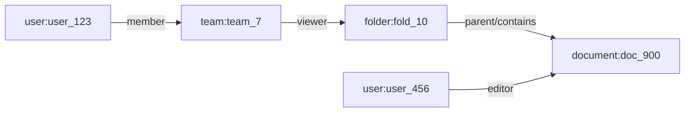
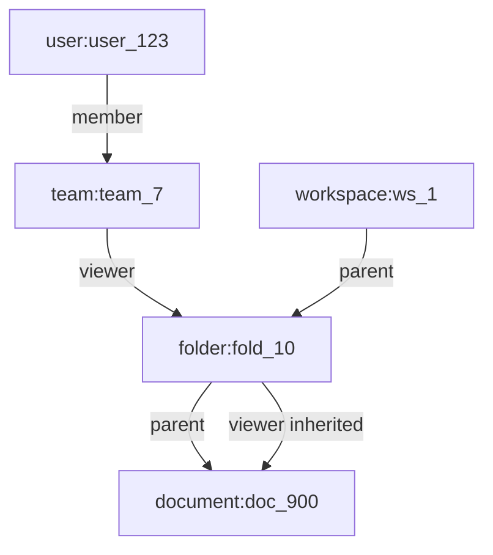

# Part 046 — ReBAC and Zanzibar-style Permissions

RBAC says:

```txt
A user has a role.
```

ABAC says:

```txt
A user and resource have attributes.
```

ReBAC says:

```txt
A user has access because of a relationship path.
```

That path may be direct:

```txt
user_123 is viewer of document_900
```

Or inherited:

```txt
user_123 is member of team_7
team_7 is editor of folder_10
folder_10 contains document_900
therefore user_123 can edit document_900
```

This is the model behind many collaboration systems.

Google Drive-like sharing.

GitHub-like organization/repository/team access.

Slack-like workspace/channel membership.

Figma-like file/project/team permission.

Notion-like page tree inheritance.

Case-management systems with agency, department, team, case, task, evidence, and sealed-document relationships.

ReBAC is what you reach for when the domain says:

```txt
Access follows relationships between things.
```

---

## 1. Why React engineers need ReBAC mental model

A React engineer may not implement the policy engine.

But React must consume the result.

For relationship-based authorization, the UI often needs to answer:

- Can this user open this object?
- Why can this user access it?
- Can this user share it?
- Can this user remove someone else's access?
- Which users have access?
- Which access is direct vs inherited?
- Which action is available because of team membership?
- Which action is blocked because access is inherited and cannot be edited here?
- How do we preview the blast radius of a permission change?

Those are product questions.

But they are also authorization graph questions.

If the frontend treats ReBAC as `permissions: string[]`, it loses critical structure.

---

## 2. Relationship tuple

The primitive in Zanzibar-style systems is often called a relationship tuple.

Shape:

```txt
object#relation@user
```

Example:

```txt
document:doc_900#viewer@user:user_123
```

Read it as:

```txt
user:user_123 is viewer of document:doc_900
```

More examples:

```txt
folder:fold_10#parent@workspace:ws_1
folder:fold_10#viewer@team:team_7#member
document:doc_900#parent@folder:fold_10
document:doc_900#editor@user:user_456
team:team_7#member@user:user_123
```

A tuple is not a role string.

It is a relationship fact.

A collection of relationship facts forms an authorization graph.

---

## 3. The graph mental model



From this graph, we can derive:

```txt
user_123 can view document doc_900 because user_123 is member of team_7, team_7 can view folder fold_10, and doc_900 inherits view from folder fold_10.
```

```txt
user_456 can edit document doc_900 because user_456 is directly editor of doc_900.
```

A React UI may render both as “has access”.

But the admin screen needs to know the difference:

- direct grants can be removed from the document sharing panel
- inherited grants may require changing folder/team membership
- some inherited grants should be visible but not editable
- some inherited grants may be hidden depending on privacy rules

---

## 4. ReBAC vs ACL

ACL and ReBAC overlap.

A simple ACL says:

```txt
document_900 viewers = [user_123, user_456]
```

ReBAC generalizes this:

```txt
document_900 viewer includes:
  direct viewer users
  members of viewer teams
  viewers of parent folder
  owners of workspace
```

ACL is often direct.

ReBAC is graph-derived.

ACL can answer:

```txt
Who is directly on this object?
```

ReBAC can answer:

```txt
Who has access through any allowed relationship path?
```

The difference becomes important when you have:

- teams
- groups
- organizations
- nested folders
- inherited permissions
- shared workspaces
- delegated administration
- parent-child resources
- temporary grants
- block/exception relations

---

## 5. ReBAC authorization model

A Zanzibar-style model defines object types, relations, and derived permissions.

Conceptual example:

```txt
type user

type team
  relations
    define member: [user]

type workspace
  relations
    define owner: [user]
    define member: [user, team#member]
    define admin: owner

type folder
  relations
    define parent: [workspace]
    define viewer: [user, team#member] or viewer from parent or member from parent
    define editor: [user, team#member] or admin from parent

type document
  relations
    define parent: [folder]
    define viewer: [user, team#member] or viewer from parent or editor
    define editor: [user, team#member] or editor from parent
    define owner: [user] or admin from parent
    define can_read: viewer or editor or owner
    define can_write: editor or owner
    define can_share: owner
```

The important idea:

```txt
Relations describe facts.
Permissions derive allowed actions from facts.
```

Do not expose the raw model blindly to React.

React needs a product-oriented projection.

---

## 6. Check API mental model

ReBAC check asks:

```txt
Does user U have relation/permission R on object O?
```

Example:

```json
{
  "user": "user:user_123",
  "relation": "can_read",
  "object": "document:doc_900"
}
```

Response:

```json
{
  "allowed": true
}
```

For React, a single check is rarely enough.

A page may need:

```txt
can_read
can_write
can_comment
can_share
can_delete
can_change_owner
can_view_audit_log
```

Batch response:

```json
{
  "object": "document:doc_900",
  "actions": {
    "document.read": { "allowed": true },
    "document.write": { "allowed": true },
    "document.comment": { "allowed": true },
    "document.share": {
      "allowed": false,
      "reasonCode": "ONLY_OWNER_CAN_SHARE"
    },
    "document.delete": {
      "allowed": false,
      "reasonCode": "INHERITED_EDITOR_ONLY"
    }
  },
  "policyVersion": "doc-authz@2026-07-08.1"
}
```

The frontend should not loop over dozens of individual checks if it can receive a resource permission projection.

Otherwise the UI becomes slow, chatty, and race-prone.

---

## 7. Expand/ListObjects/ListUsers mental model

ReBAC systems often need more than `check`.

They may need:

```txt
Check: Can user U do relation R on object O?
ListObjects: Which objects can user U access by relation R?
ListUsers: Which users can access object O by relation R?
Expand: Why/through which paths is relation R true?
```

Frontend mapping:

| Backend operation | UI usage |
|---|---|
| Check | Enable/disable action. |
| Batch check | Render object page actions. |
| ListObjects | Authorized lists/search/navigation. |
| ListUsers | Sharing dialog, access review. |
| Expand | “Why do I have access?” or admin explanation. |

Be careful.

`ListUsers` and `Expand` can reveal sensitive membership structure.

Not every user who can read a document should be able to see everyone else who can read it.

Access explanation is itself a protected resource.

---

## 8. React projection for ReBAC

For a document page:

```ts
type RebacPermissionProjection = {
  resource: {
    type: "document";
    id: string;
  };
  actions: Record<
    | "document.read"
    | "document.write"
    | "document.comment"
    | "document.share"
    | "document.delete"
    | "document.viewAccess",
    PermissionDecision
  >;
  accessSummary?: {
    direct?: Array<AccessGrant>;
    inherited?: Array<InheritedAccessGrant>;
  };
  policyVersion: string;
  evaluatedAt: string;
};

type AccessGrant = {
  subjectType: "user" | "team";
  subjectId: string;
  relation: "viewer" | "editor" | "owner";
  editable: boolean;
};

type InheritedAccessGrant = {
  subjectType: "user" | "team";
  subjectId: string;
  relation: "viewer" | "editor" | "owner";
  inheritedFrom: {
    type: "workspace" | "folder" | "team";
    id: string;
    label?: string;
  };
  editableAt?: {
    type: "workspace" | "folder" | "team";
    id: string;
  };
};
```

This separates two UI concerns:

1. What can the current user do?
2. What access grants exist on the object?

Those are not the same.

A user may be able to read a document but not view the sharing panel.

A user may be able to view access grants but not edit inherited grants.

---

## 9. Example: sharing dialog

A sharing dialog needs ReBAC structure.

Bad design:

```json
{
  "usersWithAccess": ["Alice", "Bob", "Team Enforcement"]
}
```

This loses:

- direct vs inherited access
- relation level
- editability
- source of inheritance
- revocation path
- whether current user can modify this grant

Better design:

```json
{
  "resource": {
    "type": "document",
    "id": "doc_900"
  },
  "currentUserActions": {
    "document.share": { "allowed": true },
    "document.viewAccess": { "allowed": true }
  },
  "grants": [
    {
      "kind": "direct",
      "subject": { "type": "user", "id": "user_456", "displayName": "Ayu" },
      "relation": "editor",
      "editable": true
    },
    {
      "kind": "inherited",
      "subject": { "type": "team", "id": "team_7", "displayName": "Review Team" },
      "relation": "viewer",
      "inheritedFrom": { "type": "folder", "id": "fold_10", "label": "Regional Cases" },
      "editable": false,
      "editableAt": { "type": "folder", "id": "fold_10" }
    }
  ]
}
```

Now React can render honestly:

```txt
Ayu — Editor — Direct — Remove
Review Team — Viewer — Inherited from Regional Cases — Manage at folder
```

That UI is only possible when the backend exposes relationship-aware projection.

---

## 10. Relationship paths and explanation

Users often ask:

```txt
Why do I have access to this?
```

Or admins ask:

```txt
Why does this user have access?
```

A relationship explanation can look like:

```json
{
  "allowed": true,
  "path": [
    {
      "object": "team:team_7",
      "relation": "member",
      "user": "user:user_123"
    },
    {
      "object": "folder:fold_10",
      "relation": "viewer",
      "user": "team:team_7#member"
    },
    {
      "object": "document:doc_900",
      "relation": "viewer",
      "user": "folder:fold_10#viewer"
    }
  ],
  "message": "You can view this document because you are a member of Review Team, which has viewer access to the parent folder."
}
```

But explanation has risks.

It can reveal:

- hidden team names
- hidden folder names
- private user names
- organizational structure
- sensitive parent resources

So explanation must be permissioned.

Policy question:

```txt
Can subject view the explanation for why user U has relation R on object O?
```

Do not assume everyone can see the graph.

---

## 11. ReBAC and inheritance

Inheritance is where ReBAC shines.

Example:

```txt
Workspace owner can administer all folders.
Folder viewer can view documents inside folder.
Document owner can share document directly.
Team member inherits team grants.
```

Graph:



The frontend needs to understand that inherited grants may not be removable on the child object.

Bad UX:

```txt
Remove Review Team from document doc_900
```

If access is inherited from folder, this action should not be shown as a direct remove.

Better UX:

```txt
Review Team has viewer access from Regional Cases folder.
Manage access at folder.
```

---

## 12. ReBAC and exceptions

Inheritance creates another problem:

```txt
Can a document block an inherited user?
```

Some systems allow deny/exception relations.

Example:

```txt
document:doc_900#blocked@user:user_123
```

Policy:

```txt
can_read = viewer and not blocked
```

This is powerful but dangerous.

Deny semantics can make authorization harder to explain and cache.

Questions to decide:

- Do explicit denies override inherited allows?
- Who can create a deny exception?
- Does deny apply to teams or only users?
- Does deny propagate to child resources?
- Can owner be denied?
- How is deny shown in sharing UI?
- How is deny audited?

For React, explicit deny requires very careful UI copy.

A user may see:

```txt
You cannot access this document.
```

An admin may see:

```txt
Ayu is blocked directly on this document despite inherited team access.
```

Different audiences get different explanations.

---

## 13. ReBAC and contextual tuples

Some relationships are temporary or request-scoped.

Examples:

```txt
user is temporary reviewer because escalation ticket is active
user is support agent because support session is approved
user is emergency responder during incident mode
```

Instead of permanently writing a tuple, some systems allow contextual tuples supplied for one check.

Example conceptual check:

```json
{
  "user": "user:support_123",
  "relation": "can_view",
  "object": "case:case_900",
  "contextualTuples": [
    {
      "object": "case:case_900",
      "relation": "temporary_viewer",
      "user": "user:support_123"
    }
  ],
  "context": {
    "supportTicketId": "SUP-1234",
    "expiresAt": "2026-07-08T04:00:00Z"
  }
}
```

Frontend implication:

- show temporary access banner
- show expiry time
- audit every access
- disable actions outside temporary scope
- revalidate after expiry
- prevent stale cache from preserving temporary access

Contextual access is especially important for support impersonation, break-glass, and emergency operations.

---

## 14. ReBAC and consistency

Authorization graphs change.

A user is removed from a team.

A folder is moved.

A document is shared.

A grant is revoked.

A group sync job updates memberships.

The hard question:

```txt
After revocation, how quickly must access disappear everywhere?
```

For high-risk systems, stale authorization is a security incident.

For collaboration systems, temporary propagation delay may be acceptable if documented and bounded.

React cannot solve backend consistency.

But React can avoid making it worse.

Frontend rules:

```txt
Do not cache permission projections indefinitely.
Invalidate on membership/grant/tenant switch.
Re-check before mutation.
Do not treat old allowedActions as durable grants.
Clear sensitive data when access is revoked.
```

---

## 15. ReBAC and zookies/snapshots mental model

Some Zanzibar-style systems expose a consistency token/snapshot token.

The idea:

```txt
A permission check can be tied to a known authorization data snapshot.
```

The exact implementation differs by system.

The mental model matters:

- permission data has versions
- reads/checks may need consistency guarantees
- UI may need to reload after grant mutation
- a sharing dialog should not show old grants after update
- a mutation should not rely on stale read state

For React, include version metadata in projections when available:

```ts
type RebacProjectionMeta = {
  policyVersion: string;
  relationDataVersion?: string;
  evaluatedAt: string;
};
```

When user updates sharing:

```txt
write relation tuple -> receive new version -> invalidate access query -> reload projection using new version if supported
```

---

## 16. ReBAC query keys in React

Authorization graph context must be part of query identity.

Bad:

```ts
["document", documentId]
```

Better:

```ts
["tenant", tenantId, "document", documentId, "viewer", subjectId]
```

Better for permission projection:

```ts
[
  "tenant",
  tenantId,
  "rebac-permissions",
  "document",
  documentId,
  "subject",
  subjectId,
  "policy",
  policyVersion,
]
```

On grant mutation:

```ts
await updateGrant(input);
queryClient.invalidateQueries({ queryKey: ["tenant", tenantId, "document", documentId] });
queryClient.invalidateQueries({ queryKey: ["tenant", tenantId, "rebac-permissions"] });
queryClient.invalidateQueries({ queryKey: ["tenant", tenantId, "sharing"] });
```

When membership changes, invalidate broader:

```txt
subject session projection
navigation menu
accessible object lists
resource permission projections
sharing dialogs
command palette
```

---

## 17. ReBAC and object movement

Moving objects changes inherited access.

Example:

```txt
Move document doc_900 from folder A to folder B.
```

This may grant access to new users and revoke access from old users.

The UI must not treat move as a simple metadata update.

It is an authorization-changing operation.

Before move, backend can return a preview:

```json
{
  "operation": "move_document",
  "documentId": "doc_900",
  "from": "folder:A",
  "to": "folder:B",
  "accessImpact": {
    "usersLosingAccess": 12,
    "usersGainingAccess": 5,
    "teamsLosingAccess": 2,
    "teamsGainingAccess": 1,
    "containsSensitiveResources": true
  },
  "requiresConfirmation": true
}
```

React should render this as a dangerous operation.

```txt
Moving this document changes who can access it.
```

Not:

```txt
Move file? OK/Cancel
```

In collaboration systems, hierarchy changes are permission changes.

---

## 18. ReBAC and share links

Share links are relationships too.

Example:

```txt
document:doc_900#viewer@link:lnk_123#holder
```

A link holder relationship can mean:

```txt
anyone who possesses this link has viewer access
```

Share links need explicit policy:

- who can create link
- what relation link grants
- whether link is tenant-restricted
- whether link expires
- whether link requires authentication
- whether link can be indexed
- whether link allows download
- whether link access is audited
- whether link can be revoked

React UI must show link risk clearly.

Bad:

```txt
Copy link
```

Better:

```txt
Create view-only link, expires in 7 days, accessible only to signed-in members of Tenant A.
```

For regulated systems, “anyone with link” is often unacceptable.

Make link semantics explicit.

---

## 19. ReBAC and delegated administration

A user may not be global admin.

But they may administer a team, folder, project, or case.

Example relations:

```txt
team:team_7#admin@user:user_123
folder:fold_10#access_manager@team:team_7#admin
```

Derived permission:

```txt
can_manage_access = owner or access_manager
```

Frontend must distinguish:

```txt
Can read object
Can edit object content
Can manage object access
Can administer parent scope
Can manage team membership
```

These are separate actions.

A user might manage access without editing content.

A user might edit content without changing sharing.

Do not collapse everything into `isAdmin`.

---

## 20. ReBAC and teams/groups

Teams are not just labels.

They are relationship nodes.

```txt
team:team_7#member@user:user_123
folder:fold_10#viewer@team:team_7#member
```

Important UI questions:

- Is the team synced from IdP or managed locally?
- Can current user see team membership?
- Can current user add/remove team members?
- Does team grant apply immediately?
- Is team membership tenant-scoped?
- Are nested teams allowed?
- Are external users allowed?

Team membership visibility is sensitive.

A user may know that “Review Team” has access, but not see all members.

React should consume separate permissions:

```txt
team.view
team.view_members
document.view_access
document.manage_access
```

---

## 21. ReBAC and multi-tenant SaaS

In multi-tenant systems, every tuple should be tenant-bound either directly or structurally.

Risky tuple:

```txt
document:doc_900#viewer@user:user_123
```

Safer identity includes tenant namespace or object belongs to tenant-scoped namespace:

```txt
tenant:tenant_001/document:doc_900#viewer@tenant:tenant_001/user:user_123
```

Or the authorization service stores tenant as part of object type/key.

The exact notation is implementation-specific.

The invariant is not:

```txt
we included tenant in the UI route
```

The invariant is:

```txt
a subject from tenant A cannot acquire relation-derived access to tenant B resources unless an explicit cross-tenant sharing policy permits it.
```

Frontend implications:

- tenant is part of route and query keys
- tenant switch clears caches
- sharing dialogs restrict principal search to allowed tenants
- access grants display tenant affiliation when relevant
- cross-tenant sharing has explicit warning and audit

---

## 22. ReBAC and direct API enforcement

React may receive:

```json
{
  "actions": {
    "document.write": { "allowed": true }
  }
}
```

A user clicks save.

Backend must still check:

```txt
check(user:user_123, can_write, document:doc_900)
```

Why?

Because between render and submit:

- user may be removed from team
- document may be moved
- grant may be revoked
- document may be locked
- session may change
- step-up may expire
- policy may change

Frontend projection is a snapshot.

Mutation enforcement is live.

---

## 23. ReBAC and action mapping

Zanzibar-style relations often have names like:

```txt
viewer
editor
owner
can_read
can_write
can_share
```

Product actions may be:

```txt
document.download
document.rename
document.move
document.share
document.archive
document.delete
document.view_audit_log
```

Do not make React map product actions to low-level relations ad hoc.

Centralize mapping on the backend or in a shared contract.

Example:

```ts
const documentActionToRelation = {
  "document.read": "can_read",
  "document.download": "can_download",
  "document.update": "can_write",
  "document.rename": "can_write_metadata",
  "document.share": "can_share",
  "document.delete": "can_delete",
  "document.viewAccess": "can_view_access",
} as const;
```

Better: backend returns the action decisions directly.

React should not need to know whether `document.download` maps to `viewer`, `editor`, or `can_download`.

---

## 24. ReBAC performance from frontend perspective

Authorization checks can become expensive.

Common frontend symptoms:

- page loads slowly because every row calls `check`
- table action menu waits for N permission requests
- sharing dialog expands entire graph unnecessarily
- command palette checks every command individually
- route waterfall: session -> resource -> permission -> grants -> explanation

Better pattern:

```txt
Batch checks.
Return permission projection with resource data.
Avoid explanation by default.
Paginate access lists.
Use server-side filtering for list/search.
Cache carefully with versioning.
```

For a table:

```http
GET /documents?folder=fold_10&include=allowedActions
```

Response:

```json
{
  "items": [
    {
      "id": "doc_1",
      "title": "Notice A",
      "allowedActions": ["document.read", "document.comment"]
    },
    {
      "id": "doc_2",
      "title": "Notice B",
      "allowedActions": ["document.read", "document.write", "document.share"]
    }
  ]
}
```

Do not issue one network request per row action.

---

## 25. ReBAC failure modes

| Failure | Cause | Symptom | Fix |
|---|---|---|---|
| Direct vs inherited confusion | UI flattens grants | User tries to remove inherited access on child | Return grant source/editability. |
| Stale graph | Membership/grant changed | User retains action in UI | Versioned projection and invalidation. |
| N+1 checks | One check per row/action | Slow pages | Batch/project permissions. |
| Overexposed graph | UI exposes explanation to all | Membership/org leak | Permission explanation separately. |
| Missing tenant namespace | Cross-tenant tuple ambiguity | Tenant data leak | Tenant-bound tuple/object identity. |
| Move without access preview | Hierarchy change | Unexpected access grant/revoke | Access impact preview. |
| Share link ambiguity | Link semantics unclear | Public leakage | Explicit link policy and UI copy. |
| Policy/UI drift | React maps relation incorrectly | Wrong button state | Backend action projection. |
| Revocation delay ignored | Eventual consistency | User acts after revoke | Re-check mutation, clear caches, bound staleness. |
| Nested group explosion | Deep relationship graph | Slow checks/timeouts | Model constraints, depth limits, caching. |

---

## 26. ReBAC testing matrix

Test relationship paths, not just users.

| Scenario | Tuples | Check | Expected |
|---|---|---|---|
| Direct viewer | `doc#viewer@user` | can_read | permit |
| Direct editor | `doc#editor@user` | can_write | permit |
| Team viewer | `team#member@user`, `doc#viewer@team#member` | can_read | permit |
| Parent folder viewer | `folder#viewer@user`, `doc#parent@folder` | can_read | permit |
| Parent editor | `folder#editor@user`, `doc#parent@folder` | can_write | permit if inherited |
| Blocked user | `doc#viewer@team#member`, `doc#blocked@user` | can_read | deny if deny supported |
| Removed from team | old team tuple deleted | can_read | deny after consistency window |
| Cross-tenant user | user tenant A, doc tenant B | can_read | deny |
| Share manager | `doc#access_manager@user` | document.share | permit |
| Viewer only | `doc#viewer@user` | document.share | deny |

Frontend tests:

- direct grant renders removable
- inherited grant renders source and non-removable state
- current user can share only when `document.share` allowed
- explanation panel hidden unless `document.viewAccess` allowed
- move dialog shows access impact when returned
- grant update invalidates document/sharing/permission queries
- tenant switch clears access projection
- denied mutation updates stale UI state

---

## 27. Reference React patterns

### 27.1 Permissioned document actions

```tsx
type PermissionDecision = {
  allowed: boolean;
  reasonCode?: string;
  message?: string;
};

type DocumentPermissions = {
  actions: Record<string, PermissionDecision>;
};

function DocumentToolbar({ permissions }: { permissions: DocumentPermissions }) {
  return (
    <div role="toolbar">
      <Action decision={permissions.actions["document.write"]}>Edit</Action>
      <Action decision={permissions.actions["document.comment"]}>Comment</Action>
      <Action decision={permissions.actions["document.share"]}>Share</Action>
      <Action decision={permissions.actions["document.delete"]}>Delete</Action>
    </div>
  );
}

function Action({
  decision,
  children,
}: {
  decision?: PermissionDecision;
  children: React.ReactNode;
}) {
  const effective = decision ?? { allowed: false, reasonCode: "UNKNOWN_PERMISSION" };

  return (
    <button disabled={!effective.allowed} title={effective.message ?? effective.reasonCode}>
      {children}
    </button>
  );
}
```

Default to deny when decision is missing.

---

### 27.2 Sharing grants list

```tsx
type GrantRow = {
  kind: "direct" | "inherited";
  subject: {
    type: "user" | "team";
    displayName: string;
  };
  relation: "viewer" | "editor" | "owner";
  editable: boolean;
  inheritedFrom?: {
    type: "workspace" | "folder" | "team";
    label: string;
  };
  editableAt?: {
    type: "workspace" | "folder" | "team";
    id: string;
  };
};

function SharingGrantRow({ grant }: { grant: GrantRow }) {
  return (
    <li>
      <strong>{grant.subject.displayName}</strong> — {grant.relation}
      {grant.kind === "inherited" && grant.inheritedFrom ? (
        <span> inherited from {grant.inheritedFrom.label}</span>
      ) : (
        <span> direct</span>
      )}
      {grant.editable ? (
        <button>Remove</button>
      ) : grant.editableAt ? (
        <button>Manage at {grant.editableAt.type}</button>
      ) : null}
    </li>
  );
}
```

The UI does not guess inheritance.

It renders the backend projection.

---

### 27.3 Access impact preview

```tsx
type AccessImpactPreview = {
  usersGainingAccess: number;
  usersLosingAccess: number;
  teamsGainingAccess: number;
  teamsLosingAccess: number;
  containsSensitiveResources: boolean;
  requiresConfirmation: boolean;
};

function MoveImpactWarning({ impact }: { impact: AccessImpactPreview }) {
  if (!impact.requiresConfirmation) return null;

  return (
    <section aria-label="Access impact warning">
      <h3>This move changes access</h3>
      <p>
        {impact.usersGainingAccess} users may gain access and {impact.usersLosingAccess} users may lose access.
      </p>
      {impact.containsSensitiveResources ? (
        <p>This item contains sensitive resources. Review before continuing.</p>
      ) : null}
    </section>
  );
}
```

Hierarchy operations deserve security-aware UX.

---

## 28. ReBAC and regulatory defensibility

For regulated systems, ReBAC must explain not only whether access was allowed, but why.

Audit should capture:

```txt
subject
resource
action
decision
relation path or summarized reason
policy/model version
relation data version if available
request context
correlation id
time
```

Example audit event:

```json
{
  "eventType": "authorization.decision",
  "subject": "user:user_123",
  "action": "case.read",
  "resource": "case:case_900",
  "decision": "permit",
  "reason": "team_membership_inherited_from_case_team",
  "pathSummary": [
    "user:user_123 member team:team_7",
    "team:team_7 reviewer case:case_900"
  ],
  "policyVersion": "case-rebac@2026-07-08.1",
  "relationDataVersion": "zookie_or_revision_abc",
  "correlationId": "req_123"
}
```

React should not necessarily receive this full event.

But the product should be designed so support/security teams can answer:

```txt
Why did this user have access at that time?
```

Without that, ReBAC becomes operationally opaque.

---

## 29. ReBAC is not always the right choice

Use ReBAC when:

- access follows resource hierarchy
- teams/groups matter
- sharing is core product behavior
- direct and inherited permissions must coexist
- collaboration graph is large
- object-level authorization dominates
- users need delegated administration

Avoid or delay ReBAC when:

- permissions are purely global roles
- resources are flat and simple
- there is no sharing/inheritance
- policy is mostly attribute thresholds
- the team cannot operate a graph authorization model
- you do not need relationship explanation

ReBAC adds complexity:

- model design
- tuple lifecycle
- consistency semantics
- batch check performance
- explainability
- migration
- UI projection
- operational tooling

Do not introduce ReBAC because it sounds sophisticated.

Introduce it because the domain is graph-shaped.

---

## 30. Anti-pattern catalog

### Anti-pattern 1 — Flattening all access into roles

```txt
workspace_admin_document_editor_folder_viewer_team_member
```

This is role explosion.

Use relationships.

### Anti-pattern 2 — Hiding inherited access source

```txt
Review Team — Viewer
```

User cannot tell why it exists or where to manage it.

Show source when allowed:

```txt
Review Team — Viewer — inherited from Regional Cases folder
```

### Anti-pattern 3 — React computes relationship graph locally

Do not ship graph policy and tuple data to the browser so React can decide security.

Frontend may render a projection.

Backend enforces.

### Anti-pattern 4 — One check per row

A table with 100 rows and 5 actions should not trigger 500 authorization requests from the browser.

Batch or project permissions server-side.

### Anti-pattern 5 — Sharing mutation without preview

Changing parent, team, or link access can affect many users.

Preview blast radius for high-risk operations.

### Anti-pattern 6 — Treating explanation as harmless

Authorization explanation can leak org structure.

Permission the explanation view.

---

## 31. ReBAC implementation checklist

```txt
[ ] Object types and relations are documented.
[ ] Product actions are mapped to backend permissions centrally.
[ ] React consumes action decisions, not raw graph policy.
[ ] Direct and inherited grants are represented separately.
[ ] Grant editability is explicit.
[ ] Access explanation is separately permissioned.
[ ] Tenant boundary is encoded in object/principal identity.
[ ] Mutation endpoints re-check authorization.
[ ] List/search endpoints are server-filtered.
[ ] Batch permission projection avoids N+1 checks.
[ ] Grant/membership mutation invalidates permission caches.
[ ] Object movement has access impact preview where needed.
[ ] Share links have explicit semantics and expiry/revocation policy.
[ ] Audit captures decision, policy version, and relation-data version where possible.
[ ] Revocation staleness is bounded and documented.
[ ] Tests cover direct, inherited, group, blocked, cross-tenant, and stale-graph cases.
```

---

## 32. Mental model summary

ReBAC is graph-based authorization.

Users get access because of relationship paths.

A relationship tuple is a fact.

A permission is derived from facts.

React should not evaluate the graph as the security boundary.

React should consume a projection that answers:

```txt
What can the current user do here?
What access grants are visible here?
Which grants are direct or inherited?
Where can access be managed?
What changed when the user edits relationships?
```

The backend must answer and enforce:

```txt
Does this subject have this relation/permission on this object right now?
```

For collaboration-heavy systems, ReBAC is often the right mental model.

For simple global permissions, it is probably overkill.

Use it when the domain is a graph.

Not because the architecture diagram looks impressive.

---

## 33. References

- Google Research / USENIX ATC 2019, *Zanzibar: Google's Consistent, Global Authorization System*.
- OpenFGA documentation: authorization concepts and relationship tuples.
- Authzed SpiceDB documentation on Zanzibar concepts.
- OWASP Authorization Cheat Sheet.
- Research literature on Relationship-Based Access Control.
