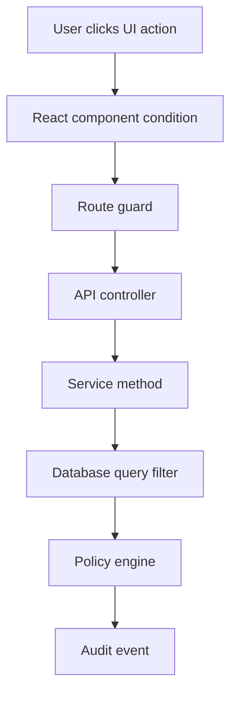
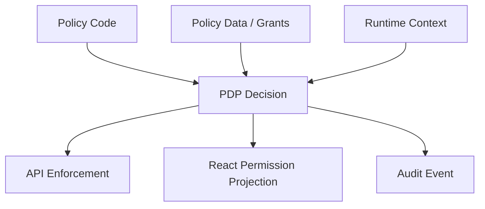
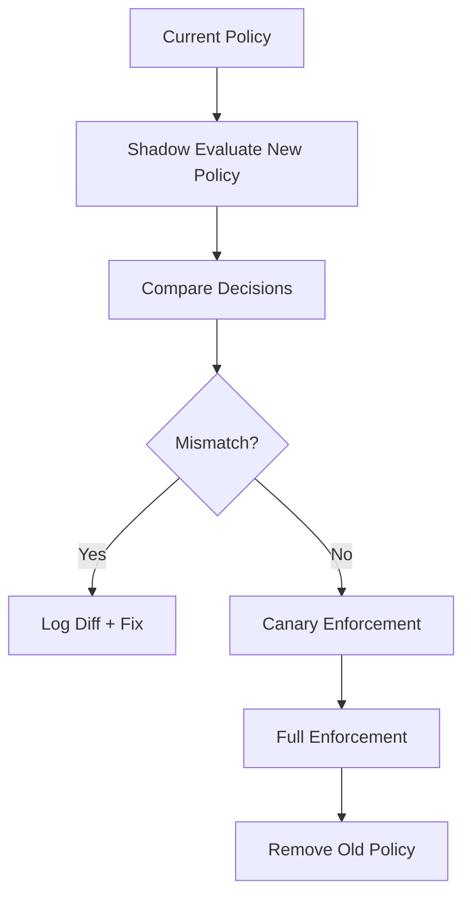
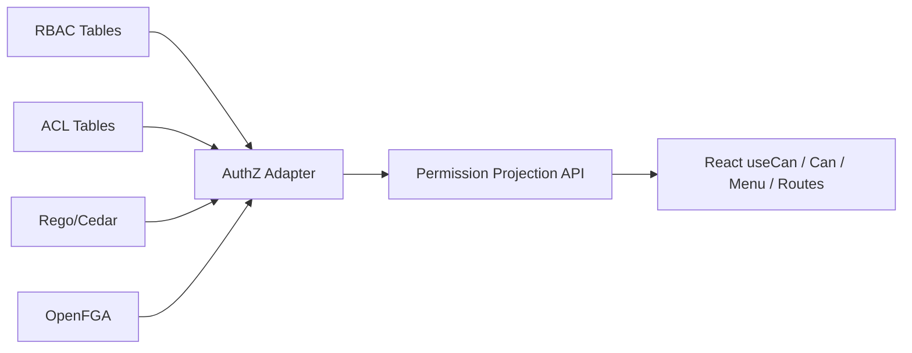
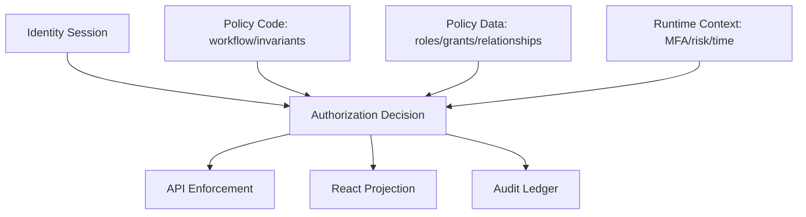

# Part 047 — Policy as Data vs Policy as Code

Authorization logic has to live somewhere.

Most teams do not decide where it lives.

It just grows.

First it appears as a button condition:

```tsx
{user.role === "admin" && <DeleteButton />}
```

Then it appears again in a route guard:

```tsx
if (user.role !== "admin") return <Navigate to="/403" />;
```

Then again in the API:

```ts
if (req.user.role !== "admin") throw forbidden();
```

Then the product asks:

```txt
Managers can approve cases in their own region,
but not cases they created,
unless the case is escalated,
except super-reviewers can approve escalated cases after MFA.
```

At that moment, `user.role === "admin"` is not an authorization system.

It is technical debt with a security boundary attached.

This part answers one design question:

```txt
Should authorization rules be represented as data, as code, or as a dedicated policy language?
```

The React-specific answer is sharper:

```txt
React should not own policy.
React should consume a policy projection.
```

But to design the projection correctly, React engineers need to understand where the policy decision actually comes from.

---

## 1. The real problem: policy placement

Authorization policy can be scattered across many places:



If every layer makes a slightly different decision, the system is broken.

The goal is not to have only one line of code.

The goal is to have one **source of authorization truth** and multiple **enforcement/projection points**.

A healthy system separates:

```txt
Policy authoring
Policy evaluation
Policy enforcement
Policy projection
Policy explanation
Policy audit
```

React mainly participates in projection and user experience.

The backend participates in enforcement.

The policy system participates in decision-making.

---

## 2. Vocabulary

Use precise names.

Vague terms create bad systems.

### 2.1 Policy

A policy is a rule that decides whether a subject may perform an action on a resource under a context.

```txt
subject + action + resource + context -> decision
```

Example:

```txt
User 123 may approve Case 900 when:
- user is assigned reviewer
- case is in review state
- user did not create the case
- user's region matches case region
- MFA is fresh within 10 minutes
```

### 2.2 Policy data

Policy data is structured information used by policy evaluation.

Examples:

```txt
role assignments
permission grants
team membership
resource ownership
case state
organization membership
delegations
temporary access grants
feature entitlements
```

### 2.3 Policy code

Policy code is executable logic used to evaluate a decision.

Examples:

```ts
function canApproveCase(user, caseRecord, context) {
  return user.region === caseRecord.region &&
    caseRecord.state === "IN_REVIEW" &&
    caseRecord.createdBy !== user.id;
}
```

Or policy-language logic:

```rego
allow if {
  input.action == "case.approve"
  input.resource.state == "IN_REVIEW"
  input.subject.region == input.resource.region
  input.subject.id != input.resource.createdBy
}
```

Or Cedar-like policy:

```cedar
permit(
  principal,
  action == Action::"case.approve",
  resource
)
when {
  resource.state == "IN_REVIEW" &&
  principal.region == resource.region &&
  principal.id != resource.createdBy
};
```

### 2.4 Policy decision point

The component that answers:

```txt
allow, deny, or require something else?
```

Common abbreviation: **PDP**.

### 2.5 Policy enforcement point

The component that blocks or allows the operation.

Common abbreviation: **PEP**.

In a React app, a disabled button is not the real PEP.

The API endpoint is the real PEP.

The React button is a projection point.

### 2.6 Policy information point

The source of facts used in the policy decision.

Common abbreviation: **PIP**.

Examples:

```txt
identity provider
user database
role table
relationship graph
case database
risk engine
MFA freshness service
subscription/entitlement service
```

### 2.7 Policy administration point

The place where policy or grants are authored and changed.

Common abbreviation: **PAP**.

Examples:

```txt
admin console
role editor
sharing dialog
access request approval screen
Cedar/Rego repository
OpenFGA model migration
permission config table
```

---

## 3. The four common policy locations

There are four common patterns.

```txt
1. Hardcoded authorization
2. Policy as data
3. Policy as code
4. Policy as externalized service/language
```

They are not mutually exclusive.

Production systems often use a layered mix.

---

## 4. Pattern 1 — Hardcoded authorization

Hardcoded authorization means the rule is directly written in application code.

```ts
if (user.role !== "ORG_ADMIN") {
  throw forbidden("Only org admins can invite users");
}
```

This is not always wrong.

It is wrong when it becomes scattered, duplicated, untested, or impossible to audit.

### 4.1 Good use cases

Hardcoded policy can be acceptable when:

```txt
The rule is stable.
The rule is simple.
The rule is tied to an invariant.
The rule rarely changes by tenant/customer.
The rule is covered by tests.
The rule is not duplicated in many places.
```

Example:

```ts
function assertSameTenant(subject: Subject, resource: TenantScopedResource) {
  if (subject.tenantId !== resource.tenantId) {
    throw forbidden("Cross-tenant access denied");
  }
}
```

Tenant isolation is often a hard invariant.

It should not be an editable admin setting.

### 4.2 Bad use cases

Hardcoded policy becomes dangerous when:

```txt
Business users need to change it.
Policy differs per tenant.
Policy has many exceptions.
Policy needs audit explanation.
Policy requires staged rollout.
Policy is duplicated across services.
Policy changes without engineering deployment.
```

Example smell:

```tsx
const canApprove =
  user.role === "manager" &&
  caseItem.status === "PENDING" &&
  caseItem.region === user.region &&
  caseItem.createdBy !== user.id;
```

This is policy embedded in UI.

The UI may show the right button, but the server still needs to enforce it.

Worse: if server code independently implements a slightly different rule, the system now has decision drift.

---

## 5. Pattern 2 — Policy as data

Policy as data means the authorization model is represented through database records or configuration.

Examples:

```txt
roles table
role_permissions table
user_roles table
resource_acl table
user_group_membership table
temporary_grants table
workflow_transition_permissions table
```

The evaluation code may be generic.

The policy changes by changing data.

### 5.1 RBAC as data

```sql
create table roles (
  id text primary key,
  tenant_id text not null,
  name text not null
);

create table permissions (
  id text primary key,
  action text not null,
  resource_type text not null
);

create table role_permissions (
  role_id text not null,
  permission_id text not null,
  primary key (role_id, permission_id)
);

create table user_roles (
  user_id text not null,
  tenant_id text not null,
  role_id text not null,
  primary key (user_id, tenant_id, role_id)
);
```

Decision:

```ts
type PermissionCheck = {
  subjectId: string;
  tenantId: string;
  action: string;
  resourceType: string;
};

async function canByRole(check: PermissionCheck): Promise<boolean> {
  const rows = await db.query(`
    select 1
    from user_roles ur
    join role_permissions rp on rp.role_id = ur.role_id
    join permissions p on p.id = rp.permission_id
    where ur.user_id = $1
      and ur.tenant_id = $2
      and p.action = $3
      and p.resource_type = $4
    limit 1
  `, [check.subjectId, check.tenantId, check.action, check.resourceType]);

  return rows.length > 0;
}
```

This is policy as data.

The roles and grants are data.

The evaluator is code.

### 5.2 ACL as data

```sql
create table resource_grants (
  tenant_id text not null,
  resource_type text not null,
  resource_id text not null,
  grantee_type text not null, -- user | group | role
  grantee_id text not null,
  relation text not null, -- owner | editor | viewer | approver
  expires_at timestamptz,
  created_by text not null,
  created_at timestamptz not null,
  primary key (
    tenant_id,
    resource_type,
    resource_id,
    grantee_type,
    grantee_id,
    relation
  )
);
```

Decision:

```ts
async function canViewDocument(input: {
  tenantId: string;
  userId: string;
  documentId: string;
}): Promise<boolean> {
  return db.exists(`
    select 1
    from resource_grants g
    where g.tenant_id = $1
      and g.resource_type = 'document'
      and g.resource_id = $2
      and g.grantee_type = 'user'
      and g.grantee_id = $3
      and g.relation in ('owner', 'editor', 'viewer')
      and (g.expires_at is null or g.expires_at > now())
  `, [input.tenantId, input.documentId, input.userId]);
}
```

Again: data drives the rule.

### 5.3 Strengths

Policy as data is strong when:

```txt
Users/admins manage permissions.
Grants are object-specific.
Permission changes must be immediate.
Access review matters.
Audit trail matters.
The domain is mostly grant/revoke.
```

It fits:

```txt
sharing dialogs
role management screens
team membership
project membership
temporary access
case assignment
workflow delegation
```

### 5.4 Weaknesses

Policy as data becomes awkward when logic is complex:

```txt
Allow if case is escalated and user is reviewer, unless user created the case, except regional supervisors can approve after step-up MFA.
```

You can encode this as tables.

But after enough exceptions, the tables become a programming language disguised as admin configuration.

Smell:

```txt
rules table
conditions table
condition_groups table
operators table
left_operand table
right_operand table
expression_order table
```

At that point, you are building a policy language.

Do it intentionally, or use one.

---

## 6. Pattern 3 — Policy as code

Policy as code means policy is explicit, versioned, reviewed, and tested as executable code or a policy language artifact.

The policy may be in:

```txt
TypeScript
Java/Kotlin/C#
Rego
Cedar
CEL
custom DSL
```

The important property is not the language.

The important property is:

```txt
Policy changes go through engineering-quality lifecycle.
```

That means:

```txt
version control
review
tests
simulation
deployment
rollback
audit trail
static analysis where possible
```

### 6.1 TypeScript policy module

A small domain may use ordinary application code:

```ts
type Decision =
  | { effect: "allow" }
  | { effect: "deny"; reason: string }
  | { effect: "require_step_up"; reason: string; maxAgeSeconds: number };

type Subject = {
  id: string;
  tenantId: string;
  roles: string[];
  region?: string;
  authTime?: number;
};

type CaseResource = {
  id: string;
  tenantId: string;
  state: "DRAFT" | "IN_REVIEW" | "APPROVED" | "REJECTED";
  region: string;
  createdBy: string;
  assignedReviewerIds: string[];
};

export function decideCaseApprove(input: {
  subject: Subject;
  resource: CaseResource;
  now: number;
}): Decision {
  const { subject, resource, now } = input;

  if (subject.tenantId !== resource.tenantId) {
    return { effect: "deny", reason: "TENANT_MISMATCH" };
  }

  if (resource.state !== "IN_REVIEW") {
    return { effect: "deny", reason: "CASE_NOT_IN_REVIEW" };
  }

  if (resource.createdBy === subject.id) {
    return { effect: "deny", reason: "CREATOR_CANNOT_APPROVE" };
  }

  const isAssigned = resource.assignedReviewerIds.includes(subject.id);
  const isRegionalSupervisor =
    subject.roles.includes("REGIONAL_SUPERVISOR") &&
    subject.region === resource.region;

  if (!isAssigned && !isRegionalSupervisor) {
    return { effect: "deny", reason: "NOT_ASSIGNED_REVIEWER" };
  }

  const authAgeSeconds = subject.authTime
    ? Math.floor((now - subject.authTime) / 1000)
    : Number.POSITIVE_INFINITY;

  if (authAgeSeconds > 600) {
    return {
      effect: "require_step_up",
      reason: "MFA_REQUIRED_FOR_APPROVAL",
      maxAgeSeconds: 600,
    };
  }

  return { effect: "allow" };
}
```

This is much better than scattering `if` statements.

But it still has one risk:

```txt
The policy is coupled to the application runtime and language.
```

For a single service, that may be fine.

For many services, many stacks, or strong audit needs, externalized policy may be better.

### 6.2 Rego/OPA-style policy

OPA/Rego-style policy is often used when you want centralized, queryable policy evaluation across services and infrastructure.

Conceptually:

```rego
package cases.authz

default allow := false

allow if {
  input.action == "case.approve"
  input.subject.tenant_id == input.resource.tenant_id
  input.resource.state == "IN_REVIEW"
  input.subject.id != input.resource.created_by
  input.subject.id in input.resource.assigned_reviewer_ids
}
```

React should not execute this policy.

React should consume the result:

```json
{
  "resource": { "type": "case", "id": "case_900" },
  "actions": {
    "case.approve": {
      "effect": "allow"
    }
  }
}
```

### 6.3 Cedar-style policy

Cedar-style policy uses a principal/action/resource/context model.

Conceptual example:

```cedar
permit(
  principal,
  action == Action::"case.approve",
  resource
)
when {
  principal.tenant == resource.tenant &&
  resource.state == "IN_REVIEW" &&
  principal.id != resource.createdBy &&
  principal in resource.assignedReviewers
};
```

This is useful when you want a policy language designed specifically for application authorization, policy validation, and analyzability.

### 6.4 OpenFGA-style model

OpenFGA/Zanzibar-style policy often focuses on relationships:

```fga
model
  schema 1.1

type user

type team
  relations
    define member: [user]

type document
  relations
    define owner: [user]
    define editor: [user, team#member] or owner
    define viewer: [user, team#member] or editor
```

Relationship data:

```txt
document:doc_1#editor@team:case_reviewers#member
team:case_reviewers#member@user:alice
```

Decision:

```txt
Can user:alice view document:doc_1?
Yes, because alice is member of a team that is editor, and editor implies viewer.
```

React should not traverse this graph.

React asks for a projection:

```json
{
  "resource": { "type": "document", "id": "doc_1" },
  "relations": ["viewer", "editor"],
  "actions": {
    "document.view": { "effect": "allow" },
    "document.edit": { "effect": "allow" },
    "document.delete": { "effect": "deny", "reason": "NOT_OWNER" }
  }
}
```

---

## 7. Policy as data vs policy as code: the real distinction

The distinction is not “database vs file”.

The distinction is:

```txt
Who changes the rule?
How often does it change?
How complex is the logic?
How much review is required?
How much explanation/audit is required?
```

### 7.1 Policy as data

Use when access is configured as business data.

```txt
Alice is editor of Project A.
Bob is approver for Region B.
Team Red can view Case C.
This temporary grant expires Friday.
This role includes case.read and case.comment.
```

The rule shape is stable.

The assignments change often.

### 7.2 Policy as code

Use when the logic itself matters.

```txt
Creators cannot approve their own cases.
Approvals over threshold require step-up MFA.
External users cannot export evidence.
Escalated cases require supervisor review.
Sealed evidence can only be opened under special authorization.
```

The assignments may be data.

The rule shape should be versioned, reviewed, and tested.

### 7.3 Hybrid model

Most serious systems are hybrid.



Example:

```txt
Policy code:
  Creators cannot approve their own case.

Policy data:
  Alice is assigned reviewer for Case 900.

Runtime context:
  Alice completed MFA 3 minutes ago.

Decision:
  allow case.approve.
```

---

## 8. Decision framework

Use this as an architecture review table.

| Question | Prefer policy as data | Prefer policy as code |
|---|---|---|
| Who changes it? | Admin/customer/product ops | Engineers/security review |
| Change frequency | Frequent | Controlled release cadence |
| Rule shape | Stable | Complex/evolving |
| Examples | role grants, ACL, team membership | separation of duties, workflow constraints |
| Audit need | grant history | policy version + decision trace |
| Testing | fixture data + matrix | unit/property/golden tests |
| React dependency | consumes derived grants/actions | consumes derived decisions/actions |
| Failure risk | stale grants, bad admin config | bad deployment, policy regression |
| Rollback | revert data/config | revert policy version/deploy |

A practical rule:

```txt
Put facts in data.
Put invariants in code.
Expose decisions to React.
Enforce decisions on the server.
```

---

## 9. What React should never do

React should never be the policy engine for sensitive decisions.

Bad:

```tsx
function ApproveButton({ user, caseItem }: Props) {
  const canApprove =
    user.roles.includes("reviewer") &&
    caseItem.status === "IN_REVIEW" &&
    user.region === caseItem.region &&
    user.id !== caseItem.createdBy;

  if (!canApprove) return null;

  return <button onClick={approve}>Approve</button>;
}
```

This duplicates business authorization inside UI.

Better:

```tsx
function ApproveButton({ caseId }: { caseId: string }) {
  const { can, reason } = useResourceAction("case", caseId, "case.approve");

  if (!can) {
    return <RequestAccessHint reason={reason} />;
  }

  return <button onClick={() => approve(caseId)}>Approve</button>;
}
```

And the mutation still enforces on the server:

```ts
app.post("/cases/:caseId/approve", async (req, res) => {
  const subject = await requireSubject(req);
  const caseRecord = await caseRepo.get(req.params.caseId);

  const decision = await authz.decide({
    subject,
    action: "case.approve",
    resource: caseRecord,
    context: {
      authTime: subject.authTime,
      requestId: req.id,
    },
  });

  if (decision.effect !== "allow") {
    throw forbidden(decision);
  }

  await approveCase(caseRecord.id, subject.id);
  res.status(204).send();
});
```

React projection improves UX.

Server enforcement protects resources.

---

## 10. The policy projection layer

The backend should expose decisions in a frontend-friendly shape.

Not raw policy.

Not role internals.

Not provider claims.

Projection example:

```json
{
  "schemaVersion": "2026-07-08",
  "subject": {
    "id": "user_123",
    "tenantId": "tenant_abc"
  },
  "resource": {
    "type": "case",
    "id": "case_900",
    "version": "17"
  },
  "actions": {
    "case.view": {
      "effect": "allow"
    },
    "case.edit": {
      "effect": "deny",
      "reason": "CASE_LOCKED"
    },
    "case.approve": {
      "effect": "require_step_up",
      "reason": "MFA_REQUIRED",
      "requirements": [
        {
          "type": "mfa",
          "maxAgeSeconds": 600
        }
      ]
    }
  }
}
```

This lets React answer:

```txt
Should I show the button?
Should it be disabled?
Should I show a request-access link?
Should I trigger step-up auth?
Should I show a reason?
```

Without teaching React the full policy engine.

---

## 11. Policy versioning

Authorization bugs are often caused by drift.

Drift appears when:

```txt
frontend uses old permission vocabulary
backend uses new policy version
cached projection uses stale grants
admin UI edits old role model
mobile app uses old action names
```

Every non-trivial policy system needs versioning.

### 11.1 Version the action vocabulary

```ts
export const ACTIONS = {
  CASE_VIEW: "case.view",
  CASE_EDIT: "case.edit",
  CASE_APPROVE: "case.approve",
  CASE_EXPORT: "case.export",
} as const;
```

Action names are API contract.

Do not rename them casually.

Prefer additive migration:

```txt
case.approve.v2   // rarely ideal
case.approve      // stable public action name
internal policy version = 2026-07-08
```

Usually, keep the action stable and version the policy implementation.

### 11.2 Version the decision contract

```ts
type PermissionProjectionV1 = {
  schemaVersion: "authz.projection.v1";
  actions: Record<string, {
    effect: "allow" | "deny" | "require_step_up";
    reason?: string;
  }>;
};
```

When adding new fields, keep old fields compatible.

### 11.3 Version the policy model

Policy-as-code systems should attach a policy/model version to decisions.

```json
{
  "effect": "deny",
  "reason": "CREATOR_CANNOT_APPROVE",
  "policyVersion": "case-authz-2026-07-08.3",
  "decisionId": "dec_01JZ..."
}
```

This matters during incidents.

You need to answer:

```txt
Which policy version denied or allowed this action?
```

---

## 12. Policy migrations

Authorization migrations are risky because they can silently overgrant or undergrant.

Use a staged migration.



### 12.1 Shadow evaluation

Run old and new policy in parallel.

```ts
const oldDecision = await oldAuthz.decide(input);
const newDecision = await newAuthz.decide(input);

if (oldDecision.effect !== newDecision.effect) {
  audit.policyDiff({
    subjectId: input.subject.id,
    action: input.action,
    resource: ref(input.resource),
    oldDecision,
    newDecision,
  });
}

return oldDecision; // until cutover
```

### 12.2 Golden matrix

Create a decision matrix.

```ts
describe("case approval policy", () => {
  test.each([
    ["assigned reviewer", assignedReviewer(), inReviewCase(), "allow"],
    ["creator cannot approve", creatorReviewer(), inReviewCase(), "deny"],
    ["wrong region", regionalSupervisorWrongRegion(), inReviewCase(), "deny"],
    ["requires step up", reviewerWithOldMfa(), inReviewCase(), "require_step_up"],
  ])("%s", (_, subject, resource, expected) => {
    expect(decideCaseApprove({ subject, resource, now }).effect).toBe(expected);
  });
});
```

The matrix becomes living documentation.

---

## 13. React impact of policy placement

React needs a stable permission interface no matter where policy lives.

Whether backend uses RBAC tables, Cedar, Rego, OpenFGA, or custom code, React should receive a normalized decision shape.



This isolates React from backend policy churn.

Bad coupling:

```tsx
if (user.roles.includes("REGIONAL_SUPERVISOR")) { ... }
```

Better coupling:

```tsx
if (can("case.approve")) { ... }
```

Best coupling for resource actions:

```tsx
const action = useActionDecision({
  resourceType: "case",
  resourceId: caseId,
  action: "case.approve",
});

if (action.effect === "require_step_up") {
  return <StepUpButton requirements={action.requirements} />;
}
```

---

## 14. Policy decision granularity

Do not expose only one boolean.

A boolean is easy but loses meaning.

Bad:

```json
{
  "canApprove": false
}
```

Better:

```json
{
  "actions": {
    "case.approve": {
      "effect": "deny",
      "reason": "CREATOR_CANNOT_APPROVE",
      "recoverable": false
    }
  }
}
```

Best for mature systems:

```json
{
  "actions": {
    "case.approve": {
      "effect": "deny",
      "reason": "CREATOR_CANNOT_APPROVE",
      "category": "separation_of_duties",
      "recoverability": "not_recoverable_by_user",
      "supportCode": "AUTHZ-CASE-004",
      "decisionId": "dec_01JZ7A...",
      "policyVersion": "case-authz-2026-07-08.3"
    }
  }
}
```

The UI can now make better choices:

```txt
hide action
show disabled action
show explanation
show request access
trigger step-up
route to support
show escalation path
```

---

## 15. Cache strategy

Policy data and policy code have different cache behavior.

### 15.1 Cache policy data carefully

Grants can change at runtime.

Examples:

```txt
role removed
team membership revoked
temporary grant expired
case reassigned
resource moved to another folder
case sealed
user suspended
```

Cache keys must include:

```txt
subject id
tenant id
resource id or collection scope
action vocabulary version
policy version if available
permission epoch/version
```

Example:

```ts
const permissionQueryKey = [
  "permissions",
  session.subjectId,
  session.tenantId,
  resource.type,
  resource.id,
  session.permissionEpoch,
];
```

### 15.2 Cache policy code by version

Policy code changes by deployment/version.

When it changes, you may need:

```txt
server cache invalidation
frontend projection invalidation
policy shadow evaluation
canary rollout
forced session refresh
```

### 15.3 Deny stale sensitive actions

If permission freshness is unknown, high-risk actions should deny or require recheck.

```ts
function mayRenderSensitiveAction(decision: CachedDecision): boolean {
  if (decision.effect !== "allow") return false;
  if (Date.now() - decision.fetchedAt > 30_000) return false;
  return true;
}
```

This does not replace server enforcement.

It prevents stale UI from encouraging a doomed or risky action.

---

## 16. Admin UX differs by model

### 16.1 Policy-as-data admin UX

Admin edits grants.

UI concepts:

```txt
roles
members
permissions
resource sharing
expiry
request approval
audit log
access review
```

Example screens:

```txt
Role editor
Team membership editor
Sharing dialog
Temporary access grant form
Access request inbox
```

### 16.2 Policy-as-code admin UX

Admin usually cannot edit raw policy.

Instead, admin sees:

```txt
policy version
decision explanation
simulation result
blast radius preview
approval workflow
change history
```

Security/platform teams edit policy.

Business admins edit data that feeds policy.

### 16.3 Hybrid admin UX

Most enterprise apps need both.

Example:

```txt
Policy invariant:
  Case creator cannot approve own case.

Editable data:
  Who is assigned reviewer?
  Which role has case.approve candidate permission?
  Which temporary delegates exist?
```

---

## 17. Auditing policy decisions

For important actions, store decision context.

Not every full input needs to be logged.

Do not leak PII or secrets.

But do log enough to explain.

```ts
type AuthzAuditEvent = {
  eventType: "authz.decision";
  decisionId: string;
  subjectId: string;
  tenantId: string;
  action: string;
  resourceType: string;
  resourceId: string;
  effect: "allow" | "deny" | "require_step_up";
  reason?: string;
  policyVersion?: string;
  modelVersion?: string;
  requestId: string;
  occurredAt: string;
};
```

For high-risk systems, also log:

```txt
who changed grant
who approved access request
previous value
new value
expiry
justification
source system
```

Authorization without audit is hard to defend.

---

## 18. Testing policy systems

Testing depends on the model.

### 18.1 Policy-as-data tests

Test data combinations.

```txt
user has role
user loses role
grant expires
resource changes tenant
role permission removed
team membership inherited
object-level grant overrides role expectation
```

### 18.2 Policy-as-code tests

Test rule behavior.

```txt
creator cannot approve
wrong state denies
MFA freshness required
escalated case requires supervisor
external user cannot export
sealed evidence requires special permission
```

### 18.3 Projection tests

Test the API contract React consumes.

```ts
expect(await getCaseProjection(alice, case900)).toMatchObject({
  actions: {
    "case.view": { effect: "allow" },
    "case.approve": { effect: "deny", reason: "CREATOR_CANNOT_APPROVE" },
  },
});
```

### 18.4 Enforcement tests

Always test the server endpoint.

```ts
await expect(
  api.as(caseCreator).post(`/cases/${caseId}/approve`)
).resolves.toHaveStatus(403);
```

If UI hides a button but the API allows the action, the system is broken.

If UI shows a button but API denies the action, UX is broken but security may hold.

Both should be fixed.

---

## 19. Failure modes

### 19.1 Policy drift

Frontend, backend, and admin UI use different meanings for the same action.

Mitigation:

```txt
shared action vocabulary
contract tests
projection API
policy version in decision
```

### 19.2 Over-permissive fallback

Policy engine is down, so code allows the request.

This is usually catastrophic.

For sensitive systems, failure should be deny or degraded-read-only.

```ts
try {
  return await policy.decide(input);
} catch (error) {
  logger.error({ error }, "policy evaluation failed");
  return {
    effect: "deny",
    reason: "AUTHZ_UNAVAILABLE",
  };
}
```

### 19.3 Under-permissive outage

Policy engine outage denies everyone.

This is safer but can create operational incident.

Mitigation:

```txt
SLO for policy service
local read-through cache for low-risk reads
break-glass procedure
operational runbook
audit all break-glass actions
```

### 19.4 Policy language without domain ownership

Teams adopt Rego/Cedar/OpenFGA but no one owns the domain model.

The result is generic policy spaghetti.

Mitigation:

```txt
domain action vocabulary
resource taxonomy
policy ownership
review process
examples/tests
```

### 19.5 Admin-configured privilege escalation

Admin UI allows dangerous grant combinations.

Example:

```txt
User can grant themselves approval permission.
User can approve access requests for their own resource.
User can remove audit visibility.
```

Mitigation:

```txt
separation of duties
meta-authorization
approval workflow
blast radius preview
```

---

## 20. Policy as data/code in regulated workflows

Regulated case-management systems rarely fit pure RBAC.

They usually combine:

```txt
RBAC: investigator, reviewer, supervisor, auditor
ABAC: region, clearance, case type, risk score
ACL/ReBAC: assignment, team membership, delegated access
Workflow policy: case state transitions
Separation of duties: creator cannot approve
Temporal policy: temporary access, hold periods
Audit policy: every sensitive decision must be recorded
```

A robust design might look like this:



Example decision:

```txt
Can user approve enforcement action EA-102?

Facts:
- user is senior reviewer in Region A
- enforcement action belongs to Region A
- case state is UNDER_REVIEW
- user created the draft recommendation
- policy says creator cannot approve

Decision:
- deny
- reason: CREATOR_CANNOT_APPROVE
- category: separation_of_duties
- recoverable: false
```

React can show:

```txt
You cannot approve an action you created. Ask another senior reviewer in Region A.
```

The API denies.

The audit log records.

The system remains defensible.

---

## 21. Implementation blueprint

A clean architecture:

```txt
src/authz/
  actions.ts
  resources.ts
  decision.ts
  projection.ts
  adapters/
    rbacAdapter.ts
    aclAdapter.ts
    workflowPolicy.ts
    externalPolicyAdapter.ts
  audit.ts
```

### 21.1 Action vocabulary

```ts
export const AuthzAction = {
  CaseView: "case.view",
  CaseEdit: "case.edit",
  CaseApprove: "case.approve",
  CaseAssign: "case.assign",
  CaseExport: "case.export",
} as const;

export type AuthzAction = typeof AuthzAction[keyof typeof AuthzAction];
```

### 21.2 Decision type

```ts
export type AuthzDecision =
  | {
      effect: "allow";
      policyVersion?: string;
    }
  | {
      effect: "deny";
      reason: AuthzDenyReason;
      policyVersion?: string;
    }
  | {
      effect: "require_step_up";
      reason: AuthzDenyReason;
      requirements: StepUpRequirement[];
      policyVersion?: string;
    };
```

### 21.3 PDP facade

```ts
export interface AuthorizationService {
  decide(input: {
    subject: Subject;
    action: AuthzAction;
    resource: ResourceRef | ResourceSnapshot;
    context: AuthzContext;
  }): Promise<AuthzDecision>;
}
```

### 21.4 Projection endpoint

```ts
app.get("/cases/:id/permissions", async (req, res) => {
  const subject = await requireSubject(req);
  const caseRecord = await caseRepo.get(req.params.id);

  const actions = await authz.projectActions({
    subject,
    resource: caseRecord,
    actions: [
      AuthzAction.CaseView,
      AuthzAction.CaseEdit,
      AuthzAction.CaseApprove,
      AuthzAction.CaseExport,
    ],
  });

  res.json({
    schemaVersion: "authz.projection.v1",
    resource: { type: "case", id: caseRecord.id, version: caseRecord.version },
    actions,
  });
});
```

### 21.5 Enforcement wrapper

```ts
async function requireAllowed(input: {
  subject: Subject;
  action: AuthzAction;
  resource: ResourceSnapshot;
  context: AuthzContext;
}) {
  const decision = await authz.decide(input);

  if (decision.effect !== "allow") {
    await auditAuthzDecision({ ...input, decision });
    throw forbidden(decision);
  }

  await auditAuthzDecision({ ...input, decision });
}
```

---

## 22. Checklist

Before choosing policy-as-data or policy-as-code, answer:

```txt
What is the action vocabulary?
What is the resource taxonomy?
Which rules are invariants?
Which rules are editable grants?
Who can change grants?
Who can change policy logic?
How are decisions audited?
How is policy tested?
How is policy rolled back?
How does React receive decisions?
How is stale permission handled?
What happens when policy evaluation fails?
```

If the team cannot answer these, the issue is not tool selection.

The issue is authorization design.

---

## 23. Key takeaways

Policy as data is best for assignments and grants.

Policy as code is best for invariants and complex logic.

External policy engines are useful when decisions must be consistent, audited, tested, and shared across systems.

React should not evaluate sensitive policy.

React should consume a stable permission projection.

The backend must enforce every request.

The best architecture is usually hybrid:

```txt
facts as data
rules as code
relationship graph where needed
projection for UI
enforcement on server
audit for defensibility
```

---

## References

- OWASP Authorization Cheat Sheet — https://cheatsheetseries.owasp.org/cheatsheets/Authorization_Cheat_Sheet.html
- Open Policy Agent — https://openpolicyagent.org/
- OPA Policy Language / Rego — https://openpolicyagent.org/docs/policy-language
- Amazon Verified Permissions — https://docs.aws.amazon.com/verifiedpermissions/latest/userguide/what-is-avp.html
- Cedar Policy Language — https://cedarpolicy.com/
- OpenFGA Concepts — https://openfga.dev/docs/concepts
- Zanzibar paper — https://research.google/pubs/zanzibar-googles-consistent-global-authorization-system/
