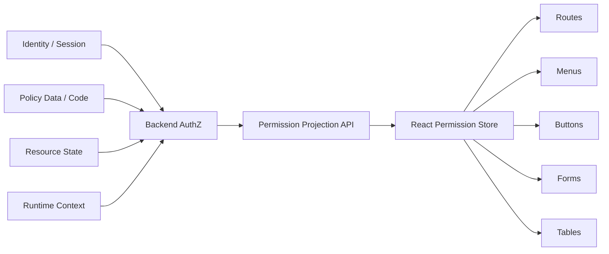
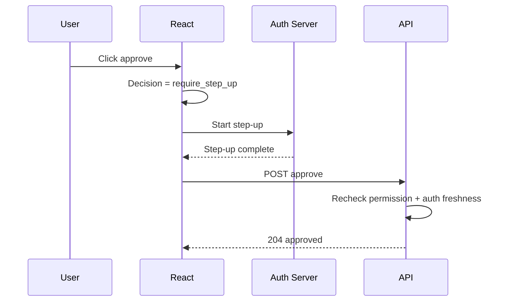

# Part 048 — Frontend Permission Contract

React should not know your full authorization model.

React should know the **contract** it needs to render safe, honest, and useful UI.

That contract answers:

```txt
Who is the current subject?
Which tenant/org/workspace is active?
Which resource is being viewed?
Which actions are available?
Which actions are denied?
Why are they denied?
Can the user do something to recover?
Does the action require step-up authentication?
Are any fields read-only or hidden?
Is this decision fresh enough?
```

This part designs that contract.

The central idea:

```txt
React consumes authorization decisions.
React does not infer authorization decisions from raw roles, token claims, or hidden policy logic.
```

---

## 1. The boundary

A frontend permission contract sits between the backend authorization system and the React UI.



The backend owns:

```txt
policy evaluation
authorization enforcement
audit logging
fresh resource state
permission revocation
```

The frontend owns:

```txt
exposure control
progressive disclosure
user feedback
step-up flow initiation
access request UX
cache invalidation behavior
```

If React becomes the policy source, the architecture is inverted.

---

## 2. What a contract is not

A frontend permission contract is not:

```txt
A list of raw roles.
A decoded JWT payload.
A full policy engine shipped to the browser.
A feature flag list.
A set of booleans named after UI components.
A security boundary.
```

Each of these creates a different failure mode.

### 2.1 Raw roles are too coarse

Bad:

```json
{
  "roles": ["admin", "reviewer"]
}
```

This forces React to ask:

```txt
What does admin mean?
Does reviewer mean can approve?
Is reviewer tenant-scoped?
Does role imply field edit?
Does role apply to this case state?
```

React should not answer those questions.

### 2.2 JWT claims are stale hints

Bad:

```tsx
const canDelete = decodedToken.scope.includes("case:delete");
```

A token claim may be stale.

It may be broad.

It may not include object-level context.

It may not reflect resource state.

It may not reflect tenant switch.

It may not reflect emergency revocation.

JWT decoding can support diagnostics or display, not final authorization.

### 2.3 UI booleans are too coupled

Bad:

```json
{
  "showApproveButton": true,
  "showDeleteMenuItem": false
}
```

This couples backend to React component names.

A new UI surface will require new backend fields.

Prefer action decisions.

```json
{
  "actions": {
    "case.approve": { "effect": "allow" },
    "case.delete": { "effect": "deny", "reason": "NOT_OWNER" }
  }
}
```

Actions are domain vocabulary.

Buttons are implementation details.

---

## 3. Contract levels

A mature React app usually needs several permission contract levels.

```txt
Session-level contract
Tenant/org-level contract
Collection-level contract
Resource-level contract
Field-level contract
Bulk-action contract
Step-up/recovery contract
```

They solve different problems.

---

## 4. Session-level contract

The session contract tells React who the authenticated subject is and which top-level capabilities exist.

Example endpoint:

```http
GET /session
```

Example response:

```json
{
  "schemaVersion": "session.v1",
  "status": "authenticated",
  "subject": {
    "id": "user_123",
    "displayName": "Ari",
    "email": "ari@example.com"
  },
  "activeTenant": {
    "id": "tenant_abc",
    "name": "Acme Regulator"
  },
  "auth": {
    "assuranceLevel": "aal2",
    "authTime": "2026-07-08T03:20:00Z"
  },
  "permissionEpoch": "perm_epoch_91",
  "globalActions": {
    "tenant.switch": { "effect": "allow" },
    "admin.open": { "effect": "deny", "reason": "MISSING_PERMISSION" }
  }
}
```

Use this to render:

```txt
app shell
account menu
tenant switcher
admin entry point
global command palette
```

Do not use it to decide object-level actions.

---

## 5. Resource-level contract

Resource-level contract answers:

```txt
What can this subject do to this resource right now?
```

Example:

```http
GET /cases/case_900/permissions
```

Response:

```json
{
  "schemaVersion": "resource-permissions.v1",
  "subject": {
    "id": "user_123",
    "tenantId": "tenant_abc"
  },
  "resource": {
    "type": "case",
    "id": "case_900",
    "version": "17",
    "state": "IN_REVIEW"
  },
  "decisionContext": {
    "permissionEpoch": "perm_epoch_91",
    "policyVersion": "case-authz-2026-07-08.3",
    "computedAt": "2026-07-08T03:31:00Z"
  },
  "actions": {
    "case.view": {
      "effect": "allow"
    },
    "case.edit": {
      "effect": "deny",
      "reason": "CASE_LOCKED",
      "recoverability": "not_recoverable_by_user"
    },
    "case.approve": {
      "effect": "require_step_up",
      "reason": "MFA_REQUIRED",
      "requirements": [
        {
          "type": "mfa",
          "maxAgeSeconds": 600,
          "returnTo": "/cases/case_900"
        }
      ]
    },
    "case.request_access": {
      "effect": "allow"
    }
  }
}
```

This is the most common contract for detail pages.

---

## 6. Collection-level contract

A collection page cannot fetch permission for every row one by one.

It needs a batch-friendly shape.

Example:

```http
POST /permissions/batch
```

Request:

```json
{
  "resources": [
    { "type": "case", "id": "case_900" },
    { "type": "case", "id": "case_901" },
    { "type": "case", "id": "case_902" }
  ],
  "actions": [
    "case.view",
    "case.edit",
    "case.approve",
    "case.assign"
  ]
}
```

Response:

```json
{
  "schemaVersion": "permission-batch.v1",
  "items": [
    {
      "resource": { "type": "case", "id": "case_900" },
      "actions": {
        "case.view": { "effect": "allow" },
        "case.approve": { "effect": "allow" }
      }
    },
    {
      "resource": { "type": "case", "id": "case_901" },
      "actions": {
        "case.view": { "effect": "allow" },
        "case.approve": { "effect": "deny", "reason": "NOT_ASSIGNED_REVIEWER" }
      }
    }
  ]
}
```

Use this for:

```txt
table row actions
card actions
kanban cards
search results
bulk action preview
```

---

## 7. Field-level contract

Some apps need field-level permission.

Example:

```json
{
  "schemaVersion": "form-permissions.v1",
  "resource": {
    "type": "case",
    "id": "case_900"
  },
  "fields": {
    "title": {
      "visibility": "visible",
      "editability": "editable"
    },
    "riskScore": {
      "visibility": "visible",
      "editability": "readonly",
      "reason": "SYSTEM_COMPUTED_FIELD"
    },
    "sealedEvidenceSummary": {
      "visibility": "hidden",
      "reason": "SEALED_EVIDENCE"
    }
  }
}
```

Field-level permission has high leak risk.

If a field is truly sensitive, do not send it.

Do not merely hide it.

Bad:

```json
{
  "sealedEvidenceSummary": "Sensitive text here",
  "permissions": {
    "sealedEvidenceSummary": { "visibility": "hidden" }
  }
}
```

Better:

```json
{
  "fields": {
    "sealedEvidenceSummary": {
      "visibility": "hidden",
      "reason": "SEALED_EVIDENCE"
    }
  }
}
```

The sensitive value is absent.

React cannot leak what it never receives.

---

## 8. Bulk-action contract

Bulk actions are not just “all selected rows have permission”.

They need a preview.

Example:

```http
POST /cases/bulk/approve/preview
```

Response:

```json
{
  "schemaVersion": "bulk-action-preview.v1",
  "action": "case.approve",
  "summary": {
    "total": 5,
    "eligible": 3,
    "ineligible": 2
  },
  "items": [
    {
      "resource": { "type": "case", "id": "case_900" },
      "effect": "allow"
    },
    {
      "resource": { "type": "case", "id": "case_901" },
      "effect": "deny",
      "reason": "CREATOR_CANNOT_APPROVE"
    }
  ],
  "executionMode": "eligible_only"
}
```

React can render:

```txt
3 cases can be approved.
2 cases will be skipped.
Review details before continuing.
```

The actual execute endpoint must recheck.

Preview is not enforcement.

---

## 9. Decision effect vocabulary

Avoid uncontrolled boolean proliferation.

Use a small decision vocabulary.

```ts
export type PermissionEffect =
  | "allow"
  | "deny"
  | "require_step_up"
  | "requires_approval"
  | "not_applicable";
```

### 9.1 `allow`

The action can be exposed.

Still recheck on mutation.

### 9.2 `deny`

The action is not allowed.

React may hide, disable, or explain depending on context.

### 9.3 `require_step_up`

The subject may be allowed after stronger/fresh authentication.

Example:

```json
{
  "effect": "require_step_up",
  "reason": "MFA_REQUIRED",
  "requirements": [
    { "type": "mfa", "maxAgeSeconds": 600 }
  ]
}
```

### 9.4 `requires_approval`

The subject cannot directly perform the action but can request access.

Example:

```json
{
  "effect": "requires_approval",
  "reason": "ACCESS_REQUEST_REQUIRED",
  "request": {
    "template": "case_export_access",
    "approverHint": "Regional Supervisor"
  }
}
```

### 9.5 `not_applicable`

The action does not make sense for the resource state.

Example:

```json
{
  "effect": "not_applicable",
  "reason": "CASE_ALREADY_APPROVED"
}
```

This is different from deny.

Deny says:

```txt
You cannot do this.
```

Not applicable says:

```txt
This action does not exist in this state.
```

---

## 10. Reason vocabulary

Reason codes should be stable, machine-readable, and safe.

Bad:

```json
{
  "reason": "Alice is not part of confidential reviewer group because Bob removed her yesterday"
}
```

This may leak sensitive membership or admin action.

Better:

```json
{
  "reason": "MISSING_PERMISSION"
}
```

Or:

```json
{
  "reason": "NOT_ASSIGNED_REVIEWER"
}
```

Define reason codes centrally.

```ts
export const PermissionDenyReason = {
  MissingPermission: "MISSING_PERMISSION",
  TenantMismatch: "TENANT_MISMATCH",
  ResourceNotFoundOrHidden: "RESOURCE_NOT_FOUND_OR_HIDDEN",
  CaseLocked: "CASE_LOCKED",
  NotAssignedReviewer: "NOT_ASSIGNED_REVIEWER",
  CreatorCannotApprove: "CREATOR_CANNOT_APPROVE",
  MfaRequired: "MFA_REQUIRED",
  SubscriptionRequired: "SUBSCRIPTION_REQUIRED",
  PolicyUnavailable: "POLICY_UNAVAILABLE",
} as const;
```

Map reason codes to UI copy client-side or server-side.

```ts
const denyCopy: Record<string, string> = {
  MISSING_PERMISSION: "You do not have permission to perform this action.",
  CASE_LOCKED: "This case is locked and cannot be edited.",
  CREATOR_CANNOT_APPROVE: "You cannot approve a case you created.",
  MFA_REQUIRED: "Verify your identity again to continue.",
};
```

Do not expose sensitive policy internals unless the user has support/admin visibility.

---

## 11. Constraints and obligations

Sometimes `allow` is not enough.

An action may be allowed only with constraints.

Example:

```json
{
  "effect": "allow",
  "constraints": {
    "maxExportRows": 500,
    "allowedFormats": ["csv"],
    "watermarkRequired": true
  },
  "obligations": [
    {
      "type": "audit_justification_required",
      "minLength": 20
    }
  ]
}
```

React can render:

```txt
Export CSV only
Max 500 rows
Require justification text
Watermark enabled
```

But enforcement still happens server-side.

Obligations are useful for regulated workflows:

```txt
require justification
require supervisor approval
require MFA
require case note
require purpose of access
require download watermark
require audit event
```

---

## 12. TypeScript contract

A good TypeScript model makes invalid states harder.

```ts
export type ResourceRef = {
  type: string;
  id: string;
  version?: string;
};

export type StepUpRequirement = {
  type: "mfa" | "password_reauth" | "webauthn";
  maxAgeSeconds?: number;
  returnTo?: string;
};

export type PermissionDecision =
  | {
      effect: "allow";
      constraints?: Record<string, unknown>;
      obligations?: PermissionObligation[];
    }
  | {
      effect: "deny";
      reason: PermissionReason;
      recoverability?: "recoverable" | "not_recoverable_by_user" | "request_access";
    }
  | {
      effect: "require_step_up";
      reason: "MFA_REQUIRED" | "REAUTH_REQUIRED";
      requirements: StepUpRequirement[];
    }
  | {
      effect: "requires_approval";
      reason: "ACCESS_REQUEST_REQUIRED";
      request: {
        template: string;
        approverHint?: string;
      };
    }
  | {
      effect: "not_applicable";
      reason: PermissionReason;
    };

export type ResourcePermissionProjection = {
  schemaVersion: "resource-permissions.v1";
  subject: {
    id: string;
    tenantId: string;
  };
  resource: ResourceRef;
  decisionContext: {
    permissionEpoch: string;
    policyVersion?: string;
    computedAt: string;
  };
  actions: Record<string, PermissionDecision>;
};
```

Now UI code can switch exhaustively.

```tsx
function ActionGate({ decision, children }: {
  decision: PermissionDecision | undefined;
  children: React.ReactNode;
}) {
  if (!decision) return null;

  switch (decision.effect) {
    case "allow":
      return <>{children}</>;

    case "require_step_up":
      return <StepUpAction decision={decision}>{children}</StepUpAction>;

    case "requires_approval":
      return <RequestAccessButton request={decision.request} />;

    case "deny":
    case "not_applicable":
      return null;

    default:
      return assertNever(decision);
  }
}
```

---

## 13. React primitives

Build primitives around the contract.

### 13.1 `useCan`

```ts
function useCan(action: string): PermissionDecision | undefined {
  const projection = usePermissionProjection();
  return projection.actions[action];
}
```

For resource pages:

```tsx
function CaseApproveButton({ caseId }: { caseId: string }) {
  const decision = useResourceDecision("case", caseId, "case.approve");

  if (!decision) return null;

  if (decision.effect === "require_step_up") {
    return <StepUpButton requirements={decision.requirements}>Approve</StepUpButton>;
  }

  if (decision.effect !== "allow") {
    return <PermissionHint decision={decision} />;
  }

  return <button onClick={() => approveCase(caseId)}>Approve</button>;
}
```

### 13.2 `<Can>` component

```tsx
type CanProps = {
  action: string;
  children: React.ReactNode;
  fallback?: React.ReactNode;
};

function Can({ action, children, fallback = null }: CanProps) {
  const decision = useCan(action);

  if (decision?.effect === "allow") return <>{children}</>;
  return <>{fallback}</>;
}
```

Use sparingly.

Hooks are usually clearer for complex UI.

### 13.3 Permission-aware action config

```ts
type UiAction = {
  id: string;
  label: string;
  permission: string;
  run: () => void;
};

function visibleActions(actions: UiAction[], permissions: ResourcePermissionProjection) {
  return actions.filter(action => {
    return permissions.actions[action.permission]?.effect === "allow";
  });
}
```

This works for:

```txt
tables
menus
command palette
context menus
bulk actions
```

---

## 14. Route metadata integration

Route metadata should reference action names, not roles.

Bad:

```ts
handle: {
  roles: ["admin"]
}
```

Better:

```ts
handle: {
  auth: {
    requiredAction: "case.view"
  }
}
```

For resource route:

```ts
export const handle = {
  auth: {
    resource: "case",
    requiredAction: "case.view",
  },
};
```

Loader:

```ts
export async function loader({ params, request }: LoaderArgs) {
  const session = await requireSession(request);
  const caseRecord = await getCase(params.caseId);

  await requireAllowed({
    subject: session.subject,
    action: "case.view",
    resource: caseRecord,
    context: requestContext(request),
  });

  const permissions = await projectResourcePermissions({
    subject: session.subject,
    resource: caseRecord,
    actions: ["case.view", "case.edit", "case.approve", "case.export"],
  });

  return { caseRecord: sanitizeForSubject(caseRecord, permissions), permissions };
}
```

Component:

```tsx
export default function CaseRoute() {
  const { caseRecord, permissions } = useLoaderData<typeof loader>();

  return (
    <PermissionProvider value={permissions}>
      <CasePage caseRecord={caseRecord} />
    </PermissionProvider>
  );
}
```

---

## 15. Data sanitization and permission contract

Permission contract alone is not enough.

The data payload must also be authorization-aware.

Bad:

```json
{
  "case": {
    "id": "case_900",
    "title": "Public title",
    "sealedEvidenceSummary": "Sensitive sealed evidence"
  },
  "permissions": {
    "fields": {
      "sealedEvidenceSummary": { "visibility": "hidden" }
    }
  }
}
```

Better:

```json
{
  "case": {
    "id": "case_900",
    "title": "Public title"
  },
  "permissions": {
    "fields": {
      "sealedEvidenceSummary": { "visibility": "hidden", "reason": "SEALED_EVIDENCE" }
    }
  }
}
```

Rule:

```txt
If the user cannot know the value, do not send the value.
```

---

## 16. Cache invalidation contract

Permissions are stateful.

React needs a way to know when cached decisions are stale.

Include one or more of:

```txt
permissionEpoch
subjectVersion
tenantMembershipVersion
resourceVersion
policyVersion
computedAt
maxAgeSeconds
```

Example:

```json
{
  "decisionContext": {
    "permissionEpoch": "perm_epoch_91",
    "resourceVersion": "17",
    "policyVersion": "case-authz-2026-07-08.3",
    "computedAt": "2026-07-08T03:31:00Z",
    "maxAgeSeconds": 60
  }
}
```

React cache key:

```ts
const key = [
  "resource-permissions",
  session.subject.id,
  session.activeTenant.id,
  resource.type,
  resource.id,
  session.permissionEpoch,
  resource.version,
];
```

Invalidate on:

```txt
login
logout
tenant switch
role change
grant change
resource state transition
approval workflow transition
step-up completion
impersonation start/end
permission epoch change
```

---

## 17. Avoid permission flash

Do not render privileged UI before permission is known.

Bad:

```tsx
const decision = useCan("case.delete");
return decision?.effect !== "deny" ? <DeleteButton /> : null;
```

Unknown becomes allow.

Correct:

```tsx
const decision = useCan("case.delete");
return decision?.effect === "allow" ? <DeleteButton /> : null;
```

Unknown is deny-by-default.

For layout:

```tsx
function SecureActionsSkeleton() {
  return <div aria-busy="true" className="action-skeleton" />;
}
```

Use skeletons for pending state.

Do not show then hide sensitive actions.

---

## 18. Menu and navigation contract

Navigation should be derived from permissions, not hardcoded roles.

```ts
type NavItem = {
  id: string;
  label: string;
  href: string;
  requiredAction?: string;
  children?: NavItem[];
};

function filterNav(items: NavItem[], actions: Record<string, PermissionDecision>): NavItem[] {
  return items.flatMap(item => {
    const allowed = !item.requiredAction ||
      actions[item.requiredAction]?.effect === "allow";

    const children = item.children ? filterNav(item.children, actions) : undefined;

    if (!allowed && (!children || children.length === 0)) return [];

    return [{ ...item, children }];
  });
}
```

Still enforce route loader.

Navigation hiding is convenience, not security.

---

## 19. Access request integration

A mature contract supports access request UX.

```json
{
  "actions": {
    "case.export": {
      "effect": "requires_approval",
      "reason": "ACCESS_REQUEST_REQUIRED",
      "request": {
        "template": "case_export",
        "resource": { "type": "case", "id": "case_900" },
        "approverHint": "Regional Supervisor",
        "defaultJustification": "Need access to export case material."
      }
    }
  }
}
```

React can render:

```tsx
if (decision.effect === "requires_approval") {
  return <RequestAccessButton request={decision.request} />;
}
```

Do not overload deny reasons.

If access request is possible, say so explicitly.

---

## 20. Step-up integration

Step-up is neither allow nor deny.

It is a conditional path.

```json
{
  "effect": "require_step_up",
  "reason": "MFA_REQUIRED",
  "requirements": [
    {
      "type": "webauthn",
      "maxAgeSeconds": 600,
      "returnTo": "/cases/case_900?resume=approve"
    }
  ]
}
```

UI flow:



The server must recheck after step-up.

Do not assume the previous projection is still valid.

---

## 21. Multi-tenant contract

Every permission projection must be tenant-scoped when the app is multi-tenant.

Bad:

```json
{
  "actions": {
    "case.approve": { "effect": "allow" }
  }
}
```

Better:

```json
{
  "subject": {
    "id": "user_123",
    "tenantId": "tenant_abc"
  },
  "resource": {
    "type": "case",
    "id": "case_900",
    "tenantId": "tenant_abc"
  },
  "actions": {
    "case.approve": { "effect": "allow" }
  }
}
```

Cache key must include tenant id.

```ts
["permissions", subjectId, activeTenantId, resourceType, resourceId]
```

Tenant switch must invalidate:

```txt
session projection
route loaders
query cache
permission cache
navigation model
command palette
table row decisions
form permission state
```

---

## 22. Impersonation contract

Admin impersonation must be visible and constrained.

Projection should include actor and subject.

```json
{
  "session": {
    "mode": "impersonation",
    "actor": {
      "id": "admin_1",
      "type": "support_admin"
    },
    "subject": {
      "id": "user_123",
      "type": "end_user"
    }
  },
  "constraints": {
    "canMutate": false,
    "canExport": false,
    "bannerRequired": true
  }
}
```

React must render a persistent banner.

```tsx
function ImpersonationBanner({ session }: { session: SessionProjection }) {
  if (session.mode !== "impersonation") return null;

  return (
    <div role="alert">
      Viewing as {session.subject.id}. Mutating actions may be restricted.
      <button>Exit impersonation</button>
    </div>
  );
}
```

The API still enforces impersonation constraints.

---

## 23. Schema versioning

Permission contracts are API contracts.

Version them.

```json
{
  "schemaVersion": "resource-permissions.v1"
}
```

Rules:

```txt
Add fields without breaking old clients.
Do not remove fields without migration.
Do not rename action names casually.
Do not change reason meaning silently.
Document action/reason vocabulary.
Contract-test backend and frontend fixtures.
```

When breaking change is necessary:

```txt
release v2 endpoint
support v1 and v2 during migration
update clients
monitor usage
remove v1 after deprecation window
```

---

## 24. Contract testing

Build fixtures that represent important authorization states.

```ts
const creatorCannotApprove: ResourcePermissionProjection = {
  schemaVersion: "resource-permissions.v1",
  subject: { id: "user_creator", tenantId: "tenant_abc" },
  resource: { type: "case", id: "case_900", version: "17" },
  decisionContext: {
    permissionEpoch: "perm_epoch_1",
    policyVersion: "case-authz-test",
    computedAt: "2026-07-08T00:00:00Z",
  },
  actions: {
    "case.view": { effect: "allow" },
    "case.approve": {
      effect: "deny",
      reason: "CREATOR_CANNOT_APPROVE",
      recoverability: "not_recoverable_by_user",
    },
  },
};
```

Component test:

```tsx
it("does not render approve button when creator cannot approve", () => {
  render(
    <PermissionProvider value={creatorCannotApprove}>
      <CaseActions caseId="case_900" />
    </PermissionProvider>
  );

  expect(screen.queryByRole("button", { name: /approve/i })).not.toBeInTheDocument();
  expect(screen.getByText(/cannot approve a case you created/i)).toBeInTheDocument();
});
```

API contract test:

```ts
it("returns stable reason code for creator approval denial", async () => {
  const response = await api
    .as("user_creator")
    .get("/cases/case_900/permissions")
    .expect(200);

  expect(response.body.actions["case.approve"]).toMatchObject({
    effect: "deny",
    reason: "CREATOR_CANNOT_APPROVE",
  });
});
```

---

## 25. Failure modes

### 25.1 Unknown treated as allowed

This is the most dangerous UI bug.

Mitigation:

```txt
unknown = hidden/disabled
skeleton while loading
server enforcement always
```

### 25.2 Raw roles leak into components

Mitigation:

```txt
lint rule
code review checklist
permission hooks only
action vocabulary module
```

### 25.3 Contract overfits current UI

Backend returns `showButtonX` fields.

Mitigation:

```txt
domain actions instead of component flags
```

### 25.4 Permission projection stale after mutation

Example:

```txt
User approves case.
Case moves from IN_REVIEW to APPROVED.
Approve button remains visible.
```

Mitigation:

```txt
invalidate resource permissions after state transition
include resource version in cache key
server rechecks action
```

### 25.5 Reason leaks sensitive details

Example:

```txt
Denied because confidential investigation exists.
```

Mitigation:

```txt
safe reason codes
support-only diagnostics behind authorization
not-found-or-hidden responses for sensitive resources
```

### 25.6 Backend and frontend disagree on action names

Mitigation:

```txt
shared action vocabulary package
OpenAPI/JSON schema
contract tests
schema versioning
```

---

## 26. Production checklist

A frontend permission contract is production-ready when:

```txt
Action names are stable and documented.
Reason codes are stable and safe.
Unknown permission state denies by default.
Resource-level permissions are fetched from backend.
Sensitive data is not sent when hidden.
Server enforces every protected operation.
Permission cache includes subject + tenant + resource + epoch/version.
Tenant switch invalidates permission state.
Step-up is represented as first-class decision.
Access request is represented explicitly.
Bulk actions have preview and execution recheck.
Field permissions are paired with data sanitization.
Impersonation is visible and constrained.
Contract fixtures exist.
Component tests cover allowed, denied, step-up, request-access, stale state.
API tests verify denial reasons and enforcement.
Audit logs record sensitive decisions.
```

---

## 27. Key takeaways

The frontend permission contract is the bridge between authorization policy and React UX.

It should expose domain action decisions, not raw roles or token claims.

It should include effect, reason, requirements, constraints, version, and freshness metadata.

It should support routes, menus, forms, tables, field-level UI, bulk actions, access requests, and step-up flows.

It should never replace server-side enforcement.

The clean rule is:

```txt
Backend decides.
Backend enforces.
Frontend projects.
Frontend explains.
Frontend never invents authority.
```

---

## References

- OWASP Authorization Cheat Sheet — https://cheatsheetseries.owasp.org/cheatsheets/Authorization_Cheat_Sheet.html
- OWASP Top 10 Broken Access Control — https://owasp.org/Top10/A01_2021-Broken_Access_Control/
- OpenFGA Concepts — https://openfga.dev/docs/concepts
- Amazon Verified Permissions Documentation — https://docs.aws.amazon.com/verifiedpermissions/
- Cedar Policy Language — https://cedarpolicy.com/
- React Router Data Loading — https://reactrouter.com/start/framework/data-loading
