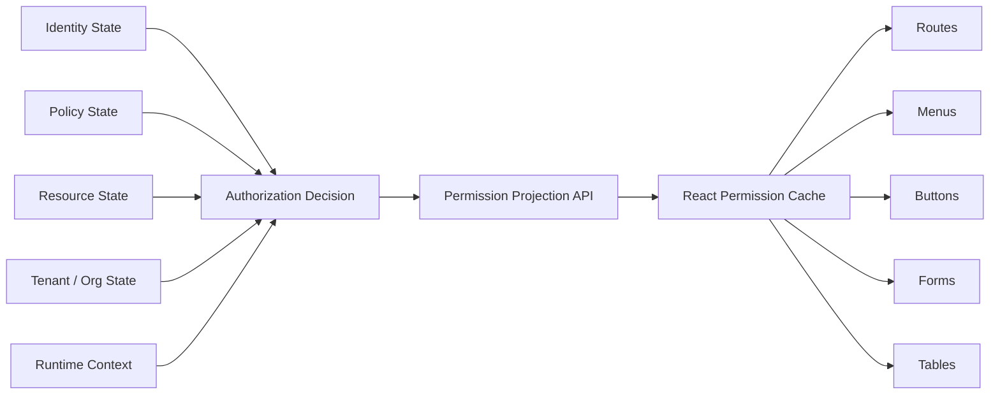
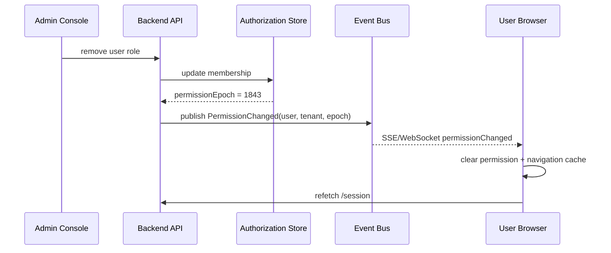
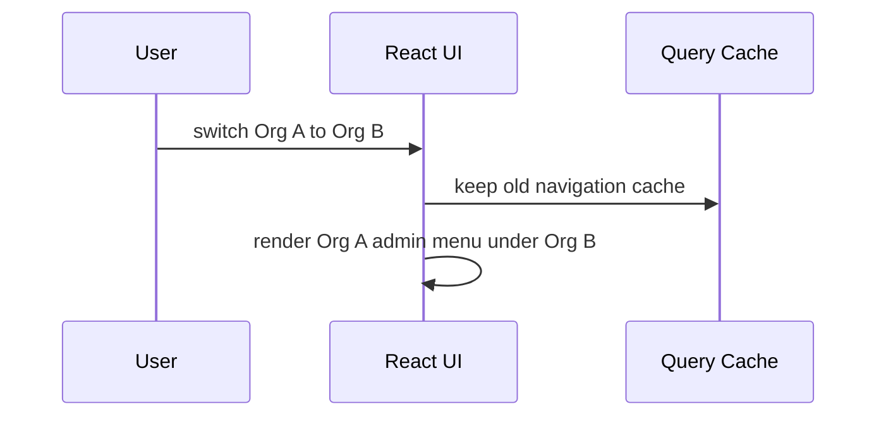
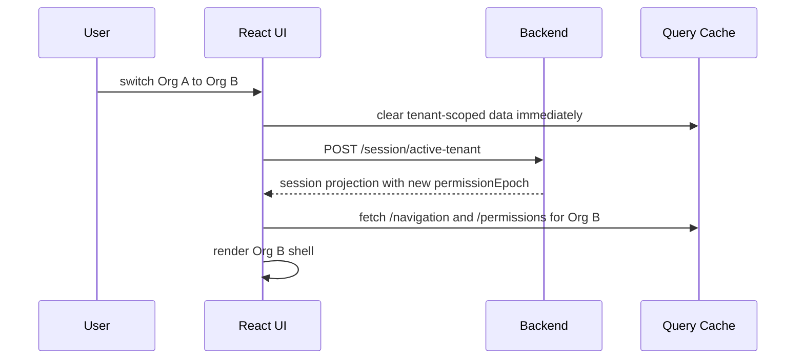
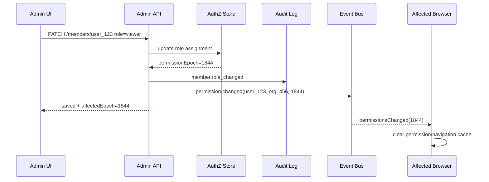

# Part 049 — Permission Cache Invalidation

Permission caching is useful.

Permission caching is also dangerous.

A React application needs permission data to render menus, buttons, route affordances, field editability, and action availability. Without caching, every screen becomes slow and chatty. With careless caching, users keep seeing capabilities after those capabilities have been revoked.

This part is about that tension.

The central rule:

```txt
Cache permissions as UI hints.
Never let cached frontend permissions become the enforcement authority.
```

The frontend permission cache answers:

```txt
What should this UI expose right now?
```

The server still answers:

```txt
Is this request allowed right now?
```

If those two answers diverge, the server wins.

---

## 1. The problem

Permission state changes outside the current browser tab.

Examples:

```txt
An admin removes a user from an organization.
A user's role changes from approver to viewer.
A case is escalated and can no longer be edited by the original officer.
A resource owner revokes a share grant.
A tenant membership is suspended.
A temporary access grant expires.
A policy is redeployed.
A step-up authentication window expires.
A user switches organization in another tab.
A session is revoked by security operations.
```

React may still have old data in memory.

That old data may be stored in:

```txt
React state
Context state
TanStack Query cache
Redux/Zustand store
React Router loader cache
browser storage
service worker cache
component props
preloaded route data
open forms
hidden tabs
```

The invalidation problem is not just "refetch after mutation".

It is about preventing **stale privilege projection**.

---

## 2. Mental model

Think of permission data as a **projection** of authoritative backend state.



The projection is valid only for a particular tuple:

```txt
subject
session
tenant
resource
resource version
policy version
role/grant version
assurance level
context
request time
```

If one dimension changes, the projection may be stale.

That is the core reason permission cache keys must be explicit.

---

## 3. Cache identity

Bad permission cache key:

```ts
const queryKey = ['permissions'];
```

This key says permissions are global.

They are not.

A safer key includes the dimensions that affect the decision.

```ts
type PermissionProjectionKey = readonly [
  'permissions',
  {
    subjectId: string;
    sessionId: string;
    tenantId: string;
    resourceType?: string;
    resourceId?: string;
    resourceVersion?: string;
    policyVersion?: string;
    permissionEpoch?: number;
    assuranceLevel?: string;
  }
];
```

The key is not just an optimization detail. It is a security-relevant modeling decision.

If tenant is missing from the key, a user can switch organizations and keep stale permissions from the previous tenant.

If resource version is missing, a user can open a case, the case state changes, and the UI may still expose actions that are no longer legal.

If assurance level is missing, a screen may keep showing high-risk actions after the re-authentication window has expired.

---

## 4. What invalidates permission?

Permission depends on more than role.

A realistic invalidation matrix looks like this:

| Change | Example | What to invalidate |
|---|---|---|
| Session changed | login, logout, refresh, revoke | all auth/session/permission queries |
| Tenant changed | org switch | tenant-scoped resources, menus, routes, permission cache |
| Role changed | viewer → approver | global tenant permission projection |
| Group changed | removed from group | inherited permissions and resource lists |
| Object grant changed | removed from case ACL | specific resource permission and list membership |
| Resource state changed | draft → submitted | workflow action permissions |
| Policy changed | new policy deployed | all projections with old policy version |
| Feature capability changed | module disabled for tenant | route/menu/action projection |
| Assurance changed | MFA window expired | sensitive action exposure |
| Impersonation changed | enter/exit support mode | all identity and permission projections |
| Time changed | temporary grant expires | affected grants and dependent resources |

The easiest systems to reason about have **one explicit version/epoch** that changes when permission-affecting state changes.

---

## 5. Permission epoch

A permission epoch is a monotonic value representing the freshness boundary of a user's authorization projection.

```json
{
  "subjectId": "user_123",
  "tenantId": "org_456",
  "permissionEpoch": 1842,
  "policyVersion": "2026-07-08T03:15:21Z.7",
  "roleVersion": "rv_92",
  "grantVersion": "gv_881",
  "assuranceLevel": "aal2",
  "expiresAt": "2026-07-08T05:00:00Z"
}
```

React does not need to understand every backend table. It needs a stable invalidation signal.

```txt
If permissionEpoch changed, old permission projection is stale.
```

This gives the frontend a simple contract:

```ts
export type SessionProjection = {
  subject: {
    id: string;
    displayName: string;
  };
  activeTenant: {
    id: string;
    slug: string;
    name: string;
  };
  permissionEpoch: number;
  policyVersion: string;
  assurance: {
    level: 'anonymous' | 'aal1' | 'aal2' | 'aal3';
    authenticatedAt?: string;
    expiresAt?: string;
  };
};
```

Then permission query keys can depend on session projection:

```ts
function permissionKey(input: {
  session: SessionProjection;
  resourceType?: string;
  resourceId?: string;
  resourceVersion?: string;
}) {
  return [
    'permissions',
    {
      subjectId: input.session.subject.id,
      tenantId: input.session.activeTenant.id,
      permissionEpoch: input.session.permissionEpoch,
      policyVersion: input.session.policyVersion,
      assuranceLevel: input.session.assurance.level,
      resourceType: input.resourceType,
      resourceId: input.resourceId,
      resourceVersion: input.resourceVersion,
    },
  ] as const;
}
```

When the session projection changes, old permission queries naturally become different cache entries.

You still remove old entries. The key prevents accidental reuse.

---

## 6. Cache invalidation levels

There are four levels of permission invalidation.

### 6.1 Local invalidation

A mutation in the same tab changes data that affects permission.

Example:

```txt
User submits a case.
Case state moves from draft to submitted.
Edit button must disappear.
Approve button may appear for another role.
```

After mutation:

```ts
await submitCase(caseId);

queryClient.invalidateQueries({
  queryKey: ['case', caseId],
});

queryClient.invalidateQueries({
  queryKey: ['permissions'],
  predicate(query) {
    const key = query.queryKey;
    return JSON.stringify(key).includes(caseId);
  },
});
```

This is necessary but insufficient.

It only handles the current tab and current mutation path.

### 6.2 Session-level invalidation

The current user's session projection changes.

Example:

```txt
session refresh returns a new permissionEpoch
MFA expires
tenant switch completes
logout occurs
```

Invalidate all derived data:

```ts
function invalidateForSessionChange(queryClient: QueryClient) {
  queryClient.removeQueries({ queryKey: ['permissions'] });
  queryClient.removeQueries({ queryKey: ['navigation'] });
  queryClient.removeQueries({ queryKey: ['me'] });
  queryClient.removeQueries({ queryKey: ['session'] });
}
```

Use `removeQueries` when the data must not remain visible.
Use `invalidateQueries` when stale UI is acceptable until refetch.

Permission and sensitive identity data usually deserve removal.

### 6.3 Cross-tab invalidation

Another tab changes auth state.

Example:

```txt
Tab A logs out.
Tab B still shows an admin console.
```

Use a same-origin channel:

```ts
const authChannel = new BroadcastChannel('auth-events');

type AuthEvent =
  | { type: 'logout'; reason: 'user' | 'revoked' | 'expired'; at: number }
  | { type: 'tenantChanged'; tenantId: string; permissionEpoch: number; at: number }
  | { type: 'permissionsChanged'; permissionEpoch: number; at: number }
  | { type: 'assuranceChanged'; level: string; expiresAt?: string; at: number };

export function publishAuthEvent(event: AuthEvent) {
  authChannel.postMessage(event);
}

export function subscribeAuthEvents(handler: (event: AuthEvent) => void) {
  authChannel.onmessage = (message) => handler(message.data);
  return () => authChannel.close();
}
```

Then React can clear sensitive caches:

```ts
subscribeAuthEvents((event) => {
  switch (event.type) {
    case 'logout':
      queryClient.clear();
      authStore.reset();
      router.navigate('/login', { replace: true });
      break;

    case 'tenantChanged':
    case 'permissionsChanged':
    case 'assuranceChanged':
      queryClient.removeQueries({ queryKey: ['permissions'] });
      queryClient.removeQueries({ queryKey: ['navigation'] });
      queryClient.invalidateQueries({ queryKey: ['session'] });
      break;
  }
});
```

### 6.4 Server-pushed invalidation

The backend sends an event when permission-affecting state changes.



This is useful in regulated, collaborative, or high-risk systems.

But do not make server push the only control. If the event is delayed or lost, the backend still must deny unauthorized requests.

---

## 7. Invalidation source of truth

React should not guess whether permissions changed.

It should observe explicit signals.

Good signals:

```txt
/session returns new permissionEpoch
/mutations return new resourceVersion
/admin role update returns affected subject/tenant/version
SSE sends permissionChanged event
WebSocket sends tenantMembershipChanged event
API response includes X-Permission-Epoch
403 response includes currentPermissionEpoch
```

Weak signals:

```txt
The user's role string changed somewhere in local storage.
The UI knows an admin page was used.
The frontend assumes a mutation affects only one button.
The token has a new claim but no authoritative session refresh happened.
```

A good API makes invalidation boring.

---

## 8. Response headers for permission versioning

For APIs that already return resource data, permission metadata can ride along.

```http
HTTP/1.1 200 OK
Cache-Control: no-store
X-Session-Version: 71
X-Permission-Epoch: 1843
X-Policy-Version: 2026-07-08T03:15:21Z.7
```

The client can compare these values with its current session projection.

```ts
type AuthVersionHeaders = {
  sessionVersion?: number;
  permissionEpoch?: number;
  policyVersion?: string;
};

function readAuthVersionHeaders(response: Response): AuthVersionHeaders {
  const sessionVersion = response.headers.get('x-session-version');
  const permissionEpoch = response.headers.get('x-permission-epoch');
  const policyVersion = response.headers.get('x-policy-version');

  return {
    sessionVersion: sessionVersion ? Number(sessionVersion) : undefined,
    permissionEpoch: permissionEpoch ? Number(permissionEpoch) : undefined,
    policyVersion: policyVersion ?? undefined,
  };
}
```

Then:

```ts
function reconcileAuthVersions(headers: AuthVersionHeaders, current: SessionProjection) {
  if (
    headers.permissionEpoch !== undefined &&
    headers.permissionEpoch > current.permissionEpoch
  ) {
    authStore.markPermissionStale(headers.permissionEpoch);
    queryClient.removeQueries({ queryKey: ['permissions'] });
    queryClient.removeQueries({ queryKey: ['navigation'] });
  }
}
```

This avoids waiting for a separate refresh interval.

---

## 9. 403 as invalidation signal

A `403 Forbidden` can mean several things:

```txt
The user never had permission.
The user had permission but it was revoked.
The resource changed state.
The tenant context is wrong.
The policy version changed.
The action now requires step-up authentication.
```

A useful 403 response is typed.

```json
{
  "type": "https://example.com/problems/permission-denied",
  "title": "Permission denied",
  "status": 403,
  "code": "permission_revoked",
  "action": "case.approve",
  "resource": {
    "type": "case",
    "id": "case_123",
    "version": "17"
  },
  "tenantId": "org_456",
  "currentPermissionEpoch": 1843,
  "requiredAssuranceLevel": "aal2",
  "correlationId": "req_9be"
}
```

React should respond based on `code`.

```ts
function handleAuthorizationProblem(problem: AuthorizationProblem) {
  switch (problem.code) {
    case 'permission_revoked':
    case 'policy_changed':
      queryClient.removeQueries({ queryKey: ['permissions'] });
      queryClient.invalidateQueries({ queryKey: ['session'] });
      showAccessChangedToast();
      break;

    case 'step_up_required':
      startStepUpFlow({ returnTo: router.state.location.pathname });
      break;

    case 'tenant_mismatch':
      queryClient.clear();
      router.navigate('/select-organization', { replace: true });
      break;

    default:
      showForbiddenPage(problem.correlationId);
  }
}
```

The UI should not blindly retry a forbidden mutation. Retrying 403 can create request storms and poor audit trails.

---

## 10. Cache-control is part of auth design

Permission projection and authenticated user data should not be casually cached by the browser or intermediary caches.

For sensitive session/permission endpoints:

```http
Cache-Control: no-store
Pragma: no-cache
```

For personalized but less sensitive responses, choose deliberately:

```http
Cache-Control: private, max-age=30
```

For shared caches/CDNs, never allow tenant-specific or user-specific authorization projections to be stored as public responses.

Bad:

```http
Cache-Control: public, max-age=3600
```

on:

```txt
/session
/me
/permissions
/navigation
/cases?mine=true
```

That is not just a performance bug. It can become cross-user data leakage.

---

## 11. React Query pattern

A common production pattern:

```ts
type PermissionDecision =
  | {
      allowed: true;
      action: string;
      resource: { type: string; id?: string; version?: string };
      evaluatedAt: string;
      permissionEpoch: number;
    }
  | {
      allowed: false;
      action: string;
      resource: { type: string; id?: string; version?: string };
      reason:
        | 'not_authenticated'
        | 'not_member'
        | 'missing_permission'
        | 'resource_locked'
        | 'state_not_allowed'
        | 'step_up_required'
        | 'permission_unknown';
      evaluatedAt: string;
      permissionEpoch: number;
    };

type PermissionProjection = {
  subjectId: string;
  tenantId: string;
  permissionEpoch: number;
  decisions: Record<string, PermissionDecision>;
};
```

Fetch projection:

```ts
async function fetchPermissions(input: {
  session: SessionProjection;
  resource?: { type: string; id?: string; version?: string };
}): Promise<PermissionProjection> {
  const params = new URLSearchParams();

  if (input.resource?.type) params.set('resourceType', input.resource.type);
  if (input.resource?.id) params.set('resourceId', input.resource.id);
  if (input.resource?.version) params.set('resourceVersion', input.resource.version);

  const response = await fetch(`/api/permissions?${params}`, {
    credentials: 'include',
    headers: {
      'x-active-tenant': input.session.activeTenant.id,
      'x-permission-epoch': String(input.session.permissionEpoch),
    },
  });

  if (!response.ok) {
    throw await response.json();
  }

  return response.json();
}
```

Hook:

```ts
export function usePermissions(input: {
  resource?: { type: string; id?: string; version?: string };
}) {
  const session = useSessionProjection();

  return useQuery({
    queryKey: permissionKey({
      session,
      resourceType: input.resource?.type,
      resourceId: input.resource?.id,
      resourceVersion: input.resource?.version,
    }),
    queryFn: () => fetchPermissions({ session, resource: input.resource }),
    staleTime: 15_000,
    gcTime: 60_000,
    retry(failureCount, error) {
      if (isAuthorizationProblem(error)) return false;
      return failureCount < 2;
    },
  });
}
```

`staleTime` is a UX/performance choice, not a security guarantee.

The backend still enforces every mutation.

---

## 12. `can()` over stale data

A frontend `can()` helper should expose freshness.

Bad:

```ts
function can(action: string) {
  return permissions.includes(action);
}
```

Better:

```ts
type CanResult =
  | { status: 'allowed'; stale: boolean }
  | { status: 'denied'; reason: string; stale: boolean }
  | { status: 'unknown'; stale: true };

function can(
  projection: PermissionProjection | undefined,
  action: string,
  requiredEpoch: number
): CanResult {
  if (!projection) {
    return { status: 'unknown', stale: true };
  }

  const decision = projection.decisions[action];

  if (!decision) {
    return { status: 'unknown', stale: true };
  }

  const stale = projection.permissionEpoch < requiredEpoch;

  if (decision.allowed) {
    return { status: 'allowed', stale };
  }

  return { status: 'denied', reason: decision.reason, stale };
}
```

Then UI can avoid pretending stale permission is fresh.

```tsx
function ApproveButton({ caseId, caseVersion }: Props) {
  const session = useSessionProjection();
  const permissions = usePermissions({
    resource: { type: 'case', id: caseId, version: caseVersion },
  });

  const result = can(
    permissions.data,
    'case.approve',
    session.permissionEpoch
  );

  if (result.status === 'unknown' || result.stale) {
    return <ButtonSkeleton width="approve" />;
  }

  if (result.status === 'denied') {
    return null;
  }

  return <button>Approve</button>;
}
```

This distinction matters.

Unknown is not allowed.
Stale is not fresh.
Denied is not an error.

---

## 13. Tenant switch invalidation

Tenant switch is one of the most common sources of permission bugs.

Bad sequence:



Safer sequence:



Implementation:

```ts
async function switchTenant(tenantId: string) {
  authStore.setTransition({ type: 'tenant-switching', tenantId });

  queryClient.removeQueries({
    predicate(query) {
      return isTenantScopedQuery(query.queryKey);
    },
  });

  const nextSession = await api.switchActiveTenant(tenantId);

  authStore.setSession(nextSession);

  publishAuthEvent({
    type: 'tenantChanged',
    tenantId,
    permissionEpoch: nextSession.permissionEpoch,
    at: Date.now(),
  });

  await queryClient.invalidateQueries({ queryKey: ['session'] });
  router.navigate('/app', { replace: true });
}
```

Tenant switch should look more like logout/login than a filter change.

---

## 14. Permission invalidation and forms

Forms are dangerous because users can keep them open for a long time.

Example:

```txt
A user opens an edit form.
Their edit permission is revoked.
They submit thirty minutes later.
```

Frontend behavior:

```txt
Show stale-permission warning if permission epoch changed.
Revalidate permission before submit.
Disable high-risk submit while permission is unknown.
Handle 403 as normal business/security outcome.
Never assume hidden fields or disabled inputs enforce anything.
```

Pattern:

```ts
async function submitWithPermissionRecheck(input: SubmitInput) {
  const decision = await api.checkPermission({
    action: 'case.update',
    resource: {
      type: 'case',
      id: input.caseId,
      version: input.caseVersion,
    },
  });

  if (!decision.allowed) {
    throw new PermissionDeniedError(decision);
  }

  return api.updateCase(input);
}
```

This recheck is still a UX optimization. The update endpoint must enforce authorization again.

---

## 15. Permission invalidation and resource lists

List screens have a special problem.

A user may lose access to one row among hundreds.

Bad:

```txt
Only invalidate row action permissions.
Keep the row visible forever.
```

Better:

```txt
Invalidate list membership and row permissions separately.
```

There are two permission decisions:

```txt
Can subject list this resource?
Can subject perform action on this resource?
```

Example response:

```json
{
  "items": [
    {
      "id": "case_123",
      "version": "17",
      "title": "Investigation A",
      "allowedActions": ["case.view", "case.comment"],
      "permissionEpoch": 1843
    }
  ],
  "pageInfo": {
    "nextCursor": "..."
  },
  "permissionEpoch": 1843
}
```

If permission epoch changes, refetch the list. Do not keep old rows merely because the table state still has them.

---

## 16. Resource state invalidation

Permission often depends on resource state.

```txt
Draft cases are editable.
Submitted cases are not editable.
Escalated cases require supervisor role.
Closed cases require reopen permission.
```

In that model, permission cache keys need resource version/state.

```ts
const permissions = usePermissions({
  resource: {
    type: 'case',
    id: caseData.id,
    version: caseData.version,
  },
});
```

When case version changes, permission query changes.

This prevents using the permission decision for version 17 on version 18.

For workflow-heavy systems, include state explicitly in the backend check:

```json
{
  "action": "case.edit",
  "resource": {
    "type": "case",
    "id": "case_123",
    "version": "18",
    "state": "submitted"
  }
}
```

React can pass resource state as context, but the backend must load authoritative state before enforcing.

---

## 17. Role change propagation

A role change is not complete when the admin UI says "Saved".

A complete role change includes:

```txt
write membership/role change
increment role/permission version
emit audit event
publish invalidation event
invalidate affected sessions or projections
make new decisions visible through /session or /permissions
ensure old decisions are denied server-side
```

Sequence:



A good React admin console should show that permissions changed, but it should not promise instantaneous removal from every open tab unless the platform actually provides that guarantee.

---

## 18. Event-driven invalidation failure modes

Event-driven invalidation is not magic.

Failure modes:

```txt
SSE disconnected.
WebSocket reconnect loses event.
Browser tab is suspended.
Laptop sleeps.
Service worker returns stale data.
User changes network.
Events arrive out of order.
Two tenant switches race.
Permission epoch decreases because of clock or environment bug.
```

Use monotonic versions.

```ts
function applyPermissionEpoch(nextEpoch: number) {
  const current = authStore.getState().session?.permissionEpoch ?? 0;

  if (nextEpoch <= current) {
    return;
  }

  authStore.markPermissionStale(nextEpoch);
  queryClient.removeQueries({ queryKey: ['permissions'] });
  queryClient.removeQueries({ queryKey: ['navigation'] });
}
```

On reconnect, refetch `/session`.

```ts
eventSource.addEventListener('open', () => {
  queryClient.invalidateQueries({ queryKey: ['session'] });
});
```

Do not try to replay all missed events in React unless you truly need that complexity. Usually the browser only needs the latest authoritative session projection.

---

## 19. Stale-while-revalidate and permissions

Stale-while-revalidate is attractive for performance.

For permission data, it can be risky.

Acceptable:

```txt
Using stale navigation labels while refetching.
Showing previously allowed low-risk read-only affordance for milliseconds.
Rendering skeleton while high-risk action permission is unknown.
```

Not acceptable:

```txt
Showing destructive admin actions from stale permission.
Allowing form submit based on stale permission.
Keeping tenant A's permission projection after tenant switch to tenant B.
Displaying sensitive data using stale resource membership.
```

Decision framework:

| UI element | Stale permission allowed? | Safer behavior |
|---|---:|---|
| App shell title | Usually yes | render then revalidate |
| Sidebar admin link | Usually no | hide/skeleton until fresh |
| Read-only badge | Sometimes | mark loading if important |
| Delete button | No | deny/skeleton until fresh allowed |
| Approval submit | No | recheck before submit |
| Sensitive field | No | hide until fresh allowed |
| List membership | No | refetch list |

When in doubt, deny-by-default.

---

## 20. Service worker and persisted cache

A service worker can accidentally preserve authenticated responses across permission changes.

Rules:

```txt
Do not cache /session, /me, /permissions, /navigation as public offline assets.
Do not cache personalized API responses unless the cache is user/session scoped and cleared on logout.
Clear authenticated runtime caches on logout and tenant switch.
Respect Cache-Control from the server.
Avoid offline mutation queues for high-risk authorized actions unless explicitly designed.
```

Logout cleanup can include:

```ts
async function clearServiceWorkerAuthCaches() {
  if (!('caches' in window)) return;

  const names = await caches.keys();

  await Promise.all(
    names
      .filter((name) => name.startsWith('auth-runtime-'))
      .map((name) => caches.delete(name))
  );
}
```

For many enterprise apps, the simplest secure posture is:

```txt
static assets can be cached
authenticated API responses are not persisted by the service worker
```

---

## 21. Multi-tab invalidation architecture

A robust browser-side invalidation layer has these responsibilities:

```txt
publish local auth events
listen to same-origin auth events
compare monotonic epochs
clear sensitive caches
abort in-flight requests
navigate away from forbidden screens
avoid duplicate refresh storms
avoid duplicate logout redirects
```

Example event bus:

```ts
type PermissionInvalidationEvent = {
  type: 'permission-invalidation';
  sourceTabId: string;
  tenantId: string;
  nextPermissionEpoch: number;
  reason:
    | 'role_changed'
    | 'grant_changed'
    | 'tenant_switched'
    | 'resource_state_changed'
    | 'policy_changed'
    | 'assurance_changed'
    | 'session_revoked';
  at: number;
};
```

Handler:

```ts
function handlePermissionInvalidation(event: PermissionInvalidationEvent) {
  if (event.sourceTabId === currentTabId) return;

  const session = authStore.getState().session;
  if (!session) return;

  if (event.tenantId !== session.activeTenant.id) {
    return;
  }

  if (event.nextPermissionEpoch <= session.permissionEpoch) {
    return;
  }

  authStore.markPermissionStale(event.nextPermissionEpoch);

  queryClient.removeQueries({ queryKey: ['permissions'] });
  queryClient.removeQueries({ queryKey: ['navigation'] });
  queryClient.invalidateQueries({ queryKey: ['session'] });
}
```

This is defensive:

```txt
ignore own event
ignore unrelated tenant
ignore old event
clear sensitive derived data
reconcile session from server
```

---

## 22. Permission invalidation vs feature flags

Feature flags and permissions invalidate differently.

A feature flag answers:

```txt
Is this feature enabled for this user/tenant/environment?
```

A permission answers:

```txt
Is this subject allowed to perform this action on this resource in this context?
```

If a feature flag changes, you may invalidate:

```txt
navigation
route availability
module configuration
experiment assignment
```

If permission changes, you may invalidate:

```txt
allowed actions
resource lists
field visibility
mutation availability
workflow transitions
```

Do not use flag polling as a replacement for permission invalidation.

And do not rely on permission invalidation to roll out features.

They are related projections, but not the same authority.

---

## 23. Backend contract for invalidation

Frontend cache invalidation becomes much easier if backend responses are explicit.

Session endpoint:

```http
GET /api/session
```

```json
{
  "status": "authenticated",
  "subject": {
    "id": "user_123"
  },
  "activeTenant": {
    "id": "org_456"
  },
  "sessionVersion": 71,
  "permissionEpoch": 1844,
  "policyVersion": "2026-07-08T03:15:21Z.7",
  "assurance": {
    "level": "aal2",
    "expiresAt": "2026-07-08T05:00:00Z"
  }
}
```

Permission endpoint:

```http
POST /api/permission-decisions
```

```json
{
  "subjectId": "user_123",
  "tenantId": "org_456",
  "permissionEpoch": 1844,
  "policyVersion": "2026-07-08T03:15:21Z.7",
  "decisions": [
    {
      "action": "case.approve",
      "resource": {
        "type": "case",
        "id": "case_123",
        "version": "18"
      },
      "allowed": false,
      "reason": "state_not_allowed"
    }
  ]
}
```

Mutation response:

```json
{
  "case": {
    "id": "case_123",
    "version": "19",
    "state": "submitted"
  },
  "permissionEpoch": 1845,
  "affectedPermissions": [
    {
      "resourceType": "case",
      "resourceId": "case_123"
    }
  ]
}
```

This lets React invalidate exactly enough.

---

## 24. Audit and observability

Permission invalidation issues are hard to debug without telemetry.

Track frontend events:

```txt
permission_cache_cleared
permission_epoch_observed
permission_epoch_advanced
permission_projection_refetched
permission_stale_decision_blocked
permission_403_after_allowed_ui
tenant_switch_cache_cleared
logout_cache_cleared
cross_tab_permission_event_received
```

Do not log sensitive policy internals or PII unnecessarily.

Useful fields:

```txt
correlationId
subjectId hash
tenantId
permissionEpoch before/after
policyVersion
action
resourceType
reason code
route id
cache key class
```

A very useful metric:

```txt
count of 403 responses for actions that the UI recently exposed as allowed
```

This tells you where frontend projection and backend enforcement are drifting.

It does not mean the backend is wrong. Often it means the UI cache is stale or the permission contract is incomplete.

---

## 25. Testing matrix

Permission invalidation needs tests at several layers.

### 25.1 Unit tests

```txt
permission key includes tenant id
permission key includes permission epoch
permission key includes resource version
old epoch events are ignored
new epoch events clear permission cache
unrelated tenant events are ignored
logout clears all sensitive caches
```

Example:

```ts
it('does not reuse permission cache after epoch changes', () => {
  const oldKey = permissionKey({
    session: session({ permissionEpoch: 10 }),
    resourceType: 'case',
    resourceId: 'case_123',
  });

  const newKey = permissionKey({
    session: session({ permissionEpoch: 11 }),
    resourceType: 'case',
    resourceId: 'case_123',
  });

  expect(oldKey).not.toEqual(newKey);
});
```

### 25.2 Component tests

```txt
unknown permission does not render destructive action
stale permission shows skeleton or disabled safe UI
revoked permission removes action
step-up-required shows challenge entry point
permission reason renders access request path
```

### 25.3 Integration tests

```txt
role change in admin UI invalidates affected user's navigation
tenant switch clears old tenant data
case state transition changes allowed actions
403 with permission_revoked clears local permission cache
```

### 25.4 E2E tests

```txt
User opens edit screen.
Admin revokes edit access.
User attempts submit.
Server returns 403.
UI removes edit affordance and shows safe recovery.
```

This is the test that catches many real production bugs.

---

## 26. Anti-pattern catalog

### 26.1 Infinite permission TTL

```ts
useQuery({
  queryKey: ['permissions'],
  queryFn: fetchPermissions,
  staleTime: Infinity,
});
```

This says permission never changes.

In real systems, permission changes constantly.

### 26.2 Cache key without tenant

```ts
['permissions', userId]
```

This leaks mental model across tenants.

Use tenant-specific keys.

### 26.3 Cache key without resource version

```ts
['permissions', caseId]
```

If permission depends on case state/version, this is stale by design.

### 26.4 Client-only revocation handling

```txt
Admin revokes role.
Frontend event hides button.
Backend endpoint still accepts old action.
```

This is not invalidation. This is broken access control.

### 26.5 Treating JWT claim change as immediate permission truth

Decoded token claims are not enough for resource-level authorization.

Use authoritative session/permission projection.

### 26.6 Keeping old data visible after logout

Logout should clear:

```txt
session state
permission state
query cache
router loader data
form drafts if sensitive
service worker authenticated caches
analytics user identity
```

### 26.7 Silent downgrade with no user feedback

If permission changes while the user is using a screen, do not let the UI fail mysteriously.

Show a clear state:

```txt
Your access changed. This page has been refreshed.
```

Or:

```txt
You no longer have permission to approve this case.
```

Avoid exposing sensitive policy details.

---

## 27. Implementation checklist

A production React authorization cache should have:

```txt
Explicit permission cache keys.
Tenant included in all tenant-scoped keys.
Permission epoch or equivalent freshness version.
Policy version exposed in session or permission projection.
Resource version included when permission depends on resource state.
Cross-tab logout and permission invalidation.
Server-pushed or periodic reconciliation for high-risk systems.
Typed 403 response contract.
Permission cache clear on logout.
Permission cache clear on tenant switch.
Permission cache clear on impersonation enter/exit.
No infinite stale time for permission projection.
No persisted permission cache across sessions.
No public caching for personalized auth endpoints.
Unit tests for key construction and invalidation.
E2E tests for revoked access while screen is open.
Metrics for 403-after-allowed-ui drift.
```

---

## 28. Summary

Permission cache invalidation is not about making UI perfectly synchronized with the backend.

That is impossible in a distributed browser environment.

The goal is narrower and more achievable:

```txt
Do not reuse permission projections outside their validity boundary.
React should fail closed when permission freshness is unknown.
The backend must enforce every request.
The UI should reconcile quickly and honestly when authority changes.
```

The best React authorization systems use three layers:

```txt
Explicit cache identity
Explicit invalidation signals
Server-side enforcement as the final authority
```

Once you have those, permission-based UI stops being a fragile set of boolean checks and becomes a coherent projection of a real authorization system.

---

## References

- OWASP Cheat Sheet Series — Authorization Cheat Sheet.
- OWASP Cheat Sheet Series — Session Management Cheat Sheet.
- OWASP Web Security Testing Guide — Testing Session Timeout.
- MDN Web Docs — Cache-Control header.
- MDN Web Docs — HTTP caching.
- MDN Web Docs — Broadcast Channel API.
- TanStack Query documentation — Query keys, invalidation, stale time, garbage collection.
- React Router documentation — Data loading, actions, pending UI, error boundaries.
